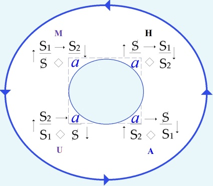

# Leçon 03 | 14 Janvier 1970

<!-- source-url: http://staferla.free.fr/S17/S17 L'ENVERS.docx -->
<!-- seminar: s17 -->
<!-- lesson: 03 -->

<!-- id: s17-03-0001 -->

   

<!-- id: s17-03-0002 -->

<!-- id: s17-03-0003 -->

On m’a mis de la craie rouge, fortement rouge.

<!-- id: s17-03-0004 -->

Du rouge sur du noir ça ne… \[*Rires*\], ça ne paraît pas évident que ce soit lisible.

<!-- id: s17-03-0005 -->

Je vais faire quelques lorgnettes, comme ça vous pourrez voir.

<!-- id: s17-03-0006 -->

En tous les cas ce ne sont pas des formules nouvelles, ce sont des formules que j’ai déjà écrites au tableau la dernière fois, ça ne semble pas avoir soulevé les mêmes protestations.

<!-- id: s17-03-0007 -->

Elles sont utiles à être là présentées, parce qu’aussi bien, si simples soient-elles et si simples à déduire l’une de l’autre, puisqu’il s’agit simplement d’une permu­tation circulaire, encore les choses restant dans le même ordre, eh bien il s’avère que nos capacités de représentation mentale ne sont pas telles qu’elles sup­pléent au fait que ce soit ou non écrit au tableau.

<!-- id: s17-03-0008 -->

Nous allons donc continuer, continuer ce que je fais ici depuis...

<!-- id: s17-03-0009 -->

ici ou ailleurs, enfin un « *ici* » qui est toujours au même temps, le mercredi à midi trente ...depuis dix-sept ans.

<!-- id: s17-03-0010 -->

Il vaut bien que je le réévoque, au moment où tout le monde se réjouit d’entrer dans une nouvelle décennie, ce serait, pour moi, plutôt l’occasion de me retourner vers ce que m’a donné la précédente.

<!-- id: s17-03-0011 -->

Il y a dix ans, deux de mes élèves présentaient quelque chose qui res­sortait des thèses lacaniennes sous le titre « *L’Inconscient, étude psychana­lytique »* [^3]*.*

<!-- id: s17-03-0012 -->

Cela se passait - mon Dieu - par ce qu’on peut appeler *le fait du prince*, le seul capable d’un acte libéral, étant entendu qu’un acte libéral ça veut dire un acte arbitraire, étant admis aussi que « arbitraire » ça veut dire com­mandé par aucune nécessité, en raison de ceci qu’aucune nécessité ne pressait sur ce point, ni dans un sens ni dans un autre, le prince...

<!-- id: s17-03-0013 -->

le prince, mon ami Henri Ey ...mit à l’ordre du jour à certain congrès - congrès de Bonneval - *L’Inconscient,* en en confiant le rapport, au moins pour une part, la rédaction de ce rapport, à deux de mes élèves.

<!-- id: s17-03-0014 -->

Depuis, ce travail fait foi en quelque sorte, et à la vérité, non sans raison, il fait bien foi de quelque chose : de la façon dont ceux-ci - mes élèves - ont pensé pouvoir atteindre, pouvoir faire entendre quelque chose au sein d’un groupe, qui s’était distingué par une sorte de consigne concernant ce que je pouvais avancer sur ce sujet intéressant, puis­qu’il s’agissait de rien de moins que « *L’inconscient* », que c’est de là qu’au départ mon enseignement a « *pris son vol* », disons...

<!-- id: s17-03-0015 -->

Eh bien, la réponse, l’intérêt pris par ce groupe à ce que j’énonçais, s’était manifesté par quelque chose, que quelque part récemment - je ne sais plus où... - dans une petite préface, je signalais comme un *interdit aux moins de 50 ans.*

<!-- id: s17-03-0016 -->

Nous étions en 60, ne l’oublions pas. Nous étions loin...

<!-- id: s17-03-0017 -->

sommes-nous plus près, c’est la question ...loin de toute contestation à proprement parler, d’une autorité*,* entre autres celle du savoir.

<!-- id: s17-03-0018 -->

De sorte que cet interdit - *interdit aux moins de 50 ans -* proféré, a quelque chose qui a de curieux caractères.

<!-- id: s17-03-0019 -->

En tous cas l’un d’entre eux le rendant comparable à une sorte de mono­pole de savoir, cet interdit fut observé, purement et simplement.

<!-- id: s17-03-0020 -->

C’est dire quel était le travail qui se proposait à ceux qui avaient bien voulu s’en charger : de devoir faire entendre quelque chose d’à proprement parler inouï aux oreilles en question.

<!-- id: s17-03-0021 -->

Le « *comment ils le firent* » est quelque chose dont après tout il n’est pas trop tard pour que je fasse le point, puisqu’aussi bien sur le moment il n’était pas question, pas question que je le fasse, pour la raison que c’était déjà beaucoup de voir entrer en jeu, pour des oreilles absolument non averties, qui n’avaient rien reçu du moindre de ce que j’avais pu articuler alors depuis sept ans, ce n’était évidemment pas le moment, vis-à-vis de ceux-là mêmes qui se livraient à ce travail de défrichage, d’y apporter *quoi que ce soit* qui pût sembler y trouver à redire.

<!-- id: s17-03-0022 -->

Aussi bien, d’ailleurs, y avait-il là beaucoup d’éléments excellents.

<!-- id: s17-03-0023 -->

Ce point donc, et à propos d’une... d’une *thèse* récente[^4], qui ma foi se produit quelque part à la frontière de l’*aire francophone*...

<!-- id: s17-03-0024 -->

et je dirais là où - pour en main­tenir les droits - on lutte vaillamment : à Louvain pour l’appeler par son nom ...on a fait une thèse, une thèse mon Dieu sur ce qu’on appelle peut-être improprement mon « *œuvre* ».

<!-- id: s17-03-0025 -->

Dans cette thèse bien sûr, qui est une thèse - ne l’oublions pas - universitaire, il faut bien avancer des choses qui prennent *forme universitaire*, et la moindre des choses qui apparaisse, est que mon œuvre s’y prête mal.

<!-- id: s17-03-0026 -->

C’est bien pourquoi il n’est pas défavorable à l’avancée d’un tel propos - de thèse universitaire – que soit situé ce qui déjà d’*universitaire* a pu contribuer à être le véhicule de la dite « *œuvre* », toujours entre guillemets.

<!-- id: s17-03-0027 -->

C’est bien pourquoi aussi l’un des auteurs de ce *Rapport de Bonneval* est là aussi mis en avant, et bien sûr d’une façon alors qu’à ce titre je ne peux manquer dans ma préface de marquer que le point, le point doit être fait de ce qui est éven­tuellement « *traduction* » de ce que j’énonce, et de ce que j’ai, à proprement parler, dit.

<!-- id: s17-03-0028 -->

Il est clair que cette petite préface que j’ai donnée à cette thèse qui va paraître à Bruxelles*...*

<!-- id: s17-03-0029 -->

puisque il est évident qu’une préface de moi lui... lui allège les ailes ...et bien, mon Dieu, dans cette préface je suis forcé par exemple de bien marquer \- c’est là sa seule utilité - que ce n’est pas la même chose

<!-- id: s17-03-0030 -->

- de dire que « *l’inconscient est la condition du langage »*,

<!-- id: s17-03-0031 -->

- ou de dire que « *le langage est la condition de l’inconscient »*.

<!-- id: s17-03-0032 -->

« *Le langage est la condition de l’inconscient* » c’est ce que je dis.

<!-- id: s17-03-0033 -->

De la façon dont, pour des raisons qui certes pourraient dans leur détail être tout à fait motivées du strict motif universitaire… et ceci certainement mènerait loin, nous mènera peut-être assez loin pour cette année …du strict motif universitaire, dis-je, découle que la personne qui me « *traduit* », d’être formée de ce style, de cette forme d’imposition du *dis­cours universitaire*, ne peut faire autre chose...

<!-- id: s17-03-0034 -->

qu’elle croie ou non me commenter ...que de renverser ma formule, c’est-à-dire de lui donner une portée - il faut bien le dire - strictement contraire, et à la vérité sans même aucune homologie, avec ce que j’avance.

<!-- id: s17-03-0035 -->

D’où assurément la difficulté, la difficulté propre à me traduire en langage universitaire, qui est aussi bien ce qui frappera tous ceux qui, à quelque titre que ce soit, et à la vérité, celle dont je parle qui était animée par ailleurs d’une immense bonne volonté.

<!-- id: s17-03-0036 -->

Cette thèse donc, qui va donc paraître à Bruxelles n’en garde pas moins tout son prix, son prix d’exemple en elle-même, son prix d’exemple aussi par ce qu’elle promeut, ce qu’elle promeut de la distorsion en quelque sorte obligatoire, d’une traduction en *discours universitaire* de ce qui est quelque chose ayant ses lois propres, ces lois - dont je dois le dire : il me faut les frayer - celles qui prétendent donner au moins les conditions d’un *discours* proprement *analytique*.

<!-- id: s17-03-0037 -->

Ceci étant, bien entendu, soumis au fait que tout de même, comme je vous l’ai souligné l’année dernière, le fait qu’ici je l’énonce du haut d’une tribune comporte en effet ce risque d’erreur, cet élément de réfraction qui fait que par quelque côté il tombe sous le coup du *discours universitaire*.

<!-- id: s17-03-0038 -->

Il y a là quelque chose qui ressortit d’une sorte de foncier porte-à-faux, celui qui fait que d’une certaine position, d’une position, *certes*, à laquelle, *certes*, je ne m’identifie nullement : je vous assure que chaque fois que je viens ici porter la parole, ça n’est certes pas de quoi que ce soit que *j’aie à vous dire* ou « *qu’est-ce que je vais leur dire cette fois là ?* » qu’il s’agit pour moi.

<!-- id: s17-03-0039 -->

Je n’ai à cet égard nul rôle à jouer, au sens où la fonction de celui qui enseigne est de l’ordre du rôle, de la place à tenir, et d’une certaine place de prestige, incontestablement.

<!-- id: s17-03-0040 -->

Ce n’est pas là ce que je vous demande, mais plutôt quelque chose qui est d’une *mise en ordre* que je m’impose, de devoir la soumettre à cette épreuve.

<!-- id: s17-03-0041 -->

D’une *mise en ordre* à laquelle sans doute, comme tout un chacun, j’échapperais si je n’avais pas, devant cette *mer d’oreilles* \[*Rires*\]...

<!-- id: s17-03-0042 -->

parmi lesquelles il en est peut-être bien une paire de critiques ...de devoir devant elles...

<!-- id: s17-03-0043 -->

avec cette redoutable possibilité ...rendre compte de ce qui est le cheminement de mes actions, au regard de ceci : *qu’il y a <u>du</u> psychanalyste*.

<!-- id: s17-03-0044 -->

Que c’est même la situation qui est la mienne, et que c’est une situation dont jusqu’à présent le statut n’a été réglé d’aucune façon qui lui convienne, si ce n’est à l’imitation, à la sem­blance, de nombreuses autres situations établies, et dans le cas, aboutissant à des pratiques frileuses de sélection :

<!-- id: s17-03-0045 -->

- à une certaine identification à une figure,

<!-- id: s17-03-0046 -->

- à une façon de se comporter, voire à un type humain dont rien ne semble rendre la forme obligatoire,

<!-- id: s17-03-0047 -->

- à un rituel encore, voire à quelques autres mesures que dans un meilleur temps, un temps ancien, j’ai com­parées à celles de l’« *auto-école* », sans provoquer d’ailleurs de quiconque aucune protestation, il y a eu même quelqu’un de très proche parmi mes élèves d’alors, qui m’a fait remarquer que c’était là, à la vérité, à proprement parler, ce qui était désiré par quiconque s’engageait dans la carrière analytique : recevoir, comme à l’« *auto-école* », le *permis de conduire*, selon des voies bien prévues et comportant le même type d’examen.

<!-- id: s17-03-0048 -->

Il est certes notable*...*

<!-- id: s17-03-0049 -->

je veux dire, digne d’être noté ...qu’après dix ans, cette position du psychanalyste j’arrive tout de même à l’articuler, à l’articuler d’une façon qui est celle que j’appelle son *« discours »*, disons *son discours* hypothétique, puisque aussi bien cette année c’est ce qui est proposé à votre « *examen* », à savoir de ce qu’il en est de la structure de ce *discours*.

<!-- id: s17-03-0050 -->

J’arrive à l’articuler de la façon suivante : qu’elle est faite, substantiellement, de *l’objet(a)* ...

<!-- id: s17-03-0051 -->

de *l’objet(a)* en tant qu’ici dans l’articulation que je donne de ce qui est *structure de discours*, *structure de discours* en tant qu’elle nous intéresse, disons : prise au niveau radical où elle a porté pour *le discours psychanalytique* ...elle est sub­stantiellement celle de *l’objet(a)* en tant que *cet objet(a) désigne précisé­ment ce qui des effets du discours*, se présente comme le plus opaque, et à la vérité depuis très longtemps méconnu, pourtant essentiel.

<!-- id: s17-03-0052 -->

Il s’agit de *l’effet de discours qui est effet de rejet*, effet de rejet dont je vais tout à l’heure essayer de *pointer la place et la fonction*.

<!-- id: s17-03-0053 -->

Voici donc ce qu’il est substantiellement, ce qu’il en est substantiellement de cette position du psycha­nalyste.

<!-- id: s17-03-0054 -->

*Et cet* *objet* se distingue d’une autre façon : de ceci qu’il *vient ici à la place d’où s’ordonne le discours*, parce que c’est de là que s’en émet, si je puis dire, « *la dominante* ».

<!-- id: s17-03-0055 -->

Vous sentez bien la réserve qu’il y a dans cet emploi : dire « *la dominante* » ça veut dire exactement ce dont finalement je désigne, pour les distinguer, chacune de *ces structures de discours*, les désignant différemment

<!-- id: s17-03-0056 -->

- de l’Universitaire,

<!-- id: s17-03-0057 -->

- du Maître,

<!-- id: s17-03-0058 -->

- de l’Hystérique,

<!-- id: s17-03-0059 -->

- et de l’Analyste par des posi­tions diverses de ces termes radicaux.

<!-- id: s17-03-0060 -->

   

<!-- id: s17-03-0061 -->

*Discours du Maître Discours de l’Hystérique Discours Universitaire Discours analytique*

<!-- id: s17-03-0062 -->

Disons que j’appelle « *dominante* », faute tout de suite de pouvoir donner à ce terme autre chose que ceci : que c’est ce qui me sert en quelque sorte à *les dénommer*.

<!-- id: s17-03-0063 -->

« *Dominante* » n’implique pas la dominance, au sens où cette dominance spécifierait - ce qui n’est pas sûr - *le discours du Maître*.

<!-- id: s17-03-0064 -->

<!-- id: s17-03-0065 -->

Disons que par exemple on peut donner des substances dif­férentes à cette *dominante* selon les discours, que si nous appelions par exemple *la dominante* du *discours du Maître* en ceci que **S1** en occupe la place, la *Loi,* nous ferions quelque chose qui a toute sa valeur suggestive, et qui ne manquerait pas de pouvoir ouvrir la porte à un certain nombre d’aperçus intéressants.

<!-- id: s17-03-0066 -->

Est-ce que la *Loi -* entendons *la Loi en tant qu’articulée -* cette *Loi* même dans les murs de laquelle nous recevons abri, et cette *Loi* qui constitue le droit et qui n’est certes pas quelque chose dont il doit être tenue que c’est là l’homonyme de ce qui peut s’énoncer ailleurs au titre de la justice.

<!-- id: s17-03-0067 -->

Et que certes l’ambiguïté, l’habillement que cette *Loi* reçoit de s’autoriser de la justice, est là très précisément un point dont *notre discours* peut, peut-être, faire mieux sentir où sont les vérita­bles ressorts :

<!-- id: s17-03-0068 -->

- j’entends ceux qui permettent l’ambiguïté,

<!-- id: s17-03-0069 -->

- j’entends ceux qui font que la loi reste quelque chose qui est d’abord et avant tout, inscrit dans la structure.

<!-- id: s17-03-0070 -->

Et qu’il n’y a pas trente-six façons de faire des lois, que la bonne intention, l’inspiration de la justice les animent ou pas, il y a peut-être des lois de structure qui font que la loi sera toujours la *Loi*, située à cette place que j’appelle « *dominante* » dans le *discours du Maître*.

<!-- id: s17-03-0071 -->

Au niveau du *discours de l’hystérique*, il est bien clair que cette *dominante*, nous la voyons apparaître sous la forme du *symptôme*, que c’est autour du *symptôme* que se situe, que s’ordonne ce qu’il en est du *discours* *de l’hysté­rique*.

<!-- id: s17-03-0072 -->

<!-- id: s17-03-0073 -->

Et certes c’est là occasion de nous apercevoir que si cette place est la même, c’est peut-être pour ça qu’à une lumière dont il ne suffit pas de dire que ce soit celle de l’époque pour en rendre raison, il se peut que cette *place dominante* soit en ce cas...

<!-- id: s17-03-0074 -->

> celle du *symptôme*, ou *quelque chose* de portée à nous faire questionner comme étant celle du *symptôme* ...la même place quand elle sert dans *un autre discours*. C’est bien en effet ce que nous voyons à notre époque : *la Loi mise en question comme symptôme*.

<!-- id: s17-03-0075 -->

J’ai dit tout à l’heure que cette même place, cette même *place dominante*, peut être occupée, quand il s’agit de l’analyste, en ce que l’analyste lui-même, ici de quelque façon a à repré­senter l’effet de rejet du discours, soit *l’objet(a)*.

<!-- id: s17-03-0076 -->

<!-- id: s17-03-0077 -->

Est-ce à dire qu’il nous sera aussi aisé de caractériser cette place, la place dite *domi­nante* quand il s’agit du *discours universitaire*, pour lui donner un autre nom, un nom qui de quelque façon nous permettrait cette sorte d’équivalence...

<!-- id: s17-03-0078 -->

que nous venons de poser comme existant au moins au niveau de la question ...cette sorte d’équivalence *entre la loi et le symptôme*, voire *le rejet* à l’occasion, en tant que dans *l’acte psychanalytique* c’est bien la place à quoi est destiné l’analyste ?

<!-- id: s17-03-0079 -->

<!-- id: s17-03-0080 -->

Eh bien justement, notre embarras à répondre sur ce qui fait *l’essence, la domi­nante, du discours universitaire* est là quelque chose qui doit nous avertir que notre recherche...

<!-- id: s17-03-0081 -->

> car ce que je trace devant vous, ce sont les voies mêmes autour desquelles,
>
> quand je m’interroge, vague, erre, ma pensée, avant de trouver les points sûrs ...c’est là qu’en quelque sorte l’idée pourrait nous venir de chercher ce qui, dans chacun de ces discours, pour désigner au moins une place, nous paraîtrait tout à fait sûr, aussi sûr que le *symptôme* quand il s’agit de *l’hystérique*.

# Est-ce que... 

<!-- id: s17-03-0082 -->

> puisque déjà je vous ai déjà laissé voir que dans *le discours du Maître,* le *(a)*,
>
> il est préci­sément identifiable au terme, à ce qu’enfin une pensée travailleuse - celle de Marx - a sorti, à savoir ce qu’il en était, symboliquement et réellement, de la fonction de *la plus-value* ...nous serions donc déjà en présence de deux termes, d’où il me resterait peut-être simplement à modifier légèrement, à donner une traduction plus aisée, à transposer des autres registres.

<!-- id: s17-03-0083 -->

La suggestion ici se forme, que puisqu’il y a en somme 4 *places* à caracté­riser, peut-être que chacune des 4 de ces permutations nous livrerait, au sein d’elle-même, celle qui est la plus saillante, disons à constituer un pas, dans un ordre de découverte qui n’est rien d’autre que celui qui s’appelle « *la structure »*.

<!-- id: s17-03-0084 -->

Eh bien une telle idée aura pour conséquence de vous faire toucher du doigt, de quelque façon que vous la mettiez à l’épreuve, ceci qui ne vous apparaît peut-être pas au premier abord, c’est à savoir : qu’essayez simplement...

<!-- id: s17-03-0085 -->

> indépendamment de toute cette fin que je vous suggérais pouvoir être celle qui nous intéresse ...essayez dans chacune... disons*,* appelons-les « *figures* » ...dans chacune de ces *figures,* de vous obliger simplement à ceci, que dans chacune *la place* définie en fonction du terme « *place »*... *en haut, en bas, à droite* ou *à gauche* *...*que dans chacune la place soit différente, eh bien vous n’arriverez pas à ce que...

<!-- id: s17-03-0086 -->

> quelle que soit la façon dont vous vous y preniez ...à ce qu’elles soient chacune occupées par une lettre différente.

<!-- id: s17-03-0087 -->

   

<!-- id: s17-03-0088 -->

Essayez, dans le sens contraire, de vous donner comme condition du jeu de choisir dans chacune de ces 4 formules une lettre différente, eh bien vous n’arriverez pas à ce que chacune de ces lettres occupe une place différente.

<!-- id: s17-03-0089 -->

Faites-en l’essai. C’est très aisé à réaliser sur un bout de papier, et aussi si on se sert de cette petite grille qui s’appelle une *matrice,* de voir tout de suite qu’avec un si faible nombre de combinaisons, le dessin exemplaire suffit immédiate­ment à illustrer la chose de façon parfaitement évidente.

<!-- id: s17-03-0090 -->

Mais si nous pensons qu’il y a là une certaine liaison signifiante, et qu’on peut poser comme tout à fait radicale, c’est là aussi occasion d’illustrer, de ce simple fait, ce que c’est que *la structure*.

<!-- id: s17-03-0091 -->

Qu’à poser d’une certaine façon *la formalisation du discours*...

<!-- id: s17-03-0092 -->

> et à l’intérieur de cette *formalisation*, de s’accorder à soi-même quelques règles destinées,
>
> cette *formalisation*, à la mettre à l’épreuve, ...se rencontre un tel élément d’*impossibilité* \[**◊**\].

<!-- id: s17-03-0093 -->

Voilà ce qui est...

<!-- id: s17-03-0094 -->

proprement à la base, à la racine ...ce qui est « *fait de structure »*, et dans la structure ce qui nous intéresse au niveau de l’expé­rience analytique.

<!-- id: s17-03-0095 -->

Ceci...

<!-- id: s17-03-0096 -->

pas du tout parce qu’ici nous sommes à un degré déjà élevé - au moins dans ses prétentions - élevé d’élaboration, ...ceci dès le départ, puisqu’aussi bien *si nous sommes à nous étreindre avec ce maniement du signi­fiant* et son articulation éventuelle, c’est bien qu’ il est dans les données de la psychanalyse.

<!-- id: s17-03-0097 -->

Je veux dire : dans ce qui, à un esprit aussi peu, je dirais « introduit » à cette sorte d’élaboration qu’a pu l’être un Freud...

<!-- id: s17-03-0098 -->

> étant donné la for­mation que nous lui connaissons, qui est une for­mation du type « *sciences para-physiques* » : physio­logie armée des premiers pas de la physique, et de la ther­modynamique spécialement ...si Freud est amené à suivre la veine, le fil de son expérience, à formuler, dans un temps qui pour être second dans son énonciation, n’en a que plus d’importance... puisqu’après tout, rien ne semblait l’imposer dans le pre­mier temps, celui de *l’articulation de l’inconscient* ...si Freud dans un second temps, celui donc où est pour lui acquis ceci, ceci que l’inconscient permet de situer *le désir*...

<!-- id: s17-03-0099 -->

> c’est là le sens du premier pas de Freud, déjà tout entier,
>
> non pas impliqué, mais proprement articulé, développé dans la *Traumdeutung* ...si dans ce second temps, celui qu’ouvre l’*Au-delà du principe du plaisir,*

<!-- id: s17-03-0100 -->

Freud articule que nous devons tenir compte de cette fonction qui s’appelle - qui s’appelle quoi ? *- la répétition*.

<!-- id: s17-03-0101 -->

*La répétition*, qu’est-ce que c’est ? Lisons son texte, voyons ce qu’il articule.

<!-- id: s17-03-0102 -->

Ce qui nécessite *la répétition, c’est la jouissance*, le terme est désigné en propre.

<!-- id: s17-03-0103 -->

C’est en tant qu’il y a *recherche de la jouissance* en tant que *répétition*,

<!-- id: s17-03-0104 -->

- que se produit ceci qui est en jeu dans ce pas, le franchisse­ment freudien,

<!-- id: s17-03-0105 -->

- que ce *quelque chose* qui nous intéresse en tant que *répétition*, et qui s’inscrit d’une dialectique de *la jouissance*, c’est proprement ce qui va contre la vie.

<!-- id: s17-03-0106 -->

C’est au niveau de la *répétition* que Freud se voit en quelque sorte contraint...

<!-- id: s17-03-0107 -->

et ceci de par même la structure du discours ...contraint d’articuler cette sorte d’hyperbole, d’extrapolation fabuleuse...

<!-- id: s17-03-0108 -->

et à la vérité qui reste scandaleuse pour quiconque prendrait au pied de la lettre *l’identification de l’inconscient et de l’instinct* ...va à articuler cet « *instinct de mort* » à savoir ceci : que *la répétition* n’est pas seulement fonction des cycles...

<!-- id: s17-03-0109 -->

> des cycles que la vie comporte, cycles du besoin et de la satisfac­tion... ...mais quelque chose d’autre qu’un cycle qui aussi bien emporte la dispari­tion de cette vie comme telle, le retour à l’inanimé : certainement point d’horizon, point idéal, point hors de l’épure, mais dont le sens, à l’analyse précisément structurale s’indique, s’indique parfaitement de ce qu’il en est de *la jouissance*.

<!-- id: s17-03-0110 -->

Si nous partons déjà *du principe du plaisir* pour savoir :

<!-- id: s17-03-0111 -->

- que ce *principe du plaisir* n’est rien que le principe de moindre tension, de la tension minimale à maintenir pour que la vie se maitienne, ce qui démontre qu’en soi-même, la jouissance le déborde, et que ce que le *principe du plaisir* maintient, c’est la limite quant à la jouis­sance,

<!-- id: s17-03-0112 -->

- que si la *répétition*...

<!-- id: s17-03-0113 -->

> comme tout nous l’indique dans les faits, l’expérience, la clinique ...si *la répétition est fondée sur un retour de la jouissance*, et que ce qui proprement à ce propos est dans Freud, et par Freud lui-même articulé, c’est à savoir que dans cette *répétition* même, c’est là, c’est là que se produit ce *quelque chose* qui est *« défaut », « échec »*.

<!-- id: s17-03-0114 -->

À savoir que, ici, en son temps j’ai pointé la parenté avec les énoncés de Kierkegaard [^5] : *ce qui se répète* ne saurait...

<!-- id: s17-03-0115 -->

au titre même de ceci qu’il *est* expressément et comme tel *répété*, *qu’il est marqué de la répétition* ...ne saurait être autre chose que ce qui...

<!-- id: s17-03-0116 -->

> par rapport à ce que cela répète ...*est en quelque sorte* « *en perte* », *en perte* de ce que vous voudrez, *en perte* de vitesse !

<!-- id: s17-03-0117 -->

*Il y a quelque chose qui est perte, et que sur cette perte, dès l’origine*, *dès l’articulation de ce que ici je résume*, *Freud insiste* : *que dans la répétition même, il y a déperdition de jouissance*. ’est là que prend origine dans le discours freudien la fonction de *l’objet perdu*. Cela c’est Freud.

<!-- id: s17-03-0118 -->

Ajoutons-y qu’il n’est pas tout de même besoin de rappeler que c’est expressément autour du *masochisme*, conçu seulement sous cette dimension de *la recherche de cette jouissance ruineuse*, que tourne tout le texte de Freud.

<!-- id: s17-03-0119 -->

Maintenant vient ici ce qu’apporte Lacan.

<!-- id: s17-03-0120 -->

Cette *répétition*, cette identification de *la jouissance*, et là j’emprunte...

<!-- id: s17-03-0121 -->

> j’emprunte pour lui donner un sens qui n’est pas pointé dans le texte de Freud ...la fonction du *trait unaire*,

<!-- id: s17-03-0122 -->

- c’est-à-dire de la forme la plus simple de *marque*,

<!-- id: s17-03-0123 -->

- c’est-à-dire ce qui est, à pro­prement parler, *l’origine du signifiant*.

<!-- id: s17-03-0124 -->

Et j’avance ceci qui n’est pas dans le texte de Freud, j’avance ceci qui n’est pas vu dans le texte de Freud...

<!-- id: s17-03-0125 -->

> et qui ne saurait d’aucune façon être écarté, évité, rejeté, par le psychanalyste ...c’est que *c’est du trait unaire que prend son origine tout ce qui nous intéresse, nous analystes, comme <u>savoir.</u>*

<!-- id: s17-03-0126 -->

Car la psychanalyse prend son départ d’un tournant qui est celui où *le savoir s’épure*, si je puis dire, *de tout ce qui peut faire* *ambi­guïté*,

<!-- id: s17-03-0127 -->

- être pris d’un savoir naturel,

<!-- id: s17-03-0128 -->

- de je ne sais quoi qui nous guiderait dans le monde qui nous entoure, à l’aide de je ne sais quelles papilles qui, en nous, sauraient de naissance s’y orienter.

<!-- id: s17-03-0129 -->

Non certes qu’il n’y ait rien de pareil.

<!-- id: s17-03-0130 -->

Et bien sûr, quand un savant psychologue écrit de nos jours...

<!-- id: s17-03-0131 -->

> enfin je veux dire, il n’y a pas si longtemps, 40 ou 50 ans ...quelque chose qui s’appelle « *La Sensation, guide de vie »* [^6]*,* il ne dit bien sûr, rien d’absurde, mais s’il peut l’énoncer ainsi, c’est juste­ment que toute l’évolution d’une science nous fait apercevoir *qu’il n’y a nulle connaturalité de cette « sensation »,* *à ce qui par elle, pénètre d’appréhension d’un prétendu* « *monde* ».

<!-- id: s17-03-0132 -->

Si l’élaboration proprement scien­tifique, l’interrogation des sens de la vue, voire de l’ouïe, nous démon­trent quelque chose, ce n’est rien, sinon *quelque chose* que nous devons recevoir tel qu’il est, avec exactement le coefficient de facticité sous lequel il se présente :

<!-- id: s17-03-0133 -->

- que parmi les vibrations lumineuses, il y ait un *ultraviolet* dont nous n’ayons aucune perception - et pourquoi n’en aurions-nous pas ? - à l’autre bout, l’*infrarouge*, c’est la même chose,

<!-- id: s17-03-0134 -->

- et qu’il en est de même pour l’oreille : qu’il y a des sons que nous cessons d’entendre, et qu’on ne voit pas beaucoup pourquoi cela s’arrête là plutôt que plus loin.

<!-- id: s17-03-0135 -->

- Et qu’à la vérité, rien d’autre n’est saisissable précisément d’être éclairé d’une certaine façon, que ceci : qu’il y a après tout des filtres, et qu’avec ces filtres on se débrouille. Si on croit que la fonction crée l’organe, c’est bien l’organe dont on se sert comme on peut !

<!-- id: s17-03-0136 -->

Il n’y a rien de commun entre *ce quelque chose* sur quoi a voulu construire et raisonner, quant aux mécanismes de la pensée, toute une philosophie traditionnelle, qui s’est efforcée d’édifier par les voies que vous savez...

<!-- id: s17-03-0137 -->

> le compte rendu de ce qui se fait au niveau de l’abstraction, de la généralisation ...cette chose qui s’édifie sur *une sorte de réduction*, *de passage au filtre*, ce qu’il en est d’une « *sensation* » consi­dérée comme basale : « *Nihil fuerit in intellectu quod non prius...* »[^7] etc., vous savez la suite : « ...*in sensu* ».

<!-- id: s17-03-0138 -->

Est-ce que c’est ce sujet-là...

<!-- id: s17-03-0139 -->

> ce sujet *déductible* au titre de *sujet de la connaissance*, ce sujet *construc­tible* d’une façon qui nous paraît maintenant si *artificielle*, à partir de bases, qui sont bien en effet des bases d’appareils,
>
> d’organes vitaux dont on voit mal en effet ce que nous pourrions faire à nous en passer ...est-ce que c’est cela dont il s’agit, quand il s’agit de cette arti­culation signifiante, celle dont les pre­miers termes d’épellation, qui sont ceux que nous tentons ici, peuvent commencer de jouer des termes les plus élémentaires, ceux qui nouent - comme je l’ai dit - un signifiant à un autre signifiant, et qui déjà portent *effet*, *effet* déjà en ceci que, il n’est maniable ce signifiant, dans sa définition, qu’à ceci : que ça ait *un sens*, qu’il représente pour un autre signifiant *un sujet*, un sujet et rien d’autre.

<!-- id: s17-03-0140 -->

*Il n’y a pas moyen d’échapper à cette formule extraordinairement réduite* : *qu’il y a* *quelque chose dessous* \[ὑποχείμενον : upokeimenon, *sub-jectum* \], mais justement que nous ne pou­vons pas désigner d’aucun terme de « *quelque chose* » : ça ne saurait être un « *etwas* » \[*quelque chose*\]*,* c’est simplement un *en dessous*, si vous voulez, un sujet, un ὑποχείμενον \[upokeimenon\], ceci que même à une pensée aussi investie de la contemplation des exigences...

<!-- id: s17-03-0141 -->

celles-là primaires, non pas du tout construites ...de l’idée de connais­sance, que celle d’Aristote, la seule approche de la logique, le seul fait qu’il l’ait introduite dans le circuit du *savoir*, *lui impose de dis­tinguer sévèrement* ὑποχείμενον \[upokeimenon\] *de toute* οὐσἰα \[oussia\] *en soi-même*, *de quoi que ce soit qui soit essence*.

<!-- id: s17-03-0142 -->

Le signifiant donc s’articule de *représenter un sujet auprès d’un autre signifiant*.

<!-- id: s17-03-0143 -->

C’est de là que nous partons pour donner sens à cette répétition inaugurale en tant qu’elle est *répétition visant à jouissance.*

<!-- id: s17-03-0144 -->

Ce qui nous permet de concevoir ceci : que si le savoir à un certain niveau, est dominé, articulé de nécessités pure­ment formelles, des nécessités de l’écriture...

<!-- id: s17-03-0145 -->

ce qui aboutit de nos jours à un certain type de logique, qui est en soi maniement - et avant tout - maniement de l’écriture ...que si ce savoir auquel nous pouvons donner le support d’une expérience qui est celle de la logique moderne, que ce type de savoir c’est celui-là qui est en jeu quand il s’agit de mesurer dans la clinique analytique l’incidence de *la répétition*.

<!-- id: s17-03-0146 -->

En d’autres termes, le savoir qui nous paraît le plus *épuré*...

<!-- id: s17-03-0147 -->

encore qu’il soit bien clair que nous ne pouvions le tirer d’aucune façon de l’empirisme par épuration ...c’est ce même savoir qui se trouve être dès l’origine introduit, qui montre sa racine en ceci : *que dans la répétition, et sous la forme du trait unaire* pour commencer, *ce savoir se trouve être le moyen de la jouissance,* de *la jouissance* précisément en tant qu’elle dépasse les limites imposées sous le terme de *plaisir*, aux tensions usuelles de la vie.

<!-- id: s17-03-0148 -->

*Et c’est ici que* - pour continuer de suivre Lacan - ce qui apparaît de ce formalisme \[*formalisation « algèbique » par la lettre* : (*a*) \], si nous avons dit tout à l’heure *qu’il y a perte de jouis­sance*, *que c’est à la place*

<!-- id: s17-03-0149 -->

- *de cette perte,*

<!-- id: s17-03-0150 -->

- *de ce quelque chose qu’introduit la répétition,* *que nous voyons surgir la fonction de l’objet perdu, de ce que j’appelle le* (*a*).

<!-- id: s17-03-0151 -->

Eh bien, qu’est-ce que ça nous impose, sinon cette formule que *le savoir, travail­lant au niveau le plus élémentaire*...

<!-- id: s17-03-0152 -->

*au niveau* de cette imposition *du trait unaire,* ...eh bien *le savoir, travail­lant, produit*...

<!-- id: s17-03-0153 -->

ça ne va pas être beaucoup pour nous surprendre ...*produit*, disons *une entropie*, ce qui entre nous s’écrit *e,n,t,r,o,* \[*Rires*\], parce que vous pourriez aussi écrire *a,n,t,h,r,o,* ce serait d’ailleurs un joli jeu de mots.

<!-- id: s17-03-0154 -->

C’est pas pour nous étonner, parce que figurez vous quand même, *que l’énergétique* ça n’est absolument pas autre chose...

<!-- id: s17-03-0155 -->

> quoi qu’en croient les cœurs ingénus d’ingénieurs \[*Rires*\] ...*ça n’est absolument pas autre chose que le placage sur le monde, du réseau des signifiants*.

<!-- id: s17-03-0156 -->

Je vous défie de prouver d’aucune façon...

<!-- id: s17-03-0157 -->

> en tous cas mettez-vous y à l’ouvrage et vous verrez, vous aurez la preuve du contraire ...que c’est absolument la même chose de descendre un poids de 80 kilos sur votre dos, de 500 mètres, et une fois que vous l’aurez remonté des 500 mètres suivants, qu’il y a eu zéro, aucun travail. \[*Rires*\] Faites l’essai !

<!-- id: s17-03-0158 -->

Mais enfin si vous plaquez là-dessus les signifiants, c’est-à-dire si vous entrez dans la voie de l’*énergétique,* il est absolument certain qu’il n’y a eu aucun travail.

<!-- id: s17-03-0159 -->

Bon, alors nous n’avons donc pas à être surpris de voir quelque chose apparaître...

<!-- id: s17-03-0160 -->

*quand le signifiant s’introduit comme appareil de la jouissance* *...*de voir apparaître quelque chose qui a rap­port avec l’entropie, puisque là où on a défini *l’entropie* c’est quand on a commencé par plaquer sur le monde physique cet appareil de signifiants.

<!-- id: s17-03-0161 -->

Et ne croyez pas que je plaisante !

<!-- id: s17-03-0162 -->

Parce que quand vous... quand vous construisez une usine, n’importe où, naturellement vous en recueillez de l’énergie, même vous pouvez en accumuler. Eh bien c’est quand une usine, et les appareils tout au moins qui sont mis en jeu pour que fonctionnent ces sortes de turbines jusqu’à ce qu’on puisse mettre l’énergie en pot, c’est bien parce que ces appareils sont fabriqués avec *cette même logique* dont je suis en train de parler, *à savoir* *la fonction du signifiant*.

<!-- id: s17-03-0163 -->

De nos jours, une machine ça n’a rien à faire avec un outil, il n’y a aucune généalogie de la pelle à la turbine, et la preuve c’est que vous pouvez très légitimement appeler machine un petit dessin que vous faites sur ce papier.

<!-- id: s17-03-0164 -->

Il suffit d’un rien, il suffit simplement que vous ayez une encre qui sera *conductrice* pour que ce soit une très très efficace machine.

<!-- id: s17-03-0165 -->

Et pourquoi ne serait-elle pas conductrice, puisque *la marque* \[*le trait*\] *est déjà en soi-même conductrice de volupté* ?

<!-- id: s17-03-0166 -->

S’il y a quelque chose que nous apprend l’expérience analytique sur ce monde du fantasme...

<!-- id: s17-03-0167 -->

> dont à la vérité, s’il ne semble pas qu’*on* l’ait... plutôt que *l’analyse l’ait* *abordé* ...c’est bien qu’on ne savait absolument pas comment s’en dépêtrer, sinon selon le recours à la « *bizarrerie* », à l’« *anomalie* », d’où partent ces termes, ces épinglages de noms propres, qui nous font appeler « *masochisme »* ceci, « *sadisme »* cela.

<!-- id: s17-03-0168 -->

Nous sommes au niveau de la zoologie quand nous mettons ces « *ismes* » \[*i.e. nominalisme*\].

<!-- id: s17-03-0169 -->

Mais enfin, il y a tout de même quelque chose de tout à fait radical, *c’est l’association*...

<!-- id: s17-03-0170 -->

> dans ce qui est à la base, à la racine même du fantasme \[*cf. Freud* : « *un enfant est battu »*\] ...*de cette « gloire »* - si je puis m’exprimer ainsi - *« de la marque », de la marque sur la peau*, *où s’inspire dans ce fantasme, ceci qui n’est rien d’autre qu’un sujet qui s’identifie comme étant « objet de jouissance »*.

<!-- id: s17-03-0171 -->

Le mot de « *jouissance »* dans cette pratique érotique qui est celle que j’évoque...

<!-- id: s17-03-0172 -->

la flagellation pour l’appeler par son nom, et puis au cas où où il y aurait ici des archi-sourds ...le fait que *le jouir* prend ici l’ambiguïté même par quoi *c’est à son niveau* - à son niveau et à nul autre - *que se touche l’équivalence du geste qui marque, et du corps.*

<!-- id: s17-03-0173 -->

*« Objet de jouissance »* de qui ?

<!-- id: s17-03-0174 -->

*De celle qui porte* ce que j’ai appelé *« la gloire de la marque » ?*

<!-- id: s17-03-0175 -->

Est-il sûr que cela veuille dire « *jouissance de l’Autre* » ?

<!-- id: s17-03-0176 -->

Certes, c’est par là, c’est une des voies d’entrée de l’Autre dans son monde, et assurément, elle, non réfutable.

<!-- id: s17-03-0177 -->

Mais *l’affinité de la marque avec la jouissance du corps même*, *c’est là* précisément *où s’indique que c’est seulement de la jouissance*, et nullement d’autres voies, *que s’établit la division dont se distingue* *le narcissisme de la relation à l’objet.*

<!-- id: s17-03-0178 -->

La chose n’est pas ambiguë, c’est au niveau de l’*« Au-delà du principe du plaisir »* que Freud marque avec force que *ce qui fait*, au dernier terme, *le vrai soutien, la consistance de l’image spéculaire de l’appareil du moi*, *c’est qu’il est soutenu à l’intérieur, il ne fait qu’habiller cet objet perdu qui est ce par quoi s’introduit, dans la dimension de l’être du sujet*, *ce par quoi s’introduit la jouissance.*

<!-- id: s17-03-0179 -->

Car il est clair que si la jouissance est interdite, ce n’est que d’un premier hasard, d’une éventualité, d’un accident, que la jouissance entre en jeu. L’être vivant qui tourne, qui tourne normalement, *ronronne* dans le plaisir.

<!-- id: s17-03-0180 -->

Si *la jouissance est remarquable*, et *si elle s’entérine d’avoir cette sanction* *du trait unaire*, de *la répétition*, *de ce qui l’institue dès lors comme marque*, si ceci se produit, ce ne peut être que d’un très faible écart dans le sens de *la jouissance* que cela s’origine.

<!-- id: s17-03-0181 -->

Ces écarts, après tout, ne sont jamais extrêmes, même dans les pratiques que j’évoquais tout à l’heure \[*flagellation*\].

<!-- id: s17-03-0182 -->

Ce dont il s’agit *ce n’est pas d’une transgression, d’une irruption dans un champ interdit* de par les rodages des appareils vitaux régulateurs, c’est qu’en fait, *c’est seulement dans cet effet d’entropie, dans cette déperdition, que la jouissance prend statut*, qu’elle s’indique, et c’est pour cela que je l’ai introduite d’abord du terme de « *Mehrlust »*, de « *plus-de- jouir »*.

<!-- id: s17-03-0183 -->

C’est justement d’être aperçu dans la dimension de la perte que quelque chose se nécessite à com­penser si je puis dire, ce qui est d’abord *nombre négatif* sur ce *je ne sais quoi* qui est venu frapper, résonner sur les parois de la cloche, qui a fait *jouissance*, et *jouissance à répéter*.

<!-- id: s17-03-0184 -->

C’est seulement cette dimension de l’entropie qui fait *prendre corps* à ceci, qu’il y a un *plus-de-jouir* à récupérer.

<!-- id: s17-03-0185 -->

# C’est là la dimension dont se nécessite que *le travail, le savoir travaillant*, et comme tel, en tant que, qu’il le sache ou pas, il relève 

# premièrement du *trait unaire*, 

# et à sa suite, de tout ce qui va pouvoir s’articuler de signifiant. 

# C’est à partir de là que cette dimension de *la jouissance,* si ambiguë chez *l’être parlant*, peut aussi bien théoriser, 

# faire religion de vivre dans l’apathie... 

# car l’apathie c’est l’hédonisme

# ...il peut aussi bien faire religion de cela, et pourtant chacun sait que la masse même... 

# *« Massenpsychologie »* intitule un de ses écrits Freud, à la même époque

# ...dans sa masse même, ce qui l’anime, ce qui le travaille, ce qui le fait d’un autre ordre de savoir que ces savoirs harmonisants 

# qui lient l’*Innenwelt* à l’*Umwelt,* c’est *la fonction du* « *plus-de- jouir »* comme tel. C’est là le creux, la béance que sans doute et d’abord viennent remplir un certain nombre d’« *objets *» qui sont en quelque sorte par avance adaptés, faits pour servir de « *bouchon* » \[*à* *i’a*\]. 

<!-- id: s17-03-0186 -->

<!-- id: s17-03-0187 -->

C’est là sans doute que toute pratique analy­tique classique s’arrête, à mettre en valeur ces noms, ces termes divers, *oral*, *anal*, *scopique*, voire *vocal*, ces noms divers dont nous pouvons dési­gner comme « *objet »* ce qu’il en est du *(a)*.

<!-- id: s17-03-0188 -->

Mais le *(a)* est proprement ceci...

<!-- id: s17-03-0189 -->

qui découle de ce que le savoir *se présente d’abord* et dans son origine, un certain savoir, *se réduit* à l’articulation signifiante.

<!-- id: s17-03-0190 -->

...ce savoir est moyen de jouissance, et je le répète, quand il travaille ce qu’il produit c’est de *l’entropie*, *et cette entropie c’est le seul point*, le seul point régulier, *ce point de perte, par où nous ayons accès à ce qu’il en est de la jouissance.*

<!-- id: s17-03-0191 -->

En ceci se traduit, se boucle et se motive, ce qu’il en est de l’incidence du signifiant dans la destinée de l’être parlant.

<!-- id: s17-03-0192 -->

Ça a peu affaire avec sa parole, ça a affaire avec la *structure*, laquelle s’appareille du fait que l’être *humain*...

<!-- id: s17-03-0193 -->

> qu’on appelle ainsi sans doute parce qu’il n’est que l’*humus* du langage \[*Rires*\] \[*cf. discours* H,U,M,A\] ...n’a qu’à *s’apparoler* à cet appareil-là.

<!-- id: s17-03-0194 -->

Avec quelque chose d’aussi simple que mes 4 petits signes, j’ai pu vous faire toucher tout à l’heure qu’ il suffit que ce *trait unaire* nous lui donnions compagnie, compagnie d’un autre trait, **S2** après **S1**, pour que nous puissions situer de ce signifiant aussi licite :

<!-- id: s17-03-0195 -->

- ce qu’il en est de son *sens* d’une part,

<!-- id: s17-03-0196 -->

- de son insertion dans *la jouissance de l’Autre*, de ce par quoi il est le moyen de la jouissance.

<!-- id: s17-03-0197 -->

À partir de là commence le travail : c’est avec *le savoir* en tant que *moyen de la jouissance* que se produit ce travail qui a *un sens, un sens obscur* qui est celui de *la vérité*.

<!-- id: s17-03-0198 -->

Sans doute, si déjà ces termes n’avaient pas été par moi abordés sous divers jours qui les éclairent, je n’aurais certainement pas l’audace de les introduire ainsi, mais un travail a été fait, déjà considérable : que quand je vous parle du *savoir* comme ayant son lieu premier dans le *discours du Maître* au niveau de l’esclave, qui, sinon Hegel, nous a montré que *le travail de l’esclave*, ce qu’il *va nous livrer*, c’est *la vérité du Maître*, sans doute *celle qui le réfute* ?

<!-- id: s17-03-0199 -->

À vrai dire, nous sommes en état peut-être de pouvoir avancer d’autres formes ou schéma de dis­cours, d’apercevoir où bée, où reste béante, clôturée d’une façon forcée, la construction hégélienne.

<!-- id: s17-03-0200 -->

Assurément s’il a quelque chose que toute notre approche délimite...

<!-- id: s17-03-0201 -->

> et assu­rément elle a été par l’expérience analytique renouvelée ...c’est que nulle évocation de *la vérité* ne peut se faire qu’à indiquer qu’elle ne nous est accessible que d’un *mi-dire*, *qu’elle ne peut se dire tout entière, pour la raison qu’au-delà de sa moitié il n’y a rien à dire*.

<!-- id: s17-03-0202 -->

Tout ce qui peut se dire est cela, et par conséquent, ici le discours s’abolit.

<!-- id: s17-03-0203 -->

On ne parle pas de l’*indi­cible*, quelque plaisir que cela semble faire à certains.

<!-- id: s17-03-0204 -->

Il n’en reste pas moins que ce nœud du *mi-dire*...

<!-- id: s17-03-0205 -->

- que j’ai la der­nière fois illustré, d’indiquer comment il faut en accentuer ce qu’il en est propre­ment de l’interprétation,

<!-- id: s17-03-0206 -->

- que j’ai articulé de « *l’énonciation* *sans énoncé »* ou « *l’énoncé, avec réserve de l’énonciation »*,

<!-- id: s17-03-0207 -->

- dont j’ai indiqué que c’était là les points d’axe, les points de balance, les axes de gravité propres de l’interpréta­tion, ...est quelque chose dont notre avancée doit profondément renouveler ce qu’il en est de *la vérité*.

<!-- id: s17-03-0208 -->

*L’amour de la vérité* est ce quelque chose qui se cause de ce *manque à être* *de* *la vérité*, ce *manque à être* que nous pouvons aussi appeler autrement : *ce manque d’oubli*.

<!-- id: s17-03-0209 -->

Ce qui se rappelle à nous dans *les forma­tions de l’inconscient,* ce n’est rien qui soit de l’ordre de *l’être,* d’un *être* plein d’aucune façon*.*

<!-- id: s17-03-0210 -->

- Qu’est-ce c’est que ce « *désir indestructible* » dont parle Freud pour conclure les dernières lignes de sa *Traumdeutung ?*

<!-- id: s17-03-0211 -->

- Qu’est-ce que c’est que ce désir que rien ne peut changer, ni fléchir, quand tout change ?

<!-- id: s17-03-0212 -->

*Ce manque d’oubli c’est la même chose que le manque à être, car être ce n’est rien d’autre que d’oublier.* \[*cf*. « *L’étourdit* » : « *Qu’on dise reste oublié*... »\]

<!-- id: s17-03-0213 -->

Cet *amour de la vérité*, c’est cet *amour de cette faiblesse*, cette faiblesse dont nous avons su levé le voile, et ceci que *la vérité* cache et qui s’appelle *la castration*.

<!-- id: s17-03-0214 -->

Je ne devrais pas avoir besoin de ces rappels, \[*Rires*\] qui sont en quelque sorte tellement livresques.

<!-- id: s17-03-0215 -->

Il semble que chez les analystes, et particulière­ment chez eux, au nom de ces quelques mots *tabou* dont on bar­bouille *son discours*, ce soit justement là qu’on s’aperçoive jamais de ce que c’est que *la vérité* : l’impuissance, et que c’est là-dessus que s’édifie tout ce qu’il en est de *la vérité*.

<!-- id: s17-03-0216 -->

Qu’il y ait *amour de la faiblesse,* sans doute est-ce là l’essence de l’amour, et comme je l’ai dit : *l’amour c’est bien donner ce qu’on n’a pas, à savoir ce qui pourrait réparer cette faiblesse originelle.*

<!-- id: s17-03-0217 -->

Et du même coup se conçoit, s’entrouvre ce rôle...

<!-- id: s17-03-0218 -->

> je ne sais si je dois l’appeler plus « *mystique* » ou « *mystificateur* » ...qui a été donné de tout temps, dans une certaine veine, à l’amour même.

<!-- id: s17-03-0219 -->

Car cet « *amour universel »,* comme on dit...

<!-- id: s17-03-0220 -->

> dont on nous brandit le chiffon pour nous calmer ...cet « *amour universel »,* c’est précisément ce dont nous faisons *voile*, voire *obstruction*, à ce qui est *la vérité*.

<!-- id: s17-03-0221 -->

Ce qui est demandé au psychanalyste...

<!-- id: s17-03-0222 -->

> je l’ai indiqué déjà la dernière fois dans mon discours ...ce n’est certes pas ce qui ressortit à ce *sujet supposé savoir*, dont à m’entendre comme on le fait d’ordinaire, un tout petit peu à côté*,* j’ai cru pouvoir fonder *le transfert*.

<!-- id: s17-03-0223 -->

J’ai souvent insisté sur ceci, que nous sommes *supposés savoir* pas grand-chose.

<!-- id: s17-03-0224 -->

Ce que l’analyste dresse, ce que l’analyse instaure, institue c’est ceci, qui est tout le contraire, c’est que l’analyste dit à celui qui va commencer : « *Allez-y, dites n’importe quoi, ce sera merveilleux* »*.* \[*Rires*\]

<!-- id: s17-03-0225 -->

C’est lui qui est institué comme *sujet supposé savoir*, et après tout ce n’est pas tellement de mauvaise foi, parce que dans le cas présent, il ne peut pas se fier à quelqu’un d’autre. \[*Rires*\]

<!-- id: s17-03-0226 -->

Et le trans­fert se fonde sur ceci, qu’il y a un type qui, à moi - pauvre con ! – à moi, me dit de me comporter comme si je savais de quoi il s’agissait.

<!-- id: s17-03-0227 -->

Il peut dire n’importe quoi, ça donnera toujours quelque chose.

<!-- id: s17-03-0228 -->

Il y a de quoi causer le transfert.\[*Rires*\] Ça n’arrive pas tous les jours.

<!-- id: s17-03-0229 -->

Ce qui définit l’analyste, c’est comme je l’ai dit, je l’ai toujours dit depuis toujours...

<!-- id: s17-03-0230 -->

simplement personne n’a jamais rien compris, \[*Rires*\] et puis en plus, c’est naturel, c’est pas ma faute ...j’ai dit depuis toujours :* « l’analyse, c’est ce qu’on attend d’un psychanalyste ».*

<!-- id: s17-03-0231 -->

« *Ce qu’on attend d’un psychanalyste* »*…*

<!-- id: s17-03-0232 -->

> il faudrait évi­demment essayer de comprendre ce que ça veut dire, c’est tellement là comme ça,
>
> à portée de la main. J’ai tout de même le sentiment... c’est le travail... le *plus-de-jouir*, c’est pour vous …« *Ce qu’on attend d’un psychanalyste » c’est* - c’est comme je l’ai dit la dernière fois - *de faire fonctionner son savoir en terme de vérité.*

<!-- id: s17-03-0233 -->

C’est bien pour cela qu’il se confine à un *mi-dire*, comme je le disais la dernière fois, et comme j’aurai à y revenir, parce que ça a des conséquences. C’est à lui que s’adresse - et seulement à lui - cette formule que j’ai si souvent commentée du : « *Wo es* *war, soll Ich werden*. »

<!-- id: s17-03-0234 -->

<!-- id: s17-03-0235 -->

Si l’analyste peut occuper cette place en haut à gauche qui détermine son discours, c’est justement de n’être absolument pas là pour lui-même.

<!-- id: s17-03-0236 -->

« *Là où c’était* - le plus de jouir, le jouir de l’Autre *-* *c’est là que moi* - en tant que je profère l’acte psychanalytique - *je dois venir* ».

## Notes

[^3]: Jean Laplanche, Serge Leclaire : « *L’Inconscient, une étude psychana­lytique* » in *Les Temps Modernes*, Juillet 1961, pp. 81-129

    (Rapport aux journées de Bonneval de 1960), paru en 1966 dans « *L’Inconscient* » (6ème colloque de Bonneval), Paris, Desclée de Brouwer.

[^4]: Anika Lemaire : *Une étude de l’œuvre de Jacques Lacan* soutenue à l’université de Louvain. Éditée sous le titre « *Jacques Lacan* » aux éd. Charles Dessart , 1970,

    puis aux éd. Pierre Mardaga, Bruxelles, 1977, (8ème édition 1997). Préface de Jacques Lacan.

[^5]: Søren Kierkegaard : « *La répétition* », in *Œuvres complètes*, Vol. 5, (traduction Tisseau) pp. 3-96 Paris, éd. de l’Orante, 1972 .

    Søren Kierkegaard : « *La reprise* », pp. 691-767, éd. Robert Laffont (traduction Tisseau modifiée), Coll. Bouquins, 1993.

    Søren Kierkegaard : « *La reprise* », éd. Flammarion , (nouvelle traduction de Nelly Viallaneix) Coll. GF n° 512, 1990.

[^6]: Henri Piéron : « *La sensation guide de vie* », Gallimard, 1945.

[^7]: « *N*ihil *est in intellectu* quod *non prius fuerit in sensu* » : *Il n’est rien dans la pensée qui n’ait d’abord été dans les sens* (attribué à Aristote, défendu par Thomas d’Aquin,

    repris par Locke...).
