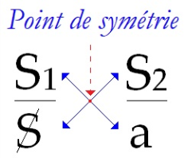
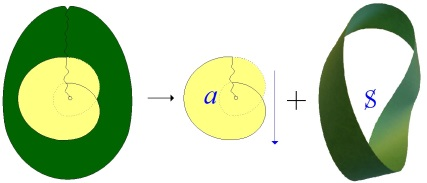
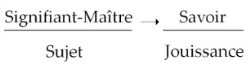

# Leçon 06 | 18 Février 1970

<!-- source-url: http://staferla.free.fr/S17/S17 L'ENVERS.docx -->
<!-- seminar: s17 -->
<!-- lesson: 06 -->

<!-- id: s17-06-0001 -->

Voilà, alors il doit commencer à vous apparaître que « *l’envers de la psychanalyse »* c’est cela même que j’avance cette année sous le titre du *discours du Maître*, bien sûr non pas d’une façon arbitraire, ce *discours du Maître* ayant déjà dans la tradition philosophique, ce que j’appellerai, enfin... ses lettres de crédit.

<!-- id: s17-06-0002 -->

Néanmoins le *discours du Maître* tel que j’essaie de le dégager, prend ici *un accent* de ce fait qu’on peut dire qu’à notre époque, il arrive à pouvoir être dégagé dans une sorte de pureté, par quelque chose que nous éprouvons directement et au niveau de *la politique*.

<!-- id: s17-06-0003 -->

Ce que je veux dire par là, c’est qu’il enserre tout, même ce qui se croit « *révolution* ».

<!-- id: s17-06-0004 -->

Plus exactement, par ce qu’on appelle romantiquement « *Révolution* » avec un grand R, *le discours du Maître accomplit sa révolution*, dans l’autre sens de « *tour qui se boucle* ».

<!-- id: s17-06-0005 -->

<!-- id: s17-06-0006 -->

À l’horizon de cette mise en valeur...

<!-- id: s17-06-0007 -->

> un peu aphoristique, j’en conviens, mais qui est faite - comme l’aphorisme s’y destine -
>
> qui est faite pour éclairer d’un *flash* simple ...à l’horizon de ceci, il y a ceci qui nous intéresse, je veux dire vous et moi, il y a que ce *discours du Maître* n’a qu’un contrepoint : le *dis­cours analytique*, encore si inapproprié.

<!-- id: s17-06-0008 -->

Je l’appelle « *contrepoint »* en ceci que sa symétrie...

<!-- id: s17-06-0009 -->

> s’il en existe une, et elle existe ...*sa symétrie* n’est pas par rapport à une ligne, ni par rapport à un plan, mais *par rapport à un point*.

<!-- id: s17-06-0010 -->

<!-- id: s17-06-0011 -->

En d’autres termes, il est obtenu par quelque chose qui est *le bou­clage de ce* *discours du Maître* auquel je faisais à l’instant référence.

<!-- id: s17-06-0012 -->

En d’autres termes ce que je n’ai pas pu...

<!-- id: s17-06-0013 -->

parce que ça commence à me fatiguer ...réécrire au tableau, à savoir la disposition des S : barré \[S\], numérotés\[S1, S2\], et du *a*, telle que je l’ai réinscrit la dernière fois et dont j’espère que tous, plus ou moins, vous avez encore la transcription sur vos papiers, cette inscription que je n’ai pas eu le temps de faire, partant du fait que je ne peux pas faire toutes les choses, eh bien elle montre assez cette *symétrie par rapport à un point*, qui fait que ce *discours psychanalytique* se trouve très précisément au pôle opposé du *discours du Maître*. Voilà.

<!-- id: s17-06-0014 -->

 ↔ 

<!-- id: s17-06-0015 -->

> *Discours du Maître Discours analytique*

<!-- id: s17-06-0016 -->

Quant au *discours psychanalytique*, il nous arrive de voir certains termes qui servent de *phylum* dans l’explication, celui du père par exemple.

<!-- id: s17-06-0017 -->

Il nous arrive de voir quelqu’un tenter d’en rassembler les principales don­nées.

<!-- id: s17-06-0018 -->

C’est un exercice pénible, pénible quand il est fait à l’intérieur de ce qu’on attend, au point où nous en sommes, d’un énoncé et d’une énonciation psycha­nalytiques, c’est à savoir, d’une référence génétique.

<!-- id: s17-06-0019 -->

On se croit obligé, à propos du père, de partir de l’enfance, des identifi­cations, et alors c’est vraiment quelque chose qui peut aller à un extraor­dinaire bafouillage, à une contradiction étrange.

<!-- id: s17-06-0020 -->

On nous parlera d’*iden­tification primaire* comme étant celle qui lie l’enfant à sa mère, ça semble en effet aller de soi.

<!-- id: s17-06-0021 -->

Il est bien curieux que si nous nous reportons à Freud, au discours de 1921 celui qui s’appelle *Psychologie des masses et analyse du moi* c’est très précisément à l’identification au père que nous nous reporterons comme pri­maire.

<!-- id: s17-06-0022 -->

*Et c’est assurément bien étrange*.

<!-- id: s17-06-0023 -->

*C’est bien étrange* en effet de voir qu’en somme ce que Freud pointe là, c’est que tout à fait primordialement le père s’avère être celui qui préside à la toute première identification, et en ceci précisément, qu’il est d’une façon élue celui qui mérite l’amour.

<!-- id: s17-06-0024 -->

*Ceci est bien étrange* assurément, et a à s’opposer, à se mettre - si je puis dire - en contradiction avec tout *ce que le développement* de l’expérience analytique se met assurément à établir de *la primauté du rapport de l’enfant à la mère *! Étranges discordances que celles du *discours freudien* avec le discours des psychanalystes !

<!-- id: s17-06-0025 -->

Peut-être ces discordances sont-elles le fait de quelque confusion ?

<!-- id: s17-06-0026 -->

Et l’ordre, que j’essaie de mettre, par référence à des configurations de discours en quelque sorte primordiales, est là pour nous rappeler qu’il est strictement impensable d’énoncer quoi que ce soit d’ordonné dans le discours analy­tique, sinon à se souvenir qu’avant d’extraire de quelque chose dont nous savons tellement que c’est le fait *d’une collaboration reconstructive* avec *celui qui est dans la position de l’analysant*, que nous aidons, auquel nous permettons en quelque sorte d’entrer dans sa carrière, il faut nous souvenir que ce qui fonde toute cette reconstruction, cette possibilité même de l’aide sous la forme de *l’interprétation*, cet effort que nous faisons pour extraire, sous la forme de pensées imputées, ce qui a été en effet vécu par celui qui, en l’occasion mérite bien en effet le titre de « *patient* », c’est quelque chose qui pour être efficace, ne doit pas nous faire oublier que *la configuration subjective* a, par la liaison signifiante, une *objectivité* parfaitement repérable : *<u>là</u>*, en tel point de liaison, celui tout à fait premier, du **S1** au **S2***, <u>là</u> est possible que s’ouvre cette faille qui s’appelle le sujet*.

<!-- id: s17-06-0027 -->

  \[(S1→ S2) → (*a*↓ «+» S)\]

<!-- id: s17-06-0028 -->

Et là les effets de la liaison - de la liaison en l’occasion signifiante *-* s’opèrent...

<!-- id: s17-06-0029 -->

que quelque part ce vécu, qu’on appelle plus ou moins proprement «* pensée *», se produise ou non, ...là se produit quelque chose qui tient à une chaîne*,* exacte­ment comme si c’était de *la pensée*.

<!-- id: s17-06-0030 -->

Freud, jamais n’a rien dit d’autre, quand il parle de l’inconscient.

<!-- id: s17-06-0031 -->

Cette objectivité, non seulement induit, mais détermine, cette position qui s’appelle *position de sujet en tant que foyer des défenses.*

<!-- id: s17-06-0032 -->

Eh bien ce que j’avance, ce que je vais annoncer de nouveau aujourd’hui, c’est que, en s’émettant vers les moyens de *la jouissance,* qui sont ce qui s’appelle *le savoir*, *le signifiant Maître*...

<!-- id: s17-06-0033 -->

je vais revenir sur ce qu’il faut entendre par là *...le signifiant Maître non seulement induit, mais détermine la castration*.

<!-- id: s17-06-0034 -->

Par­tons de ce que nous avons avancé du *signifiant Maître*.

<!-- id: s17-06-0035 -->

Qu’est-ce que ça peut vouloir dire ?

<!-- id: s17-06-0036 -->

Assurément au départ il n’y en a pas, tous les signifiants s’équiva­lant en quelque sorte, pour ne jouer que sur la différence de chacun à tous les autres, de n’être pas les autres signifiants.

<!-- id: s17-06-0037 -->

C’est aussi par là que *chacun* \[*des signifiants*\] *est capable de venir en position de signifiant Maître* , et très précisé­ment en ceci : que c’est sa fonction éventuelle - c’est ainsi que je l’ai défini de toujours - *de représenter un sujet pour tout autre signifiant*.

<!-- id: s17-06-0038 -->

Seu­lement le sujet, le sujet qu’il représente, n’est pas univoque :

<!-- id: s17-06-0039 -->

- il est *représenté* sans doute,

<!-- id: s17-06-0040 -->

- mais aussi n’est *pas représenté*.

<!-- id: s17-06-0041 -->

Quelque chose à ce niveau reste caché en relation avec ce même signifiant.

<!-- id: s17-06-0042 -->

C’est là autour, que se joue le jeu de la découverte psychanalytique, qui n’est pas bien sûr, comme n’importe quoi d’autre, sans avoir été en quelque sorte préparée par cette hésitation, qui est plus qu’une hésitation, qui est cette ambiguïté, soutenue sous le nom de « *dialectique »* par Hegel :

<!-- id: s17-06-0043 -->

- quand il se trouve poser, en quelque sorte au départ, que « *le sujet s’affirme comme se sachant* »,

<!-- id: s17-06-0044 -->

- quand il ose partir de la *Selbstbewußtsein* dans son énonciation la plus naïve, à savoir que toute conscience se sait être conscience.

<!-- id: s17-06-0045 -->

Et pourtant de tresser cette même sorte de départ avec une série de crises, d’*Aufhebung* comme il dit, d’où il résulte que cette *Selbstbewußtsein,* elle-même figure inau­gurale du *Maître*, trouve sa vérité du travail de *l’Autre par excellence*, de celui qui ne se *sait* que d’avoir perdu ce corps, ce corps même dont il se supporte, pour avoir voulu le garder dans son accès à *la jouissance*, l’esclave autre­ment dit.

<!-- id: s17-06-0046 -->

Comment ne pas essayer de rompre cette ambiguïté hégélienne ?

<!-- id: s17-06-0047 -->

Comment ne pas y être conduit dans une autre voie de tentative, à partir de ce qui nous est donné d’une expérience où il s’agit, où il s’agit toujours, de revenir pour la mieux serrer : l’expérience psychanalytique, et le plus simplement à partir de ceci, qu’il y a un usage du signifiant qui peut se définir de partir essentiellement du *clivage d’un signifiant Maître avec ce corps* justement dont nous venons de parler, *ce corps perdu par l’esclave, pour qu’il ne devienne rien d’autre que celui où s’inscrivent tous les autres signifiants*.

<!-- id: s17-06-0048 -->

C’est de cette sorte que nous pourrions imager

<!-- id: s17-06-0049 -->

- ce *savoir* que Freud définit *de le mettre dans cette parenthèse énigmatique de l’Urverdrängt,* ce qui veut dire justement : ce qui n’a pas eu à être refoulé parce que ça l’est depuis l’origine,

<!-- id: s17-06-0050 -->

- ce *savoir sans tête,* si je puis dire, qui est bien un fait politi­quement définissable en structure.

<!-- id: s17-06-0051 -->

À partir de là, tout ce qui se *produit*...

<!-- id: s17-06-0052 -->

j’entends au sens propre, au sens plein du mot *produire* par le travail ...tout ce qui se *produit* concernant la vérité du Maître...

<!-- id: s17-06-0053 -->

à savoir ce qu’il cache comme sujet, ...va rejoindre ce *savoir,*

<!-- id: s17-06-0054 -->

- en tant qu’il est *clivé*, *Urverdrängt*,

<!-- id: s17-06-0055 -->

- en tant *qu’il est,* et que personne n’y comprend rien.

<!-- id: s17-06-0056 -->

Tel est quelque chose qui, j’espère, n’est point pour vous sans écho...

<!-- id: s17-06-0057 -->

sans que vous sachiez d’ailleurs si cet écho vient de droite ou de gauche, ...et qui d’abord se structure dans ce qu’on appelle *le support mythique de sociétés* que nous pouvons analyser comme *ethnographiques*, c’est-à-dire comme échappant au *discours du Maître*.

<!-- id: s17-06-0058 -->

Car *le* *discours du Maître* com­mence avec la prédominance du *sujet*, en tant justement qu’il tend à ne se supporter que de ce *mythe* ultra-réduit : d’être identique à son propre signifiant \[*mythe *: **S** = **S1** \].

<!-- id: s17-06-0059 -->

C’est en quoi je vous ai indiqué la dernière fois, ce qu’a de nature affine à ce discours, ce qu’on appelle *la mathématique*.

<!-- id: s17-06-0060 -->

Là « A » s’y représente lui-même, sans avoir besoin d’un discours mythique qui lui donne ses relations partout ailleurs.

<!-- id: s17-06-0061 -->

C’est par là que la mathématique représente *le savoir du Maître* en tant que constitué sur d’autres lois que le savoir mythique.

<!-- id: s17-06-0062 -->

*Le savoir du Maître* se produit comme un savoir entièrement autonome du *savoir mythique*, et *c’est ce qu’on appelle la science,* et c’est ce dont je vous ai indiqué la dernière fois la figure, dans une rapide évocation de ce qu’il en est de la thermodynamique, et plus loin : de toute unification du champ phy­sique, laquelle repose sur ceci : la conservation d’une unité, qui n’est rien qu’une constante, toujours retrouvée dans le compte...

<!-- id: s17-06-0063 -->

> je ne dis même pas dans la quantification : dans le compte ...la manipulation de chiffres qui soit définie de telle sorte qu’elle fasse apparaître en tout cas cette constante dans le compte, voilà ce qui suffit, ce qui seulement supporte ce qui est appelé le fondement de la science physique, *l’énergie*.

<!-- id: s17-06-0064 -->

Voilà ce qui lui donne aussi un support qui lui permet de prendre aisément ceci, que la mathématique n’est constructible qu’à partir de ceci :

<!-- id: s17-06-0065 -->

- « *que le signifiant peut se signifier lui-même* »,

<!-- id: s17-06-0066 -->

- que le A que vous avez écrit une fois peut être signifié par sa répétition de A \[A = A : *principe d’identité*\].

<!-- id: s17-06-0067 -->

Posi­tion qui est strictement intenable de ce qu’il en est de la fonction du *signifiant *: *il peut tout signifier, sauf assuré­ment lui-même*.

<!-- id: s17-06-0068 -->

C’est de cette infraction dans la règle de ce postulat initial \[*le signifiant* *peut tout signifier, sauf lui-même*\], qu’il faut se débarrasser pour que s’inaugure le discours mathématique.

<!-- id: s17-06-0069 -->

Entre les deux, de cette infraction originelle à la construction du discours de *l’énergétique*, le discours de la science ne se soutient dans la logique,

<!-- id: s17-06-0070 -->

- qu’à faire de la vérité un jeu de valeurs,

<!-- id: s17-06-0071 -->

- qu’à éluder radicalement toute sa puissance *dynamique*.

<!-- id: s17-06-0072 -->

Comme vous le savez, le discours de la logique propositionnelle...

<!-- id: s17-06-0073 -->

foncièrement - comme on l’a souligné - tautologique ...consiste à ordonner des propositions composées de telle sorte qu’elles soient tou­jours vraies, quelle que soit - vraie ou fausse - la valeur des propositions élémentaires.

<!-- id: s17-06-0074 -->

Est-ce que ce n’est pas dire que c’est se débarrasser de ce que j’appelais à l’instant *le dynamisme du travail de la vérité* ?

<!-- id: s17-06-0075 -->

Eh bien la question, la question est proprement de ceci qui spécifie et distingue *le discours analytique* de poser la question d’à quoi sert cette forme de savoir, celle qui rejette, qui exclut *la dynamique de la vérité*.

<!-- id: s17-06-0076 -->

La première approximation est ceci : c’est qu’elle sert à refouler *ce qui habite le savoir mythique*, mais du même coup, excluant celui-ci, à n’en plus rien connaître

<!-- id: s17-06-0077 -->

- que sous la forme de ce que nous retrouvons sous les espèces de l’inconscient,

<!-- id: s17-06-0078 -->

- la forme d’un *savoir disjoint, d’épave de ce savoir*.

<!-- id: s17-06-0079 -->

Il n’est pas vrai que, d’aucune façon, ce qui va être reconstruit de *ce savoir disjoint,* fasse retour

<!-- id: s17-06-0080 -->

- au *discours de la science*,

<!-- id: s17-06-0081 -->

- ni à ses lois structurales.

<!-- id: s17-06-0082 -->

C’est dire qu’ici, je me distingue de ce qu’en énonce Freud.

<!-- id: s17-06-0083 -->

À ce *discours de la science*, *ce savoir disjoint*, tel que nous le retrouvons dans l’inconscient, *est étranger* \[*a*\] :

<!-- id: s17-06-0084 -->

<!-- id: s17-06-0085 -->

> *Discours scientifique* (H)

<!-- id: s17-06-0086 -->

C’est justement en cela qu’il est frappant qu’il s’impose.

<!-- id: s17-06-0087 -->

Il s’impose exactement de ceci que j’énonçais l’autre jour sous cette forme, dont il faut croire que, pour l’employer, je n’en trouvais pas de meilleure :  « *qu’il ne déconne pas* », parce que si *con* qu’il soit ce discours de l’inconscient, il *répond* à quelque chose qui tient très précisement à l’institution du *discours du Maître* lui-même.

<!-- id: s17-06-0088 -->

Et c’est cela qui s’appelle l’inconscient.

<!-- id: s17-06-0089 -->

Il s’impose à la science comme un fait.

<!-- id: s17-06-0090 -->

Cette science faite, c’est-à-dire factice, ne peut méconnaître ce qui lui apparaît comme artefact, c’est vrai !

<!-- id: s17-06-0091 -->

Seulement il lui est interdit juste­ment d’être *science du Maître*, de se poser *la question de l’artisan*, et ceci fera le *fait* d’autant plus *fait*.

<!-- id: s17-06-0092 -->

J’ai pris en analyse très tôt après la dernière guerre - j’étais déjà né depuis longtemps - trois personnes du haut pays du Togo, qui y avaient passé leur enfance. Je n’ai pu avoir dans leur analyse de trace *des usages et croyances tribales* qu’ils n’avaient pas oubliés, qu’ils connaissaient, mais du point de vue de l’ethnographe...

<!-- id: s17-06-0093 -->

> ce qui veut dire, étant donné ce qu’ils étaient : de coura­geux petits médecins qui essayaient de se faufiler
>
> dans la hiérarchie médi­cale de la métropole, dont nous n’ignorons pas - nous étions encore au temps colonial - que tout était fait pour les séparer ...ce qu’ils en connaissaient donc du niveau de l’ethnographe était à peu près celui du journalisme.

<!-- id: s17-06-0094 -->

Mais leur inconscient fonctionnait selon les bonnes règles de l’œdipe...

<!-- id: s17-06-0095 -->

> c’est-à-dire qu’il était l’inconscient qu’on leur avait vendu en même temps que les lois de la colonisation,
>
> forme exotique du *discours du Maître*, tout à fait régressive *face du capitalisme*
>
> qui est justement ce qu’on appelle *« impérialisme »* ...leur inconscient n’était pas celui de leurs souvenirs d’enfance - là ça se touchait - mais leur enfance rétroactivement vécue dans nos catégories - écrivez le mot comme je vous l’ai appris l’année dernière - « *femme-il-iales *».

<!-- id: s17-06-0096 -->

Et je défie quelque analyste que ce soit - même à aller sur le terrain - de me contredire.

<!-- id: s17-06-0097 -->

Ce n’est pas la psychanalyse qui peut servir à procéder à une enquête ethnographique, ceci d’ailleurs étant dit que ladite enquête n’a aucune chance de coïncider avec le savoir autochtone, sinon par référence au *discours de la science* dont malheureusement, ladite enquête, elle n’a aucune espèce d’idée de cette réfé­rence, parce qu’il lui faudrait la relativer.

<!-- id: s17-06-0098 -->

En disant que ce n’est pas par la psychanalyse qu’on peut entrer dans une enquête ethnographique, j’ai sûrement l’accord de tous les ethnographes.

<!-- id: s17-06-0099 -->

Mais je l’aurai peut-être moins en leur disant que justement, pour avoir une petite idée de la relativation du *discours de la science*, c’est-à-dire pour avoir peut-être une petite chance de faire une juste *enquête ethnographique*, il faut, je le répète, non pas procéder par la psychanalyse, mais il faudrait peut-être - si cela existe - être un psy­chanalyste.

<!-- id: s17-06-0100 -->

Ici, au carrefour, nous énonçons que ce que la psychanalyse nous permet de concevoir n’est rien d’autre que sur la voie que le marxisme ouvrait, à savoir que le discours est lié aux intérêts du sujet.

<!-- id: s17-06-0101 -->

C’est ce que Marx appelle à l’occasion *l’économie*, parce que ces inté­rêts sont, dans la société capitaliste, entièrement marchands.

<!-- id: s17-06-0102 -->

- La marchandise est liée au *signifiant Maître*, de sorte que ça ne résout rien de le dénoncer ainsi.

<!-- id: s17-06-0103 -->

- La marchandise n’est pas moins liée à ce signifiant après la révolution socialiste.

<!-- id: s17-06-0104 -->

Alors ce dont il s’agit de s’apercevoir c’est que les fonctions propres du *dis­cours*, telles que je les ai énoncées, nous allons maintenant les écrire en toutes lettres : *le signifiant Maître, le savoir*...

<!-- id: s17-06-0105 -->

<!-- id: s17-06-0106 -->

Une mise en fonction du discours est définie par ce clivage, par la distinction du *signifiant Maître* au regard du *savoir*.

<!-- id: s17-06-0107 -->

Remarquez que c’est la question pour qui voudrait en savoir un peu plus long sur les sociétés entre guillemets « *primitives* » en tant que je les inscris de n’être pas dominées par le *discours du Maître*.

<!-- id: s17-06-0108 -->

Il est assez probable que le *signifiant Maître* y est repérable d’une plus complexe économie.

<!-- id: s17-06-0109 -->

C’est bien à quoi confinent les meilleures recherches, dites *sociologiques*, sur le champ de ces sociétés.

<!-- id: s17-06-0110 -->

Réjouissons-nous d’autant plus de ce que ce n’est pas par hasard

<!-- id: s17-06-0111 -->

- que le fonctionnement du *signifiant Maître* soit plus simple dans le *discours du Maître*,

<!-- id: s17-06-0112 -->

- qu’il soit entièrement maniable de ce rapport **S1** à **S2** que vous voyez là écrit :

<!-- id: s17-06-0113 -->

 

<!-- id: s17-06-0114 -->

*Le sujet* est très précisément ce qui dans ce discours se trouve lié, avec toutes les *illusions* qu’il comporte, au *signifiant Maître*, alors que l’insertion dans *la jouis­sance* est le fait du *savoir*.

<!-- id: s17-06-0115 -->

Eh bien, ce que j’énonce, ce que j’apporte cette année est ceci : que ces fonctions propres du dis­cours peuvent trouver des *sites différents*.

<!-- id: s17-06-0116 -->

C’est ce que définit leur rota­tion sur ces quatre places, que vous ne voyez ici, en lettres, désignées d’aucune façon, si ce n’est par la place, celle que j’appelle en l’occasion : « *en haut et à gauche* »*,* « *en bas et à droite* »*,* ici comme ça, un peu sur le tard, pour éclairer quand même, ceux qui les auront désignées de l’effet de leur petite jugeote, c’est à savoir, par exemple :

<!-- id: s17-06-0117 -->

<!-- id: s17-06-0118 -->

- *le désir*,

<!-- id: s17-06-0119 -->

- et de l’autre côté, le site de l’*Autre*. Là se figure ce dont, dans un registre ancien, j’ai parlé, en disant que : « *Le désir de l’homme*, au temps où je me contentais d’une pareille approxima­tion, *c’est le désir de l’Autre* ».

<!-- id: s17-06-0120 -->

- *La place* à figurer sous *le désir*, c’est celle de *la vérité*.

<!-- id: s17-06-0121 -->

- Sous *l’Autre*, c’est celle où se produit *la perte*, *la perte* proprement de jouissance, dont vous savez que nous extrayons la fonction du *plus de jouir*.

<!-- id: s17-06-0122 -->

<!-- id: s17-06-0123 -->

*Discours de l’Hystérique*

<!-- id: s17-06-0124 -->

C’est là que prend son prix le *discours de l’hystérique* : il a le mérite de maintenir dans l’institution discursive ce qu’il en est du rapport sexuel, à savoir « *comment un sujet peut le tenir* », ou pour mieux dire, *ne peut pas le tenir*.

<!-- id: s17-06-0125 -->

En effet, la réponse à savoir « *comment il peut le tenir* », est celle-ci : en laissant la parole à l’Autre, et précisément en tant que lieu du savoir refoulé.

<!-- id: s17-06-0126 -->

Ce qu’il y a d’intéressant, c’est cette vérité, que c’est tout entier *étranger à son sujet* que se livre ce qu’il en est du savoir sexuel.

<!-- id: s17-06-0127 -->

C’est là ce qu’on appelle originellement, dans le discours freudien, le refoulé.

<!-- id: s17-06-0128 -->

Mais ce qui importe ce n’est pas cela, qui pris tout pur cela n’a d’autre effet, si l’on peut dire, *que d’une justification de l’obscurantisme*. Les vérités qui nous importent - et pas peu ! - sont condamnées à être obscures : il n’en est rien !

<!-- id: s17-06-0129 -->

Je veux dire que le *discours de l’hystérique* n’est pas le témoignage que l’inférieur est en bas.

<!-- id: s17-06-0130 -->

Bien au contraire il ne se distingue pas, comme batterie de fonctions, de celles assignées au *discours du Maître*.

<!-- id: s17-06-0131 -->

Et c’est ce qui permet de le figurer des mêmes lettres qui nous servent, à savoir : le **S**, le **S1**, le **S2**, le *a*.

<!-- id: s17-06-0132 -->

<!-- id: s17-06-0133 -->

*Discours de l’Hystérique*

<!-- id: s17-06-0134 -->

Simplement, il révèle la relation de ce *discours du* *Maître* à *la jouissance*, en ceci : que *le savoir,* dans ce *discours de l’hystérique,* y vient *à la place de la jouissance*.

<!-- id: s17-06-0135 -->

Le *sujet* lui-même, *hystérique*, s’aliène du *signifiant-Maître* comme étant celui que ce signifiant divise...

<!-- id: s17-06-0136 -->

> j’ai dit « *celui *» au masculin, « *celui *» repré­sente le sujet ...celui que le *signifiant-Maître* divise, qui se refuse à s’en faire le corps.

<!-- id: s17-06-0137 -->

Car on parle à propos de *l’hystérique* de « *complaisance somatique »*.

<!-- id: s17-06-0138 -->

Encore que le terme soit freudien, ne pouvons-nous pas nous apercevoir qu’il est bien étrange, et que c’est plutôt de refus du corps qu’il s’agit, à suivre l’effet du *signifiant-Maître*.

<!-- id: s17-06-0139 -->

L’hystérique n’est pas esclave. Et donnons-lui maintenant le genre du sexe sous lequel le plus souvent ce sujet s’incarne : « *elle* » :

<!-- id: s17-06-0140 -->

- « *elle* » fait à sa façon une certaine grève,

<!-- id: s17-06-0141 -->

- « *elle* » ne livre pas son savoir,

<!-- id: s17-06-0142 -->

- « *elle* » démasque pourtant la fonction du *Maître* dont « *elle* » reste solidaire, très précisément en mettant en valeur ce qu’il y a de Maître dans ce qui est l’*Un*, avec un grand U, dont elle se soustrait à titre d’objet de son désir.

<!-- id: s17-06-0143 -->

C’est là la fonction propre que nous avons repérée dès long­temps, au moins dans le champ de mon école, sous le titre du « père idéalisé ». Alors n’y allons pas par 4 chemins, réévoquons *Dora* [^23], qu’il faut bien que je suppose connu par tous ceux qui sont là à m’entendre.

<!-- id: s17-06-0144 -->

Ceux qui ne l’ont pas encore ouvert, tant pis ! Simplement, qu’ils se dépêchent !

<!-- id: s17-06-0145 -->

Il faut lire *Dora,* et à travers les interprétations « *contournées* »...

<!-- id: s17-06-0146 -->

j’emploie le terme exprès que Freud donne de l’économie de ses maneuvres ...ne pas perdre de vue quelque chose dont j’oserai dire que Freud le couvre de ses préjugés.

<!-- id: s17-06-0147 -->

Je fais une petite parenthèse. Que vous ayez ou non le texte en tête, reportez-vous-y* *!

<!-- id: s17-06-0148 -->

Vous verrez de ces phrases qui semblent à Freud aller de soi :

<!-- id: s17-06-0149 -->

- qu’une fille, par exemple, s’arrange toute seule de telles *anicro­ches*, à savoir quand un monsieur lui saute dessus. Elle ne va pas en faire des histoires, « *une fille bien* », bien entendu. Et pourquoi ? Parce que Freud le pense comme ça.

<!-- id: s17-06-0150 -->

- Ou encore, ce qui va plus loin : qu’une « *fille normale* » n’a pas à être dégoûtée quand on lui fait « *une bonne manière* ». Ça semble aller de soi. Il faut bien reconnaître le fonctionnement de ce que j’appelle *préjugé*, dans un certain abord de ce qui est révélé, là, par notre Dora*.*

<!-- id: s17-06-0151 -->

Et si on lit ce texte, à garder quand même quelques-uns des repères auxquels j’essaie de vous rompre, le mot « *contourné* » dont j’ai parlé tout à l’heure - vous le verrez - vous apparaîtra, je veux dire que, il ne vous paraîtra pas pas illégitime de le prononcer vous-mêmes.

<!-- id: s17-06-0152 -->

La prodigieuse finesse, astuce, de ces renversements dont Freud explique les plans multiples, qui se réfractent en quelque sorte, à travers trois ou quatre défenses successives, « *la manœuvre* », comme je l’appelle, de Dora en matière amoureuse, peut-être après tout de faire écho à ce dont lui-même a désigné son texte dans la *Traumdeutung,* vous fera-t-elle paraître que c’est d’*un certain mode d’abord* que dépendent ces contours.

<!-- id: s17-06-0153 -->

Pourquoi ne pas essayer...

<!-- id: s17-06-0154 -->

conformément à ce que j’ai énoncé au début de mon discours d’aujourd’hui ...que la conjoncture *subjective* de son articula­tion signifiante reçoit une certaine sorte *d’objectivité*, et ne pas partir de ceci : que le père, point-pivot de toute l’aventure ou mésaventure, est proprement *un homme châtré*, j’entends quant à sa puissance sexuelle, qu’il est manifeste qu’il est à bout de course, très malade.

<!-- id: s17-06-0155 -->

Dans tous les cas des *Studien über Hysterie,* ce fait \[« *un homme châtré* »\] lui-même d’appréciation symbolique, remarquez, car après tout même un malade ou un mourant est ce qu’il est, le considérer comme déficient par rapport à une fonction à laquelle il n’est pas occupé, *c’est lui donner*, à proprement parler, une affectation symbolique.

<!-- id: s17-06-0156 -->

*C’est oublier* que le père, ou plus exactement c’est proférer implicitement que « *père* » n’est pas seulement après tout ce qu’il est, ce que ça veut dire : c’est un titre - comme « *ancien combattant »* - c’est « *ancien géniteur ».*

<!-- id: s17-06-0157 -->

Il est *père*, comme l’*ancien combattant*, jusqu’à la fin de sa vie.

<!-- id: s17-06-0158 -->

*C’est impliquer* dans le mot « *père* » quelque chose de toujours en puissance en fait de création, et c’est par rapport à cela, dans ce champ symbolique, qu’il faut remarquer que le père en tant qu’il joue ce *rôle-pivot*, *rôle majeur*, ce *rôle-maître* dans le *discours de l’hystérique*, c’est celui qui se trouve précisément sous cet angle de la puissance de création, eh bien il se trouve soutenir sa position par rapport à la femme, tout en étant hors d’état.

<!-- id: s17-06-0159 -->

C’est là ce qui spécifie la fonction, en quelque sorte la relation au père, de *l’hystérique*.

<!-- id: s17-06-0160 -->

C’est très précisément ceci que nous désignons comme étant le père idéalisé.

<!-- id: s17-06-0161 -->

Remarquons encore pour nous en tenir... j’ai dit que je n’y allais pas par quatre chemins : je prends Dora*,* et je vous prie, après moi de la relire, pour voir si ce que je dis est vrai.

<!-- id: s17-06-0162 -->

Celui que j’appellerai ici curieusement *le troisième homme*, Monsieur K, eh bien il s’agit de savoir com­ment s’ordonne...

<!-- id: s17-06-0163 -->

quoique je l’ai dit depuis longtemps ...ce qui, en lui, convient à Dora.

<!-- id: s17-06-0164 -->

Alors pourquoi, aussi bien, là ne pas s’en tenir à la définition structurale, telle que nous pouvons la donner à l’aide du *discours du Maître* ?

<!-- id: s17-06-0165 -->

Ce qui convient à Dora c’est l’idée que, *lui,* a l’organe. J’ai dit l’organe, hein !

<!-- id: s17-06-0166 -->

Ça, Freud le perçoit et l’indique très précisément, que c’est ça qui joue le rôle décisif dans le premier abord, le premier accrochage si je puis dire, de Dora avec lui quand elle a quatorze ans et que l’autre la coince dans une embrasure.

<!-- id: s17-06-0167 -->

Ça n’altère pas du tout les relations entre les deux familles.

<!-- id: s17-06-0168 -->

Personne ne songe, au reste, à s’en *étonner*.

<!-- id: s17-06-0169 -->

Comme dit Freud, une fille s’arrange toujours toute seule avec ces choses-là.

<!-- id: s17-06-0170 -->

Ce qu’il y a de *curieux*, c’est justement qu’il arrive, qu’il arrive qu’elle ne s’arrange plus toute seule, et qu’elle veuille mettre tout le monde dans le coup, mais plus tard. Alors, pourquoi ?

<!-- id: s17-06-0171 -->

Certes, c’est *l’organe* qui fait le prix de ce 3ème homme, Monsieur K, mais pas pour que Dora en fasse son bonheur, si je puis dire, pour qu’une autre l’en prive.

<!-- id: s17-06-0172 -->

Ce qui intéresse Dora, ce n’est pas le bijou...

<!-- id: s17-06-0173 -->

même indiscret - c’est, comme le premier rêve - souvenez-vous que cette observation, qui dure trois mois, est tout entière faite pour nous servir de cupule à deux rêves ...ce n’est pas le bijou, c’est la boîte. Le rêve dit «* de la boîte à bijoux* », le premier de ces deux rêves en témoigne : l’enveloppe du précieux organe, voilà seulement ce dont elle jouit.

<!-- id: s17-06-0174 -->

Et elle sait très bien en jouir par elle-même, comme nous en témoigne l’importance décisive chez elle de *la masturbation infantile*, dont rien au reste ne nous indique dans l’observation de Dora, quel était le mode, sinon qu’il est probable qu’il avait quelque rapport avec ce que j’appellerai *le rythme fluide, coulant*, *dont le modèle est dans l’énurésie*, qu’on nous donne très précisément dans son histoire, comme induite sur le tard par celle de son frère, qui, d’un an et demi plus âgé qu’elle, était arrivé jusqu’à l’âge de huit ans, affecté de cette énurésie dont en quelque sorte Dora prend le relais sur le tard.

<!-- id: s17-06-0175 -->

Ceci est tout à fait caractéristique - je parle de l’énurésie - et comme si l’on peut dire le stigmate, de la substitution imaginaire de l’enfant au père, justement comme impuissant.

<!-- id: s17-06-0176 -->

J’invoque ici tous ceux, qui de l’enfant et de cet épisode, pour quoi il est assez fréquent qu’on fasse intervenir l’analyste, et de cet épisode peuvent le recueillir de leur expérience.

<!-- id: s17-06-0177 -->

Alors, jointe à tout cela, la contemplation théorique

<!-- id: s17-06-0178 -->

- de Mme K - si je puis m’exprimer ainsi - telle qu’elle s’épanouit dans le séjour de Dora, béante devant la *Madone de Dresde*,

<!-- id: s17-06-0179 -->

- de celle - Mme K - qui sait soutenir le désir du père idéalisé, mais aussi contenir \[*Lacan s’amuse*\], si je puis dire, et du même coup priver Dora du répondant, si je puis dire, qui se trouve ainsi doublement exclu de sa prise.

<!-- id: s17-06-0180 -->

Eh bien ce complexe est par là même, la marque de *l’identifica­tion à une jouissance* en tant qu’elle est celle *du Maître*.

<!-- id: s17-06-0181 -->

Petite parenthèse : il n’est pas rien de rappeler l’analogie qu’on a faite de l’énurésie à l’ambition.

<!-- id: s17-06-0182 -->

Mais confirmons : la condition imposée aux cadeaux de Monsieur K, c’est d’être la boîte.

<!-- id: s17-06-0183 -->

Il ne lui donne pas autre chose qu’une *boîte à bijoux*, le bijou, c’est elle.

<!-- id: s17-06-0184 -->

Son bijou à lui, indis­cret comme je disais tout à l’heure, et ben qu’il aille se nicher ailleurs, et qu’on le sache, d’où la *rupture,* dont depuis longtemps j’ai marqué la *significa­tion,* quand Monsieur K dit : « *Ma femme n’est rien pour moi* »*.*

<!-- id: s17-06-0185 -->

C’est vrai qu’à ce moment-là, la *jouissance* de l’Autre s’offre à elle, et c’est elle qui n’en veut pas, parce que *ce qu’elle veut c’est* *le savoir comme moyen de la jouis­sance*, mais *pour le faire servir à la vérité, à la vérité du Maître qu’elle incarne*.

<!-- id: s17-06-0186 -->

Elle l’incarne en tant que Dora.

<!-- id: s17-06-0187 -->

*Et cette vérité*, pour la dire enfin, *c’est que le Maître est châtré*.

<!-- id: s17-06-0188 -->

Et en effet si *la jouis­sance*...

<!-- id: s17-06-0189 -->

> unique à représenter le bonheur,
>
> *celle* que j’ai définie la dernière fois comme *parfaitement close,*
>
> *celle du phallus* ...le dominait, ce Maître... vous voyez le terme que j’emploie « *le Maître* » justement, elle ne peut le dominer qu’à l’exclure ...comment le Maître établirait-il ce rapport au *savoir*, qui est tenu par l’esclave, ce rapport au *savoir* dont le béné­fice est le forçage du *plus de jouir* ?

<!-- id: s17-06-0190 -->

Aussi bien le second rêve marque-t-il que le père symbolique est bien le père mort, qu’on n’y accède que d’un lieu vide et sans communica­tion.

<!-- id: s17-06-0191 -->

Rappelez-vous la structure de ce rêve, et comment après avoir reçu l’annonce par sa mère : « *Viens si tu veux* » dit la mère...

<!-- id: s17-06-0192 -->

> comme en écho à ce que Dora \[lapsus\]... à ce que Mme K lui a dit autrefois, de venir dans l’endroit
>
> où doi­t se produire la rupture avec le mari de ladite, de tous les drames que nous avons dits

<!-- id: s17-06-0193 -->

...« *Viens si tu veux, ton père est mort, et on l’enterre* ».

<!-- id: s17-06-0194 -->

Et la façon dont elle y va...

<!-- id: s17-06-0195 -->

> sans qu’on sache jamais dans le rêve par quel moyen elle est parvenue ...dont elle y va, pour arriver à un lieu dont il faut qu’elle demande si c’est bien là qu’habite ce *Monsieur*, Monsieur son père...

<!-- id: s17-06-0196 -->

> comme si elle ne le savait pas ! ...eh bien dans *la boîte vide* de cet appartement *déserté, déserté* par ceux qui sont partis après l’avoir invitée, de leur côté au cimetière,

<!-- id: s17-06-0197 -->

Dora trouve, à ce père, aisément son substitut dans un gros livre : *le dictionnaire, le dictionnaire où l’on sait, où l’on apprend, ce qui concerne le sexe*, marquant bien là que ce qui lui importe, fût-ce au-delà de la mort de son père, c’est *ce qu’il produit de savoir* - de savoir : pas n’importe lequel - *de savoir sur la vérité*.

<!-- id: s17-06-0198 -->

C’est ce qui suffira, à faire pour elle, de l’expérience analytique.

<!-- id: s17-06-0199 -->

Car cette *vérité,* à quoi précieusement...

<!-- id: s17-06-0200 -->

> et c’est ce qui fait qu’il se l’attache

<!-- id: s17-06-0201 -->

...Freud l’aide, elle aura cette satisfaction de la faire reconnaître par tout le monde, ainsi que ce qu’il en était vraiment des rapports de son père à Mme K, comme des siens à M. K.

<!-- id: s17-06-0202 -->

Tout ce que les autres ont voulu enterrer des épisodes, pourtant parfaitement *authentiques*, dont Dora se faisait la représentante, ceci s’impose et lui suffit pour elle à clore dignement ce qu’il en est de l’analyse, même si Freud ne paraît point satisfait de son issue, quant à sa destinée de femme.

<!-- id: s17-06-0203 -->

Il y aurait là au passage quelques petites remarques à faire qui ne sont pas vaines, étant donné qu’il y a des choses comme ça, qui passent pour une métaphore, quand Freud par exemple, s’arrêtant dans l’analyse du rêve, nous dit qu’il ne faut pas oublier que pour qu’un rêve tienne sur ses 2 pieds, il ne suffit pas qu’il représente une décision, un vif désir du sujet quant au présent dans l’occasion.

<!-- id: s17-06-0204 -->

Le rêve des bijoux, où il s’agit que Dora s’en aille, quitte les lieux parce que l’incendie menace, il lui faut à Freud, il lui faut quelque chose qui donne son appui au rêve dans un désir de l’enfance.

<!-- id: s17-06-0205 -->

Et là, ce qui nous importe c’est la référence qu’il prend...

<!-- id: s17-06-0206 -->

> on la prend, je vous dis d’habitude, comme une élégance ...*de l’entrepreneur, l’entrepreneur* de la décision bien entendu, *au capitaliste* dont les ressources accumulées...

<!-- id: s17-06-0207 -->

> enfin le capital de libido ...au *capitaliste* qui permettra à cette décision de passer en acte.

<!-- id: s17-06-0208 -->

Est-ce qu’il n’est pas amu­sant, après ce que je vous ai dit...

<!-- id: s17-06-0209 -->

- de la relation du *capitaliste* à la fonction du *Maître*,

<!-- id: s17-06-0210 -->

- du caractère tout à fait distinct de ce qui peut se faire *du processus d’accumulation* à la présence du *plus de jouir,*

<!-- id: s17-06-0211 -->

- de *la présence de ce plus de jouir* elle-même à *l’exclusion du bon gros « jouir »*, le *jouir* simple, le *jouir* qui se réalise dans la copulation toute nue, ...est-ce que ce n’est précisément pas de là que le désir infantile prend sa force, sa force d’*accumulation* au regard de cet objet, de cet objet qui fait la cause du désir, de ce qui de *capital de libido* *s’accumule* de par, précisément, la non-maturité infantile, l’exclusion de la jouissance que d’autres appelleront « normale ».

<!-- id: s17-06-0212 -->

Voilà qui tout d’un coup donne son accent propre à la métaphore freudienne quand il se réfère au *capitaliste*.

<!-- id: s17-06-0213 -->

Mais d’autre part, si de son courage lucide Freud s’est trouvé porter au terme un certain succès de Dora, par quoi, dirons-nous, s’indique-t-elle sa maladresse à retenir sa patiente ?

<!-- id: s17-06-0214 -->

Qu’on lise ces quelques lignes où malgré lui en quelque sorte, Freud indique je ne sais quel trouble, qui est, ma foi, bouleversant, pathétique, au fait que peut-être, à lui montrer plus d’intérêt...

<!-- id: s17-06-0215 -->

> et Dieu sait qu’il lui en porte, toute l’observation en témoigne ...il aurait réussi sans doute, à lui faire pousser plus loin cette exploration, de laquelle on ne peut pas dire, qu’à son aveu même, il ne l’ait pas conduite sans erreur.

<!-- id: s17-06-0216 -->

Dieu merci, qu’il ne l’a pas fait !

<!-- id: s17-06-0217 -->

Je veux dire que Freud en lui donnant ces *satisfactions* d’intérêt, à ce qu’il ressent comme sa demande, demande d’amour, n’ait pas pris, comme il est d’usage, la place de la mère.

<!-- id: s17-06-0218 -->

Car une chose est certaine, si cette expérience a pu infléchir dans la suite de son attitude, est-ce que ce n’est pas à *cela* que nous devons le fait qu’en quelque sorte «* les bras lui tombent *», qu’il se décourage de constater que *ce qu’il a pu faire pour les hystériques n’aboutit à rien d’autre qu’à ce qu’il épingle du « Penisneid ».*

<!-- id: s17-06-0219 -->

Ce qui veut dire nommé­ment, quand on l’articule : au reproche, par la fille, fait à la mère, de ne l’avoir pas créée garçon, c’est-à-dire au report sur la mère, et sous forme de frustration, de ce qui dans son essence significative, et telle qu’elle donne sa place, sa fonction vive au *discours de l’hystérique* au regard du *discours du Maître* se dédouble en :

<!-- id: s17-06-0220 -->

- d’une part, castration du père idéalisé, qui livre le secret du Maître,

<!-- id: s17-06-0221 -->

- et d’autre part, *privation*, assomption par le *sujet*, féminin ou pas, de la jouissance d’être « *privé* ».

<!-- id: s17-06-0222 -->

Mais pourquoi Freud s’est-il trompé à ce point, alors qu’en quelque sorte, si l’on en croit mon analyse d’aujourd’hui, il n’avait littéralement qu’à brouter ce qu’on lui offrait dans la main ?

<!-- id: s17-06-0223 -->

Pourquoi substitue-t-il, *au savoir* qu’il a recueilli de toutes ces bouches d’or : Anna, Emmy, Dora...

<!-- id: s17-06-0224 -->

*ce mythe *: *le complexe d’Œdipe* ?

<!-- id: s17-06-0225 -->

Le « *complexe d’Œdipe* » qui joue le rôle du « *savoir à prétention de vérité »*, il se situe là quelque part dans cette figure, qui justement n’est pas écrite, *qui est celle du* *discours de l’analyste*, à savoir : *un certain savoir* \[**S2**\] *au* *site* de ce que j’ai appelé tout à l’heure celui *de la vérité*.

<!-- id: s17-06-0226 -->

 

<!-- id: s17-06-0227 -->

Oui, il est étrange qu’il ne soit pas devenu plus rapidement tout à fait clair, que si toute l’interprétation s’est engagée du côté 

<!-- id: s17-06-0228 -->

- de la gratifi­cation ou de la non gratification,

<!-- id: s17-06-0229 -->

- de la réponse ou non à la demande,

<!-- id: s17-06-0230 -->

- bref vers une élusion toujours croissante vers la demande, de ce qui est de la dialectique du désir, glissement métonymique, dont il s’agit d’assurer l’objet constant, c’est probablement du caractère strictement inutilisable - et en effet : qui l’utilise ? - quelle place tient dans une analyse la référence à ce fameux *complexe d’Œdipe* ?

<!-- id: s17-06-0231 -->

Je demande ici, à tous ceux qui sont ana­lystes, de répondre :

<!-- id: s17-06-0232 -->

- ceux qui sont de l’Institut, bien sûr, ne s’en servent jamais \[*Rires*\],

<!-- id: s17-06-0233 -->

- ceux qui sont de mon École font un petit effort, bien sûr, *ça ne donne rien*, ça revient au même que pour les autres \[*Rires*\].

<!-- id: s17-06-0234 -->

*C’est strictement inutilisable !*

<!-- id: s17-06-0235 -->

Sauf de ce grossier rappel de *la valeur d’obstacle de la mère* devant tout investissement d’un objet comme cause du désir.

<!-- id: s17-06-0236 -->

Et les extraordinaires élucubrations auxquelles arrivent les ana­lystes concernant le « *parent combiné* » comme ils disent, ne signifie qu’une chose : édifier un grand A receleur de la jouissance, c’est-à-dire ce qu’on appelle généralement Dieu, avec lequel ça vaut la peine de faire le « *quitte ou double* » du *plus de jouir*, c’est-à-dire ce fonctionnement qu’on appelle *le surmoi.*

<!-- id: s17-06-0237 -->

Ah, je vous gâte aujourd’hui, hein ! \[*Rires*\]

<!-- id: s17-06-0238 -->

Je n’avais pas encore abordé cette histoire du *surmoi*.

<!-- id: s17-06-0239 -->

J’avais pour ça mes raisons : il fallait que j’en sois arrivé au moins au point où j’en suis, là, pour que, ce que l’année dernière je vous ai énoncé du « *pari de Pascal »*, puisse devenir opératif, et démontrer que le *surmoi* c’est exactement...

<!-- id: s17-06-0240 -->

> peut-être certains l’ont-ils deviné ...ce que j’ai commencé d’énoncer quand je vous ai dit *que la vie la vie, la vie, la vie provi­soire, qui se joue en faveur d’une chance de vie éternelle, c’est le (a)*, mais *que ça ne vaut la peine que si le* A *n’est pas barré*, autrement dit, *s’il est tout à la fois*.

<!-- id: s17-06-0241 -->

Seulement, le « *parent combiné* » ça n’existe pas, il y a le père d’un côté, et la mère de l’autre.

<!-- id: s17-06-0242 -->

Comme « *le sujet »* aussi, ça n’existe pas : il est également divisé en deux, comme il est barré si on peut dire, et que c’est la réponse que désigne à l’énonciation, mon graphe \[**S**, **A**\], *il en résulte que c’est ça qui met sérieusement en cause qu’on puisse jouer au « quitte ou double » du « plus de jouir », avec « la vie éternelle ».*

<!-- id: s17-06-0243 -->

Oui, il y a vraiment quelque chose de sen­sationnel dans ce recours au mythe d’Œdipe.

<!-- id: s17-06-0244 -->

Il est certain que ceci vaut la peine que nous nous y étendions.

<!-- id: s17-06-0245 -->

Je pensais aujourd’hui vous faire sentir ce qu’il y a d’énorme dans Freud...

<!-- id: s17-06-0246 -->

fût-ce dans cette dernière conférence, par exemple, de celles qui s’appellent : « *Les Nouvelles Conférences sur la psychanalyse »* ...à croire tranché ce qu’il en est de la question du rejet de la religion de tout horizon recevable, penser que la psychanalyse joue là un rôle décisif, et de croire en avoir fini, pour nous avoir dit que le support de la religion n’est rien d’autre que ce père auquel l’enfant recourt dans son enfance, dont il sait qu’il est en quelque sorte « *tout amour* », qu’il va au-devant, qu’il prévient ce qui chez lui peut se manifester de malaise.

<!-- id: s17-06-0247 -->

Est-ce que ce n’est pas là une chose étrange quand on sait ce qu’il en est en fait de cette *fonction du père* ?

<!-- id: s17-06-0248 -->

Certes, ce n’est pas que par ce bout que Freud nous présente un paradoxe.

<!-- id: s17-06-0249 -->

L’idée de le référer à je ne sais quelle jouis­sance originelle \[*que le « Père de la horde » aurait*\] de toutes les femmes, quand il est bien connu qu’un père suffit tout juste à une, et encore, il ne faut pas qu’il se vante !

<!-- id: s17-06-0250 -->

Un père n’a avec le Maître...

<!-- id: s17-06-0251 -->

> je parle du père tel que nous le connaissons, tel qu’il fonctionne ...un père n’a avec le Maître que le rapport le plus lointain, puisqu’en somme dans la société, au moins celle à laquelle Freud a affaire, c’est lui qui travaille pour tout le monde.

<!-- id: s17-06-0252 -->

Il a charge de la « *femme-il* » dont je parlais tout à l’heure.

<!-- id: s17-06-0253 -->

N’est-ce pas là assez d’étrangeté pour nous faire suggérer qu’après tout, ce que Freud *préserve* en fait - sinon en intention – c’est très précisément ce qu’il désigne comme le plus substantiel dans la religion, à savoir l’idée d’un père « *tout amour* ».

<!-- id: s17-06-0254 -->

Et c’est bien ce que désigne la 1ère forme, parmi les 3 qu’il isole dans l’article que j’évoquais tout à l’heure [^24] de l’identification*, l’identification de pur amour au père *: le père est amour et ce qu’il y a de premier à aimer en ce monde est le père.

<!-- id: s17-06-0255 -->

Étrange survivance de quelque chose dont Freud croit que cela va évaporer la religion, alors que vraiment c’en est la substance même, qu’il conserve avec ce mythe bizarrement composé du père.

<!-- id: s17-06-0256 -->

Assurément - nous y reviendrons mais déjà vous pouvez en voir le nerf - que tout ceci aboutisse à l’idée du meurtre, à savoir que le père, le père originel, est celui que les fils ont tué, après quoi c’est de l’amour de ce père mort que procède un certain ordre, est-ce qu’il ne semble pas que ceci, dans ses énormes contradictions, dans son baroque, dans sa superfluité, n’est autre chose, n’est autre chose que défense contre ceci, que le foisonnement de tous les mythes articule en clair bien avant que Freud - à faire le choix de celui-ci - les rétrécisse ces vérités, c’est à savoir que *ce qu’il s’agit de dissimuler, c’est que le père*...

<!-- id: s17-06-0257 -->

> dès lors qu’il entre dans ce champ du *discours du Maître,* où nous sommes en train de nous orienter ...*le père est dès l’origine, castré*. Telle est la forme idéalisée qu’en donne Freud.

<!-- id: s17-06-0258 -->

Que ceci soit complè­tement *masqué*...

<!-- id: s17-06-0259 -->

> en quoi pourtant, sinon les dires, du moins les configurations
>
> que lui offrait l’expérience de l’hystérique, eussent dû mieux le guider ici ...que *le complexe d’Œdipe* soit, au niveau de l’analyse elle-même, comme ce qui suggère que tout est à remettre en cause, de ce qu’il faut de savoir, pour que ce savoir puisse être mis en question au site de la vérité, voilà ce qui fait le but de ce que nous essayons de vous dérouler cette année.

## Notes

[^23]: Sigmund Freud : « *Cinq psychanalyses : Fragments d’une analyse d’hystérie* » (Dora), Paris, PUF, 1970, pp.1-91.

[^24]: Freud S. , « *Psychologie des masses et analyse du moi* », « *Massenpsychologie und Ich-Analyse* », 1921.
