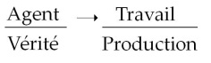
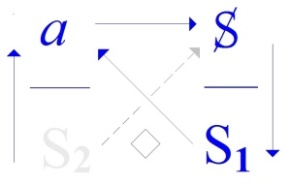
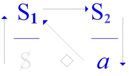

# Leçon 12 | 10 Juin 1970

<!-- source-url: http://staferla.free.fr/S17/S17 L'ENVERS.docx -->
<!-- seminar: s17 -->
<!-- lesson: 12 -->

<!-- id: s17-12-0001 -->

Nous ne sommes pas à un moment de l’année à quoi les longues épreuves convien­nent.

<!-- id: s17-12-0002 -->

Bon, on va essayer, d’alléger un peu ça.

<!-- id: s17-12-0003 -->

J’ai l’impression que *ça se tire*, comme on dit.

<!-- id: s17-12-0004 -->

J’aurais même une tendance à laisser là les choses, si je ne devais pas vous donner quand même un petit complément, destiné en somme à relever l’essentiel de ce que j’espère avoir fait passer cette année, d’une petite pointe d’avenir.

<!-- id: s17-12-0005 -->

Je veux dire : laisser entrevoir, en le serrant d’un peu plus près, à quoi certaines des notions un peu neuves, enfin assurément qui ont cette marque n’est-ce pas...

<!-- id: s17-12-0006 -->

que je souligne tou­jours et que peuvent *confirmer* ceux qui se trouvent travailler avec moi à *un niveau plus pratique* ...qui ont cette marque d’être au ras d’une expérience.

<!-- id: s17-12-0007 -->

Que ça puisse servir ailleurs, au niveau de quelque chose qui se passe comme ça pour l’instant...

<!-- id: s17-12-0008 -->

naturellement quand les choses se passent, au moment où elles se passent, on ne sait jamais bien ce que c’est, surtout quand on recouvre ces choses d’informations ...mais enfin il se fait qu’il se passe quelque chose dans l’Universi­té, que dans divers endroits on est surpris : quelle mouche les pique, ces étudiants, nos petits chéris, nos favoris, les « *chouchous* » de la civilisation, qu’est-ce qui leur arrive ?

<!-- id: s17-12-0009 -->

Ça, c’est ceux qui font les imbéciles. Ils sont payés pour ça...

<!-- id: s17-12-0010 -->

Si tout de même quelque chose, dans ce que j’articule, et qui est ce rapport du *discours de l’Analyste* au *discours du Maître,* pouvait montrer la voie où peut d’une certaine façon se justifier, s’entendre ce qui se passe, ce qui se passe pour l’instant, dont chacun rivalise à minimiser le poids, des petites manifestations ratées n’est-ce pas, comprimées, qui se produiront de plus en plus dans un coin, le *motiver*, le faire comprendre donc, au moment même où je me dis qu’en quelque chose je devrais le faire, je voudrais que vous entendiez ceci : c’est que dans toute la mesure où j’y arriverai à vous faire entendre quelque chose, vous pourrez être sûrs que je vous ai foutu le doigt dans l’œil.

<!-- id: s17-12-0011 -->

Car c’est ça en somme, à ça que ça se limite ce que je voudrais articuler aujourd’hui aussi simplement que je le pourrai*.*

<!-- id: s17-12-0012 -->

C’est que le rapport entre des choses que j’ose manipuler depuis un moment...

<!-- id: s17-12-0013 -->

enfin ce qui, de ce fait, donne une certaine garantie que ce discours se soutient ...que j’ose manipuler d’une façon en fin de compte absolument sauvage, j’hésite pas...

<!-- id: s17-12-0014 -->

et puis depuis un bout de temps en somme, c’est même par là que j’ai fait le pre­mier pas de cet enseignement ...à parler du *réel* à l’occasion.

<!-- id: s17-12-0015 -->

Et puis avec les années il y a une petite formule qui sort que : « *L’impossible, c’est le réel* ».

<!-- id: s17-12-0016 -->

Et puis Dieu sait que je n’en fais pas un abus d’emblée, il m’est arrivé devant vous de sortir je ne sais quelle référence \- enfin ça c’est plus commun bien sûr - à *la Vérité*.

<!-- id: s17-12-0017 -->

Il y a quand même quelques remarques très importantes à faire...

<!-- id: s17-12-0018 -->

et c’est pour ça que je me crois obligé d’en faire certaines aujourd’hui ...très importantes à faire avant de laisser tout ça à la portée des innocents pour qu’ils s’en servent à tort et à travers, ce qui est vraiment monnaie courante parfois dans mon entourage.

<!-- id: s17-12-0019 -->

À Vincennes, là où j’ai été faire un tour il y a huit jours...

<!-- id: s17-12-0020 -->

histoire que fût marqué succinctement le fait que j’avais répondu à l’invitation à cet endroit ...j’ai commencé d’avancer ça, et je vous l’avais d’ailleurs aussi annoncé ici la dernière fois pour en quelque sorte vous donner le bon départ, c’est une référence qui, elle, est loin d’être innocente, c’est même bien sûr pour ça qu’il faut lire Freud.

<!-- id: s17-12-0021 -->

Nous lisons dans « *L’analyse terminable et interminable »*, quelque chose qui concerne ce qu’il en est de l’analyste : on fait remarquer - n’est-ce pas - qu’on aurait bien tort de lui demander un excès de normalité ou de correction psychique, parce que ça le rendrait trop rare et puis brusquement «* Und endlich *» il n’est pas «* ist nicht zu vergessen *», *il n’est pas oublié* que la relation analytique est fondée «* auf Wahrheitsliebe *», sur *l’amour de la Vérité* « *daß heißt auf die Anerkennung der Realität* », sur *l’amour* *de la Vérité*, *ce qui veut dire reconnaissance* « *der Realität* ».

<!-- id: s17-12-0022 -->

\[*Und endlich ist nicht zu vergessen, daß die analytische Beziehung auf Wahrheitsliebe, d. h. auf die Anerkennung der Realität gegründet ist und jeden Schein und Trug ausschließt.*

<!-- id: s17-12-0023 -->

(« *Di**e endliche und die unendliche Analyse* », Teil VII, 1937)\]

<!-- id: s17-12-0024 -->

C’est un mot auquel, même si vous ne savez pas l’allemand, vous vous retrouvez puisqu’il est décalqué sur notre latin.

<!-- id: s17-12-0025 -->

Il est en concurrence, dans les emplois qu’en fait Freud, avec le mot «* Wirklichkeit *» qui lui aussi, à l’occasion, signifie ce que les traducteurs sans chercher plus loin traduisent tout uniment dans les deux cas par «* réalité *».

<!-- id: s17-12-0026 -->

C’est très curieux, comme ça, à ce propos j’ai un petit souvenir d’une espèce d’état de *rage écumante* qui avait pris un couple, et plus spécialement l’un d’eux...

<!-- id: s17-12-0027 -->

> il faut tout de même bien l’appeler, c’est pas du tout par hasard, c’est un nommé Laplanche
>
> dont chacun sait qu’il a eu un certain rôle dans les avatars de mes relations avec l’analyse ...à la pensée que devant le fait qu’un autre... que je vais nommer aussi puisque j’ai nommé le premier : un nommé Kaufmann ...avait avancé l’idée qu’il fallait distinguer ce *Wirklichkeit* et ce *Realität*.

<!-- id: s17-12-0028 -->

L’espèce de passion qu’avait déchainée, chez le premier de ces deux person­nages, le fait d’être devancé par l’autre dans cette remarque qui était en effet tout à fait première, importante, le pseudo-mépris éhonté montré pour ce fignolage est tout de même quelque chose d’assez intéressant.

<!-- id: s17-12-0029 -->

Et la phrase se finit «* und jeden Schein und Trug ausschließt *» et exclut...

<!-- id: s17-12-0030 -->

*« exclut »* : cette relation analytique ...tout «* Schein *» : tout *faux-semblant*, «* Trug *» : *duperie*.

<!-- id: s17-12-0031 -->

Eh bien, c’est très riche une phrase comme celle-là, parce que d’un autre côté c’est tout de suite, dans les lignes qui viennent qu’en somme...

<!-- id: s17-12-0032 -->

c’est ce qui apparaît malgré le petit salut, d’amitié que fait au passage Freud à l’analyste ...c’est qu’en somme il y a «* beinahe den Anscheine *», *on est tout près d’avoir vraiment toute l’apparence* que «* das Analysieren *», *la fonction analytique*, *l’acte analytique*...

<!-- id: s17-12-0033 -->

à la vérité ça ne veut pas dire autre chose que ce terme que j’ai employé comme titre d’un de mes séminaires [^50]*-* ...serait le troisième de chacune de ces «* unmöglichen Beruf *» de *ces professions*...

<!-- id: s17-12-0034 -->

> et «* unmöglichen *» est mis entre guillemets, je veux dire qu’il cite, il cite enfin une rengaine, une chose d’ailleurs que dans une des œuvres anté­rieures, Freud cite en quelque sorte en faisant référence lui-même au fait
>
> qu’il l’aurait déjà dit, on ne sait pas, on n’a pas retrouvé très bien où il l’aurait dit une première fois. Peut-être
>
> ma recherche est incomplète, c’est peut-être dans les *Lettres à Fliess* qu’il l’aura employé pour la première fois ...enfin ces 3 *professions* dont il s’agit, il les appelle dans ce passage antérieur : le *Regieren*, l’*Erziehen* et le *Kurieren*...

<!-- id: s17-12-0035 -->

> ce qui est évidemment conforme à *l’usage de lieu commun* qui en est fait, qu’il y ait *Kurieren* car *l’analyse* est nouvelle, et pour que Freud y range l’analyse, c’est évidemment en substitution à ce qu’on dit du fait de guérir ...ce qui est 3 *professions*... si tant est que de *professions* il s’agis­se ...*impossibles*, c’est donc *le « Regieren », l’« Erziehen » et l’« Analysieren »,* c’est-à-dire le « *gouverner »*, l’« *éduquer »* et l’« *analyser »*.

<!-- id: s17-12-0036 -->

On ne peut pas manquer de voir le recou­vrement, l’exactitude avec laquelle se collent ces trois termes, avec ce que je distingue cette année comme constituant le radical de 3 et même de 4 *discours.* *Ces discours*...

<!-- id: s17-12-0037 -->

étant bien entendu que c’est une articulation signifiante, un appareil dont seule la présence, le statut existant, domine en quelque sorte et gouverne tout ce qui peut y surgir à l’occasion de parole ...*les discours* dont il s’agit - je l’ai aussi dit un jour - ce sont des *<u>discours sans parole</u>*, *la parole* vient s’y loger en­suite comme elle peut, et il y a bien longtemps que je peux me dire qu’à propos de ce phénomène enivrant dit de *« la prise de parole »,* il y a un certain repérage du dis­cours dans lequel elle s’insère qui serait peut-être de nature, de temps en temps, à ce qu’on ne la prenne pas sans savoir ce qu’on fait.

<!-- id: s17-12-0038 -->

Je vous dis ça en note, je vous mets ça en marge, mais enfin il est bien évident que dans un certain style d’usage du genre «* émoi de Mai *» de la parole, il ne peut pas ne pas me venir à l’idée que *l’un des représentants* sûrement *du* (*a*), à un niveau qui, lui, n’est pas à situer dans les temps historiques, mais plutôt préhistoriques, c’est *l’animal domestique*. Voilà !

<!-- id: s17-12-0039 -->

Et dans ce cas-là alors, je crois bien que je n’ai plus tout à fait employé les mêmes lettres, mais au niveau de l’animal domestique, il est tout à fait clair que ce qui correspond à notre S...

<!-- id: s17-12-0040 -->

il a bien fallu un certain savoir pour le *domes­tiquer*, le chien, par exemple ...eh bien *c’est l’aboiement*.

<!-- id: s17-12-0041 -->

Et alors on ne peut pas quand même ne pas avoir l’idée que si *l’aboiement* c’est bien ça, c’est *donner de la voix*, le **S1** prend un sens qui, vous allez le voir, enfin n’a rien d’anormal à se repé­rer au niveau où nous le situons, à *un niveau de langage*.

<!-- id: s17-12-0042 -->

Chacun sait que l’animal domestique, il n’est qu’impliqué dans le langage d’un savoir primitif, mais il n’en a pas, lui.

<!-- id: s17-12-0043 -->

Et alors ce qui lui reste, c’est évidemment à remuer, à remuer *ce qui lui est donné de plus proche du signifiant* **S1** : *c’est la charogne*.

<!-- id: s17-12-0044 -->

Vous devez savoir quand même, vous avez bien eu un bon chien, qu’il soit de chasse ou de garde ou d’autre, enfin quelqu’un avec qui vous ayez eu de la familiarité, ça c’est irrésistible, ça *la charogne*, ils adorent ça.

<!-- id: s17-12-0045 -->

Si jamais comme Erzebet Bathory, *la charmante* en Hongrie qui aidait de temps en temps à dépecer ses servantes, ce qui est bien sûr la moindre des choses qu’on puisse s’offrir dans une certaine position, il suffisait qu’elle en mette \- les dits *morceaux* - un tout petit peu trop près de terre, ses chiens les lui rapportaient tout de suite, là tous contents.

<!-- id: s17-12-0046 -->

C’est la face un peu ignorée du chien. Si vous ne le gâtiez pas tout le temps à l’heure du *déjeuner* ou du *dîner* en lui donnant des choses qu’il n’aime que parce qu’elles viennent de votre assiette, c’est ça qu’il vous apporterait.

<!-- id: s17-12-0047 -->

Mais il faut faire attention à ceci, c’est que, à un niveau plus élevé qui est *celui d’un objet(a) d’une autre espèce*, que nous essaierons de définir tout à l’heure et qui nous ramènera à ce vieil *« astudé »* que j’ai déjà dit, la parole peut très bien jouer le rôle de *charogne*.

<!-- id: s17-12-0048 -->

Elle n’est pas beaucoup plus ragoûtante en tout cas.

<!-- id: s17-12-0049 -->

Et à la vérité c’est évidemment ce qui a beaucoup fait pour qu’on saisisse mal tout ce qui était de *l’importance du langage*.

<!-- id: s17-12-0050 -->

C’est qu’on a confondu cette sorte de manipulation de cette parole qui n’a pas d’autre valeur symbolique, on l’a confondue avec ce qu’il en était du *discours*. Grâce à quoi, ça n’est jamais n’importe quand, ni n’importe comment, que la parole fonctionne comme *charogne*.

<!-- id: s17-12-0051 -->

Et il conviendrait bien évidemment de faire attention, parce que, en fin de compte, la pointe, le but de ces remarques vient à ceci, enfin de s’étonner, de se poser tout au moins la question : comment il peut se faire que le *discours du Maître* qui s’entend si merveilleusement bien à avoir maintenu *sa domination*, comme le prouve tout de même ce fait qu’on mesure mal, c’est qu’exploités ou pas les travail­leurs travaillent.

<!-- id: s17-12-0052 -->

Le travail n’a jamais été autant à l’honneur depuis que l’humanité existe.

<!-- id: s17-12-0053 -->

C’est exclu, enfin, qu’on ne travaille pas. C’est un succès !

<!-- id: s17-12-0054 -->

Ça permet ce que j’appelle le *discours du Maître*.

<!-- id: s17-12-0055 -->

Il faut dire que pour ça il a bien fallu qu’il dépasse certaines limites, pour tout dire il en arrive à ce quelque chose dont j’ai essayé de vous pointer la mutation...

<!-- id: s17-12-0056 -->

> j’espère que vous vous en souvenez, mais si vous ne vous en souvenez pas,
>
> ce qui est bien possible, je vais vous le rappeler tout de suite ...cette mutation qui donne son style au capitaliste, et au capital aussi.

<!-- id: s17-12-0057 -->

Alors pourquoi - mon Dieu - est-ce que ceci... qui ne se passe pas par hasard :

<!-- id: s17-12-0058 -->

- on aurait tort de croire qu’il y a quelque part *de savants politiques qui calculent* bien exactement tout ce qu’il faut faire, on aurait également tort de croire qu’il n’y en a pas, *il y en a !*

<!-- id: s17-12-0059 -->

C’est pas sûr qu’ils soient toujours à la place d’où l’on peut agir congrûment, mais dans le fond c’est peut-être pas ça qui a tellement d’importance.

<!-- id: s17-12-0060 -->

Il suffit qu’ils soient, même à une autre place, pour que quand même ce qui est de l’ordre du déplacement du discours, se transmette.

<!-- id: s17-12-0061 -->

Et alors si on se pose la question : mon Dieu, comment est-ce que cette société du capitaliste, peut s’offrir le luxe de permettre le relâchement de ce *discours uni­versitaire,* qui n’est pourtant qu’une de ces transformations...

<!-- id: s17-12-0062 -->

tel que je vous l’ex­pose tout au moins ...c’est le quart de tour par rapport au *discours du Maître* ?

<!-- id: s17-12-0063 -->

C’est une question qui vaut tout de même la peine d’être envisagée, d’être envisagée en ceci que la question qu’il faut se poser est celle-ci : est-ce qu’en quel­que sorte, à abonder dans ce relâchement - il faut bien le dire, offert - on ne tombe pas dans un piège ?

<!-- id: s17-12-0064 -->

C’est pas une idée nouvelle, j’ai déjà écrit ça dans un petit article qu’on m’avait expressément demandé pour être publié dans *un journal* au style singulier de ce que c’est le seul qui ait une réputation d’équilibre et d’honnêteté, et qui s’appelle *Le Monde.*

<!-- id: s17-12-0065 -->

On avait beaucoup insisté pour que je rédige ces quelques petites pages, c’était à propos de la réorganisation de la psychiatrie, mais enfin j’avais parlé à propos un peu de la réforme, à propos de tout ça. Bon enfin, malgré cette insistance, il est assez frappant que ce petit article, que je vous lirai un jour comme ça à la traine, il n’y est point passé. \[*Rires*\]

<!-- id: s17-12-0066 -->

##### Évidemment à ce moment là ça s’intitulait* « D’une réforme dans son trou* », 

<!-- id: s17-12-0067 -->

##### je parlais justement *de ce trou, de ce trou tourbillonnaire,*

<!-- id: s17-12-0068 -->

##### que manifestement il s’est agi de faire à l’occasion d’un certain nombre de mesures concernant l’univer­sité. 

<!-- id: s17-12-0069 -->

##### Et - mon Dieu - je crois qu’il y a des moments où on peut avoir certains scrupules, disons dans l’agir, 

<!-- id: s17-12-0070 -->

##### pour se rapporter correctement à ce que j’appelle les termes de certains *discours* fondamentaux, 

<!-- id: s17-12-0071 -->

##### on peut y regarder à deux fois avant de se pré­cipiter pour profiter de telle ligne qui s’ouvre, 

<!-- id: s17-12-0072 -->

##### c’est une responsabilité de *vé­hiculer la charogne* dans ces couloirs-là !

<!-- id: s17-12-0073 -->

Et c’est à ça que les remarques que je vous introduis aujourd’hui doivent en somme d’être articulées.

<!-- id: s17-12-0074 -->

Parce qu’après tout, elles ne sont pas courantes, elles ne sont pas communes et que c’est comme un appareil : on devrait en avoir au moins la notion que ça pourrait servir de levier, de pince, ou que ça peut se visser, ou que ça peut se construire de telle façon ou telle façon.

<!-- id: s17-12-0075 -->

   

<!-- id: s17-12-0076 -->

*Discours du Maître Discours de l’Hystérique Discours Universitaire Discours analytique*

<!-- id: s17-12-0077 -->

Voilà, eh bien il y a plusieurs termes.

<!-- id: s17-12-0078 -->

Si je ne vous mets ici que ces petites *lettres,* au tableau, c’est évidemment pas au hasard… c’est parce que je ne veux pas y mettre des choses qui ont une apparence de signifiés*,* parce que je veux en quelque sorte - ces *signifiés* - aucunement les autoriser.

<!-- id: s17-12-0079 -->

C’est déjà un peu plus les *autoriser* que de les *écrire*.

<!-- id: s17-12-0080 -->

J’ai déjà parlé de ce qui constitue les places, les places où ces signifiants s’inscrivent.

<!-- id: s17-12-0081 -->

J’ai déjà fait un sort à ce qu’il en est de l’*agent*, ceci bien pour souligner le sort béni qui fait que pour la langue française, l’*agent* n’est pas du tout forcément celui qui agit : c’est celui qui fait agir.

<!-- id: s17-12-0082 -->

De sorte que, bien sûr, comme on peut déjà le soupçonner, la place du Maître est bien évidemment de toute probabilité définie par ceci que c’est pas tout clair que le Maître fonctionne et que la meilleure des choses qu’on puisse se demander, *c’est ce que*... seulement *ne m’a pas attendu pour faire*, *un nommé* Hegel *qui s’est employé à ça*, mais il faut y regarder de plus près parce que c’était un... c’est très ennuyeux de penser qu’en fin de compte il n’y a peut-être pas ici cinq personnes qui ont vraiment lu, depuis que j’en parle, la *« Phénoménologie de l’Esprit »*.

<!-- id: s17-12-0083 -->

Enfin je ne vais pas demander qu’elles lèvent la main !

<!-- id: s17-12-0084 -->

C’est très emmerdant qu’il n’y ait encore eu jusqu’à présent que deux personnes qui l’aient parfaitement lue...

<!-- id: s17-12-0085 -->

puisque moi même aussi, je dois vous l’avouer, je n’ai pas été dans tous les coins ...c’est mon maître Alexandre Kojéve, qui évidemment me l’a mille fois démontré, et puis comme ça une autre personne d’un acabit que vous ne croiriez pas, qui a vraiment lu la *Phénoménologie de l’Esprit* *d’une façon lumineuse*, au point que tout ce qu’il peut y avoir dans les notes de Kojéve...

<!-- id: s17-12-0086 -->

que j’ai lues, elles, et que je lui ai repassées, ...c’était vraiment superflu.

<!-- id: s17-12-0087 -->

Ce qu’il y a d’inouï, c’est que j’ai beau me tuer à faire remarquer que la « *Critique de la Raison pratique »*, c’est manifestement *un livre d’érotisme* extraordinairement plus drôle que ce qui se publie chez Eric Losfeld.

<!-- id: s17-12-0088 -->

Si je vous dis que la *Phénoménologie de l’Esprit*, c’est l’*humour fou*, eh ben ça n’aura pas plus de résultats !

<!-- id: s17-12-0089 -->

Et pourtant, c’est bien de ça qu’il s’a­git, c’est vraiment la chose la plus extraordinaire qui soit, mais c’est un humour aussi froid, je ne dirais pas « noir ».

<!-- id: s17-12-0090 -->

Il y a une chose dont on peut être absolument convaincu, c’est qu’il sait absolument bien ce qu’il fait.

<!-- id: s17-12-0091 -->

Ce qu’il fait, c’est de leur faire passer la muscade et de foutre tout le monde dedans, ceci bien sûr à partir du fait que ce qu’il dit c’est *la vérité.*

<!-- id: s17-12-0092 -->

Il n’y a évidemment pas de meilleure façon d’épingler *le signifiant Maître,* le **S1** qui est là au tableau, que de l’identifier à *la mort*.

<!-- id: s17-12-0093 -->

Et alors de quoi s’agit-il ?

<!-- id: s17-12-0094 -->

C’est de montrer dans une « *dialectique »*, comme il s’exprime...

<!-- id: s17-12-0095 -->

> c’est le zénith, c’est la montée dans la pensée de la fonction de ce terme ...qu’est-ce que c’est en somme que l’entrée en jeu de cette brute dans la « *Phénoménologie de l’Esprit »*, comme il s’exprime ?

<!-- id: s17-12-0096 -->

Eh ben, c’est absolument séduisant, sensationnel.

<!-- id: s17-12-0097 -->

*La vérité* de ce qu’il arti­cule nous pouvons la lire vraiment en face...

<!-- id: s17-12-0098 -->

> à condition bien sûr de nous lais­ser prendre par ce texte,
>
> parce que moi, ce que j’articule, c’est que justement elle ne peut pas se lire en face, ...*la vérité* donc de ce qu’il articule c’est ceci : c’est le rapport à *ce réel* en tant proprement qu’*impossible*, c’est à savoir qu’on ne voit pas du tout pour qui... *pourquoi* ! - excusez-moi - *pourquoi* il y aurait un Maître qui sortirait de « *la lutte à mort de pur prestige* »... comme on dit, comme il dit, enfin lui ...*et qu’il en résulterait cet étrange agencement de départ*.

<!-- id: s17-12-0099 -->

Et le comble c’est qu’il trouve le moyen - il est vrai dans une conception de l’histoire qui fait touche de ce qui en émerge, à savoir de la suc­cession enfin des phases de dominance, de composition du jeu de l’esprit, qui se situent le long de ce fil qui n’est pas rien, très précisément jusqu’à lui, de *ce qu’on appelle la pensée philosophique*, et que de cela il retourne qu’en fin de compte *c’est l’esclave par son travail qui donne la vérité du maître* en le repous­sant dans les dessous, par ceci que par la vertu de ce travail, travail forcé comme vous pouvez le noter au départ, l’esclave arrive à la fin de l’histoire, à ce terme qui s’appelle *le Savoir Absolu*.

<!-- id: s17-12-0100 -->

 

<!-- id: s17-12-0101 -->

Rien n’est dit de ce qui arrive alors, parce qu’à la vérité, dans la composition hégélienne, il n’y a pas quatre termes.

<!-- id: s17-12-0102 -->

Il y avait d’abord *le Maître* et puis *l’esclave*, que j’appelle **S2** ici, mais vous pouvez aussi bien l’identifier du terme d’une jouissance à laquelle il n’a pas voulu renoncer, il a bien fallu justement à cause de ça qu’il renonce.

<!-- id: s17-12-0103 -->

C’est à savoir *le substitut* de ceci qui n’est tout de même pas son équivalent : le travail.

<!-- id: s17-12-0104 -->

Grace à quoi...

<!-- id: s17-12-0105 -->

à là sérénité de la *mutation dialectique*, au ballet, au menuet qui s’institue à partir de ce moment et qu’il traverse de bout en bout, fil à fil, et au développement de la culture ... « *la fin de l’histoire* » nous récompense de ce *savoir* qu’on ne qualifie pas d’achevé...

<!-- id: s17-12-0106 -->

et on a bien ses raisons pour ça ...mais d’*absolu*.

<!-- id: s17-12-0107 -->

C’est incontestable : le maître n’apparaît plus que d’avoir été l’instrument, le cocu ma­gnifique.

<!-- id: s17-12-0108 -->

Ce qu’il y a d’absolument *sublime* dans cette très *remarquable déduction dialectique*, c’est qu’elle ait été entreprise et - si l’on peut dire - réussie, car tout au long...

<!-- id: s17-12-0109 -->

> prenons l’exemple, enfin de ce qu’il peut dire par exemple de la culture ...tout au long, les remarques les plus pertinentes, quant au jeu des incidences des exercices de l’*esprit*, foisonnent.

<!-- id: s17-12-0110 -->

Je vous le répète : il n’y a rien de plus drôle.

<!-- id: s17-12-0111 -->

La *ruse de la raison* - nous dit-il - *est depuis le début ce qui a dirigé tout ce jeu*.

<!-- id: s17-12-0112 -->

Cette *ruse de la raison* est évidemment un très beau terme*,* ce qui pour nous analystes, évidemment garde son prix de ceci que nous pouvons le suivre au niveau *d’un certain b-a-ba* , raisonnable ou pas, enfin nous avons affaire à quelque chose de très rusé dans sa parole justement : il s’agit de l’inconscient.

<!-- id: s17-12-0113 -->

Seulement le comble de cette ruse n’est pas là où on le pense, c’est la *ruse de la raison* sans doute, mais il faut bien reconnaître, et tirer son chapeau à la *ruse du raison­neur*.

<!-- id: s17-12-0114 -->

S’il eût été possible au début du siècle dernier, au temps de la bataille d’Iéna, que cette extraordinaire entourloupette qui s’appelle la *Phénoménologie de l’Esprit* ait subjugué quiconque, le coup aurait été réussi.

<!-- id: s17-12-0115 -->

Il est bien évident qu’il ne peut pas tenir un seul instant que nous nous rapprochions en quoi que ce soit de *l’ascension de l’esclave* : rien n’est plus encore esclave que l’esclave. Et cette incroyable façon de mettre à son bénéfice - au bénéfice de son travail – un progrès, comme on dit, quelconque du savoir, est vraiment d’une extraordinaire futilité.

<!-- id: s17-12-0116 -->

Mais ce que j’appelle *la ruse du raisonneur* est là pour nous faire voir une dimension tout à fait essentielle, et à laquelle il faut prendre garde, c’est celle-ci : *si donc nous désignons la place de l’Agent* quel qu’il soit...

<!-- id: s17-12-0117 -->

qui n’est pas toujours celle du *signifiant-Maître,* puisque tous les autres signifiants vont y passer à leur tour, ...si la question est celle-ci : *qu’est-ce qui, cet Agent, le fait agir ?*

<!-- id: s17-12-0118 -->

Comment *cet extraordinaire cycle*, autour de quoi tourne ce qui à proprement parler *ne mérite que d’être signalé du terme de* *révolution,* comment peut-il se pro­duire ?

<!-- id: s17-12-0119 -->

##### Ici à un certain niveau donc - retrouvons le terme de Hegel - grâce au Maître naît au monde « *le travail »*. 

<!-- id: s17-12-0120 -->

##### Alors, 

<!-- id: s17-12-0121 -->

##### quelle est donc *la vérité* ? c’est là qu’elle se place avec un point d’interrogation. 

<!-- id: s17-12-0122 -->

##### Qu’est-ce qui inaugure - car enfin ça ne dure pas depuis toujours, c’est là depuis les temps historiques - ce qui met en jeu cet *Agent* ? 

<!-- id: s17-12-0123 -->

##### C’est une bonne chose que de s’apercevoir, à propos d’un cas tellement brillant, tellement éblouissant, 

<!-- id: s17-12-0124 -->

##### que justement à cause de ça on n’y pense pas, on ne le voit pas, comme l’est Hegel : 

<!-- id: s17-12-0125 -->

##### *c’est un représentant*, si je puis dire *sublime, du discours du savoir, du savoir universitaire*. 

<!-- id: s17-12-0126 -->

Nous autres en France, nous n’avons jamais de *philosophes*,

<!-- id: s17-12-0127 -->

- que des gens comme ça qui courent les routes,

<!-- id: s17-12-0128 -->

- de petits sociétaires de petites sociétés provinciales comme Maine de Biran,

<!-- id: s17-12-0129 -->

- des types comme Descartes qui se baladaient à travers l’Europe. Et puis il faut tout de même savoir le lire lui aussi, bien entendre son ton quand il parle de *ce qu’il peut attendre de sa* *naissance*, on voit quand même quel genre de type c’était. Enfin ça n’empêche pas qu’il n’était pas un con, *bien loin de là* !

<!-- id: s17-12-0130 -->

Enfin chez nous, c’est pas dans les universités qu’on trouve des philosophes.

<!-- id: s17-12-0131 -->

On peut mettre ça à notre avantage ! Mais en Allemagne, c’est à l’université.

<!-- id: s17-12-0132 -->

Et alors ce qu’il faut voir c’est ceci, c’est ce qu’on est capable de penser, à un certain niveau du statut univer­sitaire, de penser : enfin *les pauvres petits, les chers mignons*, ceux qui conti­nuent à ce moment-là et qui ne font qu’entrer dans la grande ère du trimage, de l’exploitation à mort n’est-ce-pas, celle de l’ère industrielle, on va les prendre à la révélation de cette vérité, cette vérité que c’est eux qui font l’Histoire et que le Maître n’est là que le sous-fifre qu’il fallait pour faire partir la musique au départ.

<!-- id: s17-12-0133 -->

C’est une remarque qui a son prix et que j’entends souligner avec force, ceci en raison de la phrase qu’emploie Freud pour dire que la relation ana­lytique doit être fondée «* gegründet *» sur *l’amour de la Vérité*.

<!-- id: s17-12-0134 -->

C’était vraiment un type charmant, ce Freud !

<!-- id: s17-12-0135 -->

Il était vraiment « tout feu, tout flamme ».

<!-- id: s17-12-0136 -->

Il avait des faiblesses comme ça, son rapport avec sa femme par exemple, c’est quelque chose d’inimaginable !

<!-- id: s17-12-0137 -->

Avoir toléré une pareille morue toute son existence, c’est quelque chose !

<!-- id: s17-12-0138 -->

Enfin dites-vous bien ceci : c’est que s’il y a quelque chose que doit vous inspirer *la Vérité*, si vous voulez soutenir l’«* analytische Beziehung *», c’est certainement pas *l’amour*.

<!-- id: s17-12-0139 -->

*La Vérité* dans l’occasion, si c’est celle qui fait surgir en fin de compte ce signifiant de « *la mort » -* et il y a toute apparence – et même que s’il y a quelque chose qui donne un tout autre sens à ce qu’avançait, qu’a avancé Hegel, c’est bien justement ce que Freud avait pourtant découvert à cette époque-là, et qu’il a qualifié comme ça, comme il a pu, d’« *instinct de mort »*.

<!-- id: s17-12-0140 -->

À savoir le carac­tère radical et fondamental dans *la répétition*...

<!-- id: s17-12-0141 -->

dans cette *répétition* qui insiste, qui caractérise ce qu’il en est de la réalité psychique de *l’être inscrit dans le langage* ...eh bien c’est que, du fait que *la Vérité* n’a pas d’autre visage, il n’y a pas de quoi en être fou !

<!-- id: s17-12-0142 -->

À la vérité ce n’est pas non plus exact : des visages, elle en a plus d’un.

<!-- id: s17-12-0143 -->

Mais justement ce qui pourrait être la première ligne de conduite à nous tenir, pour ce qui est des analystes, c’est comme ça : à être un peu en méfiance, à ne pas devenir tout d’un coup fou comme ça *d’une vérité,* comme du premier minois rencontré au tournant de la rue.

<!-- id: s17-12-0144 -->

Et pour tout dire, si c’est justement là que nous rencontrons cette remarque de Freud et accompagnée de ceci : « *das heisst auf die Anerkennung der Realität* » c’est bien en effet de nature à nous faire dire qu’en effet peut-être que, il y a comme ça un *réel* tout naïf - c’est en général comme ça qu’on parle - et qui se fait passer pour *la Vérité*.

<!-- id: s17-12-0145 -->

Et puis après ça, *la Vérité* ça s’éprouve et ça ne veut pas dire du tout pour autant qu’elle en connaît plus du *réel*, surtout si on parle du connaître.

<!-- id: s17-12-0146 -->

Peut-être...

<!-- id: s17-12-0147 -->

si vous vous souvenez des linéaments de ce que j’indique ...l’étape où c’est à se trouver défini comme *l’impossible à démontrer le vrai dans le registre d’une articulation symbo­lique*, que le *réel* se place, nous permettra d’avoir là, disons *une visée*, quelque chose qui serve à mesurer notre *amour pour la vérité*.

<!-- id: s17-12-0148 -->

À la vérité en effet, si ce *réel* se définit comme *l’impossible*, c’est bien là ce qui est de nature à nous faire toucher du doigt quoi ?

<!-- id: s17-12-0149 -->

*Gouverner, éduquer, analyser aussi, et pourquoi pas, faire désirer* pour compléter d’une *définition* ce qu’il en serait *du discours* *de l’Hystérique,* eh ben c’est en effet des opérations qui sont à très proprement parler *impossibles,* et c’est pour ça qu’elles sont là.

<!-- id: s17-12-0150 -->

Qu’elles sont là et qu’elles tiennent le coup rudement bien, en nous posant la question de ce qu’il en est de leur vérité, c’est à savoir comment ça se produit ces *choses folles* qui précisé­ment ne se définissent dans le *réel* que de pouvoir, quand on les approche, être arti­culées comme *impossibles*. Il est clair que leur pleine articulation comme *impos­sible*, c’est justement ce qui nous donne le risque, la chance entrevue, que leur *réel*, si l’on peut dire, éclate.

<!-- id: s17-12-0151 -->

Si nous sommes forcés de nous amuser comme ça si lon­guement dans les couloirs et labyrinthes de *la vérité*, c’est que justement il y a quelque chose qui fait que l’on n’arrive pas.

<!-- id: s17-12-0152 -->

Et pourquoi s’en étonner, s’en étonner pour ceux de ses discours qui sont pour nous tout neufs : je ne dis pas bien entendu qu’on n’aurait pas déjà eu un bon 3/4 de siècle pour envisager les choses sous cet angle, mais enfin le séjour dans le fauteuil n’est-il pas la meilleure position pour serrer *l’impossible* ?

<!-- id: s17-12-0153 -->

Quoi qu’il en soit, que nous en soyons toujours à tour­nailler dans cette dimension de *l’amour de la vérité*, dont tout indique justement qu’elle nous fait glisser entre les doigts, tout à fait de *l’impossibilité* de ce qui se maintient comme *réel* très précisément au niveau du *discours du Maître*.

<!-- id: s17-12-0154 -->

Eh bien c’est cela qui nécessite la référence à ce qu’heureusement le *discours analytique* nous permet d’entrevoir, d’articuler exactement, et c’est en quoi il est important que je l’articule.

<!-- id: s17-12-0155 -->

Je suis bien persuadé qu’il y a ici 5 ou 6 personnes qui peuvent très bien le déplacer d’une façon qui ait des chances de resurgir.

<!-- id: s17-12-0156 -->

Je ne vous dis pas que ce soit « *le levier d’Archimède* », je ne vous dis pas que ce que j’énonce ait la moindre prétention à « *renouveler le système du monde* », ni « *la pensée de l’Histoire* », j’indique comment l’analyse nous met au pied de recevoir un certain nombre de choses qui peuvent paraître \- par le hasard des rencontres - être éclairantes pour quelqu’un, qui de cette pratique, a un peu l’habitude.

<!-- id: s17-12-0157 -->

Après tout j’aurais peut-être bien pu ne jamais rencontrer Kojève !

<!-- id: s17-12-0158 -->

Si je n’avais jamais rencontré Kojève, il est très probable que comme tous les français éduqués dans une certaine période, je n’aurais même pas soupçonné que la « *Phénoménologie de l’Esprit »*, c’était quelque chose.

<!-- id: s17-12-0159 -->

*L’impossibilité*, ce que *l’analyse* nous permet d’en apercevoir, c’est que l’obstacle à son cernage, à son serrage, est ceci qui seul pourrait peut-être au dernier terme y introduire une mutation : le *réel nu* - pas de *vérité* - ça serait pas mal !

<!-- id: s17-12-0160 -->

Seulement voilà : *entre nous et le réel il y a la vérité*.

<!-- id: s17-12-0161 -->

*La vérité, je vous ai une fois énoncé* un jour dans une envolée lyrique, *que c’était la chère petite sœur de la Jouissance*.

<!-- id: s17-12-0162 -->

Ça devrait déjà vous être re­venu à la tête, du moins j’espère que c’est revenu à la tête de certains d’entre vous, au moment où ce que je vais accentuer dans ces quatre formules, dont il y a deux de réécrites ici, est ceci :

<!-- id: s17-12-0163 -->

 

<!-- id: s17-12-0164 -->

c’est que si la première ligne dans cette relation indi­quée d’une flèche, d’un sens, se définit toujours comme *impossible*, c’est à savoir qu’en effet *il est impossible* qu’il y ait un maître qui fasse, comme ça, marcher son monde.

<!-- id: s17-12-0165 -->

*Faire travailler* les gens c’est encore plus fatigant que de travailler soi-même si on devait le faire vraiment.

<!-- id: s17-12-0166 -->

*Le maître ne le fait jamais*.

<!-- id: s17-12-0167 -->

Il fait un signe de *signifiant-Maître* *et tout le monde cavale* !

<!-- id: s17-12-0168 -->

C’est de ça dont il faut partir qui est en effet tout à fait précieux et touchable toujours.

<!-- id: s17-12-0169 -->

Alors *l’impossibi­lité* qui est bien là écrite à la première ligne, il s’agit de voir si...

<!-- id: s17-12-0170 -->

> comme déjà c’est indiqué par la place donnée au terme de *Vérité* *...*ça serait peut-être au niveau de la seconde qu’on en aurait une vraiment.

<!-- id: s17-12-0171 -->

Seulement voilà, au niveau de la seconde ligne, il n’y a pas la moindre flèche.

<!-- id: s17-12-0172 -->

Non seulement il n’y a pas de communication, mais il y a à proprement parler quelque chose qui obture et c’est à proprement parler ceci : *c’est que ce qui résulte* - au moins à ce premier niveau - *du travail*, c’est que...

<!-- id: s17-12-0173 -->

> c’est ça la découverte d’un nommé Marx : c’est d’avoir donné tout son poids à ce terme
>
> qui est ce à quoi s’emploie le travail et dont on le sait déjà que ça s’appelle *la production* ...eh bien *l’essentiel c’est de s’apercevoir* *que cette production*, *quels que soient les signes, les signifiants-Maître qui viennent s’inscrire à cette place*, *ça n’a en tout cas aucun rapport avec la vérité de la chose*.

<!-- id: s17-12-0174 -->

On peut faire tout ce qu’on veut, on peut essayer de conjoindre *cette pro­duction avec des besoins* qui sont des besoins qu’on forme, il n’y a rien à faire avec l’existence humaine et le rapport de la production avec la *Vérité*, il n’y a pas moyen de s’en tirer.

<!-- id: s17-12-0175 -->

Toute impossibilité, quelle qu’elle soit - et c’est elle que nous mettons ici en jeu - s’articule toujours, aussi sûr que si elle nous laisse en haleine autour de sa vérité, c’est que *quelque chose* la protège que nous appellerons *impuissance*.

<!-- id: s17-12-0176 -->

Au niveau du *discours Universitaire* par exemple, pour prendre ce premier…

<!-- id: s17-12-0177 -->

<!-- id: s17-12-0178 -->

Celui qui s’articule ici, où le terme **S2** est dans cette position - d’une prétention insensée - d’avoir pour *production* un être pensant, *un sujet,* eh ben il n’est pas question que *comme sujet*, dans sa *production*, il puisse se percevoir un seul instant *comme Maître du savoir*.

<!-- id: s17-12-0179 -->

Ça se touche là d’une façon sensible, mais bien sûr ça remonte plus haut.

<!-- id: s17-12-0180 -->

Car au niveau du *discours du Maître*, ce *discours du Maître* que, grâce à Hegel, je me permets de présupposer, car comme vous allez le voir, nous ne le connaissons plus maintenant que sous une forme considérablement modifiée.

<!-- id: s17-12-0181 -->

Malgré tout c’est une construction, c’est une reconstruction même, ce *plus de jouir* que j’ai articulé cette année, mais qui me paraît important, ce *plus de jouir* que je mets au départ comme support plus vrai, mais méfions-nous, c’est bien ça qu’il a de dangereux tout de même, il tient sa force de s’articuler ainsi, dans ce qu’à lire tout de même des gens qui eux n’avaient pas lu Hegel - à lire Aristote principalement – ce que nous pressentons c’est que ce rapport du Maître à l’esclave, qui vraiment lui faisait problème, qu’il en cherchait la vérité, qu’à la vérité c’est vraiment magnifique de voir dans les trois ou quatre passages fascinants où il essaie de s’en sortir, qu’il ne va que dans une voie d’une différence de nature, et une différence de nature d’où sortirait le bien de l’esclave.

<!-- id: s17-12-0182 -->

Lui n’est pas un professeur d’université, c’est pas un petit rusé comme Hegel : il sent bien que quand il énonce ça, ça dérape, ça glisse de toutes parts. Il est pas très sûr ni très chaud, il n’impose pas son opinion, mais enfin il sent que c’est de ce coté là qu’il pourrait y avoir quelque chose qui motive le rapport du Maître et de l’esclave.

<!-- id: s17-12-0183 -->

Ah, s’ils n’étaient pas du même sexe, ça, ça serait vraiment sublime !

<!-- id: s17-12-0184 -->

Si c’était l’homme et la femme, là il laisse entrevoir qu’il y aurait un espoir.

<!-- id: s17-12-0185 -->

Malheureusement c’est pas comme ça, ils ne sont pas de sexes différents, et les bras lui tombent.

<!-- id: s17-12-0186 -->

Alors ce qu’on voit bien, dont il s’agit, c’est au nom de quoi ce *plus de jouir*, à savoir ce que le Maître reçoit du travail de l’es­clave, ça semblerait aller tout seul. Ce qu’il y a d’inouï, c’est que personne ne semble s’apercevoir que justement...

<!-- id: s17-12-0187 -->

> c’est là qu’il y a un enseignement à tirer ...c’est que ça ne va pas tout seul* *!

<!-- id: s17-12-0188 -->

À savoir qu’il y a les problèmes de l*’éthique* qui se mettent là tout d’un coup *à foisonner* :

<!-- id: s17-12-0189 -->

- il y a l’« *[Éthique à Nicomaque ](http://remacle.org/bloodwolf/philosophes/Aristote/tablemorale.htm)»,*

<!-- id: s17-12-0190 -->

- et puis il y a l’« *[Éthique](http://remacle.org/bloodwolf/philosophes/Aristote/tableeudeme.htm)...* à encore un autre copain[^51],

<!-- id: s17-12-0191 -->

- et puis [*il y en a plusieurs* comme ça des réflexions de morale](http://remacle.org/bloodwolf/philosophes/Aristote/tablegrandemorale.htm),

<!-- id: s17-12-0192 -->

- et puis on n’en sort pas : ce *plus de jouir*, on ne sait pas qu’en faire.

<!-- id: s17-12-0193 -->

Ça veut dire quoi ?

<!-- id: s17-12-0194 -->

Pour qu’on en vienne, vous comprenez, à mettre au cœur du monde « *un souverain bien »*, il faut vraiment qu’on en soit aussi empêtré qu’un poisson d’une pomme.

<!-- id: s17-12-0195 -->

Et pourtant c’est à la portée de la main ce *plus de jouir* que nous apporte l’esclave.

<!-- id: s17-12-0196 -->

Seulement ce que démontre, ce qu’atteste toute cette pensée de l’Antiquité...

<!-- id: s17-12-0197 -->

> par laquelle Hegel nous fait repasser, grâce à ses merveilleux tours de passe,
>
> repasse et autres, jusqu’au masochisme politisé des Stoïciens ...eh bien c’est que ça ne peut pas se faire en tant que *plus de jouir,* quelque chose qui s’installe tranquillement comme *le sujet* du Maître.

<!-- id: s17-12-0198 -->

Et puis, si nous prenons le *discours de l’Hystérique*, tel que je l’articule : mettez le S en haut à gauche, le S1 et le S2 à droite et le *a* à la place de *la vérité*.

<!-- id: s17-12-0199 -->

<!-- id: s17-12-0200 -->

Eh bien ça ne peut pas se faire non plus qu’en tant que *production de savoir*, se justifie, se motive la division, le déchirement symptomatique de *l’Hys­térique*, en tant que sa *vérité* c’est qu’il lui faut *être l’objet(a)* pour être désirée.

<!-- id: s17-12-0201 -->

*L’objet(a)* c’est un peu maigre en fin de compte, quoique bien entendu les hommes en raffolent, et qu’ils n’osent pas même entrevoir de passer par autre chose.

<!-- id: s17-12-0202 -->

Autre signe de l’impuissance couvrant la plus subtile des *impossibilités*.

<!-- id: s17-12-0203 -->

Et puis enfin, au niveau du *discours de l’Analyste...*

<!-- id: s17-12-0204 -->

<!-- id: s17-12-0205 -->

...qui curieusement...

<!-- id: s17-12-0206 -->

naturellement personne, tout au moins jusqu’à présent, ne le remarque, ...*c’est qu’à prendre ça pour la production*, c’est assez curieux que ce qui se *produise*, ce ne soit rien d’autre que le *discours du Maître,* puisque c’est **S1** qui vient en avant.

<!-- id: s17-12-0207 -->

Peut-être que justement tout de même, si on a fait ces trois quarts de tour, et quand même...

<!-- id: s17-12-0208 -->

comme je le disais la dernière fois quand j’ai quitté Vincennes ...c’est peut-être que *c’est du discours de l’Analyste que peut surgir un autre style de signifiant-Maître*.

<!-- id: s17-12-0209 -->

Quoi qu’il en soit, qu’il soit *d’un autre style ou pas*, d’abord c’est pas demain la veille, le jour où on saura lequel il est, et en tout cas, au moins pour l’instant, nous sommes tout à fait impuissants à le rapporter à ce qui est en jeu dans *la position de l’analyste*, à savoir ce qu’il présente lui aussi comme séduction de *vérité*, de ceci qu’il en saurait un bout sur ce qu’en principe il représente.

<!-- id: s17-12-0210 -->

C’est ce que j’accentue à axer \[*a* → **S**\] le relief de cette *impossibilité* de sa position \[ : *l’analyste*\], puisqu’il se met en position de représenter, d’être *l’agent*, *la cause du désir*.

<!-- id: s17-12-0211 -->

Voilà donc définie la relation entre ces termes qui sont quarts, je veux dire qu’il y en a quatre, car celui que je n’ai pas nommé est évidemment celui qui est *innommable,* parce que c’est sur son interdiction que se fonde toute cette structure, c’est à savoir *la jouissance*.

<!-- id: s17-12-0212 -->

C’est autour, c’est là que la vue, la petite lucarne, le regard qu’a apporté l’analyse, nous introduit à quelque chose qui peut être dé­marche féconde, non pas de la pensée mais de l’acte, et c’est en ça que ce pas est révolutionnaire.

<!-- id: s17-12-0213 -->

C’est que c’est pas autour du sujet...

<!-- id: s17-12-0214 -->

> quelle que soit la fécondité qu’ait montrée cette interrogation hystérique,
>
> cette interrogation hys­térique dont je vais dire qui l’introduit le premier dans l’Histoire ...c’est pas parce que *l’entrée du sujet* *comme* *agent du discours* a eu des résultats très surpre­nants, dont le premier est celui de *la science*, que c’est là que soit la clé de tout le ressort : la clé est autour du questionnement de ce qu’il en est de *la jouissance*.

<!-- id: s17-12-0215 -->

*La jouissance*, elle est limitée par des processus naturels.

<!-- id: s17-12-0216 -->

Pour dire la vérité, nous ne savons rien de ces processus naturels.

<!-- id: s17-12-0217 -->

Nous savons simplement que nous avons fini par considérer comme naturelle la douilletterie dans laquelle nous entretient une société à peu près ordonnée, à ceci près bien sûr que chacun meurt d’envie de savoir ce que ça ferait *si ça faisait vraiment mal*.

<!-- id: s17-12-0218 -->

D’où cette hantise sadomasochiste qui caractérise notre aimable ambiance sexuelle.

<!-- id: s17-12-0219 -->

Ceci est tout à fait futile, voire secondaire.

<!-- id: s17-12-0220 -->

L’important est ceci : naturel ou pas, c’est bel et bien lié à l’origine même *de l’entrée en jeu du signifiant qu’on peut parler de jouissance.*

<!-- id: s17-12-0221 -->

On ne saura jamais ce dont jouit l’huitre ou le castor, personne n’en saura jamais rien parce que faute de signifiant, il n’y a pas de distance entre sa jouissance et son corps.

<!-- id: s17-12-0222 -->

Ils sont au même niveau que la plante qui après tout en a peut-être une aussi de *jouissance*, sur ce plan là !

<!-- id: s17-12-0223 -->

Et c’est très exactement de façon corrélative à la forme première de l’entrée en jeu du langage, ce que j’appelle *la marque*, ce *trait unaire* et si vous voulez bien : comme marqué pour la mort, si vous voulez lui donner son sens, observez bien que rien ne prend de sens que quand entre en jeu la mort.

<!-- id: s17-12-0224 -->

C’est à partir de ce clivage, de cette sé­paration de la jouissance et du corps...

<!-- id: s17-12-0225 -->

> désormais mortifié, jeu d’inscription, troupeau qu’on marque comme le favori du *trait unaire* *...*c’est à partir de ce moment-là que la question se pose.

<!-- id: s17-12-0226 -->

Et il n’y a pas besoin d’attendre que *le sujet* se soit révélé bien caché au niveau de *la vérité du Maître* \[**S**\].

<!-- id: s17-12-0227 -->

On voit très bien qu’après tout, sa division ce n’est rien d’autre sans doute que cette ambiguïté radicale qui s’attache au terme même de *vérité*.

<!-- id: s17-12-0228 -->

C’est pour autant que de langage que tout ce qui s’instaure de l’ordre du discours laisse quelque chose dans une béance qui fait qu’en somme nous pouvons être sûrs qu’à suivre son fil,

<!-- id: s17-12-0229 -->

- nous ne ferons rien - jamais - que suivre « *un contour* » de tout ce qu’il nous apporte de *plus*,

<!-- id: s17-12-0230 -->

- mais c’est le « *moins *» qu’il nous faudrait vraiment savoir.

<!-- id: s17-12-0231 -->

Et pour répondre à la question par laquelle j’ai commencé, c’est à savoir ce qui se passe au niveau actuel.

<!-- id: s17-12-0232 -->

Actuellement, du *discours universitaire*, ce qu’il faut voir c’est que le *discours du Maître*, s’il est si solidement établi que - semble-t-il – peu d’entre vous mesurent jusqu’à quel point il est stable, c’est ceci : c’est que ce que Marx a démontré...

<!-- id: s17-12-0233 -->

je dois dire sans en montrer le relief ...c’est que ce qu’il en est de *la production,* s’appelle, non pas *plus de jouir*, mais *plus-value*,

<!-- id: s17-12-0234 -->

 

<!-- id: s17-12-0235 -->

c’est-à-dire quelque chose qui, à partir d’un certain moment de l’Histoire...

<!-- id: s17-12-0236 -->

> et nous n’allons pas nous casser les pieds à savoir si c’est à cause de Luther ou de Calvin[^52] ou de je ne sais quel trafic de navires autour de Gènes dans la mer Méditerranée ou ailleurs, ...car le point important est ceci : c’est qu’à partir d’un certain jour, le « *plus de jouir »* se cote, se comptabilise, se totalise, et que là commence ce qu’on appelle « *accumulation du capital »*.

<!-- id: s17-12-0237 -->

Sentez-vous, par rapport à ce que j’ai énoncé tout à l’heure de *l’impuissance* à faire le joint du *plus de jouir* à la *vérité du Maître* \[*a* ◊ S\], le pas gagné...

<!-- id: s17-12-0238 -->

je ne vous dis pas que c’est le dernier, qu’il est décisif ...l’impuissance de cette jonction est tout d’un coup vidée : à partir du moment où *la plus-value* s’adjoint au capital, il n’y a pas de problème, c’est homogène, nous sommes comme...

<!-- id: s17-12-0239 -->

*nous nageons tous* - grâce aux temps bénis où nous vivons - *dans les valeurs* !

<!-- id: s17-12-0240 -->

Mais c’est qu’à partir de ce moment-là, tout ce qu’il y a de frappant et qu’on ne semble pas voir, c’est que le *signifiant-Maître*...

<!-- id: s17-12-0241 -->

de ce qu’aient été *aérés*, si je puis dire, les nuages de l’impuissance ...n’en apparaît que plus inattaquable, justement dans son *impossibilité*.

<!-- id: s17-12-0242 -->

Où est-il, comment le nommer, comment le repérer, sinon dans ses effets, bien sûr, meurtriers ?

<!-- id: s17-12-0243 -->

Dénoncez-en l’impérialisme !

<!-- id: s17-12-0244 -->

Mais comment l’arrêter, ce petit mécanisme ?

<!-- id: s17-12-0245 -->

Et alors, pour ce qu’il en est du *discours universitaire*, il faudrait tout de même voir qu’il ne peut pas y avoir ailleurs justement, une chance que la chose tourne un peu. Comment, je me réserve de vous l’indiquer.

<!-- id: s17-12-0246 -->

Comme vous le voyez, je vais lentement. Car enfin :

<!-- id: s17-12-0247 -->

- *l’objet(a)*, au niveau du *discours universitaire*, il vient à la place qui est en jeu chaque fois que ça bouge, à la place de *l’exploitation* plus ou moins tolérable.

<!-- id: s17-12-0248 -->

- *l’objet(a),* mais c’est ce qui nous permet d’introduire un peu d’air dans cette fonction du *plus de jouir*.

<!-- id: s17-12-0249 -->

- *l’objet(a),* c’est ce que vous êtes tous en tant que rangés là : autant de fausses couches de ce qui a été, pour ceux qui vous ont engendrés, de *cause du désir*. C’est là ce que la psychanalyse vous apprend que vous avez à vous y retrouver.

<!-- id: s17-12-0250 -->

Et qu’on ne me casse pas les pieds à me dire que je ferai bien de faire remarquer à ceux qui s’agitent ici ou ailleurs, qu’il y a un monde entre la fausse-couche de la grande bourgeoisie ou celle du prolétariat !

<!-- id: s17-12-0251 -->

Parce qu’après tout la fausse-couche de la grande bourgeoisie, en tant que fausse-couche, n’est pas forcée de traîner tout le temps avec elle sa couveuse !

<!-- id: s17-12-0252 -->

Il y a une certaine prétention à se situer dans un point comme ça qui sera tout d’un coup particulièrement illuminé et illuminable de ce qui pourrait arriver à bouger de ses rapports.

<!-- id: s17-12-0253 -->

Il ne faut tout de même pas pousser les choses au point de ce petit souvenir que je vous livre, d’une personne qui me tint compagnie au moins pendant deux à trois mois, pendant ce que j’ai coutume d’appeler « *ma folle jeunesse* », une ravissante qui me disait : « *Moi, je suis de pure race prolétarien­ne* ». \[*Rires*\]

<!-- id: s17-12-0254 -->

On n’en a jamais tout à fait fini avec la *ségrégation*.

<!-- id: s17-12-0255 -->

Et même, je peux vous dire que ça ne fera jamais qu’à reprendre de plus belle, et que rien ne peut fonctionner sans ça.

<!-- id: s17-12-0256 -->

Mais c’est une parenthèse.

<!-- id: s17-12-0257 -->

Quoi qu’il en soit, que ce soit ici en tant que (*a*), le *petit(a)* sous une forme vivante...

<!-- id: s17-12-0258 -->

> toute fausse couche qu’elle soit ...manifeste que *les* *effets du langage*, il y a en tout cas un niveau auquel ça ne s’arrange pas : c’est au niveau de ceux qui les ont produits *les effets du langage*, puisqu’aucun enfant n’est né sans avoir eu affaire à ce trafic par l’intermédiaire de *ses aimables dits progéniteurs*, qui étaient pris dans tous les problèmes du discours, avec bien sûr, eux aussi derrière eux la génération précédente.

<!-- id: s17-12-0259 -->

Eh bien c’est à ce niveau-là qu’il faudrait vraiment savoir interroger.

<!-- id: s17-12-0260 -->

Et si on veut que quelque chose tourne...

<!-- id: s17-12-0261 -->

*on ne peut, bien sûr, jamais que tourner*, je l’ai souligné assez au dernier terme, ce n’est certainement pas par progressisme, c’est simplement parce que *ça ne peut pas s’arrêter de tourner* et que si ça ne tourne pas, ça grince ...alors si on veut voir comment les choses peuvent tourner là où en somme elles font question, c’est-à-dire au niveau du *petit(a)*, dans ce qu’il en est de sa mise en face, à quelque chose qui s’appelle «* éduquer *», est-ce que ça a jamais existé ?

<!-- id: s17-12-0262 -->

Oui sans doute ! Chez les Anciens qui nous en donnent après tout le meilleur témoignage, et puis après ça, tout au long des âges, des choses tout à fait formelles, classiques, et en quelque sorte copiées sur les Anciens.

<!-- id: s17-12-0263 -->

Mais pour nous pour l’instant, au niveau où les choses se passent, qu’est-ce que peut espérer ceci, à ce point d’*osculation* [^53]*,* tout ce qui reste du corps de vivant, à savoir ce nourrisson - pourquoi pas ? - *ce chieur, ce regard, ce cri, ce braillement*, il aboie, qu’est-ce qu’il peut faire ?

<!-- id: s17-12-0264 -->

C’est de ça que j’essaierai de vous dire la prochaine fois, ce que peut signi­fier ce que j’appellerai «* la grève de la culture *».

<!-- id: s17-12-0265 -->

\[Applaudissements\]

## Notes

[^50]: Séminaire 1967-68 : « *L’Acte analytique* ».

[^51]:
    #  Aristote : « *Éthique à Eudème* », Vrin, Paris, 1997.

[^52]: Cf. Max Weber : « [*L’éthique protestante et l’esprit du capitalisme*](http://classiques.uqac.ca/classiques/Weber/ethique_protestante/Ethique_protestante.pdf) », éd. Pocket, 1989.

[^53]: Osculation : terme de géométrie. Contact d’ordre supérieur d’une courbe, d’une surface, en un point d’une autre courbe, d’une autre surface.
