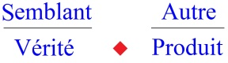
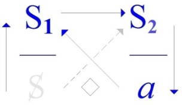
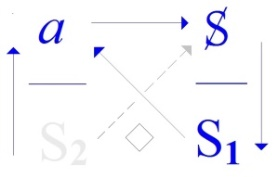
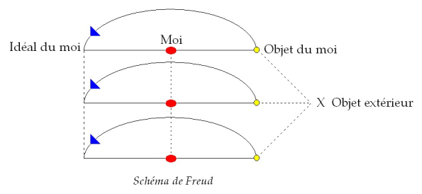

# Leçon 02 | 20 Janvier 1971

<!-- source-url: http://staferla.free.fr/S18/S18 D'UN DISCOURS...docx -->
<!-- seminar: s18 -->
<!-- lesson: 02 -->

<!-- id: s18-02-0001 -->

Si je cherchais ces feuilles, ce n’est pas pour m’assurer, mais me rassurer, de ce que j’ai énoncé la dernière fois, dont je n’ai pas le texte à cette heure-ci, je viens de m’en plaindre.

<!-- id: s18-02-0002 -->

Il me revient des propos...

<!-- id: s18-02-0003 -->

> je n’ai aucune peine à me donner pour ça ...du type de celui-ci : il se trouve que certains se sont demandés en quelques points de mon discours de la dernière fois, comme ils s’expriment, «* où je veux en venir *».

<!-- id: s18-02-0004 -->

D’autres propos me sont revenus, d’ailleurs : qu’on entend mal au fond de la salle. Je vais m’efforcer...

<!-- id: s18-02-0005 -->

> je ne le savais absolument pas la dernière fois,
>
> je croyais qu’on avait une aussi bonne acoustique que dans l’amphithéâtre précédent ...si on veut bien me faire signe au moment où malgré moi ma voix baissera, j’essaierai de faire de mon mieux.

<!-- id: s18-02-0006 -->

Donc on a pu en certains tournants, se demander la dernière fois «* où je veux en venir *»...

<!-- id: s18-02-0007 -->

À la vérité cette sorte de question me paraît, enfin assez prématurée pour être significative, c’est-à-dire que ce sont loin d’être des personnes négli­geables, ce sont des personnes fort averties, dont ce propos m’a été rapporté, quelquefois tranquillement par eux-mêmes.

<!-- id: s18-02-0008 -->

Il serait peut-être...

<!-- id: s18-02-0009 -->

> étant donné justement ce que j’ai avancé la dernière fois ...plus *impliqué* de se demander d’où je pars, ou même d’où je veux vous faire partir.

<!-- id: s18-02-0010 -->

Déjà ça, ça a deux sens :

<!-- id: s18-02-0011 -->

- ça veut peut-être dire « *aller quelque part *»,

<!-- id: s18-02-0012 -->

- puis ça peut aussi vouloir dire *décaniller d’où vous êtes *».

<!-- id: s18-02-0013 -->

Ce d’« *où je veux en venir »* est en tout cas fort exem­plaire de ce que j’avance concernant le désir de l’Autre : « *Che vuoi ? *», *qu’est-ce qu’il veut* ?

<!-- id: s18-02-0014 -->

Évidemment quand on peut le dire tout de suite, on est beaucoup plus dans son assiette.

<!-- id: s18-02-0015 -->

C’est une occasion de remarquer le facteur d’inertie que constitue ce « *Che vuoi ? *», au moins quand on veut y répondre.

<!-- id: s18-02-0016 -->

C’est bien pour ça que dans l’analyse, on s’efforce de laisser cette question en suspens.

<!-- id: s18-02-0017 -->

Néanmoins j’ai bien précisé la dernière fois que je ne suis pas ici dans la posi­tion de l’analyste.

<!-- id: s18-02-0018 -->

De sorte qu’en somme, à cette question je me crois obligé de répondre, je dois dire ce - disons - ce pourquoi j’ai parlé.

<!-- id: s18-02-0019 -->

J’ai parlé du « *semblant* » et j’ai dit quelque chose qui ne court pas les rues.

<!-- id: s18-02-0020 -->

Tout d’abord j’ai insisté, j’ai appuyé sur ceci : que *le semblant qui se donne pour ce qu’il est, est la fonction primaire de la vérité*.

<!-- id: s18-02-0021 -->

Il y a un certain *« Je parle »* qui fait ça, et le rappeler n’est pas superflu pour, à cette *vérité*...

<!-- id: s18-02-0022 -->

qui fait tellement de difficultés logiques ...donner sa juste situation.

<!-- id: s18-02-0023 -->

C’est d’autant plus important à rappeler que s’il y a dans Freud...

<!-- id: s18-02-0024 -->

pour désigner comme ça un certain ton ...s’il y a dans Freud quelque chose qui soit révolutionnaire...

<!-- id: s18-02-0025 -->

j’ai déjà mis en garde contre l’usage abusif de ce mot ...mais il est certain que s’il y a eu un moment où Freud était révolutionnaire, c’est dans la mesure où il mettait au premier plan une fonction qui est aussi celle...

<!-- id: s18-02-0026 -->

> c’est là le seul élément qu’il ait de commun d’ailleurs ...qui est aussi cet élément qu’a apporté Marx : c’est à savoir de considérer un certain nombre de faits *comme des symptômes*.

<!-- id: s18-02-0027 -->

*La dimension du symptôme c’est que ça parle,*

<!-- id: s18-02-0028 -->

- *ça parle même à ceux qui ne savent pas entendre,*

<!-- id: s18-02-0029 -->

- *ça ne dit pas tout, même à ceux qui savent.*

<!-- id: s18-02-0030 -->

Cette promotion du *symptôme*, c’est là le tournant que nous visons dans un cer­tain registre qui – disons - s’est poursuivi ronronnant pendant des siècles autour du thème de la connaissance.

<!-- id: s18-02-0031 -->

Nous ne pouvons tout de même pas dire que du point de vue de la connaissance nous soyons complètement dépourvus, et on sent bien ce qu’il y a de désuet dans la théorie de la connaissance quand il s’agit d’expliquer l’ordre de procès que constituent les formulations de la science, dont la science phy­sique donne des modèles, actuellement.

<!-- id: s18-02-0032 -->

Que nous soyons, parallèlement à cette évolution de la science, dans une position qu’on peut qualifier d’être sur la voie de quelque *vérité*, voilà ce qui montre une certaine hétérogénéité de statut de nos deux registres.

<!-- id: s18-02-0033 -->

À ceci près que dans mon enseignement, et seulement là, on s’efforce d’en montrer la cohérence.

<!-- id: s18-02-0034 -->

*Ce qui ne va pas de soi*, ou qui ne va de soi que pour ceux qui, dans *cette pratique de l’analyse*, en rajoutent quant au *semblant*. C’est ce que j’essaierai d’articuler aujourd’hui.

<!-- id: s18-02-0035 -->

J’ai dit une 2ème chose.

<!-- id: s18-02-0036 -->

Le *semblant* n’est pas seulement repérable, essen­tiel, pour désigner *la fonction primaire de la vérité* : il est impossible sans cette référence de qualifier ce qu’il en est du discours.

<!-- id: s18-02-0037 -->

Ce qui définit le discours, ce tout au moins par quoi l’année dernière j’ai essayé de donner un poids à ce terme, en en définissant quatre [^12] que je n’ai pu la dernière fois que rappeler, en rappeler je crois, mais hâtivement, les titres.

<!-- id: s18-02-0038 -->

À quoi certains, bien sûr, ont trouvé que là on perdait pied.

<!-- id: s18-02-0039 -->

Que faire ? Je ne vais pas refaire, même à titre rapide, l’énoncé de ce dont il s’agit, quoique bien sûr j’aurai à y revenir et à montrer ce qui y est.

<!-- id: s18-02-0040 -->

J’ai indiqué - qu’on s’y reporte - dans les réponses dites « *Radiophonie »* du dernier « *Scilicet »* ce qu’il en est, en quoi consiste cette *fonction du discours* telle que je l’ai énoncée l’année dernière.

<!-- id: s18-02-0041 -->

Il se supporte de 4 *places privilégiées* parmi les­quelles une d’entre elles précisément restait innommée, et justement celle qui, de chacun de ces discours, donne le titre par la fonction de son occupant :

<!-- id: s18-02-0042 -->

- c’est quand le *signifiant-maître* est à une certaine place que je parle du *discours du Maître*, \[M\]

<!-- id: s18-02-0043 -->

- quand un certain *savoir* l’occupe aussi, je parle de \[*discours de*\] *l’Université*, \[U\]

<!-- id: s18-02-0044 -->

- quand *le sujet dans sa division*, fondatrice de l’inconscient, y est en place, que je parle du *discours de l’hystérique*, \[H\]

<!-- id: s18-02-0045 -->

- et enfin quand le *plus-de-jouir* l’occupe, que je parle du *discours de l’analyste*. \[A\]

<!-- id: s18-02-0046 -->

   

<!-- id: s18-02-0047 -->

*Discours du Maître Discours de l’Hystérique Discours Universitaire Discours analytique*

<!-- id: s18-02-0048 -->

*Cette place* en quelque sorte « *sensible »*...

<!-- id: s18-02-0049 -->

> celle d’en haut et à gauche, pour ceux qui ont été là et qui s’en souviennent encore, ...*cette place* qui est ici occupée dans le *discours du Maître* par le signifiant en tant que *maître* : S1, *cette place non désignée encore*, je la désigne de son nom, du nom qu’elle mérite, c’est très précisément la place du *Semblant.*

<!-- id: s18-02-0050 -->

C’est dire, après ce que j’ai énoncé la dernière fois, à quel point le signifiant, si je puis dire, y est à sa place.

<!-- id: s18-02-0051 -->

D’où le succès du *discours du Maître*, ce succès tout de même qui mérite bien qu’on y fasse attention un instant, car enfin qui peut croire qu’aucun Maître ait jamais régné par la force ?

<!-- id: s18-02-0052 -->

Surtout au départ, parce qu’enfin comme nous le rappelle Hegel dans *cet admirable escamotage* [^13] : *un homme en vaut un autre*. Et si le *discours du Maître* fait la ligne, la structure, le point fort autour de quoi s’ordonnent plusieurs civilisations, c’est que le ressort est tout de même bien d’un autre ordre que la violence.

<!-- id: s18-02-0053 -->

Ce n’est pas dire que nous soyons sûrs, d’aucune façon, que dans ces faits, dont il faut dire que nous ne pouvons les articuler qu’avec la plus extrême précaution, que dès que nous les épinglons d’un terme quelconque, primitif, prélogique, archaïque, et quoi que ce soit de quelque ordre que ce soit : archaïque, ἀρχή \[arkè\] ça serait *le commencement*, pourquoi ?

<!-- id: s18-02-0054 -->

Et pourquoi ça serait pas aussi *un déchet*, ces sociétés primitives ?

<!-- id: s18-02-0055 -->

Mais rien ne le tranche.

<!-- id: s18-02-0056 -->

Ce qui est certain, c’est qu’elles nous montrent : qu’il n’est pas obligé que les choses s’établissent en fonction du *discours du Maître*, premièrement.

<!-- id: s18-02-0057 -->

La configuration mytho-rituelle...

<!-- id: s18-02-0058 -->

> qui est la meilleure façon de les épingler ...n’implique pas forcément l’articulation du *discours du Maître*.

<!-- id: s18-02-0059 -->

Néanmoins, il faut le dire, c’est *une certaine forme d’alibi* que de nous intéresser tellement *à ce qui n’est pas le* *discours du Maître*, dans la plupart des cas une façon de noyer le poisson, pendant qu’on s’occupe de ça, on ne s’occupe pas d’autre chose.

<!-- id: s18-02-0060 -->

Et pourtant le *discours du Maître* est une articulation essentielle, et la façon dont je l’ai dite devrait être quelque chose à quoi certains...

<!-- id: s18-02-0061 -->

je ne dis pas vous tous ...certains devraient s’employer à rompre leur esprit.

<!-- id: s18-02-0062 -->

Parce que ce dont il s’agit...

<!-- id: s18-02-0063 -->

et cela aussi je l’ai bien accentué la der­nière fois ...tout ce qui peut arriver de nouveau et qu’on appelle...

<!-- id: s18-02-0064 -->

depuis toujours et en insistant sur le « *tempérament »* qu’il convient d’y mettre ...de ce qu’on appelle « *révolutionnaire »*, ne peut consister qu’en un change­ment, qu’en un déplacement du *discours*, à savoir sur chacune de ces places, je voudrais en quelque sorte, pour faire image...

<!-- id: s18-02-0065 -->

mais à quelle sorte de crétinisa­tion l’image peut-elle conduire ...représenter par - si on peut dire - 4 « *godets* » qui auraient chacun leur nom,

<!-- id: s18-02-0066 -->

<!-- id: s18-02-0067 -->

la façon dont, dans ces godets glissent un certain nombre de termes :

<!-- id: s18-02-0068 -->

<!-- id: s18-02-0069 -->

- nommément ce que j’ai distingué de S1,

<!-- id: s18-02-0070 -->

- S2, en tant qu’au point où nous en sommes, S2 constitue un certain *corps de savoir*,

<!-- id: s18-02-0071 -->

- le *a*, en tant qu’il est directement *conséquence* du *discours du Maître*,

<!-- id: s18-02-0072 -->

- le S qui dans le *discours du Maître*, occupe cette place qui est une place dont nous allons par­ler aujourd’hui, que j’ai déjà nommée, elle, qui est la place de *la vérité*.

<!-- id: s18-02-0073 -->

*La vérité n’est pas le contraire du semblant*.

<!-- id: s18-02-0074 -->

*La vérité* si je puis dire est *cette dimension*...

<!-- id: s18-02-0075 -->

> ou cette « *demansion* » (*d.e.m.a.n*...)
>
> si vous me permettez de faire un nouveau *mot* pour désigner ces « *godets »* ...*cette demansion* qui est strictement corrélative de celle du *semblant*, *cette demansion,* je vous l’ai dit, qui - cette der­nière, celle du *semblant -* la supporte.

<!-- id: s18-02-0076 -->

Alors, quelque chose s’indique tout de même d’où veut en venir ce *semblant* \[*cf. début de séance : « où je veux en venir »*\].

<!-- id: s18-02-0077 -->

Il est clair que la question est peut-être un peu à côté, qui est celle...

<!-- id: s18-02-0078 -->

alors là, qui m’est revenue par des voies tout à fait indi­rectes ...de deux jeunes têtes...

<!-- id: s18-02-0079 -->

que je salue si elles sont encore là aujourd’hui, qu’elles ne soient pas offensées qu’on les ait entendues au passage ...qui se demandaient, en hochant gravement de leur bonnet, paraît-il : « *Est-ce que c’est un idéaliste per­nicieux ?* ». \[*Rires*\]

<!-- id: s18-02-0080 -->

Est-ce que je suis *un idéaliste per­nicieux* ?

<!-- id: s18-02-0081 -->

Ça me paraît être tout à fait à côté de la question ! \[*Rires*\]

<!-- id: s18-02-0082 -->

Parce que j’ai commencé...

<!-- id: s18-02-0083 -->

et avec quel accent : je dirai que je disais le contraire de ce que j’avais à dire exactement ...par mettre l’accent sur ceci : *que le discours c’est l’artefact*.

<!-- id: s18-02-0084 -->

Ce que j’amorce avec ça, c’est exactement le contraire, parce que *le semblant c’est le contraire de l’artefact*.

<!-- id: s18-02-0085 -->

\[*seul le symbolique permet l’accès au réel* (*cf. symptôme*), → *disqualification de l’imaginaire*\]

<!-- id: s18-02-0086 -->

Comme je l’ai fait remarquer : dans la nature *le semblant* ça foisonne.

<!-- id: s18-02-0087 -->

La question, dès qu’il ne s’agit plus de la connaissance, dès qu’on ne croit pas que c’est par la voie de la perception...

<!-- id: s18-02-0088 -->

dont nous extrairions je ne sais quelle *quintes­sence* ...que nous connaissons quelque chose, mais au moyen d’un *appareil* qui est *le discours*.

<!-- id: s18-02-0089 -->

Il n’est plus question de l’*Idée*.

<!-- id: s18-02-0090 -->

La 1ère fois que l’« *Idée »* a fait son apparition, elle était un peu mieux située qu’après les exploits de l’évêque Berkeley.

<!-- id: s18-02-0091 -->

C’est de Platon qu’il s’agissait, et qui se demandait où était le *réel* de ce qui était *nommé*  un cheval.

<!-- id: s18-02-0092 -->

Son idée de l’« *Idée »* c’était l’importance de cette dénomination.

<!-- id: s18-02-0093 -->

Dans cette chose multiple et transitoire, d’ailleurs parfaitement obscure, à son époque plus qu’à la nôtre, est-ce que toute la réalité d’un cheval n’est pas dans cette *Idée* en tant que ça veut dire le signifiant «* un cheval *».

<!-- id: s18-02-0094 -->

Faut pas croire, que parce qu’Aristote met l’accent de la réalité sur l’individu, il est beaucoup plus avancé.

<!-- id: s18-02-0095 -->

L’individu ça veut très exactement dire : *ce qu’on ne peut pas dire*.

<!-- id: s18-02-0096 -->

Et jusqu’à un certain point si Aristote n’était pas le merveilleux logicien qu’il est...

<!-- id: s18-02-0097 -->

qui a fait là le pas unique, le pas décisif grâce à quoi nous avons un repère concernant ce que c’est qu’une suite articulée de signifiants ...on pourrait dire que *dans sa façon de pointer* ce qui est l’οὐσἰα \[oussia\], autrement dit *le réel*, *il se comporte comme un mystique*.

<!-- id: s18-02-0098 -->

Le propre de l’οὐσἰα \[oussia\]...

<!-- id: s18-02-0099 -->

c’est lui-même qui le dit ...c’est qu’elle ne peut d’aucune façon être attribuée, elle n’est pas *dicible*.

<!-- id: s18-02-0100 -->

Ce qui n’est pas dicible, c’est précisément ce qui est mystique.

<!-- id: s18-02-0101 -->

Seulement il semble qu’il n’abonde pas de ce côté-là, mais il laisse la place au mystique.

<!-- id: s18-02-0102 -->

C’est évident que la solution de la question de l’*Idée* ne pouvait pas venir à Platon.

<!-- id: s18-02-0103 -->

C’est du côté de *la fonction et de la variable* que tout ça trouve sa solution.

<!-- id: s18-02-0104 -->

S’il est clair que s’il y a quelque chose que je suis, c’est que *je ne suis pas nominaliste*, je veux dire que je ne pars pas de ceci : que le nom c’est quelque chose qui se plaque comme ça sur du *réel*.

<!-- id: s18-02-0105 -->

Et il faut choisir : si on est *nominaliste*, il faut complètement renoncer au *matérialisme dialectique*, de sorte qu’en somme la tradition *nominaliste*...

<!-- id: s18-02-0106 -->

qui est à proprement parler le seul danger d’*idéalisme* qui peut se produire ici dans un discours tel que le mien ...est très évi­demment écartée.

<!-- id: s18-02-0107 -->

Il ne s’agit pas d’être *réaliste* au sens où on l’était au Moyen­-âge : *le réalisme des* *Universaux,* mais il s’agit de désigner, de pointer ceci : que notre discours, notre discours scientifique, *ne trouve le réel* qu’à ce qu’il dépende de la fonction du semblant.

<!-- id: s18-02-0108 -->

*Les effets de l’articulation*, j’entends *algébrique*, *du semblant*...

<!-- id: s18-02-0109 -->

> et comme tel il ne s’agit que de lettres ...voilà le seul appareil au moyen de quoi nous désignons ce qui est *réel* : *ce qui est réel c’est ce qui fait trou dans ce semblant*.

<!-- id: s18-02-0110 -->

Dans ce *semblant* articulé qu’est *le discours scientifique*...

<!-- id: s18-02-0111 -->

*le discours scientifique* pro­gresse sans plus même se préoccuper s’il est ou non *semblant* ...il s’agit seulement *que son réseau, que son filet, que son lattis* comme on dit, fasse apparaître les bons trous à la bonne place.

<!-- id: s18-02-0112 -->

Il n’a de référence que l’*impossible,* auquel aboutis­sent ses déductions, *cet impossible c’est le réel*.

<!-- id: s18-02-0113 -->

*L’appareil du discours* en tant que *c’est lui*, dans sa rigueur, *qui rencontre les limites de* *sa consistance*, voilà avec quoi nous visons, dans la physique, quelque chose qui est *le réel*.

<!-- id: s18-02-0114 -->

Ce qui nous importe dans ce qui nous concerne, à savoir *le champ de la vérité*...

<!-- id: s18-02-0115 -->

et pourquoi est-ce *le champ de la vérité -* seulement ainsi qualifiable - qui nous concerne, je vais essayer de l’articuler aujourd’hui ...pour ce qui nous concerne, nous avons affaire à quelque chose qui se rend compte qu’il diffère de cette posi­tion, dans la physique, du *réel*.

<!-- id: s18-02-0116 -->

Ce *quelque chose qui résiste*, qui n’est pas per­méable à tout sens, *qui est conséquence de notre discours*, *cela s’appelle le fantasme* \[S◊*a*\].

<!-- id: s18-02-0117 -->

Et ce qui est à éprouver, ce sont ses limites, c’est sa structure, la fonc­tion, le rapport dans un discours d’un des termes : du *a,* le *plus-de-jouir,* à l’S du sujet, soit précisément le point qui dans *le discours du Maître* est rompu : \[S◊*a*\]

<!-- id: s18-02-0118 -->

<!-- id: s18-02-0119 -->

Voilà ce que nous avons à éprouver dans sa fonction, quand dans la position tout opposée, *celle où le petit(a) occupe cette place* \[*place de l’analyste dans le disc. A*\] c’est *le sujet* \[S\] qui est en face \[*a →* S\], *cette place* où il est interrogé, c’est là que le fantasme doit prendre son statut, son sta­tut qui est défini par la part même d’*impossibilité* qu’il y a dans l’interrogation analytique \[*a* → S\].

<!-- id: s18-02-0120 -->

<!-- id: s18-02-0121 -->

Pour éclairer ce qu’il en est d’« *où je veux en venir* », j’irai à ce que je veux aujourd’hui marquer de ce qu’il en est de la théorie analytique.

<!-- id: s18-02-0122 -->

À ce titre, je ne reviens pas, je saute par-dessus *une fonction* qui s’exprime d’une certaine façon de parler que j’ai ici, m’adressant à vous.

<!-- id: s18-02-0123 -->

Je ne puis faire néanmoins que d’attirer votre attention sur ceci : que si la dernière fois je vous ai interpellés du terme...

<!-- id: s18-02-0124 -->

qui a pu paraître impertinent - à combien juste titre - à beaucoup ...de « *plus-de-jouir-pressé »,* devrais-je parler alors de quelque espèce de caviar, de signal pressé ?

<!-- id: s18-02-0125 -->

Ça a pourtant un sens, un sens qui est celui de ce que préserve mon discours qui en aucun cas n’a le caractère de ce que Freud a désigné comme « *le discours du lea­der »*.

<!-- id: s18-02-0126 -->

C’est bien au niveau du *discours*, au début des années 20, que Freud a articulé dans *[Massenpsychologie und Ich analyse](http://www.textlog.de/sigmund-freud-massenpsychologie-ich-analyse.html)* [^14] quelque chose qui singulière­ment s’est trouvé être au principe du phénomène nazi.

<!-- id: s18-02-0127 -->

Reportez-vous au schéma qu’il donne dans cet article, à la fin du chapitre « *Identification » *:

<!-- id: s18-02-0128 -->

<!-- id: s18-02-0129 -->

Vous y verrez - presque là en clair - indiquées *les relations du grand* I *et du* *a*.

<!-- id: s18-02-0130 -->

Vraiment, le schéma semble fait pour qu’y soient portés les signes lacaniens.

<!-- id: s18-02-0131 -->

Ce qui dans un discours s’adresse à l’Autre comme un *« Tu »,* fait surgir l’iden­tification à quelque chose qu’on peut appeler *« l’idole humaine »*.

<!-- id: s18-02-0132 -->

Si j’ai parlé la der­nière fois du *« sang rouge »* comme étant le sang le plus vain à propulser contre *le semblant*, c’est bien parce que - vous l’avez vu - on ne saurait s’avancer pour ren­verser l’*idole*, sans tout aussitôt après prendre sa place, comme on sait que c’est ce qui s’est passé pour un certain type de martyrs !

<!-- id: s18-02-0133 -->

C’est bien dans la mesure où quelque chose, dans tout discours qui fait appel au *« Tu »,* provoque à une identifi­cation camouflée, secrète, qui n’est que celle à cet objet énigmatique qui peut être rien du tout, le tout petit *plus de jouir* d’Hitler, qui n’allait peut-être pas plus loin que sa moustache, voilà ce qui a suffi à cristalliser des gens qui n’avaient rien de mystique, qui étaient tout ce qu’il y a de plus engagés dans le procès du *discours du capitaliste*, avec ce que ça comporte de mise en question du *plus de jouir* sous sa forme de *plus-value*.

<!-- id: s18-02-0134 -->

Il s’agissait de savoir si à un cer­tain niveau on en aurait encore son *petit bout*, et c’est bien ça qui a suffi à pro­voquer cet *effet d’identification*.

<!-- id: s18-02-0135 -->

Il est amusant simplement que ça ait pris la forme d’une idéalisation de « *la race »*, à savoir de la chose qui dans l’occasion était la moins intéressée.

<!-- id: s18-02-0136 -->

Mais on peut trouver d’où procède ce caractère de fiction, on peut le trouver !

<!-- id: s18-02-0137 -->

Ce qu’il faut dire simplement, c’est qu’il n’y a aucun besoin de cette idéologie pour qu’un racisme se constitue, qu’il y suffit d’un *plus de jouir* qui se reconnaisse comme tel et que quiconque s’intéresse un peu à ce qui peut advenir, fera bien de se dire que toutes les formes de racisme, en tant qu’un *plus de jouir* suffit très bien à le supporter :

<!-- id: s18-02-0138 -->

- voilà ce qui maintenant est à l’ordre du jour,

<!-- id: s18-02-0139 -->

- voilà ce qui pour les années à venir nous pend au nez.

<!-- id: s18-02-0140 -->

Vous allez mieux saisir pourquoi, quand je vous dirai ce que la théorie, l’exer­cice authentique de la théorie analytique, nous permet de formuler quant à ce qu’il est du *plus de jouir*.

<!-- id: s18-02-0141 -->

On s’imagine, on s’imagine qu’on dit quelque chose quand on dit que ce que Freud a apporté, c’est *la sous-jacence de la sexualité* dans tout ce qu’il en est du discours. On dit ça

<!-- id: s18-02-0142 -->

- quand on a été un tout petit peu touché par ce que j’énonce de *l’importance du discours pour définir* *l’incons­cient*,

<!-- id: s18-02-0143 -->

- et puis qu’on ne prend pas garde que *j’ai pas encore, moi, abordé ce qu’il en est de* *ce terme « sexualité », rapport sexuel.*

<!-- id: s18-02-0144 -->

Il est étrange certes...

<!-- id: s18-02-0145 -->

> il n’est pas étrange que d’un seul point de vue, le point de vue de la charlatanerie
>
> qui préside à toute action thérapeutique dans notre société ...il est étrange qu’on ne se soit pas aperçu du *monde* qu’il y a entre le terme *« sexualité »*...

<!-- id: s18-02-0146 -->

> partout où il com­mence - où il commence seulement - à prendre une substance biologique,
>
> et je vous ferai remarquer que s’il y a quelque part qu’on peut commencer de s’aper­cevoir du sens que ça a, c’est plutôt du côté des bactéries ...du *monde* qu’il y a entre cela, et ce dont il s’agit concernant ce que Freud énonce des relations que l’inconscient révèle.

<!-- id: s18-02-0147 -->

Quels que soient les trébuchements auxquels lui-même a pu succomber dans cet ordre, ce que Freud révèle du fonctionnement de l’incons­cient n’a rien de biologique.

<!-- id: s18-02-0148 -->

Ça n’a le droit de s’appeler sexualité que par ce qu’on appelle *rapport sexuel*.

<!-- id: s18-02-0149 -->

C’est complètement légitime d’ailleurs, jusqu’au moment où on se sert de « *sexualité »* pour désigner *autre chose*, à savoir ce qu’on étudie en biologie, à savoir le chromosome et sa combinaison XY ou XX, *où XX, XY, ça n’a absolument rien à faire avec* ce dont il s’agit qui a un nom parfaitement énonçable, et qui s’appelle *les rapports de l’homme et de la femme*.

<!-- id: s18-02-0150 -->

Il convient de partir de ces deux termes avec leur sens plein, avec ce que ça com­porte de relation.

<!-- id: s18-02-0151 -->

Parce qu’il est très étrange quand on voit les petits essais timides que les gens font pour penser à l’intérieur des cadres d’un certain appa­reil qui est celui de l’institution psychanalytique, ils s’aperçoivent que tout n’est pas réglé par les ébats qu’on nous donne comme conflictuels...

<!-- id: s18-02-0152 -->

> et ils voudraient bien autre chose : du non-conflictuel, ça repose ...et alors là, ils s’aperçoivent par exemple de ceci : c’est que on n’attend pas du tout la phase phallique pour dis­tinguer une petite fille d’un petit garçon, ils sont pas du tout pareils. Ils s’émer­veillent !

<!-- id: s18-02-0153 -->

Et alors, je vous le signale parce que d’ici que je vous retrouve...

<!-- id: s18-02-0154 -->

ça sera seulement au mois de Février, le 2ème mercredi de Février ...vous aurez peut-être le temps de lire quelque chose...

<!-- id: s18-02-0155 -->

pour une fois que je conseille un livre, ça fera monter le tirage ...qui s’appelle *Sex und Gender... and Gender -* c’est en anglais, pardon - c’est d’un nommé Stoller[^15].

<!-- id: s18-02-0156 -->

C’est très intéressant à lire à deux points de vue, d’abord parce que ça donne sur un sujet important, celui des *transsexualistes,* un certain nombre de cas très bien observés avec leurs corrélats familiaux.

<!-- id: s18-02-0157 -->

Vous savez peut-être que le *transsexualisme*, ça consiste très précisément en un désir très éner­gique de passer par tous les moyens à l’autre sexe, fût-ce à se faire opérer, quand on est du côté mâle. Voilà !

<!-- id: s18-02-0158 -->

Ce *transsexualisme*, avec les coordonnées, les obser­vations qui sont là, vous y apprendrez certainement beaucoup de choses, car ce sont des observations tout à fait utilisables.

<!-- id: s18-02-0159 -->

Vous y apprendrez également ceci, le complet...

<!-- id: s18-02-0160 -->

le caractère complètement inopérant de l’appareil dialectique avec lequel l’auteur de ce livre traite ces questions, et qui font que surgissent tout à fait directement les plus grandes difficultés qu’il rencontre pour expliquer ces cas.

<!-- id: s18-02-0161 -->

Une des choses les plus surprenantes, c’est que la face psychotique de ces cas est complètement éludée par lui, faute bien entendu de tout repère, la forclusion lacanienne ne lui étant jamais parvenue aux oreilles, ce qui explique tout de suite et très aisément la forme de ces cas. Mais qu’importe !

<!-- id: s18-02-0162 -->

L’important est ceci, c’est que pour parler d’*identité de genre*...

<!-- id: s18-02-0163 -->

ce qui n’est *rien d’autre que* ce que je viens d’exprimer comme ce terme *l’homme et la femme* ...il est clair que la question n’est posée de ce qui en surgit précocement qu’à partir de ceci :

<!-- id: s18-02-0164 -->

- qu’à l’âge adulte il est du destin des *êtres parlants* de se répartir entre hommes et femmes et que pour comprendre l’accent qui est mis sur ces choses, sur cette instance, il faut se rendre compte que ce qui définit *« l’homme »* c’est son rapport à *« la femme »,* et inver­sement,

<!-- id: s18-02-0165 -->

- que rien ne nous permet dans ces définitions de *l’homme* et de *la femme*, de les abstraire de l’expérience parlante complète, jusques et y compris dans les institutions où elles s’expriment, à savoir le mariage.

<!-- id: s18-02-0166 -->

Si on ne comprend pas

<!-- id: s18-02-0167 -->

- qu’il s’agit, à l’âge adulte, de « *faire-homme »*, que c’est cela qui constitue la relation à l’autre partie,

<!-- id: s18-02-0168 -->

- que c’est à la lumière, au départ, en partant de ceci qui constitue une relation fondamentale, qu’est interrogé tout ce qui dans le comportement de l’enfant peut être interprété comme s’orientant vers ce « *faire-homme »* par exemple,

<!-- id: s18-02-0169 -->

- et que de ce « *faire-homme »*, l’un des corrélats essentiels, c’est de *faire signe à la fille* qu’on l’est, que nous nous trouvons pour tout dire placés d’emblée dans la dimension du *semblant*, mais aussi bien...

<!-- id: s18-02-0170 -->

> tout en témoigne, y compris les références qui sont communes, qui traînent partout
>
> ...à *la parade sexuelle* chez les mammifères supérieurs principalement, mais aussi bien chez les... dans un très, très grand nombre de vues que nous pouvons avoir très, très loin dans le phylum animal, qui montre le caractère essentiel, dans le rapport sexuel, de quelque chose qu’il convient parfaitement de limiter au niveau où nous le touchons,
>
> qui n’a rien à faire ni avec un niveau cellulaire, qu’il soit chromosomique ou pas, ni avec un niveau organique, qu’il s’agisse ou non de l’ambiguïté de tel ou tel *tractus* concernant la gonade, c’est à savoir un niveau éthologique qui est celui-ci : celui proprement d’un *semblant*.

<!-- id: s18-02-0171 -->

C’est en tant que *le mâle*...

<!-- id: s18-02-0172 -->

*le mâle* le plus souvent, *la femelle* n’en est pas absente puisqu’elle est précisément le sujet qui est atteint par cette parade ...c’est en tant qu’il y a *parade* que quelque chose qui s’appelle « *copulation sexuelle* » sans doute, dans sa fonc­tion, mais qui trouve son statut d’éléments d’identité particuliers.

<!-- id: s18-02-0173 -->

Il est certain que *le comportement sexuel humain trouve référence aisément dans cette parade* telle qu’elle est définie au niveau animal.

<!-- id: s18-02-0174 -->

Il est certain que le comportement sexuel humain consiste dans un certain maintien de ce semblant animal.

<!-- id: s18-02-0175 -->

La seule chose qui l’en différencie c’est *que ce semblant soit véhiculé dans un discours*, et que c’est à ce niveau de *discours*...

<!-- id: s18-02-0176 -->

> à ce niveau de *discours* seulement ...qu’il est porté vers - permettez-moi - quelque effet *qui ne serait pas du semblant*.

<!-- id: s18-02-0177 -->

Ça veut dire qu’au lieu d’avoir l’exquise courtoisie animale, il arrive aux hommes de violer une femme, ou inversement.

<!-- id: s18-02-0178 -->

Aux limites du discours, en tant qu’il s’efforce de faire tenir le même semblant, il y a de temps en temps du *réel* : c’est ce qu’on appelle *le passage à l’acte*, je ne vois pas de meilleur endroit pour désigner ce que ça veut dire.

<!-- id: s18-02-0179 -->

Observez que dans la plupart des cas, *le passage à l’acte* est soigneusement évité.

<!-- id: s18-02-0180 -->

Ça n’arrive que par accident, et c’est bien là aussi une occasion d’éclairer ce qu’il en est de ce que je différencie depuis longtemps du *passage à l’acte*, à savoir l’*acting out,* faire passer *le semblant* sur la scène, le monter à la hauteur de la scène, en faire exemple, voilà ce qui dans cet ordre s’appelle l’*acting out.* On appelle ça encore la passion.

<!-- id: s18-02-0181 -->

Mais...

<!-- id: s18-02-0182 -->

là je suis forcé d’aller vite ...vous remarquerez que c’est à ce propos...

<!-- id: s18-02-0183 -->

et là tel que je viens d’éclairer les choses ...on peut bien pointer, bien désigner ceci, c’est ce que j’ai dit tout le temps : c’est que si le discours est là en tant qu’il permet l’enjeu de ce qu’il en est du *plus de jouir*, à savoir...

<!-- id: s18-02-0184 -->

j’y mets tout le paquet ...c’est très précisément ce qui est *interdit au discours sexuel*.

<!-- id: s18-02-0185 -->

Il n’y a pas d’acte sexuel, je l’ai déjà exprimé plusieurs fois, je l’aborde ici sous un autre angle.

<!-- id: s18-02-0186 -->

Et ceci est rendu tout à fait sensible par l’éco­nomie - mais massive - de la théorie analytique, à savoir de ce que Freud a ren­contré, et lui d’abord, et si innocemment si je puis dire, que c’est en cela qu’il est *symptôme*, c’est-à-dire qu’il fait avancer les choses au point où elles nous concernent, sur le plan de *la vérité*.

<!-- id: s18-02-0187 -->

Le mythe de l’œdipe : qui ne voit qu’il est nécessaire de désigner le *réel*, car c’est bien ce qu’il a la prétention de faire, ou plus exactement ce à quoi le théoricien est réduit quand il formule cet hyper-mythe, c’est que *le réel* à proprement parler *s’incarne*

<!-- id: s18-02-0188 -->

- de quoi ? - *de la jouissance sexuelle*,

<!-- id: s18-02-0189 -->

- comme quoi ? - *comme impossible*, puisque ce que l’œdipe désigne, c’est l’être mythique dont la jouissance... dont *sa* jouissance serait celle - de quoi ? – de toutes les femmes.

<!-- id: s18-02-0190 -->

Qu’un appareil semblable soit ici en quelque sorte imposé par *le discours même*, est-ce que ce n’est pas là le recou­pement le plus sûr de ce que j’énonce de théorie, concernant *la prévalence du discours* concernant tout ce qu’il en est précisément de *la jouissance* ?

<!-- id: s18-02-0191 -->

Ce que la théorie analytique articule est quelque chose dont le caractère saisissable comme objet est ce que je désigne de *l’objet petit(a)* en tant que par un certain nombre de contingences organiques favorables, il vient remplir - *sein, excrément, regard ou voix* - la place définie comme celle du *plus de jouir*.

<!-- id: s18-02-0192 -->

Qu’est-ce que la théorie énonce, sinon ceci : quelque chose qui tend, ce rap­port du *plus de jouir*...

<!-- id: s18-02-0193 -->

rapport au nom de quoi la fonction de la mère vient à un point tellement prévalent dans toute notre observation analytique ...*le plus de jouir* ne se normalise que d’un rapport qu’on établit à *la jouissance sexuelle*, à ceci près que *cette jouissance, cette jouissance sexuelle* *ne se formule*, *ne s’arti­cule que du phallus en tant qu’il est son signifiant*.

<!-- id: s18-02-0194 -->

Le *phallus*...

<!-- id: s18-02-0195 -->

> quelqu’un a écrit un jour ceci : que ce serait le signifiant qui désignerait le manque de signifiant,
>
> c’est absurde, je n’ai jamais articulé une chose pareille

<!-- id: s18-02-0196 -->

...*Le phallus est* très pro­prement *la jouissance sexuelle en tant* qu’elle est coordonnée, *qu’elle est soli­daire d’un semblant*.

<!-- id: s18-02-0197 -->

C’est bien ce qui se passe et c’est là ce dont il est assez étrange de voir *tous les analystes* s’efforcer de détourner leur regard.

<!-- id: s18-02-0198 -->

Loin d’avoir toujours plus insisté sur ce tournant, cette crise de la phase phallique, tout leur est bon pour l’éluder : *la crise, la vérité* à laquelle il n’est pas un de ces jeunes êtres parlants qui n’ait à faire face : *c’est qu’il y en a qui n’en ont pas*.

<!-- id: s18-02-0199 -->

Double intrusion au manque :

<!-- id: s18-02-0200 -->

- parce que « *il y en a qui n’en ont pas »,*

<!-- id: s18-02-0201 -->

- et puis, cette vérité manquait jusqu’à présent.

<!-- id: s18-02-0202 -->

L’identification sexuelle ne consiste pas à se croire *homme* ou *femme*, mais à tenir compte

<!-- id: s18-02-0203 -->

- de ce qu’il y ait des femmes, pour le garçon,

<!-- id: s18-02-0204 -->

- de ce qu’il y ait des hommes, pour la fille.

<!-- id: s18-02-0205 -->

Et ce qui est important, ça n’est même pas tellement ce qu’ils éprouvent, c’est une situation réelle - permettez-moi - c’est

<!-- id: s18-02-0206 -->

- que pour les hommes, la fille *c’est le phallus*, et que c’est ça qui les châtre,

<!-- id: s18-02-0207 -->

- que pour les femmes, le garçon c’est la même chose : le *phallus*, et c’est ça qui les châtre aussi, parce qu’elles n’acquièrent qu’un pénis et que c’est raté.

<!-- id: s18-02-0208 -->

Le garçon ni la fille d’abord ne courent de risques que par les drames qu’ils déclenchent : ils sont le *phallus* pendant un moment.

<!-- id: s18-02-0209 -->

Voilà *le réel, le réel de la jouissance sexuelle* *en tant qu’elle est détachée* comme telle, c’est le *phallus*, autrement dit le *Nom du Père*. L’identification de ces deux termes ayant en son temps scandalisé quelques pieuses personnes.

<!-- id: s18-02-0210 -->

Mais il y a quelque chose qui vaut la peine qu’on y insiste un peu plus.

<!-- id: s18-02-0211 -->

Quelle est la part - donc fondatrice - dans cette opération de *semblant...*

<!-- id: s18-02-0212 -->

telle que celle que nous venons de définir au niveau du rapport homme et femme, *...*quelle est la place du *semblant*, du *semblant archaïque* ?

<!-- id: s18-02-0213 -->

C’est assurément ce pour quoi il vaut la peine de retenir un peu plus le moment de ce que représente la femme : la femme c’est précisément...

<!-- id: s18-02-0214 -->

dans cette relation, dans ce rapport ...pour l’homme*, l’heure de la vérité*.

<!-- id: s18-02-0215 -->

La femme est en position, au regard de la jouissance sexuelle, de ponctuer *l’équivalence de la jouissance et du semblant*.

<!-- id: s18-02-0216 -->

C’est bien en cela que gît la distance où se trouve d’elle, l’homme.

<!-- id: s18-02-0217 -->

Si j’ai parlé de « *l’heure de la vérité »*, c’est parce que c’est celle à quoi toute la formation de l’homme est faite pour *répondre*, en maintenant envers et contre tout le statut de son *semblant*.

<!-- id: s18-02-0218 -->

Il est certainement plus facile à l’homme d’affronter aucun ennemi sur le plan de la rivalité, que d’affronter la femme en tant qu’elle est le support de cette *vérité*, de ce qu’il y a de *semblant* dans le rapport de l’homme à la femme.

<!-- id: s18-02-0219 -->

À la vérité, *que le semblant soit ici la jouissance* pour l’homme, *est suffisamment indiquer que la jouissance est semblant*.

<!-- id: s18-02-0220 -->

C’est parce qu’il est à l’intersec­tion de ces deux jouissances que l’homme subit au maximum le malaise de ce rapport qu’on désigne comme sexuel : comme disait l’autre[^16] : « *ces plaisirs qu’on appelle physiques* ».

<!-- id: s18-02-0221 -->

Par contre, nulle autre que la femme...

<!-- id: s18-02-0222 -->

car c’est en cela qu’elle est l’Autre ...nulle autre que la femme ne sait mieux ce qui, de *la jouissance* et du *semblant,* est dis­jonctif parce qu’elle est la présence de ce *quelque chose* qu’elle sait, à savoir :

<!-- id: s18-02-0223 -->

- que *jouissance* et *semblant*, s’ils s’équivalent dans une dimension du discours,

<!-- id: s18-02-0224 -->

> n’en sont pas moins distincts dans l’épreuve,

<!-- id: s18-02-0225 -->

- que *la femme représente pour l’homme la vérité* tout simplement, à savoir celle-là seule qui peut donner sa place en tant que telle au *semblant*.

<!-- id: s18-02-0226 -->

Il faut le dire, tout ce qu’on nous a énoncé comme étant le ressort de l’inconscient ne représente rien que l’horreur de cette vérité.

<!-- id: s18-02-0227 -->

C’est ça bien sûr qu’aujourd’hui j’essaie, je tente de vous développer comme on fait des *fleurs* *japonaises*, et qui n’est peut-être pas spécialement agréable à tous à entendre, c’est ce qu’on empaquette d’habitude sous le registre du *complexe de castration*.

<!-- id: s18-02-0228 -->

Moyennant quoi, là, avec cette petite étiquette, on est calme, on peut le laisser de côté, on n’a plus jamais rien à en dire, sinon que c’est là et qu’on lui fait une petite révérence de temps en temps.

<!-- id: s18-02-0229 -->

Mais *que la femme soit la vérité de l’homme*, que cette vieille histoire pro­verbiale...

<!-- id: s18-02-0230 -->

> quand il s’agit de comprendre quelque chose, le « *cherchez la femme* »,
>
> à quoi on donne naturellement une interprétation policière ...soit quelque chose de tout autre, à savoir que pour avoir *la vérité d’un homme*, on ferait bien de savoir *quelle est sa femme* - j’entends : *son épouse -* à l’occasion, et pourquoi pas ?

<!-- id: s18-02-0231 -->

C’est le seul endroit où ça ait un sens, ce que quelqu’un un jour dans mon entou­rage a appelé le pèse-personne.

<!-- id: s18-02-0232 -->

Pour peser une personne, rien de tel que de peser sa femme, quand il s’agit d’*un homme.*

<!-- id: s18-02-0233 -->

Quand il s’agit d’*une femme* c’est pas la même chose !

<!-- id: s18-02-0234 -->

Parce que la femme a une très très grande liberté...

<!-- id: s18-02-0235 -->

*Plus fort !*

<!-- id: s18-02-0236 -->

Qu’est-ce qu’il y a ?

<!-- id: s18-02-0237 -->

*On n’entend pas !*

<!-- id: s18-02-0238 -->

Vous n’entendez pas ?

<!-- id: s18-02-0239 -->

*Non !*

<!-- id: s18-02-0240 -->

J’ai dit : la femme a une très grande liberté à l’endroit du *semblant !* \[*Rires*\]

<!-- id: s18-02-0241 -->

Elle arrivera à donner du poids même à un homme qui n’en a aucun.

<!-- id: s18-02-0242 -->

C’est des vérités bien sûr qui au cours des siècles étaient déjà parfaitement repérées depuis longtemps, mais qui ne sont jamais dites que de bouche à bouche, si je puis dire. \[*Rires*\]

<!-- id: s18-02-0243 -->

Et toute une littérature est faite, existe, il s’agirait de connaître son ampleur, naturellement ça n’a d’intérêt que si on prend la meilleure.

<!-- id: s18-02-0244 -->

Quelqu’un par exemple, dont il faudrait un jour que quelqu’un se charge, c’est Baltazar Gracián, qui était un jésuite éminent, et qui a écrit de ces choses parmi les plus intelligentes qu’on puisse écrire.

<!-- id: s18-02-0245 -->

Leur intelligence est absolument prodigieuse en ceci que tout ce dont il s’agit, à savoir établir ce qu’on peut appeler *la sainteté de l’homme*, en un mot résume-t-il...

<!-- id: s18-02-0246 -->

résume-t-il quoi ? – son livre sur *L’Homme de cour* [^17] ...en un mot, deux points : être un saint.

<!-- id: s18-02-0247 -->

C’est le seul point de la civilisation occidentale où le mot « *saint* » ait le même sens qu’en chinois, *shénshèng* 神聖

<!-- id: s18-02-0248 -->

Notez ce point, parce que cette référence...

<!-- id: s18-02-0249 -->

parce que tout de même il est tard aujourd’hui, et ce n’est pas aujourd’hui que je l’introduirai, ...je vous ferai cette année quelques petites références aux origines de la pensée chinoise.

<!-- id: s18-02-0250 -->

Quoi qu’il en soit, oui je me suis aperçu d’une chose, c’est que peut-être je ne suis lacanien que parce que j’ai fait du chinois autrefois.

<!-- id: s18-02-0251 -->

Je veux dire par là que je m’aperçois, à relire des trucs comme ça que j’avais parcourus...

<!-- id: s18-02-0252 -->

mais ânonnés, enfin comme un nigaud, avec des oreilles d’âne, je me suis aperçu à les relire maintenant que... enfin c’est de plain-pied avec ce que je raconte.

<!-- id: s18-02-0253 -->

Je ne sais pas, je donne un exemple : dans [Mencius](http://classiques.uqac.ca/classiques/chine_ancienne/B_livres_canoniques_Petits_Kings/B_12_les_4_livres_IV/meng_tzeu.html), qui est un des livres fon­damentaux, canoniques, de la pensée chinoise, il y a un type...

<!-- id: s18-02-0254 -->

> qui est son disciple d’ailleurs, ce n’est pas lui ...et qui commence d’énoncer des choses comme ceci :

<!-- id: s18-02-0255 -->

« *Ce que vous ne trouvez pas du côté du yán* 言- c’est « *le discours* » *- ne le cherchez pas du côté de votre esprit.* »

<!-- id: s18-02-0256 -->

Enfin je vous traduis *esprit,* c’est *xīn* 心 , mais ça veut dire qu’il désignait par *xīn,* qui veut dire *le cœur*, ce qu’il désignait c’était bel et bien *l’esprit*, le *Geist* de Hegel.

<!-- id: s18-02-0257 -->

Mais enfin ça demanderait un tout petit peu plus de dévelop­pements.

<!-- id: s18-02-0258 -->

« *Et si vous ne trouvez pas du côté de votre esprit, ne le cherchez pas du côté de votre qì* 氣 »

<!-- id: s18-02-0259 -->

C’est-à-dire de ce que les jésuites traduisent comme ça, comme ils peuvent, en perdant un peu le souffle : « ...*de votre sensibilité*. »

<!-- id: s18-02-0260 -->

Je ne vous indique cet étagement que pour vous dire la distinction qu’il y a, très stricte, entre

<!-- id: s18-02-0261 -->

- ce qui s’articule, ce qui est du *discours*,

<!-- id: s18-02-0262 -->

- et ce qui est de *l’esprit*, à savoir l’essentiel.

<!-- id: s18-02-0263 -->

*Si vous n’avez pas déjà* *trouvé au niveau de* *la parole*, c’est désespéré, *n’essayez pas d’aller chercher ailleurs au niveau des sentiments.*

<!-- id: s18-02-0264 -->

Meng-Tseu, Mencius, le contredit, c’est un fait, mais il s’agit de savoir par quelle voie et pourquoi.

<!-- id: s18-02-0265 -->

Ceci pour vous dire que, d’une certaine façon mettre au premier plan - tout à fait - le discours, c’est pas du tout quelque chose qui nous fasse remonter à des archaïsmes.

<!-- id: s18-02-0266 -->

Parce que le discours à cette époque, à l’époque de Mencius, était déjà parfaitement articulé et constitué.

<!-- id: s18-02-0267 -->

Ça n’est pas au moyen des références à une pensée primitive qu’on peut le comprendre.

<!-- id: s18-02-0268 -->

À la vérité je ne sais pas ce que c’est qu’une pensée primitive.

<!-- id: s18-02-0269 -->

Une chose beaucoup plus concrète que nous avons à notre portée, c’est ce qu’on appelle « *le sous-développement* ».

<!-- id: s18-02-0270 -->

Mais ça, le sous-développement, ça n’est pas *archaïque*, chacun sait que c’est produit par l’extension du règne capitaliste.

<!-- id: s18-02-0271 -->

Je dirai même plus : ce dont on s’aperçoit, et dont on s’apercevra de plus en plus, c’est que le sous-développement c’est très pré­cisément la condition du progrès capitaliste.

<!-- id: s18-02-0272 -->

Sous un certain angle, la révolution d’Octobre elle-même en est une preuve.

<!-- id: s18-02-0273 -->

Mais ce qu’il faut voir, c’est que ce à quoi nous avons à faire face c’est à un sous-développement qui va être de plus en plus patent, de plus en plus étendu.

<!-- id: s18-02-0274 -->

Ce qu’il s’agit en somme, c’est que nous mettions à l’épreuve ceci : si la clef des divers problèmes qui vont se proposer à nous n’est pas de nous mettre au niveau de cet effet de l’articulation capitaliste que j’ai laissée dans l’ombre l’année dernière, à ne vous donner que sa racine dans *le discours du Maître*, je pourrai peut-être en donner un peu plus cette année.

<!-- id: s18-02-0275 -->

Il conviendrait... il faut voir ce que nous pouvons tirer de ce que j’appellerai « <u>*une logique sous-dévelop­pée*</u>* »*.

<!-- id: s18-02-0276 -->

C’est cela que j’essaie d’articuler devant vous, comme disent les textes chi­nois : « *pour votre meilleur usage* ».

## Notes

[^12]: Cf. dans le séminaire 1970-71 : « *La psychanalyse à l’envers* », la théorie des quatre discours.

[^13]: *i.e. « La Phénoménologie de l’Esprit ».*

[^14]: Sigmund Freud : « [*Massenpsychologie und Ich-Analyse*](http://www.textlog.de/sigmund-freud-massenpsychologie-ich-analyse.html) », « *[Psychologie collective et analyse du moi](http://classiques.uqac.ca/classiques/freud_sigmund/essais_de_psychanalyse/Essai_2_psy_collective/Freud_Psycho_collective.pdf) »*, Payot, 1968.

[^15]:
    #  Robert Jesse Stoller : « *Recherches sur l’identité sexuelle à partir du transsexualisme* », Gallimard, 1979.

[^16]: Colette : « *Ces plaisirs*... », 1932.

[^17]: Baltazar Gracián : *L’Homme de cour*, Flammarion, Paris, 1980.
