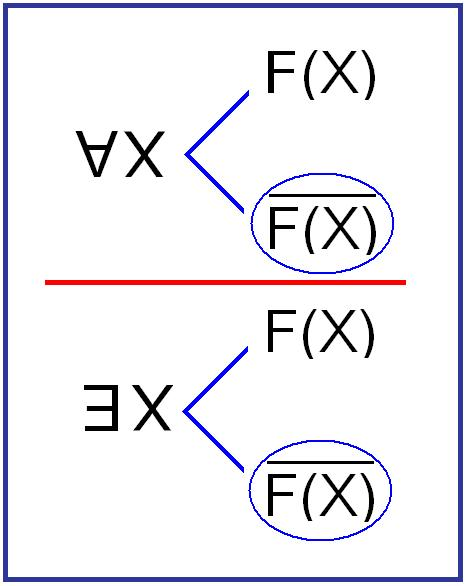
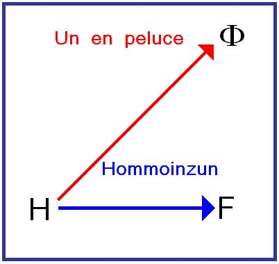

# Leçon 08 | 19 Mai 1971

<!-- source-url: http://staferla.free.fr/S18/S18 D'UN DISCOURS...docx -->
<!-- seminar: s18 -->
<!-- lesson: 08 -->

<!-- id: s18-08-0001 -->

Si je commence par l’abrupt en somme de ce que j’ai à vous dire, ça pourrait s’exprimer ainsi : c’est que dans ce que nous explorons, à partir d’un *certain dis­cours*...

<!-- id: s18-08-0002 -->

> dans l’occasion le mien, le mien en tant que c’est *celui de l’analyste* ...disons que ça détermine des fonctions, en d’autres termes que *les fonctions ne sont déterminées qu’à partir d’un certain discours*.

<!-- id: s18-08-0003 -->

Alors, *à ce niveau des fonctions déterminées par un certain discours*, je peux établir l’équivalence que : « *l’écrit, c’est la jouissance* ».

<!-- id: s18-08-0004 -->

Naturellement ça n’est casable qu’à l’intérieur de cette première articulation des fonctions déterminées par *un discours*. Disons que ça tient exac­tement la même place à l’intérieur de ces fonctions.

<!-- id: s18-08-0005 -->

Ceci étant énoncé comme ça tout abrupt, pourquoi ? Ben, pour que vous le mettiez à l’épreuve.

<!-- id: s18-08-0006 -->

C’est vrai que ça vous mènera toujours quelque part. Et même de préférence à quelque chose d’exact.

<!-- id: s18-08-0007 -->

Ceci bien sûr ne me dispense pas du soin de vous y introduire par les voies qui conviennent, à savoir

<!-- id: s18-08-0008 -->

- celles, non pas qui le jus­tifient pour moi, étant donné d’où je vous parle,

<!-- id: s18-08-0009 -->

- mais celles par lesquelles ça peut s’expliquer.

<!-- id: s18-08-0010 -->

Je suppose - je ne suppose pas forcément - que je m’adresse ici tou­jours à des analystes, au reste c’est bien ce qui fait que mon discours n’est pas facilement suivi, c’est très précisément en tant qu’il y a quelque chose qui au niveau du *discours de l’analyste*, fait obstacle à un certain type d’inscription.

<!-- id: s18-08-0011 -->

Cette inscription pourtant, c’est ce que je laisse, c’est ce que je propose, c’est ce que j’espère qui passera, qui passera d’un point d’où, si l’on peut dire, le dis­cours analytique prenne un nouvel élan.

<!-- id: s18-08-0012 -->

Alors, il s’agit donc de rendre sensible comment la transmission d’une *lettre* a un rapport avec quelque chose d’essentiel, de fondamental, dans l’organisation du discours quel qu’il soit, à savoir *la jouissance*.

<!-- id: s18-08-0013 -->

Pour ça bien sûr, il faut que à chaque fois je vous mette au ton de la chose.

<!-- id: s18-08-0014 -->

Comment le faire, si ce n’est à rap­peler l’exemple de base dont je suis parti, c’est à savoir que c’est très expressé­ment d’étudier *la lettre* comme telle...

<!-- id: s18-08-0015 -->

> en tant que quoi ? *en tant que* - je l’ai dit - *elle a un effet féminisant* ...que j’ouvre mes *Écrits.*

<!-- id: s18-08-0016 -->

Cette *lettre* en somme, je l’ai resou­ligné encore la dernière fois, elle fonctionne très spécifiquement en ceci que *per­sonne ne sait rien de son contenu* \[*Cf. symptôme*\] et que jusqu’à la fin du conte personne n’en saura rien.

<!-- id: s18-08-0017 -->

Elle est très exemplaire, elle est très exemplaire en ceci que naturellement il n’y a qu’au benêt...

<!-- id: s18-08-0018 -->

> et encore, je pense que même au benêt l’idée ne lui est pas venue ...que *cette lettre est* quelque chose d’aussi sommaire, d’aussi grossier que quelque chose qui porterait le témoignage de ce qu’on appelle communé­ment *un rapport sexuel*.

<!-- id: s18-08-0019 -->

Encore que ce soit écrit par un homme, et comme on dit et c’est souligné, par un *Grand*, par un *Grand* et à une *Reine*, il est évident que c’est pas ça qui fait un drame, et que cette lettre, qu’il est de la tenue d’une Cour...

<!-- id: s18-08-0020 -->

> si je puis dire, c’est-à-dire de quelque chose de fondé
>
> \- c’est la meilleure définition qu’on en puisse donner - sur *la distribution de la jouissance* ...il est de la tenue d’une Cour que dans cette distribution, *elle mette* ce qu’on appelle à proprement parler *le rapport sexuel* à son rang, c’est-à-dire bien évi­demment *le plus bas*.

<!-- id: s18-08-0021 -->

Personne n’y relève comme notables les services qu’une *grande Dame* peut à ce titre recevoir d’un *laquais*.

<!-- id: s18-08-0022 -->

Avec la Reine, bien sûr, et justement parce que c’est la Reine, les choses doi­vent prendre un autre accent.

<!-- id: s18-08-0023 -->

Mais d’abord donc, il est posé - ce qui est d’expé­rience - qu’un homme né, c’est celui qui, si je puis dire « de race », ne saurait prendre ombrage d’une liaison de son épouse, qu’à la mesure de sa décence, c’est-à-dire des formes respectées.

<!-- id: s18-08-0024 -->

La seule chose qui pourrait y faire objection est bien sûr l’introduction de bâtards dans la lignée, mais même ça après tout, ça peut servir à un rajeunissement d’un sang.

<!-- id: s18-08-0025 -->

Où se voit évidemment ici...

<!-- id: s18-08-0026 -->

> dans un cadre qui, pour ne pas vous être spécialement présentifié dans la société actuelle,
>
> n’en est pas moins exemplaire et fondamental pour ce qui est de raisonner des rapports sociaux, ...à quoi se voit, dis-je en somme qu’il n’y a rien de tel qu’un ordre fondé sur l’artifice pour y faire apparaître cet élément qui lui en apparence, est juste­ment celui qui doit paraître irréductible dans le *réel*, à savoir *la fonction du besoin*.

<!-- id: s18-08-0027 -->

Si je vous ai dit qu’il y a un ordre dans lequel il est tout à fait mis à sa place, qu’un sujet - si haut placé qu’il soit - se réserve cette part de jouissance irré­ductible, la part minimale, à ne pas pouvoir être sublimée, comme s’exprime Freud expressément, seul un ordre fondé sur l’artefact, j’ai spécifié la Cour...

<!-- id: s18-08-0028 -->

> la Cour pour autant qu’elle redouble l’artefact déjà de la noblesse,
>
> de ce second artefact *d’une distribution ordonnée de la jouissance* ...et c’est seulement là que peut décemment trouver sa place le besoin : le besoin expressément spécifié comme tel, est le besoin sexuel.

<!-- id: s18-08-0029 -->

Seulement ce qui paraît d’un côté spécifier le naturel, être ce qui, je dirai, du point de vue d’une théorisation en somme biologique du rapport sexuel, pour­rait faire partir d’un besoin ce qui doit en résulter, à savoir la reproduction, nous constatons que si l’artefact est satisfaisant à une certaine théorisation primaire d’un côté, de l’autre il laisse évidemment la place à ceci, c’est que la reproduc­tion peut aussi bien dans ce cas n’être pas la reproduction je dirai - entre guille­mets - « *légitime* ».

<!-- id: s18-08-0030 -->

Ce besoin, cet irréductible dans le rapport sexuel, on peut admettre bien sûr qu’il existe toujours, et Freud l’affirme.

<!-- id: s18-08-0031 -->

Mais ce qu’il y a de certain, c’est qu’*il n’est pas mesurable* tant qu’il n’est pas expressément...

<!-- id: s18-08-0032 -->

> et il ne peut l’être que dans l’artefact ...dans l’artefact de la relation à l’Autre avec un grand A.

<!-- id: s18-08-0033 -->

*Il n’est pas mesurable*, et c’est bien cet élément d’indétermination où se signe ce qu’il y a de fondamental, c’est très précisément que le rapport sexuel n’est pas *inscriptible*, n’est pas fondable comme rapport.

<!-- id: s18-08-0034 -->

C’est bien en quoi *la lettre*, *la lettre* dont je pars pour en ouvrir mes *Écrits,* se désigne de ce qu’elle est, et de ce en quoi elle indique tout ce que Freud lui-même développe, c’est que si elle sert quelque chose qui est de l’ordre du sexe, c’est non pas certes un rapport sexuel, mais un rapport, disons, *sexué*.

<!-- id: s18-08-0035 -->

La différence entre les deux est celle-ci, c’est que...

<!-- id: s18-08-0036 -->

> c’est ce que Freud démontre, ce qu’il a apporté de décisif ...c’est que par l’intermédiaire de l’inconscient nous entre­voyons que tout ce qui est du langage

<!-- id: s18-08-0037 -->

- a affaire avec le sexe,

<!-- id: s18-08-0038 -->

- est dans un *certain rapport* avec le sexe, mais très précisément en ceci que *le rapport sexuel* ne peut...

<!-- id: s18-08-0039 -->

> du moins jusqu’à l’heure présente ...d’aucune façon s’y inscrire.

<!-- id: s18-08-0040 -->

La prétendue sexualisation par la doctrine freudienne...

<!-- id: s18-08-0041 -->

> de ce qu’il en est des fonctions qu’on peut appeler *subjectives*,
>
> à condition de les bien situer, de les situer de l’ordre du langage ...la prétendue sexualisation consiste essentiellement en ceci : que ce qui devrait résulter du langage, à savoir que la relation sexuelle d’une façon quel­conque puisse s’y inscrire, montre précisément - et ceci dans le fait - montre son échec : *elle n’est pas inscriptible*.

<!-- id: s18-08-0042 -->

Vous voyez là déjà fonctionner ceci qui fait par­tie de cet effet d’écart, cet effet de division, qui est celui auquel nous avons régu­lièrement toujours affaire, et c’est bien pour cela qu’il faut en quelque sorte vous y former, c’est que j’énonce par exemple ceci : que le rapport sexuel, c’est juste­ment dans la mesure où quelque chose échoue, échoue à ce qu’il soit...

<!-- id: s18-08-0043 -->

> est-ce « *énoncé* » dans le langage ?
>
> Mais justement ça n’est pas « *énoncé* » que j’ai dit : c’est « *inscriptible* » ...*inscriptible* en ceci que ce qui est exigible, que ce qui est exigible pour qu’il y ait fonction, c’est que *du langage* « *quelque chose » puisse se produire* qui est *l’écriture* expressément - comme telle - de la fonction, à savoir ce « *quelque chose »* que déjà je vous ai plus d’une fois symbolisé de la façon la plus simple, à savoir ceci : F dans *un certain rapport* avec *x* : F → *x*.

<!-- id: s18-08-0044 -->

Donc, au moment de dire que le langage c’est ce « *quelque chose »* qui ne rend pas compte du rapport sexuel, il n’en rend pas compte - en quoi ? - en ceci que de *l’inscription* qu’il est capable de commenter, il ne peut faire que cette *inscription* soit...

<!-- id: s18-08-0045 -->

> car c’est en cela que cela consiste ...soit ce que je définis comme ins­cription effective de quelque chose qui serait *le rapport sexuel,* en tant qu’il mettrait en rapport les deux pôles, les deux termes qui s’intituleraient de *l’homme et de la femme,* en tant que cet *homme* et cette *femme* sont des sexes respectivement *spécifiés du masculin et du féminin* - chez qui, chez quoi ? - chez *un être qui parle.* Autrement dit, *qui habitant le langage,* se trouve en tirer cet usage qui est celui de *la parole*.

<!-- id: s18-08-0046 -->

C’est en cela qu’ici ce n’est pas rien que de mettre en avant *la lettre*, à proprement parler comme dans un certain rapport, rapport de la femme avec ce qui de Loi écrite, s’inscrit dans le contexte où la chose se place, à savoir, du fait qu’elle est - au titre de Reine - l’image de la femme comme conjointe au Roi.

<!-- id: s18-08-0047 -->

C’est en tant que quelque chose est improprement ici *symbolisé*, et typi­quement autour *du rapport* *comme sexuel*...

<!-- id: s18-08-0048 -->

> et il n’est pas vain que précisément il ne puisse être incarné que dans *des êtres de fiction* ...c’est en tant que ceci, que le fait qu’une lettre, qu’une lettre lui soit adressée prend la valeur, prend la valeur que je désigne pour me lire, pour m’énoncer dans mes propres propos : « *ce signe*...

<!-- id: s18-08-0049 -->

> « *ce signe » *- *il s’agit de la lettre* ...*est bien celui de la femme pour ce qu’elle y fait valoir son être, en le fondant hors de la Loi,* *qui la contient toujours de par l’effet de ses origines, en position de signifiant, voire de fétiche.* »[^67].

<!-- id: s18-08-0050 -->

Il est clair que sans l’introduction de la psychanalyse, une telle énonciation...

<!-- id: s18-08-0051 -->

> qui est pourtant celle dont procède, je dirai la révolte de la femme ...une telle énonciation que de dire que *la Loi la contient toujours de par l’effet de ses origines en position de signi­fiant, voire de fétiche*, ne saurait... bien entendu, je le répète, hors de l’introduc­tion de la psychanalyse ...être énoncée.

<!-- id: s18-08-0052 -->

Donc, c’est précisément en ceci que *le rapport sexuel* est - si je puis dire - *étatisé*, c’est-à-dire en étant *incarné* dans celui du Roi et de la Reine...

<!-- id: s18-08-0053 -->

mettant en valeur, de la vérité*, la structure de fiction*, ...c’est à partir de là que prend fonction, effet, *la lettre*...

<!-- id: s18-08-0054 -->

> qui se pose sûrement d’être en rapport avec la déficience,
>
> la défi­cience marquée d’une certaine promotion en quelque sorte arbitraire et fictive du rapport sexuel, ...et que c’est là que prenant sa valeur, elle pose sa question.

<!-- id: s18-08-0055 -->

C’est tout de même une occasion ici...

<!-- id: s18-08-0056 -->

ne considérez pas que ceci s’emmanche en quelque sorte d’une façon directe sur ce que je viens de rappeler mais ces sortes de sauts, de décalages, sont proprement nécessités par le point où je veux vous mener ...c’est une occasion de marquer qu’ici se confirme, bien sûr, ceci que *la vérité* *ne progresse que d’une structure de fic­tion*.

<!-- id: s18-08-0057 -->

C’est à savoir que justement, dans son *essence*, c’est de ce que se promeuve quelque part *une structure de fiction*...

<!-- id: s18-08-0058 -->

> laquelle est proprement *l’essence même du langage* ...que quelque chose peut se produire, qui est quoi ?

<!-- id: s18-08-0059 -->

Mais justement, cette sorte d’interrogation, cette sorte de presse, de serrage, qui met *la vérité*, si je puis dire, au pied du mur de la vérification. Ça n’est rien d’autre que la dimension de *la science*.

<!-- id: s18-08-0060 -->

En quoi se montre jus­tement enfin que la voie dont se justifie si je puis dire, la voie dont nous voyons que la science progresse, c’est que la part qu’y prend la logique n’est pas mince.

<!-- id: s18-08-0061 -->

Quel que soit *le caractère originellement, fondamentalement*, *foncièrement fic­tif* de ce qui fait le matériel dont s’articule le langage, il est clair qu’il y a une voie qui s’appelle de vérification, c’est celle qui s’attache à saisir *où la fiction* si je puis dire *bute*, et *ce qui l’arrête*.

<!-- id: s18-08-0062 -->

Il est clair qu’ici, quel que soit ce que nous a permis d’*inscrire*...

<!-- id: s18-08-0063 -->

> et vous verrez tout à l’heure ce que ça veut dire ...*le progrès de la logique*, je veux dire la voie écrite par où elle a progressé, il est clair que cette *butée* est tout à fait efficace de s’inscrire à l’intérieur même du *système de la fic­tion*, elle s’appelle la contradiction.

<!-- id: s18-08-0064 -->

Que si la science apparemment a progressé bien autrement que par les voies de la tautologie, ça n’ôte rien à la portée de ma remarque, à savoir que *la mise en demeure*, portée d’un certain point, *à la vérité d’être vérifiable*, c’est précisé­ment cela qui a forcé d’abandonner toutes sortes d’autres prémisses prétendu­ment intuitives, et que si...

<!-- id: s18-08-0065 -->

je ne vais pas y revenir aujourd’hui, j’ai suffisamment insisté sur la caractéristique de tout ce qui a précédé, frayé la voie, à la découverte newtonienne par exemple ...c’est bien très précisément de ce que aucune *fic­tion* ne s’avérait satisfaisante, autre qu’*une d’entre elles,* qui précisément devait abandonner tout recours à l’intuition et s’en tenir à un certain *inscriptible*.

<!-- id: s18-08-0066 -->

C’est donc en quoi nous avons à nous attacher à ce qu’il en est de l’*inscriptible* dans ce rapport à la vérification.

<!-- id: s18-08-0067 -->

Pour en finir bien sûr avec ce que j’ai dit de *l’effet de la lettre* dans *La Lettre volée,* qu’ai-je dit expressément ?

<!-- id: s18-08-0068 -->

C’est qu’*elle féminise ceux qui se trouvent* en être dans une position qui est celle d’être « *à son ombre* ».

<!-- id: s18-08-0069 -->

Bien sûr, c’est là que se touche l’importance de cette notion : « *fonction de l’ombre* », \[*cf. Lituraterre* : *« ...poussent à l’ombre ce qui n’en miroite pas...*\] pour autant que déjà la dernière fois dans ce que je vous ai énoncé de ce qu’est précisément un écrit...

<!-- id: s18-08-0070 -->

> je veux dire de quelque chose qui se présen­tait sous forme littérale, ou littéraire ...*l’ombre pour être produite a besoin d’une source de lumière*... Oui !

<!-- id: s18-08-0071 -->

Et ce que j’avais fait ne vous a été sensible que *de ce que comporte* *l’Aufklärung,* de quelque chose *qui garde structure de fiction*. Je parle de l’époque historique \[*« les Lumières »*\] bien sûr, qui n’a pas été mince, et dont il nous peut être utile \- il l’est ici, et c’est ce que je fais - d’en retracer les voies, ou de les reprendre, mais en elles-mêmes.

<!-- id: s18-08-0072 -->

Il est clair que ce qui fait *la lumière* \[*ie le rayonnement du (a) et son effet de « sens-signification »*\], c’est précisément de ce qui part de *ce champ* qui se définit lui-même comme étant celui *de la vérité*, et c’est comme tel, en tant que tel, que la lumière qu’il répand \[*ce champde la vérité*\] à chaque ins­tant...

<!-- id: s18-08-0073 -->

> dût-elle même avoir cet effet efficace de ce que ce qui y fait opacité pro­jette *une ombre*
>
> *et que c’est cette ombre qui porte <u>effet</u>* \[*→ « effet de trou » d’où l’équivoque évoque, convoque, la jouissance *: *« effet de corps »*\] ...que cette *vérité elle-même* nous \[*analystes*\] avons toujours à l’interroger sur sa *structure de fiction*. \[*l’effet de trou qui voisine avec l’effet de sens*\]

<!-- id: s18-08-0074 -->

C’est ainsi qu’en fin de compte il ressort que comme c’est énoncé, énoncé expressément dans cet écrit, *la lettre*, bien sûr, ce n’est pas à la femme, à la femme dont elle porte l’adresse \[*qu’elle vise*\], qu’elle satisfait en arrivant à sa destination, mais au sujet, à savoir très précisément - pour le redéfinir - à ce qui est divisé dans le fan­tasme, c’est-à-dire à la réalité en tant qu’engendrée par une *structure de fiction*.

<!-- id: s18-08-0075 -->

C’est bien ainsi que se clôt le conte, tout au moins tel que dans un second texte - celui qui est le mien - je le refais, et c’est de là que nous devons partir pour réin­terroger plus loin \[*que le sens-signification*\] ce qu’il en est de *la lettre*.

<!-- id: s18-08-0076 -->

C’est très précisément dans la mesure où ceci n’a jamais été fait, que - pour le faire - je dois prolonger moi-même ce dis­cours sur *la lettre*. Voilà !

<!-- id: s18-08-0077 -->

Ce dont il faut partir est tout de même ceci : c’est que ce n’est pas en vain que je vous somme de ne rien manquer de ce qui se pro­duit dans l’ordre de la logique...

<!-- id: s18-08-0078 -->

ça n’est certes pas pour que vous vous obligiez, si l’on peut dire, à en suivre les constructions et les détours ...c’est en ceci que nulle part comme dans ces constructions qui s’intitulent elles-mêmes d’être *de logique symbolique*, nulle part n’apparaît mieux *le déficit de toute possibi­lité de réflexion*. \[*cf. les railleries de Lacan sur « l’histoire de la pensée »*\]

<!-- id: s18-08-0079 -->

Je veux dire que rien n’est plus embarrassé, c’est bien connu n’est-ce pas, que l’introduction d’un traité de logique, l’impossibilité qu’a la logique de se poser elle-même d’aucune façon justifiable est quelque chose de tout à fait frappant.

<!-- id: s18-08-0080 -->

C’est à ce titre que l’expérience de la lecture de ces traités, et ils sont d’autant plus saisissants bien sûr à mesure qu’ils sont plus modernes, qu’ils sont plus dans l’en-avant de ce qui constitue effectivement, et bien effective­ment, un progrès de la logique, qui est celui du progrès de l’inscription de ce qui s’appelle « *articulation logique »*, l’articulation de la logique elle-même étant incapable de définir elle-même ni ses buts, ni son principe, ni quoi que ce soit qui ressemble même à une matière.

<!-- id: s18-08-0081 -->

C’est fort étrange et c’est précisément en ceci que c’est fort suggestif, car c’est bien là ce qui vaudrait de toucher, d’approfondir ce qu’il en est de quelque chose qui ne se situe assurément que du *langage*, et de saisir que si peut-être dans *ce langage*, rien de ce qui ne s’avance jamais que maladroitement comme n’étant de *ce* *langage,* disons un usage correct, ne peut très précisément s’énoncer qu’à ne pas pouvoir se justifier, ou ne se justifier que de la façon la plus confuse par toutes sortes de tentatives qui sont par exemple celles qui consistent à diviser le langage en un « *langage-objet »* et un « *métalangage »*, ce qui est tout le contraire de ce que démontre toute la suite, à savoir qu’il n’y a pas moyen un seul instant de parler de ce *langage* prétendument *objet* sans user bien sûr, non pas d’un « *métalangage* », mais bel et bien du langage qui est le langage courant.

<!-- id: s18-08-0082 -->

Mais dans cet échec même peut se dénoncer ce qu’il en est de l’articulation qui précisément a le rapport le plus étroit avec le fonctionnement du langage, c’est-à-dire l’articulation suivante : c’est à savoir que le rapport, *le rapport sexuel*, ne peut pas être écrit.

<!-- id: s18-08-0083 -->

Donc à ce titre et à seule fin, si je puis dire, de faire quelques mouvements qui nous rappellent la dimension dans laquelle nous nous déplaçons, je rappel­lerai ceci, à savoir comment d’abord se présente ce qui inaugure le tracé de la logique, à savoir comme logique formelle, et dans Aristote.

<!-- id: s18-08-0084 -->

Bien sûr je ne vais pas pour vous, reprendre...

<!-- id: s18-08-0085 -->

> encore que ce serait très instructif, ce serait très instructif mais après tout, chacun de vous peut bien
>
> se donner seulement la peine d’ouvrir les « *Premiers Analytiques ».* Qu’ils se mettent à l’épreuve
>
> de cette reprise, qu’ils ouvrent donc les « *Premiers Analytiques »,* et ils y verront ce qu’est le syllogisme,
>
> et le syllogisme après tout il faut bien en partir, du moins est-ce là que je reprends les choses,
>
> puisque, à notre avant-dernière rencontre, c’est là-dessus que j’ai terminé ...je ne vais pas le reprendre en l’exemplifiant...

<!-- id: s18-08-0086 -->

> car pour ceci le temps nous limite ...en l’exemplifiant de toutes les formes de *syllogisme*.

<!-- id: s18-08-0087 -->

Qu’il nous suffise de mettre en valeur rapidement ce qu’il en est de *l’Universelle* et de *la Particulière*, et dans leur forme, tout simplement affirmative. Je vais prendre le syllogisme dit « *Darii »* [^68], c’est-à-dire *fait d’une Universelle affirmative* *et de deux Particulières*, et je vais vous rappeler tout ce qu’il en est d’une certaine façon de présenter les choses.

<!-- id: s18-08-0088 -->

Sachez simplement qu’ici rien, en aucun cas, ne peut fonctionner que de substituer dans la trame du discours, de substituer au *signifiant* le trou fait de le remplacer par *la lettre*.

<!-- id: s18-08-0089 -->

Car si nous énonçons ceci - pour ne nous occuper que de *Darii* - que, pour employer les termes d’Aristote :

<!-- id: s18-08-0090 -->

- « *Tout homme est bon* », le « *tout homme* » est de *l’universelle* - et je vous ai assez souli­gné, assez préparés en tout cas

<!-- id: s18-08-0091 -->

> à entendre ceci que je peux, sans plus, le rappeler - que *l’universelle* n’a, pour tenir, besoin de l’existence
>
> d’aucun homme : « *Tout homme est bon* » peut vouloir dire qu’*il n’y a d’homme que bon*, tout ce qui n’est pas bon n’est pas homme, n’est-ce pas ?

<!-- id: s18-08-0092 -->

- Deuxième articulation : « *Quelques ani­maux sont des hommes* ».

<!-- id: s18-08-0093 -->

- Troisième articulation, qui s’appelle conclusion, la seconde étant la mineure : « *Quelques animaux sont donc bons* ».

<!-- id: s18-08-0094 -->

Il est clair que ceci spécifiquement ne *tient* que de l’usage de la lettre, pour la raison qu’il est clair que, sauf à les supporter d’une lettre, il n’y a pas d’équi­valence entre le « *Tout homme* »...

<!-- id: s18-08-0095 -->

> le « *Tout homme* » sujet de l’*Universelle* qui ici joue le rôle de ce qu’on appelle « *le moyen terme »* ...et ce même *moyen terme* à la place où il est employé comme attribut, à savoir que « *Quelques animaux sont des hommes* ».

<!-- id: s18-08-0096 -->

Car à la vérité cette distinction qui mérite d’être faite, demande néanmoins beaucoup de soins.

<!-- id: s18-08-0097 -->

L’homme de « *Tout homme* », quand il est le sujet, implique une fonction d’une *Universelle* qui ne lui donne pour support très précisément que son *statut symbolique*, à savoir que quelque chose s’énonce « *l’homme* ».

<!-- id: s18-08-0098 -->

Sous les espèces de l’attribut et pour soutenir que « *Quelques animaux sont des hommes* », il convient bien sûr \- c’est la seule chose qui les distingue - d’énon­cer que ce que nous appelons « *homme* » chez l’animal, est bien précisément cette espèce d’animal qui se trouve habiter le langage.

<!-- id: s18-08-0099 -->

Bien sûr, il est à ce moment-là justifiable de poser que « *l’homme est bon* » c’est une limitation.

<!-- id: s18-08-0100 -->

C’est une limitation très précisément en ceci que ce sur quoi peut se fonder que *l’homme soit bon* tient à ceci, mis en évidence ceci depuis longtemps et d’avant Aristote, que l’idée du « *bon* » ne saurait s’instaurer que du langage.

<!-- id: s18-08-0101 -->

Pour Platon elle en est au fondement : il n’y a pas de langage, d’articulation possible...

<!-- id: s18-08-0102 -->

> puisque pour Platon le langage c’est le monde des *Idées* ...il n’y a pas d’articulation pos­sible sans cette idée primaire du *bien*.

<!-- id: s18-08-0103 -->

Il est tout à fait possible d’interroger autre­ment ce qu’il en est du « *bon »* dans le langage, et simplement dans ce cas, d’avoir à déduire les conséquences qui en résulteront pour la position universelle de ceci que « *l’homme est bon* ».

<!-- id: s18-08-0104 -->

Comme vous le savez, c’est ce que fait Meng-Tzu que je n’ai pas avancé pour rien ici dans mes dernières conférences.

<!-- id: s18-08-0105 -->

« *Bon* » : qu’est-ce à dire ? *Bon *à quoi ?

<!-- id: s18-08-0106 -->

Ou est-ce simplement dire, comme ça se dit depuis quelque temps : « *vous êtes bon* ».

<!-- id: s18-08-0107 -->

Si les choses en sont venues à un certain point que, dans la mise en question de ce qui est vérité et aussi bien discours, c’est bien peut-être en effet ce changement d’accent qui a pu être pris quant à l’usage du mot « *bon* ».

<!-- id: s18-08-0108 -->

Bon, Bon ! Pas besoin de spécifier : « *bon pour le service* », « *bon pour aller au casse-pipe* », c’est trop en dire.

<!-- id: s18-08-0109 -->

Le « *vous êtes bon* » a sa valeur absolue. En fait c’est ça le lien central qu’il y a du « *bon* » au discours : dès que vous habitez un cer­tain type de discours, ben vous êtes bon pour qu’il vous commande.

<!-- id: s18-08-0110 -->

C’est bien en cela que nous sommes conduits à la fonction du *signifiant maître*, dont j’ai souligné qu’il n’est pas inhérent en soi au langage, et que le lan­gage ne commande...

<!-- id: s18-08-0111 -->

> je veux dire, ne rend possible ...qu’un certain nombre déterminé de *discours* et que tous ceux qu’au moins jusqu’à présent je vous ai articulés, spécialement l’année dernière, qu’aucun d’entre eux n’élimine la fonc­tion du *signifiant maître*.

<!-- id: s18-08-0112 -->

Dire « *Quelques animaux sont bons »* est évidemment dans ces conditions pas du tout une conclusion simplement formelle. Et c’est en ça que je soulignais tout à l’heure que l’usage de la logique...

<!-- id: s18-08-0113 -->

> quoi que, elle-même, elle puisse énoncer ...n’est pas du tout à réduire à une tautologie.

<!-- id: s18-08-0114 -->

Que « *quelques animaux soient bons* », jus­tement ne se limite pas à ceux qui sont des hommes, comme l’implique l’exis­tence de ceux qu’on appelle les animaux domestiques.

<!-- id: s18-08-0115 -->

Et ce n’est pas pour rien que depuis un temps j’ai souligné qu’on ne peut pas dire qu’ils n’aient pas l’usage de *la parole*.

<!-- id: s18-08-0116 -->

*S’il leur manque le langage, et* bien entendu bien plus, *les ressorts du discours*, ça les rend pas pour autant moins sujets à *la parole*, c’est même ça qui les distingue et qui les fait moyens de production.

<!-- id: s18-08-0117 -->

Ceci, comme vous le voyez, nous ouvre une porte qui nous mènerait un tout petit peu loin.

<!-- id: s18-08-0118 -->

Je vous ferai remarquer que je livre à votre méditation que dans les commande­ments dits du *Décalogue*, la femme est assimilée aux susdits \[*moyens de production*\], sous la forme sui­vante : « *Tu ne convoiteras pas la femme de ton prochain, ni son bœuf, ni son âne*. »

<!-- id: s18-08-0119 -->

Et enfin il y a une énumération qui est très précisément celle des moyens de production.

<!-- id: s18-08-0120 -->

Ceci n’est pas pour vous donner l’occasion de ricaner mais de réfléchir, en rapprochant ce que je vous fais remarquer là en passant, de ce qu’autrefois j’avais bien voulu dire de ce qui s’exprimait dans *les com­mandements*, à savoir rien d’autre que *les lois de la parole*, ce qui limite leur inté­rêt, mais il est très important justement de limiter l’intérêt des choses pour savoir pourquoi, vraiment, elles portent.

<!-- id: s18-08-0121 -->

Bon, eh bien ceci étant dit, ma foi comme j’ai pu, c’est-à-dire par *un frayage*, enfin qui est comme d’habitude n’est-ce pas, celui que je suis forcé de faire du grand A renversé : **∀,** de la tête de buffle, du *Bulldozer*, je passe à l’étape suivante, à savoir à ce que nous permet d’inscrire le progrès de la logique.

<!-- id: s18-08-0122 -->

Vous savez qu’il est arrivé quelque chose...

<!-- id: s18-08-0123 -->

> ce qui d’ailleurs... il est très très beau que ça ait attendu quelque chose comme *un peu plus de 2000 ans* ...qu’il est arrivé quelque chose qui s’appelle *une réinscription* de ce 1er essai fait par le moyen *des trous portés à la bonne place*, à savoir par le remplacement des termes par *des lettres*, des *termes* dits majeur et mineur \[*lapsus*\]... *extrème* *et moyen* termes ! les termes dits *« extrême et moyens terme » *: majeure et mineure étant des *propositions*, je vous demande pardon de ce lapsus.

<!-- id: s18-08-0124 -->

Alors vous savez qu’avec la logique inaugurée par les lois de Morgan et Boole, nous sommes arrivés...

<!-- id: s18-08-0125 -->

> inaugurée seulement par eux, et non pas poussée à son dernier point ...nous sommes arrivés aux formules dites des *quantificateurs*.

<!-- id: s18-08-0126 -->

\[*Bruits dans la salle*...\] *On n’entend rien…* Qui est-ce qui n’entend pas ? Personne ? Il y a longtemps que vous m’entendez pas ?

<!-- id: s18-08-0127 -->

*X : Quand vous êtes au tableau…* Donc jusqu’à présent ça allait ? Je vous suis reconnaissant de me le dire au moment où ça ne va plus.

<!-- id: s18-08-0128 -->

Alors écoutez, moi je vais écrire rapidement et puis je vais revenir là...

<!-- id: s18-08-0129 -->

<!-- id: s18-08-0130 -->

Bon alors, je viens de faire ces petits ronds pour vous montrer que *la barre* n’est pas une barre entre deux F(x)...

<!-- id: s18-08-0131 -->

> ce qui ne voudrait d’ailleurs absolument rien dire ...et que *la barre* que vous trouvez dans la colonne de droite entre chacun, chacune des paires de F(x), cette barre est liée uniquement à l’F(x) qui ici est en dessous, c’est-à-dire signifie sa *négation*.

<!-- id: s18-08-0132 -->

L’heure s’avance plus que je ne le devinais, de sorte que ça va peut-être me forcer d’abréger un petit peu.

<!-- id: s18-08-0133 -->

Le fruit *de l’opération d’inscription complète*, celle qu’a permis, suggéré, le progrès de la mathématique, c’est de ce que *la mathématique soit arrivée par l’algèbre à <u>s’écrire entièrement</u>*, que l’idée a pu venir de se servir de *la lettre* pour autre chose que pour *faire des trous*.

<!-- id: s18-08-0134 -->

C’est-à-dire à écrire autrement nos 4 espèces de propositions, en tant qu’elles sont centrées du « *Tout* », du « *quelque*  », à savoir de mots dont il ne serait vraiment pas dif­ficile de vous montrer quelles ambiguïtés ils supportent.

<!-- id: s18-08-0135 -->

Alors, à partir de cette idée on a écrit ce qui se présentait d’abord comme sujet, à condition de l’affec­ter de ce *grand A renversé* : ∀, nous pouvions le prendre pour équivalent à « *Tout x* » : ;, et que dès lors ce dont il s’agissait, c’était de savoir dans quelle mesure un certain « *Tout x* » pouvait satisfaire à un rapport de fonction.

<!-- id: s18-08-0136 -->

Je pense que je n’ai pas besoin ici de souligner...

<!-- id: s18-08-0137 -->

> pourtant il faut bien que je le fasse, sans ça tout ceci paraîtrait vide ...que la chose a tout à fait *son plein sens* en mathématiques, à savoir que justement en tant que nous restons dans *la lettre* où gît le pouvoir de la mathématique, cet *x* de droite en tant qu’il est inconnu, peut légitimement être posé, ou pas posé, comme pouvant trouver sa place dans ce qui se trouve être la fonction qui lui répond. C’est à savoir là où ce même x est pris comme *variable*. Pour aller vite, parce que je vous dis l’heure avance, je vais l’illustrer.

<!-- id: s18-08-0138 -->

J’ai souligné, je l’ai dit, je l’ai énoncé, que l’x qui est à gauche - dans l’∀ de x nommément \[;\] - est une inconnue.

<!-- id: s18-08-0139 -->

Prenons par exemple la racine d’une équation du second degré.

<!-- id: s18-08-0140 -->

Est-ce que je peux écrire pour toute racine d’une équation du second degré, qu’elle peut s’inscrire dans cette fonction qui définit l’x comme variable, celle dont s’instituent les *nombres réels* ?

<!-- id: s18-08-0141 -->

Pour ceux qui seraient tout à fait comme ça, pour qui tout ça serait vraiment un langage encore jamais entendu, je souligne que les *nombres réels*, c’est en tout cas pour ceux-là, tous les nombres qu’ils connaissent.

<!-- id: s18-08-0142 -->

À savoir, y compris les nombres irrationnels même s’ils ne savent pas ce que c’est.

<!-- id: s18-08-0143 -->

Qu’ils sachent simplement qu’avec les *nombres réels*, enfin on en a fini : on leur a donné un statut.

<!-- id: s18-08-0144 -->

Comme ils ne soup­çonnent pas ce que sont les *nombres imaginaires*, je ne leur indique que pour leur donner l’idée que ça vaut la peine de faire une fonction des *nombres réels*. Bon !

<!-- id: s18-08-0145 -->

Eh ben, il est tout à fait clair qu’il n’est pas vrai que pour « *Tout x* », à savoir toute racine de l’équation du second degré, on puisse dire que toute racine de l’équation du second degré satisfasse à la fonction dont se fondent les *nombres réels*. Tout simplement parce qu’il y a des racines de l’équation du second degré qui sont des *nombres imaginaires*, qui ne font pas partie de la fonction des *nombres réels*.

<!-- id: s18-08-0146 -->

Bon, ce que je veux vous souligner c’est ceci : c’est qu’avec ça on croit en avoir assez dit. Eh bien, non !

<!-- id: s18-08-0147 -->

On n’en a pas assez dit car aussi bien pour ce qui est des rapports de « *Tout x* » que du rapport qu’on croit pouvoir substituer au « *Quelque* », à savoir...

<!-- id: s18-08-0148 -->

> dont on peut se satisfaire dans l’occasion ...à savoir qu’*il existe* des racines de l’équation du second degré qui satisfont à la fonction du *nombre réel*, et aussi qu’*il existe* des racines de l’équation du second degré qui n’y satisfont pas.

<!-- id: s18-08-0149 -->

Mais dans un cas comme dans l’autre, ce qui en résulte...

<!-- id: s18-08-0150 -->

> loin que nous puissions voir ici la transposition purement formelle, l’homologie complète,
>
> complète des *Universelles* et des *Particulières, affirmatives* et *négatives* respecti­vement ...c’est que, ce que ceci veut dire c’est non pas que la fonction n’est pas vraie...

<!-- id: s18-08-0151 -->

> qu’est-ce que ça peut vouloir dire qu’une fonction n’est pas vraie ?
>
> Du moment que vous écrivez une fonction, elle est ce qu’elle est cette fonction,
>
> même si elle déborde de beaucoup la fonction des *nombres réels* ...ceci veut dire que concernant l’inconnue que constitue la racine de l’équation du second degré, je ne peux pas écrire pour l’y loger, la fonction des *nombres réels*.

<!-- id: s18-08-0152 -->

Ce qui est bien autre chose que l’*Universelle négative*, dont les propriétés d’ailleurs étaient déjà bien faites pour nous la faire mettre en suspens, comme je l’ai assez souligné en son temps.

<!-- id: s18-08-0153 -->

Il en est exactement de même au niveau de :.

<!-- id: s18-08-0154 -->

il existe un *x* à propos duquel...

<!-- id: s18-08-0155 -->

> il existe certains x, certaines racines de l’équation du second degré à propos desquelles ...*je peux écrire* la fonction dite des *nombres réels* en disant qu’elles y satisfont.

<!-- id: s18-08-0156 -->

Il en est d’autres \[x\] à propos desquels...

<!-- id: s18-08-0157 -->

> il ne s’agit pas de nier la fonction des *nombres réels* ...à propos desquels *je ne peux pas* *écrire* la fonction des *nombres réels*.

<!-- id: s18-08-0158 -->

C’est ça qui va nous introduire dans la 3ème étape qui est celle en somme de tout ce que je viens de vous dire aujourd’hui, qui est faite bien sûr pour vous introduire.

<!-- id: s18-08-0159 -->

C’est que comme vous l’avez bien vu, *je glisse* tout natu­rellement...

<!-- id: s18-08-0160 -->

> à me fier au souvenir de ce qu’il s’agit de réarticuler ...*j’ai glissé à l’écrire*, à savoir que la fonction, avec sa petite barre au-dessus, symbolisait quelque chose de tout à fait inepte au regard de ce que j’avais effectivement à dire.

<!-- id: s18-08-0161 -->

Vous avez peut-être remarqué que, il m’est même pas venu à l’idée - au moins jusqu’à présent... *à vous non plus* - de penser que *la barre de la négation*, peut-être avait quelque chose à faire, à dire, dans la colonne non pas de droite, mais de gauche.

<!-- id: s18-08-0162 -->

Essayons, quel parti peut-on tirer, qu’est-ce qu’on peut avoir à dire à propos de ceci que la fonction ne varierait pas, appelons-la Φ(x), *comme par hasard*, et à mettre...

<!-- id: s18-08-0163 -->

> ce que nous n’avons jamais eu à faire jusqu’à présent ...la barre de la négation. Elle peut être *dite* ou bien *écrite*. Commençons par la dire :

<!-- id: s18-08-0164 -->

- *Ce n’est pas de tout x que la fonction* Φ(x) *peut s’inscrire* : . !

<!-- id: s18-08-0165 -->

- *Ce n’est pas d’un x existant que la fonction* Φ(x) *peut s’écrire* : / !

<!-- id: s18-08-0166 -->

Voilà ! Je n’ai encore pas dit si c’était *inscriptible* ou pas, mais à m’exprimer ainsi, j’énonce quelque chose qui n’a de référence que l’existence de l’écrit.

<!-- id: s18-08-0167 -->

Pour tout dire, il y a un monde entre les deux négations :

<!-- id: s18-08-0168 -->

- celle qui fait que je ne l’écris pas, que je l’exclus, et comme s’est exprimé autrefois quelqu’un qui était un grammairien assez fin, c’est *forclusif* : la fonction ne sera pas écrite, *je ne veux rien en savoir.*

<!-- id: s18-08-0169 -->

- l’autre est *discordantielle *: ce n’est pas en tant qu’il y aurait un *tout* x que je peux écrire ou ne pas écrire Φ(x), ce n’est pas en tant qu’*il existe un x* que je peux écrire ou ne pas écrire Φ(x).

<!-- id: s18-08-0170 -->

Ceci est très proprement ce qui nous met au cœur de l’impossibilité d’écrire ce qu’il en est du *rapport sexuel*.

<!-- id: s18-08-0171 -->

Car après qu’aient subsisté pendant des temps concernant ce rapport, les structures de fiction bien connues, celles sur les­quelles reposent toutes les religions en particulier, nous en sommes venus - ceci de par *l’expérience analytique* - à la fondation de ceci que ce rapport ne va pas sans tiers terme, qui est à proprement parler *le phallus*...

<!-- id: s18-08-0172 -->

> bien entendu, j’entends - si je puis dire - une certaine *comprenette* se formuler* :*
>
> *«* *eh, avec ce tiers terme, ça va tout seul !* » ...justement il y a un tiers terme, c’est pour ça qu’il doit y avoir un rapport !

<!-- id: s18-08-0173 -->

<!-- id: s18-08-0174 -->

C’est très difficile, bien sûr, d’imager ça, de montrer :

<!-- id: s18-08-0175 -->

- qu’il y a *quelque chose d’inconnu* qui est là l*’homme,*

<!-- id: s18-08-0176 -->

- qu’il y a *quelque chose d’inconnu* qui est là *la femme,*

<!-- id: s18-08-0177 -->

- et que le tiers terme, en tant que tiers terme, il est très précisément carac­térisé par ceci, c’est que justement, il n’est pas un *médium* : que si on le relie à l’un des deux termes, le terme de *l’homme* par exemple

<!-- id: s18-08-0178 -->

> on peut être certain qu’il ne communiquera pas avec l’autre et inversement,
>
> que c’est spécifiquement là ce qui est la caractéristique du tiers terme.

<!-- id: s18-08-0179 -->

Que bien entendu, si même on a inventé un jour la fonction de l’attribut, pourquoi que ce serait-il pas en rapport, dans les premiers pas ridicules de la structure de *semblant*, que

<!-- id: s18-08-0180 -->

- *tout homme est phallique*,

<!-- id: s18-08-0181 -->

- *toute femme ne l’est pas *?

<!-- id: s18-08-0182 -->

Or ce qui est à établir c’est bien autre chose.

<!-- id: s18-08-0183 -->

C’est que *quelque homme* l’est, à partir de ceci qu’exprime ici la 2nde formule, à partir de ceci que ça n’est pas en tant que particulier qu’il l’est : *l’homme est fonction phallique en tant qu’il est « touthomme* ».

<!-- id: s18-08-0184 -->

Et comme vous le savez, il y a les plus grands doutes à porter sur le fait que le « *touthomme* » existe.

<!-- id: s18-08-0185 -->

C’est ça l’enjeu : c’est qu’il ne peut l’être qu’au titre de « *touthomme* », c’est-à-dire d’un signifiant, rien de plus.

<!-- id: s18-08-0186 -->

Et que par contre ce que j’ai énoncé, ce que je vous ai dit, c’est que pour la femme l’enjeu est exactement le contraire, à savoir ce qu’exprime *l’énoncé dis­cordantiel* du haut, celui que je n’ai écrit - si je puis dire - que sans l’écrire, puisque je vous souligne qu’il s’agit d’un *discordantiel* qui ne se soutient que de l’énoncé, c’est que la femme, *La femme* ne peut remplir sa place dans le rap­port sexuel, elle ne peut l’être qu’au titre d’*une femme.*

<!-- id: s18-08-0187 -->

Comme je l’ai fortement accentué, il n’y a pas de « *toute femme* ».

<!-- id: s18-08-0188 -->

Ce que j’ai voulu aujourd’hui frayer, vous illustrer, c’est que la logique porte la marque de *l’impasse sexuelle*, et qu’à la suivre dans son mouvement, dans son progrès, c’est-à-dire dans le champ où elle paraît avoir le moins affaire avec ce qui est en jeu dans ce qui s’articule de notre expérience, à savoir l’expérience analytique, vous y retrouverez les mêmes impasses, les mêmes obstacles, les mêmes béances, et pour tout dire la même absence de fermeture d’un triangle fondamental.

<!-- id: s18-08-0189 -->

Je m’étonne que les choses, je veux dire le temps, aient avancé si vite, avec ce que j’avais à vous frayer aujourd’hui et que je doive maintenant m’interrompre, je pense qu’il vous sera facile peut-être, dès avant que nous nous revoyons le deuxième mercredi du mois de juin, de vous apercevoir vous-même de la convenance de ceci d’où résulte par exemple que rien ne peut être fondé du statut de l’*homme* - je parle : vu de l’expérience analytique – qu’à faire artificiellement, mythiquement, ce « *tout homme »* avec celui, présumé, le père mythique du « *Totem et Tabou »,* à savoir celui qui est capable de satisfaire à la jouissance de *toutes les femmes.*

<!-- id: s18-08-0190 -->

Mais inversement, ce sont les conséquences dans la position de *la femme*, de ceci : que ce n’est qu’à partir d’être *une femme* qu’elle puisse s’instituer dans ce qui est inscriptible de ne pas l’être, c’est-à-dire *restant béant de ce qu’il en est du rapport sexuel*.

<!-- id: s18-08-0191 -->

Et qu’il arrive ceci, si lisible dans ce qu’il en est de la fonction combien précieuse des hystériques : *les hystériques sont celles qui sur ce qu’il en est du rapport sexuel, disent la vérité.*

<!-- id: s18-08-0192 -->

On voit mal comment aurait pu se frayer cette voie de la psychanalyse si nous ne les avions pas eues.

<!-- id: s18-08-0193 -->

Que la névrose, qu’une névrose tout au moins - je le démontrerai également pour l’autre - qu’une névrose ne soit strictement le point où s’articule *la vérité* d’un échec, qui n’est pas moins vrai partout ailleurs que là où *la vérité* est dite, c’est de là que nous devons partir pour donner son sens à la découverte freudienne.

<!-- id: s18-08-0194 -->

Ce que l’hystérique articule c’est bien sûr ceci : que pour ce qui est de faire le « *tout homme »,* elle en est aussi capable que le « *tout homme »* lui-même, à savoir par l’*ima­gination*, donc de ce fait elle n’en a pas besoin.

<!-- id: s18-08-0195 -->

Mais que si par hasard ça l’intéresse, *le phallus*...

<!-- id: s18-08-0196 -->

à savoir ce dont elle se conçoit comme châtrée, comme Freud l’a assez souligné ...que par le progrès du traitement analy­tique, elle n’en a que faire, puisque cette jouissance il faut pas croire qu’elle l’a... qu’elle l’a pas de son côté, et que si par hasard le rapport sexuel l’intéresse, il faut qu’elle s’intéresse à cet élément tiers, *le phallus*, et comme elle ne peut s’y inté­resser que par rapport à l’homme, en tant *qu’il n’est pas sûr qu’il y en ait même un*, toute sa politique sera tournée vers ce que j’appelle en avoir « *au moins un* ».

<!-- id: s18-08-0197 -->

Cette notion de l’« *au moins un* », c’est là-dessus - mon Dieu - que je termine, parce que l’heure m’indique la limite.

<!-- id: s18-08-0198 -->

Vous verrez que j’aurai par la suite, bien sûr, à la mettre en fonction avec ce que déjà bien sûr vous voyez là déjà articulé, à savoir celle de l’« *un en plus »,* qui n’est pas ailleurs qu’ici, n’est-ce pas, tel que je l’ai écrit la dernière fois : « *un en peluce* ».

<!-- id: s18-08-0199 -->

Ce n’est pas pour rien que je l’ai écrit ainsi, je pense que ça peut tout de même pour certains soulever certains échos.

<!-- id: s18-08-0200 -->

L’« *au moins un* » comme fonction essentielle du rapport en tant qu’il situe la femme par rapport au point ternaire clé de la fonction phallique, nous l’écrirons de cette façon...

<!-- id: s18-08-0201 -->

> parce qu’elle est inaugurale, inaugurale d’une dimension
>
> qui est très précisément celle sur laquelle j’ai insisté pour *un discours qui ne serait pas du semblant* ...l’*hommoinzun.*

## Notes

[^67]: Écrits p. 31 : *Le séminaire sur «  La lettre volée »* .

[^68]: Il existe quatre formes de syllogisme de la première figure, celles des modes « parfaits » AAA, EAE, AII et EIO, désignées par les mots « *Barbara* », « *Celarent* », « *Darii* » et « *Ferio* ». Ces quatre formes incarnent le fameux *dictum de omni et nullo*  qui affirme que de « *Tout M est P »* et de « *aucun M n’est P »*, on peut conclure respectivement, X est P et X est non P, si X est M, X étant mis pour « Tout S » (*Barbara, Celarent*) ou « Quelque S » (*Darii, Ferio*).
