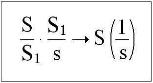
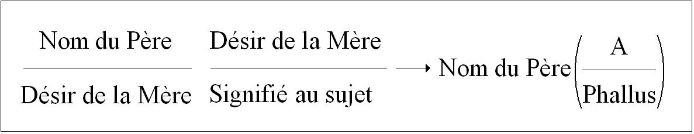
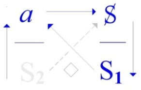
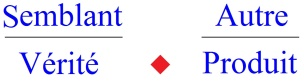
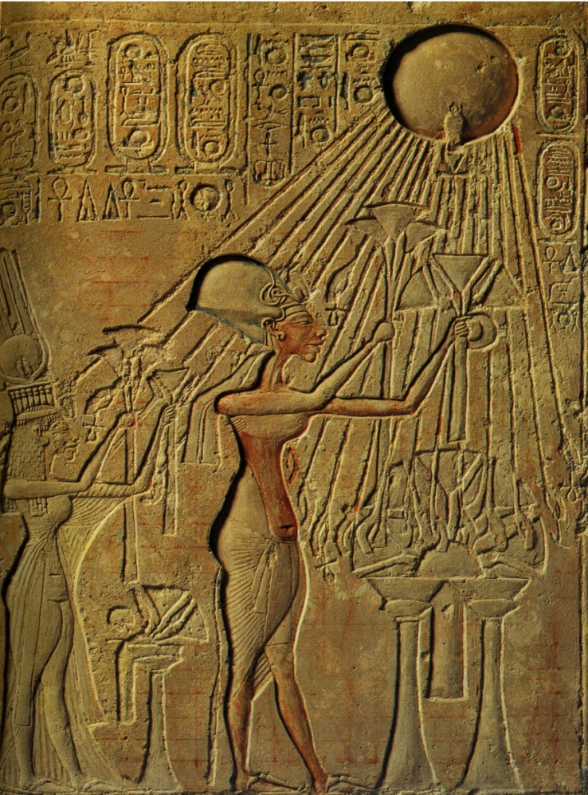

# Leçon 10 | 16 Juin 1971

<!-- source-url: http://staferla.free.fr/S18/S18 D'UN DISCOURS...docx -->
<!-- seminar: s18 -->
<!-- lesson: 10 -->

<!-- id: s18-10-0001 -->

Je vais essayer aujourd’hui de fixer le sens de cette route par laquelle je vous ai mené cette année sous le titre *« D’un discours qui ne serait pas du semblant ».*

<!-- id: s18-10-0002 -->

Cette hypothèse...

<!-- id: s18-10-0003 -->

> car c’est au conditionnel que ce titre vous est présenté, ...cette hypothèse est celle dont se justifie *tout discours*.

<!-- id: s18-10-0004 -->

N’omettez pas que l’année dernière j’ai essayé d’articuler en 4 *discours* typiques, ces discours qui sont ceux auxquels vous avez affaire, dans un certain ordre instauré, qui bien sûr ne se justifie lui-même que de l’histoire.

<!-- id: s18-10-0005 -->

Si je les ai brisés en quatre, c’est ce que je crois avoir justifié du développement que je leur ai donné et de la forme que dans un écrit dit « *Radiophonie »* paradoxalement...

<!-- id: s18-10-0006 -->

> pas tellement que ça si vous avez entendu ce que j’ai dit la dernière fois ...un certain ordre donc, dont cet écrit vous rappelle les termes.

<!-- id: s18-10-0007 -->

C’est du glissement, glissement toujours syncopé, du glissement de 4 termes dont il y a toujours 2 qui font béance, que ces dis­cours que j’ai désignés nommément : – du *discours du* M*aître*, – du *discours* U*niver­sitaire*, – du *discours* *que j’ai privilégié du terme* *de l’* H*ystérique* – du *discours de l’*A*nalyste*, ...que je les ai ordonnés.

<!-- id: s18-10-0008 -->

Ces discours ont la propriété de toujours avoir leur point d’ordonnance, qui est aussi celui d’ailleurs dont je les épingle, d’être à partir du *semblant*.

<!-- id: s18-10-0009 -->

   

<!-- id: s18-10-0010 -->

*Discours du Maître Discours de l’Hystérique Discours Universitaire Discours analytique*

<!-- id: s18-10-0011 -->

Qu’est-ce que *le discours analytique* a de privilégié d’être celui qui nous permet en somme, les articulant ainsi, de les répartir aussi en 4 *dispositions* fondamentales ?

<!-- id: s18-10-0012 -->

C’est paradoxal, c’est singulier, qu’une pareille énonciation se présente comme au terme de ce que celui qui se trouve être à l’origine du *discours analytique* - à savoir Freud - a permis.

<!-- id: s18-10-0013 -->

Il ne l’a pas permis à partir de rien, il l’a permis à partir de ce qui se présente...

<!-- id: s18-10-0014 -->

je l’ai bien des fois articulé …comme étant le principe de ce *discours du Maître*, à savoir ce qui se privilégie d’*un certain savoir* *qui éclaire l’articulation au* *savoir d*e *la vérité*.

<!-- id: s18-10-0015 -->

Il est à proprement parler prodigieux que ceux-là mêmes qui pris dans certaines pers­pectives...

<!-- id: s18-10-0016 -->

> celles que nous pourrions définir de se poser comme au regard de la société ...ceux donc qui dans cette perspective se présentent comme *des infirmes*, soyons plus aimables, comme *des boiteux* ...

<!-- id: s18-10-0017 -->

> et l’on sait que beauté boite ...à savoir les *névrosés*, et nommément *les hystériques* et *les obsessionnels*, ce soit d’eux que partît, que soit parti ce trait de lumière foudroyant qui traverse de long en large *la demansion* que conditionne le langage.

<!-- id: s18-10-0018 -->

La fonction qu’est *la vérité*, voire à l’occasion...

<!-- id: s18-10-0019 -->

> chacun sait la place que cela tient dans l’énonciation de Freud ...voire *cette cristallisation* qu’est ce que nous connaissons sous sa forme moderne, ce que nous connaissons *de la religion* et nommément *la tradition judéo-chré­tienne* sur laquelle porte tout ce qu’a énoncé Freud à propos des religions.

<!-- id: s18-10-0020 -->

Ceci est cohérent - je le rappelle - avec cette opération de subversion de ce qui jusqu’alors s’était soutenu à travers toute une tradition sous le titre de « *la connaissance* », et cette opération s’origine de la notion de *« symptôme »*.

<!-- id: s18-10-0021 -->

Il est important historiquement de s’apercevoir que ce n’est pas là que réside la nou­veauté de l’introduction à la psychanalyse réalisée par Freud : la notion de *« symptôme »*, comme je l’ai plusieurs fois indiqué, et comme il est très facile de le repérer à la lecture de celui qui en est responsable, à savoir Marx.

<!-- id: s18-10-0022 -->

Ce qu’il y a dans la théorie de la connaissance de *fondamentale duperie*, cette dimension du *semblant* qu’introduit la duperie dénoncée comme telle par la subversion marxiste, le fait que ce qui est dénoncé, c’est justement...

<!-- id: s18-10-0023 -->

> toujours dans une cer­taine tradition parvenue à son acmé avec le discours hégelien ...que quelque *sem­blant* est instauré en fonction de poids et mesure si je puis dire, à tenir pour argent comptant.

<!-- id: s18-10-0024 -->

Et ce n’est pas pour rien que j’emploie ces métaphores, puisque c’est autour de l’*argent*, autour du *capital* comme tel que joue le pivot de cette dénonciation qui fait résider dans *le fétiche* ce quelque chose qu’un retour de la pensée doit remettre à sa place, et très précisément en tant que *semblant*.

<!-- id: s18-10-0025 -->

Le singulier de cette remarque est tout de même fait aussi pour nous faire apercevoir qu’il ne suffit pas que quelque chose s’énonce dans cette dénoncia­tion qui se pose comme *vérité*...

<!-- id: s18-10-0026 -->

> au nom de laquelle émerge, se promeut, la *plus-value* comme étant le ressort de ce qui réduisait
>
> à son *semblant* ce qui jusque-là se soutenait d’un certain nombre de méconnaissances délibérées ...*il ne suffit pas*, remarquerai-je, et l’histoire le démontre, *que cette irruption de la vérité se pro­duise* *pour que pour autant soit abattu ce qui se soutient de ce discours.* \[*cf. L’étourdit, Sta p. 6,* « *Bien sûr, la névrose y survit* »\]

<!-- id: s18-10-0027 -->

*Ce dis­cours* que nous pourrions appeler dans l’occasion *du capitaliste*, en tant qu’il est détermination du *discours du Maître*, y trouve bien en fait, et bien plutôt son complément.

<!-- id: s18-10-0028 -->

Il apparaît que, loin que *le discours capitaliste* se porte plus mal de cette *reconnaissance* comme telle *de* *la fonction de la plus-value*, il n’en subsiste pas moins, puisqu’aussi bien un capitalisme repris dans un *discours du Maître* est bien ce qui semble distinguer les suites politiques qui ont résulté...

<!-- id: s18-10-0029 -->

> sous forme d’une révolution politique ...qui ont résulté de la dénonciation marxiste de ce qu’il en est d’un certain *discours du semblant*.

<!-- id: s18-10-0030 -->

*C’est bien en quoi* je ne m’appesantirai pas ici sur ce qu’il en est de la mission historique par là dévouée...

<!-- id: s18-10-0031 -->

> dans le marxisme, ou tout au moins dans ses mani­festes ...dévouée aux prolétaires.

<!-- id: s18-10-0032 -->

Il y a là, je dirais, un reste d’*entification* huma­niste qui, en faisant du prolétaire celui, bien sûr, qui dans ce mécanisme se trouve le plus dépouillé, n’en montre pas moins que *quelque chose* subsiste, qui le fait subsister effectivement dans cet état de dépouillement, et que le fait qu’il soit le support, le support de ce qui se produit sous l’espèce de *la plus-value*, n’est pas pour autant quelque chose qui d’aucune façon le libère de l’articulation de *ce discours*.

<!-- id: s18-10-0033 -->

*C’est bien en quoi* cette *dénonciation* nous reporte à une interrogation sur ce *quelque chose* qui pourrait être plus originel, et qui se trouverait dans l’origine même de tout discours en tant qu’il est discours du semblant.

<!-- id: s18-10-0034 -->

*C’est bien en quoi* aussi ce que j’ai articulé sous le terme du *plus-de-jouir* vous reporte à *ce qui est interrogé dans le discours freudien* comme mettant *en cause* le rapport de quelque chose qui s’articule, à proprement parler et à nouveau, comme *vérité* en opposition à un *semblant*, et *cette vérité,* cette opposition et cette dialectique de *la vérité* et du *semblant* se trouve - si ce que Freud a dit a un sens - située au niveau de ce que j’ai désigné du terme de *rapport sexuel*.

<!-- id: s18-10-0035 -->

J’ai en somme osé *articuler*, inciter à ce qu’on s’aperçoive que si cette révéla­tion qui nous est fournie par *le savoir du névrosé* concernant *quelque chose*, n’est rien d’autre que ceci qui s’articule d’« *il n’y a pas de rapport sexuel* ».

<!-- id: s18-10-0036 -->

Qu’est-ce que cela veut dire ? Non pas certes que le langage...

<!-- id: s18-10-0037 -->

> puisque déjà, déjà je le dis \[*passé simple*\] :* il n’y a pas de rapport sexuel*,
>
> c’est quelque chose qui peut se *dire* puisque main­tenant *c’est dit* ...mais bien sûr il ne suffit pas de le dire, il faut encore le motiver, et les motifs nous les prenons dans notre expérience prise du *fil suivi* de *ce qui s’accroche à cette béance fondamentale*, et *ce fil suivi se noue*...

<!-- id: s18-10-0038 -->

> là est *son départ central, enroulé autour de ce vide* ...dans ce qui donne « *le discours du névrosé* ».

<!-- id: s18-10-0039 -->

La dernière fois j’ai...

<!-- id: s18-10-0040 -->

> je vous l’ai assez fait sentir, assez souligné ...tenté d’amorcer d’*un écrit*, comment peut se situer ce qu’il en est du *point de départ de ce* *fil*.

<!-- id: s18-10-0041 -->

J’ai l’intention aujourd’hui, non pas bien sûr...

<!-- id: s18-10-0042 -->

> la chose est au-delà, à la limite de tout ce qui peut s’en dire dans cet espace limité d’un séminaire ...non pas de ce que *le névrosé* indique de son rapport à cette distance, mais de ce que *les mythes,* *les mythes* dont s’est formé, si je puis dire...

<!-- id: s18-10-0043 -->

> non pas toujours sous la dictée, mais en écho au discours du névrosé ...les mythes que Freud a forgés.

<!-- id: s18-10-0044 -->

Pour pouvoir le faire dans un temps si court, il faut partir de ce point central qui est aussi *point d’énigme du discours psychanalytique*, *du discours psychanalytique* en tant qu’il n’est ici <u>qu’*à l’écoute de ce discours dernier*</u>, *de celui qui ne serait pas le discours du semblant*.

<!-- id: s18-10-0045 -->

Il est à l’écoute d’un discours qui ne *serait pas* - et qui aussi bien *<u>n’est pas</u> -* je veux dire que *ce qui s’indique n’est que la limite imposée au discours, quand il s’agit du rapport sexuel*.

<!-- id: s18-10-0046 -->

J’ai essayé quant à moi...

<!-- id: s18-10-0047 -->

> au point où j’en suis, d’où j’avance tout ce qui pourrait s’en formuler plus avant ...de vous dire que c’est de son échec au niveau d’une logique, d’une logique qui se soutienne de ce dont *toute logique* se sou­tient, à savoir de *l’écriture*.

<!-- id: s18-10-0048 -->

La lettre de l’œuvre de Freud est une œuvre écrite, mais aussi bien aussi que *ce qu’elle dessine de ces écrits*, c’est quelque chose qui entoure *une vérité* voilée, *obscure*, celle qui s’énonce de ceci que : *un rapport sexuel*...

<!-- id: s18-10-0049 -->

> et tel qu’il passe dans un quelconque accomplissement *...ne se soutient, ne s’assied, que de « cette composition entre la jouissance et le semblant » qui s’appelle « la castration »*.

<!-- id: s18-10-0050 -->

Que nous la voyions ressurgir à tout instant dans le discours du névrosé, mais sous la forme d’une crainte, d’*un évitement,* c’est justement en cela que *la castration reste énigmatique *: qu’aucune, en somme, *de ses réalisations* sous des formes diverses, mouvantes, chatoyantes, ou aussi bien l’exploration de la psychopathologie des phénomènes analysables, tout au moins de cette psychopathologie que les excursions dans l’ethnologie le permettent, il n’en reste pas moins que ce quelque chose dont se distingue tout ce qui est évoqué comme castration, nous le voyons - sous quelle forme ? - sous la forme toujours d’*un évitement*.

<!-- id: s18-10-0051 -->

Si le névrosé, si je puis dire *témoigne* de l’intrusion nécessaire de ce que j’ai appelé à l’instant « *cette com­position de la jouissance et du semblant* » qui se présente comme *la castration*, c’est justement en ce qu’il s’y montre de quelque façon inapte.

<!-- id: s18-10-0052 -->

Et si tout ce qu’il en est des rituels d’initiation, qui comme vous le savez, et si vous ne le savez pas, repor­tez-vous aux ouvrages techniques, et pour en prendre deux qui sont produits de l’intérieur du champ analytique même, je vous désigne respectivement :

<!-- id: s18-10-0053 -->

- « *Problems of bisexuality as reflected in circoncision »* c’est-à-dire les *« Problèmes de la bisexualité en tant que réfléchis*

<!-- id: s18-10-0054 -->

> *dans la circoncision »,* d’Herman Nunberg, paru à Englewoods, c’est-à-dire en fin de compte
>
> à l’*Imago Publishing* de Londres \[1949\],

<!-- id: s18-10-0055 -->

- et d’autre part, l’ouvrage intitulé « *Symbolic Wounds », « Blessures symboliques »,* de Bruno Bettelheim [^82].

<!-- id: s18-10-0056 -->

Vous y verrez, déployée dans toute son ambiguïté, dans son flottement fondamental, l’hésitation, en quelque sorte, de la pensée analytique entre

<!-- id: s18-10-0057 -->

- une ordonnance explicative qui fait d’une crainte de la castration laissée tout à fait opaque et en quelque sorte au petit bonheur - ou malheur, comme vous vou­drez - des *accidents*

<!-- id: s18-10-0058 -->

> par lesquels se présente *quelque chose* qui dans ce registre ne serait que l’effet d’on ne sait quel *<u>malentendu</u>*, sur ce taillis de préjugés, *<u>de mal­adresses</u>*, de quelque chose de rectifiable,

<!-- id: s18-10-0059 -->

- ou au contraire d’une pensée qui s’aper­çoit qu’il y a bien là quelque chose de la constance : à tout le moins le nombre immense des productions que nous pouvons enregistrer sur tous les registres...

<!-- id: s18-10-0060 -->

> que les catalogues soient plus ou moins bien faits, que ce soit ceux de l’eth­nologie
>
> ou de la psychopathologie que j’évoquais tout à l’heure - il y en a d’autres ...nous met en face de ceci que c’est...

<!-- id: s18-10-0061 -->

> et Freud l’exprime à l’occasion, il sait fort bien le dire dans « *Malaise dans la civilisation »* ...c’est à propos de *quelque chose qui après tout ne rend pas si nouveau* *ce que j’ai formulé de*  « *Il n’y a pas de rap­port sexuel »,* il indique... il indique bien sûr en des termes comme il le fait d’habitude en des terme tout à fait clairs, ...que sans doute là-dessus, très précisément à propos des rapports sexuels, quelque fatalité s’inscrit qui y rend nécessaire ce qui alors apparaît comme étant les moyens, les ponts, les passerelles, les édifices, les constructions pour tout dire, qui à la carence, à la carence de ce rapport sexuel - pour autant qu’après tout, dans une sorte d’inversion de perspective, *tout discours* possible n’en apparaîtrait que comme *le symptôme,* qui à l’intérieur de ce rapport sexuel ménage...

<!-- id: s18-10-0062 -->

> ménage dans des condi­tions, dans des condi­tions que comme à l’ordinaire
>
> nous reportons dans la préhistoire, dans les domaines extra-historiques ...qui dans ces conditions-là, permettrait en quelque sorte la réus­site de ce qui pourrait s’établir d’artificiel en suppléant, en suppléant à ce *manque* inscrit en somme dans l’être parlant.

<!-- id: s18-10-0063 -->

Sans qu’on puisse savoir si c’est :

<!-- id: s18-10-0064 -->

- de ce qu’il soit parlant que c’en est ainsi,

<!-- id: s18-10-0065 -->

- ou au contraire de ce que l’origine soit que le rapport n’est pas parlable, qu’il faut que s’élabore pour tous ceux qui habitent le langage, qu’il faut que pour eux s’élabore ce *quelque chose* qui rend possible sous la forme de la castration, la béance laissée dans ce quelque chose de pourtant essen­tiel, biologiquement essentiel à la reproduction de ces êtres comme vivants, à ce que leur race demeure féconde.

<!-- id: s18-10-0066 -->

Tel est bien en effet le problème à quoi semble faire face tout ce qu’il en est des rituels d’initiation.

<!-- id: s18-10-0067 -->

Que ces rituels d’initiation comprennent des... appelons-les *manipulations, opéra­tions, incisions, circoncisions*, qui visent et mettent leur marque très précisément sur l’organe que nous voyons fonctionner comme symbole dans ce qui par l’expérience analytique nous est présenté comme allant bien au-delà du privilège de l’organe, puisque c’est *le phallus*.

<!-- id: s18-10-0068 -->

Et que *le phallus*, en tant que c’est à ce tiers

<!-- id: s18-10-0069 -->

- que s’ordonne tout ce qui, en somme, met en impasse la jouissance,

<!-- id: s18-10-0070 -->

- qui fait de l’homme et de la femme, en tant que nous les définirions d’un simple épinglage biologique, ces êtres qui très précisément sont...

<!-- id: s18-10-0071 -->

> avec *la jouissance sexuelle,* et d’une façon élective *parmi toutes les autres jouissances,*
>
> *...*en difficulté avec elle.

<!-- id: s18-10-0072 -->

C’est bien de cela qu’il s’agit, et c’est de là que nous devons repartir si nous voulons que se maintienne un sens correct à ce qui s’inaugure du *discours analytique*.

<!-- id: s18-10-0073 -->

Et que si c’est, on le suppose, quelque chose de défini...

<!-- id: s18-10-0074 -->

> c’est ce que nous appe­lons la castration ... qui aurait le privilège de parer à *ce quelque chose* dont l’indécidable fait le fond du rapport sexuel, pour autant que *la jouissance*, il la donne *ordonnée,* au regard de ceci...

<!-- id: s18-10-0075 -->

> qui me semble ne pas être évitable, je parle de ces énoncés ... de la dramaturgie de contrainte qui fait, comme ça, le quotidien du discours analytique est tout à fait contraire...

<!-- id: s18-10-0076 -->

> ceci c’est une remarque qui fait la valeur du livre, du 2nd: de Bruno Bettelheim, que je vous ai pointé ...qui est évidem­ment tout à fait contraire avec ceci, qui est la seule chose importante : il ne s’agit pas de repousser dans la préhistoire ce qu’il en est des rituels d’initiation.

<!-- id: s18-10-0077 -->

Les rituels d’initiation, comme tout ce que nous pouvons avoir envie de repousser dans la préhistoire, ils sont là, ils existent toujours, ils sont vivants de par le monde :

<!-- id: s18-10-0078 -->

- il y a encore des Australiens qui se font circoncire ou sub-inciser,

<!-- id: s18-10-0079 -->

- il y a des zones entières de la civilisation qui s’y soumettent.

<!-- id: s18-10-0080 -->

Et méconnaître dans un siècle dit « *de lumière* » que ces pratiques non seulement subsistent mais sont florides, se portent fort bien, et c’est évidemment de là qu’il faut partir pour nous apercevoir que ce n’est aucune *dramaturgie* concevable de contrainte quelle qu’elle soit, qu’il n’y a pas d’exemple que ce soit seulement la contrainte.

<!-- id: s18-10-0081 -->

Il s’agit encore de savoir ce que veut dire une contrainte : une contrainte n’est jamais que quelque chose d’un tout autre ordre que la prétendue prévalence d’une prétendue supériorité physique ou autre, elle se supporte précisément de signifiants, et si c’est la Loi, la règle qui est ici telle que tel sujet veuille bien se soumettre, c’est bien pour des raisons, et ces raisons c’est ce qui nous importe.

<!-- id: s18-10-0082 -->

C’est ce qui nous importe, et c’est là que nous devons bien plutôt interroger quelle est la *com­plaisance*...

<!-- id: s18-10-0083 -->

> pour employer un terme, qui pour nous mener tout droit à l’hysté­rique,
>
> n’en est pas moins d’une portée extrêmement générale ...la *com­plaisance* qui fait que subsiste bel et bien, et en des temps tout à fait histo­riques ce qu’il en est de ce qui se présente comme *quelque chose* dont à soi seul l’image serait insupportable.

<!-- id: s18-10-0084 -->

Elle est peut-être en effet insupportable comme telle, c’est de cela dont il s’agit c’est de savoir pourquoi.

<!-- id: s18-10-0085 -->

C’est là que je reprends mon fil.

<!-- id: s18-10-0086 -->

C’est à suivre *ce fil* que nous donnons sens à ce qui s’articule dans le langage, dans ce que j’appellerai *cette parole inédite*...

<!-- id: s18-10-0087 -->

> car inédite jusqu’à une certaine époque, qui elle est bel et bien historique et à notre portée ...*cette* *parole inédite* et qui se présente en somme comme devant toujours pour une part le rester : il n’y a pas d’autre définition à donner de l’inconscient.

<!-- id: s18-10-0088 -->

Venons-en maintenant à *l’hystérique* puisqu’il me plaît de partir de *l’hystérique* pour essayer de voir où nous conduit ce fil.

<!-- id: s18-10-0089 -->

*L’hystérique*, mais vous allez me demander - enfin j’espère bien que non en tout cas - « *Qu’est-ce que c’est ?* ».

<!-- id: s18-10-0090 -->

Mais justement c’est cela le sens du discours analytique, c’est qu’à une pareille question : « *Qu’est-ce que c’est ?* », « *Qu’est-ce que ça veut dire, l’hystérique en personne ? »,* il me semble avoir travaillé assez longtemps à partir de l’*imaginaire*, pour indiquer qu’« *en personne*  »...

<!-- id: s18-10-0091 -->

enfin rappeler simplement ce qui est déjà écrit dans le terme de « *personna »* ...ça veut dire « *en masque* ».

<!-- id: s18-10-0092 -->

Aucune réponse de départ ne peut être donnée de ce sens.

<!-- id: s18-10-0093 -->

À la question « *Qu’est-ce que l’hystérique* ? », la réponse du discours de l’analyste, c’est « *Vous le verrez bien* ! », vous le verrez bien, justement à suivre où elle nous conduit.

<!-- id: s18-10-0094 -->

Sans *l’hystérique,* bien sûr, il ne serait nulle part venu au jour ce qu’il en est de ce que j’inscris...

<!-- id: s18-10-0095 -->

> puisque *j’inscris*, j’essaie de vous donner la 1ère ébauche logique de ce dont il s’agit maintenant ...de ce que j’écris ΦX, grand phi de X, qui est à savoir que *la jouissance*...

<!-- id: s18-10-0096 -->

> cette *variable* dans la fonction *inscrite en* x ...se situe de ce rapport avec ce Φ, qui là désigne *le phallus*.

<!-- id: s18-10-0097 -->

Découverte cen­trale, ou plutôt *redécouverte*, ou comme vous voudrez *rebaptême,* puisque, comme je vous l’indiquais la dernière fois, c’est *du phallus* en tant que *semblant* dévoilé dans les *« mystères »,* que le terme est repris, et non pas par hasard.

<!-- id: s18-10-0098 -->

Pour bien en sentir *le jeu*, je dirais *la dérision*, il faut que vous lisiez l’Ecclésiaste : « *Jouis tant que tu es dans ce bas monde, jouis*...

<!-- id: s18-10-0099 -->

> dit l’auteur - énigmatique, comme vous le savez - de ce texte étonnant ...*jouis avec la femme que tu aimes.* ».

<!-- id: s18-10-0100 -->

> \[**ט** רְאֵה חַיִּים עִם-אִשָּׁה אֲשֶׁר-אָהַבְתָּ, כָּל-יְמֵי חַיֵּי הֶבְלֶךָ, אֲשֶׁר נָתַן-לְךָ תַּחַת הַשֶּׁמֶשׁ, כֹּל יְמֵי הֶבְלֶךָ:  כִּי הוּא חֶלְקְךָ, בַּחַיִּים, וּבַעֲמָלְךָ, אֲשֶׁר-אַתָּה עָמֵל תַּחַת הַשָּׁמֶשׁ.
>
> *Jouis de la vie avec la femme que tu aimes, tous les jours de l'existence éphémère qu'on t'accorde sous le soleil,*
>
> *oui, de ton existence fugitive car c'est là ta meilleure part dans la vie et dans le labeur que tu t'imposes sous le soleil. Ecclésiaste* IX, 9\]

<!-- id: s18-10-0101 -->

C’est tout le comble du paradoxe, parce que c’est justement de l’aimer que vient l’obstacle, \[*Rires*\] \[**47’30’’  *fin de la bande son***\] puisque c’est très précisément dans le fait que c’est au *semblant* du *phallus* qu’est rapporté le point pivot, le centre de tout ce qui peut s’ordonner ou se contenir de la jouissance sexuelle, que dès les premières approches des *hystériques*, dès les *Studien über Hysterie,* Freud nous amène.

<!-- id: s18-10-0102 -->

J’ai la dernière fois articulé ceci : qu’en somme, à prendre les choses du point qui peut en effet être interrogé de ce qu’il en est du *discours* le plus commun, que si nous voulons, non pas pousser à son terme ce que la linguis­tique nous indique, mais justement l’extrapoler, à savoir nous apercevoir :

<!-- id: s18-10-0103 -->

- que rien de ce que le langage nous permet de faire n’est jamais que *métaphore* ou bien *métonymie*,

<!-- id: s18-10-0104 -->

- que le « *quelque chose »* que toute parole - quelle qu’elle soit - pré­tend un instant dénoter ne peut jamais que renvoyer à une *connotation*,

<!-- id: s18-10-0105 -->

- et que s’il y a quelque chose qui puisse au dernier terme s’indiquer comme

<!-- id: s18-10-0106 -->

> ce qui de toute fonction appareillée du langage se dénote, je l’ai dit la dernière fois,
>
> il n’y a qu’une *Bedeutung *: *« Die Bedeutung des Phallus »,* c’est là - seul - ce qui est du langage dénoté.

<!-- id: s18-10-0107 -->

Dénoté bien sûr, mais sans que *jamais rien n’y réponde*, puisque *s’il y a quelque chose qui caractérise le phallus*, ça n’est, non pas d’être « *le signifiant du manque* » comme certains ont cru pouvoir entendre certaines de mes paroles, mais *d’être assurément en tout cas ce dont ne sort aucune parole*.

<!-- id: s18-10-0108 -->

*« Sinn* et *Bedeutung »,* c’est de là...

<!-- id: s18-10-0109 -->

je l’ai rappelé la dernière fois ...c’est de cette opposition articulée par le logicien vraiment inaugural qu’est Frege[^83], « *Sinn et Bedeutung »* définissent des modèles qui vont plus loin que ceux de *connotation* et de *déno­tation*.

<!-- id: s18-10-0110 -->

Beaucoup de choses dans cet article...

<!-- id: s18-10-0111 -->

Dont vraiment Frege instaure les deux versants du *Sinn,* et de la *Bedeutung,* ...beaucoup de choses sont à retenir, et spécialement pour un analyste.

<!-- id: s18-10-0112 -->

Car assurément sans une référence logique...

<!-- id: s18-10-0113 -->

> et qui bien sûr ne peut se suffire de la logique classique, de la logique aristotélicienne ...sans une référence logique, il est impossible de trouver le point juste en les matières que j’aborde.

<!-- id: s18-10-0114 -->

La remarque de Frege tourne toute entière autour de ceci : que portés à un certain point du discours scientifique, ce que nous constatons c’est par exemple des faits comme celui-ci : Est-ce la même chose que de dire

<!-- id: s18-10-0115 -->

- « *Vénus *»

<!-- id: s18-10-0116 -->

- ou de l’appeler de deux façons - comme elle fut longtemps désignée - « *l’étoile du soir *» et « *l’étoile du matin *» ?

<!-- id: s18-10-0117 -->

Est-ce la même chose de dire

<!-- id: s18-10-0118 -->

- « *Sir Walter Scott* »,

<!-- id: s18-10-0119 -->

- ou de dire « *l’auteur de Waverley* » ?

<!-- id: s18-10-0120 -->

Je vous préviens, pour ceux qui l’ignoreraient qu’il est effectivement l’auteur de cet ouvrage qui s’appelle « *Waverley ».*

<!-- id: s18-10-0121 -->

C’est à l’examen de cette distinction que Frege s’aper­çoit qu’il n’est pas possible en tous les cas de remplacer « *Sir Walter Scott* » par « *l’auteur de Waverley* ».

<!-- id: s18-10-0122 -->

C’est en cela qu’il distingue ceci :

<!-- id: s18-10-0123 -->

- que « *l’auteur de Waverley*  » véhicule *un sens*, *un Sinn,*

<!-- id: s18-10-0124 -->

- et que « *Sir Walter Scott* » désigne une *Bedeutung.*

<!-- id: s18-10-0125 -->

Il est clair que si l’on pose - si l’on pose avec Leibniz - que « *salva veritate* » : *nous devons* *sauver la vérité*, il faut poser que tout ce qui se désigne comme ayant une *Bedeutung* équivalente, peut indifféremment se remplacer, et si on met la chose à l’épreuve...

<!-- id: s18-10-0126 -->

comme je vais tout de suite la mettre à l’épreuve selon les voies tracées par Frege lui-même, ...que le roi George III...

<!-- id: s18-10-0127 -->

peu importe que ce soit George III ou George IV, ça n’a en l’occa­sion que peu d’importance ...demandait, s’informait, de savoir si « *Sir Walter* *Scott*  était *l’auteur de « Waverley ».*

<!-- id: s18-10-0128 -->

Si nous remplaçons « *l’auteur de Waverley*  » par « *Sir Walter Scott* », nous obtenons la phrase suivante : « *Le Roi George III s’infor­mait pour savoir si Sir Walter Scott était Sir Walter Scott.* »

<!-- id: s18-10-0129 -->

Ce qui bien évidem­ment n’a absolument pas le même *sens*.

<!-- id: s18-10-0130 -->

C’est à partir de cette simple remarque, opération logique, que Frege instaure, inaugure sa distinction fondamentale du *Sinn* et de la *Bedeutung*.

<!-- id: s18-10-0131 -->

Il est tout à fait clair que cette *Bedeutung* renvoie bien sûr à une *Bedeutung* toujours plus lointaine.

<!-- id: s18-10-0132 -->

Pour lui, bien sûr, il s’en arrête à la distinction de ce qu’il appelle « *le discours oblique »* et « *le discours direct »*.

<!-- id: s18-10-0133 -->

C’est pour autant que c’est dans une subordonnée que c’est le Roi George III qui demande, que nous devons ici maintenir les *Sinn* dans leur droit, et ne remplacer en aucun cas « *l’auteur de Waverley*  » par « *Sir Walter Scott* ».

<!-- id: s18-10-0134 -->

Mais ceci bien sûr est un artifice. C’est un artifice qui pour nous, nous met sur la voie de ceci : à savoir que « *Sir Walter Scott* » en l’occasion, *c’est un nom*.

<!-- id: s18-10-0135 -->

Et aussi bien que quand M. Carnap [^84] reprend la question de la *Bedeutung,* c’est par le terme *nominatum* qu’il le traduit : en quoi justement il glisse là où il n’aurait pas fallu glisser.

<!-- id: s18-10-0136 -->

Car ceci que je commence, peut nous permettre d’aller plus loin, mais certai­nement pas dans la même direction que M. Carnap, c’est celle de ce que veut dire *le nom*, le nom : *n.o.m*., je le répète, comme la dernière fois.

<!-- id: s18-10-0137 -->

Il nous est très facile de faire ici le joint avec ce que j’ai indiqué tout à l’heure : je vous ai fait remarquer que *le phallus ne répondait pas.*

<!-- id: s18-10-0138 -->

Eh bien ceci qui nous met sur la voie de ce point que je désire ici accentuer : c’est que *le nom*...

<!-- id: s18-10-0139 -->

le nom « *name* » et le nom « *noun* »[^85], mais on ne voit bien les choses qu’au niveau du nom propre, comme disait l’autre...

<!-- id: s18-10-0140 -->

...*le nom, c’est ce qui appelle* - mais à quoi ? - *c’est ce qui appelle à parler*.

<!-- id: s18-10-0141 -->

Et c’est bien ce qui fait le privilège du *phallus*, c’est qu’on peut l’appeler éperdument, il ne dira toujours rien.

<!-- id: s18-10-0142 -->

Seulement ceci alors donne son sens à ce que j’ai appelé en son temps « *la métaphore paternelle »,* et *c’est là que conduit l’hystérique*.

<!-- id: s18-10-0143 -->

*La métaphore paternelle*...

<!-- id: s18-10-0144 -->

bien sûr, là où je l’ai introduite, c’est-à-dire au niveau de mon article sur la « *Question préalable à tout traitement possible de la psychose »* [^86] ...je l’ai insérée dans le schéma général extrait du rapprochement de ce que nous dit la linguistique sur *la métaphore* avec ce que l’expérience de l’inconscient nous donne de *la condensation*.

<!-- id: s18-10-0145 -->

<!-- id: s18-10-0146 -->

J’ai écrit le S/S1, multiplié par le S1/*s*, je me suis...

<!-- id: s18-10-0147 -->

> comme j’ai écrit également dans « *L’instance de la lettre... »* ...fortement appuyé sur cette face de la métaphore, qui est d’*engendrer un sens*.

<!-- id: s18-10-0148 -->

Si « *l’auteur de Waverley* » c’est un *Sinn,* c’est très précisément parce que « *l’auteur de Waverley* *» remplace quelque chose d’autre*, qui est la *Bedeutung* initiale que Frege croit pouvoir épingler du nom de *Sir Walter Scott.*

<!-- id: s18-10-0149 -->

Mais enfin, il n’y a pas que sous cet angle que j’ai envisagé *la métaphore paternelle*.

<!-- id: s18-10-0150 -->

Si j’ai écrit quelque part que « *le Nom du Père c’est le phallus »*…

<!-- id: s18-10-0151 -->

> Et Dieu sait quels frémissements d’horreur ceci a évoqué chez quelques âmes pieuses ...c’est précisément parce qu’à cette date je ne pouvais pas l’articuler mieux.

<!-- id: s18-10-0152 -->

Ce qui est clair c’est que c’est le *phallus* bien sûr, mais que c’est tout de même le *Nom du Père*.

<!-- id: s18-10-0153 -->

Ce qui est nommé *Père*, *le Nom du Père*, si c’est un nom qui, lui, a une efficace, c’est précisément parce que quelqu’un se lève pour répondre.

<!-- id: s18-10-0154 -->

Sous l’angle de ce qui se passait dans la déter­mination psychotique de Schreber, c’est en tant que *signifiant*...

<!-- id: s18-10-0155 -->

signifiant capable de donner un sens au *désir de la mère* ...qu’à juste titre je pouvais situer *le Nom du Père*.

<!-- id: s18-10-0156 -->

<!-- id: s18-10-0157 -->

Mais au niveau de ce dont il s’agit quand c’est - disons *l’hystérique* qui l’appelle, ce dont il s’agit c’est que *quelqu’un parle*.

<!-- id: s18-10-0158 -->

Je voudrais ici vous faire observer que si Freud a quelquefois essayé d’approcher d’un peu plus près *cette fonction du Père* qui est tellement essentielle au *discours analytique*, qu’on peut dire d’une certaine façon qu’elle en est *le produit*.

<!-- id: s18-10-0159 -->

 

<!-- id: s18-10-0160 -->

Si je vous écris le *discours analytique* : *a* / S2, c’est-à-dire l’analyste sur ce qu’il a de savoir \[*supposé*\] par le névrosé qui questionne le sujet \[**S**\] *pour produire quelque chose* \[**S1**\], on peut dire que *le signi­fiant maître,* jusqu’à présent, *du discours analytique*, c’est bien *le Nom du Père*.

<!-- id: s18-10-0161 -->

Il est extrêmement curieux qu’il ait fallu le *discours analytique* pour que là-des­sus se posent les questions.

<!-- id: s18-10-0162 -->

Qu’est-ce qu’un Père ? Freud n’hésite pas à articu­ler que *c’est le nom par essence qui implique la foi* ».

<!-- id: s18-10-0163 -->

C’est la façon dont il s’exprime. Nous pourrions peut-être tout de même en désirer un petit peu plus.

<!-- id: s18-10-0164 -->

Après tout, à prendre les choses au ras du niveau biologique, on peut parfaite­ment concevoir que la reproduction de l’espèce humaine...

<!-- id: s18-10-0165 -->

> ça s’est déjà fait, c’est sorti déjà de l’imagination d’un romancier \[Orwell : « 1984 »\] ...se produise sans aucune espèce d’intervention d’un être désigné sous le titre du *Père *: l’insémination artificielle après tout ne serait pas là pour rien.

<!-- id: s18-10-0166 -->

Qu’est-ce qui en somme fait la présence - depuis un temps qui n’est pas d’hier - de cette *essence du père *?

<!-- id: s18-10-0167 -->

Et après tout, est-ce que nous-mêmes *analystes*, nous savons bien ce que c’est ?

<!-- id: s18-10-0168 -->

Je voudrais tout de même vous faire remarquer ceci : *c’est que dans l’expérience analytique le Père n’est jamais que référentiel*.

<!-- id: s18-10-0169 -->

Nous *interprétons* telle ou telle relation avec le père : est-ce que nous *analysons* jamais quelqu’un *en tant que père* ?

<!-- id: s18-10-0170 -->

Qu’on m’apporte une observation !

<!-- id: s18-10-0171 -->

Le père est un *terme* de l’interprétation analytique. À lui se réfère quelque chose.

<!-- id: s18-10-0172 -->

C’est à la lumière de ces remarques – si vous voulez bien, j’abrège – que je vou­drais quand même vous situer ce qu’il en est du *mythe de l’Œdipe*.

<!-- id: s18-10-0173 -->

Le *mythe de l’Œdipe* fait en quelque sorte tracas, n’est-ce pas, parce que soi-disant qu’il instaure la primauté du père, qu’il serait une espèce de reflet patriarcal.

<!-- id: s18-10-0174 -->

Je voudrais vous faire sentir quelque chose... enfin ce par quoi - à moi tout au moins – il ne me paraît pas du tout un reflet du patriarcat. Bien loin de là.

<!-- id: s18-10-0175 -->

Il nous fait apparaître seulement ceci : *un point d’abord* par où *la castration pourrait être serrée d’un abord logique*, et de cette façon que je désignerai d’être numérale.

<!-- id: s18-10-0176 -->

Le père, non seulement est castré, mais il est précisément castré au point de n’être qu’un numéro.

<!-- id: s18-10-0177 -->

Ceci s’indique tout à fait clairement dans les dynasties : tout à l’heure je vous parlais d’un roi que je ne savais plus comment l’appeler : George III ou George IV.

<!-- id: s18-10-0178 -->

Pensez que ce qui est justement ce qui paraît le plus typique, de la représentation de la paternité, à savoir la royauté, c’est comme ça que ça se passe :

<!-- id: s18-10-0179 -->

- George I,

<!-- id: s18-10-0180 -->

- George II,

<!-- id: s18-10-0181 -->

- George III,

<!-- id: s18-10-0182 -->

- George IV.

<!-- id: s18-10-0183 -->

Mais enfin, il est bien évident que ça n’épuise pas la question, parce qu’il n’y a pas seulement *numéro* : il y a *nombre*.

<!-- id: s18-10-0184 -->

Pour tout dire, j’y vois le point d’aperception de la série des *nombres naturels*, comme on s’exprime, et comme on s’exprime pas si mal, car vous le voyez, c’est très proche de la nature.

<!-- id: s18-10-0185 -->

<u>Je voudrais vous faire remar­quer</u>...

<!-- id: s18-10-0186 -->

> que puisqu’on l’évoque toujours à l’horizon l’histoire,
>
> ce qui, bien entendu, est une raison de suspicion extrême ...je voudrais vous faire simplement remarquer ceci : c’est que *le matriarcat* - comme on s’exprime - n’a aucun besoin d’être repoussé à la limite de l’histoire.

<!-- id: s18-10-0187 -->

*Le matriarcat* consiste essentiellement en ceci : c’est que pour ce qui est de la mère, comme Freud le souligne à l’occasion, il n’y a pas de doute.

<!-- id: s18-10-0188 -->

On peut à l’occasion perdre sa mère dans le métro, bien sûr, mais enfin *il n’y a pas de doute sur qui est la mère*.

<!-- id: s18-10-0189 -->

Il n’y a également *aucun doute sur* *qui est la mère de la mère*, et ainsi de suite.

<!-- id: s18-10-0190 -->

La mère, dans sa lignée, je dirai, est *innombrable*.

<!-- id: s18-10-0191 -->

Elle est *innombrable* dans tous les sens propres du terme, elle n’est pas à numérer parce qu’il n’y a pas de point de départ.

<!-- id: s18-10-0192 -->

La lignée maternelle a beau être nécessairement en ordre, *on ne peut la faire partir de nulle part*.

<!-- id: s18-10-0193 -->

<u>Je voudrais vous faire remarquer, d’autre part</u>, ceci qui paraît être la chose qu’on touche le plus couramment du monde, parce que après tout c’est pas rare ça : il n’est pas du tout rare qu’on puisse avoir pour père son grand-père \[*sic*\].

<!-- id: s18-10-0194 -->

Je veux dire pour *vrai père*. Et même son arrière-grand-père. Oui !

<!-- id: s18-10-0195 -->

Qiand les gens vivaient, comme il nous est dit, dans la première lignée des patriarches, aux environs de 900 ans, j’ai relu ça récemment, c’est très piquant, c’est un truquage absolument sensationnel : tout est fait pour que les deux ancêtres les plus directs de Noé, là les plus directs, soient morts juste au moment où le déluge se produit. On voit ça, c’est fignolé...

<!-- id: s18-10-0196 -->

Enfin mettons ça de côté, c’est sim­plement pour vous mettre dans la perspective de ce qu’il en est du père.

<!-- id: s18-10-0197 -->

De ceci, voyez-vous, ce qui résulte...

<!-- id: s18-10-0198 -->

> je suis forcé d’aller un peu vite, parce que l’heure s’avance ...c’est que si nous définissons *l’hystérique* par ceci qui définit - ça ne lui est pas particulier - le névrosé, à savoir *l’évitement de la castra­tion *: il y a plusieurs façons de l’éviter.

<!-- id: s18-10-0199 -->

*L’hystérique* a ce procédé simple, c’est qu’elle l’unilatéralise de l’autre côté, du côté du partenaire, disons qu’à *l’hysté­rique* il faut le *partenaire* châtré.

<!-- id: s18-10-0200 -->

Qu’il soit châtré, il est clair que c’est au prin­cipe de la possibilité de la jouissance de *l’hysté­rique*.

<!-- id: s18-10-0201 -->

Mais c’est encore trop : s’il était châtré, il aurait peut-être une petite chance, puisque *la castration c’est* jus­tement ce que j’ai émis tout à l’heure, comme étant *ce qui permet le rapport sexuel.*

<!-- id: s18-10-0202 -->

Il faut qu’il soit seulement *<u>ce qui répond à la place du phallus</u>*.

<!-- id: s18-10-0203 -->

Alors, puisque Freud lui-même nous indique...

<!-- id: s18-10-0204 -->

> je ne vais pas vous dire non plus à quelle page ...nous indique lui-même que tout ce qu’il élabore comme mythe, ceci est à propos de *Moïse *:

<!-- id: s18-10-0205 -->

« *Je n’en ferai pas ici la critique*...

<!-- id: s18-10-0206 -->

> dit-il, de ce qu’il a lui-même écrit, à la date où il le publie en 1938,
>
> sur son hypothèse his­torique, à savoir celle qu’il a rénovée de Sellin, ...*car tous les résultats acquis *- dit la traductrice - *constituent les déductions psychologiques qui en dérivent et sans cesse s’y rapportent*... »

<!-- id: s18-10-0207 -->

Comme vous le voyez, ça ne veut rien dire. En alle­mand, ça veut dire quelque chose, c’est :

<!-- id: s18-10-0208 -->

- « *denn sie bilden die Voraussetzung* » : *car ils forment la supposition*,

<!-- id: s18-10-0209 -->

- « *der psychologischen Erörterungen* » : *des mani­festations psychologiques*, *qui de ces données,*

<!-- id: s18-10-0210 -->

- « *von ihnen ausgehen* » : *décou­lent et toujours de nouveau*

<!-- id: s18-10-0211 -->

- « *auf sie zurückkommen* » : *y font retour*.

<!-- id: s18-10-0212 -->

\[*Ich beginne damit, die Ergebnisse meiner zweiten, der rein historischen Studie über Moses zu resümieren. Sie werden hier keiner neuerlichen Kritik unterzogen werden, <u>denn sie bilden die Voraussetzung</u> <u>der psychologischen Erörterungen</u>, die <u>von ihnen ausgehen</u> und immer wieder <u>auf sie zurückkommen</u>*. (Kapitel III, Vorbemerkung II , *Im Juni 1938*)\]

<!-- id: s18-10-0213 -->

C’est bien en effet sous la dictée de *l’hystérique,* que non pas s’élabore...

<!-- id: s18-10-0214 -->

> car jamais l’Œdipe n’a été par Freud véritablement élaboré ...il est indiqué en quelque sorte à l’hori­zon, *dans la fumée* si l’on peut dire, de ce qui s’élève comme sacrifice de *l’hysté­rique*.

<!-- id: s18-10-0215 -->

Mais observons bien ce que veut dire maintenant cette *nomination*, cette réponse à *l’appel du père* dans l’Œdipe.

<!-- id: s18-10-0216 -->

Si je vous ai dit tout à l’heure que ça introduit *la série des nombres naturels*, c’est que *<u>là</u>* nous avons, ce qui à la plus récente *élaboration logique de cette série, à savoir celle de Péano*, s’est avéré *nécessaire*, c’est à savoir pas simplement le fait de la succession.

<!-- id: s18-10-0217 -->

Quand on essaie d’axiomatiser la possibilité d’une telle série, on rencontre *la nécessité du zéro pour poser le successeur*.

<!-- id: s18-10-0218 -->

Les axiomes minimaux de Péano...

<!-- id: s18-10-0219 -->

> je n’insiste pas sur ce qui a pu se produire en commentaire, en marge comme perfectionnement ...mais la dernière formule, c’est celle qui pose le zéro comme *<u>nécessaire</u>* à cette série,

<!-- id: s18-10-0220 -->

- faute de quoi, elle ne saurait d’aucune façon être axiomatisée,

<!-- id: s18-10-0221 -->

- et faute de quoi elle serait donc *innombrable*, comme je disais tout à l’heure.

<!-- id: s18-10-0222 -->

L’*équivalence logique de la fonction du Père* est très précisément ceci : cette fonction du *zéro* trop souvent oublliée.

<!-- id: s18-10-0223 -->

Je ne peux le faire qu’en marge et très rapidement : je vous ferai observer que nous entrerons dans le deuxième millénaire en l’an 2000, que je sache.

<!-- id: s18-10-0224 -->

Si simplement vous admettez ça...

<!-- id: s18-10-0225 -->

> vous l’admettez ou vous pouvez aussi bien ne pas l’admettre ...mais si simple­ment vous admettez ça, je vous ferai remarquer que ça rend nécessaire qu’il y ait eu *un an zéro*, après la naissance du Christ. C’est ce que les auteurs du calen­drier républicain avaient oublié : la première année, ils l’ont appelé *l’an 1 de la République*.

<!-- id: s18-10-0226 -->

Ce *zéro* est absolument essentiel à tout repérage chronologique naturel.

<!-- id: s18-10-0227 -->

Et alors nous comprenons ce que veut dire *le meurtre du Père*.

<!-- id: s18-10-0228 -->

Il est curieux, singulier, n’est-ce pas, que ce *meurtre du Père* n’apparaisse jamais, même dans les drames, comme le fait remarquer avec pertinence quelqu’un qui a écrit là-dessus un pas mauvais chapitre : «* que même dans les drames, il n’y a jamais, aucun dramaturge n’a osé* - s’exprime l’auteur – *faire présenter, manifester, le meurtre délibéré d’un père par le fils. *»

<!-- id: s18-10-0229 -->

Faites bien attention à ça : même dans le théâtre grec ça n’existe pas, d’un Père en tant que Père.

<!-- id: s18-10-0230 -->

Mais par contre c’est tout de même le terme « *meurtre du Père* » qui paraît au centre de ce que Freud élabore à partir des données que constitue - du fait de *l’hystérique* et de son abord - le refus de la castration.

<!-- id: s18-10-0231 -->

Est-ce que ce n’est pas justement en tant que *le meurtre du Père*, ici, *est le substitut de cette castration refusée*, que l’œdipe a pu venir s’imposer à la pensée de Freud dans la filière de ses abords de *l’hystérique* ?

<!-- id: s18-10-0232 -->

Il est clair que dans la perspective hystérique, c’est le *phallus* qui féconde, et que ce qu’il engendre, c’est *lui-même*, si l’on peut dire. La fécondité est forgerie phallique, et c’est bien par là que tout enfant est reproduction du *phallus*, en tant qu’il est gros, si je puis m’exprimer ainsi, d’engendrement.

<!-- id: s18-10-0233 -->

Mais alors, nous entrevoyons aussi...

<!-- id: s18-10-0234 -->

> puisque c’est du *« papludun »* que je vous ai inscrit la possibilité logifiée du choix
>
> dans cette relation insatisfaite du rapport sexuel, ...que c’est du « *papludun »* que je vous l’ai désigné, que c’est par-là que les incroyables complaisances de Freud pour un monothéisme dont il va chercher le modèle, chose très curieuse, bien ailleurs que dans sa tradition : il lui faut que ça soit Akhénaton.

<!-- id: s18-10-0235 -->

Rien n’est plus *ambigu*, je dirai sur le plan sexuel, que ce monothéisme solaire.

<!-- id: s18-10-0236 -->

À le voir rayonner de tous *ses rayons pourvus de petites mains* qui iront chatouiller les naseaux d’innombrables *menus humains*, *enfants* de l’un et l’autre sexe, dont il est - dans cette imagerie de la structure œdipienne - tout à fait frappant que - c’est le cas de le dire - *ils se ressemblent comme des frères et encore plus comme des sœurs.*

<!-- id: s18-10-0237 -->

<!-- id: s18-10-0238 -->

Si le mot *sublime* peut avoir un *sens ambigu*, c’est bien là.

<!-- id: s18-10-0239 -->

Puisqu’aussi bien ce n’est pas pour rien que les dernières images monumentales...

<!-- id: s18-10-0240 -->

> celles que j’ai pu voir la dernière fois que j’ai quitté le sol égyp­tien ...d’Akhénaton, sont des images non seulement châtrées mais carrément féminines.

<!-- id: s18-10-0241 -->

Il est tout à fait clair que si la castration a un rapport au *phallus*, ça n’est pas là que nous pouvons le désigner.

<!-- id: s18-10-0242 -->

Je veux dire que si je fais le petit schéma qui correspondrait au « *pas tous* » ou au « *pas toutes *», comme désignant un certain type de la relation au Φ x, c’est bien en ce sens que c’est au Φ x, tout de même, que se rapportent les élus.

<!-- id: s18-10-0243 -->

Le passage, le passage à la médiation entre guillemets « masculine », n’est bien celle que de cet « *au moins un »* que je soulignais et que nous retrouverons dans Péano par *ce n+*1 toujours répété, *celui qui* en quelque sorte *suppose que le n qui le précède se réduit à zéro*. Par quoi ? Précisément *par le meurtre du Père*.

<!-- id: s18-10-0244 -->

À ce repérage, si l’on peut dire, ce détour, la façon - *pour employer le terme de Frege lui-même*, c’est bien le cas de le dire - « *oblique* », « *ungerade* », dont le sens du *meurtre du Père* se rapporte à une autre *Bedeutung*, c’est là qu’il faudra bien que je me limite aujourd’hui, m’excusant de n’avoir pas pu pousser plus loin les choses.

<!-- id: s18-10-0245 -->

Ça sera donc pour l’année prochaine.

<!-- id: s18-10-0246 -->

Je regrette que les choses se soient cette année trouvées ainsi forcément tronquées, mais vous pourrez voir que le « *Totem et Tabou »* par contre...

<!-- id: s18-10-0247 -->

> à savoir celui qui met du côté du Père la jouissance originelle ...est quelque chose à quoi ne répond pas moins *un évitement stricte­ment équivalent* de ce qu’il en est du *nœud de la castration*, strictement équivalent.

<!-- id: s18-10-0248 -->

Ce en quoi se marque bien ceci : que *l’obsessionnel*...

<!-- id: s18-10-0249 -->

> pour répondre à la formule : / §, « *Il n’y a pas de x qui existe qui puisse s’inscrire dans la variable* § » ...que *l’obsessionnel...* comment *l’obsessionnel* se dérobe simplement de ceci : de ne pas exister.

<!-- id: s18-10-0250 -->

C’est le quelque chose auquel - pourquoi pas ? - nous renoue­rons la suite de notre discours.

<!-- id: s18-10-0251 -->

*L’obsessionnel* en tant qu’il est *dans la dette de ne pas exister* au regard de ce Père non moins mythique, qui est celui de *Totem et Tabou.*

<!-- id: s18-10-0252 -->

Comment ? C’est là que s’attache réellement tout ce qu’il en est d’une certaine édification religieuse, et de ce en quoi *elle n’est hélas pas* *réductible*, et même pas de ce que Freud accroche à son 2nd *mythe*, celui de *Totem et Tabou,* à savoir ni plus ni moins que sa *seconde topique*, c’est ce que nous pourrons développer ultérieurement.

<!-- id: s18-10-0253 -->

Car notez-le, *la seconde topique *: sa grande innovation c’est *le surmoi*. Quelle est l’essence du *surmoi* ?

<!-- id: s18-10-0254 -->

C’est là-dessus que je pourrai finir en vous donnant quelque chose dans le creux de la main, que vous pourrez essayer de manipuler par vous-même \[*sic*\].

<!-- id: s18-10-0255 -->

Quelle est l’ordonnance du *surmoi* ? Précisément, elle s’origine de ce *Père originel*, plus que mythique, de cet *appel* comme tel à *la jouissance pure*, c’est-à-dire *aussi* à *la non-castration*.

<!-- id: s18-10-0256 -->

Et qu’est-ce que ce *Père* en effet dit, au déclin de l’*Œdipe* ? Il dit ce que dit le *surmoi*. Ce que dit le *surmoi*...

<!-- id: s18-10-0257 -->

> ce n’est pas pour rien que je ne l’ai encore jamais vraiment abordé ...ce que dit le *surmoi*, c’est : « *Jouis !* »

<!-- id: s18-10-0258 -->

Tel est l’ordre, l’ordre impossible à satisfaire, et qui comme tel est à l’origine de tout ce qui s’élabore...

<!-- id: s18-10-0259 -->

> aussi paradoxal que cela puisse vous paraître ...aux termes de la conscience morale.

<!-- id: s18-10-0260 -->

Pour bien en sentir *le jeu*, je dirais *même la dérision*, il faut que vous lisiez l’*Ecclésiaste* :

<!-- id: s18-10-0261 -->

> « *Jouis tant que tu es dans ce bas monde, jouis...*
>
> dit l’auteur énigmatique - comme vous le savez - de ce texte étonnant,
>
> *...Jouis avec la femme que tu aimes.* »

<!-- id: s18-10-0262 -->

Et c’est le comble du paradoxe, parce que c’est justement de l’aimer que vient l’obstacle.

<!-- id: s18-10-0263 -->

\[Fin du séminaire\]

## Notes

[^82]: Bruno Bettelheim : *Blessures symboliques*, Gallimard, 1971.

[^83]: Gottlob Frege : « *Über Sinn und Bedeutung* » (1892), « *Sens et dénotation* », in « *Écrits logiques et philosophiques* », Seuil, 1971.

[^84]:
    #  Rudolph Carnap : « *Signification et nécessité* », Gallimard, 1997. 

[^85]: Cf. Séminaire 1961-62 : « *L’Identification* », séance du 20-12-1961 : « *Non pas « noun », le nom défini grammaticalement, ce que nous appelons le substantif*

    *dans nos écoles, mais le « name », comme en anglais - et en allemand aussi bien, d'ailleurs - les deux fonctions se distinguent. Je voudrais en dire un peu plus ici.*

    *Mais vous comprenez bien la différence : le « name », c'est le nom propre.* »

[^86]: Cf. *Écrits* : « *D’une question préliminaire à tout traitement possible de la psychose* », p. 557.
