# Leçon 01 | 13 Janvier 1971

<!-- source-url: http://staferla.free.fr/S18/S18 D'UN DISCOURS...docx -->
<!-- seminar: s18 -->
<!-- lesson: 01 -->

<!-- id: s18-01-0001 -->

Au tableau : «* D’un discours qui ne serait pas du semblant.* »

<!-- id: s18-01-0002 -->

*« D’un discours » *: ce n’est pas du mien qu’il s’agit.

<!-- id: s18-01-0003 -->

Je pense, l’année dernière, vous avoir assez fait sentir ce qu’il faut entendre par ce terme « *discours »*.

<!-- id: s18-01-0004 -->

Je rappelle *le discours du Maître* et ses 4 disons *positions*, les déplacements de ces termes au regard d’une structure, réduite à être tétraédrique.

<!-- id: s18-01-0005 -->

J’ai laissé à qui voudrait s’y employer de préciser ce qui justifie que ces glissements...

<!-- id: s18-01-0006 -->

qui auraient pu être plus diversifiés, ...je les ai réduits à 4. Le privilège de ces 4, si personne ne s’y emploie, peut-être cette année vous en donnerais-je en passant l’indication.

<!-- id: s18-01-0007 -->

Je ne prenais ces références qu’au regard de ce qui était ma fin, énoncée dans ce titre « *L’envers de la psychanalyse »*.  
*Le discours du Maître* n’est pas *l’envers de la psychanalyse*.

<!-- id: s18-01-0008 -->

Il est où se démontre la torsion propre, dirais-je, du *discours de la psychanalyse,* ce qui fait que ce discours fait poser la question d’un « *endroit »* et d’un « *envers »*, puisque vous savez l’importance de l’accent qui est mis dans la théorie...

<!-- id: s18-01-0009 -->

> dès son émission par Freud ...l’importance de l’accent qui est mis sur la double inscription.

<!-- id: s18-01-0010 -->

Or ce qu’il s’agissait de vous faire toucher du doigt, c’est la possibilité d’une inscription double...

<!-- id: s18-01-0011 -->

> *à l’endroit, à l’envers* ...sans qu’ait à être franchi un bord, c’est la structure dès longtemps bien connue, dont je n’ai eu qu’à faire usage, dite de « *la bande de Mœbius »*.

<!-- id: s18-01-0012 -->

Ces *places* et ces *éléments*, c’est où se désigne que ce qui est à proprement parler *discours* ne saurait d’aucune façon se référer d’un sujet, bien qu’il le détermine.

<!-- id: s18-01-0013 -->

C’est là sans doute l’ambiguïté de ce par quoi j’ai introduit ce que je pensais devoir faire entendre *à l’intérieur* du *discours psychanalytique*.

<!-- id: s18-01-0014 -->

Rappelez-vous mes termes au temps où j’intitulais un certain *Rapport* [^1]* *: « *De la fonction et du champ de la parole et du langage dans la psychanalyse »*.

<!-- id: s18-01-0015 -->

*Intersubjectivité* écrivais-je alors, et Dieu sait à quelle fausse trace l’énoncé de termes tels que celui-là peut donner occasion.

<!-- id: s18-01-0016 -->

Qu’on m’excuse d’avoir eu - ces traces - à les faire premières.

<!-- id: s18-01-0017 -->

Je ne pouvais aller au devant que du malentendu :

<!-- id: s18-01-0018 -->

- « *Inter* » certes en effet, c’est ce que seule la suite m’a permis d’énoncer d’une *inter-signifiance*,

<!-- id: s18-01-0019 -->

- « *subjectivité* » de sa conséquence, *le signifiant étant ce qui représente un sujet pour un autre signifiant où le sujet n’est pas*.

<!-- id: s18-01-0020 -->

C’est bien en cela 

<!-- id: s18-01-0021 -->

- que pour ce que là où il \[*le sujet*\] est *représenté,* il est absent,

<!-- id: s18-01-0022 -->

- que *représenté* tout de même, il se trouve ainsi divisé.

<!-- id: s18-01-0023 -->

Le *discours*, ce n’est pas seulement qu’il \[*le sujet*\] ne peut plus dès lors être jugé qu’à la lumière de son ressort inconscient, c’est qu’il ne peut plus être énoncé comme quelque chose d’autre que ce qui s’articule d’une structure où quelque part il se trouve aliéné d’une façon irréductible.

<!-- id: s18-01-0024 -->

D’où mon énoncé du discours introductif : « *D’un discours*... - je m’arrête - ...*ce n’est pas le mien*.

<!-- id: s18-01-0025 -->

C’est de cet énoncé du discours comme ne pouvant être comme tel discours d’aucun \[*sujet*\] particulier...

<!-- id: s18-01-0026 -->

> mais se fondant d’une structure et de l’accent
>
> que lui donne la répartition, le glissement, de certains de ses termes ...c’est de là que je pars cette année pour ce qui s’intitule « *D’un discours qui ne serait pas du semblant »*.

<!-- id: s18-01-0027 -->

À ceux qui n’ont pu l’année dernière suivre ces énoncés qui sont donc préalables, j’indique que la parution - qui date déjà de plus d’un mois - de *Scilicet 2*/*3* leur en donnera les références principales.

<!-- id: s18-01-0028 -->

« *Scilicet* 2/3 », parce que c’est un écrit, *est un événement* - sinon avènement - *de discours*.

<!-- id: s18-01-0029 -->

D’abord en ceci : c’est que celui dont je me trouve instruit sans qu’on puisse éluder qu’il nécessite *votre « presse »*, autrement dit que vous soyez là, et très précisément sous cet aspect dont quelque chose de singulier nous fait « *la presse* ».

<!-- id: s18-01-0030 -->

Assurément avec, disons « *les incidences de notre histoire »*, il est quelque chose qui se touche, qui renouvelle la question de ce qui peut en être du *discours* en tant qu’il est *le discours du Maître*.

<!-- id: s18-01-0031 -->

Ce quelque chose qui ne peut faire que de lier, quelque chose dont on s’interroge à le dénommer...

<!-- id: s18-01-0032 -->

> n’allons pas trop vite ...à nous servir du mot « *révolution* », mais il est clair qu’il faut discerner ce qu’il en est de ce qui en somme me permet de poursuivre mes énoncés de cette formule :

<!-- id: s18-01-0033 -->

*« D’un discours qui ne serait pas du* *semblant* ».

<!-- id: s18-01-0034 -->

Deux traits sont ici à retenir dans ce numéro de *Scilicet*.

<!-- id: s18-01-0035 -->

C’est que je mets à l’épreuve somme toute à peu près...

<!-- id: s18-01-0036 -->

> à quelque chose près qui est en plus ...mon discours de l’année dernière, dans une configuration qui justement se caractérise par l’absence de ce que j’ai appelé cette *presse de votre présence*, et pour y mettre son plein accent je la dirai de ces termes : ce que cette présence signifie, je l’épinglerai du « plus-de-jouir *pressé* ».

<!-- id: s18-01-0037 -->

Car c’est très précisément de cette figure que peut être estimée... si elle va au-delà d’une « *gêne* », comme on dit, concernant *trop* de semblance \[S2 en *Semblant*\] dans le discours où vous êtes inscrits : *le discours universitaire*

<!-- id: s18-01-0038 -->

 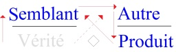

<!-- id: s18-01-0039 -->

...celle qu’il est facile de dénoncer

<!-- id: s18-01-0040 -->

- *d’une neutralité* par exemple, que ce discours ne peut prétendre soutenir, \[S1 en *Vérité*\]

<!-- id: s18-01-0041 -->

- *d’une sélection* \[*universitaire*\] *compétitive,* quand il ne s’agit que des *signes* qui s’adressent aux avertis, \[*a* en *Autre*\]

<!-- id: s18-01-0042 -->

- *d’une formation du sujet*, quand il s’agit de bien autre chose. \[S en *Produit *: « *formatage »*\]

<!-- id: s18-01-0043 -->

Pour aller au-delà de cette gêne des *semblants*, pour que quelque chose s’espère qui permette d’en sortir, rien ne le permet que de poser qu’un certain mode, un certain mode de rigueur dans l’avancement d’un discours \[Disc. A\] ne clive, en position dominante dans ce discours \[Disc. A : ***a* → S**\], ce qu’il en est de ces triages, de ces globules de *plus-de-jouir* au titre de quoi vous vous trouvez, dans *le discours universitaire,* pris.

<!-- id: s18-01-0044 -->

 

<!-- id: s18-01-0045 -->

> *Discours Analytique*

<!-- id: s18-01-0046 -->

C’est précisément que quelqu’un, à partir du *discours analytique*, se mette à votre regard dans la position de *l’analysant*...

<!-- id: s18-01-0047 -->

> ce n’est pas nouveau, je l’ai déjà dit, mais personne n’y a fait attention ...ce qui constitue l’originalité de cet enseignement et ce qui motive ce que vous lui apportez de votre « *presse* », c’est ce qu’à parler à la radio \[[*Radiophonie*](http://staferla.free.fr/Lacan/Radiophonie.pdf)\] j’ai mis à l’épreuve de cette *soustraction* précisément *de cette présence*, *cet espace où vous vous pressez* : annulé et remplacé par l’« *il existe* » pur de cette *inter-signifiance* dont je parlais tout à l’heure, pour qu’y vacille le sujet. C’est simplement une « *aiguillade »* vers quelque chose dont l’avenir dira la portée possible.

<!-- id: s18-01-0048 -->

Il est un autre trait dans ce que j’ai appelé cet *« événement »,* cet « *avènement de discours »*, c’est cette chose imprimée qui s’appelle *Scilicet*, c’est...

<!-- id: s18-01-0049 -->

> comme un certain nombre déjà le savent ...*qu’on y écrit sans signer*.

<!-- id: s18-01-0050 -->

Qu’est-ce que ça veut dire ?

<!-- id: s18-01-0051 -->

Que chacun de ces noms, qui se trouvent mis en colonne à la dernière page de ces 3 numéros qui constituent une année, peut être permuté avec chacun des autres, affirmant de là qu’aucun discours ne saurait être d’auteur.

<!-- id: s18-01-0052 -->

Là ça parle...

<!-- id: s18-01-0053 -->

dans l’autre cas c’est le « *negieren* » \[*nier*\] ...là l’avenir dira si c’est la formule que, disons dans 5-6 ans, adopteront toutes les revues, les revues *bien,* s’entend.

<!-- id: s18-01-0054 -->

Enfin, on verra...

<!-- id: s18-01-0055 -->

Je n’essaie pas, dans ce que je dis, de sortir de ce qui est ressenti, éprouvé, dans mes énoncés comme accentuant, comme tenant à l’artefact du discours. C’est dire bien sûr - c’est la moindre des choses – que ce faisant ça exclut que je prétende tout en couvrir : ça ne peut être *un système*, ça n’est - à ce titre - pas *une philosophie*.

<!-- id: s18-01-0056 -->

Il est clair qu’à quiconque prend, sous le biais où l’analyse nous permet de *renouveler,* ce qu’il en est du *discours*, ceci implique qu’on se déplace, je dirais dans un « *désunivers* ».

<!-- id: s18-01-0057 -->

Ce n’est pas la même chose qu’un «* divers *». Mais même à ce *divers* je ne répugnerais pas \[cf. « épars désassortis » (Préf. éd. anglaise...)\], et pas seulement pour ce qu’il implique de diversité, mais jusqu’à ce qu’il applique de *diversion*.

<!-- id: s18-01-0058 -->

Il est très clair aussi que je ne parle pas de « *tout* », que même dans ce que j’énonce ça résiste à ce qu’on parle de « *tout* » à son propos.

<!-- id: s18-01-0059 -->

Ça se touche du doigt tous les jours, même sur ce que j’énonce.

<!-- id: s18-01-0060 -->

Que *je ne dise pas tout,* cela est autre chose, je l’ai déjà dit, ça tient à ceci : que « *la vérité n’est qu’à mi-dire* ».

<!-- id: s18-01-0061 -->

*Ce discours* donc, qui se confine à n’agir que dans l’artefact, n’est en somme que le prolongement de *la position de l’analyste*, en tant qu’elle se définit de mettre le poids de son «* plus-de-jouir *» à une certaine place \[*a* en *semblant*\].

<!-- id: s18-01-0062 -->

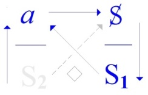 

<!-- id: s18-01-0063 -->

C’est néanmoins la position qu’ici je ne saurai soutenir, très précisément de n’être pas dans cette position de l’analyste. Comme je l’ai dit tout à l’heure...

<!-- id: s18-01-0064 -->

> à ceci près qu’*il vous y manque le savoir* ...c’est plutôt vous qui y seriez, dans votre *presse*. \[*les auditeurs sont en position d’analyste, mais sans le* S2 *de l’analyste*\]

<!-- id: s18-01-0065 -->

Ceci dit, quelle peut être la portée de ce que dans cette référence j’énonce « *D’un discours qui ne serait pas du semblant »* ? Ça peut s’énoncer de ma place et en fonction de ce que j’ai énoncé précédemment, *c’est un fait* en tout cas que je l’énonce. Remarquez que c’est un fait aussi puisque je l’énonce \[« *il n’y a de « fait » que de ce qui s’énonce »*\].

<!-- id: s18-01-0066 -->

Vous pouvez n’y voir que du feu, c’est-à-dire penser qu’il n’y a rien de plus que le fait que je l’énonce.

<!-- id: s18-01-0067 -->

Seulement si j’ai parlé à propos du discours d’« *artefact »*, c’est que pour le discours il n’y a rien de fait si je puis dire, déjà, *il n’y a de fait que du fait du discours*, le fait énoncé est tout ensemble le fait du discours.

<!-- id: s18-01-0068 -->

C’est ça que je désigne par le terme d’*artefact*.

<!-- id: s18-01-0069 -->

Et bien entendu c’est ce qu’il s’agit de *réduire*, parce que si je parle d’*artefact* c’est pas pour en faire surgir l’idée de quelque chose qui serait *autre*, d’une *nature* dont vous auriez tort de vous y engager pour en affronter les embarras parce que vous n’en sortiriez pas.

<!-- id: s18-01-0070 -->

La question ne s’instaure pas dans les termes « *Est-ce, ou n’est-ce pas dicible ?* », mais dans ceci : « *c’est dit ou ce n’est pas dit »*.  
Je pars de ce qui est dit dans un discours dont l’artefact est supposé suffire à ce que vous soyez là.

<!-- id: s18-01-0071 -->

Ici coupure, car je n’ajoute pas : « *à ce que vous soyez là à l’état de plus-de-jouir pressé* ».

<!-- id: s18-01-0072 -->

J’ai dit « *coupure* » parce qu’il est questionnable de savoir *si c’est en tant que plus-de-jouir pressé déjà que mon discours vous rassemble.*

<!-- id: s18-01-0073 -->

Il n’est pas tranché, quoi qu’en pense tel ou tel, que ce soit ce discours, celui de la suite des énoncés que je vous présente, qui vous mette vous dans cette position d’où il est questionnable par le « *pas* » *d’un discours qui ne serait pas du semblant*.

<!-- id: s18-01-0074 -->

*Du semblant*, qu’est-ce que ça veut dire ?

<!-- id: s18-01-0075 -->

Qu’est-ce que ça veut dire dans cet énoncé ?

<!-- id: s18-01-0076 -->

*Du semblant de discours* par exemple ?

<!-- id: s18-01-0077 -->

Vous le savez, c’est la position dite du « *logico-positivisme »,* c’est que, à partir d’un signifié à mettre à l’épreuve de quelque chose qui tranche *par oui ou par non*, ce qui ne permet pas de s’offrir à cette épreuve voilà ce qui est défini : « *ne vouloir rien dire* » \[*i e *: *« insensé »*\], mais avec ça on se croit quitte d’un certain nombre de questions qualifiées de « *métaphysiques* ».

<!-- id: s18-01-0078 -->

Ce n’est pas certes que j’y tienne, mais je tiens à faire remarquer que la position du logico-positivisme est intenable, en tout cas à partir de l’expérience analytique notamment.

<!-- id: s18-01-0079 -->

Si l’expérience analytique se trouve impliquée, de prendre ses titres de noblesse du mythe œdipien, c’est bien qu’elle préserve le tranchant de *l’énonciation de l’oracle* \[*l’indécidable* *exclut le oui/non*\].

<!-- id: s18-01-0080 -->

Et je dirai plus : que l’interprétation y reste toujours du même niveau, *elle n’est vraie que par ses suites*, tout comme *l’oracle*.

<!-- id: s18-01-0081 -->

L’interprétation n’est pas *mise à l’épreuve d’une vérité* qui se trancherait par oui ou par non, elle *déchaîne la vérité* comme telle. Elle n’est vraie qu’en tant que vraiment suivie \[*du déchaînement* *la vérité*\].

<!-- id: s18-01-0082 -->

Nous verrons tout à l’heure les schémas de l’implication - j’entends de *l’implication logique* - dans leurs formes les plus classiques ces schémas eux-mêmes nécessitent le fonds de ce « *véridique* » en tant qu’il appartient à la parole, fût-elle à proprement parler *insensée*.

<!-- id: s18-01-0083 -->

Le passage de ce moment où *la vérité* se tranche de son seul déchaînement, à celui d’une *logique* qui va tenter de donner corps à cette *vérité*, c’est très précisément le moment où le discours en tant que *représentant de la représentation* est renvoyé, disqualifié.

<!-- id: s18-01-0084 -->

Et s’il peut l’être c’est parce qu’en quelque partie il l’est toujours déjà : que c’est ça que l’on appelle *le refoulement*.

<!-- id: s18-01-0085 -->

Ce n’est plus une représentation qu’il représente, c’est cette suite de discours qui se caractérise comme « *effet de vérité »*.

<!-- id: s18-01-0086 -->

*Cet effet de vérité* \[*« déchaînement » de la vérité, du signifiant hors-sens qui fait signe*\] *n’est pas du* *semblant*, et l’œdipe est là pour nous apprendre...

<!-- id: s18-01-0087 -->

> si vous me permettez ...pour nous apprendre que c’est du *sang rouge*.

<!-- id: s18-01-0088 -->

Seulement voilà, *le sang rouge ne réfute pas le semblant,* il le colore, il le rend re-semblant, il le propage : un peu de sciure et le cirque recommence !

<!-- id: s18-01-0089 -->

C’est bien pour cela que c’est au niveau de *l’artefact,* de la structure du *discours*, que peut s’élever la question *d’un discours qui ne serait pas du semblant*.

<!-- id: s18-01-0090 -->

En attendant :

<!-- id: s18-01-0091 -->

- *il n’y a pas de semblant de discours*,

<!-- id: s18-01-0092 -->

- *il n’y a pas de métalangage pour en juger,*

<!-- id: s18-01-0093 -->

- *il n’y a pas d’Autre de l’Autre,*

<!-- id: s18-01-0094 -->

- *il n’y a pas de vrai sur le vrai.*

<!-- id: s18-01-0095 -->

Je me suis amusé un jour à *faire parler la vérité* [^2].

<!-- id: s18-01-0096 -->

Je demande où il y a un paradoxe* *: qu’est-ce qu’il peut y avoir de plus vrai que l’énonciation « *je mens* » ?

<!-- id: s18-01-0097 -->

Le chipotage classique qui s’énonce du terme de *paradoxe,* ne prend corps que si ce « *je mens* », vous le mettez sur un papier à titre d’écrit.

<!-- id: s18-01-0098 -->

Tout le monde sent qu’il n’y a rien de plus vrai qu’on puisse dire, à l’occasion, que de dire « *je mens* ».

<!-- id: s18-01-0099 -->

C’est même très certainement la seule vérité qui à l’occasion ne soit pas brisée. Qui ne sait qu’à dire que «* je ne mens pas *» on n’est absolument pas à l’abri de dire quelque chose de faux. Qu’est-ce à dire ?

<!-- id: s18-01-0100 -->

*La vérité* dont il s’agit*, quand elle parle*...

<!-- id: s18-01-0101 -->

> celle dont j’ai dit qu’elle parle « *je* », qui s’énonce comme oracle ...*qui parle ?*

<!-- id: s18-01-0102 -->

Ce semblant, c’est le signifiant en lui-même !

<!-- id: s18-01-0103 -->

Qui ne voit que ce qui le caractérise ce signifiant, dont au regard des linguistes je fais cet usage qui les gêne ?

<!-- id: s18-01-0104 -->

Il s’en est trouvé pour écrire ces lignes, destinées à bien avertir que « *sans doute, Ferdinand de Saussure n’en avait pas la moindre idée* ».

<!-- id: s18-01-0105 -->

Qu’est-ce qu’on en sait ? Ferdinand de Saussure faisait comme moi il ne disait pas tout \[***sic***\], la preuve c’est qu’on a trouvé dans ses papiers des choses qu’il n’a jamais voulu faire sortir[^3].

<!-- id: s18-01-0106 -->

Le signifiant, on croit que c’est une bonne petite chose, comme ça... qui est apprivoisée par le structuralisme*,* on croit que c’est « *l’Autre en tant qu’Autre* » et « *la batterie du signifiant* », et tout ce que j’explique, bien sûr...

<!-- id: s18-01-0107 -->

Bien entendu *ça vient du ciel* parce que je suis un « *idéaliste* », pour l’occasion...

<!-- id: s18-01-0108 -->

*« Artefact »* ai-je dit d’abord.

<!-- id: s18-01-0109 -->

Bien sûr l’*artefact*, c’est absolument certain que ce soit notre sort de tous les jours.

<!-- id: s18-01-0110 -->

Nous le trouvons à tous les coins de rue, à la portée du moindre geste de nos mains.

<!-- id: s18-01-0111 -->

S’il y a quelque chose qui soit un discours soutenable, en tout cas soutenu, celui de la science nommément, ce n’est peut-être pas vain de se souvenir qu’il est parti très spécialement de la considération de *semblants*.

<!-- id: s18-01-0112 -->

Le départ de la pensée scientifique - je parle de l’histoire - qu’est-ce que c’est ?

<!-- id: s18-01-0113 -->

L’observation des astres, qu’est-ce que c’est si ce n’est *la constellation*, c’est-à-dire *le semblant* typique ?

<!-- id: s18-01-0114 -->

Les pas premiers de la physique moderne, autour de quoi est-ce que ça tourne au départ ?

<!-- id: s18-01-0115 -->

Non pas comme on le croit des éléments, car les éléments, les quatre \[*terre, air, eau, feu*\]...

<!-- id: s18-01-0116 -->

> enfin même si vous y ajoutez « *la quintessence* » \[5ème *élément*\] ...c’est déjà du discours, du discours philosophique - et comment ! - c’est des météores !

<!-- id: s18-01-0117 -->

Descartes fait un *Traité des météores* [^4].

<!-- id: s18-01-0118 -->

Le pas décisif - un des pas décisifs - tourne autour de la théorie de l’arc-en-ciel.

<!-- id: s18-01-0119 -->

Et quand je parle d’un *météore*, c’est quelque chose qui se définit d’être qualifié comme tel d’un *semblant*.

<!-- id: s18-01-0120 -->

Personne n’a jamais cru que l’arc-en-ciel, même parmi les gens les plus primitifs, que l’arc-en-ciel était une chose qui était là courbée, dressée.

<!-- id: s18-01-0121 -->

C’est en tant que *météore* qu’il est interrogé.

<!-- id: s18-01-0122 -->

Le *météore* le plus caractéristique, le plus originel, celui dont il est hors de doute qu’il est lié à la structure même de tout ce qui est discours, c’est le tonnerre.

<!-- id: s18-01-0123 -->

Si j’ai terminé mon « *[Discours de Rome](http://ecole-lacanienne.net/wp-content/uploads/2016/04/1953-09-26a.pdf) »* sur l’évocation du tonnerre, ce n’est pas absolument comme ça par fantaisie : il n’y a pas de *Nom du Père* tenable sans le tonnerre, dont tout le monde sait très bien que...

<!-- id: s18-01-0124 -->

qu’on ne sait même pas le signe de quoi c’est, le tonnerre. C’est la figure même du *semblant*.

<!-- id: s18-01-0125 -->

C’est en cela qu’*il n’y a pas de semblant de discours.* Tout ce qui est discours ne peut que se donner en *semblant*, et rien ne s’y édi­fie qui ne soit à base de ce quelque chose qui s’appelle *« signifiant »*, qui dans la lumière où je vous le produis aujourd’hui, est identique à ce statut comme tel du *semblant*.

<!-- id: s18-01-0126 -->

*« D’un discours qui ne serait pas du semblant »,* pour que ça fasse *énoncé*, il faut donc que d’aucune façon ce « *du semblant* » ne soit complétable de la référence de discours. C’est d’autre chose qu’il s’agit, du « *référent* » sans doute.

<!-- id: s18-01-0127 -->

Contenez-vous un tout petit peu : ce *référent* n’est pas probablement tout de suite *l’objet*, puisque justement ce que ça veut dire c’est que ce *référent* c’est justement lui qui se promène.

<!-- id: s18-01-0128 -->

*Le semblant dans lequel le signifiant est identique à lui-même*, c’est un niveau du terme *semblant* : c’est *le semblant dans la nature*.

<!-- id: s18-01-0129 -->

Ce n’est pas pour rien que je vous ai rappelé qu’aucun discours qui évoque la nature n’a jamais fait que de partir de ce qui dans la nature est *semblant*.

<!-- id: s18-01-0130 -->

Car la nature en est pleine, je ne parle pas de la nature animale dont il est bien évident qu’elle en surabonde, c’est même ce qui fait qu’il y a de doux rêveurs qui pensent que toute entière la nature animale, des poissons aux oiseaux, chante la louange divine, ça va de soi.

<!-- id: s18-01-0131 -->

Chaque fois qu’ils ouvrent comme ça quelque chose...

<!-- id: s18-01-0132 -->

> une tête, une bouche, un opercule ...c’est un semblant manifeste, et elle nécessite ces béances.

<!-- id: s18-01-0133 -->

Quand nous entrons dans quelque chose dont l’efficace n’est pas tranché pour la simple raison que nous ne savons pas comment ça s’est fait qu’il y ait eu, si je puis dire « *accumulation de signifiants »*.

<!-- id: s18-01-0134 -->

Car les signifiants - hein, je vous le dis - sont répartis dans le monde, dans la nature, il y en a à la pelle.

<!-- id: s18-01-0135 -->

Pour que naisse le langage...

<!-- id: s18-01-0136 -->

> c’est déjà quelque chose d’amorcer ça ! ...pour que naisse le langage il a fallu que quelque part s’établisse ce quelque chose que je vous ai déjà indiqué à propos du pari : c’était *le pari de Pascal*, nous ne nous en souvenons pas.

<!-- id: s18-01-0137 -->

Supposer ceci, l’ennuyeux c’est que ça suppose déjà le fonctionnement du langage.

<!-- id: s18-01-0138 -->

Parce qu’il s’agit de l’inconscient, l’inconscient et son jeu, ça veut dire que parmi les nombreux signifiants qui courent le monde, il va y avoir en plus *le corps morcelé* \[*a*\].

<!-- id: s18-01-0139 -->

Il y a quand même des choses qui... dont on peut partir en pensant qu’elles existent déjà, elles existent déjà dans un certain fonctionnement où nous ne serions pas forcés de considérer *l’accumulation du signifiant* : c’est les histoires de territoire.

<!-- id: s18-01-0140 -->

Si le signifiant « *votre bras droit *» va dans le territoire du voisin faire une cueillette...

<!-- id: s18-01-0141 -->

> c’est des choses qui arrivent tout le temps ...naturellement votre voisin saisit votre signifiant «* bras droit *» et vous le re-balance par-dessus la chose mitoyenne : c’est ce que vous appelez curieusement « *projection* », c’est une façon de s’entendre.

<!-- id: s18-01-0142 -->

C’est d’un phénomène comme ça qu’il faudrait partir. Si votre *bras droit,* chez votre voisin, n’était pas entièrement occupé à la cueillette, des pommes par exemple, s’il était resté tranquille, il est assez probable que votre voisin l’aurait *adoré*, c’est l’origine du *signifiant-maître*, un *bras droit* : « *le sceptre* ».

<!-- id: s18-01-0143 -->

Le *signifiant-maître*, ça ne demande qu’à commencer comme ça, tout au début.

<!-- id: s18-01-0144 -->

Il en faut malheureusement un peu plus, c’est un schéma pas très satisfaisant, en plus ça vous donne « *le sceptre* », tout de suite vous voyez la chose se matérialiser comme signifiant.

<!-- id: s18-01-0145 -->

Le procès de l’histoire se montre, d’après tous les témoignages de ce qu’on a, un tout petit peu plus compliqué.

<!-- id: s18-01-0146 -->

Il est certain que la petite « *parabole* », celle par laquelle j’avais commencé d’abord, n’est-ce pas, le bras qui vous est re-renvoyé d’un territoire à l’autre, c’est pas forcé que ce soit votre bras qui vous revienne, parce que le signifiant c’est pas individuel, on ne sait pas lequel est à qui.

<!-- id: s18-01-0147 -->

Alors voyez-vous, là nous entrons dans une espèce d’autre jeu originel quant à la fonction du hasard et celui des mythes.

<!-- id: s18-01-0148 -->

*Vous faites un monde* pour l’occasion, disons *un schéma : un support divisé comme ça en un certain nombre de cellules territoriales* [^5].

<!-- id: s18-01-0149 -->

Cela se passe à un certain niveau, celui où il s’agit de *produire*, où il s’agit de comprendre un peu ce qui s’est passé.

<!-- id: s18-01-0150 -->

Après tout, non seulement on peut recevoir un bras qui n’est pas le sien par ce processus d’expulsion...

<!-- id: s18-01-0151 -->

> que vous avez appelé on ne sait pourquoi « *projection* », si ce n’est que ça vous est projeté, bien sûr ...non seulement un bras qui n’est pas le vôtre, mais plusieurs autres bras.

<!-- id: s18-01-0152 -->

Alors à partir de ce moment-là, cela n’a plus d’importance que ce soit le vôtre ou pas le vôtre.

<!-- id: s18-01-0153 -->

Mais enfin comme après tout, de l’intérieur d’un territoire, on ne connaît que ses propres frontières, et qu’on n’est pas forcé de savoir que sur cette frontière il y a six autres territoires[^6], on balance ça un petit peu comme on peut, et alors il se peut que ces territoires *il y en ait une pluie*.

<!-- id: s18-01-0154 -->

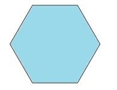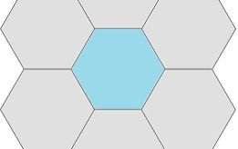 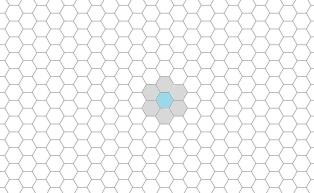

<!-- id: s18-01-0155 -->

L’idée du rapport qu’il peut y avoir entre le rejet de quelque chose \[*« c’est pas ça »*\] et *la naissance* de ce que je vous appelais tout à l’heure le *signifiant-maître* \[*inscription, trait unaire*\] est certainement une idée à retenir.

<!-- id: s18-01-0156 -->

 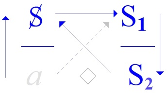  

<!-- id: s18-01-0157 -->

*Discours du Maître Discours de l’Hystérique Discours Universitaire Discours analytique*

<!-- id: s18-01-0158 -->

Mais pour qu’elle prenne tout son prix, il faut certainement qu’il y ait eu, comme ça, par un processus de hasard, en certains points *accumulation de signifiants* \[*répétition*\].

<!-- id: s18-01-0159 -->

À partir de là, peut se concevoir quelque chose qui soit *la naissance d’un langage*.

<!-- id: s18-01-0160 -->

Ce que nous voyons à proprement parler s’édifier comme 1er *mode de supporter dans l’écriture ce qui sert de langage* [^7], en donne en tout cas une certaine idée : chacun sait que la lettre « A » est une tête de taureau renversée [^8] et qu’un certain nombre d’éléments comme celui-là, *mobiliers*, laissent encore leur trace.

<!-- id: s18-01-0161 -->

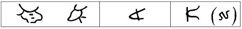

<!-- id: s18-01-0162 -->

Ce qui est important, c’est de ne pas aller trop vite et de voir où continuent de rester *<u>les trous</u>*.

<!-- id: s18-01-0163 -->

Par exemple, il est bien évident que le départ de cette esquisse était déjà lié à quelque chose de marquant le corps d’une possibilité d’ectopie[^9] et de «* balade *», qui évidemment reste problématique.

<!-- id: s18-01-0164 -->

Mais après tout - là encore - tout est toujours là.

<!-- id: s18-01-0165 -->

Nous avons...

<!-- id: s18-01-0166 -->

enfin, c’est un point très sensible que nous pouvons encore contrôler tous les jours ...il n’y a pas très longtemps, encore cette semaine, quelque chose : une très jolie photo d’un journal dont certainement tout le monde s’est délecté : les possibilités de l’exercice du *découpage de l’être humain,* sur l’être humain sont tout à fait impressionnantes.

<!-- id: s18-01-0167 -->

C’est de là que tout est parti.

<!-- id: s18-01-0168 -->

Il reste un autre trou...

<!-- id: s18-01-0169 -->

Vous le savez on s’est cassé la tête, on a bien fait la remarque que Hegel c’est très joli, mais qu’il y a quand même quelque chose qu’il n’explique pas :

<!-- id: s18-01-0170 -->

- il explique « *la dialectique du maître et de l’esclave* »,

<!-- id: s18-01-0171 -->

- mais il n’explique pas qu’il y ait *une société de maîtres*.

<!-- id: s18-01-0172 -->

Il est tout à fait clair que ce que je viens de vous expliquer est certainement intéressant en ceci : que par le seul jeu de la projection, de la rétorsion, il est clair qu’au bout d’un certain nombre de coups, il y aura certainement, je dirais, une moyenne de signifiants plus importante dans certains territoires que dans d’autres.

<!-- id: s18-01-0173 -->

Mais enfin il reste encore à voir *comment ces signifiants vont pouvoir* dans un territoire en quelque sorte *faire société de signifiants*. Il convient de ne jamais laisser dans l’ombre ce qu’on n’explique pas, sous prétexte que l’on a réussi à donner un petit commencement d’explication.

<!-- id: s18-01-0174 -->

Quoi qu’il en soit, l’énoncé de notre titre de cette année : « *D’un discours qui ne serait pas du semblant »,* concerne quelque chose qui a affaire avec une économie.

<!-- id: s18-01-0175 -->

Ici le *« du semblant »* ...

<!-- id: s18-01-0176 -->

> nous tairons «* à lui-même *» ...il n’est pas semblant d’*autre chose*, il est à prendre au sens du *génitif objectif* : il s’agit *du semblant* comme objet propre dont se règle l’économie du discours.

<!-- id: s18-01-0177 -->

<!-- id: s18-01-0178 -->

Est-ce que nous allons dire que c’est aussi *un génitif subjectif* ?  
Est-ce que le «* du semblant *» concerne aussi ce qui tient le discours ?

<!-- id: s18-01-0179 -->

Seul le mot « *subjectif* » est ici à repousser, pour la simple raison :

<!-- id: s18-01-0180 -->

- que le *sujet* n’apparaît qu’une fois instaurée quelque part cette liaison des signifiants :

<!-- id: s18-01-0181 -->

<!-- id: s18-01-0182 -->

- qu’un *sujet* ne saurait être *produit* que de l’articulation signifiante, \[*le produit *: *a*\]

<!-- id: s18-01-0183 -->

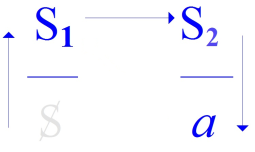

<!-- id: s18-01-0184 -->

- *qu’un sujet* comme tel ne maîtrise jamais en aucun cas cette articulation mais en est à proprement parler *déterminé*. \[*divisé :* S**◊***a*\]

<!-- id: s18-01-0185 -->

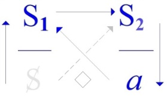

<!-- id: s18-01-0186 -->

Un discours, de sa nature fait *« semblant »*, comme on peut dire « *qu’il fait florès »* ou « *qu’il fait léger »* ou « *qu’il fait chic »*.

<!-- id: s18-01-0187 -->

Si ce qui s’énonce de parole est justement *vrai* d’être toujours très authentiquement ce qu’elle est...

<!-- id: s18-01-0188 -->

> au niveau où nous sommes de l’objectif et de l’articulation, ...c’est donc très précisément comme *objet de ce qui se produit dans le discours* *que le semblant se pose*.

<!-- id: s18-01-0189 -->

D’où le caractère à proprement parler *insensé* \[S1 **◊** S2 → S1 *n’a aucun sens*, *asémantique*\] de ce qui s’articule \[*dans le discours analytique*\].

<!-- id: s18-01-0190 -->

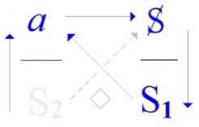

<!-- id: s18-01-0191 -->

Mais il faut dire que c’est bien là que se révèle ce qu’il en est de la richesse du langage, à savoir qu’il détient une logique qui dépasse de beaucoup tout ce que nous arrivons à en cristalliser, à en détacher.

<!-- id: s18-01-0192 -->

J’ai employé la forme hypothétique « *D’un discours <u>qui ne serait pas</u> du semblant* »*.*

<!-- id: s18-01-0193 -->

Chacun sait les développements qu’a pris après Aristote la logique, de mettre l’accent sur la fonction hypothétique.

<!-- id: s18-01-0194 -->

Tout ce qui s’est articulé... de donner la valeur « *Vrai »* ou « *Faux »* à l’articulation de l’hypothèse, et à combiner ce qui en résulte de l’implication d’un terme à l’intérieur de cette hypothèse comme étant signalé comme « *Vrai »* ...c’est l’inauguration de ce qu’on appelle le *modus ponens* [^10] et bien d’autres modes encore* *: chacun sait ce qu’on en a fait.

<!-- id: s18-01-0195 -->

Il est frappant, qu’au moins à ma connaissance, jamais personne nulle part n’ait individualisé la ressource que comporte l’usage de cet hypothétique sous la forme négative.

<!-- id: s18-01-0196 -->

Chose frappante, si l’on se réfère par exemple à ce qui en est recueilli dans mes *Écrits*, quand quelqu’un à l’époque...

<!-- id: s18-01-0197 -->

> à l’époque héroïque où je commençais de défricher le terrain de l’analyse ...quand quelqu’un[^11] venait contribuer au déchiffrage de la *Verneinung.*

<!-- id: s18-01-0198 -->

Encore qu’à commenter Freud lettre à lettre, il s’aperçut fort bien...

<!-- id: s18-01-0199 -->

> Freud le dit en toutes lettres ...que la *Bejahung* ne comporte qu’un *jugement d’attribution*...

<!-- id: s18-01-0200 -->

> en quoi Freud vraiment marque *une finesse et une compétence* tout à fait exceptionnelles à l’époque
>
> où il écrit ceci, car *seuls quelques logiciens* de diffusion modeste *pouvaient*, à la même époque, *l’avoir souligné* ...*jugement d’attribution* qui ne préjuge en rien de *l’existence *: la seule position d’une *Verneinung* implique *l’existence* de quelque chose qui est très précisément ce qui est nié.

<!-- id: s18-01-0201 -->

*« Un discours qui ne serait pas du semblant » pose que* *le discours*, comme je viens de l’énoncer, *est du semblant*.

<!-- id: s18-01-0202 -->

Ce qui a un grand avantage de le poser ainsi, c’est qu’on ne dit pas du semblant *de quoi*.

<!-- id: s18-01-0203 -->

Or c’est là, bien sûr, c’est là ce autour de quoi se proposent d’avancer nos énoncés, c’est de savoir de quoi il s’agit, *là où ce ne serait pas du semblant*.

<!-- id: s18-01-0204 -->

Bien sûr, le terrain est préparé d’un pas singulier et timide qui est celui que Freud a fait dans l’*Au-delà du principe du plaisir*.

<!-- id: s18-01-0205 -->

Je ne veux ici...

<!-- id: s18-01-0206 -->

> parce que je ne peux pas en faire plus ...qu’indiquer *le nœud* que forment dans ces énoncés *la répétition* et *la jouissance*.

<!-- id: s18-01-0207 -->

C’est en fonction de ceci que *la répétition* *va contre* *le principe du plaisir* qui, je dirai, ne s’en relève pas.

<!-- id: s18-01-0208 -->

*L’hédonisme* ne peut, à la lumière de l’expérience analytique, que rentrer dans ce qu’il est, à savoir un mythe philosophique, j’entends : un mythe d’une classe parfaitement définie.

<!-- id: s18-01-0209 -->

C’est une thèse, et je l’ai énoncée l’année dernière, de l’aide qu’ils \[*les philosophes*\] ont apportée à un certain *procès du Maître*, en permettant au *discours du Maître* comme tel, d’édifier un savoir. Ce savoir est *savoir de Maître*.

<!-- id: s18-01-0210 -->

Ce savoir a supposé...

<!-- id: s18-01-0211 -->

> puisque le discours philosophique en porte encore la trace ...l’existence en face du Maître d’un *autre savoir,* dont - Dieu merci ! - le discours philosophique n’a pas disparu sans avoir épinglé avant qu’il devait y avoir un rapport entre ce *savoir* et la *jouissance*.

<!-- id: s18-01-0212 -->

Celui qui a ainsi clos le discours philosophique...

<!-- id: s18-01-0213 -->

> Hegel pour le nommer ...bien sûr ne voit que la façon dont *par le travail l’esclave arrivera à accomplir* - quoi ? - rien d’autre que *le savoir du Maître*.

<!-- id: s18-01-0214 -->

Mais qu’introduit, qu’introduit de nouveau ce que j’appellerai « *l’hypothèse freudienne* » ?

<!-- id: s18-01-0215 -->

C’est sous une forme extraordinairement prudente, mais tout de même syllogistique, ceci : si nous appelons « *principe du plaisir »* ceci : que toujours de par le comportement du vivant, il est revenu à un niveau qui est celui de *l’excitation minimale*, et ceci règle son économie.

<!-- id: s18-01-0216 -->

S’il s’avère que *la répétition* s’exerce de façon telle qu’une *jouissance dangereuse*...

<!-- id: s18-01-0217 -->

> qu’une jouissance qui outrepasse cette excitation minimale ...soit ramenée, est-il possible...

<!-- id: s18-01-0218 -->

> c’est sous cette forme que Freud énonce la question ...qu’il soit pensé que la vie, prise elle-même dans son cycle...

<!-- id: s18-01-0219 -->

> c’est une nouveauté au regard du monde qui ne la comporte pas universellement ...que la vie comporte cette possibilité de *répétition* qui serait *le retour à ce monde en tant qu’il est semblant *?

<!-- id: s18-01-0220 -->

Je peux vous faire remarquer par un graphique au tableau que ceci comporte...

<!-- id: s18-01-0221 -->

> au lieu d’une suite de courbes d’excitation ascendante et descendante,
>
> toutes confinant à une limite, qui est une limite supérieure :

<!-- id: s18-01-0222 -->

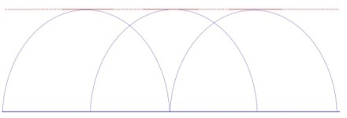

<!-- id: s18-01-0223 -->

...la possibilité d’une intensité d’excitation qui peut aussi bien aller à l’infini, ce qui est conçu comme jouissance ne comportant de soi en principe d’autre limite que ce point de tangence inférieur...

<!-- id: s18-01-0224 -->

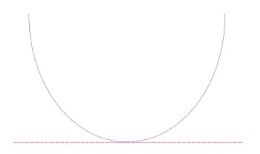

<!-- id: s18-01-0225 -->

...ce point que nous appellerons « *suprême* » en donnant son sens propre à ce mot, qui veut dire le point le plus bas d’une limite supérieure, de même *qu’« infime »* est le point le plus haut d’une limite inférieure.

<!-- id: s18-01-0226 -->

La cohérence donnée du *point mortel,* dès lors conçu - sans que Freud le souligne - comme une caractéristique de la vie, mais à la vérité ce à quoi on ne songe pas est en effet ceci : qu’on confond ce qui est de la non-vie...

<!-- id: s18-01-0227 -->

> et qui est loin – fichtre ! - de ne pas remuer, ce « *silence éternel des espaces infinis* » qui sidérait Descartes \[Pascal\] :
>
> ils parlent, ils chantent, ils se remuent de toutes les façons à nos regards maintenant ...le monde dit *« inanimé »* n’est pas la mort : la mort est un point, est désignée comme *un point-terme*, \- comme un *point-terme* de quoi ? - *de la jouissance de la vie*.

<!-- id: s18-01-0228 -->

C’est très précisément ce qui est introduit par l’énoncé freudien, celui que nous qualifierons de l’*hyper-hédonisme,* si je puis m’exprimer de cette façon.

<!-- id: s18-01-0229 -->

Qui ne voit pas que *l’économie* - même celle de la nature - est toujours *un fait de discours*, celui-là ne peut saisir que ceci indique qu’il ne saurait s’agir ici de *la jouissance* qu’en tant qu’elle est elle-même non seulement *« fait »* \[*un fait de discours *\], mais *« effet de discours »* \[« *jouis-sens »*\].

<!-- id: s18-01-0230 -->

Si quelque chose, *qui s’appelle l’inconscient*, peut être *mi-dit* comme structure langagière, c’est pour qu’*enfin* nous apparaisse le relief de cet « *effet de discours* » qui jusque-là nous paraissait comme *impossible*, à savoir le *plus-de-jouir*.

<!-- id: s18-01-0231 -->

Est-ce à dire - pour suivre une de mes formules - qu’en tant que c’était comme *impossible,* il fonctionnait comme *réel* ?

<!-- id: s18-01-0232 -->

J’ouvre la question, car à la vérité rien n’implique que l’irruption du *discours de l’inconscient* - tout balbutiant qu’il reste – implique quoi que ce soit, dans ce qui le précédait, qui fut soumis à sa structure.

<!-- id: s18-01-0233 -->

*Le discours de l’inconscient est une émergence*, c’est l’émergence d’une certaine fonction du signifiant.

<!-- id: s18-01-0234 -->

Qu’il existât jusque-là comme « *enseigne* », c’est bien en quoi je vous l’ai mis au principe du *semblant*.

<!-- id: s18-01-0235 -->

Mais les conséquences de son émergence, c’est cela qui doit être introduit comme quelque chose qui change, qui ne peut pas changer, car ce n’est pas du *possible*.

<!-- id: s18-01-0236 -->

C’est au contraire de ce qu’un discours se centre de son *effet* comme *impossible* \[S1**◊** S2\] qu’il aurait quelque chance d’être *un discours qui ne serait pas du semblant*.

## Notes

[^1]: Jacques Lacan : *Écrits*, Paris, Seuil, 1966, p. 237, « *Fonction et champ de la parole et du langage en psychanalyse* », Rapport de Rome 1953.

[^2]: *Écrits* : *La Chose freudienne*, p. 409 : « *Moi la vérité, je parle*. »...

[^3]: Cf. Ferdinand de Saussure : « *Anagrammes homériques* », éd. Lambert-Lucas, Limoges, 2013.

    Federico Bravo : « *Anagrammes. Sur une hypothèse de Ferdinand de Saussure* », Limoges, 2011.

    Michel Arrivé : « *À la recherche de Ferdinand de Saussure* », PUF, Paris, 2007.

    Francis Gandon : « *De dangereux édifices* », éd. Peeters, Louvain-Paris, 2002.

[^4]: René Descartes : [*Les Météores*](http://classiques.uqac.ca/classiques/Descartes/meteores/meteores.pdf) (1637), in *Œuvres*, Gallimard, Pléiade, 1953, p. 230, *Discours huitième : De l’arc en ciel*.

[^5]: Cf. Bernard De Mandeville : [« *La fable des abeilles* »](http://fr.wikisource.org/wiki/La_Fable_des_abeilles).

[^6]: Modèle des alvéoles hexagonales de la ruche.

[^7]: Cf. les « α, β, γ, δ » du « *séminaire sur la lettre volée* », *Écrits*, Seuil 1966, p. 11 .

[^8]: Cf. Séminaire1961-62 : *L’identification*, séance du 10-02, et James G. Février : « *Histoire de l'écriture* », Paris, Payot, 1948. Tableau comparatif

    de certains signes protosinaïtiques et protophéniciens, p.196 (p.198, réédition 1984).

[^9]: Ectopie : anomalie de situation d’un organe, et par extension ce qui ne se trouve pas à sa vraie place.

[^10]: Le [*modus ponens*](http://www.madore.org/~david/misc/best_of_GroTeXdieck/logique) est un type de raisonnement logique consistant à affirmer une implication (« *si p alors q* ») et à poser ensuite l’antécédent

    (« *or, p...* ») pour en déduire la vérité du conséquent (« *...donc q* »). Les termes *modus ponens* (ou plus exactement *modus ponendo ponens*)

    viennent du fait qu’on pose « *p* » (« *ponens* » en latin) afin de tirer la conclusion.

[^11]: Il s’agit de Jean Hyppolite, cf. *Écrits*, pp. 369-81, et séminaire 1953-54 : « *Les écrits techniques de Freud* ».
