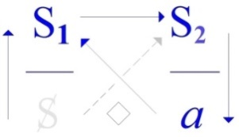
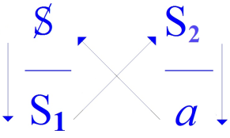
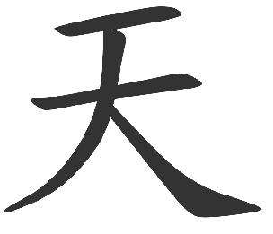

# Leçon 03 | 10 Février 1971

<!-- source-url: http://staferla.free.fr/S18/S18 D'UN DISCOURS...docx -->
<!-- seminar: s18 -->
<!-- lesson: 03 -->

<!-- id: s18-03-0001 -->

Vous n’êtes pas en très grand nombre...

<!-- id: s18-03-0002 -->

On me demandait si je ferai mon séminaire en raison de la grève.

<!-- id: s18-03-0003 -->

Il y a même deux...

<!-- id: s18-03-0004 -->

ou une peut-être seulement, mais peut-être deux ...de ces personnes qui m’ont demandé quelle était mon opinion sur la grève, plus exactement qui l’ont demandé à ma secrétaire.

<!-- id: s18-03-0005 -->

Eh bien, moi, je vous la demande !

<!-- id: s18-03-0006 -->

Personne n’a rien à faire valoir en faveur de la grève à propos tout au moins de ce séminaire ?

<!-- id: s18-03-0007 -->

Moi je n’ai rien contre, je ne vais pas vous faire... faire défaut à votre présence.

<!-- id: s18-03-0008 -->

J’étais pourtant moi-même, ce matin, assez porté à faire la grève.

<!-- id: s18-03-0009 -->

J’y étais porté en raison de ceci que la per­sonne dont je viens de parler, ma secrétaire, m’a montré une petite rubrique dans le journal concernant ladite grève, le mot d’ordre de grève et auquel était adjoint, vu le journal dont il s’agissait, un communiqué du ministère de l’éducation nationale concernant tout ce qui avait été fait pour l’Université : les moyennes des emplois d’enseignants qui sont réservées par nombre d’étudiants, etc.

<!-- id: s18-03-0010 -->

Je n’irai pas, bien sûr, à contester ces *statistiques*, néanmoins la conclusion qui en est tirée, de cet effort très large qui devrait en tout cas satisfaire, je dirai qu’elle n’est pas conforme à mes informations qui sont pourtant de bonne source, de sorte que, en raison de ceci, j’étais assez porté à faire la grève.

<!-- id: s18-03-0011 -->

Votre présence me forcera, disons par un fait qui compte, c’est ce qu’on appelle dans notre language la courtoisie, et dans une autre...

<!-- id: s18-03-0012 -->

> à laquelle j’ai annoncé, comme ça, par une sorte de «* revenez-y *», que je me référerai, c’est à savoir la langue chinoise dont je me suis laissé aller à vous confier qu’elle fut un temps... enfin j’en ai appris un tout petit bout ...ça s’appelle « *Lǐ* 禮 ».

<!-- id: s18-03-0013 -->

« *Lǐ »* dans la grande tradition, est une des 4 *vertus fondamentales* - de qui ? de quoi ? - d’un homme, d’une certaine date.

<!-- id: s18-03-0014 -->

Et si j’en parle, si j’en parle comme ça, comme ça me vient, puisque je pensais avoir à tenir avec vous quelques propos familiers, c’est d’ailleurs sur ce plan que je pense aujourd’hui vous tenir.

<!-- id: s18-03-0015 -->

Ça ne sera pas à proprement parler ce que j’avais préparé : à ma façon quand même je tiendrai compte de cette grève et c’est d’une façon...

<!-- id: s18-03-0016 -->

vous allez le voir, à quel niveau je vais placer les choses ...c’est d’une façon plus familière pour *répondre d’une façon* *équitable*, c’est à peu près le meilleur sens qu’on puisse donner à ce « *Lǐ »* : *répondre d’une façon équitable* à cette présence.

<!-- id: s18-03-0017 -->

Vous verrez que j’en profiterai pour aborder un certain nombre de points qui depuis quelque temps font équivoque, c’est-à-dire que, puisque aussi bien quelque chose est en question au niveau de l’Université, c’est aussi au niveau de l’Université...

<!-- id: s18-03-0018 -->

à quoi dans bien des cas je dédaigne de faire état de mouvements qui me parviennent ...à quoi je pense aujourd’hui devoir répondre.

<!-- id: s18-03-0019 -->

Comme peut-être vous le savez...

<!-- id: s18-03-0020 -->

votre présence en témoigne-t-elle ou pas, comment le savoir ?

<!-- id: s18-03-0021 -->

...je ne suis, dans mon rapport à ladite Université, que dans une position disons marginale.

<!-- id: s18-03-0022 -->

Elle croit devoir me donner abri, ce dont certes je lui dois hommage, encore se manifeste-t-il depuis quelque temps quelque chose dont je ne peux pas ne pas tenir compte, étant donné le champ dans lequel je me trouve enseigner.

<!-- id: s18-03-0023 -->

C’est un certain nombre d’échos, de bruitages, de mur­mures qui me parviennent du côté d’un champ défini de façon universitaire et qui s’appelle la *linguistique*.

<!-- id: s18-03-0024 -->

Quand je parle - bien sûr - de dédain, il ne s’agit pas d’un sentiment, il s’agit d’une conduite.

<!-- id: s18-03-0025 -->

Dans un temps, qui déjà remonte justement, si je me souviens bien, à quelque chose...

<!-- id: s18-03-0026 -->

> ça doit faire, ça doit faire quoi ? - deux ans, c’est pas énorme ...il est sorti, dans une revue que personne ne lit plus, dont le nom fait désuet : *La Nouvelle Revue Française,* il est paru un certain article qui s’appelait « *Exercices de style de Jacques Lacan ».*

<!-- id: s18-03-0027 -->

C’était un article que moi j’ai signalé d’ailleurs, j’étais à ce moment-là sous le toit de l’*École Normale*, enfin sous le toit... sous l’auvent, à la porte, j’ai dit : « *Lisez donc ça, c’est marrant* ».

<!-- id: s18-03-0028 -->

Il s’est avéré, comme vous l’avez vu par la suite, que c’était peut-être un peu moins marrant que ça en avait l’air, puisque c’était en quelque sorte la «* clochette *» où j’avais plutôt - quoique je sois sourd – à entendre confirmation de ce qui m’avait déjà été annoncé : que ma place n’était plus sous cet auvent.

<!-- id: s18-03-0029 -->

C’est une confirmation que j’aurais pu entendre, parce que c’était écrit dans l’article. C’était écrit...

<!-- id: s18-03-0030 -->

enfin quelque chose je dois dire d’assez gros ...qu’on pouvait espérer, au moment où je ne serais plus sous l’auvent de l’*École Normale,* l’introduction dans ladite *École,* de la linguistique ...

<!-- id: s18-03-0031 -->

je ne suis pas sûr de citer très exactement les termes, vous pensez bien que je ne m’y suis pas reporté ce matin, puisque tout ça est improvisé ...la linguistique de haute qualité, de haute tension, ou de n’importe quoi de cette espèce, enfin quelque chose qui désignait en effet que la linguistique avait quelque chose – mon Dieu ! – de galvaudé dans le sein de cette *École Normale*.

<!-- id: s18-03-0032 -->

Au nom de quoi, grand Dieu ?

<!-- id: s18-03-0033 -->

Je n’étais pas chargé dans l’*École Normale* d’aucun enseignement, mais si l’*École Normale* se trouvait...

<!-- id: s18-03-0034 -->

à entendre cet auteur ...si peu initiée à la linguistique, ce n’était certainement pas à moi qu’il fallait s’en prendre.

<!-- id: s18-03-0035 -->

Ceci vous indique le point sur lequel j’entends tout de même préciser quelque chose ce matin.

<!-- id: s18-03-0036 -->

C’est à savoir en effet ceci, ceci qui est soulevé, et depuis quelque temps, avec une sorte d’insistance...

<!-- id: s18-03-0037 -->

> le thème est repris d’une façon moins... moins légère dans un certain nombre d’interviews ...il y a une question qui est soulevée autour de quelque chose : « *est-on structuraliste ou pas quand on est linguiste ?* »

<!-- id: s18-03-0038 -->

Et on tend à se démarquer, n’est-ce pas, on dira : « *Je suis fonctionnaliste* »[^18].

<!-- id: s18-03-0039 -->

« *Je suis fonctionnaliste* » - pourquoi ? - parce que le *structuralisme* c’est quelque chose...

<!-- id: s18-03-0040 -->

> d’ailleurs de pure invention journalistique, c’est moi qui le dis ...le *structuralisme* est tout de même quelque chose qui sert d’étiquette et qui bien sûr, étant donné ce qu’il inclut, à savoir un certain *sérieux*, n’est pas sans inquiéter, à quoi bien sûr on tient à marquer qu’on se réserve.

<!-- id: s18-03-0041 -->

La question des rapports de *la linguistique* et de ce que j’enseigne est, autre­ment dit, ce que je veux mettre au premier plan, de façon en quelque sorte à dis­siper - dissiper j’espère d’une façon qui fasse date - une certaine équivoque.

<!-- id: s18-03-0042 -->

Les linguistes, les linguistes universitaires, entendraient en somme se réserver le pri­vilège de parler du langage.

<!-- id: s18-03-0043 -->

Et le fait que c’est autour du développement lin­guistique que se tient l’axe de mon enseignement, aurait quelque chose d’abusif qui est dénoncé selon des formules diverses dont la principale est celle-ci...

<!-- id: s18-03-0044 -->

> c’est me semble-t-il en tout cas la plus consistante ...que de la linguistique il est fait dans le champ qui se trouve celui dans lequel je m’insère...

<!-- id: s18-03-0045 -->

> dans celui aussi dans lequel quelqu’un qui certes, en l’occasion,
>
> mériterait qu’on y regarde d’un peu plus près, beaucoup plus que pour ce qui est de moi,
>
> parce qu’on peut n’avoir qu’une idée assez vague, du moins je trouve, c’est Lévi-Strauss ...et alors Lévi-Strauss par exemple, et puis quelques autres encore, Roland Barthes, nous aussi nous ferions de la linguistique un usage - je cite - « *un usage métaphorique* ».

<!-- id: s18-03-0046 -->

Eh bien c’est en effet là-dessus que je voudrais bien marquer quelques points.

<!-- id: s18-03-0047 -->

Il y a quelque chose d’abord dont il faudrait partir, parce que c’est quand même inscrit, inscrit dans quelque chose qui compte : le fait que je sois encore là à soutenir ce discours, le fait que vous y soyez aussi pour l’entendre, me l’assure.

<!-- id: s18-03-0048 -->

C’est que, il faut bien croire qu’une formule n’est pas tout à fait déplacée concernant ce *discours* en tant que je le tiens, c’est que d’une certaine façon enfin, disons que je sais...

<!-- id: s18-03-0049 -->

> je sais quoi ? Tâchons d’être exact ...il semble prouvé que « *je sais à quoi m’en tenir* »*.*

<!-- id: s18-03-0050 -->

La tenue d’une certaine place, et je le sou­ligne : cette place n’est autre...

<!-- id: s18-03-0051 -->

> je le souligne parce que je n’ai pas à l’énoncer pour la première fois,
>
> je passe mon temps à bien répéter que c’est de là que je me tiens ...que la place que j’identifie à celle d’un *psychanalyste* : la question après tout peut être discutée puisque *bien des psychanalystes* la discuteraient, mais enfin c’est à quoi je m’en tiens.

<!-- id: s18-03-0052 -->

Ce n’est pas tout à fait pareil si j’énonçais : «* je sais où je me tiens *»*,* non pas parce que le « *je* » serait répété dans la deuxième partie de la phrase, mais c’est là que le langage montre toujours ses ressources, c’est qu’à dire «* je sais où je me tiens *», c’est sur « *où *» que porterait l’accent de ce que je me targuerais de *savoir*. J’aurais - si je puis dire - j’aurais la carte, le *mapping* de la chose.

<!-- id: s18-03-0053 -->

Et pourquoi après tout que je l’aurais pas ?

<!-- id: s18-03-0054 -->

Il y a une forte raison pour laquelle je ne saurais même soutenir que «* je sais où je me tiens *»...

<!-- id: s18-03-0055 -->

> ça, c’est vraiment dans l’axe de ce que j’ai cette année à vous dire ...c’est que le principe de la Science, tel que le procès en est pour nous engagé, je parle de ce à quoi je me réfère quand je lui donne pour centre *la science newto­nienne*, l’introduction du *champ newtonien,* c’est qu’en aucun domaine de la science on ne l’a ce *mapping,* cette carte, pour nous dire où l’on est.

<!-- id: s18-03-0056 -->

Et qu’en plus...

<!-- id: s18-03-0057 -->

> tout le monde est d’accord là-dessus ...que, quelle qu’en vaille l’aune de l’objection qui peut être faite, dès qu’on commence à parler de la carte justement, et de son hasard et de sa nécessité, eh bien n’importe qui, n’importe qui est en posture de vous objecter que vous ne faites plus de la science, mais de la philosophie.

<!-- id: s18-03-0058 -->

Ça ne veut pas dire que n’importe qui sait ce qu’il dit en le disant, mais enfin il est dans une position très forte.

<!-- id: s18-03-0059 -->

Le discours de la science répudie cet « *où nous en sommes ».* Ce n’est pas avec ça qu’il opère.

<!-- id: s18-03-0060 -->

L’hypothèse...

<!-- id: s18-03-0061 -->

rappelez-vous Newton affirmant qu’il n’en feignait aucune ...l’hypothèse, employée pourtant, ne concerne jamais le fond des choses.

<!-- id: s18-03-0062 -->

L’hypothèse, dans le champ scientifique...

<!-- id: s18-03-0063 -->

> et quoi qu’en pense quiconque ...l’hypo­thèse participe avant tout de la logique :

<!-- id: s18-03-0064 -->

- il y a un « *si* » : le conditionnel d’une vérité qui n’est jamais que logiquement articulée*,*

<!-- id: s18-03-0065 -->

- alors *« apodose »* [^19] : un conséquent doit être vérifiable.

<!-- id: s18-03-0066 -->

Il est vérifiable à son niveau, tel qu’il s’articule. Ça ne prouve en rien la vérité de l’hypothèse.

<!-- id: s18-03-0067 -->

Je ne suis absolument pas en train de dire que la science est là qui nage comme une pure construction, qu’elle ne mord pas sur le réel.

<!-- id: s18-03-0068 -->

Dire que ça ne prouve pas la vérité de l’hypothèse, c’est simplement rappeler ce que je viens de dire, à savoir que : *l’implication, en logique, n’implique nullement qu’une conclusion vraie ne puisse pas être tirée d’une prémisse fausse*.

<!-- id: s18-03-0069 -->

Il n’en reste pas moins que *la vérité de l’hypothèse* dans un champ scientifique établi, se reconnaît de l’ordre qu’elle donne à l’ensemble du champ, en tant qu’il a son statut.

<!-- id: s18-03-0070 -->

Et son statut ne peut pas se définir autrement que du consentement de tous ceux qui sont « *autorisés »* dans ce champ, autrement dit, du champ scienti­fique le statut est universitaire.

<!-- id: s18-03-0071 -->

C’est des choses qui peuvent paraître grosses.

<!-- id: s18-03-0072 -->

Il n’en reste pas moins que c’est ça qui motive qu’on donne le niveau de l’articulation du *discours universitaire*, tel que j’ai essayé de le faire l’année dernière.

<!-- id: s18-03-0073 -->

Or, or il est clair que la façon dont je l’ai articulé est la seule qui permette de s’apercevoir pourquoi il n’est pas acci­dentel, caduc, lié à je ne sais quel accident, que *le statut du développement de la Science* comporte la présence, la subvention, d’autres entités sociales qu’on connaît bien : de l’*Armée* par exemple, ou de la *Marine* comme on dit encore, et de quelques autres éléments d’un certain ameublement.

<!-- id: s18-03-0074 -->

C’est tout à fait légitime si nous voyons que radicalement le *discours universitaire* ne saurait s’articuler qu’à partir du *discours du Maître*. La répartition des domaines dans un champ dont le statut est *universitaire*, voilà où seulement peut se poser la question de ce qui arrive et d’abord de si c’est possible qu’un *discours* s’intitule autrement.

<!-- id: s18-03-0075 -->

C’est là que s’introduit dans sa massivité...

<!-- id: s18-03-0076 -->

> je m’excuse de repartir d’un point vraiment aussi originel, mais après tout, puisque il peut me venir, et de personnes autorisées d’être linguistes, des objections comme celle-ci : que de la linguistique je ne fais qu’un « *usage méta­phorique »*,

<!-- id: s18-03-0077 -->

> je dois rappeler, je dois répondre quelle que soit l’occasion à laquelle je le fais,
>
> et je le fais ce matin en raison du fait que je m’attendais à rencontrer une atmosphère plus combative ...eh bien donc je dois rappeler ceci, c’est que si je peux dire décemment que *je sais*, je sais quoi ?

<!-- id: s18-03-0078 -->

Parce qu’après tout, peut-être que je me place quelque part dans un endroit que le nommé Mencius...

<!-- id: s18-03-0079 -->

> dont je vous ai introduit comme ça le nom la dernière fois ...le nommé Mencius, peut-être, peut nous servir à définir.

<!-- id: s18-03-0080 -->

Bon, il reste que si...

<!-- id: s18-03-0081 -->

que Mencius me protège !

<!-- id: s18-03-0082 -->

...« *je sais à quoi m’en tenir »,* il me faut dire en même temps que « *je ne sais pas ce que je dis »*.

<!-- id: s18-03-0083 -->

*Je sais ce que je dis*, autrement dit : *c’est ce que je ne peux pas dire*.

<!-- id: s18-03-0084 -->

Ça c’est la date, la date que marque ceci : qu’il y a Freud et qu’il a introduit l’inconscient.

<!-- id: s18-03-0085 -->

L’incons­cient ne veut rien dire si ça ne veut pas dire ça : que *quoi que je dise, et d’où que je me tienne* - même si je me tiens bien - eh bien, « *je ne sais pas ce que je dis »*.

<!-- id: s18-03-0086 -->

Et aucun des \[4\] *discours*, tels que l’année dernière je les ai définis, ne laisse espoir, ne permet à quiconque...

<!-- id: s18-03-0087 -->

à quiconque profère *quoi que ce soit* ...de prétendre, d’espérer même, d’aucune façon *savoir ce qu’il dit*.

<!-- id: s18-03-0088 -->

Je *dis*, même si je ne sais pas *ce* que je dis, seulement je le sais que je ne le sais pas.

<!-- id: s18-03-0089 -->

Et je ne suis pas le premier à dire quelque chose dans ces conditions, ça s’est déjà entendu[^20].

<!-- id: s18-03-0090 -->

Je dis que la cause de ceci n’est à chercher que dans le langage lui-même et ce que j’ajoute...

<!-- id: s18-03-0091 -->

> ce que j’ajoute à Freud, même si dans Freud c’est déjà là, patent,
>
> parce que quoi que ce soit qu’il démontre que l’inconscient n’est jamais rien que matière de langage ...j’ajoute ceci : que « *l’inconscient est structuré comme un langage* ». Lequel ? Eh bien, justement, cherchez-le !

<!-- id: s18-03-0092 -->

C’est du français, ou du chinois que je vous causerai.

<!-- id: s18-03-0093 -->

Du moins je le voudrais : il n’est que trop clair qu’à un certain niveau, ce que je cause c’est de l’aigreur, très spécialement du côté des linguistes.

<!-- id: s18-03-0094 -->

C’est de nature plutôt à faire penser que le statut universitaire...

<!-- id: s18-03-0095 -->

> ça n’est que trop évident dans les développements ...impose à la linguistique de tourner à une drôle de sauce. D’après ce qu’on en voit c’est pas douteux.

<!-- id: s18-03-0096 -->

Qu’on me dénonce à cette occasion, mon Dieu, c’est pas une chose qui a tellement d’importance.

<!-- id: s18-03-0097 -->

Qu’on ne me discute pas, ça n’est pas non plus très surprenant, puisque ça n’est pas d’une certaine définition du domaine universitaire que je me tiens, que je peux me tenir.

<!-- id: s18-03-0098 -->

Ce qu’il y a d’amusant, puisqu’il est évident, il est évident que, il est évident que « *nous »* ne sommes pas pour rien...

<!-- id: s18-03-0099 -->

> un certain nombre de gens dans lesquels je me suis rangé tout à l’heure \[« *Structuralistes* »\],
>
> en y ajoutant deux autres noms et on pourrait en ajouter encore quelques-uns ...c’est évidemment à partir de « *nous »*, enfin, que la linguistique voit s’accroître, comme ça le nombre de ses postes, ceux que décomptait ce matin dans le journal, *le ministère de l’Éducation nationale,* et puis aussi le nombre des étudiants.

<!-- id: s18-03-0100 -->

Bon, enfin...

<!-- id: s18-03-0101 -->

L’intérêt, la vague d’intérêt que j’ai contribué à apporter à la linguistique, c’est - paraît-il - un intérêt qui vient d’ignorants. Eh bien ce n’est déjà pas si mal ! \[*Rires*\] *Ils étaient ignorants avant, maintenant ils s’intéressent*.

<!-- id: s18-03-0102 -->

J’ai réussi à intéresser les ignorants à quelque chose en plus, qui n’était pas mon but, parce que la linguis­tique, je vais vous dire : *moi je m’en fous !* \[*Rires*\]

<!-- id: s18-03-0103 -->

Ce qui m’intéresse directement c’est le langage, parce que je pense que c’est à ça que j’ai affaire, que c’est à ça que j’ai affaire quand j’ai à faire une psychanalyse.

<!-- id: s18-03-0104 -->

L’*objet* linguistique, bon c’est l’affaire des linguistes de le définir.

<!-- id: s18-03-0105 -->

Dans le champ de la science, chaque domaine progresse de définir son *objet*.

<!-- id: s18-03-0106 -->

Ils le définissent comme ils l’entendent et ils ajoutent que j’en fais un *usage métaphorique*.

<!-- id: s18-03-0107 -->

C’est tout de même curieux que des linguistes ne voient pas que tout usage du langage, quel qu’il soit, se déplace *dans la métaphore*, qu’*il n’y a de langage que méta­phorique*, comme le démontre toute tentative de « *métalangager* », si je puis m’exprimer ainsi, qui ne peut faire autrement que d’essayer de partir de ce qu’on définit toujours...

<!-- id: s18-03-0108 -->

> chaque fois qu’on s’avance dans un effort dit « logicien » ...de défi­nir d’abord un «* langage-objet *» [^21] dont il est clair, dont il se touche du doigt, aux énoncés de n’importe lesquels de ces essais logiciens, qu’il est insaisissable ce *langage-objet*.

<!-- id: s18-03-0109 -->

Il est de la nature du langage...

<!-- id: s18-03-0110 -->

> je ne dis pas de *la parole*, je dis du langage même ...que pour ce qui est d’accrocher quoi que ce soit qui « *signifie »*, *le référent n’est jamais le bon, et c’est ça qui fait un langage*. Toute désignation est *métaphorique*, elle ne peut se faire que par l’intermé­diaire *d’autre chose*.

<!-- id: s18-03-0111 -->

Même si je dis « *ça !* » \[*Lacan désigne son cigare*\], « *ça !* » en *le désignant*, eh bien j’implique déjà, de l’avoir appelé « *ça !* », que je choisis de n’en faire que « *ça !* ». Alors que ça n’est pas « *ça !* » !

<!-- id: s18-03-0112 -->

La preuve c’est que, quand je l’allume, c’est autre chose.

<!-- id: s18-03-0113 -->

Même au niveau du « *Ça »*, ce fameux « *Ça »* qui serait le réduit du particulier, de l’individuel.

<!-- id: s18-03-0114 -->

Nous ne pouvons omettre que c’est un fait de langage de dire « *ça !* », ce que je viens de dési­gner comme « *ça !* », ça n’est pas mon cigare, ça l’est quand je le fume, mais quand je le fume j’en parle pas.

<!-- id: s18-03-0115 -->

Le signifiant à quoi se réfère *le discours*...

<!-- id: s18-03-0116 -->

à l’occasion, quand il y a discours, il apparaît qu’on ne peut guère y échapper à ce qui est discours ...à quoi se réfère *le discours* à propos de quelque chose dont il peut bien, ce signi­fiant, être le seul support.

<!-- id: s18-03-0117 -->

Il évoque, de sa nature, *un référent*.

<!-- id: s18-03-0118 -->

Seulement ça ne peut pas être le bon et c’est pour ça que *le référent est toujours réel*, parce qu’il est impossible à désigner. Moyennant quoi, il ne reste plus qu’à le construire. Et on le construit si on peut.

<!-- id: s18-03-0119 -->

Il n’y a aucune raison que je me prive...

<!-- id: s18-03-0120 -->

> enfin je ne vais pas vous rappeler tout de même ce que vous savez tous parce que vous l’avez lu
>
> dans un tas d’ordures occultisantes dont vous vous abreuvez comme chacun sait, n’est-ce pas ...je parle pas du *yang* et du *yin,* comme tout le monde vous savez ça - hein ? - le mâle et la femelle.

<!-- id: s18-03-0121 -->

Ça se dessine comme ça : ils forment de très beaux petits caractères.

<!-- id: s18-03-0122 -->

Voilà le *yáng* 陽, et pour le *yīn*, je vous le ferai une autre fois.

<!-- id: s18-03-0123 -->

Je vous le ferai une autre fois parce que, à ce propos je ne vois pas pour­quoi, ces caractères chinois qui sont pour peu d’entre vous quelque chose, j’en abuserais.

<!-- id: s18-03-0124 -->

Je vais m’en servir quand même.

<!-- id: s18-03-0125 -->

Nous ne sommes pas non plus là pour faire des tours de passe-passe.

<!-- id: s18-03-0126 -->

Si je vous en parle, c’est parce qu’il est bien évident que voilà l’exemple de *référents introuvables*.

<!-- id: s18-03-0127 -->

Ça ne veut pas dire - foutre ! - qu’ils ne soient pas réels. La preuve, c’est que nous en sommes encore encombrés.

<!-- id: s18-03-0128 -->

Si je fais un usage métaphorique de la linguistique, c’est à partir de ceci, c’est que *l’inconscient* ne peut se conformer à une recherche - je dis : la linguistique - qui est *insoutenable*.

<!-- id: s18-03-0129 -->

Ça n’empêche pas de la continuer, bien sûr c’est une gageure, mais j’ai déjà fait assez d’usage de la gageure pour savoir, pour que vous sachiez, que vous soupçonniez que ça peut servir à quelque chose. C’est aussi important de perdre que de gagner.

<!-- id: s18-03-0130 -->

La linguistique ne peut être qu’une métaphore qui se fabrique pour ne pas marcher.

<!-- id: s18-03-0131 -->

Mais en fin de compte, ça nous intéresse beaucoup, parce que vous allez le voir...

<!-- id: s18-03-0132 -->

> vous allez le voir, je vous l’annonce : c’est ça que j’ai à vous dire cette année ...c’est que la psy­chanalyse, elle, c’est dans cette même métaphore qu’elle se déplace toutes voiles dehors.

<!-- id: s18-03-0133 -->

C’est bien là *ce qui m’a suggéré* *ce retour*, comme ça - après tout, on sait ce que c’est ! - à mon vieux petit acquis de chinois.

<!-- id: s18-03-0134 -->

Après tout, pourquoi ne l’aurais-je pas entendu pas trop mal, quand j’ai appris ça avec mon cher maître Demiéville ?

<!-- id: s18-03-0135 -->

J’étais déjà psychanalyste.

<!-- id: s18-03-0136 -->

Alors, qu’il y ait une langue quand même dans laquelle ceci : 為

<!-- id: s18-03-0137 -->

> je l’écris plus ou moins bien avec la craie, bon enfin c’est quand même assez clair.
>
> Je vais le refaire. Apprenez à le faire ça vous aidera \[*Rires*\] ...ça se lit « *wei »* 為 et ça fonctionne à la fois dans la formule « *wúwéi »* 無為 qui veut dire « non-agir », donc ça \[*wei*\] veut dire « agir », et pour un rien vous voyez « *wei »* employé comme « *comme* »*,* ça veut dire « *comme* ».

<!-- id: s18-03-0138 -->

C’est-à-dire que ça sert de conjonction pour faire *métaphore*, ou bien encore ça veut dire « *en tant que ça se réfère à telle chose* » qui est encore plus dans la métaphore, *en tant que ça se réfère à telle chose*, c’est-à-dire justement que ça n’en est pas, puisque c’est bien forcé de s’y référer.

<!-- id: s18-03-0139 -->

Quand une chose se réfère à une autre, la plus grande largeur, la plus grande souplesse est donnée à l’usage éventuel de ce terme « *wei* 為 » qui veut néan­moins dire « *agir *»*.*

<!-- id: s18-03-0140 -->

C’est pas mal une langue comme ça ! Une langue où les verbes...

<!-- id: s18-03-0141 -->

> et les plus *« verbes »* : agir, qu’est-ce qu’il y a de plus « *verbe »*, qu’est-ce qu’il y a de plus *verbe actif* *?* ...se transforment en menues conjonctions. Ça, c’est courant.

<!-- id: s18-03-0142 -->

Ça m’a beaucoup aidé quand même à généraliser la fonction du signifiant, même si ça fait mal aux entournures à quelques linguistes qui ne savent pas le chinois.

<!-- id: s18-03-0143 -->

Moi je voudrais bien demander à *un certain* [^22] par exemple : comment pour lui « *la double articulation* » dont il a plein la bouche depuis des années...

<!-- id: s18-03-0144 -->

> enfin quand même *« la double articulation »,* on en crève ! *-* ...« *la double articulation »*, qu’est-ce qu’il en est *en chinois* ? Hein ?

<!-- id: s18-03-0145 -->

En chinois, ben voyez-vous, c’est la pre­mière qui est toute seule, et puis qui se trouve comme ça produire un sens qui de temps en temps fait que, comme tous les mots sont monosyllabiques, on ne va pas dire :

<!-- id: s18-03-0146 -->

- qu’il y a *le phonème* qui ne veut rien dire,

<!-- id: s18-03-0147 -->

- et puis *les mots* qui veulent dire quelque chose, ...deux articulations, deux niveaux... Eh bien oui, même au niveau du phonème, ça veut dire quelque chose.

<!-- id: s18-03-0148 -->

Ça n’empêche pas que quand vous mettez *plusieurs phonèmes*, qui veulent déjà dire quelque chose, ensemble ça fait un grand mot de plusieurs syllabes, tout à fait comme chez nous, mais qui a un sens qui n’a aucun rapport avec ce que veut dire chacun des phonèmes.

<!-- id: s18-03-0149 -->

Alors, la double articulation, elle est marrante là !

<!-- id: s18-03-0150 -->

C’est drôle qu’on ne se souvienne pas qu’il y a une langue comme ça, quand on énonce comme générale une fonction de la double articulation comme *caractéristique* du langage.

<!-- id: s18-03-0151 -->

Je veux bien que tout ce que je dis soit une connerie, mais qu’on m’explique !

<!-- id: s18-03-0152 -->

Qu’il y ait un lin­guiste ici qui vienne me dire en quoi la double articulation tient en chinois...

<!-- id: s18-03-0153 -->

Alors, ce *wei* 為 comme ça, pour vous habituer *je vous l’introduis*, comme on dit, mais tout doucement. \[*Rires*\]

<!-- id: s18-03-0154 -->

Je vous en apporterai un minimum d’autres, mais enfin qui puissent servir à quelque chose.

<!-- id: s18-03-0155 -->

Ça allège bien les choses d’ailleurs, que ce verbe soit à la fois « *agir *» et *la conjonction de la métaphore*.

<!-- id: s18-03-0156 -->

Peut-être que l’« *Im Anfang war die Tat* »[^23] comme il dit l’autre là, que l’agir était tout au commencement, c’est peut-être exactement la même chose que de dire : έν αρχῆ... \[en arkéi\], « *Au commencement était le verbe ».*

<!-- id: s18-03-0157 -->

Il n’y a peut-être pas d’autre agir que celui-là.

<!-- id: s18-03-0158 -->

Ce qu’il y a de terrible - hein ? - c’est que je peux vous mener comme ça longtemps avec *la métaphore* et que plus loin j’irai, plus loin vous serez fourvoyés, parce que justement le propre de *la méta­phore* c’est de ne pas être toute seule : il y a aussi *la métonymie* qui fonctionne pendant ce temps-là, et même pendant que je vous parle, parce que quand même *la métaphore*, comme disent ces gens très compétents, *très sympathiques* qui s’appellent les linguistes.

<!-- id: s18-03-0159 -->

Ils sont même si *compétents* qu’ils ont été forcés d’inventer la notion de *compétence*. \[*Rires*\]

<!-- id: s18-03-0160 -->

La langue, c’est la compétence en elle-­même. En plus, c’est vrai* *: on n’est compétent en rien d’autre.

<!-- id: s18-03-0161 -->

Seulement - comme ils s’en sont aperçus aussi – il n’y a qu’une façon de le prouver, c’est *la perfor­mance*.

<!-- id: s18-03-0162 -->

C’est eux qui appellent ça comme ça : *la perfor­mance*.

<!-- id: s18-03-0163 -->

Moi pas, je n’en ai pas besoin, je suis en train de la faire, *la performance*.

<!-- id: s18-03-0164 -->

Et en faisant *la performance* de vous parler *de la métaphore*, naturellement je vous floue, parce que la seule chose intéressante c’est ce qui se passe dans *la performance *: c’est la production du *plus-de-jouir*, du vôtre et de celui que vous m’imputez quand vous réfléchissez. Ça vous arrive...

<!-- id: s18-03-0165 -->

Ça vous arrive surtout pour vous demander ce que je fous là.

<!-- id: s18-03-0166 -->

Il faut bien croire que ça doit me faire plaisir au niveau de *ce plus-de-jouir* qui vous presse.

<!-- id: s18-03-0167 -->

Comme je vous l’ai déjà expliqué : c’est à ce niveau-là que se fait *l’opération de la métonymie*, grâce à quoi vous pouvez à peu près être emmenés n’importe où, conduits par le bout du nez, naturellement pas simplement à vous déplacer dans le couloir.

<!-- id: s18-03-0168 -->

Mais ce n’est pas ça qui est intéressant, de vous emmener dans le couloir, ni même de vous battre sur la place publique. L’intéressant, c’est de vous garder là, bien rangés, bien serrés, bien pressés les uns contre les autres.

<!-- id: s18-03-0169 -->

Pendant que vous êtes là, vous ne nuisez à personne ! \[*Hilarité générale*\]

<!-- id: s18-03-0170 -->

Ça nous mènera, ça nous mènera assez loin ce petit badinage, parce que c’est tout de même à partir de là que nous essayerons d’*articuler* la fonction du « lǐ » 禮.

<!-- id: s18-03-0171 -->

Vous comprenez, je vous rappelle cette histoire de *plus-de-jouir*, je vous la rap­pelle... enfin comme je peux !

<!-- id: s18-03-0172 -->

Il est bien certain qu’il n’a été définissable - et par moi - qu’à partir de quoi ?

<!-- id: s18-03-0173 -->

D’une sérieuse édification : celle de *la relation d’objet* telle qu’elle se dégage de l’expérience dite freudienne.

<!-- id: s18-03-0174 -->

Ça suffit pas. Ça suffit pas ! Ça suffit pas : il a fallu que cette relation *je la coule*, je lui fasse «* godet *» de la *plus-value*, de la *plus-value* de Marx, ce que per­sonne n’avait songé pour cet usage.

<!-- id: s18-03-0175 -->

La plus-value de Marx, ça s’imagine pas comme ça. Si ça s’invente, c’est au sens où le mot « *invention »* veut dire qu’on trouve une bonne chose déjà bien installée dans un petit coin, autrement dit qu’on fait *une trouvaille*.

<!-- id: s18-03-0176 -->

Pour faire une trouvaille, ben fallait que ça soit déjà assez bien poli, rodé - par quoi ? - par un discours.

<!-- id: s18-03-0177 -->

Alors, le « *plus*-*de*-*jouir »* comme la « *plus*-*value »* ne sont détectables que dans un discours développé, dont il n’est pas question de discuter qu’on puisse le définir comme *le discours du capitaliste*.

<!-- id: s18-03-0178 -->

Vous n’êtes pas bien curieux, et puis surtout peu interventionnistes, de sorte que l’année dernière, quand je vous ai parlé du *discours du Maître*, personne n’est venu me chatouiller pour me demander comment ça se situait là-dedans, le *dis­cours du capitaliste*.

<!-- id: s18-03-0179 -->

Moi j’attendais ça, je ne demande qu’à vous l’expliquer, sur­tout que c’est simple comme tout : un tout petit truc qui tourne et votre *discours du Maître* se montre tout ce qu’il y a de plus transformable dans le *dis­cours du capitaliste *: Disc. M :  → Disc. K :  : ∞

<!-- id: s18-03-0180 -->

L’important n’est pas ça, la référence à Marx était suffisante pour montrer que ça avait le plus profond rapport avec ce *discours du Maître*.

<!-- id: s18-03-0181 -->

Ce à quoi je veux en venir c’est ceci : c’est que pour attraper quelque chose d’aussi essentiel que ce qui est là disons « *le support »*...

<!-- id: s18-03-0182 -->

> « *le support »*, chacun sait que je ne vous en abreuve pas, c’est bien *la chose du monde dont je me méfie le plus*, parce que c’est avec ça bien sûr qu’on fait les pires extrapolations,
>
> c’est avec ça pour tout dire qu’on fait la psychologie, la psychologie,
>
> c’est ce qui nous est bien nécessaire pour pouvoir arriver à penser la fonction du langage ...alors quand je réalise *que du plus-de-jouir le support c’est la métonymie*, c’est bien que là je suis entièrement justifié, c’est ce qui fait que vous me suiviez, par le fait que ce *plus*-*de*-*jouir* est essentiellement un *objet glissant *: impossible d’arrêter ce glis­sement en aucun point de la phrase*.*

<!-- id: s18-03-0183 -->

Néanmoins, pourquoi nous refuser à nous apercevoir que le fait qu’il soit uti­lisable dans un *discours*...

<!-- id: s18-03-0184 -->

> linguistique ou pas, je vous l’ai déjà dit : ça m’est égal ...dans un discours qui est le mien, et qu’il ne le soit qu’à s’emprunter non au *dis­cours* mais à la logique du capitaliste, est quelque chose qui nous introduit, plu­tôt nous ramène à ce que j’ai apporté la dernière fois et qui a laissé certains un tout petit peu perplexes.

<!-- id: s18-03-0185 -->

Chacun sait que je finis toujours ce que j’ai à vous raconter dans un petit galop, parce que peut-être j’ai trop traîné, musardé avant, certains me le disent.

<!-- id: s18-03-0186 -->

Que voulez-vous : chacun son rythme ! C’est comme ça que je fais l’amour...

<!-- id: s18-03-0187 -->

je vous ai parlé d’*une logique sous-développée*. Ça a laissé certains à se grat­ter la tête.

<!-- id: s18-03-0188 -->

Qu’est-ce que ça va être cette *logique sous*-*développée* ?

<!-- id: s18-03-0189 -->

Partons de ceci : j’avais auparavant bien marqué que ce que véhicule *l’extension du capitalisme, c’est le sous-développement*.

<!-- id: s18-03-0190 -->

*Enfin, je vais le dire maintenant* parce que quelqu’un que j’ai rencontré à la sortie et à qui j’ai fait une confidence, je lui ai dit :

<!-- id: s18-03-0191 -->

- *« J’aurais voulu illustrer la chose en disant que Nixon c’est en fait Houphouët*-*Boigny en personne. »*

<!-- id: s18-03-0192 -->

- *« Oh !* - il m’a dit - *vous auriez dû le dire !* »

<!-- id: s18-03-0193 -->

Eh bien je le dis. *La seule différence entre les deux, c’est que M. Nixon a été* *psychanalysé*, dit-on. *Vous voyez le résultat !* \[\[*hilarité générale*\]

<!-- id: s18-03-0194 -->

Quand quelqu’un a été psy­chanalysé d’une certaine façon...

<!-- id: s18-03-0195 -->

> et ça c’est toujours vrai*,* dans tous les cas ...quand il a été psychanalysé d’une certaine façon, dans un certain champ, dans une cer­taine école, par des gens qu’on peut nommer, eh bien c’est incurable.

<!-- id: s18-03-0196 -->

Il faut tout de même dire les choses comme elles sont : c’est *incurable *! \[*hilarité générale*\]

<!-- id: s18-03-0197 -->

Ça va même très loin : il est par exemple manifeste qu’il est exclu que quelqu’un qui a été psychanalysé quelque part, dans un certain endroit, par certaines personnes, nommables, pas par n’importe lesquelles, *eh ben il ne peut rien comprendre à ce que je dis*. Ça s’est vu et il y a des preuves !

<!-- id: s18-03-0198 -->

Il sort même tous les jours des bouquins pour le prouver.

<!-- id: s18-03-0199 -->

À soi tout seul, ça soulève tout de même des questions sur ce qu’il en est des possibilités de la performance, à savoir de fonctionner dans un certain discours.

<!-- id: s18-03-0200 -->

Donc, si le discours est suffisamment développé, il y a quelque chose - ne disons rien de plus – ce quelque chose il se trouve que c’est vous, mais ça c’est un pur accident, personne ne sait votre rapport à ce quelque chose, c’est un quelque chose qui vous intéresse quand même.

<!-- id: s18-03-0201 -->

Voilà c’est comme ça que ça s’écrit 性.

<!-- id: s18-03-0202 -->

Ça se lit, dans une trans­cription classique française « *xìng* »*.*

<!-- id: s18-03-0203 -->

Si vous mettez un *h* devant « *xīn* » c’est la transcription anglaise, et la plus récente transcription chinoise...

<!-- id: s18-03-0204 -->

> si je ne m’y trompe pas, parce qu’après tout c’est purement conventionnel ...s’écrit comme ça « *xìng* 性 »*.*

<!-- id: s18-03-0205 -->

Bien sûr, ça ne se prononce pas *xìng, <u>ça se prononce « sin »</u>* : c’est « *la nature* ».

<!-- id: s18-03-0206 -->

C’est cette « *nature* », quand même dont vous avez pu voir que je suis loin de l’exclure dans l’affaire.

<!-- id: s18-03-0207 -->

Si vous n’êtes pas complètement sourdingues, vous avez pu quand même remarquer que la première chose qui valait la peine d’être retenue dans ce que je vous ai dit dans notre premier entretien, c’est que le signifiant - j’ai bien insisté - il cavale partout dans la nature.

<!-- id: s18-03-0208 -->

Je vous ai parlé des étoiles, des constellations plus exac­tement, puisqu’il y a étoile et étoile.

<!-- id: s18-03-0209 -->

Pendant des siècles quand même, le ciel c’est ça :

<!-- id: s18-03-0210 -->

<!-- id: s18-03-0211 -->

C’est le premier trait, celui qui est au-des­sus, qui est important : c’est un plateau, un tableau noir.

<!-- id: s18-03-0212 -->

Puisqu’on me reproche de me servir du tableau noir : c’est tout ce qui nous reste comme ciel, mes bons amis, c’est pour ça que je m’en sers, pour mettre dessus ce qui doit être *vos constellations*. \[cf. supra : *Lituraterre* : *« ciel constellé »*\]

<!-- id: s18-03-0213 -->

Alors, un discours suffisamment développé, de ce discours il résulte... il résulte que tous tant que vous êtes...

<!-- id: s18-03-0214 -->

et que vous soyez ici ou aux U.S.A. c’est le même tabac, et de même ailleurs ...vous êtes sous-développés par rapport à ce discours.

<!-- id: s18-03-0215 -->

Je parle de ce quelque chose, ce quelque chose à quoi il s’agit de s’intéresser mais qui est certainement ce dont on parle quand on parle de *votre* *sous-développement*.

<!-- id: s18-03-0216 -->

*Où le situer* exactement ? *Qu’en dire* ?

<!-- id: s18-03-0217 -->

Ce n’est pas faire de la philosophie de deman­der, de ce qui arrive, « *quelle est la substance ? »*.

<!-- id: s18-03-0218 -->

Il y a des choses dans ce cher Meng-Tzu !

<!-- id: s18-03-0219 -->

Je ne vois après tout pas de raisons de vous faire droguer \[ie « de vous soûler »\], je n’ai véritablement aucun espoir que vous fassiez l’effort d’y foutre le nez, je vais donc aller - aussi bien, pourquoi pas ? - à ce que je devrai ménager de <u>3 étages d’échelons</u>, surtout qu’il nous a dit des choses extraordinairement intéressantes.

<!-- id: s18-03-0220 -->

Il y a un truc, on ne sait pas comment ça sort d’ailleurs, parce que c’est fait Dieu sait comment : c’est un collage ce livre de Meng-Tzu, les choses se suivent, comme on dit, et ne se ressemblent pas.

<!-- id: s18-03-0221 -->

Enfin bref, *à côté de cette notion du « <u>sin</u> »* : *xìng* 性*,* de « *la nature »*, *sort tout d’un coup celle du* *mìng* 命du « *décret du ciel »*.

<!-- id: s18-03-0222 -->

Évidemment je pourrais très bien m’en tenir au *mìng,* au *décret du ciel*, c’est à savoir continuer mon discours, ce qui veut dire en somme : c’est comme ça parce que c’est comme ça, un jour la science poussa sur notre terrain.

<!-- id: s18-03-0223 -->

En même temps le capitalisme faisait des siennes.

<!-- id: s18-03-0224 -->

Et puis mon Dieu, il y a un type...

<!-- id: s18-03-0225 -->

> Dieu sait pourquoi : *décret du ciel !* ...il y a Marx, qui a en somme assuré au capitalisme une assez longue survie.

<!-- id: s18-03-0226 -->

Et puis il y a Freud qui a tout à coup été inquiet de quelque chose qui manifestement devenait le seul élément d’intérêt qui eut encore quelque rapport avec cette chose qu’on avait autrefois rêvée et qui s’appelait *la connaissance*, à une époque où il n’y avait plus la moindre trace de quelque chose qui ait un sens de cette espèce, il s’est aperçu que : il y avait *<u>le symptôme</u>*. C’est là que nous en sommes.

<!-- id: s18-03-0227 -->

*Le symptôme c’est autour de quoi tourne tout ce dont nous pouvons* - comme on dit : « *si le mot avait encore un sens » - avoir idée*.

<!-- id: s18-03-0228 -->

Le *symptôme*, c’est là-dessus que vous vous orientez, tous autant que vous êtes.

<!-- id: s18-03-0229 -->

La seule chose qui vous intéresse, et qui ne tombe pas à plat, qui ne soit pas sim­plement inepte comme information, c’est *des choses qui ont l’apparence de* *<u>symptôme</u>*, c’est-à-dire en principe *<u>des choses qui vous font signe mais à quoi on ne comprend rien</u>*.

<!-- id: s18-03-0230 -->

C’est la seule chose sûre : <u>*c’est qu’il y a des choses qui vous font signe à quoi on ne comprend rien*.</u>

<!-- id: s18-03-0231 -->

Je vous dirai comment « *l’homme* » - c’est intraduisible, c’est comme ça, c’est le type, c’est « le type bien » - fait de très curieux petits tours de jonglerie et d’échange entre le *« <u>sin</u> »* : *xìng* 性 et le *mìng* 命*.*

<!-- id: s18-03-0232 -->

C’est évidemment beaucoup trop calé pour que je vous en parle aujourd’hui, mais je le mets à l’horizon, à la pointepour vous dire que c’est là qu’il faudra en venir, parce que de toute façon, ce *« <u>sin</u> »* : *xìng* 性*, <u>ce quelque chose qui ne va pas, qui est sous-développé</u>*, *il faut bien savoir où le mettre.* Qu’il puisse vouloir dire « *la nature* », ça a quelque chose de pas très satisfaisant vu l’état où en sont les choses pour ce qui est de l’histoire naturelle.

<!-- id: s18-03-0233 -->

*<u>Ce « sin »</u>* : *xìng* 性*,* il n’y a *<u>aucune espèce de chance que nous le trouvions dans</u>* ce truc rudement calé à obtenir, à serrer de près, qui s’appelle *<u>le plus-de-jouir</u>*. Si *c’est si glissant*, ça ne rend pas facile de mettre la main dessus.

<!-- id: s18-03-0234 -->

*<u>C’est</u>* tout de même pas - *<u>certainement pas</u>* - *<u>à ça que nous nous référons quand nous parlons de sous-développement.</u>*

<!-- id: s18-03-0235 -->

Je sais bien qu’à terminer maintenant...

<!-- id: s18-03-0236 -->

> parce que - mon Dieu - l’heure s’avance ...je vais vous laisser peut-être un petit peu trop en haleine.

<!-- id: s18-03-0237 -->

Tout de même, je vais revenir en arrière, sur le plan de *l’agir métaphorique* et pour vous dire en quoi...

<!-- id: s18-03-0238 -->

> puisque aujourd’hui ça a été mon pivot ...la linguistique convenablement filtrée, critiquée, focalisée enfin pour tout dire, à condition que nous en fassions exactement ce que nous voulons.

<!-- id: s18-03-0239 -->

Et ce que font *les linguistes*, mon Dieu, pourquoi ne pas en tirer profit ?

<!-- id: s18-03-0240 -->

Il peut arriver qu’ils fassent quelque chose d’*utile*.

<!-- id: s18-03-0241 -->

Si la linguistique est ce que je disais tout à l’heure, une métaphore qui se fabrique exprès pour ne pas marcher, ça peut peut-être vous donner des idées pour ce qui pourrait bien, nous, être notre but.

<!-- id: s18-03-0242 -->

D’où nous nous tenons avec Meng-Tzu et puis quelques autres à son époque qui savaient ce qu’ils disaient, parce que faudrait pas confondre quand même *le sous-déve­loppement* avec le retour à un état archaïque, c’est pas parce que Meng-Tzu *vivait au* IIIème *siècle avant Jésus-Christ* que je vous le présente comme une mentalité primitive.

<!-- id: s18-03-0243 -->

Je vous le présente comme quelqu’un, qui dans ce qu’il disait, savait probablement une part des choses que nous ne savons pas quand nous disons la même chose.

<!-- id: s18-03-0244 -->

Alors c’est ça qui peut nous servir à apprendre avec lui à soutenir une métaphore, non pas fabriquée pour ne pas marcher, mais dont nous suspendions l’action.

<!-- id: s18-03-0245 -->

C’est là peut-être où nous essayerons de montrer la voie nécessaire.

<!-- id: s18-03-0246 -->

J’en resterai là aujourd’hui pour *Un discours qui ne serait pas du semblant*.

## Notes

[^18]: Cf. André Martinet : interview par Brigitte Devismes, in « V. H. 101 » n° 2 : « *La théorie* », Paris, 1970 pp.67-75.

[^19]: « *Apodose* » : proposition principale placée après une proposition conditionnelle appelée « *protase* ».

[^20]: Référence à Socrate.

[^21]: Référence à Bertrand Russell et à son concept de  « *langage-objet* », in « *Signification et vérité* », Champs Flammarion,1993.

[^22]: Il s’agit d’André Martinet. Cf. « *Éléments de linguistique générale* » (1960). Armand Colin, 2003 (4ème éd.).

[^23]: Goethe (*Faust*, I) : « *Im Anfang war die Tat*.* *» : « *Au commencement était l’agir *» ↔ « *Au commencement était le verbe *» : Évangile selon Jean.
