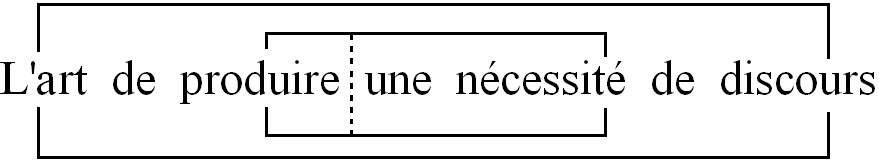
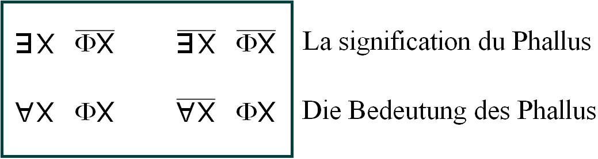
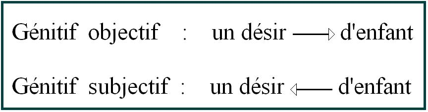
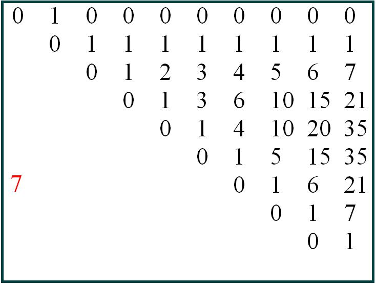
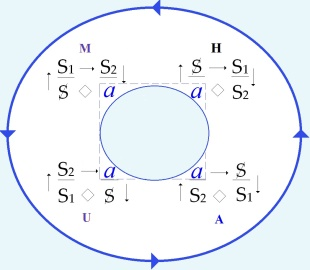
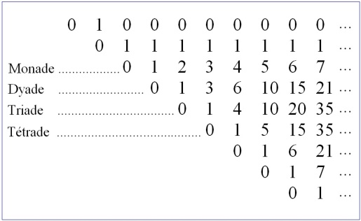

# Leçon 04 | 19 Janvier 1972 Séminaire : Panthéon-Sorbonne

<!-- source-url: http://staferla.free.fr/S19/S19...OU PIRE.docx -->
<!-- seminar: s19 -->
<!-- lesson: 04 -->

<!-- id: s19-04-0001 -->

\[Au tableau\]

<!-- id: s19-04-0002 -->

<!-- id: s19-04-0003 -->

<!-- id: s19-04-0004 -->

<!-- id: s19-04-0005 -->

<!-- id: s19-04-0006 -->

L’art, « *l’art de produire une nécessité de discours* », telle est la dernière fois la formule que j’ai glissée, plutôt que proposée, de ce que c’est que *la logique*.

<!-- id: s19-04-0007 -->

Je vous ai quittés dans le brouhaha de tout un chacun qui se levait, pour vous faire remarquer qu’il ne suffisait pas que Freud ait noté comme caractère de l’inconscient, qu’il néglige, qu’il fait bon marché du *principe de contradiction,* pour que, comme se l’imaginent quelques psy­chanalystes, la logique n’ait rien à faire dans son élucidation.

<!-- id: s19-04-0008 -->

S’il y a discours, discours qui mérite de s’épingler de la nouvelle ins­titution analytique, il est plus que probable que, comme pour tout autre discours, sa logique doive se dégager.

<!-- id: s19-04-0009 -->

Je rappelle au passage que *le dis­cours*, c’est ce dont le moins qu’on puisse dire est que le sens reste *voilé*.

<!-- id: s19-04-0010 -->

À vrai dire, ce qui le constitue est très précisément fait de *l’absence de sens*.

<!-- id: s19-04-0011 -->

*Aucun discours, qui ne doive recevoir son sens d’un autre*.

<!-- id: s19-04-0012 -->

Et s’il est vrai que l’apparition d’une nouvelle structure de discours prend sens, ce n’est pas seulement de le recevoir, c’est aussi bien s’il apparaît que ce *discours analytique*, tel que je vous l’ai situé l’année dernière, représen­te le dernier glissement sur une structure tétraédrique, quadripode...

<!-- id: s19-04-0013 -->

> comme je l’ai appelé dans un texte publié ailleurs ...par le dernier glissement de ce qui s’articule au nom de *la signifiance* \[**S1 ◊ S2**\], il devient sensible que quelque chose d’original se produit de ce cercle qui se ferme.

<!-- id: s19-04-0014 -->

<!-- id: s19-04-0015 -->

« *L’art de produire* - ai-je dit - *une nécessité de discours* », c’est autre chose que cette nécessité elle-même.

<!-- id: s19-04-0016 -->

La nécessité logique - réfléchissez­-y, il ne saurait y en avoir d’autre - est le fruit de cette production.

<!-- id: s19-04-0017 -->

*La nécessité*, ἀνάγκη \[ananké\] ne commence qu’à l’être parlant, et aussi bien tout ce qui a pu en apparaître, s’en produire, *est toujours le fait d’un discours*.

<!-- id: s19-04-0018 -->

Si c’est bien ce dont il s’agit dans la tragédie, c’est bien pour autant que la tragédie se concrétise comme le fruit d’une nécessité qui n’est point autre...

<!-- id: s19-04-0019 -->

> c’est évident, car il ne s’y agit que d’êtres parlants ...d’une nécessi­té, dis-je, que logique.

<!-- id: s19-04-0020 -->

Rien, il me semble, n’apparaît ailleurs que chez l’être parlant de ce qui est proprement de ἀνάγκη \[ananké\].

<!-- id: s19-04-0021 -->

C’est aussi bien pour cela que Descartes ne faisait des animaux que des automates.

<!-- id: s19-04-0022 -->

En quoi sûrement il s’agit d’une illusion, illusion dont nous montrerons l’inci­dence au passage, à propos de ce que nous allons, de *cet art de produi­re une nécessité de discours*...

<!-- id: s19-04-0023 -->

> « *de ce que nous allons* » : je vais l’essayer ...essayer de frayer.

<!-- id: s19-04-0024 -->

« *Produire* », au double sens :

<!-- id: s19-04-0025 -->

- de démontrer ce qui était là avant, c’est bien en cela déjà qu’il n’est point sûr que quelque chose ne se reflète, ne contienne l’amorce de la nécessité dont il s’agit dans le préalable, dans le préalable de l’existence animale. Mais faute de démonstration, ce qui est à produire doit en effet être tenu pour être avant inexistant.

<!-- id: s19-04-0026 -->

- Autre sens de « produire », celui sur lequel toute une recherche issue de l’élaboration d’un *discours* déjà constitué, dit le *discours du Maître,* a déjà avancé sous le terme de : *réaliser par un travail*.

<!-- id: s19-04-0027 -->

C’est bien en quoi consiste ce qui se fait de... pour autant que je suis moi-même le logicien en question, le produit de l’émergence de ce nouveau discours, que la production au sens de *démonstration* peut être devant vous ici annoncée.

<!-- id: s19-04-0028 -->

Ce qui doit être supposé avoir été déjà là, par la nécessité de la démonstration, produit de la supposition de la nécessité de toujours, mais aussi justement témoignait de la - *pas moindre* - nécessité du travail, de l’actualiser.

<!-- id: s19-04-0029 -->

Mais dans ce moment d’émergence, cette nécessité donne du même coup la preuve qu’elle ne peut être d’abord supposée qu’au titre de l’*in­existant*.

<!-- id: s19-04-0030 -->

*Qu’est-ce donc la nécessité* ?

<!-- id: s19-04-0031 -->

Non ! Ce qu’il faut dire ce n’est pas « *ce donc* » mais « *qu’est *» *et directement*, ce « *ce donc* » comportant en soi trop d’*être*.

<!-- id: s19-04-0032 -->

C’est directement « *Qu’est la nécessité* ? » telle que du fait même de la produire elle ne puisse, avant d’être produite, qu’être supposée inexistante. Ce qui veut dire posée comme telle dans le discours.

<!-- id: s19-04-0033 -->

Il y a réponse à cette question comme à toute question, pour la raison qu’on ne la pose, comme toute question, qu’à avoir déjà la réponse.

<!-- id: s19-04-0034 -->

Vous l’avez donc, même si vous ne le savez pas.

<!-- id: s19-04-0035 -->

Ce qui répond à cette question « *Qu’est la nécessité* ? » c’est ce qu’à faire *logiquement,* même si vous ne le savez pas, dans votre *bricolage* de tous les jours, ce *bricolage* qu’un certain nombre ici...

<!-- id: s19-04-0036 -->

> d’être avec moi en analyse, il y en a quelques uns, bien sûr pas tous ...viennent me confier sans pouvoir prendre d’ailleurs, avant un certain pas franchi, le sentiment de ce qu’à le faire, de venir me voir, ils me supposent être moi-même - ce *bricolage* - à le faire donc, c’est-à-dire tous, même ceux qui ne me le confient pas, ils répondent déjà.

<!-- id: s19-04-0037 -->

Comment ? À *le répéter* tout simplement, ce *bricolage*, de façon inlassable.

<!-- id: s19-04-0038 -->

C’est ce qu’on appelle :

<!-- id: s19-04-0039 -->

- *le symptôme* à un certain niveau,

<!-- id: s19-04-0040 -->

- à un autre : *l’automatisme*, terme peu propre mais dont l’histoi­re peut rendre compte.

<!-- id: s19-04-0041 -->

Vous réalisez à chaque instant - pour autant que l’inconscient existe - la démonstration dont se fonde l’*inexistence* comme préalable du *nécessaire*, c’est l’*inexistence* de ce qui est au principe du *symptôme*, c’est *sa consistance* même au dit « *symptôme »,* depuis que le terme, d’avoir émergé avec Marx, a pris sa valeur, ce qui est au principe du *symptôme* c’est à savoir *l’inexistence de la vérité* qu’il suppose, quoi­qu’il en marque la place.

<!-- id: s19-04-0042 -->

Voilà pour *le symptôme* en tant qu’il se rattache à la vérité qui n’a plus cours.

<!-- id: s19-04-0043 -->

À ce titre on peut dire que comme n’im­porte qui qui subsiste dans l’âge moderne, aucun de vous n’est étranger à ce mode de la réponse.

<!-- id: s19-04-0044 -->

Dans le 2nd cas, le dit « *automatisme »*, c’est *l’inexistence de la jouissance* que l’automatisme dit « *de répétition* » fait venir au jour, de l’insistan­ce de ce piétinement à la porte, qui se désigne comme sortie *vers l’existence*.

<!-- id: s19-04-0045 -->

Seulement, au-delà, ce n’est pas tout à fait ce qu’on appelle *une existence* qui vous attend, c’est *la jouissance* telle qu’elle opère *comme nécessité de discours* et elle n’opère, vous le voyez, que comme *inexistence*.

<!-- id: s19-04-0046 -->

Seulement voilà, à vous rappeler ces ritournelles, ces rengaines que je fais bien sûr dans le dessein de vous rassurer, de vous donner le sentiment que je ne ferai là qu’apporter des *speeches* sur ce dans quoi...

<!-- id: s19-04-0047 -->

au nom de ceci qui aurait certaine *substance* : *la jouissance, la vérité* en l’occasion telle qu’elle serait prônée dans Freud, il n’en reste pas moins qu’à vous en tenir là, ce n’est pas à l’os de la structure que vous pouvez vous référer.

<!-- id: s19-04-0048 -->

« *Qu’est la nécessité *- ai-je dit - *qui s’instaure d’une supposition d’inexistence ?*

<!-- id: s19-04-0049 -->

Dans cette question, ce n’est pas *ce qui est inexistant* qui compte, c’est justement *la supposition d’inexistence*, laquelle n’est que conséquence de la production de *la nécessité*.

<!-- id: s19-04-0050 -->

*L’inexistence* ne fait question que d’avoir déjà réponse - double certes - de *la jouissance* et de *la véri­té*, mais elle inexiste déjà.

<!-- id: s19-04-0051 -->

Ce n’est pas par *la jouissance* ni par *la vérité* que *l’inexistence* prend statut, qu’elle peut inexister, c’est-à-dire venir au symbole qui la désigne comme inexistence, non pas au sens de ne pas avoir d’existence, mais de n’être existence que du symbole qui la ferait inexistante et qui, *lui,* existe : c’est un nombre, comme vous le savez généralement désigné par zéro.

<!-- id: s19-04-0052 -->

Ce qui montre bien que *l’inexistence* n’est pas ce qu’on pourrait croire : le néant.

<!-- id: s19-04-0053 -->

Car qu’en pourrait-il sortir, hors la croyance - la croyance en quoi ? - il n’y en a pas 36 de croyances !

<!-- id: s19-04-0054 -->

Dieu a fait le monde du néant, pas étonnant que ce soit un dogme.

<!-- id: s19-04-0055 -->

C’est la croyance en elle-même, c’est ce rejet de la logique qui s’exprime...

<!-- id: s19-04-0056 -->

> il y a un de mes élèves qui a un jour trouvé ça tout seul ...et qui s’exprime selon la formule qu’il en a donnée, je le remercie : « *Sûrement pas, mais tout de même* » \[Octave Manoni\].

<!-- id: s19-04-0057 -->

Ça ne peut aucunement nous suffire. L’inexistence n’est pas le néant.

<!-- id: s19-04-0058 -->

C’est, comme je viens de vous le dire, *un nombre* qui fait partie de la série des nombres entiers.

<!-- id: s19-04-0059 -->

Pas de théorie des nombres entiers si vous ne rendez pas compte de ce qu’il en est du zéro.

<!-- id: s19-04-0060 -->

C’est ce dont on s’est aperçu, dans un effort dont ce n’est pas hasard qu’il est précisément contemporain, un peu antérieur certes, de la recherche de Freud, c’est celui qu’a inauguré, à interroger logiquement ce qu’il en est du statut du nombre, un nommé Frege, né 8 ans avant lui et mort quelque 14 ans avant.

<!-- id: s19-04-0061 -->

Ceci est grandement destiné, dans notre interrogation de ce qu’il en est de la nécessité logique du *discours de l’analyse,* c’est très précisément ce que je pointais de ce qui risquait de vous échapper de la référence dont à l’instant je l’illustrais comme application - autrement dit usage fonctionnel - de *l’inexistence*, c’est-à-dire qu’elle ne se produise que dans l’après-coup dont surgit d’abord *la nécessité*, à savoir d’un discours où elle se manifeste avant que le logicien - je vous l’ai dit - y advienne lui-même comme conséquence 2nde, c’est-à-dire du même temps que *l’inexistence* elle-même.

<!-- id: s19-04-0062 -->

C’est sa fin que de se réduire où elle se manifeste d’avant lui, cette nécessité, je le répète, la démontrant cette fois en même temps que je l’énonce.

<!-- id: s19-04-0063 -->

Cette nécessité c’est la répétition elle-même : en elle-même, par elle-même, pour elle-même, c’est-à-dire ce par quoi la vie se démontre elle-même n’être que *nécessité de discours,* puisqu’elle ne trouve pas pour résister à la mort - c’est-à-dire à son lot de *jouissance* - rien d’autre qu’un *truc*, à savoir le recours à cette même chose que produit une opaque programmation...

<!-- id: s19-04-0064 -->

> qui est bien autre chose, je l’ai souligné, que « *la puissance de la vie* », *l’amour*  ou *autres balivernes* ...qui est cette programmation radicale qui ne commence pour nous, un peu, à se désenténébrer qu’à ce que font les biologistes au niveau de la bactérie et dont la conséquence n’est précisément que la reproduction de la vie.

<!-- id: s19-04-0065 -->

Ce que le discours fait...

<!-- id: s19-04-0066 -->

> à démontrer ce niveau où rien d’une nécessité logique ne se manifeste que *dans la répétition* ...paraît ici rejoindre, comme *<u>un semblant</u>,* ce qui s’effectue au niveau d’un message qu’il n’est nullement facile de réduire à ce que de ce terme nous connaissons, et qui est de l’ordre de ce qui se situe au niveau d’une combinatoire courte dont les modulations sont celles qui passent

<!-- id: s19-04-0067 -->

- de *l’acide désoxyribonucléique* \[ADN\],

<!-- id: s19-04-0068 -->

- à ce qui s’en transmettra au niveau des *protéines,* avec la bonne volonté de quelques intermédiaires qualifiés notamment d’*enzymatiques*, ou de *catalyseurs*.

<!-- id: s19-04-0069 -->

Que ce soit là ce qui nous permet de référer ce qu’il en est de *la répétition*, ceci ne peut se faire qu’à élaborer précisément ce qu’il en est de la fiction par quoi quelque chose nous paraît soudain se répercuter du fond même de ce qui a fait un jour l’être vivant capable de parler.

<!-- id: s19-04-0070 -->

Il y en a en effet un, entre tous, qui n’échappe pas à une *jouissance* par­ticulièrement insensée et que je dirai locale au sens d’accidentelle, et qui est la forme organique qu’a prise pour lui *la jouissance sexuelle*.

<!-- id: s19-04-0071 -->

Il en colore de *jouissance* tous ses besoins élémentaires, qui ne sont chez les autres êtres vivants que colmatages au regard de *la jouissance*. Si l’animal bouffe régulièrement, il est bien clair que c’est pour ne pas connaître *la jouissance* de la faim.

<!-- id: s19-04-0072 -->

Il en colore donc - celui qui parle...

<!-- id: s19-04-0073 -->

et c’est frappant, c’est la découverte de Freud ...tous ses besoins, c’est-à-dire ce par quoi il se défend contre la mort.

<!-- id: s19-04-0074 -->

Faut pas croire du tout pourtant, pour ça, que la jouissance sexuelle, c’est la vie.

<!-- id: s19-04-0075 -->

Comme je vous l’ai dit tout à l’heure, c’est une production locale, accidentelle, organique, et très exactement liée, centrée, sur ce qu’il en est de l’organe mâle.

<!-- id: s19-04-0076 -->

Ce qui est évidemment particulièrement grotesque.

<!-- id: s19-04-0077 -->

La détumescence chez le mâle a engendré cet appel de type spécial qui est le langage articulé grâce à quoi s’introduit, dans ses dimensions, *la nécessité de parler*. C’est de là que rejaillit *la nécessité logique comme grammaire du discours*.

<!-- id: s19-04-0078 -->

Vous voyez si c’est mince ! Il a fallu, pour s’en apercevoir, rien de moins que l’émergence du discours analytique.

<!-- id: s19-04-0079 -->

*« La signification du phallus »,* dans mes *Écrits* quelque part, j’ai pris soin de loger cette énonciation que j’avais faite, très précisément à Munich, quelque part avant 1960 : il y a une paye ! J’ai écrit dessous « *die Bedeutung des Phallus »*.

<!-- id: s19-04-0080 -->

C’est pas pour le plaisir de vous faire croire que je sais l’alle­mand – encore... encore que ce soit en allemand, puisque c’était à Munich, que j’ai cru devoir articuler ce dont j’ai donné là le texte retraduit.

<!-- id: s19-04-0081 -->

Il m’avait semblé opportun d’introduire sous le terme de *Bedeutung* ce qu’en français, vu le degré de culture où nous étions à l’époque parvenus, je ne pouvais décemment traduire que par *la signification*.

<!-- id: s19-04-0082 -->

*Die Bedeutung des Phallus* c’était déjà, mais les Allemands eux-mêmes, étant donné qu’ils étaient analystes...

<!-- id: s19-04-0083 -->

> j’en marque la distance par une petite note qui est, au début de ce texte, reproduite ...les Allemands n’avaient...

<!-- id: s19-04-0084 -->

> bien entendu je parle des analystes, on était au sortir de la guerre
>
> et on ne peut pas dire que l’analyse avait fait, pendant, beaucoup de progrès ...les Allemands n’y ont entravé que *pouic*.

<!-- id: s19-04-0085 -->

Tout ça leur a semblé, comme je le souligne au dernier terme de cette note, à proprement parler *inouï*.

<!-- id: s19-04-0086 -->

C’est curieux d’ailleurs que les choses ont changé au point que ce que je raconte aujourd’hui peut être devenu pour un certain nombre d’entre vous déjà, à juste titre, monnaie courante.

<!-- id: s19-04-0087 -->

*Die Bedeutung,* pourtant, était bien référé à l’usage que Frege[^10] fait de ce mot pour l’opposer au terme de *Sinn,* lequel répond très exactement à ce que j’ai cru devoir vous rappeler au niveau de mon énoncé d’aujourd’hui, à savoir *le sens*, le sens d’une proposition.

<!-- id: s19-04-0088 -->

On pourrait exprimer autrement...

<!-- id: s19-04-0089 -->

> et vous verrez que ce n’est pas incom­patible, ...ce qu’il en est de *la nécessité qui conduit à cet art de la pro­duire comme nécessité de discours*.

<!-- id: s19-04-0090 -->

On pourrait l’exprimer autrement : que faut-il pour qu’une parole *dénote* quelque chose ?

<!-- id: s19-04-0091 -->

Tel est le sens...

<!-- id: s19-04-0092 -->

> faites attention, les menus échanges commencent ...tel est le sens que Frege donne à *Bedeutung *: *la dénotation.*

<!-- id: s19-04-0093 -->

Il vous apparaîtra clair, si vous voulez bien ouvrir ce livre qui s’appelle « *Les fondements de l’arithmétique »* [^11]...

<!-- id: s19-04-0094 -->

> et qu’une certaine Claude Imbert, qui autrefois, si mon souvenir est bon, fréquenta mon séminaire, a traduit, ce qui le laisse là pour vous, à la portée de votre main, entièrement accessible ...il vous apparaîtra clair - comme c’était prévisible - que pour qu’il y ait à coup sûr *dénotation*, ce ne soit pas mal de s’adresser d’abord, timidement, au champ de *l’arithmétique* tel qu’il est défini par *les nombres entiers*.

<!-- id: s19-04-0095 -->

Il y a un nommé Kronecker qui n’a pas pu s’empêcher, tellement est grand le besoin de la croyance, de dire que « *les nombres entiers, c’est Dieu qui les avait créés* ». Moyennant quoi, ajoute-t-il, l’homme a à faire tout *le reste* et comme c’était un mathématicien, *le reste* c’était pour lui tout ce qu’il en est du *reste du nombre*.

<!-- id: s19-04-0096 -->

C’est justement pour autant que rien n’est sûr qui soit de cette espèce...

<!-- id: s19-04-0097 -->

> à savoir qu’un effort logique peut au moins tenter de rendre compte des nombres entiers, ...que j’amène dans le champ de votre considération le travail de Frege.

<!-- id: s19-04-0098 -->

Néanmoins, je voudrais m’arrêter un instant - ne serait-ce que pour vous inciter à le relire - sur ceci : que cette énonciation que j’ai produite sous l’angle de « *La signification du phallus »* ...

<!-- id: s19-04-0099 -->

> dont vous verrez qu’au point où j’en suis - enfin c’est un petit mérite dont je me targue –
>
> il n’y a rien à reprendre, bien qu’à cette époque personne vraiment n’y entendît rien :
>
> j’ai pu le constater sur place ...qu’est-ce que veut dire *La signification du phallus* ?

<!-- id: s19-04-0100 -->

Ceci mérite qu’on s’y arrête, car après tout une liaison ainsi déterminative, il faut toujours se demander si c’est un génitif dit « objectif » ou « subjectif* »*, tel que j’en illustre la différence par le rapprochement des deux sens, ici le sens marqué par deux petites flèches :

<!-- id: s19-04-0101 -->

- *un désir → d’enfant*, c’est un enfant qu’on désire : \[*génitif*\] *objectif*.

<!-- id: s19-04-0102 -->

- *un désir ← d’enfant*, c’est un enfant qui désire : \[*génitif*\] *subjectif*.

<!-- id: s19-04-0103 -->

Vous pouvez vous exercer, c’est toujours très utile.

<!-- id: s19-04-0104 -->

La *loi du talion* que j’écris au-dessous sans y ajouter de commentaires, ça peut avoir deux sens :

<!-- id: s19-04-0105 -->

- la loi qu’est le talion, je l’instaure comme loi,

<!-- id: s19-04-0106 -->

- ou ce que le talion articule comme loi, c’est-à-dire « *œil pour œil, dent pour dent* ». Ça n’est pas la même chose.

<!-- id: s19-04-0107 -->

Ce que je voudrais vous faire remarquer, c’est que *La signification du phallus*...

<!-- id: s19-04-0108 -->

> et ce que je développerai sera fait pour vous le faire découvrir
>
> au sens que je viens de préciser du mot « *sens »*, c’est-à-dire *<u>la petite flèche</u>* ...c’est neutre. *La signification du phallus*, ça a ceci d’astucieux que ce que le *phallus* dénote, c’est le pouvoir de signification.

<!-- id: s19-04-0109 -->

Ce n’est donc pas - ce Φx - une fonction du type ordinaire, c’est ce qui fait qu’à condition de se servir - pour l’y placer comme argument - de quelque chose qui n’a besoin d’avoir d’abord aucun sens, à cette seule condition de l’articuler d’un *prosdiorisme *: « *il existe* » ou bien « *tout* », à cette condition, selon seulement *le prosdiorisme*...

<!-- id: s19-04-0110 -->

> produit lui-même de la recherche de la nécessité logique et rien d’autre ...ce qui s’épinglera de *ce prosdiorisme* prendra *signification* d’*homme* ou de *femme,* selon *le prosdiorisme choisi*, c’est-à-dire :

<!-- id: s19-04-0111 -->

- soit l’« *il existe* » \[:\], soit l’« *il n’existe pas* » \[/\],

<!-- id: s19-04-0112 -->

- soit le « *tout* » \[;\], soit le « *pas tout* » \[.\].

<!-- id: s19-04-0113 -->

Néanmoins il est clair que nous ne pouvons pas ne pas tenir compte de ce qui s’est produit d’une *nécessité logique*, à l’affronter aux nombres entiers, pour la raison qui est celle dont je suis parti, que cette nécessité d’après-coup implique la supposition de ce qui *inexiste* comme tel.

<!-- id: s19-04-0114 -->

Or il est remarquable que ce soit à interroger le nombre entier, à en avoir tenté la genèse logique, que Frege n’ait été conduit à rien d’autre qu’à fonder le nombre 1 sur le concept de l’*inexistence*.

<!-- id: s19-04-0115 -->

Il faut dire que pour avoir été conduit là, il faut bien croire que ce qui jusque là courait sur ce qui le fonde le **1**, ne lui donnait pas satisfaction, satisfaction de logicien.

<!-- id: s19-04-0116 -->

Il est certain que pendant un bout de temps on s’est contenté de peu.

<!-- id: s19-04-0117 -->

On croyait que ce n’était pas difficile : il y en a plusieurs, il y en a beaucoup... ben on les compte.

<!-- id: s19-04-0118 -->

Ça pose bien sûr, pour l’avènement du nombre entier, d’insolubles problèmes.

<!-- id: s19-04-0119 -->

Car s’il ne s’agit que de ce qu’il est convenu de faire, d’un signe pour les compter, ça existe, on vient de m’apporter comme ça un petit bouquin pour me montrer comment le... il y a un poème arabe là-dessus, un poème qui indique comme ça, en vers, ce qu’il faut faire avec le petit doigt, puis avec l’index, et avec l’annulaire, et quelques autres, pour faire passer *le signe* du nombre.

<!-- id: s19-04-0120 -->

Mais justement, puisqu’il faut faire *signe*, c’est que *le nombre doit avoir une autre espèce d’existence que simplement de dési­gner*

<!-- id: s19-04-0121 -->

> fût-ce à chaque fois avec un aboiement ...chacune par exemple des personnes ici présentes : pour qu’elles aient valeur de **1** il faut...

<!-- id: s19-04-0122 -->

> comme on l’a remarqué depuis toujours ...qu’on les dépouille de toutes leurs qua­lités sans exception. Alors qu’est-ce qui reste ?

<!-- id: s19-04-0123 -->

Bien sûr, il y a eu quelques philosophes dits « *empiristes »* pour articuler ça, en se servant de menus objets comme de petites boules : un chapelet bien sûr, c’est ce qu’il y a de meilleur.

<!-- id: s19-04-0124 -->

Mais ça ne résout pas du tout la question de l’émergence comme telle du **1**.

<!-- id: s19-04-0125 -->

C’est ce qu’avait bien vu un nommé Leibniz qui a cru devoir par­tir - comme il s’imposait - de l’identité, à savoir de poser d’abord :

<!-- id: s19-04-0126 -->

> 2 =1+1
>
> 3 =2+1
>
> 4 =3+1 et de croire avoir résolu le problème en montrant qu’à réduire chacune de ces définitions à la précédente, on pouvait démontrer que 2 *et* 2 *font* 4.

<!-- id: s19-04-0127 -->

Il y a malheureusement un petit obstacle dont les logiciens du XIXème siècle se sont rapidement aperçus, c’est que sa démonstration n’est valable qu’à condition de *négliger la parenthèse* tout à fait nécessaire à mettre sur 2 = 1+1...

<!-- id: s19-04-0128 -->

> à savoir la parenthèse enserrant le (1+1) ...et qu’il est nécessaire... ce qu’il néglige ...qu’il est nécessaire de poser l’axiome que : (a+b)+c = a+(b+c).

<!-- id: s19-04-0129 -->

Il est certain que cette négligence de la part d’un logicien aussi vrai­ment logicien qu’était Leibniz, mérite sûrement d’être expliquée, et que par quelque côté quelque chose la justifie.

<!-- id: s19-04-0130 -->

Quoiqu’il en soit, qu’elle soit omise suffit, du point de vue du logicien, à faire rejeter la genèse leibnizienne, outre qu’elle néglige tout fondement de ce qu’il en est du 0.

<!-- id: s19-04-0131 -->

Je ne fais ici que vous indiquer à partir de quelle notion du concept, du concept supposé dénoter quelque chose, il faut les choisir pour que ça colle. Mais après tout on ne peut pas dire que les concepts...

<!-- id: s19-04-0132 -->

> ceux qu’ils choisit : « *satellites de Mars »,* voire « *de Jupiter »* ...n’aient pas cette portée de dénotation suffisante pour qu’on ne puisse dire qu’un nombre soit à chacun d’eux associé.

<!-- id: s19-04-0133 -->

Néanmoins, *la subsistance du nombre* ne peut s’assurer qu’à partir de l’*équinuméricité* des objets que subsume un concept.

<!-- id: s19-04-0134 -->

L’ordre des nombres ne peut dès lors être donné que par cette astuce qui consiste à procéder exactement en sens contraire de ce qu’a fait Leibniz, à retirer **1** de chaque nombre, de dire que *le prédécesseur* c’est celui...

<!-- id: s19-04-0135 -->

> le concept de nombre, issu du concept ...*le nombre prédéces­seur* c’est celui qui...

<!-- id: s19-04-0136 -->

> mis à part tel objet qui servait d’appui dans le concept d’un certain nombre ...c’est le concept qui - mis à part cet objet - se trouve *identique* à un nombre qui est très précisément caractérisé de ne pas être identique au précédent, disons à 1 près.

<!-- id: s19-04-0137 -->

C’est ainsi que Frege[^12] régresse jusqu’à la conception *du concept* en tant que vide, *qui ne comporte aucun objet*, qui est celui, non du néant puisqu’il est concept, mais de *l’inexistant,* et que c’est justement à consi­dérer ce qu’il croit être le néant, à savoir le concept dont le nombre serait égal à 0, qu’il croit pouvoir définir de la formulation d’argument : *x diffé­rent de x, x ≠ x*, c’est-à-dire différent de lui-même.

<!-- id: s19-04-0138 -->

C’est-à-dire ce qui est une dénotation assurément extrêmement problématique, car qu’attei­gnons-nous ?

<!-- id: s19-04-0139 -->

S’il est vrai que le symbolique soit ce que j’en dis, à savoir :

<!-- id: s19-04-0140 -->

- tout entier dans la parole,

<!-- id: s19-04-0141 -->

- qu’il n’y ait pas de métalangage, d’où peut-on désigner dans le langage un objet dont il soit assuré qu’il ne soit pas dif­férent de lui-même ?

<!-- id: s19-04-0142 -->

Néanmoins c’est sur cette hypothèse que Frege constitue la notion que *le concept « égal à* 0* *» donne un nombre différent...

<!-- id: s19-04-0143 -->

> selon la formule qu’il a donnée d’abord pour celle qui est du *nombre prédécesseur* ...donne un nombre différent de ce qu’il en est du 0 défi­ni, tenu - et bel et bien - pour le néant, c’est-à-dire de celui auquel convient *non pas l’égalité à* 0, mais *le nombre* 0.

<!-- id: s19-04-0144 -->

Dès lors c’est en référence avec ceci :

<!-- id: s19-04-0145 -->

- que le concept auquel convient *le nombre* 0 repose sur ceci qu’il s’agit de l’identique à 0, mais non iden­tique à 0,

<!-- id: s19-04-0146 -->

- que celui qui est tout simplement identique à 0 est tenu pour son successeur et comme tel égalé à 1.

<!-- id: s19-04-0147 -->

La chose se *fonde*, se fonde sur ceci qui est le départ dit de l’équinuméricité, il est clair que l’équinumé­ricité du concept sous lequel ne tombe aucun objet au titre de *l’inexis­tence* est toujours égal à lui-même.

<!-- id: s19-04-0148 -->

Entre 0 et 0, pas de différence. C’est le « *pas de différence »* dont, par ce biais, Frege entend fonder le 1.

<!-- id: s19-04-0149 -->

Et ceci de toute façon, cette conquête nous reste précieuse pour autant qu’*elle nous donne le* 1 *pour être essentiellement*...

<!-- id: s19-04-0150 -->

> entendez bien ce que je dis *...le signifiant de l’inexistence*.

<!-- id: s19-04-0151 -->

Néanmoins est-il sûr que le 1 puisse s’en fonder ?

<!-- id: s19-04-0152 -->

Assurément la discussion pourrait se poursuivre par les voies purement fregeiennes.

<!-- id: s19-04-0153 -->

Néanmoins, pour votre éclaircissement, j’ai cru devoir reproduire ce qui peut être dit n’avoir pas de rapport avec le nombre entier, à savoir le triangle arithmétique. Le [*triangle arithmétique*](#TriangleRetour) s’organise de la façon suivante : il part, comme donnée, de la suite des nombres entiers.

<!-- id: s19-04-0154 -->

Chaque *terme* à s’inscrire est constitué sans autre commentaire, il s’agit de ce qui est au-dessous de la barre, *par l’addition*...

<!-- id: s19-04-0155 -->

> vous remarquerez que je n’ai parlé encore jamais d’addition, non plus que Frege ...*par l’ad­dition* des deux chiffres : celui qui est immédiatement à sa gauche, et celui qui est à sa gauche et au-dessus.

<!-- id: s19-04-0156 -->

<!-- id: s19-04-0157 -->

Vous vérifierez aisément qu’il s’agit ici de quelque chose qui nous donne...

<!-- id: s19-04-0158 -->

> par exemple quand nous avons un nombre entier de points que nous appellerons « *monades »* ...qui nous donne automatiquement ce qu’il en est, étant donné un nombre de ces points, du nombre de sous-ensemble qui peuvent, dans l’ensemble qui com­prend tous ces points, se former d’un nombre quelconque, choisi comme étant au-dessous du nombre entier dont il s’agit.

<!-- id: s19-04-0159 -->

C’est ainsi par exemple que si vous prenez ici la ligne qui est celle de la « *dyade »* : 0, 1, 3, 6, 10, 15, 21...

<!-- id: s19-04-0160 -->

à rencontrer une dyade, vous obtenez immédiatement qu’il y aura dans la *dyade,* 2 *monades*.

<!-- id: s19-04-0161 -->

Une *dyade*, c’est pas difficile à imaginer : c’est un trait avec deux termes, un commencement et une fin.

<!-- id: s19-04-0162 -->

Et que si vous interrogez ce qu’il en est - prenons quelque chose de plus amusant - de la « *tétrade »*, vous obtenez une « *tétrade »* :

<!-- id: s19-04-0163 -->

- 0, 1, 5, 15, 35... vous obtenez quelque chose qui est 4 *possibilités* de *triades*, autre­ment dit pour vous l’imager :

<!-- id: s19-04-0164 -->

- 4 *faces* du tétraèdre : 0, 1, 4, 10, 20...

<!-- id: s19-04-0165 -->

Vous obtenez ensuite six *dyades*, c’est-à-dire :

<!-- id: s19-04-0166 -->

- *les six côtés* du tétraèdre : 0, 1, 3, 6, 10, 15... et vous obtenez :

<!-- id: s19-04-0167 -->

- *les quatre sommets* d’une monade : 0, 1, 2, 3, 4, 5...

<!-- id: s19-04-0168 -->

Ceci pour donner support à ce qui n’a à s’exprimer qu’en termes de sous-ensembles.

<!-- id: s19-04-0169 -->

Il est clair que vous voyez qu’à mesure que le nombre entier augmente, *le nombre des sous-ensembles* qui peuvent se produire en son sein dépasse de beaucoup et très vite *le nombre entier* lui-même : 0, 1, 4, 10, 20...

<!-- id: s19-04-0170 -->

Ceci n’est pas ce qui nous intéresse.

<!-- id: s19-04-0171 -->

Mais simplement qu’il ait fallu, pour que je puisse rendre compte du même procédé, de la série des nombres entiers, que je parte de ce qui est très précisément à l’origine de ce qu’a fait Frege.

<!-- id: s19-04-0172 -->

Frege qui en vient à désigner ceci que le nombre, le nombre des objets qui conviennent à un concept en tant que concept du nombre, du nombre N nommément, sera de par lui-même ce qui consti­tue *le nombre successeur*.

<!-- id: s19-04-0173 -->

Autrement dit, si vous comptez à partir de 0 : 0, 1, 2, 3, 4, 5, 6, ça fera toujours ce qui est là, à savoir 7 - 7 quoi ? - 7 de ce quelque chose que j’ai appelé *inexistant* \[**1**\], d’être le fondement de *la répé­tition*.

<!-- id: s19-04-0174 -->

Encore faut-il, pour que soit satisfait aux règles de ce *triangle,* que ce 1 qui se répète ici, surgisse de quelque part.

<!-- id: s19-04-0175 -->

Et puisque partout nous avons encadré de 0 ce *triangle*, 0, 1, 1, 1, 1, 1..., il y a donc ici un point, un point à situer au niveau de la ligne des 0, un point qui est 1 et qui articule quoi ?

<!-- id: s19-04-0176 -->

Ce qu’il importe de distinguer dans la genèse du 1, à savoir la distinction précisément du *pas de différence* entre tous ces 0, à partir de la genèse : 0, 1, 0, 0, 0, 0... de ce qui se répète, mais se répète comme *inexistant*.

<!-- id: s19-04-0177 -->

Frege ne rend donc pas compte de la suite des nombres entiers, mais de la possibilité de *la répétition*.

<!-- id: s19-04-0178 -->

*La répétition* se pose d’abord comme *répétition* du 1, en tant que 1 de *l’inexistence*.

<!-- id: s19-04-0179 -->

Est-ce qu’il n’y a pas...

<!-- id: s19-04-0180 -->

> je ne peux ici qu’en avancer la question ...quelque chose qui suggère qu’à ce fait, qu’il n’y ait pas un seul 1 mais :

<!-- id: s19-04-0181 -->

- l’**1** qui se répète,

<!-- id: s19-04-0182 -->

- et l’**1** qui se pose dans la suite des nombres entiers, dans cette *béance* nous avons à trou­ver quelque chose qui est de l’ordre de ce que nous avons interrogé en posant, comme corrélat nécessaire de la question de la nécessité logique, le fondement de l’*inexistence* ?

## Notes

[^10]: Gottlob Frege : « *Sens et dénotation* » (*Sinn und Bedeutung*), in « *Écrits logiques et philosophiques* », Seuil 1971, ou Points Seuil 1994.

[^11]: Gottlob Frege : « *Les fondements de l’arithmétique : Recherche logico-mathématique sur le concept de nombre* », Seuil 1970.

[^12]: Sur tout ce qui suit à propos de Frege, cf. Jacques-Alain Miller : « *La suture* » in *Cahiers pour l’analyse,* no 1, p. 43 ou no1- 2, p. 37,

    ou son exposé originel, lors de la séance du 24-02-65 du Séminaire 1964-65 : « *L’objet de la psychanalyse* ».
