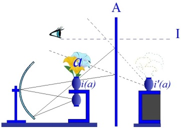
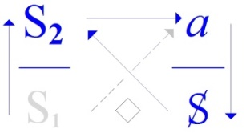
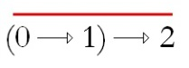
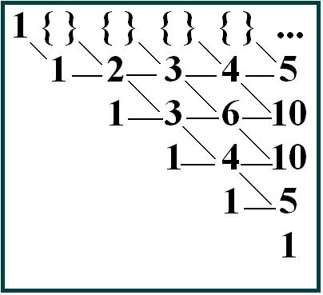
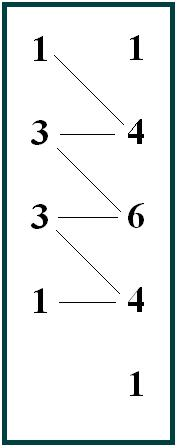
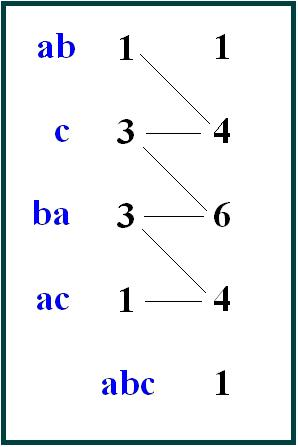

# Leçon 09 | 10 Mai 1972 Séminaire : Panthéon-Sorbonne

<!-- source-url: http://staferla.free.fr/S19/S19...OU PIRE.docx -->
<!-- seminar: s19 -->
<!-- lesson: 09 -->

<!-- id: s19-09-0001 -->

Il m’est difficile de vous frayer la voie dans un discours qui ne vous intéresse pas tous.

<!-- id: s19-09-0002 -->

Je vais dire comme « *pas tous* » et même j’ajoute : « *que* comme pas tous* »*.

<!-- id: s19-09-0003 -->

Une chose est évidente, c’est le caractère clé dans la pensée de Freud, du *« tous »*.

<!-- id: s19-09-0004 -->

La notion de foule qu’il hérite de cet imbécile qui s’appelait Gustave Le Bon lui sert à entifier [^20] ce « *tous »*.

<!-- id: s19-09-0005 -->

Il n’est pas étonnant qu’il y découvre la nécessité d’un « *il existe* » dont, à cette occasion, il ne voit que l’aspect qu’il traduit comme « *le trait unaire » *: *der einziger Zug*.

<!-- id: s19-09-0006 -->

*Le trait unaire* n’a rien à faire avec l’« *Yad’lun* » que j’essaie de serrer cette année au titre qu’il n’y a pas mieux à faire, ce que j’exprime par : …*ou pire*, dont ce n’est donc pas pour rien que j’ai dit le dire adverbialement.

<!-- id: s19-09-0007 -->

J’indique tout de suite, *le trait unaire* est ce dont se marque *la répétition* comme telle.

<!-- id: s19-09-0008 -->

*La répétition* ne fonde aucun *«* *tous* » ni n’identifie rien, parce que tautologiquement, si je puis dire, il ne peut pas y en avoir de première.

<!-- id: s19-09-0009 -->

C’est en quoi toute cette psychologie de quelque chose qu’on traduit par « *des foules* » : « *psychologie des foules* », loupe ce qu’il s’agirait d’y voir avec un peu plus de chance :

<!-- id: s19-09-0010 -->

- la nature du « *pas tous* » qui la fonde,

<!-- -->

<!-- id: s19-09-0011 -->

- nature qui est celle justement de « *la femme* » à mettre entre guillemets,

<!-- id: s19-09-0012 -->

> qui pour le père Freud a constitué jusqu’à la fin le problème, problème de « *ce qu’elle veut* ».

<!-- id: s19-09-0013 -->

Je vous ai déjà parlé de ça...

<!-- id: s19-09-0014 -->

Mais revenons à ce que j’essaie cette année de filer pour vous.

<!-- id: s19-09-0015 -->

N’importe quoi - c’est vrai - peut servir à *écrire* l’1*de répétition*.

<!-- id: s19-09-0016 -->

Ce n’est pas qu’il ne soit rien, c’est qu’il s’écrit avec n’importe quoi pour peu que ça soit facile à *répéter en figures*.

<!-- id: s19-09-0017 -->

Rien de plus facile à figurer...

<!-- id: s19-09-0018 -->

> pour l’être qui se trouve en charge de faire que dans le langage, *ça parle* ...rien de plus facile à figurer que ce qu’il est fait pour reproduire naturellement, à savoir, comme on dit, son semblable ou son type.

<!-- id: s19-09-0019 -->

Non pas qu’il sache d’origine faire sa figure, mais elle le *marque*, et ça il peut lui rendre, lui rendre *la marque* qui justement est *le trait unaire*.

<!-- id: s19-09-0020 -->

*Le trait unaire* est le support de ce dont je suis parti sous le nom de *stade du miroir*, c’est-à-dire *l’identification imaginaire*.

<!-- id: s19-09-0021 -->

Mais non seulement ce pointage d’un support typique c’est-à-dire *imaginaire*...

<!-- id: s19-09-0022 -->

> *la marque* comme telle, *le trait unaire* ...ne constitue pas un jugement de valeur, comme il m’est revenu - on l’a dit - que je faisais, jugement de valeur du type :

<!-- id: s19-09-0023 -->

- *imaginaire* :* « caca !*

<!-- id: s19-09-0024 -->

- *symbolique *: *miam ! miam ! ».*

<!-- id: s19-09-0025 -->

Mais tout ce que j’ai dit, écrit, inscrit dans les graphes, schématisé dans le modèle optique à l’occasion, *où le sujet se réfléchit dans le trait unaire,* et où c’est seulement à partir de là qu’il se repère comme *moi-idéal,* tout cela insiste justement sur ce que *l’identification imaginaire* s’opère par une marque *symbolique.*

<!-- id: s19-09-0026 -->

<!-- id: s19-09-0027 -->

De sorte que, *qui dénonce ce manichéisme* : « *le jugement de valeur, pouah* ! », dans ma doctrine, *démontre seulement ce qu’il est*, pour m’avoir entendu ainsi depuis le début de mon discours dont il est pourtant contemporain : un porc, pour se dresser sur ses pattes et faire le porc debout, n’en reste pas moins le porc qu’il était de souche, mais il n’y a que lui pour s’imaginer qu’on s’en souvient.

<!-- id: s19-09-0028 -->

Pour revenir à Freud dont je n’ai fait là que commenter la fonction qu’il a introduite sous le nom de *narcissisme*, c’est bien de l’erreur, qu’il a commise en liant le *moi* sans relais à sa *Massenpsychologie* que relève l’incroyable de l’institution dont il a projeté ce qu’il appelle « *l’économie du psychisme* », c’est à savoir l’organisation à quoi il a cru devoir confier la relance de sa doctrine.

<!-- id: s19-09-0029 -->

Il l’a voulue telle pourquoi ? Pour constituer *la garde* d’un noyau de vérité.

<!-- id: s19-09-0030 -->

C’est ainsi que Freud l’a pensé, et c’est bien ainsi aussi que ceux qui s’avèrent être les fruits de cette conception s’expriment pour...

<!-- id: s19-09-0031 -->

> même s’ils déclarent modeste ce noyau ...s’en attirer la considération.

<!-- id: s19-09-0032 -->

Ce qui, du point où les choses en sont maintenant dans l’opinion, est comique.

<!-- id: s19-09-0033 -->

Il suffit pour le faire apparaître d’indiquer ce qu’implique cette sorte de garant : *une école de sagesse*.

<!-- id: s19-09-0034 -->

Voilà comment, de toujours, on aurait appelé ça.

<!-- id: s19-09-0035 -->

L’est-ce *? Point d’interrogation*.

<!-- id: s19-09-0036 -->

*La sagesse*...

<!-- id: s19-09-0037 -->

comme il apparaît du livre même de la patience…\[*lapsus*\] de la sapience qu’est l’*« Ecclésiaste »* ...c’est quoi ? C’est, comme il est dit là clairement, *c’est le savoir de la jouissance*.

<!-- id: s19-09-0038 -->

Tout ce qui se pose comme tel se caractérise comme *ésotérisme*, et l’on peut dire que il n’y a pas de religion - hors la chrétienne - qui ne s’en pare, avec les deux sens du mot.

<!-- id: s19-09-0039 -->

Dans toutes les religions...

<!-- id: s19-09-0040 -->

> la bouddhique et aussi bien la mahométane, sans compter les autres ...il y a cette *parure* et cette façon de se parer, je veux dire de marquer la place de ce *savoir de la jouissance*.

<!-- id: s19-09-0041 -->

Ai-je besoin d’évoquer *les tantras* pour l’une de ces religions, *les soufis* pour l’autre ?

<!-- id: s19-09-0042 -->

C’est ce dont s’habilitent aussi les philosophies présocratiques et c’est ce avec quoi rompt Socrate, qui y substitue...

<!-- id: s19-09-0043 -->

> et l’on peut dire nommément ...la relation à *l’objet(a)*, qui n’est rien d’autre que ce qu’il appelle « *âme* ».

<!-- id: s19-09-0044 -->

L’opération s’illustre suffisamment du partenaire qui lui est donné dans le *« Banquet »,* sous l’espèce parfaitement historique d’Alcibiade, autrement dit de la frénésie sexuelle, *à quoi aboutit nor­malement* *le discours du maître,* si je puis dire *absolu*, c’est-à-dire qui ne produit rien que *la castration symbolique*.

<!-- id: s19-09-0045 -->

Je rappelle *« la mutilation des Hermès »*, je l’ai fait en son temps quand de ce *« Banquet » je me suis servi pour articuler le transfert*.

<!-- id: s19-09-0046 -->

*Le savoir de la jouissance* à partir de Socrate ne survivra plus qu’en marge de la civilisation, non, bien entendu, sans qu’elle en ressente ce que Freud appelle pudiquement son « *malaise »*.

<!-- id: s19-09-0047 -->

Un dingue de temps en temps mugit à s’y retrouver, dans le fil de cette subversion.

<!-- id: s19-09-0048 -->

Ça ne fait date qu’à ce qu’il soit capable de la faire entendre dans le discours même qui a produit ce savoir...

<!-- id: s19-09-0049 -->

> *le discours chrétien*, pour mettre les points sur les i ...puisque, n’en doutons pas, c’est l’*héritier du discours socratique*.

<!-- id: s19-09-0050 -->

C’est *le discours du maître « up to date »,* du maître dernier modèle et *des petites filles* *modèles-modèles* [^21] qui sont sa progéniture. On m’assure que dans ce genre, celui que j’appelle le « *modèle-modèle* »...

<!-- id: s19-09-0051 -->

> qui maintenant se pare d’initiales diverses mais qui commencent toujours par « M » ...il en vient ici à la pelle.

<!-- id: s19-09-0052 -->

Je le sais parce qu’on me le dit. Car moi d’où je suis, il ne me suffit pas pour les voir de vous regarder, parce que justement de départ elles ne sont *« pas toutes » modèles-modèles*. Oui, remarquons-le.

<!-- id: s19-09-0053 -->

Ça fait de l’effet évidemment, quand cette remarque qu’il y a eu subversion...

<!-- id: s19-09-0054 -->

> et j’ai dit que ça fait date, ...c’est un Nietzsche qui *la profère*. Je fais simplement remarquer qu’il ne peut *la proférer*, je veux dire se faire entendre, qu’à l’articuler dans le seul discours audible, c’est-à-dire celui qui détermine le *maître up to date,* comme sa descendance.

<!-- id: s19-09-0055 -->

Tout ce beau monde s’en régale, naturellement, mais ça n’y change rien.

<!-- id: s19-09-0056 -->

Tout ce qui s’est produit en fait partie depuis le départ, et bien entendu que les initiales elles-mêmes, dont il était tout à l’heure question, y soient aussi depuis le départ, ne se découvre que *nachträdglich.*

<!-- id: s19-09-0057 -->

Je ne crois pas inutile de marquer ici que *le « pas tous » vient de glisser* comme il est naturel *en « pas toutes* ». C’est fait pour ça.

<!-- id: s19-09-0058 -->

Tout le *bla-bla* dont je ne produis aujourd’hui qu’on peut pointer quelque « *mouvement* » dans l’émergence du discours, qu’à marquer que le sens en reste problématique, notamment de *ce qu’il ne faut pas entendre* dans ce que je viens de dire, à savoir un sens de l’histoire, puisque comme tout autre sens il ne s’éclaire que de ce qui arrive, et que ce qui arrive ne dépend que de la « *fortune* ».

<!-- id: s19-09-0059 -->

Pourtant ceci ne veut pas dire qu’il ne soit pas calculable.

<!-- id: s19-09-0060 -->

À partir de quoi ? De l’1 qu’on y trouve.

<!-- id: s19-09-0061 -->

Seulement, il ne faut pas se tromper sur ce qu’on trouve d’1 : ce n’est jamais celui qu’on cherche.

<!-- id: s19-09-0062 -->

C’est pourquoi, comme je l’ai dit après un autre qui est dans mon cas : « *Je ne cherche pas* - qu’il a dit - *je trouve* [^22] », la manière, la seule, de ne pas se tromper c’est, à partir de la trouvaille, de s’interroger sur ce qu’il y avait - si on l’avait voulu - à chercher.

<!-- id: s19-09-0063 -->

Qu’est-ce que la formule dont j’ai un jour articulé le transfert ?

<!-- id: s19-09-0064 -->

Ce - depuis fameux - « *sujet supposé savoir »*, mes artefacts d’écriture y démontrent un pléonasme.

<!-- id: s19-09-0065 -->

On y peut écrire *sujet* de : S, ce qui rappelle qu’un sujet n’est jamais qu’un *supposé*, ὑποχείμενον \[upokeimenon\], je n’use de la redondance qu’à partir de la surdité de l’Autre.

<!-- id: s19-09-0066 -->

*Il est clair que c’est le savoir qui est supposé* et personne ne s’y est jamais trompé.

<!-- id: s19-09-0067 -->

Supposé à qui ? Certainement pas à l’analyste mais *à sa position*.

<!-- id: s19-09-0068 -->

Ce sur quoi on peut consulter mes séminaires, car c’est bien ce qui frappe à les relire : pas de bavures, à la différence de mes « *Écrits »*. Ouais c’est comme ça ! C’est parce que j’écris vite.

<!-- id: s19-09-0069 -->

Je me l’étais jamais dit. Mais je m’en suis aperçu parce qu’il est arrivé que je parle récemment à quelqu’un.

<!-- id: s19-09-0070 -->

Je l’ai fait depuis la dernière fois où certains d’entre vous m’ont entendu à Sainte-Anne.

<!-- id: s19-09-0071 -->

J’ai avancé des choses à partir de *la théorie des ensembles*, *ici invoquée* *pour mettre en question cet* *Un* dont je parlais tout à l’heure, à l’instant.

<!-- id: s19-09-0072 -->

Je prends toujours mes risques, on ne peut pas dire que cette fois-là, je les ai pas pris avec tout l’humour nécessaire.

<!-- id: s19-09-0073 -->

2 א0 -1, deux puissance *aleph* indice zéro, moins un.

<!-- id: s19-09-0074 -->

Je crois vous avoir suffisamment souligné la différence qu’il y a de l’indice... \[*lapsus*\] de l’index 0 à la fonction du 0 quand elle est utilisée dans une échelle expo­nentielle. Bien sûr ce n’est pas dire que je n’aie chatouillé là la sensibili­té de mathématiciens qui pouvaient être ce soir-là dans mon auditoire.

<!-- id: s19-09-0075 -->

Ce que je voulais dire...

<!-- id: s19-09-0076 -->

> et attendant que quelque chose m’en revienne \[*de la part des mathématiciens*\] : c’était une interpellation ...ce que je voulais dire c’est que, soustrait l’1, tout cet édifice des nombres devrait...

<!-- id: s19-09-0077 -->

> à l’entendre comme produit d’une opération logique,
>
> nommément celle qui procède de la position du 0 et de la définition du successeur ...se défaire de toute la chaîne, jusqu’à revenir à son départ.

<!-- id: s19-09-0078 -->

Il est curieux qu’il m’ait fallu convoquer expressé­ment quelqu’un, pour que de sa bouche je retrouve le bien-fondé de ce qu’aussi la dernière fois j’ai énoncé, à savoir que ceci comporte non pas seulement l’1 qui se produit du 0 mais un autre, que comme tel j’ai marqué repérable dans la chaîne, du passage d’un nombre à l’autre quand il s’agit de compter ses parties. C’est là-dessus que j’espère conclure.

<!-- id: s19-09-0079 -->

Mais dès maintenant je me contente de noter que la personne qui ainsi me confirmait...

<!-- id: s19-09-0080 -->

> c’est elle qui *dans une dédicace* qu’elle m’a fait l’honneur de me faire
>
> à propos d’un article où elle-même s’était énoncée ...que j’écrivais vite.

<!-- id: s19-09-0081 -->

Ça ne m’était pas venu à l’idée, parce que ce que j’écris, je le refais dix fois, mais c’est vrai que la dixième fois, je l’écris très vite.

<!-- id: s19-09-0082 -->

C’est pour ça qu’il y reste des bavures, parce que c’est un texte.

<!-- id: s19-09-0083 -->

Un texte, comme le nom l’indique \[*textile, tissus*...\], ça ne peut se tisser qu’à *faire des nœuds*.

<!-- id: s19-09-0084 -->

Quand on *fait des nœuds*, il y a quelque chose qui reste et qui pend.

<!-- id: s19-09-0085 -->

Je m’en excuse, je n’ai jamais écrit que pour les gens censés m’avoir entendu, et quand, par exception, j’écrivais d’abord...

<!-- id: s19-09-0086 -->

> *le rapport du congrès* par exemple ...je n’y ai jamais donné qu’un discours sur mon rapport. Qu’on consulte ce que j’ai dit à Rome...

<!-- id: s19-09-0087 -->

> pour le congrès ainsi nommé, j’ai fait le rapport écrit qu’on sait et ça a été publié en son temps, ...ce que j’ai dit je ne l’ai pas repris dans mon *écrit,* mais on y sera certainement plus à l’aise que dans le *rapport* lui-même.

<!-- id: s19-09-0088 -->

Ceux pour qui donc, en somme, j’avais fait ce travail de reprise logique, ce travail qui part du *Discours de Rome,* dès qu’ils abandonnent la ligne critique qui en résulte, de ce travail, pour retourner aux « *êtres »*...

<!-- id: s19-09-0089 -->

> dont je démontre précisément que ce discours doit s’abstenir ...pour retourner à ces « *êtres »* et en faire le support du discours de l’analysant, ne font que revenir au bavardage.

<!-- id: s19-09-0090 -->

C’est pourquoi ceux-là même qui ont pris le large de ce discours - aussitôt dit, aussitôt fait ! - en ont complètement perdu le sens.

<!-- id: s19-09-0091 -->

C’est bien pourquoi, à propos de mon « *sujet supposé savoir »*, il s’est trouvé, enfin qu’ils émettent, voire qu’ils impriment noir sur blanc, ce qui est plus fort...

<!-- id: s19-09-0092 -->

> justement à s’apercevoir de décoller de ce où je les conduisais, de la ligne où je les maintenais ...qu’ils ne savaient plus rien.

<!-- id: s19-09-0093 -->

À partir de quoi, je le répète, ils ont été à dire qu’à le supposer ce savoir, à la position de l’analyste, « *c’est très vilain* », parce que c’est dire que l’analyste fait semblant.

<!-- id: s19-09-0094 -->

Il n’y a à ça qu’une petite paille que j’ai déjà pointée tout à l’heure, c’est que *l’analyste ne fait pas semblant*, *il occupe*...

<!-- id: s19-09-0095 -->

> il occupe avec quoi : c’est ce que je laisse à y revenir ...*il occupe la position du semblant*.

<!-- id: s19-09-0096 -->

Il l’occupe légitimement parce que, par rapport à *la jouissance*...

<!-- id: s19-09-0097 -->

> à *la jouissance* telle qu’ils ont à la saisir dans les propos de celui qu’au titre d’analysant,
>
> ils cautionnent dans son énonciation de sujet ...*il n’y a pas d’autre position tenable*, qu’il n’y a que de là que s’aperçoit jusqu’où *la jouissance* de cette énonciation autorisée, peut se mener sans dégâts trop notoires.

<!-- id: s19-09-0098 -->

Mais *le semblant* ne se nourrit pas de *la jouissance*...

<!-- id: s19-09-0099 -->

> qu’il bafouerait, au dire de ceux qui reviennent au discours de *l’ornière* ...il donne, *ce semblant,* à autre chose que lui-même, son porte-voix et justement *de se montrer comme masque*...

<!-- id: s19-09-0100 -->

> je dis ouvertement porté, comme dans la scène grecque ...*le semblant* prend effet d’être manifeste : quand l’acteur porte le masque, son visage ne grimace pas, il n’est pas réaliste.

<!-- id: s19-09-0101 -->

Le πάθος \[pathos\] est réservé au « Chœur » qui s’en donne - c’est le cas de le dire - à cœur joie.

<!-- id: s19-09-0102 -->

Et pourquoi ? Pour que le spectateur - je dis celui de la scène antique - y trouve son *plus-de-jouir* communautaire, à lui.

<!-- id: s19-09-0103 -->

C’est bien ce qui fait pour nous le prix du cinéma. Là le masque est autre chose, c’est l’irréel de la projection.

<!-- id: s19-09-0104 -->

Mais revenons à nous.

<!-- id: s19-09-0105 -->

C’est *de donner voix à quelque chose*, que l’analyste peut démontrer que cette référence à la scène grecque est opportune.

<!-- id: s19-09-0106 -->

Car qu’est-ce qu’il fait, d’occuper comme telle cette position du *semblant* ?

<!-- id: s19-09-0107 -->

Rien d’autre que de démontrer justement, de le pouvoir démontrer, que la terreur ressentie du désir dont s’organise la névrose, ce qu’on appelle *défense*, n’est...

<!-- id: s19-09-0108 -->

> au regard de ce qui s’y produit de travail en pure perte ...que conjuration à faire pitié.

<!-- id: s19-09-0109 -->

Vous retrouvez aux deux bouts de cette phrase ce qu’Aristote désigne de *l’effet* de la tragédie sur l’auditeur.

<!-- id: s19-09-0110 -->

Et où ai-je dit que *le savoir* dont procède cette voix soit de *semblant* ?

<!-- id: s19-09-0111 -->

Doit-elle même le paraître ? Prendre un ton inspiré ?

<!-- id: s19-09-0112 -->

Rien de pareil, ni l’air ni la chanson du *semblant* ne lui conviennent, à l’analyste.

<!-- id: s19-09-0113 -->

Seulement voilà, comme il est clair que *ce savoir n’est pas l’ésotérique de la jouissance*, ni seulement le savoir-faire de la grimace, il faut se résoudre à parler de *la vérité* comme position fondamentale, même si de cette *vérité* on ne sait pas tout, puisque je la définis par son *mi-dire*, par le fait qu’elle ne peut plus que se *mi-dire*.

<!-- id: s19-09-0114 -->

Mais qu’est-ce alors que le savoir qui s’assure de *la vérité* ?

<!-- id: s19-09-0115 -->

Il n’est rien que ce qui provient de la notation qui résulte du fait de la poser à partir du signifiant...

<!-- id: s19-09-0116 -->

> maintien assez rude à soutenir ...mais qui se confirme de fournir *un savoir non-initiatique* parce que procédant...

<!-- id: s19-09-0117 -->

> n’en déplaise à quelqu’un ...du *sujet* \[S\] qu’*un discours* \[*Universitaire*\] assujettit comme tel à *la production *:

<!-- id: s19-09-0118 -->

<!-- id: s19-09-0119 -->

Ce *sujet*, qu’il se trouve des mathématiciens pour qualifier de *créatif* et à préciser que c’est bien de sujet qu’il s’agit, ce qui se recoupe de ce que *le sujet*, dans ma logique, *s’exténue à se produire comme effet de signifiant*, bien entendu en en restant aussi distinct

<!-- id: s19-09-0120 -->

- qu’un nombre réel,

<!-- id: s19-09-0121 -->

- d’une suite dont la convergence est assurée rationnellement.

<!-- id: s19-09-0122 -->

Dire « *savoir non-initiatique »*, c’est dire *savoir* qui s’enseigne par d’autres voix que celles, directes, de *la jouissance*, lesquelles sont toutes conditionnées de l’échec fondateur de *la jouissance sexuelle*.

<!-- id: s19-09-0123 -->

Je veux dire, de ce par où *la jouissance* constitutive de l’être parlant se démarque de *la jouissance sexuelle*.

<!-- id: s19-09-0124 -->

Séparation et démarquage dont certes l’efflorescence est courte et limitée, et c’est pourquoi on en a pu faire le catalogue, précisément à partir du *discours analytique,* dans la liste parfaitement finie des *pulsions*.

<!-- id: s19-09-0125 -->

Sa finitude est connexe de *l’impossibilité* qui se démontre dans le questionnement véritable *du rapport sexuel* comme tel.

<!-- id: s19-09-0126 -->

Plus exactement, c’est dans la pratique même du *rapport sexuel* que s’affirme le lien que nous promouvons...

<!-- id: s19-09-0127 -->

> nous, comme êtres parlants ...promouvons partout ailleurs, *de l’impossible et du réel.* À savoir que le *réel* n’a pas d’autre attestation.

<!-- id: s19-09-0128 -->

*Toute réalité* est suspecte d’être, non pas *imaginai­re* comme on me l’impute...

<!-- id: s19-09-0129 -->

> car à la vérité il est assez patent que l’*imagi­naire*
>
> tel qu’il surgit de l’éthologie animale, c’est une articulation du *Réel* ...ce que nous avons à suspecter de toute réalité, c’est qu’elle soit *fan­tasmatique*.

<!-- id: s19-09-0130 -->

Et ce qui permet d’y échapper *c’est qu’une impossibilité*...

<!-- id: s19-09-0131 -->

> dans la formule symbolique qu’il nous est permis d’en tirer ...*en démontre le réel,* et dont ce n’est pas pour rien qu’ici pour désigner le *symbolique* en question, on se servira du mot *terme*.

<!-- id: s19-09-0132 -->

L’amour, après tout, pourrait être pris pour l’objet d’une phénoméno­logie.

<!-- id: s19-09-0133 -->

*L’expression littéraire* de ce qui en est émis est assez profuse pour qu’on puisse présumer qu’*on en pourrait tirer quelque chose*.

<!-- id: s19-09-0134 -->

C’est tout de même curieux que, mis à part quelques auteurs, Stendhal, Baudelaire...

<!-- id: s19-09-0135 -->

> et laissons tomber la phénoménologie amoureuse du surréalisme
>
> dont le moralisme coupe les bras, c’est le cas de le dire ...il est curieux que cette expression littéraire soit si courte, pour qu’il ne puisse même pas nous en apparaître que la seule chose qui nous intéresserait c’est *l’étrangeté*, et que si ceci suffit à désigner tout ce qui s’en inscrit dans le roman du XIXème siècle, pour tout ce qui est d’avant c’est le contraire.

<!-- id: s19-09-0136 -->

C’est - reportez-vous à *L’Astrée*, qui pour les contemporains n’était pas rien - c’est que nous y comprenons si peu ce qu’elle pouvait être justement pour les contemporains, que nous n’en ressentons plus qu’*ennui*.

<!-- id: s19-09-0137 -->

De sorte que cette phénoménologie, il nous est bien difficile de la faire, et qu’à reprendre ce qui y ferait inventaire, on ne puisse en déduire d’autre chose que la misère de ce sur quoi elle s’appuie.

<!-- id: s19-09-0138 -->

La psychanalyse, elle, est partie là-dedans en toute innocence.

<!-- id: s19-09-0139 -->

Bien entendu c’est pas très gai ce qu’elle a rencontré d’abord.

<!-- id: s19-09-0140 -->

Il faut recon­naître qu’elle ne s’y est pas limitée, et ce qui lui en reste de ce qu’elle a frayé d’abord d’exemplaire, c’est ce modèle d’*amour* en tant qu’il est donné par les soins donnés de la mère au fils,

<!-- id: s19-09-0141 -->

- à ce qui s’inscrit encore dans le caractère chinois *hǎo*, qui veut dire « *le bien »*, ou « *ce qui est bien* ».

<!-- id: s19-09-0142 -->

- C’est rien d’autre que ça : qui veut dire « *le fils »*, *tseu*,

<!-- id: s19-09-0143 -->

- et ça *nǚ* : qui veut dire *la femme.*

<!-- id: s19-09-0144 -->

好 子 女

<!-- id: s19-09-0145 -->

> *hǎo* *tseu* *nǚ*

<!-- id: s19-09-0146 -->

À étendre ça de la fille chérissant le père sénile, et même à ce à quoi je fais allusion à la fin de ma « *Subversion du sujet »*, à savoir au mineur que sa femme frictionne avant qu’il la baise, c’est pas ça qui nous éclairera beaucoup le rapport sexuel.

<!-- id: s19-09-0147 -->

*Le savoir* *sur la vérité* est utile à l’analyste pour autant qu’il lui permet d’élargir un peu son rapport *à ces effets de sujet* *justement,* et dont j’ai dit qu’il les cautionne en laissant le champ libre au discours de l’analy­sant.

<!-- id: s19-09-0148 -->

### Que l’analyste doive comprendre le discours de l’analysant, ça semble en effet préférable.

<!-- id: s19-09-0149 -->

### Mais savoir *d’où*, est une question qui ne semble pas s’imposer aux yeux,

<!-- id: s19-09-0150 -->

### de la seule notation de ce qu’il lui faille être dans le discours \[*Analytique*\] à occuper la position du *semblant*.

<!-- id: s19-09-0151 -->

### Il faut bien sûr accentuer que c’est en tant que (*a*) que cette position du *semblant*, il l’occupe.

<!-- id: s19-09-0152 -->

### L’analyste ne peut rien comprendre sinon au titre de ce que dit l’analysant,

<!-- id: s19-09-0153 -->

### à savoir de se voir, non comme *cause* mais *effet* *de ce dis­cours*, ce qui ne l’empêche pas en droit de s’y reconnaître.

<!-- id: s19-09-0154 -->

### Et c’est pour cela qu’il vaut mieux qu’il soit passé par là, dans l’analyse didactique,

<!-- id: s19-09-0155 -->

### qui ne peut être sûre qu’à n’avoir pas été engagée à ce titre \[*didactique*\].

<!-- id: s19-09-0156 -->

Il y a une face du savoir sur *la vérité* qui prend sa force d’en négliger totalement le contenu, d’asséner que *l’articulation signifiante* est telle­ment son lieu et son heure que *quelque chose* qui n’est rien que cette articulation, dont *la monstration* au sens passif se trouve prendre un sens actif et s’imposer comme *démonstration* à l’être, à l’être parlant qui ne peut faire à cette occasion que de reconnaître - le signifiant - non seulement l’habiter, mais n’en être rien que *la marque*.

<!-- id: s19-09-0157 -->

Car la liberté de choisir ses axiomes, c’est-à-dire le départ choisi pour cette démonstration, ne consiste qu’à en subir - comme sujet - les conséquences qui elles, ne sont pas libres.

<!-- id: s19-09-0158 -->

À partir seulement de ceci que *la vérité* peut se construire à partir seu­lement de 0 et 1, ce qui s’est fait seulement au début du dernier siècle, quelque part entre Boole et Morgan, avec l’émergence de la logique mathématique.

<!-- id: s19-09-0159 -->

En quoi il ne faut pas croire que 0 et 1 ici notent l’oppo­sition de la vérité et de l’erreur.

<!-- id: s19-09-0160 -->

C’est la révélation qui ne prend sa valeur que « *nachträglich »,* par Frege et Cantor, de ce que ce 0, dit *de l’erreur,* qui encombrait les Stoïciens, pour qui c’était ça, et que ça conduisait à cette charmante folie de *l’implication matérielle* dont ce n’est pas pour rien qu’elle était refusée par certains, de ce qu’elle pose que l’implication est véritable qui fait résulter *la vérité* formulée *de l’erreur* formulée.

<!-- id: s19-09-0161 -->

L’erreur impli­quant *la vérité* est une implication vraie.

<!-- id: s19-09-0162 -->

Il n’est rien de pareil dans la position de ceci : (0 → 1) → 1 avec la logique mathématique.

<!-- id: s19-09-0163 -->

Que « 0 *implique* 1 » est une implication notable de 1, c’est-à-dire du *vrai*.

<!-- id: s19-09-0164 -->

0 a tout autant de valeur véridique que 1, parce que 0 n’est pas *la néga­tion de la vérité* 1, mais *la vérité du manque* qui consiste en ce qu’à 2, il en manque 1.

<!-- id: s19-09-0165 -->

Ce qui veut dire, sur le seul plan de la vérité, que *la vérité* ne puisse parler qu’à s’affirmer à l’occasion...

<!-- id: s19-09-0166 -->

> comme ça s’est fait pendant des siècles ...être la *double vérité*, mais jamais à être la *vérité complète*. 0 *n’est pas la négation de quoi que ce soit,* notamment d’aucune mul­titude, il joue son rôle dans l’édification du *nombre*.

<!-- id: s19-09-0167 -->

Il est tout à fait arrangeant, comme chacun sait. S’il n’y avait que des 0, comme on se la coulerait douce !

<!-- id: s19-09-0168 -->

Mais ce qu’il indique, c’est que quand il faudrait qu’il y en ait 2, il n’y en a jamais qu’1, et ça, c’est une vérité.

<!-- id: s19-09-0169 -->

0 *implique* 1, le tout impliquant 1 \[(0 → 1) → 1\], est à prendre

<!-- id: s19-09-0170 -->

- non comme *le faux* impliquant *le vrai*,

<!-- id: s19-09-0171 -->

- mais comme *deux vrais*, l’un impliquant l’autre.

<!-- id: s19-09-0172 -->

Mais aussi d’affirmer que *le vrai ne soit* jamais *qu’à manquer* de son partenaire.

<!-- id: s19-09-0173 -->

La seule chose à quoi le 0 s’oppose, mais résolument, c’est à avoir une relation à 1 telle que 2 puisse en résulter.

<!-- id: s19-09-0174 -->

Il n’est pas vrai...

<!-- id: s19-09-0175 -->

> ce que je marque de la barre qui convient ...que 0 impliquant 1, implique 2.

<!-- id: s19-09-0176 -->

<!-- id: s19-09-0177 -->

Comment donc saisir ce qu’il en est de ce 2, sans quoi il est clair que ne peut se construire aucun nombre ?

<!-- id: s19-09-0178 -->

Je n’ai pas parlé de les numérer, mais de les construire.

<!-- id: s19-09-0179 -->

C’est bien pour ça que la dernière fois je vous ai mené jusqu’à l’*aleph* \[א\], c’était pour au passage vous faire sentir que dans la génération d’un nombre cardinal à l’autre, dans le comptage des sous-ensembles, *quelque chose quelque part* se compte comme tel qui est un autre *Un*, ce que j’ai marqué du tri­angle de Pascal, en faisant remar­quer que chaque chiffre qui se trouve, à droite, marquer le nombre des parties, se fait de l’addition de ce qui y correspond comme parties dans l’ensemble précédent.

<!-- id: s19-09-0180 -->

 

<!-- id: s19-09-0181 -->

C’est ce 1, ce 1 que j’ai caractérisé quand il s’agit du 3 par exemple, à savoir l’*ab* opposé au *c*, et du *ba* qui vient de même. Pour qu’il y en ait 4, il faut qu’à l’*ab*, au *ba*, à l’*ac*, il y ait l’*abc*, la juxtaposition des éléments de l’ensemble précédent, leur juxtaposition comme telle, qui vienne en compte au seul titre de 1.

<!-- id: s19-09-0182 -->

<!-- id: s19-09-0183 -->

C’est ce que j’ai appelé « *la mêmeté de la différence »*.

<!-- id: s19-09-0184 -->

Parce que c’est en tant que rien d’autre dans leur propriété n’est que d’être différence, que les *éléments* qui viennent ici supporter *les sous-ensembles*, que ces élé­ments sont comptés eux-mêmes dans la génération des parties qui vont suivre.

<!-- id: s19-09-0185 -->

J’insiste, ce qui est en question c’est ce dont il s’agit quant au dénom­bré, c’est « *l’Un en plus* » en tant qu’il se compte comme tel dans le dénom­bré, dans l’*aleph* \[א\] de ses parties à chaque passage d’un nombre à son succes­seur.

<!-- id: s19-09-0186 -->

C’est de se compter comme tel de la différence comme propriété, que la multiplication qui s’exprime dans l’exponentielle 2n-1 des *parties de l’ensemble supérieur*, *de sa bipartition*, que s’avère dans l’*aleph* \[א\] - quoi ? - à être mis à *l’épreuve du dénombrable*.

<!-- id: s19-09-0187 -->

Que c’est là que se révèle en tant que d’un *Un*, de l’*Un* qu’il s’agit, c’est d’un *autre* qu’il s’agit, que ce qui se constitue à partir de l’1 et du 0 comme inaccessibilité du 2 ne se livre qu’au niveau de l’*aleph zéro* \[א0\] c’est à dire de *l’infini actuel*.

<!-- id: s19-09-0188 -->

Je vais pour terminer, vous le faire sentir, et sous une forme tout à fait simple qui est celle-ci : de ce qu’on peut dire quant à ce qu’il en est des entiers concernant une propriété qui serait celle de l’*accessibilité*.

<!-- id: s19-09-0189 -->

Définissons là de ceci : qu’un nombre est accessible de pouvoir être pro­duit soit comme *somme*, soit comme *exponentiation,* des nombres qui sont plus petits que lui.

<!-- id: s19-09-0190 -->

À ce titre, le début des nombres se confirme de n’être pas accessible et très précisément jusqu’à 2.

<!-- id: s19-09-0191 -->

La chose nous intéres­se tout spécialement quant à ce 2, puisque du rapport de l’1 à 0, j’ai suf­fisamment souligné que l’1 s’engendre de ce que le 0 marque de *manque*.

<!-- id: s19-09-0192 -->

Avec 0 et 1, *que vous les additionniez, ou que vous les mettiez* l’un à l’autre - voire l’un à lui-même - *dans une relation exponentielle*, jamais le 2 ne s’atteint. Le nombre 2 au sens où je viens de le poser, qu’il puisse d’une *sommation* ou d’une *exponentiation* s’engendrer des nombres plus petits, le test s’avère négatif : il n’y a pas de 2 qui s’engendre au moyen du 1 et du 0.

<!-- id: s19-09-0193 -->

Une remarque de Gödel est ici éclairante : c’est très précisément que l’*aleph zéro* \[א0\], à savoir l’infini actuel, est ce qui se trouve réaliser le même cas.

<!-- id: s19-09-0194 -->

Alors que pour tout ce qu’il en est des nombres entiers à partir de 2, commencez à 3 :

<!-- id: s19-09-0195 -->

- 3 se fait avec 1 et 2,

<!-- id: s19-09-0196 -->

- 4 peut se faire d’un 2 mis à sa propre exponentiation,

<!-- id: s19-09-0197 -->

- et ainsi de suite, il n’y a pas un nombre qui ne puisse se réaliser par une de ces deux opérations à partir des nombres plus petits que lui. *C’est précisément ce qui fait défaut* et ce en quoi au niveau de l’*aleph zéro* \[א0\] se reproduit *cette faille que j’appelle de l’inaccessibilité*.

<!-- id: s19-09-0198 -->

Il n’y a propre­ment aucun nombre qui...

<!-- id: s19-09-0199 -->

- qu’on s’en serve à en faire l’addition indéfinie, voire avec tous ses successeurs,

<!-- id: s19-09-0200 -->

- ni non plus à le porter à un exposant aussi grand que vous voudrez ...qui jamais accè­de à l’*aleph*.

<!-- id: s19-09-0201 -->

Il est singulier...

<!-- id: s19-09-0202 -->

et ceci est ce qu’aujourd’hui je dois laisser de côté, quit­te à le reprendre si ça intéresse quelques-uns, dans un cercle plus étroit ...il est tout à fait frappant que de la construction de Cantor, il résulte qu’il n’y a pas d’*aleph* qui, à partir de l’*aleph zéro* \[א0\], ne puisse être tenu pour accessible.

<!-- id: s19-09-0203 -->

Il n’est pas moins vrai que, de l’avis de ceux qui ont fait progresser cette difficulté de la théorie des ensembles, c’est seulement de la supposition que dans ces *aleph,* il y en a d’*inaccessibles*, que peut se réintroduire dans ce qu’il en est des nombres entiers, ce que j’appellerai *la consistance*.

<!-- id: s19-09-0204 -->

Autrement dit, que sans cette supposition : l’inaccessible quelque part se produisant dans les *aleph* \[א\], ce dont il s’agit et ce dont je suis parti, est ce qui est fait pour vous suggérer l’utilité de ce qu’il « *y ait d’l’Un* », à ce que vous sachiez entendre ce qu’il en est de cette *bipartition* à chaque instant fuyante, de cette *bipartition de l’homme et de la femme*.

<!-- id: s19-09-0205 -->

Tout ce qui n’est pas *homme* est-il *femme* ? On tendrait à l’admettre.

<!-- id: s19-09-0206 -->

Mais puisque la femme n’est *pas* « *tout* », pourquoi tout ce qui n’est pas *femme* serait-il *homme* ?

<!-- id: s19-09-0207 -->

### Cette bipartition, cette impossibilité d’appliquer en cette matière du genre, quelque chose qui soit *le principe de contradic­tion*,

<!-- id: s19-09-0208 -->

### qu’il ne faille rien de moins que d’admettre l’inaccessibilité de quelque chose *au-delà de l’aleph* pour que la *non contradiction* soit consistan­te,

<!-- id: s19-09-0209 -->

### qu’il soit fondé de dire que ce qui n’est pas 1, soit 0, et que ce qui n’est pas 0, soit 1,

<!-- id: s19-09-0210 -->

### c’est cela que je vous indique comme étant ce qui doit per­mettre à l’analyste d’entendre...

<!-- id: s19-09-0211 -->

### un peu plus loin qu’à travers les verres de lunettes de *l’objet(a)*

<!-- id: s19-09-0212 -->

### ...ce qui ici se produit d’effet, ce qui se crée de *Un*, par un discours qui ne repose que sur le fondement du signifiant.

## Notes

[^20]: Entifier : hypostasier, étantiser. entifier vient du « ens » latin qui signifie étant → étantiser les concepts, considérer abusivement une pure

    abstraction comme une réalité

[^21]: Allusion aux mouvements féministes et particulièrement ici au MLF (*cf.* « *mais qui commencent toujours par M *»)

[^22]: Pablo Picasso : « *Le désir attrapé par la queue* », Paris, Gallimard, 1995.
