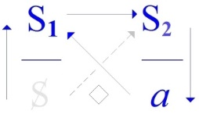

# Leçon 02 | 15 Décembre 1971 Séminaire : Panthéon-Sorbonne

<!-- source-url: http://staferla.free.fr/S19/S19...OU PIRE.docx -->
<!-- seminar: s19 -->
<!-- lesson: 02 -->

<!-- id: s19-02-0001 -->

On m’a donné ce matin, on m’a apporté ce matin, on m’a fait cadeau ce matin, de ça : d’un petit stylo.

<!-- id: s19-02-0002 -->

Si vous saviez ce que c’est difficile pour moi de trouver un stylo qui me plaise, eh bien, vous sentiriez combien ça m’a fait plaisir, et la personne qui me l’a apporté, qui est peut-être là, je la remercie.

<!-- id: s19-02-0003 -->

C’est une personne qui m’admire, comme on dit ! Moi, je m’en fous qu’on m’admire. \[*Rires*\]

<!-- id: s19-02-0004 -->

Ce que j’aime, c’est qu’on me traite bien ! Seulement, même parmi celles-là, ça arrive rarement.

<!-- id: s19-02-0005 -->

Bon, quoi qu’il en soit, je m’en suis tout de suite servi pour écrire et c’est de là que partent mes réflexions.

<!-- id: s19-02-0006 -->

C’est un fait que, au moins pour moi, c’est quand j’écris que je trouve quelque chose.

<!-- id: s19-02-0007 -->

Ça veut pas dire que si j’écrivais pas, je trouverais rien, mais enfin je m’en apercevrais peut-être pas.

<!-- id: s19-02-0008 -->

En fin de compte, l’idée que je me fais de cette fonction de *l’écrit*...

<!-- id: s19-02-0009 -->

> qui comme ça, grâce à quelques petits malins, est à l’ordre du jour et sur quoi enfin
>
> je n’ai peut-être pas trop voulu prendre parti, mais on me force la main. Pourquoi pas ? ...l’idée que je m’en fais en somme...

<!-- id: s19-02-0010 -->

> et c’est ça qui peut-être dans certains cas a prêté à confusion ...je vais le dire comme ça, tout cru, tout massif, parce que aujourd’hui justement je me suis dit que *l’écrit* ça peut être très utile pour que je trouve quelque chose.

<!-- id: s19-02-0011 -->

Mais écrire quelque chose pour m’épargner ici, disons la fatigue ou le risque, ou bien d’autres choses encore que je veux vous *parler*, ça ne donne pas finalement de très bons résultats.

<!-- id: s19-02-0012 -->

Il vaut mieux que je n’aie rien à vous lire.

<!-- id: s19-02-0013 -->

D’ailleurs, ce n’est pas la même sorte d’écrit

<!-- id: s19-02-0014 -->

- qui est l’écrit où je fais quelques trouvailles de temps en temps,

<!-- id: s19-02-0015 -->

- ou l’écrit où je peux préparer ce que j’ai à dire ici.

<!-- id: s19-02-0016 -->

Puis alors il y a aussi l’écrit pour l’impression, qui est encore tout à fait autre chose, qui n’a aucun rapport, ou plus exactement dont il serait fâcheux de croire que ce que je peux avoir écrit une fois pour vous parler, ça constitue un écrit tout à fait recevable et que je recueillerais.

<!-- id: s19-02-0017 -->

Donc je me risque à dire quelque chose comme ça, qui saute le pas.

<!-- id: s19-02-0018 -->

L’idée que je me fais de l’écrit...

<!-- id: s19-02-0019 -->

> pour le situer, pour partir de là, on pourrait discuter après, bon enfin disons-le ...c’est le retour du refoulé.

<!-- id: s19-02-0020 -->

Je veux dire que c’est sous cette forme...

<!-- id: s19-02-0021 -->

> et c’est ça qui peut-être a pu prêter à confusion dans certains de mes « *Écrits »* précisément ...c’est que si j’ai pu parfois paraître prêter à ce qu’on croie que j’identifie *le signifiant* et *la lettre*, c’est justement parce que

<!-- id: s19-02-0022 -->

- c’est en tant que *lettre* qu’il me touche le plus, moi comme analyste,

<!-- id: s19-02-0023 -->

- c’est en tant que *lettre* que le plus souvent je le vois revenir le signifiant, le signifiant refoulé.

<!-- id: s19-02-0024 -->

Alors que je l’image dans « *L’instance de la Lettre*... », enfin avec une lettre, ce signifiant, et d’ailleurs je dois dire que c’est d’autant plus légitime que tout le monde fait comme ça, la 1ère fois qu’on entre à proprement parler dans la logique...

<!-- id: s19-02-0025 -->

> il s’agit d’Aristote et des « *Analytiques »* ...ben *on se sert de la lettre aussi*, *pas tout à fait de la même façon que celle dont* *la lettre revient à la place du signifiant qui fait retour.*

<!-- id: s19-02-0026 -->

Elle vient là pour *marquer une place*, *la place* d’un signifiant qui, lui, est un signifiant qui traîne, qui peut tout au moins traîner partout.

<!-- id: s19-02-0027 -->

Bon. Mais on voit que *la lettre*, elle est faite en quelque sorte pour ça, et on s’aperçoit qu’elle est d’autant plus faite pour ça que c’est comme ça qu’elle se manifeste d’abord.

<!-- id: s19-02-0028 -->

Je sais pas si vous vous rendez bien compte, mais enfin j’espère que vous y penserez, parce que ça suppose quand même quelque chose qui n’est pas dit dans ce que j’avance. Il faut qu’il y ait une espèce de transmutation qui s’opère du signifiant à la *lettre* - quand le signifiant n’est pas là, est à la dérive n’est-ce pas, a foutu le camp - dont il faudrait se demander comment ça peut se produire.

<!-- id: s19-02-0029 -->

Mais ce n’est pas là que j’ai l’intention de m’engager aujourd’hui. J’irai peut-être un autre jour. Oui !

<!-- id: s19-02-0030 -->

Tout de même on ne peut pas faire que, sur le sujet de cette *lettre*, on n’ait affaire dans *un champ* qui s’appelle *mathématique*, à un endroit où on ne peut pas écrire n’importe quoi. Bien sûr ce n’est pas... Je ne vais pas non plus m’engager là-dedans.

<!-- id: s19-02-0031 -->

Je vous fais simplement remar­quer que c’est en ça que ce domaine se distingue, et c’est même probablement ça qui constitue ce à quoi je n’ai pas encore fait allusion ici, c’est-à-dire ici au séminaire, mais enfin que j’ai amené dans *quelques propos* où sans doute certains de ceux qui sont ici ont assisté, à savoir à Sainte-Anne [^4], quand je posais la question de ce qu’on pourrait appeler *un mathème*, en posant déjà que c’est le point pivot de tout enseignement, autrement dit qu’il n’y a d’enseignement que mathématique, le reste est plaisanterie.

<!-- id: s19-02-0032 -->

Ça tient bien sûr à *un autre statut de* *l’écrit* que celui que j’ai donné d’abord.

<!-- id: s19-02-0033 -->

Et la jonction enfin, en cours de cette année de ce que j’ai à vous dire, c’est ce que j’essaierai de faire.

<!-- id: s19-02-0034 -->

En attendant, ma difficulté...

<!-- id: s19-02-0035 -->

> celle en somme où malgré tout je tiens,
>
> je ne sais pas si ça vient de moi ou si c’est pas plutôt par votre concours ...ma difficulté c’est que *mon mathème à moi*, vu le champ du discours que j’ai à établir, eh ben *il confine toujours à la connerie.*

<!-- id: s19-02-0036 -->

Ça va de soi avec ce que je vous ai dit, puisqu’en somme ce dont il s’agit c’est *que le rapport sexuel *: *il n’y en a pas*.

<!-- id: s19-02-0037 -->

Il faudrait l’écrire *h.i.h.a.n* et *appât*, avec deux p, un accent circonflexe et un t à la fin : « *hi-han appât* ».

<!-- id: s19-02-0038 -->

Il ne faut pas confondre naturellement : *des relations sexuelles* il n’y a que ça, mais *des rencontres sexuelles* c’est toujours raté, même et surtout quand c’est un acte. Bon, enfin passons... \[*Rires*\]

<!-- id: s19-02-0039 -->

C’est ça qui m’a tout de même attiré une remarque, comme ça, j’ai­merais, pendant qu’il en est encore temps que...

<!-- id: s19-02-0040 -->

> parce qu’on aura à le voir, on aura tout au moins à voir des choses autour,
>
> c’est une très bonne introduction, c’est quelque chose d’essentiel, et c’est la « *Métaphysique »* d’Aristote ...je voudrais vraiment que vous l’ayez lu, pour faire enfin que quand j’y viendrai, je sais pas, au début du mois de mars, pour y voir le rapport avec notre affaire à nous, il faudrait que vous ayez bien lu ça.

<!-- id: s19-02-0041 -->

Naturellement c’est pas de ça que je vous parlerai.

<!-- id: s19-02-0042 -->

C’est pas que je n’admire pas *la connerie*, je dirai plus : je me prosterne.

<!-- id: s19-02-0043 -->

Vous, vous ne vous prosternez pas, vous êtes des électeurs conscients et organisés, vous votez pas pour des cons, *c’est ce qui vous perd *! \[*Rires*\]

<!-- id: s19-02-0044 -->

Un heureux système politique devrait permettre à la connerie d’avoir sa place et d’ailleurs, les choses ne vont bien que quand c’est *la connerie* qui domine.

<!-- id: s19-02-0045 -->

Ceci dit, ce n’est pas une raison pour se prosterner.

<!-- id: s19-02-0046 -->

Donc... le texte que je prendrai, c’est quelque chose qui est un exploit, et un exploit comme il y en a beaucoup qui sont, si je puis dire, *inexploités* : c’est le « *Parménide »* de Platon qui nous rendra service.

<!-- id: s19-02-0047 -->

Mais pour bien le comprendre, pour comprendre enfin le relief qu’il y a à ce texte pas con, il faut avoir lu la « *Métaphysique »* d’Aristote.

<!-- id: s19-02-0048 -->

Et enfin j’espère...

<!-- id: s19-02-0049 -->

j’espère parce que quand je conseille qu’on lise la *Critique de la raison pure* comme un roman..

<!-- id: s19-02-0050 -->

\[*lapsus*\] *de la raison pratique *! c’est quelque chose de plein d’humour ...je ne sais pas si personne, enfin, a jamais suivi ce conseil et a réussi à le lire comme moi.

<!-- id: s19-02-0051 -->

On m’en a pas fait part, c’est quelque part dans le « *Kant avec Sade »* dont je sais jamais si personne l’a lu.

<!-- id: s19-02-0052 -->

Alors je vais faire pareil, je vais vous dire : lisez la « *Métaphysique »* d’Aristote , et j’espère que, comme moi, vous sentirez que c’est vachement con. \[*Rires*\]

<!-- id: s19-02-0053 -->

Enfin je ne voudrais pas m’étendre longtemps là-dessus, c’est comme ça des petites remarques latérales bien sûr, qui me viennent, ça ne peut que frapper tout le monde quand on le lit, quand on lit le texte bien sûr.

<!-- id: s19-02-0054 -->

Il s’agit pas de la « *Métaphysique »* d’Aristote comme ça dans son essence, dans le signifié, dans tout ce qu’on vous a expliqué à partir de ce magnifique texte, c’est-à-dire tout ce qui a fait la métaphysique pour cette partie du monde où nous sommes, car tout est sorti de là, c’est absolument fabuleux.

<!-- id: s19-02-0055 -->

On parle de « *la fin de la métaphysique* », au nom de quoi ? Tant qu’il y aura ce bouquin, on pourra toujours en faire !

<!-- id: s19-02-0056 -->

Ce bouquin, c’est un bouquin...

<!-- id: s19-02-0057 -->

> c’est très différent de *la métaphysique* ...c’est un bouquin *écrit* dont je parlais tout à l’heure.

<!-- id: s19-02-0058 -->

On lui a donné *un sens* qu’on appelle *la métaphysique*, mais il faut quand même distinguer *le sens et le bouquin*.

<!-- id: s19-02-0059 -->

Naturellement une fois qu’on lui a donné tout ce sens, c’est pas facile de retrouver le bouquin.

<!-- id: s19-02-0060 -->

Si vous le retrouvez vrai­ment vous verrez ce que tout de même des gens, qui ont une discipline...

<!-- id: s19-02-0061 -->

> et qui existe, et qui s’appelle la méthode,
>
> la méthode historique, critique, exégétique, tout ce que vous voudrez ...qui sont capables de lire le texte avec évidemment une certaine façon de se barrer du sens, et quand on regarde le texte, eh bien évidemment il vous vient des doutes.

<!-- id: s19-02-0062 -->

Je dirai que, comme bien entendu parce que cet obstacle de tout ce qu’on en a compris, ça ne peut exister qu’au niveau universitaire et que l’Université n’existe pas depuis toujours, enfin dans l’Antiquité 3 ou 4 siècles après Aristote, on a commencé à émettre *des doutes*...

<!-- id: s19-02-0063 -->

> naturellement *les plus sérieux* sur ce texte, parce qu’on savait encore lire, ...on a émis des doutes, on a dit de ça que c’est des séries de *« notes »,* ou bien que c’est un élève qui a fait ça, qui a rassemblé des trucs.

<!-- id: s19-02-0064 -->

Je dois dire que je ne suis pas convaincu du tout.

<!-- id: s19-02-0065 -->

C’est peut-être parce que je viens de lire un bouquin d’un nommé Michelet...

<!-- id: s19-02-0066 -->

> pas le nôtre, *pas notre poète*, quand je dis « *notre poète »*, je veux dire par là que je le place très haut le nôtre ...c’est un type, comme ça, qui était à l’Université de Berlin, qui s’appelait Michelet lui aussi, qui a fait un livre sur la *« Métaphysique »* d’Aristote [^5], précisément là-dessus.

<!-- id: s19-02-0067 -->

Parce que la méthode historique qui florissait alors l’avait un peu taquiné avec les doutes émis, non sans fondement puisque ils remontent à la plus haute Antiquité.

<!-- id: s19-02-0068 -->

Je dois dire que Michelet n’est pas de cet avis et moi non plus.

<!-- id: s19-02-0069 -->

Parce que vraiment, comment dirais-je, *la connerie fait preuve,* pour ce qui est de l’authenticité.

<!-- id: s19-02-0070 -->

Ce qui domine c’est l’authenticité si je puis dire, de la connerie.

<!-- id: s19-02-0071 -->

Peut-être que ce terme « *authentique* » qui est toujours un petit peu compliqué chez nous, comme ça, avec des résonances étymologiques grecques, il y a des langues où il est mieux représenté, c’est « *echt* », je sais pas comment avec ça on fait un nom, ça doit être l’*Echtigkeit* ou quelque chose comme ça, qu’importe.

<!-- id: s19-02-0072 -->

Il y a tout de même rien d’authentique *que la connerie*.

<!-- id: s19-02-0073 -->

Alors cette authenticité, c’est peut-être pas l’authenticité d’Aristote, mais la *Métaphysique* - je parle du texte - c’est authentique, ça ne peut pas être fait de pièces ou de morceaux, c’est toujours à la hauteur de ce qu’il faut bien maintenant que j’appelle, que je justifie de l’appeler : *la connerie*.

<!-- id: s19-02-0074 -->

*La connerie* c’est ça, c’est ce dans quoi on entre quand on pose les questions à un certain niveau, qui est celui-là précisément, déterminé par le fait du langage \[S1→ S2\], quand on approche de *sa fonction essentielle* qui est de remplir tout ce que laisse de béant *qu’il ne puisse y avoir de rapport sexuel*, ce qui veut dire qu’aucun écrit ne puisse en rendre compte en quelque sorte d’une façon satisfaisante, qui soit écrit en tant que *produit du langage* \[S1→ S2 ↓*a*\].

<!-- id: s19-02-0075 -->

<!-- id: s19-02-0076 -->

### Parce que, bien entendu, depuis que nous avons vu les gamètes, nous pouvons écrire au tableau : 

<!-- id: s19-02-0077 -->

### « *homme* = *porteur de spermatozoïdes* ». 

<!-- id: s19-02-0078 -->

### Ce qui serait une définition un peu drôle parce qu’il n’y a pas que lui qui en porte, il y a des tas d’ani­maux ! 

<!-- id: s19-02-0079 -->

De ces spermatozoïdes-là*, des spermatozoïdes* d’hommes alors, commençons à parler de biologie !

<!-- id: s19-02-0080 -->

Pourquoi les spermatozoïdes d’hommes sont-ils justement ceux que porte l’homme ?

<!-- id: s19-02-0081 -->

### Parce que, *comme c’est des spermatozoïdes d’homme qui font l’homme*, nous sommes dans un cercle qui tourne là ! 

<!-- id: s19-02-0082 -->

### Mais qu’importe, on peut écrire ça.

<!-- id: s19-02-0083 -->

### Seulement ça n’a aucun rapport avec quoi que ce soit qui puisse s’écrire, si je puis dire, de sensé, 

<!-- id: s19-02-0084 -->

### c’est-à-dire qui ait *un rapport au réel*. Ce n’est pas parce que c’est biologique que c’est plus *réel* : 

<!-- id: s19-02-0085 -->

### c’est le fruit de la science qui s’appelle *biologique*. 

<!-- id: s19-02-0086 -->

### Le *réel* c’est autre chose :

<!-- id: s19-02-0087 -->

- Le *réel c’est ce qui commande toute la fonction de la signifiance*.

<!-- id: s19-02-0088 -->

- Le *réel* c’est ce que vous rencontrez justement : *de ne pouvoir, en mathématique, pas écrire n’importe quoi*.

<!-- id: s19-02-0089 -->

- Le *réel* c’est ce qui intéresse ceci : *que dans ce qui est notre fonction la plus commune vous baignez dans la signifiance*.

<!-- id: s19-02-0090 -->

Eh bien *vous ne pouvez les attraper tous en même temps les signifiants*, hein !

<!-- id: s19-02-0091 -->

C’est interdit par leur structure même : *quand vous en avez certains*, un paquet, *vous n’avez plus les autres*, ils sont refoulés.

<!-- id: s19-02-0092 -->

Ça ne veut pas dire que vous les *dites* pas quand même : justement, vous les *dites* « *inter* », ils sont *inter-dits*.

<!-- id: s19-02-0093 -->

Ça vous empêche pas de *les dire*, mais vous les *dites censurés *:

<!-- id: s19-02-0094 -->

- ou bien tout ce qu’est la psychanalyse n’a aucun sens, est à foutre au panier,

<!-- id: s19-02-0095 -->

- ou bien ce que je vous dis là doit être votre vérité première.

<!-- id: s19-02-0096 -->

Alors c’est ça dont il va s’agir cette année : du fait qu’en se plaçant à un certain niveau...

<!-- id: s19-02-0097 -->

> Aristote ou pas, mais en tout cas le texte est là authentique ...quand on se place à un certain niveau, ça va pas tout seul.

<!-- id: s19-02-0098 -->

C’est passionnant de voir quelqu’un d’aussi aigu, d’aussi savant, d’aussi alerte, d’aussi lucide, se mettre à patauger là de cette façon.

<!-- id: s19-02-0099 -->

Parce que quoi ? Parce qu’il s’interroge sur *le principe*.

<!-- id: s19-02-0100 -->

Naturellement il n’a pas la moindre idée que le principe c’est ça, c’est *qu’il n’y a pas de rapport sexuel*.

<!-- id: s19-02-0101 -->

Il n’en a pas idée, mais on voit que c’est uniquement à ce niveau-là qu’il se pose toutes les questions.

<!-- id: s19-02-0102 -->

Et alors ce qu’il lui sort comme vol d’oiseau à sortir du chapeau, où simplement il a mis une question dont il ne connaît pas la nature : vous comprenez, c’est comme le prestidigi­tateur qui croit avoir mis...

<!-- id: s19-02-0103 -->

> enfin, il faut bien qu’on l’introduise *le lapin,* naturellement, qui doit sortir ...et puis après il en sort un rhinocéros ! c’est tout à fait comme ça pour Aristote.

<!-- id: s19-02-0104 -->

Car où est le principe ?

<!-- id: s19-02-0105 -->

Si c’est *le genre*, mais alors si c’est *le genre* il devient enragé parce que : est-ce que c’est *le genre général* ou *le genre le plus spécifié *?

<!-- id: s19-02-0106 -->

- Il est évident que *le plus général* est le plus essentiel,

<!-- id: s19-02-0107 -->

- mais que tout de même *le plus spécifié*, c’est bien ce qui donne ce qu’il y a d’unique en chacun.

<!-- id: s19-02-0108 -->

Alors, sans même se rendre compte...

<!-- id: s19-02-0109 -->

> Dieu merci, parce que grâce à ça il ne les confond pas ...parce que cette histoire *d’essentialité* et cette histoire *d’unicité*, c’est la même chose ou plus exactement c’est homonyme à ce qu’il interroge - Dieu merci, il ne les confond pas - c’est pas de là qu’il les fait sortir.

<!-- id: s19-02-0110 -->

Il se dit :

<!-- id: s19-02-0111 -->

- est-ce que le principe c’est l’*Un* ?

<!-- id: s19-02-0112 -->

- ou bien est-ce que le principe c’est l’*Être* ?

<!-- id: s19-02-0113 -->

Alors à ce moment-là, ça s’embrouille vachement !

<!-- id: s19-02-0114 -->

Comme il faut à tout prix que ce l’*Un* soit, et que l’*Être* soit *Un*, là nous perdons les pédales.

<!-- id: s19-02-0115 -->

Car justement, le moyen de ne pas déconner c’est de les séparer sévèrement, c’est ce que nous essaierons de faire par la suite. Assez pour Aristote.

<!-- id: s19-02-0116 -->

Je vous ai annoncé...

<!-- id: s19-02-0117 -->

> j’ai déjà franchi le pas l’année dernière ...que ce *non-rapport*, si je puis m’exprimer ainsi, il faut l’*écrire*, *il faut l’écrire à tout prix*, je veux dire écrire *l’autre rapport*, celui qui fait bouchon à la possibilité d’écrire celui-ci.

<!-- id: s19-02-0118 -->

Et *déjà l’année dernière*, j’ai mis sur le tableau *quelques choses* dont après tout je ne trouve pas mauvais de les poser d’abord.

<!-- id: s19-02-0119 -->

Naturellement, il y a là quelque chose d’arbitraire. Je ne vais pas m’excuser en me mettant à l’abri des mathématiciens, les mathé­maticiens font ce qu’ils veulent, et puis moi aussi.

<!-- id: s19-02-0120 -->

Tout de même, sim­plement pour ceux qui ont besoin de me donner des excuses, je peux faire remarquer que dans les « *Éléments »* de Bourbaki [^6] on commence par foutre *les lettres* sans dire absolument rien de ce à quoi elles peuvent servir.

<!-- id: s19-02-0121 -->

Je parle... appelons ça *symboles écrits*, car ça ne ressemble même pas à aucune lettre, et *ces symboles* représentent quelque chose qu’on peut appeler des opérations, on ne dit absolument pas desquelles il s’agit, *ça ne sera que 20 pages plus loin* qu’on commencera à pouvoir le déduire rétroactivement d’après la façon dont on s’en sert.

<!-- id: s19-02-0122 -->

Je n’irai pas du tout jusque-là.

<!-- id: s19-02-0123 -->

J’essaierai tout de suite d’interroger ce que veulent dire les lettres que j’aurais écrites.

<!-- id: s19-02-0124 -->

Mais comme après tout je pense que pour vous, ça serait beaucoup plus compliqué que je les amène une par une, à mesure qu’elles s’animeront, qu’elles prendront valeur de fonction, je préfère poser ces lettres comme ce autour de quoi j’aurais à tourner ensuite.

<!-- id: s19-02-0125 -->

Déjà l’année dernière j’ai cru pouvoir poser ce dont il s’agit : Φx, et que je crois...

<!-- id: s19-02-0126 -->

> pour des raisons qui sont de tentatives ...pouvoir écrire comme en mathématiques, c’est à savoir : la fonction qui se constitue de ce qu’il existe cette *jouissance* appelée *« jouissance sexuelle »,* et qui est proprement ce qui fait barrage au *rapport*.

<!-- id: s19-02-0127 -->

Que *la jouissance sexuelle* ouvre pour *l’être parlant* la porte à *la jouissance*, et là ayez un peu d’oreille, apercevez-vous que *la jouissance*, quand nous l’appelons comme ça tout court, c’est peut-être *la jouissance* pour certains - je l’élimine pas - mais vraiment c’est pas *la jouissance sexuelle*.

<!-- id: s19-02-0128 -->

C’est le mérite qu’on peut donner au texte de Sade que d’avoir appelé les choses par leur nom :

<!-- id: s19-02-0129 -->

- *jouir, c’est jouir d’un corps*,

<!-- id: s19-02-0130 -->

- *jouir* c’est l’embrasser, c’est l’éteindre, c’est le mettre en morceaux.

<!-- id: s19-02-0131 -->

En droit, avoir la jouissance de quelque chose c’est justement ça : c’est pouvoir traiter quelque chose comme un corps, c’est-à-dire le démolir, n’est-ce pas.

<!-- id: s19-02-0132 -->

C’est le mode de jouissance le plus régulier, c’est pour ça que ces énoncés ont toujours une résonance sadienne.

<!-- id: s19-02-0133 -->

Il ne faut pas confondre sadienne avec sadique, parce qu’on a dit tellement de conneries préci­sément sur le sadisme que le terme est dévalorisé !

<!-- id: s19-02-0134 -->

Je ne m’avance pas plus sur ce point.

<!-- id: s19-02-0135 -->

Ce que produit cette relation du *signifiant* à *la jouissance*, c’est ce que j’exprime par cette notation ΦX.

<!-- id: s19-02-0136 -->

Ça veut dire que X, lui, ne désigne qu’un signifiant.

<!-- id: s19-02-0137 -->

Un signifiant ça peut être chacun de vous, chacun de vous précisément au niveau, au niveau *mince* où vous existez comme sexués.

<!-- id: s19-02-0138 -->

Il est très *mince* en épaisseur, si je puis dire, mais il est beaucoup plus *large* en surface que chez les animaux, chez qui, quand ils ne sont pas en rut, vous ne les distinguez pas ce que j’appelais dans le dernier sémi­naire, *le petit garçon* et *la petite fille*, les lionceaux par exemple, ils se ressemblent tout à fait dans leur comportement.

<!-- id: s19-02-0139 -->

Pas vous, à cause que justement c’est comme *signifiant* que vous vous sexuez.

<!-- id: s19-02-0140 -->

Alors il ne s’agit pas là de faire la distinction, de marquer *le signifiant* « *homme* » comme distinct du *signifiant* « *femme* », d’appeler l’un X et l’autre Y, parce que c’est justement là la question : c’est comment on se distingue.

<!-- id: s19-02-0141 -->

C’est pour ça que je mets ce X à la place du trou que je fais dans le signifiant, c’est-à-dire que je l’y mets ce X comme *variable apparente*.

<!-- id: s19-02-0142 -->

Ce qui veut dire que chaque fois que je vais avoir affaire à ce signifiant sexuel...

<!-- id: s19-02-0143 -->

> c’est-à-dire à ce *quelque chose* qui tient à *la jouissance* *...*je vais avoir affaire à ΦX,

<!-- id: s19-02-0144 -->

Et il y a certains, quelques uns, spécifiés parmi ces X qui sont tels qu’on peut écrire, *pour tout x quel qu’il soit* : ΦX, c’est à dire que fonctionne ce qui s’appelle *en mathématiques* une fonction Φ, c’est-à-dire que ça, ça peut s’écrire : ;!

<!-- id: s19-02-0145 -->

Alors je vais vous dire tout de suite, je vais éclairer, enfin « *éclairer » *: il y a que vous qui serez *éclairés* bien sûr, enfin vous serez *éclairés* un petit moment. Comme disaient les stoïciens n’est-ce pas : « *quand il fait jour, il fait clair* ».

<!-- id: s19-02-0146 -->

Moi je suis évidemment...

<!-- id: s19-02-0147 -->

> comme je l’ai mis au dos de mes *Écrits* *...du parti des lumières* : j’éclaire, dans l’espoir du Jour J, bien sûr.

<!-- id: s19-02-0148 -->

Seulement, c’est justement lui qui est en question, le jour J, il n’est pas pour demain.

<!-- id: s19-02-0149 -->

Le premier pas à faire quant à *la philosophie des Lumières*, c’est de savoir que le jour n’est pas levé, que le jour dont il s’agit est celui de quelque petite lumière dans un champ parfaitement obscur.

<!-- id: s19-02-0150 -->

Moyennant quoi vous allez croire qu’il fait clair quand je vous dirai que ΦX, ça veut dire *la fonction qui s’appelle* *la castration*. Comme vous croyez savoir *ce que c’est que la castration*, alors je pense que *vous êtes contents*, au moins pour un moment ! \[*Rires*\]

<!-- id: s19-02-0151 -->

### Bon, figurez-vous que moi si j’écris tout ça au tableau, et que je vais continuer, 

<!-- id: s19-02-0152 -->

### c’est parce que moi je sais pas du tout ce que c’est que *la castration* !

<!-- id: s19-02-0153 -->

### Et que j’espère, à l’aide de ce jeu de lettres venir, à ce qu’enfin justement « *le jour se lève* », 

<!-- id: s19-02-0154 -->

### à savoir qu’on sache que *la castration*, il faut bien en passer par là et qu’il n’y aura pas de discours sain...

<!-- id: s19-02-0155 -->

### à savoir : qui ne laisse dans l’ombre la moitié de son statut et de son conditionnement

<!-- id: s19-02-0156 -->

### ...tant qu’on ne le saura pas, et on ne le saura qu’à avoir fait jouer à différents niveaux de relations topologiques, 

<!-- id: s19-02-0157 -->

### une certaine façon de changer les lettres et de voir comment ça se répartit. 

<!-- id: s19-02-0158 -->

### Jusque-là vous en êtes réduits à de petites histoires, à savoir que Papa a dit : « *on va te la couper »*... 

<!-- id: s19-02-0159 -->

### Enfin, comme si c’était pas la connerie type ! 

<!-- id: s19-02-0160 -->

Alors il y a quelque part un endroit où on peut dire que tout ce qui s’articule de signifiant tombe sous le coup de ΦX, de *cette fonction de castration*.

<!-- id: s19-02-0161 -->

Ça a un petit avantage de formuler les choses comme ça.

<!-- id: s19-02-0162 -->

Il peut vous venir à l’idée justement que si tout à l’heure j’ai...

<!-- id: s19-02-0163 -->

> non sans intention, je suis plus rusé que j’en ai l’air ...je vous ai amené comme remarque sur le sujet de l’inter-dit, à savoir : « *que tous les signifiants ne peuvent pas être là tous ensemble* » jamais, ça a peut être rapport :

<!-- id: s19-02-0164 -->

- je n’ai pas dit que *l’inconscient* = *la castration*,

<!-- id: s19-02-0165 -->

- j’ai dit que ça a beaucoup de rapport.

<!-- id: s19-02-0166 -->

Évidemment, écrire comme ça ΦX c’est *écrire une fonction* d’une portée, comme dirait Aristote, incroyablement *générale*.

<!-- id: s19-02-0167 -->

Que ça veuille dire que le rapport à un certain signifiant...

<!-- id: s19-02-0168 -->

> vous voyez que je l’ai pas encore dit, mais enfin disons-le ...un signifiant qui est par exemple « *un homme* » ...

<!-- id: s19-02-0169 -->

> tout ça est tuant parce qu’il y a beaucoup à remuer, et puis personne ne l’ayant fait
>
> jamais avant moi, ça risque à tout instant de me dégringoler sur la tête ... « *un homme* », j’ai pas dit « *l’homme* » : c’est assez rigolo tout de même que dans l’usage comme ça, du signifiant, on dise au gars « *sois un homme* », on ne lui dit pas « *sois l’homme* », non, on lui dit « *sois un homme* », pourquoi ?

<!-- id: s19-02-0170 -->

Ce qu’il y a de curieux, c’est que ça ne se dit pas beaucoup « *sois une femme* », mais on parle par contre de « *la femme* », article défini.

<!-- id: s19-02-0171 -->

On a beaucoup spéculé sur l’article défini.

<!-- id: s19-02-0172 -->

Mais enfin, nous retrouverons ça quand il faudra.

<!-- id: s19-02-0173 -->

Ce que je veux simplement vous dire, c’est que ce qu’écrit ΦX, ça veut dire...

<!-- id: s19-02-0174 -->

> je ne dis même pas ces deux signifiants-là précisément ...mais eux et un certain nombre d’autres qui s’articulent avec, donc ont pour effet qu’on ne peut plus disposer de l’ensemble des signifiants*,* et que c’est peut-être bien là une première approche de ce qu’il en est de *la castration,* du point de vue bien sûr de cette fonction mathématique que mon écrit imite.

<!-- id: s19-02-0175 -->

Dans un premier temps je ne vous demande pas plus que de reconnaître que c’est imité.

<!-- id: s19-02-0176 -->

Ça ne veut pas dire que pour moi qui y ai déjà réfléchi, ça n’aille pas beaucoup plus loin.

<!-- id: s19-02-0177 -->

Enfin, il y a moyen d’écrire que **∀**X, ça fonctionne.

<!-- id: s19-02-0178 -->

C’est le propre d’une façon d’*écriture* qui est issue du premier traçage logicien dont Aristote est le responsable, ce qui lui a donné ce prestige tient du fait que c’est formidablement jouissif la logique, justement parce que ça tient à ce champ de la castration.

<!-- id: s19-02-0179 -->

Enfin, comment pourriez-vous justifier, à travers l’histoire, qu’une période aussi ample comme temps, aussi brûlante comme intelligence, aussi foisonnante comme production, que notre Moyen âge, ait pu s’exciter à ce point sur ces affaires de la logique, et *aristotélicienne * !

<!-- id: s19-02-0180 -->

Pour que ça les ait mis dans cet état...

<!-- id: s19-02-0181 -->

> car ça venait à soulever des foules, parce que par l’intermédiaire *des logiciens* ça avait des conséquences *théolo­giques* où la *logique* dominait beaucoup le *théo*, ce qui n’est pas comme chez nous où il n’y a plus que le *théo* qui reste, toujours là bien solide dans sa connerie, et où la *logique* est légèrement évaporée ...c’est bien que c’est *jouissif* cette histoire.

<!-- id: s19-02-0182 -->

C’est d’ailleurs de là qu’est pris tout le prestige qui, dans la construction d’Aristote, a retenti sur cette fameuse « *Métaphysique »,* où il débloque à plein tube.

<!-- id: s19-02-0183 -->

### Mais à ce niveau-là...

<!-- id: s19-02-0184 -->

### car je ne vais pas aujourd’hui vous faire un cours d’histoire de la logique

<!-- id: s19-02-0185 -->

### ...si vous voulez aller chercher simplement les « *Premiers Analytiques »,* 

<!-- id: s19-02-0186 -->

### ce qu’on appelle plus exactement les « *Analytiques antérieurs »,* même pour ceux qui...

<!-- id: s19-02-0187 -->

### bien entendu les plus nombreux

<!-- id: s19-02-0188 -->

### ...n’au­ront jamais le courage de le lire, encore que ce soit fascinant, je vous recommande quand même... 

<!-- id: s19-02-0189 -->

### ce qu’on appelle le Livre I, chapitre 46 [^7] n’est-ce pas

<!-- id: s19-02-0190 -->

### ...de lire ce qu’Aristote produit sur ce qu’il en est de *la néga­tion*, à savoir sur *la différence* qu’il y a à dire 

<!-- id: s19-02-0191 -->

### « *l’homme n’est pas blanc »,* si c’est bien ça le contraire de « *l’homme est blanc »* ou si... 

<!-- id: s19-02-0192 -->

> comme bien des gens le croyaient, et le croyaient déjà à son époque - ça ne l’a pas arrêté pour autant ...ou si le contraire c’est de dire « *l’homme est non blanc »*.

<!-- id: s19-02-0193 -->

Ce n’est absolument pas la même chose. Je pense que rien qu’à l’énoncer comme ça, la différen­ce est sensible.

<!-- id: s19-02-0194 -->

Seulement il est très important de lire *ce chapitre* parce que, on vous a raconté tellement de choses sur *la logique des prédicats*, au moins ceux qui ont déjà essayé de se frotter aux endroits où on parle de ces trucs là, que vous pourriez vous imaginer que le syllogisme est tout entier dans *la logique des prédicats*.

<!-- id: s19-02-0195 -->

C’est une petite indication que je fais latéralement.

<!-- id: s19-02-0196 -->

Comme je n’ai pas voulu m’y attarder, peut-être que j’aurai le temps de le reprendre un jour.

<!-- id: s19-02-0197 -->

Je veux simplement dire qu’il y a eu...

<!-- id: s19-02-0198 -->

> pour que je puisse l’écrire ainsi ...au début du XIXème siècle, une mutation essentielle, c’est la tentative d’application de cette logique à ce dont déjà tout à l’heure je vous ai indiqué qu’il a un statut spécial, à savoir le signifiant mathématique.

<!-- id: s19-02-0199 -->

Ça a donné ce mode d’écriture dont je pense que j’aurai le temps par la suite de vous faire sentir le relief et l’ori­ginalité, à savoir que ça ne dit plus du tout la même chose que *les pro­positions*...

<!-- id: s19-02-0200 -->

> car c’est de cela dont il s’agit ...qui fonctionnent dans le syllogisme.

<!-- id: s19-02-0201 -->

### À savoir que, *comme je l’ai déjà écrit l’année dernière* : . !, le signe de la négation mis au niveau où il y a le grand **A** \[**∀**\], c’est une possibilité qui nous est ouverte justement par cette introduction des *quanteurs*, 

<!-- id: s19-02-0202 -->

### dans l’usage de ces *quanteurs* appelés généralement *quantifi­cateurs*, et que je préfère appeler ainsi...

<!-- id: s19-02-0203 -->

### je ne suis pas le seul ni le premier, parce que la chose importante 

<!-- id: s19-02-0204 -->

### est que vous sachiez ce qui est évident : que ça n’a absolument rien à faire avec la quantité, 

<!-- id: s19-02-0205 -->

### on l’appelle comme ça parce qu’on n’a pas trouvé mieux, ce qui est un signe

<!-- id: s19-02-0206 -->

### ...enfin, cette articulation des *quanteurs* nous permet ce qui n’a jamais été fait dans cette *logique des quanteurs*, 

<!-- id: s19-02-0207 -->

### c’est ce que je fais parce que je considère que pour nous ça peut être très fructueux, c’est *la fonc­tion du « pas-tous ».*

<!-- id: s19-02-0208 -->

Il y a un ensemble de ces signifiants qui supplée à la fonction du sexué, qui y supplée pour ce qui est de *la jouissance*, à un endroit où c’est « *pas-tous* » qui fonctionne dans la fonction de la castration.

<!-- id: s19-02-0209 -->

Je continue à me ser­vir des quanteurs.

<!-- id: s19-02-0210 -->

Il y a une façon qu’on a de les articuler c’est d’écrire **:**, ça veut dire « *il existe* ». Il existe - quoi ? - un signifiant.

<!-- id: s19-02-0211 -->

Quand vous traitez de signifiant mathématique, ceux qui ont un autre statut que nos petits signifiants sexués, qui ont un autre statut et *qui mord autrement sur le réel*, il faudrait peut-être quand même essayer de faire prévaloir dans votre esprit *qu’il y a au moins une chose de réelle*, et que c’est la seule dont nous sommes sûrs, *c’est le nombre*.

<!-- id: s19-02-0212 -->

Ce qu’on arrive à faire avec !

<!-- id: s19-02-0213 -->

On en a fait pas mal ! Pour arriver jusqu’à construire *les nombres réels*, c’est-à-dire justement ceux qui ne le sont pas, *il faut que le nombre, ce soit quelque chose de réel*. Enfin, j’adresse ça en passant aux mathématiciens qui vont peut-être me lancer des pommes cuites, mais qu’importe, ils le feront dans le privé parce qu’ici je les intimide.

<!-- id: s19-02-0214 -->

Revenons à ce que nous avons à dire : « *il existe*  ».

<!-- id: s19-02-0215 -->

Cette référence que je viens de faire n’est pas simplement *une discrétion,* plutôt une digression, plutôt vous dire que « *il existe* » *c’est là que* ça a un sens, *ça a un sens précaire* : *c’est bien en tant que signifiant que vous existez tous*.

<!-- id: s19-02-0216 -->

Vous existez, vous existez sûrement... mais ça ne va pas loin. Vous existez en tant que signifiant.

<!-- id: s19-02-0217 -->

Essayez bien de vous imaginer comme ça, nettoyés de toute cette affaire, vous m’en direz des nouvelles.

<!-- id: s19-02-0218 -->

Après la guerre, comme ça, on nous a incités à exister de façon fortement *contem­poraine*.

<!-- id: s19-02-0219 -->

Eh ben regardez ce qu’il en reste.

<!-- id: s19-02-0220 -->

Vous comprenez, j’oserai dire que les gens avaient quand même un tout petit peu plus d’idées dans la tête quand ils démontraient l’existence de Dieu. C’est évident que Dieu existe, mais pas plus que vous, ça va pas loin.

<!-- id: s19-02-0221 -->

Enfin ceci pour mettre au point ce qu’il en est de *l’existence*.

<!-- id: s19-02-0222 -->

Qu’est-ce qui peut bien nous intéresser concernant cet « *il existe*  » en matière de signifiant ?

<!-- id: s19-02-0223 -->

Ça serait qu’*il en existe « au moins un »* pour qui ça ne fonctionne pas cette affaire de castration \[:§\], et c’est bien pour ça qu’on l’a inventé, *c’est ce qui s’appelle le Père*.

<!-- id: s19-02-0224 -->

*C’est pourquoi le Père existe au moins autant que Dieu, c’est-à-dire pas beaucoup*.

<!-- id: s19-02-0225 -->

Alors naturellement il y a quelques petits malins...

<!-- id: s19-02-0226 -->

> je suis entouré de petits malins, ceux qui transforment ce que j’avance en pollution intellectuelle \[*Rires*\],
>
> comme s’expri­mait une de mes patientes que je remercie de m’avoir fourni ça,
>
> elle a trouvé ça toute seule parce que c’est une sensible - hein ? -
>
> d’ailleurs en géné­ral il n’y a que les femmes qui comprennent ce que je dis ...alors il y en a qui ont découvert que je disais que le Père c’était un mythe, parce que il saute aux yeux en effet que ΦX ne marche pas au niveau du *mythe d’Œdipe*.

<!-- id: s19-02-0227 -->

Le Père n’est pas châtré, sans ça comment est-ce qu’il pourrait les avoir toutes ? Vous vous rendez compte !

<!-- id: s19-02-0228 -->

Elles n’existent même *que* *là* en tant que « *toutes »*, car c’est *aux femmes* que ça convient le *pas-tous*, mais enfin je commenterai ça plus loin prochainement.

<!-- id: s19-02-0229 -->

Donc à partir de ce qu’« *il existe un* » c’est à partir de là que tous les autres peuvent fonctionner, c’est en référence à cette exception, à cet « *il existe* ».

<!-- id: s19-02-0230 -->

Seulement voilà, à très bien comprendre qu’on peut écrire le rejet de la fonction : ΦX *nié* \[**§**\], « *il n’est pas vrai* » que ça se castre, ça c’est le mythe.

<!-- id: s19-02-0231 -->

Seulement, ce dont il ne se sont pas aperçus les petits malins, c’est que c’est corrélatif de l’existen­ce et que ça pose l’« *il existe* » de cet « *il n’est pas vrai* » de la castration.

<!-- id: s19-02-0232 -->

Bon, il est deux heures...

<!-- id: s19-02-0233 -->

Alors je vais simplement vous marquer la 4ème *façon* de faire usage de ce qu’il en est *de la négation* fondée sur *les quanteurs*, qui est d’écrire / : « *il* *n’en existe pas* ».

<!-- id: s19-02-0234 -->

« *Il* *n’en existe pas* » - qui, quoi ? - *pour qui il ne soit pas vrai que la fonction* ΦX *soit ce qui domi­ne ce qu’il en est de l’usage du* *signifiant*.

<!-- id: s19-02-0235 -->

Seulement est-ce que c’est ça que ça veut dire ?

<!-- id: s19-02-0236 -->

Car tout à l’heure *l’existence* je vous l’ai distinguée de *l’exception*, et si la négation là voulait dire / §, sans l’exception de cette *position signifiante*, elle peut s’inscrire dans la *négation de la castration*, *dans le rejet*, dans le « *il* *n’est pas vrai* » que la castration domine tout.

<!-- id: s19-02-0237 -->

C’est sur cette petite énigme que je vous laisserai aujourd’hui parce que, à la vérité, c’est très éclairant pour le sujet.

<!-- id: s19-02-0238 -->

À savoir que la négation, ce n’est pas une chose dont on peut user, comme ça, d’une façon aussi sim­plement univoque qu’on le fait dans la logique des propositions, où tout ce qui n’est pas vrai est faux, et où - chose énorme - tout ce qui n’est pas faux devient vrai.

<!-- id: s19-02-0239 -->

Bon, je laisse les choses au moment où c’est l’heure qui me coupe comme il convient, et je reprendrai les choses le deuxiè­me mercredi de Janvier au point précis où je les ai laissées aujourd’hui.

<!-- id: s19-02-0240 -->

## Notes

[^4]: « Entretiens de Sainte-Anne », séance du 2 décembre.

[^5]:
    #  Carl Ludwig Michelet : « *Examen Critique de l'Ouvrage d'Aristote Intitulé Métaphysique* », Vrin, 2002.

[^6]:
    #  Nicolas Bourbaki : « *Éléments d’histoire des mathématiques* », Hermann, 1974.

[^7]: Aristote : « *Organon III. Les premiers analytiques* », trad. Tricot, Vrin 2001, pp. 194-195.
