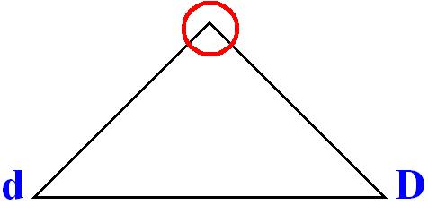
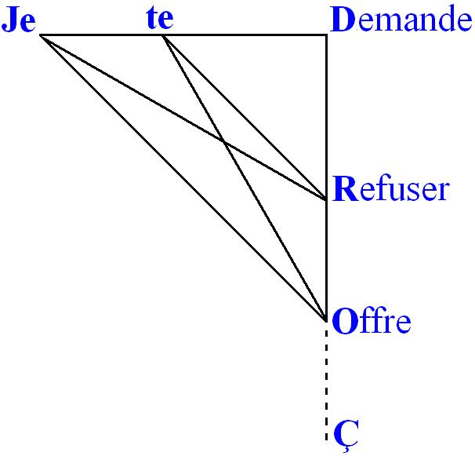
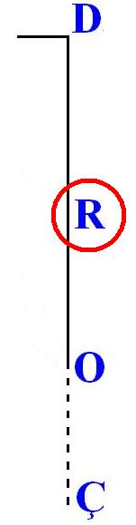
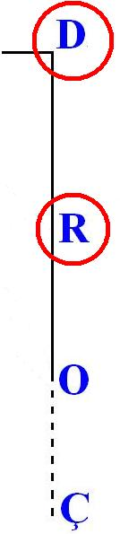
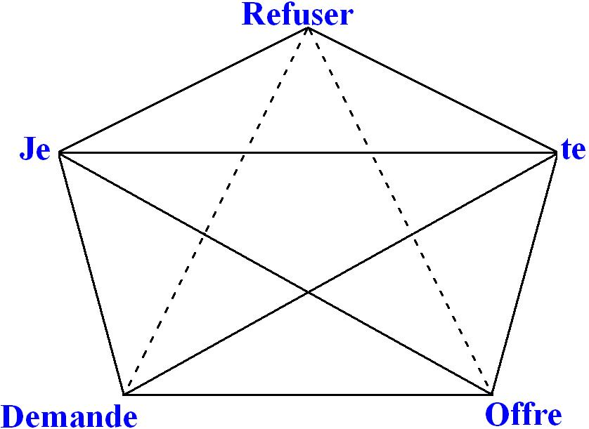
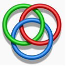

# Leçon 05 | 09 Février 1972 Séminaire : Panthéon-Sorbonne

<!-- source-url: http://staferla.free.fr/S19/S19...OU PIRE.docx -->
<!-- seminar: s19 -->
<!-- lesson: 05 -->

<!-- id: s19-05-0001 -->

\[ Au tableau \]

<!-- id: s19-05-0002 -->

蓋

<!-- id: s19-05-0003 -->

非

<!-- id: s19-05-0004 -->

也

<!-- id: s19-05-0005 -->

請

<!-- id: s19-05-0006 -->

拒

<!-- id: s19-05-0007 -->

收

<!-- id: s19-05-0008 -->

我

<!-- id: s19-05-0009 -->

贈

<!-- id: s19-05-0010 -->

蓋 非 也 請 拒 收 我 贈 gài fēi yě qǐng jù shōu wǒ zèng.

<!-- id: s19-05-0011 -->

#### *Je te demande de me refuser ce que je t’offre, parce que c’est pas ça.*

<!-- id: s19-05-0012 -->

Vous adorez *les conférences*, c’est pourquoi j’ai prié hier soir...

<!-- id: s19-05-0013 -->

> par un petit papier que je lui ai porté vers 10 heures et quart ...j’ai prié mon ami Roman Jakobson...

<!-- id: s19-05-0014 -->

> dont j’espérais qu’il serait ici présent ...je l’ai prié donc, de vous faire la conférence qu’il ne vous a pas faite hier, puis­que après vous l’avoir annoncée...

<!-- id: s19-05-0015 -->

> je veux dire avoir écrit sur le tableau noir quelque chose d’équivalent à ce que je viens de faire ici ...il a cru devoir rester dans ce qu’il a appelé *les généralités*, pensant sans doute que c’est ce que vous préfériez entendre, c’est-à-dire une conférence.

<!-- id: s19-05-0016 -->

Malheureusement - il me l’a télé­phoné ce matin de bonne heure - il était pris à déjeuner avec des lin­guistes, de sorte que vous n’aurez pas de conférence.

<!-- id: s19-05-0017 -->

Car à la vérité moi je n’en fais pas.

<!-- id: s19-05-0018 -->

Comme je l’ai dit ailleurs très sérieusement, je m’amuse : *amusements sérieux ou plaisants*.

<!-- id: s19-05-0019 -->

« *Ailleurs* » - à savoir à Sainte-Anne - je me suis essayé aux amusements plaisants. Ça se passe de commentaires.

<!-- id: s19-05-0020 -->

Et si j’ai dit - j’ai dit là-bas - que c’est peut-être aussi un amusement, ici je dis que je me tiens dans le sérieux.

<!-- id: s19-05-0021 -->

Mais c’est quand même un amusement.

<!-- id: s19-05-0022 -->

J’ai mis ça en rapport *ailleurs*, au lieu de l’amusement plaisant, avec ce que j’ai appelé « *la lettre d’a-mur »*.

<!-- id: s19-05-0023 -->

Ben en voilà une, c’est typique : « *Je te demande de me refuser ce que je t’offre...*

<!-- id: s19-05-0024 -->

ici arrêt, parce que j’espère que, il y a pas besoin de rien ajou­ter pour que ça se comprenne, c’est très précisément ça *la lettre d’a-mur*, la vraie : « *de refuser ce que je t’offre *».

<!-- id: s19-05-0025 -->

On peut compléter pour ceux qui par hasard n’auraient jamais compris ce que c’est que *la lettre d’a-mur *: *...de refuser ce que je t’offre parce que ça n’est pas ça *».

<!-- id: s19-05-0026 -->

Vous voyez, j’ai glissé, j’ai glissé parce que - mon Dieu - c’est à vous que je parle, vous qui aimez les conférences : « *ça n’est pas ça *» : il y a ça d’ajouté : « *n’* »*.*

<!-- id: s19-05-0027 -->

Quand le « *ne* » est ajouté, il n’y a pas besoin qu’il soit *explétif* pour que ça veuille dire quelque chose, à savoir la présence de l’énonciateur, la vraie, la correcte.

<!-- id: s19-05-0028 -->

C’est justement parce que l’énonciateur serait pas là que l’énonciation serait pleine et que ça devrait s’écrire :

<!-- id: s19-05-0029 -->

> « ...*parce que c’est pas ça* ».

<!-- id: s19-05-0030 -->

J’ai dit qu’ici l’amusement était sérieux, qu’est-ce que ça peut bien vou­loir dire ?

<!-- id: s19-05-0031 -->

À la vérité j’ai cherché, je me suis renseigné, comment ça se disait « *sérieux* »*,* dans diverses langues.

<!-- id: s19-05-0032 -->

Pour la façon dont je le conçois, je n’ai pas trouvé mieux que la nôtre qui prête au jeu de mots.

<!-- id: s19-05-0033 -->

Je sais pas assez bien les autres pour avoir trouvé ce qui, dans les autres, en serait l’équivalent, mais dans la nôtre, « sérieux », comme je l’entends, c’est « *sériel *».

<!-- id: s19-05-0034 -->

Comme vous le savez déjà j’espère, un certain nombre d’entre vous, sans que j’aie eu à vous le dire, le principe du *sériel* c’est cette suite des nombres entiers qu’on n’a pas trouvé d’autres moyens de définir qu’à dire : qu’une propriété y est *transférable* de *n* à *n*+1, qui ne peut être que celle qui se *transfère* de 0 à 1, le  « *raisonnement par récurrence* », ou « *induc­tion mathématique* » dit-on encore.

<!-- id: s19-05-0035 -->

Seulement voilà, c’est bien le problè­me que j’ai essayé d’approcher dans mes derniers amusements \[*à Sainte-Anne* »\], *qu’est-ce qui peut bien se transférer de* 0 *à* 1 *?* C’est là le coton !

<!-- id: s19-05-0036 -->

C’est pourtant bien ce que je me suis donné comme visée cette année de serrer « *...ou pire »*.

<!-- id: s19-05-0037 -->

Je n’avancerai pas aujourd’hui dans cet intervalle - qui de prime abord est sans fond - de ce qui se transfère de 0 à 1. Mais ce qui est sûr et ce qui est clair, c’est qu’à prendre les choses 1 par 1, il faut en avoir le cœur net.

<!-- id: s19-05-0038 -->

Car quelque effort qu’on ait fait pour logiciser la suite, la série, des nombres entiers, on n’a pas trouvé mieux que d’en désigner la propriété commu­ne...

<!-- id: s19-05-0039 -->

> c’est la seule ! ...comme étant celle de ce qui se transfère de 0 à 1.

<!-- id: s19-05-0040 -->

Dans l’intervalle vous avez été, enfin ceux de mon École, avisés de ne pas manquer ce que Roman Jakobson devait vous apporter de lumière sur ce qu’il en est de l’analyse de la langue, ce qui à la vérité est fort utile pour savoir où je porte maintenant la question.

<!-- id: s19-05-0041 -->

C’est pas parce que j’en suis parti, pour en venir à mes amusements présents, que je dois m’y tenir pour lié.

<!-- id: s19-05-0042 -->

Et ce qui assurément m’a frappé - entre autre ! - dans ce que vous a apporté Roman Jakobson, c’est quelque chose qui concerne ce point d’histoire que ce n’est pas d’aujourd’hui que *la langue* c’est à l’ordre du jour.

<!-- id: s19-05-0043 -->

Il vous a parlé entre autres d’un certain Boetius Daccus...

<!-- id: s19-05-0044 -->

> fort important, a-t-il souligné ...parce qu’il a articulé des « *Suppositiones ».*

<!-- id: s19-05-0045 -->

Je pense qu’au moins pour certains ça fait écho à ce que je dis depuis long­temps de ce qu’il en est du sujet, du sujet radicalement, ce que suppose le signifiant.

<!-- id: s19-05-0046 -->

Puis il vous a dit qu’il se trouvait que depuis un certain moment ce Boèce...

<!-- id: s19-05-0047 -->

> ce Boèce (qui n’est pas celui que vous connaissez), celui-là il a extrait les images du passé, Daccus
>
> qu’il s’appelle, c’est-à-dire « *danois* », c’est pas le bon, c’est pas celui qui est dans le dictionnaire [Bouillet](http://gallica.bnf.fr/ark:/12148/bpt6k4849m.capture) ...il vous a dit qu’il avait disparu comme ça pour une petite question de déviation­nisme.

<!-- id: s19-05-0048 -->

En fait il a été accusé d’*averroïsme*, et dans ce temps-là on ne peut pas dire que ça ne pardonnait pas, mais ça pouvait ne pas pardonner quand on avait l’attention attirée par quelque chose qui avait l’air un peu solide, comme par exemple de parler des « *Suppositiones »*.

<!-- id: s19-05-0049 -->

De sorte qu’il n’est point tout à fait exact que les deux choses soient sans rapport, et c’est ce qui me frappe.

<!-- id: s19-05-0050 -->

Ce qui me frappe c’est que pendant des siècles, quand on touchait à la langue fallait faire attention.

<!-- id: s19-05-0051 -->

Il y a une lettre qui n’appa­raît que tout à fait en marge dans la composition phonétique, c’est celle-là : H, qui se prononce *hache* en français.

<!-- id: s19-05-0052 -->

Ne touchez pas la hache, c’est ce qui était prudent pendant des siècles quand on touchait à la langue.

<!-- id: s19-05-0053 -->

Parce qu’il s’est trouvé que pendant des siècles, quand on touchait à la langue, dans le public, ça faisait de l’effet, un autre effet que l’amusement.

<!-- id: s19-05-0054 -->

Une des questions qu’il ne serait pas mal que nous entrevoyions, comme ça, tout à fait à la fin...

<!-- id: s19-05-0055 -->

> encore que là où je m’amuse d’une façon plaisante, \[« *Entretiens de Sainte-Anne* »\]
>
> j’en ai donné, sous la forme de ce fameux mur, l’indication ...il serait peut-être pas mal que nous entrevoyions pourquoi maintenant l’analyse linguistique ça fait partie de *la recherche scientifique*. Qu’est-ce que ça peut bien vouloir dire ?

<!-- id: s19-05-0056 -->

La définition...

<!-- id: s19-05-0057 -->

là je me laisse un peu entraîner ...la définition de « *la recherche scientifique* », c’est très exacte­ment ceci...

<!-- id: s19-05-0058 -->

il n’y a pas loin à chercher ...c’est une « *recherche »* bien nom­mée en ceci que c’est pas de « trouver » qu’il est question, en tout cas rien qui dérange justement ce dont je parlais tout à l’heure, à savoir le public.

<!-- id: s19-05-0059 -->

J’ai reçu récemment d’une contrée lointaine...

<!-- id: s19-05-0060 -->

> je voudrais faire à quiconque aucun ennui, je vous dirai donc pas d’où ...une question de recherche scientifique, c’était un « *Comité de recherche scientifique sur les armes* ». Textuel !

<!-- id: s19-05-0061 -->

Quelqu’un, qui ne m’est pas inconnu...

<!-- id: s19-05-0062 -->

> c’est bien pour ça qu’on me consultait sur ce qu’il en était de lui ...se proposait pour faire une recherche sur la peur.

<!-- id: s19-05-0063 -->

Il était question pour ça de lui don­ner un crédit, un crédit qui, traduit en francs français, devait tout doucement dépasser son petit million d’anciens francs, moyennant quoi il passerait...

<!-- id: s19-05-0064 -->

> c’était écrit dans le texte, le texte lui-même, je peux pas vous le don­ner, mais je l’ai ...il était question qu’il passe à Paris 3 *jours*, \[*Rires*\] à Antibes 28, à Douarnenez 19, à San Montano - qui je crois...

<!-- id: s19-05-0065 -->

> Antonella, tu es là ? San Montano, ça doit être une plage assez agréable, non, ou je me trompe ?
>
> Non, tu ne sais pas ? Bon, c’est peut-être à côté de Florence, enfin on ne sait pas ...à San Montano 15 *jours*, et ensuite à Paris 3 *jours*.

<!-- id: s19-05-0066 -->

Grâce à une de mes élèves j’ai pu résumer mon appréciation en ces termes « *I bowled over with admiration* ».

<!-- id: s19-05-0067 -->

Puis j’ai mis une grande croix sur tout le détail des appréciations qu’on me demandait sur la qualité scien­tifique du programme, ses résonances sociales et pratiques, la compéten­ce de l’intéressé et ce qui s’ensuit.

<!-- id: s19-05-0068 -->

Cette histoire n’a qu’un intérêt médiocre, mais elle commente ce que j’indiquais, ça ne va pas au fond de la recherche scientifique, mais il y a quelque chose quand même que ça dénote, et c’est peut-être le seul intérêt de l’affaire : c’est que j’avais d’abord proposé comme ça au téléphone, à la personne qui - Dieu merci - m’a corrigé : « *I bowled over *».

<!-- id: s19-05-0069 -->

Vous ne savez pas naturellement ce que ça veut dire.

<!-- id: s19-05-0070 -->

Je ne le savais pas non plus \[*Rires*\]. *Bowl, b.o.w.l*., c’est la boule.

<!-- id: s19-05-0071 -->

Je suis donc *boulé*. Je suis comme un jeu de quilles tout entier quand une bonne boule le bascule.

<!-- id: s19-05-0072 -->

Eh ben vous m’en croirez si vous voulez, ce que j’avais proposé au téléphone, moi qui ne connaissais pas l’expression « *I bowled over* » c’était : « *I’m blowed over*, *Je suis soufflé* »

<!-- id: s19-05-0073 -->

C’était naturellement complètement incorrect, car « *blow »...*

<!-- id: s19-05-0074 -->

> qui veut en effet dire souffler, c’est ce que j’avais trouvé *...« blow »* ça fait « *blown »,* ça fait pas « *blowed ».*

<!-- id: s19-05-0075 -->

Donc si j’ai dit *blowed,* est-ce que c’est pas parce que « *sans le savoir je le savais* » que c’était *bowled over* ? \[*Rires*\]

<!-- id: s19-05-0076 -->

Là nous rentrons dans le *lapsus*, c’est-à-dire dans les choses sérieuses.

<!-- id: s19-05-0077 -->

Mais en même temps, c’est fait pour nous indiquer que comme Platon l’avait déjà entrevu dans le « *Cratyle »,* eh ben que le signifiant soit arbitraire, c’est pas si sûr que cela, puisque après tout, *bowl* et *blow -* hein ? - c’est pas pour rien que c’est si voisin, puisque c’est justement comme ça que je l’ai manqué d’un poil, le *bowl.*

<!-- id: s19-05-0078 -->

Enfin, je sais pas comment vous qualifierez cet amusement, mais je le trouve sérieux.

<!-- id: s19-05-0079 -->

Moyennant quoi, nous revenons à l’analyse linguistique, dont certainement, au nom de la recherche, vous entendrez de plus en plus parler. C’est difficile d’y mener son chemin là où le clivage en vaut la peine.

<!-- id: s19-05-0080 -->

On apprend des choses : par exemple qu’il y a des « *parties du discours* ».

<!-- id: s19-05-0081 -->

Je m’en suis gardé comme de la peste, je veux dire de m’y appesantir, pour ne pas vous engluer.

<!-- id: s19-05-0082 -->

Mais enfin, comme certainement *la recherche va se faire entendre*, comme elle se fait entendre ailleurs, je vais partir du verbe.

<!-- id: s19-05-0083 -->

On vous énonce que le verbe exprime toutes sortes de choses, et il est difficile de se dépêtrer entre l’*action* et *son contraire*. Il y a le verbe intransitif qui manifestement ici fait un obstacle, l’intransitif devient alors très difficile à classer.

<!-- id: s19-05-0084 -->

Pour nous en tenir à ce qu’il y a de plus accentué dans cette définition, on vous parlera d’une relation binaire pour ce qu’il en est du verbe type où, il faut bien le dire, le même sens du verbe ne se classe pas de la même façon dans toutes les langues :

<!-- id: s19-05-0085 -->

- *Il y a des langues où l’on dit l’homme bat le chien.*

<!-- id: s19-05-0086 -->

- *Il y a des langues où l’on dit il y a du battre le chien par l’homme.* Ce n’est pas essentiel, la *relation* est toujours *binai­re*.

<!-- id: s19-05-0087 -->

- *Il y a des langues où on dit l’homme aime le chien*.

<!-- id: s19-05-0088 -->

Est-ce que c’est tou­jours aussi *binaire*, quand dans cette langue - car là, il y a des différences – on s’exprime de la façon suivante : « *l’homme aime au chien* » pour dire...

<!-- id: s19-05-0089 -->

> non pas qu’il le « *like* », enfin qu’il aime ça comme un bibelot ...mais qu’il a de l’amour pour son chien ?

<!-- id: s19-05-0090 -->

« *Aimer à quelqu’un* », moi ça m’a toujours ravi.

<!-- id: s19-05-0091 -->

Je veux dire que je regrette de parler une langue où on dit « *j’aime une femme* »*,* comme on dit « *je la bats *».

<!-- id: s19-05-0092 -->

« *Aimer à une femme* » ça me semblerait plus congru.

<!-- id: s19-05-0093 -->

C’est même au point qu’un jour je me suis aperçu...

<!-- id: s19-05-0094 -->

> puisque nous sommes dans le *lapsus*, continuons ...que j’écrivais : « *tu ne sauras jamais combien je t’ai aimé* ».

<!-- id: s19-05-0095 -->

J’ai pas mis de « *e *» à la fin, ce qui est un *lapsus*, une faute d’orthographe si vous voulez, incontestablement.

<!-- id: s19-05-0096 -->

C’est en y réfléchissant justement que je me suis dit que si j’écrivais ça comme ça, c’est parce que je devais sentir « *j’aime à toi* ». Mais enfin, c’est personnel. \[*Rires*\]

<!-- id: s19-05-0097 -->

### Quoiqu’il en soit, on distingue avec soin, de ces premiers verbes, ceux qui se définissent par *une relation ternaire* : 

<!-- id: s19-05-0098 -->

### « *je te donne quelque chose* ». Ça peut aller de la *nasarde* [^13] au bibelot, mais enfin là il y a trois termes. 

<!-- id: s19-05-0099 -->

### Vous avez pu remarquer que j’ai toujours employé le « *je te...* » comme élément de la relation. 

<!-- id: s19-05-0100 -->

### C’est déjà vous entraîner dans le sens qui est bien celui où je vous conduis, puisque là, vous le voyez, 

<!-- id: s19-05-0101 -->

### il y a du « *je te demande de me refuser ce que je t’offre* ». 

<!-- id: s19-05-0102 -->

Ça va pas de soi, parce qu’on peut dire : « *l’homme donne au chien une petite caresse sur le front* ».

<!-- id: s19-05-0103 -->

Cette distinction de « *la relation ternaire »* avec « *la* *relation binaire »* est tout à fait essentielle.

<!-- id: s19-05-0104 -->

Elle est essentielle en ceci : c’est que quand on vous schématise *la fonction de la parole*, on vous parle - *petit d*, *grand D* - du *destinateur* et du *Destinataire*. À quoi on ajoute la relation que, dans le schéma courant, on identifie au *message* et certes on souligne que *le destinataire* doit posséder le code pour que ça marche. S’il ne le possè­de pas, il aura à le conquérir, il aura à déchiffrer.

<!-- id: s19-05-0105 -->

Est-ce que cette façon d’écrire est satisfaisante ? Je prétends, je pré­tends que la relation...

<!-- id: s19-05-0106 -->

> s’il y en a une - mais vous savez que la chose peut être mise en question - s’il y en a une qui se passe par *la parole* ...implique que soit inscrite la fonction *ternaire*, à savoir que *le message soit distingué* là et qu’il n’en reste pas moins que, y ayant un **d***estinateur*, un **D***estinataire*, un message, ce qui s’énonce dans un verbe est distinct.

<!-- id: s19-05-0107 -->

<!-- id: s19-05-0108 -->

C’est à savoir que le fait qu’il s’agisse d’une demande - **d** qui est là - mérite d’être isolé, pour grouper les trois éléments, c’est justement en ça que c’est évident...

<!-- id: s19-05-0109 -->

> et seulement évident quand j’emploie *je* et *te,* quand j’emploie *tu* et *me* ...c’est que ce *je* et ce *te,* ce *tu,* ce *me,* ils sont précisément spécifiés de l’énoncé de la parole.

<!-- id: s19-05-0110 -->

Il ne peut y avoir ici aucune espèce d’ambiguïté.

<!-- id: s19-05-0111 -->

Autrement dit, il n’y a pas *que* ce qu’on appelle vaguement « *le code* »...

<!-- id: s19-05-0112 -->

> comme s’il n’était là qu’en un point ...la grammaire fait partie du code, à savoir cette *structure tétradique* que je viens de marquer comme étant essentielle à ce qui se dit.

<!-- id: s19-05-0113 -->

Quand vous tracez votre schéma objectif de la communication : *émetteur*, *message,* et à l’autre bout *le destinataire*, ce schéma objectif est moins complet que la grammaire, laquelle fait partie du code.

<!-- id: s19-05-0114 -->

C’est bien en quoi il était important que Jakobson vous ait pro­duit cette généralité : que la grammaire elle aussi, fait partie de la *signifi­cation*, et que ce n’est pas pour rien qu’elle est employée dans la poésie.

<!-- id: s19-05-0115 -->

Ceci est essentiel, je veux dire de préciser le statut du verbe, parce que bientôt on vous décantera les « *substantifs »* selon qu’ils ont plus ou moins de poids. Il y a *des substantifs lourds* si je puis dire, qu’on appelle *concrets*, comme s’il y avait autre chose comme substantifs que des *sub­stituts*.

<!-- id: s19-05-0116 -->

Mais enfin, il faut de *la substance*, alors que je crois urgent de marquer d’abord que nous n’avons affaire qu’à *des sujets*.

<!-- id: s19-05-0117 -->

Mais laissons là les choses pour l’instant.

<!-- id: s19-05-0118 -->

Une critique qui curieusement ne nous vient que réfléchie, de la ten­tative de logiciser la mathématique, se formule en ceci, en ceci où vous reconnaîtrez la portée de ce que j’avance, c’est que, à prendre *la propo­sition* comme *fonction propositionnelle*,

<!-- id: s19-05-0119 -->

- nous aurons à marquer *la fonc­tion du verbe*

<!-- id: s19-05-0120 -->

- et non pas de ce qu’on en fait, à savoir fonction de *prédi­cat*.

<!-- id: s19-05-0121 -->

La fonction du verbe, prenons ici le verbe *demander *: *-* *je te <u>demande</u>... *: F - j’ouvre la parenthèse, x, y c’est *je* et *te...* F(x, y, *...*

<!-- id: s19-05-0122 -->

> qu’est-ce que je te demande ? ...*de refuser...* autre verbe.

<!-- id: s19-05-0123 -->

Ce qui veut dire qu’à la place de ce qui pourrait être ici la petite caresse sur le tête du chien, c’est-à-dire z, vous avez par exemple f et de nouveau x, y : F (x, y, f(x, y)).

<!-- id: s19-05-0124 -->

Et là, est-­ce que vous êtes forcés de terminer c’est-à-dire d’y mettre ici z ?

<!-- id: s19-05-0125 -->

Ça n’est nullement nécessaire car vous pouvez avoir très bien*...* par exemple je mets un φ, ne le mettons pas Φ parce que tout à l’heure ça fera des confusions, je mets un petit φ, et encore x, y : *...ce que je t’offre...*

<!-- id: s19-05-0126 -->

Moyennant quoi, nous avons à fermer *trois parenthèses* : F(x, y, f(x, y, φ(x, y))).

<!-- id: s19-05-0127 -->

Ce à quoi je vous conduis est ceci : c’est de savoir

<!-- id: s19-05-0128 -->

- non pas - vous allez le voir - comment surgit le *sens*,

<!-- id: s19-05-0129 -->

- mais comment c’est d’un *nœud de sens* que sur­git l’objet, l’objet lui-même,

<!-- id: s19-05-0130 -->

> et pour le nommer, puisque je l’ai nommé comme j’ai pu, *l’objet petit(a).*

<!-- id: s19-05-0131 -->

Je sais que*...* il est très *captivant* de lire Wittgenstein.

<!-- id: s19-05-0132 -->

Wittgenstein, pen­dant toute sa vie, avec un ascétisme admirable, a énoncé ceci que je concentre : « *ce qui ne peut pas se dire, eh bien, n’en parlons pas* ».

<!-- id: s19-05-0133 -->

Moyen­nant quoi il pouvait dire presque rien. À tout instant il descendait du trottoir et il était dans le ruisseau, c’est-à-dire qu’il remontait sur le trot­toir, le trottoir défini par cette exigence.

<!-- id: s19-05-0134 -->

Ce n’est assurément pas parce qu’en somme mon ami Kojève a expressément formulé la même règle...

<!-- id: s19-05-0135 -->

> Dieu sait que lui ne l’observait pas ! ...mais ce n’est pas parce qu’il l’a for­mulée que je me croirais obligé d’en rester à la démonstration, à la vivan­te démonstration qu’en a donnée Wittgenstein.

<!-- id: s19-05-0136 -->

C’est très précisément, me semble-t-il, de « *ce »* dont on ne peut pas par­ler qu’il s’agit, quand je désigne du « *c’est pas ça* » ce qui seul motive une demande telle que « *de refuser ce que je t’offre* ».

<!-- id: s19-05-0137 -->

Et pourtant s’il y a quelque chose qui peut être sensible à tout le monde, c’est bien ce « *c’est pas ça* ».

<!-- id: s19-05-0138 -->

Nous y sommes à chaque instant de notre existence.

<!-- id: s19-05-0139 -->

Mais alors tâchons de voir ce que ça veut dire car ce « *c’est pas ça* » nous pouvons le laisser *à sa place*, à sa place dominante, moyennant quoi évidemment nous n’en verrons jamais le bout.

<!-- id: s19-05-0140 -->

Mais au lieu de le couper, tâchons de le mettre dans l’énoncé lui-même.

<!-- id: s19-05-0141 -->

C’est pas ça - quoi ? Mettons-le de la façon la plus simple :

<!-- id: s19-05-0142 -->

- ici le *je,*

<!-- id: s19-05-0143 -->

- ici le *te,*

<!-- id: s19-05-0144 -->

- ici *je te demande *: **D**,

<!-- id: s19-05-0145 -->

- *de me refuser *: **R**,

<!-- id: s19-05-0146 -->

- *ce que je t’offre *: **O**,

<!-- id: s19-05-0147 -->

- et puis là il y a de la perte : **Ç** .

<!-- id: s19-05-0148 -->

<!-- id: s19-05-0149 -->

Mais si c’est pas ce que je t’offre, si c’est parce que « *c’est pas ça* » que je te demande de refuser, c’est pas ce que je t’offre que tu refuses, alors j’ai pas à te le demander.

<!-- id: s19-05-0150 -->

Et voilà qu’ici aussi ça se coupe \[en R\].

<!-- id: s19-05-0151 -->

> 

<!-- id: s19-05-0152 -->

Moyennant quoi, *si j’ai pas à te demander de le refuser, pourquoi est-ce que je te le demande* ?

<!-- id: s19-05-0153 -->

Ça se coupe aussi ici \[en D\].

<!-- id: s19-05-0154 -->

> 

<!-- id: s19-05-0155 -->

Moyennant quoi, pour reprendre dans *un schéma plus correct* où le *je* et le *te* sont ici, la ***D**emande* ici, le ***R**efuser* ici, et l’***O**ffre* ici.

<!-- id: s19-05-0156 -->

<!-- id: s19-05-0157 -->

À savoir une 1ère tétrade qui est celle-ci :

<!-- id: s19-05-0158 -->

- *Je te demande de refuser*.

<!-- id: s19-05-0159 -->

Une 2nde :

<!-- id: s19-05-0160 -->

- *refuser ce que je t’offre.*

<!-- id: s19-05-0161 -->

Peut-être, ce qui ne nous étonnera pas, nous pouvons voir, dans la distance qu’il y a des deux pôles distincts de *la demande* et de *l’offre*, que c’est peut-être là qu’est le « *c’est pas ça* ».

<!-- id: s19-05-0162 -->

Mais, comme je viens de vous l’expliquer, si nous devons ici dire que c’est l’espace qu’il y a, qu’il peut y avoir entre :

<!-- id: s19-05-0163 -->

- ce que j’ai à te *demander,*

<!-- id: s19-05-0164 -->

- et ce que je peux t’*offrir*, à partir de ce moment-là, il est également impossible de soutenir la relation

<!-- id: s19-05-0165 -->

- de la *demande* au *refuser*,

<!-- id: s19-05-0166 -->

- et du *refuser* à *l’offre*.

<!-- id: s19-05-0167 -->

Est-ce que j’ai besoin de commenter dans le détail ?

<!-- id: s19-05-0168 -->

Ça sera peut-être quand même pas inutile...

<!-- id: s19-05-0169 -->

Pour la raison de ceci d’abord : vous pou­vez vous demander comment ça se fait qu’après tout, de tout ça, je vous donne un schéma spatial.

<!-- id: s19-05-0170 -->

C’est pas de *l’espace* qu’il s’agit, c’est de l’es­pace pour autant que nous y projetons nos *schémas objectifs*.

<!-- id: s19-05-0171 -->

Mais ça nous en indique déjà assez.

<!-- id: s19-05-0172 -->

À savoir que nos *schémas objectifs* com­mandent peut-être quelque chose de notre notion de l’espace, je dirais encore, avant que ça soit commandé par nos perceptions.

<!-- id: s19-05-0173 -->

Je sais bien, nous sommes enclins à croire que c’est nos perceptions qui nous don­nent les trois dimensions.

<!-- id: s19-05-0174 -->

Il y a un nommé Poincaré[^14] qui n’est pas sans vous être connu, qui a fait pour le démontrer une très jolie tentative. Néanmoins ce rappel du préalable de *nos schémas objectifs* ne sera peut-être pas inutile pour apprécier plus exactement la portée de sa démonstration.

<!-- id: s19-05-0175 -->

Ce que je veux, ce sur quoi je veux plutôt insister ce n’est pas seule­ment

<!-- id: s19-05-0176 -->

- ce rebondissement du « *c’est pas ça que je t’offre* »,

<!-- -->

<!-- id: s19-05-0177 -->

- au « *c’est pas ça que tu peux refuser* »,

<!-- id: s19-05-0178 -->

- ni même au « *c’est pas ça que je te demande* », c’est ceci, c’est que « *ce qui n’est pas ça* *»,*

<!-- id: s19-05-0179 -->

- ça n’est peut-être pas du tout « *ce » que je t’offre* et que nous prenons mal les choses à partir de là,

<!-- id: s19-05-0180 -->

- c’est « *que je t’offre* ».

<!-- id: s19-05-0181 -->

Car qu’est-ce que ça veut dire « *que je t’offre* » ?

<!-- id: s19-05-0182 -->

Ça veut pas dire du tout *que je donne*, comme il suffit d’y réfléchir.

<!-- id: s19-05-0183 -->

Ça veut pas dire non plus *que tu prennes*, ce qui donnerait un sens à « *refuser* »*.*

<!-- id: s19-05-0184 -->

*Quand j’offre quelque chose, c’est dans l’espoir que tu me rendes.*

<!-- id: s19-05-0185 -->

Et c’est bien pour ça que le « *potlatch »* existe.

<!-- id: s19-05-0186 -->

Le *potlatch* c’est ce qui noie, c’est ce qui déborde *l’impossible* qu’il y a dans *l’offrir*, l’impossible que ce soit un don.

<!-- id: s19-05-0187 -->

C’est bien pour ça que le *potlatch* dans notre discours, nous est devenu com­plètement étranger.

<!-- id: s19-05-0188 -->

Ce qui ne rend pas étonnant que dans notre nostal­gie nous en faisions *ce que supporte l’impossible*, à savoir *le réel*, mais justement, *le réel comme impossible*.

<!-- id: s19-05-0189 -->

Si ce n’est plus dans le « *ce que *» de « *ce que je t’offre* » que réside le « *c’est pas ça* »*,* alors observons ce qui procède de *la mise en question de l’offrir* comme tel.

<!-- id: s19-05-0190 -->

Si c’est, non « *ce que je t’offre* », mais « *que je t’offre* » que je te demande de refuser, *ôtons l’offre*...

<!-- id: s19-05-0191 -->

> ce fameux « *substantif verbal »* qui serait un moindre substantif, c’est pourtant bien quelque chose ...*ôtons l’offre,* et nous voyons que la demande et le refus perdent tout sens, parce que, qu’est-ce que ça peut bien vouloir dire de « *demander de refuser »* ?

<!-- id: s19-05-0192 -->

Il vous suffira d’un tout petit peu d’exercice pour vous apercevoir qu’il en est strictement de même si vous retirez de ce *nœud* : « *je te deman­de de me refuser ce que je t’offre »,* n’importe lequel des autres verbes.

<!-- id: s19-05-0193 -->

Car si vous retirez *le refus*, qu’est-ce que peut vouloir dire l’offre d’une demande, et comme je vous l’ai dit, il est de la nature de l’offre que si vous retirez la demande, refuser ne signifie plus rien.

<!-- id: s19-05-0194 -->

C’est bien pour­quoi la question qui pour nous se pose n’est pas de savoir ce qu’il en est du « *c’est pas ça* » qui serait en jeu à chacun de ces niveaux verbaux, mais de nous apercevoir que c’est <u>*à dénouer chacun de ces verbes de son nœud avec les* 2 *autres*</u> *que nous pouvons trouver* ce qu’il en est de *<u>cet effet de sens</u> en tant que je l’appelle* *<u>l’objet (a)</u>.*

<!-- id: s19-05-0195 -->

Chose étrange, tandis qu’avec ma géométrie de *la tétrade* je m’inter­rogeais hier soir sur la façon dont je vous présenterai cela aujourd’hui, il m’est arrivé...

<!-- id: s19-05-0196 -->

> dînant avec une charmante personne qui écoute les cours de M. Guilbaud ...que comme une bague au doigt \[*sic*\] me soit donné quelque chose que je vais maintenant, que je veux vous montrer, quelque chose qui n’est rien de moins, paraît-il - je l’ai appris hier soir - que les armoiries des Borromée.

<!-- id: s19-05-0197 -->

Il y faut un peu de soins, c’est pour ça que je l’y mets. Et voilà !

<!-- id: s19-05-0198 -->

<!-- id: s19-05-0199 -->

Vous pouvez refaire la chose.

<!-- id: s19-05-0200 -->

Vous n’avez pas apporté de ficelle ? Enfin, vous pouvez refaire la chose avec les ficelles.

<!-- id: s19-05-0201 -->

Si vous copiez bien ça soigneusement - j’ai pas fait de faute - vous vous apercevrez de ceci : c’est que - faites bien attention - celui-ci, *le troisième, là vous le voyez plus*...

<!-- id: s19-05-0202 -->

> vous pouvez faire un effort comme ça, c’est accessible ...*vous le voyez plus*.

<!-- id: s19-05-0203 -->

Vous pou­vez remarquer que les deux autres, vous voyez, celui-là passe au-dessus de celui de gauche et il passe au-dessus aussi là, donc ils sont séparés.

<!-- id: s19-05-0204 -->

Seulement à cause du *troisième*, ils tiennent ensemble.

<!-- id: s19-05-0205 -->

Ça, vous pouvez faire l’essai pour faire... si vous avez pas d’imagination faut faire l’essai avec trois petits bouts de ficelle. Vous verrez qu’ils tiennent.

<!-- id: s19-05-0206 -->

Mais il y a rien à faire - hein ? - Il suffit donc que vous en coupiez un, pour que les deux autres...

<!-- id: s19-05-0207 -->

> encore qu’ils aient l’air noués tout à fait comme dans le cas de ce que vous connaissez bien,
>
> à savoir les trois anneaux des Jeux Olympiques, n’est-ce pas, et qui eux continuent de tenir
>
> quand il y en a un qui a foutu le camp ...ben ceux-là, fini !

<!-- id: s19-05-0208 -->

C’est quelque chose qui a tout de même son intérêt, puisqu’il faut se souvenir que quand j’ai parlé de *chaîne signi­fiante*, j’ai toujours impliqué cette *concaténation*. Ce qui est très curieux...

<!-- id: s19-05-0209 -->

> c’est ce qui va nous permettre aussi de retourner au *verbe binaire* ...c’est que les *binaires*, on ne semble pas s’être aperçu qu’ils ont un statut spécial très très en rapport avec *l’objet (a)*.

<!-- id: s19-05-0210 -->

Si au lieu de prendre l’homme et le chien, ces deux pauvres ani­maux, comme exemple, on avait pris le *je* et le *te*, on se serait aperçu que le plus typique d’un verbe *binaire*, c’est par exemple :

<!-- id: s19-05-0211 -->

> « *je t’emmerde* », ou bien :

<!-- id: s19-05-0212 -->

> « *je te regarde* », ou bien :

<!-- id: s19-05-0213 -->

> « *je te parle* », ou bien :

<!-- id: s19-05-0214 -->

> « *je te bouffe* ».

<!-- id: s19-05-0215 -->

C’est les 4 *espèces* [^15], comme ça, les 4 *espèces* \[*du* (*a*)\] qui n’ont précisément d’intérêt que dans *leur analogie grammaticale*, à savoir d’être grammaticalement équivalents.

<!-- id: s19-05-0216 -->

Dès lors est-ce que nous n’avons pas là, en réduit, en minuscule, ce *quelque chose* qui nous permet d’illustrer cette vérité fondamentale *que tout discours ne tient son sens que d’un autre discours ?*

<!-- id: s19-05-0217 -->

Assurément *la demande* ne suffit pas à constituer un discours, mais elle en a la structu­re fondamentale qui est d’être, comme je me suis exprimé, un *quadripo­de*.

<!-- id: s19-05-0218 -->

### J’ai souligné qu’une *tétrade* est essentielle à la représenter, de même qu’un *quaternion de lettres *: f, x, y, z, *est indispensable*.

<!-- id: s19-05-0219 -->

Mais « *demande, refus et offre* », il est clair que dans ce *nœud* que j’ai avancé aujourd’hui devant vous, ils ne prennent leur sens que chacun l’un de l’autre, mais que ce qui résulte de ce nœud, tel que j’ai essayé de le dénouer pour vous, ou plutôt, à prendre l’épreuve de son dénoue­ment, de vous dire, de vous montrer

<!-- id: s19-05-0220 -->

- *que ça ne tient jamais à deux tout seul,*

<!-- id: s19-05-0221 -->

- *que c’est là le fondement, la racine, de ce qu’il en est de l’objet petit(a).*

<!-- id: s19-05-0222 -->

Qu’est-ce à dire ?

<!-- id: s19-05-0223 -->

C’est que je vous en ai donné le nœud minimum.

<!-- id: s19-05-0224 -->

Mais vous pourriez en ajouter d’autres.

<!-- id: s19-05-0225 -->

« *Parce que ce n’est pas ça* » *-* quoi ? - que je désire.

<!-- id: s19-05-0226 -->

Et qui ne sait que le propre de *la demande*, c’est très pré­cisément de ne pouvoir situer ce qu’il en est de *l’objet du désir* ?

<!-- id: s19-05-0227 -->

*Avec ce désir*, *ce que je t’offre qui n’est pas ce que tu désires*, nous bouclerions aisément *la chose* avec *ce que tu désires que je te demande*. Et *la lettre d’a-mur *s’étendra ainsi indéfiniment.

<!-- id: s19-05-0228 -->

Mais qui ne voit le caractère fondamental, pour *le discours analy­tique*, d’une telle concaténation ?

<!-- id: s19-05-0229 -->

J’ai dit autrefois...

<!-- id: s19-05-0230 -->

> il y a très longtemps, et il y a des gens encore qui s’en bercent ...qu’une analyse ne finit que quand quelqu’un peut dire :

<!-- id: s19-05-0231 -->

- non pas « *je te parle* »,

<!-- id: s19-05-0232 -->

- ni « *je parle de moi* »,

<!-- id: s19-05-0233 -->

- mais « *c’est de moi que je te parle* », ...c’était une première esquisse.

<!-- id: s19-05-0234 -->

Est-ce qu’il n’est pas clair que ce dont se fonde le discours de l’analysant, c’est justement ça : « *Je te demande de me refuser ce que je t’offre, parce que ce n’est pas ça* ».

<!-- id: s19-05-0235 -->

C’est là *la demande fondamentale*, et c’est celle qu’à négliger, l’analyste fait toujours plus prégnante.

<!-- id: s19-05-0236 -->

J’ai ironisé en un temps : « *avec de l’offre, il fait de la demande* » .

<!-- id: s19-05-0237 -->

Mais la demande qu’il satisfait c’est la reconnaissance de ceci de fondamental : que *ce qui se demande « c’est pas ça »*.

## Notes

[^13]: Nasarde : A) chiquenaude sur le nez.

    B\) parole blessante, camouflet.

[^14]: Henri Poincaré : La science et l’hypothèse, Paris, Flammarion, 1968, 2ème partie, chap.III « La géométrie de Riemann » :

    « *Imaginons un monde uniquement peuplé d’êtres dénués d’épaisseur et supposons que ces animaux « infiniment plats » soient tous dans un même plan et n’en puissent sortir.*

    *Admettons de plus que ce monde soit assez éloigné des autres pour être soustrait à leur influence. Pendant que nous sommes en train de faire des hypothèses, il ne nous en*

    *coûte pas plus de douer ces êtres de raisonnement et de les croire capables de faire de la géométrie. Dans ce cas, ils n’attribueront certainement à l’espace que deux dimensions.*»

[^15]: C’est-à-dire les quatre occurrences de *l’objet (a)* dans l’ordre de leur énoncé ce jour là : *l’objet anal, l’objet scopique, l’objet vocal, l’objet oral*.
