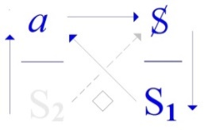
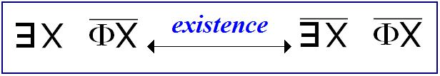

# Leçon 07 | 01 Juin 1972

<!-- source-docx: S19b Le savoir du psychanalyste.docx -->
<!-- seminar: s19b -->
<!-- lesson: 07 -->

<!-- id: s19b-07-0001 -->

Vous le savez, ici je dis ce que je pense.

<!-- id: s19b-07-0002 -->

C'est une position *féminine*, parce qu'en fin de compte, *penser* c'est très particulier.

<!-- id: s19b-07-0003 -->

Alors comme je vous écris de temps en temps, j'ai\...

<!-- id: s19b-07-0004 -->

> comme ça, pendant un petit voyage que je viens de faire \...inscrit *un certain nombre de propositions*, dont la 1^ère^ c'est qu'il faut reconnaître que le psychanalyste est mis, par *le discours*\...

<!-- id: s19b-07-0005 -->

> c'est un terme à moi \...par *le discours qui le conditionne*\...

<!-- id: s19b-07-0006 -->

> qu'on appelle, depuis moi, *le discours du psychanalyste* \...dans une position, disons difficile, Freud disait *impos­sible* : *unmöglich*, c'est peut-être un peu forcé, il parlait pour lui.

<!-- id: s19b-07-0007 -->

Bon ! D'autre part - 2^ème^ proposition : il sait \[*le psychanalyste*\]\...

<!-- id: s19b-07-0008 -->

> ceci d'expérience, ce qui veut dire que si peu qu'il ait pratiqué la psychanalyse,
>
> il en sait assez pour ce que je vais dire \...il sait dans tous les cas avoir une commune mesure avec ce que je dis.

<!-- id: s19b-07-0009 -->

C'est tout à fait indépendant du fait qu'il soit - de ce que je dis - informé, puisque ce que je dis aboutit\...

<!-- id: s19b-07-0010 -->

> comme je l'ai, il me semble, démontré cette année \...à situer *son savoir* \[S~2~\].

<!-- id: s19b-07-0011 -->

{width="1.1668547681539807in" height="0.7478040244969378in"} {width="1.5in" height="0.3388013998250219in"}

<!-- id: s19b-07-0012 -->

Ça, c'est l'histoire du *savoir* sur la *vérité* :

<!-- id: s19b-07-0013 -->

- ça, c'est la place de la *vérité* - pour ceux qui viennent pour la 1^ère^ fois.

<!-- id: s19b-07-0014 -->

- ça, celle du *semblant*,

<!-- id: s19b-07-0015 -->

- ça, celle de la *jouissance* \[*de parler*\],

<!-- id: s19b-07-0016 -->

- et ça, du *plus-de-jouir*, ce que j'écris en abrégé ainsi : « *+ de jouir* ». Pour la jouissance, nous mettrons un J.

<!-- id: s19b-07-0017 -->

C'est *son* *rapport au* *savoir* qui est difficile, non - bien sûr - à ce que je dis, puisque dans l'ensemble du *no man'land* psychanalytique on ne sait pas que je le dis.

<!-- id: s19b-07-0018 -->

Ça ne veut pas dire que de ce que je dis, on n'en sache rien, puisque ça sort de *l'expérience* \[*i.e. analytique*\].

<!-- id: s19b-07-0019 -->

Mais on a, de ce qu'on en sait, *horreur* !

<!-- id: s19b-07-0020 -->

Ce dont je peux dire, comme ça, vraiment simplement, que je les comprends\...

<!-- id: s19b-07-0021 -->

> « *je peux dire* », c'est à dire : « je peux dire, *si on y tient*\... » \...mais je les comprends : je me mets à leur place d'autant plus facilement que j'y suis.

<!-- id: s19b-07-0022 -->

Mais je le comprends d'autant plus facilement que comme tout le monde, j'entends ce que je dis.

<!-- id: s19b-07-0023 -->

Néanmoins ça ne m'arrive pas tous les jours, parce que ce n'est pas tous les jours que je parle.

<!-- id: s19b-07-0024 -->

En réalité je le comprends - c'est-à-dire que j'entends ce que je dis - les quelques jours, mettons un ou deux, qui précèdent immédiatement mon séminaire, parce qu'à ce moment-là je commence à vous écrire.

<!-- id: s19b-07-0025 -->

Les autres jours, la pensée de ceux à qui j'ai eu affaire, me submerge.

<!-- id: s19b-07-0026 -->

Il faut que je vous l'avoue, parce qu'à ce moment-là, l'impatience de ce que j'ai déjà appelé\...

<!-- id: s19b-07-0027 -->

> et donc que je peux encore appeler, parce que c'est rare, comme ça, que je revienne\... \...de ce que j'ai appelé « *mon échec* » dans *Scilicet*, me domine. Voilà\...

<!-- id: s19b-07-0028 -->

*Oui*\... *ils savent !*

<!-- id: s19b-07-0029 -->

Je rappelle ça parce que le titre de ce que j'ai à trai­ter ici c'est *Le savoir du psychanalyste*.

<!-- id: s19b-07-0030 -->

« *Du* » dans ce cas-là, ça évoque le « *le* », article défini en français, enfin c'est ce qu'on appelle « *défini »*.

<!-- id: s19b-07-0031 -->

Oui ! Pourquoi pas « *des psychanalystes* », après ce que je viens de vous dire ?

<!-- id: s19b-07-0032 -->

Ça serait plus confor­me à mon thème de cette année, c'est-à-dire « *y* *a d'l'un* ».

<!-- id: s19b-07-0033 -->

« *Y en a des* » qui se disent tels.

<!-- id: s19b-07-0034 -->

Je suis d'autant moins à discuter leur dire qu'il y en a pas d'autres.

<!-- id: s19b-07-0035 -->

Je dis « *du* », pourquoi ?

<!-- id: s19b-07-0036 -->

C'est *parce que c'est à eux que je parle*, malgré la présence d'*un très grand nombre de personnes qui ne sont pas psychanalystes*, ici.

<!-- id: s19b-07-0037 -->

Le psychana­lyste donc sait ce que je dis.

<!-- id: s19b-07-0038 -->

Ils le savent - je vous l'ai dit - d'expérience, si peu qu'ils en aient, même si ça se réduit à la « *didactique* » qui est l'exigence minimale pour que « *psychana­lystes* » ils se disent.

<!-- id: s19b-07-0039 -->

Car même si ce que j'ai appelé « *La passe* » est manquée, eh bien, ça se réduira à ça : qu'ils auront eu une « *psychanalyse didactique* », mais en fin de compte, ça suffit pour qu'ils sachent ce que je dis.

<!-- id: s19b-07-0040 -->

*La passe*\...

<!-- id: s19b-07-0041 -->

c'est toujours dans *Scilicet* que tout ça traîne, c'est plutôt l'endroit indiqué \[*Scilicet : « à savoir »*\] \...quand je dis que « *la passe* » *est manquée*, ça ne veut pas dire qu'ils ne se sont pas offerts à l'expérience de *la passe*.

<!-- id: s19b-07-0042 -->

Comme je l'ai souvent marqué, cette expérience de *« la passe »* est simplement ce que je propose à ceux qui sont assez dévoués pour s'y exposer, à de seules fins d'informa­tion sur un point très délicat, et qui consiste à\... en somme ce qui s'affirme de la façon la plus sûre c'est que : c'est tout à fait *(a)normal - objet(a) normal -* que quel­qu'un qui fait une psychanalyse veuille être psychanalyste.

<!-- id: s19b-07-0043 -->

Il faut vraiment une sorte d'aberration qui vaut, qui valait la peine d'être offerte à tout ce qu'on pouvait recueillir de témoignage.

<!-- id: s19b-07-0044 -->

C'est bien en ça que j'ai institué provisoirement cet essai de recueil pour savoir pourquoi *quelqu'un qui sait ce que c'est que la psychanalyse* par sa didactique, *peut encore vouloir être analyste*.

<!-- id: s19b-07-0045 -->

Alors je n'en dirai pas plus sur ce qu'il en est de leur position, sim­plement parce que j'ai choisi cette année *Le savoir du psychanalyste* comme étant ce que je proposais pour mon retour à Sainte Anne.

<!-- id: s19b-07-0046 -->

C'est pas pour ménager du tout les psychanalystes, ils n'ont pas besoin de moi pour avoir *le vertige de leur position*, mais je ne l'augmenterai pas à le leur dire.

<!-- id: s19b-07-0047 -->

Ce qui pourrait être fait\...

<!-- id: s19b-07-0048 -->

> et je le ferai peut-être à un autre moment \...ce qui pourrait être fait d'une manière piquante dans une certaine réfé­rence que je n'appellerai « *historique* » qu'entre guillemets\...

<!-- id: s19b-07-0049 -->

> enfin, vous verrez ça quand ça viendra\... si je subsiste \...pour ceux qui sont des fins finauds je leur parle­rai du mot « *tentation* ».

<!-- id: s19b-07-0050 -->

Là je ne parle que du *savoir,* et je remarque qu'il ne s'agit pas de la « *vérité sur le savoir* », mais du « *savoir* *sur la vérité* », et que ceci « *le savoir sur la vérité »*, ça s'articule de la pointe de ce que j'avance cette année sur le « *Y a d'l'Un !* », « *Y a d'l'Un !* » et rien de plus : c'est *un Un très particulier* celui qui sépare le **1** de **2**, *et que c'est un abîme*.

<!-- id: s19b-07-0051 -->

Je répète : *la vérité* - je l'ai déjà dit - *ça ne peut que se mi-dire*.

<!-- id: s19b-07-0052 -->

Quand *le temps de battement* sera passé, qui fera que je peux en respecter *l'alternance*, je parlerai de l'autre face : du « *mi-vrai* ».

<!-- id: s19b-07-0053 -->

Il faut toujours séparer le *bon grain* et la « *­mi-vraie* » !

<!-- id: s19b-07-0054 -->

Comme je vous l'ai dit tout à l'heure peut-être, je reviens d'Italie où je n'ai jamais eu qu'à me louer de l'accueil, même de mes collègues psychana­lystes !

<!-- id: s19b-07-0055 -->

Grâce à l'un d'entre eux, j'en ai rencontré un 3^ème^ qui est tout à fait « à la page », enfin à la mienne, bien entendu. \[*Rires*\]

<!-- id: s19b-07-0056 -->

Il *opère* avec Dedekind, et il a trouvé ça tout à fait sans moi.

<!-- id: s19b-07-0057 -->

*Je peux pas dire*, à la date où il a commencé de s'y mettre, *que je n'y étais pas déjà*, mais enfin c'est un fait que j'en ai parlé plus tard que lui, puisque je n'en parle que maintenant, et que lui avait déjà écrit là-dessus tout un petit ouvrage.

<!-- id: s19b-07-0058 -->

Il s'est aperçu de la valeur en somme des éléments mathématiques, pour faire émerger quelque chose qui vraiment, notre expérience d'analyste, la concerne.

<!-- id: s19b-07-0059 -->

Eh ben, comme il est tout à fait *bien vu,* il a tout fait pour ça, il a réussi à se faire entendre dans des endroits *très bien placés* de ce qu'on appelle l'I.P.A. - *l'Institution Psychanalytique Avouée*, je traduirais - donc il a réussi à se faire entendre.

<!-- id: s19b-07-0060 -->

Mais ce qu'il y a de très curieux, c'est qu'on ne le publie pas !

<!-- id: s19b-07-0061 -->

On ne le publie pas en disant : « *Vous comprenez, personne ne comprendra* ! ».

<!-- id: s19b-07-0062 -->

Je dois dire que je suis surpris parce que, en somme, du « Lacan »\...

<!-- id: s19b-07-0063 -->

> entre guillemets bien sûr, enfin des choses de la veine que je suis censé représenter
>
> auprès des incompé­tents d'une certaine linguistique, \...on est plutôt pressé d'en bourrer l'*International journal*.

<!-- id: s19b-07-0064 -->

Plus il y a des trucs dans la poubelle, naturellement, moins ça se discerne !

<!-- id: s19b-07-0065 -->

Alors pourquoi diable, est-ce que dans ce cas on a cru devoir faire obstacle, puis­que pour moi, il me semble que c'est un obstacle, et que le fait qu'on dise que les lecteurs ne comprendront pas, c'est secondaire : il n'est pas nécessaire que tous les articles de l'*International journal* soient compris.

<!-- id: s19b-07-0066 -->

Il y a donc quelque chose qui là-dedans ne plaît pas.

<!-- id: s19b-07-0067 -->

Mais il est évident que, comme celui que je viens, non pas de nom­mer\...

<!-- id: s19b-07-0068 -->

> parce que vous ignorez profondément son nom, il n'a encore rien réussi à pu­blier \...est parfaitement repérable, je ne désespère pas que, à la suite de ce qui fil­trera de mes propos aujourd'hui\...

<!-- id: s19b-07-0069 -->

> et surtout si on sait que je ne l'ai pas nommé \...on le publiera \[*Rires*\].

<!-- id: s19b-07-0070 -->

Vraiment, ça a l'air de lui tenir assez à cœur pour que je l'aide à ça volontiers.

<!-- id: s19b-07-0071 -->

Si ça ne vient pas, je vous en parlerai un peu plus !

<!-- id: s19b-07-0072 -->

Revenons au temps.

<!-- id: s19b-07-0073 -->

Le psychanalyste a donc un rapport - *à ce qu'il sait* - complexe. Il le renie, il le « *réprime* »\...

<!-- id: s19b-07-0074 -->

> pour employer le terme dont en anglais se traduit le refoulement*, la Verdrängung* \...et même il lui arrive de *n'en rien vouloir savoir*.

<!-- id: s19b-07-0075 -->

Et pourquoi pas ?

<!-- id: s19b-07-0076 -->

Qui est-ce que ça pourrait épater ?

<!-- id: s19b-07-0077 -->

La psychanalyse - me direz-vous - alors quoi ?

<!-- id: s19b-07-0078 -->

J'entends d'ici le *bla-bla-bla* de quiconque n'a pas de la psychanalyse la moindre idée.

<!-- id: s19b-07-0079 -->

Je réponds à ce qui peut surgir de ce *floor*, comme on dit, je réponds : est-ce *le savoir* qui guérit\...

<!-- id: s19b-07-0080 -->

> que ce soit celui du sujet, ou celui \[*du sujet*\] *supposé dans le transfert* \...ou bien est-ce *le transfert,* tel qu'il se produit dans une analyse donnée ?

<!-- id: s19b-07-0081 -->

Pourquoi *le savoir*\...

<!-- id: s19b-07-0082 -->

> celui dont je dis qu'a dimension tout psychana­lyste \[*sujet supposé savoir*\] \...pourquoi *le savoir* serait-il, comme je disais tout à l'heure, « *avoué* » ?

<!-- id: s19b-07-0083 -->

C'est de cette question que Freud a pris en somme la *Verwerfung*, il l'appelle : « *un jugement qui dans le choix rejette* ».

<!-- id: s19b-07-0084 -->

Il ajoute : « *qui condamne* », mais je le condense\...

<!-- id: s19b-07-0085 -->

Ce n'est pas parce que la *Verwerfung* rend fou un sujet, quand elle se produit dans l'incons­cient, qu'elle ne règne pas\...

<!-- id: s19b-07-0086 -->

> la même, et du même nom d'où Freud l'emprunte \...qu'elle ne règne pas sur le monde comme un pouvoir rationnellement justifié.

<!-- id: s19b-07-0087 -->

« *Des psychanalystes* » \...

<!-- id: s19b-07-0088 -->

> vous allez le voir, à la différence avec « *le* » \... « *des psychanalystes* » ça se préfère, ça se préfère « *soi* », voyez-vous !

<!-- id: s19b-07-0089 -->

C'est pas les seuls, il y a une tradition là-dessus : la tradition médicale.

<!-- id: s19b-07-0090 -->

Pour *se préférer*, on n'a jamais fait mieux, sauf les saints - les saints (*s.a.i.n.t.s*)\...

<!-- id: s19b-07-0091 -->

> Oui, on vous parle tel­lement des autres \[Rires\] que je précise, parce que les autres\... enfin, passons \...les saints (*s.a.i.n.t.s*) ils se préfèrent eux-aussi, ils ne pensent même qu'à ça, ils se consument de trouver la meilleure façon de se préférer, alors qu'il y en a de si simples, comme le montrent les « *méde-saints* », eux aussi \[*Rires*\].

<!-- id: s19b-07-0092 -->

Enfin, ceux-là ne sont pas des saints. Ça, ça va de soi\...

<!-- id: s19b-07-0093 -->

> Il y a peu de choses aussi abjectes à feuilleter, que l'histoire de la médecine :
>
> ça peut-être conseillé comme vomitif \[*Rires*\] ou comme purgatif, ça fait les deux.
>
> Pour savoir que *le savoir* n'a rien à faire avec *la vérité*, il n'y a vraiment rien de plus convain­cant.
>
> On peut même pas dire que ça va jusqu'à faire du médecin une sorte de pro­vocateur.
>
> Ça n'empêche pas que les médecins se soient arrangés\...
>
> et pour des raisons qui tenaient à ce que leur plate-forme avec *le discours de la science* devenait plus exiguë
>
> \...que les médecins se soient arrangés à mettre la psychanalyse à leur pas.
>
> Et ça, ils s'y connaissaient !
>
> Ceci naturellement d'autant plus que le psychanalyste étant fort embarrassé\...
>
> comme je suis parti là-dessus
>
> \...fort embarrassé de *sa position*, il était d'autant plus disposé à recevoir les conseils de l'expérience.

<!-- id: s19b-07-0094 -->

Je tiens beaucoup à marquer ce point d'histoire qui est dans mon affaire\...

<!-- id: s19b-07-0095 -->

> pour autant qu'elle ait de l'importance\... \...tout à fait un point-clé : grâce à cette conjuration\...

<!-- id: s19b-07-0096 -->

> contre laquelle est dirigé un article *exprès* de Freud sur la *Laïernanalyse* [^14] \...grâce à cette conjuration qui a pu se produire peu après la guerre, j'avais déjà perdu la partie avant de l'avoir engagée.

<!-- id: s19b-07-0097 -->

Simplement je voudrais qu'on me croie là-dessus, parce que - pour­quoi, je le dirai ? - si ce soir je témoigne\...

<!-- id: s19b-07-0098 -->

> et je ne le fais pas par hasard à Sainte Anne puisque je vous dis que c'est là que je dis ce que je pense \...si je déclare que *c'est très précisément à ce titre* *de savoir très bien l'avoir* - à l'époque - *perdue*, que cette partie je l'ai engagée.

<!-- id: s19b-07-0099 -->

Ça n'a rien d'héroïque vous savez !

<!-- id: s19b-07-0100 -->

Il y a un tas de parties qui s'enga­gent dans ces conditions.

<!-- id: s19b-07-0101 -->

C'est même un des fondements de la « *condition humaine* », comme dit l'autre \[Malraux\...\], et ça réussit pas plus mal que n'importe quelle autre entre­prise. La preuve, hein !

<!-- id: s19b-07-0102 -->

Le seul ennui - mais il n'est que pour moi - c'est que ça ne vous laisse pas très libre, je dis ça en passant pour la personne qui m'a\...

<!-- id: s19b-07-0103 -->

> il y a je ne sais pas quoi, le 2^ème^ séminaire avant \...qui m'a interrogé sur le fait si je croyais ou non à la liberté.

<!-- id: s19b-07-0104 -->

Une autre déclaration que je veux faire\...

<!-- id: s19b-07-0105 -->

> et qui a bien son importance, puisque après tout, je ne sais pas, c'est mon penchant ce soir\... \...*une autre déclaration*\...

<!-- id: s19b-07-0106 -->

> qui celle-là alors est tout à fait prouvée, là je vous demande de me croire, que je m'étais très bien aperçu que la partie était perdue\...

<!-- id: s19b-07-0107 -->

> après tout je n'étais pas si malin, j'ai peut-être cru qu'il fallait foncer
>
> et que je foutrais en l'air l'*Internationale Psychanalytique Avouée* \...et là personne ne peut dire le contraire de ce que je vais dire : *c'est que je n'ai jamais lâché aucune des personnes que je savais devoir me quitter, avant qu'elles s'en aillent elles-mêmes*.

<!-- id: s19b-07-0108 -->

Et c'est vrai aussi du moment où la partie était en somme - pour la France - perdue, qui est celle à laquelle j'ai fait allusion tout à l'heure : ce petit *brouhaha* dans une conjuration médecins-­psychanalystes d'où est sorti en 53 le début de mon enseignement.

<!-- id: s19b-07-0109 -->

Les jours où l'idée de devoir poursuivre le dit enseignement ne m'habite pas\...

<!-- id: s19b-07-0110 -->

> c'est-à- dire un certain nombre \...il est évident que j'ai, comme tous les imbéciles, l'idée de ce que ça aurait pu être pour « *la Psychanalyse Française » ( ! )* si j'avais pu enseigner là où, pour la raison que je viens de dire, je n'étais nullement disposé à lâcher quiconque.

<!-- id: s19b-07-0111 -->

Je veux dire que *si scandaleuses que fussent mes propositions sur* « *Fonction et Champ*\... *et patati et patata*\... *de la parole et du langage »*, j'étais disposé à couvrir le sillon pendant des années pour les gens même les plus durs de la feuil­le, et au point où nous en sommes, personne n'y aurait perdu parmi les psychana­lystes.

<!-- id: s19b-07-0112 -->

Je vous ai dit que j'avais fait un petit tour en Italie.

<!-- id: s19b-07-0113 -->

Dans ces cas-là, je vais aussi - pourquoi pas ? - parce que il y a beaucoup de gens qui m'aiment\...

<!-- id: s19b-07-0114 -->

> À propos : il y a quelqu'un qui m'a envoyé un verre à dents !
>
> Je voudrais savoir qui c'est, pour la remercier cette personne.
>
> Il y a une personne qui m'a envoyé « *un verre à dents »* !
>
> Je dis ça pour ceux qui étaient là au Panthéon la dernière fois.
>
> C'est une personne que je remercie d'autant que ce n'est pas un verre à dents.
>
> C'est un merveilleux petit verre rouge, long et galbé, dans lequel je mettrai une rose,
>
> qui que ce soit qui me l'ait envoyé. Mais je n'en ai reçu qu'un, ça je dois le dire. Enfin pas­sons\... \...il y a des personnes qui m'aiment un peu dans tous les coins, mêmes dans les couloirs du Vatican.

<!-- id: s19b-07-0115 -->

Pourquoi pas, hein ? Il y a des gens très bien.

<!-- id: s19b-07-0116 -->

Il n'y a que là\...

<!-- id: s19b-07-0117 -->

ceci pour la personne qui m'interroge sur la liberté \...il n'y a qu'au Vatican que je connaisse des libres-penseurs.

<!-- id: s19b-07-0118 -->

Moi je suis pas un libre-penseur, je suis forcé de tenir à ce que je dis, mais là-bas : quelle aisance ! \[*Rires*\]

<!-- id: s19b-07-0119 -->

Ah on comprend que la Révolution Française ait été véhiculée par les abbés.

<!-- id: s19b-07-0120 -->

Si vous saviez quelle est leur liberté, mes bons amis, vous auriez froid dans le dos.

<!-- id: s19b-07-0121 -->

Moi j'essaie de les ramener au dur, il n'y a rien à faire, ils débordent : la psychanalyse, pour eux, est dépassée !

<!-- id: s19b-07-0122 -->

Vous voyez à quoi ça sert la *libre-pensée *: ils voient clair\...

<!-- id: s19b-07-0123 -->

C'était pourtant un bon métier, *hein* \[*Rires*\] ?

<!-- id: s19b-07-0124 -->

Ça avait des bons côtés.

<!-- id: s19b-07-0125 -->

Quand ils disent *que c'est dépassé, ils savent ce qu'ils disent,* *ils disent* : « *c'est foutu, parce que quand même on doit faire un peu mieux !* ».

<!-- id: s19b-07-0126 -->

Je dis ça quand même pour avertir les personnes\...

<!-- id: s19b-07-0127 -->

> les personnes qui sont « *dans le coup »*, et particulièrement bien sûr, celles qui me suivent \...qu'il faut *y regarder à deux fois avant d'y engager ses descendants*, parce que c'est très possible qu'au train où vont les choses, ça tombe tout d'un coup sec, comme ça.

<!-- id: s19b-07-0128 -->

Enfin c'est uniquement pour ceux qui ont à y en­gager leur descendance, je leur conseille la prudence.

<!-- id: s19b-07-0129 -->

J'ai déjà parlé, comme ça, de ce qui se passe dans la psychanalyse\...

<!-- id: s19b-07-0130 -->

> il faut quand même bien spécifier certains points que j'ai déjà abordés,
>
> par conséquent que je crois pouvoir traiter brièvement au point où nous en sommes \...c'est que *c'est le seul* *discours*\...

<!-- id: s19b-07-0131 -->

> et rendons-lui hommage \...*c'est le seul* *discours*\...

<!-- id: s19b-07-0132 -->

> au sens où j'ai catalogué 4 *discours,* \...*c'est le seul discours qui soit tel que la canaillerie y aboutisse nécessairement à la bêtise*.

<!-- id: s19b-07-0133 -->

Si on savait tout de suite que quelqu'un qui vient vous demander une psychanalyse didactique est *une canaille*, mais on lui dirait : « *pas de psychanalyse pour vous, mon cher ! Vous en deviendrez bête comme chou* ». Mais on ne le sait pas !

<!-- id: s19b-07-0134 -->

C'est justement soigneusement dissimulé.

<!-- id: s19b-07-0135 -->

On le sait quand même au bout d'un certain temps dans la psychanalyse, la canaillerie étant toujours, non pas héréditaire, c'est pas d'hérédité qu'il s'agit, c'est du *désir*, *désir de l'Autre* d'où l'intéressé a surgi.

<!-- id: s19b-07-0136 -->

Je parle du *désir* : c'est pas toujours le *désir* de ses parents, ça peut être celui de ses grands-parents, mais *si le désir dont il est né est le désir d'une canaille, il est une canaille immanquablement*.

<!-- id: s19b-07-0137 -->

Je n'ai jamais vu d'exception, et c'est même pour ça *que j'ai toujours été si tendre* pour les personnes dont je savais qu'elles devaient me quitter, au moins pour les cas où c'était moi qui les avais psychanalysées, parce que je savais bien qu'elles étaient devenues tout à fait *« bêêêtes »*.

<!-- id: s19b-07-0138 -->

Je peux pas dire que je l'avais fait exprès : comme je vous l'ai dit, c'est nécessaire.

<!-- id: s19b-07-0139 -->

C'est nécessaire quand une psychanalyse est poussée jusqu'au bout, ce qui est la moindre des choses pour la psychanalyse didactique.

<!-- id: s19b-07-0140 -->

Si la psychanalyse n'est pas didactique, alors c'est une question de tact : vous devez laisser au type assez de canaillerie pour qu'il se démerde désormais convenablement.

<!-- id: s19b-07-0141 -->

C'est proprement thérapeutique, vous devez le laisser surnager.

<!-- id: s19b-07-0142 -->

Mais pour la psychanalyse *didactique*, vous pouvez pas faire ça, parce que Dieu sait ce que ça donnerait.

<!-- id: s19b-07-0143 -->

Supposez un psychanalyste qui reste une canaille : ça hante la pensée de tout le monde !

<!-- id: s19b-07-0144 -->

Soyez tranquille, la psychanalyse, contrairement à ce qu'on croit, est toujours vraiment *didactique*, même quand c'est quelqu'un de *bête* qui la pratique, et je dirai même : d'autant plus !

<!-- id: s19b-07-0145 -->

Enfin tout ce qu'on risque c'est d'avoir *des psycha­nalystes bêtes*.

<!-- id: s19b-07-0146 -->

Mais c'est, comme je viens de vous le dire, en fin de compte sans inconvénient, parce que quand même, *l'objet(a)* à la place du *semblant*, c'est une position qui peut se tenir.

<!-- id: s19b-07-0147 -->

Voilà ! On peut être *bête* d'origine aussi. C'est très im­portant à distinguer.

<!-- id: s19b-07-0148 -->

Bon ! Alors je n'ai rien trouvé de mieux, quant à moi, je n'ai rien trouvé de mieux que ce que j'appelle *le mathème* pour approcher quelque chose concernant *le savoir sur la vérité*, puisque c'est là en somme, qu'on a réussi à lui donner une portée fonctionnelle.

<!-- id: s19b-07-0149 -->

C'est beaucoup mieux quand c'est Pierce qui s'en occupe, il met les fonctions 0 et 1 qui sont les deux *valeurs de vérité*.

<!-- id: s19b-07-0150 -->

Il ne s'imagine pas, par contre, qu'on peut écrire V ou F pour désigner *la vérité* et *le faux*.

<!-- id: s19b-07-0151 -->

J'ai déjà indiqué ça,comme ça en quelques phrases, j'ai déjà indiqué ça au Panthéon, c'est à savoir qu'autour du « *Y'a d'l'Un »*, il y a deux étapes :

<!-- id: s19b-07-0152 -->

- ­le « *Parménide »,*

<!-- id: s19b-07-0153 -->

- et puis ensuite il a fallu arriver à la *théorie des ensembles*, pour que la question d'un tel *savoir*,

<!-- id: s19b-07-0154 -->

> qui prend *la vérité* comme simple fonction et qui est loin de s'en contenter :
>
> qui comporte un *réel* qui avec *la vérité* n'a rien à faire : ce sont les mathématiques.

<!-- id: s19b-07-0155 -->

Néanmoins pendant des siècles il faut croire que la mathématique se passait là-dessus de toute question, puisque c'est sur le tard et par l'intermé­diaire d'une interrogation *logique*, qu'elle a fait faire un pas à cette question qui est centrale pour ce qui est de *la vérité*, à savoir : *comment et pourquoi « Y a d'l'Un »*\...

<!-- id: s19b-07-0156 -->

> vous m'excuserez, je suis pas le seul !

<!-- id: s19b-07-0157 -->

\...« *Y a d'l'Un* » : autour de cet *Un* tourne la question de *l'existence*.

<!-- id: s19b-07-0158 -->

J'ai déjà fait là-dessus des remarques, à savoir

<!-- id: s19b-07-0159 -->

- que l'*existence* n'a jamais été abordée comme telle avant un certain âge,

<!-- id: s19b-07-0160 -->

- et qu'on a mis beaucoup de temps à l'extraire de l'*essence*.

<!-- id: s19b-07-0161 -->

J'ai parlé du fait qu'il n'y ait pas en grec, très proprement quelque chose de courant qui veuille dire « *exister* », non pas que j'ignorasse ἐξίστημι \[existémi\], ἐξίσταμαι \[existamai\][^15], mais plutôt que je constatasse qu'aucun philosophe ne s'en était jamais servi.

<!-- id: s19b-07-0162 -->

Pourtant c'est là que commence quelque chose qui puisse nous intéresser : il s'agit de savoir *ce qui existe*.

<!-- id: s19b-07-0163 -->

Il n'existe que de l'*Un*\...

<!-- id: s19b-07-0164 -->

> avec ce qui se presse autour de nous, je suis forcé aussi également de me presser \...*la théorie des ensembles*, c'est l'interrogation : pourquoi «*Y a d'l'Un* » ?

<!-- id: s19b-07-0165 -->

L'*Un* ça ne court pas les rues, quoi que vous en pensiez, y compris cette certitude tout à fait illusoire\...

<!-- id: s19b-07-0166 -->

> et illusoire depuis très longtemps, ça n'empêche pas qu'on y tienne \...que vous en êtes *Un*, vous aussi.

<!-- id: s19b-07-0167 -->

Vous en êtes *Un*, il suffit que vous essayiez même de lever le petit doigt pour vous apercevoir que non seu­lement vous n'êtes pas *Un*, mais que vous êtes, hélas, innombrables, *innombrables* chacun pour vous.

<!-- id: s19b-07-0168 -->

*« Innombrables »\...* jusqu'à ce qu'on vous ait appris\...

<!-- id: s19b-07-0169 -->

> ce qui peut être un des bons résultats de l'affluent psychanalytique \...que vous êtes selon les cas : tout à fait *finis*

<!-- id: s19b-07-0170 -->

> ça, je vous le dis très vite parce que je ne sais pas combien de temps je vais pouvoir continuer \...tout à fait *finis *:

<!-- id: s19b-07-0171 -->

- pour ce qui est des hommes, ça c'est clair : *finis*, *finis*, *finis* ! \[« *ensemble* » *fini,* *qui a une limite*\]

<!-- id: s19b-07-0172 -->

- pour ce qui est des femmes : *dénombrables *! \[« *ensemble* » *infini, sans limite, mais dénombrable au une par une*\]

<!-- id: s19b-07-0173 -->

Je vais tâcher de vous expliquer brièvement quelque chose qui commence à vous frayer là-dessus la voie, puisque bien entendu, ce n'est pas des choses qui sautent aux yeux, surtout quand on ne sait pas ce que ça veut dire « *fini* » et « *dénombrable* » !

<!-- id: s19b-07-0174 -->

Mais si vous suivez un peu mes indications, vous lirez n'importe quoi, parce que ça pullule les ouvrages maintenant sur *la théorie des ensembles*, même pour aller contre.

<!-- id: s19b-07-0175 -->

Il y a quelqu'un de très gentil, que j'espère bien voir tout à l'heure, pour m'excuser de ne pas lui avoir apporté ce soir un livre que j'ai tout fait pour trouver et qui est épuisé, qu'il m'a passé la dernière fois, et qui s'appelle « *Cantor a tort »* [^16]. C'est un très bon livre.

<!-- id: s19b-07-0176 -->

C'est évident que *Cantor a tort* d'un certain point de vue, mais il a incontestablement raison pour le seul fait *que ce qu'il a avancé a eu une* *innombrable descendance* *dans la mathématique*, et que tout ce dont il s'agit, c'est ça, c'est que ce qui fait avancer la mathématique, ça suffit à ce que ça se défende.

<!-- id: s19b-07-0177 -->

Même si *Cantor a tort* du point de vue de ceux qui décrè­tent - on ne sait pourquoi - que *le nombre* ils savent ce que c'est : toute l'histoire des mathématiques bien avant Cantor a démontré qu'il n'y a pas de lieu où il soit démontrable, qu'il n'y a pas de lieu où il soit plus vrai que : « *l'impossible c'est le réel* ».

<!-- id: s19b-07-0178 -->

Ça a commencé aux Pythagoriciens à qui un jour a été asséné ce fait patent\...

<!-- id: s19b-07-0179 -->

> qu'ils devaient bien savoir, parce qu'il ne faut pas non plus les prendre pour des bébés \...que √2 n'est pas commensurable.

<!-- id: s19b-07-0180 -->

C'est repris par des philo­sophes, et ce n'est pas parce que ça nous est parvenu par le « *Théétète »*, qu'il faut croire que les mathématiciens de l'époque n'étaient pas à la hauteur et incapables de répondre, que justement de s'apercevoir que de ce que l'incommensurable exis­tait, on commençait à se poser la question de ce que c'était que *le nombre*.

<!-- id: s19b-07-0181 -->

Je ne vais pas vous faire toute cette histoire !

<!-- id: s19b-07-0182 -->

Il y a une certaine affaire de √-1 , qu'on a appelé depuis, on ne sait pourquoi, « *imaginaire »*.

<!-- id: s19b-07-0183 -->

Il n'y a rien de moins *imaginaire* que √-1 comme la suite l'a prouvé, puisque c'est de là qu'est sorti ce qu'on peut appeler « *le nombre complexe »*, c'est-à-dire une choses des plus utiles et des plus fécondes qui aient été crées en mathématiques.

<!-- id: s19b-07-0184 -->

Bref, plus se fait d'objections à ce qu'il en est de cette entrée par l'*Un*, c'est-à-dire par *le nombre entier*, plus il se démontre que c'est justement de l'*impossible* qu'en mathématique s'engendre le *Réel*.

<!-- id: s19b-07-0185 -->

C'est justement de ce que, par Cantor, ait pu être engendré quelque chose\...

<!-- id: s19b-07-0186 -->

> qui n'est rien de moins que toute l'œuvre de Russell,
>
> voire infiniment d'autres points qui ont été extrêmement féconds dans la *théorie des fonctions* \...il est certain que, au regard du *Réel*, c'est Cantor qui est dans le droit fil de ce dont il s'agit.

<!-- id: s19b-07-0187 -->

Si je vous suggère - je parle aux psychanalystes - de vous mettre un peu à cette page, c'est justement pour la raison qu'il y a quelque chose à en tirer dans ce qui est, bien sûr, votre péché mignon.

<!-- id: s19b-07-0188 -->

Je dis ça parce que vous avez affaire à des êtres *qui pensent*\...

<!-- id: s19b-07-0189 -->

> qui pensent bien sûr, parce qu'ils ne peuvent pas faire autrement \...*qui pensent comme* Télémaque, comme tout au moins le Téléma­que que décrit Paul-Jean Toulet[^17] : « *ils pensent à la dépense* ».

<!-- id: s19b-07-0190 -->

Eh bien ce dont il s'agit c'est de savoir si vous analystes, et ceux que vous conduisez, *dépensent* ou non en vain leur temps.

<!-- id: s19b-07-0191 -->

Il est clair qu'à cet égard, le *pathos* de pensée qui peut pour vous résulter d'une courte initiation\...

<!-- id: s19b-07-0192 -->

> encore qu'il faut pas non plus qu'elle soit trop brève \...à *la théorie des ensembles*, est quelque chose bien de nature à vous faire réfléchir *sur des notions comme l'existence*, par exemple.

<!-- id: s19b-07-0193 -->

Il est clair qu'il n'y a qu'à partir d'une certaine réflexion sur les mathématiques, que *l'existence* a pris son sens.

<!-- id: s19b-07-0194 -->

Tout ce qu'on a pu dire avant, par une sorte de pressentiment\...

<!-- id: s19b-07-0195 -->

> reli­gieux notamment, à savoir : que Dieu existe \...n'a strictement de sens qu'en ceci : qu'à *mettre l'accent*\...

<!-- id: s19b-07-0196 -->

> je dois y *mettre l'accent* parce qu'il y a des gens qui me prennent pour un « *maître à penser* » \...sur ceci : *que vous y croyiez ou pas*\...

<!-- id: s19b-07-0197 -->

> gardez ça dans votre petit creux d'oreille :
>
> moi je n'y crois pas, mais on s'en fout,
>
> ceux qui y croient c'est la même chose \...*que vous y croyiez ou pas* à Dieu, dites-­vous bien qu'*avec Dieu* dans tous les cas, *qu'on y croit ou qu'on n'y croit pas*, *il faut compter*.

<!-- id: s19b-07-0198 -->

C'est absolument inévitable.

<!-- id: s19b-07-0199 -->

C'est pour ça que je réécris au tableau ce autour de quoi j'ai essayé de faire tourner quelque chose sur ce qu'il en est du prétendu *rapport sexuel*.

<!-- id: s19b-07-0200 -->

{width="1.7675437445319335in" height="0.9592771216097987in"}

<!-- id: s19b-07-0201 -->

Je recommence : *il existe un x tel que* ce qu'il y a de sujet déter­minable par une fonction qui est ce qui domine *le rapport sexuel*\...

<!-- id: s19b-07-0202 -->

> à savoir *la fonc­tion phallique* - c'est pour ça que je l'écris ! \...*il existe un x qui se détermine de ceci : qu'il ait dit non à la fonction* \[:§\].

<!-- id: s19b-07-0203 -->

Vous voyez que de là d'où je parle, vous voyez d'ores et déjà *la question de l'existence* liée à quelque chose dont nous ne pouvons pas méconnaître que ce soit *un dire*.

<!-- id: s19b-07-0204 -->

C'est un *dire non*, je dirai même plus : c'est un *dire que non*.

<!-- id: s19b-07-0205 -->

Ceci est *capital*.

<!-- id: s19b-07-0206 -->

Ceci est justement ce qui nous indique le point juste où doit être prise pour notre formation, formation d'analyste, ce qu'énonce la *théorie des ensembles* : *il y en a Un, « au-moins-Un » qui « dit que non ».*

<!-- id: s19b-07-0207 -->

C'est *un repère* !

<!-- id: s19b-07-0208 -->

C'est *un repère*, bien entendu qui ne tient pas même un instant, qui n'est d'aucune façon enseignant ni enseignable, si nous ne le conjoignons pas à cette inscription quantificatrice des 4 autres termes, à savoir : *le quanteur dit* *universel* : ; !, c'est-à-dire le point d'où il peut être dit\...

<!-- id: s19b-07-0209 -->

comme cela s'énonce dans la doctrine freudienne, \...*qu'il n'y a de désir, de libido*\...

<!-- id: s19b-07-0210 -->

c'est la même chose \...*que masculine*.

<!-- id: s19b-07-0211 -->

C'est à la vérité une erreur.

<!-- id: s19b-07-0212 -->

Il n'en reste pas moins que c'est une erreur qui a tout son prix de *repère*.

<!-- id: s19b-07-0213 -->

Que les trois autres formules, à savoir :

<!-- id: s19b-07-0214 -->

- *il n'existe pas cet* X \[/ §\], pour dire qu'il n'est pas vrai que *la fonction phallique* soit ce qui domine *le rapport sexuel*,

<!-- id: s19b-07-0215 -->

- et que d'autre part nous devions - je ne dis pas *nous puissions* écrire - qu'à un niveau *complémentaire* de ces 3 termes nous devions écrire *la fonc­tion du « pas-tout »* \[.\] *comme étant* *essentielle à un certain type de rapport à la fonction phallique* en tant qu'elle fonde le rapport sexuel, c'est là évidemment ce qui fait de ces quatre inscriptions un *ensemble*.

<!-- id: s19b-07-0216 -->

Sans cet ensemble, il est impossible de s'orienter correctement dans ce qu'il en est de la pratique de l'analyse pour autant qu'elle a affaire avec ce quelque chose qui couramment se définit comme étant

<!-- id: s19b-07-0217 -->

- « *l'homme* » d'une part,

<!-- id: s19b-07-0218 -->

- et d'autre part ce *correspondant* généralement qualifié de « *femme* », qui le laisse seul.

<!-- id: s19b-07-0219 -->

S'il le laisse seul, c'est pas la faute du *correspondant*, c'est la faute de « *l'homme* ».

<!-- id: s19b-07-0220 -->

Mais faute ou pas faute\...

<!-- id: s19b-07-0221 -->

> c'est une affaire que nous n'avons pas à trancher immé­diatement, je le signale au passage \...ce qu'il importe pour l'instant c'est d'interro­ger le sens de ce que peuvent avoir à faire ces 4 fonctions\...

<!-- id: s19b-07-0222 -->

> qui ne sont que deux :

<!-- id: s19b-07-0223 -->

- l'une *négation de la fonction*,

<!-- id: s19b-07-0224 -->

- l'autre : *fonction opposée* \...*ces* 4 fonctions, pour autant que les diversifie leur accouplement « *quanté* ».

<!-- id: s19b-07-0225 -->

Il est clair que ce que veut dire le : §, c'est-à-dire *négation de* !, est quelque chose qui depuis longtemps\...

<!-- id: s19b-07-0226 -->

> et depuis assez à l'origine pour qu'on puisse dire
>
> qu'on est absolument confondu que Freud l'ait ignoré \...:*négation de* ! à savoir cet *au-moins-Un*, cet *Un tout seul qui se détermine d'être l'effet du* *dire que non à la fonction phallique*, c'est très précisément le point sous lequel il faut que nous mettions tout ce qui s'est dit jusqu'à présent de l'*œdipe*, pour que l'*œdipe* soit autre chose qu'un mythe.

<!-- id: s19b-07-0227 -->

Et ceci a d'autant plus d'intérêt qu'il ne s'agit pas là de genèse, ni d'histoire, ni de quoi que ce soit qui ressemble, comme il semble à certains mo­ments dans Freud que ç'ait pu être énoncé par lui, à savoir un événement.

<!-- id: s19b-07-0228 -->

Il ne sau­rait s'agir d'*événement* à ce qui nous est représenté comme étant *avant* toute his­toire.

<!-- id: s19b-07-0229 -->

Il n'y a d'événement que ce qui se connote dans quelque chose qui s'énonce.

<!-- id: s19b-07-0230 -->

Il s'agit de *structure*.

<!-- id: s19b-07-0231 -->

Qu'on puisse parler de « *Tout-homme* » comme étant sujet à la cas­tration \[; !\], c'est ce pourquoi, de la façon la plus patente, le mythe d'Œdipe est fait.

<!-- id: s19b-07-0232 -->

Est-il nécessaire de se mettre à retourner aux fonctions « *mythé­me-atiques* » pour énoncer un fait logique qui est celui-ci : c'est que s'il est vrai que *l'inconscient est structuré comme un langage*, la fonction de la castration y est nécessitée, c'est exactement en effet *ce qui implique quelque chose qui y échappe*.

<!-- id: s19b-07-0233 -->

Et quoi que ce soit qui y échappe, même si ce n'est pas\...

<!-- id: s19b-07-0234 -->

> pourquoi pas, car c'est dans le mythe \...quelque chose d'humain : après tout pourquoi ne pas voir *le père* du meurtre primitif comme un orang-outang, beaucoup de choses qui coïncident dans la tradition\...

<!-- id: s19b-07-0235 -->

> la tradition d'où tout de même il faut dire que la psycha­nalyse surgit : de la tradition judaïque \...dans la tradition judaïque, comme j'ai pu l'é­noncer l'année où je n'ai pas voulu faire plus que mon premier séminaire sur *Les Noms du Père,* j'ai quand même eu le temps d'y accentuer que dans le sacrifice d'Abraham, ce qui est sacrifié c'est effectivement *le père*, lequel n'est autre *qu'un bélier*.

<!-- id: s19b-07-0236 -->

Comme dans toute lignée humaine qui se respecte, sa descendance mythique est animale.

<!-- id: s19b-07-0237 -->

De sorte qu'en fin de compte, ce que je vous ai dit l'autre jour [^18] *de la fonction de la chasse chez l'homme*, c'est de ça qu'il s'agit. Je ne vous en ai pas dit bien long bien sûr.

<!-- id: s19b-07-0238 -->

J'aurai pu vous en dire plus sur le fait que le chasseur aime son gi­bier.

<!-- id: s19b-07-0239 -->

Tels les fils, dans l'évènement dit « *primordial »* dans la mythologie freudienne : *ils ont tué le père*\...

<!-- id: s19b-07-0240 -->

> *comme ceux dont vous voyez les traces sur les grottes de Lascaux* \...ils l'ont tué - mon Dieu - parce qu'ils l'aimaient bien sûr, comme la suite l'a prouvé, la suite est triste.

<!-- id: s19b-07-0241 -->

La suite est très précisément que *tous les hommes,* ;, que *l'universalité des hommes est sujette à la castration*.

<!-- id: s19b-07-0242 -->

Qu'il y ait « *Une exception* », nous ne l'appellerons pas, du point d'où nous parlons, *« mythique »*.

<!-- id: s19b-07-0243 -->

Cette *exception* c'est la fonction inclusive : quoi énoncer de l'universel \[; !\], sinon que l'uni­versel soit enclos, enclos précisément par la possibilité négative \[: §\].

<!-- id: s19b-07-0244 -->

Très exactement, l'*existence* \[:*comme ex-sistence*\] ici joue *le rôle du complément*, ou pour parler plus mathématiquement, du *bord*.

<!-- id: s19b-07-0245 -->

Ce qui inclut ceci : qu'il y a quelque part un « *tout x* » : ;, un « *tout x* » qui devient un « *tout a* », je veux dire un ∀*(a),* chaque fois *qu'il s'incarne*, *qu'il s'incarne* dans ce qu'on peut appeler « *Un être* », « *Un être* » au moins qui se pose comme *être,* et à titre d'*homme* nommément.

<!-- id: s19b-07-0246 -->

C'est très précisément ce qui fait que ce soit dans l'autre colonne\...

<!-- id: s19b-07-0247 -->

> et avec un type de rapport qui est fondamental, que puisse s'articuler quelque chose\...

<!-- id: s19b-07-0248 -->

> dans quoi se range, puisse se ranger pour quiconque sache penser avec ces symboles \...au titre de la *femme*.

<!-- id: s19b-07-0249 -->

Rien que de l'articuler ainsi, ceci nous fait sentir qu'il y a quelque chose de remarquable, de remarquable pour vous, que ce qui s'en énonce, c'est qu'il n'y en a *pas une* qui dans l'énoncé\...

<!-- id: s19b-07-0250 -->

> dans l'énoncé qu'il n'est pas vrai que *la fonction phallique* domine ce qu'il en est *du* *rapport sexuel* \...s'inscrive en faux \[/ §\].

<!-- id: s19b-07-0251 -->

Et pour vous permettre de vous y retrouver au moyen de références qui vous sont un petit peu plus familières, *je dirai*\...

<!-- id: s19b-07-0252 -->

> mon Dieu, puisque j'ai parlé tout à l'heure du père \...*je dirai* *que ce que concerne ce* : « *Il n'existe pas de x qui se détermine comme sujet dans l'énoncé du dire que non à la fonction phallique* », c'est à proprement parler « *la vierge* ».

<!-- id: s19b-07-0253 -->

Vous savez que Freud en fait état : *le tabou de la virginité,* *etc*., et d'autres histoires follement folkloriques autour de cette affaire, et le fait qu'autrefois les vierges étaient baisées pas par n'importe qui, il fallait au moins un grand prêtre ou un petit seigneur, enfin qu'importe, l'important n'est pas ça.

<!-- id: s19b-07-0254 -->

L'important en effet, c'est qu'on puisse dire autour de cette fonction du « *vir* »[^19], cette fonction du « *vir* » si frappante en ceci qu'il n'y ait jamais que d'une femme, après tout qu'on dise qu'elle soit *virile*. Si vous avez jamais entendu parler, au moins de nos jours, d'un type qui le soit, vous me le montrerez, ça m'intéressera !

<!-- id: s19b-07-0255 -->

Là par contre, si l'homme est tout ce que vous voulez dans le genre : *virtuose, vire à bâbord, parer à virer, vire ce que tu veux,* le *viril* c'est du côté de la femme, c'est la seule à y croire!

<!-- id: s19b-07-0256 -->

Elle pense ! C'est même ce qui la caractérise.

<!-- id: s19b-07-0257 -->

Je vous expliquerai tout à l'heure\...

<!-- id: s19b-07-0258 -->

> il faut que je vous le dise tout de suite \...*que c'est pour ça*\...

<!-- id: s19b-07-0259 -->

> je vous expliquerai dans le détail pourquoi \...*que la virgo n'est pas dénombrable*, parce qu'elle se situe\...

<!-- id: s19b-07-0260 -->

> contrairement à l'*Un* qui est du côté du père \...*elle se situe <u>entre</u> l'* **1** *et le* **0**.

<!-- id: s19b-07-0261 -->

Ce qui est entre *l'* **1** *et le* **0**, c'est très connu et ça se démontre, même quand on a tort, ça se démontre dans la théorie de Cantor, ça se démontre d'une façon que je trouve absolument merveilleuse.

<!-- id: s19b-07-0262 -->

Il y en a au moins ici quelques-uns qui savent de quoi je parle, de sorte que je vais l'indiquer brièvement.

<!-- id: s19b-07-0263 -->

Il est tout à fait démontrable que ce qui est entre l'*Un* et le *Zéro*\...

<!-- id: s19b-07-0264 -->

> ça se démontre grâce aux décimales, on se sert de déci­males dans le système du même nom : décimal \...il est très facile de montrer que : « *supposez* » \...

<!-- id: s19b-07-0265 -->

> il faut le supposer \... « *supposez* » que ce soit *dénombrable*, la méthode dite « *de la diagonale* » peut permettre de forger toujours une nouvelle suite décimale telle qu'elle ne soit certainement pas inscrite dans ce qui a été *dénombré*.

<!-- id: s19b-07-0266 -->

Il est strictement *impossible* de construire ce *dénombrable*, de donner même une fa­çon - si mince soit-elle - de le ranger, ce qui est bien la moindre des choses, parce que le dénombrable se définit de correspondre à *la suite des nombres entiers*.

<!-- id: s19b-07-0267 -->

C'est donc purement et simplement d'un « *supposez\...* » et là-dessus on accusera très volontiers\...

<!-- id: s19b-07-0268 -->

> comme il se fait dans ce livre : « *Cantor a tort »*

<!-- id: s19b-07-0269 -->

\...Cantor d'avoir tout simplement forgé un cercle vicieux.

<!-- id: s19b-07-0270 -->

Un cercle vicieux, mes bon amis, mais pourquoi pas ! Plus un cercle est vicieux, plus il est drôle, surtout si on peut en faire sortir quelque chose comme ce petit oiseau qui s'appelle *le non-dénombrable*, qui est bien une des choses les plus éminentes, les plus astu­cieuses, les plus collant au *Réel du nombre,* qui ait jamais été inventeés. Enfin, laissons !

<!-- id: s19b-07-0271 -->

Les « *onze mille Vierges* », comme il se dit dans La Légende Dorée [^20], c'est la façon d'exprimer le non-dénombrable.

<!-- id: s19b-07-0272 -->

Parce que les 11000, vous comprenez, c'est un chiffre énorme, c'est surtout un chiffre énor­me pour des *Vierges*, et pas seulement par les temps qui courent ! Donc, nous avons pointé ces faits.

<!-- id: s19b-07-0273 -->

Tâchons maintenant de com­prendre ce qu'il en advient, de ce « *pas toute* » \[.\] qui est vraiment le point vif, le point original de ce que j'ai inscrit au tableau.

<!-- id: s19b-07-0274 -->

Car nulle part jusqu'à présent *dans la logique*, n'a été mise, promue, mise en avant, la fonction du « *Pas-Tous* » comme telle.

<!-- id: s19b-07-0275 -->

Le mode de la pensée, pour autant qu'il est, si je puis dire, « subverti » par le manque du rapport sexuel, pense, et ne pense *<u>qu'au moyen</u> de l'Un*.

<!-- id: s19b-07-0276 -->

*L'Universel*, c'est le quelque chose qui résulte de *l'enveloppement d'un certain champ par quelque chose* qui est de l'ordre de l'*Un*, à ceci près, qui est la véritable signification de la notion de l'*ensemble*, c'est très précisément ceci : c'est que l'*ensemble*, c'est la notation mathématique de ce quelque chose\...

<!-- id: s19b-07-0277 -->

> où hélas, je ne suis pas pour rien \...qui est une certaine définition, celle que je note du **S**, c'est à savoir *du sujet*, *du sujet* *pour autant qu'il n'est rien d'autre que* *l'effet de signifiant*, autrement dit « *ce que représente un signifiant pour un autre ignifiant* ».

<!-- id: s19b-07-0278 -->

L'*ensemble* c'est la façon dont, à un tournant de l'histoire, les gens les moins faits pour mettre au jour ce qu'il en est du sujet, s'y sont trouvés si l'on peut dire *nécessités*.

<!-- id: s19b-07-0279 -->

« *L*'*ensemble* » *n'est rien d'autre que le sujet*. C'est bien pour cela qu'il ne saurait même se manier *sans l'addition de* *l'ensemble vide*.

<!-- id: s19b-07-0280 -->

Jusqu'à un certain point, je dirai que *l'ensemble vide* se démarque dans sa nécessité, de ceci : qu'il peut être pris pour un élément de l'ensemble, à savoir que l'inscription de la parenthèse qui désigne l'ensemble avec comme élément *l'ensemble vide* : {[Ø]{.smallcaps}}, est quelque chose sans quoi est absolument impensable tout maniement de cette fonction qui\...

<!-- id: s19b-07-0281 -->

> je vous le répète, je pense vous l'avoir suffisamment indiqué \...est faite très précisément à un certain tour­nant pour interroger\...

<!-- id: s19b-07-0282 -->

> interroger au niveau du langage *<u>commun</u>*, je souligne commun,
>
> parce que ce n'est nullement ici *aucun* - de quelque sorte que ce soit - *métalangage* qui règne \...pour interroger du point de vue logique, interroger avec le langage de tous, ce qu'il en est de *l'incidence dans le langage lui-même, du <u>nombre</u>*, c'est-à-dire

<!-- id: s19b-07-0283 -->

- de quelque chose qui n'a rien à faire *avec le langage*,

<!-- id: s19b-07-0284 -->

- de quelque chose qui est plus *réel* que n'importe quoi, le discours de la science l'a suffisamment manifesté.

<!-- id: s19b-07-0285 -->

« *Pas-Tout* » \[.\] c'est très précisément ce qui résulte de ceci :

<!-- id: s19b-07-0286 -->

- non pas que rien ne le limite,

<!-- id: s19b-07-0287 -->

- mais que la limite est autrement située.

<!-- id: s19b-07-0288 -->

*Ce qui fait le « Pas-Tout »* \[.\], si je puis dire, et je le dirai pour aller vite, *c'est ceci, c'est que*\...

<!-- id: s19b-07-0289 -->

> contrairement à l'inclusion dans :§
>
> « *il existe le Père dont le <u>dire-non</u> le situe par rapport à la fonction phallique* » \...*inversement, c'est en tant qu'il y a le vide, le manque, l'absence de quoi que ce soit qui dénie la fonction phallique* \[*pas de* « : § », *pas de* « *<u>La</u> femme* » *non barrée, mais « **L** femme »*\] *au niveau de la femme*, qu'inversement il n'y a rien d'autre que ce *quelque chose* que le « *Pas-Tout* » formule dans la position de la femme \[***L** femme»*\] à l'endroit de la fonction phallique. Elle est en effet pour elle, « *Pas-Toute* ».

<!-- id: s19b-07-0290 -->

Ce qui ne veut pas dire que, sous quelque incidence que ce soit, elle le nie.

<!-- id: s19b-07-0291 -->

Je ne dirai pas qu'elle est autre, parce que très précisément *le mode sous lequel elle n'existe pas dans cette fonction* - de la nier -- ce qui est très précisément ce mode, c'est qu'elle est ce qui dans mon graphe s'inscrit du signifiant de ceci : que l'Autre est barré : **S(A)**.

<!-- id: s19b-07-0292 -->

La femme n'est pas *le lieu de l'Autre*, et plus encore *elle s'inscrit* très précisément *comme n'étant pas l'Autre* dans la fonction que je donne au grand A, à savoir comme étant le lieu de *la vérité*.

<!-- id: s19b-07-0293 -->

Et ce qui s'inscrit dans « *la non-existence de ce qui pourrait nier la fonction phallique* » \...

<!-- id: s19b-07-0294 -->

> de même qu'ici j'avais traduit par la fonction de *l'ensemble vide*, l'existence du « *dire que non* »,
>
> de même c'est de s'absenter et même c'est d'être ce « *jouis-centre* »,
>
> ce « *jouis-centre* » qui est conjugué à ce que je n'appellerai pas *une absence*, mais *une dé-sence : s.e.n.c.e.* \...que la femme se pose pour ce fait signifiant, non seulement que le grand Autre n'est pas là - ce n'est pas elle - mais qu'il est tout à fait ailleurs : au lieu où il situe la parole.

<!-- id: s19b-07-0295 -->

Il me reste\...

<!-- id: s19b-07-0296 -->

puisqu'après tout vous avez la patience à une heure qui est déjà onze, de continuer à m'entendre \...à pointer ceci qui est capital\...

<!-- id: s19b-07-0297 -->

> dans ce qu'après tout ici, pour vous,
>
> je force à la fin de l'année, un certain nombre de thèmes qui sont des thèmes *cristallisants* \...c'est de dénoter *la béance* qui sépare chacun de ces termes en tant qu'ils sont *énoncés*.

<!-- id: s19b-07-0298 -->

{width="1.7675437445319335in" height="0.9592771216097987in"}

<!-- id: s19b-07-0299 -->

Il est clair qu'entre le :: « *il existe* », et le / : « *il n'existe pas* », on n'a pas à baragouiner, c'est *l'existence*.

<!-- id: s19b-07-0300 -->

{width="1.9695997375328085in" height="0.3420002187226597in"}

<!-- id: s19b-07-0301 -->

Il est clair qu'entre : § : « *il existe un qui ne*... » et ;! : « *il n'y en a pas Un qui ne soit*... », il y a *<u>la contradiction</u> *:

<!-- id: s19b-07-0302 -->

{width="0.7322637795275591in" height="0.9853915135608049in"}

<!-- id: s19b-07-0303 -->

Quand Aristote fait état des *propositions particulières* pour les opposer *aux uni­verselles*, c'est entre une *particulière positive* par rapport à une *universelle négative* qu'il institue *la contradiction*.

<!-- id: s19b-07-0304 -->

Ici, c'est le contraire : c'est *la particulière qui est négative* et c'est *l'universelle qui est* *positive*.

<!-- id: s19b-07-0305 -->

{width="0.7511154855643044in" height="1.0478521434820647in"}

<!-- id: s19b-07-0306 -->

Ici, ce que nous avons entre ce / §, qui est la négation *d'aucune universalité*, et ce .  !, *ce que nous avons*\...

<!-- id: s19b-07-0307 -->

je ne fais ici que vous l'in­diquer, je le justifierai par la suite \...*c'est <u>l'indécidable</u>*.

<!-- id: s19b-07-0308 -->

Entre les deux\...

<!-- id: s19b-07-0309 -->

> dont toute notre expérience nous mon­tre, je pense, assez que la situation n'est pas simple \...ce dont il s'agit, c'est quoi ?

<!-- id: s19b-07-0310 -->

- Nous l'appellerons *le manque*,

<!-- id: s19b-07-0311 -->

- nous l'appellerons *la* *faille*,

<!-- id: s19b-07-0312 -->

- nous l'appellerons si vous voulez, *le désir,*

<!-- id: s19b-07-0313 -->

- et pour être plus rigoureux nous l'appellerons *l'objet(a)*.

<!-- id: s19b-07-0314 -->

{width="1.8975787401574804in" height="0.6053838582677166in"}

<!-- id: s19b-07-0315 -->

Alors il s'agit de savoir comment, au milieu de tout ça\...

<!-- id: s19b-07-0316 -->

j'espère que certains tout au moins, l'auront pris en note \...comment au milieu de tout ça fonctionne quelque chose qui pourrait ressembler à une *circulation*.

<!-- id: s19b-07-0317 -->

Pour ça, il faut s'interroger *sur le mode* dont sont posés ces quatre termes :

<!-- id: s19b-07-0318 -->

{width="2.0437740594925633in" height="1.2235148731408574in"}

<!-- id: s19b-07-0319 -->

Le : en haut et à gauche, c'est littéralement *<u>le nécessaire</u>*.

<!-- id: s19b-07-0320 -->

Rien n'est pensable, c'est surtout pas notre fonction de penser à nous autres hom­mes.

<!-- id: s19b-07-0321 -->

Enfin, une femme ça pense, ça pense même de temps en temps « *donc je suis* », en quoi bien sûr elle se trompe.

<!-- id: s19b-07-0322 -->

Mais enfin, pour ce qui est du *nécessaire*, il est absolument nécessaire\...

<!-- id: s19b-07-0323 -->

et c'est ça que nous dit Freud avec cette histoire à dor­mir debout de « *Totem et\... Debout* » \...il est absolument nécessaire de penser quoi que ce soit aux rapports\...

<!-- id: s19b-07-0324 -->

qu'on appelle humains, on ne sait pas pourquoi dans l'ex­périence qui s'instaure de *ce discours analytique,* \...il est absolument nécessaire de poser qu'il en existe *Un* \[:\...\] pour qui la castration : \[\...§\] à la gare !

<!-- id: s19b-07-0325 -->

*La castration*, ça veut dire quoi ?

<!-- id: s19b-07-0326 -->

Ça veut dire que « *tout laisse à désirer* », ça ne veut rien dire d'autre. Ben voilà !

<!-- id: s19b-07-0327 -->

*Pour penser ça*, c'est-à-dire *à partir de la femme*, *il faut qu'il y en ait un pour qui rien ne laisse à désirer.*

<!-- id: s19b-07-0328 -->

C'est l'histoire du mythe d'Œdipe, mais c'est ab­solument nécessaire, c'est absolument nécessaire.

<!-- id: s19b-07-0329 -->

Si vous perdez ça, je vois abso­lument pas ce qui peut vous permettre de vous y retrouver d'une façon quelcon­que.

<!-- id: s19b-07-0330 -->

C'est très important de se retrouver.

<!-- id: s19b-07-0331 -->

Alors voilà, *cet* : je vous ai déjà dit que *c'est le nécessaire*.

<!-- id: s19b-07-0332 -->

*Le nécessaire* à partir de quoi ? À partir justement de ce que, ma foi, je vous ai écrit là tout à l'heure : *l'indécidable*.

<!-- id: s19b-07-0333 -->

Enfin on ne pourrait absolument rien dire qui ressemble à quoi que ce soit qui puisse faire fonction de *vérité*, si on n'admet pas *ce nécessaire* \[:§\] : *il y en a « au moins Un » qui dit non*\... \[*ce qui en est exclu permet l'homogénéité de l'ensemble*\]

<!-- id: s19b-07-0334 -->

J'insiste un peu. J'insiste parce que je n'ai pas pu ce soir\...

<!-- id: s19b-07-0335 -->

on a été dérangés \...vous raconter toutes les gentillesses que j'aurai voulu vous dire à ce propos.

<!-- id: s19b-07-0336 -->

Mais j'en avais une bien bonne et *puis­qu'on me taquine*, je m'en vais vous la sortir quand même : *c'est la fonction de l'é-Pater*.

<!-- id: s19b-07-0337 -->

On s'est beaucoup interrogé sur la fonction du « *pater familias* ».

<!-- id: s19b-07-0338 -->

Il faudrait mieux centrer ce que nous pouvons exiger de la fonction du père : cette histoire de carence paternelle, qu'est-ce qu'on s'en gargarise !

<!-- id: s19b-07-0339 -->

Il y a une crise, c'est un fait, c'est pas tout à fait faux : l'é-*Pater* ne nous épate plus.

<!-- id: s19b-07-0340 -->

C'est la seule fonc­tion véritablement décisive du père.

<!-- id: s19b-07-0341 -->

J'ai déjà marqué que ce n'était pas l'*œdipe*, que c'était foutu, que si le père était un législateur, ça donnait le Président Schreber comme enfant. Rien de plus.

<!-- id: s19b-07-0342 -->

Sur n'importe quel plan, le père c'est celui qui doit *épater* la famille.

<!-- id: s19b-07-0343 -->

Si le père n'épate plus la famille, naturellement\... mais on trouvera mieux !

<!-- id: s19b-07-0344 -->

C'est pas forcé que ce soit le père charnel, il y en a toujours un qui épatera la famille, dont chacun sait que c'est un troupeau d'esclaves.

<!-- id: s19b-07-0345 -->

Il y en aura d'autres qui l'épa­teront.

<!-- id: s19b-07-0346 -->

Vous voyez comme la langue française peut servir à bien des choses.

<!-- id: s19b-07-0347 -->

Je vous ai déjà expliqué ça la dernière fois, j'avais commencé par un truc : *fondre* ou *fonder d'eux un Un*, au subjonctif c'est le même truc, pour fonder il faut fondre.

<!-- id: s19b-07-0348 -->

Il y a des choses qui ne peuvent s'exprimer que dans la langue française, c'est jus­tement pour ça qu'il y a l'inconscient. Parce que ce sont *les équivoques* qui fondent, dans les deux sens du mot, il n'y a même que ça\...

<!-- id: s19b-07-0349 -->

Si vous vous interrogez sur le « *Tous* » en cherchant comment c'est exprimé en chaque langue, vous trouverez des tas de trucs, des trucs absolument sensationnels.

<!-- id: s19b-07-0350 -->

Personnellement je me suis beaucoup enquis du Chinois parce que je ne peux pas faire un catalogue des langues du monde entier.

<!-- id: s19b-07-0351 -->

J'ai aussi interrogé quelqu'un, grâce à la charmante trésorière de notre École \[Nicole Sels\], qui a fait écrire par son père comme on disait « *Tous* » en Yoruba.

<!-- id: s19b-07-0352 -->

Mais c'est fou, vous comprenez !

<!-- id: s19b-07-0353 -->

Je fais ça pour l'amour de l'art, mais je sais bien que de toute façon je trouverai que dans toutes les langues, il y a un moyen pour dire « *Tous* ».

<!-- id: s19b-07-0354 -->

> Moi ce qui m'intéresse c'est le *signifiant* « *comme Un* », c'est de quoi on se sert dans chaque langue.
>
> Et le seul intérêt du signifiant, c'est *les équivoques* qui peuvent en sortir\...
>
> c'est-à-dire quelque chose de l'ordre du « *fonde d'eux un Un* » et d'autres conneries de cette espèce
>
> \...c'est la seule chose intéressante, parce que pour nous ce qui est du « *Tous* »,
>
> vous trouverez toujours ça exprimé, *le* « *Tous* » *est forcément sémantique*.
>
> Le seul fait que je dise que je voudrais interroger « *Toutes* » les langues résout la question,
>
> puisque les langues justement ne sont « *pas toutes* », c'est leur définition,
>
> par contre si je vous interroge sur le « *Tous* », vous comprenez.
>
> Voilà ! Ouais, enfin la sémantique ça revient à la traductibilité.

<!-- id: s19b-07-0355 -->

Qu'est-ce que je pourrais en don­ner d'autre comme définition ?

<!-- id: s19b-07-0356 -->

*La sémantique c'est ce grâce à quoi un homme et une femme ne se comprennent que s'ils ne parlent pas la même langue*.

<!-- id: s19b-07-0357 -->

Enfin, je vous dis tout ça pour vous faire des exercices, et parce que je suis là pour ça, et puis aussi peut-être pour vous ouvrir un petit peu la comprenoire sur l'usage que je fais de la linguistique.

<!-- id: s19b-07-0358 -->

Ouais\... Je veux en finir, n'est-ce-pas ?

<!-- id: s19b-07-0359 -->

{width="3.0691393263342084in" height="2.3746675415573053in"}

<!-- id: s19b-07-0360 -->

Alors pour ce qui est de ce qui nécessite l'*existence*, nous partons justement de ce point que j'ai tout à l'heure inscrit : de la béance de l'*indécidable*, c'est-à-dire entre le « *pas-tout* » et le « *pas-une* », et après ça va là, à l'*existence*.

<!-- id: s19b-07-0361 -->

Puis après ça, ça va là. À quoi ? Au fait que tous les hommes sont *en puissance de castration*, ça va au *possible*, car *l'universel* n'est jamais rien d'autre que ça.

<!-- id: s19b-07-0362 -->

Quand vous dites que « *Tous les hommes sont mam­mifères* », ça veut dire que « *tous les hommes possibles* » peuvent l'être.

<!-- id: s19b-07-0363 -->

Et après ça, où ça va ? Ça va là : à *l'objet(a).* C'est avec ça que nous sommes en rapport.

<!-- id: s19b-07-0364 -->

Et après ça, ça va où ? Ça va là, où *la femme* se distingue de n'être pas unifiante \[. !\] .

<!-- id: s19b-07-0365 -->

Voilà ! Il ne reste plus qu'à compléter ici pour aller vers la *contra­diction,* et à revenir du « *Pas-Toutes* », qui est en somme rien d'autre que l'ex­pression de la *contingence*.

<!-- id: s19b-07-0366 -->

Vous voyez ici\...

<!-- id: s19b-07-0367 -->

comme je l'ai déjà signalé en son temps[^21] \...l'alternance *de la nécessité*, *du contingent*, *du possible* et de *l'impossible* ne sont pas dans l'ordre qu'Aristote donne.

<!-- id: s19b-07-0368 -->

Car ici c'est de *l'impossible* qu'il s'agit, c'est­-à-dire en fin de compte du *réel*.

<!-- id: s19b-07-0369 -->

Alors suivez bien ce petit chemin, parce qu'il nous servira par la suite, vous en verrez quelque chose. Voilà !

<!-- id: s19b-07-0370 -->

Il faudrait indiquer les 4 triangles dans les coins comme ça, la direction des flèches est également indiquée.

<!-- id: s19b-07-0371 -->

Vous y êtes ? Voilà !

<!-- id: s19b-07-0372 -->

Je trouve que j'en ai assez fait pour ce soir.

<!-- id: s19b-07-0373 -->

Je ne désire pas finir sur une péroraison sensationnelle, mais la question que\... oui, c'est assez bien écrit.

<!-- id: s19b-07-0374 -->

*Nécessaire, impossible*\...

<!-- id: s19b-07-0375 -->

*X - On n'entend pas !*

<!-- id: s19b-07-0376 -->

Lacan - Hein ? *Nécessaire, impossible, possible* et *contingent*.

<!-- id: s19b-07-0377 -->

*X - On n'entend rien !*

<!-- id: s19b-07-0378 -->

Lacan

<!-- id: s19b-07-0379 -->

Je m'en fous ! Voilà ! C'est un frayage.

<!-- id: s19b-07-0380 -->

Vous entendrez la suite dans presque quinze jours, puisque c'est le 14 que je ferai mon prochain séminaire au Panthéon.

<!-- id: s19b-07-0381 -->

Je ne suis pas sûr que ce ne sera pas le dernier.

## Notes

[^14]: S. Freud : « *[Psychanalyse et médecine](http://classiques.uqac.ca/classiques/freud_sigmund/psychanalyse_et_medecine/psychanalyse_et_medecine.pdf) »*, ou « *La question de l'analyse profane »* (1925), Gallimard 1985.

[^15]: ἐξίστημι (à la voix moyenne ἐξίσταμαι) : *je suis différent, je m'écarte*\...

[^16]: Georges Antoniadès Métrios : « *Cantor a tort* », éd. Sival-Presse, 1968.

[^17]: Paul-Jean Toulet : « *Contrerimes* » :

    *« Comme les dieux gavant leur panse, Les Prétendants aussi.*

    *Télémaque en est tout ranci : Il pense à la dépense.*

    *Neptune soupe à Djibouti, (Près de la mer salée).*

    *Pénélope s'est en allée. Tout le monde est parti.*

    *Un poète, que nuls n'écoutent, Chante Hélène et les œufs.*

    *Le chien du logis se fait vieux : Ces gens-là le dégoûtent ! »*

[^18]: Cf. « \...*Ou pire* », Séance du 17 mai 1972.

[^19]:
    ###  Vir : homme, mâle. Étymologie : de la racine indo-européenne wihrós « homme » ou « guerrier ».

[^20]: *La Légende dorée* (*Legenda aurea*), œuvre de Jacques De Voragine rédigée de 1261 à 1266 qui décrit la vie de 180 saints, saintes et martyrs chrétiens.

[^21]: Cf. le séminaire 1961-62 : « *L'identification* » séance du 17-01-1962.
