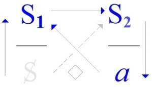
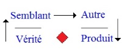

# Leçon 02 | 02 Décembre 1971

<!-- source-docx: S19b Le savoir du psychanalyste.docx -->
<!-- seminar: s19b -->
<!-- lesson: 02 -->

<!-- id: s19b-02-0001 -->

Ce que je fais avec vous ce soir, ce n'est évidemment pas\...

<!-- id: s19b-02-0002 -->

> pas plus ça ne le sera, que ça ne l'a été la dernière fois \...ce n'est évidemment pas ce que je me suis proposé, cette année, de donner comme pas suivant de mon séminaire.

<!-- id: s19b-02-0003 -->

Ça sera comme la dernière fois, *un entretien*.

<!-- id: s19b-02-0004 -->

Chacun sait - beaucoup l'ignorent - l'insistance que je mets auprès de ceux qui me demandent conseil, sur *les entretiens préliminaires* dans l'analyse. Ça a une fonction bien sûr, pour l'analyse, essentielle.

<!-- id: s19b-02-0005 -->

Il n'y a pas d'entrée possible dans l'analyse sans *entretiens préliminaires*.

<!-- id: s19b-02-0006 -->

Mais il y a quelque chose qui en approche sur le rapport entre ces *entretiens* et ce que je vais vous dire cette année, à ceci près que ça ne peut absolument pas être le même, étant donné que comme c'est moi qui parle, c'est moi qui suis ici dans la position de l'analysant.

<!-- id: s19b-02-0007 -->

Alors ce que j'allais vous dire\...

<!-- id: s19b-02-0008 -->

> j'aurais pu prendre bien d'autres biais mais en fin de compte
>
> c'est toujours au dernier moment que je sais ce que je choisis de dire \...et pour cet entretien d'aujourd'hui, l'occasion m'a semblée propice d'une question qui m'a été posée hier soir par quelqu'un de mon École.

<!-- id: s19b-02-0009 -->

C'est une des personnes qui prennent un peu à cœur leur position et qui m'a posé la question suivante qui a, bien sûr, à mes yeux l'avantage de me faire entrer tout de suite dans le vif du sujet.

<!-- id: s19b-02-0010 -->

Chacun sait que ça m'arrive rarement, j'approche à pas prudents.

<!-- id: s19b-02-0011 -->

La question qui m'a été posée est la suivante : « *L'incompréhension de Lacan est-elle un symptôme ?* »

<!-- id: s19b-02-0012 -->

Je la répète donc textuellement.

<!-- id: s19b-02-0013 -->

C'est une personne à qui en l'occasion je pardonne aisément pour avoir mis mon nom\...

<!-- id: s19b-02-0014 -->

> ce qui s'explique puisqu'elle était en face de moi \...à la place de ce qui eût convenu, à savoir de *« mon discours »*.

<!-- id: s19b-02-0015 -->

Vous voyez que je ne me dérobe pas, je l'appelle « *mon »*.

<!-- id: s19b-02-0016 -->

Nous verrons tout à l'heure si ce *mon* mérite d'être maintenu. Qu'importe\...

<!-- id: s19b-02-0017 -->

L'essentiel de cette question était dans ce sur quoi elle porte, à savoir si l'incompréhension de ce dont il s'agit, que vous l'appeliez d'une façon ou d'une autre, est un *symptôme*.

<!-- id: s19b-02-0018 -->

Je ne le pense pas. Je ne le pense pas, d'abord parce que, en un sens, on ne peut pas dire que quelque chose\...

<!-- id: s19b-02-0019 -->

> qui a quand même un certain rapport avec *mon discours*,
>
> qui ne se confond pas, qui est ce qu'on pourrait appeler *ma parole*, \...on ne peut pas dire *quelle soit absolument* *incomprise*, on peut dire, à un niveau précis, que votre nombre en est la preuve.

<!-- id: s19b-02-0020 -->

Si ma *parole* était incompréhensible, je ne vois pas bien ce que, en nombre, vous feriez là.

<!-- id: s19b-02-0021 -->

D'autant plus qu'après tout, ce nombre est fait en grande partie de gens qui reviennent et puis que, comme ça, au niveau d'un échantillonnage qui me parvient quand même, il arrive que des personnes qui s'expriment de cette façon qu'elles ne comprennent pas toujours bien ou tout au moins qu'elles n'ont pas le sentiment de comprendre\...

<!-- id: s19b-02-0022 -->

> pour reprendre enfin un des derniers témoignages que j'en ai reçus,
>
> de la façon dont chacun exprime ça \...eh bien, malgré ce sentiment un peu « *de ne pas y être* », il n'empêche\...

<!-- id: s19b-02-0023 -->

> me disait-on dans le dernier témoignage \...que ça l'aidait, la personne en question à se retrouver dans ses propres idées, à s'éclaircir, à s'éclaircir elle-même sur un certain nombre de points.

<!-- id: s19b-02-0024 -->

On ne peut pas dire qu'au moins pour ce qui en est de *ma parole*\...

<!-- id: s19b-02-0025 -->

> qui est bien évidemment à distinguer du *discours*, nous allons tâcher de voir en quoi \...il n'y a pas à proprement parler ce qu'on appelle *incompréhension*.

<!-- id: s19b-02-0026 -->

Je souligne tout de suite que *cette parole est une parole d'enseignement*.

<!-- id: s19b-02-0027 -->

L'enseignement donc, en l'occasion je le distingue du discours.

<!-- id: s19b-02-0028 -->

Comme je parle ici à Sainte-Anne\...

<!-- id: s19b-02-0029 -->

> et peut-être à travers ce que j'ai dit la dernière fois on peut sentir ce que ça signifie pour moi \...j'ai choisi de prendre les choses au niveau, disons de ce qu'on appelle l'élémentaire.

<!-- id: s19b-02-0030 -->

C'est complètement arbitraire, mais c'est un choix.

<!-- id: s19b-02-0031 -->

Quand j'ai été à la *Société de Philosophie* faire une communication sur ce que j'appelais à l'époque « *mon enseignement* », j'ai pris le même parti. J'ai parlé comme en m'adressant à des gens très en retard : ils ne le sont pas plus que vous, mais c'est plutôt l'idée que j'ai de la philosophie qui veut ça. Et je ne suis pas le seul.

<!-- id: s19b-02-0032 -->

Un de mes très bons amis qui en a fait une récente - à la *Société de Philosophie* - de communication, m'a passé un article sur le fondement des mathématiques où je lui ai fait observer que son article était d'un niveau dix fois ou vingt fois plus élevé que ce qu'il avait dit à la *Société de Philosophie*.

<!-- id: s19b-02-0033 -->

Il m'a dit qu'il ne fallait pas que je m'en étonne, vu les réponses qu'il en avait obtenu.

<!-- id: s19b-02-0034 -->

C'est bien ce qu'il m'a prouvé aussi, parce que j'ai eu des réponses du même ordre au même endroit, c'est bien ce qui m'a rassuré d'avoir articulé certaines choses que vous pouvez trouvez dans mes *Écrits*, au même niveau.

<!-- id: s19b-02-0035 -->

Il y a donc dans certains contextes un choix moins arbitraire que celui que je soutiens ici.

<!-- id: s19b-02-0036 -->

Je le soutiens ici en fonction d'éléments mémoriaux qui sont liés à ceci : c'est qu'en fin de compte, si à un certain niveau, mon discours est encore incompris, c'est parce que, disons pendant longtemps, il a été dans toute une zone interdit, non pas de l'entendre\...

<!-- id: s19b-02-0037 -->

> ce qui aurait été, comme l'expérience l'a prouvé, à la portée de beaucoup \...mais interdit de *venir* l'entendre.

<!-- id: s19b-02-0038 -->

C'est ce qui va nous permettre de distinguer cette incompréhension d'un certain nombre d'autres : il y avait de l'interdit. Et que, ma foi, cet interdit soit provenu d'une institution analytique est sûrement significatif.

<!-- id: s19b-02-0039 -->

Significatif veut dire quoi ?

<!-- id: s19b-02-0040 -->

J'ai pas du tout dit *signifiant*. Il y a une grande différence entre

<!-- id: s19b-02-0041 -->

- le rapport signifiant-signifié,

<!-- id: s19b-02-0042 -->

- et la signification.

<!-- id: s19b-02-0043 -->

*La signification ça fait signe, un signe n'a rien à faire avec un signifiant*.

<!-- id: s19b-02-0044 -->

Un signe est\...

<!-- id: s19b-02-0045 -->

j'expose ça dans un coin, quelque part dans le dernier numéro de ce *Scilicet* \...*un signe est*, quoi qu'on en pense, *toujours le signe d'un sujet*.

<!-- id: s19b-02-0046 -->

Qui s'adresse à quoi ? C'est également écrit dans ce *Scilicet*, je ne peux pas maintenant m'y étendre, mais ce signe, ce signe d'interdiction venait assurément de vrais sujets, dans tous les sens du mot, de sujets qui obéissent en tout cas. Que ce soit un signe venu d'une institution analytique est bien fait pour nous faire faire le pas suivant.

<!-- id: s19b-02-0047 -->

Si la question a pu m'être posée sous cette forme, c'est en fonction de ceci : que l'incompréhension en psychanalyse est considérée comme un *symptôme*.

<!-- id: s19b-02-0048 -->

C'est reçu dans la psychanalyse, c'est - si on peut dire - généralement admis.

<!-- id: s19b-02-0049 -->

La chose en est au point que c'était passé dans la conscience commune.

<!-- id: s19b-02-0050 -->

Quand je dis que c'est généralement admis, c'est au-delà de la psychanalyse, je veux dire de l'acte psychanalytique.

<!-- id: s19b-02-0051 -->

Les choses dans une certaine conscience\...

<!-- id: s19b-02-0052 -->

> il y a quelque chose qui donne le mode de la conscience commune \...en sont au point où on se dit, où on s'entend dire : « *Va te faire psychanalyser* » quand... quand quoi ?

<!-- id: s19b-02-0053 -->

Quand la personne qui le dit, considère que votre conduite, vos propos sont, comme dirait M. de Lapalisse, *symptôme*.

<!-- id: s19b-02-0054 -->

Je vous ferai remarquer que tout de même à ce niveau, par ce biais, « *symptôme »* a le sens de « *valeur de vérité »*.

<!-- id: s19b-02-0055 -->

C'est en quoi ce qui est passé dans la conscience commune est plus précis que l'idée qu'arrivent à avoir - hélas - beaucoup de psychanalystes. Disons qu'il y en a trop peu à savoir l'équivalence de « *symptôme »* avec « *valeur de vérité »*.

<!-- id: s19b-02-0056 -->

C'est assez curieux, mais d'ailleurs ça a ce répondant historique que ça démontre que ce sens du mot *symptôme* a été découvert, énoncé, avant que la psychanalyse entre en jeu. Comme je le souligne souvent, c'est à très proprement parler le pas essentiel, fait par la pensée marxiste, que cette équivalence.

<!-- id: s19b-02-0057 -->

*Valeur de vérité *: pour traduire *le symptôme* en une *Valeur de vérité* nous devons ici toucher du doigt, une fois de plus, ce que suppose *de savoir* chez l'analyste le fait qu'il faille bien que ce soit à son « *su* » qu'il interprète.

<!-- id: s19b-02-0058 -->

Et pour faire ici une parenthèse, simplement en passant\...

<!-- id: s19b-02-0059 -->

> ça n'est pas dans le fil de ce que j'essaie de vous faire suivre \...je dois marquer, je marque pourtant que *ce savoir* est à l'analyste, si je puis dire, *présupposé.*

<!-- id: s19b-02-0060 -->

Ce que j'ai accentué du *sujet supposé savoir* comme fondant les phénomènes du *transfert*, j'ai toujours souligné que ça n'emporte *aucune certitude chez le sujet analysant que son analyste en sache long*, bien loin de là.

<!-- id: s19b-02-0061 -->

Mais c'est parfaitement compatible avec *le fait que soit par l'analysant envisagé comme fort douteux le savoir de l'analyste*, ce qui d'ailleurs, il faut l'ajouter, est fréquemment le cas pour des raisons fort objectives : les analystes somme toute n'en savent pas toujours autant qu'ils devraient pour cette simple raison que souvent ils ne foutent pas grand chose.

<!-- id: s19b-02-0062 -->

Ça ne change absolument rien au fait que *le savoir est présupposé* à la fonction de l'analyste et que c'est là-dessus que reposent les phénomènes de *transfert*. La parenthèse est close.

<!-- id: s19b-02-0063 -->

Voici donc le *symptôme* avec *sa traduction* comme *valeur de vérité*. *Le symptôme est valeur de vérité* et\...

<!-- id: s19b-02-0064 -->

> je vous le fais remarquer au passage \...la réciproque n'est pas vraie : la *valeur de vérité* n'est pas *symptôme*.

<!-- id: s19b-02-0065 -->

Il est bon de le remarquer en ce point pour la raison que *la vérité* n'est rien dont je prétende que la fonction soit isolable. *Sa fonction* - et nommément là où elle prend place : dans la parole - *est relative*.

<!-- id: s19b-02-0066 -->

Elle n'est pas séparable d'autres fonctions de la parole. Raison de plus pour que j'insiste sur ceci : que *même à la réduire à la valeur*, elle ne se confond en aucun cas avec le *symptôme*.

<!-- id: s19b-02-0067 -->

C'est autour de ce point de ce qu'est le *symptôme* qu'ont pivoté les premiers temps de mon enseignement, car les analystes, sur ce point, étaient dans un brouillard tel que le *symptôme*\...

<!-- id: s19b-02-0068 -->

> et après tout peut-être doit-on à mon *enseignement* que ça ne s'étale plus si aisément \...que le *symptôme* s'articule - j'entends : dans la bouche des analystes - comme le refus de la dite *valeur de vérité*.

<!-- id: s19b-02-0069 -->

Ça n'a aucun rapport avec cette équivalence à un seul sens - je viens d'y insister - du *symptôme* à une *valeur de vérité*.

<!-- id: s19b-02-0070 -->

Ça fait entrer en jeu ce que j'appellerai\...

<!-- id: s19b-02-0071 -->

> ce que j'appellerai comme ça parce qu'on est entre soi et que j'ai dit que c'était un *entretien,*
>
> ce que j'appellerai sans plus de forme, sans me soucier que les termes que je vais pousser
>
> en avant en soient déjà usités à la pointe la plus avancée de la philosophie \...ça fait entrer en jeu *l'être d'un étant*.

<!-- id: s19b-02-0072 -->

Je dis *l'être*\...

<!-- id: s19b-02-0073 -->

parce que il me semble clair, il semble acquis - depuis le temps -- que la philosophie tourne en rond sur un certain nombre de points \...je dis l'être parce qu'il s'agit de *l'être parlant*.

<!-- id: s19b-02-0074 -->

C'est d'*être parlant*\...

<!-- id: s19b-02-0075 -->

excusez-moi du 1^er^ « *être* » \...qu'il vient à l'être, enfin qu'il en a le sentiment. Naturellement il n'y vient pas, il rate.

<!-- id: s19b-02-0076 -->

Mais cette dimension ouverte tout d'un coup de « *l'être* », on peut dire que pendant un bon bout de temps, elle a « porté sur le système », des philosophes tout au moins.

<!-- id: s19b-02-0077 -->

Et on aurait bien tort d'ironiser, parce que si elle a *« *porté sur le système* »* des philosophes, c'est qu'ils « portent sur le système » de tout le monde, et que ce qui se désigne dans cette dénonciation par les analystes de ce qu'ils appellent « *la résistance »*, ce autour de quoi j'ai fait pendant toute une étape de cet enseignement\...

<!-- id: s19b-02-0078 -->

> dont mes *Écrits* portent la trace, \...j'ai fait pendant tout une étape *bagarre*, c'est bien pour les interroger sur s'ils savaient ce qu'ils faisaient en faisant entrer dans l'occasion ce qu'on pourrait donc appeler ceci : que l'*être* de ce sacré *étant* dont ils parlent\...

<!-- id: s19b-02-0079 -->

> pas tout à fait à tort et à travers, ils appellent ça « *l'Homme »* de temps en temps, en tout cas
>
> on l'appelle de moins en moins \[ainsi\] depuis que je suis de ceux qui font là-dessus quelques réserves \...cet être n'a pas à l'endroit de *la vérité* de tropisme spécial. N'en disons pas plus.

<!-- id: s19b-02-0080 -->

Donc il y a deux sens du *symptôme* : le *symptôme* est *valeur de vérité*, c'est la fonction qui résulte de l'introduction, à un certain temps historique - que j'ai daté suffisamment - de la notion de *symptôme*.

<!-- id: s19b-02-0081 -->

Il ne se guérit pas le *symptôme,* de la même façon dans la dialectique marxiste et dans la psychanalyse.

<!-- id: s19b-02-0082 -->

Dans la psychanalyse, il a affaire à quelque chose qui est la traduction en paroles de sa *valeur de vérité*.

<!-- id: s19b-02-0083 -->

Que ceci suscite ce qui est par l'analyste ressenti comme un être de refus, ne permet nullement de *trancher* si ce sentiment mérite d'aucune façon d'être retenu, puisque aussi bien dans d'autres registres, celui pré­cisément que j'ai évoqué tout à l'heure, c'est à de tout autres procédés que doit céder *le symptôme*.

<!-- id: s19b-02-0084 -->

Je ne suis pas en train de donner à aucun de ces procédés la préférence, et ceci d'autant moins que ce que je veux vous faire entendre, c'est qu'il y a une autre dialectique que celle qu'on impute à *l'histoire*.

<!-- id: s19b-02-0085 -->

Entre les questions :

<!-- id: s19b-02-0086 -->

- « *l'incompréhension psychanalytique est-elle un symptôme ?* »,

<!-- id: s19b-02-0087 -->

- et « *l'incompréhension de Lacan est-elle un symptôme ?* », j'en pla­cerai une 3^ème^ :

<!-- id: s19b-02-0088 -->

- « *L'incompréhension mathématique*\...

<!-- id: s19b-02-0089 -->

> c'est quelque chose qui se désigne, il y a des gens - et même des jeunes gens, parce que ça n'a d'intérêt
>
> qu'au­près des jeunes gens - pour qui cette dimension de *l'incompréhension mathématique*, ça existe
>
> \...*est-elle un symptôme ?* ».

<!-- id: s19b-02-0090 -->

Il est certain que quand on s'intéresse à ces sujets qui manifestent *l'incompréhension mathématique*, assez répandue encore à notre temps, on a le sentiment\...

<!-- id: s19b-02-0091 -->

> j'ai employé le mot *sentiment* tout à fait comme tout à l'heure,
>
> pour ce dont les analystes ont fait *la résistance* \...on a le sentiment qu'elle provient, chez le sujet en proie à l'incompréhension mathématique, de quelque chose qui est comme une insatisfaction, un décalage, quelque chose d'éprouvé dans le manie­ment précisément de *la valeur de vérité.*

<!-- id: s19b-02-0092 -->

Les sujets en proie à *l'incompréhension mathématique* attendent plus de *la vérité* que la réduction à ces valeurs qu'on appelle\...

<!-- id: s19b-02-0093 -->

> au moins dans les premiers pas de la mathématique \...des *valeurs déductives* : les articulations dites démonstratives leur paraissent manquer de quelque chose qui est précisément au niveau d'une exigence de *vérité*.

<!-- id: s19b-02-0094 -->

Cette bivalence : *vrai* ou *faux*, sûrement - et disons-le : non sans raisons - les laisse en déroute, et jusqu'à un certain point on peut dire qu'il y a une certaine distance de *la vérité* à ce que nous pouvons appeler dans l'occasion *le chiffre*.

<!-- id: s19b-02-0095 -->

*Le chiffre* ce n'est rien d'autre que l'écrit, l'écrit de sa *valeur*.

<!-- id: s19b-02-0096 -->

Que *la bivalence* s'exprime selon les cas par 0 et 1 ou par V et F, le résul­tat est le même.

<!-- id: s19b-02-0097 -->

Le résul­tat est le même en raison de quelque chose qui est exigé ou paraît exigible chez certains sujets, dont vous avez pu voir ou entendre que tout à l'heure je n'ai pas parlé, que ce soit d'aucune façon *un contenu*.

<!-- id: s19b-02-0098 -->

Au nom de quoi l'appellerait-on de ce terme, puisque *contenu* ne veut rien dire tant qu'on ne peut pas dire *de quoi il s'agit* ?

<!-- id: s19b-02-0099 -->

Une vérité n'a pas de contenu, une vérité qu'on dit une : *elle est vérité* ou bien *elle est semblant*, distinction qui n'a rien à faire avec l'opposition du *vrai* et du *faux*, car *si elle est semblant, elle est semblant de vérité* précisément, et *ce dont procède l'incompréhension mathématique*, *c'est* que justement la question se pose *de savoir* *si vérité ou semblant, ce n'est pas*\...

<!-- id: s19b-02-0100 -->

> permettez moi de le dire, je le reprendrai plus savamment dans un autre contexte \...*ce n'est pas tout un* \[*inférence du Réel, ou pas*\].

<!-- id: s19b-02-0101 -->

En tout cas sur ce point, ce n'est certainement pas l'élaboration logicienne qui s'est faite des mathématiques qui ici viendra s'opposer, car si vous lisez, en n'importe quel point de ses textes, M. Bertrand Russell, qui d'ailleurs a pris soin de le dire en propres termes : « *La mathématique c'est très précisément ce qui s'occupe d'énoncés* *dont il est impossible de dire s'ils ont une vérité, ni même s'ils signifient quoi que ce soit* ».

<!-- id: s19b-02-0102 -->

\[Bertrand Russell : «* Mysticisme et logique *», Paris, Vrin, 2007* :*

<!-- id: s19b-02-0103 -->

> « *Ainsi les mathématiques peuvent être définies comme la matière dans laquelle nous ne savons jamais de quoi nous parlons ni si ce que nous disons est vrai. »*\]

<!-- id: s19b-02-0104 -->

C'est bien une façon un peu poussée de dire que tout le soin précisément qu'il a prodigué à la rigueur de *la mise en forme* de la déduction mathématique, est quelque chose qui assurément s'adresse à *tout autre chose que la vérité* \[→ *au Réel*\], mais a une face qui n'est tout de même pas sans rapport avec elle, sans ça il n'y aurait pas besoin de l'en séparer d'une façon si appuyée !

<!-- id: s19b-02-0105 -->

Il est certain que\...

<!-- id: s19b-02-0106 -->

> non identique à ce qu'il en est de la mathématique \...la logique\...

<!-- id: s19b-02-0107 -->

> qui s'efforce précisément de justifier l'articulation mathématique au regard de la vérité \...aboutit ou plus exactement s'affirme, s'affirme à notre époque dans cette *logique propositionnelle*, dont le moins qu'on puisse dire est qu'il paraît étrange que *la vérité étant posée comme valeur*\...

<!-- id: s19b-02-0108 -->

> comme valeur qui fait la dénotation d'une proposition donnée, \...de cette proposition il est posé dans la même logique *qu'elle ne saurait engendrer qu'une autre proposition vraie*.

<!-- id: s19b-02-0109 -->

Que *l'implication* pour tout dire y est définie de cette étrange généalogie d'où résulterait que le vrai une fois atteint ne saurait d'aucune façon par rien de ce qu'il implique retourner au faux.

<!-- id: s19b-02-0110 -->

Il est tout à fait clair que, si minces que soient les chances de ce qu'une proposition fausse\...

<!-- id: s19b-02-0111 -->

> ce qui par contre est tout à fait admis \...engendre une proposition vraie, depuis le temps qu'on propose dans cette « *aller »* qu'on nous dit être *« sans retour »*, il ne devrait plus depuis longtemps y avoir que des propositions vraies !

<!-- id: s19b-02-0112 -->

À la vérité il est singulier, il est étrange, il n'est supportable, qu'en raison de l'existence des mathématiques\...

<!-- id: s19b-02-0113 -->

> de leur existence indépendamment de la logique \...que pareil énoncé puisse même un instant tenir.

<!-- id: s19b-02-0114 -->

*Il y a quelque part ici* *une embrouille*, celle qui fait qu'assurément les mathématiciens eux-mêmes sont là-dessus si peu *en repos*, que tout ce qui a effectivement stimulé cette recherche logicienne concernant les mathématiques, tout, *en tous ses points*, cette recherche a procédé du sentiment que *la non contradiction ne saurait d'aucune façon suffire à fonder la vérité*, ce qui ne veut pas dire qu'elle ne soit souhaitable, voir exigible. Mais qu'elle soit suffisante, assurément pas.

<!-- id: s19b-02-0115 -->

Mais ne nous avançons pas là-dessus - ce soir - plus loin puisqu'il ne s'agit que d'un entretien introductif à un maniement qui est précisément celui dont je me propose cette année de vous faire suivre le chemin.

<!-- id: s19b-02-0116 -->

Cette *embrouille* autour de l'incompréhension mathématique est de nature à nous mener à cette idée qu'ici *le symptôme*, *l'incompréhension mathématique*, c'est en somme *l'amour de la vérité* - si je puis dire - *pour elle-même*, qui le conditionne.

<!-- id: s19b-02-0117 -->

C'est autre chose que ce refus dont je parlais tout à l'heure, c'est même le contraire en un point où, si l'on peut dire, on aurait réussi à en escamoter tout à fait le pathétique.

<!-- id: s19b-02-0118 -->

Seulement ça se passe pas comme ça au niveau d'une certaine façon d'exposer les mathématiques, qui pour illustrer que je l'ai faite de l'effort dit logicien, n'en est pas moins présentée d'une façon maniable, courante, et sans autre introduction logique, d'une façon simple et élémentaire, où l'évidence, comme on dit, permet d'escamoter beaucoup de pas \[*où, dans « \...ou pire », l'évidence du « pire » escamote le* (\...) *du Réel*\].

<!-- id: s19b-02-0119 -->

Il est curieux que\...

<!-- id: s19b-02-0120 -->

> au point, chez les jeunes, où se manifeste l'incompréhension mathématique \...ce soit sans doute d'*un certain vide senti* sur ce qu'il en est du véridique de ce qui est articulé, que se produisent les phénomènes d'incompréhension, et qu'on aurait tout à fait tort de penser *que la mathématique* c'est quelque chose qui en *effet a réussi à vider tout ce qu'il en est du rapport à la vérité, de* *son* *pathétique*.

<!-- id: s19b-02-0121 -->

Parce qu'il n'y a pas que la mathématique élémentaire, et que nous savons assez d'histoire pour savoir la peine, la douleur qu'a engendrées au moment de leur ex-cogitation les termes et les fonctions du calcul infinitésimal, pour simplement nous en tenir là.

<!-- id: s19b-02-0122 -->

Voire - plus tard - la régularisation, l'entérinement, la logification des mêmes termes et des mêmes méthodes, voire l'introduction d'un nombre de plus en plus élevé, de plus en plus élaboré de ce qu'il nous faut bien, à ce niveau, appeler *mathème*, et pour savoir qu'assurément les dits *mathèmes*

<!-- id: s19b-02-0123 -->

- ne comportent nullement une généalogie rétrograde,

<!-- id: s19b-02-0124 -->

- ne comportent aucun exposé possible pour lequel il faudrait employer le terme d'*historique*.

<!-- id: s19b-02-0125 -->

La mathématique grecque montre très bien les points, où même là où elle avait la chance, *par les procédés* dits *d'exhaustion*, d'approcher ce qu'il en est advenu au moment de la sortie du *calcul infinitésimal*, elle n'y est pourtant pas parvenue, elle n'a pas franchi le pas.

<!-- id: s19b-02-0126 -->

Et que s'il est aisé, à partir du *calcul infinitésimal*, ou pour mieux dire, de sa réduction parfaite, de situer, de classer \- mais après coup *-* ce qu'il en était à la fois des procédés de démonstration de la mathématique grecque et aussi des impasses qui leur étaient à l'avance données comme parfaitement repérables après coup, s'il en est ainsi, nous voyons qu'il n'est absolument pas vrai de parler du *mathème* comme de quelque chose qui d'aucune façon serait détaché de l'exigence véridique.

<!-- id: s19b-02-0127 -->

C'est bien au cours d'innombrables débats, de débats de paroles, que le surgissement en chaque temps de l'histoire...

<!-- id: s19b-02-0128 -->

et si j'ai parlé de Leibniz et de Newton implicitement, voire de ceux qui\...

<!-- id: s19b-02-0129 -->

> avec une incroyable audace dans je ne sais quel élément de rencontre ou d'aventure
>
> à propos de quoi le terme de « *tour de force »* ou de « *coup de chance »* s'évoque \...les ont précédés, un Isaac Barrow par exemple.

<!-- id: s19b-02-0130 -->

Et ceci s'est renouvelé dans un temps très proche de nous, avec l'effraction cantorienne, quand rien assurément n'est fait pour diminuer ce que j'ai appelé tout à l'heure la dimension du *pathétique*\...

<!-- id: s19b-02-0131 -->

> qui a pu aller chez Cantor jusqu'à la folie,
>
> dont je ne crois pas qu'il suffise non plus de nous dire que c'était en suite des déceptions de carrière,
>
> des oppositions, voire des injures, que le dit Cantor recevait des universitaires régnant à son époque,
>
> nous n'avons pas l'habitude de trouver la folie motivée par des persécutions objectives \...assurément tout est fait pour nous faire nous interroger sur la fonction du mathème.

<!-- id: s19b-02-0132 -->

L'incompréhension mathématique doit donc être autre chose que ce que j'ai appelé cette exigence, cette exigence qui ressortirait en quelque sorte d'*un vide formel*.

<!-- id: s19b-02-0133 -->

Bien loin de là, il n'est pas sûr\...

<!-- id: s19b-02-0134 -->

> à en juger par ce qui se passe dans l'histoire des mathématiques, \...que ce ne soit pas de quelque rapport du mathème\...

<!-- id: s19b-02-0135 -->

> fût-il le plus élémentaire \...avec *une dimension de vérité,* que l'incompréhension ne s'engendre.

<!-- id: s19b-02-0136 -->

Ce sont peut-être les plus sensibles qui comprennent le moins.

<!-- id: s19b-02-0137 -->

Nous avons déjà une espèce d'indication, de notion de ça, au niveau *des dialogues*\...

<!-- id: s19b-02-0138 -->

> de ce qui nous en reste, de ce que nous pouvons en présumer \...*des dialogues socratiques*.

<!-- id: s19b-02-0139 -->

Il y a des gens, après tout, pour qui peut-être la rencontre justement avec *la vérité*, ça joue ce rôle que les dits « grecs » empruntaient à une métaphore, ça a le même effet que *la rencontre avec* [*la torpille*](https://www.cnrtl.fr/definition/torpille) : ça les engourdit.

<!-- id: s19b-02-0140 -->

Je vous ferai remarquer que cette idée qui procède - je veux dire dans la métaphore elle-même - de l'apport, l'apport confus sans doute, mais c'est bien à ça que ça sert la métaphore : c'est à faire surgir un sens qui en dépasse de beaucoup les moyens : la torpille.

<!-- id: s19b-02-0141 -->

Et puis celui qui la touche et qui en tombe raide, c'est évidemment\...

<!-- id: s19b-02-0142 -->

> on ne le sait pas encore au moment où on fait la métaphore \...c'est évidemment la rencontre de deux *champs* non accordés entre eux, « *champ »* étant pris au sens propre de *champ magnétique*.

<!-- id: s19b-02-0143 -->

Je vous ferai remarquer également que tout ce que nous venons de toucher et qui aboutit au mot « *champ »*\...

<!-- id: s19b-02-0144 -->

> c'est le mot que j'ai employé quand j'ai dit : « *Fonction et champ de la parole et du langage*\... » \...le *champ* est constitué par ce que j'ai appelé l'autre jour avec un lapsus : « *lalangue* ».

<!-- id: s19b-02-0145 -->

Ce champ considéré ainsi, en y faisant *clé de l'incompréhension* comme telle, c'est précisément cela qui nous permet d'en exclure toute psychologie.

<!-- id: s19b-02-0146 -->

*Les* champs dont il s'agit *sont constitués de Réel*, *aussi réel que la torpille et le doigt* ☞ - qui vient de la toucher - d'un innocent.

<!-- id: s19b-02-0147 -->

*Le mathème*, ce n'est pas parce que nous y abordons par les voies du *Symbolique* pour qu'il ne s'agisse pas du *Réel*.

<!-- id: s19b-02-0148 -->

La vérité en question dans la psychanalyse, c'est ce qui au moyen du langage\...

<!-- id: s19b-02-0149 -->

> j'entends par la fonction de *la parole* \...approche, mais dans un abord qui n'est nullement de *connaissance*, mais je dirai de quelque chose comme d'*induction*\...

<!-- id: s19b-02-0150 -->

> au sens que ce terme a dans *la constitution* d'un champ \...d'*induction* de *quelque chose* qui est tout à fait *réel*, encore que nous n'en puissions parler que comme de *signifiant*.

<!-- id: s19b-02-0151 -->

Je veux dire qui n'ont pas d'autre existence que celle de *signifiant*.

<!-- id: s19b-02-0152 -->

De quoi est-ce que je parle ?

<!-- id: s19b-02-0153 -->

Eh bien, de rien d'autre que ce qu'on appelle en langage courant *des hommes et des femmes*.

<!-- id: s19b-02-0154 -->

Nous ne savons *rien de réel* sur ces hommes et ces femmes comme tels, car c'est de ça qu'il s'agit :

<!-- id: s19b-02-0155 -->

- il ne s'agit pas des chiens et des chiennes,

<!-- id: s19b-02-0156 -->

- il s'agit de ce que c'est réellement ceux qui appartiennent à chacun des sexes à partir de *l'être parlant*.

<!-- id: s19b-02-0157 -->

Il n'y a pas là l'ombre de psychologie.

<!-- id: s19b-02-0158 -->

Des hommes et des femmes, c'est réel, mais nous ne sommes pas, à leurs propos, capables d'articuler la moindre chose dans la langue, qui ait le moindre rapport avec ce *Réel*.

<!-- id: s19b-02-0159 -->

Si la psychanalyse ne nous apprend pas ça, mais qu'est-ce qu'elle dit ? Parce qu'elle ne fait que ressasser !

<!-- id: s19b-02-0160 -->

C'est ça que j'énonce quand je dis qu'*il n'y a pas de rapport sexuel* pour les êtres qui parlent.

<!-- id: s19b-02-0161 -->

Parce que *leur parole* telle qu'elle fonctionne, dépend, *est conditionnée* comme parole *par ceci* : *que ce rapport sexuel, il lui est très précisément, comme parole, interdit d'y fonctionner d'aucune façon qui permette d'en rendre compte.*

<!-- id: s19b-02-0162 -->

Je ne suis pas en train de donner à rien, dans cette corrélation, *la primauté* :

<!-- id: s19b-02-0163 -->

- je ne dis pas que la parole existe parce qu'il n'y a pas de rapport sexuel, ce serait tout à fait *absurde*,

<!-- id: s19b-02-0164 -->

- je ne dis pas non plus qu'il n'y a pas de rapport sexuel parce que la parole est là.

<!-- id: s19b-02-0165 -->

Mais il n'y a certainement pas de rapport sexuel parce que *la parole* fonctionne à ce niveau qui se trouve, de par *le discours psychanalytique*, être découvert comme spécifiant l'être parlant, à savoir l'importance, la prééminence, dans tout ce qui va faire - à son niveau - du sexe le semblant, semblant de « *bonshommes »* et de « *bonnes femmes »*, comme ça se disait après la dernière guerre, on ne les appelait pas autrement : les bonnes-femmes. C'est pas tout à fait comme ça que j'en parlerai parce que je ne suis pas existentialiste.

<!-- id: s19b-02-0166 -->

Quoi qu'il en soit, la constitution de par le fait que l'*étant*, dont nous parlions tout à l'heure, que cet *étant* parle, le fait *que ce n'est que de la parole* *que procède* ce point essentiel\...

<!-- id: s19b-02-0167 -->

> qui est tout à fait, dans l'occasion, à distinguer du rapport sexuel \...qui s'appelle *la jouissance*, la jouissance qu'on appelle *sexuelle,* et qui seule détermine, chez l'*étant* dont je parle, ce qu'il s'agit d'obtenir, à savoir l'accouplement.

<!-- id: s19b-02-0168 -->

La psychanalyse nous confronte à ceci : que tout dépend de ce point pivot qui s'appelle *la jouissance sexuelle* et qui se trouve\...

<!-- id: s19b-02-0169 -->

> c'est seulement les propos que nous recueillons dans l'expérience psychanalytique
>
> qui nous permettent de l'affirmer \...*qui se trouve ne pouvoir s'articuler* dans un accouplement un peu suivi, voire même fugace, *qu'à* exiger de *rencontrer ceci, qui n'a dimension que de la langue, et qui s'appelle la castration*.

<!-- id: s19b-02-0170 -->

L'opacité de ce noyau qui s'appelle *jouissance sexuelle*\...

<!-- id: s19b-02-0171 -->

> et dont je vous ferai remarquer que l'articulation dans ce registre à explorer qui s'appelle la *castration*
>
> ne date que de l'émergence historiquement récente du *discours psy­chanalytique* \...voilà, me semble-t-il, ce qui mérite bien qu'on s'emploie à en for­muler le mathème, c'est-à-dire à ce que quelque chose se démontre autrement que de subi, subi dans une sorte de secret honteux, qui pour avoir été par la psychanalyse publié, n'en demeure pas moins aussi honteux, aussi dépourvu d'issue.

<!-- id: s19b-02-0172 -->

C'est à savoir que *la dimension entière de la jouissance*, à savoir le rapport *de cet être parlant avec son corps*, car il n'y a pas d'autre définition possible de la jouissance, per­sonne ne semble s'être aperçu que c'est à ce niveau-là qu'est la question.

<!-- id: s19b-02-0173 -->

Qu'est­ ce qui, dans l'espèce animale, jouit de son corps et comment ?

<!-- id: s19b-02-0174 -->

Certainement nous en avons des traces chez nos cousins les chimpanzés qui se déparasitent l'un l'autre avec tous les signes du plus vif intérêt. Et après ?

<!-- id: s19b-02-0175 -->

À quoi est-ce que tient que *chez l'être parlant* ce soit beaucoup plus élaboré, ce rapport de *la jouissance* qu'on appelle *sexuelle*, au nom de ceci qui est la découverte de la psychanalyse : que *la jouissance sexuelle* émerge plus tôt que la maturité du même nom.

<!-- id: s19b-02-0176 -->

Ça semble suffire à faire « *infantile »* tout ce qu'il en est de cet éventail\...

<!-- id: s19b-02-0177 -->

court sans doute, mais non sans varié­té \...des *jouissances* que l'on qualifie de *perverses*.

<!-- id: s19b-02-0178 -->

Que ceci soit en relation étroite avec cette curieuse *énigme* qui fait 

<!-- id: s19b-02-0179 -->

- qu'on ne saurait en agir avec ce qui semble directement lié

<!-- id: s19b-02-0180 -->

> à l'opération à quoi est supposée viser *la jouissance sexuelle*,

<!-- id: s19b-02-0181 -->

- qu'on ne saurait d'aucune façon s'engager dans cette voie

<!-- id: s19b-02-0182 -->

> *dont la parole tient les chemins*, sans qu'elle *s'articule en castration.*

<!-- id: s19b-02-0183 -->

Il est curieux, il est curieux que jamais, jamais avant\...

<!-- id: s19b-02-0184 -->

je ne veux pas dire *un essai*, parce que comme disait Picasso

<!-- id: s19b-02-0185 -->

*« Je ne cherche pas, je trouve, je n'essaie pas, je tranche »* \...avant que j'aie tranché que le point-clé, que le point-nœud, *c'était lalangue, et dans le champ de lalangue *: *l'opération de la parole*.

<!-- id: s19b-02-0186 -->

Il n'y a pas une interprétation analytique qui ne soit pour donner à quelque proposition qu'on rencontre, sa relation à une jouissance.

<!-- id: s19b-02-0187 -->

Qu'est-ce que veut dire la psychanalyse ?

<!-- id: s19b-02-0188 -->

*Que cette relation à la jouissance, c'est la parole qui assure la dimension de vérité*.

<!-- id: s19b-02-0189 -->

Et encore n'en reste-t-il pas moins assuré qu'elle \[*la parole*\] ne peut d'aucune façon la dire complètement, *elle ne peut* - comme je m'exprime - *que la mi-dire cette relation*, et en forger du *semblant*, très précisément ce qu'on appelle\...

<!-- id: s19b-02-0190 -->

> sans pouvoir en dire grand-chose, justement on en fait quelque chose, *mais on ne peut pas en dire long sur le « type »* \...le semblant de ce qui s'appelle *un homme* ou *une femme*.

<!-- id: s19b-02-0191 -->

Si, il y a quelques deux ans, je suis arrivé, dans la voie que j'essaie de tracer, à articuler ce qu'il en est de 4 *discours*\...

<!-- id: s19b-02-0192 -->

pas des discours historiques, pas de la mythologie,

<!-- id: s19b-02-0193 -->

> la nostalgie de Rousseau, voire du néolithique, c'est des choses qui n'intéressent que *le discours universitaire*.
>
> Il n'est jamais si bien, ce discours \[*Disc. U*\], qu'au niveau des savoirs qui ne veulent plus rien *dire* pour personne,
>
> puisque *le discours universitaire se constitue de faire du savoir, un semblant* \[*le Disc. U escamote le* (\...) *du Réel*\] \...il s'agit de *discours* qui constituent là d'une façon tangible quelque chose de *réel*. \[*les Disc. H,U,M, escamotent, chacun à sa manière, l'ab-sens* (\...) *du Réel, seul le Disc. A, en suspendant le sens* S**~1~** **◊** S**~2~***, montre :* ☞ *le* (\...), *le bord du trou dans le savoir* \]

<!-- id: s19b-02-0194 -->

{width="1.5665266841644794in" height="0.9018897637795276in"} {width="1.5694444444444444in" height="0.8742497812773403in"} {width="1.5601848206474191in" height="0.8680063429571303in"} {width="1.3518514873140857in" height="0.8663626421697288in"}

<!-- id: s19b-02-0195 -->

*Discours du Maître Discours de l'Hystérique Discours Universitaire Discours analytique*

<!-- id: s19b-02-0196 -->

Ce rapport de *frontière* entre *le Symbolique* et *le Réel*, nous y vivons, c'est le cas de le dire. \[*cf. « Lituraterre », <u>la vie</u> n'est que du « littoral »*\]

<!-- id: s19b-02-0197 -->

- *Le discours du Maître*, ça tient toujours et encore !

<!-- id: s19b-02-0198 -->

> Vous pouvez le toucher, je pense, suffisamment du doigt pour que je n'aie pas besoin de vous indiquer
>
> ce que j'aurais pu faire si ça m'avait amusé, c'est-à-dire si je cherchais la popularité :
>
> vous montrer le tout petit tournant quelque part qui en fait *le discours du capitaliste*.
>
> C'est exactement le même truc, simplement c'est mieux foutu, ça fonctionne mieux, *vous êtes plus couillonnés* !
>
> De toute façon, vous n'y songez même pas.

<!-- id: s19b-02-0199 -->

- De même que pour *le discours universitaire* vous y êtes à plein tube, en croyant faire l'émoi, l'*émoi de Mai !*

<!-- id: s19b-02-0200 -->

- Ne parlons pas *du discours hystérique*, c'est *le discours scientifique* lui-même.

<!-- id: s19b-02-0201 -->

> C'est très important à connaître pour avoir des petits pronostics.
>
> Ça ne diminue en rien les mérites du *discours scientifique*.

<!-- id: s19b-02-0202 -->

S'il y a une chose qui est certaine, c'est que je n'ai pu, ces trois discours \[H,U,M\], les articuler en une sorte de *mathème* que parce que *le discours analytique* \[A\] est surgi.

<!-- id: s19b-02-0203 -->

Et quand je parle du *discours analytique*, je ne suis pas en train de vous parler de quelque chose de l'ordre de *la connaissance*, il y a longtemps qu'on aurait pu s'apercevoir que le discours de la connaissance est une métaphore sexuelle, et lui donner sa conséquence, à savoir *que puisqu'il n'y a pas de rapport sexuel, il n'y a pas non plus de connaissance.*

<!-- id: s19b-02-0204 -->

On a vécu pendant des siècles avec une mythologie sexuelle, et bien entendu, une grande part des analystes ne demande pas mieux que de se délecter à ces chers souvenirs d'une époque inconsistante. Mais il ne s'agit pas de ça.

<!-- id: s19b-02-0205 -->

*Ce qui est dit*\...

<!-- id: s19b-02-0206 -->

écris-je à la première ligne de quelque chose \[« *L'étourdit *»\] que je suis en train de cogiter pour vous le laisser dans quelques temps \...*ce qui est dit est de fait, du fait de le dire*. Seulement il y a l'achoppement, l'achoppement : tout est là, tout en sort.

<!-- id: s19b-02-0207 -->

Ce que j'appelle *l'Hachose*\...

<!-- id: s19b-02-0208 -->

> j'ai mis un H devant pour que vous voyez qu'il y a une apostrophe, mais justement
>
> je ne devrais pas en mettre, ça devrait s'appeler « *la Hachose* » \...bref *l'objet(a) *: *l'objet(a)*, c'est un objet certes, seulement en ce sens qu'il se substitue définitivement à toute notion de *l'objet* comme supporté par *un sujet*. Ça n'est pas le rapport dit de *la connaissance*.

<!-- id: s19b-02-0209 -->

Il est assez curieux, quand on l'étudie en détail, de voir que ce rapport de *la connaissance*, on avait fini par faire que l'un des termes*, le sujet en question* \[S\], *n'était plus que* *l'ombre d'une ombre*, *un reflet parfaitement évanoui*.

<!-- id: s19b-02-0210 -->

{width="1.3596489501312337in" height="0.7827843394575678in"}

<!-- id: s19b-02-0211 -->

*L'objet(a)* n'est un *objet* qu'en ce sens qu'il est là pour affirmer que rien de l'ordre du savoir n'est sans *le produire*. \[S~1→~ S~2\ ↓~*a*\]

<!-- id: s19b-02-0212 -->

C'est tout à fait autre chose que de le *connaître*.

<!-- id: s19b-02-0213 -->

Que *le discours psychanalytique* ne puisse s'articuler qu'à montrer que cet *objet(a)*, pour qu'il y ait chance d'analyste, il faut qu'une certaine opération, qu'on appelle *l'expérience psychanalytique,* ait fait venir *l'objet(a)* à la place du *semblant *:

<!-- id: s19b-02-0214 -->

{width="0.9210520559930009in" height="0.39792869641294837in"} {width="1.1455653980752405in" height="0.7341601049868767in"}

<!-- id: s19b-02-0215 -->

Bien entendu, il ne pourrait absolument pas occuper *cette place* si les autres éléments, *réductibles dans une chaîne signifiante,* \...n'occupaient pas les autres :

<!-- id: s19b-02-0216 -->

- si *le sujet* \[**S**\],

<!-- id: s19b-02-0217 -->

- et ce que j'appelle *signifiant-maître* \[**S~1~**\],

<!-- id: s19b-02-0218 -->

- et ce que je désigne du *corps du savoir* \[**S~2~**\], n'étaient pas répartis aux quatre points d'un tétraèdre\...

<!-- id: s19b-02-0219 -->

> qui est ce que, pour votre repos, je vous ai dessiné au tableau sous la forme de petites choses
>
> qui se croisent comme ça, à l'intérieur d'un carré dont il manque un côté \...il est évident qu'il n'y aurait absolument pas de discours.

<!-- id: s19b-02-0220 -->

*Et ce qui définit un discours, ce qui l'oppose à la parole*, je dis\...

<!-- id: s19b-02-0221 -->

> parce que c'est cela qui est le mathème \...je dis que *c'est ce que détermine*, pour l'approche *parlante*, *ce que détermine le Réel*.

<!-- id: s19b-02-0222 -->

Et *le Réel* dont je parle est absolument *inapprochable sauf par une voie mathématique*, *c'est* à savoir *en repérant*\...

<!-- id: s19b-02-0223 -->

> pour cela il n'y a pas d'autre voie que *ce discours*, *dernier venu des* 4, celui que je définis comme *le discours analytique* et qui permet d'une façon dont il serait excessif de dire qu'elle est consistante, tout au contraire \...d'*une béance*\... et proprement *celle* qui s'exprime de la thématique *de la castration* \...*qu'on peut voir d'où s'assure le Réel dont tient tout ce discours*.

<!-- id: s19b-02-0224 -->

Le *Réel* dont je parle et ceci conformément à tout ce qui est reçu\...

<!-- id: s19b-02-0225 -->

> mais comme si c'était par des sourds \...reçu dans l'analyse, à savoir que rien n'est assuré de ce qui semble la fin, la finalité de la jouissance sexuelle, à savoir la copulation, sans ces *pas*\...

<!-- id: s19b-02-0226 -->

> très confusément aperçus mais jamais dégagés *dans une structure* comparable à celle d'une *logique* \...et *qui s'appelle* *la castration*.

<!-- id: s19b-02-0227 -->

C'est très précisément en cela que l'effort logicien doit nous être un modèle, voire un guide.

<!-- id: s19b-02-0228 -->

Et ne me faites pas parler d'isomorphisme, hein\...

<!-- id: s19b-02-0229 -->

Et qu'il y ait quelque part un brave petit coquin de l'université qui trouve que mes énoncés sur *la vérité, le semblant, la jouissance et le plus-de jouir*, seraient « formalistes », voire « herméneutiques », pourquoi pas ?

<!-- id: s19b-02-0230 -->

Il s'agit de ce qu'on appelle en mathématique plutôt - chose curieuse, c'est une rencontre - une opération de générateur*.*

<!-- id: s19b-02-0231 -->

Nous essaierons cette année, et ailleurs qu'ici, d'approcher comme ça prudemment, de loin et *pas à pas*, parce qu'il ne faut pas trop attendre en cette occasion, de ce qu'il pourrait se produire d'étincelles, mais ça viendra.

<!-- id: s19b-02-0232 -->

*l'objet(a)* dont je vous ai parlé tout à l'heure c'est pas un *objet*, c'est ce qui permet de *tétraédrer* ces 4 *discours*, chacun de ces discours à sa façon.

<!-- id: s19b-02-0233 -->

Et c'est bien entendu ce que ne peuvent pas voir - que ne peuvent pas voir qui ? : chose curieuse : les analystes, c'est que *l'objet(a)*\...

<!-- id: s19b-02-0234 -->

> ce n'est pas un point qui se localise quelque part dans les 4 autres ou les 4 qu'ils forment ensemble \...*c'est la construction, c'est le mathème tétraédrique de ces discours*.

<!-- id: s19b-02-0235 -->

La question est donc celle-ci : d'où les êtres « *achosiques* », les *a* *incarnés* que nous sommes tous à des titres divers, sont-ils le plus en proie à l'incompréhension de mon discours ?

<!-- id: s19b-02-0236 -->

Ça, c'est vrai que la question peut être posée.

<!-- id: s19b-02-0237 -->

Qu'elle soit *un symptôme* ou qu'elle ne le soit pas, la chose est secondaire.

<!-- id: s19b-02-0238 -->

Mais ce qui est très certain, c'est que théoriquement c'est au niveau du psychanalyste que doit dominer l'incompréhension de mon discours.

<!-- id: s19b-02-0239 -->

Et justement parce que c'est *le discours analytique*.

<!-- id: s19b-02-0240 -->

Peut-être n'est-ce pas le privilège du *discours analytique*.

<!-- id: s19b-02-0241 -->

Après tout, même ceux qui ont fait\... celui qui a fait, qui a poussé le plus loin\...

<!-- id: s19b-02-0242 -->

> qui a évidemment loupé parce qu'il ne connaissait pas *l'objet(a)* \...mais qui a poussé le plus loin le *discours du Maître,* avant que j'amène *l'objet(a)* au monde : Hegel, pour le nommer.

<!-- id: s19b-02-0243 -->

Il nous a toujours dit que s'il y avait quelqu'un qui ne comprenait rien au *discours du Maître*, c'était le Maître lui-même.

<!-- id: s19b-02-0244 -->

En quoi, bien sûr, il reste dans la psychologie, parce qu'il n'y a pas de Maître, il y a le signifiant-Maître et que le Maître suit comme il peut.

<!-- id: s19b-02-0245 -->

Ça ne favorise pas du tout la compréhension du *discours du Maître* chez le Maître.

<!-- id: s19b-02-0246 -->

C'est en ce sens que la « psychologie » de Hegel est exacte.

<!-- id: s19b-02-0247 -->

Il serait également, bien sûr, très difficile de soutenir que *l'hystérique*, au point où elle est placée, c'est-à-dire au niveau du *semblant*, c'est là qu'elle soit le mieux pour comprendre son discours \[*le Disc. H*ystérique\].

<!-- id: s19b-02-0248 -->

Il n'y aurait pas besoin du *virage de l'analyse* sans ça. \[*Disc. H*ystérique → \... → *Discours Analytique* \] \[*cf. « Lituraterre »* Sta p. 9 *: « Entre centre et absence* \[*entre sens et ab-sens*\], *entre savoir et jouissance, il y a littoral qui ne vire au littéral qu'à ce que ce virage, vous puissiez le prendre le même à tout instant. C'est de ça seulement que vous pouvez vous tenir pour agent* \[(***a***)\] *qui le soutienne* \[*le discours analytique* : ***a*** ~→~ **S** ~→~ ↓**S~1~ ◊ S~2~**\].\]

<!-- id: s19b-02-0249 -->

Ne parlons pas, bien sur, des universitaires !

<!-- id: s19b-02-0250 -->

*Personne n'a jamais cru qu'ils avaient le front de soutenir un alibi aussi prodigieusement manifeste que l'est tout* *le discours universitaire*.

<!-- id: s19b-02-0251 -->

Alors pourquoi *les analystes* auraient-ils le privilège d'être accessibles à ce qui, de leur discours, est le mathème ?

<!-- id: s19b-02-0252 -->

Il y a toutes les raisons au contraire pour qu'ils s'installent dans une sorte de *statut* dont justement l'intérêt\...

<!-- id: s19b-02-0253 -->

> mais ce ne sont pas des choses qui peuvent se faire en un jour \...dont l'intérêt en effet pourrait être de démontrer ce qu'il en résulte dans ces inconcevables élucubrations théoriques qui sont celles qui remplissent les revuesdu monde psychanalytique.

<!-- id: s19b-02-0254 -->

L'important n'est pas là.

<!-- id: s19b-02-0255 -->

L'important est de *s'intéresser*, et j'essaierai sans doute de vous dire en quoi peut consister cet *intérêt*.

<!-- id: s19b-02-0256 -->

Il faut absolument l'épuiser sous toutes ses faces.

<!-- id: s19b-02-0257 -->

Je viens de donner l'indication de ce qu'il peut en être du statut de l'analyste au niveau du *semblant*, et il n'est, bien sûr, pas moins important de l'articuler dans son rapport à *la vérité*.

<!-- id: s19b-02-0258 -->

Et le plus intéressant\...

<!-- id: s19b-02-0259 -->

> c'est le cas de le dire, c'est un des seuls sens qu'on puisse donner au mot d'« intérêt » \...*c'est le rapport qu'a ce discours à* *la jouissance*.

<!-- id: s19b-02-0260 -->

*La jouissance* *en fin de compte, qui le soutient, qui le conditionne, qui le justifie*, *le justifie très précisément de ceci que* *la jouissance sexuelle*\...

<!-- id: s19b-02-0261 -->

Je voudrais pas terminer en vous donnant l'idée que je sais ce que c'est que l'*Homme*.

<!-- id: s19b-02-0262 -->

Il y a sûrement des gens qui ont besoin que je leur jette ce petit poisson.

<!-- id: s19b-02-0263 -->

Je peux le leur jeter après tout, parce que ça ne connote aucune espèce de promesse de progrès « ...*ou pire* ».

<!-- id: s19b-02-0264 -->

Je peux leur dire que c'est très probablement ça, en effet, qui spécifie cette espèce animale : c'est un rapport tout à fait anomalique et bizarre avec sa jouissance.

<!-- id: s19b-02-0265 -->

Ça peut avoir quelques petits prolongements du côté de la biologie, pourquoi pas ?

<!-- id: s19b-02-0266 -->

Ce que je constate simplement, c'est que les analystes n'ont pas fait faire le moindre progrès à la référence biologisante de l'analyse, je le souligne très souvent.

<!-- id: s19b-02-0267 -->

Ils n'y ont pas fait faire le moindre progrès, pour la simple raison que c'est très précisément le point anomalique où une jouissance, dont, chose incroyable, il s'est trouvé des biologistes pour\...

<!-- id: s19b-02-0268 -->

> au nom de ceci, de cette jouissance boiteuse et combien amputée, *la castration* elle-même
>
> qui a l'air chez l'homme d'avoir un certain rapport à la copulation, à la conjonction donc,
>
> de ce qui biologiquement - mais sans bien sûr que ça ne conditionne absolument rien dans le semblant -
>
> ce qui chez l'homme donc aboutit à la conjonction des sexes \...il y a eu donc des biologistes pour étendre ce rapport parfaitement problématique et nous étaler\...

<!-- id: s19b-02-0269 -->

> on a fait tout un gros bouquin là-dessus, qui a reçu tout de suite l'heureux patronage de mon cher camarade Henry Ey, dont je vous ai parlé avec la sympathie que vous avez pu toucher la dernière fois \...la perversion chez les espèces animales.

<!-- id: s19b-02-0270 -->

Au nom de quoi ? Que les espèces animales copulent\...

<!-- id: s19b-02-0271 -->

Mais qu'est-ce qui nous *prouve* que ce soit au nom d'une jouissance quelconque, perverse ou pas ?

<!-- id: s19b-02-0272 -->

Il faut vraiment être un homme pour croire que copuler, ça fait jouir !

<!-- id: s19b-02-0273 -->

Alors il y a des volumes entiers là-dessus pour expliquer

<!-- id: s19b-02-0274 -->

- qu'il y en a qui font ça *avec des crochets*, *avec leurs* *pa-pattes*,

<!-- id: s19b-02-0275 -->

- et puis il y en a qui s'envoient les machins, les trucs, *les spermatos,*

<!-- id: s19b-02-0276 -->

> à l'intérieur de la cavité centrale, comme *chez la punaise*, je crois.

<!-- id: s19b-02-0277 -->

Et alors on s'émerveille : qu'est-ce qu'ils doivent jouir à des trucs pareils !

<!-- id: s19b-02-0278 -->

Si nous, on se faisait ça avec une seringue dans le péritoine, ça serait voluptueux !

<!-- id: s19b-02-0279 -->

C'est avec ça qu'on croit qu'on construit des choses correctes.

<!-- id: s19b-02-0280 -->

Alors que la première chose à toucher du doigt, c'est très précisément la dissociation, et qu'il est évident que la question, la seule question, la question enfin très intéressante, c'est de savoir comment

<!-- id: s19b-02-0281 -->

- quelque chose que nous pouvons, momentanément, dire corrélatif de cette disjonction de la jouissance sexuelle,

<!-- id: s19b-02-0282 -->

- quelque chose que j'appelle « *lalangue* », évidemment que ça a un rapport avec quelque chose du *réel*,

<!-- id: s19b-02-0283 -->

> mais de là que ça puisse conduire à des *mathèmes* qui nous permettent d'édifier la science, alors ça, c'est bien évidemment la question.

<!-- id: s19b-02-0284 -->

Si nous regardions d'un peu plus près comment c'est foutu la science, j'ai essayé de faire ça une toute petite fois, une toute petite approche : « *La Science et la vérité »*.

<!-- id: s19b-02-0285 -->

Il y avait un pauvre type une fois, dont j'étais l'hôte à ce moment là, qui en a été malade de m'avoir entendu là-dessus, et après tout c'est bien là que l'on voit que mon discours est compris, c'est le seul qui en ait été malade !

<!-- id: s19b-02-0286 -->

C'est un homme qui s'est démontré de mille façons pour être quelqu'un de pas très fort.

<!-- id: s19b-02-0287 -->

Enfin moi je n'ai aucune espèce de passion pour les débiles mentaux, je me distingue en cela de ma chère amie Maud Mannoni.

<!-- id: s19b-02-0288 -->

Mais comme les débiles mentaux on les rencontre aussi à l'Institut, je ne vois pas pourquoi je m'émouvrais.

<!-- id: s19b-02-0289 -->

Enfin *La Science et la vérité* ça essayait d'approcher un petit quelque chose comme ça.

<!-- id: s19b-02-0290 -->

Après tout, c'est peut être fait avec presque rien du tout, cette fameuse *science*, auquel cas on s'expliquerait mieux comment les *choses*, l'apparence aussi conditionnée par un déficit que « *lalangue* », peut y mener tout droit.

<!-- id: s19b-02-0291 -->

Voilà, ce sont des questions que peut-être j'aborderai cette année. Enfin, je ferai de mon mieux, *...Ou pire* !
