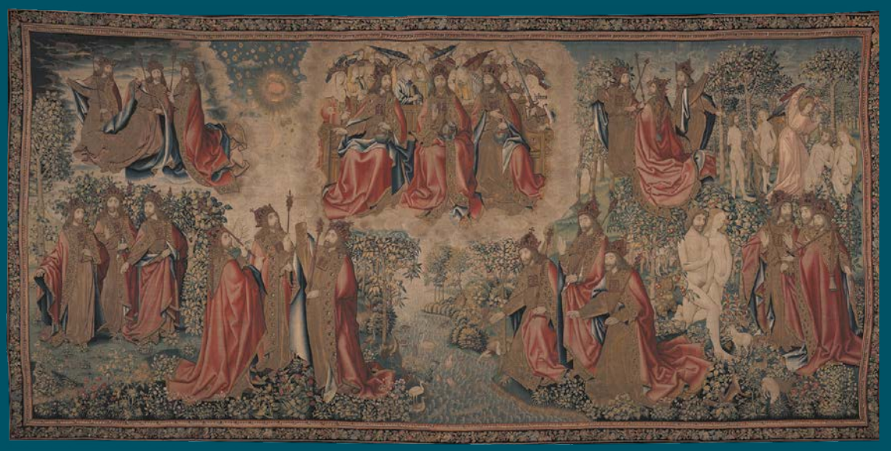
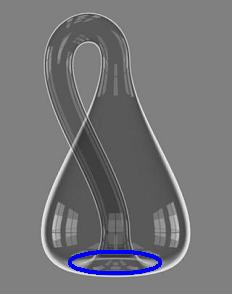
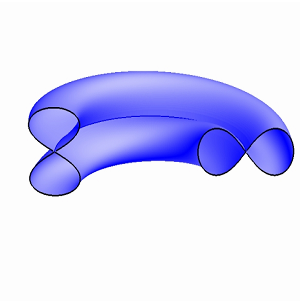

# Leçon 03 | 06 Janvier 1972

<!-- source-docx: S19b Le savoir du psychanalyste.docx -->
<!-- seminar: s19b -->
<!-- lesson: 03 -->

<!-- id: s19b-03-0001 -->

On ne sait pas si *la série* est le principe du *sérieux*.

<!-- id: s19b-03-0002 -->

Néanmoins je me trouve devant cette question de ce qu'évidemment je ne peux pas ici continuer ce qui ailleurs se définit de mon enseignement, de ce qu'on appelle *mon séminaire*.

<!-- id: s19b-03-0003 -->

Ne serait-ce que parce que tout le monde n'est pas averti que je fais une petite conversation par mois ici, et comme il y a des gens qui se dérangent, quelquefois d'assez loin, pour suivre ce que je dis ailleurs sous ce nom de « *séminaire* », et bien ça ne serait pas\... ça ne serait pas correct, je veux dire avec eux, de continuer ici.

<!-- id: s19b-03-0004 -->

Alors en somme il s'agit de savoir *ce que je fais ici*.

<!-- id: s19b-03-0005 -->

Il est certain que ce n'est pas tout à fait ce que j'attendais.

<!-- id: s19b-03-0006 -->

Je suis infléchi par cette affluence qui fait que ceux qu'en fait je convoquais à quelque chose qui s'appelait « *Le savoir du psychanalyste »*, ne sont pas du tout forcément absents d'ici, mais sont un peu noyés.

<!-- id: s19b-03-0007 -->

À ceux qui sont ici même, je ne sais pas si en faisant allusion à ce séminaire, je parle de quelque chose qu'ils connaissent. Il faut aussi qu'ils tiennnent compte que, par exemple depuis la dernière fois, ceux que je rencontre ici s'y sont trouvés, justement, je l'ai ouvert ce séminaire.

<!-- id: s19b-03-0008 -->

Je l'ai ouvert, si on est un peu attentif et rigoureux, on ne peut pas dire que ça puisse se faire en une seule fois. Effectivement, il y en a eu 2, et c'est pour ça que je peux dire que je l'ai ouvert, parce que s'il n'y avait pas eu de 2^ème^ fois, ben il n'y aurait pas de 1^ère^.

<!-- id: s19b-03-0009 -->

Ça a son intérêt *pour rappeler quelque chose* que j'ai introduit il y a un certain temps à propos de ce qu'on appelle *la répétition*.

<!-- id: s19b-03-0010 -->

*La répétition* ne peut évidemment commencer qu'à la 2^ème^ fois, qui se trouve\...

<!-- id: s19b-03-0011 -->

> du fait que si il n'y en avait pas de 2^ème^, il n'y aurait pas de 1^ère^ \...qui se trouve donc être celle qui inaugure la *répétition *: c'est l'histoire du 0 et du 1.

<!-- id: s19b-03-0012 -->

Seulement avec le 1, il ne peut pas y avoir de *répétition*, de sorte que pour qu'il y ait *répétition*, pas pour que ça soit ouvert, il faut qu'il y en ait une 3^ème^.

<!-- id: s19b-03-0013 -->

C'est ce dont on semble s'être aperçu à propos de Dieu \[*la « Trinité »*\] : il ne commence\... on a mis le temps à s'en apercevoir, ou bien on le savait depuis toujours, mais ça n'a pas été noté, parce que après tout, on ne peut jurer de rien dans ce sens, mais enfin mon cher ami Kojève insistait beaucoup sur cette question de *la Trinité chrétienne*.

<!-- id: s19b-03-0014 -->

Quoi qu'il en soit il y a évidemment un monde, du point de vue de ce qui nous intéresse\...

<!-- id: s19b-03-0015 -->

> et ce qui nous intéresse est analytique \...entre la 2^ème^ fois qui est ce que j'ai cru devoir souligner du terme de « *nachträg* » : *l'après-coup*\...

<!-- id: s19b-03-0016 -->

> c'est évidemment des choses que je ne reprendrai - pas ici - qu'à mon séminaire,
>
> j'essaierai d'y revenir cette année.

<!-- id: s19b-03-0017 -->

C'est important \[*la « Trinité », le 3^ème^ temps*\] parce que c'est en ça qu'il y a un monde entre

<!-- id: s19b-03-0018 -->

- ce qu'apporte la psychanalyse,

<!-- id: s19b-03-0019 -->

- et ce qu'a apporté une certaine tradition philosophique qui n'est certes pas négligeable, surtout quand il s'agit de Platon, qui a bien souligné la valeur de la *dyade*.

<!-- id: s19b-03-0020 -->

Je veux dire qu'à partir d'elle, tout dégringole. Qu'est-ce qui dégringole, il devait le savoir, mais il ne l'a pas dit

<!-- id: s19b-03-0021 -->

Quoi qu'il en soit, ça n'a rien à faire avec le *nachträg* analytique, le 2^nd^ temps.

<!-- id: s19b-03-0022 -->

Quant au 3^ème^ \[*temps*\] dont je viens de souligner l'importance, ça n'est pas seulement pour nous qu'il le prend, c'est pour Dieu lui-même.

<!-- id: s19b-03-0023 -->

Dans un temps, et à propos d'une certaine tapisserie[^4] qui étaient étalée au *Musée des Arts Décoratifs*, qui était bie belle, que j'ai vivement incité tout le monde à aller voir, on y voit « *Le Père et Le Fils et Le Saint Esprit »* qui étaient représentés strictement sous la même figure, la figure d'un personnage assez noble et barbu, ils étaient 3 à s'entre-regarder, ça fait beaucoup plus d'impression que de voir quelqu'un en face de son image.

<!-- id: s19b-03-0024 -->

À partir de 3 ça commence à faire un certain effet.

<!-- id: s19b-03-0025 -->

{width="3.237270341207349in" height="2.1527985564304464in"}

<!-- id: s19b-03-0026 -->

{width="6.29375in" height="3.1930555555555555in"}

<!-- id: s19b-03-0027 -->

De notre point de vue de sujets, qu'est-ce qui peut bien commencer à 3 pour Dieu lui-même ?

<!-- id: s19b-03-0028 -->

C'est une vieille question que j'ai posée très vite du temps que j'ai commencé mon enseignement.

<!-- id: s19b-03-0029 -->

Je l'ai posée très vite et puis je ne l'ai pas renouvelée, je vous dirai tout de suite pourquoi : c'est que ça n'est évidemment qu'à partir de 3 qu'il peut croire en lui-même.

<!-- id: s19b-03-0030 -->

Parce que c'est assez curieux, c'est une question qui n'a jamais été posée à ma connaissance « *Est-ce que Dieu croit en lui ?* ».

<!-- id: s19b-03-0031 -->

Ça serait pourtant un bon exemple pour nous.

<!-- id: s19b-03-0032 -->

C'est tout à fait frappant que cette question\...

<!-- id: s19b-03-0033 -->

> que j'ai posée assez tôt et que je ne crois pas vaine \...n'ait soulevé, apparemment au moins, aucun remou, au moins parmi mes corréligionnaires, je veux dire ceux qui se sont instruits à l'ombre de la Trinité.

<!-- id: s19b-03-0034 -->

Je comprends que pour les autres, ça ne les ait pas frappés, mais pour ceux-là, vraiment, ils sont « *incorreligionigibles* », il n'y a rien à en faire. Pourtant j'avais là quelques personnes notoires de la hiérarchie qu'on appelle « *chrétienne* ».

<!-- id: s19b-03-0035 -->

La question se pose de savoir si c'est parce qu'ils y sont ci-dedans\...

<!-- id: s19b-03-0036 -->

> ce que j'ai peine à croire \...qu'ils n'entendent rien, ou\...

<!-- id: s19b-03-0037 -->

> ce qui est de beaucoup plus probable \...qu'ils sont d'un athéisme assez intégral pour que cette question ne leur fasse aucun effet.

<!-- id: s19b-03-0038 -->

C'est la solution pour laquelle je penche.

<!-- id: s19b-03-0039 -->

On ne peut pas dire que ce soit ce que j'appelais tout à l'heure *une garantie de* *sérieux* puisque ça ne peut être qu'un athéisme, en quelque sorte une somnolence, ce qui est assez répandu.

<!-- id: s19b-03-0040 -->

En d'autres termes, ils n'ont pas la moindre idée de la dimension du milieu dans lequel il y a à nager : ils surnagent - ce qui n'est pas tout à fait pareil - ils surnagent grâce au fait qu'ils se tiennent la main.

<!-- id: s19b-03-0041 -->

Alors comme ça, ça finit par faire ce qu'on appelle un réseau, et à se tenir tous comme ça par la main. 

<!-- id: s19b-03-0042 -->

Il y a un poème de Paul Fort dans ce genre là [^5] : « *Si toutes les filles du monde -* ça commence comme ça - \...*se tenaient par la main, elles pourraient faire le tour du monde*\... ».

<!-- id: s19b-03-0043 -->

C'est une idée folle parce qu'en réalité *les filles du monde* n'ont jamais songé à ça, les garçons par contre\...

<!-- id: s19b-03-0044 -->

> il en parle aussi \...les garçons pour ça s'y entendent : ils se tiennent tous par la main.

<!-- id: s19b-03-0045 -->

Ils se tiennent tous par la main d'autant plus que s'ils ne se tenaient pas par la main, il faudrait que chacun affronte la fille tout seul, et ça ils aiment pas.

<!-- id: s19b-03-0046 -->

Il faut qu'ils se tiennent par la main.

<!-- id: s19b-03-0047 -->

Les filles, c'est une autre affaire.

<!-- id: s19b-03-0048 -->

Elles y sont entraînées dans le contexte de certains rites sociaux, conférez [*Les danses et légendes de la Chine ancienne*](http://classiques.uqac.ca/classiques/granet_marcel/A10_danses_et_legendes/danses_legendes.pdf), ça c'est *chic*, c'est même *Chou King* - pas *schoking* - *Chou King*.

<!-- id: s19b-03-0049 -->

Ce *Chou King* ça été écrit par un nommé Granet, qui avait une espèce de génie qui n'a abso­lument rien à faire

<!-- id: s19b-03-0050 -->

- ni avec l'ethnologie, il était incontestablement ethnologue,

<!-- id: s19b-03-0051 -->

- ni avec la sinologie, il était incontestablement sinologue*,* alors le nommé Granet donc, avançait que dans la chine antique, les filles et les garçons s'affron­taient à nombre égal : pourquoi ne pas le croire ?

<!-- id: s19b-03-0052 -->

Dans la pratique, dans ce que nous connaissons de nos jours :

<!-- id: s19b-03-0053 -->

- les garçons se mettent toujours un certain nombre, au­ delà de la dizaine, pour la raison que je vous ai exposée tout à l'heure \[*Rires*\], parce que, être tout seul, chacun à chacun en face de sa *chacune*, je vous l'ai expliqué : c'est trop plein de risques.

<!-- -->

<!-- id: s19b-03-0054 -->

- Pour les filles, c'est tout autre chose. Comme nous ne sommes plus au temps du *Chou King*, elles se groupent deux par deux, elles font amie­-amie avec une amie, jusqu'à ce qu'elles aient, bien entendu, arraché un gars à son régiment. Oui, monsieur ! \[*Rires*\]

<!-- id: s19b-03-0055 -->

Quoi que vous en pensiez et même si superficiels que vous paraissent ces propos, ils sont fondés, fondés sur mon expérience d'analyste. Quand elles ont détourné un gars de son régiment, naturellement elles laissent tomber l'amie, qui d'ailleurs ne s'en débrouille pas plus mal pour autant.

<!-- id: s19b-03-0056 -->

Oui ! Enfin tout ça, je me suis laissé un peu *entraîner*. Où est-ce que je me crois ! \[*Rires*\]

<!-- id: s19b-03-0057 -->

C'est venu comme ça de fil en aiguille, à cause de Granet et de cette histoire étonnante de ce qui alterne d ans les poèmes du *Chou King *: ce chœur de garçons opposé au chœur des filles.

<!-- id: s19b-03-0058 -->

Je me suis laissé entraîner comme ça à parler de mon expérience analytique, sur laquelle j'ai fait un *flash*, ça n'est pas le fond des choses.

<!-- id: s19b-03-0059 -->

C'est pas ici que j'expose le fond des choses.

<!-- id: s19b-03-0060 -->

Mais où est-ce que je suis, que je me crois, pour parler en somme, pour parler du fond des choses.

<!-- id: s19b-03-0061 -->

Je me croirais presque avec des êtres humains, ou cousus main, même !

<!-- id: s19b-03-0062 -->

C'est comme ça, c'est pourtant comme ça que je m'adresse à eux.

<!-- id: s19b-03-0063 -->

Mais c'est ça, c'est de parler de mon séminaire qui m'a entraîné.

<!-- id: s19b-03-0064 -->

Comme après tout vous êtes peut-être les mêmes, j'ai parlé comme si je parlais à eux, ce qui m'a entraîné à parler comme si je parlais *de vous* et - qui sait ? - ça entraîne à parler comme si je parlais *à vous*.

<!-- id: s19b-03-0065 -->

Ce qui n'était quand même pas dans mes intentions. \[*Rires*\]

<!-- id: s19b-03-0066 -->

C'était pas du tout dans mes intentions parce que, si je suis venu parler à Sainte-Anne, c'était pour parler aux psychiatres, et très évidemment vous n'êtes pas tous psychiatres.

<!-- id: s19b-03-0067 -->

Alors, enfin ce qu'il y a de certain *c'est que c'est un acte manqué*\... *c'est un acte manqué* qui donc à tout instant risque de réussir, c'est-à-dire qu'il se pourrait bien que je parle quand même à quelqu'un.

<!-- id: s19b-03-0068 -->

Comment savoir à qui je parle ?

<!-- id: s19b-03-0069 -->

Surtout qu'en fin de compte vous comptez dans l'affaire\...

<!-- id: s19b-03-0070 -->

> quoique je m'efforce \...vous comptez au moins pour ceci que je ne parle pas de là où je comptais parler puisque je comptais parler à l'amphithéâtre Magnan et que je parle à la chapelle.

<!-- id: s19b-03-0071 -->

Quelle histoire ! Vous avez entendu ? Vous avez entendu ? J*e parle à la chapelle* !

<!-- id: s19b-03-0072 -->

C'est la réponse. Je parle à la chapelle, c'est à dire *aux murs* ! \[*Rires*\]

<!-- id: s19b-03-0073 -->

De plus en plus réussi, l'acte manqué !

<!-- id: s19b-03-0074 -->

Je sais maintenant à qui je suis venu parler : à ce à quoi j'ai toujours parlé à Sainte-Anne, aux murs !

<!-- id: s19b-03-0075 -->

J'ai pas besoin d'y revenir, ça fait une paye.

<!-- id: s19b-03-0076 -->

De temps en temps, je suis revenu avec un petit titre de conférence sur « *Ce que j'enseigne*\... » par exemple, et puis quelques autres, je vais pas faire la liste. J'y ai toujours parlé aux murs.

<!-- id: s19b-03-0077 -->

X - \...

<!-- id: s19b-03-0078 -->

Lacan - Qui a quelque chose à dire ?

<!-- id: s19b-03-0079 -->

X - *On devrait tous sortir si vous parlez aux murs.*

<!-- id: s19b-03-0080 -->

Lacan - Qui\... qui me parle là ? \[*Rires*\]

<!-- id: s19b-03-0081 -->

X - *Les murs.*

<!-- id: s19b-03-0082 -->

Lacan

<!-- id: s19b-03-0083 -->

C'est maintenant que je vais pouvoir faire commentaire de ceci qu'à parler aux murs, ça intéresse quelques personnes.

<!-- id: s19b-03-0084 -->

C'est pourquoi je demandais à l'instant *qui* parlait.

<!-- id: s19b-03-0085 -->

Il est certain que *les murs* dans ce qu'on appelle, dans ce qu'on appelait au temps où on était honnête « *un asile »*, « *l'asile clinique »* comme on disait, les murs tout de même, c'est pas rien.

<!-- id: s19b-03-0086 -->

Mais je dirais plus : cette *chapelle* ça me paraît bien un lieu extrêmement bien fait pour que nous touchions de quoi il s'agit quand je parle des murs.

<!-- id: s19b-03-0087 -->

Cette sorte de concession de la laïcité aux internés : une chapelle avec sa garniture d'aumôniers, bien sûr.

<!-- id: s19b-03-0088 -->

C'est pas qu'elle soit formidable - hein ? - du point de vue architectural, mais enfin c'est une chapelle, une chapelle avec la disposition qu'on en attend.

<!-- id: s19b-03-0089 -->

On omet trop que l'architecte, quelque effort qu'il fasse pour en sortir, il est fait pour ça, pour faire des murs.

<!-- id: s19b-03-0090 -->

*Et que les murs*, ma foi\...

<!-- id: s19b-03-0091 -->

> c'est quand même très frappant que depuis, ce dont je parlais tout à l'heure,
>
> à savoir *le christianisme*, penche peut-être par là un peu trop vers *l'hégélianisme* \...mais *c'est fait pour entourer un vide*.

<!-- id: s19b-03-0092 -->

Comment imaginer qu'est-ce qui remplissait les murs du Parthénon et de quelques autres babioles de cette espèce dont il nous reste quelques murs écroulés, c'est très difficiles à savoir.

<!-- id: s19b-03-0093 -->

Ce qu'il y a de certain, c'est que nous n'en avons absolument aucun témoignage.

<!-- id: s19b-03-0094 -->

Nous avons le sentiment que pendant toute cette période que nous épinglons de cette étiquette moderne du *paganisme*, il y avait des choses qui se passaient dans diverses fêtes qu'on appelle \[païennes\], on a conservé les noms de ce que c'était parce qu'il y a des Annales qui dataient les choses comme ça :

<!-- id: s19b-03-0095 -->

> « *C'est aux grandes Panathénées qu'Adymante et Glaucon* - vous savez la suite - *ont rencontré le nommé Céphale* ».

<!-- id: s19b-03-0096 -->

Qu'est-ce qui s'y passait ? C'est absolument incroyable que nous n'en n'ayons pas la moindre espèce d'idée !

<!-- id: s19b-03-0097 -->

Par contre pour ce qui est du vide, nous en avons une grande, parce que tout ce qui nous est resté légué, légué par une tradition qu'on appelle philo­sophique, ça fait une grande place au vide.

<!-- id: s19b-03-0098 -->

Il y a même un nommé Platon qui a fait pivoter autour de là toute son *Idée du monde*, c'est le cas de le dire, c'est lui qui a inventé « *la caverne »*. Il en a fait une *chambre noire *: il y avait quelque chose qui se passait à l'extérieur, et tout ça en passant par un petit trou faisait toutes les ombres.

<!-- id: s19b-03-0099 -->

C'est curieux, c'est là que peut-être on aurait un petit fil, un petit bout de trace.

<!-- id: s19b-03-0100 -->

C'est manifestement une théorie qui nous fait toucher du doigt ce qu'il en est de *l'objet(a)*.

<!-- id: s19b-03-0101 -->

Supposez que la caverne de Platon, ça soit ces murs où se fait entendre ma voix.

<!-- id: s19b-03-0102 -->

Il est manifeste que les murs, ça me fait *jouir* !

<!-- id: s19b-03-0103 -->

Et c'est en ça que vous jouissez tous, et tout un chacun, par participation.

<!-- id: s19b-03-0104 -->

Me voir parler aux murs est quelque chose qui ne peut pas vous laisser indifférents.

<!-- id: s19b-03-0105 -->

Et réfléchissez, sup­posez que Platon ait été structuraliste* *: il se serait aperçu de ce qu'il en est de la caverne vraiment, à savoir que c'est sans doute là qu'est né le langage.

<!-- id: s19b-03-0106 -->

Il faut retourner l'affaire, parce que bien sûr, il y a longtemps que l'homme vagit, comme n'importe lequel des petits animaux, enfin ils piaillent pour avoir le lait maternel.

<!-- id: s19b-03-0107 -->

Mais pour s'apercevoir qu'il est capable de faire quelque chose que bien entendu il entend depuis longtemps, dans le babillage, le bafouillage, tout se produit, mais pour choisir, il a dû s'apercevoir

<!-- id: s19b-03-0108 -->

- que les « K » ça résonne mieux du fond, le fond de la caverne, du dernier mur,

<!-- id: s19b-03-0109 -->

- et que les « B » et les « P » ça jaillit mieux à l'entrée, c'est là qu'il en a entendu la résonance.

<!-- id: s19b-03-0110 -->

Je me laisse entraîner ce soir, puisque *je parle aux murs*.

<!-- id: s19b-03-0111 -->

Il ne faut pas croire que ce que je vous dis, ça veut dire que j'ai rien tiré d'autre de Sainte-Anne.

<!-- id: s19b-03-0112 -->

À Sainte-Anne je ne suis arrivé à parler que très tard, je veux dire que ça ne m'était pas venu à l'idée sauf à accomplir quelques devoirs de broutille.

<!-- id: s19b-03-0113 -->

Quand j'étais chef de clinique, je racontais quelques petites histoires aux stagiaires, c'est même là que j'ai appris à me tenir à carreau sur les histoires que je raconte.

<!-- id: s19b-03-0114 -->

Je racontais un jour l'histoire d'une mère de patient, un charmant homosexuel que j'analysais, et n'ayant pas pu faire autrement que de la voir arriver - la tordue en question - elle avait eu ce cri : « *Et moi qui croyait qu'il était impuissant !* ».

<!-- id: s19b-03-0115 -->

Je raconte l'histoire, dix personnes parmi les - il n'y avait pas que des stagiaires - ils la reconnaissent tout de suite !

<!-- id: s19b-03-0116 -->

Ça ne pouvait être qu'elle ! Vous vous rendez compte de ce que c'est qu'une personne mondaine !

<!-- id: s19b-03-0117 -->

Ça a fait une histoire naturellement, parce qu'on me l'a reproché, alors que je n'avais absolument rien dit d'autre que ce cri sensa­tionnel.

<!-- id: s19b-03-0118 -->

Ça m'inspire depuis beaucoup de prudence pour la communication des cas.

<!-- id: s19b-03-0119 -->

Mais enfin, c'est encore une petite digression, reprenons le fil.

<!-- id: s19b-03-0120 -->

Avant de parler à Sainte-Anne, enfin j'y ai fait bien d'autres choses, ne serait-ce que d'y venir et d'y remplir ma fonction, et bien entendu, pour moi, pour mon discours, tout part de là.

<!-- id: s19b-03-0121 -->

Parce qu'il est évident que si *je parle aux murs*, je m'y suis mis tard, à savoir qu'avant d'entendre ce qu'ils me renvoient, c'est-à-dire ma propre voix prêchant dans le désert\...

<!-- id: s19b-03-0122 -->

> *c'est une réponse à* *la personne* -- \[*cf. supra,* *la personne* X : « *On devrait tous sortir si vous parlez aux murs »*\] \...bien avant ça j'ai entendu, j'ai entendu des choses tout à fait décisives, enfin qui l'on été pour moi.

<!-- id: s19b-03-0123 -->

Mais ça c'est mon affaire personnelle.

<!-- id: s19b-03-0124 -->

Je veux dire que les gens qui sont ici au titre d'être entre les murs, sont tout à fait capables de se faire entendre, à condition qu'on ait les esgourdes appropriées !

<!-- id: s19b-03-0125 -->

Pour tout dire, et lui rendre hommage de quelque chose où en somme elle n'est personnellement pour rien, c'est, comme chacun sait, autour de cette malade que j'ai épinglée du nom d'Aimée\...

<!-- id: s19b-03-0126 -->

> qui n'était pas le sien bien sûr \...que j'ai été aspiré vers la psychanalyse. Il n'y a pas qu'elle bien sûr.

<!-- id: s19b-03-0127 -->

Il y en a eu quelque autres avant et puis il y en a encore pas mal à qui je laisse la parole.

<!-- id: s19b-03-0128 -->

C'est en ça que consiste ce qu'on appelle mes « *présentations de malades* ».

<!-- id: s19b-03-0129 -->

Il m'arrive après d'en parler avec quelques personnes qui ont assisté à cette sorte d'exercice\...

<!-- id: s19b-03-0130 -->

> enfin cette présentation qui consiste à les écouter,
>
> ce qui évidemment ne leur arrive pas à tous les coins de rue \...il arrive qu'en en parlant après\...

<!-- id: s19b-03-0131 -->

> avec quelques personnes qui étaient là pour m'accompagner, pour en attraper ce qu'elles pouvaient \...il m'arrive en en parlant après, d'en apprendre, parce que c'est pas tout de suite, il faut évidemment qu'on accorde sa voix à la renvoyer sur les murs.

<!-- id: s19b-03-0132 -->

C'est bien autour de ça que va tourner ce que je vais essayer peut-être cette année, de mettre en question, c'est le rapport de quelque chose à quoi je donne beaucoup d'importance, c'est à savoir *la logique*.

<!-- id: s19b-03-0133 -->

J'ai appris très tôt ce que la logique pouvait rendre « *odieux au monde* ».

<!-- id: s19b-03-0134 -->

C'était dans un temps où je pratiquais un certain Abélard [^6], Dieu sait attiré par je ne sais quelle odeur de mouche !

<!-- id: s19b-03-0135 -->

Moi, la logique, je peux pas dire qu'elle m'ait rendu absolument odieux à quiconque sauf à quelques psychanalystes, parce que malgré tout, c'est peut-être parce que j'arrive à sérieusement en « *tamponner* » le sens.

<!-- id: s19b-03-0136 -->

J'y arrive d'autant plus facilement, que je ne crois absolument pas au *sens commun*.

<!-- id: s19b-03-0137 -->

Il y a du sens, mais il n'y en a pas de *commun*.

<!-- id: s19b-03-0138 -->

Il n'y a probablement pas un seul d'entre vous qui m'entendiez *dans le même sens*.

<!-- id: s19b-03-0139 -->

D'ailleurs je m'efforce que de *ce sens*, l'accès ne soit pas trop aisé, *de sorte que vous deviez en mettre du vôtre*, ce qui est *une secrétion* salubre, et même thérapeutique* *: *secrétez* le sens avec vigueur et vous verrez combien la vie devient plus aisée !

<!-- id: s19b-03-0140 -->

C'est bien pour ça que je me suis aperçu de l'existence de *l'objet(a)* dont chacun de vous a le germe en puissance.

<!-- id: s19b-03-0141 -->

Ce qui fait sa force, et du même coup la force de chacun de vous en particulier, c'est que *l'objet(a)* est tout à fait étranger à la question du *sens*.

<!-- id: s19b-03-0142 -->

Le sens est une petite peinturlure rajoutée sur cet *objet(a)* avec lequel vous avez chacun votre attache particulière.

<!-- id: s19b-03-0143 -->

Ça n'a rien à faire, ni avec *le sens* ni avec *la raison*.

<!-- id: s19b-03-0144 -->

La question à l'ordre du jour c'est ce que la raison a à faire avec ce à quoi\...

<!-- id: s19b-03-0145 -->

enfin je dois dire que *beaucoup penchent à la réduire à la* « *réson* ». Écrivez : *r.é.s.o.n.* Écrivez, faites moi plaisir.

<!-- id: s19b-03-0146 -->

C'est une orthographe de Francis Ponge qui, étant poète et étant ce qu'il est, un grand poète, n'est pas tout à fait sans qu'on doive en cette ques­tion tenir compte de ce qu'il nous raconte. Il n'est pas le seul.

<!-- id: s19b-03-0147 -->

C'est une très grave question, que je n'ai vu sérieusement formulée que - outre ce poète - au niveau des mathématiciens, c'est à savoir ce que la raison\...

<!-- id: s19b-03-0148 -->

> dont nous nous contenterons pour l'instant de saisir qu'elle part de l'appareil grammatical \...a à faire avec quelque chose qui s'imposerait, je veux pas dire d'*intuitif*\...

<!-- id: s19b-03-0149 -->

> car ce serait retomber sur la pente de l'intuition, c'est-à-dire de quelque chose de *visuel* \...mais avec quelque chose justement de *résonnant*.

<!-- id: s19b-03-0150 -->

Est-ce que ce qui *résonne*, c'est l'origine de la « *res* », de ce qu'on fait la réalité ?

<!-- id: s19b-03-0151 -->

*C'est une question qui touche* à très proprement parler *à tout ce* qu'il en est *qu'on puisse extraire du langage au titre de la logique.*

<!-- id: s19b-03-0152 -->

Cha­cun sait qu'elle ne suffit pas et qu'il lui a fallu depuis quelques temps\...

<!-- id: s19b-03-0153 -->

> on aurait pu le voir venir depuis un bout de temps, depuis Platon précisément \...mettre en jeu la mathématique.

<!-- id: s19b-03-0154 -->

Et c'est là, c'est là que la question se pose d'où centrer ce *réel* à quoi l'interrogation logique nous fait recourir, et qui se trouve être au niveau mathématique.

<!-- id: s19b-03-0155 -->

Il y a des mathématiciens pour dire

<!-- id: s19b-03-0156 -->

- qu'on ne peut point s'axer sur cette jonction dite formaliste, ce point de jonction mathético-logique,

<!-- id: s19b-03-0157 -->

- qu'il y a quelque chose au-delà, auquel après tout ne fait que rendre hommage toutes les références intuitives dont on a cru pouvoir, cette mathématique, la purifier, \...et qui cherchent au-delà, à quelle *réson* - *r.é.s.o.n* - recourir pour ce dont il s'agit, à savoir du *Réel*.

<!-- id: s19b-03-0158 -->

Ce n'est pas ce soir, bien sûr, que je vais pouvoir aborder la chose.

<!-- id: s19b-03-0159 -->

Ce que je peux dire, c'est que par un certain biais qui est celui d'une logique, que j'ai pu\...

<!-- id: s19b-03-0160 -->

> dans *un parcours* qui pour partir de ma malade Aimée, a abouti à *-* l'avant-dernière année de séminaire *-*
>
> énoncer sous le titre de « *quatre discours* », vers quoi converge le crible d'une certaine *actualité* \...que j'ai pu, par cette voie - quoi faire ? - donner au moins la raison des murs.

<!-- id: s19b-03-0161 -->

Car quiconque y habite dans ces murs, ces murs-ci, les murs de l'a­sile clinique, il convient de savoir que ce qui situe et définit *le psychiatre* en tant que tel, c'est sa situation par rapport à ces murs, ces murs par quoi la laïcité a fait en elle exclusion de la folie et de ce que ça veut dire.

<!-- id: s19b-03-0162 -->

Ce qui ne s'aborde que par la voie d'une analyse du discours.

<!-- id: s19b-03-0163 -->

À vrai dire, l'analyse a été si peu faite avant moi, qu'il est vrai de dire qu'il n'y a jamais eu, de la part des psychanalystes, la moindre discordance qui s'élevât à l'endroit de la position du psychiatre.

<!-- id: s19b-03-0164 -->

Et que pourtant dans mes « *Écrits »* on voit recueilli quelque chose que j'ai fait entendre dès avant 1950 sous le titre de « *Propos sur la causalité psychique »*, je m'y élevais contre toute définition de la maladie mentale qui s'abritât de cette construction faite d'un semblant qui, pour s'épingler de l'*« organodynamisme »*, ne laissait pas moins entièrement à côté ce dont il s'agit dans la ségrégation de la maladie mentale, à savoir quelque chose qui est Autre, qui est lié à un certain discours, celui que j'é­pingle du *discours du Maître*.

<!-- id: s19b-03-0165 -->

Encore l'histoire montre-t-elle qu'il a vécu pendant des siècles, ce discours, d'une façon profitable pour tout le monde, jusqu'à un certain détour où il est devenu, en raison *d'un infime glissement* qui est passé inaperçu des intéressés eux-mêmes, ce qui le spécifie dès lors comme « *le discours du capitaliste »*, dont nous n'aurions aucune espèce d'idée si Marx ne s'était pas employé à le compléter, à lui donner *son sujet* : *le prolétaire*.

<!-- id: s19b-03-0166 -->

Grâce à quoi *le dis­cours du capitalisme*, s'épanouit partout où règne la forme d'État marxiste\...

<!-- id: s19b-03-0167 -->

Ce qui distingue *le discours du capitalisme* est ceci : la *Verwerfung*, le *rejet*, *le rejet en dehors de tous les champs du symbolique* avec ce que j'ai déjà dit que ça a comme conséquence. Le *rejet* de quoi ? De la *castration*.

<!-- id: s19b-03-0168 -->

Tout ordre, tout discours, qui s'apparente du capitalisme, laisse de côté ce que nous appellerons simplement *les choses de l'amour*, mes bons amis.

<!-- id: s19b-03-0169 -->

Vous voyez ça, hein, c'est un rien !

<!-- id: s19b-03-0170 -->

C'est bien pour ça que deux siècles après ce glissement\...

<!-- id: s19b-03-0171 -->

> appelons-­le « *calviniste* », après tout pourquoi pas ? \...la castration a fait enfin son entrée irrup­tive sous la forme du *discours analytique*.

<!-- id: s19b-03-0172 -->

Naturellement *le discours analytique* n'a pas encore été foutu d'en donner même une ébauche d'articulation, mais enfin il en a multiplié la métaphore et il s'est aperçu que toutes les métonymies en sortaient.

<!-- id: s19b-03-0173 -->

Voilà au nom de quoi\...

<!-- id: s19b-03-0174 -->

> porté par une sorte, une espèce de *brouhaha* qui s'était produit quelque part du côté des psychanalystes \...j'ai été amené à introduire ce qu'il y avait d'évident dans la nouveauté psychanalytique, à savoir qu'il s'agissait de *langage* et que c'était un nouveau *discours*.

<!-- id: s19b-03-0175 -->

Comme je vous l'ai dit, enfin *l'objet(a) en personne*, c'est-à-dire cette position dans laquelle on ne peut même pas dire que se porte le psychanalyste : il y est porté, il y est porté par son analysant.

<!-- id: s19b-03-0176 -->

La question que je pose c'est : com­ment est-ce qu'un analysant peut jamais avoir envie de devenir psychanalyste ?

<!-- id: s19b-03-0177 -->

C'est impensable !

<!-- id: s19b-03-0178 -->

Ils y arrivent\...

<!-- id: s19b-03-0179 -->

> comme les billes de certains jeux de *tric-trac*
>
> comme ça que vous connaissez bien, qui finissent par tomber dans le machin \...ils y arrivent sans avoir la moindre idée de ce qui leur arrive.

<!-- id: s19b-03-0180 -->

Enfin, une fois qu'ils sont là, ils y sont, et il y a à ce moment-là, tout de même quelque chose qui s'éveille, c'est pour ça que j'en ai proposé l'étude.

<!-- id: s19b-03-0181 -->

Quoi qu'il en soit, à l'époque où s'est produit ce tourbillon parmi les billes, on peut pas dire dans quelle gaîté j'ai écrit ce « *Fonction et champ de la parole et du langage »*.

<!-- id: s19b-03-0182 -->

Comment se fait-il que j'ai accueilli comme ça\...

<!-- id: s19b-03-0183 -->

> parmi toutes sortes d'autres choses sensées \...une sorte d'exergue du genre ritournelle, que vous trouverez dans\... vous n'avez qu'à regarder au niveau de la partie IV, pour autant que je me souvienne, un truc que j'avais trouvé dans un almanach, ça s'appelait : *Paris en l'an 2000*.

<!-- id: s19b-03-0184 -->

C'est pas sans talent !

<!-- id: s19b-03-0185 -->

C'est pas sans talent encore qu'on ait jamais plus entendu parler du nom du type, dont je cite le nom - je suis honnête - et qui raconte cette chose qui n'a\...

<!-- id: s19b-03-0186 -->

enfin qui vient là dans cette histoire de « *Fonction et champ*\... » comme des cheveux sur la soupe, ça commence comme ça :

<!-- id: s19b-03-0187 -->

> « *Entre l'homme et la femme, il y a l'amour,*
>
> *Entre l'homme et l'amour,*\...

<!-- id: s19b-03-0188 -->

Vous l'avez jamais remarqué, hein, ce truc-là, dans son machin !

<!-- id: s19b-03-0189 -->

> \...*il y a un monde.*
>
> *Entre l'homme et le monde, il y a un mur.* » \[Antoine Tudal in « *Paris en l'an 2000* »\]

<!-- id: s19b-03-0190 -->

Vous voyez, j'avais prévu ce que je vous dirai ce soir : « *je parle aux murs *! ».

<!-- id: s19b-03-0191 -->

Vous verrez, ça n'a aucun rapport avec le chapitre qui suit \[*Rires*\], mais j'ai pas pu y résister.

<!-- id: s19b-03-0192 -->

Comme ici je parle aux murs, je fais pas de cours, alors je vais pas vous dire ce qui dans Jakobson suffit à justifier que ces six vers de mirliton soient quand même de la poésie, de la poésie proverbiale, parce que ça ronronne :

<!-- id: s19b-03-0193 -->

> « *Entre l'homme et la femme, il y a l'amour*\...

<!-- id: s19b-03-0194 -->

\- Mais bien sûr ! Il n'y a que ça, même, !

<!-- id: s19b-03-0195 -->

> \...*Entre l'homme et l'amour, il y a un monde*\...

<!-- id: s19b-03-0196 -->

C'est toujours ce qu'on dit : « *il y a un monde* », comme ça « *il y a un monde* » ça veut dire : *Vous ! vous y arriverez jamais !*

<!-- id: s19b-03-0197 -->

Mine de rien, au début : « *Entre l'homme et la femme, il y a l'amour* », ça veut dire que \[Lacan frappe dans ses mains\] ça colle, un monde ça flotte, hein !

<!-- id: s19b-03-0198 -->

Mais avec « *il y a un mur* » alors là vous avez compris que « *entre* » veut dire « *interposition* ».

<!-- id: s19b-03-0199 -->

Parce que c'est très ambigu, le « *entre* ».

<!-- id: s19b-03-0200 -->

Ailleurs, à mon séminaire, nous parlerons de la *mésologie*, qu'est-ce qui a fonction d'*entre*, mais là nous sommes dans *l'ambiguité poétique* et il faut le dire, ça vaut le coup.

<!-- id: s19b-03-0201 -->

*Réson ! Effacez réson !* \[du tableau\] *Amour.*

<!-- id: s19b-03-0202 -->

{width="1.1083300524934383in" height="1.4067268153980752in"} {width="1.015599300087489in" height="1.4070286526684164in"}

<!-- id: s19b-03-0203 -->

L'amour il est là : là le petit rond \[*en bleu*\]. Bon !

<!-- id: s19b-03-0204 -->

Ce que je viens de vous tracer là au tableau, ce tableau qui tourne, c'est une façon comme une autre, de représenter la *bouteille de Klein*.

<!-- id: s19b-03-0205 -->

C'est une surface qui a certaines propriétés topologiques sur lesquelles ceux qui n'en sont pas informés se renseigneront, *ça ressemble beaucoup* *à une bande de Mœbius*, c'est-à-dire à simplement ce qu'on fait en tordant une petite bande de papier, et en collant la chose après un demi-tour.

<!-- id: s19b-03-0206 -->

Seulement-là ça fait tube, c'est un tube qui à un certain endroit, se rebrousse.

<!-- id: s19b-03-0207 -->

Je veux pas vous dire que ce soit la définition topologique de la chose, c'est une façon de l'imager dont j'ai fait déjà assez d'usage pour qu'une partie des personnes qui sont ici sachent de quoi je parle.

<!-- id: s19b-03-0208 -->

Alors voyez-vous, comme tout de même l'hypothèse c'est que, entre *l'homme* et *la femme* ça devrait faire là, comme disait Paul Fort tout à l'heure, *un rond*, alors j'ai mis *l'homme* à gauche, pure convention, *la femme* à droite, j'aurais pu le faire inversement.

<!-- id: s19b-03-0209 -->

Essayons de voir topologiquement ce qui m'a plu dans ces six petits vers d'Antoine Tudal pour le nommer.

<!-- id: s19b-03-0210 -->

« *Entre l'homme et la femme, il y a l'amour* ».

<!-- id: s19b-03-0211 -->

Ça communique à plein tube. Là, vous voyez, ça cir­cule !

<!-- id: s19b-03-0212 -->

C'est mis en commun, le flux, l'influx et tout ce qu'on y rajoute quand on est obsessionnel, par exemple l'oblativité, cette sensationnelle invention d'obsessionnel.

<!-- id: s19b-03-0213 -->

Bon ! Alors l'amour il est là : le petit rond, le petit rond *qui est là partout,* à part qu'il y a un endroit où ça va se rebrousser, et vachement !

<!-- id: s19b-03-0214 -->

Mais restons-en au premier temps : entre l'homme (à gauche), la femme (à droite), il y a *l'amour*, c'est le petit rond.

<!-- id: s19b-03-0215 -->

Ce personnage dont je vous ai dit qu'il s'appelait Antoine, ne croyez pas du tout que je dise jamais un mot de trop, c'est pour vous dire qu'il était du sexe masculin, de sorte qu'il voit les choses de son côté.

<!-- id: s19b-03-0216 -->

Il s'agit de voir ce qu'il va y avoir maintenant\...

<!-- id: s19b-03-0217 -->

> comment on peut l'écrire \...ce qu'il va y avoir entre l'homme, c'est-à-dire lui, le « *pouète* »\...

<!-- id: s19b-03-0218 -->

> le « *pouète de Pouasie* », comme disait le cher Léon-Paul Fargue \...qu'est-ce qu'il y a entre lui et l'amour ?

<!-- id: s19b-03-0219 -->

Est-ce que je vais être forcé de remonter au tableau ?

<!-- id: s19b-03-0220 -->

Vous avez vu que c'était un exercice un peu vacillant.

<!-- id: s19b-03-0221 -->

Bon ! eh ben, pas du tout, pas du tout\... parce que quand même, à gauche, il occupe toute la place.

<!-- id: s19b-03-0222 -->

Donc *ce qu'il y a entre lui et l'amour*, c'est justement ce qui est de l'autre côté, c'est-à-dire que *c'est la partie droite du schéma.*

<!-- id: s19b-03-0223 -->

« *Entre l'homme et l'amour, il y a un monde* »

<!-- id: s19b-03-0224 -->

C'est-à­-dire que ça recouvre le territoire d'abord occupé par *la femme*, là où j'ai écrit F dans la partie droite.

<!-- id: s19b-03-0225 -->

C'est pour ça que celui que nous appellerons *l'homme* dans l'occasion, il s'imagine qu'il « *connaît* » le monde \- au sens biblique comme ça - qu'il « *connaît* » le monde, c'est-à-dire tout simplement cette sorte de *rêve de savoir* qui vient là à la place de ce qui était là dans ce petit schéma, marquée de l'F de la femme.

<!-- id: s19b-03-0226 -->

> Ce qui nous permet de voir topologiquement tout à fait ce dont il s'agit, c'est que ensuite quand on nous dit :
>
> « *entre l'homme et le monde* » ce monde substitué à la volatilisation du partenaire sexuel\...
>
> comment est-ce que c'est arrivé, c'est ce que nous verrons après
>
> \...ben « *il y a un mur* », c'est-à-dire l'endroit où se produit ce *rebroussement*,
>
> ce *rebroussement* que j'ai introduit un jour comme signifiant la jonction entre *vérité* et *savoir*.
>
> J'ai pas dit, moi, que c'était coupé, c'est *un poète de Papouasie* qui dit que c'est un mur.
>
> *C'est pas un mur : c'est simplement le lieu de la castration.*
>
> *Ce qui fait que le savoir laisse intact le champ de la vérité, et réciproquement*.
>
> Seulement ce qu'il faut voir c'est que *ce mur il est partout*, car c'est ce qui définit cette surface,
>
> c'est que *le cercle ou le point de rebroussement,* disons le cercle puisque là je l'ai représenté par un cercle,
>
> il est homogène sur toute la surface.

<!-- id: s19b-03-0227 -->

{width="0.9760968941382328in" height="1.2388932633420822in"} {width="1.2412281277340333in" height="1.244811898512686in"}

<!-- id: s19b-03-0228 -->

C'est même ce qui fait que vous auriez tort de vous la représenter comme une surface intuitivement représentable.

<!-- id: s19b-03-0229 -->

Si je vous montrais tout de suite la sorte de coupure qui suffit à *la volatiliser* cette surface\...

<!-- id: s19b-03-0230 -->

> en tant que spécifique, topologiquement définie \...*la volatiliser* instantanément, vous verriez que c'est pas une surface qu'on se représente, mais que c'est quelque chose qui se définit par certaines *coordonnées*\...

<!-- id: s19b-03-0231 -->

> appelons-les si vous voulez, *vectorielles* \...telles qu'en cha­cun des points de la surface *le rebroussement* soit toujours là, en chacun de ses points.

<!-- id: s19b-03-0232 -->

De sorte que, quant au rapport entre *l'homme* et *la femme* et tout ce qui en résulte au regard de chacun des partenaires, à savoir sa position comme aussi bien son savoir, *la castration* elle est partout.

<!-- id: s19b-03-0233 -->

L'*amour*, l'*amour*, que ça communique, que ça flue, que ça fuse, que c'est l'*amour*, quoi !

<!-- id: s19b-03-0234 -->

L'*amour*, *le bien* que veut la mère pour son fils, l'« *(a)mur* », il suffit de mettre entre parenthèses le *(a)* pour retrouver ce que nous trouvons du doigt tous les jours : c'est que même *entre* la mère et le fils, le rapport que la mère a avec *la castration*, ça compte pour un bout !

<!-- id: s19b-03-0235 -->

Peut-être, pour se faire une saine idée de ce qu'il en est de l'amour, il faudrait peut-être partir de ce que, quand ça se joue, mais sérieusement entre un homme et une femme, c'est toujours avec l'enjeu de la castration.

<!-- id: s19b-03-0236 -->

C'est ce qui est *châtrant*.

<!-- id: s19b-03-0237 -->

Et qu'est-ce qui passe par ce défilé de la *castration*, c'est quelque chose que nous essaierons d'approcher par des voies qui soient un peu rigoureuses : elles ne peuvent l'être que *logiques*, et même *topologiques*.

<!-- id: s19b-03-0238 -->

> Ici je parle aux murs voire aux « *(a)murs* » et aux *(a)murs-sements,* ailleurs j'essaie d'en rendre compte.
>
> Et quelque que puisse être l'usage des murs pour le maintien en forme de la voix, il est clair que les murs,
>
> pas plus que le reste, ne peuvent avoir de support intuitif, même avec tout l'art de l'architecte à la clé.

<!-- id: s19b-03-0239 -->

Chose curieuse, quand j'ai défini ces 4 *discours*, dont je parlais tout à l'heure et qui sont si essentiels pour repérer ce dont, quoi que vous fas­siez, vous êtes toujours en quelque façon *les sujets*, et *des sujets*, je veux dire des « *supposés* », supposés à ce qui se passe *d'un signifiant* dont il est clair que c'est lui *le maître du jeu,* et que vous n'en êtes\...

<!-- id: s19b-03-0240 -->

> au regard de quelque chose qui est autre, pour ne pas dire l'Autre \...que vous n'en êtes que le *supposé*.

<!-- id: s19b-03-0241 -->

Vous ne lui donnez pas de *sens*, vous n'en avez pas assez vous-mêmes pour ça, mais vous lui donnez *un corps* à ce signifiant qui vous représente, *le signifiant-Maître* !

<!-- id: s19b-03-0242 -->

Eh bien ce que vous êtes là-dedans, *ombres d'ombre*, ne vous imaginez pas que *la substance*, qu'il est du rêve de toujours de vous attri­buer, soit autre chose que cette jouissance dont vous êtes coupés.

<!-- id: s19b-03-0243 -->

Comment ne pas voir ce qu'il y a de semblable dans cette invocation *« substantielle »* et cet incroyable mythe, dont Freud lui-même s'est fait le reflet, de *la jouissance sexuelle* qui est bien cet *objet* qui court, qui court comme dans le jeu du furet, mais dont personne n'est capable d'énoncer le statut, si ce n'est comme le statut suprême, précisément : il est *le suprême* d'une courbe à laquelle il donne son sens, et très précisément aussi dont *le suprême* échappe. 

<!-- id: s19b-03-0244 -->

Et c'est de pouvoir articuler l'éventail *des jouissances* entre guillemets « *sexuelles* » que la psychanalyse fait son pas décisif.

<!-- id: s19b-03-0245 -->

Ce qu'elle démontre, c'est justement que *la jouissance* qu'on pourrait dire *sexuelle*\...

<!-- id: s19b-03-0246 -->

> qui ne serait pas du sem­blant du sexuel \...celle-là se marque de l'indice\...

<!-- id: s19b-03-0247 -->

> rien de plus jusqu'à nouvel ordre \...de ce qui ne s'énonce, de ce qui ne s'annonce, que de l'indice de *la castration*.

<!-- id: s19b-03-0248 -->

Les *murs*, avant de prendre statut, de prendre forme, c'est *logique­ment* que je les reconstruis :

<!-- id: s19b-03-0249 -->

{width="1.5665266841644794in" height="0.9018897637795276in"} {width="1.5694444444444444in" height="0.8742497812773403in"} {width="1.5601848206474191in" height="0.8680063429571303in"} {width="1.3518514873140857in" height="0.8663626421697288in"}

<!-- id: s19b-03-0250 -->

*Discours du Maître Discours de l'Hystérique Discours Universitaire Discours analytique*

<!-- id: s19b-03-0251 -->

Ces S, S~1~, S~2~ et ce *a* dont j'ai fait\...

<!-- id: s19b-03-0252 -->

> pour vous pendant quelques mois \...*joujou*, c'est tout de même ça le mur.

<!-- id: s19b-03-0253 -->

Derrière lequel bien sûr, vous pouvez mettre le sens de ce qui nous concerne, de ce dont nous croyons que nous savons ce que ça veut dire : *la vérité et le semblant, la jouissance, le plus de jouir*.

<!-- id: s19b-03-0254 -->

Mais tout de même, par rapport à ce qui aussi bien n'a pas besoin de murs pour s'écrire, ces termes comme 4 points cardinaux par rapport auxquels vous avez à situer ce que vous êtes, il pourrait bien après tout, le psychiatre*,* s'aper­cevoir que les murs auxquels il est lié par une définition de discours\...

<!-- id: s19b-03-0255 -->

Car ce dont il a à s'occuper c'est quoi ?

<!-- id: s19b-03-0256 -->

Ça n'est pas d'autre maladie que celle qui se définit par la loi du 30 Juin 1838, à savoir : « *quelqu'un de dangereux pour soi-­même et pour les autres* ».

<!-- id: s19b-03-0257 -->

> C'est très curieux, cette introduction du danger dans le discours dont s'assied l'ordre social.
>
> Qu'est-ce que ce danger ?

<!-- id: s19b-03-0258 -->

- « *Dangereux pour eux-mêmes* », enfin, la société ne vit que de ça,

<!-- id: s19b-03-0259 -->

- et « *dangereux pour les autres* » Dieu sait que toute liberté est laissée à chacun dans ce sens.

<!-- id: s19b-03-0260 -->

> Quand je vois s'élever de nos jours des protestations contre l'usage qu'on fait\...
>
> pour appeler les choses par leur nom et aller vite, il est tard
>
> \...en U.R.S.S. des asiles, ou de quelque chose qui doit avoir un nom plus prétentieux, pour y mettre à l'abri,
>
> disons les opposants, mais il est bien évident qu'ils sont dangereux pour l'ordre social où ils s'insèrent.

<!-- id: s19b-03-0261 -->

Qu'est ce qui sépare, quelle distance, entre la façon d'ouvrir les portes de l'hôpital psychiatrique dans un endroit où *le discours capitaliste* est parfaitement cohérent avec lui-même, et dans un endroit comme le nôtre où il en est encore aux balbutiements ?

<!-- id: s19b-03-0262 -->

La première chose que peut être les psychia­tres\...

<!-- id: s19b-03-0263 -->

> s'il en est quelques uns ici \...pourraient recevoir, je ne dis pas de *ma parole*, qui n'a rien à voir en l'affaire, mais de *la réflexion* de ma voix sur ces murs, c'est de savoir d'abord ce qui les spécifie comme psychiatres.

<!-- id: s19b-03-0264 -->

Ça ne les empêche pas, dans les limites de ces murs, d'entendre autre chose que ma voix.

<!-- id: s19b-03-0265 -->

La voix par exemple, de ceux qui y sont internés puis­que après tout ça peut conduire quelque part, jusqu'à se faire une idée juste de ce qu'il en est de *l'objet(a)*. Pourquoi pas ?

<!-- id: s19b-03-0266 -->

Je vous ai fait part, ce soir, en somme de quelques réflexions, et bien sûr ce sont des réflexions auxquelles ma personne comme telle ne peut pas être étrangère. C'est ce que je déteste le plus chez les autres. Parce qu'après tout, parmi les gens qui m'écoutent de temps en temps et qu'on appelle pour ça - Dieu sait pour­quoi - « mes élèves », on peut pas dire qu'ils se privent de se réfléchir.

<!-- id: s19b-03-0267 -->

Le mur ça peut toujours faire « *muroir* ».

<!-- id: s19b-03-0268 -->

C'est sans doute pour ça que je suis revenu comme ça, raconter des trucs à Saite-Anne.

<!-- id: s19b-03-0269 -->

C'est pas à proprement parler pour délirer, mais quand même que ces murs, j'en gardais quelque chose sur le cœur.

<!-- id: s19b-03-0270 -->

Si je peux, avec le temps, avoir réussi *à édifier*\...

<!-- id: s19b-03-0271 -->

> avec mon S *barré* \[**S**\], mon S *indice* 1 \[**S~1~**\], mon S *indice* 2 \[**S~2~**\], et *l'objet(a)*, \...*la « réson » d'être*\...

<!-- id: s19b-03-0272 -->

> de quelque façon que vous l'écriviez \...peut-être qu'après tout vous ne prendrez pas la *réflexion* de ma voix sur ces murs pour une simple *réflexion* personnelle. \[la réson de ce qui cloche dans la raison\]

<!-- id: s19b-03-0273 -->

{width="0.5305555555555556in" height="0.8506944444444444in"} {width="0.7202580927384077in" height="1.1498578302712161in"}

## Notes

[^4]: «  *La création du monde* », exposition « Le XVI^e^ siècle européen, Tapisseries ». Paris, Mobilier National, d\'Octobre 1965 à Janvier 1966.

[^5]: Paul Fort : « *La Ronde autour du monde* ».

    « *Si toutes les filles du monde voulaient s'donner la main,*

    *tout autour de la mer, elles pourraient faire une ronde.*

    *Si tous les gars du monde voulaient bien êtr'marins,*

    *ils f'raient avec leurs barques un joli pont sur l\'onde.*

    *Alors on pourrait faire une ronde autour du monde,*

    *si tous les gars du monde voulaient s'donner la main.* »

[^6]: Abélard : *« Odium mundo me fecit logica : la logique m'a valu la haine du monde »,* cf. *« Pierre Abélard, Correspondance »,* par R. Oberson, Hermann, 2007.
