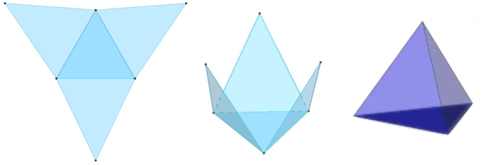
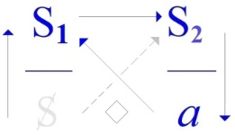

# Leçon 04 | 03 Février 1972

<!-- source-docx: S19b Le savoir du psychanalyste.docx -->
<!-- seminar: s19b -->
<!-- lesson: 04 -->

<!-- id: s19b-04-0001 -->

Je vais donc continuer un peu sur le thème du *Savoir du Psychanalyste*.

<!-- id: s19b-04-0002 -->

Je ne le fais ici que dans la parenthèse que j'ai déjà, les deux premières fois, ouverte.

<!-- id: s19b-04-0003 -->

Je vous ai dit que c'est ici que j'avais accepté\...

<!-- id: s19b-04-0004 -->

> à la prière d'un de mes élèves \...de reparler cette année pour la première fois depuis 63.

<!-- id: s19b-04-0005 -->

Je vous ai dit la dernière fois quelque chose qui s'articulait en harmonie avec ce qui nous enserre : « *je parle aux murs* ! ».

<!-- id: s19b-04-0006 -->

Il est vrai que de ce propos, j'ai donné un commentaire : un certain petit schéma, celui repris *de la bou­teille de Klein*, qui devait rassurer ceux qui, de par cette formule \[« *je parle aux murs »* \], pouvaient se sentir exclus.

<!-- id: s19b-04-0007 -->

Comme je l'ai longtemps expliqué, ce qu'on adresse aux murs a pour pro­priété de se répercuter.

<!-- id: s19b-04-0008 -->

Que je vous parle ainsi indirectement n'était fait certes pour offenser personne, puisque après tout, on peut dire que ce n'est pas là un privilège de mon discours !

<!-- id: s19b-04-0009 -->

Je voudrais aujourd'hui éclairer à propos de ce mur\...

<!-- id: s19b-04-0010 -->

> qui n'est pas du tout une métaphore \...éclairer ce que je peux dire ailleurs.

<!-- id: s19b-04-0011 -->

Car évidemment, ça se justifiera, pour parler de *Savoir*, que ça ne soit pas à mon séminaire que je le fasse.

<!-- id: s19b-04-0012 -->

Il ne s'agit pas en effet de n'importe lequel, mais du *Savoir du psycha­nalyste*. Voilà !

<!-- id: s19b-04-0013 -->

Pour introduire un peu les choses, suggérer une dimension à certains, j'espère, je dirai : qu'on ne puisse pas « *parler d'amour* »\...

<!-- id: s19b-04-0014 -->

> comme on dit, sinon de manière imbécile ou abjecte, ce qui est une aggravation :
>
> « *abjecte* » c'est comme on en parle dans la psychanalyse \...qu'on ne puisse donc « *parler d'amour* » mais qu'on puisse en *écrire *: ça devrait frapper.

<!-- id: s19b-04-0015 -->

La lettre, *la lettre* « *d'(a)mur* »\...

<!-- id: s19b-04-0016 -->

> pour donner suite à cette petite ballade en six vers que j'ai commentée ici la der­nière fois \...il est clair qu'il faudrait que ça se morde la queue, et que si ça commence :

<!-- id: s19b-04-0017 -->

« *Entre l'homme*\...

<!-- id: s19b-04-0018 -->

> dont personne ne sait ce que c'est

<!-- id: s19b-04-0019 -->

*Entre l'homme et l'amour, il y a la femme* » et puis comme vous le savez ça continue\...

<!-- id: s19b-04-0020 -->

> je ne vais pas recommen­cer aujourd'hui \...et ça devrait se terminer à la fin, à la fin il y a le mur : « *entre l'hom­me et le mur, il y a*\... » \[*lapsus*\] \...justement l'*(a)mur*, *la lettre d'amour*.

<!-- id: s19b-04-0021 -->

Ce qu'il y a de mieux dans ce qui s'écrase quelque part, ce curieux élan qu'on appelle *l'amour*, c'est *la lettre*.

<!-- id: s19b-04-0022 -->

C'est *la lettre* qui peut prendre d'étranges formes.

<!-- id: s19b-04-0023 -->

Il y a un type, comme ça, il y a 3000 ans, qui était certainement à l'acmé de ses succès, de ses succès d'*amour,* qui a vu apparaître sur le mur quelque chose que j'ai déjà commenté\...

<!-- id: s19b-04-0024 -->

> je m'en vais pas reprendre

<!-- id: s19b-04-0025 -->

\...« *Mené*, *Mené\... »* - que ça se disait - « \...*Tékel*, *Upharsîn.* » \[מנא מנא תקל ופרסין\], ce que d'habitude - je ne sais pas pourquoi - on articule : « *Mené*,*Thécel*,*Pharès* ».[^7]

<!-- id: s19b-04-0026 -->

{width="2.2805982064741905in" height="1.8131299212598426in"}

<!-- id: s19b-04-0027 -->

Quand *la lettre d'amour* nous parvient\...

<!-- id: s19b-04-0028 -->

Car, comme je l'ai expliqué quelquefois, les lettres viennent toujours à destination, heureusement elles arri­vent trop tard, outre qu'elles sont rares.

<!-- id: s19b-04-0029 -->

Il arrive aussi qu'elles arrivent à temps : c'est les cas rares où les rendez-vous ne sont pas ratés.

<!-- id: s19b-04-0030 -->

Il n'y a pas beaucoup de cas dans l'histoire où ça soit arrivé, comme à ce Nabuchodonosor quelconque.

<!-- id: s19b-04-0031 -->

Comme entrée en matière, je ne pousserai pas la chose plus loin, quitte à la reprendre.

<!-- id: s19b-04-0032 -->

Car cet *(a)mur*, tel que je vous le présente, ça n'a rien de très amusant.

<!-- id: s19b-04-0033 -->

Or moi je ne peux pas me soutenir autrement que d'amuser, amuse­ment sérieux ou comique : ce que j'avais expliqué la dernière fois, c'est que les amusements sérieux ça se passerait ailleurs, dans un endroit où l'on m'abrite, et que pour ici je réservais les amusements comiques.

<!-- id: s19b-04-0034 -->

Je ne sais si je serai ce soir tout à fait à la hauteur, en raison peut-être de cette entrée sur *la lettre d'(a)mur*.

<!-- id: s19b-04-0035 -->

Néanmoins, j'essaierai.

<!-- id: s19b-04-0036 -->

J'ai expliqué il y a 2 ans quelque chose qui, *une fois passé comme ça dans la grande voie poubellique*, a pris le nom de *quadripode*. C'est moi qui avait choisi ce nom et vous ne pourrez que vous demander pourquoi je lui ai donné un nom aussi étrange : pourquoi pas *« quadripède » ou « tétrapode »*, ça aurait eu l'avantage de ne pas être bâtard.

<!-- id: s19b-04-0037 -->

Mais en vérité je me le suis demandé moi-même en l'écrivant, je l'ai maintenu, je ne sais pas pourquoi, puis je me suis demandé ensuite comment on appelait dans mon enfance *ces termes bâtards*  comme ça : *mi-latins, mi-grecs*.

<!-- id: s19b-04-0038 -->

Je suis sûr d'avoir su comment les puristes appellent ça, et puis je l'ai oublié [^8].

<!-- id: s19b-04-0039 -->

Est-ce qu'il y a ici une personne qui sait comment on désigne les termes faits par exemple comme le mot « *sociologie* » ou « *quadripode* », d'un élément latin et d'un élément grec ? Je l'en supplie, que celui qui le sait l'émette !

<!-- id: s19b-04-0040 -->

Eh bien, c'est pas encourageant !

<!-- id: s19b-04-0041 -->

> Parce que depuis hier - hier, c'est-à-dire que c'était avant-hier *-* que j'ai commencé à le chercher
>
> et comme je ne trouvais pas toujours, depuis hier j'ai téléphoné à une dizaine de personnes
>
> qui me paraissaient les plus propices à me donner cette réponse. Bon, eh bien tant pis !

<!-- id: s19b-04-0042 -->

{width="1.5665266841644794in" height="0.9018897637795276in"} {width="1.5694444444444444in" height="0.8742497812773403in"} {width="1.5601848206474191in" height="0.8680063429571303in"} {width="1.3518514873140857in" height="0.8663626421697288in"}

<!-- id: s19b-04-0043 -->

*Discours du Maître Discours de l'Hystérique Discours Universitaire Discours analytique*

<!-- id: s19b-04-0044 -->

Mes « *quadripode* » en question, je les appelés ainsi pour vous donner l'idée *qu'on peut s'asseoir dessus*\...

<!-- id: s19b-04-0045 -->

> histoire, puisque j'étais dans les mass-média [^9], de rassurer un peu les personnes \...mais en réalité, j'explique à l'intérieur ceci à propos de ce que j'ai isolé des 4 *discours* : ces 4 *discours* résultent de l'émer­gence du dernier venu, du *discours de l'analyste*.

<!-- id: s19b-04-0046 -->

*Le discours de l'analyste* apporte en effet\...

<!-- id: s19b-04-0047 -->

> dans un certain état actuel des pensées \...un ordre dont s'éclairent d'autres *discours* qui ont émergé bien plus tôt.

<!-- id: s19b-04-0048 -->

Je les ai disposés selon ce qu'on appelle une topologie.

<!-- id: s19b-04-0049 -->

Une topologie des plus simples mais qui n'en est pas moins une topologie, en ce sens qu'elle est mathématisable.

<!-- id: s19b-04-0050 -->

Et elle l'est de la façon la plus rudimentaire, à savoir qu'elle repose sur le groupement de pas plus de 4 points que nous appellerons « *monades* ».

<!-- id: s19b-04-0051 -->

Ça n'a l'air de rien, néanmoins c'est si fortement inscrit dans la structure de notre monde qu'il n'y a pas d'autre fondement au fait de l'espace que nous vivons.

<!-- id: s19b-04-0052 -->

Remarquez bien ceci : *que mettre 4 points à égale distance l'un de l'autre c'est le maximum de ce que vous pouvez faire dans notre espace*.

<!-- id: s19b-04-0053 -->

*Vous ne mettrez jamais cinq points à égale distance l'un de l'autre*.

<!-- id: s19b-04-0054 -->

Cette menue forme que je viens de rappeler là, est là pour faire sentir de quoi il s'agit :

<!-- id: s19b-04-0055 -->

- si les *quadripodes* sont, non pas *tétraèdre*, mais *tétrade*,

<!-- id: s19b-04-0056 -->

- que le nombre des sommets soit égal à celui des surfaces est lié à ce même « *tria**ngle arithmétique* »

<!-- id: s19b-04-0057 -->

> que j'ai tracé à mon dernier séminaire \[19-01-1972\].

<!-- id: s19b-04-0058 -->

Comme vous le voyez, pour s'asseoir ça n'est pas de tout repos : ni l'un, ni l'autre.

<!-- id: s19b-04-0059 -->

{width="1.2424956255468067in" height="1.2758956692913386in"} {width="1.5438232720909886in" height="1.203772965879265in"}{width="3.1488013998250217in" height="1.0655719597550306in"}

<!-- id: s19b-04-0060 -->

La position de gauche vous y êtes habitués, de sorte que vous ne la sentez même plus, mais celle de droite n'est pas plus confortable : imaginez-vous assis sur un tétraèdre posé sur la pointe.

<!-- id: s19b-04-0061 -->

C'est pourtant de là qu'il faut partir pour tout ce qu'il en est de ce qui constitue ce type d'assiette sociale qui repose sur ce qu'on appelle *un discours*. Et c'est cela que j'ai proprement avancé dans mon avant-avant-dernier séminaire.

<!-- id: s19b-04-0062 -->

Le tétraèdre, pour l'appeler par son aspect présent, a de curieuses propriétés : c'est que s'il n'est pas comme celui-là, régulier\...

<!-- id: s19b-04-0063 -->

> l'égale distance n'est là que pour vous rappeler les propriétés du nombre 4, eu égard à l'espace \...s'il est quelconque, il vous est proprement impossible d'y définir une symétrie.

<!-- id: s19b-04-0064 -->

Néanmoins il a ceci de particulier que si ses côtés, à savoir ces petits traits que vous voyez qui joignent ce qu'on appelle en géométrie des *sommets*, si ces petits traits vous les vectorisez, c'est-à-dire que vous y marquiez un sens, il suffit que vous posiez comme principe qu'aucun des sommets ne sera privilégié de ceci\...

<!-- id: s19b-04-0065 -->

> qui serait forcément un privilège, puis­que si ça se passait,
>
> il y en aurait au moins deux qui ne pourraient pas en bénéficier \...si donc vous posez :

<!-- id: s19b-04-0066 -->

- *que nulle part il ne peut y avoir convergence de trois vecteurs,*

<!-- id: s19b-04-0067 -->

- *ni nulle part divergence de trois vecteurs du même sommet,* vous obte­nez alors nécessairement la répartition :

<!-- id: s19b-04-0068 -->

- *deux arrivants, un partant,*

<!-- id: s19b-04-0069 -->

- *deux arrivants, un partant,*

<!-- id: s19b-04-0070 -->

- *un arrivant, deux partants,*

<!-- id: s19b-04-0071 -->

- *un arrivant, deux partants.*

<!-- id: s19b-04-0072 -->

C'est-à-dire que tous les dits *tétraèdres* seront strictement équivalents, et que dans tous les cas vous pourrez par suppression d'un des côtés, obtenir la formule par laquelle j'ai schématisé mes 4 *discours* :

<!-- id: s19b-04-0073 -->

{width="1.5665266841644794in" height="0.9018897637795276in"} {width="1.5694444444444444in" height="0.8742497812773403in"} {width="1.5601848206474191in" height="0.8680063429571303in"} {width="1.3518514873140857in" height="0.8663626421697288in"}

<!-- id: s19b-04-0074 -->

*Discours du Maître Discours de l'Hystérique Discours Universitaire Discours analytique*

<!-- id: s19b-04-0075 -->

Selon ceci qui a une propriété, d'un des *sommets* : la divergence, mais sans aucun vecteur qui arrive pour le nourrir, mais qu'inversement, à l'opposé vous avez ce trajet triangulaire. Ceci suffit à permettre de distinguer en tous les cas, par un carac­tère qui est absolument spécial, ces quatre pôles que j'énonce des termes de *la Vérité*, du *Semblant*, de *la jouissance* et du *Plus-de-jouir*.

<!-- id: s19b-04-0076 -->

{width="1.4458333333333333in" height="0.8621117672790901in"}

<!-- id: s19b-04-0077 -->

Ceci est la topologie fondamentale d'où ressort toute fonction de *la parole* et mérite d'être commenté.

<!-- id: s19b-04-0078 -->

C'est en effet une *question que le discours de l'analyste* *est bien fait pour faire surgir*, que de savoir quelle est *la fonction de la parole.*

<!-- id: s19b-04-0079 -->

*« Fonction et champ de la parole et du langage*\... », c'est ainsi que j'ai introduit ce qui devait nous mener jusqu'à ce point présent de la définition d'un nouveau *discours*. Non pas certes que ce *discours* soit le mien : à l'heure où je vous parle, ce *discours* est bel et bien, depuis près de trois quarts de siècle, installé.

<!-- id: s19b-04-0080 -->

Ce n'est pas une raison parce que l'analyste lui-même est capable, dans certaines zones, de se refuser à ce que j'en dis, qu'il n'est pas support de ce *discours.* Et à la vérité « *être support* » ça veut dire seulement dans l'occasion « *être supposé* ».

<!-- id: s19b-04-0081 -->

Mais que ce *discours* puisse prendre sens de la voix même de *quelqu'un qui y est* - c'est mon cas - *tout autant sujet qu'un autre*, c'est justement ce qui mérite qu'on s'y arrête, afin de savoir d'*où* se prend ce sens.

<!-- id: s19b-04-0082 -->

À entendre ce que je viens d'avancer, la question du sens bien sûr peut vous sembler ne pas poser de problèmes, je veux dire qu'il semble que *le discours de l'analyste* fait assez appel à l'interprétation pour que la question ne se pose pas.

<!-- id: s19b-04-0083 -->

Effectivement, sur un certain gribouillage analytique, il semble qu'on peut lire\...

<!-- id: s19b-04-0084 -->

> et ce n'est pas surprenant, vous allez voir pourquoi \...tous les « *sens* » que l'on veut jusqu'au plus archaïque, je veux dire y avoir comme l'écho, la sempiternelle répétition de ce qui, du fond des âges nous est venu sous ce terme de « *sens* », sous des formes dont il faut bien dire qu'il n'y a que leur superposition qui fasse sens.

<!-- id: s19b-04-0085 -->

Car à quoi doit-on que nous comprenons quoi que ce soit du symbolisme usité dans l'Écriture sainte par exemple ?

<!-- id: s19b-04-0086 -->

Le rapprocher d'une mythologie, quelle qu'elle soit, chacun sait

<!-- id: s19b-04-0087 -->

- que c'est là une sorte de glissement des plus trompeurs, personne, depuis un temps, ne s'y arrête,

<!-- id: s19b-04-0088 -->

- que quand on étudie d'une façon sérieuse ce qu'il en est des mythologies, ce n'est pas à leur sens qu'on se réfère, c'est à la combinatoire des mythèmes.

<!-- id: s19b-04-0089 -->

> Référez vous là-dessus à des travaux dont je n'ai pas, je pense, à vous évoquer une fois de plus l'auteur.

<!-- id: s19b-04-0090 -->

La question est donc bien de savoir *d'où ça vient, le* « *sens* ».

<!-- id: s19b-04-0091 -->

Je me suis servi\...

<!-- id: s19b-04-0092 -->

> parce que c'était bien nécessaire \...je me suis servi\...

<!-- id: s19b-04-0093 -->

> pour introduire ce qu'il en est du *discours analytique,* \...je me suis servi sans scrupule du frayage dit *linguistique*.

<!-- id: s19b-04-0094 -->

Et *pour tempérer des ardeurs* qui autour de moi auraient pu s'éveiller trop tôt, vous faire retourner dans la fange ordinaire, j'ai rappelé que ne s'est soutenu quelque chose\...

<!-- id: s19b-04-0095 -->

> digne de ce titre « *linguistique* » comme science \...que ne s'est soutenu quelque chose qui semble avoir la langue comme telle, voire la parole, pour objet, que ça ne s'est soutenu qu'à condition de se jurer entre soi, entre linguistes, de ne jamais plus jamais\...

<!-- id: s19b-04-0096 -->

> parce qu'on n'avait fait que ça pendant des siècles \...plus jamais, même de loin, faire allusion à *l'origine du langage*.

<!-- id: s19b-04-0097 -->

C'était, entre autres, un des mots d'ordre que j'avais donné à cette forme d'introduction qui s'est articulée de ma formule « *L'inconscient est structuré comme un langage* ».

<!-- id: s19b-04-0098 -->

> Quand je dis que c'était pour éviter à mon audience le retour à une certaine équivoque fangeuse, ce n'est pas moi
>
> qui me sers de ce terme, c'est Freud lui-même, et nommément justement à propos des archétypes dits « *jungiens* »,
>
> ça n'est certainement pas pour lever maintenant cet interdit :
>
> il n'est nullement question de spéculer sur quelque *origine du langage*, *j'ai dit qu'il est question de formuler* *la fonction de la parole*.

<!-- id: s19b-04-0099 -->

*La fonction de la parole*\...

<!-- id: s19b-04-0100 -->

> il y a très longtemps que j'ai avancé ça \...*c'est d'être la seule forme d'action qui se pose comme vérité*.

<!-- id: s19b-04-0101 -->

Qu'est-ce que c'est, non pas que *la parole*, c'est une question superflue, non seulement je parle, vous parlez et même ça parle comme je l'ai dit ça va tout seul, c'est un fait, je dirai même que c'est l'origine de tous les faits, parce que quoi que ce soit ne prend rang de fait que *quand c'est* *dit*.

<!-- id: s19b-04-0102 -->

Il faut dire que je n'ai pas dit « *quand c'est parlé* », il y a quelque chose de distinct entre *parler* et *dire *:

<!-- id: s19b-04-0103 -->

- une parole qui fonde le fait, *ça c'est un dire*,

<!-- id: s19b-04-0104 -->

- mais la parole fonctionne même quand elle ne fonde aucun fait :

<!-- id: s19b-04-0105 -->

> quand elle commande,
>
> quand elle prie,
>
> quand elle injurie,
>
> quand elle émet un vœu, elle ne fonde aucun fait.

<!-- id: s19b-04-0106 -->

Nous pouvons aujourd'hui ici\...

<!-- id: s19b-04-0107 -->

> c'est pas des choses que j'irais produire là-bas, à l'autre place,
>
> où heureusement je dis des choses plus sérieuses \...ici parce que c'est impliqué dans ce sérieux, je développe toujours plus en pointe, et en restant toujours à la-dite pointe comme à mon dernier séminaire\...

<!-- id: s19b-04-0108 -->

> j'espère qu'il se fera qu'au prochain il y aura moins de monde : ce n'était pas rigolo \...mais enfin ici on peut rigoler un peu, c'est des amusements comiques.

<!-- id: s19b-04-0109 -->

Dans l'ordre de l'amusement comique, la parole, c'est pas pour rien que dans les dessins animés on vous la chiffre sur des banderoles : la parole c'est comme là où ça bande\... rôle ou pas !

<!-- id: s19b-04-0110 -->

C'est pas pour rien que ça instaure la dimension de *la vérité*, parce que *la vérité,* la vraie, la vraie *vérité,* *la vérité* telle qu'il se fait qu'on a commencé à l'entrevoir seulement avec *le discours analytique,* c'est que ce que révèle ce discours à tout un chacun, qui simplement s'y engage d'une façon *axante* comme analysant, c'est que\...

<!-- id: s19b-04-0111 -->

> excusez-moi de reprendre ce terme, mais puisque j'ai commencé, je ne l'abandonne pas \...c'est que de *bander*\... c'est ce que là-bas, place du Panthéon, j'appelle ! \...c'est que de *bander*, ça n'a aucun rapport avec *le sexe*, pas avec l'*autre* en tout cas !

<!-- id: s19b-04-0112 -->

*Bander* - on est ici entre des murs - « *bander pour une femme* », il faut tout de même appeler ça par son nom, ça veut dire lui donner la fonction, ça veut dire la prendre comme *phallus*.

<!-- id: s19b-04-0113 -->

*C'est pas rien le phallus !*

<!-- id: s19b-04-0114 -->

Je vous ai déjà expliqué, là-bas où c'est sérieux, je vous ai expliqué ce que ça fait.

<!-- id: s19b-04-0115 -->

Je vous ai dit que « *la signification du phallus* » c'est le seul cas de génitif pleinement équilibré, ça veut dire que le *phallus*\...

<!-- id: s19b-04-0116 -->

> c'est que ce que vous expliquait ce matin, je dis ça pour ceux qui sont un peu avertis
>
> c'est que ce que vous expliquait ce matin Jakobson : *\...le phallus c'est la signification, c'est ce par quoi le langage signifie. Il n'y a qu'une seule Bedeutung, c'est le phallus*.

<!-- id: s19b-04-0117 -->

Partons de cette hypothèse, ça nous expliquera très largement l'ensemble de la fonction de *la parole*.

<!-- id: s19b-04-0118 -->

Car elle n'est pas toujours appliquée à dénoter des faits\...

<!-- id: s19b-04-0119 -->

> c'est tout ce qu'elle peut faire, on ne dénote pas des choses, on dénote des faits \...mais c'est tout à fait par hasard, de temps en temps.

<!-- id: s19b-04-0120 -->

La plupart du temps elle supplée à ceci que *la fonction phallique* est justement ce qui fait qu'il n'y a chez l'Homme que les relations que vous savez, mauvaises, entre les sexes.

<!-- id: s19b-04-0121 -->

Alors que partout ailleurs, au moins pour nous, ça semble aller « *à la coule* ».

<!-- id: s19b-04-0122 -->

{width="1.4458333333333333in" height="0.8621117672790901in"}

<!-- id: s19b-04-0123 -->

Alors c'est pour ça que dans mon petit quadripode, vous voyez au niveau de *la vérité* 2 choses, 2 vecteurs qui divergent :

<!-- id: s19b-04-0124 -->

- ce qui exprime que *la jouissance*, qui est tout au bout de la branche de droite, c'est une jouissance certes *phallique*, mais qu'on ne peut dire *jouissance sexuelle*,

<!-- id: s19b-04-0125 -->

- et que pour que se maintienne quiconque de ces drôles d'animaux, ceux qui sont proie de la parole, il faut qu'il y ait ce pôle là, qui est corrélatif du pôle de la *jouissance* en tant qu'obstacle au rapport sexuel : c'est ce pôle que je désigne du *semblant*.

<!-- id: s19b-04-0126 -->

C'est aussi clair pour un partenaire, enfin si nous osons, comme ça se fait tous les jours, les épingler de leur sexe, il est éclatant que l'homme comme la femme, ils font *semblant*, chacun, dans ce rôle.

<!-- id: s19b-04-0127 -->

Mais enfin, c'est des histoires qu'ils se donnent.

<!-- id: s19b-04-0128 -->

Mais l'important au moins quand il s'agit de *la fonction de la parole*, c'est que les pôles soient définis :

<!-- id: s19b-04-0129 -->

- celui du *semblant*,

<!-- id: s19b-04-0130 -->

- et celui de la *jouissance*.

<!-- id: s19b-04-0131 -->

S'il y avait chez l'homme, ce que nous imaginons de façon purement gratuite, qu'il y ait une jouissance spécifiée de la polarité sexuelle, ça se saurait* *!

<!-- id: s19b-04-0132 -->

Ça s'est peut-être su, des âges entiers s'en sont vantés et après tout nous avons de nombreux témoignages, malheureusement purement ésotériques, qu'il y a eu des temps où on croyait vraiment savoir comment tenir ça.

<!-- id: s19b-04-0133 -->

Un nommé Van Gulik [^10] dont le livre m'a paru excellent, qui pique par-ci par-là\...

<!-- id: s19b-04-0134 -->

> bien sûr il fait comme tout le monde, il pique plus près de ce qu'il y a de la tradition écrite chinoise \...dont le sujet est « *le savoir sexuel* », ce qui n'est pas très étendu, je vous assure, ni non plus très éclairé !

<!-- id: s19b-04-0135 -->

Mais enfin, regardez ça si ça vous amuse : « *La vie sexuelle dans la Chine ancienne »*.

<!-- id: s19b-04-0136 -->

Je vous défie d'en tirer rien qui puisse vous servir \[*Rires*\] dans ce que j'appelais tout à l'heure l'état actuel des pensées !

<!-- id: s19b-04-0137 -->

L'intérêt de ce que je pointe, ce n'est pas de dire que depuis toujours les choses en sont de même que le point où nous en sommes venus. Il y a peut-être eu, il y a peut-être encore même quelque part\...

<!-- id: s19b-04-0138 -->

> mais c'est curieux, c'est toujours dans des endroits
>
> où il faut vraiment sérieusement montrer patte blanche pour entrer, \...des endroits où il se passe entre l'*homme* et la *femme* cette conjonction harmonieuse qui les ferait être au septième ciel, mais c'est tout de même très cu­rieux qu'on n'en entende jamais parler que du dehors.

<!-- id: s19b-04-0139 -->

Par contre, il est bien clair qu'à travers une des façons que j'ai de définir que c'est plutôt avec grand Φ que chacun a rapport qu'avec l'autre, ça devient pleinement confirmé dès qu'on regarde ce qu'on appelle\...

<!-- id: s19b-04-0140 -->

d'un terme qui tombe si bien, comme ça, grâce à l'ambiguïté du latin ou du grec \...ce qu'on appelle des « *homos* »\...

<!-- id: s19b-04-0141 -->

*ecce homo* comme je disais \[*Rires*\] \...il est tout à fait certain que les « *homos »*, ça bande bien mieux et plus souvent, et plus ferme.

<!-- id: s19b-04-0142 -->

C'est curieux mais enfin c'est tout de même un fait auquel, pour une personne qui depuis un certain temps a un peu entendu parler, ça ne fait pas de doute.

<!-- id: s19b-04-0143 -->

Ne vous y trompez pas quand même : il y a *homo* et « *homo »*, hein ! \[*Rires*\]

<!-- id: s19b-04-0144 -->

Je ne parle pas d'André Gide ! Faut pas croire qu'André Gide était un *homo* !

<!-- id: s19b-04-0145 -->

Ça nous introduit à la suite. Ne perdons pas la corde, il s'agit du « *sens* ».

<!-- id: s19b-04-0146 -->

Pour que quelque chose ait du *sens* dans l'état actuel des pensées, c'est triste à dire, mais il faut que ça se pose comme « normal ».

<!-- id: s19b-04-0147 -->

C'est bien pour ça qu'André Gide voulait que l'homosexualité fût normale.

<!-- id: s19b-04-0148 -->

Et comme vous pouvez peut-être en avoir des échos, dans ce sens il y a foule : en moins de deux ça va tomber comme ça sous la cloche du normal, à tel point qu'on aura de nouveaux clients en psychanalyse qui viendront nous dire : « *je viens vous trouver parce que je ne pédale pas normalement* ! » \[*Rires*\] Ça va devenir un embouteillage ! \[*Rires*\]

<!-- id: s19b-04-0149 -->

Et l'analyse est partie de là* *!

<!-- id: s19b-04-0150 -->

Si la notion de *normal* n'avait pas pris, *à la suite des accidents de l'histoire*, une pareille extension, elle n'aurait jamais vu le jour.

<!-- id: s19b-04-0151 -->

Tous les patients, non seulement qu'a pris Freud mais c'est très clair à le lire que c'est une condition : pour entrer en analyse, au début le minimum c'était d'avoir une bonne formation universitaire.

<!-- id: s19b-04-0152 -->

C'est dit dans Freud en clair. Je dois le souligner, parce que *le discours universitaire* dont j'ai dit beaucoup de mal, et pour les meilleures raisons, mais quand même c'est lui qui abreuve *le discours analytique*.

<!-- id: s19b-04-0153 -->

Vous comprenez, vous ne pouvez plus vous imaginer\...

<!-- id: s19b-04-0154 -->

> c'est pour vous faire imaginer quelque chose si vous en êtes capables,
>
> mais qui sait, à l'entraînement de ma voix \...vous pouvez même pas imaginer ce que c'était une zone du temps qu'on appelle à cause de ça « *antique »,* où la δοχα \[doxa\], vous savez la célèbre δοχα dont on parle dans le « *Ménon »,* « *mais non, mais non* » \[*Rires*\], *il y avait de la* δοχα *qui n'était pas universitaire*.

<!-- id: s19b-04-0155 -->

Actuellement, mais il n'y a pas une δοχα, si futile, si boiteuse cahin-caha voire conne, soit-elle qui ne soit rangée quelque part dans un enseignement universitaire !

<!-- id: s19b-04-0156 -->

Il n'y a pas d'exemple d'une opinion, aussi stupide soit-elle, qui ne soit repérée, voire\...

<!-- id: s19b-04-0157 -->

> à l'occasion de ce qu'elle est repérée \...enseignée. Ben ça fausse tout !

<!-- id: s19b-04-0158 -->

Parce que quand Platon parle de δοχα \[doxa\]\...

<!-- id: s19b-04-0159 -->

> comme de quelque chose dont il ne sait littéralement que faire,
>
> lui, philosophe qui cherche à fonder une science, \...il s'aperçoit que la δοχα, la δοχα qu'il rencontre à tous les coins de rue, *il y en a de vraies*.

<!-- id: s19b-04-0160 -->

Naturellement, il n'est pas foutu de dire pourquoi, non plus qu'aucun philosophe, mais personne ne doute qu'elles soient vraies, parce que *la vérité* ça s'impose.

<!-- id: s19b-04-0161 -->

Cela faisait un contexte, mais complètement différent à quoi que ce soit qui s'appelle *philosophie,* que la δοχα ne soit pas normée : il n'y a pas trace du mot « *norme* » nulle part dans le discours antique.

<!-- id: s19b-04-0162 -->

C'est nous qui avons inventé ça, et naturellement en allant chercher un nom grec d'usage rarissime !

<!-- id: s19b-04-0163 -->

Il faut quand même partir de là pour voir que *le discours de l'analyste*, c'est pas apparu par hasard !

<!-- id: s19b-04-0164 -->

Il fallait qu'on soit au dernier état d'extrême urgence pour que ça sorte.

<!-- id: s19b-04-0165 -->

Bien entendu puisque c'est un *discours de l'analyste*, ça prend\...

<!-- id: s19b-04-0166 -->

> comme tous mes discours, les quatre que j'ai nommés \...le sens du génitif objectif :

<!-- id: s19b-04-0167 -->

- *le discours du Maître* c'est le discours *sur le Maître*, on l'a bien vu à l'acmé de l'épopée philosophique dans Hegel.

<!-- id: s19b-04-0168 -->

- *Le discours de l'analyste* c'est la même chose : on parle *de l'analyste*, *c'est lui* *l'objet(a)*, comme je l'ai souvent souligné. Ça ne lui rend pas facile, naturellement, de bien saisir quelle est sa position, mais d'un autre côté, elle est de tout repos puisque c'est celle du *semblant*.

<!-- id: s19b-04-0169 -->

Alors notre Gide\...

<!-- id: s19b-04-0170 -->

> pour continuer la tresse : je prends le Gide,
>
> puis je le relaisserai, puis on le reprendra ensemble, et ainsi de suite \...notre Gide là, parce qu'il est quand même exemplaire, il ne nous sort pas de notre petite affaire, bien loin de là !

<!-- id: s19b-04-0171 -->

Son affaire c'est une affaire *d'être désiré*, comme nous trouvons ça couramment dans l'exploration analytique.

<!-- id: s19b-04-0172 -->

Il y a des gens à qui ça a manqué dans leur petite enfance, d'être désiré.

<!-- id: s19b-04-0173 -->

Ça les pousse à faire des trucs pour que ça leur arrive sur le tard. C'est même très répandu.

<!-- id: s19b-04-0174 -->

Mais il faut tout de même bien cliver les choses.

<!-- id: s19b-04-0175 -->

C'est pas sans rapport, pas du tout, avec *le discours*.

<!-- id: s19b-04-0176 -->

C'est pas de ces paroles comme il en sort un peu partout quand on est au Carnaval.

<!-- id: s19b-04-0177 -->

*Le discours* et *le désir*, là ça a le plus étroit rapport.

<!-- id: s19b-04-0178 -->

C'est même pour ça que je suis arrivé à isoler - enfin, du moins je le pense - la fonction de *l'objet(a)*.

<!-- id: s19b-04-0179 -->

C'est un point-clé dont on n'a pas encore beaucoup tiré parti je dois dire, ça viendra tout doucement.

<!-- id: s19b-04-0180 -->

*L'objet(a)* c'est ce par quoi *l'être parlant*, quand il est pris dans un discours, se détermine.

<!-- id: s19b-04-0181 -->

Il ne sait pas du tout que ce qui le détermine, c'est *l'objet(a)*.

<!-- id: s19b-04-0182 -->

En quoi il est déterminé ?

<!-- id: s19b-04-0183 -->

Il est déterminé comme *sujet*, c'est-à-dire qu'*il est divisé comme sujet* : *il est la proie du désir*.

<!-- id: s19b-04-0184 -->

Ça a l'air de se passer au même endroit que les paroles subvertissantes, mais c'est pas du tout pareil, c'est tout à fait régulier, ça *produit*\...

<!-- id: s19b-04-0185 -->

> c'est une production ! - ça produit *mathématiquement*, c'est le cas de le dire, \...cet *objet(a)* en tant que *cause du désir*.

<!-- id: s19b-04-0186 -->

{width="1.1842104111986003in" height="0.6817793088363955in"} {width="1.2587718722659667in" height="0.3260400262467192in"}

<!-- id: s19b-04-0187 -->

C'est encore celui que j'ai appelé, comme vous le savez, *l'objet métonymique* : ce qui court tout au long de ce qui se déroule comme *discours*, discours plus ou moins cohérent, jusqu'à ce que ça bute, et que toute l'affaire se termine en eau de boudin.

<!-- id: s19b-04-0188 -->

Il n'en reste pas moins que *c'est de là*, et c'est ça l'intérêt, *que nous prenons l'idée de la cause*.

<!-- id: s19b-04-0189 -->

Nous croyons que dans la nature, il faut que tout ait une cause, sous prétexte que nous sommes causés par notre propre *bla-bla-bla*. Ouais !

<!-- id: s19b-04-0190 -->

Il y a tous les traits chez André Gide que les choses sont bien telle que je vous l'ai dit.

<!-- id: s19b-04-0191 -->

C'est d'abord sa relation avec l'Autre suprême : il ne faut pas croire du tout, du tout, comme ça, malgré tout ce qu'il a pu dire, que ça n'avait pas d'incidence, le grand Autre.

<!-- id: s19b-04-0192 -->

Là où ça prend forme, le (*a*) il en avait même une notion tout à fait spécifiée, c'est à savoir que le plaisir de ce grand Autre, c'était de déranger celui de tous les petits \[*autres*\] !

<!-- id: s19b-04-0193 -->

Moyennant quoi il pigeait très bien qu'il y avait là un point de tracas *qui le sauvait évidemment du délaissement de son enfance*. Toutes ses taquineries avec Dieu, c'était quelque chose de fortement compensatoire pour quelqu'un qui avait si mal commencé. C'est pas son privilège \[*sic*\]. Ouais\...

<!-- id: s19b-04-0194 -->

J'avais commencé autrefois\...

<!-- id: s19b-04-0195 -->

> j'en ai fait qu'une leçon, un « *séminaire* » ce qu'on appelle \...quelque chose sur *le Nom du Père*.

<!-- id: s19b-04-0196 -->

Naturellement, j'ai commencé par le *Père* même.

<!-- id: s19b-04-0197 -->

J'ai parlé pendant une heure, une heure et demie, de *la jouissance* de Dieu.

<!-- id: s19b-04-0198 -->

Si j'ai dit que c'était un « *badinage mystique* » c'était pour ne plus jamais en parler.

<!-- id: s19b-04-0199 -->

Il est certain que depuis qu'il y a un Dieu, seul et unique, enfin le Dieu qu'a fait émerger une certaine ère historique, c'est justement celui-là celui qui dérange le plaisir des autres.

<!-- id: s19b-04-0200 -->

*Il n'y a même que ça qui compte*.

<!-- id: s19b-04-0201 -->

- Il y a bien les *Épicuriens* qui ont tout fait pour enseigner la mé­thode pour ne pas se laisser déranger dans le plaisir de chacun : et ben ça a foiré !

<!-- id: s19b-04-0202 -->

- Il y en avait d'autres qui s'appelaient les *Stoïciens* et qui ont dit : « *Mais il faut au contraire se ruer dans le plaisir divin* ». Mais ça rate aussi vous savez, ça ne joue qu'entre les deux.

<!-- id: s19b-04-0203 -->

*C'est la tracasserie qui compte !*

<!-- id: s19b-04-0204 -->

Avec ça vous êtes tous dans votre aire naturelle.

<!-- id: s19b-04-0205 -->

Vous jouissez pas bien sûr, ça serait exagéré de le dire, d'autant plus que de tou­te façon c'est trop dangereux, mais enfin, on peut pas dire que vous n'avez pas du *plaisir*, hein ! C'est même là-dessus qu'est fondé *le processus primaire*.

<!-- id: s19b-04-0206 -->

Tout ça nous remet au pied du mur : *qu'est-ce que c'est que le* « *sens* » ?

<!-- id: s19b-04-0207 -->

Eh ben, il vaut mieux repartir au niveau du *plaisir,* du plaisir que l'autre vous fait, c'est courant, on appelle ça même - dans une zone plus noble - de *l'art *: *l, apostrophe\...* \[*Rires*\].

<!-- id: s19b-04-0208 -->

C'est là qu'il faut attentivement considérer *le mur*, parce qu'il y a une zone du « *sens* » bien éclairée.

<!-- id: s19b-04-0209 -->

Bien éclairée par exemple par le nommé Léonard De Vinci, comme vous le savez, qui a laissé quelques manuscrits et menues babioles, pas tellement - il n'a pas peuplé les musées - mais il a dit de profondes vérités, dont tout le monde devrait toujours se souvenir.

<!-- id: s19b-04-0210 -->

Il a dit : « *Regardez le mur* » - comme moi\...

<!-- id: s19b-04-0211 -->

> puis, depuis ce temps, il est devenu « *le Léonard des familles* », on fait cadeau de ses manuscrits.
>
> Il y a un ouvrage de luxe - même à moi, on m'en a donnée une paire,
>
> vous vous rendez compte, mais ça ne veut pas dire que c'est pas lisible \[*Rires*\] \...alors il vous explique : « *Regardez bien le mur* » comme ici, c'est un peu sale.

<!-- id: s19b-04-0212 -->

Si c'était mieux entretenu il y aurait des tâches d'humidité et peut-être même des moisissures.

<!-- id: s19b-04-0213 -->

Eh bien si vous en croyez Léonard : s'il y a une tache de moi­sissure, c'est une belle occasion pour la transformer en *madone* ou bien en athlète musculeux\...

<!-- id: s19b-04-0214 -->

> ça, ça se prête encore mieux, parce que dans la moisissure, il y a toujours des ombres, des creux \...c'est très important ça : s'apercevoir qu'il y a une classe de choses sur les murs, qui prête à la figure, à la création d'art, comme on dit. C'est le figuratif même, la tache en question.

<!-- id: s19b-04-0215 -->

Il faut tout de même savoir le rapport qu'il y a entre ça et quelque chose d'autre qui peut venir sur le mur, c'est à savoir les *ravinements*, non pas seulement de *la parole*\...

<!-- id: s19b-04-0216 -->

> encore que ça arrive, c'est bien comme ça que ça commence toujours \...mais du *discours*.

<!-- id: s19b-04-0217 -->

Autrement dit : si c'est du même ordre la *moisissure* sur le mur ou l'*écriture *?

<!-- id: s19b-04-0218 -->

Ça devrait intéresser ici un certain nombre de personnes qui, je pense\...

<!-- id: s19b-04-0219 -->

> il n'y a pas très longtemps, ça commence à vieillir \...se sont beaucoup occupés d'écrire des choses, *des lettres d'amour sur les murs*. <u>[</u>[Dàzìbào : 大字報](https://fr.wikipedia.org/wiki/Dazibao)<u>]</u>

<!-- id: s19b-04-0220 -->

C'était un vachement beau temps.

<!-- id: s19b-04-0221 -->

Il y en a qui ne s'en sont jamais consolés du temps où on pouvait écrire sur les murs, et où d'un truc dans *Publicis* on déduisait que « *les murs avaient la parole* ».

<!-- id: s19b-04-0222 -->

Comme si ça pouvait arriver !

<!-- id: s19b-04-0223 -->

Je voudrais simplement faire remarquer qu'il vaudrait mieux qu'il n'y ait jamais rien d'écrit sur les murs.

<!-- id: s19b-04-0224 -->

Ce qui y est déjà écrit, il faudrait même l'en retirer.

<!-- id: s19b-04-0225 -->

- « *Liberté - Égalité - Fraternité* » par exemple, c'est indécent !

<!-- id: s19b-04-0226 -->

- « *Défense de fumer* », c'est pas possible, d'autant plus que tout le monde fume, il y a là une erreur de tactique.

<!-- id: s19b-04-0227 -->

Je l'ai déjà dit tout à l'heure pour *la lettre d'(a)mur* : *tout ce qui s'écrit renforce le mur*.

<!-- id: s19b-04-0228 -->

C'est pas forcément *une objection*, mais ce qu'il y a de certain, c'est qu'il ne faut pas croire que ce soit *absolument nécessaire.*

<!-- id: s19b-04-0229 -->

Mais ça sert quand même parce que si on n'avait jamais rien écrit sur un mur\...

<!-- id: s19b-04-0230 -->

> quel qu'il soit, celui-là ou les autres \...eh bien, c'est un fait : on n'aurait pas fait un pas dans le sens de ce qui peut-être est à regarder *au-delà du mur*.

<!-- id: s19b-04-0231 -->

Voyez-vous, il y a quelque chose dont je serai amené un peu à vous parler cette année : c'est les rapports de *la logique* et de *la mathématique*.

<!-- id: s19b-04-0232 -->

*Au-delà du mur*\...

<!-- id: s19b-04-0233 -->

> pour vous le dire tout de suite \...il n'y a, à notre connaissance, que ce *Réel* qui se signale justement *de l'impossible, de l'impossible de l'atteindre au-delà du mur*.

<!-- id: s19b-04-0234 -->

Il n'en reste pas moins que c'est le *Réel*.

<!-- id: s19b-04-0235 -->

Comment est-ce qu'on a pu faire pour en avoir l'idée ? Il est certain que le langage y a servi pour un bout.

<!-- id: s19b-04-0236 -->

C'est même pour ça que j'essaie de faire ce petit pont dont vous avez pu voir dans mes derniers séminaires l'amorce, à savoir : comment est-ce que l'*Un* fait son entrée ?

<!-- id: s19b-04-0237 -->

C'est ce que j'ai exprimé déjà depuis trois ans avec des symboles : **S~1~** et **S~2~**~ ~,

<!-- id: s19b-04-0238 -->

- le premier, je l'ai désigné comme ça pour que vous y entendiez un petit quelque chose du *signifiant-Maître*

<!-- id: s19b-04-0239 -->

- et le second, du *savoir*.

<!-- id: s19b-04-0240 -->

Mais est-ce qu'il y aurait **S~1~** s'il n'y avait pas **S~2~** ?

<!-- id: s19b-04-0241 -->

C'est un problème, parce qu'il faut qu'ils soient 2 d'abord pour qu'il y ait **S~1~**.

<!-- id: s19b-04-0242 -->

J'ai abordé la chose, là au dernier séminaire, en vous montrant que *de toutes façons* ils sont au moins 2 : même pour qu'un seul surgisse : 0 et 1, comme on dit : ça fait 2.

<!-- id: s19b-04-0243 -->

Mais ça c'est au sens où l'on dit que c'est *infranchissable*.

<!-- id: s19b-04-0244 -->

Néanmoins ça se franchit quand on est logicien, comme je vous l'ai déjà indiqué à me référer à Frege.

<!-- id: s19b-04-0245 -->

Mais enfin, il vous en est, j'espère, pas moins apparu que c'était franchi d'un pied allègre, et que je vous indiquais à ce moment - j'y reviendrai - qu'il y avait peut-être plus d'un petit pas.

<!-- id: s19b-04-0246 -->

L'important n'est pas là.

<!-- id: s19b-04-0247 -->

Il est très clair que quelqu'un\...

<!-- id: s19b-04-0248 -->

> dont vous avez entendu - sans doute, certains - parler pour la première fois ce matin 

<!-- id: s19b-04-0249 -->

\...René Thom, qui est mathématicien, il n'est pas *pour* ceci : *que la logique*\...

<!-- id: s19b-04-0250 -->

> *c'est-à-dire le discours qui se tient sur le mur* \...*soit quelque chose qui suffise même à rendre compte du nombre*, premier pas de la mathématique.

<!-- id: s19b-04-0251 -->

Par contre, il lui semble pouvoir rendre compte, non seulement de ce qui se trace sur le mur\...

<!-- id: s19b-04-0252 -->

> ça n'est rien d'autre que la vie même, ça commence à la moisissure comme vous savez \...rendre compte par *le nombre, l'algèbre, les fonctions, la topologie*, rendre compte de ce qui se passe dans le champ de la vie.

<!-- id: s19b-04-0253 -->

J'y reviendrai !

<!-- id: s19b-04-0254 -->

Je vous expliquerai :

<!-- id: s19b-04-0255 -->

- que le fait qu'il retrouve dans telle fonction mathématique le tracé même de ces courbes

<!-- id: s19b-04-0256 -->

> que fait la prime moisissure avant de s'élever jusqu'à l'homme,

<!-- id: s19b-04-0257 -->

- que ce fait le pousse jusqu'à cette extrapolation de penser

<!-- id: s19b-04-0258 -->

> que la topologie peut fournir une typologie des langues naturelles.

<!-- id: s19b-04-0259 -->

Je ne sais pas si la question est actuellement tranchable.

<!-- id: s19b-04-0260 -->

J'essaierai de vous donner une idée d'où est son incidence actuelle, rien de plus.

<!-- id: s19b-04-0261 -->

Ce que je peux dire c'est qu'en tout cas *le clivage du mur *:

<!-- id: s19b-04-0262 -->

- le fait qu'il y ait quelque chose d'installé devant*,* que j'ai appelé : *parole* et *langage,*

<!-- id: s19b-04-0263 -->

- et que c'est d'un autre côté que ça travaille, peut-être mathématiquement, \...il est certain que nous ne pouvons pas en avoir d'autre idée.

<!-- id: s19b-04-0264 -->

Que la science repose, non comme on le dit sur la quantité, mais sur *le nombre*, *la fonction,* et *la topologie*, c'est ce qui ne fait pas de doute.

<!-- id: s19b-04-0265 -->

*Un discours,* qui s'appelle « *la Science* », *a trouvé le moyen de se construire derrière le mur* \[*du côté du **Réel***\].

<!-- id: s19b-04-0266 -->

Seulement ce que je crois devoir nette­ment formuler, et ce en quoi je crois être d'accord avec tout ce qu'il y a de plus sérieux dans la construction scientifique, c'est qu'il est strictement impossible de donner à quoi que ce soit qui s'articule en termes algébriques ou topologiques, *l'ombre de sens*.

<!-- id: s19b-04-0267 -->

Il y a *du sens* pour ceux qui, devant le mur, se complaisent de taches de moisissures qui se trouvent si propices à être transformées en *madone* ou en *dos d'athlète*, mais il est évident que nous ne pouvons pas nous contenter de ces sens confusionnels.

<!-- id: s19b-04-0268 -->

Cela ne sert en fin de compte qu'à retentir sur *la lyre du désir*, sur l'*érotisme* pour appeler les choses par leur nom.

<!-- id: s19b-04-0269 -->

Mais devant le mur il se passe d'autres choses, et c'est ce que j'appelle *des discours*.

<!-- id: s19b-04-0270 -->

Il y en a eu d'autres que ces *miens quatre*, que j'ai énumérés, et qui ne se spécifient d'ailleurs qu'à devoir vous faire apercevoir tout de suite qu'ils se spécifient comme tels : comme *n'étant que* 4.

<!-- id: s19b-04-0271 -->

Il est bien sûr qu'il y en a eu d'autres, dont nous ne connaissons plus rien que ce qui *se converge* dans ceux-là, qui sont les 4 qui nous restent, ceux qui s'articulent de la ronde

<!-- id: s19b-04-0272 -->

- du *a*,

<!-- id: s19b-04-0273 -->

- du **S~1~**,

<!-- id: s19b-04-0274 -->

- et du **S~2~**,

<!-- id: s19b-04-0275 -->

- et même du *sujet* \[S\], qui paye les pots cassés, *et qui de cette ronde*, à se déplacer selon ces 4 sommets à la suite, *nous ont permis de détacher quelque chose* pour nous repérer.

<!-- id: s19b-04-0276 -->

{width="1.5665266841644794in" height="0.9018897637795276in"} {width="1.5694444444444444in" height="0.8742497812773403in"} {width="1.5601848206474191in" height="0.8680063429571303in"} {width="1.3518514873140857in" height="0.8663626421697288in"}

<!-- id: s19b-04-0277 -->

*Discours du Maître Discours de l'Hystérique Discours Universitaire Discours analytique*

<!-- id: s19b-04-0278 -->

{width="1.4131364829396325in" height="1.2324562554680665in"}{width="1.2587718722659667in" height="0.3260400262467192in"}

<!-- id: s19b-04-0279 -->

C'est *quelque chose* qui nous donne l'état actuel de *ce qui de lien social se fonde du discours*, c'est-à-dire *quelque chose* où, quelque place qu'on y occupe\...

<!-- id: s19b-04-0280 -->

> du *maître*, de l'*esclave*, du *produit*, ou de ce qui supporte toute l'affaire \...quelque soit la place qu'on y occupe, on n'y entrave jamais que *pouic*.

<!-- id: s19b-04-0281 -->

Le sens, d'où surgit-il ?

<!-- id: s19b-04-0282 -->

C'est en ça qu'il est très important d'avoir fait ce clivage, maladroit sans doute, qu'a fait Saussure\...

<!-- id: s19b-04-0283 -->

comme le rappelait ce matin Jakobson \...du *signifiant* et du *signifié*.

<!-- id: s19b-04-0284 -->

Chose d'ailleurs qu'il héritait - c'est pas pour rien - des *Stoïciens,* dont tout à l'heure, je vous ai dit la position bien particulière dans ces sortes de manipulations.

<!-- id: s19b-04-0285 -->

*Ce qu'il y a d'important*, bien sûr,

<!-- id: s19b-04-0286 -->

- c'est pas que le signifiant et le signifié s'unissent, et que ce soit le signifié qui nous permet­te de distinguer ce qu'il y a de spécifique dans le signifiant, bien au contraire,

<!-- id: s19b-04-0287 -->

- c'est que *le signifié d'un signifiant\...*

<!-- id: s19b-04-0288 -->

> ce que j'articule des petites lettres que je vous ai dit tout à l'heure \[S~2,~ S~1~\]
>
> *\...le signifié* \[S~2~\] *d'un signifiant* \[S~1~\]*\...*
>
> là où on accroche quelque chose qui peut ressembler à un sens
>
> *\...ça vient toujours de la place que le même signifiant occupe dans un autre discours*.

<!-- id: s19b-04-0289 -->

C'est bien ça qui leur est à tous monté à la tête quand *le discours analytique* s'est introduit : il leur a semblé qu'ils comprenaient tout, les pauvres !

<!-- id: s19b-04-0290 -->

Heureusement que grâce à mes soins, ce n'est pas votre cas\...

<!-- id: s19b-04-0291 -->

Si vous compreniez ce que je raconte ailleurs - là où je suis sérieux - vous n'en croiriez pas vos oreilles.

<!-- id: s19b-04-0292 -->

C'est même pour ça que vous n'en croyez pas vos oreilles.

<!-- id: s19b-04-0293 -->

C'est parce qu'en réalité vous le comprenez, mais enfin vous vous tenez à distance.

<!-- id: s19b-04-0294 -->

Et c'est bien compréhensible puisque, dans la grande majorité, *le discours analytique* ne vous a pas encore attrapé.

<!-- id: s19b-04-0295 -->

Ça viendra malheureusement, car il a de plus en plus d'importance.

<!-- id: s19b-04-0296 -->

Je voudrais quand même dire quelque chose sur *le savoir de l'analyste*, à condition que vous ne vous en teniez pas là.

<!-- id: s19b-04-0297 -->

Si mon ami René Thom arrive si aisément à trouver par des coupes de surfaces mathématiques compliquées, quel­que chose comme un dessin, une zébrure, enfin quelque chose qu'il appelle aussi bien une pointe, une écaille, une fronce, un pli, et à en faire un usage véritablement captivant\...

<!-- id: s19b-04-0298 -->

- si, en d'autres termes, il y a entre telle tranche d'une chose qui n'existe qu'à ce qu'on puisse écrire : *il existe* X : :, qui satisfait à la fonction F(X),

<!-- id: s19b-04-0299 -->

- s'il fait ça avec tellement d'aisance, \...il n'en reste pas moins que tant que ça n'aura pas rendu raison d'une façon exhaustive de ce avec quoi, malgré tout, il est bien forcé de vous l'expliquer, à savoir le langage commun et la grammaire autour, il restera là une zone que j'appelle « *zone du discours* » et qui est celle sur laquelle *l'analytique des discours* jette un vif jour.

<!-- id: s19b-04-0300 -->

Qu'est-ce qui là-dessus peut se transmettre d'un savoir ? Enfin, il faut choisir !

<!-- id: s19b-04-0301 -->

Ce sont les nombres qui savent, qui savent parce qu'ils ont fait s'émouvoir cette matière organisée en un point, bien sûr immémorial, et qui continuent de savoir ce qu'ils font.

<!-- id: s19b-04-0302 -->

Il y a une chose bien certaine, c'est que c'est de la façon la plus abusive que nous mettons là-dedans un « *sens* ».

<!-- id: s19b-04-0303 -->

Que toute idée d'évolution, de perfectionnement, alors que dans la chaîne animale supposée nous ne voyons absolument rien qui atteste cette adaptation soi-disant continue, à tel point qu'il a bien fallu tout de même qu'on y renonce et qu'on dise qu'a­près tout, ceux qui passent, alors là ce sont ceux qui ont pu passer.

<!-- id: s19b-04-0304 -->

On appelle ça « la *sélection naturelle »*. Ça ne veut strictement rien dire.

<!-- id: s19b-04-0305 -->

Ça a comme ça un petit sens emprunté à un discours de pirate, et puis pourquoi pas celui-là ou un autre ?

<!-- id: s19b-04-0306 -->

La chose la plus claire qui nous apparaît, c'est qu'un être vivant ne sait pas toujours très bien quoi faire *d'un de ses organes*. Et après tout c'est peut-être un cas particulier de la mise en évidence par *le discours analytique, du côté embarrassant du phallus*.

<!-- id: s19b-04-0307 -->

Qu'il y ait un corrélat entre ça\...

<!-- id: s19b-04-0308 -->

> comme je l'ai souligné au début de ce discours \...un *corrélat* entre ça et ce qui se fomente de *la* *parole*, nous ne pouvons rien dire de plus.

<!-- id: s19b-04-0309 -->

Qu'au point où nous en sommes de *l'état actuel des pensées*\...

<!-- id: s19b-04-0310 -->

> ça fait la 6^ème^ fois que je viens d'employer cette formule, il est bien clair que *ça n'a pas l'air de tracasser personne*, c'est pourtant bien quelque chose qui vaudrait qu'on y revienne, parce que « *l'état actuel des pensées »*,
>
> j'en fais un meuble, c'est pourtant vrai, hein ?
>
> C'est pas de l'idéalisme de dire que les pensées sont aussi strictement déterminées que le dernier gadget \...enfin, dans *l'état actuel des pensées*, on a *le discours hystérique* qui, quand on veut bien l'entendre pour ce qu'il est, se montre lié à une curieuse adaption.

<!-- id: s19b-04-0311 -->

Parce qu'enfin, si c'est vrai cette histoire de *castration*, ça veut dire que chez l'homme *la castration* c'est le moyen d'adaptation à la survie. C'est impensable mais c'est vrai.

<!-- id: s19b-04-0312 -->

Tout cela n'est peut-être qu'un artifice, un artefact de discours. Que *ce discours*\...

<!-- id: s19b-04-0313 -->

si savant à compléter les autres \...que *ce discours* se soutienne, c'est peut-être seulement une phase historique.

<!-- id: s19b-04-0314 -->

La vie sexuelle de la Chine ancienne va peut-être refleurir, elle aura un certain nombre de sales ruines à engloutir avant que ça se passe.

<!-- id: s19b-04-0315 -->

Mais pour l'instant, qu'est-ce que ça veut dire, ce sens que nous apportons ?

<!-- id: s19b-04-0316 -->

*Ce sens*, en fin de compte *est énigme*, et justement parce qu'il est sens.

<!-- id: s19b-04-0317 -->

Il y a quelque part, dans la 2^nde^ *édition* d'un volume, de ce volume là que j'ai laissé dans un temps sortir, qui s'appelle *Écrits* il y a un petit ajout qui s'appelle « *La métaphore* *du sujet »*.

<!-- id: s19b-04-0318 -->

J'ai joué longtemps sur la formule dont se régalait mon cher ami Perelman : « *un océan de fausse science* »\...

<!-- id: s19b-04-0319 -->

> On n'est jamais bien sûr, et je vous conseille de partir de là,
>
> de ce que j'ai derrière la tête quand je m'amuse justement ! \...« *un océan de fausse science* », c'est peut-être *le savoir de l'analyste*, pourquoi pas ?

<!-- id: s19b-04-0320 -->

Pourquoi pas, si justement c'est seulement de sa perspective que se décante ceci : que la science n'a pas de sens, mais *qu'aucun sens de discours, à ne se soutenir que d'un autre, n'est que sens partiel*.

<!-- id: s19b-04-0321 -->

Si *la vérité* ne peut jamais que se *mi-dire*, c'est là le noyau, c'est là l'essentiel du *savoir de l'analyste.*

<!-- id: s19b-04-0322 -->

{width="2.144737532808399in" height="1.054478346456693in"}

<!-- id: s19b-04-0323 -->

C'est qu'à cette place là\...

<!-- id: s19b-04-0324 -->

> dans ce que j'ai appelée *tétrapode* ou *quadripède* \...à la place de *la* *vérité* se tient S~2~. *Ce savoir*, c'est un savoir lui-même qui est donc toujours à mettre en question.

<!-- id: s19b-04-0325 -->

De l'analyse, il y a une chose par contre à prévaloir : c'est qu'il y a *un savoir* qui se tire du sujet lui-même.

<!-- id: s19b-04-0326 -->

À la place, pôle, de *la jouissance*, *le discours analytique* met S : c'est dans le trébuchement, dans l'action ratée, dans le rêve, dans le travail de l'analysant que résulte ce *savoir*.

<!-- id: s19b-04-0327 -->

*Ce savoir* qui, lui, n'est pas supposé, *il est savoir caduque, rogaton de savoir, surrogaton de savoir* : c'est cela l'inconscient.

<!-- id: s19b-04-0328 -->

Ce *savoir-là* c'est ce que j'assume, je définis pour ne pouvoir se poser\...

<!-- id: s19b-04-0329 -->

> trait nouveau dans l'émergence \...*que de la jouissance du sujet*.

## Notes

[^7]: Sur le mur de son palais, Balsazar, le dernier roi de Babylone vit s'inscrire en lettres de feu, trois avertissements « Mené - Thécel -- Pharès »,

    « *Mené* - *Tekel* - *Parsîn* » en hébreu, soit : « *pesé, jugé et condamné* ». Le prophète Daniel traduisit : « *Tes jours sont comptés, tu as été trouvé trop léger*

    *dans la balance, ton royaume sera partagé* ». *La Bible* : *Le Livre de Daniel*, V, 25 à 28.

[^8]: Isidore nomme les hybrides gréco-latins νόθα « *notha* », d'un terme grec qui signifiait : « *bâtard par la mère* ». Mais ici il s'agit d'un hybride latino-grec.

    Cf. « *Bilinguisme et terminologie grammaticale gréco-latine* » par Louis Basset\..., éd. Peeters, 2007.

[^9]: Cf. « *Radiophonie* », in *Scilicet* N°2-3, pp. 55-99, Seuil 1970.

[^10]: Robert Hans Van Gulik : « *La Vie sexuelle dans la Chine ancienne* », Gallimard 1971.
