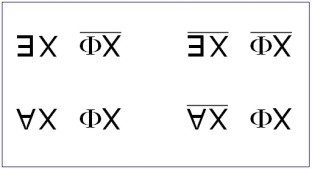
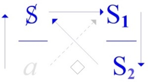
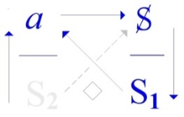

# Leçon 05 | 09 Mars 1972

<!-- source-docx: S19b Le savoir du psychanalyste.docx -->
<!-- seminar: s19b -->
<!-- lesson: 05 -->

<!-- id: s19b-05-0001 -->

Je m'excuse, c'est la première fois que *je suis en retard*. Je vous avertis : je suis malade.

<!-- id: s19b-05-0002 -->

Vous êtes là, j'y suis aussi, c'est bien pour vous.

<!-- id: s19b-05-0003 -->

Je veux dire par là que je me sens anormalement bien sous l'influence d'une petite température et de quelques drogues, de sorte que si jamais, tout d'un coup cette situation changeait j'espère que ceux qui m'entendent depuis longtemps expliqueraient aux nouveaux que c'est la première fois que ça m'arrive.

<!-- id: s19b-05-0004 -->

Alors, je vais essayer ce soir, donc d'être au niveau de ce que vous attendez, ce que vous attendez *ici* où j'ai dit que je m'amuse.

<!-- id: s19b-05-0005 -->

Ça n'est pas forcé que ça reste toujours du même ton.

<!-- id: s19b-05-0006 -->

Vous voudrez bien m'excuser, ça ne sera certainement pas dû à mon état anormal.

<!-- id: s19b-05-0007 -->

Ça sera bien selon la ligne de ce que j'ai, ce soir, l'intention de vous dire.

<!-- id: s19b-05-0008 -->

Ailleurs*,* évidemment je ne ménage guère mon auditoire.

<!-- id: s19b-05-0009 -->

Si quelques uns qui sont là - j'en aperçois quelques uns - se souviennent de ce dont j'ai parlé la dernière fois* *: j'ai parlé en somme de cette chose que j'ai résumée dans le noeud borroméen, je veux dire une chaîne de 3, et telle qu'à détacher un des anneaux de cette chaîne, les deux autres ne peuvent plus un seul instant tenir ensemble.

<!-- id: s19b-05-0010 -->

De quoi ça relève ? Je suis bien forcé de vous l'expliquer, puisque après tout je ne suis pas sûr que donné tout brut, tout simple, comme ça, ça suffise pour tous.

<!-- id: s19b-05-0011 -->

Ça veut dire une question concernant ce qui est la condition de l'inconscient.

<!-- id: s19b-05-0012 -->

Ça veut dire une question posée à ce qu'est le *langage*. En effet, c'est là une question qui n'est pas tranchée.

<!-- id: s19b-05-0013 -->

Le langage doit-il être abordé dans sa grammaire, auquel cas - c'est certain - il relève d'une *topologie*\...

<!-- id: s19b-05-0014 -->

*X - Qu'est-ce que c'est une topologie ?*

<!-- id: s19b-05-0015 -->

Lacan

<!-- id: s19b-05-0016 -->

Ah, qu'est-ce que c'est qu'une topologie ? Comme cette personne est gentille !

<!-- id: s19b-05-0017 -->

Une topologie c'est une chose qui a une définition mathématique.

<!-- id: s19b-05-0018 -->

La topologie, c'est ceci qui s'aborde d'abord par des rapports non métriques\...

<!-- id: s19b-05-0019 -->

*X - Qu'est-ce que ça veut dire ?*

<!-- id: s19b-05-0020 -->

\...par des rapports *déformables*. C'est à proprement parler le cas de *ces sortes de cercles souples* qui constituaient mon : « *<u>je te demande</u> - <u>de me refuser</u> - <u>ce que je t'offre</u>* »

<!-- id: s19b-05-0021 -->

Chacun était une chose fermée, souple et qui ne tient qu'à être enchaînée aux autres.

<!-- id: s19b-05-0022 -->

Rien ne se soutient tout seul.

<!-- id: s19b-05-0023 -->

Cette topologie, du fait de son insertion mathématique, est liée à des rapports\...

<!-- id: s19b-05-0024 -->

> justement c'est ce que servait à démontrer mon dernier séminaire \...est liée à des rapports de pure signifiance, c'est-à-dire que c'est en tant que ces trois termes sont trois, que nous voyons que de la présence du troisième s'établit entre les deux autres une relation.

<!-- id: s19b-05-0025 -->

C'est cela que veut dire le nœud borroméen.

<!-- id: s19b-05-0026 -->

Il y a une autre façon d'aborder le langage, et bien sûr la chose est actuelle.

<!-- id: s19b-05-0027 -->

Elle est actuelle pour le fait que quelqu'un que j'ai nommé\...

<!-- id: s19b-05-0028 -->

> il se trouve que je l'ai nommé *après* que l'ait fait  Jakobson,
>
> mais que - comme il arrive - je l'avais connu dès avant, c'est à savoir un nommé René Thom \...et ce quelqu'un tente en somme\...

<!-- id: s19b-05-0029 -->

> certainement non sans en avoir déjà frayé certaines voies \...d'aborder la question du langage sous le biais sémantique, c'est-à-dire non pas de la combinaison signifiante\...

<!-- id: s19b-05-0030 -->

> en tant que la mathématique pure peut nous aider à la concevoir comme telle \...mais sous l'angle sémantique, c'est-à-dire non pas sans recourir aussi à la mathématique, à trouver dans certaines courbes, dirais-je, certaines formes, ajouterais-je, qui se déduisent de ces courbes, quelque chose qui nous permettrait de concevoir *le langage* comme - dirais-je - quelque chose comme l'écho des phénomènes physiques.

<!-- id: s19b-05-0031 -->

C'est à partir, par exemple : dans ce qui est purement et simplement communication de phénomènes de résonance que seraient élaborées des courbes, qui pour valoir dans un certain nombre de relations fondamentales, se trouveraient secondairement se rassembler, s'homogénéiser si l'on peut dire, être prises dans une même parenthèse d'où résulteraient les diverses fonctions grammaticales.

<!-- id: s19b-05-0032 -->

Il me semble qu'il y a déjà un obstacle à concevoir les choses ainsi : c'est qu'on est forcé de mettre sous le même terme « *verbe* », des types d'action fort différentes.

<!-- id: s19b-05-0033 -->

Pourquoi le langage aurait-il - en quelque sorte - rassemblé dans une même catégorie des fonctions qui ne peuvent se concevoir d'origine que sous les modes d'émergence très différents ?

<!-- id: s19b-05-0034 -->

Néanmoins la question reste en suspens.

<!-- id: s19b-05-0035 -->

Il est certain qu'il y aurait quelque chose d'infiniment satisfaisant \[*sic*\] à considérer que le langage est en quelque sorte modelé sur les fonctions supposées être de la réalité physique, même si cette réalité n'est abordable que par le biais d'une fonctionnalisation mathématique.

<!-- id: s19b-05-0036 -->

Ce que je suis - pour moi - en train pour vous d'avancer, c'est quelque chose qui foncièrement s'attache à l'origine purement topologique du langage.

<!-- id: s19b-05-0037 -->

Cette origine topologique, je crois pouvoir en rendre compte à partir de ceci : qu'elle est liée essentiellement à quelque chose qui arrive sous le biais - chez l'*être parlant* - de la sexualité.

<!-- id: s19b-05-0038 -->

L'*être parlant* est-il parlant à cause de ce quelque chose qui est arrivé à la sexualité, ou ce quelque chose est-il arrivé à la sexualité parce qu'il est *être parlant*, c'est une affaire où je m'abstiens de trancher, vous en laissant le soin.

<!-- id: s19b-05-0039 -->

Le schème fondamental de ce dont il s'agit, et que ce soir je vais tenter de pousser devant vous un peu plus avant, est ceci : la fonctions dite « *sexualité* » est définie\...

<!-- id: s19b-05-0040 -->

> pour autant que nous en sachions quelque chose,
>
> nous en savons quand même un bout, ne serait-ce que par expérience \...de ceci que les sexes sont deux.

<!-- id: s19b-05-0041 -->

Quoi qu'en pense un auteur célèbre, qui je dois dire, dans son temps\...

<!-- id: s19b-05-0042 -->

> avant qu'elle eût pondu ce livre qui s'appelle « *Le deuxième sexe »* \...avait cru, en raison de je ne sais quelle orientation

<!-- id: s19b-05-0043 -->

> car à la vérité, je n'avais encore commencé de rien enseigner \...avait cru devoir en référer à moi avant de pondre « *Le deuxième sexe »*.

<!-- id: s19b-05-0044 -->

Elle m'appela au téléphone pour me dire qu'assurément elle avait besoin de mes conseils pour l'éclairer sur ce qui devait être *l'affluent psychanalytique* à son ouvrage.

<!-- id: s19b-05-0045 -->

Comme je lui faisais remarquer qu'il faudrait bien au moins\...

<!-- id: s19b-05-0046 -->

> c'est un minimum puisque j'en parle depuis 20 ans et que ce n'est pas par hasard \...qu'il faudrait bien 5 ou 6 mois pour que je lui débrouille la question, elle me fit observer qu'il n'était pas question, bien sûr, qu'un livre qui était déjà en cours d'exécution, attendît si longtemps.

<!-- id: s19b-05-0047 -->

Les lois de la production littéraire étant telles qu'il lui semblait exclu d'avoir avec moi plus de 3 ou 4 entretiens.

<!-- id: s19b-05-0048 -->

À la suite de quoi, je déclinais cet honneur.

<!-- id: s19b-05-0049 -->

Le fondement de ce que je suis depuis un moment en train de sortir pour vous, très précisément depuis l'année dernière, est très précisément ceci : *qu'il n'y a pas de deuxième sexe !*

<!-- id: s19b-05-0050 -->

*Il n'y a pas de deuxième sexe* à partir du moment où entre en fonction le langage.

<!-- id: s19b-05-0051 -->

Ou pour dire les choses autrement concernant ce qu'on appelle *l'hétérosexualité*, c'est très précisément en ceci : c'est que le mot ετερος \[étéros\]\...

<!-- id: s19b-05-0052 -->

> qui est le terme qui sert à dire « *autre* » en grec, \...est très précisément dans cette position\...

<!-- id: s19b-05-0053 -->

> pour le *rapport* que chez l'être parlant on appelle « *sexuel »*, \...de se vider en tant qu'être, et c'est précisément de ce vide qu'il offre à la parole ce que j'appelle « *le lieu de l'Autre* », à savoir ce lieu où s'inscrivent les effets de la dite parole.

<!-- id: s19b-05-0054 -->

Je ne vais pas nourrir ceci, parce qu'après tout ça nous retarderait, de quelques références étymologiques :

<!-- id: s19b-05-0055 -->

- comment ετερος \[eteros\] se dit, dans certain dialecte grec,

<!-- id: s19b-05-0056 -->

> que je vous épargnerais même de vous nommer - ἅτερος \[àteros\],

<!-- id: s19b-05-0057 -->

- comment cet ετερος \[eteros\] se rallie à δεύτερος \[dèuteros\]

<!-- id: s19b-05-0058 -->

> et très précisément marque que ce δεύτερος \[dèuteros\], dans l'occasion est si je puis dire, *élidé*.

<!-- id: s19b-05-0059 -->

Il est clair que ceci peut paraître surprenant, comme il est évident que depuis des temps une telle formule\...

<!-- id: s19b-05-0060 -->

> la vérité c'est que je ne sache pas qu'il y ait un repère d'un temps où elle aurait été formulée \...une telle formule \[« *Il n'y a pas de deuxième sexe »*\] est très précisément ce qui est ignoré.

<!-- id: s19b-05-0061 -->

Je le prétends néanmoins, et je le soutiens de ce que vous voyez au tableau, que c'est là ce qu'apporte l'expérience psychanalytique :

<!-- id: s19b-05-0062 -->

{width="1.4166666666666667in" height="0.7688506124234471in"}

<!-- id: s19b-05-0063 -->

Pour ceci, rappelons sur quoi repose ce que nous pouvons avoir de la conception,

<!-- id: s19b-05-0064 -->

- non pas de *l'hétérosexualité*, puisqu'elle est en somme fort bien nommée, si vous suivez ce que je viens d'avancer à l'instant,

<!-- id: s19b-05-0065 -->

- mais de *la bisexualité*.

<!-- id: s19b-05-0066 -->

Au point où nous en sommes de nos énoncés concernant ladite sexualité, qu'avons nous ?

<!-- id: s19b-05-0067 -->

Ce à quoi nous nous référons\...

<!-- id: s19b-05-0068 -->

> et ne croyez pas que ça aille de soi \...ce à quoi nous nous référons, c'est au modèle, si je puis dire, supposé « *animal »*.

<!-- id: s19b-05-0069 -->

Il y a donc un rapport entre les sexes et l'image animale de la copulation, qui nous semble fournir un modèle suffisant de ce qu'il en est du rapport, et du même coup que ce qui est sexuel est considéré comme besoin.

<!-- id: s19b-05-0070 -->

Ce n'est pas là - loin de là, croyez-le - ce qui a été de toujours.

<!-- id: s19b-05-0071 -->

Je n'ai pas besoin de rappeler ce que veut dire « *connaître* » au sens biblique du mot.

<!-- id: s19b-05-0072 -->

Depuis toujours le rapport du νοῦς \[nouss\] à quelque chose qui en subirait l'empreinte passive, qu'on appelle diversement, mais assurément dont la dénomination grecque la plus usuelle est celle de la ὕλη \[ýlé : substance\], depuis toujours le mode de relation qui s'engendre de l'esprit, a été considéré comme *modelant*, non pas du tout simplement la relation animale, mais le mode fondamental d'être de ce qu'on tenait pour être *le monde*.

<!-- id: s19b-05-0073 -->

Les chinois ont dans l'occasion fait appel à quelque chose qui s'écrit ainsi : yīn : 陰 yáng : 陽

<!-- id: s19b-05-0074 -->

Les chinois depuis longtemps font appel à deux essences fondamentales qui sont respectivement l'essence féminine qu'ils appellent le *Yin,* pour l'opposer au *Yang,* qu'il se trouve que j'ai écrit - pas par hasard sans doute - au-dessous.

<!-- id: s19b-05-0075 -->

S'il y avait rapport articulable sur le plan sexuel, s'il y avait rapport articulable chez l'être parlant, devrait-il - c'est là la question - s'énoncer

<!-- id: s19b-05-0076 -->

- de « *tous ceux* » d'un même sexe,

<!-- id: s19b-05-0077 -->

- à « *tous ceux* » *de l'autre*.

<!-- id: s19b-05-0078 -->

C'est évidemment l'idée que nous suggère, au point où nous en sommes, la référence à ce que j'ai appelé *le modèle animal* :

<!-- id: s19b-05-0079 -->

- aptitude si je puis dire, de chacun, d'un côté,

<!-- id: s19b-05-0080 -->

- à valoir pour tous les autres, de l'autre.

<!-- id: s19b-05-0081 -->

Vous voyez donc que l'énoncé se promulgue selon la forme, la forme sémantique significative de *l'Universelle*.

<!-- id: s19b-05-0082 -->

À remplacer dans ce que j'ai dit, « *chacun* » par « *quiconque* » ou par « *n'importe qui* » - *n'importe qui* d'un de ces côtés - nous serions tout à fait dans l'ordre de ce que suggère ce qui s'appellerait\...

<!-- id: s19b-05-0083 -->

> reconnaissez dans *ce conditionnel* quelque chose à quoi fait écho mon *Discours qui ne <u>serait</u> pas du semblant* \...eh bien à remplacer « *chacun* » par « *quiconque* » nous serions bien dans cette indétermination de ce qui est choisi dans chaque « *tous* », pour répondre à « *tous les autres* ».

<!-- id: s19b-05-0084 -->

Le « *chacun* » que j'ai employé d'abord, a tout de même cet effet de vous rappeler qu'après tout, si j'ose dire, le rapport effectif n'est pas sans évoquer l'horizon du « *un à un* », de l'« *à chacun sa chacune* ».

<!-- id: s19b-05-0085 -->

Ceci : *correspondance biunivoque*, fait écho à ce que nous savons qui est essentiel à présentifier *le nombre*.

<!-- id: s19b-05-0086 -->

Remarquons ceci, c'est que nous ne pouvons dès l'abord éliminer l'existence de ces 2 dimensions et que l'on peut même dire que le *modèle animal* est justement ce qui suggère le fantasme « *animique* ».

<!-- id: s19b-05-0087 -->

Si nous n'avions pas ce *modèle animal*\...

<!-- id: s19b-05-0088 -->

> même si le choix est de *rencontre*, l'accouplement bi-univoque est ce qui nous en apparaît,
>
> à savoir qu'il y a que deux animaux qui copulent ensemble \...eh bien, nous n'aurions pas cette dimension essentielle qui est très précisément que *la rencontre* *est unique*.

<!-- id: s19b-05-0089 -->

Ce n'est pas hasard si je dis que c'est de là - de là seulement - que se fomente le modèle animique : appelons ça « *la rencontre d'âme à âme* » !

<!-- id: s19b-05-0090 -->

Celui qui sait la condition de l'être parlant n'a en tout cas pas à s'étonner *que la rencontre,* à partir de ce fondement, sera justement *à répéter en tant qu'unique*.

<!-- id: s19b-05-0091 -->

Il n'y a là besoin de faire rentrer en jeu aucune dimension de vertu.

<!-- id: s19b-05-0092 -->

C'est la nécessité même de ce qui, chez l'être parlant se produit d'*unique* : *c'est qu'il se répète*.

<!-- id: s19b-05-0093 -->

C'est bien en quoi ce n'est que du *modèle animal* que se soutient et se fomente le fantasme que j'ai appelé *« animique »,* il y a des *« enfantesques »* \[29'\] là-dessous, qui est là de dire « *le langage n'existe pas* », mais ce n'est évidemment pas ce qui nous intéresse dans le champ analytique.

<!-- id: s19b-05-0094 -->

Ce qui nous donne l'illusion *du rapport sexuel* chez l'être parlant *c'est tout ce qui matérialise* *l'Universel* dans un comportement qui est effectivement de « *troupe* » dans *les rapports entre les sexes*.

<!-- id: s19b-05-0095 -->

J'ai déjà souligné que dans la quête - ou la chasse, comme vous voudrez - sexuelle :

<!-- id: s19b-05-0096 -->

- les garçons s'encouragent,

<!-- id: s19b-05-0097 -->

- et que pour les filles, elles aiment à se redoubler tant que cela les avantage, bien sûr !

<!-- id: s19b-05-0098 -->

C'est une remarque *éthologique* que j'ai faite, à l'occasion, mais qui ne tranche rien, car il suffit d'y réfléchir pour y voir un miracle assez équivoque pour qu'il ne puisse pas se soutenir longtemps.

<!-- id: s19b-05-0099 -->

Pour être ici plus insistant et m'en tenir au niveau de l'expérience la plus rase - je veux dire à ras de terre - l'expérience analytique, je vous rappellerai que l'*imaginaire* qui est ce que nous reconstituons dans le modèle animal\...

<!-- id: s19b-05-0100 -->

> que nous reconstituons à notre idée bien sûr,
>
> car il est clair que nous ne pouvons le reconstruire que par l'observation \...mais *l'imaginaire* par contre, nous en avons une expérience, une expérience qui n'est pas aisée, mais que la psychanalyse nous a permis d'étendre.

<!-- id: s19b-05-0101 -->

Et pour dire les choses crûment, il ne sera, me semble-t-il, pas difficile de me faire entendre si j'avance\...

<!-- id: s19b-05-0102 -->

> j'ai appelé ça : « *crûment* », c'est pas si « *cru* », c'est « *cruel* » qu'il faut dire \...eh bien - mon Dieu\... - qu'en toute rencontre sexuelle, s'il y a quelque chose que la psychanalyse permet d'avancer, c'est bien je ne sais quel profil d'*autre présence,* pour lequel le terme vulgaire de *« partouze »* n'est pas absolument exclu.

<!-- id: s19b-05-0103 -->

Cette référence en elle-même n'a rien de décisif, puisqu'après tout, on pourrait prendre l'air sérieux de dire que c'est justement là « *le stigmate de l'anomalie* », comme si la normale - en deux mots - était situable quelque part.

<!-- id: s19b-05-0104 -->

Il est certain qu'à avancer ce terme, celui que je viens d'épingler de ce nom vulgaire, je n'ai certainement pas cherché à faire vibrer chez vous *la lyre érotique*, et que si, simplement, ça a une petite valeur d'éveil, que ça vous donne au moins cette dimension, non pas celle qui peut ici faire écho d'Éros, mais simplement la dimension pure du réveil.

<!-- id: s19b-05-0105 -->

Je ne suis certes pas là pour vous amuser dans cette corde !

<!-- id: s19b-05-0106 -->

Tâchons maintenant de frayer ce qu'il en est de la parenté de « *l'Universelle* » avec notre affaire, à savoir l'énoncé par quoi les objets devraient se répartir en deux « *tous* » d'équivalence opposée.

<!-- id: s19b-05-0107 -->

Je viens de vous faire remarquer qu'il n'y a nullement lieu d'exiger l'équinuméricité des individus et je suis resté - comme j'ai pu - soutenir ce que j'avais à en avancer simplement de *la bi-univocité de* *l'accouplement*.

<!-- id: s19b-05-0108 -->

Ce sont\... ce seraient si c'était possible, deux « *Universelles* », définies donc par le seul établissement de la possibilité d'un *rapport* de « *l'un à l'autre* » ou de « *l'autre à l'un* ».

<!-- id: s19b-05-0109 -->

Le dit *rapport* n'a absolument rien à faire avec ce qu'on appelle couramment des « *rapports sexuels* ».

<!-- id: s19b-05-0110 -->

On a des tas de *rapports* à ces *rapports*, et sur ces *rapports* on a aussi quelques petits *rapports* : ça occupe notre vie terrestre.

<!-- id: s19b-05-0111 -->

Mais au niveau où je le place, il s'agit de fonder ce rapport dans des *Universels* : comment *l'Universel « Homme »* se rapporte à *l'Universel « Femme »* ? C'est là la question.

<!-- id: s19b-05-0112 -->

Et c'est la question qui s'impose à nous du fait que *le langage* très précisément exige que ce soit par là qu'il soit fondé.

<!-- id: s19b-05-0113 -->

S'il n'y avait pas de *le langage*, il n'y aurait pas non plus de question, nous n'aurions pas à faire entrer en jeu *l'Universel*.

<!-- id: s19b-05-0114 -->

Ce rapport\...

<!-- id: s19b-05-0115 -->

pour préciser : rendre l'Autre absolument étranger à ce qui pourrait être ici purement et simplement secondant \...est ce qui peut-être ce soir, me force d'accentuer le « A » dont je marque cet Autre comme vide \[**A**\], de quelque chose de supplémentaire : un « H », le *Hautre*, ce qui ne serait pas une si mauvaise manière de faire entendre la dimension de « *Hun* » qui peut ici entrer en jeu, soit de nous apercevoir par exemple, que tout ce que nous avons d'élucubrations philosophiques n'est peut-être pas par hasard sorti d'un nommé Socrate, manifestement hystérique, je veux dire *cliniquement* : enfin, nous avons le rapport de ses manifestations cataleptiques, le nommé Socrate, s'il a pu soutenir un discours dont c'est pas pour rien qu'il est à l'origine du *discours de la science*, c'est très précisément pour avoir fait venir, comme je le définis, à la place du *semblant *: *le sujet*.

<!-- id: s19b-05-0116 -->

{width="1.3552624671916012in" height="0.7549409448818898in"}

<!-- id: s19b-05-0117 -->

*Discours Hystérique*

<!-- id: s19b-05-0118 -->

Et ceci il l'a pu, très précisément en raison de cette dimension qui pour lui présentifiait le « *Hautre* » comme tel, à savoir cette haine de sa femme, pour l'appeler par son nom \[Xanthippe\], cette personne qu'était sa femme au point qu'elle « *s'affemmait* » à tel point, que lui, il a fallu au moment de sa mort qu'il la prie poliment de se retirer, pour laisser à la dite mort, toute sa signification politique.

<!-- id: s19b-05-0119 -->

C'est simplement *une dimension d'indication* concernant le point où gît la question que nous sommes en train de soulever.

<!-- id: s19b-05-0120 -->

J'ai dit que si nous pouvons dire *qu'il n'y a pas de rapport sexuel*, ce n'est assurément pas en toute innocence, c'est parce que *l'expérience*, à savoir un mode de *discours* qui n'est point absolument celui *de l'hystérique*, mais celui que j'ai inscrit sous une répartition quadripodique comme étant *le discours analytique *:

<!-- id: s19b-05-0121 -->

{width="1.194232283464567in" height="0.7653488626421697in"}

<!-- id: s19b-05-0122 -->

*Discours Analytique*

<!-- id: s19b-05-0123 -->

Et que ce qui ressort de ce *discours*, c'est la dimension jamais jusqu'à présent évoquée de *la fonction phallique*, c'est à savoir *ce quelque chose* par quoi ce n'est pas du rapport sexuel que se caractérise au moins l'un des deux termes\...

<!-- id: s19b-05-0124 -->

> et très précisément celui auquel s'attache ici ce mot : l'*Hun*,
>
> c'est non pas de sa position d'*Hun* qui serait réductible à ce quelque chose qu'on appelle soit *« le mâle »,* soit dans la terminologie chinoise l'essence du *Yang* \...c'est très précisément au contraire en raison de ce qui après tout mérite d'être rappelé pour accentuer le sens\...

<!-- id: s19b-05-0125 -->

> le sens voilé parce qu'il nous vient de loin \...du terme d'*organe*, c'est justement ce qui n'est *organe* - pour accentuer les choses - que comme un « *ustensile* ».

<!-- id: s19b-05-0126 -->

C'est autour de l'« *ustensile* » que l'expérience analytique nous incite à voir tourner tout ce qui s'énonce du rapport sexuel. Ceci est une nouveauté, je veux dire \[*ceci*\] *répond à l'émergence d'un discours*, qui assurément n'était jamais venu encore au jour, et qui ne saurait se concevoir sans la préalable émergence du *discours* *de la science* \[*discours Hystérique*\]*,* en tant qu'il est insertion du langage sur *le réel mathématique*.

<!-- id: s19b-05-0127 -->

J'ai dit que ce qui stigmatise ce rapport, d'être dans le langage profondément subverti, est très précisément ceci : qu'il n'y a plus moyen\...

<!-- id: s19b-05-0128 -->

> comme ça s'est fait pourtant, mais dans une dimension qui me paraît être de mirage \...*il ne peut plus s'écrire en termes d'essences* *mâle* et *femelle*.

<!-- id: s19b-05-0129 -->

Que ce « *ne pouvoir s'écrire* » qu'est-ce que ça veut dire, puisque après tout ça s'est déjà écrit ?

<!-- id: s19b-05-0130 -->

Si je repousse cette *ancienne écriture* au nom du *discours analytique*, vous pourriez m'objecter une objection bien plus valable : que je l'écris moi aussi, puisque aussi bien\...

<!-- id: s19b-05-0131 -->

> c'est ce que je viens de remettre une fois de plus au tableau \...c'est quelque chose qui prétend supporter d'une écriture - quoi ? - le réseau de l'affaire sexuelle.

<!-- id: s19b-05-0132 -->

{width="1.4166666666666667in" height="0.7688506124234471in"}

<!-- id: s19b-05-0133 -->

Néanmoins *cette écriture* ne s'autorise, ne prend sa forme que *d'une écriture très spécifiée*,

<!-- id: s19b-05-0134 -->

- à savoir ce qu'a permis d'introduire dans la logique

<!-- id: s19b-05-0135 -->

> l'irruption précisément de ce qu'on me demandait tout à l'heure,

<!-- id: s19b-05-0136 -->

- à savoir une topologie mathématique.

<!-- id: s19b-05-0137 -->

Ce n'est qu'à partir de l'existence de la formulation de cette topologie que nous avons pu, de toute proposition*,* imaginer que nous fassions *fonction propositionnelle*, c'est-à-dire quelque chose qui se spécifie de la place vide \[*pour tout x*\] qu'on y laisse, et en fonction de laquelle se détermine l'argument \[*x vérifie la fonction*\].

<!-- id: s19b-05-0138 -->

Ici je veux vous faire remarquer que très précisément ce que j'emprunte, à l'occasion, à *l'inscription mathématique*, en tant qu'elle se substitue aux premières formes - je ne dis pas formalisations -- aux formes ébauchées par Aristote dans sa *syllogistique*, que donc cette inscription sous le terme *fonction argument* pourrait, semble-t-il, nous offrir un terme aisé à spécifier l'opposition sexuelle.

<!-- id: s19b-05-0139 -->

Qu'y faudrait-il ?

<!-- id: s19b-05-0140 -->

Il y suffirait que *les fonctions* respectives *du mâle* et *de la femelle* se distinguassent très précisément comme le *Yin* et le *Yang*.

<!-- id: s19b-05-0141 -->

C'est très précisément de ce que *la fonction est unique*, *il s'agit toujours de* ! \[*pour les « hommes » comme pour les « femmes »*\] , que s'engendre, comme vous le savez\...

<!-- id: s19b-05-0142 -->

> comme il n'est pas possible, du seul fait que vous soyez ici,
>
> que vous n'en n'ayez pas au moins une petite idée \...que s'engendre la difficulté et la complication. ! affirme qu'il est vrai\...

<!-- id: s19b-05-0143 -->

> c'est le sens qu'a le terme de *fonction* \...qu'il est vrai que ce qui se rapporte à l'exercice, au registre de l'acte sexuel, relève de *la fonction phallique*.

<!-- id: s19b-05-0144 -->

C'est très précisément en tant qu'il s'agit de *fonction phallique*, de quelque côté que nous regardions, je veux dire : *d'un côté ou de l'autre*, que quelque chose nous sollicite de demander alors *en quoi les deux partenaires diffèrent*.

<!-- id: s19b-05-0145 -->

Et c'est très précisément ce qu'inscrivent les formules que j'ai mises au tableau.

<!-- id: s19b-05-0146 -->

{width="1.4166666666666667in" height="0.7688506124234471in"}

<!-- id: s19b-05-0147 -->

S'il s'avère que du fait de dominer également les deux partenaires, *la fonction phallique* ne les fait pas différents, il n'en reste pas moins que c'est d'abord ailleurs que nous devons en chercher la différence.

<!-- id: s19b-05-0148 -->

C'est en quoi ces formules - celles inscrites au tableau - méritent d'être interrogées sur les deux versants :

<!-- id: s19b-05-0149 -->

- le versant de gauche s'opposant au versant de droite,

<!-- id: s19b-05-0150 -->

- le niveau supérieur s'opposant au niveau inférieur.

<!-- id: s19b-05-0151 -->

Qu'est-ce que cela veut dire ?

<!-- id: s19b-05-0152 -->

Ce que cela veut dire mérite d'être ausculté, si je puis dire, c'est à savoir d'être interrogé, je dirais d'abord sur ce en quoi elles peuvent faire montre d'un certain abus.

<!-- id: s19b-05-0153 -->

Il est clair que ce n'est pas parce que j'ai usé d'une formulation faite de l'irruption des mathématiques dans la logique, que je m'en sers tout à fait de la même façon.

<!-- id: s19b-05-0154 -->

Et mes premières remarques vont consister à montrer qu'en ef­fet la façon dont j'en use est telle qu'elle n'est aucunement traductible en termes de *logique des propositions*.

<!-- id: s19b-05-0155 -->

Je veux dire que le mode sous lequel la *variable*\...

<!-- id: s19b-05-0156 -->

> ce qu'on appelle la *variable*, à savoir ce qui fait place à l'*argument* \...est quelque chose qui est ici tout à fait spécifié par la forme quadruple sous laquelle la relation de l'argument à la fonction est posée.

<!-- id: s19b-05-0157 -->

Pour simplement introduire ce dont il s'agit, je vous rappellerai qu'en *logique des propositions,* nous avons de premier plan, - il y en a d'autres - les 4 relations fondamentales qui en quelque sorte sont le fondement de la logique des propositions, qui sont respectivement :

<!-- id: s19b-05-0158 -->

- *la négation,*

<!-- id: s19b-05-0159 -->

- *la conjonction,*

<!-- id: s19b-05-0160 -->

- *la disjonction,*

<!-- id: s19b-05-0161 -->

- et *l'implication*.

<!-- id: s19b-05-0162 -->

Il y en a d'autres, mais ce sont les premières, et toutes les autres s'y ramènent.

<!-- id: s19b-05-0163 -->

J'avance que la façon dont sont écrites nos positions d'*argument* et de *fonction* est telle que la relation dite de *négation,* par quoi tout ce qui est posé comme *vérité* ne saurait nier *que passer au* « *faux *», *est* très précisément *ce qui ici* *est insoutenable*.

<!-- id: s19b-05-0164 -->

Car vous pouvez voir qu'au niveau, quel qu'il soit\...

<!-- id: s19b-05-0165 -->

> je veux dire le niveau inférieur et le niveau supérieur \...où l'énoncé de *la fonction* - à savoir qu'elle est *phallique -* où l'énoncé de la fonction est posé :

<!-- id: s19b-05-0166 -->

- soit *comme une vérité*,

<!-- id: s19b-05-0167 -->

- soit précisément *comme à écarter*, puisque après tout la vraie vérité ça serait justement ce qui ne s'écrit pas, ce qui ici ne peut s'écrire que sous la forme qui conteste *la fonction phallique*, à savoir : « *Il n'est pas vrai que la fonction phallique soit ce qui fonde le rapport sexuel* ».

<!-- id: s19b-05-0168 -->

Que dans les deux cas, à ces deux niveaux qui sont comme tels indépendants, dont il ne s'agit pas du tout de faire de l'un la négation de l'autre, mais au contraire de l'un l'obstacle à l'autre*,* par contre ce que vous voyez se répartir, c'est justement :

<!-- id: s19b-05-0169 -->

- un « *il existe* » \[: §\],

<!-- id: s19b-05-0170 -->

> et un « *il n'existe* *pas* » \[/ §\]

<!-- id: s19b-05-0171 -->

- c'est un « *Tout* » d'un côté : « *Tout x* » \[; !\] à savoir le domaine de ce qui est là ce qui se définit par *la fonction phallique,*

<!-- id: s19b-05-0172 -->

> et la différence de la position de l'argument dans *la fonction phallique*, c'est très précisément que ce n'est « *Pas toute* » *femme* qui s'y inscrit \[; §\].

<!-- id: s19b-05-0173 -->

Vous voyez bien que, loin que l'un s'oppose à l'autre comme sa négation, c'est tout au contraire de leur subsistance, ici très précisément comme niée :

<!-- id: s19b-05-0174 -->

- il y a un x qui peut se soutenir dans cet au-delà de *la fonction phallique* \[: §\],

<!-- id: s19b-05-0175 -->

- et de l'autre côté il n'y en a pas \[/ §\], pour la simple raison qu'une femme ne saurait être châtrée pour les meilleures raisons.

<!-- id: s19b-05-0176 -->

C'est un certain niveau, c'est le niveau de ce qui justement nous est barré dans le rapport sexuel tandis qu'au niveau de *la fonction phallique*, c'est très précisément en ce qu'au « *Tout* » s'oppose le « *Pas Toute* » qu'il y a chance d'une répartition de gauche à droite de ce qui se fondera comme *mâle* et comme *femelle*.

<!-- id: s19b-05-0177 -->

Loin donc, que la relation de négation nous force à choisir, c'est au contraire en tant que loin d'avoir à choisir nous avons à répartir, que les deux côtés s'opposent légitimement l'un à l'autre.

<!-- id: s19b-05-0178 -->

J'ai parlé, après *la négation,* de *la conjonction*.

<!-- id: s19b-05-0179 -->

*La conjonction*, je n'aurai besoin pour lui régler son compte, dans l'occasion, que de faire la remarque\...

<!-- id: s19b-05-0180 -->

> la remarque dont j'espère qu'il y a ici assez de gens qui auront, comme ça,
>
> vaguement broutillé un livre de logique pour que j'aie pas besoin d'insister *\...*c'est à savoir que *la conjonction* est fondée très précisément sur ceci : qu'elle ne prend valeur que du fait que deux propositions peuvent être toutes deux *vraies*.

<!-- id: s19b-05-0181 -->

{width="1.4166666666666667in" height="0.7688506124234471in"}

<!-- id: s19b-05-0182 -->

Et c'est justement ce que d'aucune façon ne nous permet ce qui est inscrit au tableau, puisque vous voyez bien que de droite à gauche, il n'y a aucune identité, et que très précisément là où il s'agit de ce qui est posé comme *vrai,* à savoir c'est justement à ce niveau que *les Universelles* ne peuvent se conjoindre : *l'Universelle* du côté gauche ne s'opposant , de l'autre côté, du côté droit, qu'au fait qu'il n'y a pas d'*Universelle* articulable, c'est à savoir que la femme, au regard de *la fonction phallique,* ne se situe que de *« pas toute »* y être sujette.

<!-- id: s19b-05-0183 -->

L'étrange est que pour autant *la disjonction* ne tient pas plus.

<!-- id: s19b-05-0184 -->

Si vous vous rappelez que *la disjonction* ne prend valeur que du fait que deux propositions ne peuvent\...

<!-- id: s19b-05-0185 -->

que c'est *impossible* qu'elles soient fausses en même temps.

<!-- id: s19b-05-0186 -->

C'est assurément la relation\...

<!-- id: s19b-05-0187 -->

dirons-nous la plus forte ou la plus faible ?

<!-- id: s19b-05-0188 -->

\...c'est assurément la plus forte en ceci que c'est celle qui est la plus dure à cuire, puisqu'il faut un minimum pour qu'il y ait *disjonction *:

<!-- id: s19b-05-0189 -->

- que *la disjonction* rend valable qu'une proposition soit vraie, l'autre fausse,

<!-- id: s19b-05-0190 -->

- que bien sûr toutes les deux soient vraies,

<!-- id: s19b-05-0191 -->

- à ceci s'ajoutant à ce que j'ai appelé « *l'une vraie, l'autre fausse* », ça peut-être « *l'une fausse, l'autre vraie* ».

<!-- id: s19b-05-0192 -->

Il y a donc au moins 3 cas combinatoires où *la disjonction* se soutient.

<!-- id: s19b-05-0193 -->

La seule chose qu'elle ne puisse pas admettre, c'est que toutes les deux soient fausses.

<!-- id: s19b-05-0194 -->

Or nous avons ici deux fonctions qui sont posées comme *n'étant pas* - je l'ai dit tout à l'heure - *la vraie vérité*, à savoir celles qui sont en haut.

<!-- id: s19b-05-0195 -->

Nous semblons ici *tenir quelque chose* qui donne espoir, à savoir qu'à tout le moins nous aurions articulé une véritable *disjonction*.

<!-- id: s19b-05-0196 -->

{width="1.4166666666666667in" height="0.7688506124234471in"}

<!-- id: s19b-05-0197 -->

Or remarquez *ce qui est écrit*, qui est quelque chose que j'aurai bien sûr l'occasion d'articuler d'une façon qui le fasse vivre, c'est qu'il n'y a très précisément d'un côté de ce § avec le signe de la négation au-dessus, à savoir que c'est en tant que *la fonction phallique* ne fonctionne pas qu'il y a chance de *rapport sexuel*, que nous avons posé qu'il faut qu'il existe un x pour cela \[: §\].

<!-- id: s19b-05-0198 -->

Or de l'autre côté qu'avons nous ? Qu'il n'en existe pas ! \[/ §\]

<!-- id: s19b-05-0199 -->

De sorte qu'on peut dire, que le sort de ce qui serait un mode sous lequel *se soutiendrait la différenciation* *du mâle et de la femelle*, de *l'homme* et de *la femme* chez l'être parlant, cette chance que nous avons qu'il y ait ceci, c'est que si à un niveau il y a discorde\...

<!-- id: s19b-05-0200 -->

> et nous verrons ce que tout à l'heure j'entends dire par là, je veux dire au niveau des *Universels*
>
> qui ne se soutiennent pas du fait de l'*inconsistance* d'un d'entre eux \...que se passe-t-il là où nous écartons la fonction elle-même, c'est que :

<!-- id: s19b-05-0201 -->

- si d'un côté il est supposé qu'il existe un x qui satisfasse à ! nié \[: §\],

<!-- id: s19b-05-0202 -->

- de l'autre nous avons l'expresse formulation que aucun x \[/ §\].

<!-- id: s19b-05-0203 -->

Ce que j'ai illustré de dire que la femme, pour les meilleures raisons, ne saurait être châtrée, mais il n'y a justement que l'énoncé « *aucun x* ».

<!-- id: s19b-05-0204 -->

C'est-à-dire qu'au niveau où *la disjonction* aurait chance de se produire, nous ne trouvons :

<!-- id: s19b-05-0205 -->

- d'un côté que 1, ou tout au moins ce que j'ai avancé de l'« *au-moins-un* »,

<!-- id: s19b-05-0206 -->

- et de l'autre très précisément la non existence, c'est-à-dire le rapport de 1 à 0.

<!-- id: s19b-05-0207 -->

Très précisément au niveau où le rapport sexuel aurait chance, non pas du tout d'être réalisé, mais simplement d'être espéré au-delà de l'abolition par l'écart de *la fonction phallique*, *nous ne trouvons plus comme présence*, oserais-je dire, *que l'un des deux sexes*.

<!-- id: s19b-05-0208 -->

C'est très précisément ceci qui est évidemment ce qu'il nous faut rapprocher de l'expérience, telle que vous êtes habitués à la voir s'énoncer sous cette forme que la femme suscite, de ce que *l'Universel* pour elle ne sache surgir de *la fonction phallique*, où elle ne participe comme vous le savez\...

<!-- id: s19b-05-0209 -->

> ceci est l'expérience, hélas trop quotidienne pour ne pas voiler la structure \...où elle ne participe qu'à la vouloir,

<!-- id: s19b-05-0210 -->

- soit la ravir à l'homme,

<!-- id: s19b-05-0211 -->

- soit­ - *mon Dieu* - qu'elle lui en impose le service, pour le cas « *...ou pire* », c'est le cas de le dire, qu'elle le lui rende.

<!-- id: s19b-05-0212 -->

Mais très précisément ceci ne l'universalise pas, ne serait-ce que de ceci\...

<!-- id: s19b-05-0213 -->

> qui est cette racine du « *pas toute* », \...qu'elle recèle *une autre jouissance* que *la jouissance phallique* : *la jouissance dite* proprement *féminine,* qui n'en dépend nullement.

<!-- id: s19b-05-0214 -->

Si la femme n'est « *pas toute* », c'est que *sa jouissance*, elle, est duelle.

<!-- id: s19b-05-0215 -->

Et c'est bien ce qu'a révélé Tirésias quand il est revenu d'avoir été, par la grâce de Zeus, Thérèse pour un temps, avec naturellement la conséquence que l'on sait, et qui était là enfin comme étalée, si je puis dire visible, c'est le cas de le dire pour Œdipe, pour lui montrer ce qui l'attendait, comme d'avoir existé justement, lui, comme homme de cette possession suprême qui résultait de la duperie où sa partenaire le maintenait, de la véritable nature de ce qu'elle offrait à sa *jouissance*, ou bien disons-le autrement : *faute que sa partenaire lui demandât de refuser ce qu'elle lui offrait*.

<!-- id: s19b-05-0216 -->

Ceci évidemment manifestant, mais au niveau du mythe, ceci : que pour exister comme homme à un niveau qui échappe à *la fonction phallique*, il n'avait d'autre femme que celle-là qui pour lui n'aurait justement pas dû exister. Voilà !

<!-- id: s19b-05-0217 -->

Pourquoi ce « *n'aurait pas dû* », pourquoi la théorie de l'inceste, ça rendrait nécessaire que je m'engage sur cette voie des *Noms du Père,* où précisément j'ai dit que je ne m'engagerai plus jamais* *?

<!-- id: s19b-05-0218 -->

C'est comme ça parce qu'il s'est trouvé que j'ai relu\...

<!-- id: s19b-05-0219 -->

> parce que quelqu'un m'en a prié \...cette première conférence de l'année 1963, ici même - hein ! - à Sainte Anne.

<!-- id: s19b-05-0220 -->

C'est bien pour ça que j'y suis revenu, parce que j'aimais m'en rappeler, j'ai relu ça, ça se relit, ça se lit, ça a même une certaine dignité, de sorte que je la publierai si je publie encore, ce qui ne dépend pas de moi !

<!-- id: s19b-05-0221 -->

Il faudrait que d'autres publient un peu avec moi, ça m'encouragerait.

<!-- id: s19b-05-0222 -->

Et si je le publie, on verra avec quel soin j'ai repéré alors\...

<!-- id: s19b-05-0223 -->

> mais je l'ai déjà dit depuis cinq ans sur un certain nombre de registre \...*la métaphore paternelle* notamment, *le nom propre*, il y avait tout ce qu'il fallait pour que, avec la Bible, on donne un sens à cette élucubration mythique de mes dires.

<!-- id: s19b-05-0224 -->

Mais je ne le ferai plus jamais, je ne le ferai plus jamais parce qu'après tout je peux me contenter de formuler les choses au niveau de *la structure logique*, qui, après tout, a bien ses droits. Voilà !

<!-- id: s19b-05-0225 -->

Ce que je veux vous dire, c'est que cet /, à savoir *« qu'il n'existe pas »,* rien d'autre qui à un certain niveau, celui où il y aurait chance qu'il y ait le rapport sexuel, que cet ετερος \[eteros\] *en tant qu'absent* \[/ §\], c'est pas du tout forcément le privilège du sexe féminin.

<!-- id: s19b-05-0226 -->

C'est simplement l'indication de ce qui est dans mon *graphe*\...

<!-- id: s19b-05-0227 -->

> je dis ça parce que ça a eu son petit sort \...de ce que j'inscris du signifiant de A *barré* \[**A**\], ça veut dire : l'Autre, d'où qu'on le prenne, *l'Autre est absent à partir du moment où il s'agit du rapport sexuel*.

<!-- id: s19b-05-0228 -->

Naturellement au niveau de ce qui fonctionne\...

<!-- id: s19b-05-0229 -->

> c'est-à-dire *la fonction phallique* \...il y a simplement cette *discorde* que je viens de rappeler, à savoir que d'un côté et de l'autre, là pour le coup on n'est pas dans la même position, à savoir que :

<!-- id: s19b-05-0230 -->

- d'un côté on a l'*Universelle* fondée sur un rapport nécessaire à *la fonction phallique,*

<!-- id: s19b-05-0231 -->

- et de l'autre côté un rapport *contingent* parce que la femme n'est « *pas toute* ».

<!-- id: s19b-05-0232 -->

Je souligne donc qu'au niveau supérieur, le rapport fondé sur la disparition, l'évanouissement de l'existence de l'un des partenaires *qui laisse la place vide à l'inscription de la parole*, n'est pas à ce niveau-là le privilège d'aucun côté.

<!-- id: s19b-05-0233 -->

Seulement pour qu'il y ait fondement du sexe, comme on dit, il faut qu'ils soient deux : 0 et 1 assurément *ça fait* 2, ça fait deux sur le plan *symbolique*, à savoir pour autant que nous accordons que *l'existence* s'enracine dans le *symbole*.

<!-- id: s19b-05-0234 -->

C'est ce qui définit *l'être parlant*. Assurément il est quelque chose. Peut-être bien, qui est-ce qui n'est pas ce qu'il est ?

<!-- id: s19b-05-0235 -->

Seulement cet « *être* », il est absolument insaisissable.

<!-- id: s19b-05-0236 -->

Et il est d'autant plus insaisissable qu'il est forcé *<u>pour se supporter</u>* de passer par le *symbole*.

<!-- id: s19b-05-0237 -->

Il est clair *qu'un être, qui en vient à n'être, que du symbole, est justement cet être sans être*, auquel - du seul fait que vous parliez - vous participez tous.

<!-- id: s19b-05-0238 -->

Mais, *par contre*, il est bien certain que *<u>ce qui se supporte</u>* c'est *l'existence*, et pour autant qu'*exister c'est pas être*, c'est-à-dire dépendre de *l'Autre*.

<!-- id: s19b-05-0239 -->

Vous êtes bien là, tous par quelque côté, à *exister*, mais pour ce qui est de votre *être*, vous n'êtes pas tellement tranquilles ! Autrement vous ne viendriez pas en chercher l'assurance dans tant d'efforts psychanalytiques*.*

<!-- id: s19b-05-0240 -->

C'est évidemment là quelque chose qui est tout à fait originel dans la première émergence de la logique.

<!-- id: s19b-05-0241 -->

Dans la première émergence de la logique il y a quelque chose qui est tout à fait frappant, c'est la difficulté, la difficulté et le flottement, qu'Aristote manifeste à propos du statut de *la proposition particulière*.

<!-- id: s19b-05-0242 -->

Ce sont des difficultés qui ont été soulignées ailleurs, que je n'ai pas découvertes, et pour ceux qui voudront s'y reporter, je leur conseille le cahier n° 10 des *« Cahiers pour l'analyse »* où un premier article d'un nommé Jacques Brunswig est là-dessus excellent.

<!-- id: s19b-05-0243 -->

Ils y verront parfaitement pointée la difficulté qu'Aristote a avec la *Particulière*.

<!-- id: s19b-05-0244 -->

C'est qu'assurément il perçoit que l'existence d'aucune façon ne saurait s'établir <u>que</u> hors *l'Universel*, c'est bien en quoi il situe l'existence au niveau de *la Particulière*, laquelle *Particulière* n'est nullement suffisante pour la soutenir, encore qu'il en donne l'illusion grâce à l'emploi du mot « *quelque* ».

<!-- id: s19b-05-0245 -->

Il est clair qu'au contraire ce qui résulte de la formalisation dite *des quanteurs*, « dite *des quanteurs »* en raison d'une trace laissée dans l'histoire philosophique, par le fait qu'un nommé Apulée qui était un romancier pas de très bon goût et un mystique certainement effréné, et qui s'appelait - je vous l'ai dit - Apulée. Il a fait « *L'âne d'or* ». C'est cet Apulée qui un jour a introduit que dans Aristote, ce qui concernait le « *tous* » et le « *quelque* » était de l'ordre de la quantité.

<!-- id: s19b-05-0246 -->

Ce n'est rien de tel, c'est au contraire simplement deux modes différents de ce que je pourrais appeler, si vous me passez ça qui est un peu improvisé, *l'incarnation du symbole*, à savoir que le passage dans la vie courante, qu'il y ait des « *tous* » et des « *quelque* » dans toutes les langues, c'est bien là ce qui assurément nous force à poser que le langage doit tout de même avoir une racine commune, et que\...

<!-- id: s19b-05-0247 -->

> comme les langues sont très profondément différentes dans leur structure, \...il faut bien que ce soit par rapport à *quelque chose* qui n'est pas le langage.

<!-- id: s19b-05-0248 -->

Bien sûr, on comprend ici que les gens glissent, et que sous prétexte que ce qu'on pressent être\... que cet *au-delà du langage* ne peut-être que *mathématique*, on s'imagine, parce que c'est *le nombre*, qu'il s'agit de *la quantité*.

<!-- id: s19b-05-0249 -->

Mais peut-être justement n'est-ce pas à proprement parler *le nombre* dans toute sa réalité, auquel le langage donne accès, mais seulement d'être capable d'accrocher le 0 et le 1.

<!-- id: s19b-05-0250 -->

Ce serait par là que se serait faite l'entrée de ce *réel*, ce *réel* seul à pouvoir être l'au-delà du langage, à savoir le seul domaine où peut se formuler *une impossibilité symbolique*.

<!-- id: s19b-05-0251 -->

Ce fait que, du *rapport,* lui accessible au langage\...

<!-- id: s19b-05-0252 -->

> accessible au langage *s'il est fondé* très justement *du non-rapport sexuel*, \...qu'il ne puisse donc qu'*affronter* le 0 et le 1, ceci trouverait aisément son reflet dans l'élaboration par Frege de sa genèse logique des nombres.

<!-- id: s19b-05-0253 -->

Je vous ai dit - indiqué tout au moins - ce qui fait difficulté dans cette genèse logique, à savoir justement *la béance*\...

<!-- id: s19b-05-0254 -->

> *la béance* que je vous ai soulignée du triangle mathématique \...entre ce 0 et ce 1, *béance* que redouble leur opposition d'*affrontement*.

<!-- id: s19b-05-0255 -->

Que déjà ce qui peut intervenir, ne soit là que du fait que ce soit là l'essence du 1^er^ couple, que ce ne puisse être qu'un 3^ème^, et que *la béance* comme telle soit toujours laissée du 2, c'est là *quelque chose d'essentiel à rappeler*, en raison de quelque chose *de bien plus dangereux* à laisser subsister dans l'analyse, que les aventures mythiques d'Œdipe\...

<!-- id: s19b-05-0256 -->

> qui sont en elles-mêmes sans aucun inconvénient pour autant qu'elles structurent admirablement la nécessité qu'il y ait quelque part « *au moins Un* » qui transcende ce qu'il en est de la prise de *la fonction phallique*.
>
> Le mythe du « *Père primitif* » ne veut rien dire d'autre.
>
> Ceci y est très suffisamment exprimé pour que nous puissions en faire aisément usage,
>
> outre que nous le trouvons confirmé par la structuration logique qui est celle que je vous rappelle
>
> de ce qui est inscrit au tableau.

<!-- id: s19b-05-0257 -->

\...Par contre, assurément rien de plus dangereux que les confusions sur ce qu'il en est de l'*Un*.

<!-- id: s19b-05-0258 -->

L'*Un*, comme vous le savez, est fréquemment évoqué par Freud comme signifiant ce qu'il en est d'une essence de l'*Éros* qui serait celle justement de *la fusion*, à savoir que la *libido* serait de cette sorte d'essence qui des 2 tendrait à faire *Un,* et qui - mon Dieu - selon un vieux mythe\...

<!-- id: s19b-05-0259 -->

> qui assurément n'est pas du tout de bonne mystique \...serait ce à quoi tiendrait une des tensions fondamentales du monde, à savoir de ne faire qu'*Un*.

<!-- id: s19b-05-0260 -->

Ce mythe qui est véritablement quelque chose qui ne peut fonctionner qu'à un horizon de délire, et qui n'a à proprement parler rien à faire avec quoi que ce soit que nous rencontrions dans l'expérience.

<!-- id: s19b-05-0261 -->

S'il y a *quelque chose* qui est bien patent dans les rapports entre les sexes\...

<!-- id: s19b-05-0262 -->

> et que l'analyse non seulement articule, mais est faite pour faire jouer dans tous les sens \...s'il y a bien *quelque chose* qui dans les *rapports* fait difficulté, c'est très précisément les rapports entre *les femmes* et *les hommes* et que rien ne saurait y ressembler à je ne sais quoi de *spontané*, hors précisément cet horizon dont je parlais tout à l'heure comme étant à la limite fondé sur je ne sais quel mythe animal et que d'aucune façon l'*Éros,* soit une tendance à l'*Un*. Bien loin de là !

<!-- id: s19b-05-0263 -->

C'est dans cette mesure, c'est dans cette fonction, que toute articulation précise de ce qu'il en est des deux niveaux\...

<!-- id: s19b-05-0264 -->

> de ce, où ce n'est que dans *la discorde* que se fonde l'opposition entre les sexes
>
> en tant qu'ils ne pourraient d'aucune façon s'instituer d'un *Universel* \...qu'au niveau de l'existence - au contraire - c'est très précisément dans une opposition qui consiste dans *l'annulation,* *le vidage, d'une des fonctions comme étant celle de l'autre, que recèle la possibilité de l'articulation du langage,* c'est cela qui me paraît essentiellement à mettre en évidence.

<!-- id: s19b-05-0265 -->

Observez que tout à l'heure, vous ayant parlé successivement *de la négation, de la conjonction et de la disjonction*, je n'ai pas poussé jusqu'au bout de ce qu'il en était *de l'implication*.

<!-- id: s19b-05-0266 -->

Il est clair qu'ici encore l'*implication,* elle, ne saurait fonctionner qu'entre les deux niveaux :

<!-- id: s19b-05-0267 -->

- *celui de la fonction phallique,*

<!-- id: s19b-05-0268 -->

- et *celui qui l'écarte*.

<!-- id: s19b-05-0269 -->

{width="1.4166666666666667in" height="0.7688506124234471in"}

<!-- id: s19b-05-0270 -->

Or, rien de ce qui est *disjonction*, au niveau inférieur, au niveau de l'insuffisance de la spécification universelle, rien n'implique pour autant, rien n'exige, que ce soit « *si et si seulement »* la syncope d'existence\...

<!-- id: s19b-05-0271 -->

> qui se produit au niveau supérieur \...effectivement se produise, pour que la discorde du niveau inférieur soit exigible, et très précisément réciproquement.

<!-- id: s19b-05-0272 -->

Par contre ce que nous voyons, c'est une fois de plus fonctionner\...

<!-- id: s19b-05-0273 -->

> d'une façon, mais distincte, mais séparée \...la relation du niveau supérieur au niveau inférieur.

<!-- id: s19b-05-0274 -->

L'exigence qu'il existe « *au-moins-un-homme* »\...

<!-- id: s19b-05-0275 -->

> qui est celle qui paraît émise au niveau de ce *féminin* qui se spécifie d'être un « *pas-toute* », une dualité \...le seul point où la dualité a chance d'être *représentée,* il n'y a là qu'un réquisit, si je puis dire, gratuit.

<!-- id: s19b-05-0276 -->

Cet « *au-moins-un »*, rien ne l'impose sinon la chance unique\...

<!-- id: s19b-05-0277 -->

> encore faut-il qu'elle soit jouée \...de ce que *quelque chose* fonctionne sur l'autre versant, mais comme un *point idéal*, comme possibilité pour tous les hommes d'y atteindre.

<!-- id: s19b-05-0278 -->

Par quoi ? Par identification !

<!-- id: s19b-05-0279 -->

Il n'y a là qu'une nécessité logique qui ne s'impose qu'au niveau du pari.

<!-- id: s19b-05-0280 -->

Mais observez par contre ce qu'il en résulte concernant *l'Universelle barrée*\...

<!-- id: s19b-05-0281 -->

> et c'est en quoi cet *au-moins-un* dont se supporte le *Nom du Père*, le *Nom du Père mythique*, est indispensable \...c'est ici que j'avance un aperçu qui est celui qui manque à *la fonction*, à la notion de *l'espèce* ou de *la classe*.

<!-- id: s19b-05-0282 -->

C'est en ce sens que ce n'est pas par hasard que toute cette dialectique dans les *formes aristotéliciennes* a été manquée.

<!-- id: s19b-05-0283 -->

Où fonctionne enfin cet :, cet *« il en existe au-moins-un »* qui ne soit pas serf de *la fonction phallique ?*

<!-- id: s19b-05-0284 -->

Ce n'est que d'un requisit, je dirais du type *désespéré*, du point de vue de quelque chose qui même ne se supporte pas d'une définition universelle.

<!-- id: s19b-05-0285 -->

Mais par contre observez qu'au regard de *l'Universelle* marquée ; !, tout mâle est serf de *la fonction phallique*.

<!-- id: s19b-05-0286 -->

Cet *au-moins-un* comme fonctionnant d'y échapper, qu'est-ce à dire ? Je dirai que c'est « l'*exception »*.

<!-- id: s19b-05-0287 -->

C'est bien la fois où ce que dit - sans savoir ce qu'il dit - le proverbe que « *l'exception confirme la règle* », se trouve pour nous supportée.

<!-- id: s19b-05-0288 -->

Il est singulier que ce ne soit qu'avec *le discours analytique* que ceci, qu'un *Universel* puisse trouver, dans *l'existence de l'exception*, son fondement véritable.

<!-- id: s19b-05-0289 -->

Ce qui fait qu'assurément nous pouvons en tout cas distinguer l'*Universel* ainsi fondé, de tout usage rendu commun par la tradition philosophique du dit « *Universel »*.

<!-- id: s19b-05-0290 -->

Mais il est une chose singulière que je retrouve par voie d'enquête\...

<!-- id: s19b-05-0291 -->

> et parce que d'une formation ancienne, je n'ignore pas tout à fait le chinois \...j'ai demandé à un de mes chers amis de me rappeler ce qu'évidemment je n'avais gardé plus ou moins que comme *trace*, et ce qu'il a fallu que je me fasse confirmer par quelqu'un dont c'est la langue maternelle, il est assurément très étrange que dans le chinois la dénomination du « *tout homme* »,

<!-- id: s19b-05-0292 -->

- qu'il s'agisse de l'articulation de *dōu*, que je ne vous écris pas au tableau parce que je suis fatigué,

<!-- id: s19b-05-0293 -->

- ou de l'articulation plus ancienne qui se dit *quán*\...

<!-- id: s19b-05-0294 -->

Enfin si ça vous amuse, je vais quand même vous l'écrire* *:

<!-- id: s19b-05-0295 -->

> *dōu* : 都*, quán* : 全

<!-- id: s19b-05-0296 -->

Est-ce que vous vous imaginez qu'on peut dire, par exemple : « Tous les hommes bouffent », eh bien ça se dit : měi gèrén dōu chī : 每个人都吃

<!-- id: s19b-05-0297 -->

« *Měi* » insiste sur le fait qu'il est bien là, et si vous en doutiez, la numérale « *gè* » montre bien qu'on les compte.

<!-- id: s19b-05-0298 -->

Mais ça ne les fait pas « *tous* », on ajoute « *dōu* » ce qui veut dire « *sans exception* »[^11].

<!-- id: s19b-05-0299 -->

Je pourrais vous citer bien sûr, d'autres choses, je peux vous dire que « *Tous les soldats ont péri* », ils sont tous morts, en chinois ça se dit : « *Sol­dats sans exception caput* ».

<!-- id: s19b-05-0300 -->

Le « *tout* » que nous voyons pour nous s'étaler de l'intérieur et ne trouver sa limite que de l'*inclusion*, d'être pris dans des ensembles de plus en plus vastes.

<!-- id: s19b-05-0301 -->

En langue chinoise, on ne dit jamais « *měi* » ni « *dōu* » qu'en pensant la totalité dont il s'agit comme contenu.

<!-- id: s19b-05-0302 -->

Vous me direz : « *sans exception* », mais bien sûr ce que nous, nous découvrons dans ce que je vous articule comme relation ici de *l'existence unique* par rapport au statut de *l'universel,* prend figure d'une *exception.*

<!-- id: s19b-05-0303 -->

Mais aussi bien n'est-ce, cette idée-là, que le corrélat de ce que j'ai appelé tout à l'heure « *le vide de l'Autre* ».

<!-- id: s19b-05-0304 -->

Ce en quoi nous avons progressé dans *la logique des classes*, c'est que nous avons créé *la logique des ensembles*.

<!-- id: s19b-05-0305 -->

La différence entre *la classe* et *l'ensemble,* c'est que :

<!-- id: s19b-05-0306 -->

- *quand la classe se vide il n'y a plus de classe,*

<!-- id: s19b-05-0307 -->

- *mais que quand l'ensemble se vide, il y a encore cet élément de l'ensemble vide* \[Ø\].

<!-- id: s19b-05-0308 -->

C'est bien en quoi, une fois de plus, la mathématique fait faire un progrès à *la logique*.

<!-- id: s19b-05-0309 -->

Et c'est ici que nous pourrons\...

<!-- id: s19b-05-0310 -->

> puisque nous continuons à nous entretenir, mais que ça va finir bientôt, je vous l'assure \...c'est de voir alors là où reprendre l'unilatérité de la fonction existentielle pour ce qui est de l'autre, de l'autre partenaire en tant qu'il est « *sans exception* ».

<!-- id: s19b-05-0311 -->

Ce « *sans exception* », qu'implique la *non-existence de* X \[/ §\] dans la partie droite du tableau, à savoir qu'il n'y a pas d'exception et que c'est là quelque chose qui n'a plus ici de parallélisme, de symétrie avec l'exigence que j'ai appelée tout à l'heure « *désespérée* » de l'*au-moins-un*, c'est une exigence autre et qui repose sur ceci : c'est qu'en fin de compte l'*Universel* masculin peut prendre son assiette dans l'assurance qu'il n'existe pas de femme qui ait à être châtrée, et ceci pour des raisons qui lui paraissent évidentes.

<!-- id: s19b-05-0312 -->

Seulement ceci n'a en fait, vous le savez, pas plus de portée pour la raison que c'est une assurance tout à fait gratuite, à savoir que ce que j'ai rappelé tout à l'heure du comportement de la femme, montre assez que sa relation à *la fonction phallique* est tout à fait active.

<!-- id: s19b-05-0313 -->

Seulement là comme tout à l'heure, si la supposition fondée sur, en quelque sorte, *l'assurance qu'il s'agit bien* *d'un impossible*\...

<!-- id: s19b-05-0314 -->

> ce qui est le comble du *réel* \...ceci n'ébranle pas pour autant *la fragilité*, si je puis dire, *de la conjecture,* parce qu'en tout cas la femme n'en est pas plus assurée dans son *essence universelle*, pour la simple raison de ceci : c'est que le contraire de *la limite*, à savoir : qu'il n'y en ait pas, qu'ici il n'y ait pas *d'exception*, le fait qu'il n'y ait pas d'exception n'assure pas plus *l'Universel*\...

<!-- id: s19b-05-0315 -->

> déjà si mal établi en raison de ceci qu'il est discordant \...n'assure pas plus *l'Universel de la femme*.

<!-- id: s19b-05-0316 -->

Le « *sans exception* », bien loin de donner à quelque « *Tout* » une consistance, naturellement en donne encore moins à ce qui se définit comme « *pas-tout* », *comme essentiellement duel*. Voilà !

<!-- id: s19b-05-0317 -->

Je souhaite que ceci vous reste comme cheville nécessaire à ce que nous pourrons tenter ultérieurement comme *grimpette*, si assurément nous sommes portés sur la voie où doit sévèrement s'interroger l'irruption de cette chose la plus étrange, à savoir *la fonction de l'Un*.

<!-- id: s19b-05-0318 -->

On se demande bien des choses sur ce qu'il en est de la mentalité animale qui ne nous sert, après tout ici, que de référence *en miroir*, un miroir devant lequel - comme devant tous les miroirs - on dénie purement et simplement.

<!-- id: s19b-05-0319 -->

Il y a quelque chose qu'on pourrait se demander : pour l'animal, y-a-t-il de l'*Un* ?

<!-- id: s19b-05-0320 -->

Le côté exorbitant de l'émergence de cet *Un*, c'est ce que nous serons amenés ailleurs à tenter de frayer\...

<!-- id: s19b-05-0321 -->

> et c'est bien pour cela que depuis longtemps je vous ai invités à relire, avant que je l'aborde, \...le « *Parménide »* de Platon.

## Notes

[^11]: Cf. sur le site « [*Lacanchine*](http://www.lacanchine.com/Accueil.html) » les articles de Guy Flecher, Guy Sizaret\...
