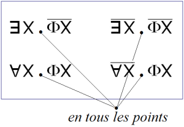
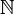
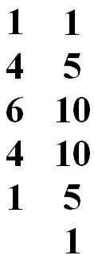
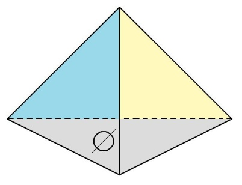
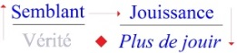

# Leçon 06 | 04 Mai 1972

<!-- source-docx: S19b Le savoir du psychanalyste.docx -->
<!-- seminar: s19b -->
<!-- lesson: 06 -->

<!-- id: s19b-06-0001 -->

C'est un drôle d'emploi du temps, mais enfin pourquoi pas : pen­dant le week-end il m'arrive de vous écrire.

<!-- id: s19b-06-0002 -->

C'est une façon de parler, j'écris parce que je sais que dans la semaine on se verra.

<!-- id: s19b-06-0003 -->

Enfin le week-end dernier, je vous ai écrit. Naturellement, dans l'intervalle, j'ai eu tout à fait le temps d'oublier cette écriture et je viens de la relire pendant le dîner hâtif que je fais pour être là à l'heure. Je vais commencer par là.

<!-- id: s19b-06-0004 -->

Naturellement c'est un peu difficile, mais peut-être que vous prendrez des notes.

<!-- id: s19b-06-0005 -->

Puis après ça, je dirai les choses que j'ai pensées depuis, en pensant plus réellement à vous.

<!-- id: s19b-06-0006 -->

> J'avais écrit ceci, que bien sûr je ne livrerai jamais à la *poubel­lication,*
>
> je ne vois pas pourquoi j'augmenterai le contenu des bibliothèques :
>
> \...il y a *deux horizons du signifiant*.
>
> Là-dessus écrit, je fais une accolade\...
>
> comme c'est écrit, il faut que vous fassiez attention, je veux dire que vous ne croyiez pas com­prendre
>
> \...alors dans l'accolade :

<!-- id: s19b-06-0007 -->

- il y a *le maternel,* qui est aussi *le matériel,*

<!-- id: s19b-06-0008 -->

- et puis il y a écrit le *mathématique*.

<!-- id: s19b-06-0009 -->

J'y serai forcé, je le sais, mais enfin je ne peux pas me mettre tout de suite à parler, sans ça je ne vous lirai jamais ce que j'ai écrit.

<!-- id: s19b-06-0010 -->

Peut-être que dans la suite, j'aurai à revenir sur cette distinction dont je souligne qu'elle est d'horizon.

<!-- id: s19b-06-0011 -->

Les articuler, je veux dire comme tels\...

<!-- id: s19b-06-0012 -->

> ça c'est une parenthèse, je l'ai pas écrit \...je veux dire les articuler dans chacun de ces deux horizons, c'est donc\...

<!-- id: s19b-06-0013 -->

> ça, je l'ai écrit \...c'est donc procéder selon ces horizons eux-mêmes, puisque la mention de leur « *au-delà* » - au-delà de l'horizon -- ne se soutient que de leur position\...

<!-- id: s19b-06-0014 -->

> quand ça vous ennuiera vous me le direz
>
> et je vous raconterai les choses que j'ai à vous raconter ce soir \...de leur position - écris-je - en *un discours* de fait.

<!-- id: s19b-06-0015 -->

Pour *le discours analytique* ce « *de fait* » m'implique assez dans ses effets pour qu'on le dise être de mon fait, qu'on le désigne par mon nom.

<!-- id: s19b-06-0016 -->

L'*a-mur*\...

<!-- id: s19b-06-0017 -->

ce que j'ai désigné ici pour tel \...le répercute diversement avec les moyens de ce qu'on appelle justement « *le bord* », de ce « *bord-homme* ».

<!-- id: s19b-06-0018 -->

Le « *bord-homme* » ça m'a inspiré - je l'ai écrit ça - : « *brrom 'brrom -ouap - ouap* ».

<!-- id: s19b-06-0019 -->

C'était une trouvaille d'une personne qui dans l'ancien temps m'a donné des enfants.

<!-- id: s19b-06-0020 -->

C'est une indication concernant :

<!-- id: s19b-06-0021 -->

- la voix - *l'(a)-voix* - qui comme chacun sait *aboie*,

<!-- id: s19b-06-0022 -->

- et *l'(a)-regard* aussi, qui n'y «*(a)regarde pas de si près* »,

<!-- id: s19b-06-0023 -->

- et *l'(a)stuce* qui fait l'*a*stuce,

<!-- id: s19b-06-0024 -->

- et puis *l'(a)merde* aussi, qui fait de temps en temps *graffito* d'intentions plutôt injurieuses dans les pages journalistiques, à mon nom.

<!-- id: s19b-06-0025 -->

Bref, c'est *l'(a)vie*, comme dit une personne qui se divertit pour l'instant, c'est gai ! C'est vrai, en somme.

<!-- id: s19b-06-0026 -->

Ces effets n'ont rien à faire avec la dimension qui se mesure de mon fait, c'est à savoir que c'est *d'un discours* qui n'est pas le mien propre que je fais la dimension nécessaire.

<!-- id: s19b-06-0027 -->

C'est du *discours analytique* qui pour n'être pas encore - et pour cause ! - proprement institué, se trouve avoir besoin de quelques frayages à quoi je m'emploie.

<!-- id: s19b-06-0028 -->

Á partir de quoi ? Seulement de ceci en fait que ma position en est déter­minée*.*

<!-- id: s19b-06-0029 -->

Bon. Alors maintenant, parlons de *ce discours* et du fait qu'y est essentielle *la position* comme telle du *signifiant*.

<!-- id: s19b-06-0030 -->

Je voudrais quand même, vu ce public que vous constituez, vous faire une remarque : c'est que cette *position du signifiant* se dessine d'une expé­rience qu'il est à la portée de chacun de vous, de faire, pour vous apercevoir de quoi il s'agit et combien c'est essentiel.

<!-- id: s19b-06-0031 -->

Quand vous connaissez imparfaitement une langue et que vous li­sez un texte, eh bien vous comprenez, vous comprenez toujours. Ça devrait vous mettre un peu en éveil.

<!-- id: s19b-06-0032 -->

Vous comprenez dans le sens où - d'avance - vous savez ce qui s'y dit.

<!-- id: s19b-06-0033 -->

Bien sûr, il en résulte que le texte peut se contredire.

<!-- id: s19b-06-0034 -->

Quand vous lisez par exemple un texte sur *la Théorie des Ensembles*, on vous explique ce qui constitue l'ensemble infini des nombres entiers.

<!-- id: s19b-06-0035 -->

> À la ligne suivante on vous dit quelque chose que vous comprenez, parce que vous continuez de lire :

<!-- id: s19b-06-0036 -->

« *Ne croyez pas que c'est parce que ça continue toujours qu'il est infini* ».

<!-- id: s19b-06-0037 -->

Comme on vient de vous expliquer que c'est pour ça qu'il l'est, vous sursautez.

<!-- id: s19b-06-0038 -->

Mais quand vous y regardez de près, vous trouvez le *terme* qui désigne qu'il s'agit de « *deem* » \[*juger, estimer*\], c'est­-à-dire que ce n'est pas sur ça que vous devez juger, parce qu'ils savent qu'elle ne s'arrête pas cette série des nombres entiers, qu'elle est infinie, c'est pas parce qu'elle est indéfinie.

<!-- id: s19b-06-0039 -->

De sorte que vous vous apercevez que c'est parce que,

<!-- id: s19b-06-0040 -->

- soit vous avez sauté « *deem* »,

<!-- id: s19b-06-0041 -->

- soit vous n'êtes pas assez familier avec l'anglais, que vous avez compris trop vite,

<!-- id: s19b-06-0042 -->

> c'est-à-dire que vous avez sauté cet élément essentiel qui est celui d'un *signifiant* qui rend possible *ce changement de niveau*, grâce auquel vous avez eu un instant le sentiment d'une contradiction.

<!-- id: s19b-06-0043 -->

II ne faut jamais sauter un *signifiant*.

<!-- id: s19b-06-0044 -->

C'est dans la mesure où le *signifiant* ne vous arrête pas que vous comprenez.

<!-- id: s19b-06-0045 -->

Or comprendre, c'est être toujours compris soi-même dans les effets du discours, lequel discours en tant que tel ordon­ne les effets du savoir déjà précipités par le seul formalisme du signifiant.

<!-- id: s19b-06-0046 -->

Ce que la psychanalyse nous apprend, c'est que : tout savoir naïf\...

<!-- id: s19b-06-0047 -->

> ça c'est écrit, et c'est pour ça que *je le lis* \...est associé à un voilement de *la jouissance* qui s'y réalise, et pose la question de ce qui s'y trahit *des limites de la puissance*, c'est-à-dire - quoi ? - du tracé imposé à *la jouissance*.

<!-- id: s19b-06-0048 -->

Dès que nous parlons - c'est un fait ! nous supposons quelque chose à ce qui se parle, ce quelque chose que nous imaginons pré-posé, encore qu'il soit sûr que nous ne le supposions jamais qu'après-coup.

<!-- id: s19b-06-0049 -->

C'est seulement au fait de parler que se rapporte, dans l'état actuel de nos connaissances, que puisse s'apercevoir que *ce qui parle* - quoi que ce soit - *est ce qui jouit de soi comme corps*.

<!-- id: s19b-06-0050 -->

Ce qui jouit d'un corps qu'il vit comme\...

<!-- id: s19b-06-0051 -->

> ce que j'ai déjà énoncé \...du « *tu-able* », c'est-à-dire comme *tutoyable*, d'un corps qu'il *tutoie,* et d'un corps à qui il dit « *tue-toie* » dans la même ligne.

<!-- id: s19b-06-0052 -->

*La psychanalyse*, qu'est-ce ? *C'est le repérage de ce qui se com­prend d'obscurci*, de ce qui s'obscurcit en compréhension, *du fait d'un signifiant qui a marqué un point du corps*.

<!-- id: s19b-06-0053 -->

La psychanalyse, c'est ce qui reproduit\...

<!-- id: s19b-06-0054 -->

> vous allez retrouver les rails ordinaires \...c'est ce qui reproduit une production de la *névrose*.

<!-- id: s19b-06-0055 -->

Là-dessus tout le monde est d'accord.

<!-- id: s19b-06-0056 -->

Il n'y a pas un psychanalyste qui ne s'en soit aperçu.

<!-- id: s19b-06-0057 -->

Cette *névrose* qu'on attribue - non sans raison - à l'action des parents, n'est atteignable que dans toute la mesure où l'action des parents s'*articule* justement\...

<!-- id: s19b-06-0058 -->

> c'est le terme par quoi j'ai commencé la troisième ligne \...de la position du psychanalyste.

<!-- id: s19b-06-0059 -->

C'est dans la mesure où elle converge vers *un signifiant* qui en émerge, que la *névrose* va s'ordonner selon le discours dont les effets ont produit le sujet : tout parent traumatique est en somme dans la même position que le psychanalyste.

<!-- id: s19b-06-0060 -->

La diffé­rence c'est que :

<!-- id: s19b-06-0061 -->

- le psychanalyste, de sa position, reproduit la *névrose*

<!-- id: s19b-06-0062 -->

- et que le pa­rent traumatique, lui, la produit innocemment.

<!-- id: s19b-06-0063 -->

Ce dont il s'agit c'est - ce signifiant - de le *reproduire* à partir de ce qui d'abord a été son *efflorescence*.

<!-- id: s19b-06-0064 -->

Faire un « *modèle* » de la *névrose*, c'est en somme l'opé­ration du *discours analytique*.

<!-- id: s19b-06-0065 -->

Pourquoi ?

<!-- id: s19b-06-0066 -->

Dans la mesure où il y ôte la *« cote »* de *jouissance* !

<!-- id: s19b-06-0067 -->

*La jouissance exige* en effet le privilège : il n'y a pas deux façons d'y faire pour chacun.

<!-- id: s19b-06-0068 -->

*Toute reduplication la tue : elle ne survit qu'à ce que la répé­tition en soit vaine, c'est-à-dire toujours la même.*

<!-- id: s19b-06-0069 -->

C'est l'introduction du « *modèle* » qui, cette répétition vaine, l'achève.

<!-- id: s19b-06-0070 -->

Une répétition achevée la dissout, de ce qu'elle soit une répétition simplifiée.

<!-- id: s19b-06-0071 -->

C'est toujours bien sûr *du signifiant* que je parle quand je parle du « *yadl'Un* ».

<!-- id: s19b-06-0072 -->

Pour étendre *ce « dl'Un »* à la mesure de son empire\...

<!-- id: s19b-06-0073 -->

> puisqu'il *est assurément le signifiant-maître* \...il faut l'approcher là où on l'a laissé à ses talents, pour le mettre lui, au pied du mur.

<!-- id: s19b-06-0074 -->

Voilà ce qui rend utile comme incidence, le point où j'en suis arrivé cette année, n'ayant le choix que de ça « \...*Ou pire* », cette référence mathémati­que, ainsi appelée parce que c'est l'ordre où règne le mathème, c'est-à-dire ce qui produit un *savoir* qui, de n'être que produit, est lié aux normes du *plus-de-jouir*, c'est-à-dire du mesurable.

<!-- id: s19b-06-0075 -->

Un mathème c'est ce qui proprement - et seul - s'enseigne.

<!-- id: s19b-06-0076 -->

Ne s'enseigne que *l'Un*. Encore faut-il savoir de quoi il s'agit.

<!-- id: s19b-06-0077 -->

Et c'est pour ça que cette année, je l'interroge.

<!-- id: s19b-06-0078 -->

Je ne poursuivrai pas plus loin ma lecture, que j'ai lue - je pense - assez lentement - et qui est assez difficile pour que, sur chacun de ses termes que j'ai bien épelés, quelques questions pour vous s'accrochent.

<!-- id: s19b-06-0079 -->

Et c'est pour ça que maintenant, je vais vous parler plus librement.

<!-- id: s19b-06-0080 -->

Il y a quelqu'un, l'autre jour, qui au sortir du dernier truc au Pan­théon\...

<!-- id: s19b-06-0081 -->

> il est peut-être là encore \...est venu m'interpeller sur le sujet de savoir « *si je croyais à la liberté* ».

<!-- id: s19b-06-0082 -->

Je lui ai dit qu'il était drôle, et puis comme je suis toujours assez fatigué, j'ai rompu avec lui, mais ça ne veut pas dire que je ne serai pas prêt, là-dessus, à lui faire personnellement quelques confidences.

<!-- id: s19b-06-0083 -->

Il est un fait que j'en parle rarement.

<!-- id: s19b-06-0084 -->

En sorte que cette question est de son initiative.

<!-- id: s19b-06-0085 -->

Je ne déplorerai pas de savoir pourquoi il me l'a posée.

<!-- id: s19b-06-0086 -->

Ce que je voudrais alors plus librement dire, c'est que faisant allu­sion dans cet écrit à ce en quoi, à ce par quoi je me trouve en position, ce *discours analytique*, de le frayer, c'est bien évidemment en tant que je le considère comme constituant, au moins en puissance, cette sorte de *structure* que je désigne du terme de *discours*, c'est-à-dire ce par quoi, par l'effet pur et simple du langage, *se précipite un lien social*.

<!-- id: s19b-06-0087 -->

On s'est aperçu de ça sans avoir besoin pour autant de la psychanalyse.

<!-- id: s19b-06-0088 -->

C'est même ce qu'on appelle couramment « *idéologie* ».

<!-- id: s19b-06-0089 -->

La façon dont un discours s'ordonne, de façon telle qu'*il précipite un lien social,* Comporte -- inversement - que tout ce qui s'y articule s'ordonne de ses effets.

<!-- id: s19b-06-0090 -->

C'est bien ainsi que j'entends ce que pour vous j'articule du *discours de la psychanalyse* : c'est que s'il n'y avait pas de pratique psychanalytique, rien de ce que je puis en articuler n'aurait d'effets que je puisse attendre.

<!-- id: s19b-06-0091 -->

Je n'ai pas dit « *n'au­rait de sens* ».

<!-- id: s19b-06-0092 -->

*Le propre du sens c'est* d'être toujours confusionnel, c'est-à-dire *de faire le pont,* de croire faire le pont, entre

<!-- id: s19b-06-0093 -->

- *un discours* en tant que s'y précipite un lien social,

<!-- id: s19b-06-0094 -->

- *avec ce qui*, d'un autre ordre, *provient d'un autre discours*.

<!-- id: s19b-06-0095 -->

L'ennuyeux c'est que quand vous procédez, comme je viens de dire dans cet écrit « qu'il est question de procéder », c'est-à-dire de viser d'un discours ce qui y fait fonction de l'*Un*, qu'est-ce que je fais en l'occasion ?

<!-- id: s19b-06-0096 -->

Si vous me per­mettez ce néologisme, *je fais de l'unologie*.

<!-- id: s19b-06-0097 -->

Avec ce que j'articule n'importe qui peut faire *une ontologie*, d'après ce qu'il suppose *au-delà* justement *de ces deux horizons*, que j'ai marqué être définis comme *horizons du signifiant*.

<!-- id: s19b-06-0098 -->

On peut se mettre, dans *le discours universitaire,* à reprendre de ma construction le modèle, en y supposant en un point arbitraire je ne sais quelle essence qui deviendrait, on ne sait d'ailleurs pourquoi, la valeur suprême.

<!-- id: s19b-06-0099 -->

C'est tout particulièrement propice à ce qui s'offre au *discours universitaire,* dans lequel ce dont il s'agit c'est, selon le diagramme que j'en ai dessiné, de mettre S~2~ - où ? - à la place du *semblant*.

<!-- id: s19b-06-0100 -->

{width="1.3756977252843394in" height="0.7653674540682415in"} {width="1.2587718722659667in" height="0.3260400262467192in"}

<!-- id: s19b-06-0101 -->

> *Discours universitaire*

<!-- id: s19b-06-0102 -->

Avant qu'un *signifiant* soit vraiment mis à sa place, c'est-à-dire justement repéré de l'idéologie pour laquelle il est produit, il a toujours des effets de circulation. *La signification précède* dans ses effets *la reconnaissance de sa place*, sa place instituante.

<!-- id: s19b-06-0103 -->

Si *le discours universitaire* se définit de ce que *le savoir* y soit mis en position de *semblant*, c'est ce qui se contrôle, c'est ce qui se confirme de la nature même de l'enseignement où, qu'est-ce que vous voyez ?

<!-- id: s19b-06-0104 -->

C'est une fausse mise en ordre de ce qui a pu « *s'éventailler* », si je puis dire, au cours des siècles, *d'on­tologies diverses*.

<!-- id: s19b-06-0105 -->

Son sommet, *son culmen* c'est ce qui s'appelle glorieusement *L'histoire de la philosophie*, comme si la philosophie n'avait pas\...

<!-- id: s19b-06-0106 -->

> et c'est ample­ment démontré \...son ressort dans les aventures et mésaventures du *discours du Maître*, qu'il faut bien de temps en temps renouveler.

<!-- id: s19b-06-0107 -->

La cause des chatoiements de la philosophie est, comme c'est suffisamment affirmé à partir des points d'où justement est sortie la notion d'idéologie, comme si donc la cause dont il s'agit ne gisait pas ailleurs.

<!-- id: s19b-06-0108 -->

Mais il est difficile que tout procès d'articulation d'un dis­cours, surtout s'il ne s'est pas encore repéré, donne prétexte à un certain nombre de soufflures prématurées de nouveaux « *êtres* ».

<!-- id: s19b-06-0109 -->

Je sais bien que tout ça n'est pas facile et qu'il faut quand même\...

<!-- id: s19b-06-0110 -->

> ce dans la bonne tradition de ce que je fais ici \...que je vous dise des choses plus amusantes.

<!-- id: s19b-06-0111 -->

Alors parlons de « *L'analyste et l'amour* ».

<!-- id: s19b-06-0112 -->

L'*amour* dans l'analyse\...

<!-- id: s19b-06-0113 -->

> et bien entendu c'est du fait de la posi­tion de l'analyste \...*l'amour on en parle*. Toutes proportions gardées, *on n'en parle pas plus qu'ailleurs*, puisqu'après tout *l'amour c'est à ça que ça sert*.

<!-- id: s19b-06-0114 -->

Ce n'est pas ce qu'il y a de plus réjouissant, mais enfin dans le siècle, on en parle beaucoup.

<!-- id: s19b-06-0115 -->

Il est même prodigieux - depuis le temps ! - qu'on continue à en parler, parce qu'enfin depuis le temps, on aurait pu s'apercevoir que ça ne réussit pas mieux pour autant.

<!-- id: s19b-06-0116 -->

Il est donc clair que *c'est en parlant qu'on fait l'amour*.

<!-- id: s19b-06-0117 -->

Alors l'analyste, quel est son rôle là-dedans ?

<!-- id: s19b-06-0118 -->

Est-ce que vraiment une analyse peut faire réussir *un amour* ?

<!-- id: s19b-06-0119 -->

Je dois vous dire, quant à moi\... \[*Rires*\], que je n'en connais pas d'exemple. Et pourtant j'ai essayé ! \[*Rires*\]

<!-- id: s19b-06-0120 -->

C'était pour moi, bien sûr, parce que je ne suis pas complètement né des dernières pluies, une gageure.

<!-- id: s19b-06-0121 -->

J'espère que la personne dont il s'agit n'est pas là, j'en suis quasiment sûr \[*Rires*\] !

<!-- id: s19b-06-0122 -->

J'ai pris quelqu'un, Dieu merci, que je savais d'avan­ce avoir besoin d'une psychanalyse, mais sur la base de cette *demande*\...

<!-- id: s19b-06-0123 -->

> vous vous rendez compte de ce que je peux faire comme saloperies pour vérifier mes affir­mations \...sur la base de ceci : qu'il fallait à tout prix qu'il ait le *conjugo* avec la dame de son cœur.

<!-- id: s19b-06-0124 -->

Naturellement, bien sûr ça a raté - Dieu merci ! - dans les plus brefs délais !

<!-- id: s19b-06-0125 -->

Bon, abrégeons, parce que tout ça ce sont des anecdotes.

<!-- id: s19b-06-0126 -->

C'est une autre histoire, mais comme ça, un jour où je serai en veine et où je me risquerai à faire du La Bruyè­re, je traiterai la question des rapports de l'*amour* avec le *semblant*.

<!-- id: s19b-06-0127 -->

Mais nous ne sommes pas là ce soir pour nous attarder à ces babioles !

<!-- id: s19b-06-0128 -->

Il s'agit de savoir ceci, sur quoi je reviens parce qu'il me semblait avoir frayé la chose, c'est le rapport de tout ça que je suis en train de ré-énoncer, que je vous rappelle d'une brève *touche des vérités d'expérience*, c'est de savoir la fonction dans la psychanalyse, du *sexe*.

<!-- id: s19b-06-0129 -->

Je pense quand même là-dessus avoir frappé les oreilles, même les plus sourdes, par l'énoncé de ceci qui mérite d'être commenté : *qu'il n'y a pas de rapport sexuel*.

<!-- id: s19b-06-0130 -->

Bien sûr cela mérite d'être articulé.

<!-- id: s19b-06-0131 -->

Pourquoi est-ce que le psy­chanalyste s'imagine que ce qui fait le fond de ce à quoi il se réfère, c'est *le sexe* ?

<!-- id: s19b-06-0132 -->

Que le sexe ça soit réel, ceci ne fait pas le moindre doute. Et sa structure même, c'est le duel, le nombre « *deux* ».

<!-- id: s19b-06-0133 -->

Quoi qu'on en pense, il y en a deux : les hommes, les femmes, dit-on, et on s'obstine à y ajouter les auver­gnats ! \[*Rires*\] C'est une erreur ! Au niveau du *réel* il n'y a pas d'auvergnats.

<!-- id: s19b-06-0134 -->

Ce dont il s'a­git quand il s'agit de sexe c'est de *l'autre*, de *l'autre sexe*, même quand on y pré­fère le même.

<!-- id: s19b-06-0135 -->

C'est pas parce que j'ai dit tout à l'heure que pour ce qui est de la réussite d'un amour, l'aide de la psychanalyse est précaire, qu'il faut croire que le psychanalyste s'en foute, si je puis m'exprimer ainsi.

<!-- id: s19b-06-0136 -->

Que le partenaire en question soit *de l'autre sexe* et que ce qui est en jeu ce soit quelque chose qui ait rapport à *sa jouissance*, parle de l'autre, du tiers, à propos duquel il est énoncé ce « *par­lage* » autour de l'amour, le psychanalyste ne saurait y être indifférent, parce que *celui qui n'est pas là, pour lui* \[*pour l'analyste*\] *c'est bien ça le réel*.

<!-- id: s19b-06-0137 -->

> Cette *jouissance-là*, celle qui n'est pas *en analyse*, si vous me permettez de m'exprimer ainsi, *elle fait fonction pour lui de réel*.
>
> Ce qu'il a par contre en analyse - c'est-à-dire le sujet - il le prend pour ce qu'il est, c'est-à-dire pour *effet de discours*.
>
> Je vous prie de remarquer au passage qu'il ne le subjective pas.
>
> Ça ne veut pas dire que tout ça c'est ses petites idées,
>
> mais que comme sujet il est déterminé par un discours dont il provient depuis longtemps, et c'est ça qui est analysable.

<!-- id: s19b-06-0138 -->

L'analyste, je précise, n'est nullement *nominaliste*.

<!-- id: s19b-06-0139 -->

Il ne pense pas aux représentations de son sujet, mais il a à intervenir dans son discours, en lui procurant un supplément de signifiant.

<!-- id: s19b-06-0140 -->

C'est ce qu'on appelle *l'interprétation*.

<!-- id: s19b-06-0141 -->

Pour ce qu'il n'a pas à sa portée, c'est-à-dire ce qui est en question, à savoir *la jouis­sance de celui qui n'est pas là*, en analyse, il la tient pour ce qu'*elle est*, c'est-à­-dire assurément *de l'ordre du réel*, puisqu'il ne peut rien y faire.

<!-- id: s19b-06-0142 -->

Il y a une chose frappante c'est que le sexe comme *réel*\...

<!-- id: s19b-06-0143 -->

> je veux dire *duel*, je veux dire qu'il y en ait *deux* \...jamais personne\...

<!-- id: s19b-06-0144 -->

> même l'évêque Berke­ley \...n'a osé énoncer que c'était une petite idée que chacun avait en tête, que c'était « une représentation ».

<!-- id: s19b-06-0145 -->

Et c'est bien instructif que *dans toute l'histoire de la philosophie, jamais personne* ne se soit avisé d'étendre jusque là *l'idéalisme*.

<!-- id: s19b-06-0146 -->

Ce que je viens de vous définir à ce propos c'est ceci : que surtout depuis quelque temps, le sexe, nous avons vu ce que c'était au microscope\...

<!-- id: s19b-06-0147 -->

> je ne parle pas des organes sexuels, je parle des gamètes \...rendez-vous compte qu'on man­quait de ça jusqu'à Leeuwenhoek et Swammerdam.

<!-- id: s19b-06-0148 -->

Pour ce qui est du sexe, on en était réduit à penser que le sexe c'était partout \[**55'**\] : la *nature*, le νοῦς \[nouss\], tout le bastringue, tout ça c'était le sexe\... et *les vautours femelles faisaient l'amour avec le vent.*[^12]

<!-- id: s19b-06-0149 -->

Le fait que nous sachions d'une façon certaine que le sexe ça se trouve là* *: dans deux petites cellules qui ne se ressemblent pas, de ceci et sous prétexte du *sexe*\...

<!-- id: s19b-06-0150 -->

> bien sûr, depuis bien avant qu'on ait su qu'il y a deux espèces de gamètes \...au nom de ça, le psychanalyste croit qu'il y a *rapport sexuel*.

<!-- id: s19b-06-0151 -->

On a vu des psychanalystes\...

<!-- id: s19b-06-0152 -->

> dans la littérature, dans un domaine dont on ne peut pas dire qu'il soit très filtré \...trouver dans l'intrusion du gamète mâle\...

<!-- id: s19b-06-0153 -->

> du « *spermato* » comme on dit, et « *zoïde* » encore \...dans l'enveloppe de l'ovule, trouver là le modèle de je ne sais quelle effraction redoutable.

<!-- id: s19b-06-0154 -->

Comme s'il y avait le moindre rapport\...

<!-- id: s19b-06-0155 -->

entre cette référence qui n'a pas le moindre rapport, si ce n'est de la plus grossière métaphore, avec ce dont il s'agit dans la copulation \...comme s'il pouvait y avoir là quoi que ce soit qui se réfère avec ce qui entre en jeu dans *les rapports* dits « *de l'amour* », à savoir, comme je l'ai dit et tout d'abord, beaucoup de *paroles*. C'est bien là toute la question.

<!-- id: s19b-06-0156 -->

Et c'est bien là que l'évolution des *formes du discours* est pour vous bien plus indicative dans ce dont il s'agit\...

<!-- id: s19b-06-0157 -->

> c'est d'effets du discours \...bien plus indicative que toute référence à ce qui totalement\...

<!-- id: s19b-06-0158 -->

> même s'il est sûr que les sexes soient deux \...*à ce qui totalement reste en sus­pens, c'est à savoir* *si ce que ce discours est capable d'articuler, comprend oui ou non,* *le rapport sexuel*. C'est ça qui est digne d'être mis en question.

<!-- id: s19b-06-0159 -->

Les *petites choses* que je vous ai déjà *écrites* au tableau, à savoir : 

<!-- id: s19b-06-0160 -->

- l'opposition d'un : et d'un /, d'un « *il existe* » et d'un « *non il existe* » au même niveau,

<!-- id: s19b-06-0161 -->

- celui d'« *il n'est pas vrai que* **Φx** » \[. !\]*\...*

<!-- id: s19b-06-0162 -->

> et d'autre part d'un « *tout x est conforme à la fonction* Φx » \[; !\], \...de « *pas tout* » \[. !\], qui est une formule nouvelle, « *pas tout* » et rien de plus, « *n'est susceptible* », dans la colonne de droite, « *de satisfaire à la fonction dite phallique* ».

<!-- id: s19b-06-0163 -->

C'est cela autour de quoi\...

<!-- id: s19b-06-0164 -->

comme je tâcherai de l'expliquer dans les séminaires qui vont suivre, c'est-à-dire *ailleurs* \...c'est cela\...

<!-- id: s19b-06-0165 -->

c'est-à-dire dans une série de *béances* qui se trouvent *en tous les points,* de présumer qu'en fonction de ces termes - c'est-à-dire *ici, ici, ici, ici* -- des béances diverses, pas toujours les mêmes, \...c'est cela qui mérite d'être pointé pour donner son statut à ce qu'il en est, autour du sujet, du rapport sexuel.

<!-- id: s19b-06-0166 -->

{width="1.3596489501312337in" height="0.9366568241469816in"}

<!-- id: s19b-06-0167 -->

Ceci nous montre assez à quel point le langage trace, dans sa gram­maire même, les *effets* dits *de sujet*, ceci recouvre assez ce qui s'est découvert d'abord de la logique, pour que nous puissions dès maintenant nous attacher comme je le fais depuis quelques-uns de ces appels que je fais, à l'audition d'un signifiant, pour que je puisse tenter d'y donner *sens*, car c'est le seul cas - et pour cause - où ce terme « *sens* » soit justifié, à l'énoncer : « *y a d'l'Un* ».

<!-- id: s19b-06-0168 -->

Parce qu'il y a une chose qui doit quand même vous apparaître, c'est que - s'il n'y a pas de rapport - c'est que des deux chacun reste un.

<!-- id: s19b-06-0169 -->

L'inouï c'est que les psychanalystes, dont à plus ou moins juste titre on dénonce la mytho­logie, il est drôle que justement celle qu'on manque à dénoncer, soit la plus à portée de la main.

<!-- id: s19b-06-0170 -->

Quand les gamètes se conjoignent, ce qui en résulte, c'est pas la fusion des deux.

<!-- id: s19b-06-0171 -->

Avant que ça se réalise il y faut une vache d'évacuation : la *méiose* qu'on appelle ça !

<!-- id: s19b-06-0172 -->

Et ce qui est *Un*, *nouveau*, ça se fait avec ce que nous pouvons appeler assez justement\...

<!-- id: s19b-06-0173 -->

pourquoi pas, je ne veux pas aller trop loin \...je ne dirai pas *des débris de chacun d'eux*, mais enfin un « *chacun d'eux* » qui a lâché un certain nombre *de débris*.

<!-- id: s19b-06-0174 -->

Trouver - et mon Dieu sous la plume de Freud - l'idée que l'*Éros* se *fonde*\...

<!-- id: s19b-06-0175 -->

> au subjonctif \[*donc : fondre*\] : voyez l'équivoque, mais je ne vois pas pourquoi
>
> je ne me servirai pas de la langue française, entre fondation et fusion \...que *l'Éros se fonde* de faire de *l'Un* avec les deux, c'est évidemment une idée étrange, à partir de laquelle, bien sûr, procède cette idée absolument exorbitante qui s'incarne dans la prêcherie à laquelle pourtant le cher Freud répugne de tout son être\...

<!-- id: s19b-06-0176 -->

> il nous la lâche de la façon la plus claire dans « *L'avenir d'une illusion »*,
>
> dans bien d'autres choses encore, dans bien d'autres endroits, dans « *Malaise* *dans la civilisation »* \...sa répugnance à cette idée de « l'amour universel ».

<!-- id: s19b-06-0177 -->

Et pourtant la force fondatrice de la vie, de « *l'instinct de vie* », comme il s'exprime, serait tout entière dans cet *Éros* qui serait principe d'union !

<!-- id: s19b-06-0178 -->

C'est pas seulement pour des raisons didactiques que je vou­drais produire devant vous, sur le sujet de l'*Un,* ce qui peut être dit pour contre­battre cette mythologie grossière, outre qu'elle nous permettra peut-être, non seule­ment d'exorciser l'Éros*\...*

<!-- id: s19b-06-0179 -->

> j'entends l'Éros de doctrine freudienne \...mais la chèreThanatos aussi, avec laquelle on nous emmerde depuis assez longtemps.

<!-- id: s19b-06-0180 -->

Et il n'est pas vain à cet endroit, de nous servir de quelque chose dont ce n'est pas par hasard que c'est venu au jour depuis quelques temps. J'ai dé­jà introduit la dernière fois une considération sur *ce qui se repère comme la théo­rie des ensembles*. Bien sûr, ne vous précipitez pas comme ça !

<!-- id: s19b-06-0181 -->

Pourquoi pas aussi\... parce qu'on peut aussi un peu rigoler : les hommes et les femmes, ils sont « *ensemble »* eux aussi.

<!-- id: s19b-06-0182 -->

Ça ne les empêche pas d'être chacun de son côté.

<!-- id: s19b-06-0183 -->

Il s'agit de savoir si, sur ce « *y a d'l'Un* » dont il est question, nous ne pourrions pas de « *l'ensemble »*\...

<!-- id: s19b-06-0184 -->

> d'un « *ensemble »* bien sûr, qui n'a jamais été fait pour ça \...tirer quelque lumière.

<!-- id: s19b-06-0185 -->

Alors puisqu'ici je fais des *ballons d'essai*, je propose simplement de tâcher de voir avec vous ce qui là-dedans peut servir, je ne dirai pas d'illustration, il s'agit de bien autre chose : il s'agit de ce que le signifiant a à faire avec *l'Un*.

<!-- id: s19b-06-0186 -->

Par­ce que, bien sûr, *l'Un* c'est pas d'hier qu'il est surgi.

<!-- id: s19b-06-0187 -->

Mais il est surgi quand même à propos de deux choses tout à fait différentes :

<!-- id: s19b-06-0188 -->

- à propos d'un certain usage des instruments de mesure,

<!-- id: s19b-06-0189 -->

- et en même temps de quelque chose qui n'avait abso­lument aucun rapport, à savoir de la fonction de *l'individu.*

<!-- id: s19b-06-0190 -->

L'*individu*, c'est Aristote.

<!-- id: s19b-06-0191 -->

Aristote, ces êtres qui se reproduisent, toujours les mêmes, ça le frappait.

<!-- id: s19b-06-0192 -->

Ça en avait frappé déjà un autre, un nommé Platon, dont à la vérité je crois que c'est parce qu'il n'avait rien de mieux à s'of­frir pour nous donner l'idée de *la forme* qu'il en arrivait à énoncer que *la forme* est réelle. Il fallait bien qu'il *illustre* comme il le pouvait, son idée de « *l'Idée* ».

<!-- id: s19b-06-0193 -->

L'autre \[Aristote\] bien sûr, fait remarquer que quand même, « *la forme* » c'est très joli mais que ce en quoi elle se distingue c'est ceci : c'est que c'est simplement elle que nous reconnais­sons dans *« un certain nombre d'individus qui se ressemblent »*.

<!-- id: s19b-06-0194 -->

Nous voilà partis sur *des pentes métaphysiques* diverses. Ceci ne nous intéresse à aucun degré, la façon dont *l'Un* s'illustre :

<!-- id: s19b-06-0195 -->

- que ce soit de l'individu

<!-- id: s19b-06-0196 -->

- ou que ce soit d'un certain usage pratique de la géométrie.

<!-- id: s19b-06-0197 -->

Quels que soient les per­fectionnements que vous puissiez ajouter à la dite *géométrie*\...

<!-- id: s19b-06-0198 -->

> par la considération des proportions, de ce qui se manifeste de différence entre

<!-- id: s19b-06-0199 -->

- la hauteur d'un pieu,

<!-- id: s19b-06-0200 -->

- et celle de *son ombre* \[*sic*\],

<!-- id: s19b-06-0201 -->

\...Il y a beau temps que nous nous sommes aperçus que *l'Un* pose d'autres problèmes, et ceci pour le simple fait que la mathématique a un tant soit peu progressé.

<!-- id: s19b-06-0202 -->

Je ne vais pas revenir sur ce que j'ai énoncé la dernière fois, à savoir sur le calcul différentiel, les séries trigonométriques et, d'une façon géné­rale, la conception du *nombre* comme défini par une séquence.

<!-- id: s19b-06-0203 -->

Ce qui apparaît très clairement, c'est que la question est là posée tout autrement de ce qu'il en est de l'*Un*, parce qu'une séquence ça se caractérise de ceci : que c'est foutu comme la suite des nombres entiers.

<!-- id: s19b-06-0204 -->

Il s'agit de rendre compte de ce que c'est que le nombre entier. \[*cf. Frege qui génère* N à partir du **0** comme **1**\...\]

<!-- id: s19b-06-0205 -->

Je ne vais pas bien sûr vous faire d'énoncé de la *théorie des ensem­bles*.

<!-- id: s19b-06-0206 -->

Je veux simplement pointer ceci :

<!-- id: s19b-06-0207 -->

- que premièrement il a fallu attendre assez tard, la fin du dernier siècle, \[*Frege :* 1845- 1925 *, Cantor :* 1845-1918\] ça n'est pas depuis plus de cent ans qu'il a été tenté de rendre compte de la fonction de *l'Un*,

<!-- id: s19b-06-0208 -->

- qu'il est remarquable que « *l'ensemble* » se définisse d'une façon telle que le premier aspect sous lequel il apparaisse soit celui de « *l'ensemble vide* », et que d'autre part ceci constitue un « *ensemble* », à savoir celui dont le dit « *ensemble vide* » \[Ø\] est le seul élément : ça fait un « *ensemble à <u>un</u> élément* ».

<!-- id: s19b-06-0209 -->

C'est de là que nous partons\...

<!-- id: s19b-06-0210 -->

> et la dernière fois, je le dis pour ceux qui n'y étaient pas au Panthéon,
>
> là où j'ai commencé d'aborder ce sujet glissant \...*que le fondement de l'Un,* de ce fait-là, *s'avère* être proprement *consti­tué de la place d'un manque*.

<!-- id: s19b-06-0211 -->

Je l'ai illustré grossièrement de l'usage pédagogique dans ce dont il s'agit de faire entendre de la dite *théorie des ensembles*, pour faire sentir que la dite *théorie* n'a d'autre objet direct que de faire apparaître comment peut s'engendrer la notion propre de *nombre cardinal* par la correspondance bi­univoque.

<!-- id: s19b-06-0212 -->

Je l'ai illustré la dernière fois : *c'est au moment où manque*\...

<!-- id: s19b-06-0213 -->

> dans les deux séries comparées \...*un partenaire, que la notion de l'Un surgit : il y en a un qui manque*.

<!-- id: s19b-06-0214 -->

Tout ce qui s'est dit du *nombre cardinal* ressortit de ceci : c'est que si *la suite des nombres comporte toujours nécessairement un, et un seul, successeur*, si pour autant que ce que, dans *le cardinal* se réalise - de l'ordre du nombre - ce dont il s'agit : c'est proprement *la suite cardinale* en tant que *commençant à* *zéro*, *elle va jusqu'au nombre qui précède* *immédiatement le successeur.*

<!-- id: s19b-06-0215 -->

En vous énonçant ainsi - d'une façon improvisée - j'ai fait dans mon énoncé une petite faute : celle par exemple de parler d'une suite comme si elle était d'ores et déjà ordonnée, retirez ceci que je n'ai point affirmé : c'est simplement *que cha­que nombre - cardinalement - correspond au cardinal qui le précède en y ajoutant l'ensemble vide*.

<!-- id: s19b-06-0216 -->

L'important de ce que je voudrais ce soir vous faire sentir, c'est que si *l'Un surgit comme de l'effet du manque*, *la considération des ensembles prête à quelque chose*, qui je crois est digne d'être mentionné et que je voudrais mettre en valeur, de la référence à ceci, que la *théorie des ensembles* *a permis de distinguer* dans l'ordre de ce qu'il en est de l'ensemble, *deux types* :

<!-- id: s19b-06-0217 -->

- *l'ensemble fini,*

<!-- id: s19b-06-0218 -->

- et d'admettre *l'ensemble infini*.

<!-- id: s19b-06-0219 -->

Dans cet énoncé ce qui caractérise *l'ensemble infini* est proprement de pouvoir être posé comme *équivalent à l'un quelconque de ses sous-ensembles*.

<!-- id: s19b-06-0220 -->

Comme l'avait déjà remarqué Galilée\...

<!-- id: s19b-06-0221 -->

> qui n'avait pas pour cela attendu Cantor \...la suite de tous les carrés est en correspondance biunivoque avec chacun des nombres entiers.

<!-- id: s19b-06-0222 -->

Il n'y a en effet aucune raison jamais de considérer qu'un de ces carrés serait trop grand pour être dans *la suite des entiers*.

<!-- id: s19b-06-0223 -->

C'est ceci qui constitue *l'ensemble infini,* au moyen de quoi on dit qu'il peut être *réflexif*.

<!-- id: s19b-06-0224 -->

*Par contre*, dans ce qu'il en est de *l'ensemble fini* il est dit, comme étant sa propriété majeure, qu'il *est propice* à ce qui s'exerce dans le raisonnement proprement mathématique\...

<!-- id: s19b-06-0225 -->

> c'est-à-dire dans le raisonnement qui s'en sert \...*à ce qu'on appelle « l'induction » *:  « *l'induction* » est recevable quand un ensemble est fini.

<!-- id: s19b-06-0226 -->

Ce que je voudrais vous faire remarquer, c'est que dans la *théorie des ensembles*, il est un point que quant à moi je considère comme problématique.

<!-- id: s19b-06-0227 -->

C'est celui qui relève de ce qu'on appelle « *la non-dénombrabilité des parties* »\...

<!-- id: s19b-06-0228 -->

> entendez par là *sous-ensembles,* \...telles qu'elles peuvent se définir à partir d'un ensemble.

<!-- id: s19b-06-0229 -->

Il est très facile, si vous partez de ceci pour prendre le nombre cardinal* *: vous avez un ensemble composé par exemple de cinq éléments.

<!-- id: s19b-06-0230 -->

- Si vous appelez « *sous-ensemble* » la saisie en 1 ensemble de chacun de ces cinq *éléments*,

<!-- id: s19b-06-0231 -->

- puis *des groupes* que forment 2 de ces *éléments* sur cinq, il vous est facile de calculer combien ceci fera de *sous-ensemble * : il y a en a très exactement dix.

<!-- id: s19b-06-0232 -->

- Puis vous les prenez par 3 : *il y en aura encore dix*.

<!-- id: s19b-06-0233 -->

- Puis vous les prenez par 4. Il y en aura cinq.

<!-- id: s19b-06-0234 -->

- Et vous arriverez à la fin à l'ensemble en tant qu'il n'y en a qu'un, là présent, à comprendre 5 éléments. Ce à quoi il convient d'ajouter *l'ensemble vide* qui, en tout cas, *sans être élément de l'ensemble*,

<!-- id: s19b-06-0235 -->

> est manifestable comme une de ses parties. Car les parties, ça n'est pas l'élément.

<!-- id: s19b-06-0236 -->

Ce qui s'en ordonne\...

<!-- id: s19b-06-0237 -->

> si quelqu'un voulait écrire à ma place au tableau ça me reposerait \...ceci s'écrit comme ça : 1, 5, 10, 10, 5, 1.

<!-- id: s19b-06-0238 -->

Qu'est-ce qu'il se trouve que nous avons défini comme partie de l'ensemble ?

<!-- id: s19b-06-0239 -->

- L'ensemble vide est là.

<!-- id: s19b-06-0240 -->

- Les 5 éléments α, β, γ, δ, ε, par exemple sont là.

<!-- id: s19b-06-0241 -->

- Ce qui est ensuite, c'est αβ, αγ, αδ , αε. Vous pouvez en faire autant à partir de β,

<!-- id: s19b-06-0242 -->

> vous pouvez le faire à partir de γ, etc. Vous verrez qu'il y en a 10.

<!-- id: s19b-06-0243 -->

- Et ensuite ici vous avez (αβγδ) avec *le manque* d'ε. Et vous pouvez, en faisant manquer chacune de ces lettres, obtenir le nombre nécessaire de 5 pour le regroupement comme *parties* des éléments.

<!-- id: s19b-06-0244 -->

Moyennant quoi vous trouvez, ce qui est certain... il suffirait que je complète cet énoncé d'un ensemble à cardinal 5 par la suite, qu'on va mettre à côté, qui est celle qui se réfère à un ensemble à 4 éléments.

<!-- id: s19b-06-0245 -->

Autrement dit, imagez-le d'un tétraèdre.

<!-- id: s19b-06-0246 -->

Vous verrez que vous avez une tétrade : que vous avez 6 *arêtes*, que vous avez 4 *sommets*, que vous avez 4 *faces*, et que vous avez aussi *l'ensemble vide*.

<!-- id: s19b-06-0247 -->

La remarque que je fais, a ceci qui en résulte : je n'ai fait allusion à l'autre cas que pour montrer que dans les deux cas « *la somme des parties* » est égale à 2^N^, N étant précisément « *le nombre cardinal des éléments de l'ensemble* ».

<!-- id: s19b-06-0248 -->

Il ne s'agit pas ici, en quoi que ce soit, de quelque chose qui ébranle *la théorie des ensembles*.

<!-- id: s19b-06-0249 -->

Ce qui est énoncé à ce propos de la dénombrabilité, a toutes ses applications, par exemple dans la remarque que rien ne change à « *la catégorie d'in­fini d'un ensemble* » si en est retirée une « *suite quelconque dénombrable* ».

<!-- id: s19b-06-0250 -->

Néanmoins l'apport qui est fait de la *non-dénombrabilité*, en ceci qu'assurément et en tout cas, on ne saurait appliquer sur un ensemble, un ensemble fini, la somme de ses parties définie telle qu'elle vient de l'être, est-ce - j'interroge - la meilleure façon d'introduire « *la non-dénombrabilité d'un ensemble infini* » ?

<!-- id: s19b-06-0251 -->

Il s'agit d'une introduction didactique.

<!-- id: s19b-06-0252 -->

Je le conteste à partir du mo­ment où *la propriété de réflexivité* telle qu'elle est affectée à *l'ensemble* *infini* et qui comporte que lui manque l'inductivité caractéristique des *ensembles finis*, laisse écrire pourtant, comme j'ai pu le voir en certains lieux, que « la non-dénom­brabilité des parties de l'ensemble fini » ressortirait - je le souligne - par induction, de ceci que ces parties s'écriraient comme s'écrit *l'ensemble infini des nombres entiers* : 2^[א]{dir="rtl"}0^. [^13] \[*soit* 2 *puissance cardinal de* {width="7.916666666666666e-2in" height="7.916666666666666e-2in"}\]

<!-- id: s19b-06-0253 -->

Je le conteste ! Et comment fais-je pour le contester ?

<!-- id: s19b-06-0254 -->

Je le conteste* * à partir de ceci, c'est qu'il y a quelque artifice, quand il s'agit des parties de l'ensemble, à les prendre dans leur échelle dont l'addition donne en effet le 2 puissance N.

<!-- id: s19b-06-0255 -->

Mais il est clair que si vous avez d'un côté : *a, b, c, d, e* - pour fran­ciser les lettres grecques que j'ai écrites au tableau, j'avais une raison pour ça, et si vous y apportez ce qui leur répond :

<!-- id: s19b-06-0256 -->

- *a, b, c, d*, correspondent à *e*,

<!-- id: s19b-06-0257 -->

- *a, b, d, e*, correspondent à *c*.

<!-- id: s19b-06-0258 -->

Vous voyez que le nombre des parties, si vous y substituez une partition, aboutit à une formule qui est très différente, mais dont vous verrez pourquoi elle m'intéresse : c'est que le nombre, c'est 2^N-1^.

<!-- id: s19b-06-0259 -->

Je ne puis ici, vu l'heure et puis le fait qu'après tout ceci n'intéresse pas ici absolument tout le monde, mais j'aimerais là-dessus, je sollicite\...

<!-- id: s19b-06-0260 -->

> je sollicite je dois dire comme je le fais d'habitude, d'une façon désespérée \...je sollicite des grammairiens de temps en temps de me donner un petit tuyau\...

<!-- id: s19b-06-0261 -->

> ils m'en envoient : c'est toujours les mauvais \...j'ai sollicité des mathématiciens - très nombreux déjà - de me répondre là-dessus, et à la vérité ils font la sourde oreille.

<!-- id: s19b-06-0262 -->

Il faut vous dire que cette « *dénombrabilité des parties de l'ensemble* », ils y tiennent comme la tique à la peau du chien.

<!-- id: s19b-06-0263 -->

Néanmoins, je propose ceci qui a son petit intérêt, je vais droit là à un but qui va laisser de côté un point sur lequel j'aimerais finir après, mais je vais droit à un but qui a son intérêt.

<!-- id: s19b-06-0264 -->

Son intérêt est ceci : c'est que, à substituer à la notion des « *parties* », celle de la « *partition* », il est nécessaire\...

<!-- id: s19b-06-0265 -->

> de la même façon que nous avons admis que *les parties de l'ensemble infini*, *ce serait* 2^[א]{dir="rtl"}0^ c'est-à-dire
>
> le plus petit des *transfinis*, celui constitué par l'ensemble, le cardinal de l'ensemble des entiers\[{width="7.5e-2in" height="7.5e-2in"}\] \...au lieu d'avoir 2^[א]{dir="rtl"}0^, nous avons : 2^[א]{dir="rtl"}0-1^.

<!-- id: s19b-06-0266 -->

Je soupçonne que ceci - à quiconque \[*sic*\] - peut faire sentir ce qu'il y a d'abusif à supposer *la bipartition d'un ensemble infini*.

<!-- id: s19b-06-0267 -->

Si, comme la formule en por­te elle-même la trace, ce qu'on appelle « *ensemble des parties* » aboutit à une formule qui contient *le nombre* 2 *porté à la puissance* \[du cardinal\] *des éléments de l'ensemble*, est-ce qu'il est tout à fait recevable\...

<!-- id: s19b-06-0268 -->

> et surtout à partir du moment où nous mettons en question *l'induction* quand il s'agit de *l'ensemble infini* \...comment est-il rece­vable que nous acceptions *une formule* qui manifeste aussi clairement qu'il s'agit, non pas de *parties de l'ensemble*, mais de *sa partition*.

<!-- id: s19b-06-0269 -->

J'y ajouterai quelque chose qui a bien son intérêt : c'est que [א]{dir="rtl"}~0~, bien sûr n'est qu'un *index*\...

<!-- id: s19b-06-0270 -->

> *index* qui n'est pas pris au hasard, et *index* forgé pour désigner\...
>
> car il y en a toute la série des autres en principe admis, toute la série des nombres entiers peuvent servir d'*index* à ce qu'il en est de l'en­semble en tant qu'il fonde *le* *transfini* \...néanmoins, à partir du moment où ce dont il s'agit c'est *la fonction de la puissance*, et qu'il semble que nous ayons abusé de *l'induction* en nous permettant d'y trouver test de *la non-dénombrabilité des parties de l'ensemble infini*, est-ce que, à y regarder de près, nous ne trouverions pas ici, à ce *zéro*, une autre fonction, celui qu'il a dans *la puissance exponentielle*, c'est à savoir : que quelque *nombre* que ce soit, l'exposant *zéro* quant à ce qui est de la puissance, l'égale à 1, quel que soit ce *nombre*.

<!-- id: s19b-06-0271 -->

Je souligne : un nombre quelconque *puissance* 1, c'est lui-même \[n^1^= n\], mais un nombre *puissance zéro* c'est toujours 1, pour la raison très simple, c'est qu'un nombre *puissance* -1, *c'est son inverse*. \[**1/n = n^-1^, n^1^. n^-1^ = n^0^ = 1**\]

<!-- id: s19b-06-0272 -->

C'est donc 1 qui sert ici d'élément pivot.

<!-- id: s19b-06-0273 -->

> À partir de ce moment *la partition de l'ensemble transfini* aboutit à ceci,
>
> à savoir que si nous égalons *l'aleph zéro* dans cette occasion à **1**,
>
> nous avons pour ce qu'il en est de la partition de l'ensemble, ce qui paraît en effet bien rece­vable,
>
> à savoir que *la suite des nombres entiers* n'est supportée par rien d'autre que par la réitération de l'**1**, *le* **1** *sorti de l'ensemble vide*.
>
> C'est de se reproduire qu'il constitue ce que j'ai donné la dernière fois comme étant au principe manifes­té dans
>
> « *le triangle de Pascal* », de ce qu'il en est au niveau du *cardinal des monades*, et que derrière les appuis, ce que j'ai appelé\...
>
> je le dis pour les sourds qui se sont interrogés sur ce que j'avais dit
>
> \...la « *nade* », c'est-à-dire le 1

<!-- id: s19b-06-0274 -->

- *en tant qu'il sort de l'ensemble vide*,

<!-- id: s19b-06-0275 -->

- \[*en tant*\] qu'il est la *réitération du manque*.

<!-- id: s19b-06-0276 -->

Je souligne très précisément ceci que l'**1** dont il s'agit, c'est très proprement ce à quoi *la théorie des ensembles* ne substitue comme *réitération*, que *l'ensemble vide*, ce en quoi elle manifeste - *elle, la théorie des ensembles -* la vraie nature de la « *nade* ».

<!-- id: s19b-06-0277 -->

Ce qui est en effet affirmé *au principe de l'ensemble*, ceci sous *la plume* de Cantor\...

<!-- id: s19b-06-0278 -->

> certes comme on le dit : « *naïve* » au moment où elle a frayé cette voie vraiment sensationnelle \...ce que *la plume* de Cantor affirme, c'est que pour ce qui est des *éléments de l'ensemble*\...

<!-- id: s19b-06-0279 -->

> ceci veut dire qu'il s'agit de quelque chose d'aussi divers qu'on le voudra, à cette seule condition
>
> que nous posions chacune de ces choses, qu'il va jusqu'à dire *objets de l'intuition* ou *de la pensée*,
>
> c'est ainsi qu'il s'exprime, et en effet pourquoi le lui refuser,
>
> ça ne veut rien dire d'autre que *quelque chose d'aussi éternel qu'on voudra* \...il est tout à fait clair qu'à partir du moment où on mêle *l'intuition avec la pensée*, ce dont il s'agit c'est *de signi­fiants*, ce qui est bien entendu manifesté par le fait que ça *s'écrit* *a, b, c, d*.

<!-- id: s19b-06-0280 -->

Mais ce qui est dit, c'est très sûrement proprement ceci : que ce qui est exclu\...

<!-- id: s19b-06-0281 -->

> donc dans l'appartenance à un *ensemble* comme *élément* \...c'est qu'un élément quelconque soit *répété* comme tel.

<!-- id: s19b-06-0282 -->

*C'est donc en tant que distinct que subsiste quelque élément que ce soit d'un ensemble.*

<!-- id: s19b-06-0283 -->

Et pour ce qu'il en est de *l'ensemble vide,* il est affirmé au principe de *la Théorie des Ensembles,* qu'il ne saurait être qu'**1**.

<!-- id: s19b-06-0284 -->

Cet **1**, « *la nade* », en tant qu'elle est au principe du surgissement

<!-- id: s19b-06-0285 -->

- de l'*Un numérique*,

<!-- id: s19b-06-0286 -->

- de l'*Un* dont est fait *le nombre entier,* est donc quelque chose qui se pose comme étant d'origine *l'ensemble vide* lui-même.

<!-- id: s19b-06-0287 -->

Cette notion est importante parce que si nous interrogeons cette structure, c'est dans la mesure où pour nous dans *le discours analytique*, l'**1** se suggère comme étant au principe de *la répé­tition,* et que donc, ici il s'agit justement de l'espèce d'**1** qui se trouve marqué de n'être jamais, dans ce qu'il en est de la théorie des nombres,

<!-- id: s19b-06-0288 -->

- que d'un *manque*,

<!-- id: s19b-06-0289 -->

- que d'un *ensemble vide*.

<!-- id: s19b-06-0290 -->

Mais il y a, à partir du moment où j'ai introduit cette fonction de la partition, un point du « *triangle de Pascal* » que vous me permettrez d'interroger.

<!-- id: s19b-06-0291 -->

Avec les deux colonnes que je viens de faire, j'en ai assez pour vous montrer où porte mon point d'interrogation.

<!-- id: s19b-06-0292 -->

Voici ce que j'énonce.

<!-- id: s19b-06-0293 -->

{width="0.2757228783902012in" height="0.7668536745406824in"} {width="1.0097965879265092in" height="0.799057305336833in"}

<!-- id: s19b-06-0294 -->

S'il est vrai que nous n'avons comme *nombre de partitions* que le nombre qui précédemment était affecté à l'ensemble (n-1), à l'ensemble dont le nombre cardinal est inférieur d'une unité au cardinal d'un ensemble, regardez comment, à engendrer à partir de ce nombre qui correspond aux « *présumées* » *parties de l'ensemble* que nous appellerons plus brièvement « *inférieur*, » inférieur d'1, comme *élément*, pour trouver, comme *le triangle de Pascal* nous l'a déjà appris, les parties qui vont composer\...

<!-- id: s19b-06-0295 -->

> elles se trouve­ront dans une bipartition \...qui vont composer comme partie, selon le premier énoncé, l'ensemble supérieur, nous avons à chaque fois à faire *l'addition* de ce qui correspond dans la colonne de gauche aux 2 nombres qui sont situés :

<!-- id: s19b-06-0296 -->

- \[1)\] *immédia­tement à gauche*,

<!-- id: s19b-06-0297 -->

- et \[2)\] *au-dessus du premier,* pour obtenir dans l'occasion : ici le chiffre 10, ici le chif­fre 4.

<!-- id: s19b-06-0298 -->

{width="0.2544717847769029in" height="0.6989490376202975in"} {width="0.8166666666666667in" height="0.6962817147856518in"}

<!-- id: s19b-06-0299 -->

Qu'est-ce à dire, si ce n'est que pour obtenir le premier chiffre, celui des *monades,* de l'ensemble des éléments, du *nombre cardinal de l'ensemble*, c'est uniquement du fait d'avoir\...

<!-- id: s19b-06-0300 -->

> je dirai : par un abus d'office, \...mis *l'ensemble vide* au rang des éléments monadiques.

<!-- id: s19b-06-0301 -->

C'est-à-dire que c'est en additionnant *l'ensemble vide* avec chacune des quatre monades de la colonne précédente que nous obtenons le *nombre cardinal des* *monades*, des éléments, de l'ensemble supérieur.

<!-- id: s19b-06-0302 -->

Essayons maintenant simplement, pour vous rendre la chose figura­ble, de voir ce que ceci donne sur un schéma.

<!-- id: s19b-06-0303 -->

Et prenons pour être plus simple la co­lonne encore d'avant, prenons ici 3 monades et non plus 4.

<!-- id: s19b-06-0304 -->

L'ensemble, nous le figurons de ce cercle.

<!-- id: s19b-06-0305 -->

Mais *l'ensemble vide*, je ne tiens pas à ce qu'il soit du tout forcément au centre, mais à seulement le *figurer* nous l'avons là :

<!-- id: s19b-06-0306 -->

{width="1.4624989063867018in" height="1.121917104111986in"}

<!-- id: s19b-06-0307 -->

Nous avons dit que cet *ensemble vide*, quand il s'agira de faire l'ensemble tétradique, *cet ensemble vide viendra au rang des monades du précédent*, c'est-à-dire que pour le représenter comme ceci, par un tétraèdre\...

<!-- id: s19b-06-0308 -->

> bien entendu, il ne s'agit pas de tétraèdre, il s'agit de nombres \...si c'est désigné par les lettres grec­ques α, β, γ, nous aurons ici\...

<!-- id: s19b-06-0309 -->

> comme 4^ème^ élément à « *un élément* » dans l'ordre de ces *sous-ensembles* \...nous aurons *l'ensemble vide*.

<!-- id: s19b-06-0310 -->

Mais il n'en reste pas moins que *l'ensemble vide*, au niveau de ce nouvel ensemble, il existe toujours, et que c'est au niveau de ce nouvel ensemble que ce qui vient d'être extrait de *l'ensemble vide*, nous l'appellerons autrement, et puisque nous avons déjà α, β, γ, nous l'appellerons δ.

<!-- id: s19b-06-0311 -->

Qu'est-ce que ceci nous conduit à voir ?

<!-- id: s19b-06-0312 -->

C'est qu'au niveau de l'é­lément des *sous-ensembles* antépénultième \[n-1\] c'est-à-dire pour désigner celui-ci, à savoir celui\...

<!-- id: s19b-06-0313 -->

> disons, pour rester dans l'intuition des *cinq quadrangles* \...qu'on peut mettre en évidence dans, disons aussi, un polyèdre à 5 sommets.

<!-- id: s19b-06-0314 -->

Là aussi nous avons à prendre - quoi ? - les 4 *triangles* de la tétrade.

<!-- id: s19b-06-0315 -->

En tant que quoi ? En tant que dans ces 4 *triangles*, nous allons pouvoir faire 3 *soustractions* diffé­rentes, ceci y étant additionné, ce qui le constitue comme ensemble, ou plus exac­tement comme sous-ensemble.

<!-- id: s19b-06-0316 -->

Comment pouvons nous avoir notre compte\...

<!-- id: s19b-06-0317 -->

> sauf à ce même niveau, où nous aurions trois *sous-ensemble* \...d'y ajouter les éléments seuls de l'en­semble, c'est-à-dire α, β, γ, δ, comme non pris en un *ensemble*, c'est-à-dire en tant que définis comme *éléments* ils ne sont pas des *ensembles*, mais qu'isolés de ce qui les inclut dans l'*ensemble* ils doivent être comptés, pour que nous ayons notre compte de quatre, à fournir la partie du *chiffre* 5 au niveau de *l'ensemble à* 5 *éléments*, il nous faut faire intervenir les éléments au nombre de 4 comme simplement *juxtaposés*, mais non pas pris en un ensemble, « *sous-ensemble* » à l'occa­sion, c'est-à-dire quoi ?

<!-- id: s19b-06-0318 -->

Nous apercevoir de ceci, que *dans la théorie des ensembles tout élément se vaut*.

<!-- id: s19b-06-0319 -->

Et c'est bien ainsi que peut en être engendrée « *l'unité »*.

<!-- id: s19b-06-0320 -->

C'est justement en ce qu'il est dit que le concept de « *distinct* » et de « *défini* », en l'occasion représente ceci, c'est que « *distinct* » ne veut dire que « *différence radicale* » puisque *rien ne peut se ressembler,* il n'y a pas *d'espèces*.

<!-- id: s19b-06-0321 -->

*Tout ce qui se distingue de la même façon est le même élément*. C'est ceci que ça veut dire.

<!-- id: s19b-06-0322 -->

Mais qu'est-ce que nous voyons ? Nous voyons ceci : qu'à ne prendre l'élément que de *pure différence*, nous pouvons le voir aussi comme *mêmeté* de cette *différence*, je veux dire pour l'illustrer, qu'un *élément* dans la *théorie des ensembles*\...

<!-- id: s19b-06-0323 -->

> comme c'était déjà démontré à la deuxième ligne \...est tout à fait équi­valent à un *ensemble vide*, puisque *l'ensemble vide* peut aussi jouer comme *élément*.

<!-- id: s19b-06-0324 -->

Tout ce qui se définit comme *élément* est équivalent de *l'ensemble vide*.

<!-- id: s19b-06-0325 -->

Mais à prendre cette équivalence, cette « *mêmeté de la différence absolue* », à la prendre comme isolable\...

<!-- id: s19b-06-0326 -->

> et ceci non prise dans cette *inclusion ensembliste,* si je puis dire, qui la ferait *sous-ensemble* \...ça veut dire que la *mêmeté* comme telle est, en un point, comptée !

<!-- id: s19b-06-0327 -->

Ceci me paraît d'une extrême importance, et très précisément par exemple, au niveau du jeu platonicien qui fait de *la similitude* une idée de *sub­stance*\...

<!-- id: s19b-06-0328 -->

> dans la perspective réaliste \...un *universel* en tant que cet *universel* est *la réalité*.

<!-- id: s19b-06-0329 -->

Ce que nous voyons, c'est qu'il n'est pas du même niveau\...

<!-- id: s19b-06-0330 -->

> et c'est à ça que j'ai fait allusion dans mon dernier discours du Panthéon \...ce n'est pas au même niveau que l'idée de *semblable* s'introduit.

<!-- id: s19b-06-0331 -->

*La mêmeté des éléments de l'en­semble* est comme telle comptée comme jouant son rôle dans *les parties de l'en­semble*.

<!-- id: s19b-06-0332 -->

La chose a certainement pour nous son importance, puisque de quoi s'agit-il au niveau de *la théorie analytique* ?

<!-- id: s19b-06-0333 -->

La *théorie analytique* voit pointer l'*Un* à deux de ses *niveaux.*

<!-- id: s19b-06-0334 -->

L'*Un* est l'*Un* qui se répète.

<!-- id: s19b-06-0335 -->

Il est au fondement de cette incidence majeure dans *le parler* de l'analysant, qu'il dénonce d'une certaine répétition, eu égard - à quoi ? - à une structure signifiante.

<!-- id: s19b-06-0336 -->

Quel est d'autre part\...

<!-- id: s19b-06-0337 -->

> à considérer *le schéma* que j'ai donné *du discours analytique* \...ce qui se produit de la mise en place du *sujet* au niveau de « *la jouissance de parler* » ?

<!-- id: s19b-06-0338 -->

{width="1.1455643044619424in" height="0.7341590113735783in"} {width="1.179825021872266in" height="0.2664851268591426in"}

<!-- id: s19b-06-0339 -->

Ce qui se produit et ce que je désigne à l'étage dit du *plus-de­-jouir*, c'est **S~1~**, c'est-à-dire une production signifiante que je propose\...

<!-- id: s19b-06-0340 -->

> quitte à me donner le devoir de vous en faire sentir l'incidence \...que je propose de reconnaî­tre dans ce qu'il en est, de quoi ?

<!-- id: s19b-06-0341 -->

- Qu'est-ce que « *la mêmeté de la différence* » ?

<!-- id: s19b-06-0342 -->

- Qu'est-­ce que veut dire que *quelque chose que nous désignons dans le signifiant par des lettres diverses*, c'est *les-mêmes* ?

<!-- id: s19b-06-0343 -->

- Que peut vouloir dire « *les-mêmes* » , si ce n'est *justement* que c'est unique, à partir même de l'hypothèse dont part, dans la *théorie des ensembles*, la fonction de l'*élément *?

<!-- id: s19b-06-0344 -->

L'*Un* dont il s'agit\...

<!-- id: s19b-06-0345 -->

> celui que produit le sujet, disons « *point idéal* » dans l'analyse \...c'est très précisément, au contraire de ce dont il s'agit dans la répétition,

<!-- id: s19b-06-0346 -->

- *l'Un comme un seul*,

<!-- id: s19b-06-0347 -->

- l'*Un* en tant que - quelle que soit quelque différence qui existe - toutes les différences se valent : il n'y en a qu'une, *c'est la différence*.

<!-- id: s19b-06-0348 -->

C'est ceci sur lequel je voulais ce soir achever ce discours, outre que l'heure et ma fatigue m'en pressent incidemment.

<!-- id: s19b-06-0349 -->

L'illustration de cette fonc­tion du **S~1~** telle que je l'ai mise dans la formule statuante du *discours analytique*, je la donnerai dans les séances qui viendront.

## Notes

[^12]: Cf. « *Dictionnaire de la fable ou mythologie grecque, latine, égyptienne* » par François-Joseph-Michel Noël (1803) :

    « Le vautour est employé pour désigner la mère, parce que selon les Égyptiens, il n'y a que des vautours femelles. Voici, disent-ils, de quelle

    manière cet oiseau est engendré : lorsqu'il est en amour, il ouvre au vent du nord les parties génitales et en est comme fécondé pendant cinq

    jours, durant lesquels il ne mange ni ne boit, tout occupé du soin de se reproduire. »

[^13]: *Une classe des ensembles infinis est la classe des ensembles infinis dits dénombrables (équipotents à* {width="6.25e-2in" height="6.25e-2in"}*). Une autre classe d'ensembles infinis est la classe des ensembles*

    *équipotents à* {width="7.9167760279965e-2in" height="7.9167760279965e-2in"} *qui sont appelés ensembles continus. Se pose alors le problème de l'hypothèse du continu : existe-t-il un ensemble dont le cardinal est strictement compris*

    *entre* [א]{dir="rtl"}~0~*, qui est le cardinal de* {width="6.25e-2in" height="6.25e-2in"}*, et* 2^[א]{dir="rtl"}0^ *qui est le cardinal de* {width="8.333333333333333e-2in" height="8.333333333333333e-2in"}* ?*
