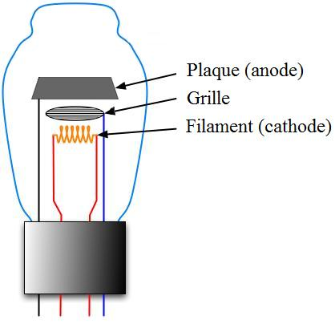

# Leçon 11 | 16 Février 1955

<!-- source-url: http://staferla.free.fr/S2/S2 LE MOI.docx -->
<!-- seminar: s2 -->
<!-- lesson: 11 -->

<!-- id: s2-11-0001 -->

[VALABREGA](#VALABREGA16_02)

<!-- id: s2-11-0002 -->

LACAN

<!-- id: s2-11-0003 -->

Il s’agit dans la *Traumdeutung,* non pas simplement prise en tant que théo­rie particulière du rêve, mais œuvre de travail, ou preuve dans une seconde éla­boration du schéma de l’appareil psychique, le premier correspondant, si vous voulez, à un point de conclusion de ses travaux de neurologue, pour autant qu’il commence d’entrer de façon de plus en plus proche, dans ce champ particulier des névroses.

<!-- id: s2-11-0004 -->

Cette 2nde étape correspond à quelque chose où il entre plus intimement dans ce qui va être le champ propre de l’analyse. C’est *le rêve* - et vous le savez - en arrière-plan c’est aussi *le symptôme névrotique* en tant que tel, en tant qu’il approche à découvrir la même structuration que dans le rêve.

<!-- id: s2-11-0005 -->

Et c’est ce qui pour nous, dans le langage qui sert ici à revoir, à recomprendre l’œuvre de FREUD - et donc en somme c’est le témoignage que doit vous appor­ter mon commentaire - de voir à quel point ce langage est adéquat, inclus dans l’œuvre de FREUD lui-même, pour autant que le phénomène du *rêve*, autant que le *symptôme,* se révèle avoir quelque rapport non seulement avec la structure du langage en général, mais avec *ce rapport de l’homme au langage*. Nous en sommes là.

<!-- id: s2-11-0006 -->

Nous arriverons à des choses beaucoup plus précises : *ce rapport de l’homme au langage qui s’appelle la parole*. *Qu’est-ce que la parole pour lui ? Qu’est cette parole* qui se situe dans cette zone que l’analyse nous a habitués à comprendre \[inclure\] *l’inconscient* ? C’est là sans doute ce qui nous fera faire un pas décisif dans la compréhension de ce qu’est l’inconscient. Voilà donc où nous en sommes.

<!-- id: s2-11-0007 -->

Et aujourd’hui donc, à titre d’étape, de moment nécessaire de l’élaboration de la pensée de FREUD, à laquelle nous appliquerons précisément ce même mode de compréhension et d’interprétation de ce qui se passe dans l’ordre psychique, qui est l’interprétation freudienne, nous voulons voir ce qu’il y a, ce qui se décèle, se manifeste, dans les modifications, dans le progrès, dans l’hésitation, la construction qui se fait sous nos yeux de cette seconde étape de l’appareil psy­chique, telle qu’elle se dessine au chapitre VII de la *Science des rêves,* intitulé « *Psychologie des processus du rêve »*.

<!-- id: s2-11-0008 -->

Vous allez voir que *par rapport à* *ces systèmes* ϕ, Ψ, et ω, dont nous avons souligné ensemble, VALABREGA et moi-même, les caractéristiques et aussi les impasses, paradoxes, très bien aperçus et soulignés par FREUD dans son premier schéma, nous allons voir ce qu’ils vont devenir dans l’autre schéma qui - quelle que soit l’espèce de grossière similitude - se révèle introduire peu à peu dans son fonctionnement, son intérieur, finalement ce qui représente quelque chose qui va se montrer déjà très sensiblement *déplacé*, *décalé*, par rapport à la première conception que FREUD a de *l’appareil, ou des appareils psychiques.*

<!-- id: s2-11-0009 -->

\[À J.P.Valabrega\] Allez-y mon vieux, nous entrons dans la *Traumdeutung* aujourd’hui. Je vous rappelle que la dernière fois c’est à propos de ce *rêve d’Irma* - à la fois dans les *Lettres à Fliess*, bien entendu, puisqu’il lui en fait part, aussitôt le *rêve d’Irma -* c’est le premier rêve à considérer comme ayant été par lui analysé. Ce n’est pas épuisé. Peut-être que nous finirons la séance là-des­sus. Je vous invite à le relire, ce rêve d’Irma. Déjà l’année dernière, je vous ai fait lire et expliquer certaines étapes, pour illustrer *la psychologie* qu’on a comme ça, *du transfert*, puisque c’était de cela qu’il s’agissait l’année der­nière, vous le relirez à propos de ce que nous sommes en train de faire, car nous sommes toujours en train d’essayer de comprendre :

<!-- id: s2-11-0010 -->

- ce que veut dire « *au-delà du principe du plaisir »,*

<!-- id: s2-11-0011 -->

- ce que veut dire « *automatisme de répétition »*, …et à quelle duplicité des relations du *symbolique* et de *l’imaginaire* nous sommes amenés là, pour lui donner un sens.

<!-- id: s2-11-0012 -->

Si déjà certaines des amorces, indications, vues dans les schémas de la dernière fois :

<!-- id: s2-11-0013 -->

<!-- id: s2-11-0014 -->

celui de la *lampe triode*, pour autant que quelque chose est là dans l’*interposition*, la fonction d’*interrupteur* \[grille\] ce qui règle essentiellement un *autre courant*, qui est par où *passe* ou *ne passe pas*, est *communiqué* ou *n’est pas communiqué*, un certain message vous pouvez déjà relire *le rêve d’Irma* et le voir apparaître dans un tout autre jour.

<!-- id: s2-11-0015 -->

La dernière fois, nous en avons indiqué le fait très singulier que dans ce que FREUD en pointe dans son manuscrit, il en résume les thèmes et les tensions à quatre éléments : deux conscients, deux inconscients. Et nous avons déjà indi­qué la dernière fois comment ces deux éléments inconscients devaient être compris :

<!-- id: s2-11-0016 -->

- l’un étant ce qui est essentiel pour lui, la communication, formation, révélation de *la parole créatrice*, qui se fait dans *le dialogue avec Fliess*,

<!-- id: s2-11-0017 -->

- et l’autre l’élément *transversal* \[grille ou a’→a \] en quelque sorte, et qui est vraiment illuminé par ce courant qui passe :

<!-- id: s2-11-0018 -->

> à savoir ce qu’on a remarqué la dernière fois et qui est étalé d’une façon presque inconsciente dans le rêve,
>
> à savoir en fin de compte la question de ses relations avec une série d’*images sexuelles féminines*, qui toutes sont combinées avec ce quelque chose de tensionnel dans *ses rapports conjugaux* qui est très suffisamment indiqué dans le rêve pour nous intéresser.

<!-- id: s2-11-0019 -->

Mais ce qui va plus loin et est plus frappant - et si vous voulez bien lire le rêve vous le voyez d’une façon qui ne peut pas, à ce moment-là, lui apparaître - c’est le caractère essentiellement narcissique de toutes ces images féminines, c’est-à-dire que c’est à la fois des images captivantes et toutes connotées, déno­tées, par quelque côté, comme étant mises par rapport à FREUD dans un certain rapport narcissique ou de reflet.

<!-- id: s2-11-0020 -->

Je n’ai besoin que de faire allusion au fait que la douleur d’Irma, quand le médecin la percute, est dans l’épaule et FREUD signale qu’il a un rhumatisme dans l’épaule. Tout cela est dit toujours de cette façon qui nous émerveille. Je ne cesse de souligner l’émerveillement dans les textes de FREUD.

<!-- id: s2-11-0021 -->

On peut toujours y trouver au-delà de ce que FREUD lui-même y voit, était capable d’y voir à ce moment-là. C’est que FREUD est un observa­teur exceptionnel, véritablement génial. C’est que toujours nous avons *plus* de ce qu’on appelle pour aller vite « *matériel* » pour nous orienter dans ce qu’il nous a donné que ce qu’il en a lui-même dégagé au moment où il le donne comme analyse conceptuelle, ce qui en fait un cas exceptionnel dans l’histoire de la littérature scientifique.

<!-- id: s2-11-0022 -->

[Jean-Paul VALABREGA](#Fevrier16)

<!-- id: s2-11-0023 -->

Nous prenons la « *Psychologie des processus du rêve »*, cha­pitre VII de la *Traumdeutung.* Elle se compose de six parties : 1\) *L’oubli des rêves.* 2\) *La régression.* 3\) *La réalisation des désirs.* 4\) *Le réveil par le rêve. Fonction du rêve. Le cauchemar.* 5\) *Processus primaire et processus secondaire. Le refoulement.* 6\) *L’inconscient et la conscience. La réalité.*

<!-- id: s2-11-0024 -->

Tous ces paragraphes n’ont pas la même importance. Il sera difficile de les prendre tous en détail. Je vais dire quelques points essentiels des plus impor­tants et extraire des autres *les idées essentielles*.

<!-- id: s2-11-0025 -->

Pour l’objet dont nous sommes partis, les deux paragraphes qui paraissent les plus importants sont  le premier d’abord, le premier et le dernier, parce qu’on voit bien, par les considérations sur *L’oubli des rêves* \[1er\] et les problèmes terminaux sur les rapports du *conscient et de l’inconscient* \[dernier\], comment s’est faite la liaison entre le texte de 1895 que nous avons déjà commenté \[*Entwurf* \], et la théorie élaborée dans la *Traumdeutung.*

<!-- id: s2-11-0026 -->

Ensuite, les deux paragraphes les plus importants dans l’ordre sont :

<!-- id: s2-11-0027 -->

- *La régression*, parce que dans ce chapitre se trouve introduite *la théorie de l’appareil psychique*, pour la première fois d’une manière schématique claire,

<!-- id: s2-11-0028 -->

- et en second lieu, l’étude des *Processus primaire et secondaire*, pour la raison qu’on voit ici les change­ments intervenus dans l’étude des *Processus primaire et secondaire* depuis le texte de 1895 \[*Entwurf* \] jusqu’à la *Traumdeutung.*

<!-- id: s2-11-0029 -->

J’ai dit tout à l’heure que les considérations* *d’une part sur *l’oubli des rêves*, d’autre part les considérations terminales sur les rapports de l’inconscient et de la conscience, et les idées sur la réalité, forment une transition très nette entre la conclusion du texte de 1895 : *Projet de psychologie scientifique* \[*Entwurf* \] et la *Traumdeutung.*

<!-- id: s2-11-0030 -->

En effet, M. LACAN y a insisté à plusieurs reprises et a bien dit qu’on voit dans l’élaboration de cette pensée de FREUD se poser le problème de *la conscience*. Dans la fin du texte de 1895 ce sont des considérations sur *la conscience du rêve* et il est évident qu’il parle déjà à ce moment là de l’oubli. C’est par *l’oubli du rêve* qu’il est amené à parler de *la conscience du rêve* : le rêve oscille, en somme, on peut l’appréhender ou on ne peut pas l’appréhender. Par là se trouve posé le problème de *la conscience*. On va y revenir dans l’exa­men de ce premier paragraphe. Enfin, à la fin de la *Traumdeutung,* au para­graphe terminal : *L’inconscient et la conscience*, il repose encore ce problème-là de la conscience.

<!-- id: s2-11-0031 -->

Ainsi dans le premier paragraphe sur *L’oubli des rêves*, FREUD dit que nous ne connaissons pas le rêve que nous voulons interpréter, ou plutôt on est exposé au danger de voir l’objet de notre recherche disparaître. C’est une objection qui peut se présenter. Il le présente comme ça, comme une des objections sérieuses qu’on peut présenter à tout le travail qu’il a fait dans les parties précédentes de la *Traumdeutung.*

<!-- id: s2-11-0032 -->

LACAN - Répétez ce que vous venez de dire.

<!-- id: s2-11-0033 -->

Jean-Paul VALABREGA

<!-- id: s2-11-0034 -->

Nous ne connaissons pas le rêve que nous voulons interpréter. Nous l’avons oublié, ou bien dans notre analyse des rêves, nous sommes expo­sés au danger de voir s’évanouir l’objet de notre recherche.

<!-- id: s2-11-0035 -->

LACAN - Expliquez bien dans quel sens il entend ça.

<!-- id: s2-11-0036 -->

Jean-Paul VALABREGA - Il fait allusion à des travaux d’auteurs qu’il a réfutés.

<!-- id: s2-11-0037 -->

LACAN - Dites-le ! C’est intéressant.

<!-- id: s2-11-0038 -->

Jean-Paul VALABREGA

<!-- id: s2-11-0039 -->

Ce qui nous reste, lorsque nous essayons de l’interpréter, pour­rait selon ces auteurs être dû à des élaborations faites dans la pensée de la veille, élaborations qui n’auraient rien de commun avec le rêve lui-même. Alors dans ce cas-là l’interprétation des rêves, dont il a exposé la technique et la manière de la faire, de retrouver les sources inconscientes, serait frappée d’invalidité en somme, parce qu’on ne travaillerait pas sur le processus du rêve lui-même mais sur une série d’élaborations intervenues après-coup, et qui feraient par consé­quent *s’évanouir le rêve* lui-même. Ce ne serait pas sur le rêve qu’on travaillerait mais sur des élaborations secondaires qui appartiennent à des pensées de la veille.

<!-- id: s2-11-0040 -->

Eh bien, FREUD réfute cette idée en donnant *des exemples*. Il reprend d’ailleurs à ce propos son *rêve d’Irma* et il dit aussi que cette objection qu’on pourrait lui faire, ne tient pas parce qu’il n’est pas question d’admettre un arbi­traire, il n’y en a pas. Il reprend l’exemple, qui jouera un rôle encore bien plus important dans son travail ultérieur sur la *Psychopathologie de la vie quoti­dienne  *: « *le choix d’un nombre au hasard* », dont M. LACAN a déjà tellement parlé que je pense qu’il n’est pas nécessaire d’y revenir. Il dit même :

<!-- id: s2-11-0041 -->

> « *Si je voulais, dans la veille, faire choix de dire quelque chose au hasard, trouver un nombre au hasard,*
>
> *l’analyse trouverait que ce n’est pas du hasard, que par conséquent le hasard n’existe pas.* »

<!-- id: s2-11-0042 -->

Mais il y a autre chose, c’est qu’il va substituer aux théories classiques, psy­chologiques, de l’oubli, une théorie nouvelle, la théorie psychanalytique de l’oubli, fondamentalement nouvelle en psychologie.

<!-- id: s2-11-0043 -->

FREUD emploie ici pour étudier l’oubli une méthode qui lui est familière et qu’il va utiliser, et qui le conduit si loin qu’elle va devenir - il me semble qu’on peut aller jusque-là - *une pierre de touche, une pierre angulaire* de la méthode psychanalytique. C’est-à-dire qu’au lieu d’étudier directement l’objet qu’il se propose d’étudier ici, le rêve, il va étudier l’obstacle.

<!-- id: s2-11-0044 -->

Il va étudier l’obstacle qui s’oppose à cette étude. Ici, il va trouver que l’obstacle à l’interprétation d’un rêve provient de la résis­tance psychique. Et il va exprimer que les obstacles qu’on rencontre, même sous forme d’objections qu’il va réfuter ici, sont exactement de même nature que l’oubli du rêve.

<!-- id: s2-11-0045 -->

C’est la même chose et ça joue un rôle considérable dans sa pensée, c’est à la source de l’analyse de la résistance.

<!-- id: s2-11-0046 -->

Par exemple, *la force qui refoule* est la même, celle que l’on trouve dans son travail d’*interprétation*, est identiquement la même qui se manifeste dans le déroulement, l’élaboration d’un processus. C’est par conséquent par un détour de l’étude, dirigée sur l’obs­tacle qu’on rencontre, qu’il peut arriver de la façon la plus profonde, semble-t-il, à réfuter les objections qu’on lui présente.

<!-- id: s2-11-0047 -->

LACAN

<!-- id: s2-11-0048 -->

Il y a deux points, deux petites phrases qui, du point de vue que nous développons ici, méritent d’être relevées. Au moment où il remet en cause toute la question des constructions qu’il a faites dans les chapitres précédents, par exemple à propos de l’élaboration du rêve, tout ce qui est le gros-œuvre de la *Traumdeutung,* tout d’un coup il dit :

<!-- id: s2-11-0049 -->

« *Mais après tout nous n’avons fait toute cette élaboration* - *structure d’interprétation à proprement parler, puisque c’est* *de la Traumdeutung qu’il s’agit - à propos de rêves, c’est-à-dire de choses à pro­pos desquelles toutes les objections peuvent être élevées,* *y compris que ce rêve, après tout, n’est peut-être que le rêve d’un rêve, que nous rêvons que nous avons rêvé : c’est ce que certains* *auteurs disent. Bref, nous aurions traité comme <u>un texte sacré</u> ce qui, d’après ces auteurs cités, serait une improvisation arbi­traire,* *édifiée à la hâte et dans un moment d’embarras. On dit cela.* »

<!-- id: s2-11-0050 -->

Relevons au passage pour nous cette métaphore, parce que dans FREUD les métaphores sont précieuses. Il a traité en effet le rêve comme « *un texte sacré* ». *Un texte sacré* ça s’interprète avec des lois, des formes tout à fait particulières. Et chacun sait que quelquefois ces interprétations surprennent.

<!-- id: s2-11-0051 -->

Non seulement il l’a traité comme *un texte sacré* mais il faut accorder toute son importance au mot *« texte »* qu’il emploie. Nous sommes vraiment là rapprochés de ce que ce cher VALABREGA essaie de vous montrer, cette dialectique très particulière qu’il y a dans ce chapitre introductif: au moment où il va parler du *processus du rêve*, il va à la question de l’oubli.

<!-- id: s2-11-0052 -->

Ce qui importe, c’est jusqu’où nous puissions voir que peut aller cet oubli, cette dégradation dans le texte du rêve.

<!-- id: s2-11-0053 -->

> *« Ceci* - nous dit FREUD - *importe si peu que, n’en reste-t-il encore que sim­plement un élément, et un élément sur lequel on doute,*
>
> *un petit bout de bout, une ombre d’ombre de rêve, nous pouvons continuer à lui accorder un sens. »*

<!-- id: s2-11-0054 -->

Ce qu’il veut dire est démontré dans l’exemple qu’il en donne : *le sens* dont il s’agit, c’est exactement ce que nous appellerions de nos jours « *un message* », c’est-à-dire que nous nous trouvons devant le thème et la notion de ce qu’il faut qu’il reste d’un message pour qu’il ait encore sa portée.

<!-- id: s2-11-0055 -->

Si loin que *le message* soit dégradé, on peut dans certains cas, et quelquefois dans sa dégradation même, dans les traits et les marques qui sont portés d’une censure, d’une interruption délibérée, intentionnelle, car elle n’est pas au hasard, elle n’est pas liée à une sorte d’amortissement, d’effacement du *message* et comme on dirait de nos jours d’ef­fet de noyade du message dans le bruit de fond. Non, *le message* n’est pas oublié de n’importe quelle façon et c’est ça que veut nous dire VALABREGA.

<!-- id: s2-11-0056 -->

Mais l’usage qu’il fait là, à ce propos, de termes comme « *résistance* » porte déjà en soi d’autres consonances pour vous, c’est déjà trop entré dans mille autres contextes pour avoir tout son relief. Laissons de côté la résistance. Reprenons plutôt cette fameuse *censure* qu’on oublie trop, surtout en lui redonnant tout son frais, tout son neuf, c’est-à-dire le caractère que la censure implique, une censure est une intention. Le propre de l’argumentation de FREUD devant tout ce qu’on lui objecte est ceci : renverser, si on peut dire, le fardeau de la preuve et dire que :

<!-- id: s2-11-0057 -->

« *c’est justement dans les signes concrets, dans les éléments nouveaux qu’apporte votre objec­tion, à savoir dans ces dégradations du rêve, je continue de voir un sens, et même je vois un sens de plus, à savoir que ce qui m’intéresse encore plus dans un rêve c’est justement qu’interviennent ces phénomènes d’oubli, parce que je trouve en eux aussi une partie du message* ». « *Les oublis et les phénomènes en quelque sorte négatifs de dégradation, je les ajoute à la lecture du sens, je leur reconnais aussi la nature et la fonction de message qui est très proprement cette dimension qui m’est donnée par le rêve.* »

<!-- id: s2-11-0058 -->

Et je dirai plus : on peut - par d’autres chapitres, d’autres passages dans l’interprétation du rêve dans FREUD – voir que cette dimension n’est pas seulement qu’il la *découvre*, mais aussi par un certain parti-pris, qu’il *l’isole*.

<!-- id: s2-11-0059 -->

Je dirai plus : il fait plus que de s’en contenter, il ne veut connaître que de celle là. Nous verrons si ce mode est plus ou moins adéquat. Il a certaines objections. Par exemple celle-ci :

<!-- id: s2-11-0060 -->

« *Vous parlez de rêves de désir, mais il y a les rêves d’angoisse, des rêves d’auto-punition.* »

<!-- id: s2-11-0061 -->

Une des phrases de sa réponse est de dire :

<!-- id: s2-11-0062 -->

« *Oui, il y a des rêves d’angoisse mais ce qu’il faut qui fonctionne pour qu’il y ait l’an­goisse* *n’est rien d’autre que ce qui provoquerait l’angoisse dans la vie éveillée.* »

<!-- id: s2-11-0063 -->

C’est-à-dire que ce n’est pas ce qu’il y a dans le rêve qui l’intéresse, mais c’est uniquement cet élément sémantique, transmission d’un sens, une parole articu­lée.

<!-- id: s2-11-0064 -->

Il n’est peut-être nulle part plus sensible, plus évident que ce qu’il appelle *les pensées - Gedanken - du rêve*, nous ne pouvons pas le reprendre ici, ce qui est aussi dans l’inconscient, dans tout le texte de la *Traumdeutung,* mais nulle part d’une façon plus évidente que dans cette première partie de ce chapitre VII, nous voyons que ce qu’il vise est justement ce caractère de dis­cours organisé d’un message qui, à ce moment-là est pris en tant que tel, en lui-même, comme je vous le disais, c’est *un message*, et on peut dire plus, c’est *un message qui insiste*, et c’est là aussi ce qui nous rapproche, nous maintient tout près de ce problème qui est celui que nous mettons en cause pour l’instant :

<!-- id: s2-11-0065 -->

- qu’est-ce que cet *au-delà du principe du plaisir*,

<!-- id: s2-11-0066 -->

- qu’est-ce que *l’automatisme de répétition* ?

<!-- id: s2-11-0067 -->

C’est en fin de compte une modulation, un *discours interrompu* qui insiste. Nulle part ce n’est plus sensible que là, car à ce moment-là vous ne pou­vez pas donner dans ce texte au mot « *gedanken* » un sens psychologique. Il nous le dit bien. Il le répète en trois ou quatre passages :

<!-- id: s2-11-0068 -->

> « *Tout ce dont nous parlons pour l’instant, ne nous imaginons pas que nous l’expliquons du point de vue psychologique,*
>
> *toutes les explications que nous donnons, ne nous imaginons pas que nous les ramenons à du déjà connu dans le psychique,*
>
> *ce sont des phé­nomènes d’un autre ordre que tout ce qui a été déjà abordé du point de vue psy­chologique.*
>
> *Nous nous en tenons là pour l’instant. Nous suspendons un instant notre pensée.* »

<!-- id: s2-11-0069 -->

Il reconnaît lui-même qu’il se déplace dans une autre dimension, que tout ce qui est jusque-là connu comme édification psychologique de l’indi­vidu. Il se déplace dans le domaine d’une communication et d’un *message* et dans ce que j’appelle en l’occasion « *le discours interrompu* ». C’est en fonction de ce *discours interrompu* par rapport à un discours plus large et plus vaste qu’il se trouve renforcer sa position quant à *l’interprétation du rêve*, spécialement dans ce chapitre, quand il nous montre spécialement ceci : que l’histoire du rêve - il l’a située dans ce chapitre - de la dame qui rêve de quelque chose qui est un *canal*. C’est tout ce qui lui reste de son rêve.

<!-- id: s2-11-0070 -->

Eh bien, FREUD nous démontre à ce propos - et c’est là que nous sommes - comment il entend *l’interprétation des rêves*. Voilà un exemple qui pour être extrême, n’en est que plus significatif, en ceci qu’il ne va pas hésiter à chercher quand même, malgré qu’il ne reste plus dans la mémoire de la dame, dans ce qui est en fin de compte, du point de vue de FREUD, ce à quoi il faut le moins s’intéresser : la notion.

<!-- id: s2-11-0071 -->

Qu’est-ce que peut être la mémoire de quelque chose qui est tellement effacé qu’après tout ce n’est qu’une mémoire de mémoire. Et on peut poser la question, quand nous nous souvenons d’un rêve, nous souvenons-nous vrai­ment de quelque chose dont nous puissions parler comme d’une pensée, puisque, après tout, nous ne savons pas si ce n’est pas le type même de l’*illusion de la mémoire* ?

<!-- id: s2-11-0072 -->

Ceci ne trouble pas FREUD. Cela ne lui importe pas : ça n’est pas dans cet ordre des phénomènes psychologiques. Nous souvenons-nous d’un rêve comme d’un événement qui a existé, qui est situable quelque part ? C’est quelque chose de littéralement insoluble. Cela a, bien sûr, toujours intéressé les philo­sophes. Si nous prenons les choses ainsi, pourquoi *le vécu du sommeil* n’est-il pas tout aussi important, *authentique* ? Et pourquoi *s’il rêve toutes les nuits qu’il est un papillon* \[cf. Tchouang-tseu\], est-il légitime de dire qu’il rêve qu’il est un papillon ?

<!-- id: s2-11-0073 -->

Cela n’intéresse pas FREUD. Ce n’est pas dans cette dimension qui est celle d’un réa­lisme psychologique, d’une *subjectivité* essentielle ce n’est pas ce qui l’intéres­se. Pour lui, l’important ce n’est pas qu’il rêve être un papillon, mais ce que veut dire le rêve et quand on dit « *ce que veut dire* », c’est ce qu’il veut dire dans une cer­taine direction, dans la direction de ce à quoi on veut dire quelque chose, c’est-à-dire à quelqu’un dans le rêve. Quel est ce quelqu’un ? Toute la question est là, précisément.

<!-- id: s2-11-0074 -->

Mais quand il s’agit d’un rêve d’une personne avec qui il a déjà eu, lui, un dis­cours qui a été commencé, *le rêve n’est que la suite de ce discours interrompu* et il n’hésite pas à interpréter le rêve de cette dame tout entier, en ceci que c’est avec cette dame qu’il a justement posé quelques questions sur la nature des rêves, que cette dame a en apparence admis beaucoup de FREUD et de ses élaborations, et ce qu’elle veut lui dire dans le rêve est démontré par ce que la dame associe : « *Poussez, poussez, madame* », elle pousse, elle sort une petite his­toire humoristique de Pas-de-Calais, une sorte d’histoire où l’on tombe sur les anglais dans ce mode astucieux qui consiste à dire qu’entre le sublime et le ridi­cule il n’y a qu’un pas, oui, le Pas-de-Calais. Or comme ce « *channel »*, on s’est aperçu que c’est le Pas-de-Calais, c’est bien cela qu’elle veut dire :

<!-- id: s2-11-0075 -->

*« Toutes vos histoires sont un tant soit peu ridicules, elles sont sublimes, mais un tant soit peu ridicules. * *Il suffit d’un rien et tout cela fait rire. »*

<!-- id: s2-11-0076 -->

Voilà. Nous ne sommes pas en train de dire si c’est légitime ou pas légitime. Nous sommes en train de commenter FREUD et de voir ce que veut dire la fonc­tion du rêve en tant que fonction inconsciente, ce que veut dire dans FREUD la théorie du désir, le désir dont il s’agit, où nous retrouvons toujours plus ou moins ceci, comme une de ces dimensions.

<!-- id: s2-11-0077 -->

Il y en a d’autres, vous le verrez. C’est beaucoup plus clair dans des rêves plus développés mais ce que FREUD admet, par quoi il n’hésite jamais à entériner le fait que sa théorie est confirmée, ça veut dire que le rêve a fait passer une certaine parole. On n’a pas besoin d’al­ler jusqu’au souvenir d’enfance, ni de penser à la régression.

<!-- id: s2-11-0078 -->

Qu’est-ce qui vous y mènera ? C’est ce que le chapitre suivant va vous démontrer et vous verrez que ce n’est pas pour rien que ce chapitre, important au second plan, l’est aussi au premier, car il faut que nous retournions au départ. Qu’est-ce qui a nécessi­té pour FREUD cette théorie de la régression ? Ce que nous retirons de la pre­mière étape, du premier chapitre c’est bien cela, ça ne fait aucun doute, FREUD n’est satisfait, content, ne retrouve *son chemin*, n’est à l’aise et ne prétend nous avoir démontré ce qu’il voulait nous démontrer, que quand il nous montre que ce qui était dans le rêve le désir majeur c’était de *faire passer un message*.

<!-- id: s2-11-0079 -->

VALABREGA - Par conséquent, l’oubli du rêve c’est l’obstacle.

<!-- id: s2-11-0080 -->

LACAN - Ce n’est même pas *l’obstacle*, ça fait partie du texte.

<!-- id: s2-11-0081 -->

VALABREGA - Mais il dit, il y a *une phrase importante*...

<!-- id: s2-11-0082 -->

LACAN

<!-- id: s2-11-0083 -->

Le doute, par exemple, est presque une ἔμϕασις \[emphasis\], dans sa pers­pective, à ce niveau-là. Il n’y a pas de mot équivalent en français, un souligna­ge. Il dit que le doute ne l’intéresse pas comme phénomène psychologique, mais dans le rêve, ou à propos du rêve est-ce que nous devons l’interpréter comme *phénomène psychologique* ? Est-ce cela qui est intéressant ? Et aussi bien, après tout, nous faisons sans cesse confiance à notre mémoire, et pour des choses qui ne sont pas plus incertaines qu’un rêve. Qu’est-ce qu’un souvenir a de plus éta­bli et de plus certain, quand il a passé le corrélatif ? Il dit qu’il faut interpréter *le phénomène du doute* comme quelque chose qui *fait partie du message*, il ramène toujours ça.

<!-- id: s2-11-0084 -->

Si le sujet doute, vous dites, vous - parce que nous prenons cela dans une perspective déjà achevée, ou qui se prétend telle - ..que *nous parlons de résistance*. Mais ne parlons pas pour l’instant de *résistance*, le mot est peut-être dans le chapitre, mais peut-être pas dans cette partie-là. Le doute fait partie du messa­ge. Vous devez penser que par le fait que le sujet vous dit qu’il doute, par là il atti­re votre attention sur ceci que c’est un élément particulièrement *significatif* du rêve, que c’est en cela qu’il désigne, qu’il est une connotation privilégiée, dans ce fameux « *texte sacré »*.

<!-- id: s2-11-0085 -->

C’est ça qui l’intéresse à ce niveau-là du chapitre VII, de nous dire - et c’est ce qu’il nous dit de neuf, c’est la remarque pleine de relief  - le doute par lui-même a sa valeur dans le message. D’accord ?

<!-- id: s2-11-0086 -->

Jean-Paul VALABREGA

<!-- id: s2-11-0087 -->

Oui... Pourtant, quand même j’ai retenu - il est difficile de chan­ger de perspective de façon automatique - que FREUD souligne le mot de *résis­tance*, quand il dit : « *Tout obstacle à l’interprétation provient de la résistance - Widerstand - psychique.* » C’est dans ce passage-là. C’est bien *nommé*.

<!-- id: s2-11-0088 -->

LACAN

<!-- id: s2-11-0089 -->

Pas tout à fait. Avez-vous lu aussi la petite note qu’il y a, où il évoque que le père du patient meurt en cours d’analyse, par exemple ? On doit tout de même considérer ceci : on ne va tout de même pas penser qu’il a fait mourir son père uniquement pour interrompre son analyse. Mais il dit :

<!-- id: s2-11-0090 -->

« *Ça importe peu, nous classons tout ce qui s’oppose à l’interprétation comme résis­tance, c’est une question de définition,* *c’est-à-dire que cela aussi nous allons l’interpréter par rapport au fait que cela favorise ou ne favorise pas notre pro­grès,* *c’est-à-dire le passage du message.* »

<!-- id: s2-11-0091 -->

Avouez que là, cette généralisation aussi du thème de la résistance nous per­met aussi de penser qu’il ne l’inclut pas dans *le processus psychologique*. C’est uniquement par rapport au travail qu’à ce niveau-là la résistance prend sa valeur. Ce n’est pas du tout quelque chose qui est envisagé sous l’angle des pro­priétés psychiques du sujet. Elle existe, bien entendu, nous le savons, *cette résis­tance*. Nous savons, si vous voulez, qu’il y a les *frottements imaginaires*, c’est comme cela que nous pouvons donner une certaine idée de *la résistance* au travail d’interprétation.

<!-- id: s2-11-0092 -->

Et nous allons, bien entendu, accorder le plus d’importance à ce caractère des frottements *imaginaires* ou psychologiques, de ce qui résiste à ce qu’il appelle lui-même « *l’écoulement des pensées inconscientes* », c’est-à-dire *du dis­cours situé dans l’inconscient*. Mais vous voyez qu’à ce niveau-là cette petite note même est en faveur de ce que je vous dis, que la résistance n’est pas considérée en tant que telle, sur son plan psychologique, c’est-à-dire quelque chose d’interne au sujet, mais uniquement par rapport au travail d’interprétation, c’est-à-dire ici au travail d’interprétation des rêves ou de l’analyse.

<!-- id: s2-11-0093 -->

Jean-Paul VALABREGA

<!-- id: s2-11-0094 -->

C’est aussi la censure, le *widerstand.*

<!-- id: s2-11-0095 -->

LACAN *–* Mais justement ça n’est pas la censure, non !

<!-- id: s2-11-0096 -->

Jean-Paul VALABREGA - Mais si, Monsieur.

<!-- id: s2-11-0097 -->

LACAN

<!-- id: s2-11-0098 -->

Non, ça n’est pas la *censure*. Nous verrons ça à la fin de ce cha­pitre. La *censure* ne se situe pas au même niveau que la *résistance*. Elle fait par­tie - je vous ai appelé ça *« discours interrompu » -* du caractère *interrompu* du dis­cours. Je sens là que nous sommes dans un dissentiment essentiel et qu’il va fal­loir que je donne quelque chose d’imagé comme exemple. La *résistance* du sujet est quelque chose qui est lié à, si vous voulez, tout cet ordre, ce registre, que nous appelons « *fixation imaginaire »*, et bien autre chose encore, « insertion », « ancrage narcissique »... Pour tout dire, la *résistance* est liée au registre du *moi*.

<!-- id: s2-11-0099 -->

Je vais tâcher d’imager ce en quoi et où il faut situer la *censure* telle que cela se dégage après la lecture des textes de la *Traumdeutung* et du point de vue où il faut situer une part très importante de notre expérience, justement par exemple, qui emporte toute la question de ce que nous appelons le *surmoi*. Cela va nous mener très loin, parce que là j’ai amené tout de suite au point le plus vif, d’une façon pressante, ce que je prétends : *une certaine incompréhension*.

<!-- id: s2-11-0100 -->

Mais comme eux \[Lacan désigne les auditeurs\] ne le savent pas et ne peuvent pas trancher entre nous, je dois illustrer ce que j’entends quand je dis que *la censu­re* dans ce chapitre n’a rien à faire avec *la résistance*, au sens propre, au sens technique, comme *effet du moi*, ni non plus avec *la résistance* - mais beaucoup plus quand même - telle que je prétends qu’elle est instituée dans ce chapitre, à savoir uniquement une façon de signifier, de mettre un *x*, ou une fonction de *x* au niveau de tout ce qui arrête, que ce soit psychologique ou pas, venant de la réalité ou du hasard, qui intervient dans le travail analytique.

<!-- id: s2-11-0101 -->

Qu’est-ce que la censure par rapport à tout ça ? Il faut que nous nous fassions une certaine idée du *surmoi* ou de la censure. De quoi s’agit-il ? Je vous parle souvent du *« discours interrompu »* - nous n’en étions que là - mais il y a un corrélatif beaucoup plus essentiel à ce niveau, où se situe le discours fondamental humain, c’est *la loi* : une des formes les plus sai­sissantes du *discours interrompu*, c’est *la loi*, en tant qu’elle est incomprise.

<!-- id: s2-11-0102 -->

Par définition, nul n’est censé ignorer la loi, mais elle est toujours incomprise, car nul ne la saisit dans son entier. Le primitif qui est pris dans les lois de la paren­té, de l’alliance, du rythme de la circulation, de l’échange des femmes, même s’il est très savant, n’a pas en tout cas une vue totale de ce qui le saisit dans cet ensemble de la loi. Ce qui est censure est toujours quelque chose qui a rapport avec quelque chose qui, dans le discours, se rapporte à la loi en tant qu’elle est incomprise. Ceci peut vous paraître un peu élevé. Je vais tâcher de l’illustrer.

<!-- id: s2-11-0103 -->

Il y a un petit livre éminemment pornographique, qui a été écrit par un nom éminent de la littérature, membre de l’académie GONCOURT actuellement. Il s’agit de Raymond QUENEAU[^11]. Je ne sais plus sous quel titre emprunté il a fait paraître ce petit livre charmant. Dans ce livre, un des plus ravissants qu’on puisse lire, il y a une très jolie formule. Une jeune dactylographe, qui va être prise dans la révo­lution irlandaise, à qui il va arriver *toutes sortes de mésaventures très* *sca­breuses*, alors qu’elle est enfermée dans les cabinets, fait une découverte, en tout semblable à celle d’Ivan KARAMAZOV.

<!-- id: s2-11-0104 -->

Comme vous le savez, le père d’Ivan KARAMAZOV, quand Ivan KARAMAZOV le fait apparaître dans les avenues auda­cieuses où s’engage la pensée d’un homme cultivé, et en particulier « *Si Dieu n’existe pas*… ». Et alors :

<!-- id: s2-11-0105 -->

> « *Si Dieu n’existe pas* - dit le père - *alors tout est per­mis* »

<!-- id: s2-11-0106 -->

Notion évidemment naïve, car nous savons bien, nous analystes, que *si Dieu n’existe pas*, alors rien n’est plus permis du tout. Les névrosés nous le démontrent tous les jours. Mais la dactylographe, enfermée dans les cabinets, fait une découverte beaucoup plus impressionnante pour un sujet de Sa Majesté. Il vient d’arriver un événement perturbant dans *le maintien de l’ordre* à Dublin. Cela lui donne *quelque doute*. Et cette sorte de *doute* aboutit à la formule sui­vante :

<!-- id: s2-11-0107 -->

> « *Si le Roi d’Angleterre est un con*, *alors tout est permis.* »

<!-- id: s2-11-0108 -->

Et toute *l’aventure de la dactylo*, à partir de ce moment-là - elle est aidée par *les événe­ments* - montre qu’elle ne se refuse plus rien. Le titre doit être « *On est toujours trop bon avec les femmes ».*

<!-- id: s2-11-0109 -->

Jean-Paul VALABREGA - Le titre est « *Pitié pour les femmes »* [^12].

<!-- id: s2-11-0110 -->

LACAN

<!-- id: s2-11-0111 -->

Sur ce préambule, continuons. Il est bien clair qu’en effet pour les sujets de Sa Majesté britannique…

<!-- id: s2-11-0112 -->

> c’est l’hypothèse, ne croyez pas que je suis en train de mal parler de nos alliés anglais

<!-- id: s2-11-0113 -->

…il est très important que *le roi d’Angleterre* ne soit pas dit « *être un con »*. Ceci peut s’exprimer dans la loi sui­vante : « *Tout homme qui dira que le roi d’Angleterre est un con, aura la tête tranchée* », par exemple. Suivez-moi bien.

<!-- id: s2-11-0114 -->

Que va-t-il en résulter ? C’est tout de même très important, une sanction comme celle-là. Bien entendu, on n’aura *jamais* à la prendre. Bien entendu, ceci peut supposer que *personne n’y croit*. Mais je veux que vous admettiez par hypothèse ceci, qu’il peut être nécessaire, du moment qu’il y a dans la loi, comme dans toutes les lois primordiales, l’in­dication de la peine de mort, que ce n’est pas du tout invraisemblable.

<!-- id: s2-11-0115 -->

C’est ce que je veux vous imager, ce caractère paradoxal que peut prendre sous certaines incidences la sanction de la loi. En d’autres termes, cela paraît très rigolo, mais ce que je veux dire c’est que ça vous paraisse tragique, absurde, qu’il puisse exis­ter une loi semblable. Et je veux vous montrer que toute loi semblable a tou­jours, par son caractère partiel, cette possibilité d’être fondamentalement incomprise.

<!-- id: s2-11-0116 -->

En d’autres termes, par rapport à la loi, l’homme est toujours en posture de ne jamais complètement la comprendre, justement à cause de ceci, qu’aucun homme ne peut maîtriser dans l’ensemble la loi du discours qui se réalise par ce support énigmatique, sur ce texte, cette trame en tant qu’incomprise dans ce jeu de la loi.

<!-- id: s2-11-0117 -->

Si donc il est interdit de dire que *le roi d’Angleterre est un con*, et que l’on risque ainsi d’avoir la tête tranchée, on ne le dira pas, évidemment. Et de ce seul fait on sera amené à ne pas pouvoir dire une foule d’autres choses, c’est-à-dire tout ce qui démontre cette réalité, absolument certaine et d’ailleurs éclatan­te, que *le roi d’Angleterre est un con*, car il est bien certain \- tout le démontre - que *le roi d’Angleterre est un con*.

<!-- id: s2-11-0118 -->

Nous en avons eu des exemples. Et un roi d’Angleterre qui n’était pas un con a été mis immédiatement en mesure d’abdi­quer, de démissionner, d’abandonner son pouvoir. Et il se distinguait des autres en ceci, qui marquait évidemment qu’il n’était pas un con, qu’il faisait une chute de cheval, et qu’il avait la prétention d’épouser la femme qu’il aimait.

<!-- id: s2-11-0119 -->

Ce roi d’Angleterre qui, tout d’un coup, manifestait qu’il était autre chose qu’un con, fut obligé d’aller porter ses considérations intimes ailleurs. Qu’est-ce à dire ? Est-ce que je veux vous dire par là qu’il suffit de ne pas être un con pour faire son salut ? C’est une erreur, ça ne suffit pas non plus. Je ne suis pas en train de dire là que le roi d’Angleterre a eu raison de se soumettre à l’abdication parce qu’il n’était pas un con. Mais cela est une parenthèse.

<!-- id: s2-11-0120 -->

Il en résulte donc ceci, que toute une autre partie du discours, celle qui est cohérente avec cette réalité que le roi d’Angleterre ne doit pas être dit un con, mais qu’il est un con, emporte à soi toute seule une sorte de mise en suspens de toute une partie du discours, qui est justement la partie cohérente avec ce fait réel que *le roi d’Angleterre est un con*. Qu’est-ce qui se passe ?

<!-- id: s2-11-0121 -->

Chaque fois que le discours doit être rétabli, que le sujet est pris dans cette nécessité de devoir éliminer, ôter, extraire du discours tout ce qui est en rapport avec ce que la loi interdit de dire, est interdit d’une façon qui est totalement incomprise.

<!-- id: s2-11-0122 -->

Car au niveau de la réalité, personne ne peut comprendre pourquoi on aurait la tête tranchée à dire et à reconnaître cette vérité, si du même coup personne ne saisit où se situe le fait même de cette interdiction, on oublie ce qui a été notre hypo­thèse fondamentale que quelqu’un qui le dit peut avoir du même coup l’idée que tout est permis, c’est-à-dire *annuler* purement et simplement la loi en tant que telle.

<!-- id: s2-11-0123 -->

Ce que je suis en train de viser, derrière cette petite hypothèse amusante, et de vous faire sentir, c’est cette espèce de dernier ressort où s’accroche l’existen­ce de la loi, ce *quelque chose* de complètement inexpliqué, inexplicable, et pour­tant ce à quoi nous avons affaire, la *chose dure* que nous rencontrons dans l’expérience analytique, à savoir qu’il y en a une, loi, et c’est cela qui ne peut jamais être complètement achevé dans ce discours de la loi, c’est ce dernier terme qui explique qu’il y en a une.

<!-- id: s2-11-0124 -->

Qu’est-ce qui se produit dans cette hypothèse de notre sujet, du roi d’Angleterre ? Le sujet du roi d’Angleterre a beaucoup de raisons de voir expri­mer - parce que c’est aussi un élément extrêmement important de son discours - des choses qui ont le rapport le plus direct avec le fait que *le roi d’Angleterre est un con*, ceci en particulier, au niveau et au point où nous en sommes, passe et s’exprime dans les rêves.

<!-- id: s2-11-0125 -->

Que va-t-il rêver ce sujet, quand il s’agira de quelque chose difficilement exprimable, puisque ce dont il s’agit n’est pas du fait même que *le roi d’Angleterre est un con*, mais de tout ce qui y tient, et de tout ce qui fait *qu’il ne peut pas être autre chose qu’un con*. C’est-à-dire toute la structure du régime dans lequel *chaque fois que le sujet va au-delà des limites* où il ne faut pas qu’il entre, par la connivence universelle de la connerie du royaume d’Angleterre, eh bien, *il rêve qu’il a la tête tranchée*. Il n’y a pas besoin, à ce niveau, de se poser des questions sur je ne sais quel masochisme primordial, il n’y a pas de problème de l’autopunition, du désir de châtiment, dans cette occasion, le fait qu’il a la tête tranchée veut dire que *le roi d’Angleterre est un con*.

<!-- id: s2-11-0126 -->

La censure, c’est ça ! C’est la loi en tant qu’incomprise. Bien entendu, au niveau du rêve, ceci ne pose qu’un petit problème tout à fait enfantin : pourquoi est-ce qu’on rêve qu’on a la tête tranchée ? Pourquoi est-ce que ça vous amuse tellement ? Mais au niveau du *symptôme*, ça a une très gran­de importance qu’aucun des sujets du *royaume où règne la connerie* n’a jamais sa tête très solide sur les épaules. À ce niveau-là, ça s’exprime par un *symptô­me*.

<!-- id: s2-11-0127 -->

Je suis là en train de vous dire des choses qui ont l’air d’être un petit apo­logue. J’ai connu un sujet dont la crampe des écrivains était liée à ceci, et uniquement ceci qu’a révélé son analyse, dans *la loi islamique* dans laquelle il avait été élevé, le voleur devait justement avoir la main tranchée. Et ceci, il n’a jamais pu l’ava­ler. Pourquoi ?

<!-- id: s2-11-0128 -->

Parce qu’on avait accusé son père d’être un voleur. Il a passé son enfance dans l’espèce de profonde suspension qui, pour lui, a marqué tout son rapport avec *la loi coranique*. Et du même coup tout son rapport essentiel, fon­damental, avec son milieu originel, ce qui était pour lui le pilier, et les assises, et l’ordre, et les coordonnées fondamentales du monde, *la loi islamique*, était frap­pée d’une espèce de *fondamentale barrière* pour lui-même, parce qu’il y avait une chose qu’il se refusait à comprendre, pourquoi quelqu’un qui était un voleur devait avoir la main tranchée.

<!-- id: s2-11-0129 -->

En raison de cela, d’ailleurs, et justement parce qu’il ne le comprenait pas, il avait, lui, la main tranchée. La censure, c’est ça. À l’origine, ça se passe au niveau du rêve. C’est ceci en tant que nous en voyons les incidences dans le discours inconscient. Le *surmoi* c’est ça, pour autant que cela terrorise effectivement le sujet, que ça construit dans le sujet des *symptômes*, efficaces, vécus, poursuivis, construits, élaborés, et qui se chargent de *représenter* ce point où la loi est incomprise, où ils lui donnent *sa figure de mystère*, où ils se chargent de l’*incarner* comme telle, où *ce qui dans la loi n’est pas compris, n’est pas saisi, est joué par le sujet*.

<!-- id: s2-11-0130 -->

Et ça, c’est le *surmoi*. C’est tout autre chose - vous le voyez - que le rapport narcissique avec son semblable, c’est le rapport du sujet avec la loi dans son ensemble et justement dans la mesure où il ne peut jamais avoir de rapport avec la loi dans son ensemble, justement dans la mesure où la loi n’est jamais complètement assumée, et où elle peut l’être si peu, qu’il peut être en conflit avec cette loi. C’est ça qu’il veut dire : « *censure* » et « *surmoi »* c’est dans le même ordre, dans le même registre que dans la communication fondamentale de la loi en tant que telle.

<!-- id: s2-11-0131 -->

C’est le discours concret pour autant que non seulement nous le voyons dans toutes sortes d’images, il domine l’homme et vient faire surgir à son niveau toutes sortes de fulgurances, c’est-à-dire n’importe quoi, tout ce qui arrive, tout ce qui est le discours, mais bien plus dans son ensemble, dans son existence en tant que telle, qu’en tant que discours concret, mais discours dominant toute la vie humaine, donnant à l’homme son monde propre, que nous appelons, plus ou moins proprement, « culturel ». C’est dans cette dimension que se situe ce qui est proprement « *censure* ».

<!-- id: s2-11-0132 -->

Vous voyez que c’est autre chose que la résistance. Appelons-là résistance aussi, mais qui se situe à ce *niveau interne* à propre­ment parler du monde du discours. Ce n’est pas au niveau du sujet ni de l’indi­vidu, mais du discours, et pour autant que, comme tel, justement il est à la fois tout entier, déjà il forme par lui tout seul un univers complet, et en même temps il a *quelque chose d’irréductiblement discordant*, dans toutes ses parties.

<!-- id: s2-11-0133 -->

Que vous en saisissiez une partie, il s’en faut d’un rien, de rien du tout, du fait que vous ayez eu un père qui ait été accusé à tort de je ne sais quel crime, de n’im­porte quoi, que vous voyez ou non enfermé au bon moment aux cabinets, pour que tout d’un coup la loi vous apparaisse sous une forme absolument déchiran­te. C’est ça. Est-ce que vous suivez ?

<!-- id: s2-11-0134 -->

Ceci est dans le texte de FREUD, car jamais il ne confond ce qui est *Widerstand* et ce qui est *censure*.

<!-- id: s2-11-0135 -->

Jean-Paul VALABREGA

<!-- id: s2-11-0136 -->

Il établit enfin, dans la fin de ce paragraphe, que l’oubli du rêve est intentionnel. C’est là que se trouve la théorie psychanalytique de l’oubli. Il a remplacé l’explication de la formation du rêve par la décharge de la tension, telle qu’il s’y référait encore dans le texte de l’*Entwurf* par l’idée que le sommeil diminue la censure et en outre qu’elle permet de contourner la résistance. Je m’excuse s’il y a peut-être une confusion dans les deux concepts. Mais au moment où j’ai fait ce travail…

<!-- id: s2-11-0137 -->

LACAN

<!-- id: s2-11-0138 -->

Mais là, c’est vrai, parce qu’il est amené à introduire la psycholo­gie du sommeil. Il faut bien qu’il dise aussi que le sommeil a sa dimension ori­ginale. Jusqu’à ce moment-là, il ne s’est pas préoccupé du sommeil, mais il faut qu’il l’introduise. Il s’agit de savoir ce qu’est le sommeil, par rapport à quoi ? Quel est son sens ?

<!-- id: s2-11-0139 -->

Il n’a pas épuisé la question de cette affaire. Mais il le situe en gros essentiellement par rapport à quoi en effet on peut le situer, en tout cas ça se soutient, c’est légitime. D’autres gens, dans d’autres registres que FREUD, s’y sont appliqués et sont arrivés à des solutions approximativement comme celle-là.

<!-- id: s2-11-0140 -->

Il y a un rapport essentiel avec ce que nous appelons le *moi*, qu’on sache ou non ce que ça veut dire, et le sommeil. Il y a un certain rapport. Là, en gros, la première approximation est que le *moi* dans le sommeil est dans une certaine attitude qu’on exprime. Ce n’est pas encore dit là, parce que ce n’est pas élaboré, à cause du *retrait de la libido*, mais tous les problèmes que ça pose, nous en avons quelque lumière, du moins de ce qu’il faut savoir distin­guer de ce que pose comme question la théorie de *la libido*, se réinvoluant toute entière dans *le moi*, par exemple, ce serait une hypothèse. En tous les cas, le *moi* n’est plus dans le même état que dans l’état de veille.

<!-- id: s2-11-0141 -->

C’est à ce niveau de la théorie freudienne, impliquée, infirmée, et dans cette mesure, que ces résis­tances peuvent être contournées ou traversées ou filtrées. Et le rapport de la résistance du *moi*, en tant que telle, que petite partie de la résistance, la résistance liée au *moi*, n’est plus la même. Et ceci modifie les conditions dans lesquelles s’est produit le phénomène que nous supposons per­manent, à savoir *la suite du discours*, ce que l’être humain a *communiqué*.

<!-- id: s2-11-0142 -->

Car ce que signifient ces deux chapitres est que le discours du rêve en tout cas est absolument lié, cohérent, avec le discours de la veille, que c’est à cela qu’il le met tout le temps en rapport. Le rapport est poursuivi sur ceci : *qu’est-ce que le sujet dit dans son rêve, étant donné ce qu’à ce moment-là il dit dans la veille* ?

<!-- id: s2-11-0143 -->

C’est uniquement à ce niveau que toute la dialectique de ce chapitre se soutient entre *ce qu’il a dit dans* *la veille*, et *ce qu’il a à dire dans le sommeil*. C’est là que s’éta­blissent à la fois les rapports, différences, tout le registre de ces processus, jusque-là non vus, non connus, non expliqués. Il le souligne cent mille fois qu’ils sont ceux qui font l’objet propre de la *Traumdeutung.*

<!-- id: s2-11-0144 -->

Jean-Paul VALABREGA

<!-- id: s2-11-0145 -->

Il lie par conséquent d’une façon dynamique résistance et dégui­sement. Il écrit par exemple que, sous la pression de la censure, il emploie aussi le mot *résistance de censure…*

<!-- id: s2-11-0146 -->

LACAN

<!-- id: s2-11-0147 -->

Ce qui vous prouve que ce n’est pas pareil, sinon, il n’aurait pas à dire *résistance de censure*. Vous n’avez pas à vous en étonner. Vous savez tous les problèmes que nous ont posés les questions de *résistance*, *transfert*, *c’est ce qui vous montre que la censure* *est au même niveau que le transfert*. Vous trou­vez les mêmes formules, avec les mêmes ambiguïtés, tout ce qui intervient dans la résistance en opposition au travail analytique.

<!-- id: s2-11-0148 -->

Il y a bien sûr une *résistance de censure* comme il y a une *résistance de transfert*, c’est *la censure* et *le trans­fert* en tant que nous les considérons comme *opposés au travail analytique*. Cela confirme ce que je viens de vous dire. Car si c’était la même chose, aussi équi­valents l’un à l’autre que le mot *couleur* est équivalent au mot *couleur*, il n’y aurait pas à dire *une couleur de couleur*.

<!-- id: s2-11-0149 -->

Jean-Paul VALABREGA

<!-- id: s2-11-0150 -->

Alors, cette *résistance de la censure* produit un déplacement d’une association profonde à une association superficielle d’apparence absurde, comme dans l’exemple du canal qui a été donné plus haut.

<!-- id: s2-11-0151 -->

Ainsi, à la fin de cette étude de *L’oubli du rêve*, il a lié les deux notions de *censure* et le *déguisement* de façon dynamique : le sommeil étant à la fois conçu comme une diminution quantitative de la *censure*, et un moyen - il y insiste, c’est *mis en note* - de contourner cette *censure*. Il y reviendra plus loin. Il veut dire que l’idée d’une simple diminution de *la censure* est insuffisante à expliquer *l’élaboration du rêve*. Il faut y ajouter celle de *déguisement*, c’est-à-dire de déplacement de l’as­sociation profonde à l’association superficielle.

<!-- id: s2-11-0152 -->

Il faut en venir maintenant à la régression.

<!-- id: s2-11-0153 -->

LACAN - Oui. Allez-y.

<!-- id: s2-11-0154 -->

Jean-Paul VALABREGA

<!-- id: s2-11-0155 -->

Il y a un certain nombre de caractères dans les processus d’éla­boration du rêve :

<!-- id: s2-11-0156 -->

1)  D’abord, le rêve met la pensée au présent. Ce présent, il dit que c’est une donnée très importante, il y reviendra ensuite. Ainsi, dans *le rêve d’Irma*, il avoue qu’il a voulu que la base du rêve soit : « *Je voudrais qu’O. soit coupable* ».

<!-- id: s2-11-0157 -->

> Et dans le rêve, c’est O. qui est coupable au présent.

<!-- id: s2-11-0158 -->

2)  Le rêve transforme la pensée en *images* et en *discours*.

<!-- id: s2-11-0159 -->

LACAN

<!-- id: s2-11-0160 -->

Il y a *le présent* et aussi *la notion de disparition du vielleicht* \[« *peut-être* »\].

<!-- id: s2-11-0161 -->

Jean-Paul VALABREGA

<!-- id: s2-11-0162 -->

*Peut-être*, oui... C’est dans l’actualisation. Il dit en effet qu’il n’y a plus dubitation. On pourrait faire le parallèle avec ce qu’il disait sur le doute : il y a *un doute* quelque part, mais il n’est pas là, il n’y a pas de *vielleicht.* Là, il y a le présent, *le temps du rêve est le présent* et ce n’est pas par hasard que c’est aussi le temps du futur immédiat, le présent « *je viens tout de suite* » qui est le désir si proche d’être réalisé qu’il l’est déjà. Ce passage-là, dans le texte du rêve, *est mis au présent*.

<!-- id: s2-11-0163 -->

3)  Ensuite, il s’attache à une idée qui lui vient de FECHNER, la notion d’un lieu psychique. Cela va être important dans la suite, ça va intervenir dans la constitution des schémas de l’appareil psychique. FECHNER a observé, dans la psycho-physique, que peut-être le lieu du rêve n’est pas le lieu des pen­sées de la vie éveillée. FREUD trouve que cette observation a de la valeur. Il prend soin de dire :

<!-- id: s2-11-0164 -->

> « *Nous ne concevons pas un lieu comme localité,mais pourtant ça va nous permettre de construire.* »
>
> Et là il passera tout de suite à la construction de son appareil psychique basé sur ces trois remarques, la dernière : *la notion d’un lieu psychique*. Il passe à la construction de son appareil par une double analogie : l’appareil psychique sera constitué par une analogie-réflexe, un processus réflexe, et d’autre part une analogie optique, familière à tous ceux qui ont suivi les cours de M. LACAN, qui en a parlé souvent.
>
> Dans ce texte sur la régression, *le lieu psychique* va être considéré - dans une analogie optique d’un microscope, d’une lunette, un appareil de photo - comme le lieu où se forme l’image, disons par exemple le plan focal, ça n’existe pas, ça n’a pas d’existence réelle, mais c’est quand même une qualité, un endroit, un lieu.

<!-- id: s2-11-0165 -->

LACAN

<!-- id: s2-11-0166 -->

Faites attention à ceci, que je ne peux pas développer maintenant. Vous devez vous apercevoir, à ce niveau du texte, que le saisissement véritable que FREUD a éprouvé de la notion mise en avant par FECHNER dans sa psycho-­physique. ANZIEU a manifesté l’autre jour quelque initiation au sujet de FECHNER ?

<!-- id: s2-11-0167 -->

Didier ANZIEU - Non, non. Je n’ai lu que des comptes-rendus.

<!-- id: s2-11-0168 -->

LACAN

<!-- id: s2-11-0169 -->

Je vous ai indiqué que la psycho-physique de FECHNER n’est pas du tout, ne ressort pas à la dimension psychologisante tout à fait élémentaire qui ressort de sa vulgarisation. La rigueur de la position qu’était amené à prendre FECHNER l’entraîne à supposer que, puisqu’il y a parallélisme entre conscience et domaine mesurable dans le physique, ceci implique du même coup qu’il faut étendre possiblement, virtuellement, au moins théoriquement, dans l’abstrait, la possibilité de phénomènes de conscience peut-être très au-delà des êtres animés. Ceci pour vous montrer que, quand même, quand les idées s’introduisent avec leur caractère d’hypothèses valables, elles entraînent leurs auteurs beau­coup plus loin de la routine.

<!-- id: s2-11-0170 -->

FECHNER a dit dans sa psycho-physique quelque chose de tout autre, par lequel il fait échapper le domaine du rêve en cette simi­litude ou ce parallélisme. Et il indique d’une façon tout à fait accentuée, dont il ne faut pas considérer que c’est simplement une espèce de terme de style, d’heu­reuses analogies que FREUD se permet d’associer, d’amener dans son texte à ce moment-là. FREUD ne fait jamais ces choses-là - FREUD n’est pas JUNG - il ne s’amu­se pas à trouver tous *les échos* que l’on peut trouver partout, pourvu qu’ils par­lent assez fort. Et quand FREUD met quelque chose dans son texte, on sait que ça a toujours une extrême importance. Dans une lettre, il signale à FLIESS le véri­table choc, la révélation qu’a été pour lui ce passage de FECHNER, en tant qu’il dit qu’on ne peut concevoir le rêve que comme se situant dans un autre *lieu psy­chique*. Il faut donc donner à cela son sens plein.

<!-- id: s2-11-0171 -->

Et s’il y a justement quelque part où vous puissiez le relever d’une façon qui lui donne *un peu plus de sens*, c’est justement ici. Car en réalité, il n’y a pas d’autre sens qui permette de com­prendre l’accent particulier que donne FECHNER, et surtout pour FREUD, cette remarque qui est relevée dans le texte de FECHNER, c’est justement ce que je suis en train de vous dire, *le lieu psychique* dont il s’agit n’est pas *le lieu psychique*, mais la *dimension symbolique*, tout simplement. C’est ça qui fait que le rêve se place sur un autre *lieu psychique* et pas simplement qu’il se place dans la paren­thèse du sommeil. Il se situe et se définit dans un autre *lieu psychique*, gouver­né aussi par d’autres lois locales : c’est un autre ordre. Il y a un jeu de mot dans Angelus SILESIUS entre *Ort* et *Wort,* nous y reviendrons.

<!-- id: s2-11-0172 -->

Le *lieu psychique* dont il s’agit, c’est ça, ce que je viens d’essayer de vous expliquer, pour autant que le rêve est un phénomène qui - par la partie qu’a découverte FREUD et qui l’intéresse - s’inscrit dans cet autre lieu qui est le lieu de *l’échange symbolique* comme tel, en tant qu’il ne se confond pas - encore qu’il s’y incarne - avec la dimension spatio-temporelle où nous pouvons situer tous les comportements humains. Mais *ces lois de structure du rêve*, comme pour *le langage*, s’inscrivent dans un autre lieu, que nous l’appelions *psychique* ou pas, c’est ce que ça veut dire : ça se situe ailleurs.

<!-- id: s2-11-0173 -->

Jean-Paul VALABREGA

<!-- id: s2-11-0174 -->

On passe au schéma.

<!-- id: s2-11-0175 -->

<!-- id: s2-11-0176 -->

Cet appareil psychique est conçu sur le modèle d’une double analogie. Sa particularité essentielle est que dans le schéma du chapitre VII de *La science des rêves* \[p.457 éd. PUF 1967\] P, S1, S2, S3,..., M est *orienté* et a une direction comme l’appareil réflexe. FREUD dit que cette orientation, très importante à l’origine, vient d’une exi­gence connue d’expliquer *les processus psychiques* sur le modèle *des processus réflexes*. Le réflexe serait le modèle de toute production psychique.

<!-- id: s2-11-0177 -->

LACAN

<!-- id: s2-11-0178 -->

Attendez un peu... Cet appareil est à ranger dans le système Ψ. C’est dans une certaine suite temporelle qui doit être suivie par l’excitation. Évidemment il se raccroche, si on peut dire, rétro-activement, à son appareil réflexe. Il justifie l’introduction de ceci en disant :

<!-- id: s2-11-0179 -->

> « *Et après tout, ne l’oublions pas, c’est là une propriété de l’appareil réflexe, les choses ne vont que dans un sens.* »

<!-- id: s2-11-0180 -->

Mais l’essentiel, il l’introduit là, ce qui - nous pouvons le remarquer - n’a jamais à être mis en relief dans cet équilibre des trois appareils ϕ, Ψ et ω jusque-là, où il s’agissait avant tout de phénomènes d’équilibre et qui pouvaient être considérés comme réversibles, puisque, *si on ne parle jamais d’équilibre, l’équi­libre on y revient toujours*, que ce soit en avant ou en arrière.

<!-- id: s2-11-0181 -->

Mais tout d’un coup il nous introduit - il faut savoir le repérer au passage - la notion que les choses se passent dans une succession déterminée. Il va se passer *quelque chose* que nous sommes en train de définir d’abord comme étant justement *irréversible*. C’est là le pas suivant qui est fait. Le mot « *irréversible* » n’y est pas mais y est suffisamment indiqué, à mon gré, et j’espère aussi au vôtre, par la *Zeitlichfolge,* suite temporelle, la *Richtung.* Je vous signale deux endroits, page 542 de l’édition allemande, mais il y en a de nombreux autres dans tout ce chapitre. Il y revient, c’est essentiel à la démonstration.

<!-- id: s2-11-0182 -->

Or, c’est là si vous voulez que j’amorce - et que nous allons peut-être laisser aujourd’hui suspendu - notre propos. Après avoir posé ceci, ce à quoi nous le voyons s’entraîner, c’est à faire quelque chose qui précisément consiste à considérer ce qui - il vient de le dire lui-même - ne se passe jamais dans un sens…

<!-- id: s2-11-0183 -->

> au moins dans ce schéma, si nous le considérons comme fondamental de l’arc réflexe

<!-- id: s2-11-0184 -->

…il va être amené à le consi­dérer comme produisant des effets dans le sens inverse.

<!-- id: s2-11-0185 -->

C’est pour cela que nous sommes dans le chapitre de *la régression*, au moment même - et d’ailleurs pour des raisons de cohérence interne des concepts - au moment même où il introduit la notion de *succession temporelle*, il va être amené à nous parler exac­tement du contraire, de cette chose paradoxale qui va s’appeler *la régression* et qui va exercer une influence si dominante par la suite sur tout le développement de la pensée psychanalytique.

<!-- id: s2-11-0186 -->

C’est ce que vous avez déjà pu voir hier soir à propos de la conférence de SCHWEICH, combien nous autres nous essayons actuellement d’obtenir quelque précision dans la mesure où nous avançons dans les domaines encore inconnus, comme celui des psychoses, la façon dont il faut considérer, envisager, com­prendre cette notion de *régression*. Vous l’avez bien senti, c’est de cela tout le temps qu’il s’agissait, quel sens donner au fait qu’un sujet a régressé au stade oral ?

<!-- id: s2-11-0187 -->

Nous allons relever dans toute la suite de ces chapitres, une véritable série d’antinomies, de contradictions, et ce n’est pas la moindre, de voir que toute la théorie du désir qui est donnée comme étant le désir le plus attaché à sa racine biologique, plus nous serons près de l’élan biologique, plus le désir aurait ten­dance à se manifester sous une forme *hallucinatoire*. Avouez que c’est là un paradoxe, une formule que nous trouvons, comme dans la suite du texte, que le rêve nous révèle une sorte d’état primitif de l’humanité. Alors, par conséquent, si tant est que l’homme primitif ait eu moins de moyens de subsister que nous, il aurait été quelqu’un qui se serait sustenté dans le monde en rêvant.

<!-- id: s2-11-0188 -->

Avouez que ces choses que nous prenons comme si c’était *argent comptant,* on nous en a fait avaler bien d’autres choses, on nous a bien dit que les primitifs avaient une pensée pré–logique, toutes sortes de choses qui ne gardent pas leur entier crédit. Bref, cette notion, les contradictions dans lesquelles l’engage la nécessité d’expliquer le phénomène du rêve par la régression vont - vous allez le voir - ren­contrer sur tous les plans, autant d’objections fondamentales à peu près qu’il va donner de formes à cette *régression*, qu’il appelle *régression topique*.

<!-- id: s2-11-0189 -->

Quant à expliquer comment le procès s’est passé, *dans cette traversée de l’appareil psychique*, dans les incitations, jusqu’au point où elles vont se retrouver en expression ou décharge motrice, cette nécessité de retrouver une sorte de plan perceptif primitif, donc une régression topique, donc la préten­due forme hallucinatoire que doit prendre dans certaines conditions le désir. Tout ceci va rencontrer une foule de difficultés, ne serait-ce que des *hypo­thèses fondamentales* à savoir que le circuit ne peut aller que dans un sens et - ce que nous savons par expérience - que le circuit neuronique n’est pas rétro­grade et ne l’est jamais : la propagation de l’excitation nerveuse ne se produit que dans un sens, la régression topique à elle seule soulève toutes sortes de dif­ficultés dans ce schéma.

<!-- id: s2-11-0190 -->

*La régression temporelle, formelle*, vous allez voir que c’est ça même au niveau de quoi nous allons voir *les plus grandes antinomies* qui se produisent à ce stade dans la pensée de FREUD. C’est ça aussi qui va nous permettre de comprendre pourquoi, et dans quel sens, sa pensée a dû faire ulté­rieurement certains progrès et comment par exemple, la théorie du *moi*, telle qu’elle est fondée déjà en 1915, au niveau de la théorie de la libido narcissique, nous permet d’aborder d’une manière décisive, essentielle, résolutive, aux pro­blèmes que posent *les diverses formes alors élaborées de la régression au niveau de ce schéma*.

<!-- id: s2-11-0191 -->

Je ne fais que vous indiquer là ce qui fera l’objet de notre prochain séminaire, dans quinze jours. Vous voyez quel intérêt ça peut avoir, puisque ça met en cause…

<!-- id: s2-11-0192 -->

> de même que j’essaie de limiter l’emploi de termes comme « *résistance* » ou « *censure* »

<!-- id: s2-11-0193 -->

…aussi les conditions limitées dans lesquelles nous devons faire usage de ce terme de *régression* et comprendre ce que ça veut dire, et jusqu’à quel point nous devons - comme je le disais hier soir - pour un certain temps renoncer à toutes sortes d’usages abusifs qui en ont été faits.

## Notes

[^11]: Raymond Queneau : *On est toujours trop bon avec les femmes*, Gallimard Folio, 1981.

[^12]: Henry de Montherlant : *Pitié pour les femmes*, Gallimard Folio, 1972.
