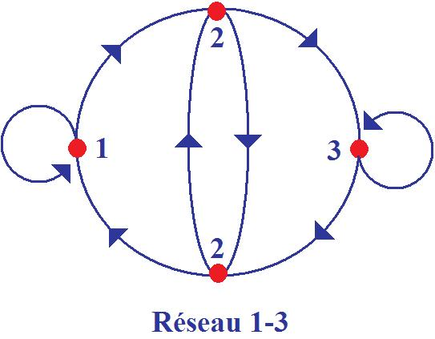
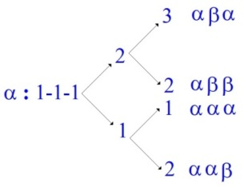
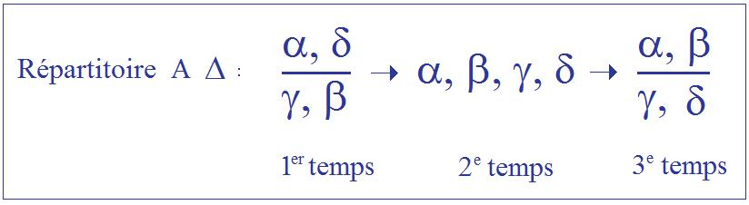
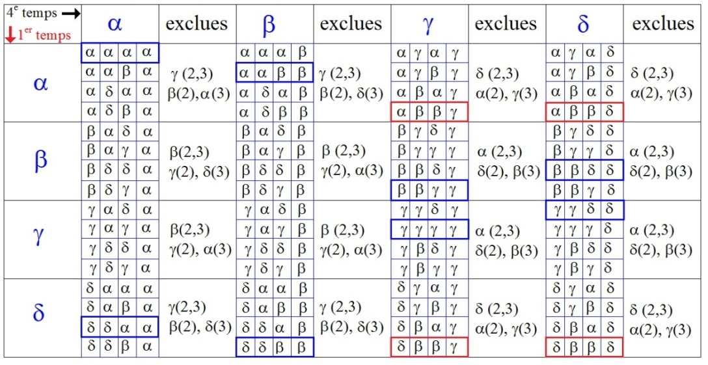
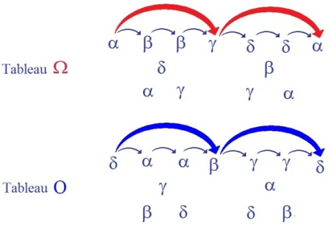
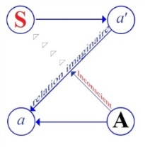
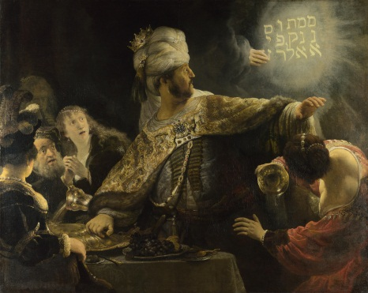

# Leçon 17 | 26 Avril 1955

<!-- source-url: http://staferla.free.fr/S2/S2 LE MOI.docx -->
<!-- seminar: s2 -->
<!-- lesson: 17 -->

<!-- id: s2-17-0001 -->

> STÉNOTYPIE MANQUANTE

<!-- id: s2-17-0002 -->

(Cf. la transcription de Jacques-Alain MILLER : « *Le moi*... » Seuil, 1978, ou Points Seuil n° 243, 2001.

<!-- id: s2-17-0003 -->

La transcription ci-dessous est celle de « *La psychanalyse »* n*°* 2, PUF 1956, pp. 1-44)

<!-- id: s2-17-0004 -->

LE SÉMINAIRE SUR « LA LETTRE VOLÉE »

<!-- id: s2-17-0005 -->

introduction

<!-- id: s2-17-0006 -->

*La leçon de notre Séminaire que nous donnons ici rédigée fut prononcée le 26 Avril 1955.* *Elle est un moment du commentaire que nous avons consacré, toute cette année scolaire, à l’ « Au-delà du principe de plaisir ».*

<!-- id: s2-17-0007 -->

*On sait que c’est l’œuvre de Freud que beaucoup de ceux qui s’autorisent du titre de psychanalyste, n’hésitent pas à rejeter* *comme une spéculation superflue, voire hasardée, et l’on peut mesurer à l’antinomie par excellence qu’est la notion d’instinct de mort où elle se résout, à quel point elle peut être impensable - qu’on nous passe le mot - pour la plupart.*

<!-- id: s2-17-0008 -->

*Il est pourtant difficile de tenir pour une excursion, moins encore pour un faux-pas, de la doctrine freudienne, l’œuvre qui y prélude précisément à la nouvelle topique, celle que représentent les termes de moi, de ça et de surmoi, devenus aussi prévalents dans l’usage théoricien que dans* *sa diffusion populaire. Cette simple appréhension se confirme à pénétrer les motivations qui articulent ladite spéculation à la révision théorique dont elle s’avère être constituante.*

<!-- id: s2-17-0009 -->

*Un tel procès ne laisse pas de doute sur l’abâtardissement, voire le contresens, qui frappe l’usage présent desdits termes, déjà manifeste* *en ce qu’il est parfaitement équivalent du théoricien au vulgaire. C’est là sans doute ce qui justifie le propos avoué par tels épigones de trouver en ces termes le truchement par où faire rentrer l’expérience de la psychanalyse dans ce qu’ils appellent la psychologie générale.*

<!-- id: s2-17-0010 -->

*Posons seulement ici quelques jalons. L’automatisme de répétition, Wiederholungszwang…*

<!-- id: s2-17-0011 -->

> *bien que la notion s’en présente dans l’œuvre ici en cause, comme destinée à répondre à certains paradoxes de la clinique, tels que les rêves de la névrose traumatique où la réaction thérapeutique négative*

<!-- id: s2-17-0012 -->

*…ne saurait être conçu comme un rajout, fût-il même couronnant, à l’édifice doctrinal.*

<!-- id: s2-17-0013 -->

*C’est sa découverte inaugurale que Freud y réaffirme : à savoir la conception de la mémoire qu’implique son « inconscient ». Les faits nouveaux sont ici l’occasion pour lui de la restructurer de façon plus rigoureuse en lui donnant une forme généralisée, mais aussi de rouvrir sa problématique contre la dégradation, qui se faisait sentir dès alors, d’en prendre les effets pour un simple donné.* *Ce qui ici se rénove, déjà s’articulait dans le « projet »* [^22] *où sa divination traçait les avenues par où devait le faire passer sa recherche :* *le système* Ψ*, prédécesseur de l’inconscient, y manifeste son originalité, de ne pouvoir se satisfaire que de retrouver l’objet foncièrement perdu.*

<!-- id: s2-17-0014 -->

*C’est ainsi que Freud se situe dès le principe dans l’opposition, dont Kierkegaard nous a instruit, concernant la notion de l’existence selon qu’elle se fonde sur la réminiscence ou sur la répétition. Si Kierkegaard y discerne admirablement la différence de la conception antique* *et moderne de l’homme, il apparaît que Freud fait faire à cette dernière son pas décisif en ravissant à l’agent humain identifié à la conscience, la nécessité incluse dans cette répétition. Cette répétition étant répétition symbolique, il s’y avère que l’ordre du symbole* *ne peut plus être conçu comme constitué par l’homme, mais comme le constituant.*

<!-- id: s2-17-0015 -->

*C’est ainsi que nous nous sommes senti mis en demeure d’exercer véritablement nos auditeurs à la notion de la remémoration qu’implique l’œuvre de Freud : ceci dans la considération trop éprouvée qu’à la laisser implicite, les données mêmes de l’analyse flottent dans l’air.* *C’est parce que Freud ne cède pas sur l’original de son expérience que nous le voyons contraint d’y évoquer un élément qui la gouverne* *d’au-delà de la vie, et qu’il appelle l’instinct de mort.*

<!-- id: s2-17-0016 -->

*L’indication que Freud donne ici à ses suivants - se disant tels - ne peut scandaliser que ceux chez qui le sommeil de la raison s’entretient - selon la formule lapidaire de Goya - des monstres qu’il engendre. Car pour ne pas déchoir à son accoutumée, Freud ne nous livre sa notion qu’accompagnée d’un exemple qui ici va mettre à nu de façon éblouissante la formalisation fondamentale qu’elle désigne.*

<!-- id: s2-17-0017 -->

*Ce jeu par où l’enfant s’exerce à faire disparaître de sa vue, pour l’y ramener, puis l’oblitérer à nouveau, un objet, au reste indifférent de sa nature, cependant qu’il module cette alternance de syllabes distinctives, – ce jeu, dirons–nous, manifeste en ses traits radicaux la détermination que l’animal humain reçoit de l’ordre symbolique.*

<!-- id: s2-17-0018 -->

*L’homme littéralement dévoue son temps à déployer l’alternative structurale où la présence et l’absence prennent l’une de l’autre leur appel. C’est au moment de leur conjonction essentielle, et pour ainsi dire, au point zéro du désir, que l’objet humain tombe sous le coup de la saisie, qui, annulant sa propriété naturelle, l’asservit désormais aux conditions du symbole.*

<!-- id: s2-17-0019 -->

*À vrai dire, il n’y a là qu’un aperçu illuminant de l’entrée de l’individu dans un ordre dont la masse le supporte et l’accueille sous la forme du langage, et surimpose dans la diachronie comme dans la synchronie la détermination du signifiant à celle du signifié. On peut saisir à son émergence même cette surdétermination qui est la seule dont il s’agisse dans l’aperception freudienne de la fonction symbolique.*

<!-- id: s2-17-0020 -->

*La simple connotation par (+) et (–) d’une série jouant sur la seule alternative fondamentale de la présence et de l’absence, permet de démontrer comment les plus strictes déterminations symboliques s’accommodent d’une succession de coups dont la réalité se répartit strictement « au hasard ».*

<!-- id: s2-17-0021 -->

*Il suffit en effet de symboliser dans la diachronie d’une telle série les groupes de trois qui se concluent avec chaque signe, en les définissant synchroniquement par exemple par la symétrie*

<!-- id: s2-17-0022 -->

- *de la constance (+++, – – –) notée par (1),*

<!-- id: s2-17-0023 -->

- *ou de l’alternance (+ – +, – + –) notée par (3),*

<!-- id: s2-17-0024 -->

- *réservant la notation (2) à la dissymétrie révélée par l’impair* [^23] *sous la forme du groupe de deux signes semblables indifféremment précédés ou suivis du signe contraire (+ – –,  – + +, + + –,  – – +)*

<!-- id: s2-17-0025 -->

*…pour qu’apparaissent, dans la nouvelle série ainsi constituée, des possibilités et des impossibilités* *de succession que le réseau suivant résume en même temps qu’il manifeste la symétrie concentrique dont est grosse la triade, c’est-à-dire* *- remarquons-le - la structure même à quoi doit se référer la question toujours rouverte par les anthropologues, du caractère foncier* *ou apparent du dualisme des organisations symboliques* [^24]*. Voici ce réseau* [^25]* :*

<!-- id: s2-17-0026 -->

<!-- id: s2-17-0027 -->

*Dans la série des symboles (1), (2), (3) par exemple, on peut constater qu’aussi longtemps que dure une succession uniforme de (2)* *qui a commencé après un (1), la série se souviendra du rang pair ou impair de chacun de ces (2), puisque de ce rang dépend* *que cette séquence ne puisse se rompre que par un (1) après un nombre pair de (2), ou par un (3) après un nombre impair.*

<!-- id: s2-17-0028 -->

| *+* | *+* | *+* | -     | -     | *+*     | *+*     | *+*     |         |
|-----|-----|-----|---------|---------|---------|---------|---------|---------|
| . | . | *1* | ***2*** | ***2*** | ***2*** | ***2*** | ***1*** |         |
| - | - | - | *+*     | *+*     | -     | -     | -     |         |
| . | . | *1* | ***2*** | ***2*** | ***2*** | ***2*** | ***1*** |         |
| *+* | *+* | *+* | -     | -     | *+*     | *+*     | -     | *+*     |
| . | . | *1* | ***2*** | ***2*** | ***2*** | ***2*** | ***2*** | ***3*** |
| - | - | - | *+*     | *+*     | -     | -     | *+*     | -     |
| . | . | *1* | ***2*** | ***2*** | ***2*** | ***2*** | ***2*** | ***3*** |

<!-- id: s2-17-0029 -->

*Ainsi dès la première composition avec soi-même du symbole primordial, et nous indiquerons que ce n’est pas arbitrairement* *que nous l’avons proposée telle, une structure, toute transparente qu’elle reste encore à ses données, fait apparaître la liaison essentielle* *de la mémoire à la loi. Mais nous allons voir à la fois comment s’opacifie la détermination symbolique en même temps que se révèle* *la nature du signifiant, à seulement réappliquer le groupement par trois à la série à trois termes pour y définir une relation quadratique.*

<!-- id: s2-17-0030 -->

*La seule considération du réseau 1-3* \[*supra*\] *suffit en effet à montrer qu’à y poser les deux extrêmes d’un groupe de trois, selon les termes dont il fixe la succession, le moyen sera déterminé de façon univoque, autrement dit que ledit groupe sera suffisamment défini par ses deux extrêmes. Posons alors que ces extrêmes : (1) et (3) dans le groupe \[(1) (2) (3)\] par exemple, s’ils conjoignent par leur symbole :*

<!-- id: s2-17-0031 -->

- *une symétrie à une symétrie \[(1) – (1) \[1,1,1\], (3) – (3) \[3,3,3\], (1) – (3) \[1,2,3\], (3) – (1) \[3,2,1\]\], feront noter le groupe qu’ils définissent par α,*

<!-- id: s2-17-0032 -->

- *une dissymétrie à une dissymétrie \[(2) - (2) \[(2,3,2), (2,1,2) et 2 cas (2,2,2) : en haut et en bas du graphe\]\], feront noter le groupe qu’ils définissent par γ,*

<!-- id: s2-17-0033 -->

- *mais qu’à l’encontre de notre première symbolisation, c’est de deux signes, β et δ, que disposeront les conjonctions croisées :* *β par exemple notant celle de la symétrie à la dissymétrie \[(1) - (2) \[(1,1,2) et (1,2,2)\], (3) - (2) \[(3,3,2) et (3,2,2)\]\],* *et δ celle de la dissymétrie à la symétrie \[(2) - (1) \[(2,3,3), (2,2,2)\] , (2) - (3) \[(2,1,1), (2,2,3)\]\].*

<!-- id: s2-17-0034 -->

<table style="width:78%;">
<colgroup>
<col style="width: 3%" />
<col style="width: 3%" />
<col style="width: 3%" />
<col style="width: 3%" />
<col style="width: 3%" />
<col style="width: 3%" />
<col style="width: 3%" />
<col style="width: 3%" />
<col style="width: 3%" />
<col style="width: 3%" />
<col style="width: 3%" />
<col style="width: 3%" />
<col style="width: 3%" />
<col style="width: 3%" />
<col style="width: 3%" />
<col style="width: 3%" />
<col style="width: 3%" />
<col style="width: 3%" />
<col style="width: 3%" />
<col style="width: 3%" />
<col style="width: 2%" />
</colgroup>
<thead>
<tr>
<th>+</th>
<th>+</th>
<th>+</th>
<th>-</th>
<th>+</th>
<th>-</th>
<th>-</th>
<th>+</th>
<th>-</th>
<th>+</th>
<th>+</th>
<th>-</th>
<th>-</th>
<th>-</th>
<th>+</th>
<th>-</th>
<th>-</th>
<th>-</th>
<th>-</th>
<th></th>
<th rowspan="3"></th>
</tr>
<tr>
<th><em>.</em></th>
<th><em>.</em></th>
<th><em>1</em></th>
<th><em>2</em></th>
<th><em>3</em></th>
<th><em>3</em></th>
<th><em>2</em></th>
<th><em>2</em></th>
<th><em>3</em></th>
<th><em>3</em></th>
<th><em>2</em></th>
<th><em>2</em></th>
<th><em>2</em></th>
<th><em>1</em></th>
<th><em>2</em></th>
<th><em>3</em></th>
<th><em>2</em></th>
<th><em>1</em></th>
<th><em>1</em></th>
<th></th>
</tr>
<tr>
<th><em>.</em></th>
<th><em>.</em></th>
<th><em>.</em></th>
<th><em>.</em></th>
<th><em>α</em></th>
<th><em>δ</em></th>
<th><em>β</em></th>
<th><em>β</em></th>
<th><em>δ</em></th>
<th><em>δ</em></th>
<th><em>β</em></th>
<th><em>β</em></th>
<th><em>γ</em></th>
<th><em>δ</em></th>
<th><em>γ</em></th>
<th><em>α</em></th>
<th><em>γ</em></th>
<th><em>α</em></th>
<th><em>δ</em></th>
<th></th>
</tr>
</thead>
<tbody>
</tbody>
</table>

<!-- id: s2-17-0035 -->

*On va constater alors que, bien que cette convention restaure une stricte égalité de chances combinatoires entre 4 symboles α, β, γ, δ,* *contrairement à l’ambiguïté cumulative qui faisait équivaloir aux chances des deux autres celles du symbole (2) de la convention précédente* *il n’en reste pas moins que des liaisons qu’on peut dire déjà proprement syntaxiques entre α, β, γ, δ, déterminent des possibilités* *de répartition absolument dissymétriques entre α et γ d’une part, β et δ de l’autre.*

<!-- id: s2-17-0036 -->

*Étant reconnu en effet qu’un quelconque de ces termes peut succéder immédiatement à n’importe lequel des autres, et pouvant également être atteint au 4e temps compté à partir de l’un d’eux, il s’avère à l’encontre que le temps troisième, autrement dit la conjonction des signes* *de 2 en 2, obéit à une loi d’exclusion qui veut qu’à partir d’un α ou d’un δ on ne puisse obtenir qu’un α ou un β et qu’à partir d’un β ou d’un γ on ne puisse obtenir qu’un γ ou un δ.*

<!-- id: s2-17-0037 -->

<!-- id: s2-17-0038 -->

*Ce qui peut s’écrire sous la forme suivante :*

<!-- id: s2-17-0039 -->

<!-- id: s2-17-0040 -->

*où les symboles compatibles du 1er au 3éme temps se répondent selon l’étagement horizontal qui les divise dans le répartitoire,* *tandis que leur choix est indifférent au 2 éme temps.*

<!-- id: s2-17-0041 -->

<!-- id: s2-17-0042 -->

*Que la liaison ici apparue ne soit rien de moins que la formalisation la plus simple de l’échange, c’est ce qui nous confirme son intérêt anthropologique. Nous ne ferons qu’indiquer à ce niveau sa valeur constituante pour une subjectivité primordiale, dont nous situerons plus loin la notion. La liaison, compte tenu de son orientation, est en effet réciproque, autrement dit, elle n’est pas réversible, mais elle est rétroactive. C’est ainsi qu’à fixer le terme du 4e temps, celui du 2e ne sera pas indifférent. On peut démontrer qu’à connaître* *le 1er et le 4e terme d’une série, il y aura toujours un terme dont la possibilité sera exclue des deux termes intermédiaires.*

<!-- id: s2-17-0043 -->

*Ce terme est désigné dans les deux tableaux* Ω *et* O [^26]* :*

<!-- id: s2-17-0044 -->

*dont la première ligne permet de repérer entre les deux tableaux la combinaison cherchée du 1er au 4e temps,* *la lettre qui lui correspond dans la deuxième ligne étant celle du terme que cette combinaison exclut au 2e et 3e temps.*

<!-- id: s2-17-0045 -->

<!-- id: s2-17-0046 -->

*Ceci pourrait s’énoncer sous cette forme qu’il est une part déterminée de mon avenir, laquelle s’insère entre*

<!-- id: s2-17-0047 -->

- *un futur immédiat qui en deçà d’elle, *

<!-- id: s2-17-0048 -->

- *et un futur éloigné qui au-delà * *…qui sont dans une indétermination apparente, mais qu’il suffit que mon projet détermine ce futur éloigné pour que mon futur immédiat devenant futur antérieur et se conjoignant à la détermination à venir de mon passé, ceci exclue* \[subjonctif\] *de l’intervalle qui me sépare* *de la réalisation de mon projet le quart des possibilités signifiantes où ce projet se situe.*

<!-- id: s2-17-0049 -->

*Ce caput mortuum du signifiant* [^27] *peut être considéré comme caractéristique de tout parcours subjectif. Mais c’est l’ordre de la détermination signifiante qui permet de situer justement celui d’une subjectivité, que l’on confond ordinairement et à tort avec sa relation au réel.*

<!-- id: s2-17-0050 -->

*Pour cela, il n’est pas mauvais de s’attarder à des conséquences qui peuvent se déduire facilement de nos premières formules, à savoir par exemple que si, dans une chaîne d’α,β,γ,δ, on peut rencontrer deux β qui se succèdent, c’est toujours soit directement ( ββ ) ou après interposition d’un nombre d’ailleurs indéfini de couples αγ ( βαγα... γβ ), mais qu’après le second β* *nul nouveau β ne peut apparaître dans la chaîne avant que δ ne s’y soit produit.*

<!-- id: s2-17-0051 -->

*Cependant, la succession sus-définie de deux β ne peut se reproduire, sans qu’un second δ ne s’ajoute au premier dans une liaison équivalente (au renversement près du couple αγ en γα) à celle qui s’impose aux deux β. D’où résulte immédiatement la dissymétrie* *que nous annoncions plus haut dans la probabilité d’apparition des différents symboles de la chaîne.*

<!-- id: s2-17-0052 -->

*Tandis que les α et les γ en effet peuvent par une série heureuse du hasard se répéter jusqu’à couvrir la chaîne tout entière, il est exclu, même par les chances les plus favorables que β et δ puissent augmenter leur proportion sinon de façon strictement équivalente à un terme près, ce qui limite à 50% le maximum de leur fréquence possible.*

<!-- id: s2-17-0053 -->

*La probabilité de la combinaison de coups que supposent les β et les δ étant équivalente à celle que supposent les α et les γ,* *et le tirage réel des coups étant d’autre part laissé strictement au hasard, on voit donc se détacher du réel une détermination symbolique qui, pour être celle même où peut s’enregistrer toute partialité du réel, lui est préexistante dans sa disparité singulière.*

<!-- id: s2-17-0054 -->

*Disparité manifestable de plus d’une façon à simplement considérer le contraste structural des deux tableaux Ω et O, c’est-à-dire le caractère direct ou croisé des exclusions selon le tableau auquel appartient la liaison des extrêmes.*

<!-- id: s2-17-0055 -->

*C’est ainsi qu’on constate que si les deux couples intermédiaire et extrême peuvent être identiques si le dernier s’inscrit dans le tableau O* *(tels δδββ, δδαα, ααββ, ββγγ, ββδδ, γγγγ, γγδδ, voire αααα, qui sont <u>possibles</u>), ils ne peuvent l’être si le dernier s’inscrit*

<!-- id: s2-17-0056 -->

*dans le sens Ω (ααγγ, ααδδ, δδγγ, ββββ, ββαα, γγββ, γγαα, <u>impossibles</u>, et bien entendu δδδδ, cf. plus haut).*

<!-- id: s2-17-0057 -->

*Autre exemple de la détermination symbolique, dont le caractère récréatif ne doit pas nous égarer. Car il n’y a pas d’autre lien que celui* *de cette détermination symbolique où puisse se situer cette surdétermination signifiante dont Freud nous apporte la notion,* *et qui n’a jamais pu être conçue comme une surdétermination réelle dans un esprit comme le sien, dont tout contredit qu’il s’abandonne* *à cette aberration conceptuelle où philosophes et médecins trouvent trop facilement à calmer leurs échauffements religieux.*

<!-- id: s2-17-0058 -->

*Cette position de l’autonomie du symbolique est la seule qui permette de dégager de ses équivoques la théorie et la pratique de l’association libre en psychanalyse. Car c’est tout autre chose d’en rapporter le ressort à la détermination symbolique et à ses lois, qu’aux présupposés scolastiques d’une inertie imaginaire qui la supportent dans l’associationnisme, philosophique ou pseudo-tel avant de se prétendre expérimental. D’en avoir abandonné l’examen, les psychanalystes trouvent ici un point d’appel de plus pour la confusion psychologisante où ils retombent sans cesse, certains de propos délibéré.*

<!-- id: s2-17-0059 -->

*En fait seuls les exemples de conservation, indéfinie dans leur suspension, des exigences de la chaîne symbolique,* *tels que ceux que nous venons de donner, permettent de concevoir où se situe le désir inconscient dans sa persistance indestructible,* *laquelle, pour paradoxale qu’elle paraisse dans la doctrine freudienne, n’en est pas moins un des traits qui y sont le plus affirmés.*

<!-- id: s2-17-0060 -->

*Ce caractère est en tout cas incommensurable avec aucun des effets connus en psychologie authentiquement expérimentale, et qui,* *quels que soient les délais ou retards à quoi ils soient sujets, viennent comme toute réaction vitale à s’amortir et à s’éteindre.* *C’est précisément la question à laquelle Freud revient une fois de plus dans l’Au-delà du principe de plaisir, et pour marquer* *que l’insistance où nous avons trouvé le caractère essentiel des phénomènes de l’automatisme de répétition, ne lui paraît pouvoir trouver* *de motivation que pré-vitale et trans-biologique.*

<!-- id: s2-17-0061 -->

*Cette conclusion peut surprendre, mais elle est de Freud parlant de ce dont il est le premier à avoir parlé.* *Et il faut être sourd pour ne pas l’entendre. On ne pensera pas que sous sa plume il s’agisse d’un recours spiritualiste :* *c’est de la structure de la détermination qu’il est ici question. La matière qu’elle déplace en ses effets, dépasse de beaucoup en étendue* *celle de l’organisation cérébrale, aux vicissitudes de laquelle certains d’entre eux sont confiés, mais les autres ne restent pas moins actifs* *et structurés comme symboliques, de se matérialiser autrement. C’est ainsi que si l’homme vient à penser l’ordre symbolique,* *c’est qu’il y est d’abord pris dans son être. L’illusion qu’il l’ait formé par sa conscience, provient de ce que c’est par la voie d’une béance spécifique de sa relation imaginaire à son semblable, qu’il a pu entrer dans cet ordre comme sujet.*

<!-- id: s2-17-0062 -->

*Mais il n’a pu faire cette entrée que par le défilé radical de la parole, soit le même dont nous avons reconnu dans le jeu de l’enfant un moment génétique, mais qui, dans sa forme complète, se reproduit chaque fois que le sujet s’adresse à l’Autre comme absolu, c’est-à-dire comme l’Autre qui peut l’annuler lui-même, de la même façon qu’il peut en agir avec lui, c’est-à-dire en se faisant objet pour le tromper. Cette dialectique* *de l’intersubjectivité, dont nous avons démontré l’usage nécessaire à travers les trois ans passés de notre séminaire à Sainte-Anne,* *depuis la théorie du transfert jusqu’à la structure de la paranoïa, s’appuie volontiers du schéma suivant, désormais familier à nos élèves* *et où les deux termes moyens représentent le couple de réciproque objectivation imaginaire que nous avons dégagé dans le stade du miroir.*

<!-- id: s2-17-0063 -->

<!-- id: s2-17-0064 -->

*La relation spéculaire à l’autre…*

<!-- id: s2-17-0065 -->

> *par où nous avons voulu d’abord en effet redonner sa position dominante*
>
> *dans la fonction du moi à la théorie – cruciale dans Freud – du narcissisme*

<!-- id: s2-17-0066 -->

*…ne peut réduire à sa subordination effective toute la fantasmatisation mise au jour par l’expérience analytique, qu’à s’interposer, comme l’exprime le schéma, entre cet en deçà du Sujet et cet au-delà de l’Autre, où l’insère en effet la parole, en tant que les existences qui se fondent en celle-ci sont tout entières à la merci de sa foi.*

<!-- id: s2-17-0067 -->

*C’est d’avoir confondu ces deux couples que les légataires d’une praxis et d’un enseignement qui a aussi décisivement tranché qu’on peut* *le lire dans Freud, de la nature foncièrement narcissique de toute énamoration (Verliebtheit), ont pu diviniser la chimère de l’amour dit « génital » au point de lui attribuer la vertu d’oblativité, d’où sont issus tant de fourvoiements thérapeutiques.*

<!-- id: s2-17-0068 -->

*Mais de supprimer simplement toute référence aux pôles symboliques de l’intersubjectivité pour réduire la cure à une utopique rectification du couple imaginaire, nous en sommes maintenant à une pratique où, sous le pavillon de la « relation d’objet », se consomme* *ce qui chez tout homme de bonne foi ne peut que susciter le sentiment de l’abjection. C’est là ce qui justifie la véritable gymnastique* *du registre intersubjectif que constituent tels des exercices auxquels notre séminaire a pu paraître s’attarder.*

<!-- id: s2-17-0069 -->

*La parenté de la relation entre les termes du schéma L et de celle qui unit les 4 temps plus haut distingués dans la série orientée* *où nous voyons la première forme achevée d’une chaîne symbolique, ne peut manquer de frapper, dès qu’on en fait le rapprochement.* *Nous allons y trouver une analogie plus frappante encore, en retrouvant dans « La lettre volée », comme telle, le caractère décisif de ce que nous avons appelé le « caput mortuum » du signifiant.*

<!-- id: s2-17-0070 -->

*Mais nous n’en sommes en ce moment qu’à la lancée d’une arche dont les années seulement maçonneront le pont. C’est ainsi que pour démontrer à nos auditeurs ce qui distingue de la relation duelle impliquée dans la notion de projection, une intersubjectivité véritable, nous nous étions déjà servi du raisonnement rapporté par Poe lui-même avec faveur dans l’histoire qui sera le sujet du présent séminaire, comme celui qui guidait un prétendu enfant prodige pour le faire gagner plus qu’à son tour au jeu de pair ou impair. Il faut, à suivre* *ce raisonnement - enfantin, c’est le cas de le dire, mais qui en d’autres lieux séduit plus d’un - saisir le point où s’en dénonce le leurre.*

<!-- id: s2-17-0071 -->

*Ici le sujet est l’interrogé : il répond à la question de deviner si les objets que son adversaire cache en sa main sont en nombre pair* *ou impair. Après un coup gagné ou perdu pour moi, nous dit en substance le garçon, je sais que si mon adversaire est un simple,* *sa ruse n’ira pas plus loin qu’à changer de tableau pour sa mise, mais que s’il est d’un degré plus fin, il lui viendra à l’esprit* *que c’est ce dont je vais m’aviser et que dès lors il convient qu’il joue sur le même.*

<!-- id: s2-17-0072 -->

*C’est donc à l’objectivation du degré plus ou moins poussé de la frisure cérébrale de son adversaire que l’enfant s’en remettait pour obtenir ses succès. Point de vue dont le lien avec l’identification imaginaire est aussitôt manifesté par le fait que c’est par une imitation interne de ses attitudes et de sa mimique qu’il prétend obtenir la juste appréciation de son objet.*

<!-- id: s2-17-0073 -->

*Mais qu’en peut-il être au degré suivant quand l’adversaire, ayant reconnu que je suis assez intelligent pour le suivre dans ce mouvement, manifestera sa propre intelligence à s’apercevoir que c’est à faire l’idiot qu’il a sa chance de me tromper. De ce moment il n’y a pas d’autre temps valable du raisonnement, précisément parce qu’il ne peut dès lors que se répéter en une oscillation indéfinie.*

<!-- id: s2-17-0074 -->

*Et hors le cas d’imbécillité pure, où le raisonnement paraissait se fonder objectivement, l’enfant ne peut faire que de penser que son adversaire arrive à la butée de ce troisième temps, puisqu’il lui a permis le deuxième, par où il est lui-même considéré par son adversaire comme un sujet qui l’objective, car il est vrai qu’il soit ce sujet, et dès lors le voilà pris avec lui dans l’impasse que comporte toute intersubjectivité purement duelle, celle d’être sans recours contre un Autre absolu.*

<!-- id: s2-17-0075 -->

*Remarquons en passant le rôle évanouissant que joue l’intelligence dans la constitution du temps deuxième où la dialectique se détache* *des contingences du donné, et qu’il suffit que je l’impute à mon adversaire pour que sa fonction soit inutile puisqu’à partir de là* *elle rentre dans ces contingences.*

<!-- id: s2-17-0076 -->

*Nous ne dirons pas cependant que la voie de l’identification imaginaire à l’adversaire à l’instant de chacun des coups, soit une voie d’avance condamnée ; nous dirons qu’elle exclut le procès proprement symbolique qui apparaît dès que cette identification se fait, non pas à l’adversaire, mais à son raisonnement qu’elle articule (différence au reste qui s’énonce dans le texte).* *Le fait prouve d’ailleurs qu’une telle identification purement imaginaire échoue dans l’ensemble.*

<!-- id: s2-17-0077 -->

*Dès lors le recours de chaque joueur, s’il raisonne, ne peut se trouver qu’au-delà de la relation duelle, c’est-à-dire dans quelque loi* *qui préside à la succession des coups qui me sont proposés. Et c’est si vrai que si c’est moi qui donne le coup à deviner, c’est-à-dire* *qui suis le sujet actif, mon effort à chaque instant sera de suggérer à l’adversaire l’existence d’une loi qui préside à une certaine régularité* *de mes coups, pour lui en dérober le plus de fois possible par sa rupture la saisie.*

<!-- id: s2-17-0078 -->

*Plus cette démarche arrivera à se rendre libre de ce qui s’ébauche malgré moi de régularité réelle, plus elle aura effectivement de succès,* *et c’est pourquoi un de ceux* \[*Octave Mannoni*\] *qui ont participé à une des épreuves de ce jeu que nous n’avons pas hésité à faire passer au rang* *de travaux pratiques, a avoué qu’à un moment où il avait le sentiment, fondé ou non, d’être trop souvent percé à jour, il s’en était délivré* *en se réglant sur la succession conventionnellement transposée des lettres d’un vers de Mallarmé pour la suite des coups qu’il allait proposer* *dès lors à son adversaire.*

<!-- id: s2-17-0079 -->

*Mais si le jeu eût duré le temps de tout un poème et si par miracle l’adversaire eût pu reconnaître celui-ci, il aurait alors gagné* *à tout coup. C’est ce qui nous a permis de dire que si l’inconscient existe au sens de Freud, nous voulons dire : si nous entendons les implications de la leçon qu’il tire des expériences de la psychopathologie de la vie quotidienne par exemple, il n’est pas impensable qu’une* *moderne machine à calculer, en dégageant la phrase qui module à son insu et à long terme les choix d’un sujet, n’arrive à gagner au-delà de toute proportion accoutumée au jeu de pair et impair.*

<!-- id: s2-17-0080 -->

*Pur paradoxe sans doute, mais où s’exprime que ce n’est pas pour le défaut d’une vertu qui serait celle de la conscience humaine, que nous refusons de qualifier de machine à penser celle à qui nous accorderions de si mirifiques performances, mais simplement parce* *qu’elle ne penserait pas plus que ne fait l’homme en son statut commun sans en être pour autant moins en proie aux appels du signifiant.*

<!-- id: s2-17-0081 -->

*Aussi bien la possibilité ainsi suggérée a-t-elle eu l’intérêt de nous faire entendre l’effet de désarroi, voire d’angoisse, que certains en éprouvèrent et dont ils voulurent bien nous faire part. Réaction sur laquelle on peut ironiser, venant d’analystes dont toute la technique repose sur* *la détermination inconsciente que l’on y accorde à l’association dite libre, et qui peuvent lire en toutes lettres, dans l’ouvrage de Freud* *que nous venons de citer, qu’un chiffre n’est jamais choisi au hasard.* *Mais réaction fondée si l’on songe que rien ne leur a appris à se détacher de l’opinion commune en distinguant ce qu’elle ignore : à savoir la nature de la surdétermination freudienne, c’est-à-dire de la détermination symbolique telle que nous la promouvons ici.*

<!-- id: s2-17-0082 -->

*Si cette surdétermination devait être prise pour réelle, comme le leur suggérait mon exemple pour ce qu’ils confondent comme tout un chacun* *les calculs de la machine avec son mécanisme* [^28]*, alors en effet leur angoisse se justifierait, car en un geste plus sinistre que de toucher à la hache, nous serions celui qui la porte sur « les lois du hasard », et en bons déterministes que sont en effet ceux que ce geste a tant émus, ils sentent, et avec raison, que si l’on touche à ces lois, il n’y en a plus aucune de concevable.* *Mais ces lois sont précisément celles de la détermination symbolique.*

<!-- id: s2-17-0083 -->

*Car il est clair qu’elles sont antérieures à toute constatation réelle du hasard, comme il se voit que c’est d’après son obéissance à ces lois,* *qu’on juge si un objet est propre ou non à être utilisé pour obtenir une série, dans ce cas toujours symbolique, de coups de hasard :* *à qualifier par exemple pour cette fonction une pièce de monnaie ou cet objet admirablement dénommé « dé ».*

<!-- id: s2-17-0084 -->

*Passé ce stage, il nous fallait illustrer d’une façon concrète la dominance que nous affirmons du signifiant sur le sujet. Si c’est là une vérité, elle gît partout, et nous devions pouvoir de n’importe quel point à la portée de notre perce, la faire jaillir comme le vin dans la taverne d’Auerbach.*[^29]

<!-- id: s2-17-0085 -->

*C’est ainsi que nous prîmes le conte même dont nous avions extrait, sans y voir d’abord plus loin, le raisonnement litigieux sur le jeu de pair ou impair : nous y trouvâmes une faveur que notre notion de détermination symbolique nous interdirait déjà de tenir pour un simple hasard,* *si même il ne se fût pas avéré au cours de notre examen que Poe - en bon précurseur qu’il est des recherches de stratégie combinatoire* *qui sont en train de renouveler l’ordre des sciences - avait été guidé en sa fiction par un dessein pareil au nôtre.*

<!-- id: s2-17-0086 -->

*Du moins pouvons-nous dire que ce que nous en fîmes sentir dans son exposé, toucha assez nos auditeurs pour que ce soit à leur requête* *que nous en publions ici une version. En le remaniant conformément aux exigences de l’écrit, différentes de celles de la parole,* *nous n’avons pu nous garder d’anticiper quelque peu sur l’élaboration que nous avons donnée depuis des notions qu’il introduisait alors.*

<!-- id: s2-17-0087 -->

*C’est ainsi que l’accent dont nous avons toujours promu plus avant la notion de signifiant dans le symbole, s’est ici rétroactivement exercé.* *En estomper les traits par une sorte de feinte historique, eût paru, nous le croyons, artificiel à ceux qui nous suivent.* *Souhaitons que de nous en être dispensé, ne déçoive pas leur souvenir.*

<!-- id: s2-17-0088 -->

*Und wenn es uns glück,* *Und wenn es sich schickt,* *So sind es Gedanken !* \[Gœthe : *Faust,* Hexenküche\]

<!-- id: s2-17-0089 -->

Notre recherche nous a mené à ce point de reconnaître que *l’automatisme de répétition,* *Wiederholungszwang,* prend son principe dans ce que nous avons appelé *l’insistance de la chaîne signifiante*. Cette notion elle-même, nous l’avons dégagée comme corrélative de l*’ex-sistence* (soit : de la *place excentrique*) où il nous faut situer *le sujet de l’inconscient*, si nous devons prendre au sérieux la découverte de FREUD.

<!-- id: s2-17-0090 -->

C’est, on le sait, dans l’expérience inaugurée par la psychanalyse qu’on peut saisir par quels biais de l’*imaginaire* vient à s’exercer, jusqu’au plus intime de l’organisme humain, cette prise du *symbolique*. L’enseignement de ce séminaire est fait pour soutenir que ces incidences *imaginaires*, loin de représenter l’essentiel de notre expérience, n’en livrent rien que d’*inconsistant*, sauf à être rapportées à *la chaîne symbolique* qui les lie et les oriente.

<!-- id: s2-17-0091 -->

Certes savons-nous l’importance des *imprégnations imaginaires,* *Prägung,* dans ces partialisations de *l’alternative symbolique* qui donnent à la chaîne signifiante son allure. Mais nous posons que c’est la loi propre à cette chaîne qui régit les effets psychanalytiques déterminants pour le sujet, tels que :

<!-- id: s2-17-0092 -->

- la forclusion, *Verwerfung,*

<!-- id: s2-17-0093 -->

- le refoulement, *Verdrängung,*

<!-- id: s2-17-0094 -->

- la dénégation, *Verneinung* elle-même, …précisant de l’accent qui y convient que ces effets suivent si fidèlement le déplacement (*Entstellung*) du signifiant que les facteurs imaginaires, malgré leur inertie, n’y font figure que d’*ombres* et de *reflets*.

<!-- id: s2-17-0095 -->

Encore cet accent serait-il prodigué en vain, s’il ne servait à votre regard, qu’à abstraire une forme générale de phénomènes dont la particularité dans notre expérience resterait pour vous l’essentiel, et dont ce ne serait pas sans artifice qu’on romprait le composite original.

<!-- id: s2-17-0096 -->

C’est pourquoi nous avons pensé à illustrer pour vous aujourd’hui la vérité qui se dégage du moment de la pensée freudienne que nous étudions, à savoir que *c’est l’ordre symbolique qui est*, pour le sujet, *constituant*, en vous démontrant dans une histoire *la détermination majeure que le sujet reçoit du parcours d’un signifiant*. C’est cette *vérité*, remarquons-le, qui rend possible l’existence même de *la fiction*. Dès lors *une fable* est aussi propre qu’une autre histoire à la mettre en lumière, quitte à y faire l’épreuve de sa cohérence. À cette réserve près, elle a même l’avantage de manifester d’autant plus purement *la nécessité symbolique* qu’on pourrait la croire régie par l’arbitraire.

<!-- id: s2-17-0097 -->

C’est pourquoi sans chercher plus loin, nous avons pris notre exemple dans l’histoire même où est insérée la dialectique concernant le *« jeu de pair ou impair »,* dont nous avons le plus récemment tiré profit. Sans doute n’est-ce pas par hasard que cette histoire s’est avérée favorable à donner suite à un cours de recherche qui y avait déjà trouvé appui. Il s’agit, vous le savez, du conte que BAUDELAIRE a traduit sous le titre de [*La l**ettre volée*](#Lettre). Dès le premier abord, on y distinguera un drame, de la narration qui en est faite, et des conditions de cette narration.

<!-- id: s2-17-0098 -->

On voit vite au reste ce qui rend nécessaires ces composants, et qu’ils n’ont pu échapper aux *intentions* de qui les a composés. La narration double en effet le drame d’un *commentaire*, sans lequel il n’y aurait pas de *mise en scène* possible. Disons que l’action en resterait à proprement parler invisible de la salle, outre que le dialogue en serait expressément et par les besoins mêmes du drame, vide de tout sens qui pût s’y rapporter pour un auditeur, autrement dit que rien du drame ne pourrait apparaître, ni à la prise de vues, ni à la prise de sons, sans l’éclairage « *à jour frisant* », si l’on peut dire, que la narration donne à chaque scène du point de vue qu’avait en le jouant, l’un de ses acteurs.

<!-- id: s2-17-0099 -->

Ces scènes sont deux :

<!-- id: s2-17-0100 -->

- dont nous irons aussitôt à désigner la 1ère sous le nom de *scène primitive*, et non pas par inattention,

<!-- id: s2-17-0101 -->

- puisque la 2de peut être considérée comme *sa répétition*, au sens qui est ici-même à l’ordre du jour.

<!-- id: s2-17-0102 -->

*La scène primitive* donc se joue - nous dit-on - *« dans le boudoir royal »,* de sorte que nous soupçonnons que la personne du plus haut rang, dite encore *« l’illustre personne »*, qui y est seule quand elle reçoit une lettre, est la Reine. Ce sentiment se confirme de l’embarras où la plonge l’entrée de l’autre *« illustre personnage »*, dont on nous a déjà dit avant ce récit que la notion qu’il pourrait avoir de ladite lettre, ne mettrait en jeu rien de moins pour la dame que *son honneur et sa sécurité*. Nous sommes en effet promptement tirés hors du doute qu’il s’agisse bien du Roi, à mesure de la scène qui s’engage, avec l’entrée du ministre D.

<!-- id: s2-17-0103 -->

À ce moment en effet, la Reine n’a pu faire mieux que de jouer sur l’inattention du Roi en laissant la lettre sur la table *« retournée, la suscription en dessus »*. Celle-ci pourtant n’échappe pas à l’*œil de lynx du ministre*, non plus qu’il ne manque de remarquer le désarroi de la Reine, ni d’éventer ainsi son secret. Dès lors tout se déroule comme dans une horloge.

<!-- id: s2-17-0104 -->

Après avoir traité - du train et de l’esprit dont il est coutumier - les affaires courantes, le ministre tire de sa poche une lettre qui ressemble d’aspect à celle qui est en sa vue, et ayant feint de la lire, il la dépose à côté de celle-ci. Quelques mots encore dont il amuse le royal tapis, et il s’empare tout roidement de la lettre embarrassante, décampant sans que la Reine, qui n’a rien perdu de son manège, ait pu intervenir dans la crainte d’éveiller l’attention du royal conjoint qui à ce moment la coudoie.

<!-- id: s2-17-0105 -->

Tout pourrait donc avoir passé inaperçu pour un spectateur idéal d’*une opération* où personne n’a bronché, et dont *le quotient* est que le ministre a dérobé à la Reine sa lettre, et que - résultat plus important encore que le premier - la Reine sait que c’est *lui* qui la détient maintenant, et non pas innocemment. *Un reste* qu’aucun analyste ne négligera, dressé qu’il est à retenir tout ce qui est du signifiant sans pour autant savoir toujours qu’en faire, *la lettre laissée pour compte* par le ministre, et que la main de la Reine peut maintenant rouler en boule.

<!-- id: s2-17-0106 -->

*Deuxième scène* : dans le bureau du ministre. C’est à son hôtel, et nous savons, selon le récit que le préfet de police en a fait au DUPIN - dont POE introduit ici pour la seconde fois le génie propre à résoudre les énigmes - que la police depuis dix-huit mois, y revenant aussi souvent que le lui ont permis les absences nocturnes, ordinaires au ministre, a fouillé l’hôtel et ses abords de fond en comble. En vain, encore que chacun puisse déduire de la situation que le ministre garde cette lettre à sa portée.

<!-- id: s2-17-0107 -->

DUPIN s’est fait annoncer au ministre. Celui-ci le reçoit avec une nonchalance affichée, des propos affectant un romantique ennui. Cependant DUPIN, que cette feinte ne trompe pas, de *ses yeux protégés de vertes lunettes,* inspecte les [*aîtres*](http://www.cnrtl.fr/definition/a%C3%AEtres). Quand son regard se porte sur *un billet fort éraillé* qui semble à l’abandon dans la case d’un méchant *porte-cartes* en carton qui pend, retenant l’œil de quelque clinquant, *au beau milieu du manteau de la cheminée*, il sait déjà qu’il a affaire à ce qu’il cherche.

<!-- id: s2-17-0108 -->

Sa conviction se renforce des détails mêmes qui paraissent faits pour contrarier le signalement qu’il a de *la lettre volée*, au format près qui est conforme. Dès lors il n’a plus qu’à se retirer après avoir oublié sa *tabatière* sur la table, pour revenir le lendemain la rechercher, armé d’une contrefaçon qui simule le présent aspect de la lettre.

<!-- id: s2-17-0109 -->

Un incident de la rue, préparé pour le bon moment, ayant attiré le ministre à la fenêtre, DUPIN en profite pour s’emparer à son tour de la lettre en lui substituant son semblant, et n’a plus qu’à sauver, auprès du ministre, les apparences d’un congé normal. Là aussi tout s’est passé, sinon sans bruit, du moins sans fracas. Le *quotient de l’opération* est que le ministre n’a plus la lettre, mais lui n’en sait rien, loin de soupçonner que c’est DUPIN qui la lui ravit. En outre ce qui lui *reste* en main est ici bien loin d’être insignifiant pour la suite. Nous reviendrons sur ce qui a conduit DUPIN à donner un libellé à sa lettre factice. Quoi qu’il en soit, le ministre, quand il voudra en faire usage, pourra y lire ces mots tracés pour qu’il y reconnaisse la main de DUPIN :

<!-- id: s2-17-0110 -->

*« ...Un dessein si funeste, s’il n’est digne d’Atrée, est digne de Thyeste. »*

<!-- id: s2-17-0111 -->

que DUPIN *nous indique provenir de* l’*Atrée* de CRÉBILLON. Est-il besoin que nous soulignions que ces deux actions sont semblables ? Oui, car la similitude que nous visons n’est pas faite de la simple réunion de traits choisis à la seule fin d’appareiller leur différence. Et il ne suffirait pas de retenir ces traits de ressemblance aux dépens des autres pour qu’il en résulte une vérité quelconque. C’est l’intersubjectivité où *les deux actions* se motivent que nous voulons relever, et *les trois termes dont elle les structure*. Le privilège de ceux-ci se juge à ce qu’ils répondent à la fois:

<!-- id: s2-17-0112 -->

- *aux* *trois temps logiques* par quoi la décision se précipite,

<!-- id: s2-17-0113 -->

- *et aux trois places qu’elle assigne aux sujets* qu’elle départage.

<!-- id: s2-17-0114 -->

Cette décision se conclut dans le moment d’un *regard* [^30]. Car les manœuvres qui s’ensuivent, s’il s’y prolonge en tapinois, n’y ajoutent rien, pas plus que leur ajournement d’opportunité, dans la seconde scène, ne rompt l’unité de ce moment. Ce *regard* en suppose deux autres qu’il rassemble en une vue de l’ouverture laissée dans leur fallacieuse complémentarité, pour y anticiper sur la rapine offerte en ce découvert.

<!-- id: s2-17-0115 -->

Donc *trois temps*, ordonnant *trois regards*, supportés par *trois sujets*, à chaque fois incarnés par des personnes différentes :

<!-- id: s2-17-0116 -->

- *le premier est d’un regard qui ne voit rien : c’est le Roi* \[*avec la Reine*\]*, et c’est la police* \[*avec le ministre*\].

<!-- id: s2-17-0117 -->

- *le second d’un regard qui voit que le premier ne voit rien et se leurre d’en voir couvert ce qu’il cache : c’est la Reine* \[*avec le Roi*\]*, puis c’est le ministre* \[*avec la police*\].

<!-- id: s2-17-0118 -->

- *le troisième,* *qui de ces deux regards,* *voit qu’ils laissent ce qui est à cacher à découvert pour qui voudra s’en emparer* :

<!-- id: s2-17-0119 -->

> *c’est le ministre* \[*avec la Reine*\]*, et c’est Dupin enfin* \[*avec le ministre*\].

<!-- id: s2-17-0120 -->

Pour faire saisir dans son unité le *complexe intersubjectif* ainsi décrit, nous lui chercherions volontiers patronage dans la technique légendairement attribuée à l’autruche pour se mettre à l’abri des dangers, car celle-ci mériterait enfin d’être qualifiée de politique, à se répartir ici entre trois partenaires,

<!-- id: s2-17-0121 -->

- *dont le second se croirait revêtu d’invisibilité,*

<!-- id: s2-17-0122 -->

- *du fait que le premier aurait sa tête enfoncée dans le sable,*

<!-- id: s2-17-0123 -->

- *cependant qu’il laisserait un troisième lui plumer tranquillement le derrière.*

<!-- id: s2-17-0124 -->

Il suffirait qu’enrichissant d’une *lettre* sa dénomination proverbiale, nous en fassions *« la politique de l’autruiche »,* pour *qu’en elle-même enfin* [^31] elle trouve un nouveau sens pour toujours. Le module intersubjectif étant ainsi donné *de l’action qui se répète,* *il reste à y reconnaître un automatisme de répétition, au sens* qui nous intéresse dans le texte *de* FREUD.

<!-- id: s2-17-0125 -->

La pluralité des sujets bien entendu ne peut être une objection pour tous ceux qui sont rompus depuis longtemps aux perspectives que résume notre formule : *l’inconscient, c’est le discours de l’Autre.* Et nous ne rappellerons pas maintenant ce qu’y ajoute la notion de *l’immixtion des sujets,* naguère introduite par nous en reprenant l’analyse du *« rêve de l’injection d’Irma »*.

<!-- id: s2-17-0126 -->

Ce qui nous intéresse aujourd’hui, c’est la façon dont les sujets se relaient dans leurs déplacements au cours de la répétition intersubjective. Nous verrons que leur déplacement est déterminé par la place que vient à occuper le *pur signifiant* qu’est *la lettre volée*, dans leur *trio*. Et c’est là ce qui pour nous le confirmera comme *automatisme de répétition*.

<!-- id: s2-17-0127 -->

Il ne paraît pas de trop cependant, avant de nous engager dans cette voie, de questionner si la visée du conte et l’intérêt que nous y prenons - pour autant qu’ils coïncident - ne gisent pas ailleurs. Pouvons-nous tenir pour une simple rationalisation, selon notre rude langage, le fait que l’histoire nous soit contée comme *une énigme policière* ? À la vérité nous serions en droit d’estimer ce fait pour peu assuré, à remarquer que tout ce dont une telle énigme se motive à partir d’un crime ou d’un délit, à savoir : sa *nature* et ses *mobile*s, ses *instruments* et son *exécution*, *le procédé* pour en découvrir l’auteur et la voie pour l’en convaincre, est ici soigneusement éliminé dès le départ de chaque péripétie, le *dol* est en effet dès l’abord aussi clairement connu que les menées du coupable et leurs effets sur sa victime.

<!-- id: s2-17-0128 -->

Le problème, quand on nous l’expose, se limite à *la recherche*, aux fins de restitution, de *l’objet* à quoi tient ce *dol,* et il semble bien intentionnel que sa solution soit obtenue déjà, quand on nous l’explique. Est-ce par là qu’on nous tient en haleine ? Quelque crédit en effet que l’on puisse faire à la convention d’un genre pour susciter un intérêt spécifique chez le lecteur, n’oublions pas que « *le Dupin* » - ici deuxième à paraître - est un *prototype,* et que pour ne recevoir son genre que du premier, *c’est un peu tôt pour que l’auteur joue sur* *une convention*.

<!-- id: s2-17-0129 -->

Ce serait pourtant un autre excès que de réduire le tout à une fable dont la moralité serait que pour maintenir à l’abri des regards une de ces correspondances dont le secret est parfois nécessaire à la paix conjugale, il suffise d’en laisser traîner les libellés sur notre table, même à les retourner sur leur face signifiante. C’est là un leurre dont, pour nous, nous ne recommanderions l’essai à personne, crainte qu’il soit déçu à s’y fier.

<!-- id: s2-17-0130 -->

N’y aurait-il donc ici d’autre énigme que, du côté du Préfet de police : une incapacité au principe d’un insuccès, si ce n’est peut-être du côté de Dupin : une certaine discordance, que nous n’avouons pas de bon gré, entre les remarques assurément fort pénétrantes - quoique pas toujours absolument pertinentes en leur généralité - dont il nous introduit à sa méthode, et la façon dont en fait il intervient.

<!-- id: s2-17-0131 -->

À pousser un peu ce sentiment de poudre aux yeux, nous en serions bientôt à nous demander si…

<!-- id: s2-17-0132 -->

- de la scène inaugurale que seule la qualité de ses protagonistes sauve du vaudeville,

<!-- id: s2-17-0133 -->

- à la chute dans le ridicule qui semble dans la conclusion être promise au ministre …ce n’est pas que tout le monde soit joué, qui fait ici notre plaisir. Et nous serions d’autant plus enclins à l’admettre que nous y retrouverions avec ceux qui ici nous lisent, la définition que nous avons donnée quelque part, en passant, du « *héros moderne qu’illustrent des exploits dérisoires dans une situation d’égarement* [^32] ».

<!-- id: s2-17-0134 -->

Mais ne sommes-nous pas pris nous-mêmes à la prestance du détective amateur, prototype d’un nouveau *matamore*, encore préservé de l’insipidité du *superman* contemporain. Boutade, qui suffit à nous faire relever bien au contraire en ce récit une vraisemblance si parfaite, qu’on peut dire que *la vérité y révèle son ordonnance de fiction*. Car telle est bien la voie où nous mènent les raisons de cette vraisemblance.

<!-- id: s2-17-0135 -->

À entrer d’abord dans son procédé, nous apercevons en effet un nouveau drame que nous dirons *complémentaire* du premier, pour ce que celui-ci était ce qu’on appelle « *un drame sans paroles* », mais que c’est sur les propriétés du discours que joue l’intérêt du second[^33] \[de ϕ à Φ\]. S’il est patent en effet que chacune des deux scènes du drame réel nous est narrée au cours d’un dialogue différent, il n’est que d’être muni des notions que nous faisons dans notre enseignement valoir, pour reconnaître qu’il n’en est pas ainsi pour le seul agrément de l’exposition, mais que ces dialogues eux-mêmes prennent, dans l’usage opposé qui y est fait des vertus de *la parole,* la tension qui en fait *un autre drame*, celui que notre vocabulaire distinguera du premier comme se soutenant dans *l’ordre symbolique*.

<!-- id: s2-17-0136 -->

Le premier dialogue, entre le Préfet de police et DUPIN, se joue comme celui d’un sourd avec un qui entend. C’est-à-dire qu’il représente la complexité véritable de ce qu’on simplifie d’ordinaire, pour les résultats les plus confus, dans la notion de « *communication* ». On saisit en effet dans cet exemple, comment *« la communication »* peut donner l’impression - où la théorie trop souvent s’arrête - de ne comporter dans sa transmission qu’*un seul sens*, comme si le commentaire plein de signification auquel l’accorde celui qui entend, pouvait, d’être inaperçu de celui qui n’entend pas, être tenu pour neutralisé. Il reste qu’à ne retenir que le sens de compte-rendu du dialogue, il apparaît que sa vraisemblance joue sur la garantie de l’exactitude. Mais le voici alors plus fertile qu’il ne semble, à ce que nous en démontrions le procédé : comme on va le voir à nous limiter au récit de notre *première scène*.

<!-- id: s2-17-0137 -->

Car le double et même le triple filtre subjectif sous lequel elle nous parvient - narration par l’ami et familier de DUPIN \[1\], que nous appellerons désormais *le narrateur général de l’histoire,* du récit par quoi *le Préfet* \[2\]fait connaître à DUPIN le rapport que lui en a fait *la Reine* \[3\] - n’est pas là seulement la conséquence d’un arrangement fortuit.

<!-- id: s2-17-0138 -->

Si en effet l’extrémité où est portée la narratrice originale exclut qu’elle ait altéré les événements, on aurait tort de croire que *le Préfet* ne soit ici habilité à lui prêter sa voix que pour le manque d’imagination dont il a déjà, si l’on peut dire, *la patente*. Le fait que *le message* soit ainsi retransmis nous assure de ce qui ne va pas absolument de soi : à savoir qu’il *appartient bien à la dimension du langage*.

<!-- id: s2-17-0139 -->

Ceux qui sont ici connaissent nos remarques là-dessus, et particulièrement celles que nous avons illustrées du repoussoir du *prétendu langage des abeilles* : où *un linguiste*[^34] ne peut voir qu’une simple *signalisation de la position de l’objet*, autrement dit qu’une fonction *imaginaire* plus différenciée que les autres.

<!-- id: s2-17-0140 -->

Nous soulignons ici qu’une telle forme de *communication* n’est pas absente chez l’homme, si évanouissant que soit pour lui *l’objet* quant à son donné naturel en raison de *la désintégration qu’il subit de par l’usage du symbole*. On peut en effet en saisir l’équivalent dans la communion qui s’établit entre deux personnes dans la haine envers un même objet : à ceci près que la rencontre n’est jamais possible que sur un objet seulement, défini par les traits de l’être auquel l’une et l’autre se refusent. Mais une telle communication n’est pas transmissible sous la forme symbolique.

<!-- id: s2-17-0141 -->

Elle ne se soutient que dans *la relation à cet objet*. C’est ainsi qu’elle peut réunir un nombre indéfini de sujets dans un même « idéal » : la communication d’un sujet à l’autre à l’intérieur de la foule[^35] ainsi constituée, n’en restera pas moins irréductiblement médiatisée par *une relation ineffable*.

<!-- id: s2-17-0142 -->

Cette excursion n’est pas seulement ici un rappel de principes à l’adresse lointaine de ceux qui nous imputent d’ignorer la communication *non verbale* : en déterminant la portée de *ce que répète le discours*, elle prépare la question de *ce que répète le symptôme*. Ainsi la relation \[relater\] indirecte décante la dimension du langage et le narrateur général, à la redoubler, n’y ajoute rien « par hypothèse ». Mais il en est tout autrement de son office dans le second dialogue. Car celui-ci va s’opposer au premier comme les pôles que nous avons distingués ailleurs dans le langage et qui s’opposent comme *le mot* à *la parole* [^36]. C’est dire qu’on y passe du champ de l’exactitude au registre de la *vérité*.

<!-- id: s2-17-0143 -->

Or ce registre - nous osons penser que nous n’avons pas à y revenir - se situe tout à fait ailleurs, soit proprement à la fondation de l’intersubjectivité. Il se situe là où le sujet ne peut rien saisir sinon la subjectivité même qui constitue un *Autre* en absolu. Nous nous contenterons, pour indiquer ici sa place, d’évoquer le dialogue qui nous paraît mériter son attribution d’*histoire juive*, du dépouillement où apparaît la relation du signifiant à la parole, dans l’adjuration où il vient à culminer :

<!-- id: s2-17-0144 -->

« *Pourquoi me mens-tu* - s’y exclame-t-on à bout de souffle - *oui, pourquoi me mens-tu en me disant que tu vas à Cracovie* *pour que je croie que tu vas à Lemberg, alors qu’en réalité c’est à Cracovie que tu vas ?* »

<!-- id: s2-17-0145 -->

C’est une question semblable qu’imposerait à notre esprit le déferlement d’*apories*, d’*énigmes éristiques*, de *paradoxes*, voire *de boutades*, qui nous est présenté en guise d’introduction à *la méthode de Dupin*, si de nous être livré comme une confidence par quelqu’un qui se pose en disciple, il ne s’y ajoutait quelque vertu de cette délégation.

<!-- id: s2-17-0146 -->

Tel est le prestige immanquable du testament : la fidélité du témoin est le capuchon dont on endort en l’aveuglant la critique du témoignage. Quoi de plus convaincant d’autre part que le geste de retourner les cartes sur la table ? Il l’est au point qu’il nous persuade un moment que le prestidigitateur a effectivement démontré, comme il l’a annoncé, le procédé de son tour, alors qu’il l’a seulement renouvelé sous une forme plus pure : et ce moment nous fait mesurer la suprématie du signifiant dans le sujet.

<!-- id: s2-17-0147 -->

Tel opère DUPIN, quand il part de l’histoire du *petit prodige* qui blousait tous ses camarades *au jeu de pair ou impair,* avec son truc de *l’identification à l’adversaire*, dont nous avons pourtant montré qu’il ne peut atteindre le premier plan de son élaboration mentale, à savoir *la notion de l’alternance intersubjective, sans y achopper aussitôt sur la butée de son retour* [^37].

<!-- id: s2-17-0148 -->

Ne nous en sont pas moins jetés, histoire de nous en mettre plein la vue, les noms de LA ROCHEFOUCAULD, de LA BRUYÈRE, de MACHIAVEL et de CAMPANELLA, dont la renommée n’apparaîtrait plus que futile auprès de la prouesse enfantine. Et d’enchaîner sur CHAMFORT dont la formule qu’« *il y a à parier que toute idée publique, toute convention reçue est une sottise, car elle a convenu au plus grand nombre* » contentera à coup sûr tous ceux qui pensent échapper à sa loi, c’est-à-dire *précisément* le *plus grand nombre*. Que DUPIN taxe de tricherie l’application par les Français du mot *« analyse »* à l’algèbre, voilà qui n’a guère de chance d’atteindre notre fierté, quand de surcroît la libération du terme à d’autres fins n’a rien pour qu’un *psychanalyste* ne se sente en posture d’y faire valoir ses droits.

<!-- id: s2-17-0149 -->

Et le voici à des remarques philologiques à combler d’aise les amoureux du latin : qu’il leur rappelle sans daigner plus en dire qu’*« ambitus »* ne signifie pas ambition, *« religio »,* religion, *« homines honesti *», les honnêtes gens. Qui parmi vous ne se plairait à se souvenir que c’est *« détour, lien sacré, les gens bien »* que veulent dire ces mots pour quiconque pratique CICÉRON et LUCRÈCE ?

<!-- id: s2-17-0150 -->

Sans doute POE s’amuse-t-il. Mais un soupçon nous vient : cette parade d’érudition n’est-elle pas destinée à nous faire entendre les maîtres-mots de notre drame ? *Le prestidigitateur* ne répète-t-il pas devant nous son tour, sans nous leurrer cette fois de nous en livrer le secret, mais en poussant ici sa gageure à nous l’éclairer réellement sans que nous y voyions goutte. Ce serait bien là le comble où pût atteindre l’illusionniste que de nous faire, par un être de sa fiction, véritablement tromper. Et n’est-ce pas de tels effets qui nous justifient de parler, sans y chercher malice, de maints *héros imaginaires* comme de personnages réels ?

<!-- id: s2-17-0151 -->

Aussi bien quand nous nous ouvrons à entendre la façon dont Martin HEIDEGGER nous découvre dans le mot ἀληθής \[alétès\] le jeu de la vérité, ne faisons-nous que retrouver un secret où celle-ci a toujours initié ses amants, et d’où ils tiennent que *c’est à ce qu’elle se cache, qu’elle s’offre à eux le plus vraiment.* Ainsi les propos de DUPIN ne nous défieraient-ils pas si manifestement de nous y fier, qu’encore nous faudrait-il en faire la tentative contre la tentation contraire. Dépistons donc sa foulée là où elle nous dépiste[^38]. Et d’abord dans la critique dont il motive l’insuccès du Préfet. Déjà nous la voyions pointer dans ces brocards en sous-main dont le Préfet n’avait cure au premier entretien, n’y trouvant d’autre matière qu’à s’esclaffer.

<!-- id: s2-17-0152 -->

Que ce soit en effet, comme DUPIN l’insinue, parce qu’un problème est trop simple, voire trop évident, qu’il peut paraître obscur, n’aura jamais pour lui plus de portée qu’une friction un peu vigoureuse du gril costal. Tout est fait pour nous induire à la notion de l’imbécillité du personnage. Et on l’articule puissamment du fait que lui et ses acolytes n’iront jamais à concevoir, pour cacher un objet, rien qui dépasse ce que peut imaginer un fripon ordinaire, c’est-à-dire précisément la série trop connue des cachettes extraordinaires dont on nous donne la revue:

<!-- id: s2-17-0153 -->

- des tiroirs dissimulés du secrétaire au plateau démonté de la table,

<!-- id: s2-17-0154 -->

- des garnitures décousues des sièges à leurs pieds évidés,

<!-- id: s2-17-0155 -->

- du revers du tain des glaces à l’épaisseur de la reliure des livres.

<!-- id: s2-17-0156 -->

Et là-dessus de dauber sur l’erreur que le Préfet commet à déduire, de ce que le ministre est *poète*, qu’il n’est pas loin d’être fou. Erreur, argue-t-on, qui ne tiendrait - mais ce n’est pas peu dire - qu’en une fausse distribution du moyen terme, car elle est loin de résulter de ce que tous les fous soient poètes.

<!-- id: s2-17-0157 -->

Oui-da, mais on nous laisse nous-mêmes dans l’errance sur ce qui constitue en matière de cachette, la supériorité du poète, s’avérât-il doublé d’un mathématicien, puisqu’ici on brise soudain notre lancer en nous entraînant dans un fourré de mauvaises querelles faites au raisonnement des mathématiciens, qui n’ont jamais montré, que je sache, tant d’attachement à leurs formules que de les identifier à la raison raisonnante.

<!-- id: s2-17-0158 -->

Au moins témoignerons-nous qu’à l’inverse de ce dont POE semble avoir l’expérience, il nous arrive parfois devant notre ami \[Jacques\] RIGUET qui vous est ici le garant par sa présence que nos incursions dans *la combinatoire* ne nous égarent pas, de nous laisser aller à des incartades aussi graves - ce qu’à Dieu ne dût plaire, selon POE - que de mettre en doute que *x2+px* ne soit peut-être pas absolument égal à *q*, sans jamais - nous en donnons à POE le démenti - avoir eu à nous garder de quelque sévice inopiné.

<!-- id: s2-17-0159 -->

Ne dépense-t-on donc tant d’esprit qu’afin de détourner le nôtre de ce qu’il nous fût indiqué de tenir pour acquis auparavant, à savoir que la police a cherché *partout* : ce qu’il nous fallait entendre, concernant le champ dans lequel la police présumait, non sans raison, que dût se trouver la lettre, au sens d’une exhaustion de l’espace, sans doute théorique, mais dont c’est le sel de l’histoire que de le prendre au pied de la lettre, le « *quadrillage* » réglant l’opération nous étant donné pour si exact qu’il ne permettait pas, disait-on « *qu’un cinquantième de ligne échappât* » à l’exploration des fouilleurs.

<!-- id: s2-17-0160 -->

Ne sommes-nous pas dès lors en droit de demander comment il se fait que *la lettre* n’ait été trouvée *nulle part*, ou plutôt de remarquer que tout ce qu’on nous dit d’une conception d’une plus haute volée du recel ne nous explique pas à la rigueur que la lettre ait échappé aux recherches, puisque le champ qu’elles ont épuisé, la contenait en fait comme enfin l’a prouvé la trouvaille de DUPIN.

<!-- id: s2-17-0161 -->

Faut-il que la lettre, entre tous les objets, ait été douée de la propriété de *nullibiété*, pour nous servir de ce terme que le vocabulaire bien connu sous le titre du *Roget* [^39] reprend de l’utopie sémiologique de l’évêque WILKINS[^40] ? Il est *évident* *(a little <u>too</u> self évident) que la lettre a en effet avec le lieu, des rapports* pour lesquels aucun mot français n’a toute la portée du qualificatif anglais *« odd ». « Bizarre »* dont BAUDELAIRE le traduit régulièrement, n’est qu’*approximatif*. Disons que ces rapports sont « *singuliers »*, car ce sont ceux-là même qu’avec *le lieu* entretient *le signifiant*.

<!-- id: s2-17-0162 -->

Vous savez que notre dessein n’est pas d’en faire des rapports « subtils », que notre propos n’est pas de confondre la lettre avec l’esprit, même quand nous la recevons par pneumatique, et que nous admettons fort bien que l’une *tue* si l’autre *vivifie*, *pour autant que le signifiant* - vous commencez peut-être à l’entendre - *matérialise l’instance de la mort*. Mais si c’est d’abord sur *la matérialité du signifiant* que nous avons insisté, *cette matérialité est singulière* en bien des points dont le premier est de *ne point supporter la partition*. Mettez une *lettre* en petits morceaux, elle reste *la lettre* qu’elle est, et ceci en un tout autre sens que la *Gestaltheorie* ne peut en rendre compte avec *le vitalisme larvé* de sa notion du « *tout* »[^41].

<!-- id: s2-17-0163 -->

Le langage rend sa sentence à qui sait l’entendre : par l’usage de l’article employé comme particule partitive. C’est même bien là que l’esprit - si l’esprit est la vivante signification... - apparaît non moins singulièrement plus offert à la quantification que la lettre.

<!-- id: s2-17-0164 -->

À commencer par la signification elle-même qui souffre qu’on dise « *ce discours plein de signification* », de même :

<!-- id: s2-17-0165 -->

- qu’on reconnaît *de* l’intention dans un acte,

<!-- id: s2-17-0166 -->

- qu’on déplore qu’il n’y ait plus *d’*amour,

<!-- id: s2-17-0167 -->

- qu’on accumule *de* la haine,

<!-- id: s2-17-0168 -->

- et qu’on dépense *du* dévouement,

<!-- id: s2-17-0169 -->

- et que tant d’infatuation se raccommode de ce qu’il y aura toujours *de la* cuisse à revendre,

<!-- id: s2-17-0170 -->

- et *du rififi chez les hommes*.

<!-- id: s2-17-0171 -->

Mais pour la lettre, qu’on la prenne au sens de l’élément typographique, de l’épître ou de ce qui fait le lettré, on dira :

<!-- id: s2-17-0172 -->

- que ce qu’on dit est à entendre à *la* lettre,

<!-- id: s2-17-0173 -->

- qu’il vous attend chez le vaguemestre *une* lettre,

<!-- id: s2-17-0174 -->

- voire que vous avez *des* lettres, …jamais qu’il n’y ait nulle part *de la lettre*, à quelque titre qu’elle vous concerne, fût-ce à désigner du courrier en retard. C’est que le signifiant est *unité* d’être unique, n’étant de par sa nature, symbole que d’une absence. Et c’est ainsi qu’*on ne peut dire de la lettre volée* qu’il faille qu’à l’instar des autres objets : *elle soit <u>ou</u> ne soit pas quelque part,* mais bien qu’à leur différence : *elle sera <u>et</u> ne sera pas là où elle est, où qu’elle aille.*

<!-- id: s2-17-0175 -->

Regardons en effet de plus près ce qui arrive aux policiers. On ne nous fait grâce de rien quant aux procédés dont ils fouillent l’espace voué à leur investigation :

<!-- id: s2-17-0176 -->

- de la répartition de cet espace en volumes qui n’en laissent pas se dérober une épaisseur,

<!-- id: s2-17-0177 -->

- à l’aiguille sondant le mou,

<!-- id: s2-17-0178 -->

- et à défaut : de la répercussion sondant le dur, au microscope dénonçant les excréments de la tarière à l’orée de son forage, voire le bâillement infime d’abîmes mesquins.

<!-- id: s2-17-0179 -->

À mesure même que leur réseau se resserre pour qu’ils en viennent, non contents de secouer les pages des livres, à les compter, ne voyons-nous pas l’espace s’effeuiller à la semblance de la lettre ? Mais les chercheurs ont une notion du *réel* tellement immuable qu’ils ne remarquent pas que leur recherche va à le transformer en son *objet*. Trait où peut-être ils pourraient distinguer *cet objet* de tous les autres. Ce serait trop leur demander sans doute, non en raison de leur manque de vues, mais bien plutôt du nôtre.

<!-- id: s2-17-0180 -->

Car leur imbécillité n’est pas d’espèce individuelle, ni corporative, elle est de source subjective. C’est l’imbécillité réaliste qui ne s’arrête pas à se dire que rien, si loin qu’une main vienne à l’enfoncer dans les entrailles du monde, n’y sera jamais caché, puisqu’une autre main peut l’y rejoindre, et que ce qui est caché n’est jamais que *ce qui* *manque à sa place*, comme s’exprime la fiche de recherche d’un volume quand il est égaré dans la bibliothèque. *Et celui-ci serait-il en effet sur le rayon ou sur la case d’à côté qu’il y serait caché, si visible qu’il y paraisse.*

<!-- id: s2-17-0181 -->

C’est qu’on ne peut dire à la lettre que ceci *manque à sa place* *que de ce qui peut en changer*, c’est-à-dire du *symbolique*. Car *pour le réel*, quelque bouleversement qu’on puisse y apporter, *il y est toujours* \[à sa place\] et en tout cas, *il l’emporte collée à sa semelle, sans rien connaître qui puisse l’en exiler.*Et comment en effet, pour revenir à nos policiers, auraient-ils pu saisir *la lettre*, ceux qui l’ont prise à la place où elle était cachée ? Dans ce qu’ils tournaient entre leurs doigts, que tenaient-ils d’autre que ce qui ne répondait pas au signalement qu’ils en avaient ?

<!-- id: s2-17-0182 -->

*A letter, a litter*, *une lettre, une ordure*. On a équivoqué dans le cénacle de JOYCE[^42] sur l’homophonie de ces deux mots en anglais. La sorte de *déchet* que les policiers à ce moment manipulent, ne leur livre pas plus son autre nature de n’être qu’à demi déchiré. Un sceau différent sur un cachet d’une autre couleur, un autre cachet du graphisme de la suscription sont là les plus infrangibles des cachettes. Et s’ils s’arrêtent au revers de la lettre où, comme on sait, c’est là qu’à l’époque *l’adresse du destinataire* s’inscrivait, c’est que la lettre n’a pas pour eux d’autre face que ce revers.

<!-- id: s2-17-0183 -->

Que pourraient-ils en effet détecter de son avers ? Son « *message* » comme on s’exprime pour la joie de nos dimanches cybernétiques ? Mais ne nous vient-il pas à l’idée que ce *message* est déjà parvenu à sa destinataire et qu’il lui est même *resté pour compte* avec le bout de papier *insignifiant*, qui ne le représente maintenant pas moins bien que le billet original.

<!-- id: s2-17-0184 -->

Si l’on pouvait dire qu’une lettre a comblé son destin après avoir rempli sa fonction, la cérémonie de rendre les lettres serait moins admise à servir de clôture à l’extinction des feux des fêtes de l’amour. Le signifiant n’est pas fonctionnel. Et aussi bien la mobilisation du joli monde dont nous suivons ici les ébats, n’aurait pas de sens, si la lettre, elle, se contentait d’en avoir un. Car ce ne serait pas une façon très adéquate de le garder secret que d’en faire part à une escouade de poulets.

<!-- id: s2-17-0185 -->

On pourrait même admettre que la lettre ait un tout autre sens, sinon plus brûlant, pour la Reine que celui qu’elle offre à l’intelligence du ministre. La marche des choses n’en serait pas sensiblement affectée, et non pas même si elle était strictement incompréhensible à tout lecteur non averti. Car elle ne l’est certainement pas à tout le monde, puisque, comme nous l’assure emphatiquement *le Préfet* pour la gausserie de tous :

<!-- id: s2-17-0186 -->

« *Ce document, révélé à un troisième personnage*

<!-- id: s2-17-0187 -->

\- dont il taira le nom, ce nom qui saute à l’œil comme la queue du cochon entre les dents du père UBU

<!-- id: s2-17-0188 -->

*mettrait en question* - nous dit-il - *l’honneur d’une personne du plus haut rang,* *voire que la sécurité de l’auguste personne serait ainsi mise en péril* ».

<!-- id: s2-17-0189 -->

Dès lors ce n’est pas seulement le sens, mais le texte du message qu’il serait périlleux de mettre en circulation, et ce d’autant plus qu’il paraîtrait plus anodin, puisque les risques en seraient accrus de l’indiscrétion qu’un de ses dépositaires pourrait commettre à son insu. Rien donc ne peut sauver la position de la police, et l’on n’y changerait rien à améliorer « *sa culture* ». *Scripta manent,* c’est en vain qu’elle apprendrait d’un humanisme d’édition de luxe la leçon proverbiale, que *verba volant* termine. \[*Verba volant, scripta manent : les paroles s’envolent, les écrits restent* \]

<!-- id: s2-17-0190 -->

Plût au ciel que les écrits restassent, comme c’est plutôt le cas des *paroles* : car de celles-ci *la dette ineffaçable,* du moins féconde nos actes par ses transferts. Les écrits emportent au vent les traites en blanc d’une cavalerie folle. Et s’ils n’étaient feuilles volantes, il n’y aurait pas de lettres volées.

<!-- id: s2-17-0191 -->

Mais qu’en est-il à ce propos ? Pour qu’il y ait *lettre volée* - nous dirons-nous - à qui une lettre appartient-elle ? Nous accentuions tout à l’heure ce qu’il y a de singulier dans le retour de la lettre à qui naguère en laissait ardemment s’envoler le gage. Et l’on juge généralement indigne le procédé de ces publications prématurées, de la sorte dont le Chevalier d’ÉON mit quelques-uns de ses correspondants en posture plutôt piteuse.

<!-- id: s2-17-0192 -->

La lettre sur laquelle celui qui l’a envoyée garde encore des droits, n’appartiendrait donc pas tout à fait à celui à qui elle s’adresse ? Ou serait-ce que ce dernier n’en fut jamais le vrai destinataire ? Voyons ici : ce qui va nous éclairer est ce qui peut d’abord obscurcir encore le cas, à savoir que l’histoire nous laisse ignorer à peu près tout de l’expéditeur, non moins que du contenu de la lettre. Il nous est seulement dit que le ministre a reconnu d’emblée l’écriture de son adresse à la Reine, et c’est incidemment à propos de son camouflage par le ministre qu’il se trouve mentionné que son sceau original est celui du *Duc de S*.

<!-- id: s2-17-0193 -->

Pour sa portée, nous savons seulement les périls qu’elle emporte à ce qu’elle vienne entre les mains d’un certain tiers, et que sa possession a permis au ministre « *d’user jusqu’à un point fort dangereux dans un but politique* » de l’empire qu’elle lui assure sur l’intéressée. Mais ceci ne nous dit rien du *message* qu’elle véhicule. *Lettre d’amour* ou *lettre de conspiration*, *lettre délatrice* ou *lettre d’instruction*, *lettre sommatoire* ou *lettre de détresse*, nous n’en pouvons retenir qu’une chose, c’est que la Reine ne saurait la porter à la connaissance de son seigneur et maître.

<!-- id: s2-17-0194 -->

Or ces termes, loin de tolérer l’accent décrié qu’ils ont dans la comédie bourgeoise, prennent un sens éminent de désigner son souverain, à qui la lie *la foi jurée*, et de façon redoublée puisque sa position de *conjointe* ne la relève pas de son devoir de *sujette*, mais bien l’élève à la garde de ce que la royauté selon la loi incarne du pouvoir et qui s’appelle la légitimité. Dès lors, quelles que soient les suites que la Reine ait choisi de donner à la lettre, il reste que *cette lettre est le symbole d’un pacte*, et que même si sa destinataire n’assume pas ce pacte, l’existence de la lettre la situe dans une chaîne symbolique étrangère à celle qui constitue sa foi.

<!-- id: s2-17-0195 -->

Qu’elle y soit incompatible, la preuve en est donnée par le fait que *la possession de la lettre* est impossible à faire valoir publiquement comme *légitime*, et que pour la faire respecter, la Reine ne saurait invoquer que le droit de son « *privé* », dont le privilège se fonde sur l’honneur auquel cette possession *déroge*. Car *celle qui incarne la figure de grâce de la souveraineté*, ne saurait accueillir d’intelligence même privée sans qu’elle intéresse le pouvoir, et elle ne peut à l’endroit du souverain se prévaloir du secret sans entrer dans la clandestinité. Dès lors la responsabilité de l’auteur de la lettre *passe au second rang* auprès de celle de qui la détient : car *l’offense à la majesté* vient à s’y doubler de *la plus haute trahison*.

<!-- id: s2-17-0196 -->

Nous disons « *qui la détient* » et non pas « *qui la possède* ». Car il devient clair dès lors que la propriété de la lettre n’est pas moins contestable à sa destinataire qu’à n’importe qui elle puisse venir entre les mains, puisque rien, quant à l’existence de la lettre, ne peut rentrer dans l’ordre, sans que celui aux prérogatives de qui elle attente, n’ait eu à en juger. Tout ceci n’implique pas pourtant que, pour ce que le secret de la lettre est indéfendable, la dénonciation de ce secret soit d’aucune façon honorable. Les *honesti homines*, les gens bien, ne sauraient s’en tirer à si bon compte. Il y a plus d’une *religio*, et ce n’est pas pour demain que les liens sacrés cesseront de nous tirer à hue et à dia. Pour l’*ambitus*, le détour, on le voit, ce n’est pas toujours l’ambition qui l’inspire. Car s’il en est un \[détour\] par quoi nous passons ici, nous ne l’avons pas volé, c’est le cas de le dire, puisque, pour tout vous avouer, nous n’avons adopté le titre de BAUDELAIRE que dans l’esprit de bien marquer, non pas comme on l’énonce improprement, le caractère conventionnel du signifiant, mais plutôt sa préséance par rapport au signifié.

<!-- id: s2-17-0197 -->

Il n’en reste pas moins que BAUDELAIRE, malgré sa dévotion, a trahi POE en traduisant par « *La lettre volée* » son titre qui est *« *[*The pur**loined letter*](#purloined)* »,* c’est-à-dire qui use d’un mot assez rare pour qu’il nous soit plus facile d’en définir l’étymologie que l’emploi. *To purloin*, nous dit le Dictionnaire d’Oxford, est un mot anglo-français, c’est-à-dire composé

<!-- id: s2-17-0198 -->

- du préfixe « *pur »* qu’on retrouve dans *purpose : propos, purchase : provision, purport : portée,*

<!-- id: s2-17-0199 -->

- et du mot de l’ancien français *« loing », loigner : longé*.

<!-- id: s2-17-0200 -->

Nous reconnaîtrons dans le premier élément le latin [*pro*](http://www.cnrtl.fr/definition/pro-) en tant qu’il se distingue d’[*ante*](http://www.cnrtl.fr/definition/ante-) par ce qu’*il suppose d’un arrière* *en avant de quoi il se porte*, *éventuellement pour le garantir, voire pour s’en porter garant* - alors qu’*ante s’en va au-devant* *de ce qui vient à sa rencontre*. Pour le second, vieux mot français : *loigner*, verbe de l’*attribut de lieu « au loing »,* ou encore *« longé »,* il ne veut pas dire *« au loin »,* mais *« au long de »,* il s’agit donc de *« mettre de côté »,* ou - pour recourir à une locution familière qui joue sur les deux sens - de *« mettre à gauche »*.

<!-- id: s2-17-0201 -->

C’est ainsi que nous nous trouvons confirmé dans notre *détour* par l’objet même qui nous y entraîne, car c’est bel et bien la *lettre détournée* qui nous occupe, celle dont le trajet a été *prolongé* - c’est littéralement le mot anglais - ou pour recourir au vocabulaire postal*, la lettre en souffrance*.

<!-- id: s2-17-0202 -->

Voici donc *« *[*Si**mple and odd*](#Simple_odd)* »,* comme on nous l’annonce dès la première page, réduite à sa plus simple expression *la singularité de la lettre qui* - comme le titre l’indique - est le sujet véritable du conte : *puisqu’elle peut subir un détour,* *c’est qu’elle a un trajet qui lui est propre. Trait où s’affirme ici son incidence de signifiant*. Car nous avons appris à concevoir que le signifiant ne se maintient que dans un déplacement comparable à celui de nos bandes d’annonces lumineuses ou des *mémoires rotatives* de nos « *machines à penser comme les hommes* » [^43], ceci en raison de son fonctionnement alternant en son principe, lequel exige qu’il quitte sa place, quitte à y faire retour circulairement.

<!-- id: s2-17-0203 -->

C’est bien ce qui se passe dans *l’automatisme de répétition*. Ce que FREUD nous enseigne dans le texte que nous commentons, c’est que *le sujet suit la filière du symbolique*, mais ce dont vous avez ici l’illustration est plus saisissant encore : ce n’est pas seulement le sujet, mais les sujets, pris dans leur intersubjectivité, qui prennent la file, autrement dit nos autruches, auxquelles nous voilà revenus, et qui, plus dociles que des moutons, modèlent leur être même sur le moment qui les parcourt de *la chaîne signifiante*.

<!-- id: s2-17-0204 -->

Si ce que FREUD a découvert - et redécouvre dans un abrupt toujours accru - a un sens, c’est que le déplacement du signifiant détermine les sujets *dans leurs actes, dans leur destin, dans leurs refus, dans leurs aveuglements, dans leur succès* *et dans leur sort,* nonobstant leurs dons innés et leur acquis social, sans égard pour le caractère ou le sexe, et que bon gré mal gré suivra le train du signifiant comme armes et bagages, tout ce qui est du donné psychologique.

<!-- id: s2-17-0205 -->

Nous voici en effet derechef au carrefour où nous avions laissé notre drame et sa ronde avec la question de la façon dont les sujets s’y relaient. Notre apologue est fait pour montrer que c’est *la lettre* et son détour qui régit leurs entrées et leurs rôles. Qu’elle soit *en souffrance*, c’est eux qui vont en pâtir. À passer sous son *ombre* [^44], ils deviennent son *reflet*. À tomber *« en possession » de la lettre* - admirable ambiguïté du langage - c’est son sens qui les *possède*.

<!-- id: s2-17-0206 -->

C’est ce que nous montre le héros du drame qui ici nous est conté, quand *se répète* la situation même qu’a nouée son audace *une première fois* pour son triomphe. Si maintenant il y succombe, c’est d’être passé au rang second de la triade dont il fut d’abord le troisième en même temps que le larron, ceci par la vertu de l’objet de son rapt. Car s’il s’agit, maintenant comme avant, de protéger la lettre des regards, il ne peut faire qu’il n’y emploie le même procédé qu’il a lui-même déjoué : la laisser à découvert ?

<!-- id: s2-17-0207 -->

Et l’on est en droit de douter qu’il sache ainsi ce qu’il fait, à le voir captivé aussitôt par une relation duelle où nous retrouvons tous les caractères du *leurre mimétique* ou de *l’animal qui fait le mort,* et pris au piège de *la situation* typiquement *imaginaire* de *« voir qu’on ne le voit pas »,* méconnaître *la situation réelle* où *« il est vu ne pas voir »*.

<!-- id: s2-17-0208 -->

Et qu’est-ce qu’il ne voit pas ? Justement *la situation symbolique* qu’il a su lui-même si bien voir, et où maintenant le voilà *« vu se voyant n’être pas vu ».* Le ministre agit en homme qui sait que la recherche de la police est sa défense, puisqu’on nous dit que c’est exprès qu’il lui laisse le champ libre par ses absences : il n’en méconnaît pas moins qu’hors cette recherche, il n’est plus défendu.

<!-- id: s2-17-0209 -->

C’est l’*« autruicherie »* même dont il fut l’artisan, si l’on nous permet de faire [*provigner*](http://www.cnrtl.fr/definition/provigner) notre monstre, mais ce ne peut être par quelque imbécillité qu’il vient à en être la dupe. C’est qu’à jouer la partie de « *celui qui cache* », c’est *le rôle* *de la Reine* dont il lui faut se revêtir, et jusqu’aux attributs de la femme et de l’ombre, si propices à l’acte de cacher.

<!-- id: s2-17-0210 -->

Ce n’est pas que nous réduisions à l’opposition primaire *de l’obscur et du clair*, le couple vétéran du 陰 *yin* et du陽 *yang*. Car son maniement exact comporte ce qu’a d’aveuglant l’éclat de la lumière, non moins que les miroitements dont l’ombre se sert pour ne pas lâcher sa proie. \[Cf. les derniers mots de « *La chose freudienne » : Actéon trop coupable à courre la déesse, proie où se prend, veneur, l’ombre que tu deviens, laisse la meute aller sans que ton pas se presse, Diane à ce qu’ils vaudront reconnaîtra les chiens*… \] Ici *le signe* et *l’être* merveilleusement disjoints, nous montrent lequel l’emporte quand ils s’opposent. L’homme assez *« homme »* pour braver jusqu’au mépris l’ire redoutée de la femme, subit jusqu’à la métamorphose la malédiction du *signe* dont il l’a dépossédée.

<!-- id: s2-17-0211 -->

Car *ce signe est bien celui de la femme, pour ce qu’elle y fait valoir son être, en le fondant hors de la Loi qui la contient toujours*, de par l’effet des origines, *en position de signifiant, voire de fétiche*. *Pour être à la hauteur du pouvoir de ce signe,* *elle n’a qu’à se tenir immobile à son ombre*, y trouvant de surcroît, telle la Reine, cette simulation de la maîtrise du non-agir, que seul « *l’œil de lynx* » du ministre a pu percer. *Ce signe* ravi, voici donc l’homme en sa possession :

<!-- id: s2-17-0212 -->

- néfaste de ce qu’elle ne peut se soutenir que de l’honneur qu’elle défie,

<!-- id: s2-17-0213 -->

- maudite d’appeler celui qui la soutient à *la punition* ou *au crime*, qui l’une et l’autre brisent sa vassalité à la *Loi*.

<!-- id: s2-17-0214 -->

Il faut qu’il y ait dans *ce signe* un *noli me tangere* bien singulier pour que, semblable à *la torpille socratique* [^45], sa possession engourdisse son homme au point de le faire tomber dans ce qui chez lui se trahit sans équivoque comme *inaction*. Car à remarquer comme le fait le narrateur dès le premier entretien, qu’avec *l’usage* de la lettre se dissipe son pouvoir, nous apercevons que cette remarque ne vise justement que *son usage* à des fins de pouvoir, et du même coup que *cet usage* devient forcé pour le ministre.

<!-- id: s2-17-0215 -->

Pour ne pouvoir s’en délivrer, il faut que le ministre ne sache que faire d’autre de la lettre. Car *cet usage* le met dans une dépendance si totale de la lettre comme telle, qu’à la longue il \[cet usage\] ne la concerne même plus. Nous voulons dire que pour que *cet usage* concernât vraiment la lettre, le ministre, qui après tout y serait autorisé par le service du Roi son maître

<!-- id: s2-17-0216 -->

- pourrait présenter à la Reine des remontrances respectueuses, dût-il s’assurer de leur effet de retour par des garanties appropriées,

<!-- id: s2-17-0217 -->

- ou bien introduire quelque action contre l’auteur de la lettre dont le fait qu’il reste ici hors du jeu, montre à quel point il s’agit peu ici de la culpabilité et de la faute, mais du *signe de contradiction et de scandale que constitue la lettre*, au sens où l’Évangile dit qu’il faut qu’il arrive sans égard au malheur de qui s’en fait le porteur,

<!-- id: s2-17-0218 -->

- voire soumettre la lettre devenue *pièce d’un dossier* au « troisième personnage », qualifié pour savoir s’il en fera sortir une Chambre Ardente pour la Reine ou la disgrâce pour le ministre.

<!-- id: s2-17-0219 -->

Nous ne saurons pas pourquoi le ministre n’en fait pas l’un de ces usages, et il convient que nous n’en sachions rien puisque seul nous intéresse l’effet de ce non-usage, il nous suffit de savoir que le mode d’acquisition de la lettre ne serait un obstacle à aucun d’entre d’eux.

<!-- id: s2-17-0220 -->

Car il est clair que si l’usage non significatif de la lettre est un usage forcé pour le ministre, son usage à des fins de pouvoir ne peut être que potentiel, puisqu’il ne peut passer à l’acte sans s’évanouir aussitôt, dès lors que la lettre n’existe comme moyen de pouvoir que par les assignations ultimes du pur signifiant, soit :

<!-- id: s2-17-0221 -->

- prolonger son détour pour la faire parvenir à qui de droit par un transit de surcroît, c’est-à-dire par une autre trahison dont la gravité de la lettre rend difficile de prévenir les retours,

<!-- id: s2-17-0222 -->

- ou bien détruire la lettre, ce qui serait la seule façon sûre, et comme telle proférée d’emblée par DUPIN,

<!-- id: s2-17-0223 -->

> d’en finir avec ce qui est destiné par nature à signifier l’annulation de ce qu’il signifie.

<!-- id: s2-17-0224 -->

L’ascendant que le ministre tire de la situation ne tient donc pas à la lettre, mais - qu’il le sache ou non - au personnage qu’elle lui constitue. Et aussi bien les propos du Préfet nous le présentent-ils comme quelqu’un à tout oser : *« *[*who da**res all things*](#who_dares_all_things), et l’on commente significativement : *...those unbecoming as well as those becoming a man ».* Ce qui veut dire* : « ce qui est indigne aussi bien que ce qui est digne d’un homme »,* et ce dont BAUDELAIRE laisse échapper la pointe en le traduisant* : « ce qui est indigne d’un homme aussi bien que ce qui est digne de lui ».* Car dans sa forme originale, l’appréciation est beaucoup plus appropriée à « *ce qui intéresse une femme »*. Ceci laisse apparaître *la portée imaginaire* de ce personnage, c’est-à-dire *la relation narcissique* où se trouve engagé le ministre, cette fois certainement à son insu. Elle est indiquée aussi dans le texte anglais, dès la deuxième page, par une remarque du narrateur dont la forme est savoureuse :

<!-- id: s2-17-0225 -->

« *L’ascendant, nous dit-il, qu’a pris le ministre, dépendrait de la connaissance qu’a le ravisseur, de la connaissance qu’a la victime* *de son ravisseur.* » *Textuellement :* *«* [*the ro**bber’s knowledge of the loser’s knowledge of the robber.*](#the_robber)* »*

<!-- id: s2-17-0226 -->

Termes dont l’auteur souligne l’importance en les faisant reprendre littéralement par DUPIN tout de suite après le récit sur lequel on a enchaîné de la scène du rapt de la lettre. Ici encore on peut dire que BAUDELAIRE flotte en son langage en faisant l’un interroger, l’autre confirmer par ces mots :

<!-- id: s2-17-0227 -->

- *« Le voleur sait-il... »* puis

<!-- id: s2-17-0228 -->

- *« le voleur sait *- quoi ? - *que la personne volée connaît son voleur ».*

<!-- id: s2-17-0229 -->

Car ce qui importe au voleur ce n’est pas seulement que ladite personne sache *qui l’a volé,* mais bien à qui elle a affaire en fait de voleur, c’est qu’elle le croie « *capable de tout* », ce qu’il faut entendre : qu’elle lui confère la position qu’il n’est à la mesure de personne d’assumer réellement parce qu’elle est *imaginaire,* celle du maître absolu.

<!-- id: s2-17-0230 -->

En vérité c’est une position de faiblesse absolue, mais pas pour qui on donne à le croire. La preuve n’en est pas seulement que la Reine y prenne l’audace d’en appeler à la police. Car elle ne fait que se conformer à son déplacement d’un cran dans la rangée de la triade de départ, en s’en remettant à l’aveuglement même qui est requis pour occuper cette place :

<!-- id: s2-17-0231 -->

« [*No more saga**cious agent could, I suppose*](#No_more_sagacious) - ironise DUPIN - *be desired or even imagined.* »

<!-- id: s2-17-0232 -->

Non, si elle a franchi ce pas, c’est moins d’être *poussée au désespoir*, [*dri**ven to despair*](#driven_to_dispair), comme on nous le dit, qu’en prenant la charge d’une impatience qui est plutôt à imputer à un mirage spéculaire. Car le ministre a fort à faire pour se contenir dans l’inaction qui est son lot à ce moment.

<!-- id: s2-17-0233 -->

*Le ministre* en effet *n’est pas absolument fou*. C’est une remarque du Préfet qui toujours *parle d’or* : il est vrai que *l’or de ses paroles* ne coule que pour DUPIN, et ne s’arrête de couler qu’à concurrence des *cinquante mille francs* qu’il lui en coûtera, à l’étalon de ce métal à l’époque, *encore que ce ne doive pas être sans lui laisser un solde bénéficiaire*. L*e ministre donc n’est pas absolument fou dans cette stagnation de folie*, *et c’est pourquoi il doit se comporter selon le mode de la névrose *:

<!-- id: s2-17-0234 -->

- tel l’homme qui s’est retiré dans une île pour oublier - quoi ? - il a oublié…

<!-- id: s2-17-0235 -->

- tel le ministre, à ne pas faire usage de la lettre, en vient à l’oublier.

<!-- id: s2-17-0236 -->

C’est ce qu’exprime la persistance de sa conduite. Mais la lettre, pas plus que l’inconscient du névrosé, ne l’oublie. Elle l’oublie si peu *qu’elle le transforme* de plus en plus à l’image de celle qui l’a offerte à sa surprise, et qu’il va maintenant céder, à son exemple, à une surprise semblable.

<!-- id: s2-17-0237 -->

Les traits de cette transformation sont notés, et sous une forme assez caractéristique dans leur gratuité apparente pour être rapprochés valablement du *retour du refoulé*. Ainsi apprenons-nous d’abord *qu’à son tour il a retourné la lettre*, non certes dans le geste hâtif de la Reine, mais d’une façon plus appliquée, à la façon dont on retourne un vêtement. C’est en effet ainsi qu’il lui faut opérer, d’après le mode dont à l’époque on *plie* une lettre et la *cachette*, pour dégager la place vierge où inscrire une nouvelle adresse[^46]. Cette adresse devient la sienne propre. Qu’elle soit de sa main ou d’une autre, elle apparaîtra comme d’une écriture féminine très fine, et le cachet passant du rouge de la passion au noir de ses miroirs, il y imprime son propre sceau.

<!-- id: s2-17-0238 -->

Cette singularité d’une *lettre marquée du sceau de son destinataire* est d’autant plus frappante à noter dans son invention, qu’articulée avec force dans le texte, elle n’est ensuite même pas relevée par DUPIN dans la discussion à laquelle il soumet l’identification de la lettre. Que cette omission soit intentionnelle ou involontaire, elle surprendra dans l’agencement d’une création dont on voit la minutieuse rigueur. Mais dans les deux cas, il est significatif que la lettre qu’en somme le ministre s’adresse à lui–même, soit la lettre d’une femme : comme si c’était là une phase où il dût en passer par une convenance naturelle du signifiant. Aussi bien…

<!-- id: s2-17-0239 -->

- *l’aura de nonchaloir* allant jusqu’à affecter les apparences de la mollesse,

<!-- id: s2-17-0240 -->

- *l’étalage d’un ennui* proche du dégoût en ses propos,

<!-- id: s2-17-0241 -->

- *l’ambiance* que l’auteur de « *La philosophie de l’ameublement »* [^47] sait faire surgir de notations presque impalpables comme celle de l’instrument de musique sur la table, *…*tout semble concerté pour que le personnage que tous ses propos ont cerné des traits de la virilité, dégage quand il apparaît *l’odor di femina* la plus singulière. Que ce soit là un artifice, DUPIN ne manque pas de le souligner en effet en nous disant derrière *ce faux-aloi* la vigilance de la bête de proie prête à bondir.

<!-- id: s2-17-0242 -->

Mais que ce soit l’effet même de l’inconscient au sens précis où nous enseignons que l’inconscient, c’est que l’homme soit habité par le signifiant, comment en trouver une image plus belle que celle que POE forge lui-même pour nous faire comprendre l’exploit de DUPIN. Car il recourt, pour ce faire, à ces *noms toponymiques* qu’une carte de géographie, pour n’être pas muette, surimpose à son dessin, et dont on peut faire l’objet d’un jeu de devinette à qui saura trouver celui qu’aura choisi un partenaire, remarquant dès lors que le plus propice à égarer un débutant sera celui qui, en grosses lettres largement espacées dans le champ de la carte, y donne, sans souvent même que le regard s’y arrête, la dénomination d’un pays tout entier.

<!-- id: s2-17-0243 -->

Telle *la lettre volée,* comme un immense corps de femme, s’étale dans l’espace du cabinet du ministre, quand y entre DUPIN. Mais telle déjà il s’attend à l’y trouver, et il n’a plus, de ses yeux voilés de *vertes lunettes*, qu’à déshabiller ce grand corps. Et c’est pourquoi sans avoir eu besoin non plus, et pour cause, que l’occasion d’écouter aux portes du Pr FREUD, il ira droit là où gît et gîte ce que ce corps est fait pour cacher, en quelque beau mitan où le regard se glisse, voire à cet endroit dénommé par les séducteurs « *le château Saint-Ange* » dans l’innocente illusion où ils s’assurent de tenir de là la Ville.

<!-- id: s2-17-0244 -->

Tenez ! *Entre les jambages de la cheminée*, voici l’objet à portée de la main que le ravisseur n’a plus qu’à tendre… La question de savoir *s’il le saisit* *sur le manteau* - comme BAUDELAIRE le traduit - ou [*sous le man**teau*](#sous_le_manteau) de la cheminée, comme le porte le texte original, peut être abandonnée sans dommage aux inférences de la cuisine.

<!-- id: s2-17-0245 -->

Si l’*efficacité symbolique* s’arrêtait là, c’est que *la dette symbolique* s’y serait éteinte aussi ? Si nous pouvions le croire, nous serions avertis du contraire par deux épisodes qu’on doit d’autant moins tenir pour accessoires qu’ils semblent au premier abord détonner dans l’œuvre. C’est d’abord l’histoire de la rétribution de DUPIN, qui loin d’être un jeu de la fin, s’est annoncée dès le principe par la question fort désinvolte qu’il pose au préfet sur *le montant de la récompense* qui lui a été promise, et dont - pour être réticent sur son chiffre - celui-ci ne songe pas à lui dissimuler l’énormité, revenant même sur son augmentation dans la suite.

<!-- id: s2-17-0246 -->

Le fait que DUPIN nous ait été auparavant présenté comme un besogneux réfugié dans l’éther, est plutôt de nature à nous faire réfléchir sur le marché qu’il fait de la livraison de la lettre, et dont le *check-book* qu’il produit assure rondement l’exécution. Nous ne croyons pas négligeable que le *hint* sans ambages par où il l’a introduit soit une « *histoire attribuée au personnage aussi célèbre qu’excentrique* », nous dit BAUDELAIRE, d’un médecin anglais nommé ABERNETHY, où il s’agit d’un riche avare qui, pensant lui soutirer une consultation gratuite, s’entend rétorquer non pas de prendre médecine, mais de prendre conseil.

<!-- id: s2-17-0247 -->

N’est-ce pas à bon droit en effet que nous nous croirons concernés… quand il s’agit peut-être pour DUPIN de se retirer lui-même du circuit symbolique de la lettre …nous qui nous faisons les émissaires de toutes les lettres volées qui, pour un temps au moins, seront chez nous en souffrance dans le transfert ? Et n’est-ce pas la responsabilité que leur transfert comporte, que nous neutralisons en la faisant équivaloir au signifiant le plus annihilant qui soit de toute signification, à savoir l’argent ? Mais ce n’est pas là tout. Ce bénéfice si allègrement tiré par DUPIN de son exploit, s’il a pour but de tirer son épingle du jeu, n’en rend que plus paradoxale, voire choquante, la prise à partie, et disons le coup en dessous, qu’il se permet soudain à l’endroit du ministre dont il semble pourtant que le tour qu’il vient de lui jouer ait assez dégonflé l’insolent prestige.

<!-- id: s2-17-0248 -->

Nous avons dit les vers atroces qu’il assure n’avoir pu s’empêcher de dédier, dans la lettre par lui contrefaite, au moment où le ministre mis hors de ses gonds par les immanquables défis de la Reine, pensera l’abattre et se précipitera dans l’abîme : *facilis descensus Averni* [^48], sentencie-t-il, ajoutant que le ministre ne pourra manquer de reconnaître son écriture, ce qui, pour laisser sans péril un opprobre sans merci, paraît - visant une figure qui n’est pas sans mérite - un triomphe sans gloire \[Cf. Corneille : *Le Cid, acte II, scène 2* : « *à vaincre sans péril, on triomphe sans gloire* \], et la rancune qu’il invoque encore d’un mauvais procédé éprouvé à Vienne (est-ce au Congrès ?) ne fait qu’y ajouter une noirceur de surcroît.

<!-- id: s2-17-0249 -->

Considérons pourtant de plus près cette explosion passionnelle, et spécialement quant au moment où elle survient d’une action dont le succès relève d’une tête si froide. Elle vient juste après le moment où l’acte décisif de l’identification de la lettre étant accompli, on peut dire que DUPIN déjà tient la lettre autant que de s’en être emparé, sans pourtant être encore en état de s’en défaire.

<!-- id: s2-17-0250 -->

*Il est donc* bien partie prenante dans *la triade intersubjective*, et comme tel *dans la position médiane qu’ont occupée précédemment* *la Reine et le Ministre*. Va-t-il en s’y montrant supérieur, nous révéler en même temps les intentions de *l’auteur* ? S’il a réussi à remettre *la lettre* dans son droit chemin, il reste à la faire parvenir à son adresse. Et cette adresse est à la place précédemment occupée par le Roi, puisque c’est là qu’elle devrait rentrer dans l’ordre de la Loi. Nous l’avons vu, ni le Roi, ni la Police qui l’a relayé à cette place, n’étaient capables de la lire parce que cette *place comportait* *l’aveuglement*. *Rex et augur* [^49], l’archaïsme légendaire de ces mots, ne semble résonner que pour nous faire sentir le dérisoire d’y appeler un homme. Et les figures de l’histoire n’y encouragent guère depuis déjà quelque temps. Il n’est pas naturel à l’homme de supporter à lui seul le poids du plus haut des signifiants. Et la place qu’il vient occuper à le revêtir, peut être aussi propre à devenir le symbole de la plus énorme imbécillité[^50].

<!-- id: s2-17-0251 -->

Disons que le Roi ici est investi par l’amphibologie naturelle au sacré, de l’imbécillité qui tient justement au Sujet. C’est ce qui va donner leur sens aux personnages qui vont se succéder à sa place. Non pas que la police puisse être tenue pour constitutionnellement analphabète, et nous savons le rôle des piques plantées sur le *campus* dans la naissance de l’État[^51]. Mais celle qui exerce ici ses fonctions est toute marquée des formes libérales, c’est-à-dire de celles que lui imposent des maîtres peu soucieux d’essuyer ses penchants indiscrets. C’est pourquoi on ne nous mâche pas à l’occasion les mots sur les attributions qu’on lui réserve :

<!-- id: s2-17-0252 -->

« *Sutor ne ultra crepidam, occupez-vous de vos filous. Nous irons même jusqu’à vous donner pour ce faire,* *des moyens scientifiques. Cela vous aidera à ne pas penser aux vérités qu’il vaut mieux laisser dans l’ombre.* » [^52]

<!-- id: s2-17-0253 -->

On sait que le soulagement qui résulte de principes si avisés, n’aura duré dans l’histoire que l’espace d’un matin, et que déjà la marche du destin ramène de toutes parts, suite d’une juste aspiration au règne de la liberté, un intérêt pour ceux qui la troublent de leurs crimes, qui va jusqu’à en forger à l’occasion les preuves.

<!-- id: s2-17-0254 -->

On peut même voir que cette pratique qui fut toujours bien reçue *de ne jamais s’exercer qu’en faveur du plus grand nombre*, vient à être authentifiée par la confession publique de ses forgeries par ceux-là mêmes qui pourraient y trouver à redire : dernière manifestation en date de la prééminence du *signifiant* sur *le sujet*. Il n’en demeure pas moins qu’un dossier de police a toujours été l’objet d’une réserve, dont on s’explique mal qu’elle déborde largement le cercle des historiens.

<!-- id: s2-17-0255 -->

C’est à ce crédit évanescent que la livraison que DUPIN a l’intention de faire de la lettre au Préfet de police, va en réduire la portée. Que reste-t-il maintenant du signifiant quand, délesté déjà de son message pour la Reine, le voici invalidé dans son texte dès sa sortie des mains du Ministre ?

<!-- id: s2-17-0256 -->

Il ne lui reste justement plus qu’à répondre à cette question même, *de ce qu’il reste d’un signifiant quand il n’a plus de signification*.

<!-- id: s2-17-0257 -->

Or, c’est la même question dont l’a interrogé celui que DUPIN maintenant retrouve au *lieu marqué de l’aveuglement*. C’est bien là en effet la question qui y a conduit le Ministre, s’il est le joueur qu’on nous a dit et que son acte dénonce suffisamment. Car *la passion du joueur* n’est autre que *cette question posée au signifiant*, que figure l’αύτόματον \[automaton\] *du hasard*.

<!-- id: s2-17-0258 -->

> « *Qu’es-tu, figure du dé que je retourne dans ta rencontre* (τύχη \[tuké\])[^53] *avec ma fortune ? Rien, sinon cette présence de la mort qui fait de la vie humaine ce sursis obtenu de matin en matin au nom des significations dont ton signe est la houlette.*
>
> *Tel fit Schéhérazade durant mille et une nuits, et tel je fais depuis dix-huit mois à éprouver l’ascendant de ce signe*
>
> *au prix d’une série vertigineuse de coups pipés au jeu de pair ou impair* ».

<!-- id: s2-17-0259 -->

C’est ainsi que DUPIN, de la place où il est, ne peut se défendre contre celui qui interroge ainsi, d’éprouver une rage de nature manifestement féminine. L’image de haute volée où l’invention du poète et la rigueur du mathématicien se conjoignaient avec l’impassibilité du dandy et l’élégance du tricheur, devient soudain, pour celui-là même qui nous l’a fait goûter, le vrai *monstrum horrendum -* ce sont ses mots - « *un homme de génie sans principes* ».

<!-- id: s2-17-0260 -->

Ici se signe l’origine de cette horreur, et celui qui l’éprouve n’a nul besoin de se déclarer de la façon la plus inattendue « *partisan de la dame* » pour nous la révéler : on sait que les dames détestent qu’on mette en cause les principes, car leurs attraits doivent beaucoup au mystère du signifiant.

<!-- id: s2-17-0261 -->

C’est pourquoi DUPIN va enfin tourner vers nous *la face médusante de ce signifiant* dont personne, en dehors de la Reine, n’a pu lire que l’envers. Le lieu commun de la citation convient à l’oracle que cette face porte en sa grimace, et aussi qu’il soit emprunté à la tragédie :

<!-- id: s2-17-0262 -->

> *… un destin si funeste,*
>
> *S’il n’est digne d’Atrée, est digne de Thyeste.*

<!-- id: s2-17-0263 -->

Telle est la réponse du signifiant au-delà de toutes les significations :

<!-- id: s2-17-0264 -->

> « *Tu crois agir quand je t’agite au gré des liens dont je noue tes désirs.*
>
> *Ainsi ceux-ci croissent-ils en forces et se multiplient-ils en objets qui te ramènent au morcellement de ton enfance déchirée.*
>
> *Eh bien, c’est là ce qui sera ton festin jusqu’au retour de l’invité de pierre que je serai pour toi, puisque tu m’évoques.* »

<!-- id: s2-17-0265 -->

Pour retrouver un ton plus tempéré, disons selon le canular, dont, avec certains d’entre vous qui nous avaient suivis au Congrès de Zurich l’année dernière, nous avions fait l’hommage au mot de passe de l’endroit, que la réponse du signifiant à celui qui l’interroge est : *« Mange ton Dasein »*.

<!-- id: s2-17-0266 -->

Est-ce donc là ce qui attend le ministre à un rendez-vous fatidique ? DUPIN nous l’assure, mais nous avons aussi appris à nous défendre d’être à ses diversions trop crédules. Sans doute voici l’audacieux, réduit à l’état d’aveuglement imbécile, où l’homme est vis-à-vis des lettres de muraille qui dictent son destin \[מנא ,מנא, תקל, ופרסין : *Mene, Mene, Tekel u-Pharsin*\].

<!-- id: s2-17-0267 -->

<!-- id: s2-17-0268 -->

Mais quel effet pour l’appeler à leur rencontre, peut-on attendre des seules provocations de la Reine pour un homme tel que lui ? L’amour ou la haine.

<!-- id: s2-17-0269 -->

- L’un est aveugle et lui fera rendre les armes.

<!-- id: s2-17-0270 -->

- L’autre est lucide, mais éveillera ses soupçons.

<!-- id: s2-17-0271 -->

Mais s’il est vraiment le joueur qu’on nous dit, il interrogera, avant de les abattre, une dernière fois ses cartes et, y lisant son jeu, il se lèvera de la table à temps pour éviter la honte. Est-ce là tout et devons-nous croire que nous avons déchiffré la véritable stratégie de DUPIN au-delà des trucs imaginaires dont il lui fallait nous leurrer ?

<!-- id: s2-17-0272 -->

Oui sans doute, car si « *tout point qui demande de la réflexion* - comme le profère d’abord DUPIN - *s’offre le plus favorablement* *à l’examen dans l’obscurité* », nous pouvons facilement en lire maintenant la solution au grand jour.

<!-- id: s2-17-0273 -->

Elle était déjà contenue et facile à dégager du titre de notre conte, et selon la formule même que nous avons dès longtemps soumise à votre discrétion, de la communication intersubjective, où l’émetteur, vous disons-nous, reçoit du récepteur son propre message sous une forme inversée.

<!-- id: s2-17-0274 -->

C’est ainsi que ce que veut dire *« la lettre volée »,* voire *« en souffrance » *: c’est *qu’une lettre arrive toujours à destination*.

<!-- id: s2-17-0275 -->

Edgar Alan POE : [*La l**et**tre volée*](#Table) \[[Retour texte](#R_Lettre)\] Nil sapientiæ odiosius acumine nimio.

<!-- id: s2-17-0276 -->

SÉNÈQUE.

<!-- id: s2-17-0277 -->

J’étais à Paris en 18… Après une sombre et orageuse soirée d’automne, je jouissais de la double volupté de la méditation et d’une pipe d’écume de mer, en compagnie de mon ami Dupin, dans sa petite bibliothèque ou cabinet d’étude, rue Dunot, no 33, au troisième, faubourg Saint-Germain. Pendant une bonne heure, nous avions gardé le silence ; chacun de nous, pour le premier observateur venu, aurait paru profondément et exclusivement occupé des tourbillons frisés de fumée qui chargeaient l’atmosphère de la chambre. Pour mon compte, je discutais en moi-même certains points, qui avaient été dans la première partie de la soirée l’objet de notre conversation ; je veux parler de l’affaire de la rue Morgue, et du mystère relatif à l’assassinat de Marie ROGET. Je rêvais donc à l’espèce d’analogie qui reliait ces deux affaires, quand la porte de notre appartement s’ouvrit et donna passage à notre vieille connaissance, à M. G…, le préfet de police de Paris. Nous lui souhaitâmes cordialement la bienvenue ; car l’homme avait son côté charmant comme son côté méprisable, et nous ne l’avions pas vu depuis quelques années. Comme nous étions assis dans les ténèbres, Dupin se leva pour allumer une lampe ; mais il se rassit et n’en fit rien, en entendant G… dire qu’il était venu pour nous consulter, ou plutôt pour demander l’opinion de mon ami relativement à une affaire qui lui avait causé une masse d’embarras. – Si c’est un cas qui demande de la réflexion, observa Dupin, s’abstenant d’allumer la mèche, nous l’examinerons plus convenablement dans les ténèbres. – Voilà encore une de vos idées bizarres, dit le préfet, qui avait la manie d’appeler bizarres toutes les choses situées au-delà de sa compréhension, et qui vivait ainsi au milieu d’une immense légion de bizarreries. – C’est, ma foi, vrai ! dit Dupin en présentant une pipe à notre visiteur, et roulant vers lui un excellent fauteuil. – Et maintenant, quel est le cas embarrassant ? demandai-je ; j’espère bien que ce n’est pas encore dans le genre assassinat. – Oh ! non. Rien de pareil. Le fait est que l’affaire est vraiment très simple, et je ne doute pas que nous ne puissions nous en tirer fort bien nous-mêmes ; mais j’ai pensé que Dupin ne serait pas fâché d’apprendre les détails de cette affaire, parce qu’elle est excessivement *bizarre*. – Simple et bizarre, dit Dupin. – Mais oui ; et cette expression n’est pourtant pas exacte ; l’un ou l’autre, si vous aimez mieux. Le fait est que nous avons été tous là-bas fortement embarrassés par cette affaire ; car, toute simple qu’elle est, elle nous déroute complètement. – Peut-être est-ce la simplicité même de la chose qui vous induit en erreur, dit mon ami. – Quel non-sens nous dites-vous là ! répliqua le préfet, en riant de bon cœur. – Peut-être le mystère est-il un peu *trop* clair, dit Dupin. – Oh ! bonté du ciel ! Qui a jamais ouï parler d’une idée pareille ? – Un peu *trop* évident. – *Ah ! ah ! ah ! ah ! oh ! oh !* criait notre hôte, qui se divertissait profondément. Oh ! Dupin, vous me ferez mourir de joie, voyez-vous. – Et enfin, demandai-je, quelle est la chose en question ? – Mais, je vous la dirai, répliqua le préfet, en lâchant une longue, solide et contemplative bouffée de fumée, et s’établissant dans son fauteuil. Je vous la dirai en peu de mots. Mais, avant de commencer, laissez-moi vous avertir que c’est une affaire qui demande le plus grand secret, et que je perdrais très probablement le poste que j’occupe, si l’on savait que je l’ai confiée à qui que ce soit. – Commencez, dis-je. – Ou ne commencez pas, dit Dupin. – C’est bien ; je commence. J’ai été informé personnellement, et en très-haut lieu, qu’*un certain document* de la plus grande importance avait été soustrait dans les appartements royaux. On sait quel est l’individu qui l’a volé ; cela est hors de doute ; on l’a vu s’en emparer. On sait aussi que ce document est toujours en sa possession. – Comment sait-on cela ? demanda Dupin. – Cela est clairement déduit de la nature du document et de la non-apparition de certains résultats qui surgiraient immédiatement s’il sortait des mains du voleur ; en d’autres termes, s’il était employé en vue du but que celui-ci doit évidemment se proposer. – Veuillez être un peu plus clair, dis-je. – Eh bien, j’irai jusqu’à vous dire que ce papier confère à son détenteur *un certain pouvoir dans un certain lieu* où ce pouvoir est d’une valeur inappréciable. Le préfet raffolait du *[cant](http://www.cnrtl.fr/definition/cant) diplomatique*. – Je continue à ne rien comprendre, dit Dupin. – Rien, vraiment ? Allons ! Ce document, révélé à un troisième personnage, dont je tairai le nom, mettrait en question l’honneur d’une personne du plus haut rang ; et voilà ce qui donne au détenteur du document *un ascendant sur l’illustre personne dont l’honneur et la sécurité sont ainsi mis en péril*. – Mais cet ascendant, interrompis-je, dépend de ceci : le voleur sait-il que la personne volée connaît son voleur ? Qui oserait… ? – Le voleur, dit G… , c’est D…, qui ose tout ce qui est indigne d’un homme, aussi bien que ce qui est digne de lui. Le procédé du vol a été aussi ingénieux que hardi. Le document en question, une lettre, pour être franc, a été reçu par la personne volée pendant qu’elle était seule dans le boudoir royal. Pendant qu’elle le lisait, elle fut soudainement interrompue par l’entrée de l’illustre personnage à qui elle désirait particulièrement le cacher. Après avoir essayé en vain de le jeter rapidement dans un tiroir, elle fut obligée de le déposer tout ouvert sur une table. La lettre, toutefois, était retournée, la suscription en dessus, et, le contenu étant ainsi caché, elle n’attira pas l’attention. Sur ces entrefaites arriva le ministre D… Son œil de lynx perçoit immédiatement le papier, reconnaît l’écriture de la suscription, remarque l’embarras de la personne à qui elle était adressée, et pénètre son secret. Après avoir traité quelques affaires, expédiées tambour battant, à sa manière habituelle, il tire de sa poche une lettre à peu près semblable à la lettre en question, l’ouvre, fait semblant de la lire, et la place juste à côté de l’autre. Il se remet à causer, pendant un quart d’heure environ, des affaires publiques. À la longue, il prend congé, et met la main sur la lettre à laquelle il n’a aucun droit. La personne volée le vit, mais, naturellement, n’osa pas attirer l’attention sur ce fait, en présence du troisième personnage qui était à son côté. Le ministre décampa, laissant sur la table sa propre lettre, une lettre sans importance. – Ainsi, dit Dupin en se tournant à moitié vers moi, voilà précisément le cas demandé pour rendre l’ascendant complet : le voleur sait que la personne volée connaît son voleur. – Oui, répliqua le préfet, et, depuis quelques mois, il a été largement usé, dans un but politique, de l’empire conquis par ce stratagème, et jusqu’à un point fort dangereux. La personne volée est de jour en jour plus convaincue de la nécessité de retirer sa lettre. Mais, naturellement, cela ne peut pas se faire ouvertement. Enfin, poussée au désespoir, elle m’a chargé de la commission. – Il n’était pas possible, je suppose, dit Dupin dans une auréole de fumée, de choisir ou même d’imaginer un agent plus sagace. – Vous me flattez, répliqua le préfet ; mais il est bien possible qu’on ait conçu de moi quelque opinion de ce genre. – Il est clair, dis-je, comme vous l’avez remarqué, que la lettre est toujours entre les mains du ministre ; puisque c’est le fait de la possession et non l’usage de la lettre qui crée l’ascendant. Avec l’usage, l’ascendant s’évanouit. – C’est vrai, dit G… , et c’est d’après cette conviction que j’ai marché. Mon premier soin a été de faire une recherche minutieuse à l’hôtel du ministre ; et, là, mon principal embarras fut de chercher à son insu. Par-dessus tout, j’étais en garde contre le danger qu’il y aurait eu à lui donner un motif de soupçonner notre dessein. – Mais, dis-je, vous êtes tout à fait à votre affaire, dans ces espèces d’investigations. La police parisienne a pratiqué la chose plus d’une fois. – Oh ! sans doute ; – et c’est pourquoi j’avais bonne espérance. Les habitudes du ministre me donnaient d’ailleurs un grand avantage. Il est souvent absent de chez lui toute la nuit. Ses domestiques ne sont pas nombreux. Ils couchent à une certaine distance de l’appartement de leur maître, et, comme ils sont Napolitains avant tout, ils mettent de la bonne volonté à se laisser enivrer. J’ai, comme vous savez, des clefs avec lesquelles je puis ouvrir toutes les chambres et tous les cabinets de Paris. Pendant trois mois, il ne s’est pas passé une nuit dont je n’aie employé la plus grande partie à fouiller, en personne, l’hôtel D… Mon honneur y est intéressé, et, pour vous confier un grand secret, la récompense est énorme. Aussi je n’ai abandonné les recherches que lorsque j’ai été pleinement convaincu que le voleur était encore plus fin que moi. Je crois que j’ai scruté tous les coins et recoins de la maison dans lesquels il était possible de cacher un papier.

<!-- id: s2-17-0278 -->

– Mais ne serait-il pas possible, insinuai-je, que bien que la lettre fût au pouvoir du ministre, – elle y est indubitablement, – il l’eût cachée ailleurs que dans sa propre maison. – Cela n’est guère possible, dit Dupin. La situation particulière, actuelle, des affaires de la cour, spécialement la nature de l’intrigue dans laquelle D… a pénétré, comme on sait, font de l’efficacité immédiate du document, – de la possibilité de le produire à la minute, – un point d’une importance presque égale à sa possession. – La possibilité de le produire ? dis-je. – Ou, si vous aimez mieux, de l’annihiler, dit Dupin. – C’est vrai, remarquai-je. Le papier est donc évidemment dans l’hôtel. Quant au cas où il serait sur la personne même du ministre, nous le considérons comme tout à fait hors de la question. – Absolument, dit le préfet. Je l’ai fait arrêter deux fois par de faux voleurs, et sa personne a été scrupuleusement fouillée sous mes propres yeux. – Vous auriez pu vous épargner cette peine, dit Dupin. – D… n’est pas absolument fou, je présume, et dès lors il a dû prévoir ces guet-apens comme choses naturelles. – Pas *absolument* fou, c’est vrai, dit G… , – toutefois, c’est un poète, ce qui, je crois, n’en est pas fort éloigné. – C’est vrai, dit Dupin, après avoir longuement et pensivement poussé la fumée de sa pipe d’écume, bien que je me sois rendu moi-même coupable de certaine rapsodie. – Voyons, dis-je, racontez-nous les détails précis de votre recherche. – Le fait est que nous avons pris notre temps, et que nous avons cherché *partout*. J’ai une vieille expérience de ces sortes d’affaires. Nous avons entrepris la maison de chambre en chambre ; nous avons consacré à chacune les nuits de toute une semaine. Nous avons d’abord examiné les meubles de chaque appartement. Nous avons ouvert tous les tiroirs possibles ; et je présume que vous n’ignorez pas que, pour un agent de police bien dressé, un tiroir *secret* est une chose qui n’existe pas. Tout homme qui, dans une perquisition de cette nature, permet à un tiroir secret de lui échapper, est une brute. La besogne est si facile ! Il y a dans chaque pièce une certaine quantité de volumes et de surfaces dont on peut se rendre compte. Nous avons pour cela des règles exactes. La cinquantième partie d’une ligne ne peut pas nous échapper. Après les chambres, nous avons pris les sièges. Les coussins ont été sondés avec ces longues et fines aiguilles que vous m’avez vu employer. Nous avons enlevé les dessus des tables. – Et pourquoi ? – Quelquefois le dessus d’une table ou de toute autre pièce d’ameublement analogue est enlevé par une personne qui désire cacher quelque chose ; elle creuse le pied de la table ; l’objet est déposé dans la cavité, et le dessus replacé. On se sert de la même manière des montants d’un lit. – Mais ne pourrait-on pas deviner la cavité par l’auscultation ? demandai-je. – Pas le moins du monde, si, en déposant l’objet, on a eu soin de l’entourer d’une bourre de coton suffisante. D’ailleurs, dans notre cas, nous étions obligés de procéder sans bruit. – Mais vous n’avez pas pu défaire, – vous n’avez pas pu démonter toutes les pièces d’ameublement dans lesquelles on aurait pu cacher un dépôt de la façon dont vous parlez.Une lettre peut être roulée en une spirale très-mince, ressemblant beaucoup par sa forme et son volume à une grosse aiguille à tricoter, et être ainsi insérée dans un bâton de chaise, par exemple. Avez-vous démonté toutes les chaises ? – Non, certainement, mais nous avons fait mieux, nous avons examiné les bâtons de toutes les chaises de l’hôtel, et même les jointures de toutes les pièces de l’ameublement, à l’aide d’un puissant microscope. S’il y avait eu la moindre trace d’un désordre récent, nous l’aurions infailliblement découvert à l’instant. Un seul grain de poussière causée par la vrille, par exemple, nous aurait sauté aux yeux comme une pomme. La moindre altération dans la colle, – un simple bâillement dans les jointures aurait suffi pour nous révéler la cachette. – Je présume que vous avez examiné les glaces entre la glace et le planchéiage, et que vous avez fouillé les lits et les courtines des lits, aussi bien que les rideaux et les tapis. – Naturellement ; et, quand nous eûmes absolument passé en revue tous les articles de ce genre, nous avons examiné la maison elle-même. Nous avons divisé la totalité de sa surface en compartiments, que nous avons numérotés, pour être sûrs de n’en omettre aucun ; nous avons fait de chaque pouce carré l’objet d’un nouvel examen au microscope, et nous y avons compris les deux maisons adjacentes. – Les deux maisons adjacentes ! m’écriai-je ; vous avez dû vous donner bien du mal. – Oui, ma foi ! mais la récompense offerte est énorme. – Dans les maisons, comprenez-vous le sol ? – Le sol est partout pavé en briques. Comparativement, cela ne nous a pas donné grand mal. Nous avons examiné la mousse entre les briques, elle était intacte. – Vous avez sans doute visité les papiers de D… , et les livres de la bibliothèque. – Certainement ; nous avons ouvert chaque paquet et chaque article ; nous n’avons pas seulement ouvert les livres, mais nous les avons parcourus feuillet par feuillet, ne nous contentant pas de les secouer simplement comme font plusieurs de nos officiers de police. Nous avons aussi mesuré l’épaisseur de chaque reliure avec la plus exacte minutie, et nous avons appliqué à chacune la curiosité jalouse du microscope. Si l’on avait récemment inséré quelque chose dans une des reliures, il eût été absolument impossible que le fait échappât à notre observation. Cinq ou six volumes qui sortaient des mains du relieur ont été soigneusement sondés longitudinalement avec les aiguilles. – Vous avez exploré les parquets, sous les tapis ? – Sans doute. Nous avons enlevé chaque tapis, et nous avons examiné les planches au microscope. – Et les papiers des murs ? – Aussi. – Vous avez visité les caves ? – Nous avons visité les caves. – Ainsi, dis-je, vous avez fait fausse route, et la lettre n’est pas dans l’hôtel, comme vous le supposiez. – Je crains que vous n’ayez raison, dit le préfet. – Et vous maintenant, Dupin, que me conseillez-vous de faire ? – Faire une perquisition complète. – C’est absolument inutile ! répliqua G… Aussi sûr que je vis, la lettre n’est pas dans l’hôtel ! – Je n’ai pas de meilleur conseil à vous donner, dit Dupin. Vous avez, sans doute, un signalement exact de la lettre. – Oh ! oui ! Et ici, le préfet, tirant un agenda, se mit à nous lire à haute voix une description minutieuse du document perdu, de son aspect intérieur, et spécialement de l’extérieur. Peu de temps après avoir fini la lecture de cette description, cet excellent homme prit congé de nous, plus accablé et l’esprit plus complètement découragé que je ne l’avais vu jusqu’alors. Environ un mois après, il nous fit une seconde visite, et nous trouva occupés à peu près de la même façon. Il prit une pipe et un siège, et causa de choses et d’autres.

<!-- id: s2-17-0279 -->

À la longue, je lui dis : – Eh bien, mais G… , et votre lettre volée ? Je présume qu’à la fin vous vous êtes résigné à comprendre que ce n’est pas une petite besogne que d’enfoncer le ministre ? – Que le diable l’emporte ! – J’ai pourtant recommencé cette perquisition, comme Dupin me l’avait conseillé ; mais, comme je m’en doutais, ç’a été peine perdue. – De combien est la récompense offerte ? vous nous avez dit… demanda Dupin. – Mais… elle est très-forte… une récompense vraiment magnifique, – je ne veux pas vous dire au juste combien ; mais une chose que je vous dirai, c’est que je m’engagerais bien à payer de ma bourse cinquante mille francs à celui qui pourrait me trouver cette lettre. Le fait est que la chose devient de jour en jour plus urgente, et la récompense a été doublée tout récemment. Mais, en vérité, on la triplerait, que je ne pourrais faire mon devoir mieux que je l’ai fait. – Mais… oui… dit Dupin en traînant ses paroles au milieu des bouffées de sa pipe, je crois… réellement, G… , que vous n’avez pas fait… tout votre possible… vous n’êtes pas allé au fond de la question. Vous pourriez faire… un peu plus, je pense du moins, hein ? – Comment ? dans quel sens ? – Mais… (une bouffée de fumée) vous pourriez… (bouffée sur bouffée) – prendre conseil en cette matière, hein ? – (Trois bouffées de fumée.) – Vous rappelez-vous l’histoire qu’on raconte d’ABERNETHY ? – Non ! au diable votre ABERNETHY ! – Assurément ! au diable, si cela vous amuse ! – Or donc, une fois, un certain riche, fort avare, conçut le dessein de soutirer à ABERNETHY une consultation médicale. Dans ce but, il entama avec lui, au milieu d’une société, une conversation ordinaire, à travers laquelle il insinua au médecin son propre cas, comme celui d’un individu imaginaire. – Nous supposerons, dit l’avare, que les symptômes sont tels et tels ; maintenant, Docteur, que lui conseilleriez-vous de prendre ? – Que prendre ? dit ABERNETHY, mais prendre conseil, à coup sûr. – Mais, dit le préfet, un peu décontenancé, je suis tout disposé à prendre conseil, et à payer pour cela. Je donnerais *vraiment* cinquante mille francs à quiconque me tirerait d’affaire. – Dans ce cas, répliqua Dupin, ouvrant un tiroir et en tirant un livre de mandats, vous pouvez aussi bien me faire un bon pour la somme susdite. Quand vous l’aurez signé, je vous remettrai votre lettre. Je fus stupéfié. Quant au préfet, il semblait absolument foudroyé. Pendant quelques minutes, il resta muet et immobile, regardant mon ami, la bouche béante, avec un air incrédule et des yeux qui semblaient lui sortir de la tête ; enfin, il parut revenir un peu à lui, il saisit une plume, et, après quelques hésitations, le regard ébahi et vide, il remplit et signa un bon de cinquante mille francs, et le tendit à Dupin par-dessus la table. Ce dernier l’examina soigneusement et le serra dans son portefeuille ; puis, ouvrant un pupitre, il en tira une lettre et la donna au préfet. Notre fonctionnaire l’agrippa dans une parfaite agonie de joie, l’ouvrit d’une main tremblante, jeta un coup d’œil sur son contenu, puis, attrapant précipitamment la porte, se rua sans plus de cérémonie hors de la chambre et de la maison, sans avoir prononcé une syllabe depuis le moment où Dupin l’avait prié de remplir le mandat. Quand il fut parti, mon ami entra dans quelques explications. – La police parisienne, dit-il, est excessivement habile dans son métier. Ses agents sont persévérants, ingénieux, rusés, et possèdent à fond toutes les connaissances que requièrent spécialement leurs fonctions. Aussi, quand G… nous détaillait son mode de perquisition dans l’hôtel D… , j’avais une entière confiance dans ses talents, et j’étais sûr qu’il avait fait une investigation pleinement suffisante, dans le cercle de sa spécialité. – Dans le cercle de sa spécialité ? dis-je. – Oui, dit Dupin ; les mesures adoptées n’étaient pas seulement les meilleures dans l’espèce, elles furent aussi poussées à une absolue perfection. Si la lettre avait été cachée dans le rayon de leur investigation, ces gaillards l’auraient trouvée, cela ne fait pas pour moi *l’ombre d’un doute*. Je me contentai de rire ; mais Dupin semblait avoir dit cela fort sérieusement. – Donc, les mesures, continua-t-il, étaient bonnes dans l’espèce et admirablement exécutées ; elles avaient pour défaut d’être inapplicables au cas et à l’homme en question. Il y a tout un ordre de moyens singulièrement ingénieux qui sont pour le préfet une sorte de lit de Procruste, sur lequel il adapte et garrotte tous ses plans. Mais il erre sans cesse par trop de profondeur ou par trop de superficialité pour le cas en question, et *plus d’un écolier raisonnerait mieux que lui*. J’ai connu un enfant de huit ans, dont l’infaillibilité au jeu de pair ou impair faisait l’admiration universelle. Ce jeu est simple, on y joue avec des billes. L’un des joueurs tient dans sa main un certain nombre de ses billes, et demande à l’autre : « Pair ou non ? » Si celui-ci devine juste, il gagne une bille ; s’il se trompe, il en perd une. L’enfant dont je parle gagnait toutes les billes de l’école. Naturellement, il avait un mode de divination, lequel consistait dans la simple observation et dans l’appréciation de la finesse de ses adversaires. Supposons que son adversaire soit un parfait nigaud, et, levant sa main fermée, lui demande : « Pair ou impair ? » Notre écolier répond : « Impair ! » et il a perdu. Mais, à la seconde épreuve, il gagne, car il se dit en lui-même : « Le niais avait mis pair la première fois, et toute sa ruse ne va qu’à lui faire mettre impair à la seconde ; je dirai donc : « Impair ! » Il dit : « Impair », et il gagne. Maintenant, avec un adversaire un peu moins simple, il aurait raisonné ainsi : « Ce garçon voit que, dans le premier cas, j’ai dit impair, et, dans le second, il se proposera, – c’est la première idée qui se présentera à lui, – une simple variation de pair à impair comme a fait le premier bêta ; mais une seconde réflexion lui dira que c’est là un changement trop simple, et finalement il se décidera à mettre pair comme la première fois. – Je dirai donc : « Pair ! » Il dit « pair ! », et gagne. Maintenant, ce mode de raisonnement de notre écolier, que ses camarades appellent la chance, – en dernière analyse, qu’est-ce que c’est ? – C’est simplement, dis-je, une identification de l’intellect de notre raisonneur avec celui de son adversaire. – C’est cela même, dit Dupin ; et, quand je demandai à ce petit garçon par quel moyen il effectuait cette parfaite identification qui faisait tout son succès, il me fit la réponse suivante : – Quand je veux savoir jusqu’à quel point quelqu’un est circonspect ou stupide, jusqu’à quel point il est bon ou méchant, ou quelles sont actuellement ses pensées, je compose mon visage d’après le sien, aussi exactement que possible, et j’attends alors pour savoir quels pensers ou quels sentiments naîtront dans mon esprit ou dans mon cœur, comme pour s’appareiller et correspondre avec ma physionomie. Cette réponse de l’écolier enfonce de beaucoup toute la profondeur sophistique attribuée à La Rochefoucauld, à La Bruyère, à Machiavel et à Campanella. – Et l’identification de l’intellect du raisonneur avec celui de son adversaire dépend, si je vous comprends bien, de l’exactitude avec laquelle l’intellect de l’adversaire est apprécié. – Pour la valeur pratique, c’est en effet la condition, répliqua Dupin, et, si le préfet et toute sa bande se sont trompés si souvent, c’est, d’abord, faute de cette identification, en second lieu, par une appréciation inexacte, ou plutôt par la non-appréciation de l’intelligence avec laquelle ils se mesurent. Ils ne voient que leurs propres idées ingénieuses ; et, quand ils cherchent quelque chose de caché, ils ne pensent qu’aux moyens dont ils se seraient servis pour le cacher. Ils ont fortement raison en cela que leur propre ingéniosité est une représentation fidèle de celle de la foule ; mais, quand il se trouve un malfaiteur particulier dont la finesse diffère, en espèce, de la leur, ce malfaiteur, naturellement, les *roule*. Cela ne manque jamais quand son astuce est au-dessus de la leur, et cela arrive très fréquemment même quand elle est au-dessous. Ils ne varient pas leur système d’investigation ; tout au plus, quand ils sont incités par quelque cas insolite, – par quelque récompense extraordinaire, – ils exagèrent et poussent à outrance leurs vieilles routines ; mais ils ne changent rien à leurs principes. Dans le cas de D… , par exemple, qu’a-t-on fait pour changer le système d’opération ? Qu’est-ce que c’est que toutes ces perforations, ces fouilles, ces sondes, cet examen au microscope, cette division des surfaces en pouces carrés numérotés ?

<!-- id: s2-17-0280 -->

Qu’est-ce que tout cela, si ce n’est *l’exagération*, dans son application, d’un des principes ou *de plusieurs principes d’investigation*, qui sont basés sur un ordre d’idées relatif à l’ingéniosité humaine, et dont le préfet a pris l’habitude dans la longue routine de ses fonctions ? Ne voyez-vous pas qu’il considère comme chose démontrée que *tous* les hommes qui veulent cacher une lettre se servent, – si ce n’est précisément d’un trou fait à la vrille dans le pied d’une chaise, – au moins de quelque trou, de quelque coin tout à fait singulier dont ils ont puisé l’invention dans le même registre d’idées que le trou fait avec une vrille ? Et ne voyez-vous pas aussi que des cachettes aussi *originales* ne sont employées que dans des occasions ordinaires, et ne sont adoptées que par des intelligences ordinaires ; car, dans tous les cas d’objets cachés, cette manière ambitieuse et torturée de cacher l’objet est, dans le principe, présumable et présumée ; ainsi, la découverte ne dépend nullement de la perspicacité, mais simplement du soin, de la patience et de la résolution des chercheurs. Mais, quand le cas est important, ou, ce qui revient au même aux yeux de la police, quand la récompense est considérable, on voit toutes ces belles qualités échouer infailliblement.

<!-- id: s2-17-0281 -->

Vous comprenez maintenant ce que je voulais dire en affirmant que, si la lettre volée avait été cachée dans le rayon de la perquisition de notre préfet, – en d’autres termes, si le principe inspirateur de la cachette avait été compris dans les principes du préfet, – il l’eût infailliblement découverte. Cependant, ce fonctionnaire a été complètement mystifié ; et la cause première, originelle, de sa défaite, gît dans la supposition que le ministre est un fou, parce qu’il s’est fait une réputation de poète. Tous les fous sont poètes, – c’est la manière de voir du préfet, – et il n’est coupable que d’une fausse distribution du terme moyen, en inférant de là que tous les poètes sont fous.

<!-- id: s2-17-0282 -->

– Mais est-ce vraiment le poète ? demandai-je. Je sais qu’ils sont deux frères, et ils se sont fait tous deux une réputation dans les lettres. Le ministre, je crois, a écrit un livre fort remarquable sur le calcul différentiel et intégral. Il est le mathématicien, et non pas le poète. – Vous vous trompez ; je le connais fort bien ; il est poète et mathématicien. Comme poète *et* mathématicien, il a dû raisonner juste ; comme simple mathématicien, il n’aurait pas raisonné du tout, et se serait ainsi mis à la merci du préfet. – Une pareille opinion, dis-je, est faite pour m’ étonner ; elle est démentie par la voix du monde entier. Vous n’avez pas l’intention de mettre à néant l’idée mûrie par plusieurs siècles. La raison mathématique est depuis longtemps regardée comme la raison *par excellence*. – *Il y a à parier,* répliqua Dupin, en citant Chamfort, *que toute idée politique, toute convention reçue est une sottise, car elle a convenu au plus grand nombre*. Les mathématiciens, – je vous accorde cela, – ont fait de leur mieux pour propager l’erreur populaire dont vous parlez, et qui, bien qu’elle ait été propagée comme vérité, n’en est pas moins une parfaite erreur. Par exemple, ils nous ont, avec un art digne d’une meilleure cause, accoutumés à appliquer le terme « *analyse »* aux opérations algébriques. Les Français sont les premiers coupables de cette tricherie scientifique ; mais, si l’on reconnaît que les termes de la langue ont une réelle importance, – si les mots tirent leur valeur de leur application, – oh ! alors, je concède qu’*analyse* traduit *algèbre,* à peu près comme en latin *ambitus* signifie ambition; *religio,* religion ; ou *homines honesti,* la classe des gens honorables.

<!-- id: s2-17-0283 -->

– Je vois, dis-je, que vous allez vous faire une querelle avec un bon nombre d’algébristes de Paris ; – mais continuez. – Je conteste la validité, et conséquemment les résultats d’une raison cultivée par tout procédé spécial autre que la logique abstraite. Je conteste particulièrement le raisonnement tiré de l’étude des mathématiques. Les mathématiques sont la science des formes et des quantités ; le raisonnement mathématique n’est autre que la simple logique appliquée à la forme et à la quantité. La grande erreur consiste à supposer que les vérités qu’on nomme *purement* algébriques sont des vérités abstraites ou générales. Et cette erreur est si énorme, que je suis émerveillé de l’unanimité avec laquelle elle est accueillie. Les axiomes mathématiques ne sont pas des axiomes d’une vérité générale. Ce qui est vrai d’un rapport de forme ou de quantité est souvent une grossière erreur relativement à la morale, par exemple. Dans cette dernière science, il est très-communément faux que la somme des fractions soit égale au tout. De même en chimie, l’axiome a tort. Dans l’appréciation d’une force motrice, il a également tort ; car deux moteurs, chacun étant d’une puissance donnée, n’ont pas, nécessairement, quand ils sont associés, une puissance égale à la somme de leurs puissances prises séparément. Il y a une foule d’autres vérités mathématiques qui ne sont des vérités que dans des limites de *rapport*.

<!-- id: s2-17-0284 -->

Mais le mathématicien argumente incorrigiblement d’après ses *vérités finies,* comme si elles étaient d’une application générale et absolue, – valeur que d’ailleurs le monde leur attribue. Bryant, dans sa très remarquable *Mythologie,* mentionne une source analogue d’erreurs, quand il dit que, bien que personne ne croie aux fables du paganisme, cependant nous nous oublions nous-mêmes sans cesse au point d’en tirer des déductions, comme si elles étaient des réalités vivantes. Il y a d’ailleurs chez nos algébristes, qui sont eux-mêmes des païens, de certaines fables païennes auxquelles on ajoute foi, et dont on a tiré des conséquences, non pas tant par une absence de mémoire que par un incompréhensible trouble du cerveau. Bref, je n’ai jamais rencontré de pur mathématicien en qui on pût avoir confiance en dehors de ses racines et de ses équations ; je n’en ai pas connu un seul qui ne tînt pas clandestinement pour article de foi que *x² + px* est absolument et inconditionnellement égal à *q*. Dites à l’un de ces messieurs, en matière d’expérience, si cela vous amuse, que vous croyez à la possibilité de cas où *x² + px* ne serait pas absolument égal à *q* ; et, quand vous lui aurez fait comprendre ce que vous voulez dire, mettez-vous hors de sa portée et le plus lestement possible ; car, sans aucun doute, il essayera de vous assommer.

<!-- id: s2-17-0285 -->

Je veux dire, continua Dupin, pendant que je me contentais de rire de ses dernières observations, que, si le ministre n’avait été qu’un mathématicien, le préfet n’aurait pas été dans la nécessité de me souscrire ce billet. Je le connaissais pour un mathématicien et un poète, et j’avais pris mes mesures en raison de sa capacité, et en tenant compte des circonstances où il se trouvait placé. Je savais que c’était un homme de cour et un intrigant déterminé. Je réfléchis qu’un pareil homme devait indubitablement être au courant des pratiques de la police. Évidemment, il devait avoir prévu – et l’événement l’a prouvé – les guet-apens qui lui ont été préparés. Je me dis qu’il avait prévu les perquisitions secrètes dans son hôtel. Ces fréquentes absences nocturnes que notre bon préfet avait saluées comme des adjuvants positifs de son futur succès, je les regardais simplement comme des ruses pour faciliter les libres recherches de la police et lui persuader plus facilement que la lettre n’était pas dans l’hôtel. Je sentais aussi que toute la série d’idées relatives aux principes invariables de l’action policière dans les cas de perquisition… idées que je vous expliquai tout à l’heure, non sans quelque peine …je sentais, dis-je, que toute cette série d’idées avait dû nécessairement se dérouler dans l’esprit du ministre.

<!-- id: s2-17-0286 -->

Cela devait impérativement le conduire à dédaigner toutes les cachettes vulgaires. Cet homme-là ne pouvait être assez faible pour ne pas deviner que la cachette la plus compliquée, la plus profonde de son hôtel serait aussi peu secrète qu’une antichambre ou une armoire pour les yeux, les sondes, les vrilles et les microscopes du préfet. Enfin je voyais qu’il avait dû viser nécessairement à la simplicité, s’il n’y avait pas été induit par un goût naturel. Vous vous rappelez sans doute avec quels éclats de rire le préfet accueillit l’idée que j’exprimai dans notre première entrevue, à savoir que, si le mystère l’embarrassait si fort, c’était peut-être en raison de son absolue simplicité. – Oui, dis-je, je me rappelle parfaitement son hilarité. Je croyais vraiment qu’il allait tomber dans des attaques de nerfs. – Le monde matériel, continua Dupin, est plein d’analogies exactes avec l’immatériel, et c’est ce qui donne une couleur de vérité à ce dogme de rhétorique, qu’une métaphore ou une comparaison peut fortifier un argument aussi bien qu’embellir une description. Le principe de la force d’inertie, par exemple, semble identique dans les deux natures, physique et métaphysique ; un gros corps est plus difficilement mis en mouvement qu’un petit, et sa quantité de mouvement est en proportion de cette difficulté ; voilà qui est aussi positif que cette proposition analogue : les intellects d’une vaste capacité, qui sont en même temps plus impétueux, plus constants et plus accidentés dans leur mouvement que ceux d’un degré inférieur, sont ceux qui se meuvent le moins aisément, et qui sont les plus embarrassés d’hésitation quand ils se mettent en marche. Autre exemple : avez-vous jamais remarqué quelles sont les enseignes de boutique qui attirent le plus l’attention ?

<!-- id: s2-17-0287 -->

– Je n’ai jamais songé à cela, dis-je. – Il existe, reprit Dupin, un jeu de divination, qu’on joue avec une carte géographique. Un des joueurs prie quelqu’un de deviner un mot donné, un nom de ville, de rivière, d’état ou d’empire, enfin un mot quelconque compris dans l’étendue bigarrée et embrouillée de la carte. Une personne novice dans le jeu cherche en général à embarrasser ses adversaires en leur donnant à deviner des noms écrits en caractères imperceptibles ; mais les adeptes du jeu choisissent des mots en gros caractères qui s’étendent d’un bout de la carte à l’autre. Ces mots-là, comme les enseignes et les affiches à lettres énormes, échappent à l’observateur par le fait même de leur excessive évidence ; et, ici, l’oubli matériel est précisément analogue à l’inattention morale d’un esprit qui laisse échapper les considérations trop palpables, évidentes jusqu’à la banalité et l’importunité. Mais c’est là un cas, à ce qu’il semble, un peu au-dessus ou au-dessous de l’intelligence du préfet. Il n’a jamais cru probable ou possible que le ministre eût déposé sa lettre juste sous le nez du monde entier, comme pour mieux empêcher un individu quelconque de l’apercevoir.

<!-- id: s2-17-0288 -->

Mais plus je réfléchissais à l’audacieux, au distinctif et brillant esprit de D… à ce fait qu’il avait dû toujours avoir le document sous la main, pour en faire immédiatement usage, si besoin était, et à cet autre fait que, d’après la démonstration décisive fournie par le préfet, ce document n’était pas caché dans les limites d’une perquisition ordinaire et en règle …plus je me sentais convaincu que le ministre, pour cacher sa lettre, avait eu recours à l’expédient le plus ingénieux du monde, le plus large, *qui était de ne pas même essayer de la cacher*.

<!-- id: s2-17-0289 -->

Pénétré de ces idées, j’ajustai sur mes yeux une paire de lunettes vertes, et je me présentai un beau matin, comme par hasard, à l’hôtel du ministre. Je trouve D… chez lui, bâillant, flânant, musant, et se prétendant accablé d’un suprême ennui. D… est peut-être l’homme le plus réellement énergique qui soit aujourd’hui, mais c’est seulement quand il est sûr de n’être vu de personne. Pour n’être pas en reste avec lui, je me plaignais de la faiblesse de mes yeux et de la nécessité de porter des lunettes. Mais, derrière ces lunettes, j’inspectais soigneusement et minutieusement tout l’appartement, en faisant semblant d’être tout à la conversation de mon hôte. Je donnai une attention spéciale à un vaste bureau auprès duquel il était assis, et sur lequel gisaient pêle-mêle des lettres diverses et d’autres papiers, avec un ou deux instruments de musique et quelques livres. Après un long examen, fait à loisir, je n’y vis rien qui pût exciter particulièrement mes soupçons. À la longue, mes yeux, en faisant le tour de la chambre, tombèrent sur un misérable porte-cartes, orné de clinquant, et suspendu par un ruban bleu crasseux à un petit bouton de cuivre au-dessus du manteau de la cheminée. Ce porte-cartes, qui avait trois ou quatre compartiments, contenait cinq ou six cartes de visite et *une lettre unique*. Cette dernière était fortement salie et chiffonnée.

<!-- id: s2-17-0290 -->

Elle était presque déchirée en deux par le milieu, comme si on avait eu d’abord l’intention de la déchirer entièrement, ainsi qu’on fait d’un objet sans valeur ; mais on avait vraisemblablement changé d’idée. Elle portait un large sceau noir avec le chiffre de D… très en évidence, et était adressée au ministre lui-même. La suscription était d’une écriture de femme très fine. On l’avait jetée négligemment, et même, à ce qu’il semblait, assez dédaigneusement dans l’un des compartiments supérieurs du porte-cartes.

<!-- id: s2-17-0291 -->

À peine eus-je jeté un coup d’œil sur cette lettre, que je conclus que c’était celle dont j’étais en quête. Évidemment elle était, par son aspect, absolument différente de celle dont le préfet nous avait lu une description si minutieuse. Ici, le sceau était large et noir avec le chiffre de D… ; dans l’autre, il était petit et rouge, avec les armes ducales de la famille S… Ici, la suscription était d’une écriture menue et féminine ; dans l’autre, l’adresse, portant le nom d’une personne royale, était d’une écriture hardie, décidée et caractérisée ; les deux lettres ne se ressemblaient qu’en un point, la dimension.

<!-- id: s2-17-0292 -->

Mais le caractère excessif de ces différences, fondamentales en somme, la saleté, l’état déplorable du papier, fripé et déchiré, qui contredisaient les véritables habitudes de D… , si méthodiques, et qui dénonçaient l’intention de dérouter un indiscret en lui offrant toutes les apparences d’un document sans valeur, – tout cela, en y ajoutant la situation imprudente du document mis en plein sous les yeux de tous les visiteurs et concordant ainsi exactement avec mes conclusions antérieures, – tout cela, dis-je, était fait pour corroborer décidément les soupçons de quelqu’un venu avec le parti pris du soupçon. Je prolongeai ma visite aussi longtemps que possible, et, tout en soutenant une discussion très vive avec le ministre sur un point que je savais être pour lui d’un intérêt toujours nouveau, je gardais invariablement mon attention braquée sur la lettre. Tout en faisant cet examen, je réfléchissais sur son aspect extérieur et sur la manière dont elle était arrangée dans le porte-cartes, et à la longue je tombai sur une découverte qui mit à néant le léger doute qui pouvait me rester encore. En analysant les bords du papier, je remarquai qu’ils étaient plus éraillés que *nature*. Ils présentaient l’aspect cassé d’un papier dur, qui, ayant été plié et foulé par le couteau à papier, a été replié dans le sens inverse, mais dans les mêmes plis qui constituaient sa forme première. Cette découverte me suffisait. Il était clair pour moi que la lettre avait été retournée comme un gant, repliée et recachetée. Je souhaitai le bonjour au ministre, et je pris soudainement congé de lui, en oubliant une tabatière en or sur son bureau.

<!-- id: s2-17-0293 -->

Le matin suivant, je vins pour chercher ma tabatière, et nous reprîmes très vivement la conversation de la veille. Mais, pendant que la discussion s’engageait, une détonation très forte, comme un coup de pistolet, se fit entendre sous les fenêtres de l’hôtel, et fut suivie des cris et des vociférations d’une foule épouvantée. D… se précipita vers une fenêtre, l’ouvrit, et regarda dans la rue. En même temps, j’allai droit au porte-cartes, je pris la lettre, je la mis dans ma poche, et je la remplaçai par une autre, une espèce de *fac-simile* (quant à l’extérieur), que j’avais soigneusement préparé chez moi, – en contrefaisant le chiffre de D… à l’aide d’un sceau de mie de pain \[sic\].

<!-- id: s2-17-0294 -->

Le tumulte de la rue avait été causé par le caprice insensé d’un homme armé d’un fusil. Il avait déchargé son arme au milieu d’une foule de femmes et d’enfants. Mais comme elle n’était pas chargée à balle, on prit ce drôle pour un lunatique ou un ivrogne, et on lui permit de continuer son chemin. Quand il fut parti, D… se retira de la fenêtre, où je l’avais suivi immédiatement après m’être assuré de la précieuse lettre.

<!-- id: s2-17-0295 -->

Peu d’instants après, je lui dis adieu. Le prétendu fou était un homme payé par moi. – Mais quel était votre but, demandai-je à mon ami, en remplaçant la lettre par une contrefaçon ? N’eût-il pas été plus simple, dès votre première visite, de vous en emparer, sans autres précautions, et de vous en aller ? – D…, répliqua Dupin, est capable de tout, et, de plus, c’est un homme solide. D’ailleurs, il a dans son hôtel des serviteurs à sa dévotion. Si j’avais fait l’extravagante tentative dont vous parlez, je ne serais pas sorti vivant de chez lui. Le bon peuple de Paris n’aurait plus entendu parler de moi. Mais, à part ces considérations, j’avais un but particulier. Vous connaissez mes sympathies politiques. Dans cette affaire, j’agis comme partisan de la dame en question. Voilà dix-huit mois que le ministre la tient en son pouvoir. C’est elle maintenant qui le tient, puisqu’il ignore que la lettre n’est plus chez lui, et qu’il va vouloir procéder à son chantage habituel. Il va donc infailliblement opérer lui-même et du premier coup sa ruine politique. Sa chute ne sera pas moins précipitée que ridicule. On parle fort lestement du *facilis descensus Averni ;* mais, en matière d’escalades, on peut dire ce que la Catalani disait du chant : il est plus facile de monter que de descendre. Dans le cas présent, je n’ai aucune sympathie, pas même de pitié pour celui qui va descendre. D…, c’est le vrai *monstrum horrendum,* – un homme de génie sans principes. Je vous avoue, cependant, que je ne serais pas fâché de connaître le caractère exact de ses pensées, quand, mis au défi par celle que le préfet appelle *une certaine personne,* il sera réduit à ouvrir la lettre que j’ai laissée pour lui dans son porte-cartes.

<!-- id: s2-17-0296 -->

– Comment ! est-ce que vous y avez mis quelque chose de particulier ? – Eh mais ! il ne m’a pas semblé tout à fait convenable de laisser l’intérieur en blanc, – cela aurait eu l’air d’une insulte. Une fois, à Vienne, D… m’a joué un vilain tour, et je lui dis d’un ton tout à fait gai que je m’en souviendrai. Aussi, comme je savais qu’il éprouverait une certaine curiosité relativement à la personne par qui il se trouvait joué, je pensai que ce serait vraiment dommage de ne pas lui laisser un indice quelconque. I l connaît fort bien mon écriture, et j’ai copié tout au beau milieu de la page blanche ces mots :

<!-- id: s2-17-0297 -->

> «  …*Un dessein si funeste*,  
> *S’il n’est digne d’Atrée, est digne de Thyeste*. »

<!-- id: s2-17-0298 -->

Vous trouverez cela dans l’*Atrée* de Crébillon[^54].

<!-- id: s2-17-0299 -->

Edgar Alan POE : [*The pur**loined let**ter*](#Table) \[[Retour texte](#R_purloined)\]

<!-- id: s2-17-0300 -->

At Paris, just after dark one gusty evening in the autumn of 18.., I was enjoying the twofold luxury of meditation and a meerschaum, in company with my friend C. Auguste Dupin, in his little back library, or book-closet, *au troisième, No. 33, Rue Dunôt, Faubourg St. Germain*. For one hour at least we had maintained a profound silence; while each, to any casual observer, might have seemed intently and exclusively occupied with the curling eddies of smoke that oppressed the atmosphere of the chamber. For myself, however, I was mentally discussing certain topics which had formed matter for conversation between us at an earlier period of the evening; I mean the affair of the Rue Morgue, and the mystery attending the murder of Marie Roget. I looked upon it, therefore, as something of a coincidence, when the door of our apartment was thrown open and admitted our old acquaintance, Monsieur G., the Prefect of the Parisian police. We gave him a hearty welcome; for there was nearly half as much of the entertaining as of the contemptible about the man, and we had not seen him for several years. We had been sitting in the dark, and Dupin now arose for the purpose of lighting a lamp, but sat down again, without doing so, upon G.’s saying that he had called to consult us, or rather to ask the opinion of my friend, about some official business which had occasioned a great deal of trouble. "If it is any point requiring reflection," observed Dupin, as he forebore to enkindle the wick, "we shall examine it to better purpose in the dark." "That is another of your odd notions," said the Prefect, who had a fashion of calling every thing "odd" that was beyond his comprehension, and thus lived amid an absolute legion of "oddities." "Very true," said Dupin, as he supplied his visiter with a pipe, and rolled towards him a comfortable chair. "And what is the difficulty now?" I asked. "Nothing more in the assassination way, I hope?" "Oh no; nothing of that nature. The fact is, the business is *very* simple indeed, and I make no doubt that we can manage it sufficiently well ourselves; but then I thought Dupin would like to hear the details of it, because it is so excessively *odd*." "[Simple and odd](#R_Simple_odd)," said Dupin. "Why, yes; and not exactly that, either. The fact is, we have all been a good deal puzzled because the affair *is* so simple, and yet baffles us altogether." "Perhaps it is the very simplicity of the thing which puts you at fault," said my friend. "What nonsense you *do* talk!" replied the Prefect, laughing heartily. "Perhaps the mystery is a little *too* plain," said Dupin. "Oh, good heavens! who ever heard of such an idea?" "A little *too* self evident." "Ha! ha! ha!-ha! ha! ha!-ho! ho! ho!" roared our visiter, profoundly amused, "oh, Dupin, you will be the death of me yet!" "And what, after all, *is* the matter on hand?" I asked. "Why, I will tell you," replied the Prefect, as he gave a long, steady and contemplative puff, and settled himself in his chair. "I will tell you in a few words; but, before I begin, let me caution you that this is an affair demanding the greatest secrecy, and that I should most probably lose the position I now hold, were it known that I confided it to any one." "Proceed," said I. "Or not," said Dupin. "Well, then; I have received personal information, from a very high quarter, that a certain document of the last importance, has been purloined from the royal apartments. The individual who purloined it is known; this beyond a doubt; he was seen to take it. It is known, also, that it still remains in his possession." "How is this known?" asked Dupin. "It is clearly inferred," replied the Prefect, "from the nature of the document, and from the non-appearance of certain results which would at once arise from its passing out of the robber’s possession;-that is to say, from his employing it as he must design in the end to employ it." "Be a little more explicit," I said. "Well, I may venture so far as to say that the paper gives its holder a certain power in a certain quarter where such power is immensely valuable." The Prefect was fond of the cant of diplomacy. "Still I do not quite understand," said Dupin. "No? Well; the disclosure of the document to a third person, who shall be nameless, would bring in question the honor of a personage of most exalted station; and this fact gives the holder of the document an ascendancy over the illustrious personage whose honor and peace are so jeopardized." "But this ascendancy," I interposed, "would depend upon [the robber’s knowledge of the loser’s knowledge of the robber.](#R_the_robber) Who would dare-" "The thief," said G., "is the Minister D-, [who dares all things, those unbecoming as well as those becoming a man.](#R_who_dares_all_things) The method of the theft was not less ingenious than bold. The document in question-a letter, to be frank-had been received by the personage robbed while alone in the royal *boudoir*. During its perusal she was suddenly interrupted by the entrance of the other exalted personage from whom especially it was her wish to conceal it. After a hurried and vain endeavor to thrust it in a drawer, she was forced to place it, open as it was, upon a table. The address, however, was uppermost, and, the contents thus unexposed, the letter escaped notice. At this juncture enters the Minister D-. His lynx eye immediately perceives the paper, recognises the handwriting of the address, observes the confusion of the personage addressed, and fathoms her secret. After some business transactions, hurried through in his ordinary manner, he produces a letter somewhat similar to the one in question, opens it, pretends to read it, and then places it in close juxtaposition to the other. Again he converses, for some fifteen minutes, upon the public affairs. At length, in taking leave, he takes also from the table the letter to which he had no claim. Its rightful owner saw, but, of course, dared not call attention to the act, in the presence of the third personage who stood at her elbow. The minister decamped; leaving his own letter-one of no importance-upon the table." "Here, then," said Dupin to me, "you have precisely what you demand to make the ascendancy complete-[the robber’s knowledge of the loser’s knowledge of the robber.](#R_the_robber2)" "Yes," replied the Prefect; "and the power thus attained has, for some months past, been wielded, for political purposes, to a very dangerous extent. The personage robbed is more thoroughly convinced, every day, of the necessity of reclaiming her letter. But this, of course, cannot be done openly. In fine, [driven to despair, she has committed the matter to me.](#R_driven_to_dispair)" "Than whom," said Dupin, amid a perfect whirlwind of smoke, "[no more sagacious agent could, I suppose, be desired, or even imagined.](#R_No_more_sagacious)" "You flatter me," replied the Prefect; "but it is possible that some such opinion may have been entertained." "It is clear," said I, "as you observe, that the letter is still in possession of the minister; since it is this possession, and not any employment of the letter, which bestows the power. With the employment the power departs." "True," said G.; "and upon this conviction I proceeded. My first care was to make thorough search of the minister’s hotel; and here my chief embarrassment lay in the necessity of searching without his knowledge. Beyond all things, I have been warned of the danger which would result from giving him reason to suspect our design." "But," said I, "you are quite *au fait* in these investigations. The Parisian police have done this thing often before." "O yes; and for this reason I did not despair. The habits of the minister gave me, too, a great advantage. He is frequently absent from home all night. His servants are by no means numerous. They sleep at a distance from their master’s apartment, and, being chiefly Neapolitans, are readily made drunk. I have keys, as you know, with which I can open any chamber or cabinet in Paris. For three months a night has not passed, during the greater part of which I have not been engaged, personally, in ransacking the D- Hotel. My honor is interested, and, to mention a great secret, the reward is enormous. So I did not abandon the search until I had become fully satisfied that the thief is a more astute man than myself. I fancy that I have investigated every nook and corner of the premises in which it is possible that the paper can be concealed."

<!-- id: s2-17-0301 -->

"But is it not possible," I suggested, "that although the letter may be in possession of the minister, as it unquestionably is, he may have concealed it elsewhere than upon his own premises?" "This is barely possible," said Dupin. "The present peculiar condition of affairs at court, and especially of those intrigues in which D- is known to be involved, would render the instant availability of the document-its susceptibility of being produced at a moment’s notice-a point of nearly equal importance with its possession." "Its susceptibility of being produced?" said I. "That is to say, of being *destroyed*," said Dupin. "True," I observed; "the paper is clearly then upon the premises. As for its being upon the person of the minister, we may consider that as out of the question." "Entirely," said the Prefect. "He has been twice waylaid, as if by footpads, and his person rigorously searched under my own inspection." "You might have spared yourself this trouble," said Dupin. "D-, I presume, is not altogether a fool, and, if not, must have anticipated these waylayings, as a matter of course." "Not *altogether* a fool," said G., "but then he’s a poet, which I take to be only one remove from a fool." "True," said Dupin, after a long and thoughtful whiff from his meerschaum, "although I have been guilty of certain doggrel myself." "Suppose you detail," said I, "the particulars of your search." "Why the fact is, we took our time, and we searched *every* *where*. I have had long experience in these affairs. I took the entire building, room by room; devoting the nights of a whole week to each. We examined, first, the furniture of each apartment. We opened every possible drawer; and I presume you know that, to a properly trained police agent, such a thing as a *secret* drawer is impossible. Any man is a dolt who permits a ‘secret’ drawer to escape him in a search of this kind. The thing is so plain. There is a certain amount of bulk-of space-to be accounted for in every cabinet. Then we have accurate rules. The fiftieth part of a line could not escape us. After the cabinets we took the chairs. The cushions we probed with the fine long needles you have seen me employ. From the tables we removed the tops." "Why so?" "Sometimes the top of a table, or other similarly arranged piece of furniture, is removed by the person wishing to conceal an article; then the leg is excavated, the article deposited within the cavity, and the top replaced. The bottoms and tops of bedposts are employed in the same way." "But could not the cavity be detected by sounding?" I asked. "By no means, if, when the article is deposited, a sufficient wadding of cotton be placed around it. Besides, in our case, we were obliged to proceed without noise." "But you could not have removed-you could not have taken to pieces *all* articles of furniture in which it would have been possible to make a deposit in the manner you mention. A letter may be compressed into a thin spiral roll, not differing much in shape or bulk from a large knitting needle, and in this form it might be inserted into the rung of a chair, for example. You did not take to pieces all the chairs?" "Certainly not; but we did better-we examined the rungs of every chair in the hotel, and, indeed the jointings of every description of furniture, by the aid of a most powerful microscope. Had there been any traces of recent disturbance we should not have failed to detect it instantly. A single grain of gimlet dust, for example, would have been as obvious as an apple. Any disorder in the glueing-any unusual gaping in the joints-would have sufficed to insure detection." "I presume you looked to the mirrors, between the boards and the plates, and you probed the beds and the bed clothes, as well as the curtains and carpets." "That of course; and when we had absolutely completed every particle of the furniture in this way, then we examined the house itself. We divided its entire surface into compartments, which we numbered, so that none might be missed; then we scrutinized each individual square inch throughout the premises, including the two houses immediately adjoining, with the microscope, as before." "The two houses adjoining!" I exclaimed; "you must have had a great deal of trouble." "We had; but the reward offered is prodigious!" "You include the *grounds* about the houses?" "All the grounds are paved with brick. They gave us comparatively little trouble. We examined the moss between the bricks, and found it undisturbed." "You looked among D-’s papers, of course, and into the books of the library?" "Certainly; we opened every package and parcel; we not only opened every book, but we turned over every leaf in each volume, not contenting ourselves with a mere shake, according to the fashion of some of our police officers. We also measured the thickness of every book cover, with the most accurate admeasurement, and applied to each the most jealous scrutiny of the microscope. Had any of the bindings been recently meddled with, it would have been utterly impossible that the fact should have escaped observation. Some five or six volumes, just from the hands of the binder, we carefully probed, longitudinally, with the needles." "You explored the floors beneath the carpets?" "Beyond doubt. We removed every carpet, and examined the boards with the microscope." "And the paper on the walls?" "Yes." "You looked into the cellars?" "We did." "Then," I said, "you have been making a miscalculation, and the letter is *not* upon the premises, as you suppose." "I fear you are right there," said the Prefect. "And now, Dupin, what would you advise me to do?" "To make a thorough re-search of the premises." "That is absolutely needless," replied G-. "I am not more sure that I breathe than I am that the letter is *not* at the Hotel." "I have no better advice to give you," said Dupin. "You have, of course, an accurate description of the letter?" "Oh yes!"-And here the Prefect, producing a memorandum book proceeded to read aloud a minute account of the internal, and especially of the external appearance of the missing document. Soon after finishing the perusal of this description, he took his departure, more entirely depressed in spirits than I had ever known the good gentleman before. In about a month afterwards he paid us another visit, and found us occupied very nearly as before. He took a pipe and a chair and entered into some ordinary conversation. At length I said,- "Well, but G-, what of the purloined letter? I presume you have at last made up your mind that there is no such thing as overreaching the Minister?" "Confound him, say I-yes; I made the re-examination, however, as Dupin suggested-but it was all labor lost, as I knew it would be." "How much was the reward offered, did you say?" asked Dupin. "Why, a very great deal-a *very* liberal reward-I don’t like to say how much, precisely; but one thing I *will* say, that I wouldn’t mind giving my individual check for fifty thousand francs to any one who could obtain me that letter. The fact is, it is becoming of more and more importance every day; and the reward has been lately doubled. If it were trebled, however, I could do no more than I have done." "Why, yes," said Dupin, drawlingly, between the whiffs of his meerschaum, "I really-think, G-, you have not exerted yourself-to the utmost in this matter. You might-do a little more, I think, eh?" "How?-in what way?’ "Why-puff, puff-you might-puff, puff-employ counsel in the matter, eh?-puff, puff, puff. Do you remember the story they tell of Abernethy?" "No; hang Abernethy!"

<!-- id: s2-17-0302 -->

"To be sure! hang him and welcome. But, once upon a time, a certain rich miser conceived the design of spunging upon this Abernethy for a medical opinion. Getting up, for this purpose, an ordinary conversation in a private company, he insinuated his case to the physician, as that of an imaginary individual. "‘We will suppose,’ said the miser, ‘that his symptoms are such and such; now, doctor, what would you have directed him to take?’ "‘Take!’ said Abernethy, ‘why, take advice, to be sure.’" "But," said the Prefect, a little discomposed, "I am perfectly willing to take advice, and to pay for it. I would really give fifty thousand francs to any one who would aid me in the matter." "In that case," replied Dupin, opening a drawer, and producing a check book, "you may as well fill me up a check for the amount mentioned. When you have signed it, I will hand you the letter." I was astounded. The Prefect appeared absolutely thunder stricken. For some minutes he remained speechless and motionless, looking incredulously at my friend with open mouth, and eyes that seemed starting from their sockets; then, apparently recovering himself in some measure, he seized a pen, and after several pauses and vacant stares, finally filled up and signed a check for fifty thousand francs, and handed it across the table to Dupin. The latter examined it carefully and deposited it in his pocket book; then, unlocking an *escritoire*, took thence a letter and gave it to the Prefect. This functionary grasped it in a perfect agony of joy, opened it with a trembling hand, cast a rapid glance at its contents, and then, scrambling and struggling to the door, rushed at length unceremoniously from the room and from the house, without having uttered a syllable since Dupin had requested him to fill up the check. When he had gone, my friend entered into some explanations. "The Parisian police," he said, "are exceedingly able in their way. They are persevering, ingenious, cunning, and thoroughly versed in the knowledge which their duties seem chiefly to demand. Thus, when G- detailed to us his mode of searching the premises at the Hotel D-, I felt entire confidence in his having made a satisfactory investigation-so far as his labors extended." "So far as his labors extended?" said I. "Yes," said Dupin. "The measures adopted were not only the best of their kind, but carried out to absolute perfection. Had the letter been deposited within the range of their search, these fellows would, beyond a question, have found it." I merely laughed-but he seemed quite serious in all that he said.

<!-- id: s2-17-0303 -->

"The measures, then," he continued, "were good in their kind, and well executed; their defect lay in their being inapplicable to the case, and to the man. A certain set of highly ingenious resources are, with the Prefect, a sort of Procrustean bed, to which he forcibly adapts his designs. But he perpetually errs by being too deep or too shallow, for the matter in hand; and many a schoolboy is a better reasoner than he. I knew one about eight years of age, whose success at guessing in the game of ‘even and odd’ attracted universal admiration. This game is simple, and is played with marbles. One player holds in his hand a number of these toys, and demands of another whether that number is even or odd. If the guess is right, the guesser wins one; if wrong, he loses one. The boy to whom I allude won all the marbles of the school. Of course he had some principle of guessing; and this lay in mere observation and admeasurement of the astuteness of his opponents. For example, an arrant simpleton is his opponent, and, holding up his closed hand, asks, ‘are they even or odd ? ‘ Our schoolboy replies, ‘odd,’ and loses; but upon the second trial he wins, for he then says to himself, ‘the simpleton had them even upon the first trial, and his amount of cunning is just sufficient to make him have them odd upon the second; I will therefore guess odd;’-he guesses odd, and wins. Now, with a simpleton a degree above the first, he would have reasoned thus: ‘This fellow finds that in the first instance I guessed odd, and, in the second, he will propose to himself, upon the first impulse, a simple variation from even to odd, as did the first simpleton; but then a second thought will suggest that this is too simple a variation, and finally he will decide upon putting it even as before. I will therefore guess even;’-he guesses even, and wins. Now this mode of reasoning in the schoolboy, whom his fellows termed ‘lucky,’-what, in its last analysis, is it?"

<!-- id: s2-17-0304 -->

"It is merely," I said, "an identification of the reasoner’s intellect with that of his opponent." "It is," said Dupin; "and, upon inquiring, of the boy by what means he effected the *thorough* identification in which his success consisted, I received answer as follows: ‘When I wish to find out how wise, or how stupid, or how good, or how wicked is any one, or what are his thoughts at the moment, I fashion the expression of my face, as accurately as possible, in accordance with the expression of his, and then wait to see what thoughts or sentiments arise in my mind or heart, as if to match or correspond with the expression.’ This response of the schoolboy lies at the bottom of all the spurious profundity which has been attributed to Rochefoucault, to La Bougive, to Machiavelli, and to Campanella." "And the identification," I said, "of the reasoner’s intellect with that of his opponent, depends, if I understand you aright, upon the accuracy with which the opponent’s intellect is admeasured."

<!-- id: s2-17-0305 -->

"For its practical value it depends upon this," replied Dupin; "and the Prefect and his cohort fail so frequently, first, by default of this identification, and, secondly, by ill-admeasurement, or rather through non-admeasurement, of the intellect with which they are engaged. They consider only their *own* ideas of ingenuity; and, in searching for anything hidden, advert only to the modes in which *they* would have hidden it. They are right in this much-that their own ingenuity is a faithful representative of that of *the mass*; but when the cunning of the individual felon is diverse in character from their own, the felon foils them, of course. This always happens when it is above their own, and very usually when it is below. They have no variation of principle in their investigations; at best, when urged by some unusual emergency-by some extraordinary reward-they extend or exaggerate their old modes of *practice*, without touching their principles. What, for example, in this case of D-, has been done to vary the principle of action? What is all this boring, and probing, and sounding, and scrutinizing with the microscope and dividing the surface of the building into registered square inches-what is it all but an exaggeration *of the application* of the one principle or set of principles of search, which are based upon the one set of notions regarding human ingenuity, to which the Prefect, in the long routine of his duty, has been accustomed?

<!-- id: s2-17-0306 -->

Do you not see he has taken it for granted that *all* men proceed to conceal a letter,-not exactly in a gimlet hole bored in a chair leg-but, at least, in *some* out-of-the-way hole or corner suggested by the same tenor of thought which would urge a man to secrete a letter in a gimlet hole bored in a chair leg? And do you not see also, that such *recherchés* nooks for concealment are adapted only for ordinary occasions, and would be adopted only by ordinary intellects; for, in all cases of concealment, a disposal of the article concealed-a disposal of it in this *recherché* manner,-is, in the very first instance, presumable and presumed; and thus its discovery depends, not at all upon the acumen, but altogether upon the mere care, patience, and determination of the seekers; and where the case is of importance-or, what amounts to the same thing in the policial eyes, when the reward is of magnitude,-the qualities in question have *never* been known to fail. You will now understand what I meant in suggesting that, had the purloined letter been hidden any where within the limits of the Prefect’s examination-in other words, had the principle of its concealment been comprehended within the principles of the Prefect-its discovery would have been a matter altogether beyond question. This functionary, however, has been thoroughly mystified; and the remote source of his defeat lies in the supposition that the Minister is a fool, because he has acquired renown as a poet. All fools are poets; this the Prefect *feels*; and he is merely guilty of a *non distributio medii* in thence inferring that all poets are fools." "But is this really the poet?" I asked. "There are two brothers, I know; and both have attained reputation in letters. The Minister I believe has written learnedly on the Differential Calculus. He is a mathematician, and no poet." "You are mistaken; I know him well; he is both. As poet *and* mathematician, he would reason well; as mere mathematician, he could not have reasoned at all, and thus would have been at the mercy of the Prefect."

<!-- id: s2-17-0307 -->

"You surprise me," I said, "by these opinions, which have been contradicted by the voice of the world. You do not mean to set at naught the well-digested idea of centuries. The mathematical reason has long been regarded as *the* reason *par excellence*." "‘*Il y a à parier*,’" replied Dupin, quoting from Chamfort, "‘*que toute idée publique, toute convention reçue est une sottise, car elle a convenue au plus grand nombre.’*

<!-- id: s2-17-0308 -->

The mathematicians, I grant you, have done their best to promulgate the popular error to which you allude, and which is none the less an error for its promulgation as truth. With an art worthy a better cause, for example, they have insinuated the term ‘analysis’ into application to algebra. The French are the originators of this particular deception; but if a term is of any importance-if words derive any value from applicability—then ‘analysis’ conveys ‘algebra’ about as much as, in Latin, ‘*ambitus*’ implies ‘ambition,’ ‘*religio*’ ‘religion,’ or ‘*homines honesti*,’ a set of *honorable* men." "You have a quarrel on hand, I see," said I, "with some of the algebraists of Paris; but proceed." "I dispute the availability, and thus the value, of that reason which is cultivated in any especial form other than the abstractly logical. I dispute, in particular, the reason educed by mathematical study. The mathematics are the science of form and quantity; mathematical reasoning is merely logic applied to observation upon form and quantity. The great error lies in supposing that even the truths of what is called *pure* algebra, are abstract or general truths. And this error is so egregious that I am confounded at the universality with which it has been received. Mathematical axioms are *not* axioms of general truth. What is true of *relation*-of form and quantity-is often grossly false in regard to morals, for example. In this latter science it is very usually *un*true that the aggregated parts are equal to the whole. In chemistry also the axiom fails. In the consideration of motive it fails; for two motives, each of a given value, have not, necessarily, a value when united, equal to the sum of their values apart. There are numerous other mathematical truths which are only truths within the limits of *relation*. But the mathematician argues, from his *finite truths*, through habit, as if they were of an absolutely general applicability-as the world indeed imagines them to be. Bryant, in his very learned ‘Mythology,’ mentions an analogous source of error, when he says that ‘although the Pagan fables are not believed, yet we forget ourselves continually, and make inferences from them as existing realities.’ With the algebraists, however, who are Pagans themselves, the ‘Pagan fables’ *are* believed, and the inferences are made, not so much through lapse of memory, as through an unaccountable addling of the brains. In short, I never yet encountered the mere mathematician who could be trusted out of equal roots, or one who did not clandestinely hold it as a point of his faith that *x*2+*px* was absolutely and unconditionally equal to *q*. Say to one of these gentlemen, by way of experiment, if you please, that you believe occasions may occur where *x*2+*px* is not altogether equal to *q*, and, having made him understand what you mean, get out of his reach as speedily as convenient, for, beyond doubt, he will endeavor to knock you down.

<!-- id: s2-17-0309 -->

"I mean to say," continued Dupin, while I merely laughed at his last observations, "that if the Minister had been no more than a mathematician, the Prefect would have been under no necessity of giving me this check. I know him, however, as both mathematician and poet, and my measures were adapted to his capacity, with reference to the circumstances by which he was surrounded. I knew him as a courtier, too, and as a bold *intriguant*. Such a man, I considered, could not fail to be aware of the ordinary policial modes of action. He could not have failed to anticipate-and events have proved that he did not fail to anticipate-the waylayings to which he was subjected. He must have foreseen, I reflected, the secret investigations of his premises. His frequent absences from home at night, which were hailed by the Prefect as certain aids to his success, I regarded only as *ruses*, to afford opportunity for thorough search to the police, and thus the sooner to impress them with the conviction to which G-, in fact, did finally arrive--the conviction that the letter was not upon the premises. I felt, also, that the whole train of thought, which I was at some pains in detailing to you just now, concerning the invariable principle of policial action in searches for articles concealed-I felt that this whole train of thought would necessarily pass through the mind of the Minister. It would imperatively lead him to despise all the ordinary *nooks* of concealment. *He* could not, I reflected, be so weak as not to see that the most intricate and remote recess of his hotel would be as open as his commonest closets to the eyes, to the probes, to the gimlets, and to the microscopes of the Prefect. I saw, in fine, that he would be driven, as a matter of course, to *simplicity*, if not deliberately induced to it as a matter of choice. You will remember, perhaps, how desperately the Prefect laughed when I suggested, upon our first interview, that it was just possible this mystery troubled him so much on account of its being so *very* self-evident."

<!-- id: s2-17-0310 -->

"Yes," said I, "I remember his merriment well. I really thought he would have fallen into convulsions." "The material world," continued Dupin, "abounds with very strict analogies to the immaterial; and thus some color of truth has been given to the rhetorical dogma, that metaphor, or simile, may be made to strengthen an argument, as well as to embellish a description. The principle of the *vis inertiæ*, for example, seems to be identical in physics and metaphysics. It is not more true in the former, that a large body is with more difficulty set in motion than a smaller one, and that its subsequent *momentum* is commensurate with this difficulty, than it is, in the latter, that intellects of the vaster capacity, while more forcible, more constant, and more eventful in their movements than those of inferior grade, are yet the less readily moved, and more embarrassed and full of hesitation in the first few steps of their progress. Again: have you ever noticed which of the street signs, over the shop-doors, are the most attractive of attention?"

<!-- id: s2-17-0311 -->

"I have never given the matter a thought," I said. "There is a game of puzzles," he resumed, "which is played upon a map. One party playing requires another to find a given word-the name of town, river, state or empire-any word, in short, upon the motley and perplexed surface of the chart. A novice in the game generally seeks to embarrass his opponents by giving them the most minutely lettered names; but the adept selects such words as stretch, in large characters, from one end of the chart to the other. These, like the over largely lettered signs and placards of the street, escape observation by dint of being excessively obvious; and here the physical oversight is precisely analogous with the moral inapprehension by which the intellect suffers to pass unnoticed those considerations which are too obtrusively and too palpably self evident. But this is a point, it appears, somewhat above or beneath the understanding of the Prefect. He never once thought it probable, or possible, that the Minister had deposited the letter immediately beneath the nose of the whole world, by way of best preventing any portion of that world from perceiving it. "But the more I reflected upon the daring, dashing, and discriminating ingenuity of D-; upon the fact that the document must always have been *at hand*, if he intended to use it to good purpose; and upon the decisive evidence, obtained by the Prefect, that it was not hidden within the limits of that dignitary’s ordinary search-the more satisfied I became that, to conceal this letter, the Minister had resorted to the comprehensive and sagacious expedient of not attempting to conceal it at all.

<!-- id: s2-17-0312 -->

"Full of these ideas, I prepared myself with a pair of green spectacles, and called one fine morning, quite by accident, at the Ministerial hotel. I found D- at home, yawning, lounging, and dawdling, as usual, and pretending to be in the last extremity of *ennui*. He is, perhaps, the most really energetic human being now alive-but that is only when nobody sees him. "To be even with him, I complained of my weak eyes, and lamented the necessity of the spectacles, under cover of which I cautiously and thoroughly surveyed the whole apartment, while seemingly intent only upon the conversation of my host. "I paid especial attention to a large writing-table near which he sat, and upon which lay confusedly, some miscellaneous letters and other papers, with one or two musical instruments and a few books. Here, however, after a long and very deliberate scrutiny, I saw nothing to excite particular suspicion.

<!-- id: s2-17-0313 -->

"At length my eyes, in going the circuit of the room, fell upon a trumpery fillagree card-rack of pasteboard, that hung dangling by a dirty blue ribbon, from a little brass knob [just beneath the middle of the mantel-piece](#R_sous_le_manteau). In this rack, which had three or four compartments, were five or six visiting cards and a solitary letter. This last was much soiled and crumpled. It was torn nearly in two, across the middle-as if a design, in the first instance, to tear it entirely up as worthless, had been altered, or stayed, in the second. It had a large black seal, bearing the D- cipher *very* conspicuously, and was addressed, in a diminutive female hand, to D-, the minister, himself. It was thrust carelessly, and even, as it seemed, contemptuously, into one of the uppermost divisions of the rack.

<!-- id: s2-17-0314 -->

"No sooner had I glanced at this letter, than I concluded it to be that of which I was in search. To be sure, it was, to all appearance, radically different from the one of which the Prefect had read us so minute a description. Here the seal was large and black, with the D- cipher; there it was small and red, with the ducal arms of the S- family. Here, the address, to the Minister, diminutive and feminine; there the superscription, to a certain royal personage, was markedly bold and decided; the size alone formed a point of correspondence. But, then, the *radicalness* of these differences, which was excessive; the dirt; the soiled and torn condition of the paper, so inconsistent with the *true* methodical habits of D-, and so suggestive of a design to delude the beholder into an idea of the worthlessness of the document; these things, together with the hyper-obtrusive situation of this document, full in the view of every visiter, and thus exactly in accordance with the conclusions to which I had previously arrived; these things, I say, were strongly corroborative of suspicion, in one who came with the intention to suspect.

<!-- id: s2-17-0315 -->

"I protracted my visit as long as possible, and, while I maintained a most animated discussion with the Minister upon a topic which I knew well had never failed to interest and excite him, I kept my attention really riveted upon the letter. In this examination, I committed to memory its external appearance and arrangement in the rack; and also fell, at length, upon a discovery which set at rest whatever trivial doubt I might have entertained. In scrutinizing the edges of the paper, I observed them to be more *chafed* than seemed necessary. They presented the *broken appearance* which is manifested when a stiff paper, having been once folded and pressed with a folder, is refolded in a reversed direction, in the same creases or edges which had formed the original fold. This discovery was sufficient. It was clear to me that the letter had been turned, as a glove, inside out, re-directed, and re-sealed. I bade the Minister good morning, and took my departure at once, leaving a gold snuff box upon the table.

<!-- id: s2-17-0316 -->

"The next morning I called for the snuff-box, when we resumed, quite eagerly, the conversation of the preceding day. While thus engaged, however, a loud report, as if of a pistol, was heard immediately beneath the windows of the hotel, and was succeeded by a series of fearful screams, and the shoutings of a terrified mob. D- rushed to a casement, threw it open, and looked out. In the meantime, I stepped to the card-rack took the letter, put it in my pocket, and replaced it by a *fac-simile*, (so far as regards externals,) which I had carefully prepared at my lodgings-imitating the D- cipher, very readily, by means of a seal formed of bread.

<!-- id: s2-17-0317 -->

"The disturbance in the street had been occasioned by the frantic behavior of a man with a musket. He had fired it among a crowd of women and children. It proved, however, to have been without ball, and the fellow was suffered to go his way as a lunatic or a drunkard. When he had gone, D- came from the window, whither I had followed him immediately upon securing the object in view. Soon afterwards I bade him farewell. The pretended lunatic was a man in my own pay." "But what purpose had you," I asked, "in replacing the letter by a *fac-simile*? Would it not have been better, at the first visit, to have seized it openly, and departed?" "D-," replied Dupin, "is a desperate man, and a man of nerve. His hotel, too, is not without attendants devoted to his interests. Had I made the wild attempt you suggest, I might never have left the Ministerial presence alive. The good people of Paris might have heard of me no more. But I had an object apart from these considerations. You know my political prepossessions. In this matter, I act as a partisan of the lady concerned. For eighteen months the Minister has had her in his power. She has now him in hers-since, being unaware that the letter is not in his possession, he will proceed with his exactions as if it was. Thus will he inevitably commit himself, at once, to his political destruction. His downfall, too, will not be more precipitate than awkward. It is all very well to talk about the *facilis descensus Averni;* but in all kinds of climbing, as Catalani said of singing, it is far more easy to get up than to come down. In the present instance I have no sympathy-at least no pity-for him who descends. He is that *monstrum horrendum*, an unprincipled man of genius. I confess, however, that I should like very well to know the precise character of his thoughts, when, being defied by her whom the Prefect terms ‘a certain personage’ he is reduced to opening the letter which I left for him in the card-rack." "How ? did you put anything particular in it?" "Why-it did not seem altogether right to leave the interior blank-that would have been insulting. D-, at Vienna once, did me an evil turn, which I told him, quite good humoredly, that I should remember. So, as I knew he would feel some curiosity in regard to the identity of the person who had outwitted him, I thought it a pity not to give him a clue. He is well acquainted with my MS., and I just copied into the middle of the blank sheet the words:

<!-- id: s2-17-0318 -->

« ...Un dessein si funeste,  
    S’il n’est digne d’Atrée, est digne de Thyeste. »

## Notes

[^22]: 22 Il s’agit de l*’Entwurf einer Psychologie* de 1895 qui contrairement aux fameuses lettres à Fliess auxquelles il est joint, comme il lui était adressé,

    n’a pas été censuré par ses éditeurs. Certaines fautes dans la lecture du manuscrit que porte *l’édition allemande*, témoignent même du peu

    d’attention portée à son sens. II est clair que nous ne faisons dans ce passage que ponctuer une position, dégagée dans notre séminaire.

[^23]: Laquelle est proprement celle qui réunit les emplois du mot anglais sans équivalent que nous connaissions dans une autre langue : *odd*.

    L’usage français du mot *impair* pour désigner *une aberration de la conduite*, en montre l’amorce, mais le mot *disparate* lui-même s’y avère insuffisant.

[^24]: Cf. sa reprise renouvelante par Claude Lévi-Strauss dans son article : « *[Les organisations dualistes existent-elles](http://booksandjournals.brillonline.com/content/journals/10.1163/22134379-90002323?crawler=true) ?* », in *Bijdragen tot de taal-land-en-*

    *volkenkunde, Deel 112, 2e aflevering, Gravenhage,* 1956, pp. 99-128. (Cf. document pdf en fin de séance)

[^25]: Cf. Agnès Sofiyana : [« *La coupure et la Loi », introduction au séminaire sur « La Lettre volée* »](http://www.psychanalyse-paris.com/La-coupure-et-la-Loi.html), dont sont repris les ajouts qui suivent.

[^26]: Ces deux lettres répondent respectivement à la *dextrogyrie* et à la *lévogyrie* d’un autre mode de figuration des termes exclus.

[^27]: Le tableau (supra) restitue les 64 combinaisons possibles (43). Avec *les impossibles* le total serait de 256 (44), *les impossibles* (caput mortuum)

    représentent donc les ¾ du total. (*Caput mortuum* (alchimie) : résidu dont on ne peut rien tirer.)

[^28]: C’est pour essayer de dissiper cette illusion que nous avons clos le cycle de cette année-là par une conférence sur *Psychanalyse et cybernétique*,

    qui a déçu beaucoup de monde, du fait que nous n’y ayons guère parlé que de la numération binaire, du triangle arithmétique,

    voire de la simple porte, définie par ce qu’il faut qu’elle soit ouverte ou fermée, bref, que nous n’ayons pas paru nous être élevé beaucoup

    au-dessus de l’étape pascalienne de la question.

[^29]: Cf. Goethe, « *Faust* » : [*la taverne d’Auerbach*](http://fr.wikisource.org/wiki/Faust_-_Cave_d%E2%80%99Auerbach,_%C3%A0_Leipzig) où Méphistophélès fait surgir des vins (Champagne, Tokay...) du bois de la table.

[^30]: On cherchera ici la référence nécessaire en notre essai sur « *Le temps logique ou l’assertion de certitude anticipée* », cf. *Cahiers d’art*, 1945-46, pp. 32-42.

[^31]: Cf. Mallarmé : « *Le tombeau d’Edgar Poe* » :

    > *Tel qu'en Lui-même enfin l'éternité le change,  
    > Le Poète suscite avec un glaive nu  
    > Son siècle épouvanté de n'avoir pas connu  
    > Que la mort triomphait dans cette voix étrange !*

[^32]: Cf. *Fonction et champ de la parole*..., *in* *La Psychanalyse*, PUF, vol. 1.

[^33]: La complète intelligence de ce qui suit exige bien entendu qu’on relise ce texte extrêmement répandu (en français comme en anglais),

    et d’ailleurs court, qu’est *La lettre volée.*

[^34]: Cf. [Émile Benveniste : *Communication animale et langage humain*](http://edulycee.com/index.php?id=91), in *Diogène*, n° 1, et notre « *Rapport de Rome »* in *La Psychanalyse,* vol. 1, pp. 141-142.

[^35]: Cf. S. Freud : [*Massenpsychologie und Ich-analyse*](http://www.textlog.de/sigmund-freud-massenpsychologie-ich-analyse.html) (1921), [*Psychologie collective et analyse du moi*](http://classiques.uqac.ca/classiques/freud_sigmund/essais_de_psychanalyse/Essai_2_psy_collective/Freud_Psycho_collective.pdf).

[^36]: Cf. « *Rapport de Rome* », in *La Psychanalyse*, vol. 1.

[^37]: Cf. notre introduction.

[^38]: Il nous plairait de reposer devant M. Benveniste la question du sens antinomique de certains mots, primitifs ou non, après la rectification

    magistrale qu’il a apportée à la fausse voie dans laquelle Freud l’a engagée sur le terrain philologique (cf. *La Psychanalyse*, vol. 1, pp. 5-16).

    Car il nous semble que cette question reste entière, à dégager dans sa rigueur l’instance du signifiant. Bloch et Wartburg datent de 1875

    l’apparition de la signification du verbe « dépister » dans le second emploi que nous en faisons dans notre phrase.

[^39]: *Roget's* *Thesaurus of English Words and Phrases* published in 1911.

[^40]: Celle-là même à qui M. Jorge Luis Borges, dans son œuvre si harmonique au *phylum* de notre propos, fait un sort, que d’autres ramènent

    à ses justes proportions. Cf. *Les Temps modernes,* juin-juillet 1955, pp. 2135-38 : « *La langue analytique de John Wilkins *», et oct. 1955, pp. 574-75 :

    « *Le très Révérend John Wilkins, la langue philosophique et les communications interplanétaires*. *(M. Pobers)* ». 

[^41]: Et c’est si vrai que la philosophie dans les exemples, décolorés d’être ressassés, dont elle argumente à partir de l’un et du plusieurs, n’emploiera

    pas aux mêmes usages la simple feuille blanche par le mitan déchirée et le cercle interrompu, voire le vase brisé, sans parler du ver coupé.

[^42]: *Cf.* [*Our exagmination round his factification for incamination of work in progress*](http://en.wikipedia.org/wiki/Our_Exagmination_Round_His_Factification_for_Incamination_of_Work_in_Progress), *Shakespeare and Company*, 12, rue de l’Odéon, Paris, 1929. *Cf.* Lituraterre.

[^43]: 43 *Cf*. notre introduction.

[^44]: *Cf.* Freud : « *L ’Ombre de l’objet est tombé sur le moi...*» : *Deuil et mélancolie* (1917) in *Métapsychologie* ; [*Trauer und Melancholie*](http://www.textlog.de/freud-psychoanalyse-trauer-melancholie-psychologie.html).

[^45]: Cf. Platon : *[Ménon](http://remacle.org/bloodwolf/philosophes/platon/cousin/menon.htm),* 80a, p. 527 de l’éd. Pléiade, t.1.

[^46]: Nous nous sommes crus obligé d’en faire ici la démonstration à l’auditoire sur une lettre de l’époque intéressant M. de Chateaubriand et sa

    recherche d’un secrétaire. Il nous a paru amusant que M. de Chateaubriand ait mis le point final au premier état, récemment restitué, de ses

    Mémoires en ce mois même de novembre 1841 où paraissait dans le *Chamber’s journal* la lettre volée. Le dévouement de M. de Chateaubriand

    au pouvoir qu’il décrie et l’honneur que ce dévouement fait à sa personne (on n’en avait pas encore inventé *« le* *don »*), le feraient-ils ranger

    au regard du jugement auquel nous verrons plus loin soumis le ministre, parmi les hommes de génie avec ou sans principes ?

[^47]: Edgar Poe est en effet l’auteur d’un essai portant ce titre. \[« *[La philosophie de l’ameublement](http://fr.feedbooks.com/book/642/philosophie-de-l-ameublement) »* in *« [Histoires grotesques et sérieuses](http://www.ebooksgratuits.org/pdf/poe_histoires_grotesques_et_serieuses.pdf) ».*\]

[^48]: Le vers de Virgile porte : « *Tros Anchisiade, facilis descensus Averno ;* » (*il est facile de descendre aux portes des Enfers*),\[[*Énéide*, Livre VI, vers 125](http://bcs.fltr.ucl.ac.be/Virg/V06-001-263.html)\]

[^49]: Pour les romains le roi est *rex augur *: a compétences politique <u>et</u> sacerdotale.

[^50]: On se souvient du spirituel distique attribué avant sa chute au plus récent en date à avoir rallié le rendez-vous de Candide à Venise :

    *« Il n’est plus aujourd’hui que cinq rois sur la terre, Les quatre rois des cartes et le roi d’Angleterre ». (propos du roi d'Égypte* Farouk, renversé par Nasser en 1952)

[^51]: Cf. Hélène L’Heuillet : « *La généalogie de la police »*, in *Culture et Conflits*, N° 48 Hiver 2002.

[^52]: Ce propos a été avoué en termes clairs par un noble Lord parlant à la Chambre Haute où sa dignité lui donnait sa place.

[^53]: On sait l’opposition fondamentale que fait Aristote des deux termes τύχη \[tuké\] et αύτόματον \[automaton\] ici rappelées dans l’analyse

    conceptuelle qu’il donne du hasard dans sa *physique*. Bien des discussions s’éclaireraient à ne pas l’ignorer.

[^54]: [Prosper Jolyot de Crébillon : « *Atrée et Thyeste* »](http://fr.wikisource.org/wiki/Atr%C3%A9e_et_Thyeste).
