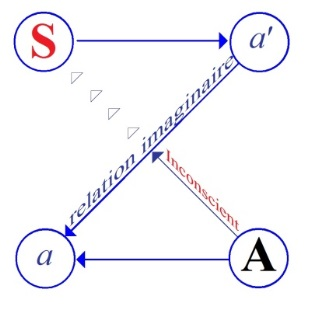

# Leçon 22 | 08 Juin 1955

<!-- source-url: http://staferla.free.fr/S2/S2 LE MOI.docx -->
<!-- seminar: s2 -->
<!-- lesson: 22 -->

<!-- id: s2-22-0001 -->

Qui a lu *Amphitryon* ?

<!-- id: s2-22-0002 -->

À la vérité, l’imitation, dans la période classique, a été poussée fort loin car quand on lit celui de [PLAUTE](http://remacle.org/bloodwolf/comediens/Plaute/amphitryon.htm), on voit ce que celui de [MOLIÈRE](http://www.ebooksgratuits.com/ebooksfrance/moliere-oeuvres_completes_2.pdf) lui doit, et c’est fort bien ainsi, d’ailleurs si on prenait le parti d’imiter plus, on serait probablement plus original.

<!-- id: s2-22-0003 -->

C’est grâce à cela, sans doute, que la pièce de MOLIÈRE a ses vertus inouïes et somme toute, puisqu’en somme nous avançons dans l’année, il faut bien qu’il y ait des moments où on se détend, les dernières classes, celles où on nous faisait des lectures, on avait des professeurs qui nous lisaient KIPLING, en 5ème - ils avaient bien mauvais goût ! - quand il y a tellement d’autres choses plus intéressantes à lire. Qu’importe, on était tout content.

<!-- id: s2-22-0004 -->

Il faudrait quand même que je vous situe le problème, l’histoire d’*Amphitryon*, je me suis laissé aller à y faire allusion…

<!-- id: s2-22-0005 -->

> « *Je me suis laissé aller* »... mes laisser-aller sont bien particuliers !

<!-- id: s2-22-0006 -->

…à en donner une espèce de petite touche dans ma réponse à l’homme de la névrose histrionique.

<!-- id: s2-22-0007 -->

C’est-à-dire que le mythe d’*Amphitryon*, c’est à son propos que j’avais essayé d’introduire, de faire sentir la différence entre le personnage et le rôle : le personnage étant l’ap­parence générale, le rôle concernant en somme ce rapport ambigu, écartelant, qu’il y a entre le personnage et la destinée. Ce qui n’est pas tout à fait pareil. Par exemple, c’est à savoir, comme je l’ai fait remarquer, que peut–être il y a dans ce mythe d’*Amphitryon* quelque mystère.

<!-- id: s2-22-0008 -->

Déjà on s’était aperçu depuis long­temps que de toutes les aventures dont le grand dieu, père des hommes et des dieux, était si libéral, celle-là avait un caractère remarquable, c’est que la femme y était innocente. Même dans PLAUTE ce thème d’innocence est tout à fait cen­tral. Et je dirai que le fait que JUPITER se porte garant à un moment donné, dans toutes les formes qu’a prises cette pièce, de l’innocence d’ALCMÈNE n’est pas du tout indifférent.

<!-- id: s2-22-0009 -->

Bonjour ! Vous venez sans doute écouter ma conférence « *Psychanalyse et cybernétique* » ? Vous allez entendre tout autre chose. Il va s’agir aujourd’hui du *moi*. La question du *moi*, nous l’abordons cette année par un certain biais, c’est-à-dire par un autre bout que celui où nous l’avons prise l’année dernière. L’année dernière, nous l’avions évoquée à propos du phénomène du transfert. Cette année, nous essayons de comprendre par rapport à ce qu’on appelle *l’ordre symbolique*, c’est-à-dire le fait que l’homme vit au milieu d’un *monde symbolique*, ce qui veut dire, ici, dans nos propos, d’un *monde de langage* dans lequel il se passe ce phénomène particulier qui s’appelle *la* *parole*.

<!-- id: s2-22-0010 -->

Nous nous y intéressons beaucoup. Nous considérons que l’analyse se passe justement dans ce milieu-là et, si on ne situe pas bien ce milieu-là par rapport aux autres qui existent aussi : le milieu *réel*, le milieu des *mirages imaginaires,* on tend à faire décliner l’analyse soit vers des interventions - ce qui tout de même est un piège où on ne tombe que rarement - portant sur le *réel*, soit au contraire en mettant sur *l’imaginaire* un accent à notre avis indu.

<!-- id: s2-22-0011 -->

Ceci nous a amené, de fil en aiguille, aujourd’hui à parler de la pièce de MOLIÈRE, *Amphitryon.* Vous allez voir tout de suite pourquoi. Le mythe d’ *Amphitryon*, dont nous partons, est un mythe bien particulier, auquel j’avais la dernière fois fait allusion avec notre visiteur, lui aussi innocent, MORENO.

<!-- id: s2-22-0012 -->

J’y avais fait allusion : j’avais remarqué qu’il y avait quelque chose qu’il pouvait au moins nous évoquer, c’est qu’assurément - « *notre femme »* j’avais dit dans une formule lapidaire - c’est qu’assurément notre femme doit nous tromper de temps en temps avec Dieu. C’est une de ces formules ramassées dont on peut se servir au cours d’une joute, d’une passe d’arme, mais qui mérite quand même d’être un tant soit peu commentée.

<!-- id: s2-22-0013 -->

Déjà vous entrevoyez sûrement, à travers tout ce que je vous ai dit du père, dont la fonction ne peut être si décisive, si prévalente, en toute la théorie analy­tique, que si elle est sûrement à plusieurs plans. Déjà nous avons pu voir, et bien manifeste dans « *L’homme aux loups »,* cette différence :

<!-- id: s2-22-0014 -->

- du *père symbolique*, ce que j’appelle le *Nom du Père*,

<!-- id: s2-22-0015 -->

- du *père imaginaire*, pour autant qu’il est *le rival*

<!-- id: s2-22-0016 -->

- du *père réel* aussi, pour autant qu’il est pourvu, *le pauvre homme*, comme tout le monde, de toutes sortes d’épaisseurs.

<!-- id: s2-22-0017 -->

Eh bien, ceci mérite d’être repris, et peut-être plus encore sur le plan du couple, à savoir ce que c’est que l’époux.

<!-- id: s2-22-0018 -->

À la vérité, de bons esprits, des esprits fermes - il s’en rencontre comme ça, ponctuant l’histoire - se sont déjà un petit peu émus, alertés, sur ce que nous appellerons les rapports du mariage et de l’*amour*. De façon générale, ces choses sont traitées sur le mode badin, sur le mode piquant, sur le mode cynique. Peut-être est-ce là la meilleure façon d’ailleurs d’en toucher pour ce qui est de l’usage pratique dans l’existence. Il y a là-dessus toute une bonne vieille tradition française.

<!-- id: s2-22-0019 -->

Mais on a vu des penseurs et des plus sérieux, on a vu Monsieur PROUDHON un jour s’arrêter sur ces paroles du mariage et de l’amour, et assurément ne pas les prendre à la légère. Quand on le lit…

<!-- id: s2-22-0020 -->

> je vous conseille beaucoup la lecture de PROUDHON, c’était un esprit ferme et quelqu’un dans lequel
>
> on retrouve comme ça, à quelque tournant, ce sûr accent qui est celui des « *Pères de l’Église* »

<!-- id: s2-22-0021 -->

…pour tout dire, c’était quelqu’un qui avait réfléchi, avec un tout petit peu de recul, à la condition humaine, essayant d’approcher ce qui peut bien tout de même conditionner cette chose à la fois tellement plus tenace et plus fragile qu’on ne le pense, à savoir la fidélité.

<!-- id: s2-22-0022 -->

Il arrivait à : « *Qu’est-ce qui peut bien motiver la fidélité en dehors de la parole donnée ?* » Mais la parole donnée est souvent donnée à la légère et il est probable que si elle n’était pas donnée ainsi, elle serait donnée beaucoup plus rarement, ce qui arrêterait sensiblement la marche des choses, bonnes et dignes, de la société humaine.

<!-- id: s2-22-0023 -->

Mais comme nous l’avons également remarqué, ce n’est pas pour cela qu’elle n’est pas donnée et qu’elle ne porte pas tous ses fruits. Quand elle est rompue, non seulement tout le monde s’en alarme, s’en inquiète, s’en indigne, mais en plus toute rupture de la parole porte des conséquences, que nous le voulions ou que nous le voulions pas. Et c’est une des choses que nous apprend précisément l’analyse et l’exploration de cet inconscient où la parole continue de propager ses ondes et ses destinées, selon la façon dont le sujet se comporte. Pour justifier cette fidélité si imprudemment engagée, et que tout le naturel montre assez que non seulement elle est imprudemment engagée, mais qu’à proprement parler, comme tous les esprits sérieux n’en ont jamais douté, elle est intenable.

<!-- id: s2-22-0024 -->

PROUDHON s’est posé quelques questions. Essayons de surmonter ce que nous appellerons l’illusion romantique, à savoir que c’est ça qu’il faut viser, la valeur idéale que prennent l’un pour l’autre les partenaires, autrement dit, le mythe de l’amour parfait est quelque chose qui justifie et soutient toutes les promesses fixées au fondement de l’engagement humain. À la vérité, PROUDHON, qui par toute sa pensé va contre ces illusions romantiques, essaie de fon­der - dans une certaine façon de s’exprimer qui peut passer au premier abord pour obscure, voire pour mystique - essaie de donner son statut, son fondement à cet ordre de la fidélité dans le mariage, et trouve la solution, l’aboutissement dans quelque chose qui, de quelque façon qu’on le prenne, ne peut être recon­nu que pour justement un *pacte symbolique*, c’est-à-dire un pacte qui lie le sujet à l’autre sujet dans un rapport.

<!-- id: s2-22-0025 -->

Par exemple, mettons-nous dans la perspecti­ve de la femme, l’amour que la femme donne à son époux est un amour qui vise non pas l’individu…

<!-- id: s2-22-0026 -->

> si tant est même qu’elle l’idéalise, qu’elle puisse avec le temps maintenir une idéalisation dont on sait qu’assurément c’est bien là le dan­ger de ce qu’on appelle la vie commune, c’est qu’elle n’est pas tenable elle non plus l’*idéalisation*

<!-- id: s2-22-0027 -->

…mais à la vérité, ce que la femme, dans le pacte du mariage vise dans ce conjoint auquel elle a engagé sa parole, c’est un être au-delà de cet être, je ne dis pas particulier, mais individuel, et que l’amour à proprement par­ler sacré, celui qui constitue le lien du mariage, va de « *la femme* » à ce que PROUDHON appelle « *Tous les hommes* ».

<!-- id: s2-22-0028 -->

De même que c’est à travers la femme, toutes les femmes - ainsi s’exprime PROUDHON - que vise la fidélité de l’époux. Ceci peut paraître assurément paradoxal. Mais on voit bien que ce « *tous les*... » dans PROUDHON, n’est pas *alle,* en allemand, ni quelque chose qui d’aucune façon est une quantité. C’est assurément une fonction universelle. C’est *l’hom­me universel*, c’est l’homme en tant que *symbole*, incarnation du partenaire du couple humain essentiel, si on peut s’exprimer ainsi, qui est visé dans cette théo­rie.

<!-- id: s2-22-0029 -->

Assurément, le fait que le lien, le *pacte de la parole* aille au-delà de la relation individuelle et de ses vicissitudes imaginaires, est quelque chose qu’il n’y a pas besoin de chercher bien loin dans l’expérience pour comprendre. Mais pour comprendre le conflit, si l’on peut dire, qui s’établit entre *le* *pacte symbolique* et *les relations imaginaires* qui sont suscitées en abondance, qui prolifèrent spontanément à l’intérieur de toute relation à proprement parler libidinale, à l’intérieur même et d’autant plus qu’intervient ce qui est à proprement parler de l’ordre passionnel, et de l’ordre de la *Verliebtheit,* qu’il y ait là un conflit et un conflit qui sous-tend, on peut dire, la grande majorité des conflits actuels au milieu desquels se poursuit la vicissitude de *la destinée* - il faut bien l’appeler d’une certaine façon - *bourgeoise*, puisqu’elle est faite et elle se fait :

<!-- id: s2-22-0030 -->

- dans la pers­pective d’une réalisation du *moi*,

<!-- id: s2-22-0031 -->

- dans l’aliénation propre au *moi*,

<!-- id: s2-22-0032 -->

- en *l’intro­duction du moi* comme tel dans la psychologie.

<!-- id: s2-22-0033 -->

Il faut un instant s’apercevoir de ce que signifie ce conflit, de ce qui le rend particulièrement aigu dans une perspective humaniste centrée sur le *moi*, il n’y a qu’à observer les phénomènes même pour s’en apercevoir. Mais d’un autre côté, pour en comprendre bien la raison, je crois qu’il faut aller un tout petit peu plus loin.

<!-- id: s2-22-0034 -->

Et ce n’est pas pour rien que nous chercherons la référence dans les données anthropologiques qui sont celles qui ont été mises en valeur particu­lièrement par l’œuvre d’un LÉVI-STRAUSS, quand il nous montre ce quelque chose de particulier dans la structure de l’alliance, sur lequel toute son œuvre met fortement l’accent, qui est que *la femme y est objet*. Radicalement, dans le fondement, le départ de *l’alliance* comme telle, tout ce que l’analyse des *struc­tures élémentaires* qui s’expriment *de la parenté* nous induit à penser ça. C’est un fait d’analyse, d’analyse des faits.

<!-- id: s2-22-0035 -->

Quand nous prenons les structures élé­mentaires…

<!-- id: s2-22-0036 -->

> vous savez que *ces structures élémentaires* sont naturellement les plus compliquées,
>
> et qu’inversement celles que nous appellerons « *complexes »* se présenteront en apparence comme les plus simples

<!-- id: s2-22-0037 -->

…au milieu desquelles nous vivons, et nous nous croyons libres dans notre choix du partenaire, à savoir : dans notre choix conjugal, n’importe qui peut se marier avec n’importe qui.

<!-- id: s2-22-0038 -->

C’est une illu­sion profonde, au milieu de laquelle nous vivons, parce que rien à cet égard n’est inscrit dans les lois. Il est inscrit d’ailleurs même exactement le contraire. Ce qui ne veut pas dire qu’en pratique la sous-jacence de quelque chose de beaucoup plus subtil ne dirige ce choix, introduisant des éléments préférentiels qui pour être voilés, occultés, n’en sont pas moins essentiels.

<!-- id: s2-22-0039 -->

L’intérêt des *struc­tures* dites « *élémentaires »* est qu’elles nous montrent dans toutes ses complica­tions la structure de ses éléments préférentiels. Si on étudie avec soin « *Les structures élémentaires de la parenté »* de LÉVI-STRAUSS \- je sais que vous êtes plutôt encore sur la voie des *résolutions* que celle d’un dépouillement sérieux de cet ouvrage capital - on s’aperçoit pourquoi et comment c’est la seule démonstration véritablement valable de ce que les femmes dans l’introduction de *l’alliance*...

<!-- id: s2-22-0040 -->

> si essentielle, puisque c’est elle qui définit *l’ordre culturel* comme tel, par opposition à *l’ordre naturel*

<!-- id: s2-22-0041 -->

...dans l’introduction de l’alliance dans la nature humaine, la femme se manifeste comme objet, comme *objet d’échange* et précisément au même titre, si on peut dire que *la parole*, pour autant que *la parole* est également originellement *l’objet de l’échange fonda­mental* dans la société.

<!-- id: s2-22-0042 -->

Et quels que soient les biens, les qualités et les statuts qui se transmettent par la voie matrilinéaire, quelles que soient les autorités aussi que peut revêtir *un ordre* dit pour cette raison matriarcal, *l’ordre symbolique*, dans son fonctionnement originel, basal, initial, *est androcentrique*. C’est un fait. C’est un fait, et qui bien entendu, n’a pas manqué, au cours de l’histoire de recevoir toutes sortes de correctifs, mais dont le caractère fondamental, à être négligé, nous empêche de comprendre toutes sortes de choses, et en particulier la position tout à fait particulière, dissymétrique, dans les liens amoureux, et tout spécialement dans sa forme socialisée la plus éminente, à savoir *le lien conjugal*, la position dissymétrique de la femme.

<!-- id: s2-22-0043 -->

Si ces choses étaient vues à leur niveau, et avec quelque rigueur, beaucoup de fantômes qui s’établissent sur d’autres plans, faute de les comprendre sur le plan où ils doivent être compris, seraient du même coup dissipés. Il est certain que dans cette perspective - j’entends le pacte conjugal - dans sa forme pleine, dans sa forme accomplie, et il ne faut pas croire que je dise là quelque chose de vague, il y a quelques références à l’histoire qui sont extrêmement importantes.

<!-- id: s2-22-0044 -->

La notion moderne que nous avons du mariage comme d’un pacte de consente­ment mutuel est assurément une nouveauté introduite par la perspective d’*une religion de salut*, donnant une prévalence à l’âme individuelle, et qui en réalité recouvre et masque la structure initiale donnée dans le caractère primitivement sacré du mariage. Il est tout à fait impossible de comprendre l’histoire de cette institution, qui actuellement se révèle sous sa forme ramassée, si je puis dire, où certains de ses traits sont si solides et si tenaces, que nous ne sommes pas prêts avec les révolutions sociales d’en voir s’effacer la prévalence et la signification.

<!-- id: s2-22-0045 -->

Il faut bien voir qu’au cours de l’histoire il y a eu toujours dans cet ordre deux contrats d’une nature très différente, chez les romains par exemple, le mariage des gens qui ont un nom, et qui en est vraiment un : des patriciens, des nobles \- *innobiles* voulant dire exactement *ceux qui n’ont pas de nom* - le mariage des patriciens a justement ce caractère hautement symbolique, qui lui est assuré d’ailleurs par des cérémonies d’une nature spéciale.

<!-- id: s2-22-0046 -->

Je ne veux pas entrer dans les détails, ni vous faire la description de la *confarreatio* qui montre la différence du mariage essentiel au sens plein de *ceux qui existent au sens symbolique*, et de ceux qui ne sont que ceux de la plèbe, pour lesquels existe aussi une sorte de mariage, lequel n’est fondé essentiellement sur rien du tout dans cette perspective et qui constitue ce que techniquement la société romaine appelle « *le concubinat »*.

<!-- id: s2-22-0047 -->

À remarquer que les institutions du *concubinat*, fondées sur le contrat mutuel, sont exactement celles qui, à partir d’un certain flotte­ment de la société se généralisent et on voit même, dans les derniers temps de l’histoire romaine, le *concubinat* s’établir dans les hautes sphères.

<!-- id: s2-22-0048 -->

À quelles fins ?

<!-- id: s2-22-0049 -->

Afin de maintenir indépendants les statuts sociaux et tout spécialement les statuts quant aux biens des partenaires. Autrement dit, c’est à partir du moment où la femme s’émancipe, où la femme comme telle a droit de posséder, où la femme devient un individu dans la société, que les fonctions du mariage et leur signification s’abrasent et que viennent à se confondre, à converger, les deux fonctions originelles tellement différentes qu’a eues le mariage selon le niveau social de ceux auxquels cette institution s’adresse.

<!-- id: s2-22-0050 -->

Tout ceci pour situer, en quelque sorte, les piquets du décor au milieu duquel notre *question* d’aujourd’hui est soulevée : que fondamentalement la femme, dans *le pacte symbolique du mariage*, soit introduite comme *objet d’échange* entre…

<!-- id: s2-22-0051 -->

> je ne dirai pas les hommes, bien que ce soit les hommes qui en soient effectivement les supports

<!-- id: s2-22-0052 -->

…entre *les lignées*, et entre des *lignées* fondamenta­lement *androcentriques*, justement en ceci que le point de perspective qui per­met de comprendre les diverses *structures élémentaires*, à savoir : comment cir­cule à travers les lignées cet *objet d’échange* que sont les femmes, se révèle à l’expérience prendre leur point pivot dans une perspective androcentrique comme telle, ce qui donne toujours, même quand la structure est secondaire­ment prise dans les ascendances *matrilinéaires ou matriarcales,* le caractère pri­mitif, primordial à une perspective patriarcale.

<!-- id: s2-22-0053 -->

Eh bien, la femme comme telle ne peut se sentir, dans cet *ordre symbolique*, qu’en quelque sorte engagée elle-même comme objet dans quelque chose qui la transcende, dans un *ordre d’échange* où elle est *objet*, et c’est bien ce qui fait le caractère fondamentalement *conflictuel*, je dirai *sans issue*, de sa position, puisque *cet ordre symbolique littéralement la soumet, la transcende*.

<!-- id: s2-22-0054 -->

Et c’est à la lumière de ceci que nous pouvons comprendre la signification du commen­taire proudhonien, c’est-à-dire que ce « *tous les hommes *» dont il s’agit, c’est ici *l’homme universel* qui est à la fois l’homme le plus concret et le plus transcen­dant. Cela ne veut rien dire d’autre que *cette impasse*, infligée par sa fonction particulière dans *l’ordre symbolique, cette impasse* où la femme est en quelque sorte poussée.

<!-- id: s2-22-0055 -->

Il y a pour elle quelque chose d’insurmontable, disons d’inac­ceptable dans le fait qu’elle soit mise en position d’objet dans cet *ordre symbolique* et c’est précisément en tant que cet *ordre symbolique*…

<!-- id: s2-22-0056 -->

> auquel elle est d’autre part, par son humanité toute entière, intégrée, toute entière soumise aussi bien que l’homme

<!-- id: s2-22-0057 -->

…c’est bien parce qu’il y a là quelque chose :

<!-- id: s2-22-0058 -->

- qui pour elle est inaccessible et qui la domine,

<!-- id: s2-22-0059 -->

- qui la met dans un rapport de second degré par rapport à cet *ordre symbolique*, …qu’intervient, que doit forcément intervenir - sauf conflit, bien entendu c’est le conflit qui intervient toujours - cette incar­nation du dieu dans l’homme, ou de l’homme dans le dieu, et qui fait que c’est à quelque chose de transcendant qu’elle se trouve soumise, ou qu’il faut qu’el­le se trouve soumise, pour que sa position soit autre chose que conflictuelle.

<!-- id: s2-22-0060 -->

En d’autres termes, si ça n’est pas, disons *à un dieu ou à l’ordre d’un dieu*, que la femme, dans cette forme fondamentalement primitive du mariage, est donnée et se donne, ce ne peut être - bien entendu c’est ce qui arrive, car nous ne sommes pas, et depuis longtemps, de taille à incarner les dieux - qu’elle est soumise à toutes les formes de *dégradation imaginaire* *de cette relation fonda­mentale*.

<!-- id: s2-22-0061 -->

\[1\] À savoir au premier plan dans les périodes encore dures à ce qu’on appelle « *un maître* », c’était la grande période de la revendication des femmes :

<!-- id: s2-22-0062 -->

- La femme n’est pas un objet de possession !

<!-- id: s2-22-0063 -->

- Comment se fait-il que l’adultère soit puni de façon si dissymétrique ?

<!-- id: s2-22-0064 -->

- Sommes-nous des esclaves ?

<!-- id: s2-22-0065 -->

\[2\] Avec quelques progrès, nous en sommes arrivés au stade du rival, c’est bien entendu un rap­port du mode imaginaire fondamental, dont il ne faut pas croire que notre société, à travers l’émancipation des dites femmes, ait le privilège. Cette rivalité la plus directe entre les hommes et les femmes est éternelle, elle s’est établie dans son style fondamental dans les rapports conjugaux, mettant au premier plan ce qu’on appelle le thème de la lutte sexuelle, dont il n’y a vraiment que quelques psychanalystes allemands pour s’imaginer que c’est une caractéris­tique de notre époque. Quand vous aurez lu TITE-LIVE et que vous saurez à cette époque le bruit que fit dans Rome un formidable procès d’empoisonnement, d’où il ressortait que dans toutes les familles patriciennes il était régulier que les femmes empoisonnent leurs maris, et ils tombaient à la pelle parce que ça durait depuis quelques années. La révolte féminine n’est pas une chose qui date d’hier.

<!-- id: s2-22-0066 -->

\[3\] Et puis, il y a une troisième étape. Du *maître, à l’esclave et au rival*, il n’y a qu’un pas, dialectique, c’est la même chose, les rapports de maître à esclave sont essentiellement réversibles, et qui est en rapport de maître peut aussi bien voir s’établir très vite sa dépendance par rapport à son esclave. Nous en sommes d’ailleurs de nos jours à une nouvelle nuance, grâce à l’introduction des notions psychanalytiques. Le mari est devenu l’enfant, depuis quelque temps on apprend aux femmes à le bien traiter. Dans cette voie, la boucle est bouclée. Nous retournons à l’état de nature. C’est la conception que certains se font de l’intervention propre de la psychanalyse dans ce qu’on appelle *les relations humaines*, et qui, se propageant par toutes sortes de masques médiats, apprend aux uns et aux autres, aux femmes et aux hommes, comment se comporter pour qu’il y ait la paix à la maison.

<!-- id: s2-22-0067 -->

La véritable solution là-dedans c’est que la femme joue le rôle de *mère*, et l’homme le rôle d’*enfant*. Nous trouverons là des rap­ports essentiellement harmonieux. C’est une solution de cet élément conflic­tuel. Nous sommes peut-être ici pour suggérer que ce n’est peut-être pas non plus pour ça que l’analyse a donné son inspiration à *la propagande des human relations.*

<!-- id: s2-22-0068 -->

Ceci étant dit, nous n’avons pas tout de même à nous surprendre que le mythe antique si riche, si d’ailleurs polyvalent, si énigmatique - on peut don­ner mille interprétations au mythe d’*Amphitryon -* se soit aperçu qu’en somme, pour que la situation soit tenable, il faut toujours que la position soit triangulaire, même dans le couple, et que pour qu’il tienne sur le plan humain, il faut effectivement qu’un dieu soit là.

<!-- id: s2-22-0069 -->

C’est ça, je pense, le sens profond du mythe d’*Amphitryon*. Et il peut peut-être nous donner quelque vacillation. Mais je vous assure que c’est bien tout de même à cet *homme universel*, à cet homme voilé, dont tout idéal n’est que le substitut idolâtrique, que peut aller l’amour, ce fameux « *amour génital* » dont nous faisons nos dimanches et mille gorges-chaudes, mais dont il suffit de savoir en quelle impasse il engage tous les auteurs.

<!-- id: s2-22-0070 -->

Je vous prie de relire ce qu’a écrit là-dessus M. BALINT, pour vous aper­cevoir que justement, dans la mesure où les dits *auteurs* sont un peu rigoureux, expérimentaux, ils aboutissent strictement à la conclusion que ce fameux *amour génital* n’est absolument rien du tout.

<!-- id: s2-22-0071 -->

Car pour M. BALINT que je prends comme exemple - il n’est pas le seul à avoir montré ce discernement - l’amour génital « *dernière nouvelle »*, celle d’une expérience assez rigoureuse dans l’analyse, se révèle absolument inassimilable à une unité, celle-ci est conçue comme étant le fruit d’une maturation instinctuelle. Il aboutit strictement à la conclusion sui­vante \- que je vous rappelle comme conclusion des articles de BALINT - que dans la mesure où il est lié justement à une position duelle, à savoir que le tiers, la paro­le, le dieu, tout ce dont je vous parle, est éliminé, on aboutit à ceci : que pour constituer l’amour génital il faut montrer, en deux morceaux :

<!-- id: s2-22-0072 -->

- *primo*, *l’acte géni­tal* qui comme chacun sait ne dure pas longtemps, c’est bon mais ça ne dure pas, et ça n’établit absolument rien du tout,

<!-- id: s2-22-0073 -->

- et *secundo*, de l’autre côté, *la ten­dresse*, dont on reconnaît que ses origines sont prégénitales.

<!-- id: s2-22-0074 -->

Telle est la conclu­sion à laquelle, dans la perspective *duelle* de la maturation instinctuelle, abou­tissent les esprits les plus honnêtes, dans la perspective d’une certaine dialec­tique psychanalytique, qui est celle qui s’impose à soi-même, dans toute la mesure où on reste dans la relation duelle pour y établir la norme des rapports humains.

<!-- id: s2-22-0075 -->

Eh bien *c’est là toute l’interprétation*. Je crois qu’il fallait que j’y insiste un petit peu, pour rappeler quelques vérités premières :

<!-- id: s2-22-0076 -->

- même pour ceux à qui elles sont familières, ce n’est jamais inutile,

<!-- id: s2-22-0077 -->

- pour ceux qui viennent pour la premiè­re fois, ça peut peut-être les surprendre dans leur foi naïve aux *merveilles de la psychanalyse*, mais il n’est pas mauvais qu’on leur apprenne que nous avons ici quelque discernement par rapport à ce qu’on peut attendre des fruits harmo­nieux d’une situation qui n’est pas harmonieuse en tant que telle, qui est fon­damentalement conflictuelle.

<!-- id: s2-22-0078 -->

C’est la destinée humaine, et ce n’est qu’à partir de là qu’on peut s’avancer dans d’autres choses que dans des mythes. Eh bien, après vous avoir rappelé ce plan, cette question fondamentale, qui est posée par le *mythe d’Amphitryon*, nous allons voir de quoi il retourne dans [PLAUTE](http://www.prima-elementa.fr/Auteurs/Plaute-amph.html) et dans [MOLIÈRE](http://www.site-moliere.com/pieces/amphi101.htm). Je puis vous dire, c’est un fait, c’est comme ça - c’est comme pour l’instaura­tion de l’androcentrisme de l’ordre symbolique - c’est un fait que c’est PLAUTE qui a introduit SOSIE. Il n’y avait pas de SOSIE dans le mythe d’*Amphitryon*, les mythes grecs ne sont pas *moïques*, mais par contre les *moi* existent et il y a un endroit où les *moi* ont tout naturellement la parole, c’est *la comédie*.

<!-- id: s2-22-0079 -->

C’est pour ça que c’est essentiel que ce soit un poète comique, ce qui ne veut pas dire du tout un poète drôle, je pense que certains d’entre vous ont déjà réfléchi sur ce point, qui introduise cette nouveauté essentielle, désormais inséparable du mythe d’*Amphitryon* : SOSIE. SOSIE, c’est le *moi*.

<!-- id: s2-22-0080 -->

C’est à savoir comment se comporte l’homme dans cette grande scène par où il participe d’une façon, je dois dire singulière, au banquet des dieux, celle qui l’excise toujours un peu de sa propre jouissance, comment un *moi* comme ça, un brave petit *moi* de petit bonhomme comme vous et moi, se comporte dans la vie de tous les jours, et si ce côté irrésistiblement comique qui est au fond, après tout, ce qui n’a pas cessé de nourrir le théâtre depuis, il s’agit toujours en fin de compte de ça, de moi, de toi, et de l’*autre*. Eh bien, comment se comporte le *moi* en question ?

<!-- id: s2-22-0081 -->

C’est véritablement exemplaire, que la première fois que le *moi* surgit au niveau de ce drame essentiel, il se rencontre soi-même à la porte, sous la forme justement de ce qui est devenu pour l’éternité, *ad aeternum,* SOSIE, l’autre *moi*. Je vais vous faire quelques petits bouts de lecture. Il faut quand même avoir ça dans l’oreille.

<!-- id: s2-22-0082 -->

La *première fois* que le *moi* apparaît, il rencontre le *moi*.

<!-- id: s2-22-0083 -->

Et qui, moi ? Moi, qui te fous dehors ! Et c’est de cela qu’il s’agit. C’est en cela que *la comédie d’Amphitryon* est véritablement exemplaire, et il suffit de piquer de ci, de là pour s’apercevoir combien les formes même du style et du langage ont montré que ceux qui ont introduit ce personnage fondamental savaient de quoi il s’agissait.

<!-- id: s2-22-0084 -->

Cette pièce de PLAUTE, par exemple, qui est la première fois que monte sur la scène ce personnage essentiel, SOSIE, se passe sous la forme d’un dialogue dans la nuit, dont vous pourrez apprécier - je vous y renvoie, je ne vais pas vous lire tout le texte latin - le caractère tout à fait saisissant, et c’est bien le cas de le dire, dans un usage du mot qu’il faut mettre entre guillemets, le carac­tère « *symbolique* ».

<!-- id: s2-22-0085 -->

Ces personnages jouent selon une tradition, si souvent si mal soutenue dans le jeu des acteurs, de l’*a parte*, qui fait que deux personnages sont ensemble, sur la scène, et se tiennent des propos dont chacun vaut par le carac­tère d’écho ou de *quiproquo*, ce qui est la même chose, qu’il prend dans les pro­pos que l’autre tient indépendamment. C’est quelque chose qui, faute d’un jeu suffisant, nous paraît maintenant bien artificiel. Mais ce n’est pas du tout par hasard que c’est essentiel à la comédie classique. Là, elle est portée à son suprê­me degré.

<!-- id: s2-22-0086 -->

Et je ne pouvais manquer d’y penser l’autre jour en assistant au théâtre chinois, à ce qui est porté au suprême degré dans un côté manifesté dans le geste, qui fait que ces gens parlent chinois, et vous n’en êtes pas moins saisis par tout ce qu’ils vous montrent. C’est en effet une grande tradition de ce théâtre tout à fait spécialement spectaculaire au point d’en être acrobatique, de voir comment, pendant plus d’un quart d’heure, on a l’impression que ça dure des heures, deux personnages peuvent se déplacer sur la même scène en nous donnant vraiment le sentiment d’être dans deux espaces différents, c’est-à-dire chacun dans une obscurité totale, et avec quelle adresse et quelles ressources et multiplicités ingénieuses, ils peuvent passer littéralement les uns au travers des autres.

<!-- id: s2-22-0087 -->

Car c’est cela qui nous est démontré, *que l’espace imaginaire est là, devant nous*. Ces êtres s’atteignent à chaque instant *par un geste* qui ne saurait manquer l’adversaire et néanmoins l’évite, parce qu’il s’est trouvé qu’il est déjà ailleurs. Et cette démonstration vraiment sensationnelle, qui suggère à la fois le caractère *miraginaire* de l’espace, imaginaire comme tel, et le fait que c’est là la caractéristique du *plan symbolique*, qu’il n’y a jamais de rencontre qui soit un choc, est quelque chose qui est bien destiné à vous ouvrir l’esprit sur une certaine dimension démonstrative du drame classique, du drame comme tel.

<!-- id: s2-22-0088 -->

C’est bien en effet quelque chose comme ceci qui se produit toujours, et spécialement la première fois qu’intervient sur la scène classique, SOSIE. SOSIE arrive et rencontre SOSIE. Le *dialogue* qui s’établit entre eux mérite d’être pris.

<!-- id: s2-22-0089 -->

- *Qui va là ?*

<!-- id: s2-22-0090 -->

- *Moi*

<!-- id: s2-22-0091 -->

- *Qui, moi ?*

<!-- id: s2-22-0092 -->

- *Moi.*

<!-- id: s2-22-0093 -->

- *Courage Sosie !*

<!-- id: s2-22-0094 -->

se dit-il à lui-même, car celui-là, bien entendu c’est le vrai, et il n’est pas tranquille.

<!-- id: s2-22-0095 -->

- *Quel est ton sort* ?

<!-- id: s2-22-0096 -->

- *D’être homme et de parler.*

<!-- id: s2-22-0097 -->

Voilà quelqu’un qui n’avait pas été aux séminaires, mais qui a la marque de fabrique.

<!-- id: s2-22-0098 -->

- *Es-tu maître ou valet* ?

<!-- id: s2-22-0099 -->

- *Comme il me prend envie.*

<!-- id: s2-22-0100 -->

Ça, c’est tiré directement de PLAUTE, c’est une très jolie définition du *moi* :

<!-- id: s2-22-0101 -->

> « *Es-tu maître ou valet ? - Comme il me prend envie* ».

<!-- id: s2-22-0102 -->

- *Où s’adressent tes pas* ?

<!-- id: s2-22-0103 -->

- *Où j’ai dessein d’aller.*

<!-- id: s2-22-0104 -->

Et puis, ça continue :

<!-- id: s2-22-0105 -->

- *Ah ! Ceci me déplaît,*

<!-- id: s2-22-0106 -->

- *J’en ai l’âme ravie.*

<!-- id: s2-22-0107 -->

…dit l’imbécile, qui s’attend naturellement à recevoir une tripotée et fait déjà le faraud.

<!-- id: s2-22-0108 -->

Il faut retrouver ce dialogue essentiel aux différentes étapes de la comédie. Elle n’est jamais décevante, et ce dont il s’agit, nous allons tâcher maintenant de la mettre en valeur. C’est la même chose en latin que ce que MOLIÈRE a calqué en français, à savoir la position fondamentale du *moi* en face de *son* *image* et de *son reflet*, que cette inversibilité immédiate de la position de maître et de valet.

<!-- id: s2-22-0109 -->

Je vous signale que c’est dans ce texte que nous pouvons trouver une confir­mation de la signification stricte qui est celle que j’ai donnée, au moins à cer­tains d’entre vous, au terme *« fides »,* comme étant équivalent du terme « *parole don­née » *: *Tuae fidei credo, je crois en ta parole*.

<!-- id: s2-22-0110 -->

Il s’agit exactement de cela au moment où MERCURE commence à diminuer ses coups, et il s’agit qu’on s’ex­plique, et MERCURE prend l’engagement, quoique l’autre dise, de ne pas lui retomber dessus. C’est à ce moment là que SOSIE dit : « *je crois en ta parole* ». *Fides,* en latin ne veut pas dire autre chose que la parole donnée. Ceci a une valeur rétrospective, par rapport à nos propos d’ici \[sic\].

<!-- id: s2-22-0111 -->

L’*innobilis* de tout à l’heure, *l’homme sans nom*, est également un terme que vous trouverez dans le texte latin. En somme, de quoi s’agit-il ? Vous savez combien c’est un des thèmes les plus désopilants de l’entrée de SOSIE. Car dans la pièce de MOLIÈRE il vient tout à fait au premier plan, je dirai même qu’il ne s’agit que de lui, c’est lui qui ouvre la scène, tout de suite après le dialogue de MERCURE qui prépare la nuit de JUPITER.

<!-- id: s2-22-0112 -->

SOSIE arrive avec une lanterne. Tâchons de voir la signification psychologique de ce drame, et faisons selon une tradition, qui est justement celle de la pratique que nous tendons à critiquer, de voir les éléments du drame comme incarnation des personnages intérieurs.

<!-- id: s2-22-0113 -->

Le SOSIE arrive, brave petit Sosie, avec la victoire de son maître. Il vient se faire entendre d’ALCMÈNE, comme la scène désopilante dont je vous parle, où il se prépare à en raconter. Il pose la lanterne et il dit : « Voilà ALCMÈNE ». Et il commence à lui raconter *les prouesses de son maître*. En somme :

<!-- id: s2-22-0114 -->

- c’est l’hom­me qui s’imagine que l’objet de son désir, la paix de sa jouissance, dépend de ses mérites,

<!-- id: s2-22-0115 -->

- c’est l’homme du surmoi,

<!-- id: s2-22-0116 -->

- c’est l’homme qui éternellement veut s’élever à la dignité des idéaux du père, du maître, de tout ce que vous voudrez, et qu’il croit qu’avec ça il va atteindre ce qu’il cherche, à savoir l’objet de son désir.

<!-- id: s2-22-0117 -->

S’il y a quelque chose qui caractérise cette pièce, c’est que jamais SOSIE ne parviendra à se faire entendre d’ALCMÈNE. Et la raison pour laquelle il ne par­viendra jamais à se faire entendre d’ALCMÈNE est inscrite dans le texte : c’est parce que la nature même du *moi*, son rapport fondamental au monde est de trouver toujours en face de lui son reflet, et son reflet qui comme tel le dépos­sède de tout ce qu’il peut songer à atteindre lui-même, en tant qu’il est *moi*, il rencontre cette sorte *d’ombre, de reflet, d’image* qui est à la fois de rival, de maître, d’esclave à l’occasion si l’on veut, mais assurément quelque chose qui le sépare essentiellement de ce dont il s’agit, à savoir de la reconnaissance du désir comme tel.

<!-- id: s2-22-0118 -->

Ici, se produit l’intervention de quoi ? Du maître réel, de celui qui est pour SOSIE son répondant, ses mérites, qui est ce pour quoi il est de la maison. Le texte latin là-dessus a des formules extrêmement saisissantes, au cours de ce dia­logue impayable, au cours duquel MERCURE, à force de coups, force SOSIE à aban­donner sa propre identité, à renoncer à son propre nom, comme GALILÉE dira : « *Et quand même la terre tourne !* » il y revient sans cesse :

<!-- id: s2-22-0119 -->

« *Pourtant je suis SOSIE* ».

<!-- id: s2-22-0120 -->

Et il a cette merveilleuse parole :

<!-- id: s2-22-0121 -->

« *Par Pollux, tu me alionabis non quant, tu ne me feras jamais autre, qui noster sum.* »

<!-- id: s2-22-0122 -->

Vous voyez là l’aliénation est là, jusque dans le texte latin, et l’intervention du *noster* : « *Car enfin je suis ici si je suis nôtre* ». L’appui du *moi*, ou le dernier appui du *moi* au niveau de PLAUTE, nous le retrouvons qu’à peine, quoiqu’indiqué, dans MOLIÈRE. C’est qu’il se rattache à tout cet ordre, à toute cette appartenance, au fait que son maître est un grand général. Et *on voit bien combien le moi est à l’abri du nous*.

<!-- id: s2-22-0123 -->

Quand l’*Amphitryon*, le maître, va arriver, qu’est-ce que nous voyons ? Celui qui va *rétablir l’ordre*, celui qui va *se faire entendre* ? Le remarquable de cette pièce est justement ceci qu’AMPHITRYON sera aussi flou et aussi dupé, aussi égaré que SOSIE lui-même.

<!-- id: s2-22-0124 -->

Mais en tout cas une chose à laquelle il ne comprend absolument rien, c’est tout ce que lui raconte SOSIE, c’est à savoir qu’il a ren­contré un autre *moi*. Dans le texte latin, ceci est tout à fait saisissant. Dans le texte de MOLIÈRE, l’accent vaut la peine d’en être retrouvé.

<!-- id: s2-22-0125 -->

AMPHITRYON - *Comment donc, à quelle patience faut-il que je m’exhorte ! Mais enfin n’es-tu pas entré dans la maison* ?

<!-- id: s2-22-0126 -->

SOSIE - *Bon, entré. Hé ! De quelle sorte ?* \[...\]

<!-- id: s2-22-0127 -->

AMPHITRYON - *Comment donc ?*

<!-- id: s2-22-0128 -->

SOSIE - *Avec un bâton dont mon dos* \[...\]

<!-- id: s2-22-0129 -->

AMPHITRYON *- Et qui ?*

<!-- id: s2-22-0130 -->

SOSIE - *Moi.*

<!-- id: s2-22-0131 -->

AMPHITRYON - *Toi, te battre ?*

<!-- id: s2-22-0132 -->

SOSIE

<!-- id: s2-22-0133 -->

*Oui, moi.* *Non pas le Moi d’ici mais le moi du logis qui frappe comme quatre* \[...\] *J’en ai reçu les témoignages,* *Et ce diable de Moi m’a rossé comme il faut* \[...\] *Moi, vous dis-je* \[...\] *Ce Moi qui m’a roué de coups.*

<!-- id: s2-22-0134 -->

C’est précisément quand *intervient* AMPHITRYON, dont vous allez voir tout de même pour nous quelle est *la valeur scénante*, c’est qu’AMPHITRYON ne fait qu’ajouter aux coups que reçoit le malheureux SOSIE. En d’autres termes, AMPHITRYON, lui, analyse son *transfert négatif*. Il lui apprend ce qu’un *moi* doit être. Il le nourrit, lui aussi, il le nourrit de coups. Il lui explique comment il faut qu’il réintègre en son *moi* ses propriétés du *moi*.

<!-- id: s2-22-0135 -->

Les scènes sont piquantes et inénarrables. Je pourrais multiplier les choix et les exemples montrant cette contradiction qui intervient chez le sujet entre - toujours la même chose - le *plan symbolique* et le *plan réel*.

<!-- id: s2-22-0136 -->

C’est qu’effectivement SOSIE est venu à douter d’être *moi*. Et quand est-il venu à en douter ? Quand MERCURE lui raconte quelque chose de *très spécial * : ce qu’il a fait au moment où personne ne le voyait. Éton­né de ce que MERCURE lui révèle sur son propre comportement, SOSIE :

<!-- id: s2-22-0137 -->

« *Et quoi, je commence à douter tout de bon. »*

<!-- id: s2-22-0138 -->

Il commence déjà à céder un morceau. Dans le latin, c’est fort remarquable également :

<!-- id: s2-22-0139 -->

« *Comme je reconnais ma propre image, que j’ai souvent vue dans le miroir, in spéculum* »

<!-- id: s2-22-0140 -->

Dit-il, et il fait toute l’énumération des caractéristiques symboliques, historiques, comme dans MOLIÈRE, bien entendu. Mais quand même la contradiction éclate. Elle est aussi sur *le plan imaginaire*, c’est-à-dire :

<!-- id: s2-22-0141 -->

« *Equidem certo idem qui semper fuit, je suis quand même le même qui a tou­jours été.* »

<!-- id: s2-22-0142 -->

Et là, appel aux éléments imaginaires de familiarité avec les lieux :

<!-- id: s2-22-0143 -->

« *J’ai quand même déjà vu cette maison, c’est bien la même...* »

<!-- id: s2-22-0144 -->

Tout le recours qui est celui où se déplace le plan de l’analyse, de la certitude intuitive liée à quelque chose dont nous avons aussi à l’occasion le caractère trompeur lié au caractère de « *déjà vu* », de déjà éprouvé, qui est quelque chose qui est tellement susceptible de discorder que bien des fois, ce sont des conflits, de ce *déjà vu, déjà reconnu, déjà éprouvé*, avec les certitudes qui se dégagent de la remémoration et de l’histoire, que commencent à s’introduire ces phénomènes de la dépersonnalisation où certains verront obligatoirement des signes prémoni­toires de la désintégration.

<!-- id: s2-22-0145 -->

Alors qu’il n’est nullement nécessaire d’être pré­disposé à *la psychose* pour avoir mille fois éprouvé des sentiments semblables, que c’est justement dans la relation du *symbolique* à *l’imaginaire* qu’en tien­nent le ressort et la signification.

<!-- id: s2-22-0146 -->

Eh bien, voici au niveau de la rencontre d’AMPHITRYON et de SOSIE, au moment où SOSIE affirme son désarroi, sa dépossession et au moment où AMPHITRYON lui fait, je dirai, une psychothérapie de soutien…

<!-- id: s2-22-0147 -->

Nous n’allons quand même pas mettre AMPHITRYON dans la position du psychanalyste, nous nous contenterons simplement de dire qu’il peut quand même en être le sym­bole, pour autant que le psychanalyste, dans une certaine posture, celle du schéma que je vous exposai la dernière fois, a bien, par rapport à son objet - si tant est que l’objet de son amour, sa princesse lointaine, ce soit la psychanaly­se - a bien la position fondamentalement exilée, disons, pour être poli, qui est celle d’AMPHITRYON devant sa propre porte.

<!-- id: s2-22-0148 -->

Ce qui est grave, ce n’est pas cette sorte de cocuage spirituel, qu’il en soit la victime, c’est que la victime, d’ailleurs, en est son patient, c’est-à-dire que tout un chacun - et Dieu sait que j’en ai eu là-dessus des témoignages - croit avoir atteint le fin fonds de l’expérience analy­tique pour avoir eu, au cours de son analyse, quelques *fantasmes*, *Verliebtheit d’énamouration* pour la personne qui, chez son analyste, lui ouvre la porte, ce qui n’est pas un témoignage qu’il est rare d’entendre, encore qu’ici je fasse allusion à quelques cas très particuliers.

<!-- id: s2-22-0149 -->

Le sujet sera dans sa rencontre avec la pré­tendue expérience analytique fondamentalement dépossédé et floué. Autrement dit, pour prendre le schéma que j’avais laissé en plan, suspendu, la dernière fois, ce dont il s’agit c’est que le sujet, par rapport au *mur du langa­ge*, par rapport à ce *moi*, voit ce *moi* au-delà de lui même, parmi tous les autres objets, et il s’agit de savoir quelle est la conception que l’analyste se fait de son rôle.

<!-- id: s2-22-0150 -->

La conception que l’analyste se fait de son rôle est essentiellement ceci : que *la parole* - pour autant que dans le dialogue commun, dans le monde du langage établi, dans le monde du malentendu communément reçu - *la parole* va d’un sujet qui ne sait pas ce qu’il dit, car à tout instant le seul fait que nous parlons prouve que nous ne le savons pas, c’est bien là le fondement même de l’ana­lyse, que nous en disons mille fois plus qu’il n’en faut pour faire couper la tête.

<!-- id: s2-22-0151 -->

Ce que nous disons, nous ne le savons pas, mais nous l’adressons à quelqu’un. Et c’est dans la mesure où nous l’adressons à quelqu’un, quelqu’un qui est *miraginaire*, pourvu d’un *moi*, et à ce *moi* comme tel nous avons l’illusion, en rai­son de la propagation de la parole en ligne droite dont je vous parlai la derniè­re fois, que cette parole vient de quelque part qui est là, où nous situons, de façon privilégiée, notre propre *moi* qui à juste titre est séparé, sur ce schéma, de tous les autres *moi*.

<!-- id: s2-22-0152 -->

<!-- id: s2-22-0153 -->

Car, comme le fait quelque part remarquer GIRAUDOUX dans son AMPHITRYON à lui, au moment où JUPITER essaie de savoir de MERCURE à peu près ce que sont les hommes, il lui dit entre autre que :

<!-- id: s2-22-0154 -->

« *L’homme est ce personnage qui se deman­de tout le temps s’il existe *»

<!-- id: s2-22-0155 -->

Il a bien raison, d’ailleurs, et il n’a qu’un tort c’est de se répondre oui pour lui-même. Tout au moins de cela il en est bien sûr et en effet la position privilégiée du *moi* par rapport à tous les autres, le seul dont l’homme soit véritablement bien sûr qu’il existe quand il s’interroge - et Dieu sait s’il s’interroge - fondamentalement il est là, tout seul.

<!-- id: s2-22-0156 -->

Et c’est parce que c’est à ce niveau-là, *au niveau du moi de l’autre*, qu’est reçue la parole, que le sujet entretient la douce illusion que ce *moi* est ici dans cette position unique. Comme je vous l’ai indiqué et expliqué : tout est là. À savoir si l’analyste conçoit qu’il faut *répondre de là*, qu’il doit entériner cette fonction du *moi*, qui est précisément celle par laquelle le sujet est dépossédé de lui-même, s’il doit simplement lui dire, rentre dans ton *moi*, ou plutôt, fais-y rentrer tout ce que tu en laisses échapper, reconstitue toi *ces abatis que tu a numérotés* quand tu étais en présence de l’autre SOSIE, maintenant, réintègre les, mange les, et comme maintenant la théorie introjective, rassemble, reconstitue-toi dans la plénitude de ces pulsions et de ces instincts qui sont ceux que tu méconnais et que tu ignores.

<!-- id: s2-22-0157 -->

En d’autres termes, par toute une série d’interventions, quelles qu’elles soient, qui sont les interventions du type duel, l’introduction des caté­gories du monde, de la perspective objectale de l’analyste dans la reconstitution du sujet. Ou bien si, au contraire, ce dont il s’agit c’est que le sujet apprenne *ce qui parle de là* : S.

<!-- id: s2-22-0158 -->

Et pour savoir *ce qui parle de là*, s’aperçoive du paradoxe, du caractère fondamentalement *imaginaire* de ce qui se passe, de ce qui se dit à par­tir de là, S’ quand est évoqué, comme tel, l’Autre absolu : A, qui est toujours là le transcendant qu’il y a dans le langage chaque fois qu’une parole tente d’être émise.

<!-- id: s2-22-0159 -->

<!-- id: s2-22-0160 -->

Il y a un cas tout à fait concret qui est celui de *l’obsédé*. Ce qu’il y a chez l’obsédé c’est au maximum cette incidence du *moi* en tant qu’elle est mortelle. Ce qu’il y a derrière l’obsédé, c’est…

<!-- id: s2-22-0161 -->

> non pas, comme vous le disent certains *théo­riciens*, le danger de la folie, c’est-à-dire le symbole déchaîné comme tel, le sujet schizoïde, le sujet qui parle en quelque sorte au niveau de ses pulsions, l’aliéna­tion fondamentale du *moi*,
>
> ce n’est pas du tout cela, dont il s’agit

<!-- id: s2-22-0162 -->

…c’est le *moi* en tant qu’il porte en lui-même cette dépossession, c’est la mort imaginaire.

<!-- id: s2-22-0163 -->

Si *l’obsédé se mortifie*, c’est parce qu’en tant qu’il s’attache plus qu’un autre névrosé à son *moi*, il est justement dans cette mesure même plus aliéné à lui-même qu’un autre. Et pourquoi ? C’est le *pourquoi* qui est important, le fait est tout à fait évident. *L’obsédé* dans tout ce qu’il vous raconte est toujours un autre, quelques sentiments qu’il vous apporte, c’est toujours ceux d’un autre que lui-même. Cette objectalisation de lui-même ça n’est pas, comme on le dit, par un penchant ou un don plus introspectif, plus analytique qu’un autre, c’est dans la mesure même où il évite son propre *désir*, où tout désir dans lequel \- fût-ce même apparemment - il s’engage, il le présentera typiquement comme le désir de cet autre lui-même qu’est son *moi*.

<!-- id: s2-22-0164 -->

Et donc n’est-ce pas abonder dans son sens que de penser à renforcer son *moi*, que de penser à lui permettre ses diverses pulsions, et *son oralité*, et *son analité*, et *son stade oral tardif* et *son stade anal primaire*, de lui apprendre à reconnaître ce qu’il veut, c’est-à-dire, ce qu’on sait bien entendu depuis le départ, *la destruction de l’Autre*, et comment cela ne serait-il pas *la destruction de l’Autre*, puisque c’est ce dont il s’agit, puis­qu’il s’agit de la destruction de lui-même, ce qui est exactement la même chose ?

<!-- id: s2-22-0165 -->

Avant toutes choses, avant de lui permettre de reconnaître toute cette fonda­mentale agressivité qu’il disperse sur le monde, qu’il réfracte sur le monde, et qui pour lui littéralement structure toutes les relations objectales, il faut lui faire comprendre d’abord et avant tout pourquoi il en est ainsi, à savoir quelle est *la fonction de ce rapport mortel avec lui-même* qui est le sien, qui fait que d’avan­ce, dès que quelque chose sera un sentiment qui est le sien, il commencera par l’annuler comme tel, par dire qu’il n’y tient pas, que ça n’est pas pour lui telle­ment de chose.

<!-- id: s2-22-0166 -->

Vous pouvez exactement noter, par un rapport inverse, la valabilité, l’accent de doute, *si l’obsédé vous dit qu’il ne tient pas* à quelque chose ou à quelqu’un, vous pouvez penser que c’est quelque chose qui lui tient à cœur, et inversement s’il s’exprime avec la plus grande froideur, c’est là où ses intérêts sont engagés au maximum. Qu’est-ce à dire, c’est que la première chose que nous avons à faire vis-à-vis de l’obsédé :

<!-- id: s2-22-0167 -->

- ce n’est pas de lui faire se reconnaître lui-même dans cette image décomposée qu’il nous présente de lui-même sous la forme plus ou moins épa­nouie, dégradée, relâchée de ses pulsions agressives,

<!-- id: s2-22-0168 -->

- ce n’est pas dans ce rapport duel avec lui-même qu’est la clé de la cure.

<!-- id: s2-22-0169 -->

Bien entendu, c’est essentiel ! Mais si cette interprétation de son rapport mortel à lui-même peut avoir une portée, c’est dans la mesure où vous lui faites comprendre la fonction. Ce n’est pas à lui-même ni réellement qu’il est mort. Il est mort pour qui ? Pour celui qui est son maître. Nous venons de l’expliquer, de le dire. Mais, par rapport à quoi ? Par rapport à l’objet de sa jouissance. Mais d’autre part, s’il est mort, ou s’il se présente comme tel, il n’est donc plus là, c’est-à-dire que c’est un autre que lui qui a un maître et lui–même inversement a un autre maître.

<!-- id: s2-22-0170 -->

C’est pour ça qu’il est toujours ailleurs et qu’en tant que désirant il se dédouble indéfiniment en une série de personnages dont les FAIRBAIRN, par exemple, ou personnages de cette lignée, font la découverte émerveillée, à savoir qu’il y a beaucoup plus que les trois personnages dont nous parle FREUD, à l’*intérieur* de la psychologie du sujet : *id, superego, ou ego.* Il y en a toujours au moins *deux autres*, qui apparais­sent dans les coins, vous trouverez ça dans FAIRBAIRN, dont je vous conseille la lecture.

<!-- id: s2-22-0171 -->

Mais assurément on peut encore en trouver d’autres, comme dans une glace avec tain, si vous regardez attentivement, il n’y a pas seulement *une image*, mais *une seconde qui se dédouble*, et si le tain est assez épais vous vous aper­cevrez qu’il y en a une dizaine, une vingtaine, une infinité. C’est exactement la même chose qui se passe, dans la mesure où le sujet *s’annule, se mortifie* devant son maître, il est encore *un autre*, puisqu’il est toujours là, *un autre* avec un autre maître et un autre esclave etc.

<!-- id: s2-22-0172 -->

De même, pour l’objet de son désir, pour y consentir, il introduit en lui le danger essentiel de son rapport avec l’autre, l’ob­jet de son désir, comme je l’ai introduit dans le commentaire de *L’Homme aux rats* et aussi bien comme j’ai tiré de \[...\] et rapproché du roman de GŒTHE lui-même, le dédoublement automatique de *l’objet du désir* et de *l’objet d’amour* dans les rapports de *l’obsédé,* est quelque chose qui est absolument fondamen­tal.

<!-- id: s2-22-0173 -->

Il faut en effet que ce à quoi il tient soit toujours autre, car s’il le reconnais­sait vraiment pour tel, il serait guéri. En d’autres termes, contrairement à ce qu’on nous dit dans une certaine théorie analytique, ce que le sujet doit viser, ce qui est l’essentiel du progrès de l’analyse…

<!-- id: s2-22-0174 -->

> ça n’est pas par la voie du maintien - comme on nous l’affirme - d’une espèce d’auto-observation, qui serait fondée sur ce fameux *splitting* du *dédou­blemen*t de l’*ego* qui serait fondamental dans la situation analytique,
>
> ceci ne fait que perpétuer la relation fondamentalement ambiguë du *moi*

<!-- id: s2-22-0175 -->

…ce qu’il doit apprendre dans l’analyse, ça n’est certes pas par la voie d’une *observation*, qui sera toujours *une observation d’observation* et ainsi de suite, que ça doit pro­gresser, il doit apprendre que dans cette parole qui manque toujours son but S’, pour autant que dans l’analyse il a à s’apercevoir qu’elle se passe quelque part au-delà mais qu’elle ne rencontre plus rien, sinon *l’Autre absolu*, qu’il ne sait pas reconnaître.

<!-- id: s2-22-0176 -->

C’est progressivement qu’il doit réintégrer en lui cette parole, c’est-à-dire parler enfin à *l’Autre absolu* de là où il est, de là où son *moi* doit se réaliser. En réintégrant vers lui toute la décomposition *paranoïde* de ses pulsions au milieu desquelles ça n’est pas assez dire qu’il ne se reconnaît pas, c’est dire que fondamentalement en tant que *moi* il les méconnaît.

<!-- id: s2-22-0177 -->

En d’autres termes, ce que SOSIE a à apprendre, ça n’est pas qu’il n’a jamais rencontré son SOSIE, c’est tout à fait vrai qu’il l’a rencontré, il a à apprendre qu’il est AMPHITRYON. Et que c’est justement parce qu’il est AMPHITRYON, à savoir le monsieur plein de gloire, à savoir un monsieur qui ne comprend rien à rien, qui croit qu’il suffit d’être un général victorieux pour faire l’amour avec sa femme, alors que chacun sait que ça n’a jamais suffi à personne, bien loin de là !

<!-- id: s2-22-0178 -->

- Il a à s’apercevoir que c’est ce qu’il est, à s’aper­cevoir que c’est parce qu’il est Amphitryon, parce qu’il ne comprend rien à ce qu’on désire, parce qu’il est fondamentalement aliéné, qu’il ne rencontre jamais l’objet de ses désirs.

<!-- id: s2-22-0179 -->

- Il a à s’apercevoir pourquoi *il tient* fondamentalement à ce *moi*, et comment ce *moi* c’est, en tant que telle, son aliénation fondamentale.

<!-- id: s2-22-0180 -->

- Il a à s’apercevoir de cette gémellité profonde, qui est aussi une des perspectives essentielles de l’AMPHITRYON, et aussi sur deux plans : sur le plan de ses sosies, de ses mirages, qui se mirent l’un dans l’autre,

<!-- id: s2-22-0181 -->

> et aussi du fait, à l’étage supérieur, au niveau du plan des dieux, de la naissance simultanée par le ventre d’ALCMÈNE, qui est beaucoup plus présente - nous avons acquis avec le temps une pudeur qui nous empêche d’aller loin dans les choses - qui est beaucoup plus présen­te dans la pièce de PLAUTE, ce qui fait qu’ALCMÈNE engendre d’un double amour aussi un double fruit.

<!-- id: s2-22-0182 -->

Enfin, je crois qu’à travers ce mythe, cette démonstration dramatique, sinon psychodramatique, que représente pour nous l’*Amphitryon,* j’ai voulu simple­ment vous faire sentir aujourd’hui combien il *inscrit* dans un registre, une pen­sée traditionnelle, les problèmes mêmes, vivants, que nous nous posons, au cours de l’analyse, et qui sont ceux qui offrent toujours à notre pratique deux versants :

<!-- id: s2-22-0183 -->

celui d’une illusion fondamentalement psychologiste, qui existe d’une part, et dont je vous conseille d’aller chercher les témoignages dans les écrits même des auteurs qui la soutiennent. Dans ce FAIRBAIRN dont je vous parlai l’autre jour, vous avez un très joli exemple. Il ne s’agit pas d’un obsédé, la chose n’est pas tellement compliquée, il s’agit du cas d’une femme qui a une anomalie génitale réelle, probablement - encore que par une singulière timi­dité on n’ait jamais tout à fait tiré la chose au clair - elle a un tout petit vagin, et qu’on a respecté : elle est vierge, et probablement qu’à ce tout petit vagin ne correspond aucun utérus.

<!-- id: s2-22-0184 -->

La chose reste à peu près certaine, sans avoir été tout à fait confirmée. Mais assurément l’anomalie, au moins au niveau du caractère sexuel secondaire, est éclatante de l’avis de certains spécialistes qui ont été jus­qu’à dire qu’il s’agissait là de pseudo-hermaphrodisme et de quelqu’un qui dans la réalité est un homme.

<!-- id: s2-22-0185 -->

Tel est le sujet que FAIRBAIRN prend en analyse.

<!-- id: s2-22-0186 -->

Et je dirai que l’espèce de grandeur avec laquelle est développée toute la suite du cas est quelque chose qui vaut bien d’être relevé. Il constate - il nous le raconte avec une tranquillité parfaite - que ce sujet qui est somme toute une personna­lité d’un intérêt, d’une qualité évidente, qui se trouve être institutrice, a appris au cours de sa vie qu’il y avait évidemment quelque chose qui ne tournait pas rond, que sa situation était tout de même bien particulière par rapport à *la réa­lité des sexes*.

<!-- id: s2-22-0187 -->

Elle l’a appris d’autant mieux que je crois qu’ils sont une dizai­ne d’enfants dans la famille, il y a chez elle six ou sept filles dans le même cas, alors on s’y connaît, on sait que les femmes sont drôlement bicornées, ce n’est pas l’obscurantisme qui joue là son rôle. Elle se dit qu’évidemment c’est spé­cial et elle s’en réjouit, elle se dit : « *comme ça, il y a beaucoup de tracas* *qui ne seront pas les miens* », et elle se fait bravement institutrice, et elle se met sagement à instruire les enfants.

<!-- id: s2-22-0188 -->

Et elle se met tout doucement à s’apercevoir que, bien loin d’être déchargée des servitudes, et que la nature lui donne toute jouissan­ce pour une action purement spirituelle, il se produit de drôles de choses. Ça ne va jamais, ça n’est jamais assez bien. Elle se sent affreusement tyrannisée par ses scrupules, elle veut faire mieux. Et quand elle s’est bien épuisée, bien esquintée au cours du deuxième trimestre, elle fait une crise de dépression. Cela va très loin.

<!-- id: s2-22-0189 -->

Que va lui apprendre cet analyste ? Il pense une chose, il pense avant tout à lui réintégrer ses pulsions, c’est-à-dire à lui faire s’apercevoir de quelque chose, de ce qu’on appelle *un complexe phallique,* et « *pommé* » ! Oui, c’est vrai ! On découvre qu’il y a une relation entre

<!-- id: s2-22-0190 -->

- le fait qu’elle *affect,* comme on dit en anglais, *certains hommes*, que l’approche de *certains hommes* lui fait quelque chose

<!-- id: s2-22-0191 -->

- et l’établissement des crises de dépression.

<!-- id: s2-22-0192 -->

L’analyste en déduit, en découvre qu’elle voudrait leur faire du mal. Et pendant des mois il lui apprend à réintégrer cette pulsion agressive. Et il se dit, pendant tout ce temps-là : « S*acré nom de Dieu d’un petit bonhomme ! Comme elle prend bien ça !* » Ce qu’il attend, c’est qu’elle fasse ce qu’il appelle des sentiments de culpabilité. Eh bien, vous m’en croirez si vous voulez, à force, il y arrive ! À la fin des fins, *le progrès de l’analyse* consiste et est enregistré à la date où nous est rapportée l’observation dans les termes suivants : elle est enfin venue à son sentiment de culpabilité, c’est-à-dire que maintenant c’est bien simple, elle ne peut plus approcher un homme sans déclencher des crises de remords qui, cette fois-ci alors, ont un corps.

<!-- id: s2-22-0193 -->

En d’autres termes, conformément au schéma dont l’autre jour je vous ai gra­tifié, qui était de l’auteur lui-même, on s’aperçoit que l’analyste lui a donné :

<!-- id: s2-22-0194 -->

- premièrement un *moi*, à savoir lui a appris ce qu’elle voulait vraiment : démolir les hommes,

<!-- id: s2-22-0195 -->

- et deuxièmement, lui a donné également un *surmoi*, à savoir que tout ceci est fort méchant, et qu’en plus c’est tout à fait interdit de les appro­cher, ces hommes. C’est ce que l’auteur appelle « *le stade paranoïde de l’analyse* ».

<!-- id: s2-22-0196 -->

Je le crois en effet assez volontiers, lui ayant appris où sont ses pulsions, eh bien, mon Dieu, il y arrive fort bien, c’est-à-dire que maintenant elle les voit se promener un peu partout.

<!-- id: s2-22-0197 -->

- Est-ce que ceci est la voie tout à fait correcte, et n’y en aurait-il pas eu une autre ?

<!-- id: s2-22-0198 -->

- En d’autres termes, faut-il situer dans ce rapport duel réel ce dont il s’agit vraiment à propos des crises de dépression du sujet ?

<!-- id: s2-22-0199 -->

- Ce qu’il y a entre elle et les hommes est-il un rapport réel ?

<!-- id: s2-22-0200 -->

- Est-il un rapport essentiellement et comme tel *libidinal*, avec tout ce qu’il comporte dans le schéma de *la régres­sion* ?

<!-- id: s2-22-0201 -->

Il semble là que l’auteur ait la chose à la portée de la main. L’anomalie réelle du sujet devrait le mettre sur la voie, à savoir que les images des hommes avec les vertus dépressives pour ce sujet sont liées à ce que les hommes c’est elle-même. C’est sa propre *image*. C’est sa propre image, en tant qu’elle en est *dépossédée*, qu’elle en est *aliénée*, qu’elle lui est ravie, qui exerce sur elle cette action décomposante qui est à proprement parler déconcertante, si vous voulez aussi, au sens plein et originel du mot, à proprement parler le fondement de la position dépressive.

<!-- id: s2-22-0202 -->

C’est dans la mesure justement où c’est *sa propre image*, son image narcissique, son *moi*, que ces quelques hommes qu’elle approche, que se produit cet effet et que ce dont il s’agit en effet, le biais où il est question pour elle de trouver sa voie, est précisément en ceci : de savoir qui elle est vrai­ment ?

<!-- id: s2-22-0203 -->

Et la situation certes sera plus difficile pour elle que pour quelqu’un d’autre, puisqu’elle est *précisément* dans une position ambiguë. Mais si cette position ambiguë est \[...\] illustrée dans la tératologie, c’est quelque chose qui devrait être clair pour un analyste s’il se souvenait que toute espèce d’identifi­cation narcissique est comme telle ambiguë.

<!-- id: s2-22-0204 -->

Bien loin de là, loin de s’apercevoir qu’il n’y a pas de meilleure illustration de la fonction du *pénisneid* chez un sujet que chez ce sujet-là, à savoir que c’est pour autant qu’il y a une identification avec *l’homme imaginaire*, que le pénis prend sa valeur ici pleinement symbolique, qu’il y a question et *problème*.

<!-- id: s2-22-0205 -->

Bien loin de là, il semble y avoir un argument pour dire qu’on aurait tout à fait tort de croire que le *Pénisneid* soit quelque chose qui soit tout à fait naturel chez les femmes. Bien entendu ! Qui lui a dit que c’est naturel ? Bien entendu, que c’est *symbolique*. C’est pour autant que la femme est précisément dans un *ordre symbolique* à perspective *androcentrique* que le pénis prend cette valeur, qui d’ailleurs n’est pas le pénis mais *le phallus*, c’est-à-dire en tant que *quelque chose d’un usage symbolique possible*. Il est *d’un usage symbolique possible* simplement parce qu’il se voit, qu’il est érigé.

<!-- id: s2-22-0206 -->

Il y a *usage symbolique* qui n’est justement pas possible, c’est ce qui ne se voit pas, ce qui est caché. Chez cette femme, c’est tout à fait bien évident que la fonction du *Pénisneid* joue ici à plein, puisqu’elle ne sait pas qui elle est, si elle est homme ou femme. Et le *Pénisneid* va d’autant mieux qu’elle est en quelque sorte tout à fait enga­gée dans cette question de sa signification symbolique. C’est ça qui est le nœud du problème.

<!-- id: s2-22-0207 -->

Et toute la perspective de l’observation montre assez combien cette anomalie particulière, liée à cette position à l’endroit du *réel,* est en quelque sorte doublée aussi de quelque chose d’autre, qui est que dans sa famil­le et ce n’est peut-être pas sans relation avec cette apparition tératologique, le côté masculin est tout à fait effacé, le côté patrilinéaire est un personnage com­plètement absent. Et c’est le père de sa mère qui a joué le rôle de personnage supérieur. Et c’est par rapport à lui que le triangle s’établit d’une façon typique, et par rapport à lui que se pose la question de sa - ou non - phallisation.

<!-- id: s2-22-0208 -->

Tout ceci est complètement éludé dans la théorie et la conduite du traitement au nom du fait que, d’abord, ce dont il s’agit est de faire reconnaître au sujet ses pulsions, et tout spécialement, bien entendu, parce qu’à la vérité c’est les seules qu’on rencontre et comme telles pleinement, les pulsions, qu’on appelle dans notre langage élégant, *prégénitales*.

<!-- id: s2-22-0209 -->

Grâce à cette investigation solide du prégé­nital, nous arrivons à une issue, ou tout au moins une phase que le thérapeute est amené à qualifié de paranoïde. Nous n’avons pas à en être étonnés, prendre l’*imaginaire* pour du *réel* est ce qui caractérise *la paranoïa* et à méconnaître comme tel le registre fondamental *imaginaire*, nous ferons en effet aboutir le sujet à reconnaître toutes ces pulsions dites partielles dans le *réel*, c’est-à-dire à charger toutes ses relations avec les hommes, qui étaient jusque là narcissiques - ce qui n’était déjà pas tout simple - pour être à proprement parler inter-agressives, ce qui les complique singulièrement.

<!-- id: s2-22-0210 -->

Le fait de passer dans l’intervalle par *une culpabilité* qu’on a eu une peine infinie à faire surgir, ne nous laisse peut-être pas tout à fait bien augurer des détours supplémentaires nécessaires pour revenir dans une voie plus pacifiante. Je n’ai pris que cet exemple pour dire que les lignes théoriques que j’essaie ici d’illustrer par des formes exemplaires \[...\].

<!-- id: s2-22-0211 -->

Vous n’avez pas à chercher bien loin pour trouver la sanction d’une erreur de \[...\]. Voilà une observation tout à fait *exemplaire*. Pour ce qui concerne bien entendu la cure des *obsédés*, qui est tel­lement au centre de nos préoccupations analytiques, ceci est encore plus écla­tant et ne peut pas manquer assurément de paraître comme un des ressorts secrets des échecs de la plupart de ces cures.

<!-- id: s2-22-0212 -->

Si l’on part de l’idée que derrière *la névrose obsessionnelle* il y a *une psychose* latente, il n’est pas étonnant qu’on arrive à des dissociations larvées, à lui substituer des dépressions périodiques, voire une orientation mentale hypochondriaque, ou mieux à l’établissement de la structure d’une névrose obsessionnelle.

<!-- id: s2-22-0213 -->

Mais peut-être n’est-ce pas là non plus ce qu’on peut chercher et obtenir au mieux d’une cure de la névrose obses­sionnelle. Bref, si distants - voire peut-être peu élevés, panoramiques - que soient les pro­pos que nous poursuivons ici, vous devez toujours vous rappeler qu’ils ont dans la technique, et pas seulement dans la compréhension des cas, les inci­dences les plus précises.
