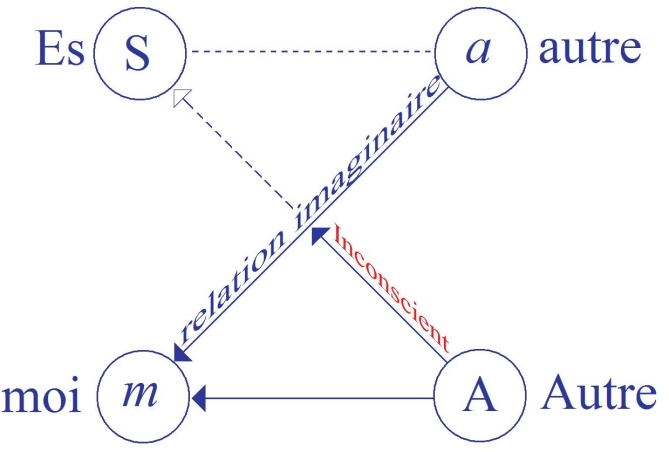
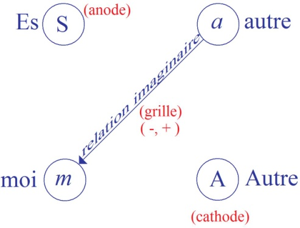

# Leçon 25 | 29 Juin 1955

<!-- source-url: http://staferla.free.fr/S2/S2 LE MOI.docx -->
<!-- seminar: s2 -->
<!-- lesson: 25 -->

<!-- id: s2-25-0001 -->

Ce que je vais vous dire là, d’abord, est en préambule, en marge du sémi­naire. Ce ne peut être qu’une parenthèse, car nous ne sommes pas là pour faire de l’exégèse. Ça se rattache quand même à notre question. Dans cette *pénul­tième réunion*, je vous ai interrogé avec un succès mélangé, c’est une séance qui a porté des effets divers dans les esprits de ceux qui y ont participé. J’espère que maintenant vous avez compris quels avaient été pour moi le sens et la fonction, c’était une façon d’accorder mon instrument à ce que j’avais à vous dire la dernière fois. J’espère que ça n’a pas seulement servi à moi, mais à vous.

<!-- id: s2-25-0002 -->

Mais enfin j’ai retenu - sans m’y arrêter sur l’instant, parce que du train où allaient les choses, si je vous avais suivi sur ce terrain, ça nous aurait donné encore plus *le sentiment d’aberration *: qu’est-ce que vous avez voulu me dire, quand vous m’avez dit *que le verbum du premier verset de Saint Jean*, c’était le דבר \[davar\] hébreu ? Sur quoi vous fondez-vous pour m’avoir dit ça ? *Ce n’est pas un traquenard*. J’y ai repensé il y a une heure, et je ne suis pas plus ferré que vous là-dessus, et même *sûrement moins* ! Alors ne vous troublez pas, et dites-moi pourquoi vous m’avez dit que le *verbum* était le דבר \[davar\] hébreu. Qu’est-ce qui vous permet de le dire, étant donné que l’*Évangile de Saint Jean* était écrit en grec ?

<!-- id: s2-25-0003 -->

M. X - Eh bien, d’abord, je dirai qu’il y a un fait *a priori* qui nous engage à penser cela.

<!-- id: s2-25-0004 -->

LACAN - Aujourd’hui, on boucle certains petits comptes. Et je vais vous dire tout à l’heure ce que nous comptons faire.

<!-- id: s2-25-0005 -->

M. X - D’abord le sens. Je ne dois pas expliquer le sens de cela ?

<!-- id: s2-25-0006 -->

LACAN - J’espère bien que si.

<!-- id: s2-25-0007 -->

M. X - Ce n’est donc pas ça la question que vous posez. Je dirai d’abord ceci...

<!-- id: s2-25-0008 -->

LACAN

<!-- id: s2-25-0009 -->

D’abord la question philologique, celle qui vous permet de dire - s’il est bien certain que Saint JEAN a écrit en grec, il n’est pas du tout obligé qu’il pensât en grec, et que son λόγος \[logos\] fût le λόγος babylonien, par exemple - vous dites qu’il pensait le דבר \[davar\] hébreu. Dites-moi pourquoi ? Parce que ça n’est tout de même pas la seule façon de dire, en hébreu.

<!-- id: s2-25-0010 -->

M. X - De dire ?

<!-- id: s2-25-0011 -->

LACAN - De dire le quelque chose justement qui est le sens du דבר \[davar\].

<!-- id: s2-25-0012 -->

M. X

<!-- id: s2-25-0013 -->

Λόγος \[logos\], oui évidemment, ce n’est pas le seul motif. Pour résumer la question je dirai ceci : on ne trouve dans Saint JEAN aucun concept vraiment platonicien. C’est un fait, je pourrais vous le démontrer. Ce qui est intéressant, c’est qu’en général λόγος *...*

<!-- id: s2-25-0014 -->

LACAN

<!-- id: s2-25-0015 -->

Qui est-ce qui vous parle de concepts platoniciens ? La dernière fois, au moment où je m’arrêtai sur ce *verbum* en somme, pour vous dire que le *verbum* c’était un mot qui avait été choisi par Saint JÉRÔME, si mes souvenirs sont bons, c’est lui qui a fait la traduction…

<!-- id: s2-25-0016 -->

M. X - Elle existait déjà.

<!-- id: s2-25-0017 -->

LACAN

<!-- id: s2-25-0018 -->

Peu importe. *Verbum,* c’est-à-dire le mot que j’ai rapproché, dans cette occasion, de l’usage latin, qui nous est assez indiqué par l’usage qu’en fait, par exemple, Saint AUGUSTIN dans le *De significatione* que nous avons commen­té l’année dernière. En somme, je faisais une simple allusion à une sorte d’axiomatique, préalable même au *fiat,* même au *fiat* de la *Genèse*. Je posais une question. Je n’ai pas dit que cela résolvait. Mais vous devez mieux sentir maintenant toutes les implications que ça a, après ma dernière conférence. C’était à propos de cela que je suggérai que le *verbum* était peut-être quelque chose d’antérieur à toute parole, même à la première parole de la création, *in principio erat verbum.* Et là-dessus, vous me dites, comme une objection, que c’est le דבר \[davar\] hébreu.

<!-- id: s2-25-0019 -->

M. X

<!-- id: s2-25-0020 -->

C’est que vous avez dit : « *Au commencement était le langage* », vous avez traduit comme ça. À quoi LECLAIRE a dit : « *pas le langage, mais la parole*... ».

<!-- id: s2-25-0021 -->

LACAN - C’est de cela qu’il s’agissait.

<!-- id: s2-25-0022 -->

M. X - Et j’ai dit, oui c’est très nettement « *la parole* », et pas « *le langage* ».

<!-- id: s2-25-0023 -->

LACAN

<!-- id: s2-25-0024 -->

D’où tirez-vous le דבר \[davar\] ? Il y a deux questions :

<!-- id: s2-25-0025 -->

- d’abord, que ce soit le דבר \[davar\] qu’il y a sous le λόγος \[logos\] de Saint JEAN,

<!-- id: s2-25-0026 -->

- et ensuite que le דבר \[davar\] veuille dire plus « *la parole* » qu’autre chose. Alors traitez ces deux questions. Pourquoi pensez-vous que c’est le דבר \[davar\] ?

<!-- id: s2-25-0027 -->

M. X - Pour deux motifs. Le premier est que c’est une citation implicite très nette du début de la Genèse.

<!-- id: s2-25-0028 -->

LACAN

<!-- id: s2-25-0029 -->

Au début de la *Genèse*, nous avons, au *verset 3* : *fiat lux,* précisé­ment : *Va’omer.* Ce n’est pas du tout דבר \[davar\]*, va’omer.* C’est même exactement le contraire. C’est là que je veux vous amener.

<!-- id: s2-25-0030 -->

\[καὶ εἶπεν ὁ Θεός· γενηθήτω ϕῶς· καὶ ἐγένετο ϕῶς. *Dixit que Deus fiat lux et facta est lux*

<!-- id: s2-25-0031 -->

וַיֹּאמֶר אֱלֹהִים, יְהִי אוֹר; וַיְהִי-אוֹר.\]

<!-- id: s2-25-0032 -->

M. X - Ah non ! Ce n’est pas exactement le contraire !

<!-- id: s2-25-0033 -->

LACAN - Expliquez-moi en quoi.

<!-- id: s2-25-0034 -->

M. X

<!-- id: s2-25-0035 -->

Il y a une tradition rabbinique, qui a un peu substantivé ce 3ème *verset* de la *Genèse* en quelque chose comme une entité, si vous voulez, médiatrice entre le Créateur et la création et ce qui serait la parole, comme il y a la sagesse. Mais ce qui est certain, c’est que dans toute la tradition biblique…

<!-- id: s2-25-0036 -->

> j’ex­plique d’abord un peu le sens, ça va mieux pour montrer pourquoi j’interprè­te en ce sens-là Saint JEAN aussi

<!-- id: s2-25-0037 -->

…manque absolument le concept de *ratio,* de λόγος au sens grec.

<!-- id: s2-25-0038 -->

C’est ce que BULTMANN a montré par des analyses très pro­fondes, que par exemple le concept d’univers n’existe pas dans la tradition biblique. Ils n’ont pas ce sens de monde déterminé où toutes les choses se pro­duisent par un certain déterminisme chez eux, manque absolument ce concept de loi fixe, déterminée, par laquelle tout s’enchaîne et ce qui est vraiment le sens finalement du concept grec de λόγος c’est la rationalité du monde, le monde qui est donc considéré comme un tout dans lequel tout se produit d’une façon enchaînée, logique. Ce qui fait aussi la philosophie aristotélicien­ne, finalement, les *quatre causalités*, qui doivent expliquer comment même le mouvement se réduit à un ordre statique déterminé. Par exemple, les hébreux disent toujours - au lieu *d’univers* - « *la somme des choses* » ou « *le ciel et la terre* » et tout ça, mais ils n’ont jamais ce concept rationnel. Ils ne pensent pas dans des concepts statiques, des concepts essentialistes. C’est une chose qui est absente de leur façon de penser.

<!-- id: s2-25-0039 -->

LACAN

<!-- id: s2-25-0040 -->

Est-ce que vous croyez, après avoir entendu ma conférence, que je vise, quand je parle d’un *ordre symbolique* tout à fait radical, ce jeu des places, cette conjecture initiale, ce jeu conjectural primordial qui est tout à fait d’avant le déterminisme, d’avant toute espèce de notion de l’univers comme rationalisé, qui est, si je puis dire, le rationnel avant sa conjonction avec le réel, est-ce que vous croyez que c’est ça que je vise ? Est-ce que ce sont les quatre causalités, le principe de raison suffisante et tout le bataclan ?

<!-- id: s2-25-0041 -->

M. X - Mais si vous dites « *Au début était le langage* », c’est comme une projec­tion rétrospective de la rationalité actuelle.

<!-- id: s2-25-0042 -->

LACAN - Il ne s’agit pas que je le dise. Ce n’est pas moi, c’est Saint JEAN.

<!-- id: s2-25-0043 -->

M. X - Non, il ne le dit pas.

<!-- id: s2-25-0044 -->

LACAN

<!-- id: s2-25-0045 -->

Amenez-vous, Père BERNAERT, parce qu’on est en train d’essayer de démonter la formation philologique de \[...\] Que les Sémites n’aient pas fonda­mentalement d’inspiration à la notion d’un univers aussi fermé que l’« O », celui, si vous voulez, dont le bâton nous donne la préparation, dont ARISTOTE nous donne parfaitement le système fermé : d’accord !

<!-- id: s2-25-0046 -->

M. X

<!-- id: s2-25-0047 -->

C’est essentiellement *en mouvement* et sans loi *rationnelle*. Par exemple, ce qui arrive dans la nature, c’est la parole de Dieu qui se répercute dans la nature. Cela démontre, si vous voulez, peut-on dire, que c’est un uni­vers animiste, n’importe ! C’est un univers essentiellement pas déterminé, pas rationnel, un univers historique, si vous voulez, où tout se produit par des ini­tiatives personnelles.

<!-- id: s2-25-0048 -->

LACAN- Oui. Mais d’abord ça ne veut pas dire qu’il n’est pas rationnel, du moment que c’est *la parole* qui le module.

<!-- id: s2-25-0049 -->

M. X - Je dirais : pas essentialiste.

<!-- id: s2-25-0050 -->

LACAN - Là où je veux en venir, c’est ceci... Et vous, Père BERNAERT ?

<!-- id: s2-25-0051 -->

M. BERNAERT - J’ai fait de l’*Écriture Sainte,* comme tout le monde.

<!-- id: s2-25-0052 -->

LACAN

<!-- id: s2-25-0053 -->

L’autre jour M. X m’a sorti un arrière fond du λόγος de Saint JEAN, permettant le דבר \[davar\] hébreu. C’est ce qu’on vous enseigne ?

<!-- id: s2-25-0054 -->

M. X \[à M. Bernaert\] - C’est ce qui est démontré par exemple par des études très poussées, de BULTMANN, etc.

<!-- id: s2-25-0055 -->

LACAN - Est–ce que vous savez ce qu’a fait un certain BURNETT ?

<!-- id: s2-25-0056 -->

M. X - Oui.

<!-- id: s2-25-0057 -->

LACAN

<!-- id: s2-25-0058 -->

Il a étudié ce premier verset de Saint JEAN avec beaucoup d’atten­tion. C’est un travail dont je vous recommande la lecture. Je n’ai pas pu le retrouver depuis que vous m’avez fait cette objection. Mais son souvenir est très précis, sa conclusion, tout au moins. Il dit que derrière le λόγος de Saint JEAN c’est le *memmra araméen* qu’il faut supposer.

<!-- id: s2-25-0059 -->

M. X - C’est la même chose que דבר \[davar\] en hébreu, c’est le דבר \[davar\] un peu *substantifié*, rabbinique, comme je vous ai dit.

<!-- id: s2-25-0060 -->

LACAN - Qu’est-ce que vous voulez dire, en disant « *rabbinique »* ? La ques­tion n’est pas là.

<!-- id: s2-25-0061 -->

M. X

<!-- id: s2-25-0062 -->

C’est-à-dire que plusieurs choses ont conduit à ce premier verset :

<!-- id: s2-25-0063 -->

- vous avez certainement la tradition de la *Création*, de la *Genèse*,

<!-- id: s2-25-0064 -->

- puis la tendan­ce de la pensée rabbinique à l’expliquer un peu…

<!-- id: s2-25-0065 -->

LACAN

<!-- id: s2-25-0066 -->

En tout cas, je vais vous dire une chose. C’est que le *memmra* est beaucoup plus près du *va’omer -* c’est la même racine - le *memmra* est beaucoup plus proche du *va’omer* du premier verset de la *Genèse*. Écoutez, je vais vous dire ce que j’ai regardé, il y a une heure, c’est dans le *Genesius* sur ce que veut dire le דבר \[davar\]. C’est beaucoup plus près de *duxit, locutus est* au sens de l’im­pératif tout à fait incarné. Et même ça va jusqu’à la traduction *insidiatus est.*

<!-- id: s2-25-0067 -->

M. X - Que voulez-vous dire par là ?

<!-- id: s2-25-0068 -->

LACAN

<!-- id: s2-25-0069 -->

C’est dans le *Genesius *: c’est-à-dire *engager*, *séduire*. Enfin ça implique précisément tout ce qu’il y a dans cette perspective, précisément, de gauchi, de vicié, de dévié, de détourné, de corrompu essentiellement dans tout ce qui est une parole, au moment où elle descend dans l’archi–temporel. En tout cas, דבר \[davar\] est attesté dans \[...\] et c’est toujours quelque chose à la fois de très limité, de très précis et comme tel, en fin de compte : *insidiatus est,* ce qu’il y a de *leurrant*, de *trompeur*.

<!-- id: s2-25-0070 -->

M. X - Mais non ! Pas toujours !

<!-- id: s2-25-0071 -->

LACAN - C’est la parole dans son caractère le plus caduque, par rapport à *memmra.*

<!-- id: s2-25-0072 -->

M. X

<!-- id: s2-25-0073 -->

Non. Par exemple, le tonnerre est la parole de Dieu, et pas dans le sens caduque, ça c’est très net. Non, Non ! C’est un sens dérivé. Mais le premier sens n’est pas celui-là.

<!-- id: s2-25-0074 -->

LACAN - Mais ça vous montre vers quoi il dérive.

<!-- id: s2-25-0075 -->

M. X - Il peut dériver, évidemment, il peut dériver…

<!-- id: s2-25-0076 -->

LACAN - C’est nettement attesté.

<!-- id: s2-25-0077 -->

M. X - Que ça existe aussi ? Mais bien sûr ! Mais ça ne prouve rien, que ça existe aussi !

<!-- id: s2-25-0078 -->

LACAN

<!-- id: s2-25-0079 -->

Mais ça laisse tout de même pendante la question de savoir... Rien ne nous permet d’identifier ce דבר \[davar\] avec l’emploi, mettons, en effet probléma­tique, puisque on s’y attache assez, du λόγος dans le texte grec de Saint JEAN.

<!-- id: s2-25-0080 -->

M. X

<!-- id: s2-25-0081 -->

En tout cas une chose est certaine, *qu’il faut exclure*, car il est totale­ment absent partout ailleurs, le sens platonicien de λόγος.

<!-- id: s2-25-0082 -->

LACAN - Mais ça n’est pas ça que je visai.

<!-- id: s2-25-0083 -->

M. X - Il ne faut pas traduire par *langage*, de toute façon.

<!-- id: s2-25-0084 -->

LACAN

<!-- id: s2-25-0085 -->

Ce λόγος dont il s’agit, et je trouve là qu’il ne faut pas négliger l’in­flexion que donne le *verbum* latin, nous pouvons en faire tout à fait autre chose que *la raison des choses*, mais précisément *ce jeu de l’absence et de la présence* est complètement primordial en ce sens qu’il donne déjà son cadre même au *fiat.* Car enfin, *le « fiat »se fait sur un fond de non fait, d’absolument antérieur à tout fiat.* En d’autres termes, je crois qu’il n’est pas impensable que le même *fiat* ne soit une chose seconde, même la parole, même la parole créatrice la plus originelle.

<!-- id: s2-25-0086 -->

M. X

<!-- id: s2-25-0087 -->

Oui. Mais je dirai qu’on se place là au début de l’ordre historique temporel, mais on ne va pas, comme vous insinuez, au-delà. C’est une chose *absente*.

<!-- id: s2-25-0088 -->

LACAN

<!-- id: s2-25-0089 -->

Chaque fois qu’on dit, dans le principe, *in principio,* on est sur quelque chose de complètement énigmatique quand il s’agit de la parole. Cela aussi je vous ai indiqué que cet *in principio* en effet a un caractère de mirage, qu’il ne peut pas s’agir de cette même rétroaction imaginaire qui est indiquée dans le distique de Daniel VON CHEPKO, que je vous ai cité à ce propos : « *Qui était avant que Dieu fit même tout cela ? Moi ! *». Ce qui est bien indiquer, en effet, le caractère de mirage.

<!-- id: s2-25-0090 -->

M. X - Je ne comprends pas très bien ce que vous voulez dire maintenant.

<!-- id: s2-25-0091 -->

LACAN

<!-- id: s2-25-0092 -->

C’est-à-dire qu’une fois que les choses sont structurées dans une certaine intuition imaginaire, elles paraissent être là depuis toujours. Elles ne peuvent même pas être ressenties autrement. Mais c’est un mirage, cela, bien sûr ! C’est ça votre objection que de me dire qu’il y a une sorte de rétroaction de ce monde constitué dans une sorte de modèle ou d’archétype qui le consti­tuerait. Mais ce n’est pas du tout forcément l’archétype. C’est exclu, ici, cette rétroaction dans un archétype qui serait une condensation.

<!-- id: s2-25-0093 -->

M. X - C’est tout à fait exclu.

<!-- id: s2-25-0094 -->

LACAN

<!-- id: s2-25-0095 -->

Tout à fait exclu dans ce que je vous enseigne. Et si le λόγος platonicien ressemble à quelque chose, c’est aux *idées éternelles*. Mais ce dont je vous parlai la dernière fois, en vous parlant d’un certain *langage*, ce n’était pas ça !

<!-- id: s2-25-0096 -->

M. X - Moi, j’ai toujours compris *langage* par opposition à *parole*, comme cette condensation, cette essence de tout ce qu’il y a.

<!-- id: s2-25-0097 -->

LACAN - C’est un autre sens du mot *langage* que j’essayai de vous faire entendre.

<!-- id: s2-25-0098 -->

M. X - Ah !

<!-- id: s2-25-0099 -->

LACAN

<!-- id: s2-25-0100 -->

C’est justement ce quelque chose qui peut se réduire à cette suc­cession *d’absences* et de *présences*, ou plutôt à cette perpétuelle simultanéité de *la présence sur fond d’absence*, de *l’absence constituée par le fait qu’une pré­sence peut exister*. Car en fin de compte il n’y a pas d’*absence* dans le *réel*. Il n’y a d’*absence* que si vous suggérez qu’il peut là y avoir une présence là où il n’y en a pas, c’est-à-dire quelque chose complètement en dehors de l’ordre du *réel*. C’est ça qui était visé. Dans l’« *In principio* » il peut y avoir le mot en tant qu’il crée cette opposition, ce contraste, il n’y a plus de « *non* », de contradiction, qui là ne soit trop particularisée par rapport à cette contradiction originelle du 0 et du 1.

<!-- id: s2-25-0101 -->

M. X - En quoi s’oppose-t-il à la parole, alors ?

<!-- id: s2-25-0102 -->

LACAN

<!-- id: s2-25-0103 -->

C’est qu’il lui fournit, si on peut dire, *quelque chose* qui est une sorte de *condition radicale*. Est-ce que vous voyez ce que je veux dire ?

<!-- id: s2-25-0104 -->

M. X

<!-- id: s2-25-0105 -->

Oui, mais je trouve que dans cette condition vous pouvez aussi bien dire *parole* que *langage*. C’est tellement au-delà de cette opposition !

<!-- id: s2-25-0106 -->

LACAN

<!-- id: s2-25-0107 -->

C’est exact ! Mais c’est là ce que je veux vous indiquer, c’est que dans la *hammer,* ou le *hommer,* ou le *memmra…* C’est de cette sorte de *maître mot*, si on peut dire, qu’il s’agit, et non pas du registre du דבר \[davar\], qui est en quelque sorte l’orientation légaliste.

<!-- id: s2-25-0108 -->

M. X - Oh !

<!-- id: s2-25-0109 -->

LACAN - Vous allez reconsulter *Genesius* en rentrant.

<!-- id: s2-25-0110 -->

M. X

<!-- id: s2-25-0111 -->

Mais j’ai étudié tous ces textes, car il y a un grand article de \[...\], qui rassemble tous les textes possibles. Il ne va pas dans ce sens-là. Je le trouve plus nuancé que *Genesius,* qui montre ce que vous dites : *« insidieux »*.

<!-- id: s2-25-0112 -->

LACAN - Que le דבר \[davar\] puisse aller jusqu’à *insidiatus est,* c’est indiquer jus­qu’à quel point il s’infléchit.

<!-- id: s2-25-0113 -->

M. X - Il peut s’infléchir, oui ! Comme *parole* peut devenir bavardage.

<!-- id: s2-25-0114 -->

M. BERNAERT - C’est la même chose pour le mot parole en français, il parle, c’est-à-dire il ne fait rien.

<!-- id: s2-25-0115 -->

LACAN - Ce n’est pas tout à fait cela, car le דבר \[davar\] n’est pas du tout dans le sens du vide.

<!-- id: s2-25-0116 -->

M. X

<!-- id: s2-25-0117 -->

Vous avez un texte : ISAÏE, LIII: « *La parole de Dieu descend sur la terre, et elle remonte comme fertilisée.* ». Donc, vous avez nettement ici le sens de paro­le créatrice, et pas parole insidieuse, et qui correspond à l’araméen *memm­ra,* un peu substantifié, la parole chargée de vitalité.

<!-- id: s2-25-0118 -->

LACAN

<!-- id: s2-25-0119 -->

Vous croyez que c’est le sens de l’araméen *memmra* ? Vous croyez qu’il y a là le moindre compromis avec la vie dans cette parole ? Nous sommes là au niveau de l’instinct de mort.

<!-- id: s2-25-0120 -->

M. X

<!-- id: s2-25-0121 -->

Cela vient de cette tendance spéculative à comprendre un peu ce qu’il y a comme intermédiaire entre celui qui parle et ce qu’il produit. Ça doit avoir une certaine consistance, et c’est le début, si vous voulez, d’une tendance spé­culative dans la pensée hébraïque.

<!-- id: s2-25-0122 -->

LACAN - Quoi, le דבר \[davar\] ?

<!-- id: s2-25-0123 -->

M. X - Le *memm­ra*…

<!-- id: s2-25-0124 -->

LACAN - Vous croyez ?

<!-- id: s2-25-0125 -->

M. X

<!-- id: s2-25-0126 -->

Oui. C’est la tradition rabbinique, *même substantification* de « *sages­se* », et plusieurs autres choses, et ce que vous retrouvez plus tard dans \[...\] qui a tâché, par l’intermédiaire de cette substantification, de faire l’intermédiaire avec le λόγος platonicien.

<!-- id: s2-25-0127 -->

M. BERNAERT - À quelle époque apparaît *memm­ra* ?

<!-- id: s2-25-0128 -->

M. X - Ce doit être du IIIème siècle.

<!-- id: s2-25-0129 -->

LACAN

<!-- id: s2-25-0130 -->

BURNETT, nous montre avec des recoupements, dans l’article dont je vous parle, par toutes sortes de recoupements manifestes, il met en valeur que Saint JEAN pensait en araméen.

<!-- id: s2-25-0131 -->

M. X - Et*...*

<!-- id: s2-25-0132 -->

M. BERNAERT - C’est certain.

<!-- id: s2-25-0133 -->

M. X - Il est même fort douteux qu’il ait jamais connu quelque chose de la tradition de \[...\].

<!-- id: s2-25-0134 -->

LACAN

<!-- id: s2-25-0135 -->

Oui. Je ne vois pas pourquoi vous la faites là intervenir car ce que vous appelez la tradition rabbinique, c’est son inflexion gnostique.

<!-- id: s2-25-0136 -->

M. X

<!-- id: s2-25-0137 -->

Oui, qui peut devenir la gnose plus tard, qui donne évidemment des emprises à la pensée gnostique, qui ne l’est pas en elle-même. C’est essentielle­ment une pensée légaliste, qui tâche de tout fixer, codifier.

<!-- id: s2-25-0138 -->

LACAN - Vous ne croyez pas que le דבר \[davar\] *est plus près de cela* ?

<!-- id: s2-25-0139 -->

M. X - Non, le *memmra.*

<!-- id: s2-25-0140 -->

LACAN

<!-- id: s2-25-0141 -->

Aujourd’hui, je vais être *relaps* et j’espère que vous l’allez être aussi, avec plus de succès que la dernière fois, c’est-à-dire que je me suis bien promis d’affirmer, à la façon dont notre dernière rencontre s’opérait, que je ne vous fais pas un enseignement *ex cathedra.*

<!-- id: s2-25-0142 -->

Car, à la vérité, si la chose peut faire encore doute pour certains d’entre vous, je ne crois pas du tout conforme à notre *objet*, puisqu’il s’agit du *langage* et de *la parole,* que je vous apporte ici quelque chose qui serait en quelque sorte tout fait, affirmé de façon *apodictique*, que vous n’ayez qu’à enregistrer et mettre ensuite dans votre poche. Car bien entendu, à mesure que les choses vont, il y a de plus en plus de langage dans nos poches et même quand il déborde sur notre cerveau, ça n’y fait pas grande différence. On peut toujours mettre son mouchoir par-dessus.

<!-- id: s2-25-0143 -->

Je crois, au contraire, que s’il y a derrière tout discours une vraie parole, elle est essentiellement faite de ceci, que c’est la vôtre, celle des auditeurs, autant et même plus que la mienne. Et que dans une matière comme l’analyse, pour qui cette question est absolument présente de façon permanente, dans toute la com­munication analytique, il me paraît tout à fait exclu que l’enseignement théo­rique est censé participer de cette communication créatrice.

<!-- id: s2-25-0144 -->

C’est-à-dire que je puisse vraiment, légitimement, vous demander, comme je l’ai fait la dernière fois - à la vérité je ne l’ai pas fait d’emblée - je vous ai demandé de me poser des questions. Et comme elles s’annonçaient un peu minces, je vous ai proposé cer­tain thème, et je vous ai dit : comment est-ce que vous comprenez ce que j’es­saie d’approcher concernant le langage et la parole ? Là-dessus, il s’est en effet formulé des objections valables et le fait qu’elles se soient arrêtées en cours d’explication, qu’elles aient même pu à certain moment engendrer une certaine confusion, n’a jamais eu aucune espèce de caractère *décourageant*. Cela veut simplement dire que l’analyse est en cours.

<!-- id: s2-25-0145 -->

Comme depuis, j’ai émis quelques propos qui me semblent de nature à faire un pas de plus dans ce qui était dans notre dialogue l’avant-dernière fois, je vous demande aujourd’hui, de nouveau, si vous avez des questions à me poser.

<!-- id: s2-25-0146 -->

C’est-à-dire si précisément *la conférence* que j’ai faite…

<!-- id: s2-25-0147 -->

- pour autant qu’elle peut passer pour être une espèce de pointe dialectique de tout ce qui est amorcé par le travail

<!-- id: s2-25-0148 -->

> de l’année,

<!-- id: s2-25-0149 -->

- pour autant qu’elle laisse pour vous des questions ouvertes, que quelques points vous demandent à être précisés …eh bien, je vous donne la parole et je vous demande, à ceux qui veulent, de me poser des questions.

<!-- id: s2-25-0150 -->

Je leur demande aujourd’hui à nouveau de s’y risquer, de se risquer dans cet inconnu, dans cette zone ignorée, que nous devons vraiment, dans l’expérience analytique, ne jamais oublier comme étant notre position de principe. Si je voulais m’exprimer de façon *lapidaire*, en jouant un peu sur les mots, je dirais, très précisément, pour ce qui est de faire de la théorie analytique quelque chose qui se donne comme ça, *c’est moi qui construis et vous propose, et vous partez avec ça*, c’est bien le cas de le dire. Sur cette conception, je ne veux rien savoir, ce à quoi vous pouvez également donner son sens plein.

<!-- id: s2-25-0151 -->

Car enfin si quelque chose, que ce soit plus spécialement *d’un ordre archétypique et platonicien*, auquel, vous le savez, je fais toutes les réserves, ou que ce soit simplement cette *parole*, *langage ambigu*, tout à fait primordial, qui est là pour nous donner l’émergence du *symbolique*, il est bien certain que le rapport où nous sommes vis-à-vis de cette parole, c’est très exactement de la concevoir en donnant à ça son sens plein. Bien entendu, pour la concevoir, puisque nous ne pensons tout de même pas un seul instant que tout soit déjà écrit, il y a là quelque chose d’assez problé­matique, car elle est à la fois là et pas là.

<!-- id: s2-25-0152 -->

Et comme l’a fait remarquer M. LEFÈVRE-PONTALIS, l’autre jour, *il n’y aurait rien du tout* s’il n’y avait pas de *sujet pensant*, et c’est pour cela que, pour qu’il y ait quelque chose de nouveau, il faut bien évidemment que l’ignorance existe. C’est dans cette position que nous sommes, et c’est pour ça que nous conce­vons quelque chose. Quand nous *savons* quelque chose, déjà nous ne conce­vons plus rien.

<!-- id: s2-25-0153 -->

Qui est-ce qui prend la parole ? M. MARCHANT, qui a l’air d’être visité par l’esprit ?

<!-- id: s2-25-0154 -->

M. MARCHANT

<!-- id: s2-25-0155 -->

L’esprit qui me visite en ce moment me ferait plutôt protes­ter de tirer des questions. Car, quel intérêt en tirerons-nous ?

<!-- id: s2-25-0156 -->

LACAN

<!-- id: s2-25-0157 -->

Il se peut qu’il y ait quelque tournant de mon discours, à ma der­nière conférence, qui vous ait paru trop abrupt, éludé, abrégé, oublié, et qui vous empêche de faire l’enchaînement.

<!-- id: s2-25-0158 -->

M. MARCHANT

<!-- id: s2-25-0159 -->

C’est à un niveau beaucoup plus élevé, si je puis dire. Nous avons écouté ici, pendant un certain nombre de mois, un séminaire dont nous avons chacun tiré ce que nous avons pu. Si nous posons des questions, nous aurons toujours tendance à ramener ça à des choses à un niveau plus solide, si l’on peut dire, avec tout ce que cela com­porte de mauvais et cela ramène à des concepts que nous pourrons croire pou­voir utiliser, alors que justement il s’agit de *rester un peu suspendus.*

<!-- id: s2-25-0160 -->

LACAN

<!-- id: s2-25-0161 -->

D’un autre côté, c’est quand même comme ça que les choses finis­sent par aboutir. C’est-à-dire que vous avez quand même soin de vous déplacer dans un monde et une pratique, et une technique, qui est tout à fait conceptua­lisée. Il s’agit de savoir la place que ça a, de retrouver la perspective.

<!-- id: s2-25-0162 -->

M. MARCHANT

<!-- id: s2-25-0163 -->

Je trouve qu’il est difficile de poser des questions pertinentes sur une conférence que nous avons entendue, sur laquelle nous n’avons pas pu réfléchir.

<!-- id: s2-25-0164 -->

LACAN

<!-- id: s2-25-0165 -->

L’autre jour, quand nous sommes sortis, il vous semblait que notre dernière rencontre pourrait être dépensée avec fruit dans des questions.

<!-- id: s2-25-0166 -->

M. MARCHANT - Ce n’est pas moi qui ai parlé de questions.

<!-- id: s2-25-0167 -->

Jean-Paul VALABREGA

<!-- id: s2-25-0168 -->

J’ai une question, à propos de votre conférence, la notion telle que la triangularité, par exemple, dont vous avez parlé, en tant qu’elle peut être ou non reconnue par la machine cybernétique. Peut-on dire alors, que cette notion appartient alors, dans l’élaboration de la pensée, selon vous, à *l’ordre imaginaire*, ou à *l’ordre symbolique* ?

<!-- id: s2-25-0169 -->

Puisque vous avez parlé de l’ignorance tout à l’heure, j’ai pensé à Nicolas de CUES, qui dans toute la pre­mière partie de *[La docte ignorance](http://jm.nicolle.pagesperso-orange.fr/cusa/publidocti/page_docti.htm)* fait *une analyse conceptuelle formelle de la notion de triangularité* et il la rattache, me semble-t-il, au *symbole*. Alors, ce qu’introduit la cybernétique, dans la reconnaissance ou non recon­naissance d’une forme telle que le triangle et par conséquent dans l’élaboration de la triangularité permet-elle…

<!-- id: s2-25-0170 -->

LACAN

<!-- id: s2-25-0171 -->

Je crois que vous faites allusion à ce que j’ai dit concernant les dif­ficultés spéciales qu’il y a à formaliser, au sens *symbolique* du mot, certaines *Gestalten,* certaines *bonnes formes*. Or ce n’est pas le triangle que j’ai pris comme exemple, c’est le rond. Ce n’est pas pareil !

<!-- id: s2-25-0172 -->

Jean-Paul VALABREGA

<!-- id: s2-25-0173 -->

Dans ce que j’ai dit, je fais allusion au fait que la machine cybernétique peut ou non reconnaître, selon sa position dans l’espace, une forme, se diriger ou ne pas se diriger. Par exemple si elle perçoit - c’est une analogie que je fais - un rond comme une ellipse, selon les déformations de la perspective, elle reconnaîtrait ou non la forme.

<!-- id: s2-25-0174 -->

Cela implique donc, dans votre pensée à vous des questions relatives aux notions elles-mêmes, circularité ou triangularité. Alors, une confusion s’est introduite chez moi, et chez d’autres aussi : nous ne savions plus si, pour vous, une notion telle que la circularité ou trian­gularité appartenait à *l’ordre du symbolique* ou de l’*imaginaire*, dans ces expé­riences.

<!-- id: s2-25-0175 -->

LACAN

<!-- id: s2-25-0176 -->

Tout ce qui est intuition est beaucoup plus près de l’*imaginaire* que du *symbolique*. C’est une question vraiment présente à tout instant, et qui est, beaucoup plus maintenant que jamais, dans la pensée mathématique que d’arriver à éliminer aussi radicalement que possible *tous les éléments intuitifs*. *L’élément intuitif est considéré comme une impureté* dans le développement de la symbolique mathématique. Je ne crois pas que RIGUET me contredira. Dire que les mathématiciens y soient pleinement parvenus, dire que les mathémati­ciens ne réservent en fin de compte à l’intuition une valeur créatrice, une valeur de source, ça n’est pas dire pour autant qu’ils considèrent que la partie soit réglée. Il y a certains mathématiciens qui, en fin de compte, continuent d’atta­cher à l’intuition une valeur qu’on ne peut pas éliminer.

<!-- id: s2-25-0177 -->

Néanmoins, le seul fait qu’il persiste dans les mathématiques cette aspiration à tout réduire, à pouvoir tout réduire dans un axiome mathématique, prouve que c’est là la tendance, qu’il y a toujours devant elle possibilité de succès. Ce que vous me dites à propos de *la machine*, je crois que *la machine* ne peut pas régler la question, bien sûr. Mais, observez ce qui se passe chaque fois que nous cherchons à mettre une machine en état de reconnaître la bonne forme comme telle, malgré toutes les aberrations de la perspective. Eh bien, cette chose qui dans l’intuitif est un acte extrêmement simple, car c’est ça que signi­fie la théorie gestaltiste, c’est que la bonne forme est quelque chose qui dans l’imagination est donné comme le plus simple, comme ce à quoi les diverses *gestalten* tendent toujours à se ramener. Dans la machine, nous ne produisons jamais un effet fondé sur une simplicité semblable, c’est toujours par la plus extrême des compositions, et cette fois dans cet ordre la plus artificielle, c’est-à-dire dans un balayage, par la machine, un *balayage* ponctuel de l’espace, ce qu’on appelle un *scanning,* qu’on *recompose*, par des formules correspondantes qui deviennent dès lors extrêmement compliquées, ce qu’on pourrait appeler « *la sensibilité* » de la machine à une forme particulière. En d’autres termes, les *bonnes formes* ne sont pas ce qui donne pour la machine les formules les plus simples. Vous y êtes ? En quelque sorte déjà suf­fisamment par là est indiquée dans l’expérience, l’opposition des versants entre l’*imaginaire* et le *réel*.

<!-- id: s2-25-0178 -->

Jean-Paul VALABREGA

<!-- id: s2-25-0179 -->

Je me suis mal fait comprendre dans ma question. Le débat que vous avez évoqué, relatif aux origines des mathématiques, entre intuitionnistes et non intuitionnistes, et rationalistes, est un débat certainement intéres­sant. Il est ancien, et il est latéral par rapport à la question que je pose. Parce que la question que je pose a trait à *la notion* et non pas à *la perception* d’un tri­angle ou d’un rond. C’est l’aboutissement qu’il y a dans la notion même de tri­angularité, par exemple, que je vise, moi.

<!-- id: s2-25-0180 -->

LACAN

<!-- id: s2-25-0181 -->

Alors, la notion de triangularité, on pourrait reprendre le texte auquel vous faisiez allusion. J’en ai relu cette année une partie, à propos des *maxima* et *minima*. Je ne vois plus très bien comment Nicolas de CUES aborde la question du triangle. Je crois que le triangle c’est bien plus pour lui le *ternaire* que le triangle. C’est en tant que quelque chose se rapporte à ce dont je pose par médiation, du troisième, je crois que c’est plus de cela qu’il s’agit que du triangle.

<!-- id: s2-25-0182 -->

Jean-Paul VALABREGA

<!-- id: s2-25-0183 -->

Je ne me réfère pas spécialement à lui. Ce qu’il semble c’est que la notion de triangularité, quelles que soient les positions intuitionnistes ou non intuitionnistes des mathématiciens, ne peut être autre chose que symbo­lique.

<!-- id: s2-25-0184 -->

LACAN - Sans aucun doute.

<!-- id: s2-25-0185 -->

Jean-Paul VALABREGA

<!-- id: s2-25-0186 -->

À ce moment-là, se pose la question que *la machine cyber­nétique* devrait alors *reconnaître* cette triangularité, ce qu’elle ne fait pas. C’est pourquoi vous avez penché à dire, semble-t-il, que la triangularité était en fait de l’ordre imaginaire.

<!-- id: s2-25-0187 -->

LACAN - Absolument pas !

<!-- id: s2-25-0188 -->

Jean-Paul VALABREGA - C’est ce que j’avais compris.

<!-- id: s2-25-0189 -->

LACAN - Que la machine reconnaisse, il faut donner à ça un sens plus pro­blématique.

<!-- id: s2-25-0190 -->

Jean-Paul VALABREGA *–* Comportemental.

<!-- id: s2-25-0191 -->

LACAN

<!-- id: s2-25-0192 -->

Mais alors cette triangularité dont vous parlez elle est en quelque sorte la structure même de la machine. C’est la 1ère des choses, à partir de quoi la machine surgit comme telle. C’est que si nous avons 0 et 1, il y a quelque chose qui vient après. C’est uniquement à partir d’une succession justement dernière que peut s’établir cette sorte d’*indépendance* des 0 et des 1, de *généra­tion symbolique*, de commencement de la course des connotations présences-absences.

<!-- id: s2-25-0193 -->

Elle ne peut absolument pas se maintenir dans le \[...\] Les choses les plus simples que je vous ai données au tableau, c’est-à-dire en vous indiquant toutes les combinaisons possibles, en vous montrant ce qu’on appelle le *produit logique*, l’*addition logique* ou *addition modulo* 2, ça comporte toujours trois colonnes :

<!-- id: s2-25-0194 -->

- il est convenu que dans telle marge d’opérations 0 et 1 feront 1,

<!-- id: s2-25-0195 -->

- et dans telle autre, 0 et 1 feront 0, ce qui implique ce que fait 0 avec 0,

<!-- id: s2-25-0196 -->

- ce qui peut différer selon les uns \[...\] par ce que fait 0 et 1, et ce que fera 1 et 1.

<!-- id: s2-25-0197 -->

En d’autres termes, la ternarité est non seulement présente, mais absolument essentielle, nécessaire, à la structure même de la machine. Et bien entendu, d’après ce que je vous ai expliqué, il est bien clair qu’il ne s’agit pas de rite mécanique en tant que tel, mais en principe, même symbolique. Il n’y a aucun doute, la ternarité, que j’aime mieux que votre triangularité, qui prête à une image, quand même…

<!-- id: s2-25-0198 -->

Jean-Paul VALABREGA

<!-- id: s2-25-0199 -->

C’est parce que je ne parlais pas de ternarité, mais de trian­gularité. Ce que vous dites a trait à la ternarité de l’organisation, à la construc­tion. Ce que j’ai dit, ce n’est pas ça. C’est le triangle lui-même, c’est-à-dire la notion de triangularité du triangle, et pas la ternarité, vous comprenez.

<!-- id: s2-25-0200 -->

LACAN - Vous voulez dire triangle, comme forme ?

<!-- id: s2-25-0201 -->

Jean-Paul VALABREGA

<!-- id: s2-25-0202 -->

Si cette notion, comme on le croit, comme je le crois, appar­tient à l’ordre symbolique, on ne s’explique pas pourquoi on ne peut pas construire une machine cybernétique, puisque c’est de *l’ordre symbolique*, qui va reconnaître dans tous les cas, n’importe quel cas, la forme du triangle ?

<!-- id: s2-25-0203 -->

LACAN - Très précisément, c’est dans la mesure où c’est de *l’ordre imagi­naire*.

<!-- id: s2-25-0204 -->

Jean-Paul VALABREGA - Alors, ce n’est pas de *l’ordre symbolique*.

<!-- id: s2-25-0205 -->

LACAN - C’est la fonction 3 qui est vraiment minimale dans la machine.

<!-- id: s2-25-0206 -->

Jacques RIGUET

<!-- id: s2-25-0207 -->

Oui. De là, on pourrait un peu généraliser la question, deman­der si la machine peut reconnaître dans une autre machine, une certaine relation *ternaire*. La réponse est oui.

<!-- id: s2-25-0208 -->

LACAN

<!-- id: s2-25-0209 -->

Alors que la question qu’elle connaisse le triangle dans tous les cas n’est peut-être pas, dans mon avis, impossible - encore qu’en effet elle ne soit pas résolue - mais justement dans ce fait que le triangle est dans l’ordre des formes encore très symbolisées, il n’y a pas de triangle dans la nature.

<!-- id: s2-25-0210 -->

Jean-Paul VALABREGA

<!-- id: s2-25-0211 -->

On peut parler de notion, ça laisse supposer que le problème peut peut-être être résolu. S’il était insoluble, le problème de la reconnaissance des formes laisserait supposer que la notion en question de triangularité n’est pas entièrement de *l’ordre symbolique*, mais aussi de *l’ordre imaginaire*.

<!-- id: s2-25-0212 -->

LACAN - Oui.

<!-- id: s2-25-0213 -->

Jean–Paul VALABREGA

<!-- id: s2-25-0214 -->

À ce moment, on ne peut pas ne pas évoquer les notions de *concepts concrets*. Et il semble qu’on n’aurait pas avancé beaucoup dans la conceptualisation des notions mathématiques. On resterait intuitionniste, il n’y aurait pas de notion mathématique, il n’y aurait que des concepts concrets, éla­borés, et cela est en contradiction avec les recherches d’axiomatique. En axiomatique, il semble qu’on élimine, au moins en grande partie, il ne reste qu’un résidu et certains ont dit qu’il n’en restait plus du tout, les concepts concrets d’intuition. Il y a là une question.

<!-- id: s2-25-0215 -->

LACAN - Vous voulez dire qu’il y a une marge aussi grande que vous pour­rez. Le problème reste ouvert.

<!-- id: s2-25-0216 -->

Jean-Paul VALABREGA

<!-- id: s2-25-0217 -->

Oui, au sens où vous avez dit vous-même que le triangle n’existe pas dans la nature. Qu’est-ce alors que cette intuition ? Ce n’est plus un *concept concret*. Ce n’est pas ça le concept concret, c’est une élaboration à par­tir de formes existantes. C’est une notion, c’est symbolique.

<!-- id: s2-25-0218 -->

LACAN - Oui.

<!-- id: s2-25-0219 -->

Jacques RIGUET

<!-- id: s2-25-0220 -->

Dans les recherches axiomatiques récentes, un triangle est quelque chose de symbolique. Car un triangle est une certaine relation.

<!-- id: s2-25-0221 -->

LACAN - Oui. Cela peut exprimer cela, réduit complètement à une certaine relation.

<!-- id: s2-25-0222 -->

Jacques RIGUET - Une notion d’incidence entre points et droites.

<!-- id: s2-25-0223 -->

LACAN - Par conséquent, en fin de compte, ça doit pouvoir être reconnu par la machine ?

<!-- id: s2-25-0224 -->

Jacques RIGUET

<!-- id: s2-25-0225 -->

Oui. Mais il faut définir très exactement quel est l’univers du dis­cours, quel est l’univers de toutes les formes que nous pouvons considérer. Et parmi celles-ci vous demandez à la machine de reconnaître une forme bien déterminée.

<!-- id: s2-25-0226 -->

LACAN - Oui. C’est à partir d’une réduction *symbolique* *déjà faite* des formes, en fait déjà du travail de la machine, qu’on demande à la machine concrète, réelle, d’opérer.

<!-- id: s2-25-0227 -->

M. MARCHANT - Il s’agit là d’une description.

<!-- id: s2-25-0228 -->

LACAN - Non, je ne crois pas.

<!-- id: s2-25-0229 -->

Jacques RIGUET

<!-- id: s2-25-0230 -->

C’est une description de la relation que vous imposez à cette relation incidente d’avoir un certain nombre de propriétés, sans cependant les énumérer. C’est une description non énumérative parce que vous ne faites pas la liste de toutes les droites que vous considérez, de tous les points considérés, mais la liste de tous les points, droites, qui sont dans la nature.

<!-- id: s2-25-0231 -->

C’est là que s’in­troduit l’*imaginaire*.

<!-- id: s2-25-0232 -->

M. MARCHANT - La question se pose : où placez-vous ce concept, dans quel domaine ?

<!-- id: s2-25-0233 -->

Jacques RIGUET

<!-- id: s2-25-0234 -->

Ça ne sert pas à grand chose, si vous ne vous placez pas dans le cadre d’une axiomatique bien déterminée. Je vous ai parlé de l’incidence sur la droite, mais il y a d’autres façons d’axiomatiser la géométrie élémentaire.

<!-- id: s2-25-0235 -->

Octave MANNONI

<!-- id: s2-25-0236 -->

On peut en effet constituer le triangle *schématiquement*, on peut le constituer, et même sans savoir qu’on parle d’un triangle. Comment s’aperçoit-on que c’est un triangle ? C’est le problème central. Comment est-on sûr que le triangle qu’on dessine...

<!-- id: s2-25-0237 -->

Il y a là un problème de la relation du *sym­bolique* et de *l’imaginaire*, qui est très obscur.

<!-- id: s2-25-0238 -->

LACAN - Oui. Pris en sens contraire, si je puis dire.

<!-- id: s2-25-0239 -->

Octave MANNONI - Oui, à l’envers.

<!-- id: s2-25-0240 -->

Jacques RIGUET

<!-- id: s2-25-0241 -->

Quand vous raisonnez sur le triangle dessiné sur la feuille de papier, vous accumulez un certain nombre de propriétés qui ont leur répondant dans le modèle axiomatique que vous considérez.

<!-- id: s2-25-0242 -->

Octave MANNONI - Alors, vous parlez deux langages qui se traduisent.

<!-- id: s2-25-0243 -->

LACAN - Sans aucun doute.

<!-- id: s2-25-0244 -->

Octave MANNONI - Alors, l’*imaginaire* est déjà langage, déjà *symbolique*. Il y a deux plans.

<!-- id: s2-25-0245 -->

LACAN

<!-- id: s2-25-0246 -->

Le langage humain incarné dans une langue humaine est fait, nous n’en doutons pas, avec des images choisies et qui ont toutes un certain rapport avec l’existence vivante de l’être humain, avec un secteur assez étroit de sa réa­lité biologique, donc la partie la plus utilisable, c’est ça qui est la découverte pratique, la somme de savoir accumulé par l’analyse, dont la somme la plus uti­lisable étant le caractère électif, privilégie quant à une certaine tension, qui est proprement celui d’existence humaine, de l’*image du semblable*, elle est donnée dans une certaine expérience irréductiblement *imaginaire*.

<!-- id: s2-25-0247 -->

Elle leste, elle charge toute espèce de *langue concrète*, et du même coup toute espèce d’échange ver­bal, de ce quelque chose qui en fait un langage humain, au sens le plus terre à terre et le plus commun du mot humain, au sens, si je ne me trompe, de l’hu­main, *human,* en anglais elle charge le langage, de toute espèce de langage humain, de cette expérience fondamentalement *imaginaire*.

<!-- id: s2-25-0248 -->

C’est précisément en cela qu’elle peut être un obstacle dans le progrès d’une certaine réalisation symbolique, dont nous ne pouvons pas ne pas voir se mani­fester de mille façons, dans la vie humaine, la fonction comme pure, c’est-à-dire comme étant essentiellement une et uniquement connotable en termes de *pré­sence* et d’*absence*, si vous voulez d’*être* et de *non-être*. Et c’est bien en cela que nous avons toujours affaire à quelque résistance à la restitution, si on peut dire, de ce *texte intégral d’échange symbolique*.

<!-- id: s2-25-0249 -->

C’est qu’il est perpétuellement stoppé, haché, interrompu, par le fait que c’est dans les termes de ces images - en quelque sorte on peut dire « nécessairement » au sens d’une basse nécessité, parce que nous sommes des êtres incarnés, qui pensent toujours par quelque truchement *imaginaire -* qui de ce seul fait alors tirent, arrêtent, stoppent, embrouillent, rendent confus ce qui est proprement de la médiation symbolique.

<!-- id: s2-25-0250 -->

Octave MANNONI

<!-- id: s2-25-0251 -->

Ce qui me gêne, c’est que j’ai le sentiment que cette doublure *imaginaire* ne hache pas seulement, ne détruit pas, mais qu’elle nourrit le langa­ge *symbolique*, qu’elle en est la nourriture indispensable et que le langage, privé complètement de cette nourriture, devient la machine, c’est-à-dire quelque chose qui n’est plus humain.

<!-- id: s2-25-0252 -->

LACAN

<!-- id: s2-25-0253 -->

Mais ici pas de sentiment. N’allez pas vous dire que la machine est bien méchante, qu’elle encombre notre existence, que nous sommes objets du machinisme. Ce n’est pas de cela qu’il s’agit, étant donné que la machine dont il s’agit, en fin de compte c’est uniquement la succession des *petits* 0 et des *petits* 1, la question de savoir si elle est humaine ou pas est évidemment toute tranchée, elle ne l’est pas. Seulement, il s’agit aussi de savoir si l’humain - dans le sens où vous l’entendez - est si humain que ça.

<!-- id: s2-25-0254 -->

Octave MANNONI – C’est une question très grave.

<!-- id: s2-25-0255 -->

LACAN

<!-- id: s2-25-0256 -->

Tout de même, là-dessus la notion historique de *l’humanisme* - sur lequel je ne vous ferai pas un séminaire - me paraît quand même assez alourdie de l’histoire pour que nous la considérions comme un phénomène, comme cer­taine position qu’a réalisée *un champ historique*, tout à fait localisable de ce que nous continuons à appeler imprudemment « *humanité* ». Alors, nous n’avons pas à nous surprendre pour ce qui est de *l’ordre sym­bolique*, nous nous trouvons devant quelque chose qui *est absolument irréduc­tible de* ce qu’on appelle communément *« l’expérience humaine »* comme telle.

<!-- id: s2-25-0257 -->

Vous me dites que sans aucun doute rien ne serait, si ça ne s’incarnait pas dans cette imagination, nous n’en doutons pas. La question est justement là : *si les racines y sont toutes*. Rien ne nous permet de le dire. Les simples questions posées par la déduction empirique des *nombres entiers* - qui non seulement n’est absolument pas faite, mais paraît même démontrée de ne pas pouvoir l’être - posent la question.

<!-- id: s2-25-0258 -->

En fin de compte, pour essayer de ramener ça à *un petit schéma* résumatif, qui ne me paraîtrait que le commentaire d’un texte freudien, qui est dans celui que nous étudions cette année, c’est-à-dire au début du *chapitre III* de l’*Au-delà du Principe du plaisir* \[[*Principe du plaisir et transfert affectif*](http://classiques.uqac.ca/classiques/freud_sigmund/essais_de_psychanalyse/Essai_1_au_dela/au_dela_prin_plaisir.html)\], quand FREUD fait l’histoire de l’évolution de ce qui s’est passé, et qui le mène aux questions de l’*Au-delà du principe du plaisir,* il y a là un certain nombre de paragraphes que je crois nécessaire de reproposer à votre attention avant que nous nous quittions, parce que ce sont en quelque sorte des para­graphes décisifs, et tout à fait essentiels, et qui sont, vous le verrez, au cœur de ce que nous avons enseigné cette année.

<!-- id: s2-25-0259 -->

Il explique *les étapes* par où a passé *le progrès de l’analyse*. Il les distingue avec une clarté exemplaire qui fait de ce texte un texte absolument lumineux, un texte dont vous devriez tous avoir la copie dans votre poche, pour vous y référer à tout instant. Il dit d’abord :

<!-- id: s2-25-0260 -->

« *Nous avons visé à la résolution du symptôme, en donnant sa signification.* »

<!-- id: s2-25-0261 -->

Il se trou­ve qu’on a eu quand même *quelques résultats, quelques lumières, quelques clar­tés*, et même *quelques effets* par ce procédé.

<!-- id: s2-25-0262 -->

M. BERNAERT - Pourquoi ?

<!-- id: s2-25-0263 -->

LACAN

<!-- id: s2-25-0264 -->

Pour la raison absolument *radicale* que si la découverte analytique signifie quelque chose, c’est-à-dire ce que je vous enseigne, autrement dit ce que je vous enseigne n’est rien d’autre que d’exprimer la condition grâce à quoi ce que FREUD dit au départ est possible, c’est-à-dire de répondre à votre pourquoi. Parce que précisément *le symptôme* est en lui-même et de bout en bout signification, c’est-à-dire *vérité*. Il est *vérité*, mais comme *symptôme* il est déjà *véri­té* mise en forme. En tant que *vérité*, il se distingue de l’indice naturel par ceci qu’il est déjà structuré en termes de *signifié* et *signifiant* avec ce que ceci com­porte, c’est-à-dire un jeu de signifiant.

<!-- id: s2-25-0265 -->

Une complémentarité s’établit : si telle chose veut *dire* telle chose dans ce *symptôme* et chez ce malade, autre chose qui est abandonné, du fait que ceci a pris cette signification signifiera autre chose. Il y a déjà une précipitation dans un matériel signifiant, à l’intérieur même du donné concret du symptôme. *Le symptôme est l’envers d’un discours*.

<!-- id: s2-25-0266 -->

M. BERNAERT

<!-- id: s2-25-0267 -->

La seule question que je poserai est : « *Comment la communication immédiate au malade est-elle efficace à ce moment-là ?* »

<!-- id: s2-25-0268 -->

LACAN

<!-- id: s2-25-0269 -->

La communication - au malade - de ceci, guérit très exactement dans la mesure où FREUD dit qu’elle entraîne chez le malade l’*Überzeugung -* c’est le terme qu’il emploie dans ce passage - c’est-à-dire la conviction. Or, toute la suite du texte, ceci ne veut strictement rien dire d’autre, c’est que le sujet intègre ce que vous lui donnez à ce moment-là comme explication dans l’ensemble des significations qu’il a déjà admises.

<!-- id: s2-25-0270 -->

Or, ceci se produit - peut se produire - d’une façon ponctuelle, ou d’une façon que nous pouvons constater quelquefois dans l’analyse sauvage, qui n’est pas toujours sans effet, mais il est bien clair que c’est loin d’être général. C’est pour ça que nous passons à la seconde étape, qui est celle où on exige justement, où on reconnaît la nécessité de cette intégration dans l’*imaginaire*, qui est déterminée par le fait qu’il faut que surgisse, non pas simplement la com­préhension de la *signification*, mais *la réminiscence*, à proprement parler, c’est-à-dire le passage dans l’*imaginaire*, le fait que le malade réintègre dans quelque chose, et qui est tout ce contenu *imaginaire* qu’on appelle le *moi*, en fin de compte, qu’il se soutienne comme étant de lui, de ce quelque chose qui fait qu’à ce moment–là la suite des significations le réintègre dans sa biographie. C’est la 2ème étape.

<!-- id: s2-25-0271 -->

Je suis pour l’instant à suivre le texte qui est *le début du chapitre III de l’Au-delà du Principe du plaisir* dans les *Essais de psychanalyse.*

<!-- id: s2-25-0272 -->

3ème étape, on s’aperçoit que ceci même ne suffit pas, à savoir qu’il y a une inertie précisément propre à ce qui est déjà structuré d’une certaine façon dans l’*imaginaire*.Le texte à ce moment-là continue :

<!-- id: s2-25-0273 -->

> « *Le principal, au cours de ces efforts, par­vient à retomber sur les résistances du malade. L’art est maintenant de décou­vrir le plus vite possible ces résistances, de les montrer au malade et de le mou­voir, de le pousser par l’influence humaine - ici la place fut pour cette sugges­tion qui agit en tant que transfert - à l’amener à l’abandon de ces résistances. Le passage à la conscience, le devenir conscient de l’inconscient, même par cette voie, n’est pas toujours possible à attendre complètement. Tout ce souvenir n’est peut-être pas strictement l’essentiel, si on n’obtient pas en même temps la conviction, Überzeugung. *» \[Cf. éd. Payot p. 21\]
>
> \[*Bei diesem Bemühen fiel das Hauptgewicht auf die Widerstände des Kranken; die Kunst war jetzt, diese baldigst aufzudecken, dem Kranken zu zeigen und ihn durch menschliche Beeinflussung (hier die Stelle für die als « Übertragung » wirkende Suggestion) zum Aufgeben der Widerstände zu bewegen. Dann aber wurde es immer deutlicher, daß das gesteckte Ziel, die Bewußtwerdung des Unbewußten, auch auf diesem Wege nicht voll erreichbar ist. Der Kranke kann von dem in ihm Verdrängten nicht alles erinnern, vielleicht gerade das Wesentliche nicht, und erwirbt so keine Überzeugung von der Richtigkeit der ihm mitgeteilten Konstruktion.*\]

<!-- id: s2-25-0274 -->

La suite du texte insiste sur ceci. Il faut le lire comme je le lis, c’est-à-dire en allemand \[[*Jenseits des Lustprinzips*](http://www.textlog.de/sigmund-freud-jenseits-des-lustprinzips.html)\], car le texte français est vraiment une espèce... ça tient à l’art du traducteur, ça a un côté *grisâtre*, *poudreux*, qui empêche de voir la violence du relief de ce que FREUD apporte dans ce passage.

<!-- id: s2-25-0275 -->

Il insiste sur ceci, qu’il est beaucoup plus nécessaire que le refoulé, dans la mesure où il vient de nous donner cette limite de ce qu’on obtient, même après la réduction des résistances, il y a un résidu qui, dit-il, peut être l’essentiel.

<!-- id: s2-25-0276 -->

\[*Er ist vielmehr genötigt, das Verdrängte als gegenwärtiges Erlebnis zu* wiederholen*, anstatt es, wie der Arzt es lieber sähe, als ein Stück der Vergangenheit zu* erinnern*. Diese mit unerwünschter Treue auftretende Reproduktion hat immer ein Stück des infantilen Sexuallebens, also des Ödipuskomplexes und seiner Ausläufer zum Inhalt und spielt sich regelmäßig auf dem Gebiete der Übertragung, d. h. der Beziehung zum Arzt ab. Hat man es in der Behandlung so weit gebracht, so kann man sagen, die frühere Neurose sei nun durch eine frische Übertragungsneurose ersetzt. Der Arzt hat sich bemüht, den Bereich dieser Übertragungsneurose möglichst einzuschränken, möglichst viel in die Erinnerung zu drängen und möglichst wenig zur Wiederholung zuzulassen. Das Verhältnis, das sich zwischen Erinnerung und Reproduktion herstellt, ist für jeden Fall ein anderes. In der Regel kann der Arzt dem Analysierten diese Phase der Kur nicht ersparen; er muß ihn ein gewisses Stück seines vergessenen Lebens wiedererleben lassen und hat dafür zu sorgen, daß ein Maß von Überlegenheit erhalten bleibt, kraft dessen die anscheinende Realität doch immer wieder als Spiegelung einer vergessenen Vergangenheit erkannt wird. Gelingt dies, so ist die Überzeugung des Kranken und der von ihr abhängige therapeutische Erfolg gewonnen.*\]

<!-- id: s2-25-0277 -->

Il introduit ici la notion de *répétition*, *wiederholen.* Que veut dire cette répéti­tion ?

<!-- id: s2-25-0278 -->

\[*Um diesen « *Wiederholungszwang* », der sich während der psychoanalytischen Behandlung der Neurotiker äußert, begreiflicher zu finden, muß man sich vor allem von dem Irrtum frei machen, man habe es bei der Bekämpfung der Widerstände mit dem Widerstand des Unbewußten zu tun. Das Unbewußte, d. h. das »Verdrängte«, leistet den Bemühungen der Kur überhaupt keinen Widerstand, es strebt ja selbst nichts anderes an, als gegen den auf ihm lastenden Druck zum Bewußtsein oder zur Abfuhr durch die reale Tat durchzudringen. Der Widerstand in der Kur geht von denselben höheren Schichten und Systemen des Seelenlebens aus, die seinerzeit die Verdrängung durchgeführt haben. Da aber die Motive der Widerstände, ja diese selbst erfahrungsmäßig in der Kur zunächst unbewußt sind, werden wir gemahnt, eine Unzweckmäßigkeit unserer Ausdrucksweise zu verbessern. Wir entgehen der Unklarheit, wenn wir nicht das Bewußte und das Unbewußte, sondern das zusammenhängende* Ich *und das* Verdrängte *in Gegensatz zueinander bringen. Vieles am Ich ist sicherlich selbst unbewußt, gerade das, was man den Kern des Ichs nennen darf; nur einen geringen Teil davon decken wir mit dem Namen des* Vorbewußten*. Nach dieser Ersetzung einer bloß deskriptiven Ausdrucksweise durch eine systematische oder dynamische können wir sagen, der Widerstand der Analysierten gehe von ihrem Ich aus, und dann erfassen wir sofort, der Wiederholungszwang ist dem unbewußten Verdrängten zuzuschreiben. Er konnte sich wahrscheinlich nicht eher äußern, als bis die entgegenkommende Arbeit der Kur die Verdrängung gelockert hatte.*\]

<!-- id: s2-25-0279 -->

Elle tient essentiellement en ceci, dit-il : qu’il n’y a - et il l’affirme dans ce texte - du côté de ce qui est refoulé, du côté de l’inconscient, que tendance à se répéter, *il n’y a aucune résistance, qui soit du côté de ce qui est refoulé*. Or, c’est dans le même texte où il va nous souligner la nouveauté, l’origina­lité de ce qu’il apporte, d’une façon décisive, dans sa nouvelle topique. C’est précisément l’accent duel qu’il y a d’une part une fonction inconsciente du *moi*, autrement dit que la simple connotation qualitative inconsciente et consciente n’est pas le point de départ essentiel, que la ligne de clivage passe très exactement entre ce qui est refoulé et ce qui tend à se répéter, et ce qui est refoulé qui tend à se répéter est précisément cette *modulation symbolique* dont je vous parle.

<!-- id: s2-25-0280 -->

Et c’est précisément parce que la division ne passe pas entre *inconscient* et *conscient*, mais entre :

<!-- id: s2-25-0281 -->

- quelque chose qui ne tend qu’à se répéter, c’est-à-dire à cette parole qui insiste,

<!-- id: s2-25-0282 -->

- et quelque chose qui y fait obstacle, conscient ou inconscient, qui est organisé d’une autre façon, et qui s’appelle le *moi*, qui se confond strictement quand vous suivez ce texte, si vous le lisez avec les notions auxquelles je pense vous avoir rompus, qui est strictement jus­tement l’ordre de l’*imaginaire*.

<!-- id: s2-25-0283 -->

Et il souligne que toute résistance à ce titre vient uniquement et comme telle de cet ordre. De sorte, si vous voulez, qu’avant de vous quitter, il faut ponctuer, il faut bien mettre un point final quelque part, qui se dessine, qui vous serve en quelque sorte de table d’orien­tation.

<!-- id: s2-25-0284 -->

Je reprendrai les quatre pôles qui sont ceux que plus d’une fois j’ai ins­crit pour les ouvrir au tableau.

<!-- id: s2-25-0285 -->

Sous la forme d’un A, par lequel je commence, qui est l’Autre radical. Je le fais vite, vous en ferez ce que vous voulez. C’est l’Autre comme tel, l’Autre radical, l’Autre en tant qu’autre, celui de la 8ème ou 9 ème hypothèse du *Parménide,* qui est aussi bien le réel dans son caractère égale­ment le plus radical, le pôle réel de la relation subjective, et qui est aussi bien - nous y reviendrons à la fin - ce que FREUD appelle ce où il attache la rela­tion à l’instinct de mort. Tout ceci est là, dans ce schéma qui est A.

<!-- id: s2-25-0286 -->

<!-- id: s2-25-0287 -->

- Puis vous avez ici *m*, qui est le *moi*.

<!-- id: s2-25-0288 -->

- Vous avez ici *a* qui est l’*autre*, *qui n’est pas un autre du tout*, l’autre qui, comme tel est essentiellement couplé avec le *moi*, et toujours dans une *relation réflexive*, interchangeable, ce par quoi l’*ego* est toujours un *alter ego.*

<!-- id: s2-25-0289 -->

- Et vous avez ici, S, qui est à la fois *le sujet*, mais aussi *le symbole*, et aussi *le Es* ce dont il s’agit dans la réalisation symbolique du sujet, pour autant qu’elle est toujours création symbolique, relation de la parole.

<!-- id: s2-25-0290 -->

C’est une relation qui va de A à S. \[S ← *a* ← *m* ← A\] Elle est sous-jacente, elle est inconsciente. Elle est essentielle à toute situation subjective comme telle. Il s’agit de *la symbolisation du réel*. Il est bien clair que ceci ne part pas d’une espèce de sujet absolu et isolé, que tout ceci ne se passe que dans une \[...\] qui fait que tout est lié à la transmis­sion et à la constitution de *l’ordre symbolique*, depuis qu’il y a des hommes au monde et *qu’ils parlent*. Et que ce qui se transmet, ce qui tend à se *constituer*, est *cet immense message par où*, peu à peu, *tout le réel est retransporté, recréé, refait, dans une symbolisation* qui tend à être équivalente à *l’univers* et où les hommes et les sujets comme tels sont là-dedans des relais et des supports.

<!-- id: s2-25-0291 -->

Mais pour l’instant ce que nous faisons là-dedans est une coupure au niveau d’un de ces couplages. Rien ne se comprend si ce n’est qu’à partir de ceci, qui vous est, dans toute l’œuvre de FREUD, de bout en bout, rappelé et enseigné. Prenez *le schéma de l’ap­pareil psychique*, de la *psyché*, au niveau des petits manuscrits qu’il envoyait à FLIESS, et on peut croire qu’il essayait simplement de formaliser cela dans ce qu’on pourrait appeler *la symbolique scientist*e, et qui n’est rien moins que ça.

<!-- id: s2-25-0292 -->

Vous le retrouvez également à la fin de *La science des rêves.* Ce qui est essentiel dans ce qu’apporte FREUD, son idée, le point aigu, la chose qui ne se trouve nulle part ailleurs et cette chose sur laquelle il insiste principalement dans le cha­pitre VII, ou la partie VII sur les processus psychologiques, explicatifs de toute la théorie des rêves. C’est ceci : qu’il y a vraiment opposition entre fonction consciente et fonction inconsciente. Ce départ - justifié ou pas, peu importe : nous sommes en train de commenter FREUD - qui lui paraît essentiel, pour expliquer n’importe quoi de ce qui se passe de concret avec les sujets auxquels il a affaire, avec ses malades, pour comprendre les champs de la vie psychique, qui sont ceux dans lesquels il apporte un nouvel ordre est ceci : que, essentiellement, ce qui se passe au niveau du pur conscient est comme tel et absolument effacé de suite.

<!-- id: s2-25-0293 -->

Il faut penser que s’il y a quelque chose qui se passe à un niveau de cortex où se place ce reflet du monde qui est *le conscient*, pour que ça puisse fonction­ner, il ne faut pas que ça laisse de trace. Les traces se passent ailleurs. C’est de là que sont parties ces espèces d’absurdités, de terme de « profondeur », que FREUD, je pense, aurait pu éviter, et dont on a fait un tellement mauvais usage. Cela veut dire ceci qu’en fin de compte l’être vivant ne peut enregistrer et recevoir que ce qu’il peut recevoir, c’est-à-dire ce qu’il est déjà fait pour rece­voir. Plus exactement, sa mémoire et ses fonctions sont beaucoup plus faites :

<!-- id: s2-25-0294 -->

- pour ne pas recevoir,

<!-- id: s2-25-0295 -->

- pour ne pas *voir* ce qu’il n’est pas utile de voir pour sa réa­lité biologique,

<!-- id: s2-25-0296 -->

- pour ne rien entendre de ce qui n’est pas biologiquement sen­sible. Et que c’est précisément à partir de ces conditions que le problème de ce qui se passe pour les êtres humains commence à se faire voir.

<!-- id: s2-25-0297 -->

Comment est-ce que l’être humain va au-delà du réel qui lui est biologique­ment naturel, c’est-à-dire pourquoi est-ce que l’être humain, contrairement à toutes les machines animales qui sont strictement rivées à leurs conditions de milieu extérieur, et si elles varient c’est dans toute la mesure où, on nous le dit, ce milieu extérieur varie, mais, bien entendu, pour autant qu’elles le suivent. Mais le propre de la plupart des espèces animales est très précisément de ne rien vouloir savoir de ce qui les dérange : plutôt crever ! C’est d’ailleurs pourquoi elles crèvent et que nous sommes forts ! C’est d’imaginer des espèces spéciale­ment primitives, ouvertes, sensibles, que nous retrouvons toujours à l’origine des \[...\] familiales, qui sont des espèces d’espèces, indéterminées, qui, elles, auraient eu le pouvoir de recevoir du milieu extérieur un nouveau cachet qui n’est rien d’autre que leur forme.

<!-- id: s2-25-0298 -->

Car si les êtres vivants restent dans une certaine forme…

<!-- id: s2-25-0299 -->

> c’est l’inspiration de FREUD en tout cas de le dire, c’est en cela qu’il n’est pas mystique, qu’il ne croit pas
>
> qu’il y a de pouvoir morphogène en tant que tel, et comme primordial, dans la vie

<!-- id: s2-25-0300 -->

…c’est de marquer toujours la stricte corrélation qui fait que le type et la forme sont absolument liés aussi à un choix dans le milieu extérieur, qui en est l’endroit, comme l’autre est l’envers, ou l’envers comme l’autre est l’endroit.

<!-- id: s2-25-0301 -->

Il s’agit de savoir pourquoi, dans l’être humain il se passe autre chose. Car pour ce qui est simplement de l’action de la réalité au sens où la réalité est ce quelque chose où à partir de ce moment–là on apprend à faire ça, la pieuvre le fait aussi, et le fait excessivement bien, la pieuvre ou n’importe quoi. Il y a des expériences de laboratoire exténuantes, depuis déjà assez d’années, pour savoir que c’est partout. Et que même l’abstraction, la généralisation, et même *la triangularité* - au sens où le centre la question de VALABREGA - où même la triangularité peut s’insérer *quelque part*. Il suffit de la mettre avec une cer­taine ténacité, le *triangle* devant, pour qu’il finisse par reconnaître, c’est-à-dire par généraliser. Car en fin de compte c’est sur le plan du général qu’il faudrait répondre sur ce sujet de la triangularité.

<!-- id: s2-25-0302 -->

Ce qui est nouveau dans l’homme, c’est précisément que quelque chose est déjà assez imperceptiblement ouvert, dérangé dans cette coaptation *imaginaire*, pour que ce soit là qu’ait pu s’insérer l’utilisation *sym­bolique de l’image*. Il faut évidemment supposer une certaine béance biologique déjà dans le rap­port animal et très précisément celui que j’essaie de définir quand je vous parle du rapport fondamental structurable du *stade du miroir*, c’est-à-dire dans cette captation totale du désir, de l’attention. Ceci suppose déjà *le manque*. Il est déjà là quand je dis *désir* du sujet humain, par rapport à son *image*, ce quelque chose qui est justement cette *relation imaginaire* extrêmement générale, qu’on appel­le le narcissisme.

<!-- id: s2-25-0303 -->

À savoir que *les sujets vivants animaux sont sensibles à l’ima­ge de leur type*. Point absolument essentiel, grâce à quoi toute la création vivan­te n’est pas une immense partouze. Pour l’être humain, il y a un certain rapport spécial avec cette *image* qui est la sienne. Et ce rapport est évidemment un rapport de *béance*, de *tension alié­nante*, construite comme telle.

<!-- id: s2-25-0304 -->

C’est là que vient s’insérer la possibilité de l’uti­lisation dans l’ordre de *la présence* et de *l’absence*, c’est-à-dire dans *l’ordre symbolique*, de *quelque chose*, c’est-à-dire l’introduction de ce quelque chose qui va vers la tension entre le symbolique et le réel.

<!-- id: s2-25-0305 -->

C’est une tension, bien entendu, qui est là sous-jacente, je dirai substantielle si vous voulez bien sim­plement donner son sens purement étymologique au terme de « substance » : il est *sous-jacent*. C’est un ὑποχείμενον \[upokeimenon\] par rapport à toute situation du sujet humain. Qu’est-ce qui se passe ? Il se passe ceci, que pour tous les sujets humains qui existent, ils estimeront que le rapport entre le A et le S passera toujours comme ceci :

<!-- id: s2-25-0306 -->

<!-- id: s2-25-0307 -->

A → *m → a →* S, c’est-à-dire par l’intermédiaire de ces substrats imaginaires nécessaires que sont le *m* et le *a,* le *moi* et l’*autre*, et avec eux la constitution de toutes les *fondations imaginaires* de l’objet. Et vous \[à Lefèvre–Pontalis\] pour­quoi vous marrez-vous, êtes-vous pour ou contre ? Tâchons de faire un peu de « *lanterne magique* », pour accompagner cette ten­dance à l’amusement.

<!-- id: s2-25-0308 -->

Nous allons imaginer ceci : que ce dont il s’agit au milieu, au point de recoupement entre ce *direct symbolique* que nous avons supposé, et le passage par l’*imaginaire*, nous allons supposer que ce qui est ici - nous allons tomber dans la basse mécanique, qui est l’ennemie de l’homme - vous savez ce que c’est. Vous ne le savez pas ? Je vais vous dire que je pourrais mettre à la place n’importe quoi, une lampe triode, c’est amusant, c’est exem­plaire…

<!-- id: s2-25-0309 -->

 

<!-- id: s2-25-0310 -->

Et ça veut dire que quand vous avez ici un endroit où il y a le vide, vous pouvez faire quelque chose qu’on appelle une vague électronique, qui est constituée par ceci : que quand un courant passe par l’ensemble du circuit, s’il y a le vide, il se produit ce qu’on appelle, de *la cathode* à *l’anode*, un bombarde­ment électronique, grâce à quoi le courant passe.

<!-- id: s2-25-0311 -->

À cause de ceci, qu’en dehors de l’*anode* et de la *cathode* il y a une *troisième ode* \[la grille\] et que cette *troisième ode*, qui est transversale ici, a cette utilité : comment, en raison de *la façon* dont vous y faites passer le courant, vous pouvez faire *deux choses différentes* :

<!-- id: s2-25-0312 -->

- ou bien *positiver* de façon telle cette *troisième ode* que *les électrons soient* en quelque sorte *conduits vers* ce qui est derrière, c’est-à-dire *l’anode* \[A → S\],

<!-- id: s2-25-0313 -->

- ou bien la *négativer*, ou arrêter net le processus, c’est-à-dire que ce qui émane déjà du négatif va se trouver repoussé par le négatif que vous interposez. \[A → *m → a →* S\]

<!-- id: s2-25-0314 -->

Ceci simplement est une nouvelle illustration de l’histoire de la porte dont je vous ai parlé l’autre jour, en raison du caractère non homogène de l’auditoi­re, mais disons que c’est *une porte de porte*, une porte à la puissance seconde, c’est tout. Vous pouvez faire une porte à la puissance seconde, c’est-à-dire une porte à l’intérieur de la porte, de *mille autres façons*, on peut imaginer n’im­porte quoi.

<!-- id: s2-25-0315 -->

L’important est de s’apercevoir ce que précisément, en raison de ce passage très particulier par l’intermédiaire de *l’imaginaire*, c’est justement le rôle que peut jouer *l’imaginaire  *:

<!-- id: s2-25-0316 -->

- c’est-à-dire d’*interrompre*, de *hacher*, de *scander* d’une certaine façon ce qui peut passer au niveau du circuit,

<!-- id: s2-25-0317 -->

- et en quelque sorte du caractère à soi-même conflictuel qui réside dans ceci que ce qui se passe entre A et S, au mieux, passe toujours de façon en quelque sorte à se contrarier, à se stopper, à se couper, à se hacher soi-même.

<!-- id: s2-25-0318 -->

Au mieux... je dis *au mieux*, car bien entendu *le discours universel est symbolique*, venant de loin, car nous ne l’avons pas inventé :

<!-- id: s2-25-0319 -->

- ce n’est pas nous qui avons inventé le *non-être*, nous sommes tombés dans un petit coin de *non-être*.

<!-- id: s2-25-0320 -->

- Pour ce qui est de *l’imaginaire*, et de *l’imaginaire* transmis, nous en avons aussi notre compte avec toutes *les fornications* de nos parents, grands-parents, et autres histoires scandaleuses qui font le sel de la psychanalyse.

<!-- id: s2-25-0321 -->

Alors, à partir de là pas mal de choses sont tout de même aisées à com­prendre, en particulier les nécessités du langage et celles que j’ai exprimées maintes fois devant vous, celles de la communication interhumaine. À la base de ça, vous pourriez avoir un autre sujet, il prend souvent la forme du *message* que le sujet émet sous une forme qui le structure, le grammaticalise, comme le rece­vant ce message de l’Autre, sous une forme inversée.

<!-- id: s2-25-0322 -->

Quand un sujet dit à un autre « *Tu es mon maître* », ou « *Tu es ma femme* » - je vous l’ai maintes fois expliqué - ça veut dire exactement le contraire : ça veut dire que ça passe par A et ça passe par *m,* \[A → *m → a →* S\] et ça vient en quelque sorte au sujet, ça intronise tout d’un coup dans cette position périlleuse, et essentiellement problématique d’*époux*, ou de *disciple*, par l’intermédiaire du langage humain, qui fait que c’est ainsi que s’expriment *les paroles fondamentales*.

<!-- id: s2-25-0323 -->

Eh bien de quoi s’agit-il quand il s’agit du *symptôme*, autrement dit d’une névrose ? Vous avez pu remarquer que dans ce schéma, le *m,* c’est-à-dire le *moi*, dans le circuit est vraiment séparé du sujet S par le petit *a,* c’est-à-dire l’*autre*. Et pourtant il y a quand même bien un lien : *moi je suis moi*, et *vous aussi vous l’êtes vous*, et entre les deux évidemment il y a aussi *quelque chose* : il y a aussi quelque chose que nous caractérisons par cette donnée structurante que *les sujets sont incarnés* et que c’est même de cela qu’il s’agit et que ce qui se passe au niveau du *symbole* se passe en effet chez les êtres vivants.

<!-- id: s2-25-0324 -->

Et il y a bien quelque chose par là qui exprime toute cette réalité biologique du vivant, qui établit en somme cette sorte de division entre *la* \[dimension ?\] *imaginaire* de ce vivant, dont le *moi* est une des formes, et structuré : nous n’avons pas telle­ment à nous plaindre, …et le fait qu’*il est capable* de remplir cette *fonction sym­bolique* qui lui donne une position éminente vis-à-vis du *réel*.

<!-- id: s2-25-0325 -->

Ce qui se passe quand il y a névrose est ceci. Dire qu’il y a un refoulé - un refoulé qui ne va jamais sans retour – c’est exactement faire allusion à ceci : que *quelque chose passe* du discours, qui va de A à S \[A → S\]: *quelque chose en passe* et en même temps *n’en passe pas*.

<!-- id: s2-25-0326 -->

En d’autres termes, c’est pour autant que *quelque chose de ce qui est en* S, c’est-à-dire *de ce quelque chose qu’il a dans la parole* *pour se révéler* \[A → S\], va passer par ailleurs \[A → *m → a →* S\], *va passer par le support corporel du sujet* \[*m* → *a*\], ce *quelque chose* va être là et intervenir aussi d’une autre façon, qui reste à doser par rapport à la parole donnée :

<!-- id: s2-25-0327 -->

- en tant qu’elle passe,

<!-- id: s2-25-0328 -->

- en tant que - tout à l’heure je vous en ai donné un exemple - en tant qu’elle structure une partie des relations humaines et qu’elle fait qu’il existe des engagements de toutes espèces : c’est quand même *un acte à la base*

<!-- id: s2-25-0329 -->

> *de toute structuration, sociale* ou autre.

<!-- id: s2-25-0330 -->

Ce que nous avons quand il s’agit de la névrose, est cela, c’est quelque chose comme ceci, mais considéré dans la relation propre, intérieure au sujet, entre ce *m* et S. C’est-à-dire que quelque chose passe par là \[A → *m → a →* S\] et vient interférer d’une façon qui semble beaucoup plus dérangeante, par rapport à *la parole fonda­mentale* \[ A → S \], que ce qui se passe dans cette parole seconde en quelque sorte, déri­vée, et qui constitue cette rupture, cette *scansion du discours*, qui est à la fois *trou du temps*, le discours, mais en même temps discours dans sa signification, dire quelque chose, qui fait du *symptôme* cette vérité inversée, scellée, que le traitement analytique est fait pour résoudre.

<!-- id: s2-25-0331 -->

La signification de l’analyse est quoi ? Je vous l’ai dit et enseigné maintes fois, elle tient en ceci que s’il y a en effet quelque chose qui mérite de s’appeler résistance - et qui est la résistance-schème : ainsi va tout schème - qui fait que le *m* n’est pas le S, à savoir que le *moi* n’est pas identique au *sujet*.

<!-- id: s2-25-0332 -->

Vous devez bien voir que ce n’est pas tellement cette résistance sur laquelle FREUD met l’accent, car il dit que *toute résistance* vient de *l’organisation* du *moi*. Ce n’est pas tellement parce qu’il y a cette *condition naturelle*, c’est parce qu’il est de la nature du *moi* de s’intégrer dans le circuit *imaginaire*, qui conditionne les interruptions du *discours fondamental* comme tel. C’est en tant qu’il est *imaginaire*, et pas simplement en tant qu’il est exis­tence charnelle, qu’il est *moi*, qu’il est à la source de ce qui dans l’analyse se propose comme des interruptions de ce discours, qui ne demandent qu’à passer en actes, ou en paroles, ou en *Wiederholen* \[*répéter*\], c’est la même chose.

<!-- id: s2-25-0333 -->

Quand je vous dis que : *la seule véritable résistance dans l’analyse c’est la résistance de l’analyste*. Quest-ce que ça veut dire ? Ça veut dire ceci : qu’une analyse n’est faisable, n’est concevable, n’est concevable précisément que dans la mesure où ceci (*a*) d’une certaine façon, cet *a* dans la position élective qu’est l’analyste, cet *a* est effacé, est absent.

<!-- id: s2-25-0334 -->

 

<!-- id: s2-25-0335 -->

Qu’est-ce que ça veut dire ? Ça veut dire que quelque chose, une certaine purification subjective dans l’analyse…

<!-- id: s2-25-0336 -->

> à quoi bon, sans ça, toutes ces cérémonies auxquelles nous nous livrons ?

<!-- id: s2-25-0337 -->

…cet *a* s’est réalisé, pour qu’on puisse en quelque sorte, pendant tout le temps de l’expérience analytique, confondre ce pôle *a* avec ce pôle A. C’est que l’analyste, d’une certaine façon participe de la nature radicale de l’*Autre*, précisément en tant qu’il est ce qu’il y a de plus *difficilement* *accessible*. Et que dès lors, et à partir de ce moment - nous reprenons ici le premier schéma - quelque chose puisse s’établir, qui fasse que ce qui part de *l’imaginaire* du *moi* du sujet s’accorde

<!-- id: s2-25-0338 -->

- non pas avec cet *autre* auquel il est habitué et qui n’est que son partenaire, celui qui est fait pour entrer dans son jeu,

<!-- id: s2-25-0339 -->

- mais avec justement cet *Autre radical qui lui est masqué*.

<!-- id: s2-25-0340 -->

Ce qui s’appelle « *transfert* » *se passe* très exactement à ce niveau-là, entre A et *m*, et pour autant que le *a*, en tant qu’il est là représenté par l’analyste, fait défaut. Vous le voyez, ce dont il s’agit - comme FREUD le dit d’une façon admirable dans ce texte - est cette sorte de *Überlegenheit*…

<!-- id: s2-25-0341 -->

> qu’on traduit en cette occasion par *supériorité*, mais dont je soupçonne qu’il y a là *un jeu de mots*
>
> en usage dans FREUD, comme la suite l’indique

<!-- id: s2-25-0342 -->

…grâce à laquelle *la réalité* qui apparaît à ce moment-là dans la situation analytique est reconnue *immer*, toujours, *als Spiegelung*, qui est un terme étonnant : *comme le mirage* d’un certain passé oublié.

<!-- id: s2-25-0343 -->

C’est-à-dire que *c’est dans la fonction imaginaire du moi* comme tel - et le terme de *Spiegel*, *miroir*, y est - que ce qui se produit dans la relation à l’autre peut prendre, cette valeur polyvalente qui tient à ce qu’à partir du moment où n’existe plus ici cette résistance, le A et le *m* peuvent en quelque sorte se mettre en accord, communiquer assez pour qu’il y ait un certain isochronisme, une certaine positivation simultanée, si vous voulez, par rapport à notre lampe triode, entre le A et le *m*, pour que ce qui va du A au S rencontre ici, si on peut dire, une vibration harmonique, quelque chose qui, loin d’interférer, de s’opposer au *passage de la parole fondamentale*, trouve ici quelque chose qui, en l’espèce, ait suffisamment de sens, et d’une façon suffisamment croissante de sens, et même quelquefois, d’une façon *amplifiée* de sens…

<!-- id: s2-25-0344 -->

> parce qu’on peut prendre cette lampe dans son rôle réel, qui est souvent le rôle d’un amplificateur dans la réalité

<!-- id: s2-25-0345 -->

…pour que s’éclaircisse le discours fondamental jusque-là censuré, pour [employer le terme qui est le](../../../ALAIN/AppData/Roaming/Microsoft/Word/tr.pl) meilleur.

<!-- id: s2-25-0346 -->

Et dans la mesure où ce procès en tant qu’il se passe par l’effet de trans­fert…

<!-- id: s2-25-0347 -->

> qui, vous le voyez est différent en lui-même et se passe ailleurs que là où se passe la tendance répétitive,
>
> c’est-à-dire ce qui insiste, c’est-à-dire ce qui ne demande qu’à passer

<!-- id: s2-25-0348 -->

…ce qui se passe entre A et S, le transfert, se passe entre *m* et A. Et c’est dans cette mesure que peu à peu le *m*, si on peut dire, *apprend* à se mettre en accord avec *ce discours*, qu’il puisse être traité de la même façon qu’est traité le A, c’est-à-dire peu à peu lié au S.

<!-- id: s2-25-0349 -->

Cela veut dire ceci, non pas « *qu’un moi supposé autonome prend appui sur le moi de l’analyste »*, comme écrit LŒWENSTEIN... dans un texte que *je ne vous lirai pas aujourd’hui*, mais que j’avais scrupuleusement choisi …et devienne un *moi* de plus en plus *fort*, *intégrant* et *savant*. Cela veut dire au contraire :

<!-- id: s2-25-0350 -->

- que *le moi* devienne ce qu’il n’était pas,

<!-- id: s2-25-0351 -->

- qu’il vienne *au point où est* fondamentalement *le sujet*.

<!-- id: s2-25-0352 -->

Et que la position finale se réalise comme ceci : que ce qui part du *m*, qui n’est pas pour autant volatilisé après une analyse, qu’elle soit didactique ou thérapeutique, on ne monte pas dans le ciel, désincarné et pur symbole, c’est toujours le *moi* qui parle, bien sûr, mais le circuit passe du *moi* à cette source fonda­mentale de l’activité symbolique qui est le S, et allant vers l’autre, le rejoindre le *a*, c’est-à-dire le petit *a* en tant qu’il est *imaginaire,* par l’intermédiaire d’une expérience radicale de l’*Autre* et du *réel* comme tels, et pour autant qu’il a été symbolisé dans l’expérience.

<!-- id: s2-25-0353 -->

Car toute *expérience analytique* est une *expérience de signification*. Et une des plus grandes objections qui nous sont toujours élevées c’est de savoir ce qui va arriver comme catastrophe si nous révélons au sujet sa réalité, sa pulsion, ou je ne sais quoi, sa vie homosexuelle... Dieu sait si les moralistes ont à nous en exposer, à cette occasion. C’est une objection caduque et sans valeur par soi-même. Car, en admettant même qu’on révèle au sujet quelque tendance qui aurait pu être écartée de lui à jamais par je ne sais quel effort, ce qui est mis en cause dans l’analyse n’est absolument pas celle de la réalité que nous découvrons au sujet.

<!-- id: s2-25-0354 -->

C’est à cela que notre expérience authentique de l’analyse s’oppose radicale­ment, à une certaine conception de l’analyse des résistances, qui en effet, s’ins­crit assez dans ce registre, qu’on lui découvre sa réalité. Il la découvre par l’inter­médiaire de l’analyse sa vérité, c’est-à-dire la signification que prend dans sa destinée particulière ces données qui lui sont en effet propres et qu’on peut appeler son lot. Les êtres humains naissent avec toutes sortes de dispositions extrêmement hétérogènes, et bien ou mal réparties. Nous ne sommes en mesure là-dessus ni de prendre parti nous-mêmes, ni de choisir. Mais ce que l’analyse réalise est que, quel que soit ce lot fondamental, ce lot biologique, ce qui est révélé par l’analy­se c’est sa *signification*, en fonction d’une certaine parole, d’une parole du sujet, et qui n’est pas et n’est jamais entièrement la sienne, car cette parole il en est le point de passage, il la reçoit déjà toute faite.

<!-- id: s2-25-0355 -->

Je ne sais pas si c’est à partir du maître-mot primitif, du livre du jugement, ou je ne sais de quoi, inscrit dans la tradition rabbinique. Nous ne regardons pas si loin, nous avons des problèmes assez singuliers, d’une portée assez limitée, pour qu’aient toute leur valeur les termes de vocation et d’appel. S’il n’y avait pas cette *divergence*, cette distinc­tion de plans entre une certaine parole incluse et reçue par le sujet, qui est celle qui porte, en raison d’une situation particulière en tant qu’elle est *symbolique*, s’il n’y avait pas ça, il n’y aurait aucune espèce de conflit avec l’*imaginaire* et chacun *purement et simplement* suivrait son penchant.

<!-- id: s2-25-0356 -->

Il est bien clair que l’expérience nous montre qu’il n’en est rien. La significa­tion fondamentale du conflit mis en relief par FREUD - et maintenu comme le dualisme essentiel, celui auquel il n’a jamais renoncé, comme constituant le sujet - ne signifie rien d’autre que ces recroisements. Et ces recroisements je vou­drais les poursuivre. Vous sentez bien que ce réseau ne s’arrête pas des plans du *symbolique* à ceux de l’*imaginaire*.

<!-- id: s2-25-0357 -->

Dans *Au-delà du principe du plaisir,* la découverte est justement que ce *moi* en tant qu’il s’inscrit dans l’*imaginaire*, et sa découverte est homo­gène avec les tensions libidinales, tout ce qui est de la *libido*, ou plus exactement tout ce qui est du *moi*, s’inscrit dans les tensions *imaginaires*, comme le reste des tensions libidinales. *Libido* et *moi* sont du même côté. Le narcissisme est libidinal, le *moi* n’est pas une puissance supérieure, un pur esprit, un *moi* autonome, comme on essaie de nous le restituer maintenant, une sphère sans conflits comme on ose l’écrire, sur la base de laquelle nous aurions à prendre appui pour permettre au sujet le moindre progrès.

<!-- id: s2-25-0358 -->

Qu’est-ce que c’est que cette histoire ? Qu’est-ce que c’est que ces sujets dont nous exigerions des tendances en quelque sorte supérieures vers la vérité ? Qu’est-ce que c’est que cette sorte de tendance transcendante à la subli­mation, que FREUD répudie de la façon la plus formelle, dans l’*Au-delà du principe du plaisir *?

<!-- id: s2-25-0359 -->

*Il ne voit dans aucune des manifestations concrètes des fonctions humaines ni de son histoire*…

<!-- id: s2-25-0360 -->

> et il l’affirme, et cela a bien sa valeur chez lui, qui a inventé notre méthode

<!-- id: s2-25-0361 -->

…*la moindre tendance au progrès* :

<!-- id: s2-25-0362 -->

- elle n’a absolument rien d’inscrit dans l’ordre libidinal, ni biologique.

<!-- id: s2-25-0363 -->

- Il n’y a pas tendance vers des *formes supérieures*.

<!-- id: s2-25-0364 -->

- Pour ce qui est *des formes de la vie*, toutes sont aussi *miraculeuses*, aussi équivalentes et étonnantes dans leur existence.

<!-- id: s2-25-0365 -->

Il s’agit de tout autre chose. C’est ici que nous débouchons sur, précisément, cet *ordre symbolique*, différent de l’ordre libidinal, où s’inscrivent aussi bien le *moi* que toutes les tendances et les pulsions. C’est ça qui tend *Au-delà du prin­cipe du plaisir*, le rejette en tant qu’ordre hors des *limites* qui sont à proprement parler les *limites* de la vie, les *limites* du *principe du plaisir*, quand FREUD l’iden­tifie à l’*instinct de mort*. C’est au point où - vous relirez le texte, et vous ver­rez, s’il vous semble digne d’être approuvé - c’est pour autant que *l’ordre symbolique* se trouve, comme tel, rejeté de l’ordre libidinal, en tant qu’il inclut tout le domaine de l’*imaginaire*, y compris *la structure du moi*, que FREUD a écrit l’*Au-delà du principe du plaisir,* et aboutit à la notion de *l’instinct de mort*, qui, disait-il, *n’est que le masque de l’ordre symbolique*, *en tant justement* - il l’écrit - *qu’il est muet*.

<!-- id: s2-25-0366 -->

C’est-à-dire que tant qu’il ne s’est pas réalisé, tant que *l’ordre symbolique* sur un point, sur le point de la reconnaissance de quoi que ce soit du sujet, ne s’est pas établi, par définition il est muet.

<!-- id: s2-25-0367 -->

Et c’est entre cet *ordre symbolique*, et \[celui\] à la fois *non-étant* et *insistant pour être*, c’est cela que FREUD vise quand il nous parle d’*instinct de mort* comme étant ce qu’il y a de plus fondamental, au fond de l’inconscient, ce qui est en somme le plus radical de ce qui est le *Es,* l’*instinct de mort* c’est-à-dire cette *insistance*, *un ordre symbolique* en gésine, en poussée, en train de venir, en train d’insister pour être réalisé. \[Fin du séminaire 1954-55\] [Table des séances](#Table)
