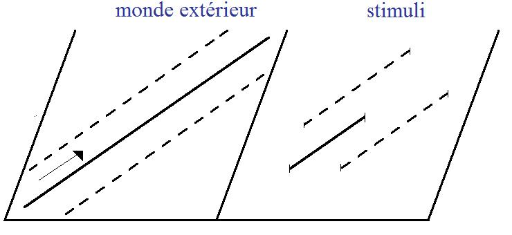
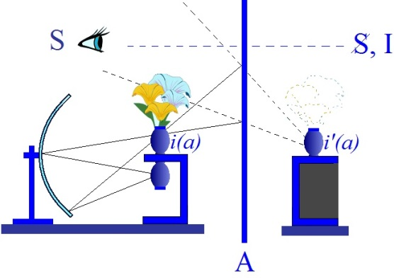
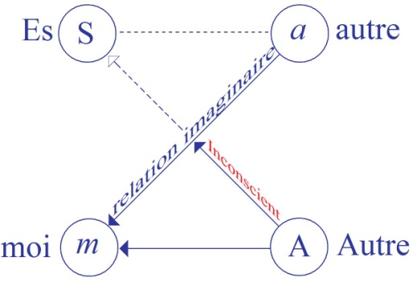

# Leçon 09 | 02 Février 1955

<!-- source-url: http://staferla.free.fr/S2/S2 LE MOI.docx -->
<!-- seminar: s2 -->
<!-- lesson: 09 -->

<!-- id: s2-09-0001 -->

[VALABREGA](#VALABREGA02_02)

<!-- id: s2-09-0002 -->

LACAN

<!-- id: s2-09-0003 -->

Je voudrais quand même faire quelques remarques sur la réunion d’hier soir. L’observation de LEFÈVRE-PONTALIS, remarquant qu’il faudrait se discipliner sur « *le stade du miroir »*, qui s’adresse à vous tous, en effet a mon assentiment en ceci qu’il ne faudrait pas en faire un usage abusif. *« Le stade du miroir »* n’est pas le mot magique et même il commence à chatouiller ce besoin de renouvellement qui n’est pas toujours le meilleur du point de vue progrès. Il faut savoir revenir sur les choses. Ce n’est pas tellement de le répéter qui est ennuyeux, c’est de mal s’en servir.

<!-- id: s2-09-0004 -->

Mais on peut donner une bonne note à LANG, il ne s’en est pas mal servi du tout. Il s’est moins bien servi de ce qui est en somme une toute nou­velle forme de la façon de comprendre une articulation : *le miroir concave*. Le stade du miroir date déjà un peu : il a une vingtaine d’années \[1936\]. Il y a quelques chances qu’il ne corresponde plus tout à fait dans sa forme stricte à ce qu’il paraît souhaitable de comprendre.

<!-- id: s2-09-0005 -->

\[S’adressant à Lefèvre-Pontalis\] Ah, voilà l’insurgé !

<!-- id: s2-09-0006 -->

Je vous assu­re que dans cette question des psychoses, et spécialement des psychoses de l’en­fant, dans la façon de poser les problèmes, il y a quelque chose dont vous, LEFÈVRE-PONTALIS, pouvez ne pas avoir la moindre idée, à savoir à quel point ce diagnostic est discuté et discutable. Et même, d’une certaine façon, on ne sait pas si l’on fait bien d’employer le même mot pour les psychoses chez l’enfant et les psychoses chez l’adulte.

<!-- id: s2-09-0007 -->

Nous sommes arrivés à employer le même mot mais pendant des décades on se refusait à penser qu’il pût y avoir chez l’enfant de véritables psychoses. C’était autre chose, on cherchait à le rattacher à quelques conditions organiques. La psychose comme telle, en tant que structurée, chez l’adulte, nous ne la retrouvons pas du tout structurée de la même façon chez l’enfant.

<!-- id: s2-09-0008 -->

Si nous parlons légitimement de psychoses, c’est en tant qu’*analystes*, en tant que nous pouvons faire un pas de plus que les autres dans la conception de la psychose. Je dois dire que comme sur ce point nous n’avons pas encore du tout de doctrine, je dirais : même pas dans notre groupe, mais ça a peut-être beaucoup d’intérêt.

<!-- id: s2-09-0009 -->

ANDRIEUX en a une, mais ce n’est sûrement pas la nôtre. LANG était dans une situation difficile, parce qu’en fin de compte ne croyez pas que nous ayons comme ça une espèce de doctrine, de main courante, dans l’analyse de la psychose. Déjà sur la psychose de l’adulte, *a fortiori* sur celle de l’enfant, la plus grande confusion règne encore.

<!-- id: s2-09-0010 -->

Ce qui fait que le travail de LANG m’a paru bien situé. Il essaie de faire quelque chose qui est tout à fait indispensable *en matière de compréhension analytique*, et spécialement quand on s’avance dans les frontières, à savoir prendre un certain recul, une certaine distance. Car s’il y a deux dangers dans tout ce qui est de l’appréhension de notre domaine clinique, le premier est évi­demment conditionné par toute l’éducation : ce qu’on apprend aux enfants c’est que c’est très vilain d’être curieux, et cela va à l’encontre d’une certaine formation.

<!-- id: s2-09-0011 -->

Dans l’ensemble, nous ne sommes pas curieux. Il n’est pas facile de provoquer ce sentiment d’une façon automatique. Il est plus facile de se mettre en garde contre autre chose, qui est de comprendre : nous comprenons toujours trop, et spécialement dans l’analyse nous croyons toujours com­prendre. Dans quelques cas, c’est à juste titre. Mais la plupart du temps nous nous trompons.

<!-- id: s2-09-0012 -->

Autrement dit, qu’est-ce que je veux dire ? Qu’on peut faire une bonne thé­rapeutique analytique si on est intuitif, doué, si on a la communication, le contact, et l’espèce de somme diffuse, de clef, tout ce qui nous sert, ou plus exactement recouvre le génie que chacun peut déployer dans la relation inter*-*­personnelle et justement spécialement avec l’enfant.

<!-- id: s2-09-0013 -->

Le recours d’une façon approximative… d’ailleurs à partir du moment où on n’exige pas de soi une extrê­me rigueur conceptuelle, on n’a qu’à changer d’instrument, on trouve toujours moyen de comprendre. Le danger est que ceci nous laisse absolument sans bous­sole, à savoir qu’on ne sait ni d’où on part, ni où on cherche à aller : c’est dans ses premiers balbutiements dans le sens d’un repérage.

<!-- id: s2-09-0014 -->

À quoi a-t-on affaire dans la psychose ? La psychose de l’enfant, c’est très intéressant, ça peut même nous éclairer par contrecoup sur ce que nous devons penser de la psychose de l’adulte et donner en tout cas un élément. C’est ce qu’a cherché à faire LANG. Il l’a très bien fait.

<!-- id: s2-09-0015 -->

Il a marqué avec beaucoup de tact les incohérences, écarts ou béances, des systèmes de Mélanie KLEIN et d’Anna FREUD, au bénéfice en fin de compte plutôt de Mélanie KLEIN, car à la vérité le système d’Anna FREUD est à proprement parler, du point de vue analytique, dans une impasse.

<!-- id: s2-09-0016 -->

Il a fait des remarques extrêmement justes. Ce qu’il a dit sur *la régression*, je l’ai beaucoup aimé. Il a signalé que c’était un symbole. Que l’usage du terme de régression comme d’un *mécanisme*, quelque chose qui se passerait dans la réalité, est vraiment une illusion. Pour le coup, un terme dont vous savez que je n’aime pas user à tort et à travers c’est celui de « *pensée magique* » mais c’est bien là quelque chose qui ressemble, non pas à *une pensée magique* mais de magicien. Car voyons-nous jamais quelqu’un, un adulte, vrai­ment régresser, revenir à l’état de petit enfant, se mettre à vagir ?

<!-- id: s2-09-0017 -->

On croirait que *la régression* est quelque chose qui existe. Comme le faisait remarquer LANG, c’est un symptôme qui doit être interprété comme tel. Il y a régression sur le plan de la signification, et rien d’autre ! Chez l’enfant, c’est suffisamment démontré par cette simple remarque que l’enfant n’a pas beaucoup de recul pour régresser. Nous devons donc l’interpréter comme autre chose que dans le plan de la réalité.

<!-- id: s2-09-0018 -->

Il y a une remarque que je voudrais dégager, à propos d’une note que je re­lisais dans *La Science des rêves,* dont nous allons nous occuper ces temps-ci, à propos des processus et mécanismes de la psychologie du rêve, il y a une remarque en note[^6], citation de JACKSON, importante pour les troubles des psy­choses spécialement. Cette remarque fait partie de la même imprécision que je suis en train de viser dans mes propos :

<!-- id: s2-09-0019 -->

« *Trouvez la nature du rêve, et vous aurez trouvé tout ce que l’on peut savoir, about insanity, sur la démence et sur la folie* ».

<!-- id: s2-09-0020 -->

*Eh bien, c’est faux *! cela n’a rien à faire. Mettez-vous ça d’abord dans la tête !

<!-- id: s2-09-0021 -->

Naturellement que ça manie les mêmes éléments, qu’on peut retrouver des symboles dans les deux, des analogies, par rapport au niveau de conscience. C’est justement la perspective dans laquelle nous ne nous plaçons pas. Car jus­tement toute la question est là : « *Pourquoi un rêve n’est pas une folie ?* ». Et inverse­ment, s’il y a quelque chose d’important à définir dans la folie, c’est justement parce que l’ensemble du mécanisme majeur, déterminant, de la folie, n’est abso­lument pas celui qui se passe chaque nuit dans le rêve.

<!-- id: s2-09-0022 -->

Il ne faut pas croire que ce soit venu là d’une façon qui doit être mise entiè­rement à l’actif de FREUD. L’édition française est incomplète, elle ne signale pas que *c’est une espèce de bon point donné à* M. Ernest JONES[^7], qui a trouvé bon un jour de faire ce rapprochement qu’il pensait sans doute apte à rattacher la tradition analytique à ce qui était bien vu déjà en Angleterre.

<!-- id: s2-09-0023 -->

Rendons à JONES ce qui est à JONES, et à FREUD ce qui est à FREUD.Et partez bien de l’idée que jus­tement ce n’est pas du tout dans ce sens là qu’il faut voir les choses et que le problème du rêve laisse entièrement ouverts tous les problèmes *économiques* de la psychose. Je ne peux pas vous en dire plus aujourd’hui. Mais ça me paraît très important de le souligner. C’est une amorce lancée vers l’avenir, vers ce que nous pourrons être amenés à commencer de dire cette année au sujet de la psy­chose. L’*année prochaine*, il faudra que nous nous en occupions.

<!-- id: s2-09-0024 -->

Nous allons reprendre notre propos de la dernière fois, à savoir la référence au texte de FREUD que nous avons commencé d’opérer avec ANZIEU. J’ai chargé M. VALABREGA de reprendre la suite, de reprendre les choses au point où vous les avez laissées pour nous introduire au *schéma économique* que FREUD donne du psychisme, *de l’appareil psychique* en tant que tel. Il s’agit de voir à travers son œuvre, c’est-à-dire les étapes suivantes, les ébauches d’une psychologie généra­le, telle que nous l’avons à la suite des lettres de FLIESS, et qu’ANZIEU a com­mencé d’éclairer la dernière fois.

<!-- id: s2-09-0025 -->

Je vais vous faire un schéma au tableau, de façon à ce que vous reteniez quelque chose qui est nécessaire, que vous puissiez vous y rapporter, saisir le mouvement de ce qui est exploré ici. Dans le cas présent, c’est légitime, car vous allez voir ce que ça va nous permettre de vous donner. Vous allez voir un même schéma que je vais essayer de faire à chaque fois, à la fois comparable, c’est-à-dire ressemblant dans sa structure et justement différent en ce qu’il s’y marque de progrès.

<!-- id: s2-09-0026 -->

Alors, je serai amené à vous faire quatre schémas de cet appareil psychique de FREUD :

<!-- id: s2-09-0027 -->

- *le premier* se rapportant à ce qui est ébauché au niveau de sa premiè­re *Psychologie générale* restée non publiée, inédite, référence à lui-même, pleine d’aperçus féconds.

<!-- id: s2-09-0028 -->

<!-- id: s2-09-0029 -->

- *Le deuxième*, au niveau de ce qui est l’apport de la *Sciences des rêves,* c’est-à-dire la *théorie de l’appareil psychique* qu’il donne pour expliquer le rêve. Remarquez-le bien : *après* qu’il avait donné tous les éléments de l’interprétation du rêve, il lui reste à situer le rêve comme fonction psy­chique. C’est une deuxième étape dans sa *Science des rêves.*

<!-- id: s2-09-0030 -->

<!-- id: s2-09-0031 -->

- *Le troisième*, au niveau de l’apparition de la théorie de la libido, beaucoup plus tardive. On se s’imagine pas à quel point elle n’est même pas contemporaine des *Essais sur la sexualité* mais corrélative de l’avènement de *la fonction du narcissisme*. C’était ce que j’avais réservé à PERRIER pour aujourd’hui, il le fera la prochaine fois, ou la suivante.

<!-- id: s2-09-0032 -->

<!-- id: s2-09-0033 -->

- Et puis enfin *-* *quatrième* *-* *Au-delà du principe du plaisir.*

<!-- id: s2-09-0034 -->

<!-- id: s2-09-0035 -->

Dans ces quatre *schémas*, vous verrez de quoi il s’agit : toujours de donner un schéma du champ analytique, en fin de compte c’est comme ça que ça se déve­loppe. Au début, il appelle ça appareil psychique et vous verrez quel progrès il fait, vous verrez qu’il y a quelque chose dans la forme de ce schéma qui va tou­jours être semblable, encore que ça s’adresse à des fonctions complètement dif­férentes.

<!-- id: s2-09-0036 -->

Et de ce progrès je crois que nous pourrons tirer des conclusions fermes sur ce qui est aussi le progrès de la pensée de FREUD à l’endroit de ce qu’on peut appeler l’être humain. Car en fin de compte c’est de cela qu’il s’agit au fond, des revendications sur le plan théorique que vous pouvez tous avoir.

<!-- id: s2-09-0037 -->

Il y a tout de même cette idée :

<!-- id: s2-09-0038 -->

- que c’est un *objet* que vous avez en face de vous, quelque chose d’individuel, sinon d’unique,

<!-- id: s2-09-0039 -->

- que tout cela est là concentré autour de cette forme que vous avez devant vous,

<!-- id: s2-09-0040 -->

- que l’unité d’objet en psy­chanalyse, sinon en psychologie, est justement cet aspect individuel, ce quelque chose qui est projeté, dont vous pensez pouvoir connaître à la fois les lois et les limites.

<!-- id: s2-09-0041 -->

Dans l’« *appel* » de LEFÈVRE-PONTALIS, hier soir, il y a ça qui est au fond de ce que tous vous croyez qu’on est toujours dans le domaine d’une psychologie, au sens où la *psyché* serait une espèce de propriété ou de double de ce quelque chose que vous voyez. C’est très singulier que vous ne voyiez pas que tout pro­grès scientifique dans le champ de ces rapports avec l’homme peut vraisembla­blement aller - et qu’il est encore beaucoup plus adéquat - dans le sens que je vais vous dire maintenant : c’est toujours de *faire évanouir l’objet* comme tel.

<!-- id: s2-09-0042 -->

Dans la physique, plus vous allez, moins vous saisissez, moins prend d’importance - pour tout dire : tout passe au trente sixième arrière plan - ce quelque chose qui est sensible. Ce verre, ça n’intéresse absolument pas le physicien. Cela l’intéres­se au *niveau d’échange d’énergie, d’atomes, de molécules*, c’est-à-dire de quelque chose que ne réalise cette apparence que d’une façon absolument tran­sitoire, contingente et qui du point de vue de la physique n’a aucune espèce d’importance.

<!-- id: s2-09-0043 -->

Dites-vous bien que c’est la même chose, seulement, ça ne veut pas dire pour autant que l’être humain pour nous s’*évanouisse*. Mais justement vous devez savoir, en tant que philosophes, que l’*être* et l’*objet* ce n’est absolument pas du tout *la même chose*. Or s’il y a justement quelque chose, une expérience qui nous montre en perspective la direction où peut se situer cet être, que bien entendu, du point de vue scientifique, nous ne pouvons pas saisir, qui n’est pas de l’ordre scientifique, c’est quand même une expérience qui en désigne, si on peut dire, le point de fuite, le sens dans lequel il se rencontre, et qui souligne que *l’homme* n’est pas du tout *un objet* mais *un être* en train de se réaliser, quelque chose autrement *métaphysique*. Cela ne veut pas dire que ce soit non plus là notre objet en tant qu’objet de science, mais notre objet n’est certaine­ment pas l’individu qui apparemment l’incarne.

<!-- id: s2-09-0044 -->

Je fais par exemple allusion à ceci que FREUD désigne, qu’il y a toujours dans un rêve un point absolument insaisissable et - écrit-il - du domaine de l’inconnu : il appelle cela « *l’ombilic du rêve* ». On ne souligne pas ces choses dans son texte parce qu’on trouve que c’est probablement de la poésie. Mais non ! Cela veut dire qu’il y a *un point* quelque part *qui*, lui, *n’est pas accessible*, n’a rien de saisissable dans le phénomène, qui est le point de surgissement de ce rapport au *symbolique* qu’il y a dans cet objet particulier qui est notre partenaire dans l’analyse. Oui ! Nous avons là la référence de ce point de FREUD que j’appelle l’*être*, ce dernier mot qui dans la position scientifique ne nous est absolument pas accessible. Mais l’important est que dans les phénomènes nous en voyions la direction déjà indiquée.

<!-- id: s2-09-0045 -->

Donc, ce qui est toujours important pour nous, c’est de voir en quelque sorte à quel point nous devons, dans le rapport à ce que nous appelons notre *parte­naire*, nous situer. Or, s’il y a aussi quelque chose qui est bien mis en évidence, comme je pense que vous commencez à l’entrevoir, c’est *qu’il y a deux dimen­sions différentes* - encore *qu’elles s’accolent sans cesse dans un phénomène unique, celui du rapport interhumain* - *deux dimensions différentes* dans lesquelles nous avons à nous situer :

<!-- id: s2-09-0046 -->

- l’une est celle de *l’imaginaire*,

<!-- id: s2-09-0047 -->

- l’autre celle du *symbo­lique*.

<!-- id: s2-09-0048 -->

Elles s’entrecroisent en quelque sorte, et il faut toujours que nous sachions, nous, quelle fonction nous occupons là-dedans, c’est-à-dire dans quelle dimension, dans quelle direction nous nous opposons au sujet, soit d’une façon qui justement réalise à proprement parler une opposition, soit dans celle qui réalise une médiation.

<!-- id: s2-09-0049 -->

Ceci, naturellement est sommaire. On peut le faire, en quelque sorte distinguer et si on croit que les deux se recouvrent, parce qu’ils se confondent dans le phénomène, on se trompe. C’est-à-dire qu’on arrive à cette espèce de *communication magique*, de plan d’analo­gie universelle, sur lequel beaucoup théorisent leur expérience, qui peut-être dans le particulier et le concret, souvent, est très fécond, très riche, très communicatif, mais qui est à partir de là non seulement absolument inélaborable, mais sujet effectivement à toutes les erreurs de technique.

<!-- id: s2-09-0050 -->

Vous verrez cela peut-être imagé d’une façon plus précise dans *le quatrième schéma*, dont je vous parle, qui répondra à la dernière étape de la pensée de FREUD, *l’Au-delà du prin­cipe du plaisir.*

<!-- id: s2-09-0051 -->

[Jean-Paul VALABREGA](#Fevrier02)

<!-- id: s2-09-0052 -->

Je reprends le texte des *Drafts* à peu près au point où ANZIEU l’a l’autre jour laissé. Il s’agit d’étudier les processus primaires dans le système Ψ, dans le sommeil et dans le rêve. Mais il faut d’abord résumer, je pense, ce que FREUD dit des pro­cessus primaires et secondaires dans le système Ψ, c’est-à-dire que je vais reve­nir sur ce texte, page 386 et suivantes.

<!-- id: s2-09-0053 -->

FREUD dit qu’il y a deux situations dans lesquelles le *moi* éprouve un déplaisir et se trouve exposé à un traumatisme. Il n’emploie pas le mot « *traumatisme* » d’ailleurs, mais le mot *damage,* dans la tra­duction anglaise tout au moins. Je l’ai appelé *traumatisme* quand même parce que dans le passage suivant, un peu plus loin, il parle de biologique, il parle de *biological damage.*

<!-- id: s2-09-0054 -->

Donc il y a *deux situations* dans lesquelles le *moi* peut être exposé à un traumatisme.

<!-- id: s2-09-0055 -->

- Dans *la première* l’état de désir ne peut être suivi de satisfaction, parce que l’objet n’est pas réellement présent, il est seulement ima­giné. À un stade précoce, nous dit-il, le système Ψ est incapable de faire cette distinction, et par suite il faudra chercher ailleurs, c’est-à-dire ailleurs que dans le système Ψ, un critère distinctif permettant de séparer la perception de l’idée.

<!-- id: s2-09-0056 -->

- *Deuxième situation*, le système Ψ a besoin d’une indication, non plus pour la satisfaction,

<!-- id: s2-09-0057 -->

> mais pour éviter un déplaisir et il le fait ainsi qu’ANZIEU l’a dit l’autre jour : au moyen d’un investissement latéral. Si le système Ψ est capable d’effectuer cette inhibition, l’évitement du déplaisir et la défense sont possibles.
>
> Dans le cas contraire, il y a une sorte de débordement, *un déplaisir intense*, *immense,* et une défense primaire.

<!-- id: s2-09-0058 -->

Dans ces deux situations : satisfaction impossible, et évitement du déplaisir, on voit quand même *le plaisir,* dans la première et *le déplaisir,* dans la seconde, s’annoncer. Dans ces deux cas, il peut y avoir un traumatisme. Et ici FREUD emploie le mot de « *biological damage ».* Il faut donc, dans ces deux cas, être capable de distinguer, avoir une indication qui permette de distinguer entre *la perception* et *le souvenir* ou *l’idée*, ou encore pourrait-on dire, quoique ce ne soit pas dans le texte : entre *la réalité* et *l’image*.

<!-- id: s2-09-0059 -->

Je n’emploierai pas les mots *réel* et *imaginaire* ici, parce qu’il faut bien voir que la perception n’est pas la réalité, c’est une indication de la réalité, il vaut mieux rester fidèle aux mots employés par FREUD, réalité et image. Ce critère distinctif qu’il faut trouver, on peut indiquer que FREUD va le trouver dans deux éléments essen­tiels :

<!-- id: s2-09-0060 -->

- d’une part l’*information*,

<!-- id: s2-09-0061 -->

- d’autre part l’*inhibition*.

<!-- id: s2-09-0062 -->

C’est ce qu’il va falloir expliquer maintenant.

<!-- id: s2-09-0063 -->

LACAN

<!-- id: s2-09-0064 -->

Si vous craignez d’anticiper en parlant de réalité, vous anticipez encore bien plus en parlant d’*information*, quoique ce soit dans le sujet. Mais alors, n’ayez pas de scrupules !

<!-- id: s2-09-0065 -->

Jean-Paul VALABREGA

<!-- id: s2-09-0066 -->

C’est « *report »* que je traduis par information. C’est un *rapport* au sens où FREUD l’emploie, pas un rapport de connexion, mais d’information.

<!-- id: s2-09-0067 -->

LACAN

<!-- id: s2-09-0068 -->

Vous avez raison. Mais justement la notion d’information n’est pas du tout encore élaborée, ni dans l’esprit de FREUD.

<!-- id: s2-09-0069 -->

Jean-Paul VALABREGA

<!-- id: s2-09-0070 -->

Elle est dans le contexte de « *report* » qu’il emploie toujours. Donc nous cherchons ceci. FREUD va le trouver plus tard dans l’*information* d’une part, et l’*inhibition* d’autre part. Je citerai le passage en italique, avec le mot *report,* parce qu’il est net. Il va donc citer ces deux critères, « *critère* » est de lui aussi. Il va falloir faire un retour au *système* ω.

<!-- id: s2-09-0071 -->

LACAN

<!-- id: s2-09-0072 -->

J’ai fait ce petit schéma au tableau pour bien que vous suiviez les choses.

<!-- id: s2-09-0073 -->

<!-- id: s2-09-0074 -->

Voilà, en somme, ce qu’il appelle *le système* ϕ, c’est ce qui correspond à *l’arc réflexe*, car c’est de là qu’il part, du schéma de *l’arc réflexe* qui a donné tellement d’espoir dans la construction de l’être vivant, dans les relations avec un environnement, *l’arc réflexe* sous sa forme la plus simple.

<!-- id: s2-09-0075 -->

Ces deux traits ne signifient pas une limite, mais une coupure dans le schéma, à la fois distant de tout ce que vous allez voir dans le milieu, et quand même rapprochable, en ce sens qu’il se peut que cela aille directement de cette plaque-là à cette plaque-là. Et ici vous avez la réponse : c’est le court-circuit du réflexe, sur lequel on donne le premier schéma fondamental de la propriété du système de relation d’un être vivant.

<!-- id: s2-09-0076 -->

Il reçoit quelque chose. Est-ce une information ? Sûrement pas ! Et pourtant il répond quelque chose à cette excitation. N’oubliez pas que cette réponse implique toujours dans ses arrière-plans quelque chose d’adapté. N’oubliez pas non plus que le schéma d’arc–réflexe est sorti des premières expériences sur la grenouille, par exemple, en même temps que l’électricité, qui, vous le verrez, nous apprendra tellement de choses, pas du tout par elles-mêmes, mais comme modèle.

<!-- id: s2-09-0077 -->

L’électricité commençait à faire son apparition dans le monde. La grenouille réagit à une stimulation, et il n’y avait pas que la stimulation électrique, on lui met une goutte d’acide sur la patte, elle se gratte cette patte avec l’autre. Ceci est considéré comme une réponse. Et vous y voyez l’ubiquité ! Il y a deux choses, il y a le couple « afférent et efférent », et quelque chose d’impliqué dans le fait que ça doit tout de même servir à quelque chose, si l’être vivant est un être adapté. Alors tout consiste à retirer les implications qu’il y a dans le terme réponse, et essayer de neutraliser autant que possible ce circuit.

<!-- id: s2-09-0078 -->

Ceci est repris par FREUD au départ de sa construction et il semble y mettre déjà la notion d’un équilibre, autrement dit d’un *principe d’inertie*. Mais vous allez voir que ceci n’est pas du tout légitime. Il n’y a du point de vue énergé­tique aucun rapport entre quelque chose que nous pouvons appeler *stimulus*, ou que lui appelle déjà *information*, mais à mon avis d’une façon prématurée, appelons cela l’*input,* mis dedans.

<!-- id: s2-09-0079 -->

Et disons que quand on part de là on part d’une espèce d’état pré*-*scientifique de l’abord du problème, c’est-à-dire juste­ment avant que soit introduite comme telle la notion énergétique. Je vous l’ai dit, cela date de bien avant *la statue de* CONDILLAC. Du point de vue de l’évolu­tion des idées, il n’y a pas de considération d’énergie, c’est une espèce de départ, de schéma de base : où nous avons à trouver *l’élément énergétique*, c’est juste­ment tout à fait ailleurs.

<!-- id: s2-09-0080 -->

C’est ce que met en évidence la construction de FREUD. Il faut qu’il mette que c’est efficace dans l’autre système, il faut qu’il l’interpose dans le circuit, à savoir dans le système Ψ*.* Alors là intervient non seule­ment un apport d’*énergie*, mais c’est même uniquement là qu’il commence à entrer en ligne de compte, que ce système y a affaire avec les indications internes, c’est-à-dire les besoins. Et les besoins, qu’est–ce que c’est ? Cela se rapporte effectivement à l’organisme, c’est-à-dire que là nous pouvons avoir la notion même du besoin, du *need,* distingué de la notion de désir.

<!-- id: s2-09-0081 -->

Hier soir, LANG déplorait qu’elle soit toujours confondue avec celle de besoin. Ce n’est pas la même chose du tout. Le *need* exprime ce en quoi ce sys­tème, qui est un système particulier dans l’organisme, va entrer en jeu dans l’*homéostase* totale de l’organisme, c’est-à-dire dans ce quelque chose qui en effet fait intervenir une notion de constance énergétique.

<!-- id: s2-09-0082 -->

En d’autres termes, la notion énergétique, en tant que déjà elle apparaît dans l’œuvre de FREUD, apparaît dans le sens transversal. Ici, elle domine tout ce qui va se passer entre Ψ en tant qu’il ressent quelque chose de l’intérieur de l’orga­nisme, et Ψ en tant qu’il va produire quelque chose qui va avoir un certain rap­port avec ses besoins, c’est-à-dire que de là il pourra en effet considérer qu’il y ait une équivalence énergétique.

<!-- id: s2-09-0083 -->

Mais dans ce sens-là, il nous reste quelque chose qui devient complètement énigmatique, car nous ne savons absolument pas ce que peut signifier par rapport à la notion énergétique, l’équivalence d’une cer­taine pression interne liée à *l’équilibre* *de l’organisme* et son issue. Là, nous ne voyons pas du tout en quoi ceci, ni même est nécessaire, ni même à quoi ça sert ?

<!-- id: s2-09-0084 -->

C’est un *x* qui se caractérise justement en ceci qu’après avoir servi de première approximation, de point de départ de la pensée, quand il s’agit de comprendre, est en fait tout à fait abandonné après, parce que, vous allez le voir, ça ne paraît plus que quelque chose qui est tout à fait inutilisable.

<!-- id: s2-09-0085 -->

C’est même ce qu’il peut y avoir là-dedans d’*input,* c’est-à-dire de choses amenées du monde extérieur, non seulement il ne peut pas s’en contenter, mais il faut qu’il improvise, qu’il introduise cet appareil supplémentaire, qui est *l’appareil* ω dont on vous a déjà dit la dernière fois que c’est un jeu d’écriture, c’est très probablement *du système de la perception* qu’il s’agit.

<!-- id: s2-09-0086 -->

Après avoir fait de si belles constructions pour expliquer le système de rela­tion, à partir de notions énergétiques, c’est-à-dire de l’idée qu’il faut qu’on mette quelque chose dedans, je vous ai dit à quoi se résumait cette première approximation, pour qu’on puisse tirer un lapin d’un chapeau, il faut d’abord l’y mettre, il ne s’agit pas d’autre chose impliqué dans le couple *stimulus-répon­se* : il faut que quelque chose arrive pour que quelque chose ressorte. À partir de là, nous allons tout construire.

<!-- id: s2-09-0087 -->

Après un si beau départ, il est curieux que FREUD arrive à nous situer le sys­tème de la perception - ne l’appelons pas trop prématurément « *conscience* », vous verrez que dans la suite il le confondra avec *le système de la conscience* - il faut qu’il l’introduise en *hypothèse* supplémentaire. Pourquoi ? Parce qu’il faut qu’il ait non seulement des stimulations du monde extérieur, mais un monde inté­rieur qu’il *reflète*, plus exactement, un appareil intérieur qui *reflète* en quelque façon, non seulement les incitations du monde extérieur, mais sa *structure*, si vous voulez. Il n’est pas gestaltiste - on ne peut pas lui attribuer tous les mérites - mais les besoins qui ont amené à la construction gestaltiste il est bien forcé de les res­sentir.

<!-- id: s2-09-0088 -->

En effet, pour que cet être vivant ne périsse pas à tous les coups, il faut qu’il ait quelque reflet adéquat du monde extérieur. C’est vous dire à la fois les exigences impliquées par ce schéma, les exigences théoriques qui répondent toutes, sur ce qui a été plus tard isolé dans le terme d’*homéostase*, et qui est déjà présent dans le schéma de FREUD par la notion d’un équilibre à conserver, d’une zone-tampon. Car en fin de compte ceci sert toujours à maintenir toutes les *excitations*, les *stimulations* au même niveau. Cela sert tout autant, par consé­quent, à ne pas enregistrer que mal enregistrer. Il faut que ça enregistre, mais d’une façon filtrée. C’est un filtre, ou un tampon. La notion d’homéostase est là et implique du même coup, à l’entrée et à la sortie, quelque chose qui s’appelle *une énergie*.

<!-- id: s2-09-0089 -->

Seulement, ce schéma se révèle insuffisant, très précisément pour autant que c’est le schéma d’un système ner­veux, quelque chose qui est fait pour être dans l’ordre du filtrage, d’une façon telle que sa fonction, son utilité, c’est celle d’un filtrage organisé, d’un filtrage progressif, qui comporte des frayages, et que rien dans ce schéma ne permet de penser que les frayages iront jamais dans un sens utilisable, fonctionnellement, à moins que vous ne rapportiez ce qui est vraiment, pour une première tentati­ve, un échec lamentable.

<!-- id: s2-09-0090 -->

Perpétuellement, ces frayages constituent, et par la somme de tous les événements, incidents survenus dans le développement de l’individu, à un modèle, à un terme de comparaison qui nous donne la mesure de la structure du réel, c’est-à-dire - comme disait très bien tout à l’heure M. VALABREGA tout en se retenant de le dire - que si on ne peut pas du tout dire que ce soit l’*imaginaire*, vous comprenez tous pourquoi : *l’imaginaire doit en effet être là*, mais il n’est absolument pas indiqué, l’*imaginaire* comporte une certaine intervention des *Gestalten,* de quelque chose qui déjà prédispose le sujet vivant à un certain rapport avec une *forme typique*, avec ce quelque chose qui lui répond spécialement, mais dans un couplage biologique, avec *une image* de sa propre espèce ou une image de ce qui peut lui être fondamentalement utile biologiquement dans un environnement déterminé, il n’y a pas trace de ça, il y a simplement zone d’expérience et zone de frayage.

<!-- id: s2-09-0091 -->

C’est une première concep­tion de la mémoire comme suite de séries, d’engrammes, autrement dit une somme de séries de frayages qui s’établissent. Ceci s’avère tout à fait insuffisant pour autant que justement nous introduisons la notion d’*image*, c’est-à-dire que quand une série de frayages, conçus comme faisant surgir une certaine *image*, est réactivée par une nouvelle excitation, cette *image*, dira-t-on dans ce *premier schéma*, tendra à se reproduire.

<!-- id: s2-09-0092 -->

Autrement dit, la base, le fondement, le principe du fonctionnement de *l’appareil* Ψ est toujours *l’hallucination*. C’est en effet ce à quoi on aboutit, si on pense que ce dont il s’agit ici c’est une plaque sensible à provoquer des images qui seraient en quelque sorte pure­ment et simplement apportées par la suite des expériences. Si l’image est sim­plement là, c’est que l’enregistrement des expériences a porté.

<!-- id: s2-09-0093 -->

Si cette image est supposée chaque fois que des *incitations, pressions, besoins, apports, stimulations énergétiques*, seront renouvelées, si elle se reproduit, il est bien clair qu’en effet *le processus qu’il appellera plus tard primaire* - il l’appelle déjà à ce niveau-là, quoique je n’en suis pas sûr - ce qui tendra à se reproduire en présence de toute incitation, *c’est toujours plus ou moins une hallucination*. Et alors le problème est tout de suite porté sur le rapport de cette hallucina­tion avec la réalité, c’est-à-dire qu’il faut supposer qu’il y a un autre mode d’in­formation comme disait M. VALABREGA, c’est-à-dire que nous sommes amenés à restaurer le système de la conscience sous la forme d’un système d’une autono­mie paradoxale par rapport au point de vue énergétique reçu comme dominant. C’est-à-dire qu’il faut que nous ayons quelque chose qui consomme le moins d’énergie possible.

<!-- id: s2-09-0094 -->

Car on ne voit pas comment une structure correcte du monde peut s’établir d’une façon qui permette de corriger ce qui se passe par la suite de l’enchaînement des expériences étant conçues comme ayant des effets hallucinatoires, il faut que nous ayons toujours une instance, un appareil cor­recteur, test de la réalité. Ce test de la réalité ne peut être fait que dans une com­paraison, dans cette étape de la théorie de FREUD, avec quelque chose qui est reçu dans l’expérience et conservé dans la mémoire de l’appareil psychique. Et ce quelque chose, il est forcé - pour avoir voulu à l’origine éliminer complète­ment le système de la conscience - de rétablir la conscience dans une sorte d’autonomie renforcée. Voilà à quoi ça aboutit.

<!-- id: s2-09-0095 -->

Je ne suis pas en train de faire une critique, ni de dire que c’est légitime ou illégitime. Vous allez simplement voir où ça le mène. Est-ce que vous suivez bien ?

<!-- id: s2-09-0096 -->

Alors, par quel détour va-t-il passer, pour concevoir ce système, si on peut dire, cette comparaison de référence ? Entre ce qui est donné par l’expérience dans le système Ψ, comme *système-tampon*, le *système d’homéostase*, *de modé­ration* des incitations et l’enregistrement de ces incitations, à quoi est-il amené, comme hypothèse supplémentaire ? Car c’est aux *hypothèses* supplémentaires que nous mesurons les difficultés auxquelles il fait face et la valabilité de la solu­tion.

<!-- id: s2-09-0097 -->

Quelles sont les hypothèses corrélatives l’une de l’autre qu’il est amené à faire ? Elles se groupent sous les deux chefs que vous venez de dire, *inhibition* d’une part et *information* d’autre part. Quels vont être les caractères de cette information ? Quelle est cette information ?

<!-- id: s2-09-0098 -->

Jean-Paul VALABREGA

<!-- id: s2-09-0099 -->

Le problème central est en effet, comme LACAN vient de le dire, l’indication de réalité. Eh bien, FREUD dit que cette indication de réalité est fournie par les neurones perceptifs dans la perception externe. En effet, une excitation qualitative se produit dans le système ω, ou système W. Mais cette excitation ne peut pas atteindre le système Ψ. Par conséquent \- M. LACAN l’a annoncé - cette excitation qualitative qui se produit dans le système ω ne peut être d’aucune utilité.

<!-- id: s2-09-0100 -->

LACAN *-* Ce n’est pas qu’elle ne *peut*, elle ne *doit* être…

<!-- id: s2-09-0101 -->

Jean-Paul VALABREGA

<!-- id: s2-09-0102 -->

Il dit « *ne peut être* », il le constate comme un fait. Selon toute probabilité ce sont les *neurones perceptifs* qui fournissent cette indication de réalité. Dans tous les cas de perception extérieure, une excitation qualitative se produit dans le système W mais celle-ci en tant que telle n’est d’aucune utilité pour le système Ψ.

<!-- id: s2-09-0103 -->

En somme, l’excitation qualitative qui provient du système ω ne peut pas se transmettre. C’est le problème de la transmission de l’indication de réalité et on va voir comment ça va s’agencer, en trois processus différents. Puisque cette excitation qualitative ne peut pas se transmettre au système Ψ, il faut admettre que l’excitation perceptive est suivie d’une décharge de percep­tion et cette décharge de perception est le stade intermédiaire seulement.

<!-- id: s2-09-0104 -->

Car ce n’est pas *la décharge de perception* non plus qui va atteindre le système Ψ mais c’est un « *report *» *de cette décharge*. C’est pourquoi j’ai employé le mot *informa­tion*. Ce n’est pas l’excitation-perception, ni non plus la décharge perceptive consécutive à l’excitation qui atteint le système Ψ, mais une information relati­ve à cette décharge, *report* de cette décharge.

<!-- id: s2-09-0105 -->

Donc :

<!-- id: s2-09-0106 -->

1)  excitation-perception,

<!-- id: s2-09-0107 -->

2)  décharge perceptive, tous les faits amè­nent FREUD à la supposer,

<!-- id: s2-09-0108 -->

3)  information, ou *report* de cette décharge, transmi­se au système Ψ.

<!-- id: s2-09-0109 -->

Par conséquent, c’est la décharge provenant du système ω qui constitue l’indication de réalité transmise au système Ψ.

<!-- id: s2-09-0110 -->

Qu’en est-il dans le cas de l’hallucination ? L’indication transmise est le rap­port de la décharge, la même que dans le cas de la perception. Et c’est pourquoi dans le cas de l’hallucination il n’y a pas de critère distinctif entre la perception et l’idée ou le souvenir.

<!-- id: s2-09-0111 -->

Mais par contre si l’inhibition intervient, ce qui est pos­sible lorsque l’ego est investi, il y a diminution quantitative de l’investissement de désir. Il y a indication de qualité ou de réalité. À ce moment seulement le cri­tère distinctif est valable. Finalement, c’est donc l’inhibition qui provient du *moi*, ajoute FREUD, puis­qu’on a vu que cette inhibition n’était possible qu’après un investissement de l’*ego*, qui est le critère distinctif entre *perception* et *souvenir*.

<!-- id: s2-09-0112 -->

Enfin il faut ajouter, avant de faire ce résumé dans lequel on va pouvoir le suivre, que dans la deuxième situation : *évitement du déplaisir*, le processus ω va servir de signal biologique dont la fonction est de protéger le système Ψ en produisant l’attention, qui est un processus Ψ. Je développe un peu ce qui est dit là brièvement à la fin du résumé que va faire FREUD avant de passer à d’autres considérations.

<!-- id: s2-09-0113 -->

En vue de cette fonction protectrice, le système Ψ trouve son attention attirée, et le processus ω sert alors de protection. Sur quoi l’attention du système Ψ est-elle attirée ? Sur la présence ou l’absence de perception. Si bien que le critère distinctif dans ce cas-là peut jouer. Je ne sais pas si c’est assez clair ?

<!-- id: s2-09-0114 -->

LACAN

<!-- id: s2-09-0115 -->

Il peut y avoir un déséquilibre dans ce que vous exposez, qui vient de ceci. Je vous ai dit, tout à l’heure que *la notion énergétique* jouait au niveau du système Ψ, c’est-à-dire dans notre *schéma transversal*. Car FREUD fait inter­venir là *la notion de quantité*. *On ne peut pas rapprocher ce terme de quantité calorique*, qui est employé déjà primitivement dans *l’histoire de la thermo­dynamique*. Dans ce sens-là viennent tous *les investissements d’énergie* au sens où ils sont importants, considérables. Ils sont liés à l’existence même, à la sub­sistance même, du vivant, ce sont *des besoins*. Ceci est apporté comme déter­minant toutes ses initiatives. Et cela fournit l’énergie véritable de sa recherche, son action. Ici, nous avons la notion de ces *déplacements d’énergie* d’un ordre impor­tant, d’un ordre également *quantitatif*. Car les deux choses se confondent dans la théorie de FREUD.

<!-- id: s2-09-0116 -->

Ce qui lui importe en effet c’est ce qui pose le pro­blème : comment *le qualitatif*...

<!-- id: s2-09-0117 -->

> c’est-à-dire cette sorte de zone de *perceptions* du monde extérieur - dont la plupart n’ont pas de signification biologique, ne meuvent directement aucun besoin, ne répondent à rien des besoins de l’être vivant - considérée comme source de ce Qη, quantité neuronique

<!-- id: s2-09-0118 -->

...comment ceci peut entrer en jeu ?

<!-- id: s2-09-0119 -->

Il le fait par une astuce, qui est peut-être ce que vous avez laissé de côté, qui est ceci. Le système ω, par rapport au monde extérieur, est fait d’organes diffé­renciés, de façon telle que ce ne soit pas les énergies massives qui lui viennent du monde extérieur qu’il enregistre. On peut concevoir en effet des énergies massives, changements de températures, ou pressions considérables, portées jusqu’à des limites qui mettent sérieusement en cause la subsistance persistante de l’être vivant. L’être vivant n’a guère autre chose à faire dans ces cas-là que de s’en tirer par la fuite, s’il n’est pas capable de tamponner. Mais c’est tout à fait en dehors de ce qui est intéressant.

<!-- id: s2-09-0120 -->

Il s’agit de ces fonctions de relation de la psyché, en rapport avec les déter­minations fines du monde extérieur. Ces appareils spécialisés sont faits de telle sorte que l’énergie en jeu dans un phénomène du monde extérieur, prenons un exemple, l’énergie solaire, ne retiendra qu’une période du phénomène. Par exemple la période de ce qui nous vient du soleil, en tant qu’énergie lumineuse. Il choisira dans le rayonnement solaire l’énergie lumineuse, un certain niveau de fréquences, et parmi celles-là se mettra en accord non pas même avec la zone d’énergie qu’il y a dans l’énergie lumineuse en tant que telle, car qu’est-ce que nous serions comme transformateurs et cellules photoélectriques, mais la période.

<!-- id: s2-09-0121 -->

Il est donc amené à entifier la qualité comme telle, dans un appareil spécialisé, ce qui implique donc l’effacement presque complet de toute espèce d’apport d’énergie. Si vous voulez, ce qui veut dire qu’un œil, quand il reçoit la lumière est quelque chose qui retient beaucoup moins d’énergie qu’une feuille verte, car avec cette même lumière, elle fait toutes sortes de choses, transforma­tion chlorophyllienne... C’est ce sur quoi FREUD met l’accent.

<!-- id: s2-09-0122 -->

En d’autres termes, ce dont il va s’agir, et qui justifie bien entendu que vous avez la notion *perceptuale,* chose reçue, sen­sation, et *perceptuale excitation,* et décharge perceptive, mais vous sentez bien que la notion de décharge seulement perceptive, c’est-à-dire au niveau de cet appareil lui-même est là un simple besoin de symétrie.

<!-- id: s2-09-0123 -->

Il faut bien qu’il admet­te que là aussi il y a une certaine constance d’énergie, à savoir que ce qui est amené doit en effet quelque part se retrouver. Mais ce sur quoi l’accent est mis, est qu’entre cette excitation et cette décharge, il y a le minimum d’énergie dépla­cée. Et pourquoi ? Justement de par sa propriété même, ce système doit être aussi indépendant que possible de ce qui est à proprement parler déplacement d’énergie. Il faut qu’il en détache, qu’il en distingue la qualité pure, à savoir *le monde extérieur* pris *comme simple reflet*. Vous y êtes ?

<!-- id: s2-09-0124 -->

La preuve est que pour qu’il puisse y avoir comparaison entre ce qui se passe au niveau intérieur, c’est-à-dire là où l’image n’a que des dépendances mémorielles, où elle est essentiellement et par nature hallucinatoire, il faut que le *moi* - conçu comme accentuant au deuxième degré la fonction de régulation de ce tampon - inhibe au maximum les passages d’énergie dans ce système, pour qu’il se mette autant que possible à un niveau aussi bas que possible, où il puisse y avoir comparaison, balance possible, échelle commune, entre ce qui se passe à ce niveau-là et à ce niveau.

<!-- id: s2-09-0125 -->

À cette seule condition que ce qui vient comme incitation, ou *report -* mais vous sentez bien que ce *report* implique une hypothèse supplémentaire - soit fil­tré, que ce système, qui est supposé avoir filtré considérablement le monde exté­rieur, soit de nouveau encore filtré pour pouvoir être comparé aux excitations spéciales qui surgissent en fonction d’un besoin, l’image d’un bon repas quand on a faim. C’est une question de savoir à quel niveau est la pression du besoin, pour savoir :

<!-- id: s2-09-0126 -->

- s’il s’imposera contre toute évidence et se maintiendra fort long­temps, puisqu’il n’y aura rien,

<!-- id: s2-09-0127 -->

- ou si la quantité d’énergie déplacée pourra être par le *moi* tamponnée, tamisée à un niveau suffisant pour qu’on puisse s’apercevoir que l’image n’est pas réalisée. C’est en fin de compte à ça que ça revient. En d’autres termes, après cette première élaboration, et simplement dans la mesure où FREUD pensait que, connaissant déjà le réflexe, on arriverait peu à peu de là à en déduire et en construire toute l’échelle, perceptions, mémoire, pensée, idées, (position traditionnelle).

<!-- id: s2-09-0128 -->

\[...\]FREUD va faire un schéma satisfaisant. Et voilà ce qu’il est amené à construire. Finalement, une conscience-percep­tion entifiée dans un système, ce qui n’est pas pour autant complètement absur­de, parce qu’en fin de compte c’est vrai qu’il existe ce système différencié, nous en avons la notion, nous pouvons même à peu près le situer. Ce n’est pas exac­tement les organes des sens, le cortex cérébral, ou du moins les parties du cor­tex qui jouent ce rôle. Il est amené à distinguer dans l’appareil psychique deux zones, une zone d’imagination, de mémoire, ou mieux encore d’hallucination mémorielle, en relation avec un système perceptuel spécialisé comme tel. On ne peut là rien voir d’autre que la conscience comme reflet de la réalité.

<!-- id: s2-09-0129 -->

Jean-Paul VALABREGA

<!-- id: s2-09-0130 -->

C’est comme ça qu’il faut le voir. Mais ça n’apparaît que beaucoup plus tard, pas dans le texte de 1895. En somme, il se base un peu, comme il n’a pas encore une idée bien claire de la notion d’appareil psychique qu’il donnera plus tard avec le système perception-conscience, ici, il y a des élé­ments, mais ça n’apparaîtra que plus tard.

<!-- id: s2-09-0131 -->

LACAN *-* Les éléments, c’est ω.

<!-- id: s2-09-0132 -->

Jean-Paul VALABREGA - Ce n’est pas conçu comme ce qu’il appelle plus tard les appa­reils psychiques.

<!-- id: s2-09-0133 -->

LACAN

<!-- id: s2-09-0134 -->

Je crois, au contraire, que les appareils en tant que tels sont déjà là. Pourquoi les appeler Ψ, ϕ, ω, s’il ne les distingue pas comme appareils ?

<!-- id: s2-09-0135 -->

Jean-Paul VALABREGA

<!-- id: s2-09-0136 -->

Dans la suite, il va distinguer deux éléments fondamentaux dans le système Ψ lui-même. C’est ce qui va donner l’appareil psychique.

<!-- id: s2-09-0137 -->

LACAN

<!-- id: s2-09-0138 -->

Mais ce que je veux vous montrer la prochaine fois, c’est justement que le terme d’*appareil psychique* est tout à fait insuffisant pour désigner ce qu’il y a dans la « *Traumdeutung »,* car vous verrez que la dimension qu’introduit la « *Traumdeutung »* n’est absolument pas isolée, c’est la dimension temporelle qui commence à émerger. Une autre dimension encore qui en est tout à fait corrélative est déjà l’*infor­mation*, en réalité *individualisée* non pas quand il a employé le terme de *report,* c’est nous qui en déduisons la nécessité qu’il y ait un *report*. Continuez, M. VALABREGA... L’inhibition est le fait que le *moi* doit apaiser, à un certain niveau, les quantités neuroniques pour qu’elles soient utilisables.

<!-- id: s2-09-0139 -->

Jean-Paul VALABREGA

<!-- id: s2-09-0140 -->

Il s’agit de l’*ego* et des indications de réalité. Il y a trois cas à distinguer :

<!-- id: s2-09-0141 -->

1)  Si le *moi* est dans un état de désir au moment où apparaît l’indication de réalité, il y a décharge de l’énergie dans ce qu’il appelle l’action spécifique. Et ce premier cas correspond simplement à la satisfaction du désir. C’est un premier cas, le *moi* est dans un état de désir, il apparaît une indication de réalité, il y a une indication spécifique de réalisation du désir.

<!-- id: s2-09-0142 -->

2)  Avec l’indication de réalité coïncide une augmentation du déplaisir. Le système Ψ réagit en produisant une défense par un investissement latéral.

<!-- id: s2-09-0143 -->

LACAN

<!-- id: s2-09-0144 -->

Cela veut dire que la quantité d’énergie passant par plusieurs filtres neuroniques arrive en moins grande intensité au niveau des synapses, c’est le schéma électrique. Si vous faites passer un courant par trois ou quatre fils au lieu d’un seul, vous aurez besoin sur chacun des fils de résistances moindres, proportionnellement au nombre des fils, c’est-à-dire que les synapses peuvent l’arrêter plus facilement.

<!-- id: s2-09-0145 -->

Jean-Paul VALABREGA

<!-- id: s2-09-0146 -->

Dans le deuxième cas, il s’agit d’une défense normale contre l’augmentation du déplaisir.

<!-- id: s2-09-0147 -->

3)  Enfin, si ni l’un ni l’autre des cas précédents ne se produit, l’*investissement* peut se développer sans être entravé, selon la tendance dominante.

<!-- id: s2-09-0148 -->

Voilà les trois cas de l’inhibition. Ensuite il va passer - il en parle dans ce pas­sage - à la définition des *processus primaires* et *secondaires*, à la suite de ces remarques. Par *processus primaire*, il faut entendre l’investissement de désir porté du point *hallucinatoire*, de la représentation *hallucinatoire*. Et par *pro­cessus secondaire*, il faut entendre une modération de ce processus primaire. La condition de cette modération est une utilisation correcte de l’indication de réa­lité. Il faut donc, pour que ça se réalise, qu’intervienne *l’inhibition* qui est pro­duite par le *moi*. À la fin, il revient au *processus primaire*, dans le sommeil et le rêve. Avant d’y arriver, il tire deux conséquences importantes des *processus secondaires*, des deux caractères qui viennent d’être définis : *modération et inhibition*.

<!-- id: s2-09-0149 -->

En premier lieu, le *processus secondaire* va apparaître comme *une répétition atténuée du processus primaire*. C’est le cas du souvenir. Et, deuxième consé­quence, l’inhibition ou investissement latéral va lier une certaine quantité d’éner­gie et cette énergie se rencontre en d’autres processus, qui sont le jugement et l’at­tention. Les souvenirs justement - attention - sont des *processus secondaires* de repro­duction, le *processus primaire* étant l’association. Et la reproduction est rendue possible par la persistance des traces de pensée et aussi des traces de réalité.

<!-- id: s2-09-0150 -->

LACAN

<!-- id: s2-09-0151 -->

Ce qui veut dire quoi ? Jugement, pensée, sont les décharges éner­gétiques en tant qu’inhibées. C’est la construction qui restera toujours la sien­ne quand il dira que la pensée est un acte maintenu au niveau du minimum d’in­vestissement. C’est un acte en quelque sorte simulé, à l’intérieur de ce circuit qu’il parcourt habituellement. Et la réalité est toujours ce qu’il faut bien qu’il admette, à savoir *ce reflet du monde*, qui évidemment doit pour nous à la fois être admis, car nous avons des notions expérimentales qui indiquent qu’il faut bien que nous en passions par l’idée de cette perception neutre. Je dis neutre au point de vue des investissements, c’est-à-dire ayant des investissements minima.

<!-- id: s2-09-0152 -->

N’oubliez pas ceci que révèle *la psychologie animale*. Si *la psychologie ani­male* fait des progrès, c’est pour autant qu’elle a mis en valeur dans le monde de l’animal, dans son *Umwelt, ces lignes de forces des configurations* qui repré­sentent pour lui les points d’appel préformés de ce qui correspond à ses besoins, c’est-à-dire à ce qu’on appelle aussi son *Innenwelt,* à savoir une certaine struc­ture liée à la conservation de sa forme. Car à la vérité il ne suffit pas de parler d’*homéostase* au point de vue énergétique, il faut voir que les besoins d’un crabe ne sont pas ceux d’un lapin, ceci pour de multiples raisons. C’est ce qui correspond à l’*Innenwelt.* Et il est clair aussi que le crabe ne s’intéresse pas aux mêmes choses que le lapin. Ceci semble aller de soi.

<!-- id: s2-09-0153 -->

Cela ne va pas du tout de soi, car vous vous apercevrez que vous vous occupiez d’un lapin, d’un crabe, ou d’un oiseau, et que vous le soumettiez à des expériences, pour explorer le champ de sa perception… vous proposez, par exemple, pour changer de registre, à un rat ou une poule quelque chose qui est éminemment désirable, des grains qui l’alimentent, qui le satisfassent et vous mettez systématiquement en corré­lation, grâce au système d’appareils de choix, cet aliment, ou objet satisfaisant un besoin, avec une forme, triangulaire, couleur verte ou rouge.

<!-- id: s2-09-0154 -->

Vous vous apercevez à ce moment-là, à propos d’expériences comme celle-là, que c’est fou, si je puis m’exprimer ainsi, le nombre de choses qu’une poule, voire un crabe, est capable d’apercevoir, soit par des sens ayant une homologie avec les nôtres, la vue par exemple, ou les oreilles, ou aussi bien dans certains cas par des appa­reils qui ont tout l’aspect *d’appareils sensoriels*, mais auxquels nous ne pouvons donner aucune *correspondance anthropomorphique*, dans les cuisses de saute­relles, par exemple, vous vous apercevez en tout cas que c’est extrêmement étendu la zone, le champ sensoriel qui est à la disposition de tel ou tel de ces animaux, par rapport à ce qui intervient d’une façon élective comme structurant son *Umwelt.*

<!-- id: s2-09-0155 -->

Autrement dit, bien loin que nous ayons simplement la notion de coaptation de l’*Innenwelt* avec l’*Umwelt,* de structuration préformée du monde extérieur, en fonction des besoins de l’animal, nous voyons que chaque animal a *une zone de conscience*, pour appeler les choses telles que nous les voyons dans cette perspective. Je ne dis pas que l’animal, pour autant qu’il y a réception du monde extérieur dans un système sensoriel chez chaque espèce animale, c’est beaucoup plus étendu que ce que nous pouvons structurer comme réponses d’une façon plus ou moins préformée à ses besoins-pivots.

<!-- id: s2-09-0156 -->

Dans un certain sens, cela cor­respond bien à quelque chose, la notion de cette espèce de couche sensible géné­ralisée par ce schéma qui nous explique que l’homme a, en effet, beaucoup plus d’informations sur la réalité qu’il n’en acquiert par la simple pulsation de son expérience.

<!-- id: s2-09-0157 -->

Ici, il manque deux choses, les voies que j’appelle préformées chez l’animal, à savoir que l’homme part de rien du tout, et qu’il faut qu’il apprenne que le bois brûle et qu’il ne faut pas se jeter dans le vide. Ce n’est pas vrai qu’il faille que l’homme apprenne tout cela, mais il est ambigu de savoir ce qu’il sait de naissance. Il est plus probable qu’on le lui apprenne par d’autres voies que FREUD ne fait pas intervenir pour l’animal.

<!-- id: s2-09-0158 -->

Il est clair que nous voyons qu’il a déjà un certain repère, une certaine *connaissance* au sens de CLAUDEL : co-nais­sance de la réalité, qui n’est pas autre chose que ces *Gestalten,* ces images pré­formées, qu’il faut que nous admettions en même temps comme non seulement une nécessité de la théorie freudienne, mais quelque chose qui a trouvé sa répon­se dans la psychologie animale, à savoir qu’il y a un appareil d’enregistrement neutre, quelque chose qui constitue ce *reflet du monde*, que nous l’appelions conscient ou pas conscient, disons que FREUD l’appelle conscient.

<!-- id: s2-09-0159 -->

Vous avez déjà vu pourquoi chez l’homme ça se présente avec ce relief par­ticulier que nous appelons conscience, justement dans la mesure où entre en jeu *la fonction imaginaire du moi*, c’est-à-dire où l’homme :

<!-- id: s2-09-0160 -->

- prend vue de ce domai­ne *du reflet*,

<!-- id: s2-09-0161 -->

- prend vue du point de vue *de l’autre*, …*il est un autre pour lui-même et c’est ce qui vous donne cette illusion que la conscience est quelque chose de transparent à soi-même*, dans la mesure où, en somme, nous n’y sommes pas, mais nous sommes dans *la conscience* de l’autre pour apercevoir le phénomène du *reflet*.

<!-- id: s2-09-0162 -->

Mais, tout ceci n’est pas élaboré. Ce qu’il y a aujourd’hui d’ingrat dans ce discours, est de vous montrer de quelles difficultés FREUD parle, premier batte­ment d’aile qu’il fait quand il essaie de donner *un schéma rationnel de l’appa­reil psychique*.

<!-- id: s2-09-0163 -->

Vous voyez comme tout ceci est à la fois grossier, ambigu, superfétatoire, par certains côtés, car on ne sait absolument plus lorsque la réflexion nous introduit à la notion d’équivalence sous sa forme grossière, combien cette formule est bâtarde, et comment déjà elle est pleine de problèmes, pour autant que FREUD y fait intervenir ce quelque chose qui est simplement la notion énergétique qu’il y a un besoin, et que ce besoin pousse l’être humain vers un certain nombre de réactions destinées à le satisfaire.

<!-- id: s2-09-0164 -->

C’est, si vous voulez, cette introduction d’une notion qu’au premier abord on pourrait critiquer comme étant vitaliste et intro­duite de force dans un schéma pseudo-mécaniste, qui en réalité est féconde, parce que c’est une notion énergétique. Il y a la notion de quantité d’énergie neuronique qui est au départ. Rien que pour avoir introduit cela, vous allez voir qu’avec la conjonction de cela et de son expérience du rêve, il va y avoir une évolution frappante du schéma.

<!-- id: s2-09-0165 -->

Je m’excuse que nous ayions aujourd’hui insisté si longtemps, que ça puisse vous paraître stérile, archi-archaïque. Mais il est important de voir ce qui, dans ce schéma, présente ces espèces de questions, d’amorces vers l’avenir, ce qui force la conception à évoluer, ce n’est pas du tout - comme essaie de nous le faire croire M. KRIS - qu’il y a eu une évolution dans la pensée de FREUD, passant de la pensée mécaniste à la pensée psychologique, ce sont des oppositions grossières qui ne veulent rien dire.

<!-- id: s2-09-0166 -->

FREUD n’a pas abandonné son schéma, mais il le faisait à la même époque qu’il faisait le schéma plus élaboré qu’il donne dans le rêve, sans en marquer ni sentir les différences. Vous verrez combien ces différences sont frappantes et marquent le pas déci­sif qui nous introduit dans le champ psychanalytique comme tel. Mais ce n’est pas du tout de la conversion de FREUD à une espèce de pensée qui serait une pen­sée organo-physiologique, une sorte de \[...\] . C’est toujours la même pensée qui se continue. Si on peut dire, sa métaphysique ne change pas. Simplement il élabo­re et complète le schéma. Il va y faire entrer tout autre chose, qui est justement la notion d’« *information* » vers laquelle nous sommes menés.

<!-- id: s2-09-0167 -->

Je vous ai déjà indiqué au départ que ce que nous sommes se reconstruit d’une façon qui permette à la fois de préciser cette notion d’« *information* », pour autant qu’elle est extrêmement actuelle dans la pensée et de montrer que c’est une façon de résoudre les dernières questions qu’a posées FREUD avec « *Au-delà du principe du plaisir ».* Pour cela nous avons encore un long chemin à parcourir.

<!-- id: s2-09-0168 -->

Il faut que vous en ayez conscience et ne soyez ici pas seulement pour trouver les choses dont on parle et être satisfaits parce que cela rencontre vos habitudes, mais que vous sachiez en quelque sorte suspendre votre pensée sur des moments qui sont ingrats, intéressants parce que moments d’une pensée créa­trice qui a montré par la suite un développement qui porte bien au-delà de ce premier abord de la question.
## Notes

[^6]: Sigmund Freud : *L’interprétation des rêves*, Puf 1967, Ch. VII, p. 484 ; ou nouvelle traduction Puf 2003, p.624.

    John Hughlings Jackson (1835-1911) avait déclaré : « *Trouvez l'essence du rêve et vous aurez trouvé tout ce qu'on peut savoir sur la folie* . »

    (*Find out all about dreams and you will have found all about insanity.*) \[Note ajoutée en 1914\]

[^7]: Ernest C. Jones « *The Relationship between Dreams and Psychoneurotic Symptoms* », *American Journal of Insanity*, July 1911, N°68, p. 57.
