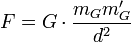
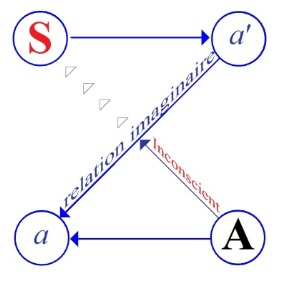
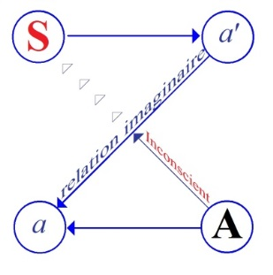

# Leçon 20 | 25 Mai 1955

<!-- source-url: http://staferla.free.fr/S2/S2 LE MOI.docx -->
<!-- seminar: s2 -->
<!-- lesson: 20 -->

<!-- id: s2-20-0001 -->

Qu’est-ce que je vais vous raconter aujourd’hui ? Je vous ai quittés la dernière fois sur une question un petit peu étrange, peut-être, mais qui sans doute venait en droit fil de ce que je vous ai dit, puisque *c’est là* en somme *que j’avais mis le point final*...

<!-- id: s2-20-0002 -->

> c’est bien là que je m’excuse auprès de ceux qui n’étaient pas là la dernière fois,
>
> ça va leur sembler surprenant en un endroit où on s’occupe de la psychanalyse

<!-- id: s2-20-0003 -->

…je vous ai demandé, somme toute, pourquoi est-ce que les planètes ne parlent pas ?

<!-- id: s2-20-0004 -->

Vous ne pouvez pas vous ima­giner que j’en ai été tellement content d’en être arrivé là. Il fallait bien en effet s’arrêter quelque part, histoire de voir ce qui nous met dans un rapport extrê­mement différentiel avec les planètes. Évidemment, nous pouvons le toucher à tout instant, ça n’empêche pas, à tout instant de l’oublier, et justement parce que toujours il y a une petite tendance à raisonner, des hommes et du monde humain, comme s’il s’agissait de lunes. C’est en somme le calcul de leurs masses, de leurs rapports, de leur gravitation qui est en fin de compte le dernier mot de ce qu’il s’agit. Il ne faut pas croire que c’est une illusion qui nous soit, à nous savants, particulière : c’est très tentant, et même très tentant tout spécialement pour les politiques.

<!-- id: s2-20-0005 -->

Il y a des ouvrages oubliés, comme ça, un ouvrage qui n’était pas spéciale­ment illisible, parce qu’il n’était probablement pas de l’auteur qui l’avait signé, qui s’appelait « *Mein Kampf »,* qui a perdu beaucoup de son actualité. À travers tout « *Mein Kampf »* je pense que vous vous souvenez, c’était d’un nommé HITLER, on y parlait des rapports entre les hommes comme de rapports entre des lunes et nous sommes toujours tentés de faire une psychologie, une psychanalyse de lunes.

<!-- id: s2-20-0006 -->

Il suffit pourtant tout de même de se rapporter immédiatement à l’expérience pour voir quand même la différence. Je suis rarement content. Mais enfin je n’étais pas spécialement content du tout ce jour-là, parce que sans doute j’avais tenté de voler trop haut, et je m’apercevais que mes battements d’ailes n’étaient peut-être pas ce que j’aurais souhaité moi-même tout à fait vous dire si tout avait été très bien préparé dans ce que je vous apportais.

<!-- id: s2-20-0007 -->

Quelques personnes bienveillantes, celles qui m’accompagnent à la sortie, m’ont dit que tout le monde était content, position j’imagine très exagérée ! Peu importe, on me l’a dit ! Cela ne m’a pas convaincu d’ailleurs sur le moment. Mais quoi ! Je me suis fait somme toute cette réflexion, si les autres étaient contents, c’était évidemment le principal. C’est justement en ça que je diffère d’une planète. Ce n’est pas simplement que je me fasse cette réflexion, mais que c’est vrai : si vous étiez contents, c’était essentiel.

<!-- id: s2-20-0008 -->

Et je dirai plus, dans toute la mesure où des confirmations me venaient de ce fait que vous étiez contents, eh bien mon Dieu, je devenais content *aussi*. Mais, quand même, avec une petite marge. Pas tout à fait content content. Il y avait eu quand même un espace entre les deux, le temps que je m’aperçoive que l’essentiel c’était que l’autre soit content, j’étais resté pendant un certain temps avec mon non contentement. En d’autres termes : *à quel moment suis-je vraiment moi ?* À savoir : le moment où je ne suis pas content, ou le moment où je suis content parce que les autres sont contents ?

<!-- id: s2-20-0009 -->

Ce rapport de la satisfaction du sujet avec la satisfac­tion de l’autre, entendez bien sous sa forme la plus radicale, est bien ce dont il s’agit *toujours*, quand il s’agit des rapports de l’homme. Et j’aimerais bien que le fait qu’il s’agisse en cette occasion de mes semblables ne vous trompe pas. J’ai pris cet exemple, parce que j’ai juré de prendre le premier exemple qui me soit tombé sous la main dans la suite de la question que je vous ai laissée la derniè­re fois.

<!-- id: s2-20-0010 -->

Mais vous allez voir, j’espère vous le faire voir aujourd’hui : vous auriez tort de croire qu’il s’agit là du même autre que cet autre dont je vous parle quelquefois, à savoir cet autre qui est le *moi*, plus précisément qui est *son image*, avec lequel il est dans *un rapport spéculaire*. Autrement dit, il s’agit bien là d’une différence radicale entre ma non-satisfaction et la satisfaction supposée de l’autre et le fait que ma satisfaction dépende de celle de l’autre.

<!-- id: s2-20-0011 -->

Il ne s’agit pas du tout d’une image d’identité, de réflexivité dans cette occasion, mais d’un rap­port d’altérité foncière. Mais ce n’est pas par cette pente que je vais aborder les questions aujour­d’hui, pas plus que je ne le fais jamais, je ne peux prendre, pour des raisons qui tiennent à la nature même de l’espace où nous nous déplaçons, c’est-à-dire le champ psychanalytique, et *épuiser* une question, la prendre en tant que telle, comme la question de l’autre. Néanmoins, je vous ai déjà indiqué à plusieurs reprises à quel point elle est essentielle et elle est la source de toutes sortes d’ambiguïtés dans l’analyse. Sachez simplement qu’il y a *deux* « *autres* » à distinguer, au moins deux :

<!-- id: s2-20-0012 -->

- un *Autre*, avec un A majuscule,

<!-- id: s2-20-0013 -->

- et un *autre*, avec un petit *a* qui est le *moi*. Et l’*Autre*, c’est bien de lui qu’il s’agit quand il s’agit de la fonction de la parole.

<!-- id: s2-20-0014 -->

Cela mérite d’être développé, démontré, appuyé, ce que je suis en train de vous dire. Je ne puis, comme d’habitude, vous le démontrer qu’au niveau des remarques de notre expérience. Néanmoins, pour ceux qui désireraient s’exercer à quelques petits tours d’esprit destinés à leur assouplir les articula­tions, je ne saurais trop leur recommander, à toutes fins utiles, la lecture du *Parménide.*

<!-- id: s2-20-0015 -->

C’est quand même là que la question de l’*Un* et de l’*autre* a été attaquée de la façon la plus rigoureuse et la plus suivie. C’est sans doute pour cela aussi que c’est un des ouvrages les plus incompris et considéré, je ne sais pourquoi, comme l’un des plus difficiles. Alors qu’après tout les capacités moyennes, mais ça n’est pas dire peu, d’un déchiffreur de *mots croisés* - n’oubliez pas que dans un texte, qui doit tout de même avoir quelque fami­liarité, je vous ai conseillé très formellement de faire des *mots croisés* \[cf. « *Fonction et champ de la parole et du langage en psychanalyse »* in *Écrits,* p. 266\] - doivent suffire.

<!-- id: s2-20-0016 -->

La seule chose qui soit essentielle est de soutenir votre attention jus­qu’au bout dans le développement des neuf hypothèses dans le *Parménide.* Il ne s’agit que de cela, faire attention. C’est la chose du monde la plus difficile à obtenir du lecteur moyen, en raison des conditions dans lesquelles se pra­tique ce sport de la lecture. La personne de mes élèves qui pourrait se consacrer à un commentaire psy­chanalytique du *Parménide* ferait pour tout le monde une œuvre très utile et en plus permettrait à la communauté de se retrouver dans pas mal de problèmes.

<!-- id: s2-20-0017 -->

Ceci dit, puisque nous en sommes au problème de *l’autre*, et ceci va dominer, par le biais où je pourrai l’attraper, notre séance d’aujourd’hui, revenons à nos planètes. Je vous ai posé la question tout ce qu’il y a de plus sérieusement : pour­quoi est-ce que les planètes ne parlent pas ? Est-ce qu’il y a quelqu’un qui a un tout petit peu frémi de la circonvolution autour de ce problème, tâché d’articu­ler quelque chose ?

<!-- id: s2-20-0018 -->

Il y a tout de même beaucoup de choses à dire. Ce qui est curieux n’est pas que vous n’en disiez aucune, c’est que vous ne manifestiez pas que vous vous apercevez qu’il y en a à la pelle. Si simplement vous osiez penser qu’il y en a à la pelle et prendre n’importe laquelle, car il est évident que ça n’est pas très important de savoir quelle est la dernière raison.

<!-- id: s2-20-0019 -->

Mais ce qu’il y a de certain c’est que si on essaie de les énumérer - je n’avais pas d’idée préconçue sur la façon dont ça peut être exposé au moment où je vous l’ai demandé - une chose curieuse, instructive, c’est que les raisons qui nous en apparaissent, appa­raissent tout à fait structurées comme les fameuses raisons dont nous avons déjà à plusieurs reprises rencontré le jeu dans l’œuvre de FREUD, à savoir celles dont il parle dans *le rêve de l’injection d’Irma*, à propos du chaudron qu’on avait rendu percé, c’est un petit peu du même ordre,

<!-- id: s2-20-0020 -->

- *premièrement parce qu*’elles n’ont rien à dire,

<!-- id: s2-20-0021 -->

- *deuxièmement parce qu*’elles n’en ont pas le temps,

<!-- id: s2-20-0022 -->

- *troisième­ment parce qu*’on les a fait taire.

<!-- id: s2-20-0023 -->

Les trois choses seraient vraies et nous per­mettraient de développer des rapports importants à l’égard de ce qu’on appelle une planète, c’est-à-dire justement de ce que j’ai pris comme terme de référen­ce pour montrer ce que nous ne sommes pas. J’ai posé la question à un éminent philosophe, l’un de ceux qui sont venus ici cette année nous faire une conférence, quelqu’un qui s’est beaucoup occupé de la valeur de l’histoire des sciences, et plus spécialement du newtonisme, ce qui ne peut pas ne pas être évoqué à propos des planètes, et a fait là-dessus les réflexions les plus pertinentes et profondes qui soient \[Alexandre Koyré\]. Mais on est toujours déçu quand on s’adresse - mais vous allez voir que je n’ai pas été déçu en réali­té - aux personnes dont il semble qu’elles soient des spécialistes, si je puis dire.

<!-- id: s2-20-0024 -->

La question ne lui a pas paru, au premier abord, soulever beaucoup de difficul­tés. Il a dit, parce qu’elles n’ont pas de bouche. Ce qui ne paraît pas une raison entièrement suffisante. Mais enfin, quand même, au premier abord j’ai été un peu déçu. Et comme toujours, j’avais tort. Il ne faut *jamais* être déçu des réponses qu’on reçoit, puisque c’est ce qu’il y a de merveilleux, c’est que ce soit une réponse, c’est-à-dire justement ce qu’on n’attendait pas.

<!-- id: s2-20-0025 -->

Ce point est éga­lement important, toujours en relation avec la question de l’*autre*, parce que nous avons trop tendance à toujours être hypnotisés par le système dit des lunes, à modeler notre idée de la réponse sur ce que nous imaginons, quand nous parlons de *stimulus-réponse*, c’est-à-dire justement nous avons la répon­se que nous attendions. Est-elle vraiment une réponse ? Voilà encore une autre question qu’on peut se poser, et je ne m’engage pas dans ce petit divertissement. Nous nous y engagerons plus tard.

<!-- id: s2-20-0026 -->

En fin de compte, la réponse qu’il me faisait très rapidement ne m’a pas déçu. Parce que je ne suis pas forcé d’entrer dans le labyrinthe de la question de savoir pourquoi les planètes ne parlent pas, par aucune des trois raisons dont je vous ai parlé tout à l’heure, encore que nous allions les retrouver forcément, car ce sont les trois vraies raisons. Mais on y entre aussi bien dans n’importe quelle réponse, en particulier celle-là est extrêmement illuminante à condition de savoir l’entendre. Et j’avais complètement oublié que j’étais dans de particuliè­rement bonnes conditions pour l’entendre, justement parce que je suis psy­chiatre.

<!-- id: s2-20-0027 -->

« *Parce qu’elles n’ont pas de bouche* »... On a déjà entendu cela : « *Je n’ai pas de bouche* ». Nous entendons cela au début de notre carrière psychiatrique dans les premiers services de psychiatrie auxquels nous arrivons comme des égarés, et que, tombant au milieu de ce monde miraculeux, nous rencontrons de très vieilles dames, de très vieilles filles, dont c’est auprès de nous la première décla­ration, premier signe d’abord : « *Je n’ai pas de bouche* ».

<!-- id: s2-20-0028 -->

Elles nous apprennent du même coup qu’elles n’ont pas non plus d’estomac. Pourtant, à quelqu’un qui n’a pas de bouche cela paraît un inconvénient minime, mais en plus qu’elles ne mourront jamais, qu’elles sont immortelles. Bref, nous pouvons nous aperce­voir qu’elles ont un très grand rapport justement avec le monde des lunes qui sont immortelles aussi. La seule différence, c’est que d’une certaine façon, pour les vieilles filles, les vieilles dames en question en proie à ce syndrome dit « *de Cotard »*, ou *délire de négation*, en fin de compte c’est vrai, pour de certaines rai­sons, c’est vrai. C’est-à-dire que l’image à laquelle elles se sont identifiées est très précisément cette image où manque toute béance, toute aspiration, tout vide du désir, à savoir ce qui proprement constitue la propriété de l’orifice buc­cal.

<!-- id: s2-20-0029 -->

Et dans toute la mesure en effet aussi où l’*identification* de l’*être* à son image pure et simple s’opère, il n’y a évidemment plus non plus aucune place pour *le changement*, c’est-à-dire la mort, et en effet c’est bien ce dont il s’agit dans leur thème, à la fois :

<!-- id: s2-20-0030 -->

- qu’elles sont mortes,

<!-- id: s2-20-0031 -->

- qu’elles ne peuvent plus mourir,

<!-- id: s2-20-0032 -->

- qu’en fin de compte elles sont immortelles. Le désir a en effet cette propriété. C’est ce qui le distingue de bien d’autres choses. Il ne faut pas tout mettre dans le même sac quand il s’agit de la folie, de représenter la structure de *l’imaginaire*. Dans toute la mesure où le sujet l’assu­me purement et simplement, s’identifie *symboliquement* avec l’*imaginaire*, il réalise ce qu’on appelle *le désir*.

<!-- id: s2-20-0033 -->

Que les étoiles se trouvent n’avoir non plus pas de bouche et être immortelles, ce qui est bien certain aussi, c’est évidemment d’un autre ordre. On ne peut absolument pas dire que ce soit vrai. Si nous le disons, nous dirions que c’est quelque chose d’absurde. Il n’est pas question que les étoiles aient une bouche. Et le terme d’*immortel*, au moins pour nous, avec le temps, est devenu purement métaphorique.

<!-- id: s2-20-0034 -->

Mais nous voyons là que c’est autre chose que le *vrai* : c’est réel. Incontestablement il est réel que l’étoile n’a pas de bouche. Mais personne n’y songerait, au sens propre du mot « *songer* », s’il n’y avait pas de gens pourvus d’un appareil à proférer *le symbolique* - à savoir : les hommes - pour le faire remarquer.

<!-- id: s2-20-0035 -->

Qu’elles soient réelles, c’est je crois la première raison* *:

<!-- id: s2-20-0036 -->

- qu’elles soient intégralement réelles,

<!-- id: s2-20-0037 -->

- qu’il n’y ait en princi­pe chez elles absolument rien qui soit de l’ordre d’une altérité à elles-mêmes,

<!-- id: s2-20-0038 -->

- qu’elles soient purement et simplement ce qu’elles sont,

<!-- id: s2-20-0039 -->

- et qu’on les retrouve en fin de compte *toujours à la même place*, c’est là un des premiers points essen­tiels pour lesquels les étoiles ne parlent pas.

<!-- id: s2-20-0040 -->

Car c’est bien dans ce « *toujours à la même place* » que réside le fait de tout ce qui va se développer par la suite, à savoir qu’en fin de compte il suffisait de s’en apercevoir, si je puis dire, pour donner toute sa rigueur au fait que ce sont des réalités. Évidemment, on ne s’en est pas aperçu tout de suite. Et vous avez vu que j’oscille de temps en temps dans mes mots, entre *les planètes* et *les étoiles*. Ce n’est pas pour rien. C’est bien enten­du que « *toujours à la même place* » ce n’est pas les planètes qui nous l’ont montré d’abord, mais les étoiles, comme chacun sait.

<!-- id: s2-20-0041 -->

Et ce mouvement, parfaitement régulier du jour sidéral est ce qui a donné certainement pour la première fois aux hommes l’occasion d’éprouver la stabilité du monde changeant qui les entoure, commencer à établir cette dialectique du *symbolique* et du *réel*, où bien entendu on voit apparemment le *symbolique* jaillir du *réel*, en descendre si je puis dire, ce qui naturellement n’est pas plus fondé que de penser que les étoiles dites *fixes* tournent réellement autour de la terre. De même que ça n’est pas autre chose que ce mouvement de la terre dans *cette parfaite félicité* de la rotation du ciel, de même il ne faudrait pas croire qu’effectivement les *symboles* ne soient venus du *réel*.

<!-- id: s2-20-0042 -->

Mais il n’en est pas moins frappant de voir à quel point ont été captivantes ces *formes singulières*, pour bien dire, et qui ont toujours frappé les humains, et dont après tout rien ne fonde le groupement. *Pourquoi est-ce que* les humains ont vu *la Grande Ourse* *comme telle* ? *Pourquoi est-ce que les Pléiades* sont si évidentes ? *Pourquoi est-ce qu’Orion* est ainsi vu ?

<!-- id: s2-20-0043 -->

Je ne serais pas foutu de vous le dire. Je pense qu’on n’a pas groupé autrement ces points lumineux. Je vous le demande. Il est bien certain que nous voyons là un point qui est assez significatif et n’a pas manqué de jouer son rôle *aux aurores* \- que nous distinguons mal, d’ailleurs - *de l’humanité*, mais d’une façon tenace qui en a perpétué les signes jusqu’à nos jours et donne un exemple bien singulier de la façon dont *le symbolique* accroche.

<!-- id: s2-20-0044 -->

Car jusqu’à nos fameuses « *propriétés de la forme »* dont nous faisons de grandes choses, elles ne paraissent pas absolu­ment convaincantes pour expliquer la façon dont nous avons groupé les constellations. Ceci dit, nous en serions pour nos frais, à savoir depuis longtemps ce qui en est : qu’il n’y a pas quoi que ce soit de fondé dans cette apparente sta­bilité des étoiles qu’on retrouve *toujours à la même place*. C’est la définition même de se retrouver *à la même place*.

<!-- id: s2-20-0045 -->

Nous avons évidemment fait un progrès essentiel quand nous nous sommes aperçus qu’il y avait des choses, par contre, qui l’étaient réellement, qu’on avait vues d’abord sous la forme de planètes errantes, et effectivement nous nous sommes aperçus que ce n’était pas seule­ment en fonction de nous, de notre propre rotation, mais d’une façon effective­ment réelle qu’une partie de ces astres qui peuplent le ciel se déplacent et se retrouvent tout à fait réellement toujours à la même place. C’est une première raison, cette réalité, pour que nos planètes ne parlent guère. Néanmoins, on aurait tort de croire qu’elles soient si muettes que cela.

<!-- id: s2-20-0046 -->

Elles le sont si peu que d’abord ce n’est que trop évident, puisqu’elles ont été longtemps confondues avec *les symboles naturels*. Il n’est que trop évident que nous les avons fait parler, et qu’après tout on aurait bien tort de ne pas se poser la question de savoir comment ça tient. Pendant très longtemps, n’oubliez pas, et jusqu’à une époque très avancée des progrès que nous avons pu faire quant à la considération du mouvement de ces astres, certaines choses sont quand même restées, *le résidu* d’une espèce, non pas simplement *de réalité*, mais d’existence subjective de ces personnes qui s’appellent les planètes.

<!-- id: s2-20-0047 -->

Et M. COPERNIC encore - ce qui ne manquera pas de vous intéresser - qui avait fait faire un pas décisif dans le repérage de la parfaite régularité du mouvement de ces astres, cette physique dont je parlai à l’instant, en était à penser :

<!-- id: s2-20-0048 -->

- qu’un corps de la terre qui serait sur la lune ne manquerait pas de faire tous ses efforts pour rentrer à la maison, c’est-à-dire sur la terre,

<!-- id: s2-20-0049 -->

- qu’inversement un corps lunaire n’aurait de peine ni de cesse qu’il ne se soit réenvolé vers sa terre maternelle. C’est vous dire combien, pendant longtemps ont persisté, même pour ces objets dont nous croyons avoir fait le tour, des notions qui nous montrent qu’il est très difficile de ne pas faire avec des réalités des *êtres*.

<!-- id: s2-20-0050 -->

Enfin quand même, enfin NEWTON vint. Et il y avait déjà un moment que ça se préparait. Parce que si l’histoire des sciences vous intéresse, vous pourrez voir qu’il n’y a pas de meilleur exemple que l’histoire des sciences pour savoir à quel point le discours humain est universel. C’est-à-dire qu’on est à se deman­der pourquoi en fin de compte il faut le regarder à la loupe pour bien se rendre compte pourquoi il y a eu une *fin du fin* qui part de l’homme, l’astucieux des astucieux, et a fini par donner la formule définitive de ce que tout le monde brû­lait depuis un siècle, autour de ce dont il s’agissait, à savoir, en fin de compte : les faire taire. Et NEWTON y est définitivement arrivé.

<!-- id: s2-20-0051 -->

Ce « *silence éternel des espaces infinis* » dont l’approche, ou plutôt la réalisation définitive effrayait M. DESCARTES \[*lapsus* : Pascal\] était une chose acquise après NEWTON, à savoir qu’il était clair que les étoiles ne parlaient pas. Les planètes étaient *muettes,* et *elles étaient muettes pour une raison définitive*, la seule véritable raison, car enfin « *on ne sait jamais ce qui peut arriver avec une réalité »* ! Je vais vous rappeler tout de même quelques petites choses. Je suis forcé dans le circuit de mon discours de vous le rappeler, mais d’une façon fugitive, pour ne pas nous égarer. Mais on ne sait jamais. Et la question que je vous posai tout à l’heure : « *Pourquoi les planètes ne parlent-elles pas ?* » est *vraiment* une question.

<!-- id: s2-20-0052 -->

« *On ne sait jamais ce qui peut arriver avec une réalité* » jusqu’au moment où *on l’a réduite définitivement à s’inscrire dans un langage*. Et l’on est bien et définitivement sûr que les planètes ne parlent pas que depuis le moment où on leur a rivé leur clou, c’est-à-dire où la théorie newtonienne nous donne sous une première forme, qui a été complétée depuis, mais qui était déjà parfaitement satisfaisante pour tous les esprits humains, la théorie du champ unifié.

<!-- id: s2-20-0053 -->

La théorie du champ unifié est toute entière résumée dans *la loi de gravitation* et consiste essentiellement en ceci qu’il y a une formule, un lan­gage parfaitement valable qui tient tout cela ensemble, et un langage ultra­simple qui s’écrit dans une petite formule comprenant *trois lettres*. Je ne vais pas l’écrire au tableau parce que je ne veux pas que vous confondiez ce que je suis en train de vous dire avec un cours de cosmographie. Mais c’est là l’im­portant.

<!-- id: s2-20-0054 -->

<!-- id: s2-20-0055 -->

Vous auriez tort de croire, qu’aux yeux de quiconque regarde ce dont il s’agit, personne n’a jamais pu qu’y croire et tout de suite : tous les esprits contem­porains ont fait toutes les objections, à savoir :

<!-- id: s2-20-0056 -->

- cette forme de *la gravitation*, qu’est-ce que c’est ?

<!-- id: s2-20-0057 -->

- C’est impensable, *on n’a jamais vu ça*, *l’action à distance* !

<!-- id: s2-20-0058 -->

Par définition, toute espèce d’action est une action de proche en proche. Cette action à distance à travers le vide…

<!-- id: s2-20-0059 -->

> cette action qui s’exerce à distance, en tant qu’à distance

<!-- id: s2-20-0060 -->

…il y a là *quelque chose d’hétérogène* avec le reste du système.

<!-- id: s2-20-0061 -->

Car pour que le système de NEWTON ait sa valeur, il faut un certain nombre de *réa­lités* qui existent. Eh bien, il y a *la matière, le mouvement*. Hélas, ne nous engageons pas là-dedans. Si vous saviez à quel point le mouvement newtonien est une chose impigeable quand on y regarde de près, vous frémiriez ! Je ne suis pas là pour vous pencher sur les abîmes du newtonisme. Vous verriez que ce n’est pas le privilège de la psychanalyse d’opérer sur des notions contradic­toires. Le *mouvement newtonien* utilise le temps. Le temps de la physique, per­sonne ne s’en inquiète, car il ne s’agit absolument pas de quoi que ce soit qui concerne des réalités. Il s’agit du juste langage, et on ne peut absolument pas considérer le champ unifié autrement que comme un langage bien fait, comme une syntaxe. Pour tout dire, c’est le seul cas dans ce que nous connaissons...

<!-- id: s2-20-0062 -->

> dans ce que nous appréhendons comme registre de la science et uniquement à la somme de la physique
>
> qui entre dans la théorie du champ unifié, c’est-à-dire que ça s’est beaucoup augmenté depuis M. EINSTEIN

<!-- id: s2-20-0063 -->

...où on peut appliquer le terme - pour nous, dans l’expérience humaine, complètement contradictoire - de « *réalité vraie* ».

<!-- id: s2-20-0064 -->

Nous sommes tranquilles de ce côté-là, les planètes et tout ce qui les concerne, tout ce qui rentre dans le champ unifié, ne parlera plus jamais, parce que ce sont des réalités complètement réduites au *langage*. Je pense que vous voyez ici assez la contradiction qu’il y a, ou l’opposition qu’il y a entre *paro­le* et *langage*. Ne croyez pas que notre posture à l’égard de toutes les réalités soit du même registre, soit arrivée à ce point de réduction définitive qui est tout de même bien satisfaisant. Car, quand même, si les planètes et toutes sortes d’autres choses encore qui sont du même ordre parlaient, ça ferait quand même une drôle de discussion, et l’*effroi* de M. PASCAL se changerait peut-être en *terreur*.

<!-- id: s2-20-0065 -->

En fait, chaque fois que nous avons affaire à un monde où reste un résidu de la notion d’action, d’action véritable, authentique, de ce quelque chose de nou­veau qui surgit d’un sujet, et il n’y a pas besoin pour cela que ce soit un sujet animé, chaque fois qu’il s’agit d’une action comme telle, nous nous trouvons devant quelque chose dont seul notre inconscient est à ne point s’effrayer.

<!-- id: s2-20-0066 -->

Car au point où se poursuivent actuellement les progrès de la physique, on aurait tort de s’imaginer que c’est couru d’avance, que pour le tout petit, l’atome, l’électron, on leur a déjà rivé leur clou. Pas du tout ! Et il est bien évident que nous ne sommes pas ici pour suivre les rêveries auxquelles à tout instant les gens ne manquent pas de s’abandonner, de la liberté ! Ce n’est pas de cela qu’il s’agit.

<!-- id: s2-20-0067 -->

Mais il est bien clair que c’est du côté du langage qu’il se produit quelque chose de drôle. C’est à quoi se ramène le principe d’HEISENBERG. C’est que quand on peut préciser un des points du système, on ne peut pas formuler les autres. Quand on parle de la place des électrons, quand on leur dit *« tenez-vous là, res­tez toujours à la même place »* on ne sait plus du tout où en est ce que nous appe­lons couramment leur vitesse.

<!-- id: s2-20-0068 -->

Qu’inversement si on leur dit *« eh bien, entendu : vous vous déplacez tout le temps de la même façon »* on ne sait plus du tout *où ils sont*. Ceci, bien entendu, je ne dis pas qu’on va rester toujours dans cette position, quand même éminemment persiflante. Mais c’est peut-être ce qui, jus­qu’à nouvel ordre nous donne l’idée que puisqu’on ne peut pas unifier le champ du langage, eh bien, jusqu’à nouvel ordre, nous ne pouvons dire qu’une chose c’est qu’ils ne répondent pas là où on les interroge. Plus exactement, que du fait de les interroger quelque part, il y a à ce moment-là l’impossibilité de les saisir dans l’ensemble.

<!-- id: s2-20-0069 -->

Bien entendu, la question n’est pas tranchée de ce seul fait qu’ils ne répon­dent pas. C’est même peut-être que justement il peut y avoir ce qu’on appelle une véritable réponse, c’est-à-dire quelque chose qui - ce n’est pas douteux : on n’est pas tranquille - un jour peut nous surprendre, de sorte qu’en fin de compte pour ne pas parler de mysticisme je ne vais pas vous dire que les atomes et les électrons *parlent*.

<!-- id: s2-20-0070 -->

Mais, pourquoi pas ? Tout se passe *comme si.* Il est très certain, en tout cas, que la chose serait complètement démontrée à partir du moment où ils commenceraient à nous *mentir*. Si les atomes pouvaient nous *mentir*, c’est-à-dire *jouer avec nous au plus fin*, nous serions absolument convaincus, à juste titre. Vous touchez là du doigt, de quoi il s’agit : des « *autres* » en tant que tels, et non pas simplement en tant qu’ils reflètent notre catégorie *a priori* \[Kant\] et toutes les formes plus ou moins transcendantales de notre intuition. Enfin c’est - Dieu merci ! - des choses auxquelles nous aimons mieux ne pas penser.

<!-- id: s2-20-0071 -->

Si un jour ils commençaient sur ce plan là, c’est-à-dire qu’ils nous foutent dedans, vous voyez où on irait ! On ne saurait véritablement plus où on est ! C’est le cas de le dire ! Et c’est bien à cela que je faisais allusion la dernière fois, à quoi pensait tout le temps M. EINSTEIN, qui ne cessait pas de s’en émerveiller, à la vérité.

<!-- id: s2-20-0072 -->

C’est une phrase à laquelle on aurait tort de ne pas donner toute son importance, tout le temps il rappelait au monde que :

<!-- id: s2-20-0073 -->

« *Le Tout-puissant est un petit rusé, mais il n’est certainement pas malhonnête* ».

<!-- id: s2-20-0074 -->

Et c’est d’ailleurs la seule chose qui permette, justement - parce qu’il s’agit là du « *Tout-puissant »* non physique - de faire la scien­ce, c’est-à-dire en fin de compte de le réduire au silence, le « *Tout-puissant »*.

<!-- id: s2-20-0075 -->

C’est bien autour de cela que M. EINSTEIN est resté à méditer, pas jusqu’à ses derniers moments, mais très longtemps. Et il a éprouvé le besoin de le rappeler à tout le monde. Ceci, nous pouvons l’éclairer de mille façons. J’ai essayé de vous montrer ces vérités premières par le chemin le plus court, mais la question est de savoir si, quand il s’agit de cette *science humaine* par excellence qui s’appelle *la psycha­nalyse*, si notre but et notre fin est d’arriver au *champ unifié*, est d’arriver à faire de l’homme et des hommes, des lunes, et si nous ne les faisons tellement parler que pour arriver à les faire taire.

<!-- id: s2-20-0076 -->

La question est tout à fait essentielle. Ce n’est pas moi qui l’ai inventée. Tout un chacun - bien entendu, c’est une façon de s’ex­primer - vous dira que c’est là l’interprétation la plus correcte de « *la fin de l’his­toire* » si souvent évoquée par M. HEGEL, le moment où les hommes n’auront plus qu’à la clore.

<!-- id: s2-20-0077 -->

Ce qui revient au retour accompli à une vie animale. Je ne sais pas si je ne discuterais pas ce point de vue avec lui, à savoir si un homme, plus exac­tement *des hommes* - car il n’y a pas *un* homme, à ce niveau-là, il y a *un* homme aussi, mais ailleurs - si *des hommes* qui en sont arrivés à n’avoir plus besoin du langage sont des animaux.

<!-- id: s2-20-0078 -->

C’est une grave question, qui ne me paraît pas tran­chée, dans aucun sens. Je ne suis ni sûr dans ce que j’apporterai à \[Koyré ?\], ni non plus de ce qu’il me répondrait, parce que je ne lui ai pas encore apportée. En tout cas, la question que j’évoque, de savoir comment nous devons considérer notre tra­vail, est au cœur de la technique analytique et très précisément des erreurs scan­daleuses dans lesquelles on s’engage quand on prend les choses d’une certaine façon.

<!-- id: s2-20-0079 -->

J’ai lu pour la première fois un article très sympathique sur « *la cure type »*, ce qu’on appelle…

<!-- id: s2-20-0080 -->

> il ne faut pas confondre *la cure type* avec certaine façon de révéler le type de la cure

<!-- id: s2-20-0081 -->

…« *Nécessité de maintenir intactes les capacités d’ob­servation du moi* ». Je vois cela écrit en *lettres grasses* \[Cf. trimé­thylamine\]. Et puis \- mon Dieu - après tout, comme ce n’est pas la première fois que je lis cet auteur, je sais bien où sont les points importants. On y parle d’un miroir, qui est l’analyste, ce n’est pas mal ! Le fait de parler du miroir n’est jamais une mauvaise chose, quoi qu’on en dise. Mais enfin on le voudrait « *vivant* », ce miroir. C’est comme pour la « *réalité vraie* » : un *miroir vivant*, je me demande ce que c’est. C’est bien qu’il y a une difficulté.

<!-- id: s2-20-0082 -->

Ce *pauvre* qui parle de *miroir vivant*, c’est parce qu’il sent qu’il y a quelque chose qui cloche dans cette histoire de miroir. Je voudrais qu’on m’explique ! Je voudrais surtout qu’on m’explique où est l’essentiel de l’analyse ? Qu’on m’explique si l’analyse doit consister dans la réalisation *ima­ginaire* ?

<!-- id: s2-20-0083 -->

Si on y arrive, à cette opération truculente, c’est qu’on en parle,

<!-- id: s2-20-0084 -->

- c’est-à-dire que c’est dans toute la mesure où on fait du *moi* une réalité,

<!-- id: s2-20-0085 -->

- c’est-à-dire où on fait du *moi* ce quelque chose qui est, comme on dit « *intégratif* »,

<!-- id: s2-20-0086 -->

- c’est-à-dire ce qui tient la planète ensemble.

<!-- id: s2-20-0087 -->

Mais non seulement cette planète ne parle pas :

<!-- id: s2-20-0088 -->

- parce qu’elle est *réelle*,

<!-- id: s2-20-0089 -->

- mais parce qu’*elle n’a pas le temps*, au sens littéral du mot : elle n’a pas *le temps*. Pourquoi ? Elle n’a pas le temps parce qu’elle est ronde. Et l’intégration c’est ça. C’est que le corps circulaire peut faire tout ce qu’il veut, il reste toujours bien égal à lui-même.

<!-- id: s2-20-0090 -->

Et en fin de compte il s’agit de l’arrondir, ce *moi*. Et ce qu’on nous propose comme *but* essentiel de cette analyse c’est bien, par une sorte de confusion où le *moi* est confondu avec le sujet, c’est bien en effet de donner à ce *moi* la *forme sphérique* où il aura définitivement intégré tous ses états dis­joints, fragmentaires, ses membres épars, auxquels nous donnons maintenant toute l’attention sous le nom d’étapes prégénitales, de pulsions partielles, d’*ego* innombrables.

<!-- id: s2-20-0091 -->

Cette course à l’*ego triomphant *: autant d’*ego*, autant *d’objets*. Je ne veux pas dire que tout cela soit *ego,* il y a des degrés. Bien entendu, tout cela n’est pas sans raison, que la libido d’objet \[...\] n’est pas une chose qui soit sans intérêt, en effet c’est une chose certaine *dans la structure du champ imaginaire*. Mais ceci repose également sur toutes sortes *d’équivoques*, et principalement *d’équivoques* essentielles dans *le langage*, tout le monde - je vous l’ai indiqué hier soir en passant – ne mettant pas du tout la même chose, sous le terme de « *relation d’objet »*.

<!-- id: s2-20-0092 -->

Mais il est certain que la théorie psychanaly­tique - car il faut cerner les choses - dès qu’elle finit par prendre corps, par se fixer, à mon avis prématurément chez quelqu’un qui dans un temps paraissait partir d’un meilleur pas...

<!-- id: s2-20-0093 -->

> je veux dire en prenant les choses par ce biais, par cette bande, par l’intérêt récent - je ne dis pas pour cela
>
> moins digne pour nous - de relation d’objet, de pulsion partielle, dans la psychanalyse

<!-- id: s2-20-0094 -->

…qui paraissait pouvoir arriver à situer ça à sa place, à fixer, à centrer toute l’opération psycha­nalytique sur ce *plan de l’imaginaire*, en fin de compte n’arrive à rien de moins qu’à cette sorte de *perversion* dont je vous parlais tout à l’heure qui consiste à mettre tout son progrès dans cette *relation imaginaire* du sujet à son niveau le plus primitif, qui peut montrer ses effets à l’expérience.

<!-- id: s2-20-0095 -->

Dieu merci, l’expérience n’est jamais poussée à son dernier terme dans l’analyse. En d’autres termes :

<!-- id: s2-20-0096 -->

- Dieu merci, *on ne fait pas* ce qu’on dit que l’on fait,

<!-- id: s2-20-0097 -->

- Dieu merci, on reste très en deçà de ses buts,

<!-- id: s2-20-0098 -->

- Dieu merci, on rate ses cures, et c’est pour cela que le sujet en réchappe.

<!-- id: s2-20-0099 -->

Car, dans *la ligne où s’engage l’auteur* \[Bouvier\] dont je parlais à l’instant, je crois qu’on peut démontrer avec la plus grande rigueur que sa façon de concevoir la cure de *la névrose obsessionnelle* n’aurait pas d’autre fin et d’autre résultat que de *paranoïser* le sujet. Et la chose est déjà très facile à apercevoir en ceci : c’est que pour lui toute la question de l’analyse tourne autour de la limite de ses indications à la frontière des névroses et des psychoses, et que ce qui lui paraît le danger, l’abîme perpétuellement côtoyé dans la cure de *la névrose obsessionnelle,* c’est l’apparition de *la psychose*.

<!-- id: s2-20-0100 -->

Autrement dit, pour l’auteur dont je parle, le névro­sé obsessionnel est en réalité un fou. Nous allons tâcher de leur bien mettre *les points sur les i*. Qu’est-ce que c’est que ce fou ? C’est un fou qui se maintient à distance de sa folie, c’est-à-dire de la plus grande perturbation imaginaire qui soit : il s’agit d’un fou paranoïaque. Je dis « *la plus grande perturbation imaginaire* » comme telle, je ne dis pas que cela définit toutes les formes de la folie, je parle du déli­re et de la paranoïa.

<!-- id: s2-20-0101 -->

La façon dont *l’auteur dont je parlais* conçoit ce manie­ment, qui doit être maintenu toujours sur une sorte de frontière fragile, qui est justement celle en deçà de laquelle se tient le sujet à l’entendre, seulement et à proprement parler pour autant qu’il tient le langage social, c’est-à-dire que tout ce qu’il vous raconte n’a rien à faire avec son vécu, que c’est là *l’interpré­tation qu’il donne de l’obsédé*.

<!-- id: s2-20-0102 -->

À savoir que c’est dans une sorte de conformis­me purement verbal que se soutient d’une façon tout à fait précaire cet équi­libre pourtant apparemment bien solide, car quoi de plus difficile à culbuter qu’un *obsédé* ? Néanmoins, tout serait là.

<!-- id: s2-20-0103 -->

Et si *l’obsédé* résiste et se crampon­ne en effet si fort, c’est justement dans la mesure où - aux dires de l’auteur dont je parle - *la psychose* serait là derrière, toujours immanente, à savoir l’état de désintégration imaginaire du *moi*. Là s’apparente le *[pandemonium](http://fr.wikipedia.org/wiki/Pand%C3%A9monium)* et les *moi* diversement séparés, morcelés, distincts, dont il s’agissait tout à l’heure et l’au­teur n’en a d’ailleurs pour preuve que l’apparition, car il ne peut pas... je crois qu’il hésiterait à le faire, mais je crois qu’il n’a aucune possibilité de le faire, hélas pour lui, pour la solidité de sa démonstration ...montrer un obsédé qu’il aurait vraiment rendu fou.

<!-- id: s2-20-0104 -->

Il y a de fortes raisons pour cela. Disons que, en voulant le préserver de ses folies soi disant menaçantes, il arrive, s’il réussit - mais, comme je vous le disais tout à l’heure : Dieu merci, il ne réussit pas - il arriverait à en faire *quelque chose* qui, en effet, jusqu’à un certain point, n’en serait pas très loin.

<!-- id: s2-20-0105 -->

La question de la paranoïa post-analytique est une question très loin d’être une question mythique. Il n’y a pas du tout besoin qu’une cure ait été poussée extrêmement loin pour que l’analyse donne une paranoïa tout à fait consistan­te. Je l’ai vu pour ma part dans ma carrière, dans ce service[^56]*.* Et c’est dans ce ser­vice qu’on peut le mieux le voir, parce qu’on est amené tout doucement à les faire glisser vers les services libres, et de là, enfin, ils s’intègrent dans le service fermé. Cela arrive ! Il n’y a pas besoin d’avoir pour cela *un bon psychanalyste*. Il suffît de croire très fermement à la psychanalyse.

<!-- id: s2-20-0106 -->

J’ai vu des *paranoïas* qu’on peut qualifier de *post-analytiques*, qui peuvent être dites tout simplement spon­tanées. Dans un milieu adéquat, à savoir avec une très vive préoccupation des faits psychologiques, un sujet qui a tout de même quelque pente peut arriver à se cerner de problèmes sans aucun doute naturellement fictifs, mais problèmes auxquels il donne une telle consistance, et dans un langage déjà tout préparé, celui de la psychanalyse, qui court les rues, pour se donner tout le matériel.

<!-- id: s2-20-0107 -->

Et il faut bien le dire, c’est très important d’aider à l’accouchement d’un délire. Cela met en général très longtemps à se faire, un délire chronique, *il faut que le sujet en mette un bon coup*, en général il met le tiers de sa vie à le devenir. Mais je dois dire que la littérature analytique, d’une certaine façon, constitue un délire *ready made.* Il n’est pas rare de voir des sujets habillés comme ça, de confec­tion tenant comme à leur peau.

<!-- id: s2-20-0108 -->

Disons donc qu’une certaine façon de prendre l’analyse du *moi* peut en effet mener tout droit à une certaine paralysation dont après tout beaucoup du style, si je puis dire, représenté par des personnes dans l’entourage immédiat, d’un certain attachement à « *bouche close au mystère ineffable de l’expérience analy­tique* » ne nous représente, je crois, qu’une forme atténuée dont on aurait tort de croire qu’en fin de compte *les racines, les assises, l’assiette* ne soit pas exacte­ment homogène à ce que j’appelle à l’instant « *paranoïa »*.

<!-- id: s2-20-0109 -->

Je voudrais aujourd’hui vous proposer ce que je disais l’année dernière à propos d’autre chose…

<!-- id: s2-20-0110 -->

> mais c’est la même chose, je raconte toujours la même chose !

<!-- id: s2-20-0111 -->

…un petit schéma, pour essayer de vous illustrer, de commencer de vous illustrer les problèmes que je soulève à propos de ce *moi*, de cet *autre*, et en fin de compte du *langage* et de *la parole*. Ce schéma naturellement ne serait pas un schéma s’il présentait une solution. Mais après tout ce n’est même pas un modèle. C’est une infirmité de notre esprit discursif et une façon de fixer les idées.

<!-- id: s2-20-0112 -->

Je n’ai pas réévoqué, parce que je pense que vous y êtes déjà assez familiers, ce qui distingue l’*imaginaire* et le *symbolique*. S’il fallait que je le refasse, je le referais. Je pense que pour tous, ici, c’est supposé connu ?Voyons, de quoi s’agit-il ?

<!-- id: s2-20-0113 -->

Qu’est-ce que nous savons concernant le *moi* ? Nous partons de l’idée…

<!-- id: s2-20-0114 -->

- parce que nous sommes ici et que je vous l’ai seriné depuis assez longtemps,

<!-- id: s2-20-0115 -->

- parce qu’en fin de compte c’est là qu’est toute la dis­cussion …de savoir si le *moi* est *réel* : s’il est une lune, ou s’il est une construction *imaginaire* ?

<!-- id: s2-20-0116 -->

Nous sommes de ceux - nous n’en sommes pas, mais par défini­tion nous en parlons - qui disent qu’il n’y a pas moyen de saisir quoi que ce soit de la dialectique analytique si nous ne savons pas d’abord que *le moi est une construction imaginaire*. Cela ne lui retire rien, à ce pauvre *moi*, le fait qu’il soit *imaginaire*, je dirais même que c’est ce qu’il a de bien. S’il n’était pas *ima­ginaire*, nous ne serions pas des hommes, nous serions des *lunes*.

<!-- id: s2-20-0117 -->

Ce qui ne veut pas dire qu’il suffit que nous ayons ce *moi imaginaire* pour être des hommes. Nous pouvons être encore cette chose intermédiaire qui s’appelle « *un fou* ». Un fou est justement celui qui est complètement adhérent à cet *imaginaire*, pure­ment et simplement, et comme tel.

<!-- id: s2-20-0118 -->

<!-- id: s2-20-0119 -->

Ici, en haut, la lettre S : c’est la lettre S mais c’est peut-être autre chose enco­re, c’est le sujet, le sujet analytique tel que nous le prenons, c’est-à-dire non pas dans sa totalité…

<!-- id: s2-20-0120 -->

> comme on passe son temps à nous casser les pieds à le dire avec sa totalité ! Parce que, pourquoi serait-il total ? Nous n’en savons rien. Vous en avez déjà rencontré, vous, des êtres totaux ? C’est peut-être *un idéal*, mais je n’en ai jamais vu. Moi, je ne suis pas total. Vous, non plus. Si on était totaux, on serait chacun de son côté, totaux,
>
> on ne serait pas là, ensemble, à essayer de s’or­ganiser, comme on dit

<!-- id: s2-20-0121 -->

…c’est le sujet, non pas dans sa totalité, mais dans son ouverture, c’est le sujet, celui qui y aspire, et c’est lui.

<!-- id: s2-20-0122 -->

Mais comme d’habitude, il ne sait pas ce qu’il dit. S’il savait ce qu’il dit, il ne serait pas là, pour s’expli­quer avec nous. Il est là \[*a’*\]. Bien entendu *ce n’est pas là qu’il se voit*. Cela ne s’est jamais vu, même à la fin de l’analyse, et ça ne se verra jamais. C’est justement parce qu’il se voit là \[*a*\] quelque part de l’autre côté de quelque chose, qu’il a un *moi*, c’est-à-dire qu’il peut croire que c’est ça \[*a*\] qui est lui. Et tout le monde en est là et il n’y a pas moyen d’en sortir !

<!-- id: s2-20-0123 -->

Vous retrouverez naturellement la symétrie du plan dénommé *spéculaire*, mais vous auriez tort de croire que c’est de cela que je veux vous parler aujour­d’hui. Je suppose cela assuré, connu. Ce que nous apprend l’analyse, c’est que c’est ce *moi* qui est le sujet sous une forme autre - qui est une forme tout à fait fondamentale, si fondamentale, pour la constitution de ses *objets -* que c’est très précisément sous la forme de cet autre spéculaire \[*a*\] qu’il va commencer, à l’inté­rieur de ce cadre, *sous cette forme d’abord*, qu’il verra celui que, à juste titre et pour des raisons qui sont structurales, nous appelons *son semblable*. En d’autres termes, c’est à ce niveau, d’une façon qui lui est en quelque sorte superposable par essence, qu’il va avoir affaire à une certaine forme de l’*autre* \[*a*\], celle qui a le plus grand rapport avec son *moi* comme tel.

<!-- id: s2-20-0124 -->

Je vous disais tout à l’heu­re qu’il ne fallait pas que vous preniez purement et simplement pour *le plan du miroir* quelque chose qui est parfaitement cohérent avec l’établissement de *ce monde* - des *ego* et des *autres -* *homogène*, ce quelque chose qui existe, sur lequel même nous nous fondons, sur lequel justement c’est la question de voir aujour­d’hui, la façon, la fonction, le rôle que nous allons lui donner.

<!-- id: s2-20-0125 -->

<!-- id: s2-20-0126 -->

Et ceci \[*a’→ a*\] nous allons l’appeler *le mur du langage*. J’ai dit « *le mur du langage »*, car ce dont il s’agit de s’apercevoir c’est que... dans l’ordre défini par *le mur du lan­gage*, d’où *l’imaginaire* a pris cette fausse réalité, c’est tout de même une réalité vérifiée :

<!-- id: s2-20-0127 -->

- qui s’appelle le *moi*, tel que nous l’utilisons,

<!-- id: s2-20-0128 -->

- qui s’appelle l’*autre*, le *semblable*, ...tous *ces imaginaires* sont traités *comme des objets*, comme des objets dont nous oublions, dont nous pouvons oublier à tout instant qu’ils ne sont pas des *objets* absolument homogènes aux lunes, mais qui sont pourtant des objets puisque nommés comme tels dans un système organisé qui est celui du *mur du langage*.

<!-- id: s2-20-0129 -->

Que va-t-il se passer quand ce sujet parle avec ses semblables ? Il parle avec ses semblables dans *le langage commun*, dans le langage qui tient leur *moi* *ima­ginaire* pour des choses non pas simplement *ex-sistantes,* mais *réelles*, c’est-à-dire que si, lui, il ne peut pas du tout savoir ce qui est dans le champ du *réel* - je veux dire là où le dialogue concret se tient *-* ici, eh bien, il a affaire à un cer­tain nombre de *a’* ou *a’’,* qui sont là des objets, et auxquels, par l’intermédiaire de *la réflexion* sur *le mur du langage,* il s’adresse.

<!-- id: s2-20-0130 -->

Ces personnages qui sont là, dans le monde réel, qu’il tient pour réel, ces homogènes, c’est le même type de personnages que ceux qui sont là de l’autre côté du mur du langage. En d’autres termes, le miroir est à la fois là où on veut le mettre \[*a* → *a*’\], *et là aussi* entre S et A1, A2... \[tous les A\] comme il est entre S et α, β... \[tous les *a*\], je veux dire, pour autant que le sujet les met en relation avec sa propre image, ceux auxquels il parle sont aussi ceux auxquels il s’identifie.

<!-- id: s2-20-0131 -->

Ceci dit, vous voyez bien qu’il ne faut pas que nous omettions ceci, car c’est notre supposition de base. Nous pouvons la négliger, mais si nous sommes ici des analystes, c’est que nous croyons qu’il y a d’autres sujets que nous, qu’il y a des rapports authentiquement intersubjectifs.

<!-- id: s2-20-0132 -->

Je dois dire que nous n’aurions aucune raison de le penser si, justement, nous n’avions pas le test, le témoigna­ge de ce qui caractérise l’*intersubjectivité*, c’est-à-dire que le sujet peut nous mentir. C’est la preuve décisive, suprême, je ne dis pas que c’est le seul fondement de la réalité de *l’autre sujet*, c’est sa preuve. En d’autres termes, ceux à qui nous nous adressons, et ce n’est pas étonnant de les trouver à cette place dans le schéma, ceux à qui nous nous adressons, c’est ces A1, A2... qui sont ce que nous ne connaissons pas : de véritables *Autres*, des *Autres* avec un grand A, c’est-à-dire de *vrais sujets*.

<!-- id: s2-20-0133 -->

C’est bien entendu la symétrie de la figure qui fait qu’on les met de l’autre côté de là où sont les *a’* par rapport au *mur du langage*, là où en principe je ne les atteins jamais. Et pourtant, *je les vise* fondamentalement chaque fois que je prononce une vraie parole, *je les vise* \[A1, A2...\] *et j’atteins toujours* *a* par réflexion sauf précaution spéciale, c’est-à-dire que c’est toujours eux, les vrais sujets, que je vise et il faut toujours que je me contente des *ombres*. Rien d’étonnant, d’ailleurs, de voir justement sur ce schéma *le sujet* séparé des *Autres*, des *vrais Autres* par le mur du langage, il est là pour ça.

<!-- id: s2-20-0134 -->

Bien entendu, nous savons que si la parole est justement ce qui fonde comme tel, dans l’existence de l’*Autre*, et vers l’*Autre*, et dans l’*Autre*, le vrai *Autre*, avec un A, nous savons également que *le langage* est très exactement fait pour nous renvoyer à l’*autre* objectivé, à l’*autre* dont nous pouvons faire tout ce que nous voulons, y compris penser qu’il est un objet, c’est-à-dire *qu’il ne sait pas ce qu’il dit*.

<!-- id: s2-20-0135 -->

C’est tout le temps là dans cette ambiguïté que joue notre relation avec l’*Autre*, quand nous nous servons du langage. Autrement dit, le langage est aussi bien fait pour nous fonder dans l’*Autre* que pour nous empêcher radicalement de le comprendre. C’est bien de cela qu’il s’agit perpétuellement dans l’expérience analytique.

<!-- id: s2-20-0136 -->

Qu’est-ce qui se passe dans ce que j’appelle l’organisation pervertie, l’in­flexion que prend depuis quelque temps la technique analytique ? Qu’est-ce qui se passe ? Il se passe ceci, qu’on s’intéresse au *moi* du sujet, on veut lui per­mettre de prendre des forces, de se réaliser, de s’intégrer, le cher petit ! C’est de cela qu’il s’agit.

<!-- id: s2-20-0137 -->

*Ce sujet qui ne sait pas ce qu’il dit* pour les meilleures raisons, parce qu’il ne sait pas ce qu’il est, mais qui se voit de l’autre côté de toutes les façons imparfaites que vous savez, en raison du caractère fondamentalement inachevé, partiel, non seulement *imaginaire* mais *illusoire*, de la fondation de *l’image du moi* de cette *Urbild spéculaire*.

<!-- id: s2-20-0138 -->

Ce sujet, il s’agit justement ici qu’il s’agrège dans l’*imaginaire* toutes les formes plus ou moins morcelées, morce­lantes de ce quelque chose qui lui appartient,

<!-- id: s2-20-0139 -->

- qui est lui,

<!-- id: s2-20-0140 -->

- qui est ce dans quoi il se méconnaît,

<!-- id: s2-20-0141 -->

- qui est en effet un des problèmes fondamentaux de la réalisation analytique.

<!-- id: s2-20-0142 -->

C’est tout à fait exact : il s’agit bien que le sujet rassemble ses membres épars, ses pulsions partielles, tout ce qui a été vécu en effet dans le stade prégénital, et qui est ce qui est à la fois du sujet et ce dans quoi il ne se reconnaît pas, mais qui est pourtant un vécu, un éprouvé qui est toute cette suc­cession des objets partiels, qui fait qu’à se fixer sur ce thème : *fantasme*, image du règne de *l’imaginaire* et du *prégénital*, nous aboutissons à un certain type d’analyse dont le mécanisme nous est expliqué d’une façon absolument unifor­me.

<!-- id: s2-20-0143 -->

C’est ce qui ne varie pas, parce que les auteurs sont entièrement orientés dans cette voie par ceci, que la seule façon…

<!-- id: s2-20-0144 -->

> et pour cause, la seule cause est *qu’ils ne savent pas pourquoi*, mais ils ont raison, c’est vrai !

<!-- id: s2-20-0145 -->

…la seule façon de ce remembrement de ce que j’appelai à l’instant la série analytique, à savoir de ces authentiques membres disjoints qu’il faut que vous vous imaginiez, parce qu’on vous les représente tous les jours, comme dans le tableau de CARPACCIO, le *Saint Georges* en train d’enfiler le dragon, et tout autour des petites têtes décapitées, des bras, etc.

<!-- id: s2-20-0146 -->

<!-- id: s2-20-0147 -->

C’est de cela qu’il s’agit, et dont on nous parle sans cesse, la consommation de ces objets partiels se fait, et ne peut se faire d’ailleurs en effet que - de quelle façon ? - par l’intermédiaire de cette *image de l’autre*. Ce *moi* ne peut se rejoindre et se recomposer en tant que tel, si cette fin est pour­suivie d’une façon directe, que par un seul intermédiaire, le même que vous voyez ici et là, c’est-à-dire par le semblable que le sujet a devant lui, devant lui, d’ailleurs, ou derrière, le résultat est le même.

<!-- id: s2-20-0148 -->

Il s’agit très exactement que le sujet recompose, et pour recomposer, recon­centre son propre *moi* sous la forme du *moi,* *imaginaire* sans doute, mais très essentiellement du *moi* de l’analyste. Ce *moi* ne reste pas simplement *imaginaire* d’ailleurs, car l’intervention en tant que parlée de l’analyste est conçue très expressément comme une rencontre de *moi* à *moi*, comme *une projection* par l’analyste *d’objets précis*.

<!-- id: s2-20-0149 -->

Ceci est formulé de mille façons, par exemple dans l’article dont je vous parlai tout à l’heure et sur lequel je m’appuyai pour dire que l’analyse doit être toujours une chose représentée, planifiée, organisée, sur le plan de l’objectivité et qu’en fin de compte ce dont il s’agit - comme on l’écrit - est de faire passer le sujet d’une réalité psychique à *une réalité vraie*, c’est-à-dire à une lune, *recomposée dans l’imaginaire sans aucun doute*, mais très exactement - comme on ne nous le dissimule pas non plus - sur le modèle du *moi* de l’analyste. On est assez cohérent pour s’apercevoir qu’il ne s’agit pas d’*endoctrination*, ni de représenter ce qu’on doit faire dans *le monde*. C’est bien sur le plan de l’imaginaire qu’on opère. C’est pourquoi rien ne sera plus appré­cié, qu’au-delà de ce qui est fondamentalement considéré comme l’illusion du langage, et non pas le *mur du langage*, ce vécu ineffable.

<!-- id: s2-20-0150 -->

L’exemple qui est donné, de rares exemples concrets, cliniques sont apportés. Ce n’est pas qu’ils soient rares… Il y en a un petit qui est très joli, celui de la patiente qui est là et qui est terrorisée à la pensée que l’analyste sache ce qu’el­le a dans sa valise. À la fois elle le sait et elle ne le sait pas.

<!-- id: s2-20-0151 -->

C’est incontestable­ment ce qui se présente dans la séance, son inquiétude imaginaire que l’analys­te, comme on dit, sache, sur le plan imaginaire, ce qu’elle a dans le ventre, dans le ventre de cette valise, qui est son prolongement et qui est elle, et tout ce qu’el­le peut dire sera négligeable et négligé au regard de cette appréhension.

<!-- id: s2-20-0152 -->

Tout d’un coup, l’on saisit que c’est là la seule chose importante, *la seule chose dont elle ne parle pas*, ce qu’il y a dans cette valise, *la seule chose importante* dans cette séance, et qu’elle a peur que l’analyste lui enlève tout ce qu’elle a dans le ventre, c’est-à-dire tout ce que symbolise son objet partiel, le contenu en ques­tion de la valise.

<!-- id: s2-20-0153 -->

Cette notion de l’assomption imaginaire des objets partiels par l’intermé­diaire, sur la figure de l’analyste, est assez essentielle pour que vous sachiez que cela va à une sorte de *comulgatorio* pour employer le terme que Baltasar GRACIÁN a donné à un *Traité de la Sainte-Eucharistie,* de consommation imagi­naire de l’analyste, qui en fin de compte nous donne l’idée de singulière com­munion, d’éventaire, d’étal : la tête avec le persil dans le nez.

<!-- id: s2-20-0154 -->

On pourrait choi­sir le morceau *taillé dans la culotte*, et - comme disait M. APOLLINAIRE dans *Les Mamelles de Tirésias –* mange les pieds de ton analyste à la même sauce. C’est la théorie fondamentale de l’analyse. Il s’agit de savoir effectivement s’il n’y a pas une autre conception de l’ana­lyse qui permette de conclure qu’elle est autre chose que le remembrement d’une partialisation fondamentale imaginaire du sujet, qui existe en effet et est une des dimensions dans laquelle l’analyse nous permet d’avancer selon le modèle, par l’identification de l’analyste opérant comme tel pour donner au sujet son propre *moi* à l’image du sien. Je passe les détails.

<!-- id: s2-20-0155 -->

Il est bien entendu que tout ce que l’analyste arrive…

<!-- id: s2-20-0156 -->

> au moyen d’un certain type d’interprétations d’une résistance, d’une certaine direction,
>
> dans certain sens, d’une certaine réduction de l’expérience totale de l’analyse à ses éléments seulement imagi­naires

<!-- id: s2-20-0157 -->

…arrive à projeter ici ce sont les différentes caractéristiques du *moi* de l’analyste, et Dieu sait qu’elles peuvent différer d’une façon qui devient caractéristique du résultat d’une analyse !

<!-- id: s2-20-0158 -->

Il s’agit de savoir si justement ce que nous a ensei­gné FREUD ne consiste pas très exactement, à l’opposé, à nous dire que l’analy­se - et c’est même pour cela qu’on a formé des analystes - doit consister très pré­cisément en ceci, à la limite et d’une façon idéale : qu’il n’y ait absolument rien du tout ici c’est-à-dire que le miroir ne soit pas - comme M. *Un tel* le dit - « *vivant* », mais que le miroir soit. C’est-à-dire que jusqu’à un certain point c’est précisément en cela que consiste la formation de l’analyste, le *moi* de l’analyste en tant que tel, doit être absent.

<!-- id: s2-20-0159 -->

Bien entendu il n’y est jamais, naturellement. Bien entendu l’idéal de l’analyste, c’est-à-dire d’un sujet sans *moi*, d’un sujet pleinement réalisé, est quelque chose, bien entendu, qui est *idéal*, *virtuel*. Néanmoins, ça ne l’est pas tellement, puisque c’est de ça qu’il s’agit d’obtenir toujours du sujet en analyse.

<!-- id: s2-20-0160 -->

Autrement dit, si ce qui se passe dans l’analyse est quelque chose qui doit viser au passage d’une vraie parole, c’est-à-dire à quelque chose qui doit joindre *le sujet* \[S\] réellement à *un autre sujet*, à A1 et A2, de l’autre côté du *mur du langa­ge*, si c’est cela qui est au moins une partie importante, qui est la partie couron­nante…

<!-- id: s2-20-0161 -->

> cela n’exclut pas, bien entendu, le premier repérage de *l’imaginaire*, tel que je vous le montrai

<!-- id: s2-20-0162 -->

…si c’est cela qui est le fondement de l’analyse, il est évi­dent que c’est ici en A…

<!-- id: s2-20-0163 -->

> dans cette relation dernière du sujet à un Autre comme tel, à un véritable Autre,
>
> à l’Autre qui est un vrai Autre, à l’Autre qui donne la réponse qu’on n’attend pas

<!-- id: s2-20-0164 -->

…que se définit le point terminal de l’analyse.

<!-- id: s2-20-0165 -->

Et voyez quel avantage nous avons à concevoir ainsi le mouvement de l’ana­lyse. C’est que nous comprenons tout de suite un certain nombre de choses. Il est bien entendu que ceci ne sera ni atteint d’emblée, ni même jamais atteint. Il s’agit de savoir si c’est là la fin, la terminaison de l’analyse.

<!-- id: s2-20-0166 -->

Pendant tout le temps de l’analyse, à cette seule condition que le *moi* de l’analyste veuille bien ne pas être là \[*a* = Ø\], à cette seule condition *que l’analyste* ne *soit* pas comme on dit*, « un miroir vivant »,* mais *un miroir vide*, eh bien ce qui se passera, se passera entre le *moi* du sujet \[*a’*\] - je n’ai pas besoin de le repérer pour que nous le sachions, c’est toujours le *moi* du sujet qui parle, en apparence - que le *moi* du sujet aura une relation avec les *Autres* \[S→ *a’→* A1*,* A2...\].

<!-- id: s2-20-0167 -->

Et que tout le progrès de l’analyse, et ce qu’on appelle *la réduction du transfert* c’est le progressif déplacement de cette relation que le sujet à tout instant peut saisir, en effet, au-delà du *mur du langage* comme étant *le transfert* :

<!-- id: s2-20-0168 -->

- c’est-à-dire ce quelque chose qui est à la fois de lui et où il ne se reconnaît pas \[S← A\],

<!-- id: s2-20-0169 -->

- c’est-à-dire de cette relation qu’il peut assu­mer et en même temps qu’il peut objectiver, ce quelque chose dont toute l’ana­lyse consiste à lui faire prendre conscience,

<!-- id: s2-20-0170 -->

- c’est-à-dire à quel autre il s’adres­se véritablement, quoique ne le sachant pas,

<!-- id: s2-20-0171 -->

- c’est-à-dire à ses relations et non pas à ses relations avec le *moi* de l’analyste. Il s’agit de ses relations avec tous les autres qui sont les véritables répondants dans le sujet du sujet, qu’il n’a pas reconnus.

<!-- id: s2-20-0172 -->

Il s’agit progressivement que se déplace le S’ qui est ici des *relations de transfert* de plus en plus vers un sujet qui puisse les assumer totalement à la place où il est et où il ne sait pas d’abord qu’il était. C’est-à-dire qu’il y a deux sens à donner à la phrase de FREUD : « *Wo es war, soll Ich werden* »*.*

<!-- id: s2-20-0173 -->

Ce *Es -* pre­nez-le avec le mot de la lettre S **-** il est là, il est toujours là, c’est le sujet. Il se reconnaît ou ne se reconnaît pas. Ce n’est même pas tellement le plus impor­tant. Il a ou il n’a pas la parole : *à la fin de l’analyse, c’est lui qui doit avoir la parole*. En S’, il doit entrer en relation avec les vrais *Autres*. Là où le *Es* était, c’est là que le *Ich* doit être. C’est une conception de l’analyse. C’est là où le sujet réintègre tous ses membres disjoints, où il reconnaît son expérience, *il la réagrège*.

<!-- id: s2-20-0174 -->

Il y a quelque chose qui se constitue et qui se forme comme un *objet*. Mais cet *obje*t, loin d’être ce dont il s’agit, n’en est qu’une forme fondamentalement *aliénée*. C’est le *moi imaginaire* comme tel qui lui donne son sens et son groupe et ceci sera l’objet de notre prochaine leçon. Ceci est parfaitement identifiable à une forme fondamentale caractéristique d’aliénation parente de la paranoïa comme telle.

<!-- id: s2-20-0175 -->

Le fait que le sujet aboutisse à une sorte de croyance au *moi*, même en tant que tel, est comme tel une folie. Dieu merci, l’analyse y réussit assez rarement. Mais l’orienter dans un sens, c’est la pousser dans ce sens-là, nous en avons mille preuves. La littérature ana­lytique l’avoue à chaque instant. C’est là le point sur lequel j’insiste. C’est là le point sur lequel diffèrent deux façons de concevoir l’analyse. La prochaine fois, je vous en donnerai l’*illustration*.

<!-- id: s2-20-0176 -->

Je veux que vous sachiez une chose, c’est que ceci est très important, parce que si c’est vrai, cela nous donne le pouvoir de discerner ce qui sera notre programme de l’année prochaine :

<!-- id: s2-20-0177 -->

- ce que veut dire *« paranoïa »*,

<!-- id: s2-20-0178 -->

- ce que veut dire *« schizophrénie »*.

<!-- id: s2-20-0179 -->

*Paranoïa* est quelque chose qui est toujours en relation avec cette *aliénation imaginaire du moi*. *Schizophrénie* est autre chose. Il y a une différence fondamentale entre les deux. Et je dirai que, mis à part le développement théorique des explications que je pourrai vous en donner, c’est également une hypothèse de recherche. Je veux dire par là que, guidées par ce que je vous en dirai, certaines choses peu­vent être repérées *dans la clinique* et mises à l’épreuve de l’expérience. Je ne dis ceci que d’une façon en passant.

<!-- id: s2-20-0180 -->

J’aurai à y revenir dans les séminaires qui sui­vront.
## Notes

[^56]: À l’hôpital Sainte-Anne : service dirigé par Jean Delay, titulaire de la chaire de la clinique des maladies mentales depuis 1942.
