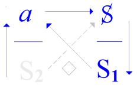
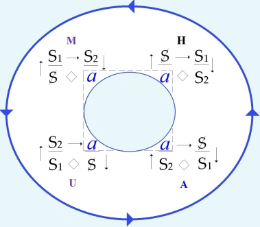
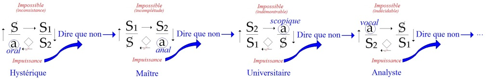

# Leçon 01 | 21 Novembre 1972

<!-- source-url: http://staferla.free.fr/S20/S20 ENCORE.docx -->
<!-- seminar: s20 -->
<!-- lesson: 01 -->

<!-- id: s20-01-0001 -->

Il m’est arrivé de ne pas publier *L*’*éthique de la psychanalyse* [^1].

<!-- id: s20-01-0002 -->

En ce temps-là c’était une forme chez moi de la politesse : « *après vous, j’vous en prie* », « *j’vous en pire...* », « *passez donc les… », « ’près vous…* ».

<!-- id: s20-01-0003 -->

Avec le temps, j’ai pris l’habitude de m’apercevoir qu’après tout je pouvais en dire un peu plus.

<!-- id: s20-01-0004 -->

Et puis je me suis aperçu que ce qui constituait mon cheminement c’était quelque chose de l’ordre du « *je n’en veux rien savoir!* ».

<!-- id: s20-01-0005 -->

C’est sans doute ce qui aussi, avec le temps, fait que - *encore* - je suis là, et que vous aussi vous êtes là, je m’en étonne toujours, *encore* !

<!-- id: s20-01-0006 -->

Il y a quelque chose depuis quelque temps \[mai 1968\] qui le favorise, c’est qu’il y a aussi chez vous, chez la grande masse de ceux qui sont là, un même - en apparence - un même « *je n’en veux rien savoir!* ».

<!-- id: s20-01-0007 -->

Seulement, tout est là, est-ce le même ?

<!-- id: s20-01-0008 -->

Le *« je n’en veux rien savoir ! »* d’un certain savoir qui vous est transmis par bribes, est-ce bien de cela qu’il s’agit ?

<!-- id: s20-01-0009 -->

Je ne crois pas.

<!-- id: s20-01-0010 -->

\[*Le savoir fossilisé « transmis par bribe » du discours universitaire est violemment contesté à partir de mai 68, au nom d’un savoir qui viserait la vérité par la science,* *la philosophie, la sociologie, etc. Mais si le discours universitaire est à rejeter, la vérité elle-même est menteuse, elle ne concerne qu’un savoir qui protège...*

<!-- id: s20-01-0011 -->

*par la croyance à l’existence de l’Autre et aux fictions de savoir qu’il permet...de l’horreur d’un autre savoir, celui de la castration, de l’absence de rapport sexuel... →* « ...*est-ce le même ?* \[...\] *Je ne crois pas. »* \]

<!-- id: s20-01-0012 -->

Et même, c’est bien parce que vous me supposez partir d’ailleurs dans ce *« je n’en veux rien savoir ! »* que supposer vous lie à moi.

<!-- id: s20-01-0013 -->

De sorte que s’il est vrai que je dise qu’à votre égard je ne puis être ici qu’en position *d’analysant* de mon « *je n’en veux rien savoir !* », d’ici que vous atteigniez le même, y’aura une paye.

<!-- id: s20-01-0014 -->

> \[*Lacan a toujours dit qu’il parlait (d’abord et avant tout) aux analystes. Son séminaire ressemble à un dispositif analytique inversé :*

<!-- id: s20-01-0015 -->

- *à un analyste *: *Jacques Lacan, de très nombreuses personnes sont venus en position d’analysant de leur « je n’en veux rien savoir ».*

<!-- id: s20-01-0016 -->

- *de très nombreux analystes sont venus au séminaire où Lacan est en position d’analysant de son « je n’en veux rien savoir », de cet inconscient réel qui ne peut être atteint par le seul travail du déchiffrage de l’inconscient-langage.*

<!-- id: s20-01-0017 -->

> *Mais ici, en position d’analysant Lacan produit seul (cf. «...seul comme je l’ai toujours été...») le frayage du chemin de savoir du 2ème tour « des tours dits », celui qui vise*
>
> *- au-delà de la vérité mi-dite - le réel du dire. Le mi-dire de la vérité ne peut que rater le réel du dire, la vérité est menteuse (alèthéia), elle ne peut que masquer le réel.*
>
> *Mais loin de la vérité : dans le hors-sens des* S1 *en faisant résonner en série les équivoques de lalangue*,

<!-- id: s20-01-0018 -->

- *on peut atteindre à la dimension réelle du symptôme,*

<!-- id: s20-01-0019 -->

- *y reconnaitre l’inouï des lettres du « poème de lalangue » dont chacun est constitué,*

<!-- id: s20-01-0020 -->

- *et atteindre à la* *position d’un sujet séparé de l’Autre et de ses identifications.*

<!-- id: s20-01-0021 -->

> *→* « ...*d’ici que vous atteigniez le même, y’aura une paye.* »\]

<!-- id: s20-01-0022 -->

Et c’est bien, c’est bien ce qui fait que c’est seulement que quand le vôtre vous apparaît suffisant, vous pouvez...

<!-- id: s20-01-0023 -->

> si vous êtes, inversement, mes analysants ...vous pouvez normalement vous détacher de votre analyste.

<!-- id: s20-01-0024 -->

Il n’y a - contrairement à ce qui s’émet - nulle impasse de ma position d’analyste avec ce que je fais ici à votre égard.

<!-- id: s20-01-0025 -->

L’année dernière, j’ai intitulé ce que je croyais pouvoir vous dire: « …*ou pire* », puis : « *ça s’oupire* », (*s, apostrophe*).

<!-- id: s20-01-0026 -->

Ça n’a rien à faire avec « *je* » ou « *tu* » : « *je ne t’oupire pas* », ni « *tu ne m’oupires* ».

<!-- id: s20-01-0027 -->

> \[*le titre du séminaire* 1971-72 *était « *…*Ou pire » → deux dimensions hétérogènes *: « ... » *et « Ou pire ».*

<!-- id: s20-01-0028 -->

- *le* *« Ou pire », le savoir non su de l’inconscient-langage qui se structure en discours dans le dispositif analytique, là où « ça s’oupire »,*

<!-- id: s20-01-0029 -->

- *le «* … *» du « dire », ici représenté par les « points de suspension », qui représentent « le trou », la suspension du sens, l’ab-sens des* **S1** *a-sématiques*\]

<!-- id: s20-01-0030 -->

<!-- id: s20-01-0031 -->

Notre chemin, celui du *discours analytique,* ne progresse que de cette limite étroite, de ce tranchant du couteau qui fait qu’ailleurs ça ne peut que « *s’oupirer* ».

<!-- id: s20-01-0032 -->

> \[*ce chemin que Lacan fraye sur un littoral (littéral) étroit (cf. Lituraterre) entre :*

<!-- id: s20-01-0033 -->

- *l’indicible du réel (non saisissable par le symbolique), le mur de l’impossible,*

<!-- id: s20-01-0034 -->

- *et le savoir non su d’un inconscient structuré comme un langage, dont il faut décrypter l’énigme*\],

<!-- id: s20-01-0035 -->

> *entre les deux, le chemin littoral du discours analytique, celui de la lettre.*

<!-- id: s20-01-0036 -->

C’est ce *discours* \[*analytique*\] qui me supporte, et pour le recommencer cette année, je vais d’abord vous supposer au lit, un lit de *« plein emploi »,* à deux.

<!-- id: s20-01-0037 -->

\[« *au lit » à deux, avec un impératif *: *« Jouis ! » *:

<!-- id: s20-01-0038 -->

- *le lit de l’amour, du rapport sexuel qu’il n’y a pas...*

<!-- id: s20-01-0039 -->

- *mais aussi le « lit » du dire de la jouissance inter-dite, le divan qui lie l’analysant au sujet supposé savoir par l’amour « de transfert »*\]

<!-- id: s20-01-0040 -->

Ici il faut que je m’excuse auprès de quelqu’un qui, ayant bien voulu s’enquérir de ce qu’est mon discours...

<!-- id: s20-01-0041 -->

> un juriste pour le situer ...j’ai cru pouvoir, pouvoir pour - à lui - faire sentir ce qui en est le fondement...

<!-- id: s20-01-0042 -->

> c’est à savoir que *le langage* ça n’est pas l’être parlant ...je lui ai dit que je ne me trouvais pas déplacé d’avoir à parler dans une Faculté de droit, celle où il est sensible, sensible par ce qu’on appelle l’existence des codes, du *code civil*, du *code pénal* et de bien d’autres,

<!-- id: s20-01-0043 -->

- que *le langage* ça se tient là, c’est à part \[*les nombreux volumes des codes *: *civil, pénal*…\],

<!-- id: s20-01-0044 -->

- et que *l’être parlant -* ce qu’on appelle *« les hommes » -* il a affaire à ça, tel que ça s’est constitué au cours des âges.

<!-- id: s20-01-0045 -->

Alors commencer, commencer par vous supposer au lit, bien sûr il faut qu’à son endroit je m’en excuse !

<!-- id: s20-01-0046 -->

Je n’en décollerai pas pourtant aujourd’hui !

<!-- id: s20-01-0047 -->

Et si je peux m’en excuser c’est à lui rappeler, lui rappeler que, au fond de tous les droits il y a ce dont je vais parler, à savoir *la jouissance*.

<!-- id: s20-01-0048 -->

Le droit ça parle de ça, le droit ça ne méconnaît pas même ce départ, ce bon droit coutumier dont se fonde l’usage du « *concubinat »*, ce qui veut dire coucher ensemble.

<!-- id: s20-01-0049 -->

Évidemment je vais partir d’autre chose, de ce qui dans le droit reste voilé, à savoir ce qu’on en fait : s’étreindre.

<!-- id: s20-01-0050 -->

Mais ça c’est parce que je pars de *la limite*, d’une limite dont en effet il faut partir pour être *sérieux*, ce que j’ai déjà commenté : pouvoir établir *la série* [^2], la série de ce qui s’en approche.

<!-- id: s20-01-0051 -->

L’usufruit[^3] ça c’est bien une notion de droit et qui réunit en un seul mot, ce que déjà j’ai rappelé dans ce séminaire sur *l’éthique* dont je parlais tout à l’heure, à savoir la différence qu’il y a

<!-- id: s20-01-0052 -->

- de *l’outil* [^4], qu’il y a de *l’utile,*

<!-- id: s20-01-0053 -->

- à la jouissance.

<!-- id: s20-01-0054 -->

L’utile ça sert à quoi ?

<!-- id: s20-01-0055 -->

C’est ce qui n’a jamais été bien défini en raison d’un respect, d’un respect prodigieux, que grâce au langage l’être parlant a pour le *moyen*.

<!-- id: s20-01-0056 -->

L’usufruit ça veut dire qu’on peut jouir de ses moyens mais qu’il faut pas les gaspiller.

<!-- id: s20-01-0057 -->

Quand on a reçu un héritage, on en a l’usufruit, on peut en jouir à condition de ne pas trop en user.

<!-- id: s20-01-0058 -->

C’est bien là qu’est l’essence du droit : c’est de répartir, de distribuer, de rétribuer, ce qu’il en est de la jouissance.

<!-- id: s20-01-0059 -->

Mais qu’est-ce que c’est que la jouissance ?

<!-- id: s20-01-0060 -->

C’est là précisément ce qui pour l’instant se réduit à nous d’une instance négative : *la jouissance c’est ce qui ne sert à rien *! Seulement ça n’en dit pas beaucoup plus long.

<!-- id: s20-01-0061 -->

Ici je pointe, je pointe « *la réserve »* qu’implique ce champ du droit, du droit à la jouissance.

<!-- id: s20-01-0062 -->

> *\[la réserve est la partie d’une toile, protégée par de la cire, qui ne sera ni imprimée, ni peinte.*
>
> *la jouissance est hétérogène au champ du droit (limitée à l’usufruit), ce qui est laissé en blanc dans ce champ\]*

<!-- id: s20-01-0063 -->

Le droit c’est pas le devoir, rien ne force personne à jouir, sauf le *surmoi*.

<!-- id: s20-01-0064 -->

Le *surmoi* c’est l’impératif de la jouissance : *« jouis ! »*, c’est le commandement qui part... d’où ?

<!-- id: s20-01-0065 -->

C’est bien là que se trouve le point tournant \[*cf. schéma*\] qu’interroge le discours analytique.

<!-- id: s20-01-0066 -->

> \[*dans le discours analytique l’analyste en position de semblant (a) interpelle le sujet* (S) *en position d’Autre, sur sa jouissance.*
>
> *L’analysant « produit » des essaims de* S1, *interprétés du « savoir du psychanalyste » :* S2 *(en position de vérité).*
>
> *Ces* S1 *sont n’importe quels signifiants coupés du savoir→ asémantiques (« dites tout ce qui vous passe par la tête même si ça n’a aucun sens »),*
>
> *mais ils ne peuvent rejoindre leur vérité en* S2, *mais seulement – par l’interprétation de l’analyste – <u>laisser apercevoir</u> fugitivement au sujet* S
>
> *le* S2 *comme* *savoir local qui gît là.*\]

<!-- id: s20-01-0067 -->

<!-- id: s20-01-0068 -->

C’est bien sur ce chemin que j’ai essayé dans un temps...

<!-- id: s20-01-0069 -->

> le temps de l’*« après-vous… »* - que j’ai *« laissé passer »* \[*cf. début de séance*\] ...pour montrer que si l’analyse nous permet d’avancer dans une certaine question \[*éthique : du « droit » au « devoir » (de jouissance)*\], c’est bien que nous ne pouvons nous en tenir à ce dont je suis parti...

<!-- id: s20-01-0070 -->

> assurément respectueusement ...à ce dont je suis parti, soit de l’*Éthique* d’Aristote[^5], \[*du souverain Bien, etc.*\] pour montrer *quel glissement* s’était fait avec le temps.

<!-- id: s20-01-0071 -->

*Glissement* qui n’est pas *progrès*, glissement qui est *contour*, glissement qui d’une considération - au sens propre du terme –

<!-- id: s20-01-0072 -->

- d’une considération de *l’être* qui était celle d’Aristote,

<!-- -->

<!-- id: s20-01-0073 -->

- a fait venir au temps de *l’utilitarisme* de Bentham,[^6] au temps de la *Théorie des fictions* [^7],

<!-- id: s20-01-0074 -->

> au temps de ce qui, du langage, a démontré la valeur d’outil, la valeur d’usage.

<!-- id: s20-01-0075 -->

\[*Aristote se situe dans le discours du maître (maître* → *m’*→*être :* S1→ S2→ *a), qui est un discours sur la nature de l’être qui se déterminerait du « souverain Bien » : a,* *d’une hiérarchie cosmologique de l’harmonie des sphères : de la sphère sublunaire (le monde humain) à la sphère suprême : la sphère immobile qui serait au principe de tout.*

<!-- id: s20-01-0076 -->

*D’Aristote (- 384, - 322) à Bentham (1748, 1832) puis Saussure (1857, 1913), le langage est conçu dans un même « contour »* (S1 → S2),

<!-- id: s20-01-0077 -->

- *comme structure d’ordre social (maître- esclave) pour Aristote *(M),

<!-- id: s20-01-0078 -->

- *comme structure d’appropriation des biens pour Bentham et sa théorie des fictions* (U),

<!-- id: s20-01-0079 -->

- *comme structure de communication du savoir (le signifiant/signifié de Saussure* : H).

<!-- id: s20-01-0080 -->

*Ces trois discours relèvent du même contour  (avec un intérieur et un extérieur) et sont <u>consistants</u> (univers, cosmos...) par exclusion de l’hétérogène (ex-sistence) :*

<!-- id: s20-01-0081 -->

- *a dans le discours* H*ystérique* (et *dans son versant « discours scientifique »*),

<!-- id: s20-01-0082 -->

- S *dans le discours* M*aître,*

<!-- id: s20-01-0083 -->

- S1 *dans le discours* U*niversitaire*, → *avec dans chacun de ces discours la connexion* S1 → S2 *posée comme rapport, et le principe de non contradiction (exclusion de l’impossible)* \].

<!-- id: s20-01-0084 -->

Et c’est ce qui nous laisse enfin revenir à interroger ce qu’il en est de cet *être*, de ce *« Souverain Bien »* \[*a*\] posé là comme objet de contemplation, et d’où on avait cru pouvoir édifier une *éthique* \[*fondement d’un « devoir être »*\].

<!-- id: s20-01-0085 -->

Je vous laisse donc sur ce lit à vos inspirations \[*dans l’étreinte sexuelle ou dans le discours de l’analysant* \].

<!-- id: s20-01-0086 -->

Je sors, et une fois de plus j’écrirai sur la porte...

<!-- id: s20-01-0087 -->

> afin qu’à la sortie, peut-être, vous puissiez vous rendre compte des *rêves* que vous aurez sur ce lit poursuivis ...la phrase suivante : *la jouissance de l’Autre...*

<!-- id: s20-01-0088 -->

> de l’Autre avec \[*un grand A*\]... il me semble que depuis le temps – *hein ?* – ça doit suffire que je m’arrête là.
>
> Je vous en ai assez rebattu les oreilles de ce « *grand A* » qui vient après \[*dans la phrase* : « *l’Autre avec... »*\], vu que maintenant il traîne partout, ce grand A mis devant l’Autre, plus ou moins opportunément d’ailleurs,
>
> ça s’imprime à tort et à travers *...la jouissance de l’Autre, du corps de l’Autre qui le...*

<!-- id: s20-01-0089 -->

> lui aussi : « *avec un grand A* » ...*du corps de l’Autre qui le symbolise,* [*n’est pas l**e signe de l’amour*](#Retour_UN_signe).

<!-- id: s20-01-0090 -->

J’écris ça et je n’écris pas après : *terminé,* ni *amen* ni *ainsi soit-il.*

<!-- id: s20-01-0091 -->

Il « *n’est pas le signe* »... C’est néanmoins la seule réponse.

<!-- id: s20-01-0092 -->

Le compliqué c’est que la réponse, elle est déjà donnée au niveau de l’amour.

<!-- id: s20-01-0093 -->

Et *que la jouissance,* de ce fait, reste *une question*, question en ceci que la réponse qu’elle peut constituer n’est pas nécessaire d’abord.

<!-- id: s20-01-0094 -->

C’est pas comme l’amour : *l’amour*, lui, *fait signe et*...

<!-- id: s20-01-0095 -->

> comme je l’ai dit depuis longtemps ...*il est toujours réciproque*. \[*l’amour qui se donne est toujours réciproque », il demande en retour l’amour de l’Autre pour retrouver la complétude du Un.*

<!-- id: s20-01-0096 -->

*Sur la réciprocité du don, cf. Marcel Mauss : « [Essai sur le don ](https://classiques.uqam.ca/classiques/mauss_marcel/socio_et_anthropo/2_essai_sur_le_don/essai_sur_le_don.html)»*\]

<!-- id: s20-01-0097 -->

J’ai avancé ça très doucement en disant que les sentiments sont toujours réciproques, c’était pour que ça me revienne :

<!-- id: s20-01-0098 -->

- *Et alors, et alors… et l’amour… et l’amour… il est toujours réciproque ?*

<!-- id: s20-01-0099 -->

- *Mais* *z’oui* ! *Mais* *z’oui* ! \[*Rires*\]

<!-- id: s20-01-0100 -->

C’est même pour ça qu’on a inventé l’*inconscient*, c’est pour s’apercevoir que *« le désir de l’homme c’est le désir de l’Autre »,* et que l’amour c’est une passion qui peut être l’ignorance de ce désir, mais qui ne lui laisse pas moins toute sa portée.

<!-- id: s20-01-0101 -->

Quand on y regarde plus près on en voit le ravage. \[*ravages de l’insatisfaction hystérique et des impossibilités de l’obsessionnel*\]

<!-- id: s20-01-0102 -->

Alors bien sûr ça explique que la jouissance du corps de l’Autre, elle, ne soit pas une réponse *nécessaire.*

<!-- id: s20-01-0103 -->

\[*puisque « l’amour est réciproque », il suffit à retrouver la complétude, la plénitude du Un*\]

<!-- id: s20-01-0104 -->

Ça va même plus loin, c’est pas non plus une réponse *suffisante* parce que *l’amour* - lui - *demande l’amour*, il ne cesse pas de le demander, il le demande *encore !* \[→ *la jouissance : ni nécessaire, ni suffisante*\]

<!-- id: s20-01-0105 -->

*« Encore* » c’est le nom propre de cette faille d’où, dans l’Autre, part la demande d’amour.

<!-- id: s20-01-0106 -->

\[*la faille dans l’Autre :* **S(A)** *est structurelle, permanente → l’amour, qui permettrait la « complétude », est demandé encore et encore...*\]

<!-- id: s20-01-0107 -->

Alors d’où part, d’où part *ça* qui est capable...

<!-- id: s20-01-0108 -->

> certes - mais de façon *non nécessaire, non suffisante* ...de répondre par *la jouissance, jouissance du corps, du corps de l’Autre* ?

<!-- id: s20-01-0109 -->

C’est bien ce que l’année dernière, inspiré d’une certaine façon par la chapelle de Sainte-Anne *qui me portait sur le système*, je me suis laissé aller à appeler *l’(a)mur* [^8]. \[*les « traces » sur le corps du chatoiement phallique de l’* ἄγαλμα \[*agalma*\] *des objets(a)*\].

<!-- id: s20-01-0110 -->

*L’(a)mur* c’est ce qui apparaît en signes bizarres sur le corps et qui vient *d’au-delà,* du *dehors,* de cet endroit que nous avons cru, comme ça, pouvoir lorgner au microscope sous la forme du *germen*, dont je vous ferai remarquer qu’on ne peut dire que ce soit là la vie puisqu’aussi bien ça porte la mort, la mort du corps, que *ça le reproduit*, que *ça le répète*, que c’est de là que vient l’*en-corps*.

<!-- id: s20-01-0111 -->

Il est faux de dire « *séparation* » du *soma* et du *germen*, puisque de porter ce *germen* le corps porte des *traces*.

<!-- id: s20-01-0112 -->

\[les traces dont il s’agit sur *l’(a)mur* ne sont pas celles des caractères sexuels, mais des « signes bizarres inscrits » sur le corps, vêtements, bijoux, parures, tatouages, qui enveloppent le corps et en signifient l’unité par la présence d’un ἄγαλμα \[*agalma*\] (*a*) caché à l’intérieur, d’un Bien suprême\]

<!-- id: s20-01-0113 -->

Il y a des traces sur *l’(a)mur*.

<!-- id: s20-01-0114 -->

L’être du corps est sexué, certes, mais c’est *secondaire,* comme on dit.

<!-- id: s20-01-0115 -->

<u>Et comme l’expérience \[*analytique*\] le démontre</u>, ce ne sont pas de ces traces que dépend la jouissance du corps en tant que l’Autre il symbolise.

<!-- id: s20-01-0116 -->

C’est là ce qu’avance la plus simple considération des choses.

<!-- id: s20-01-0117 -->

De quoi s’agit-il donc dans *l’amour* ?

<!-- id: s20-01-0118 -->

Comme la psychanalyse l’avance...

<!-- id: s20-01-0119 -->

> avec une audace d’autant plus incroyable que toute son expérience va contre,
>
> que ce qu’elle démontre c’est le contraire ...*l’amour* c’est de faire *Un*. C’est vrai que... qu’on ne parle que de ça depuis longtemps, de *l’Un *: la fusion, l’ἔρως \[éros\] serait tension vers *l’Un.*

<!-- id: s20-01-0120 -->

*« Y a d’l’Un »,* c’est de ça que j’ai supporté mon discours de l’année dernière, et certes pas pour confluer dans cette confusion originelle \[2 *en* 1 → « Un »\], celle du *désir* qui ne conduit qu’à la visée de « *la faille »* où se démontre que *l’Un* ne tient que de l’essence du signifiant.

<!-- id: s20-01-0121 -->

Si j’ai interrogé Frege[^9] au départ c’est pour tenter de démontrer la béance qu’il y a, de cet *Un* à quelque chose qui tient à *l’être,* et derrière *l’être,* à *la jouissance*.

<!-- id: s20-01-0122 -->

\[*« Y a d’l’Un »* *ne vise pas le Un* « *unien* » du « Tout : *« l’amour c’est de faire Un* »*, mais vise au contraire à fonder le* **1** *sur le* **0***, sur la béance qu’il y a de l’***1** *à « l’être* »), *comme Frege* *engendre la suite des nombres à partir du* **0** *comme concept contradictoire* (*Die Grundlagen der Arithmetik*)\]

<!-- id: s20-01-0123 -->

Je peux quand même vous dire par un petit exemple : l’exemple d’une perruche \[*Rires*\] qui était amoureuse de Picasso.

<!-- id: s20-01-0124 -->

Eh bien ça se voyait à la façon dont elle lui mordillait le col de sa chemise et les battants de sa veste.

<!-- id: s20-01-0125 -->

Cette perruche était bien en effet amoureuse de ce qui est *essentiel* à l’homme, à savoir son accoutrement.

<!-- id: s20-01-0126 -->

Cette perruche était comme Descartes, pour qui des hommes c’était des habits en *pro-ménade*[^10] si vous me permettez, bien sûr c’est *« pro »*, ça *promet* la *ménade* [^11], c’est-à-dire : quand on les quitte \[*les habits*\].

<!-- id: s20-01-0127 -->

Mais ce n’est qu’un mythe, un mythe qui vient converger avec le lit de tout à l’heure \[2 en 1\].

<!-- id: s20-01-0128 -->

\[*ôtés les habits (i.e. ce qui fait l’apparat du corps) il ne reste que le corps → les objets partiels (a) et non pas l’Un de l’être* (**S1**) *→ impossibilité - d’eux - de faire deux,* *d’où la question réitérée à propos de *S1→ S2 *: « cet essaim*, *est-ce d’eux ? » et la réponse : « ce n’est pas ça »*\]

<!-- id: s20-01-0129 -->

*Jouir d’un corps* \[*a*\] quand il n’y a plus d’habits c’est quelque chose qui laisse intacte la question **\[*coupure de l’enregistrement*\]** de ce qui fait l’*Un*, c’est-à-dire de *l’identification *: la perruche *s’identifiait* à Picasso habillé.

<!-- id: s20-01-0130 -->

Il en est de même de tout ce qui est de l’amour.

<!-- id: s20-01-0131 -->

Autrement dit, l’habit aime le moine parce que c’est par là qu’ils ne sont tous qu’*Un*.

<!-- id: s20-01-0132 -->

Autrement dit, *ce qu’il y a sous l’habit* et que nous appelons *le corps*, *ce n’est peut-être* en l’affaire *que ce reste que j’appelle* *l’objet(a)*.

<!-- id: s20-01-0133 -->

Ce qui fait tenir *l’image* \[*le manteau*\] c’est un *reste.* \[*(a) comme « porte-manteau », « portant »*\]

<!-- id: s20-01-0134 -->

Et ce que l’analyse démontre c’est que *l’amour dans son essence est narcissique*, que *le baratin sur l’objectal* est quelque chose dont, justement, elle sait dénoncer la *substance* dans *ce qui est reste* dans le désir, à savoir *sa cause*, et ce qui le soutient \[*l’objet(a)*\]

<!-- id: s20-01-0135 -->

- de son insatisfaction \[*cf*. *l’hystérique*\],

<!-- id: s20-01-0136 -->

- voire de son impossibilité \[*cf.* *l’obsessionnel*\].

<!-- id: s20-01-0137 -->

*L’impuissance de l’amour* - quoiqu’il soit réciproque - *tient à cette ignorance d’être le désir d’être Un*.

<!-- id: s20-01-0138 -->

Et ceci nous conduit à *l’impossible* d’établir la relation *d’eux* – la relation d’eux qui ? – les *deux* sexes.

<!-- id: s20-01-0139 -->

Assurément, ai-je dit, ce qui apparaît sur ces corps, sous ces formes énigmatiques que sont les caractères sexuels qui ne sont que *secondaires*, sans doute fait l’être sexué, mais *l’être c’est la jouissance du corps* comme tel, c’est-à-dire comme *(a)*...

<!-- id: s20-01-0140 -->

> mettez-le \[*écrivez-le*\] comme vous voudrez \[*asexué ou (a)sexué* \] ...comme *(a)sexué*, puisque ce qui est dit « *jouissance sexuelle »* est dominé, marqué par l’impossibilité d’établir comme tel, nulle part dans l’énonçable, ce seul *Un* qui nous intéresse : *l’Un* de la relation *« rapport sexuel »*. \[« *fusion » des jouissances → complétude*\]

<!-- id: s20-01-0141 -->

C’est *<u>ce que le discours analytique démontre</u>*, en ceci justement que pour ce qui est d’un de ces êtres comme sexué, l’homme en tant qu’il est pourvu de l’organe dit *phallique*...

<!-- id: s20-01-0142 -->

> j’ai dit : *« dit… »...*le sexe, le sexe corporel, le sexe de la femme...

<!-- id: s20-01-0143 -->

> j’ai dit de « *la femme* » : justement il n’y en a pas, il n’y a pas *« La femme »*, la femme n’est *« pas toute »* ...le sexe de la femme ne lui dit rien, si ce n’est par l’intermédiaire de la *jouissance* du corps \[*les objets(a) »*\].

<!-- id: s20-01-0144 -->

\[*Discours* A: *a(Semblant)* *→* S*(l’Autre comme jouissance)→ *S1*(Produit comme Plus de Jouir)* ◊ S2 *(Vérité comme jouissance du corps de l’Autre, La femme)*\].

<!-- id: s20-01-0145 -->

<!-- id: s20-01-0146 -->

<u>Ce que *le discours analytique* démontre</u> c’est...

<!-- id: s20-01-0147 -->

> permettez-moi de le dire sous cette forme ...que *le phallus* \[**S1**\] *c’est l’objection de conscience, faite par un des deux êtres sexués, au service à rendre à l’Autre*. \[*le* **S2** *ne peut fonder le* **S1** *→ impuissance à « retrouver » le Un* *de l’amour*.

<!-- id: s20-01-0148 -->

*Il n’y a pas de rapport sexuel, la sexualité vise* **S1** *mais n’atteint que les objets(a), partiels et prégénitaux : oral, anal, vocal, scopique :*

<!-- id: s20-01-0149 -->

- *Sur la question de l’amour→ « cet* S1*, est-ce d’eux ? »,* **S1**→ **S2** → *a *: → *« ce n’est pas ça !* » →« *Je te demande de refuser ce que je t’offre, parce que ça n’est pas ça* ».

<!-- id: s20-01-0150 -->

- *Sur la question de la jouissance* Φ*→ « cet* S1, S2 *? » or *S1◊S2 → *« ce n’est pas ça* » (*pas de jouissance du corps de l’Autre* → ***L** femme, non « <u>La</u> femme »)*\]

<!-- id: s20-01-0151 -->

Et qu’on ne me parle pas des caractères sexuels secondaires de la femme parce que, jusqu’à nouvel ordre, ce sont ceux de la mère qui priment chez elle. Rien ne distingue comme être sexué la femme, sinon justement le sexe.

<!-- id: s20-01-0152 -->

Que tout tourne autour de la jouissance phallique c’est très précisément <u>ce dont l’expérience analytique témoigne</u>, et témoigne en ceci que *L* femme se définit d’une position que j’ai pointée du *« pas toute »* à l’endroit de la jouissance phallique. **\[reprise de l’enregistrement\]**

<!-- id: s20-01-0153 -->

Je vais un peu plus loin, *la jouissance phallique* est l’obstacle par quoi l’homme n’arrive pas - dirai-je - à jouir du corps de la femme précisément parce que ce dont il jouit c’est de cette jouissance, celle de l’organe.

<!-- id: s20-01-0154 -->

Et c’est pourquoi le *surmoi*...

<!-- id: s20-01-0155 -->

tel que je l’ai pointé tout à l’heure du « *Jouis !* » ...est corrélat de la castration qui est le signe dont se pare l’aveu que *la jouissance de l’Autre - du corps de l’Autre –* ne se promeut *que de l’infinitude*, je vais dire laquelle : celle que supporte *le paradoxe de Zénon* - ni plus ni moins - *lui-même*.

<!-- id: s20-01-0156 -->

Achille et la tortue, tel est *le schème du jouir,* d’un côté de l’être sexué \[« F »\].

<!-- id: s20-01-0157 -->

Quand Achille a fait son pas, tiré son coup auprès de Briséis, telle la tortue, *elle aussi a avancé d’un peu*, ceci parce qu’elle n’est *« pas toute »,* pas toute à lui, *il en reste*, et il faut qu’Achille fasse *le second pas* comme vous savez, ainsi de suite...

<!-- id: s20-01-0158 -->

C’est même comme ça que de nos jours, mais de nos jours seulement, ...on est arrivé à définir *le nombre,* le vrai \[*nombre*\], ou pour mieux dire, le \[*nombre*\] *réel*.

<!-- id: s20-01-0159 -->

Parce que ce que Zénon n’avait pas vu, *c’est que la tortue non plus* n’est préservée de cette fatalité d’Achille, c’est que comme son pas à elle est de plus en plus petit, il n’arrivera non plus jamais à *la limite.*

<!-- id: s20-01-0160 -->

Et c’est en ça que se définit *un nombre* quel qu’il soit, s’il est *réel*.

<!-- id: s20-01-0161 -->

Un nombre a une limite, et c’est dans cette mesure qu’il est infini.

<!-- id: s20-01-0162 -->

\[*ex. : la suite géométrique de raison ½ et de premier terme* **1*** *(**1 + ½ + ¼ +***…* ) *converge (à l’infini) vers sa limite *: **2***, sans jamais l’atteindre*\]

<!-- id: s20-01-0163 -->

Achille, c’est bien clair, *ne peut que dépasser la tortue, il ne peut pas la rejoindre*, mais il ne la rejoint que dans l’*infinitude*.

<!-- id: s20-01-0164 -->

Seulement en voilà de dit pour ce qui est de *la jouissance en tant qu’elle est <u>sexuelle</u>* :

<!-- id: s20-01-0165 -->

- la jouissance est marquée d’un côté par ce « *trou »* qui ne l’assure que d’autre voie que de *la jouissance phallique*,

<!-- id: s20-01-0166 -->

- est-ce que de l’autre côté \[*du côté de l’Autre*\], quelque chose ne peut s’atteindre qui nous dirait comment ce qui jusqu’ici n’est que *faille, béance dans la jouissance* \[*faille de la jouissance phallique*\], serait réalisé ? \[*jouissance du corps de l’Autre*\]

<!-- id: s20-01-0167 -->

C’est ce qui, chose singulière, ne peut être suggéré que par des aperçus très étranges.

<!-- id: s20-01-0168 -->

« *Étrange* » c’est un mot qui peut se décomposer* : l’être ange.*

<!-- id: s20-01-0169 -->

\[*Cf. L’Annonciation, mais surtout les Évangiles (du grec* εὐαγγέλιον *evangélion : « bonne nouvelle ») → le message de l’amour (divin).*

<!-- id: s20-01-0170 -->

*L’accent est mis sur le message, sur un savoir* (S2) *→ <u>être ange c’est viser l’Autre comme savoir</u> (et la jouissance du corps de l’Autre)*\]

<!-- id: s20-01-0171 -->

C’est bien quelque chose contre quoi nous met en garde l’alternative *d’être aussi bête* que la perruche de tout à l’heure.

<!-- id: s20-01-0172 -->

\[*viser* S1 *le signifiant asémantique - privé de sens et n’atteindre que* (*a*)* : <u>être bête c’est viser le signifiant phallique</u> → viser la répétition de « la jouissance de l’idiot »,* *qui ne mène qu’à l’objet partiel et à la jouissance phallique* (*a* → ? S→ S1)*, mais ferme l’accès à* S2 *(impuissance à atteindre la jouissance du corps de l’Autre :* S1◊S2*).*

<!-- id: s20-01-0173 -->

*La « bêtise » ce sont les paroles privées de sens, ou ayant trait à l’amour, qui visent* S1 mais n’atteignent que (*a*) .

<!-- id: s20-01-0174 -->

- *Cf. le début de la séance suivante sur le discours analytique et la dimension de la bêtise.*

<!-- id: s20-01-0175 -->

- *Cf. le « petit Hans » et son approche de la bêtise.*

<!-- id: s20-01-0176 -->

- *Cf. Pascal : « L’homme n’est ni ange, ni bête, et le malheur veut que qui veut faire l’ange fait la bête. »* *→« la perruche amoureuse de Picasso » vise l’amour* (S1), *atteint « les signes bizarres sur l’(a)mur » et n’obtient qu’une jouissance phallique*\]

<!-- id: s20-01-0177 -->

Mais néanmoins, regardons de près ce que nous inspire l’idée que dans la jouissance...

<!-- id: s20-01-0178 -->

> dans la jouissance des corps *...la jouissance sexuelle* ait ce privilège de pouvoir être interrogée comme étant spécifiée au moins *par une impasse*.

<!-- id: s20-01-0179 -->

C’est, dans cet espace, espace de la jouissance, prendre quelque chose de borné, fermé : c’est *un lieu* \[*le langage comme lieu* *de l’Autre → hétérogénéité de l’être et de l’Autre → géométrie*\], et en parler c’est *une topologie* \[*la parole parcourt le lieu → l’être dans l’Autre→ topologie*\].

<!-- id: s20-01-0180 -->

Ici nous guide ce que, dans quelque chose que vous verrez paraître en pointe de mon discours de l’année dernière, je crois démontrer : [*la stricte équivalence de « topo**logie » et « structure*](#Retour_Topologie_structure)* »* [^12], ce qui distingue l’anonymat de ce dont on parle comme *jouissance*, à savoir ce qu’*ordonne* le droit : une géométrie justement, l’*hétérogénéité* du *lieu,* c’est qu’il y a un *lieu de l’Autre*.

<!-- id: s20-01-0181 -->

De ce *lieu de l’Autre*...

<!-- id: s20-01-0182 -->

> d’un sexe comme Autre, comme Autre absolu ...que nous permet d’avancer le plus récent développement de cette topologie, j’avancerai ici le terme de *compacité*.

<!-- id: s20-01-0183 -->

*Rien de plus compact qu’une faille*, s’il est bien clair que quelque part il est donné que l’*intersection* de tout ce qui s’y ferme étant admise comme existante en un nombre fini d’ensembles \[*→ au moins deux*\], il en résulte - c’est une hypothèse - il en résulte que *l’intersection existe en un nombre infini* \[*→*Φ\]. Ceci est la définition même de *[la compacité](http://fr.wikipedia.org/wiki/Compacit%C3%A9_%28math%C3%A9matiques%29)* [^13].

<!-- id: s20-01-0184 -->

\[*la faille inclut sa limite → espace fermé. Dans cette faille si deux (au moins) sous-espaces fermés ont une intersection non vide, alors il existe une infinité d’espaces fermés* *(cf. Théorème de Borel-Lebesgue sur les réels) qui ont une intersection non vide, ce qui - appliqué ici - montre une infinité de jouissances phalliques connectées entre elles (intersections non vides) →*Φ *→ couverture de « la faille » possible jusqu’aux bornes (sans les atteindre) par une infinité de jouissances « fermées » interconnectées par* Φ*→ (jouissances phalliques « masculines »)*\]

<!-- id: s20-01-0185 -->

Et cette intersection dont je parle \[Φ\] c’est celle que j’ai avancée tout à l’heure, *comme étant ce qui couvre, ce qui fait obstacle au rapport sexuel supposé*, à savoir : à ce dont j’énonce que l’avancée du *discours analytique* \[disc. A\] tient précisément en ceci : que ce qu’il \[le disc. A\] démontre c’est que son discours ne se soutenant que de l’énoncé *qu’il n’y a pas, qu’il est impossible de poser* *le rapport sexuel*, c’est de par là qu’il \[le disc. A\] détermine ce qu’il en est réellement aussi du statut de tous les autres *discours*.

<!-- id: s20-01-0186 -->

\[*seul le discours* A *soutient l’impossibilité du rapport sexuel* \[S1◊S2\]*, les autres discours en soutiennent la possibilité (couverture de la faille par la jouissance phallique) :*

<!-- id: s20-01-0187 -->

- *le discours* M *: avec* S1→ S2 : *rapport maître-esclave → production de a mais au prix de l’incomplétude du discours* (*exclusion de* S),

<!-- id: s20-01-0188 -->

- *le discours* H *: avec* S→ S1 : S1→ S2 *contingent : production d’un savoir* S2 *mais au prix de l’inconsistance du discours,* (*exclusion de a*)

<!-- id: s20-01-0189 -->

- *le discours* U *: avec* S2→ *a *: S1→ S2 *nécessaire* *et production de sujets de la connaissance mais au prix de l’indémontrable du discours* (*exclusion de* S1)\].

<!-- id: s20-01-0190 -->

<!-- id: s20-01-0191 -->

<!-- id: s20-01-0192 -->

Tel est dénommé le point qui *couvre*, qui *couvre* l’impossibilité du *rapport sexuel* comme tel.

<!-- id: s20-01-0193 -->

*<u>La jouissance en tant que sexuelle est phallique,</u>* c’est-à-dire qu’<u>*elle ne se rapporte pas à l’Autre comme tel*.</u>

<!-- id: s20-01-0194 -->

Suivons là *le complément de cette hypothèse de « compacité »*.

<!-- id: s20-01-0195 -->

Une formule nous est donnée par *la topologie* que j’ai qualifiée de *« la plus récente »*, à savoir d’une logique construite, construite précisément sur l’interrogation du *nombre* et de ce vers quoi il conduit : d’une restauration d’un lieu qui n’est pas celui d’un espace homogène. \[*→ la faille : ensemble fermé incluant sa propre limite, tel le nombre* \]

<!-- id: s20-01-0196 -->

Le complément de cette hypothèse de *« compacité »* est celui-ci : dans le même espace borné, fermé, supposé institué, l’équivalent de ce que tout à l’heure j’ai avancé de l’intersection passant du fini à l’infini est celui-ci : c’est qu’à supposer *ce même espace borné, fermé, recouvert d’ensembles ouverts*, c’est-à-dire de ce qui se définit comme excluant sa limite...

<!-- id: s20-01-0197 -->

> de ce qui se définit comme plus grand qu’un point, plus petit qu’un autre,
>
> mais en aucun cas égal ni au point de départ ni au point d’arrivée, pour vous l’imager rapidement ...*le même espace donc étant supposé recouvert d’espaces ouverts :* il est équivalent - ça se démontre - de dire que l’ensemble de ces espaces ouverts s’offre toujours à un sous-recouvrement d’espaces ouverts, eux tous constituant une finitude, à savoir que la suite des dits éléments constitue *une suite finie*. \[*ce même espace fermé de « la faille » (incluant sa limite) peut être recouvert par des espaces ouverts (chacun n’incluant pas de limite).*

<!-- id: s20-01-0198 -->

*Dans cette configuration un nombre fini d’espaces ouverts (jouissances « féminines », « pas toutes ») peut recouvrir cet espace fermé qu’est « la faille »* *et même le déborder*\]

<!-- id: s20-01-0199 -->

Vous pouvez remarquer que je n’ai pas dit qu’ils sont *comptables*[^14], et pourtant c’est ce que le terme *« fini »* implique.

<!-- id: s20-01-0200 -->

Pour être *comptables*, il faut qu’on y trouve *un ordre*, et nous devons marquer un temps avant de supposer que *cet ordre* soit trouvable.

<!-- id: s20-01-0201 -->

\[*les espaces ouverts (sans limite) n’impliquent pas l’ordinal, alors que dans les espaces fermés la convergence de la série vers une limite produit un ordre* \]

<!-- id: s20-01-0202 -->

Mais ce que veut dire en tout cas la finitude, démontrable*, des espaces ouverts,* capables de recouvrir *cet espace borné, fermé,* - en l’occasion - *de la jouissance sexuelle*, ce qu’il implique en tout cas, c’est que les dits « *espaces* »...

<!-- id: s20-01-0203 -->

> et puisqu’il s’agit de l’*Autre côté,* mettons-les au féminin *...*peuvent être pris 1 *par* 1 ou bien encore *« une par une »*.

<!-- id: s20-01-0204 -->

Or c’est cela qui se produit dans *cet espace de la jouissance sexuelle* qui de ce fait s’avère *compact*.

<!-- id: s20-01-0205 -->

Ces femmes *« pas toutes »* \[*elles ne sont pas toutes dans le « rapport sexuel phallique », une part d’elles peut le déborder* \], telles qu’elles s’isolent dans leur être sexué, lequel donc ne passe pas par le corps \[*le corps n’aboutit qu’aux objets partiels → (a)sexué*\] mais par ce qui résulte d’une exigence dans la parole, d’une exigence logique, et ce très précisément en ceci que *la logique*, la cohérence inscrite dans le fait qu’*ex-siste le langage,* qu’il soit *hors de ces corps* qui en sont agités*, l’Autre*...

<!-- id: s20-01-0206 -->

> l’Autre avec un grand A maintenant ...qui s’*incarne* \[*le « *S2 » *de L femme comme* S(A)\] - si l’on peut dire - comme être sexué exige cet *« une par une  »*.

<!-- id: s20-01-0207 -->

\[*L’Un de l’être rencontre l’***1** *du nombre ?* → *<u>La</u> femme... Mais l’autre est barré (* S(A) *)* → *L femme*\]

<!-- id: s20-01-0208 -->

Et c’est bien là qu’il est étrange, qu’il est *fascinant*...

<!-- id: s20-01-0209 -->

> *c’est le cas de le dire* : *Autre fascination*, *Autre fascinum* \[*Sens propre : charme, maléfice. Sens figuré : phallus* *(des mystères antiques*)\] ...*cette exigence de l’Un*...

<!-- id: s20-01-0210 -->

> comme déjà étrangement le *Parménide* [^15] pouvait nous le faire prévoir ...*c’est de l’Autre qu’elle sort.* *Là où est l’être, c’est l’exigence de l’infinitude*.

<!-- id: s20-01-0211 -->

Je commenterai, j’y reviendrai, sur ce qu’il en est de ce *lieu de l’Autre*.

<!-- id: s20-01-0212 -->

Mais dès maintenant pour faire image et parce qu’après tout, je peux bien supposer que quelque chose dans ce que j’avance puisse vous lasser, je vais vous l’illustrer. On sait assez combien les analystes se sont amusés autour de ce Don Juan dont ils ont tout fait, y compris - ce qui est un comble - un homosexuel !

<!-- id: s20-01-0213 -->

Est-ce qu’à le centrer sur ce que je viens de vous imager de *cet espace de la jouissance sexuelle*, à être *recouvert de l’Autre côté* [^16], par des ensembles ouverts et aboutissant à cette finitude \[F\]... j’ai bien marqué que je n’ai pas dit que c’était *le nombre*, et pourtant, bien sûr que ça se passe : finalement *on les compte*. Ce qui est l’essentiel dans le mythe féminin de Don Juan c’est bien ça, c’est qu’il les a *une par une,* et c’est cela qu’est l’Autre sexe, le sexe masculin pour ce qu’il en est des femmes.

<!-- id: s20-01-0214 -->

C’est bien en cela que l’image de Don Juan est capitale, c’est dans ce qui s’indique de ceci qu’après tout il peut en faire une liste, et qu’à partir \[du moment\] où il y a les noms, on peut les compter : s’il y en a *« mille e tre »* c’est bien qu’on peut les prendre *« une par une  »,* et c’est là l’essentiel.

<!-- id: s20-01-0215 -->

Vous le voyez, il y a là *tout autre chose* que l’*Un* de la *fusion universelle* \[l’*Un* du « Tout »\].

<!-- id: s20-01-0216 -->

Si la femme n’était pas « *pas toute* », si dans son corps ce n’était pas « *pas toute* » qu’elle est comme être sexué, rien de tout cela ne tiendrait. Qu’est-ce à dire ?

<!-- id: s20-01-0217 -->

Que j’aie pu pour imager des faits qui sont des *faits de discours*, ce *discours* dont nous sollicitons, dans l’analyse, la sortie, \- au nom de quoi ? - *du lâchage* de tout ce qu’il en est *d’autres discours*, l’apparition de quelque chose où le *sujet* se manifeste dans sa *béance* \[*la faille dans l’Autre :* S(A)\], dans ce qui cause son désir.

<!-- id: s20-01-0218 -->

   

<!-- id: s20-01-0219 -->

*Discours du Maître Discours de l’Hystérique Discours Universitaire Discours analytique*

<!-- id: s20-01-0220 -->

S’il n’y avait pas ça, je ne pourrais faire *le joint, la couture, la jonction avec quelque chose* qui nous vient bien tellement *d’ailleurs* : une topologie dont pourtant nous ne pouvons dire qu’elle ne relève pas du même ressort, *à savoir d’un autre discours*, *d’un discours* combien plus pur, combien plus manifeste dans le fait *qu’il n’est genèse que de discours*.

<!-- id: s20-01-0221 -->

Que cela converge avec une expérience à ce point, que cela nous permette de l’*articuler,* est-ce qu’il n’y a pas là quelque chose de fait aussi pour nous faire revenir, et justifier dans le même temps, ce qui dans ce que j’avance \[*a*\] se supporte, se *s’oupire* :

<!-- id: s20-01-0222 -->

- de ne jamais recourir à aucune *substance*,

<!-- id: s20-01-0223 -->

- de ne jamais se référer à aucun *être*,

<!-- id: s20-01-0224 -->

- d’être en rupture, de ce fait, avec quoi que ce soit qui s’énonce comme *philosophie*. \[*la philosophie s’inscrit, comme question sur la Vérité, dans le discours du maître, typiquement platonicien ou aristotélicien (A. Whitehead *: *« la philosophie occidentale* *n’est qu’une suite de notes de bas de page aux dialogues de Platon »). À ce titre son objet est la question de l’être - Produit du discours du maître - et de la substance de l’être (l’Idée, le Bien suprême etc.). Lacan réunit le discours mathématique et le discours analytique, comme discours jumeaux en ce que l’un comme l’autre sont coupés de tout objet :*

<!-- id: s20-01-0225 -->

- *« La mathématique est une science où l’on ne sait pas de quoi l’on parle, ni si ce que l’on dit est vrai. » (B. Russell)*

<!-- id: s20-01-0226 -->

- *le discours analytique produit du signifiant « pur », asémantique* (S1), *coupé de tout savoir* (S2) : S1◊S2 \]

<!-- id: s20-01-0227 -->

Est-ce que cela n’est pas justifié ?

<!-- id: s20-01-0228 -->

Je le suggère...

<!-- id: s20-01-0229 -->

> c’est plus tard que je l’avancerai, plus loin ...je le suggère de ceci *que tout ce qui s’est articulé de l’être*...

<!-- id: s20-01-0230 -->

> tout ce qui le fait se refuser au prédicat - de dire *« l’homme est »,* par exemple, sans dire quoi ...que l’indication par là nous est donnée *que tout ce qui est de l’être* est étroitement relié précisément à cette section du prédicat et indique que rien en somme ne peut être dit sinon par ces détours en impasse, par ces démonstrations d’impossibilité logique par où aucun prédicat ne suffit, et que *ce qui est de l’être*, d’un « *être* » qui se poserait comme *absolu*, *n’est jamais que la fracture, la cassure, l’interruption,* *de la formule « être sexué », en tant que l’être sexué est intéressé dans la jouissance*. \[c*haque discours, à soutenir l’Impossible, vient butter sur des apories logiques (impasses), sur l’impuissance à atteindre la Vérité, sur un « ce n’est pas ça »,* *(ce n’est pas la jouissance attendue) et enclenche son dépassement par le passage à un autre discours :*

<!-- id: s20-01-0231 -->

- *discours* H*ystérique: soutien de* S→ S1 : (*impossible*) → *impuissance de* S2 *à rejoindre (a)* → *inconsistance logique du discours (exclusion de a),*

<!-- id: s20-01-0232 -->

- *discours* M*aître: soutien de* S1 → S2 (*impossible*) → *impuissance de (a) à rejoindre* S→ *incomplétude logique du discours (exclusion de* S*),*

<!-- id: s20-01-0233 -->

- *discours* U*niversitaire: soutien de* S2 → *a *: (*impossible*) → *impuissance de* S *à rejoindre* S1 → *indémontrabilité logique du discours (exclusion de* S1*),*

<!-- id: s20-01-0234 -->

- *discours* A*nalytique: soutien de* *a* → S : (*impossible*) → *impuissance de* S1 *à rejoindre* S2→ *indécidabilité logique du discours (exclusion de* S2*).*\]

## Notes

[^1]: Jacques Lacan : *L’éthique de la psychanalyse*, Livre VII, Paris, Seuil, 1986.

[^2]: Cf. la série de Fibonacci, séminaire : *Logique du fantasme* (1966-67 ), séances du 22-02 au 14-06.

[^3]: Usufruit : droit réel temporaire d’usage et de jouissance d’un bien appartenant à un tiers : *le nu-propriétaire*,

    à charge pour l’*usufruitier* de conserver la substance et la destination de ce bien.

[^4]: Outil : au XVIème siècle souvent « *util* », dans Bloch et von Wartburg, PUF, p. 452 (7ème éd. 1986).

[^5]: Aristote : *Éthique à Nicomaque*, Paris, Vrin, 1990, ou Classiques Garnier, bilingue, 1940.

[^6]: Cf. *Écrits*, pp. 125-149, et le séminaire 1959-60 : *L’éthique de la psychanalyse*, Paris, Seuil, 1986, séances des 18-11-1959 et 11-05-1960.

[^7]: Jeremy Bentham : - *Bentham’s theory of fictions* (textes rassemblés par C.K. Ogden),

    > \- *Théorie des fictions*, éd. de l’A.F.I. Paris, 1996.

    \- *De l’ontologie* *et autres textes sur les fictions*, Points Seuil Essais n° 353 (bilingue), 1997.

    \- *La table des ressorts de l’action,* Cahiers de l’Unebévue, Paris, 2008.

[^8]: Cf. *Le savoir du psychanalyste* (« *Entretiens de Sainte-Anne* »), séance du 06-01-1972 .

[^9]: Cf. le séminaire 1964-65 : « *Problèmes cruciaux de la psychanalyse* » séances des 20-01, 27-01, 24-02-1965.

[^10]: Cf. Descartes : *Méditations métaphysiques*, Paris, Gallimard, La Pléiade, 1953, p. 281 : «… *si par hasard je regardais d’une fenêtre des hommes qui*

    *passent dans la rue, à la vue desquels je ne manque pas de dire que je vois des hommes, tout de même que je dis que je vois de la cire, et cependant que vois-je*

    *de cette fenêtre sinon des chapeaux et des manteaux* ».

[^11]: [Ménades](https://fr.wikipedia.org/wiki/M%C3%A9nades) : Nymphes champêtres, nourrices puis accompagnatrices de Dyonisos. On les représentait échevelées, nues ou vêtues

    de voiles légers, poussant des hurlements, en proie à des passions déchaînées.

[^12]: Jacques Lacan : « *L’étourdit* », *Scilicet 4*, Paris, Seuil, Le champ freudien, 1973.

[^13]: Cf. Séminaire 1966-67 : *La logique du fantasme* : la série de Fibonacci comme forme de l’incommensurabilité de *a* à 1.

[^14]: Lacan utilise ici le terme de « *comptable* » au sens de dénombrable.

[^15]: Référence au concept de l’Un chez Parménide (cf. « *Le poème »*) et à ce qu’en a traité Platon dans le « *Parménide ».*

[^16]: Autre avec un grand A à « Autre côté » pour bien marquer que c’est du côté de la jouissance de l’Autre, considérée comme un espace compact

    où se déploient des recouvrements ouverts à l’infini dont on peut, précisément parce que cet espace est compact, extraire un sous-

    recouvrement fini (donc extraire du « *une par une* » de l’infini). La jouissance de l’Autre côté est ici opposée à la jouissance phallique, elle aussi

    considérée comme un espace compact mais où se déploie cette fois une sous-famille finie d’espaces fermés dont l’intersection est non vide,

    ce qui permet, toujours parce que l’espace est compact, de conclure que toutes les familles - y compris donc les familles infinies - ont elles-

    mêmes une intersection non vide (donc tirer une conclusion sur de l’infini là où l’hypothèse porte sur du fini). \[Note de l’édition critique E.L.P.\]
