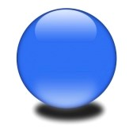
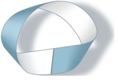
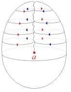

# Leçon 03 | 19 Décembre 1972

<!-- source-url: http://staferla.free.fr/S20/S20 ENCORE.docx -->
<!-- seminar: s20 -->
<!-- lesson: 03 -->

<!-- id: s20-03-0001 -->

Il paraît difficile de ne pas parler *bêtement* du langage.

<!-- id: s20-03-0002 -->

C’est pourtant, Jakobson, puisque tu es là...

<!-- id: s20-03-0003 -->

vous me permettrez de le tutoyer puisque nous avons vécu déjà un certain nombre de choses ensemble ...c’est pourtant Jakobson ce que tu réussis à faire.

<!-- id: s20-03-0004 -->

Et une fois de plus dans ces entretiens que Jakobson nous a donnés \[*Conférences au Collège de France, février et décembre* 1972\], j’ai pu l’admirer assez pour lui en faire maintenant l’hommage.

<!-- id: s20-03-0005 -->

<!-- id: s20-03-0006 -->

Roman Jakobson et Claude Lévi-Strauss au Collège de France en Février 1972

<!-- id: s20-03-0007 -->

Il faut pourtant... il faut pourtant *nourrir la bêtise*.

<!-- id: s20-03-0008 -->

Non pas parce que tous ceux qu’on nourrit soient *« bêtes »...*

<!-- id: s20-03-0009 -->

> si je puis dire d’un terme sur quoi *cette année nous aurons à revenir* *essentiellement* ...c’est-à-dire parce qu’il soutient leur *forme*, mais plutôt parce qu’il est démontré que *se nourrir* fait partie de *la bêtise*.

<!-- id: s20-03-0010 -->

Dois-je ré-évoquer devant cette salle, où l’on est en somme au restaurant, et où l’on croit d’ailleurs, on *s’imagine*, qu’on se nourrit parce qu’on n’est pas au restaurant universitaire, mais cette dimension *imaginative,* c’est justement en ça qu’on se nourrit.

<!-- id: s20-03-0011 -->

\[*la bêtise est celle du* **S1** (*signifiant maître du sujet, Produit, Plus-de-jouir » du discours* A), *mais signifiant asémantique, coupé de toute référence au sens et au savoir *: S1◊S2, *et qui demande à être nourri de jouissances (jouissances phalliques à répétition visant* S1 *mais n’atteignant que (a), « jouissances de l’idiot » etc. encore et encore...*\]

<!-- id: s20-03-0012 -->

Ce que j’évoque c’est ce que... je vous fais confiance pour vous souvenir de ce qu’enseigne *le discours analytique* : cette vieille liaison avec *la nourrice*, mère en plus comme par hasard, avec derrière cette histoire infernale du *désir de la mère* et de tout ce qui s’ensuit.

<!-- id: s20-03-0013 -->

C’est bien ça dont il s’agit dans la nourriture, c’est bien quelque sorte de *bêtise,* mais que le même discours *assoit*, si je puis dire, dans son droit.

<!-- id: s20-03-0014 -->

Un jour je me suis aperçu qu’il était *difficile*...

<!-- id: s20-03-0015 -->

> je reprends le même mot de la première phrase ...de ne pas entrer dans la linguistique à partir du moment où l’inconscient était découvert.

<!-- id: s20-03-0016 -->

D’où j’ai fait quelque chose, qui me paraît à vrai dire *la seule objection* que je puisse formuler à ce que vous avez pu entendre l’un de ces jours, de la bouche de Jakobson, c’est à savoir que tout ce qui est du *langage* relèverait *de la linguistique,* c’est-à-dire en dernier terme *du linguiste*, non que je ne le lui - très aisément - accorde quand il s’agit de la poésie, à propos de laquelle il a avancé cet argument[^19].

<!-- id: s20-03-0017 -->

Mais si je prends tout ce qui s’ensuit du *langage*...

<!-- id: s20-03-0018 -->

> et nommément de ce qui en résulte dans *cette fondation du sujet*, si renouvelé, si subverti,
>
> que *c’est bien là* le statut dont s’assure *tout ce qui* de la bouche de Freud *s’est affirmé comme l’inconscient* ...alors il me faudra forger quelque autre mot pour laisser à Jakobson son domaine réservé, et si vous le voulez j’appellerai ça « *la linguisterie* ».

<!-- id: s20-03-0019 -->

Je donne dans *la linguisterie,* ce qui me laisse quelque part aux linguistes, non sans expliquer tant de fois que des linguistes je ne subisse, je n’éprouve...

<!-- id: s20-03-0020 -->

> et après tout *allègrement* de la part de tant de linguistes ...plus d’une remontrance.

<!-- id: s20-03-0021 -->

Certes pas de Jakobson, mais c’est parce *« qu’il m’a à la bonne »* autrement dit : il m’aime \[*Rires*\], c’est la façon dont j’exprime ça dans l’intimité.

<!-- id: s20-03-0022 -->

Mais si vous attendez ce que je pourrais dire de *l’amour*, ceci ne fera en somme que confirmer cette certaine disjonction que par bonheur ce matin...

<!-- id: s20-03-0023 -->

> enfin j’ai trouvé ça ce matin, exactement à 8 heures et demie, en commençant à prendre des notes, c’est toujours l’heure où je le fais pour ce que j’ai... enfin... à vous dire,
>
> ce n’est pas que je n’y pense depuis longtemps, mais cela ne se rédige qu’à la fin ...j’ai trouvé ça : « *linguisterie ».*

<!-- id: s20-03-0024 -->

*Ça comporte des effets*, nommément au niveau… pas du *dit,* parce qu’après tout il y a *des dits qui sont communs aux deux champs*, c’est bien là-dessus que je prends référence, et *c’est de là* que je peux dire que « *l’inconscient est structuré comme un langage »*.

<!-- id: s20-03-0025 -->

\[*la linguisterie a pour objet « lalangue » *: *ce qui des expériences de jouissance liées à l’Autre primordial, s’inscrit comme « trait » en* α, β, γ, δ, *et génère par la combinatoire une structure, (cf. l’« introduction » au séminaire sur La lettre volée), comme un langage,* *un savoir inconscient qui fait irruption dans le discours courant par le lapsus, le mot d’esprit...*\]

<!-- id: s20-03-0026 -->

Mais il est suffisamment clair qu’en ayant posé *ce dire*...

<!-- id: s20-03-0027 -->

> comme j’en ai depuis avancé d’autres,
>
> m’enfin c’est déjà pas mal qu’un certain nombre en restent à celui-là: il est important ...*ce dire* après tout n’est pas du champ de *la linguistique*, c’est une porte ouverte sur ceci que vous verrez commenté dans ce qui va paraître, développé dans le prochain numéro de mon bien connu *« a-périodique »* \[*Scilicet n°* 4\], avec pour titre « *L’Étourdit » :* *d.i.t* [^20]. \[*Dans la séance du 21-11-1972 Lacan a rappelé* [*la stricte équivalence de « topol**ogie » et « structure*](#Topologie_structure)* »* *développée dans L’étourdit (14-7-1972),* *où il montre que cette topologie (mœbienne) du discours* A *permet de passer  *:

<!-- id: s20-03-0028 -->

- *des « discours univoques » à topologie « sphérique » (→ *H,U,M: *à deux faces, avec un intérieur et un extérieur, un signifiant support de la « distinction » et un signifié, etc.) → qui relèvent de la linguistique*

<!-- id: s20-03-0029 -->

- *à « un discours multivoque » à topologie mœbienne qui, comme la bande de Mœbius, n’a qu’une face (ex. de la continuité des deux topologies dans le cross-cap),*

<!-- id: s20-03-0030 -->

> *et qui concerne* S1 *le signifiant sans signifié → coupé du savoir *: S1◊ S2 *→ asémantique, la « bêtise » de la singularité,* S1 *→ qui relève de la linguisterie*\]

<!-- id: s20-03-0031 -->

 /  

<!-- id: s20-03-0032 -->

> H,U,M A

<!-- id: s20-03-0033 -->

J’y reprends, j’y pars de la phrase que j’ai, l’année dernière, à plusieurs reprises écrite au tableau[^21] sans jamais lui donner de développement, parce que j’ai trouvé que j’avais mieux à faire, c’est-à-dire à entendre quelqu’un qui après avoir bien voulu prendre la parole ici, nommément ce Récanati que vous avez entendu une fois de plus la dernière fois, et grâce à quoi je peux relever la légitimité du titre de « *séminaire »*, grâce à lui donc je n’ai pas donné suite à ceci que : *« le dire est justement ce qui reste oublié derrière ce qui est dit dans ce qu’on entend ».*

<!-- id: s20-03-0034 -->

C’est pourtant aux conséquences du *dit* que se juge *le dire* \[*le dire → le dit → l’entendu : l’univocité du sens qui masque le dire*\].

<!-- id: s20-03-0035 -->

Mais ce qu’on en fait du *dire*, reste ouvert : on peut faire des tas de choses avec les meubles à partir du moment, par exemple, où on a *« essuyé »* *un siège ou un bombardement* \[→ *nombreuses équivoques*\].

<!-- id: s20-03-0036 -->

Il y a un texte de Rimbaud dont j’ai fait état, je pense l’année dernière.

<!-- id: s20-03-0037 -->

J’ai pas été rechercher, j’ai pas été rechercher où il se trouve textuellement, et puis c’est parce que j’étais pressé ce matin...

<!-- id: s20-03-0038 -->

c’est ce matin que j’y ai repensé, je crois quand même que c’est l’année dernière... \[*en fait séance du* 10-01-1968 de *« L’acte analytique »*\]

<!-- id: s20-03-0039 -->

> *Un coup de ton doigt sur le tambour décharge tous les sons et commence la nouvelle harmonie.*
>
> *Un pas de toi, c’est la levée des nouveaux hommes et leur en-marche.*
>
> *Ta tête se détourne : le nouvel amour !*
>
> *Ta tête se retourne, - le nouvel amour !*
>
> *« Change nos lots, crible les fléaux, à commencer par le temps », te chantent ces enfants.*
>
> *« Élève n’importe où la substance de nos fortunes et de nos vœux » on t’en prie.*

<!-- id: s20-03-0040 -->

*Arrivée de toujours, qui t’en iras partout.*

<!-- id: s20-03-0041 -->

C’est ce texte qui s’appelle « *À une raison »* qui se scande de cette réplique qui en termine chaque verset : *un nouvel amour.* Et puisque je suis censé, la dernière fois, avoir parlé de *l’amour,* pourquoi pas le reprendre à ce niveau.

<!-- id: s20-03-0042 -->

Pour ceux qui savent, qui ont déjà là-dessus un petit peu entendu quelque chose, je le reprendrai au niveau de ce texte, et toujours sur ce point de marquer la distance de la linguistique à la *linguisterie*.

<!-- id: s20-03-0043 -->

L’amour c’est...

<!-- id: s20-03-0044 -->

chez Rimbaud, dans ce texte *...*le signe, le signe pointé \[☞\] comme tel de ce qu’on change de *raison* \[ → *de discours*\], c’est bien pourquoi c’est à cette *raison* qu’il s’adresse: *« À une raison »,* on a changé de discours [^22].

<!-- id: s20-03-0045 -->

Je pense que quand même...

<!-- id: s20-03-0046 -->

> quoiqu’il y en ait qui s’en aillent dans les couloirs
>
> en demandant qu’on leur explique ce que c’est que les 4 *discours* ...je pense que, comme ça, au collectif, je peux me référer à ceci que j’en ai articulé quatre et que je n’ai pas besoin de vous en refaire la liste.

<!-- id: s20-03-0047 -->

Je veux vous faire remarquer que ces 4 *discours* ne sont à prendre en aucun cas comme une suite *d’émergences historiques,* qu’il y en ait eu un qui soit venu depuis plus longtemps que les autres, n’est pas là ce qui importe.

<!-- id: s20-03-0048 -->

> \[→ *l’amour est le signe du changement de discours : « un nouvel amour » ↔ un autre signifiant.*
>
> *Dans les 4 discours, l’impuissance du « Plus-de-jouir » à atteindre la Vérité déclenche une rupture, un saut (quart de tour anti-horaire),*
>
> *un renversement du discours précédent*→ *une autre « raison »* → *un autre « signifiant » vient occuper la place du Semblant,*
>
> *par exemple le renversement du discours* H*ystérique aboutit au* *discours du* M*aître* : *le* S1 *prend la place du* S.\]

<!-- id: s20-03-0049 -->

En disant que *l’amour c’est le signe de ce qu’on change de discours,* je dis proprement ceci : que *le dernier* à prendre ce déploiement qui m’a permis de les faire 4...

<!-- id: s20-03-0050 -->

> mais ils n’existent 4 que sur le fondement de ce *discours psychanalytique* que j’articule de 4 places,
>
> et sur chacune, de la prise de quelque *effet de signifiant* stipulé comme tel *...ce discours psychanalytique, y’en a toujours quelque émergence à chaque passage d’un discours à un autre*.

<!-- id: s20-03-0051 -->

Ça vaut la peine d’être retenu, non pas pour faire de l’histoire puisqu’il ne s’agit de ça en aucun cas, mais pour, si on se trouve par exemple placé dans une condition historique, si l’on repère, si l’on s’avance, mais c’est *libre* qu’on considère que la fondation de l’université au temps de Charlemagne c’était le passage d’un *discours du Maître* à l’orée d’un autre discours.

<!-- id: s20-03-0052 -->

Simplement à retenir qu’à appliquer ces catégories, qui ne sont elles-mêmes structurées que *de l’existence...*

<!-- id: s20-03-0053 -->

> qui est un terme, mais qui n’a rien de terminal ...*du discours psychanalytique,* il faudrait seulement dresser l’oreille à la mise à l’épreuve de cette vérité...

<!-- id: s20-03-0054 -->

> *qu*’*il y a émergence du discours analytique à chaque « passage »...*de ce que le *discours analytique* permet de pointer comme *franchissement d’un discours à un autre*. \[*chacun des discours* H,U,M *commence par soutenir la possibilité d’un rapport sexuel (jouissance phallique) pour aboutir à l’aporie, à l’impuissance du « Plus-de-jouir »* *à atteindre la Vérité. Le discours* A *interroge la jouissance de l’Autre* (*a* → S → ↓S1 ◊ S2), *il y a donc « émergence » du discours* A, *et demande d’amour,* *chaque fois qu’on change de discours quand on vient buter sur la faille, sur l’impuissance du « Plus-de-jouir » à réaliser la jouissance du corps de l’Autre* → *quand l’Autre répond « Ce n’est pas ça ! ».*\]

<!-- id: s20-03-0055 -->

La dernière fois j’ai dit que « *La jouissance de l’Autre...*

<!-- id: s20-03-0056 -->

> je vous passe la suite, vous pouvez la reprendre *...n’est pas le signe de l’amour »,* et ici je dis que *« l’amour est un signe ».*

<!-- id: s20-03-0057 -->

L’amour tient-il dans le fait que ce qui apparaît ce n’est rien d’autre, ce n’est rien de plus que *le signe ?*

<!-- id: s20-03-0058 -->

C’est ici que *La logique de Port-Royal,* l’autre jour évoquée \[*François Récanati, 12 déc.1972* \], viendrait nous prêter aide.

<!-- id: s20-03-0059 -->

*Le signe...*

<!-- id: s20-03-0060 -->

avance-t-elle cette logique, et on s’émerveille toujours de ces *dires* qui prennent un poids quelquefois bien longtemps après ...*le signe* c’est ce qui ne se définit que de *la disjonction de* 2 *substances* qui n’auraient aucune « partie commune », ce que de nos jours nous appelons *« intersection »*. Ceci va nous conduire à des réponses, tout à l’heure.

<!-- id: s20-03-0061 -->

> \[*il y a hétérogénéité des deux substances* : *substance potentielle (matérielle) ≠ substance de l’extension (prédicative).*
>
> *Cf. supra « l’étroit chemin » que Lacan fraye (littoral) entre deux espaces hétérogènes*\]

<!-- id: s20-03-0062 -->

*Ce qui n’est pas signe de l’amour*...

<!-- id: s20-03-0063 -->

> je le reprends donc de la dernière fois - ce que j’ai énoncé de *la jouissance de l’Autre,*
>
> ce que je viens de rappeler à l’instant en commentant : *« ...du corps qui le symbolise »* ...*la jouissance de l’Autre*...

<!-- id: s20-03-0064 -->

> avec le grand A que j’ai souligné en cette occasion *...c’est proprement celle de « l’Autre sexe »,* et je commentais : « *du corps qui le symbolise »*.

<!-- id: s20-03-0065 -->

Changement de discours: assurément c’est là qu’il est étonnant que ce que j’articule à partir du *discours psychanalytique,* eh bien *ça bouge, ça noue, ça se traverse*... Personne n’accuse le coup !

<!-- id: s20-03-0066 -->

> \[*C’est à partir du discours* A *que l’on peut « pointer » ce renversement d’un discours dans un autre,*
>
> *et le mouvement qui en résulte (« ça bouge » dit Lacan) - la « ronde des discours » - n’est perçu que par le « bouclage » que permet le discours* A\]

<!-- id: s20-03-0067 -->

J’ai beau dire que cette notion de *« discours »* est à prendre comme *lien social...*

<!-- id: s20-03-0068 -->

comme tel *fondé sur le langage* et différenciant ses fonctions à propos de cet usage du langage \[*comme lien social*\], il semble donc comme tel n’être pas sans rapport avec ce qui dans *la linguistique* se spécifie *comme grammaire...*rien ne semble s’en modifier : cet usage instituant, nul ne le soulève, du moins à ce qui apparaît.

<!-- id: s20-03-0069 -->

\[*la linguisterie qui se fonde du* S1 *conduit à la notion de « discours » à prendre comme lien social (à deux dans le discours* A *→ chaque type de discours, chaque « raison », fonde, structure, institue, met en forme (information) un lien social, comme <u>une</u> grammaire* (*cf. structuré comme <u>un</u> langage*).

<!-- id: s20-03-0070 -->

*La linguistique se fonde du signifiant, support du trait distinctif (phonème), et du signifié comme « message »,* *sous réserve de conformité de la chaîne signifiante au code du langage (d’où la grammaire) → théorie (scientifique *: *mathématique, génétique...) de l’information*\]

<!-- id: s20-03-0071 -->

Peut-être *ça pose la question* de savoir ce qu’il en est de la notion d’*information*.

<!-- id: s20-03-0072 -->

Est-ce qu’à prendre *le langage dans la linguisterie*...

<!-- id: s20-03-0073 -->

> la notion qui semble promue comme appareil aisé, propice à faire fonctionner le langage dans la linguistique d’une façon pas bête, celle qui impliquait *codes* et *messages*, *transmission*, *sujet* donc, et aussi bien *espace*, *distance* ...est-ce que malgré le succès foudroyant de cette *fonction d’information*, succès tel qu’on peut dire que la science toute entière vient à s’en infiltrer...

<!-- id: s20-03-0074 -->

> nous en sommes au niveau de l’information moléculaire, du gène et des enroulements des nucléoprotéines autour des tiges d’ADN, elles-mêmes enroulées l’une autour de l’autre, et tout cela est lié par des liens hormonaux, ce sont *messages* qui s’envoient, qui s’enregistrent.

<!-- id: s20-03-0075 -->

Qu’est-ce à dire, puisqu’aussi bien le succès de cette formule prend sa source incontestable

<!-- id: s20-03-0076 -->

> dans une linguistique qui n’est pas seulement *immanente* mais bel et bien formulée. Bref la notion qui va à s’étendre jusqu’aux fondements mêmes de la pensée scientifique,
>
> à s’articuler comme néguentropique ...est-ce qu’il y a là quelque chose qui ne peut pas nous faire poser question, si c’est bien ce que *d’ailleurs *: de ma *linguisterie,* je recueille - et légitimement - quand je me sers de la fonction du *signifiant* ?

<!-- id: s20-03-0077 -->

Qu’est-ce que <u>le</u> signifiant ?

<!-- id: s20-03-0078 -->

*Le signifiant* tel que je l’hérite d’une tradition linguistique qui, il importe de le remarquer, n’est pas spécifiquement saussurienne [^23], elle remonte bien plus haut*...*

<!-- id: s20-03-0079 -->

> ce n’est pas moi qui l’ai découvert [^24] *...*jusqu’aux Stoïciens[^25], elle se reflète chez Saint-Augustin [^26], elle est à structurer en termes topologiques.

<!-- id: s20-03-0080 -->

En ce qui concerne le langage, *le signifiant* est d’abord qu’il a *effet de signifié*, qu’il importe de ne pas élider qu’entre les deux il y a ce qui s’écrit comme *une barre,* qu’il y a quelque chose *« de barre »* à franchir.

<!-- id: s20-03-0081 -->

Il est clair que cette façon de topologiser ce qu’il en est du langage, est illustrée*...*

<!-- id: s20-03-0082 -->

> certes sous la forme la plus admirable *...*par la phonologie, au sens où elle incarne du *phonème* ce qu’il en est du *signifiant*, mais que *le signifiant* d’aucune façon ne peut se *limiter* à ce support phonématique.

<!-- id: s20-03-0083 -->

*Qu’est-ce qu’<u>un</u> signifiant* ?

<!-- id: s20-03-0084 -->

Il faut déjà que je m’arrête à poser la question sous cette forme : « *un* » mis avant le terme, est en usage *d’article indéterminé*, c’est-à-dire que déjà il suppose que le signifiant peut être collectivisé, qu’on peut en faire une collection, c’est-à-dire en parler comme de quelque chose qui se totalise.

<!-- id: s20-03-0085 -->

\[*l’essence du signifiant étant d’être « pure différence » d’avec tous les autres, il n’y a aucun prédicat qui permette de tous les réunir en une collection*\]

<!-- id: s20-03-0086 -->

Puisque le linguiste sûrement aurait de la peine, me semble-t-il, à expliquer...

<!-- id: s20-03-0087 -->

> parce qu’il n’a pas de prédicat pour la fonder - cette collection - pour la fonder sur un « *le* » ...comme Jakobson l’a fait remarquer, et très nommément hier, ce n’est pas *le mot* qui peut le fonder ce signifiant, le mot n’a d’autre point où s’y faire *collection* que le dictionnaire, où il peut être rangé.

<!-- id: s20-03-0088 -->

Pour vous faire sentir que « *le* » *signifiant* dans l’occasion...

<!-- id: s20-03-0089 -->

> comme très proprement de sa réflexion sémantique Jakobson le faisait remarquer ...pour vous le faire sentir, je ne parlerai pas de la fameuse « *phrase* »...

<!-- id: s20-03-0090 -->

> qui pourtant est bien là aussi l’unité signifiante, et qu’à l’occasion on essaiera,
>
> dans ses représentants typiques, de collecter comme il se fait à l’occasion pour une même langue ...je parlerai plutôt du « *proverbe* » auquel je ne peux pas dire qu’un certain petit article de Paulhan [^27], qui m’est tombé récemment sous la main, ne m’ait pas fait m’intéresser, d’autant plus vivement que Paulhan semble avoir remarqué...

<!-- id: s20-03-0091 -->

> dans cette sorte de dialogue tellement ambigu, qui est celui qui se fait de l’étranger
>
> avec une certaine « aire de compétence linguistique » comme on dit ...s’est aperçu en d’autres termes qu’avec ses Malgaches le proverbe avait un poids qui lui a semblé jouer un rôle tout à fait spécifique.

<!-- id: s20-03-0092 -->

Qu’il l’ait découvert à cette occasion ne m’empêchera pas de ne pas aller plus loin, mais de faire remarquer que dans les marges de la fonction proverbiale, il y a des choses à la limite qui vont montrer comme cette signifiance est quelque chose qui* s’éventaille*...

<!-- id: s20-03-0093 -->

> si vous me permettez ce terme ...du proverbe à la locution.

<!-- id: s20-03-0094 -->

Ce que je vais vous demander... ou *vous chercherez* dans le dictionnaire l’expression *« à tire-larigot » *!

<!-- id: s20-03-0095 -->

Faites-le, vous m’en direz des nouvelles !

<!-- id: s20-03-0096 -->

Et puis dans l’interprétation, la construction, la fabulation, on va jusqu’à inventer un Monsieur, juste pour l’occasion, qui se serait appelé Larigot, c’est à force de lui tirer la jambe aussi qu’on aurait fini par créer *« à tire-larigot »*.

<!-- id: s20-03-0097 -->

*Qu’est-ce que ça veut dire « à tire-larigot » ?*

<!-- id: s20-03-0098 -->

Il y en a bien d’autres locutions aussi extravagantes qui ne veulent dire rien d’autre que ça :

<!-- id: s20-03-0099 -->

- la submersion du désir, c’est le sens d’« à tire-larigot ».

<!-- id: s20-03-0100 -->

- Par quoi ? Par le tonneau percé !

<!-- id: s20-03-0101 -->

- De quoi ? Mais de la s*ignifiance* elle-même, « à tire-larigot » : un bock de *signifiance*.

<!-- id: s20-03-0102 -->

Alors qu’est-ce que c’est, qu’est-ce que c’est que cette *signifiance* ? \[*ni le mot, ni la phrase, ni le proverbe, ni la locution*…\]

<!-- id: s20-03-0103 -->

Au niveau où nous sommes, c’est *ce qui a des effets de signifié*.

<!-- id: s20-03-0104 -->

Mais n’oublions pas qu’au départ si l’on s’est attaché - et tellement - à l’élément signifiant, au phonème, c’était pour bien marquer que cette distance, qu’on a à tort qualifiée de fondement de *l’arbitraire*...

<!-- id: s20-03-0105 -->

> c’est comme s’exprime - probablement contre son cœur - Saussure.
>
> Il avait affaire - comme ça arrive n’est-ce pas ? \[*sic*\] - à des imbéciles, il pensait bien autre chose,
>
> *bien plus près du texte du* *Cratyle* [^28]quand on voit ce qu’il a dans ses tiroirs : des histoires d’*anagrammes* [^29] ...ce qui passe pour de *l’arbitraire* c’est que *les effets de signifié*, eux, sont bien plus difficiles à soupeser.

<!-- id: s20-03-0106 -->

C’est vrai qu’ils ont l’air de n’avoir rien à faire avec ce qui les cause. Mais s’ils n’ont rien à faire avec ce qui les cause, c’est parce qu’on s’attend à ce que ce qui les cause ait un certain rapport avec du *réel*... je parle : avec du *réel sérieux*.

<!-- id: s20-03-0107 -->

Ce qu’on appelle du *réel sérieux*, il faut bien sûr en mettre un coup pour l’approcher, pour s’apercevoir que *le sérieux ça ne peut être que le sériel*, il faut un peu avoir suivi mes séminaires[^30].

<!-- id: s20-03-0108 -->

En attendant, ce qu’on veut dire par là c’est que les « *référents* », les choses à quoi ça sert, ce *signifié,* à en approcher...

<!-- id: s20-03-0109 -->

Eh ben justement elles restent approximatives, elles restent macroscopiques par exemple.

<!-- id: s20-03-0110 -->

C’est pourtant pas ça qui est important, c’est pas que ce soit *imaginaire*, parce qu’après tout ça suffirait déjà très bien si le signifiant nous permettait de pointer *cette image qu’il nous faut pour être heureux*. Seulement c’est pas le cas.

<!-- id: s20-03-0111 -->

C’est dans cette approche que *le signifié* a pour propriété, sauf introduction du *sériel*, du *sérieux*, mais ça ne s’obtient qu’après *un très long temps d’extraction*, du langage, *de ce quelque chose qui y est pris*, et dont nous...

<!-- id: s20-03-0112 -->

> au point où j’en suis de mon exposé ...nous n’avons qu’une idée lointaine, ne serait-ce qu’à propos

<!-- id: s20-03-0113 -->

- de ce « *un* » indéterminé \[« *Un signifiant » *- *« Un » *: article indéfini, et « *signifiant* » : substantif,

<!-- id: s20-03-0114 -->

> \- *« Un » *: substantif (un *Un*), et « *signifiant* » : verbe (participe présent)\],

<!-- id: s20-03-0115 -->

- et de ce « *le* » \[« *Le signifiant » *: - *« Le » *: article défini, et « *signifiant* » : substantif,

<!-- id: s20-03-0116 -->

> \- *« Le » *: « *L’unique* » et « *signifiant* » : substantif, → « *Le signifiant Un* » : **S1** \]
>
> dont nous ne savons pas, *à propos du signifiant* - comment faire fonctionner pour qu’il le *collectivise*.

<!-- id: s20-03-0117 -->

À la vérité il faut renverser : au lieu d’*un signifiant* qu’on interroge, interroger *le signifiant «* Un *»*.

<!-- id: s20-03-0118 -->

Mais nous n’en sommes pas encore là.

<!-- id: s20-03-0119 -->

Au niveau de la distinction signifiant-signifié, ce qui caractérise le signifié quant à ce qui est là pourtant comme tiers indispensable, à savoir le référent,

<!-- id: s20-03-0120 -->

- c’est proprement que *le signifié le rate*,

<!-- id: s20-03-0121 -->

- c’est que le collimateur ne fonctionne pas.

<!-- id: s20-03-0122 -->

Le comble du comble c’est qu’on arrive quand même à s’en servir en passant par d’autres trucs !

<!-- id: s20-03-0123 -->

\[*le signifié ne permet pas d’accéder au réel, sinon par la série qui ne l’approche « qu’après un très long temps d’extraction » (cf. série de Fibonacci : par approximations successives)* *→ « le collimateur ne fonctionne pas », cf. supra : « ...après tout ça suffirait déjà très bien si le signifiant nous permettait de pointer cette image qu’il nous faut pour être heureux »*\]

<!-- id: s20-03-0124 -->

En attendant, en attendant pour caractériser la fonction du signifiant, pour le *collectiviser* d’une façon qui aussi bien ressemble à une prédication, eh bien nous avons quelque chose qui est ce d’où je suis parti aujourd’hui, puisque Récanati - toujours de *la logique de Port-Royal* - vous a parlé des adjectifs substantivés :

<!-- id: s20-03-0125 -->

- de *la rondeur* qu’on extrait du *rond*, \[*le « Beau » de la sphère du monde phallique* ↔ *l’immonde de la Chose ex-sistante*\]

<!-- id: s20-03-0126 -->

- pourquoi pas de *la justice* du *juste,* \[*le « Bien » du « juste ce qu’il faut »* ↔ *dangereuse Jouissance ex-sistante* \]

<!-- id: s20-03-0127 -->

- et de *la prudence* de quelques autres formes substantives. \[*le « Vrai » comme approche de la Vérité ex-sistante*\]

<!-- id: s20-03-0128 -->

C’est bien tout de même ce qui va nous permettre d’avancer notre *« bêtise »* \[*avancer* S1 *dans la ronde des discours*\], pour trancher que peut-être bien n’est-elle pas, comme on le croit, une catégorie sémantique \[*sens* ↔ *non-sens*\], mais *un mode de collectiviser le signifiant*. Pourquoi pas ? Pourquoi pas ? *Le signifiant c’est bête !*

<!-- id: s20-03-0129 -->

Il me semble que c’est de nature à engendrer un sourire, un sourire bête naturellement !

<!-- id: s20-03-0130 -->

Mais un sourire bête comme chacun sait, y’a qu’à aller dans les cathédrales, un sourire bête c’est un sourire d’ange.

<!-- id: s20-03-0131 -->

C’est même là la seule justification - vous savez - de la semonce pascalienne [^31], c’est sa seule justification.

<!-- id: s20-03-0132 -->

*Si l’ange a un sourire si bête c’est parce qu’il nage dans le signifiant suprême*, se retrouver un peu au sec ça lui ferait du bien, peut-être qu’il ne sourirait plus.

<!-- id: s20-03-0133 -->

C’est pas que je ne croie pas aux anges, chacun le sait : j’y crois inextrayablement et même  « inexteilhardement » \[*Rires*\] \[*cf. séance du 07-04-1965*\].

<!-- id: s20-03-0134 -->

C’est simplement que je ne crois pas, par contre, qu’il apporte le moindre *message* \[ Ἄγγελος (*angelos *: *messager*)\], et c’est - sur ce point-là, au niveau du signifiant, n’est-ce pas - en quoi, en quoi il est vraiment signifiant justement.

<!-- id: s20-03-0135 -->

> \[S1, *le signifiant fondamental, est « bête », asémantique, il n’est porteur d’aucun message, d’aucun sens, et c’est là dans le « non-sens » du symptôme,*
>
> *du lapsus, du rêve... qu’« il est vraiment signifiant », qu’il signifie, dénote, désigne, ce qui n’est pas là, ce qui est toujours absent,*
>
> *ce qui est « perdu » et éperdument visé* \]

<!-- id: s20-03-0136 -->

Alors il s’agirait quand même de savoir où tout ça nous mène, et de nous poser la question de savoir pourquoi nous mettons tant d’accent sur cette fonction du signifiant \[*le* S1 *« bête »*\].

<!-- id: s20-03-0137 -->

Il s’agirait de la fonder, parce que quand même, c’est le fondement du symbolique - nous le maintenons – quelles que soient ses dimensions qui ne nous permettent d’évoquer <u>que</u> *le discours analytique*.

<!-- id: s20-03-0138 -->

> \[*ce* S1 *signifiant « bête » n’est pas celui de la linguistique mais celui de la linguisterie, des bêtises, de la jouissance, de ce qui « ne se peut dire »*
>
> *→ au fondement même du symbolique comme trace, écriture, d’une expérience de jouissance*\]

<!-- id: s20-03-0139 -->

J’aurais pu aborder les choses d’une autre façon, j’aurais pu vous dire comment on fait pour venir me demander une analyse par exemple.

<!-- id: s20-03-0140 -->

Je voudrais pas toucher à cette fraîcheur, il y en a qui se reconnaîtraient, et Dieu sait ce qu’ils penseraient, ce qu’ils s’imagineraient de ce que je pense.

<!-- id: s20-03-0141 -->

Peut-être qu’ils croiraient que je les crois *bêtes*, ce qui est vraiment la dernière idée qui pourrait me venir dans un tel cas, il n’est pas question - mais pas du tout ! - de la bêtise de tel ou tel.

<!-- id: s20-03-0142 -->

La question est de ce que *le discours analytique* introduit un adjectif substantivé : la bêtise, en tant qu’elle est une dimension en exercice, du signifiant. Là, il faut y regarder plus près.

<!-- id: s20-03-0143 -->

\[*la logique de Port-Royal (cf. l’exposé de F. Récanati) distinguait la substance potentielle et la substance prédicative (adjectif substantivé)*\].

<!-- id: s20-03-0144 -->

Car après tout dès qu’on substantive \[*un adjectif* \] c’est pour supposer *une substance* \[*potentielle, sub-posée, subjectum...*\], et les *substances* - mon Dieu - de nos jours, nous n’en n’avons pas à la pelle : d’abord *« la substance pensante »,* et *« la substance étendue »*.

<!-- id: s20-03-0145 -->

\[ces 2 *substances sont voisines de la substance prédicative et de la substance potentielle de la logique de Port-Royal, qui défend Descartes et s’inspire d’Aristote*)\]

<!-- id: s20-03-0146 -->

Il conviendrait peut-être d’interroger à partir de là, où peut bien se caser de « *la dimension substantielle* », qui justement, quelque distante qu’elle soit de nous, et jusqu’à maintenant ne nous faisant que *signe*, quel peut bien être ce à quoi nous pourrions accrocher cette *substance en exercice*, cette dimension...

<!-- id: s20-03-0147 -->

> qu’il faudrait écrire *d.i.t., trait d’union, mention *\[« *dit-mention* », *voire* « *dit-mansion* »\] ...à quoi la fonction du langage est d’abord ce qui y veille, avant tout usage meilleur et plus rigoureux. \[*lalangue <u>comme</u> un langage*\] \[*cette troisième dimension de la substance (dit-mension ou dit-mention, voire dit-mansion : la résidence du dit, lieu du savoir de l’Autre,* *de la vérité et de la jouissance) révèle occasionnellement la jouissance qui s’y exerce dans un « dire » dont l’écriture reste à déchiffrer*\]

<!-- id: s20-03-0148 -->

D’abord « *la substance pensante* » on peut quand même dire que nous l’avons sensiblement modifiée.

<!-- id: s20-03-0149 -->

Depuis ce « *je pense* » qui se supposant lui-même, en déduit l’*existence*, nous avons eu *un pas* à faire, et *ce pas est très proprement celui de l’inconscient.*

<!-- id: s20-03-0150 -->

Si j’en suis aujourd’hui à traîner dans l’ornière « *l’inconscient comme structuré par un langage »*, eh bien tout de même qu’on le sache, c’est que ça change totalement la fonction du sujet comme existant :

<!-- id: s20-03-0151 -->

- le sujet n’est pas celui qui pense,

<!-- -->

<!-- id: s20-03-0152 -->

- le sujet est proprement celui que nous engageons - à quoi ? - non pas, comme nous le lui disons,

<!-- id: s20-03-0153 -->

> comme ça pour le charmer, « *à tout dire* »...

<!-- id: s20-03-0154 -->

Je sais qu’il est tard et parce que je ne veux pas fatiguer celui dont je me considère en l’occasion comme l’hôte, à savoir Jakobson, je sais que je n’arriverai pas aujourd’hui à dépasser un certain champ.

<!-- id: s20-03-0155 -->

Néanmoins si je parle du *« pas tout »...*

<!-- id: s20-03-0156 -->

> ce qui tracasse beaucoup de monde ...si je l’ai mis au premier plan pour être la visée de cette année de mon discours, c’est bien là l’occasion de l’appliquer : on ne peut *« pas tout » dire,* mais qu’on puisse *dire des bêtises, tout est là.*

<!-- id: s20-03-0157 -->

C’est avec ça que nous allons faire l’analyse et que nous entrons dans le nouveau sujet qui est celui de l’inconscient.

<!-- id: s20-03-0158 -->

C’est justement dans la mesure où il veut bien ne plus *penser*, le bonhomme, qu’on en saura peut-être un petit peu plus long, et qu’on tirera quelques conséquences des *dits*, des *dits* justement dont on ne peut pas se dédire, c’est ça qui est la règle du jeu.

<!-- id: s20-03-0159 -->

\[*au-delà du discours courant : l’irruption d’un « dire », d’un Autre discours*\].

<!-- id: s20-03-0160 -->

De là surgit *un dire* \[*« Qu’on dise...*\] qui ne va pas toujours jusqu’à pouvoir *ex-sister* au *dit,* \[*« ...reste oublié derrière ce qui se dit...*\] à cause justement de *ce qui vient au <u>dit</u> comme* *conséquences*, \[*...dans <u>ce qui s’entend</u>. » : les conséquences du « dit » - le sens univoque - masquent le « dire »*\] et que c’est là l’épreuve où un certain *réel* dans l’analyse de quiconque - si « *bête* » \[*singulier, odd*…\] soit-il - peut être atteint.

<!-- id: s20-03-0161 -->

\[*cf. L’étourdit : « Qu’on dise reste oublié derrière ce qui se dit dans ce qui s’entend »*\]

<!-- id: s20-03-0162 -->

*Statut du « dire »* : il faut que je laisse tout ça de côté pour aujourd’hui.

<!-- id: s20-03-0163 -->

Mais quand même je peux bien vous dire que ce qu’il va y avoir cette année de plus emmerdant c’est qu’il va bien tout de même falloir soumettre à cette épreuve un certain nombre de *dires* de la tradition *philosophique*.

<!-- id: s20-03-0164 -->

Ce que je regrette beaucoup c’est que Parménide[^32], je parle de Parménide : de ce que nous en avons encore de ses *dires*, enfin de ce que la tradition philosophique en extrait, de ce d’où part par exemple mon maître Kojève : c’est *la pure position de l’être*.

<!-- id: s20-03-0165 -->

> \[*au discours philosophique sur l’être, tel que le reprend Kojève de Parménide : « l’être est, le non être n’est pas »,*
>
> *Lacan oppose un être fondé sur rien (zéro) qui ex-siste et qui fonde la série par la nomination :*
>
> *le zéro porte « un nom comme 1 », premier élément, puis le 1 porte un nom comme « 2 », etc. (cf. la fondation par Frege des entiers naturels)* \]

<!-- id: s20-03-0166 -->

Heureusement, heureusement que Parménide a écrit... a écrit en réalité *des poèmes*.

<!-- id: s20-03-0167 -->

Il s’y confirme justement ce en quoi il me semble que le témoignage du linguiste ici fait prime.

<!-- id: s20-03-0168 -->

C’est que justement à employer ces appareils, ces appareils qui ressemblent beaucoup à ce que je vais - juste à la fin - pouvoir pointer, à savoir l’articulation mathématique :

<!-- id: s20-03-0169 -->

- l’alternance après la succession,

<!-- id: s20-03-0170 -->

- l’encadrement après l’alternance.

<!-- id: s20-03-0171 -->

Enfin c’est bien parce qu’il était poète que Parménide dit en somme ce qu’il a à nous dire, de la façon la moins bête.

<!-- id: s20-03-0172 -->

Mais autrement *« que l’être soit et* *que le non-être ne soit pas »,* je ne sais pas ce que ça vous dit à vous, *mais moi je trouve ça bête.*

<!-- id: s20-03-0173 -->

Il faut pas croire que ça m’amuse de le dire, c’est fatigant parce que quand même nous aurons cette année besoin de *l’être*, de quelque chose que - Dieu merci - j’ai déjà avancé : *le signifiant* *«* Un *»,* pour lequel je vous ai, l’année dernière, suffisamment semble-t-il, frayé la voie à dire : « *Y’a d’l’Un »*.

<!-- id: s20-03-0174 -->

C’est de là que ça part *le sérieux*, si bête que ça en ait l’air ça aussi.

<!-- id: s20-03-0175 -->

Nous aurons donc tout de même quelques références à prendre, et à prendre *au minimum -* de la tradition philosophique. Ce qui nous intéresse c’est où nous en sommes, et où nous en sommes avec

<!-- id: s20-03-0176 -->

- *la substance pensante* \[*le « se jouis » : « Je pense, donc se jouit », Descartes revisité*\],

<!-- id: s20-03-0177 -->

- et à son complément : la fameuse « *substance étendue* », dont on ne se débarrasse pas non plus si aisément, puisque c’est là l’espace moderne.

<!-- id: s20-03-0178 -->

*Substance* \[*pensante*\] contre ce « *pur espace »* si je puis dire, ce « *pur espace »* comme on dit ça...

<!-- id: s20-03-0179 -->

> on peut le dire comme on dit « *pur esprit »*, et on ne peut pas dire que ce soit prometteur ...ce *pur espace* se fonde sur la notion de *parties* à condition d’y ajouter ceci : que toutes sont externes : *partes, extra partes,* c’est à ça que nous avons affaire.

<!-- id: s20-03-0180 -->

On est arrivé même avec ça à s’en tirer, c’est-à-dire à en extraire *quelques petites choses*, mais il a fallu faire *de sérieux pas*.

<!-- id: s20-03-0181 -->

\[*« partes, extra partes »→ topologie sphérique ou mœbienne*\]

<!-- id: s20-03-0182 -->

Pour situer, avant de vous quitter, mon *signifiant*, je vous propose... je vous propose de soupeser ce qui, la dernière fois, s’inscrit au début de ma première phrase qui comporte le « *jouir d’un corps... »* - d’un corps qui « *l’Autre, le symbolise* », et comporte peut-être quelque chose de nature à faire mettre au point une autre forme de *substance* : *la substance jouissante*.

<!-- id: s20-03-0183 -->

Est-ce que ce n’est pas là ce que suppose proprement et justement sous tout ce qui ici *signifie l’expérience psychanalytique,* *substance du corps*, à condition qu’elle se définisse

<!-- id: s20-03-0184 -->

- seulement de « *ce qui se jouit* »,

<!-- id: s20-03-0185 -->

- seulement propriété du *corps vivant* sans doute, mais nous ne savons pas ce que c’est d’être *vivant,* sinon seulement en ceci qu’un corps ça *se jouit*.

<!-- id: s20-03-0186 -->

\[*Descartes situait le corps dans la substance étendue, Lacan objecte : le corps ne jouit que d’être « corporisé de façon signifiante » → de* (*a*) *objet partiel.*

<!-- id: s20-03-0187 -->

*C’est là que Lacan désigne l’origine du « ratage » de Descartes concernant sa théorie des passions *: *« Les passions de l’âme » (Gallimard, pléiade, p. 691).* \]

<!-- id: s20-03-0188 -->

Et plus : nous tombons immédiatement sur ceci qu’il \[*le corps vivant*\] *ne se jouit que de le corporiser de façon signifiante*.

<!-- id: s20-03-0189 -->

Ce qui veut dire quelque chose d’autre que la *partes extra partes* de la *substance étendue*, comme le souligne admirablement cette sorte de... cette sorte de *kantien*...

<!-- id: s20-03-0190 -->

> disons-le, c’est un vieux bateau qui est quelque part dans mes *Écrits* [^33], qu’on lit plus ou moins bien ...cette sorte de *kantien* qu’était Sade, à savoir : *qu’on ne peut jouir que d’une partie du corps de l’autre*, comme il l’exprime très, très bien, pour la simple raison qu’on n’a jamais vu un corps s’enrouler complètement, totalement, jusqu’à l’inclure et le phagocyter autour du corps de l’autre \[*Rires*\].

<!-- id: s20-03-0191 -->

C’est même pour cela

<!-- id: s20-03-0192 -->

- qu’on en est réduit simplement à une petite étreinte, comme ça, un avant-bras ou n’importe quoi d’autre \[*Rires*\],

<!-- id: s20-03-0193 -->

- et que *jouir* a cette propriété fondamentale que c’est en *somme le corps de l’un qui jouit d’une part du corps de l’autre.*

<!-- id: s20-03-0194 -->

Qu’elle - cette part - *peut jouir aussi*, ça agrée à l’autre plus ou moins, *mais enfin c’est un fait* *qu’il ne peut pas y rester indifférent*.

<!-- id: s20-03-0195 -->

Et même qu’il arrive qu’il se produise quelque chose qui dépasse ce que je viens de décrire, marqué de toute l’ambiguïté signifiante, à savoir que le *« jouir du corps »* est un génitif, donc selon que vous le faites *objectif* ou *subjectif *:

<!-- id: s20-03-0196 -->

- a cette note *sadienne*, sur laquelle j’ai mis juste une petite touche \[*génitif subjectif : en jouir comme objet partiel* \] ,

<!-- id: s20-03-0197 -->

- ou au contraire *extatique,* suggestive, qui dit qu’en somme c’est *l’Autre qui jouit* \[*génitif objectif* \].

<!-- id: s20-03-0198 -->

Bien sûr il n’y a là qu’un niveau qui est bien *localisé*, le plus élémentaire dans ce qu’il en est de *la jouissance*, de *la jouissance* au sens où la dernière fois j’ai promu « *qu’elle n’était pas un signe de l’amour »*.

<!-- id: s20-03-0199 -->

C’est ce qui sera à soutenir, et bien sûr que cela nous mène de là, du niveau *de la jouissance phallique,* à ce que j’appelle proprement « *la jouissance de l’Autre »*, en tant qu’elle n’est ici que symbolisée, c’est encore toute autre chose : à savoir ce « *pas tout* » que j’aurai à articuler.

<!-- id: s20-03-0200 -->

Mais dans cette articulation, que veut dire*...* qu’est le signifiant ? Le signifiant...

<!-- id: s20-03-0201 -->

pour aujourd’hui je vais clore là-dessus, vu les motifs que j’en ai ...je dirai : le signifiant se situe au niveau de la *substance jouissante* comme étant...

<!-- id: s20-03-0202 -->

bien différemment de tout ce que je vais évoquer ...en résonance de la physique et, pas par hasard, de la physique aristotélicienne.

<!-- id: s20-03-0203 -->

La physique aristotélicienne qui seulement de pouvoir être sollicitée comme je vais le faire, nous montre à quel point justement, elle était une physique illusoire.

<!-- id: s20-03-0204 -->

Le signifiant c’est *la cause de la jouissance *: sans le signifiant comment même aborder cette partie du corps ?

<!-- id: s20-03-0205 -->

Comment, sans le signifiant, centrer ce *quelque chose*, qui de la jouissance est *la cause matérielle* ?

<!-- id: s20-03-0206 -->

C’est à savoir que, si flou, si confus que ce soit, c’est une partie qui, du corps \[*cause matérielle*\], est signifiée dans cet abord.

<!-- id: s20-03-0207 -->

\[*Aristote dans sa [Physique](http://remacle.org/bloodwolf/philosophes/Aristote/tablephysique.htm) distingue quatre types de « causes » : la cause matérielle, la cause formelle, la cause efficiente, la cause finale*\]

<!-- id: s20-03-0208 -->

Et après avoir pris ainsi ce que j’appellerai *la cause matérielle*, j’irai tout droit...

<!-- id: s20-03-0209 -->

> ceci sera plus tard repris, commenté ...à *la cause finale,* *« finale »* dans tous les sens du terme, proprement en ceci qu’elle en est le terme \[*la fin*\] :

<!-- id: s20-03-0210 -->

- le signifiant c’est ce qui fait *halte !* \[*cause finale*\] *à la jouissance*,

<!-- id: s20-03-0211 -->

- après ceux *qui s’enlacent* \[*cause formelle*\] si vous me permettez : *hélas !*

<!-- id: s20-03-0212 -->

- et après ceux *qui sont las* \[*cause efficiente*\] : *holà* !

<!-- id: s20-03-0213 -->

L’autre pôle du signifiant, le coup d’arrêt est là, aussi à l’origine que peut l’être *le vocatif du commandement*.

<!-- id: s20-03-0214 -->

Et l’efficience dont Aristote nous fait la 3ème forme de la cause, n’est rien enfin que ce projet dont se limite *la jouissance*.

<!-- id: s20-03-0215 -->

- \[*la cause matérielle *: *deux corps,*

<!-- id: s20-03-0216 -->

- *la cause formelle *: *l’étreinte, l’union qui vise à combler la faille de l’inexistence du rapport sexuel,*

<!-- id: s20-03-0217 -->

- *la cause efficiente* : *la jouissance,*

<!-- id: s20-03-0218 -->

- *la cause finale *: *« holà ! » → ce qui fait « halte ! » à la jouissance* \]

<!-- id: s20-03-0219 -->

Toutes sortes de choses sans doute, qui paraissent dans le règne animal, nous font parodie à ce chemin de *la jouissance* chez *l’être parlant*.

<!-- id: s20-03-0220 -->

Justement c’est chez eux que quelque chose se dessine, qu’ils participent beaucoup plus de la fonction du *message* : l’abeille transportant le pollen de la fleur *mâle* à la fleur *femelle*, voilà qui ressemble beaucoup plus à ce qu’il en est de la communication.

<!-- id: s20-03-0221 -->

Et l’étreinte, l’étreinte confuse d’où *la jouissance* prend sa cause, sa cause dernière, qui est formelle, est-ce que ce n’est pas beaucoup plus quelque chose de l’ordre de *la grammaire* qui la commande ?

<!-- id: s20-03-0222 -->

Ce n’est pas pour rien que « *Pierre bat Paul* » est au principe des premiers exemples de grammaire, ni que Pierre - pourquoi ne pas le dire comme ça - « *Pierre et paule* » donne l’exemple de la conjonction, à ceci près qu’il faut se demander après : *qui épaule l’autre*. \[*Rires*\]

<!-- id: s20-03-0223 -->

J’ai déjà joué là-dessus depuis vingt ans.

<!-- id: s20-03-0224 -->

On peut même dire que le verbe ne se définit que de ceci : c’est d’être un signifiant pas si bête - il faut écrire ça en un mot : *passibête -* que les autres sans doute, mais aussi qui fait le passage d’un sujet, d’un sujet justement *à sa propre division dans la jouissance*, et qu’il l’est encore moins qu’il devient *signe*, quand cette division il la détermine en disjonction.

<!-- id: s20-03-0225 -->

J’ai joué un jour autour d’un *lapsus* littéral*, « calami »* qu’on appelle ça.

<!-- id: s20-03-0226 -->

J’ai fait toute une de mes conférences de l’année dernière[^34] sur *le lapsus orthographique* que j’avais fait : « *Tu ne sauras jamais combien je t’ai aimé* » adressé à une femme, et terminé « *mé* ».

<!-- id: s20-03-0227 -->

On m’a fait remarquer depuis, que pris comme *lapsus*, cela voulait peut-être dire que j’étais homosexuel.

<!-- id: s20-03-0228 -->

Mais ce que j’ai articulé l’année dernière c’est que, quand on aime, il ne s’agit pas de sexe.

<!-- id: s20-03-0229 -->

Voilà sur quoi, si vous le voulez bien, j’en resterai aujourd’hui.

## Notes

[^19]: R. Jakobson : *Essais de linguistique générale*, Paris, éd. de Minuit, 1973, pp. 209-248, et conférences de Fév. et Déc.1972 au Collège de France.

[^20]: *L’Étourdit* in *Scilicet 4*, Paris, Seuil, Le champ freudien, 1973, pp. 5-52.

[^21]: Cf. les débuts des séances des 14 et 21 Juin 1972 : «  *Qu’on dise, comme fait, reste oublié derrière ce qui est dit, dans ce qui s’entend* ».

[^22]: Cf. séminaire 1969-70 : *L’Envers de la psychanalyse*, séance du 17-12-1969, Seuil, 1991, p.31.

[^23]: Ferdinand de Saussure : *Cours de linguistique générale*, Paris, Payot, 2006.

[^24]: Lacan fait référence à Jakobson.

[^25]: Cf. Marc Baratin : *[L’identité de la pensée et de la parole dans l’ancien stoïcisme](http://www.persee.fr/web/revues/home/prescript/article/lgge_0458-726x_1982_num_16_65_1117),* in *Langages*,1982, Volume 16,  N°65, pp. 9-21.

    Cf. Jacques Brunschwig : [*Remarques sur la théorie stoïcienne du nom propre*](http://www.persee.fr/web/revues/home/prescript/article/hel_0750-8069_1984_num_6_1_1173), in [*Histoire, Épistémologie, Langage*,](http://www.persee.fr/web/revues/home/prescript/revue/hel) 1984,Volume 6, [N° 6-1](http://www.persee.fr/web/revues/home/prescript/issue/hel_0750-8069_1984_num_6_1) pp. 3-19.

[^26]: Cf. séminaire 1953-54 : *Les écrits techniques de Freud*, séance du 23-06-54.

[^27]: Jean Paulhan, « *L’expérience du proverbe* » (1925), éd. L’Échoppe, 1993. Cf. notamment pp.61-66 *l’histoire de Ra-Chrysalide*.

[^28]: Platon : *Cratyle* ou *De la rectitude des mots*, in Œuvres complètes T.1, p.613, Paris, Gallimard, Pléiade, 1950.

[^29]: Ferdinand de Saussure : *Anagrammes homériques*, présentés et édités par Pierre-Yves Testenoire , éd. Lambert-Lucas, 2013.

    \- Jean Starobinski : *Les mots sous les mots. Les anagrammes de Ferdinand de Saussure*, Paris, Gallimard, 1971.

    \- Francis Gandon : *De dangereux édifices, Saussure lecteur de Lucrèce*, éd. Peters 2002.

    \- Michel Arrivé : *À la recherche de Ferdinand de Saussure*, P.U.F. 2007.

    \- Federico Bravo : *Anagrammes – Sur une hypothèse de Ferdinand de Saussure*, éd. Lambert-Lucas, Limoge, 2011.

[^30]: Cf. Séminaire 1966-67 : *La logique du fantasme*, séances du 22-02 au 14-06 : la série de Fibonacci, comme forme de l'incommensurabilité de (*a*) à 1.

[^31]: Pascal (*Pensées*): « *L’homme n'est ni ange ni bête, et le malheur veut que qui veut faire l’ange fait la bête*. »

[^32]: Parménide : *Le Poème*, *Les Présocratiques*, Paris, Gallimard, La pléiade, 1988, pp. 231- 272.

[^33]: Cf. « *Kant avec Sade* », in *Écrits*, Paris, Seuil, Le champ freudien, 1966, pp. 765-790.

[^34]: Cf. séminaire 1971-72 : « ...*Ou pire* », séance du 09-02-72.
