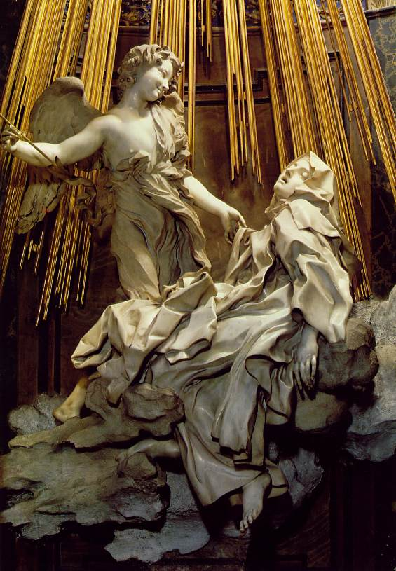

# Leçon 07 | 20 Février 1973

<!-- source-url: http://staferla.free.fr/S20/S20 ENCORE.docx -->
<!-- seminar: s20 -->
<!-- lesson: 07 -->

<!-- id: s20-07-0001 -->

Je peux bien vous avouer que j’espérais que les vacances dites « *scolaires »* auraient éclairci votre assistance.

<!-- id: s20-07-0002 -->

Il y a trop longtemps que... que je désirerais vous parler comme ça, en me promenant un petit peu entre vous, ça faciliterait certaines choses me semble-t-il.

<!-- id: s20-07-0003 -->

Mais enfin, puisque cette satisfaction m’est refusée, j’en reviens à ce dont je suis parti la dernière fois, de ce que j’ai appelé *« une autre satisfaction », satisfaction de la parole*.

<!-- id: s20-07-0004 -->

Une autre satisfaction, celle...

<!-- id: s20-07-0005 -->

> je le répète, c’est le début de ce que j’ai dit la dernière fois ...celle qui répond à *la jouissance qu’il fallait « juste »*, *« juste »* pour que ça se passe entre ce que j’abrégerai de les appeler « *l’homme* et *la femme »,* et qui est la *jouissance phallique*.

<!-- id: s20-07-0006 -->

Notez ici la modification qu’introduit ce mot *« juste »*.

<!-- id: s20-07-0007 -->

Ce *« juste »*, ce justement est un « *tout juste* », *tout juste réussi*...

<!-- id: s20-07-0008 -->

> ce qui, je pense, vous est sensible ...de donner justement *l’envers du raté*.

<!-- id: s20-07-0009 -->

Ça réussit « *tout juste* » et déjà nous voici là portés...

<!-- id: s20-07-0010 -->

> puisque la dernière fois, du moins je l’espère,
>
> le plus grand nombre était là qui sait que j’étais parti d’Aristote ...de voir là en somme justifié ce qu’Aristote apporte de la notion de *la justice* comme « *le juste milieu* ».

<!-- id: s20-07-0011 -->

Peut-être certains d’entre vous ont-ils vu, quand j’ai introduit ce « *tout* » qui est dans le « *tout juste* », que j’ai fait là une sorte de contournement, de contournement qui était pour éviter le mot de « *prosdiorisme »* [^57] qui désigne justement ce « *tout* », ce « *quelque* » à l’occasion, qui ne manquent dans aucune langue.

<!-- id: s20-07-0012 -->

Que ce soit le prosdiorisme, le « *tout* » qui dans l’occasion vient à nous faire glisser de la *justice* d’Aristote à la *justesse*, à la « *réussite de justesse* », c’est bien là ce qui me légitime à avoir d’abord produit cette entrée d’Aristote...

<!-- id: s20-07-0013 -->

> du fait que ça ne se comprend pas tout de suite comme ça, et que somme toute,
>
> Aristote s’il ne se comprend pas si aisément en raison de la distance qui nous sépare de lui ...c’est bien là ce qui me justifiait, quant à moi, à vous dire que *lire* n’est pas du tout quelque chose qui nous oblige à comprendre, *il faut le lire d’abord*.

<!-- id: s20-07-0014 -->

> \[*lire c’est d’abord lire des* S1*, hermétiques comme des hiéroglyphes, parce que privés de sens → il faut lire Aristote comme on « lit » un rêve*
>
> (*Lacan disait qu’il fallait lire Descartes « comme un cauchemar »*)\]

<!-- id: s20-07-0015 -->

Et c’est bien ce qui fait qu’aujourd’hui...

<!-- id: s20-07-0016 -->

> enfin peut-être d’une façon qui apparaîtra, à certains, de paradoxe ...je vais vous conseiller de lire un livre dont le moins qu’on puisse dire c’est qu’il me concerne, ce livre s’appelle « *Le titre de la lettre »* [^58], il est paru aux éditions Galilée, collection « *À la Lettre »*.

<!-- id: s20-07-0017 -->

Je ne vous en dirai pas les auteurs qui me semblent en l’occasion jouer plutôt le rôle de sous-fifres, mais ce n’est pas pour autant diminuer leur travail, car je dirai que *c’est, quant à moi, avec la plus grande satisfaction que je l’ai lu*. Et c’est en somme l’épreuve à laquelle je désirerais soumettre votre auditoire, plutôt que de recommander, de faire clairon à la parution de tel ou tel livre.

<!-- id: s20-07-0018 -->

Ce livre écrit en somme *dans les plus mauvaises intentions*, comme vous pourrez le constater à la trentaine de dernières pages, est quand même un livre dont je ne saurais trop encourager la diffusion.

<!-- id: s20-07-0019 -->

Je peux dire, d’une certaine façon, que s’il s’agit de lire, je n’ai jamais été si bien lu, au point de pouvoir dire, que d’un certain côté, je pourrais dire : « *avec tellement d’amour »*.

<!-- id: s20-07-0020 -->

Bien sûr, comme il s’avère par la chute du livre, c’est un amour dont le moins qu’on puisse dire est que sa doublure habituelle dans la théorie analytique n’est pas sans pouvoir être évoquée...

<!-- id: s20-07-0021 -->

Il me semble que ça serait trop dire...

<!-- id: s20-07-0022 -->

> et puis peut-être même est-ce trop en dire, que de mettre là-dedans, d’une façon quelconque, les sujets ...ça serait peut-être là trop les reconnaître en tant que sujets, que d’évoquer leurs sentiments.

<!-- id: s20-07-0023 -->

C’est un modèle de bonne lecture.

<!-- id: s20-07-0024 -->

Au point que je peux dire que *je regrette de n’avoir obtenu, de ceux qui me sont proches, jamais rien qui* à mes yeux, *soit équivalent*.

<!-- id: s20-07-0025 -->

Les auteurs, puisqu’il faut bien tout de même que je les désigne, ont cru devoir se limiter...

<!-- id: s20-07-0026 -->

> et mon Dieu pourquoi ne pas les en complimenter, puisque la condition d’une lecture
>
> c’est évidemment qu’elle soit en place, qu’elle s’impose à elle-même des limites ...et ils se sont attachés à mon article, à cet article recueilli dans mes *Écrits* qui s’appelle « *L’instance de la lettre »* [^59].

<!-- id: s20-07-0027 -->

Je peux dire que pour ponctuer par exemple ce qui me distingue de ce qui peut être compris de Saussure \[1857-1913\], je ne dis pas plus, ce qui m’en distingue, ce qui fait que je l’ai - comme ils disent - « *détourné* », on ne peut vraiment pas mieux faire.

<!-- id: s20-07-0028 -->

À quoi cela mène, de fil en aiguille ?

<!-- id: s20-07-0029 -->

À cette *impasse* qui est bien celle que je désigne concernant ce qu’il en est dans le discours... dans *le discours analytique,* de l’abord de *la vérité* et de ses paradoxes.

<!-- id: s20-07-0030 -->

C’est là sans doute quelque chose où à la fin, je ne sais quoi...

<!-- id: s20-07-0031 -->

> et je n’ai pas autrement à le sonder ...je ne sais quoi échappe à ceux qui se sont imposés cet extraordinaire travail, tout se passant donc comme si ce soit justement à *l’impasse où tout mon discours est fait pour les mener*, qu’ils se tiennent quittes, qu’ils se déclarent ou me déclarent...

<!-- id: s20-07-0032 -->

> ce qui revient au même, au point où ils en parviennent ...être quinauds[^60].

<!-- id: s20-07-0033 -->

Mais justement c’est là, où je trouve tout à fait indiqué que vous vous affrontiez vous-mêmes - je le souligne - jusqu’aux conclusions dont vous verrez que, somme toute, on peut les qualifier de « *sans-gêne »*.

<!-- id: s20-07-0034 -->

Jusqu’à ces conclusions, le travail se poursuit d’une façon où moi je ne puis reconnaître qu’une valeur d’éclaircissement, de lumière, tout à fait saisissant.

<!-- id: s20-07-0035 -->

Si cela pouvait par hasard, enfin, éclaircir un petit peu vos rangs étant donné ce par quoi j’ai commencé, je n’y verrais pour moi qu’avantage.

<!-- id: s20-07-0036 -->

Mais après tout, je ne suis pas sûr parce que...

<!-- id: s20-07-0037 -->

> pourquoi, puisque vous êtes toujours ici aussi nombreux, ne pas vous faire confiance ...que rien enfin ne vous rebute assurément \[*Rires*\].

<!-- id: s20-07-0038 -->

Jusqu’à ces 30 ou 20 dernières pages, je ne les ai pas comptées parce qu’à la vérité ce sont celles-là, celles-là seulement, que j’ai lues en diagonale, les autres vous seront d’un confort que, somme toute, je peux vous souhaiter.

<!-- id: s20-07-0039 -->

Là-dessus, ce que j’ai aujourd’hui à vous dire, c’est bien ce que je vous ai annoncé la dernière fois, c’est à savoir de pousser plus loin ce qu’il en est quant à ce sur quoi j’ai terminé.

<!-- id: s20-07-0040 -->

C’est à savoir la conséquence de ce que j’ai cru...

<!-- id: s20-07-0041 -->

> non certes sans avoir longtemps cheminé pour autant ...de ce que j’ai cru devoir énoncer de *ce qu’il y a entre les sexes*...

<!-- id: s20-07-0042 -->

> entre les sexes chez l’être parlant ...*qui de rapport ne fasse pas*, et comment, en somme, c’est à partir de là seulement *que se puisse énoncer ce qui à ce rapport supplée.*

<!-- id: s20-07-0043 -->

Il y a longtemps que là-dessus j’ai scandé d’un certain « *Y’a d’l’Un* »[^61], ce qui fait le premier pas dans cette démarche.

<!-- id: s20-07-0044 -->

Ce « *Y’a d’l’Un* », c’est le cas de le dire, *ça n’est pas simple*.

<!-- id: s20-07-0045 -->

Bien sûr dans la psychanalyse...

<!-- id: s20-07-0046 -->

> ou plus exactement, puisqu’il faut bien le dire, dans le discours de Freud ...ceci s’annonce de l’ἔρως \[éros\], de l’ἔρως défini comme *fusion de ce qui du deux fait Un*, et à partir de là - mon Dieu - de proche en proche, est censé tendre à ne faire qu’*Un* d’une multitude immense.

<!-- id: s20-07-0047 -->

Moyennant quoi, comme il est clair que même tous, tant que vous êtes ici multitude assurément, non seulement vous ne faites pas qu’*Un* mais n’avez aucune chance...

<!-- id: s20-07-0048 -->

> fût-ce à « communier », comme on, dit dans ma parole, ...d’y parvenir comme il ne se démontre que trop et tous les jours.

<!-- id: s20-07-0049 -->

Il faut bien que Freud fasse surgir cet autre facteur, qui doit bien faire obstacle à cet ἔρως universel, sous la forme du Θάνατος \[Tanathos\], de la réduction à la poussière.

<!-- id: s20-07-0050 -->

C’est évidemment *chose permise* *métaphoriquement* à Freud, grâce à cette bienheureuse découverte des 2 unités du *germen *: cet ovule et ce spermatozoïde dont grossièrement l’on pourrait dire que c’est *de leur fusion* que s’engendre - quoi ? - un nouvel être, et aussi bien à se limiter à deux éléments qui se conjoignent.

<!-- id: s20-07-0051 -->

À ceci près qu’il est bien clair qu’à regarder les choses de plus près, la chose ne va pas sans une *méiose*, sans une soustraction...

<!-- id: s20-07-0052 -->

> tout à fait manifeste au moins pour l’un des deux,
>
> je veux dire juste d’avant le moment même où la conjonction se produit ...la soustraction de certains éléments qui bien sûr ne sont pas pour rien dans *l’opération finale*.

<!-- id: s20-07-0053 -->

Mais la métaphore biologique \[*fusion du deux en Un*\] est assurément...

<!-- id: s20-07-0054 -->

> ici encore beaucoup moins qu’ailleurs ...ce qui peut suffire à nous conforter.

<!-- id: s20-07-0055 -->

Si l’inconscient est bien ce que je dis ; d’*être structuré comme un langage*, *c’est au niveau de la langue qu’il nous faut interroger cet* *Un*, cet *Un* dont, bien entendu, la suite des siècles a fait retentissement, résonance infinie, ai-je besoin ici d’évoquer les néoplatoniciens \[Porphyre de Tyr, Plotin...\] et toute la suite ?

<!-- id: s20-07-0056 -->

Peut-être aurai-je encore tout à l’heure à mentionner très rapidement cette aventure, puisque ce qu’il me faut aujourd’hui, c’est très proprement désigner d’où la chose, non seulement peut, mais doit être prise de notre discours \[*analytique*\], de ce discours nouveau, de ce renouvellement qu’apporte dans le domaine de l’ἔρως ce que notre expérience apporte.

<!-- id: s20-07-0057 -->

Il faut bien partir de ceci, que ce « *Y’a d’l’Un* » est à prendre de l’accent qu’il y a de l’*Un* \[« *tout seul* »\], et justement, puisqu’il n’y a pas de rapport, qu’« *Y’a d’l’Un »* et *« d’l’Un* *tout seul »*, que c’est de là que se saisit le nerf de ce qu’il en est, concernant ce qu’après tout il nous faut bien appeler du nom dont la chose retentit tout au cours des siècles, à savoir celui de *l’amour*.

<!-- id: s20-07-0058 -->

Dans l’analyse nous n’avons affaire qu’à ça.

<!-- id: s20-07-0059 -->

Et ce n’est pas... ce n’est pas par une autre voie qu’elle \[*l’analyse*\] opère.

<!-- id: s20-07-0060 -->

Voie singulière à ce qu’elle seule ait permis de dégager ce dont, moi qui vous parle, j’ai cru devoir le supporter...

<!-- id: s20-07-0061 -->

> je veux dire ce *transfert*, et nommément en tant qu’il ne se distingue pas de *l’amour* ...de la formule : « *le sujet supposé savoir* ».

<!-- id: s20-07-0062 -->

Et là, je pense que tout au long de ce que je vais aujourd’hui avoir à énoncer, je ne puis pas manquer de marquer la résonance nouvelle que peut prendre pour vous...

<!-- id: s20-07-0063 -->

à tout ce qui va suivre, ...ce terme de *savoir*.

<!-- id: s20-07-0064 -->

Peut-être, même dans ce que tout à l’heure vous m’avez vu flotter, reculer, hésiter, à faire verser d’un sens ou de l’autre : de *l’amour* ou de ce qu’on appelle encore *la haine*.

<!-- id: s20-07-0065 -->

Pensez qu’en somme...

<!-- id: s20-07-0066 -->

> si, comme vous le constaterez, ce à quoi je vous invite expressément à prendre part,
>
> à savoir à une lecture dont la pointe est faite expressément pour – disons – me déconsidérer,
>
> ce qui n’est certes pas devant quoi peut reculer quelqu’un \[*Derrida*\] qui ne parle en somme que de *la désidération,*
>
> et qui ne vise rien d’autre, ...qu’en somme là où cette pointe porte, ou plus exactement paraît - aux auteurs - soutenable, c’est justement d’une dé-supposition de mon *savoir*.

<!-- id: s20-07-0067 -->

Et pourquoi pas ?

<!-- id: s20-07-0068 -->

Pourquoi pas, s’il s’avère que ce doit être là, la condition de ce que j’ai appelé « *la lecture »* ?

<!-- id: s20-07-0069 -->

Que sais-je après tout, que puis-je présumer de ce que savait Aristote ?

<!-- id: s20-07-0070 -->

Peut-être *mieux* je le lirai, à mesure que ce savoir, je le lui suppose *moins*.

<!-- id: s20-07-0071 -->

Telle est la condition d’une stricte mise à l’épreuve de « *la lecture* ».

<!-- id: s20-07-0072 -->

Et c’est là celle dont en somme je ne m’esquive pas.

<!-- id: s20-07-0073 -->

Il est certes difficile, il serait peu conforme à ce qu’en fait, il nous est offert de *lire* par ce qui du langage existe, à savoir ce qui vient à se tramer « *d’effets de son ravinement »*, vous savez que c’est ainsi que j’en définis *l’écrit* \[*cf*. *Lituraterre*\].

<!-- id: s20-07-0074 -->

Il serait, me semble-t-il, dédaigneux de - au moins - ne pas traverser ou faire écho de ce qui au cours des âges...

<!-- id: s20-07-0075 -->

> et d’une pensée qui s’est appelée - je dois dire improprement - *philosophique* ...de ce qui au cours des âges s’est élaboré sur l’amour. Je ne vais pas faire ici une revue générale.

<!-- id: s20-07-0076 -->

Mais je pense que vu le genre de têtes, enfin que je vois ici faire flocon, vous devez quand même avoir entendu parler que du côté de la philosophie, *l’amour de Dieu*, dans cette affaire a tenu une certaine place, et qu’il y a là un fait massif, dont, au moins latéralement, le *discours analytique* ne peut pas ne pas tenir compte.

<!-- id: s20-07-0077 -->

Comme ça, *des personnes « bien intentionnées »*...

<!-- id: s20-07-0078 -->

> c’est bien pire que celles qui le sont « *mal »* ...des personnes *bien intentionnées*...

<!-- id: s20-07-0079 -->

> quand, comme on dit quelque part dans ce livret, j’ai été, à ce qu’il y a là écrit, « *exclu »* de Sainte-Anne,
>
> je n’ai pas été *exclu*, je me suis retiré, c’est très différent, mais enfin qu’importe,
>
> nous n’en sommes pas là, d’autant plus que ces termes d’« *exclu* », d’« *exclure* »,
>
> ont dans notre topologie toute leur importance ...*des personnes bien intentionnées* se sont trouvées en somme surprises d’avoir écho, ce n’était qu’un écho, mais comme ces personnes étaient...

<!-- id: s20-07-0080 -->

> mon Dieu, il faut bien le dire ...de la pure tradition philosophique, et de celle qui se réclame...

<!-- id: s20-07-0081 -->

> c’est bien en ça que je la dis « *pure* » ...il n’y a rien de plus philosophique que le matérialisme, et le matérialisme se croit obligé...

<!-- id: s20-07-0082 -->

> Dieu sait pourquoi, c’est le cas de le dire ...d’être en garde contre ce Dieu dont j’ai dit qu’il a dominé, dans la philosophie, tout le débat de *l’amour*.

<!-- id: s20-07-0083 -->

Le moins qu’on puisse dire est qu’une certaine gêne, vu le pont, le tremplin, le maintien pour moi d’une audience, qui m’était offert à partir de cette intervention chaleureuse, c’est que je mettais *entre l’homme et la femme un certain Autre*...

<!-- id: s20-07-0084 -->

> avec un grand A, dont il y avait, au dire de ceux qui se faisaient les véhicules bénévoles de cet écho ...*un certain Autre qui n’avait bien l’air que d’être « le bon vieux Dieu » de toujours*.

<!-- id: s20-07-0085 -->

Pour moi il me paraît sensible que pour ce qui est du « *bon vieux Dieu »*, cet Autre, cet Autre avancé alors...

<!-- id: s20-07-0086 -->

> alors au temps de « *L’instance de la lettre »,* ...cet Autre avancé alors comme *lieu* où la parole ne peut s’inscrire qu’en *vérité*, cet Autre était quand même bien une façon, je ne peux même pas dire de laïciser, d’exorciser ce « *bon vieux Dieu »*.

<!-- id: s20-07-0087 -->

Mais qu’importe ! Après tout, qui sait ?

<!-- id: s20-07-0088 -->

Il y a bien des gens qui me font compliment...

<!-- id: s20-07-0089 -->

> dans je ne sais quel des derniers ou avant-derniers séminaires ...d’avoir su poser enfin que Dieu n’existait pas.

<!-- id: s20-07-0090 -->

Évidemment ils *entendent*, ils entendent mais hélas *ils comprennent*, et ce qu’ils comprennent est un peu précipité.

<!-- id: s20-07-0091 -->

Je m’en vais peut-être plutôt aujourd’hui vous montrer en quoi justement il existe ce « *bon vieux Dieu* ».

<!-- id: s20-07-0092 -->

Le mode sous lequel il existe \[: §→ *ex-siste*\] ne plaira peut-être pas tout à fait à tout le monde et notamment pas aux théologiens qui sont - je l’ai dit depuis longtemps - bien plus forts que moi à se passer de son existence.

<!-- id: s20-07-0093 -->

Malheureusement je ne vais pas tout à fait dans la même position, de ce que justement j’ai affaire à l’Autre, et que cet Autre...

<!-- id: s20-07-0094 -->

> cet Autre qui, s’il n’y en a qu’*Un tout seul*,
>
> doit bien avoir quelque rapport avec ce qui alors apparaît de l’autre sexe ...cet Autre je suis bien forcé d’en tenir compte et chacun sait qu’après tout je ne me suis pas refusé...

<!-- id: s20-07-0095 -->

> dans cette même année que j’évoquais la dernière fois : de « *L’éthique de la psychanalyse »*, ...de me référer à l’amour courtois.

<!-- id: s20-07-0096 -->

L’amour courtois, qu’est-ce que c’est ? C’était cette espèce... cette façon tout à fait raffinée de suppléer à l’absence de rapport sexuel en feignant que c’est nous qui y mettions obstacle.

<!-- id: s20-07-0097 -->

Ça, c’est vraiment la chose la plus formidable qu’on ait jamais tentée, mais comment en dénoncer *la feinte* ?

<!-- id: s20-07-0098 -->

Bien sûr je passe sur ceci, enfin que pour ce qui est des matérialistes, ça serait une magnifique façon...

<!-- id: s20-07-0099 -->

> enfin au lieu d’être là à flotter sur le paradoxe que ce soit apparu à l’époque féodale, de voir au contraire comment sans ça, ça s’enracine, comment c’est du discours de la féalité, de la fidélité à la personne, et pour tout dire : au dernier terme de ce qu’est toujours « *la personne »*, à savoir *le discours du maître* ...ce serait la plus splendide façon de voir combien était nécessaire...

<!-- id: s20-07-0100 -->

> à l’homme dont la *Dame* était entièrement - au sens le plus servile - asservie, l’« *assujette* » ...comment c’était la seule façon de s’en tirer avec élégance concernant ce dont il s’agit et qui est le fondement, à savoir : l’absence du rapport sexuel. \[*l’amour courtois reste dans le discours du maîtrev*(:§)*, mais c’est de la Dame idéalisée que l’on est le « féal » → « la Dame » devient l’exception du* :§\]

<!-- id: s20-07-0101 -->

Mais enfin j’aurai affaire...

<!-- id: s20-07-0102 -->

> plus tard je le reprendrai, il faut qu’aujourd’hui je fende un certain champ ...j’aurai affaire à cette notion de *l’obstacle* qui dans Aristote...

<!-- id: s20-07-0103 -->

> parce que malgré tout je préfère quand même Aristote à Jaufré Rudel, hein ? ...ce qui dans Aristote s’appelle justement « *l’obstacle* », l’ἔνστασις \[ènstasis\].

<!-- id: s20-07-0104 -->

Mes lecteurs \[*les auteurs de « Le titre de la lettre »*\], mes lecteurs...

<!-- id: s20-07-0105 -->

> dont, je vous le répète, il faut tous que vous achetiez tout à l’heure le livre ...mes lecteurs ont même trouvé ça, à savoir que l’instance qu’ils interrogent avec un soin, une précaution...

<!-- id: s20-07-0106 -->

> je vous dis : j’ai jamais vu un seul de mes élèves faire un travail pareil, *hélas !* Personne ne prendra jamais au sérieux ce que j’écris, sauf bien entendu ceux dont j’ai dit tout à l’heure, comme ça incidemment, qu’ils me haïssent sous prétexte qu’ils me dé-supposent le savoir. Qu’importe ! ...oui, ils ont été jusqu’à découvrir l’ἔνστασις \[ènstasis\], l’obstacle logique aristotélicien que j’avais gardé pour la bonne bouche, pour cette « *Instance de la lettre »* \[*Rires*\].

<!-- id: s20-07-0107 -->

Il est vrai qu’ils ne voient pas le rapport, ils ne le mettent qu’en note, mais ils sont tellement bien habitués à travailler, surtout quand quelque chose les anime, le désir par exemple de décrocher une *maîtrise*, *c’est le cas de le dire* plus que jamais, et bien ils ont aussi sorti ça, la note de je ne sais plus quelle page, à laquelle je vous prie de vous reporter, comme ça, ça vous permettra de consulter Aristote et vous saurez tout quand j’aborderai enfin cette histoire de l’ἔνστασις.

<!-- id: s20-07-0108 -->

\[*la note rappelle « Benveniste avait proposé le concept d’instance du discours pour désigner les actes discrets et chaque fois uniques par lesquels la langue est actualisée en parole par un locuteur » → le locuteur se place à l’extérieur de la langue(→ex-siste) pour produire sa propre parole→ là aussi *: : §\]

<!-- id: s20-07-0109 -->

Bon, où il est ? où il est l’ἔνστασις ? Bien... Ah c’est tuant !

<!-- id: s20-07-0110 -->

Naturellement je ne retrouverai pas la page quand c’est au moment où il faudrait que je vous la sorte.

<!-- id: s20-07-0111 -->

Bon, attendez... Oui, voilà... Voilà : Page 29... 28 et 29 \[*ou p. 39 de l’édition 1990*\].

<!-- id: s20-07-0112 -->

Vous pouvez lire à la suite de ça le morceau de la *Rhétorique* et celui des... les deux morceaux des *Topiques* qui vous permettront de comprendre tout de suite, de savoir en clair, ce que je veux dire quand je relirai Aristote.

<!-- id: s20-07-0113 -->

Et plus exactement quand j’essaierai de réintégrer dans Aristote mes 4 formules, vous savez le : § et la suite.

<!-- id: s20-07-0114 -->

\[*[Rhétorique, II, 25](http://remacle.org/bloodwolf/philosophes/Aristote/rheto2.htm#XXV) ; [Premiers analytiques, II, 26](http://remacle.org/bloodwolf/philosophes/Aristote/analyt226.htm) ; [Topiques, VIII, 2, 157ab](http://remacle.org/bloodwolf/philosophes/Aristote/topiques8a.htm#II), [Topiques, II, 11, 115b](http://remacle.org/bloodwolf/philosophes/Aristote/topiques2.htm#XI)*\]

<!-- id: s20-07-0115 -->

Oui ! Enfin pourquoi *les matérialistes*, comme on dit, s’indigneraient-ils que, comme de toujours, je mette même - pourquoi pas ? - Dieu en *tiers* dans l’affaire de l’amour humain ?

<!-- id: s20-07-0116 -->

Je suppose que même les matérialistes, il leur arrive quand même d’en connaître un bout sur le ménage à trois, non ?

<!-- id: s20-07-0117 -->

Alors essayons d’avancer, essayons d’avancer sur ce qui résulte de ce *pas* à faire, dont en tout cas rien ne témoigne que je ne sache pas ce que j’ai à dire encore à ce niveau là, ici, où je vous parle.

<!-- id: s20-07-0118 -->

Le moins que je puisse dire, c’est d’être au moins, de pouvoir au moins supposer, vous avoir fait admettre, au moins admettre que j’admets, que pour ce qui est de *l’être*... car le décalage de ce livre...

<!-- id: s20-07-0119 -->

> décalage ouvert dès le départ et qui se poursuivra jusqu’à la fin ...c’est de me supposer - et avec ça on peut tout faire - de me supposer *une ontologie* ou ce qui revient au même, *un système*.

<!-- id: s20-07-0120 -->

L’honnêteté, quand même, fait que dans *le diagramme circulaire* où soi-disant se noue ce que j’avance de *L’instance de la lettre*, c’est en termes, en lignes pointillées...

<!-- id: s20-07-0121 -->

> à juste titre car ils ne pèsent guère ...que sont mis - les enveloppant, enveloppant tous mes énoncés - les noms des principaux philosophes dans l’ontologie générale desquels j’insérerais mon prétendu *système*.

<!-- id: s20-07-0122 -->

Eh bien, pour moi, disons qu’il ne peut pas être ambigu que, au moins pour ce que j’ai articulé dans les dernières années, cet « *être »* tel qu’il se soutient dans la tradition philosophique, c’est-à-dire qui s’assoit dans le « *penser* » lui-même, censé en être le corrélat, bon, qu’à ceci très précisément j’oppose :

<!-- id: s20-07-0123 -->

- que dans cette affaire même, *nous sommes joués par la jouissance*,

<!-- id: s20-07-0124 -->

- que *la pensée* est *jouissance*,

<!-- id: s20-07-0125 -->

- que ce qu’apporte le discours analytique c’est ceci qui était déjà amorcé dans « *la philosophie*... - entre guillemets -

<!-- id: s20-07-0126 -->

> ...*de l’être* », à savoir *qu’il y a jouissance de l’être*.

<!-- id: s20-07-0127 -->

Je dirai même plus, si je vous ai parlé de l’« *Éthique à Nicomaque »*, c’est juste parce que la trace y est, que ce que cherche Aristote...

<!-- id: s20-07-0128 -->

> et ce qui a ouvert la voie à tout ce qui a traîné après lui, ...c’est « *qu’est-ce que c’est cette jouissance de l’être ?* » qu’un Saint Thomas n’aura ensuite aucune peine à forger, cette « *théorie »* comme on l’appelle, comme l’appelle l’Abbé Rousselot [^62]...

<!-- id: s20-07-0129 -->

> dont je parlais la dernière fois ...comme l’appelle l’Abbé Rousselot : « *la théorie physique de l’amour »*.

<!-- id: s20-07-0130 -->

C’est à savoir qu’après tout, le premier *être* dont nous ayons bien le sentiment, ben c’est notre *être*, et que tout ce qui est pour le bien de notre *être,* sera de ce fait *jouissance de l’Être suprême*, c’est-à-dire de Dieu.

<!-- id: s20-07-0131 -->

Qu’en aimant Dieu, pour tout dire, c’est nous-mêmes que nous aimons.

<!-- id: s20-07-0132 -->

Et qu’à nous aimer d’abord nous-mêmes...

<!-- id: s20-07-0133 -->

> charité bien ordonnée, comme on dit ...nous faisons à Dieu l’hommage qui convient.

<!-- id: s20-07-0134 -->

À ceci, ce que j’oppose comme *être* c’est...

<!-- id: s20-07-0135 -->

> si l’on veut à tout prix que je me serve de ce terme ce que... ce dont témoigne dès... ce dont est forcé de témoigner dès ses premières pages de lecture - simplement lecture ­- ce petit volume ...c’est à savoir *l’être de la signifiance*.

<!-- id: s20-07-0136 -->

Et *l’être de la signifiance*, je ne vois pas en quoi, n’est-ce pas, je déchois aux idéaux, aux idéaux je dis, parce que c’est tout à fait hors des limites de son épure au matérialisme, tout à fait en dehors des limites de son épure de reconnaître que la raison de *cet être de la signifiance* c’est *la jouissance* en tant qu’elle est *jouissance* du corps.

<!-- id: s20-07-0137 -->

Seulement un corps, vous comprenez, depuis Démocrite ça paraît pas assez matérialiste - hein – il faut trouver *les atomes*, n’est-ce pas, et tout le machin, et *la vision*, l’*odoration* et tout ce qui s’ensuit, tout ça est absolument solidaire.

<!-- id: s20-07-0138 -->

Ce n’est pas pour rien qu’à l’occasion, Aristote - même s’il fait le dégoûté - cite Démocrite, il s’appuie sur lui.

<!-- id: s20-07-0139 -->

L’atome, c’est simplement un élément de signifiance volant : c’est un στοιχεῖον \[stoïkheion\] tout simplement.

<!-- id: s20-07-0140 -->

À ceci près que, on a toutes les peines du monde à s’en tirer quand on ne retient que ce qui fait l’élément « *élément* », n’est-ce-pas, à savoir qu’il est *unique*, alors qu’il faudrait introduire un petit peu l’Autre, à savoir la différence.

<!-- id: s20-07-0141 -->

*La jouissance du corps, s’il n’y a pas de rapport sexuel, il faudrait voir en quoi ça peut y servir.*

<!-- id: s20-07-0142 -->

Il me semble avoir déjà scandé...

<!-- id: s20-07-0143 -->

> je suis pressé par le temps ...il me semble avoir déjà scandé que, pour prendre les choses du côté où c’est logiquement que le quanteur ;, c’est-à-dire « *tout x* », est fonction, fonction mathématique de !, \[;!\] c’est-à-dire *du côté* où on se range, en somme par choix...

<!-- id: s20-07-0144 -->

Libre aux femmes de s’y ranger aussi si ça leur fait plaisir - hein ? - chacun sait ça, qu’il y a des femmes phalliques !

<!-- id: s20-07-0145 -->

Il est clair que *la fonction phallique* n’empêche pas les hommes d’être homosexuels, mais c’est aussi bien elle \[*la fonction phallique*\] qui leur sert à se situer comme *homme* et aborder *la femme*.

<!-- id: s20-07-0146 -->

Comme ce dont j’ai à parler est d’autre chose : de la *femme* précisément, je vais vite parce que je suppose que je vous l’ai déjà assez seriné pour que vous l’ayez encore dans la tête.

<!-- id: s20-07-0147 -->

Je dis qu’à moins de castration...

<!-- id: s20-07-0148 -->

c’est-à-dire de quelque chose qui *dit non* à cette fonction phallique, et Dieu sait que c’est pas tout simple ...y’a aucune chance que l’homme ait *jouissance* du corps de la femme, autrement dit « *fasse l’amour »*.

<!-- id: s20-07-0149 -->

C’est le résultat de l’expérience analytique !

<!-- id: s20-07-0150 -->

Ça n’empêche pas qu’il peut la *désirer* de toutes les façons même quand cette condition n’est pas *réalisée*.

<!-- id: s20-07-0151 -->

Non seulement il la désire mais il lui fait toutes sortes de choses qui ressemblent étonnamment à *l’amour*.

<!-- id: s20-07-0152 -->

Contrairement à ce qu’avance Freud, c’est *l’homme*...

<!-- id: s20-07-0153 -->

> je veux dire celui qui se trouve *mâle* sans savoir qu’en faire, tout en étant *être parlant* ...qui aborde *la femme*, comme on dit, qui peut même croire qu’il l’aborde, parce qu’à cet égard les convictions dont je parlais la dernière fois, les convictions ne manquent pas.

<!-- id: s20-07-0154 -->

Seulement ce qu’il aborde...

<!-- id: s20-07-0155 -->

> parce que c’est là *la cause* de son désir ...c’est ce que j’ai désigné de *l’objet(a)*, c’est là l’acte d’amour, justement.

<!-- id: s20-07-0156 -->

Faire l’amour, comme le nom l’indique, c’est de la poésie.

<!-- id: s20-07-0157 -->

Mais il y a un monde entre la poésie et l’*acte*.

<!-- id: s20-07-0158 -->

L’acte d’amour c’est la perversion polymorphe du mâle, ceci chez l’être parlant.

<!-- id: s20-07-0159 -->

Il n’y a rien de plus assuré, de plus cohérent, de plus strict, quant au discours freudien.

<!-- id: s20-07-0160 -->

Ce que j’ai encore une demi-heure pour essayer de vous introduire - si j’ose m’exprimer ainsi - \[*Rires*\] c’est ce qu’il en est du côté de la femme.

<!-- id: s20-07-0161 -->

Alors de deux choses l’une :

<!-- id: s20-07-0162 -->

- ou ce que j’écris n’a aucun sens, c’est la conclusion de ce petit livre

<!-- id: s20-07-0163 -->

> et c’est pour ça que je vous prie de vous y reporter,

<!-- id: s20-07-0164 -->

- ou quand j’écris ceci : . ! - qui se lit, qui se lit d’une fonction, d’une fonction je dois dire inhabituelle, non écrite, même dans la logique des quanteurs, à savoir la barre, la négation portant sur le « *pas tout* » et pas sur la fonction - quand je dis ceci : que se range - si je puis m’exprimer ainsi - se range sous la bannière des femmes un être parlant quelconque, c’est à partir de ceci qu’il se fonde de n’être « *pas tout »*

<!-- id: s20-07-0165 -->

> et comme tel à se ranger dans *la fonction phallique*.
>
> C’est ça qui définit la - attendez ! *la… la… la… la… la… la* quoi ? - *la femme* justement. \[*Rires*\]

<!-- id: s20-07-0166 -->

À ceci près que « La *femme  *» ...

<!-- id: s20-07-0167 -->

> mettons lui un grand L pendant que nous y sommes, ça sera gentil \[*Rires*\] ...à ceci près que *La femme*, ça ne peut s’écrire qu’à *barrer* «  ».

<!-- id: s20-07-0168 -->

Il n’y a pas *La femme*...

<!-- id: s20-07-0169 -->

> article défini pour désigner *l’universel* ...il n’y a pas « La » *femme* puisque...

<!-- id: s20-07-0170 -->

> j’ai déjà risqué le terme, et pourquoi y regarderais-je à deux fois ? ...puisque de son *« essence »,* elle n’est « *pas toute* » \[. !\].

<!-- id: s20-07-0171 -->

De sorte que pour accentuer quelque chose, dont je vois mes élèves beaucoup moins attachés à ma lecture \- n’est-ce pas ? - que le moindre sous-fifre quand il est animé par le désir d’avoir une maîtrise \[*Rires*\].

<!-- id: s20-07-0172 -->

Il n’y a pas un seul de mes élèves qui n’ait fait je ne sais quel cafouillage sur... sur je ne sais pas quoi :

<!-- id: s20-07-0173 -->

- le manque de signifiant,

<!-- id: s20-07-0174 -->

- le signifiant du manque de signifiant \[*Rires*\],

<!-- id: s20-07-0175 -->

- et autres bafouillages à propos du *phallus*.

<!-- id: s20-07-0176 -->

Alors que je vous désigne dans ce , « *Le »* signifiant \[**S1**\], malgré tout courant et même indispensable.

<!-- id: s20-07-0177 -->

La preuve c’est que déjà tout à l’heure j’ai parlé de *l’homme* et de *la femme *: oui il est indispensable !

<!-- id: s20-07-0178 -->

C’est un signifiant ce  , c’est par ce  que je symbolise « *Le »* signifiant \[**S1**\], « *Le »* signifiant dont il est tout à fait indispensable de marquer la place qui, qui ne peut... *qui ne peut pas être laissée vide*, de ceci que ce  est « *Le »* signifiant dont le propre est qu’*il est le seul* qui ne peut rien signifier \[S1\], mais ceci seulement* :* de fonder le statut de  *femme* dans ceci qu’elle n’est « *pas toute* », ce qui ne permet pas de parler de « La *femme* ».

<!-- id: s20-07-0179 -->

Mais par contre, s’il n’y a de femme - si je puis dire - *qu’exclue, dans la nature des choses qui est la nature des mots*...

<!-- id: s20-07-0180 -->

> il faut bien dire, hein, que ce que j’avance là, quand même ça peut se dire, parce que s’il y a quelque chose dont elles-mêmes se plaignent assez pour l’instant, c’est bien de ça, hein ! bon !
>
> Simplement elles ne savent pas ce qu’elles disent ! C’est toute la différence entre elles et moi \[*Rires*\] ...*s’il n’y a donc de femme qu’exclue par la nature des choses comme* * femme*, il n’en reste pas moins que si elle est exclue par la nature des choses c’est justement

<!-- id: s20-07-0181 -->

- de ceci : que d’être *« pas toute »* elle s’assure comme «  *femme* »,

<!-- id: s20-07-0182 -->

- de ceci : que par rapport à ce que désigne de jouissance la fonction phallique, elles ont - si je puis dire - *une jouissance supplémentaire*.

<!-- id: s20-07-0183 -->

Vous remarquerez que j’ai dit « *supplémentaire »* parce que si j’avais dit « complémentaire », où nous en serions ?

<!-- id: s20-07-0184 -->

On retomberait dans le *tout*. Ouais...

<!-- id: s20-07-0185 -->

Elles ne s’en tiennent - aucune s’en tient - d’être « *pas toute* », à *la jouissance* de... dont il s’agit quand même, et mon Dieu - d’une façon générale quoi... - on aurait bien tort quand même de ne pas voir que contrairement à ce qui se dit, c’est quand même les femmes qui possèdent les hommes.

<!-- id: s20-07-0186 -->

Au niveau de, du *populaire*...

<!-- id: s20-07-0187 -->

> et c’est pour ça que je parle jamais enfin vraiment, sauf de temps en temps probablement,
>
> enfin je dois bien un peu baver comme tout le monde, mais enfin en général je dis des choses importantes ...et quand je remarque que *le populaire* appelle...

<!-- id: s20-07-0188 -->

> *le populaire*, moi j’en connais, ils sont pas forcément ici, mais j’en connais pas mal ! ...*le populaire* appelle la femme « *la bourgeoise* », c’est bien ça que ça veut dire, c’est que pour être à la botte - hein ? – c’est lui qui l’est, pas elle. \[*cf. l’amour courtois comme discours du maître* : S1→ S2/*a*\]

<!-- id: s20-07-0189 -->

Donc *le phallus* - « *son homme* » comme elle dit - depuis Rabelais on sait que ça lui est pas indifférent[^63].

<!-- id: s20-07-0190 -->

Seulement toute la question est là : elle a divers modes de l’aborder ce *phallus* et de se le garder, hein ?

<!-- id: s20-07-0191 -->

Et même que ça joue, parce que c’est pas parce qu’elle est « *pas toute* » dans la fonction phallique qu’elle y est *pas du tout*.

<!-- id: s20-07-0192 -->

*Elle y est pas « pas du tout », elle y est à plein, mais y’a quelque chose en plus*...

<!-- id: s20-07-0193 -->

> cet « *en plus »*, hein, faites attention, gardez-vous enfin d’en prendre trop vite les échos,
>
> je peux pas le désigner mieux ni autrement parce qu’il faut que je tranche et que j’aille vite ...il y a *une jouissance*...

<!-- id: s20-07-0194 -->

> puisque nous nous en tenons à la jouissance, jouissance du corps ...il y a *une jouissance* qui est...

<!-- id: s20-07-0195 -->

> si je puis m’exprimer ainsi, parce qu’après tout pourquoi pas en faire un titre de livre,
>
> c’est pour le prochain de la collection *Galilée* : « *Au-delà du phallus »* \[*Rires*\],
>
> ça serait mignon ça - hein ? - et puis ça donnerait une autre consistance au MLF. \[*Rires*\] ...*une jouissance au-delà du phallus*, hein !

<!-- id: s20-07-0196 -->

Si vous ne vous êtes pas encore aperçus...

<!-- id: s20-07-0197 -->

> \- hein ? - je parle naturellement ici aux quelques semblants d’hommes,
>
> enfin qui... que je vois par-ci, par-là, \[*Rires*\] heureusement que pour la plupart je ne les connais pas,
>
> comme ça je ne préjuge de rien \[*Rires*\] pour les autres comme... Ouais... ...il y a quelque chose que peut-être les quelques semblants d’hommes en question ont pu remarquer...

<!-- id: s20-07-0198 -->

> comme ça de temps en temps, enfin entre deux portes ...enfin il y a, il y a les choses qui les *secouent* ou qui les *secourent*. \[*la réponse féminine à la fonction phallique :* « / § » *les secoue, mais* « . ! » *les secourt*\]

<!-- id: s20-07-0199 -->

Et puis quand vous regardez en plus l’étymologie de ces deux mots dans ce fameux *Bloch et Von Wartburg...*

<!-- id: s20-07-0200 -->

dont je fais mes délices, et dont je suis sûr que vous ne l’avez même pas chacun dans votre bibliothèque, ...vous verrez que le rapport qu’il y a entre *secouer* et *secourir*[^64], c’est pas des choses qui arrivent par hasard, quand même !

<!-- id: s20-07-0201 -->

*Il y a une jouissance* - disons le mot - *à « elle »*, à cette « *elle* » qui n’existe pas, qui ne signifie rien.

<!-- id: s20-07-0202 -->

*Il y a une jouissance à « elle » dont peut-être elle-même ne sait rien, sinon qu’elle l’éprouve, ça elle le sait*.

<!-- id: s20-07-0203 -->

Elle le sait bien sûr quand ça arrive. Ça leur arrive pas à toutes.

<!-- id: s20-07-0204 -->

Mais enfin sur le sujet de la prétendue frigidité, après tout faut faire la part : de la mode aussi, \[*Rires*\] et des rapports entre les hommes et les femmes.

<!-- id: s20-07-0205 -->

\[*la prétendue « frigidité » est la réponse féminine *: / § *à la prétendue jouissance phallique* (:§) *(→ « ce n’est pas ça »)*\]

<!-- id: s20-07-0206 -->

C’est très important, puisque bien entendu tout ça, comme dans *l’amour courtois,* est dans le discours - hélas - de Freud, recouvert par... recouvert comme ça par de menues considérations \[*rire de Lacan*\] qui ont exercé leurs ravages \[*sic*\], tout comme *l’amour courtois*, toutes sortes de menues considérations sur la...

<!-- id: s20-07-0207 -->

sur la *jouissance clitoridienne*, sur *la jouissance* qu’on appelle comme on peut : « *l’autre* » justement, celle que je suis, comme ça en train d’essayer de vous faire aborder par la voie *logique*, parce que jusqu’à nouvel ordre il n’y en a pas d’autre.

<!-- id: s20-07-0208 -->

Il y a une chose certaine, et qui laisse quand même depuis le temps quelque chance à ce que j’avance : que de cette jouissance la femme *elle ne sait rien*, c’est que depuis le temps quand même qu’on les supplie, qu’on les supplie à genoux...

<!-- id: s20-07-0209 -->

> et je parlais la dernière fois des psychanalystes femmes ...d’essayer quand même de nous le dire, d’approcher ça, eh ben *pfutt !* *motus* hein !

<!-- id: s20-07-0210 -->

On n’a jamais rien pu en tirer.

<!-- id: s20-07-0211 -->

Alors on appelle ça comme on peut :

<!-- id: s20-07-0212 -->

- « *vaginale »*,

<!-- id: s20-07-0213 -->

- le... le, le, le, le, le pôle postérieur du museau de l’utérus, \[*Rires*\]

<!-- id: s20-07-0214 -->

- et autres conneries \[*Rires*\], c’est le cas de le dire.

<!-- id: s20-07-0215 -->

Mais après tout, *si simplement elle l’éprouvait et si elle n’en savait rien*, ça permettrait aussi de jeter beaucoup de doute, là du côté de la fameuse *frigidité* dont je parlais tout à l’heure, n’est-ce pas, qui est aussi un thème, un *thème littéraire,* enfin, n’est-ce pas.

<!-- id: s20-07-0216 -->

Enfin, bien... Ça vaudrait quand même la peine qu’on s’y arrête, parce que figurez-vous : depuis ces quelques jours là que je passe...

<!-- id: s20-07-0217 -->

> enfin ces *« quelques jours »*, je fais que ça depuis que j’ai 20 ans, enfin passons ...à explorer les philosophes sur ce sujet de *l’amour*, naturellement j’ai pas tout de suite centré ça sur *cette affaire de l’amour*.

<!-- id: s20-07-0218 -->

Mais enfin, ça m’est venu dans un temps, avec justement l’Abbé Rousselot dont je vous parlais tout à l’heure, et puis toute la querelle de *l’amour physique* et de *l’amour extatique*, comme ils disent.

<!-- id: s20-07-0219 -->

> \[*la jouissance phallique vise «* L *femme* » *comme* S1 *mais n’atteint que des* *objets (a)* *(objets partiels) et s’avère impuissante à aboutir à la jouissance du corps*
>
> *de l’Autre (l’Autre jouissance), ce qui amène à distinguer l’amour charnel de l’amour extatique, l’Aphrodite « populaire » de l’Aphrodite « Ouranienne »*\]

<!-- id: s20-07-0220 -->

Enfin je comprends que Gilson[^65] ne l’aie pas trouvée très bonne cette opposition, il a trouvé que peut-être Rousselot avait fait là une découverte qui n’en était pas une, que ça faisait partie du problème, que l’amour est aussi *extatique* dans Aristote que dans Saint Bernard, à condition qu’on sache lire les chapitres sur la φιλία \[*philia*\], sur l’amitié.

<!-- id: s20-07-0221 -->

Vous pouvez pas savoir...

<!-- id: s20-07-0222 -->

> enfin si ! « *Vous pouvez pas savoir* » : ça dépend ! Il y a certains ici qui doivent savoir *quand même* ...quelle débauche de littérature s’est produite autour de ça :

<!-- id: s20-07-0223 -->

- Denis De Rougemont [^66], vous voyez ça : « *L’Amour et l’Occident »*, ça barde ! \[*Rires*\]

<!-- id: s20-07-0224 -->

- Et puis, et puis il y a un autre, qui est pas... qui n’est pas plus bête qu’un autre, qui s’appelle Nygren[^67], c’est un protestant, oui : « *Éros et Agapè ».*

<!-- id: s20-07-0225 -->

Enfin ! C’est vrai, naturellement qu’on a fini dans le christianisme par inventer un Dieu, que c’est lui qui jouit ! \[*Rires*\]

<!-- id: s20-07-0226 -->

Il y a quand même un petit pont, quand vous lisez certaines personnes sérieuses, comme par hasard c’est des femmes !

<!-- id: s20-07-0227 -->

Je vais vous en donner quand même une indication, que je dois - comme ça - à une très gentille personne qui l’avait lu et qui me l’a apporté. Je me suis rué là-dessus, rué !

<!-- id: s20-07-0228 -->

Ah ! Il faut que je l’écrive parce que sans ça, ça ne vous servira à rien et vous ne l’achèterez pas.

<!-- id: s20-07-0229 -->

D’ailleurs vous l’achèterez moins facilement que le livre qui vient de paraître sur moi.

<!-- id: s20-07-0230 -->

Vous l’achèterez moins facilement parce que je crois qu’il est épuisé. Mais enfin vous arriverez peut-être à le trouver.

<!-- id: s20-07-0231 -->

On s’est donné beaucoup de mal pour me l’apporter à moi, cette Hadewijch d’Anvers[^68].

<!-- id: s20-07-0232 -->

C’est une Béguine... C’est une Béguine c’est-à-dire ce qu’on appelle - comme ça tout gentiment - « *une mystique* ».

<!-- id: s20-07-0233 -->

Moi je n’emploie pas le mot « *mystique* » comme l’employait Péguy : « *la mystique c’est pas tout ce qui n’est pas la politique* » \[*Rires*\], la mystique c’est quelque chose de sérieux, hein.

<!-- id: s20-07-0234 -->

Il y a quelques personnes, et justement *le plus souvent des femmes*, ou bien des gens doués comme Saint Jean de La Croix. Ouais, parce que on n’est pas forcé, quand on est mâle, de se mettre du côté du ; !, on peut aussi se mettre *du côté du* « *pas tout »* \[. !\], ouais...

<!-- id: s20-07-0235 -->

Il y a des hommes qui sont aussi bien que les femmes - ça arrive ! - et qui du même coup s’en trouvent aussi bien : ils entrevoient, disons *malgré*... enfin je n’ai pas dit malgré leur *phallus* - malgré ce qui les encombre à ce titre \[*Rires*\], ils éprouvent l’idée enfin que quelque part il pourrait y avoir une *jouissance* qui soit au-delà.

<!-- id: s20-07-0236 -->

Ouais... C’est ce qu’on appelle « *des mystiques* ».

<!-- id: s20-07-0237 -->

Et si vous lisez cette Hadewijch...

<!-- id: s20-07-0238 -->

> dont je sais pas comment prononcer son nom, mais enfin quelqu’un qui est ici
>
> et qui saura le néerlandais me l’expliquera j’espère tout à l’heure si vous lisez cette Hadewijch...

<!-- id: s20-07-0239 -->

Enfin, j’ai déjà parlé d’autres gens qui n’étaient pas si mal non plus du côté mystique, mais qui se situaient plutôt du côté-là, de ce que je disais tout à l’heure, à savoir du côté de la *fonction phallique* \[; !\]: Angelus Silesius, tout de même, malgré tout, enfin à force de confondre son œil contemplatif avec l’œil dont Dieu le regarde, c’est quand même un peu drôle, ça doit quand même faire partie de *la jouissance perverse*.

<!-- id: s20-07-0240 -->

Mais pour la Hadewijch en question, pour Sainte Thérèse, enfin disons quand même le mot...

<!-- id: s20-07-0241 -->

> et puis en plus vous avez qu’à aller regarder dans une certaine église à Rome,
>
> [la statue du Bernin](#Extase)[^69] pour *comprendre* tout de suite ...enfin quoi : *qu’elle jouit*, ça fait pas de doute !

<!-- id: s20-07-0242 -->

Et de quoi jouit-elle ? Il est clair que le témoignage essentiel de la mystique c’est justement de dire ça : *qu’ils l’éprouvent mais qu’ils n’en savent rien*.

<!-- id: s20-07-0243 -->

Alors ici, comme ça, pour terminer, enfin ce que je vous propose, ce que je vous propose c’est que grâce à *ce petit frayage*, celui que j’essaie de faire aujourd’hui, quelque chose soit fructueux, réussisse - *tout juste*, hein ? - de ce qui se tentait à la fin du siècle dernier, au temps de Freud justement.

<!-- id: s20-07-0244 -->

Ce qui se tentait c’était de ramener cette chose que j’appellerai pas du tout du « *bavardage »* ni du « *verbiage »*, toutes *ces jaculations mystiques* qui sont en somme - ouais ! - qui sont en somme ce qu’on peut *lire* de mieux.

<!-- id: s20-07-0245 -->

Tout à fait en bas de page, note : « *Y ajouter les « Écrits » de Jacques Lacan ! »* Parce que c’est du même ordre.

<!-- id: s20-07-0246 -->

Moyennant quoi naturellement vous allez être tous convaincus que je crois en Dieu : je crois à *la jouissance de* * femme en tant qu’elle est en plus*, à condition que cet « *en plus »* là, vous y mettiez un écran, avant que je l’aie bien expliqué.

<!-- id: s20-07-0247 -->

Alors tout ce qu’ils cherchaient, là comme ça, toutes sortes de braves gens, là dans l’entourage de n’importe qui, de Charcot et des autres, pour expliquer que la mystique, c’est, c’était des affaires de *foutre*.

<!-- id: s20-07-0248 -->

Mais c’est que si vous y regardez de près, *c’est pas ça, pas ça, pas ça du tout !*

<!-- id: s20-07-0249 -->

C’est peut-être ça qui doit nous faire entrevoir ce qu’il en est de l’Autre : *cette jouissance qu’on éprouve et dont on ne sait rien*, mais *est-ce que c’est pas ça qui nous met sur la voie de l’ex-sistence ?*

<!-- id: s20-07-0250 -->

*Et pourquoi ne pas interpréter une face de l’Autre, une face de Dieu*...

<!-- id: s20-07-0251 -->

> puisque c’était de ça, par là que j’ai abordé l’affaire tout à l’heure ...une face de Dieu *comme supportée par la jouissance féminine*, hein ?

<!-- id: s20-07-0252 -->

Comme tout ça se produit n’est-ce-pas, grâce à *l’être de la signifiance*, et que cet *être* n’a d’autre lieu que ce lieu de l’Autre que je désigne du grand A, on voit la biglerie de ce qui se produit : c’est comme cela aussi, enfin, que s’inscrit la fonction du père en tant que c’est à elle que se rapporte la *castration*, alors... alors on... on voit que ça fait pas deux « Dieu », mais que ça n’en fait pas non plus un seul.

<!-- id: s20-07-0253 -->

En d’autres termes, c’est pas par hasard que Kierkegaard[^70]a découvert *l’ex-sistence* dans une petite aventure de séducteur, c’est à se castrer, c’est à renoncer à l’amour n’est-ce pas, qu’il pense y accéder.

<!-- id: s20-07-0254 -->

Mais peut-être qu’après tout - pourquoi pas ? - Régine elle aussi peut-être ex-sistait ?

<!-- id: s20-07-0255 -->

Ce désir d’un bien, au second degré...

<!-- id: s20-07-0256 -->

> qui n’est pas causé par un *petit(a)* celui-là ...c’est peut-être par l’intermédiaire de Régine qu’il en avait *la dimension*.

<!-- id: s20-07-0257 -->

Voilà j’en ai assez raconté pour aujourd’hui...

<!-- id: s20-07-0258 -->

[Extase de Sainte Thérèse](#RetourBernin)

<!-- id: s20-07-0259 -->

## Notes

[^57]: Lacan introduit le *prosdiorisme* dans la séance du 12-1-72 de « ...*Ou pire* ». Il s’agit des premiers « *quantificateurs* » tels que le « *un* », le « *quelque* »,

    le « *tous* ». Cf. [*La philosophie du langage exposée d'après Aristote*](http://books.google.fr/books?id=56KDu0Dx32kC&pg=PA144&lpg=PA144&dq=prosdiorismes&source=bl&ots=ETzuA5hkpR&sig=ILWRYgennmFiiLvg), M. Séguier, 1838.

[^58]: Philippe Lacoue-Labarthe, Jean-Luc Nancy : « *Le titre de la lettre. Une lecture de Lacan »*, Paris, Galilée, 1973 et 1990.

[^59]: *L'instance de la lettre dans l'inconscient ou la raison depuis Freud*, in Écrits, Paris, Seuil, 1966, pp. 493-528.

[^60]: Quinaud : penaud, confus, honteux.

[^61]: Cette formule apparait dans la séance du 15-3-72 du séminaire « ...Ou pire » .

[^62]: Pierre Rousselot : *[Pour l’histoire du problème de l’amour au Moyen-Âge](http://www.ac-nancy-metz.fr/enseign/philo/textesph/Probleme_de_l_amour.pdf),* Thèse présentée en Sorbonne, 1908. (Vrin, 1981). Il s’agit ici

    de l’abbé [Pierre Rousselot](http://www.vrin.fr/html/main.htm?action=loadbook&isbn=2711606686) (1878-1915) théologien jésuite, dont la thèse en Sorbonne portait sur « *L’histoire du problème de l’amour au moyen-âge* », qui a consacré ses recherches à l’intellectualisme thomiste et à la philosophie de l’amour, et non de l’abbé Jean-Pierre Rousselot (1846-1924), célèbre linguiste, fondateur de la phonétique, dont la thèse en Sorbonne portait sur « *Les limites des dialectes d’oc et d’oïl en Charente...* ».

[^63]: Rabelais : *Le Tiers Livre*, chap. VIII, « *Comment la braguette est la pièce principale de l’armure pour les hommes de guerre* » :

    *Celle qui vit son mari tout armé, sauf la braguette, aller en escarmouche, lui dit : « Ami, de peur qu’on ne vous touche, Armez cela, qui est le plus aimé.* »

[^64]: Oscar Bloch et Walther Von Wartburg : *Dictionnaire étymologique de la langue française*, PUF, 1986 (7ème édition), p. 581 :

    « Secouer : Réfection, qui date du XVIème siècle, de l’ancien *secourre* \[...\] qui survit encore dans les parlers de l’Est et du Nord-Est. »

[^65]: Étienne Gilson : *La Théologie mystique de Saint Bernard* (1934), Paris, Vrin, 2000.

[^66]: Denis de Rougemont : *L’Amour et l’Occident*, Paris, Plon 10/18, 1991.

[^67]: Anders Nygren (1890-1978) : *Éros et Agapé*, Aubier Montaigne, 1992.

[^68]: Hadewijch d’Anvers : *Amour est tout*, poèmes strophiques, Paris, éd. Téqui. Livre d’or des écrits mystiques 2000,

    *Écrits mystiques des béguines*, Paris, Seuil, Coll. Points Sagesses 2008.

[^69]: Le Bernin : « *Extase de Sainte Thérèse* », église Santa Maria della Vittoria, Rome.

[^70]: S. Kierkegaard : *La Reprise*, Paris, Flammarion, 1990.
