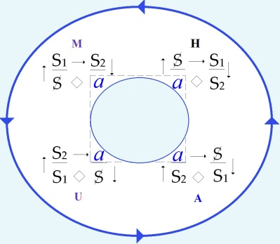
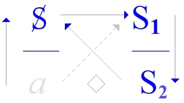
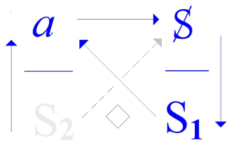
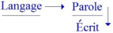
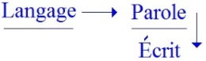
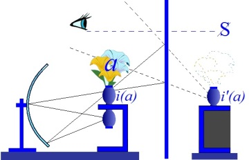
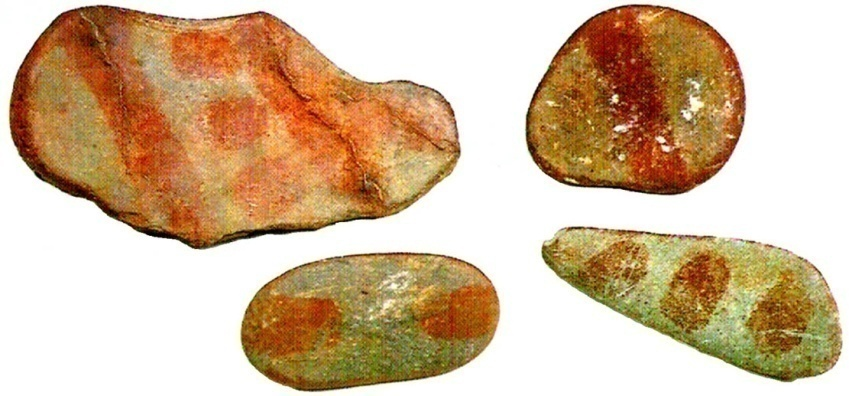
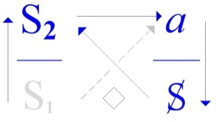

# Leçon 05 | 16 Janvier 1973

<!-- source-url: http://staferla.free.fr/S20/S20 ENCORE.docx -->
<!-- seminar: s20 -->
<!-- lesson: 05 -->

<!-- id: s20-05-0001 -->

Qu’est-ce que je peux avoir à vous dire, *Encore* ?

<!-- id: s20-05-0002 -->

Depuis le temps que ça dure et que ça n’a pas tous les effets que j’en voudrais.

<!-- id: s20-05-0003 -->

Et bien justement à cause de ça, ce que j’ai à dire ça ne manque pas.

<!-- id: s20-05-0004 -->

Néanmoins, comme on ne saurait tout dire, et pour cause, j’en suis réduit à cet étroit cheminement qui fait qu’à chaque instant, il faut que je me garde de reglisser dans ce qui déjà se trouve fait, de ce qui s’est dit.

<!-- id: s20-05-0005 -->

C’est pourquoi aujourd’hui je vais essayer une fois de plus de maintenir ce difficile frayage, puisque de par un titre nous avons du même coup un horizon étrange, d’être qualifié de cet « *Encore »*.

<!-- id: s20-05-0006 -->

Il faut que je donne aujourd’hui le repérage d’un certain nombre de points qui seront cette année *nos points d’orientation.*

<!-- id: s20-05-0007 -->

Il y a quelque chose qui la dernière fois s’est formulé : *la fonction de l’écrit* \[Φ\].

<!-- id: s20-05-0008 -->

C’est un de nos points cette année, un de nos points-pôles.

<!-- id: s20-05-0009 -->

Je voudrais vous rappeler pourtant que je pense, que la 1ère fois que je vous ai parlé - si je ne me trompe - j’ai énoncé que 

<!-- id: s20-05-0010 -->

> « *La jouissance - la jouissance de l’Autre, que j’ai dit symbolisé par le corps -* [*n’est pas u**n signe de l’amour*](#LE_signe) ».

<!-- id: s20-05-0011 -->

Naturellement ça passe, ça passe parce que, on sent que c’est du niveau de ce qui a fait le précédent *dire*[^39], que ça ne fléchit pas. Pourtant il y a là-dedans des termes qui méritent bien d’être commentés :

<!-- id: s20-05-0012 -->

- *« La jouissance »* c’est bien ce que j’essaie de rendre présent par ce *dire* même.

<!-- id: s20-05-0013 -->

> \[*le « dire que ça ne va pas », le « dire que non » à quoi aboutit chaque discours* (H,U,M,A) *dans son impuissance à rejoindre la vérité de « la jouissance du corps de l’Autre », renverse le discours « échoué » et passe au discours suivant : rotation anti-horaire d’un quart de tour et changement d’objet(a)*\]

<!-- id: s20-05-0014 -->

<!-- id: s20-05-0015 -->

- Ce « *l’Autre* », il est plus que jamais mis en question, il doit être de nouveau martelé, refrappé, pour qu’il prenne son plein sens, sa résonance complète :

<!-- -->

<!-- id: s20-05-0016 -->

- *lieu* d’une part,

<!-- id: s20-05-0017 -->

- mais d’autre part avancé comme le terme qui se supporte, puisque c’est moi qui parle, qui ne puis parler que d’où je suis, identifié à ce que j’ai qualifié la dernière fois de *pur signifiant* \[Φ\] : « *L’homme, une femme* - ai-je dit - *ce ne sont rien que signifiants »*, et c’est de là qu’ils prennent comme tels...

<!-- id: s20-05-0018 -->

> je veux dire en tant qu’*incarnation* distincte du sexe
>
> ...qu’ils prennent leur fonction.

<!-- id: s20-05-0019 -->

*« L’Autre »,* dans mon langage, *ce ne peut donc être que l’Autre sexe*.

<!-- id: s20-05-0020 -->

> \- Qu’est-ce qu’il en est de cet *Autre* ?
>
> \- Qu’est-ce qu’il en est de sa position au regard de ce autour de quoi se réalise *le rapport sexuel* ?

<!-- id: s20-05-0021 -->

C’est à savoir une jouissance que le discours analytique a précipité : cette fonction du *phallus* dont en somme l’énigme reste entière puisque il ne s’y articule que « *d’effets d’absence* ».

<!-- id: s20-05-0022 -->

Est-ce à dire pourtant qu’il s’agit là, comme on a cru pouvoir trop vite le traduire, du *signifiant de ce qui manque dans le signifiant* ?

<!-- id: s20-05-0023 -->

C’est bien là ce autour de quoi cette année devra mettre *un point terme* [^40].

<!-- id: s20-05-0024 -->

C’est à savoir, du *phallus* dire quelle est, dans le discours analytique, la fonction.

<!-- id: s20-05-0025 -->

Nous n’y arriverons pas tout droit.

<!-- id: s20-05-0026 -->

Mais à seule fin de déblayer, je dirai que ce que la dernière fois j’ai amené comme étant, comme accentuant, *la fonction de la barre* n’est pas sans rapport avec *le phallus*.

<!-- id: s20-05-0027 -->

\[*la barre* (Φ) *où quelque chose se donne à voir sans être vu, se donne à savoir sans être su,* *quelque chose qui « cloche » (cf. la clocherie) → qui nécessite une lecture, un décryptage (littoral littéral, cf. Lituraterre)* \]

<!-- id: s20-05-0028 -->

Il nous reste, dans la 2ème partie de la phrase, liée à la 1ère par un « ...*n’est pas*... » : *« *...*n’est pas le signe de l’amour »,* c’est bien en quoi aussi pointe notre horizon.

<!-- id: s20-05-0029 -->

Il nous faut cette année articuler ce dont il s’agit, qui est bien là comme au *pivot* de tout ce qui s’est institué de l’expérience analytique : *l’amour*.

<!-- id: s20-05-0030 -->

\[*Dans le discours* A *l’amour est le signe d’un savoir impossible→ basculement du discours (« je te demande de refuser ce que je t’offre parce que ça n’est pas ça »)*\]

<!-- id: s20-05-0031 -->

*L’amour*, il y a longtemps qu’on ne parle que de ça.

<!-- id: s20-05-0032 -->

Ai-je besoin d’accentuer qu’il est au centre, qu’il est au cœur, très précisément du discours philosophique*,* et que c’est là assurément ce qui doit nous mettre en garde :

<!-- id: s20-05-0033 -->

- Si le discours philosophique s’est entrevu comme ce qu’il est : *cette variante du discours du maître*...

<!-- id: s20-05-0034 -->

- Si la dernière fois j’ai pu dire de *l’amour*, en tant que *ce qu’il vise c’est l’être*,

<!-- id: s20-05-0035 -->

> à savoir ce qui dans le langage se dérobe le plus, ce sur quoi j’ai insisté comme *ce qui allait être*, ou ce qui justement *d’être,* a fait surprise.

<!-- id: s20-05-0036 -->

- Si j’ai pu ajouter que cet *être*, nous devons nous interroger :

<!-- id: s20-05-0037 -->

> \- s’il n’est pas si près de cet *être* du signifiant « *m’être » :* « *m, apostrophe, e accent grave… »* \[lapsus\], - s’il n’est pas l’*être* au commandement,
>
> \- s’il n’y a pas là le plus étrange des leurres.

<!-- id: s20-05-0038 -->

Est-ce que ce n’est pas aussi pour, avec le mot *signe*, nous commander d’*interroger ce en quoi le signe se distingue du* *signifiant* ?

<!-- id: s20-05-0039 -->

Voilà donc quelques points

<!-- id: s20-05-0040 -->

- dont l’un est « *la jouissance* »,

<!-- id: s20-05-0041 -->

- dont l’autre est « *l’Autre* »,

<!-- id: s20-05-0042 -->

- le 3ème « *le signe* »,

<!-- id: s20-05-0043 -->

- le 4ème « *l’amour* ».

<!-- id: s20-05-0044 -->

Quand nous lisons ou relisons ce qui s’est émis d’un temps où le discours de l’amour s’avouait être celui de *l’être*, quand nous ouvrons ce livre qui est celui de Richard de Saint Victor [^41] sur *la trinité divine*, c’est de *l’être* que nous partons.

<!-- id: s20-05-0045 -->

De *l’être* en tant qu’il est...

<!-- id: s20-05-0046 -->

> pardonnez-moi ce glissement d’écrit ...conçu comme « *<u>l’être</u>nel »*, comme l’*éternel* pour les sourds.

<!-- id: s20-05-0047 -->

Et que de *l’être*, après cette élaboration, ce cheminement pourtant si tempéré chez Aristote, et sous l’influence sans doute de l’irruption de ce « *Je suis ce que je suis* » qui est l’énoncé de *la vérité* judaïque, quand tout ceci vient à culminer dans cette idée...

<!-- id: s20-05-0048 -->

> cette idée jusque là cernée, frôlée, approchée, approximative de *l’être* ...vient à culminer dans ce violent arrachement à la fonction du temps, par l’énoncé de *l’Éternel* \[« *Je suis ce que je suis* »\]*,* il en résulte d’étranges conséquences.

<!-- id: s20-05-0049 -->

C’est à savoir l’énonciation : \[1\] qu’il y a *l’être qui, éternel, l’est de lui-même* \[*Dieu *: « *Je suis ce que je suis* »\], \[2\] qu’il y a *l’être qui, éternel, ne l’est pas de lui-même* \[*l’ange, etc.*\], \[3\] qu’il y a *l’être qui,* éternel…\[*lapsus*\] *qui non éternel*, n’a pas cet être fragile, en quelque sorte précaire, voire inexistant, *ne l’a pas de lui-même* \[*l’homme*\],

<!-- id: s20-05-0050 -->

> mais qui s’arrête à ce qui semble s’en imposer du fait des définitions logiques...
>
> si toutefois la négation suffisait dans cet ordre, d’une fonction univoque, à assurer l’existence
>
> ...qui s’arrête à ceci : *que ce qui n’est pas éternel* *ne saurait en aucun cas...*
>
> puisque *des 4 subdivisions* qui se produisent *de cette alternance de l’affirmation et de la négation de l’éternel et du de lui-même*, \[4\] *y a-t-il,* dit-il, *un être qui non éternel, puisse être de lui-même* \[*le signifiant*\] *?*

<!-- id: s20-05-0051 -->

Et assurément ceci paraît, au Richard de Saint Victor en question, devoir être écarté.

<!-- id: s20-05-0052 -->

Est-ce qu’il ne semble pas pourtant qu’il y a là précisément ce dont il s’agit concernant le *signifiant *?

<!-- id: s20-05-0053 -->

C’est à savoir que le *signifiant*, *aucun signifiant,* ne s’avance, ne se produit comme tel, comme éternel.

<!-- id: s20-05-0054 -->

C’est là sans doute ce que...

<!-- id: s20-05-0055 -->

> plutôt que de le qualifier d’« *arbitraire »*

<!-- id: s20-05-0056 -->

...Saussure eût pu tenter de formuler.

<!-- id: s20-05-0057 -->

Le signifiant, disons, mieux eût valu l’avancer de la catégorie du *contingent*, en tout cas de ce qui n’est assurément *pas éternel*, de ce qui répudie la catégorie de *l’éternel*, mais qui pourtant, singulièrement, *est* de lui-même.

<!-- id: s20-05-0058 -->

Ainsi qu’il se propose à nous, *ce signifiant* de par lui-même *a des effets*.

<!-- id: s20-05-0059 -->

Et pourtant s’il y a quelque chose qui peut s’en avancer c’est *sa participation*...

<!-- id: s20-05-0060 -->

> pour employer une approche platonicienne ...c’est *sa participation* à ce *« rien »*, d’où effectivement c’est l’émergence même de l’idée créationniste que de nous dire que quelque chose de tout à fait originel a été fait « *ex nihilo »*, c’est à savoir de *« rien »*.

<!-- id: s20-05-0061 -->

Il semble bien...

<!-- id: s20-05-0062 -->

> ne vous semble-t-il pas, n’y a-t-il pas quelque chose qui vous apparaisse,
>
> si tant est que la paresse qui est la vôtre puisse être réveillée par quelque apparition ...que la *Genèse* ne nous raconte rien d’autre que la création de *rien* - en effet, de quoi ? - de *rien d’autre que de signifiants*.

<!-- id: s20-05-0063 -->

Dès que cette *« Création »* surgit, *elle s’articule de la nomination de ce qui est*.

<!-- id: s20-05-0064 -->

- Est*-*ce que ce n’est pas là *la création* dans son essence ?

<!-- -->

<!-- id: s20-05-0065 -->

- Est*-*ce que la création n’est*-*elle pas rien d’autre que le fait de ce qui était là, comme Aristote ne peut assurément manquer de l’énoncer, c’est à savoir que, s’il y a jamais eu quelque chose, c’était depuis toujours que c’était là ?

<!-- -->

<!-- id: s20-05-0066 -->

- N’est-ce pas, dans l’idée créationniste...

<!-- id: s20-05-0067 -->

> essentiellement de la création, et de la création à partir de rien

<!-- id: s20-05-0068 -->

- ...du *signifiant* qu’il s’agit fondamentalement, qu’il s’agit d’une façon qui *fonde* ?

<!-- id: s20-05-0069 -->

- N’est-ce pas là-même en quoi consiste ce que nous trouvons de ce qui,

<!-- id: s20-05-0070 -->

> à se refléter dans une « *conception du monde* », s’est énoncé comme *« révolution copernicienne » ?*

<!-- id: s20-05-0071 -->

Depuis longtemps, je mets en doute ce que Freud là*-*dessus a cru pouvoir avancer.

<!-- id: s20-05-0072 -->

Comme si, de ce que lui a appris *le discours de l’hystérique*...

<!-- id: s20-05-0073 -->

> à savoir de cette autre *substance* qui toute entière tient en ceci :
>
> qu’il y a du signifiant et que c’est de l’effet de ce signifiant qu’il s’agit dans ce *discours de l’hystérique* ...qu’à le recueillir *il a su faire tourner* de ce quart de tour* *qui en a fait *le discours analytique.* \[*cf*. Galilée « *et pourtant elle tourne !* »\] \[*cf. supra* « *ça tourne* », *du discours* H ( S → S1 → ↓S2 **◊** *a* ), *au discours* A ( *a* → S → S1 **◊** S2) \].

<!-- id: s20-05-0074 -->

 →  

<!-- id: s20-05-0075 -->

Discours Hystérique Discours Analytique

<!-- id: s20-05-0076 -->

La notion même de « *quart de tour »* évoque la révolution, mais certes pas dans le sens où révolution est subversion.

<!-- id: s20-05-0077 -->

Bien au contraire ce qui tourne - c’est ce qu’on appelle « *révolution* » - est destiné de son énoncé même à évoquer *le retour*.

<!-- id: s20-05-0078 -->

Assurément nous n’y sommes point, à l’achèvement de ce retour, puisque c’est déjà de façon fort pénible que ce *quart de tour* s’accomplit \[H → A : *la révolution freudienne*\].

<!-- id: s20-05-0079 -->

Mais il n’est jamais trop d’évoquer d’abord que s’il y a eu quelque part *révolution* ce n’est certes pas au niveau de Copernic, qu’il avait été inutile d’évoquer des termes qui ne sont que d’érudition historique, c’est à savoir que depuis longtemps l’hypothèse avait été avancée : que le soleil était peut*-*être bien le centre autour duquel ça tournait. Mais qu’importe !

<!-- id: s20-05-0080 -->

Ce qui importait à ces mathématiciens c’est assurément le départ - le départ de quoi ? - de ce qui tourne.

<!-- id: s20-05-0081 -->

Ce que nous savons bien sûr, c’est que cette virée éternelle des étoiles de *la dernière des sphères*...

<!-- id: s20-05-0082 -->

> celle à quoi Aristote suppose une autre encore,
>
> qui serait celle de l’immobile, *cause* 1ère du mouvement de celles qui tournent ...si les étoiles tournent c’est bien assurément de ce que la terre, la terre tourne sur elle-même, et que c’est déjà merveille que de cette virée, de cette *révolution*, de *ce tournage éternel* de la sphère stellaire, il se soit trouvé des hommes pour forger, pour forger ces autres sphères, où faire tourner...

<!-- id: s20-05-0083 -->

> de ce mouvement oscillatoire qui est celui du système ptolémaïque ...les sphères des planètes, de celles qui tournant autour du soleil, se trouvent au regard de la terre dans cette position ambiguë d’aller et de venir en dents de crochet.

<!-- id: s20-05-0084 -->

Est-ce que, à partir de là, avoir cogité le mouvement des sphères ce n’est pas tour de force extraordinaire, à quoi après tout Copernic ne faisait que faire remarquer que peut-être ce mouvement des sphères intermédiaires pouvait s’exprimer autrement, que la terre fut au centre ou non, n’était assurément pas ce qui lui importait le plus[^42].

<!-- id: s20-05-0085 -->

La *révolution copernicienne* n’est nullement *révolution*, si ce n’est en fonction de ceci que *le centre d’une sphère peut être supposé*, dans un discours qui n’est qu’un discours analogique, constituer *le point maître*.

<!-- id: s20-05-0086 -->

Le fait de changer *ce point maître*, que ce soit la terre ou le soleil, n’a rien en soi qui subvertisse ce que le signifiant *« centre »* conserve de lui-même.

<!-- id: s20-05-0087 -->

Ce signifiant garde tout son poids et il est tout à fait clair que loin que *l’homme*...

<!-- id: s20-05-0088 -->

> ce qui se désigne de ce terme, ce qui *est* quoi ? ce qui fait *signifié* ...que *l’homme* ait jamais été en quoi que ce soit ébranlé par le fait que la terre n’est pas au centre, il y a fort bien substitué le soleil.

<!-- id: s20-05-0089 -->

L’important c’est qu’il y ait un centre, et puisqu’il est bien sûr maintenant évident :

<!-- id: s20-05-0090 -->

- que le soleil n’est pas non plus un centre,

<!-- id: s20-05-0091 -->

- qu’il est en promenade à travers un espace dont le statut est de plus en plus précaire à établir,

<!-- id: s20-05-0092 -->

- que ce qui reste bien au centre c’est tout simplement cette bonne routine qui fait que *le signifié*

<!-- id: s20-05-0093 -->

> garde en fin de compte toujours le même sens, et que ce sens, il est donné par le sentiment que chacun a,
>
> de faire partie de son monde tout au moins, c’est-à-dire de sa petite famille, et de tout ce qui tourne autour.
>
> Et que chacun, chacun de vous - je parle même pour les *gauchistes* - vous y êtes plus que vous ne croyez...
>
> et dans une mesure dont vous justement vous feriez bien de prendre l’empan
>
> ...attachés à un certain nombre de préjugés qui vous font *assiette* et qui limitent la portée de vos insurrections, au terme le plus court, à celui très précisément où ça ne vous apporte nulle gêne, et nommément pas dans *une conception du monde* qui reste, elle, toujours parfaitement sphérique*, le signifié* trouve son centre où que vous le portiez.

<!-- id: s20-05-0094 -->

Ce n’est pas, jusqu’à nouvel ordre, le discours analytique...

<!-- id: s20-05-0095 -->

> si difficile à soutenir dans son décentrement,
>
> qui a à faire encore son entrée dans la conscience commune ...qui peut d’aucune façon subvertir quoi que ce soit.

<!-- id: s20-05-0096 -->

Pourtant, si on me permet de me servir quand même de cette référence dite « *copernicienne »*, j’en accentuerai ce qu’elle a d’effectif, de ceci que ça n’est pas du tout d’un changement de centre qu’il s’y agit.

<!-- id: s20-05-0097 -->

Que « *ça tourne* », ça continue à garder toute sa valeur, si motivé, réduit que ce soit en fin de compte à ce départ que la terre tourne, et que de ce fait il nous semble que c’est la sphère céleste qui tourne.

<!-- id: s20-05-0098 -->

Elle continue bel et bien à tourner et elle a toutes sortes d’effets, ce qui fait que quand même c’est bien par *années* que vous comptez votre âge.

<!-- id: s20-05-0099 -->

*La subversion*...

<!-- id: s20-05-0100 -->

si elle a existé quelque part et à un moment, ça ne consiste pas du tout à avoir changé le point de virée de ce qui tourne ...*c’est d’avoir substitué au « ça tourne », un « ça tombe »* : « *c cédille, a » *: *« ça tombe ».*

<!-- id: s20-05-0101 -->

Le point vif, comme quelques-uns quand même ont eu l’idée de s’en apercevoir,

<!-- id: s20-05-0102 -->

- ça n’est ni Copernic,

<!-- id: s20-05-0103 -->

- un peu plus Kepler, à cause du fait que ça ne tourne pas de la même façon, *ça tourne en ellipse*.

<!-- id: s20-05-0104 -->

Et déjà c’est plus énergique comme correctif à cette fonction du « *centre* » : c’est elle qui est mise en question.

<!-- id: s20-05-0105 -->

Ce vers quoi « *ça tombe* » \[*attraction gravitationnelle du soleil*\] est en un point de l’ellipse qui s’appelle *le foyer* \[F1\], et dans le point symétrique \[F2\], il n’y a rien.

<!-- id: s20-05-0106 -->

Ceci assurément est un correctif tout à fait essentiel à cette image du centre.

<!-- id: s20-05-0107 -->

 

<!-- id: s20-05-0108 -->

Mais le « *ça tombe* » ne prend, si je puis m’exprimer ainsi, son poids - son poids de *subversion* - justement en ceci que, que ça n’est pas seulement de changer le centre qui le fait « *révolution »* ...

<!-- id: s20-05-0109 -->

> puisqu’à conserver le centre, la révolution continue indéfiniment
>
> et justement pour revenir toujours sur elle-même ...c’est que le « *ça tombe* » aboutit à quoi ?

<!-- id: s20-05-0110 -->

Très exactement à ceci, et rien de plus, que : F = G. *mm’*/*d 2* *(loi de la gravitation universelle de Newton)*\],

<!-- id: s20-05-0111 -->

> *la distance* *d* qui sépare les deux masses exprimées par *m* et *m’*,
>
> et que ce qui s’exprime ainsi \[F = G. *mm’*/*d 2*\], à savoir *une force*,
>
> *une force* en tant que *tout ce qui est masse est susceptible*, au regard de cette force, *de prendre une certaine accélération*, ...que c’est tout entier dans cet *écrit*...

<!-- id: s20-05-0112 -->

> dans ce qui se résume à ces cinq petites *lettres* écrites au creux de la main, avec un chiffre en plus
>
> comme puissance, puissance au carré de la distance, et *inversement proportionnel au carré de la distance*. ...c’est là, c’est dans cet *effet d’écrit* que consiste ce qu’on attribue donc indûment à Copernic... dans quelque chose qui justement nous arrache à la fonction comme telle... fonction *imaginaire*, fonction imaginaire et pourtant fondée dans le *réel* ...de la révolution.

<!-- id: s20-05-0113 -->

> \[*Lacan nous dit que cet « effet du signifiant » est ici « effet d’écriture », que ce qui s’écrit dans « cinq petites lettres* \[…\] *avec un chiffre en plus »*
>
> *est le fondement de ce retour répétitif des astres, de « ce qui revient toujours à la même place » (1ère définition du réel), de la répétition*...
>
> *De la même façon quatre petites lettres :* α, β, γ, δ, *au moins, sont au fondement, par leur combinatoire, de lalangue,*
>
> *de l’inconscient structuré comme un langage, et d’une autre « répétition » (cf. « l’introduction » du séminaire sur La lettre volée)*\]

<!-- id: s20-05-0114 -->

Ceci étant énoncé...

<!-- id: s20-05-0115 -->

> rappel sans doute, mais aussi bien prélude ...ce qu’il importe, c’est de souligner que ce qui est produit...

<!-- id: s20-05-0116 -->

> ce qui est produit comme tel dans l’articulation de ce nouveau discours
>
> qui émerge comme étant *le discours de l’analyste*, ...*le discours de l’analyse,* c’est ceci : c’est que le fondement, le départ, est pris dans *l’effet* comme tel de ce qu’il en est *du signifiant*.

<!-- id: s20-05-0117 -->

> \[*Discours* A : *l’analyste en place de semblant* *de* (*a*) *« questionne » le sujet* **S***, ce qui aboutit à la production de signifiants* **S1** *coupés de tout signifié,*
>
> *de tout sens, de tout savoir *(S1 **◊** S2), → *signifiant asémantique*, *où - là seulement - du « signifiant comme tel » (aucun signifié)*
>
> *l’effet d’écriture (dans la parole analysante) peut se « lire »* → (*lettre*). *(cf. « Qu’on dise reste oublié derrière ce qui se dit dans ce qui s’entend »)*\]

<!-- id: s20-05-0118 -->

Bien loin que soit admis...

<!-- id: s20-05-0119 -->

> en quelque sorte par le vécu ...bien loin que soit admis*,* comme du fait-même, que *le signifiant* emporte de ses effets de signifié à partir desquels s’est édifiée cette structuration dont je vous ai, tout à l’heure, énoncé en rappel combien pendant des temps il a semblé naturel qu’un « *monde* » se constituât, dont les corrélatifs étaient ce quelque chose au-delà, qui était *l’être* même, *l’être* pris comme éternel : la théologie.

<!-- id: s20-05-0120 -->

Et que ce monde reste, quoi qu’il en soit, « *une conception »* - c’est bien là le mot - une vue, un regard, une prise imaginaire, un *« monde »* conçu comme étant le tout, le tout avec ce qu’il comporte - quelque ouverture qu’on lui donne - de *limité.*

<!-- id: s20-05-0121 -->

\[→ *conception « sphérique » *des *discours* H, U, M\].

<!-- id: s20-05-0122 -->

Et que de ceci résulte ce quelque chose qui tout de même reste étrange, c’est à savoir que *quelqu’un*, un « *Un* », *une partie de ce monde*, est au départ supposé pouvoir en prendre connaissance*,* s’y trouve dans cet état qu’on peut appeler « *ex-sistence »*, car comment supporterait-il autrement de pouvoir « *prendre connaissance »* si, d’une certaine façon, il n’était pas *ex-sistant*.

<!-- id: s20-05-0123 -->

C’est bien là que de toujours s’est marquée l’oscillation, l’impasse, la vacillation qui résultait de cette *cosmologie*, de ce quelque chose qui consiste dans l’admission *d’un monde*.

<!-- id: s20-05-0124 -->

Est-ce que il n’y a pas dans le discours analytique...

<!-- id: s20-05-0125 -->

> tel qu’il s’instaure du quart de tour dont j’ai parlé tout à l’heure ...est-ce qu’il n’y a pas quelque chose qui, de soi, doit nous introduire à ceci : que toute... tout maintien, toute *subsistance*, toute *persistance du « monde »* comme tel \[« *sens du monde »* : S1 **→** S2\], c’est très précisément là ce à quoi introduit ce discours : c’est que, elle, *cette subsistance, cette persistance* \[du « *sens du monde »* : S1 **→** S2\]*, doit comme telle être abandonnée* ? \[→ *suspension du sens *: S1 **◊** S2\]

<!-- id: s20-05-0126 -->

Le langage est tel...

<!-- id: s20-05-0127 -->

> la langue forgée du discours philosophique \[*discours* M*, soutien imaginaire de* (S1→S2)→ *production d’un « sens du monde »*\] ...le langage est tel qu’à tout instant, vous le voyez...

<!-- id: s20-05-0128 -->

> au moment que j’avance *quoi que ce soit* de ce qui peut, de ce *discours analytique*, s’établir, vous marquer ...que je ne peux faire à tout instant que de reglisser - dans quoi ? - dans ce « *monde* », dans ce *supposé d’une substance* qui tout de même se trouve *imprégnée de la fonction de l’être*.

<!-- id: s20-05-0129 -->

Et que de suivre le fil du *discours analytique,* ne tend à rien de moins qu’à re-briser, qu’à infléchir, qu’à marquer d’une incurvation propre...

<!-- id: s20-05-0130 -->

> et d’une incurvation qui ne saurait même être maintenue comme étant celle de lignes de force, ...qui produit comme telle *la faille, la discontinuité, la rupture*, qui nous suggère de *voir dans la langue ce qui* en fin de compte *la brise*. \[S1→S2 → ↓ (*a*)\] 

<!-- id: s20-05-0131 -->

> 

<!-- id: s20-05-0132 -->

Si bien que rien ne paraît mieux constituer ce qui peut être *l’horizon du* *discours analytique* que *cet emploi qui est fait par la mathématique*, cet emploi qui est fait *de la lettre*, comme étant singulièrement ce qui d’une part révèle dans le discours ce qui - pas par hasard* *- est appelé *la grammaire : la chose qui ne se révèle du langage qu’à l’écrit.*

<!-- id: s20-05-0133 -->

Mais ce n’est pas non plus - si ce n’est pas par hasard - ce n’est pas non plus sans nécessité. \[[γράμμα](http://fr.wiktionary.org/wiki/%CE%B3%CF%81%CE%AC%CE%BC%CE%BC%CE%B1), *gramma : signe écrit* \]

<!-- id: s20-05-0134 -->

C’est que si *la grammaire* c’est ce qui dans le langage ne se révèle que par *l’écrit*, c’est qu’au-delà du langage *cet effet* \[*d’écriture*→Φ\]...

<!-- id: s20-05-0135 -->

> cet effet qui se produit de se supporter seulement de *l’écriture*,
>
> qui est assurément l’idéal de la mathématique *...*c’est là que *« ce autour de quoi »,* ce dont il s’agit dans le langage, se révèle.

<!-- id: s20-05-0136 -->

 

<!-- id: s20-05-0137 -->

C’est à savoir que, à se refuser d’aucune façon la référence à *l’écrit*, c’est aussi s’interdire ce qui de tous *les effets du langage* peut arriver à s’articuler, et à s’articuler dans ce *quelque chose* que nous ne pouvons faire que *du langage* il ne résulte pas, c’est à savoir *un supposé*

<!-- id: s20-05-0138 -->

- « *en deçà* » \[*l’être : (a) **objet cause,** comme absence, comme manque, comme trou*\],

<!-- id: s20-05-0139 -->

- et « *au-delà* » \[*l’être comme par-être : (a) **objet du fantasme**, comme objet de substitution*\].

<!-- id: s20-05-0140 -->

<!-- id: s20-05-0141 -->

Il suffit déjà que ces références spatiales soient évoquées, pour en quelque sorte qu’elles s’imposent.

<!-- id: s20-05-0142 -->

À supposer un *en deçà*  nous sentons bien qu’il n’y a là qu’une référence intuitive.

<!-- id: s20-05-0143 -->

Et pourtant nous savons bien que le langage se distingue de ceci : que *dans son effet de signifié* il n’est jamais justement que *« à côté »* \[παρά *: para*\] du *signifiant*.

<!-- id: s20-05-0144 -->

Que ce qu’il faut... ce à quoi il faut nous rompre, c’est à substituer à cette imposition*...*

<!-- id: s20-05-0145 -->

> qui est celle que le langage provoque : *imposition de l’être* *...*la prise radicale, l’admission de départ *que de l’être nous n’avons rien, jamais*.

<!-- id: s20-05-0146 -->

Mais à l’écrire autrement que *le « pare-être* »*...*

<!-- id: s20-05-0147 -->

non pas « *paraître »* comme on l’a dit depuis toujours ...*le phénomène,* ce, *au-delà* *de quoi il y aurait ce quelque chose dont Dieu sait* - *noumen* - *où elle nous a en effet menés* \[*où le noumen nous mène*\] c’est-à-dire *à toutes les opacifications* qui se dénomment justement *de l’obscurantisme*.

<!-- id: s20-05-0148 -->

Que c’est dans le paradoxe même de tout ce qui arrive à se formuler *comme effet d’écrit du langage* \[*la barre* (Φ)\], que c’est au point même où ces paradoxes jaillissent, que *l’être* se présente, et ne se présente jamais que de *par-être.*

<!-- id: s20-05-0149 -->

Il faudrait apprendre en fin de compte à conjuguer, à conjuguer comme il se doit :

<!-- id: s20-05-0150 -->

- *je pare-suis, tu pare-es, il pare-est, nous pare-sommes,* et ainsi de suite.

<!-- id: s20-05-0151 -->

Eh bien, tout ceci nous introduit... nous introduit à cet énoncé qui...

<!-- id: s20-05-0152 -->

> vous pouvez bien l’admettre si vous donnez l’accent que cette nouvelle orthographe
>
> avec toutes ses conséquences, toutes ses conséquences morphologiques ...qu’il faut savoir assumer, dans cette nouvelle conjugaison que je vous propose :

<!-- id: s20-05-0153 -->

- c’est bien à partir de là qu’il faut prendre ce qui est en jeu dans ce qui se trouve être aussi dans une relation de *par-être, d’être à côté, d’être* παρά \[para\] au regard de ce « *rapport sexuel »* dont il est clair que dans tout ce qui s’en approche, le langage ne se manifeste que de son insuffisance,

<!-- id: s20-05-0154 -->

- c’est bien au regard de ce *par-être* que ce qui supplée à ce *rapport* en tant qu’inexistant,

<!-- id: s20-05-0155 -->

- c’est bien dans *ce rapport au par-être* que nous devons articuler *ce qui y supplée, c’est* à savoir précisément *l’amour*.

<!-- id: s20-05-0156 -->

Il est proprement fabuleux que la fonction de l’Autre, de l’Autre comme lieu de la vérité...

<!-- id: s20-05-0157 -->

> et pour tout dire de la seule place - quoiqu’irréductible - que nous pouvons donner
>
> au terme de *l’être divin*, de Dieu pour l’appeler par son nom

<!-- id: s20-05-0158 -->

...Dieu est proprement *le lieu* où...

<!-- id: s20-05-0159 -->

> si vous m’en permettez le terme ...se *produit le dieu, le dieur, le dire* : pour un rien, *le dire ça fait Dieu*.

<!-- id: s20-05-0160 -->

Aussi longtemps que se *dira* quelque chose*, « l’hypothèse Dieu »* sera là*.*

<!-- id: s20-05-0161 -->

Et c’est bien justement à essayer de *dire* quelque chose que se définit ce fait : qu’en somme il ne peut y avoir de vraiment athées que les théologiens, c’est à savoir ceux qui, de Dieu, en *parlent*.

<!-- id: s20-05-0162 -->

Aucun autre moyen de l’être \[*athée* \], sinon de cacher sa tête dans ses bras au nom de je ne sais quelle trouille, comme si jamais ce Dieu avait effectivement manifesté une présence quelconque.

<!-- id: s20-05-0163 -->

Par contre il est *impossible de dire quoi que ce soit sans aussitôt le faire subsister*, ne serait-ce que sous cette forme de l’Autre, que l’Autre aussi dit la vérité.

<!-- id: s20-05-0164 -->

Chose qui est tout à fait évidente dans le moindre cheminement de cette chose que je déteste, et que je déteste pour les meilleures raisons, c’est-à-dire l’Histoire.

<!-- id: s20-05-0165 -->

L’Histoire étant très précisément faite pour nous donner l’idée qu’elle a *un sens* quelconque, alors que la première des choses que nous ayons à faire c’est de partir de ce que nous \[*analystes*\] avons là en face : d’un *dire* \[S1 *hors-sens*\] qui est le *dire d’un autre* qui nous raconte ses *bêtises* \[*ab-sens*\], ses embarras, ses empêchements, ses émois, et que c’est là qu’il s’agit de *lire*. \[*ce qui est écrit au delà de « ce qui se dit dans ce qui s’entend. »*\]

<!-- id: s20-05-0166 -->

Il s’agit de *lire*... il s’agit de *lire -* quoi ? - il s’agit de *lire* rien d’autre que *les effets de ces dires*.

<!-- id: s20-05-0167 -->

Et ces *effets*, nous voyons bien tout ce en quoi ça agite, ça remue, ça tracasse les êtres parlants.

<!-- id: s20-05-0168 -->

Et bien sûr pour que ça aboutisse à quelque chose, il faut bien que ça serve, et que ça serve - mon Dieu... - à ce qu’ils s’arrangent, à ce qu’ils s’accommodent, à ce que *boiteux-boitillant,* ils arrivent quand même à donner une ombre de petite vie à ce sentiment dit de *l’amour*.

<!-- id: s20-05-0169 -->

Il faut, il le faut bien, il faut que ça dure *encore*, à savoir que par l’intermédiaire de ce sentiment quelque chose se produise qui en fin de compte...

<!-- id: s20-05-0170 -->

> comme l’ont très bien vu des gens qui à l’égard de tout ça,
>
> ont pris leurs précautions, comme ça, sous le paravent de l’Église ...que ça aboutisse à la reproduction.

<!-- id: s20-05-0171 -->

À la reproduction de quoi ?

<!-- id: s20-05-0172 -->

À la reproduction des corps.

<!-- id: s20-05-0173 -->

Mais est-ce que, il ne se pourrait pas, il ne se sentirait pas, il ne se toucherait pas du doigt, que le langage a d’autres effets que de mener les gens par le bout du nez à se reproduire *encore,* *en corps* à corps, et *en corps*, comme ça, incarnés ?

<!-- id: s20-05-0174 -->

Il y a quelque chose quand même qui est un autre *effet de ce langage*, qui est, qui est justement *l’écrit*.

<!-- id: s20-05-0175 -->

Il y a quand même ceci de ses caractéristiques, si j’ose m’exprimer ainsi, et digne d’être relevées, c’est que de *l’écrit*, depuis que le langage existe, nous avons vu des mutations.

<!-- id: s20-05-0176 -->

Ce qui s’*écrit* - c’est pas facile à *dire* - *ce qui s’écrit c’est la lettre*, et *la lettre* - mon Dieu - c’est pas toujours fabriqué de la même façon.

<!-- id: s20-05-0177 -->

Alors là-dessus on fait de l’histoire, l’histoire de l’écriture, et on se casse la tête à imaginer ce à quoi ça pouvait bien servir les pictographies mayas ou aztèques, et puis un peu plus loin \[*dans le temps*\] les cailloux du Mas d’Azil.

<!-- id: s20-05-0178 -->

<!-- id: s20-05-0179 -->

Enfin, qu’est-ce que ça pouvait bien être que ces drôles de dés, à quoi jouait-on avec ça ?

<!-- id: s20-05-0180 -->

Tout ça, comme c’est d’habitude la fonction de l’Histoire, il faudrait dire : « *surtout ne touchez pas à la Hache, initiale de l’Histoire* », ce serait une bonne façon de ramener les gens à la première des lettres, celles à laquelle je me limite : je reste toujours à la lettre A.

<!-- id: s20-05-0181 -->

Il est d’ailleurs tout à fait clair que la Bible ne commence qu’à la lettre B, elle m’avait laissé la lettre A \[*Rires*\] pour que je m’en serve !

<!-- id: s20-05-0182 -->

Il y a beaucoup à s’instruire, non pas en recherchant les cailloux du Mas d’Azil, ni même en faisant ce que j’ai fait comme ça, pour mon bon public *dans un temps*[^43]*...*

<!-- id: s20-05-0183 -->

> public d’analystes - *un bon petit temps*... ...on leur expliquait *le trait unaire*, l’encoche, c’était à la portée de leur entendement.

<!-- id: s20-05-0184 -->

Mais il vaudrait mieux regarder de plus près ce que font les mathématiciens avec *les lettres*, et nommément depuis que, au mépris d’un certain nombre de choses et de la façon la plus fondée, ils se sont mis, sous le nom de *théorie des ensembles*, à s’apercevoir qu’on pouvait aborder l’« *Un »* d’une autre façon que intuitive, fusionnelle, amoureuse enfin : « *Nous ne sommes qu’un* »*.*

<!-- id: s20-05-0185 -->

Chacun sait, bien sûr que c’est jamais arrivé entre deux qu’ils ne fassent qu’*un*, n’est-ce pas...

<!-- id: s20-05-0186 -->

Mais enfin, nous ne sommes qu’*un*.

<!-- id: s20-05-0187 -->

C’est de là que ça part cette idée de *l’amour*.

<!-- id: s20-05-0188 -->

C’est vraiment la façon la plus grossière de donner à ce terme...

<!-- id: s20-05-0189 -->

> à ce terme qui se dérobe manifestement ...du *rapport sexuel*, son signifié.

<!-- id: s20-05-0190 -->

> \[*« la jouissance du corps de l’Autre n’est pas le signe de l’amour ». La jouissance du corps de l’Autre est barrée, aucun « discours » qui parviennent à atteindre sa vérité, du fait de la fonction phallique en visant* S1 *on n’atteint que des « faisant fonction » : les objets(a) → impuissance à assurer la jouissance qu’il « faut »*
>
> *(il n’y a pas de rapport sexuel). Dans le par-être des objets(a) substitutifs, c’est l’amour qui supplée à l’absence du rapport sexuel pour « réaliser le Un »*\]

<!-- id: s20-05-0191 -->

Le commencement de la sagesse devrait être de commencer par s’apercevoir que...

<!-- id: s20-05-0192 -->

> et c’est en ça que le vieux père Freud a frayé des voies quand même ...il est tout de même très joli, très frappant...

<!-- id: s20-05-0193 -->

> c’est de là que je suis parti, parce que ça m’a moi-même, comme ça, un petit peu touché,
>
> ça pourrait toucher n’importe qui d’ailleurs, n’est-ce pas ...de s’apercevoir *que le fondement de l’amour, si ça a rapport avec l’« Un », ça a très exactement pour résultat* *de ne jamais faire sortir quiconque de soi-même*.

<!-- id: s20-05-0194 -->

Si c’était ça...

<!-- id: s20-05-0195 -->

c’est tout ça et rien que ça, qu’il a dit, n’est-ce pas ...à partir du moment où il a introduit la fonction de *l’amour narcissique*, tout le monde a pu sentir que le problème c’était comment il pouvait y avoir un amour pour un *autre*.

<!-- id: s20-05-0196 -->

Et que, il est bien clair que cet *« Un »* \[*l’amour*\] dont tout le monde a plein la bouche, c’est d’abord et essentiellement de nature - n’est-ce pas ? - de ce mirage de l’*« Un »* qu’on se croit être.

<!-- id: s20-05-0197 -->

Mais enfin ça n’est quand même pas pour dire que ce soit là tout l’horizon, c’est à savoir que y’a, y’a autant d’« Un » qu’on voudra.

<!-- id: s20-05-0198 -->

Quand je dis « *y’a autant d’*« *Un* » *qu’on voudra* », je veux pas dire : y’a autant d’individus qu’on voudra, parce que ça, ça ne veut rien dire, c’est du comptage.

<!-- id: s20-05-0199 -->

Il y a autant d’« Un » - comme « Un » - les « Un » de la 1ère hypothèse du *Parménide* [^44]*,* ces « Un » se caractérisent de ne se ressembler chacun, en rien.

<!-- id: s20-05-0200 -->

Ce qui est l’irruption, l’intrusion de *la théorie des ensembles* c’est justement de poser ça : parlons de l’« Un » en ceci qu’il s’agit de choses qui n’ont entre elles strictement aucun rapport.

<!-- id: s20-05-0201 -->

À savoir, mettons-y ce qu’on appelle « *des objets de pensée »* ou « *des objets du monde »*, tout ça, ça compte chacun pour « Un », et si nous assemblons *ces choses absolument* *hétéroclites*, nous nous donnons le droit de désigner cet assemblage par *une lettre*.

<!-- id: s20-05-0202 -->

C’est ainsi que s’exprime, au début de *la théorie des ens**embles*, par exemple celle que la dernière fois j’ai avancée au titre de Nicolas Bourbaki.

<!-- id: s20-05-0203 -->

Vous avez laissé passer ceci : c’est que j’ai dit...

<!-- id: s20-05-0204 -->

> comme d’ailleurs *c’est écrit*, comme *ça s’imprime*, comme *c’est imprimé* dans la dite *théorie des ensembles* ...que *la lettre désigne un assemblage.* \[*le 09-01 Lacan parle de* [*la let**tre*](#bourbaki) *(*A*) pour désigner un « lieu » →* *lieu ≈ lieu d’assemblage*\]

<!-- id: s20-05-0205 -->

C’est justement, quoique les auteurs...

<!-- id: s20-05-0206 -->

> puisque comme vous le savez ils sont multiples les auteurs
>
> qui ont fini par donner leur assentiment à l’édition définitive de la dite théorie ...prennent soin de ceci, de dire *qu’ils <u>désignent</u> des assemblages*.

<!-- id: s20-05-0207 -->

Mais c’est là justement qu’est leur timidité et du même coup leur erreur : *la lettre est la seule chose qui <u>fasse</u> ces assemblages.*

<!-- id: s20-05-0208 -->

La lettre, ou *les lettres « sont »* - et non pas « désignent » - *ces assemblages*.

<!-- id: s20-05-0209 -->

Et en tant que *lettres* elles sont prises comme fonctionnant *comme* ces assemblages mêmes.

<!-- id: s20-05-0210 -->

Vous voyez qu’à conserver encore ce « *comme* », je m’en tiens à l’ordre de ce que j’avance quand je dis que « *l’inconscient est structuré <u>comme</u> un langage* ».

<!-- id: s20-05-0211 -->

> \[*Chaque « Un » réalisé, laisse une trace de l’identification à l’objet d’amour, trace singulière, hétérogène aux autres.*
>
> *La lettre en fait l’assemblage en un « lieu ».*
>
> *Cf. la genèse de la lettre* (\[+,+,-,+,-,+,+,+,-,+,-,-,+, …\]→ \[1,2,3, 2,1,3…\]→\[α, β, γ, δ\]) *dans l’« Introduction » au séminaire sur « La lettre volée »*\]

<!-- id: s20-05-0212 -->

Ce « *comme* » est très précisément...

<!-- id: s20-05-0213 -->

> j’y reviens toujours ...pensé comme disant... ne disant pas que l’inconscient est structuré par un langage : *il est structuré <u>comme</u>...*

<!-- id: s20-05-0214 -->

*Les assemblages* - dont il s’agit dans la théorie des ensembles *- sont <u>comme</u> une lettre.*

<!-- id: s20-05-0215 -->

\[*la combinatoire des* α, β, γ, δ *(* → *sans le « caput mortum ») produit à patir de « Lalangue »*→ *«…comme un langage »*\]

<!-- id: s20-05-0216 -->

Et c’est de ceci qu’il s’agit quand nous avançons dans la profération mathématique.

<!-- id: s20-05-0217 -->

Quel rôle joue-t-elle ? Quel support pouvons-nous y prendre pour *lire* ?

<!-- id: s20-05-0218 -->

- Pour lire en tant qu’il y a des *lettres*,

<!-- id: s20-05-0219 -->

- pour ne lire qu’à ne lire que les *lettres*,

<!-- id: s20-05-0220 -->

- pour lire ce dont il s’agit quand nous prenons le langage comme étant ce qui fonctionne pour suppléer l’absence de ce qui justement est *la seule part du réel qui ne puisse* pas venir à *se former de lettres,* à savoir : *le rapport sexuel*.

<!-- id: s20-05-0221 -->

C’est dans le jeu-même... le jeu-même de *l’écrit mathématique* \[*les petites lettres*\] que nous avons à trouver, si je puis dire, la pointe, le point d’orientation vers quoi nous avons à nous diriger pour que de cette pratique...

<!-- id: s20-05-0222 -->

> de ce *lien social* nouveau qui émerge et singulièrement s’étend, et qui s’appelle *le discours analytique,* ...tirer ce qu’on peut en tirer, quant à la fonction même de *ce langage*, de ce langage à quoi nous faisons confiance en somme, pour que ce *discours* ait des effets...

<!-- id: s20-05-0223 -->

> sans doute moyens mais suffisamment supportables ...pour que ce discours puisse supporter et compléter les autres discours. \[*l’émergence du discours analytique ferme la boucle en quatre discours et enclenche « la ronde des discours » et sa « lumière rasante »*\]

<!-- id: s20-05-0224 -->

Nous verrons à l’occasion...

<!-- id: s20-05-0225 -->

> puisque depuis quelques temps il est clair que *le discours universitaire* s’écrit autrement
>
> et qu’il doit être « *uni vers Cythère* », qu’il doit répandre l’éducation sexuelle ...nous allons voir comment ça va se faire, à quoi ça aboutira... il ne faut surtout pas y faire obstacle.

<!-- id: s20-05-0226 -->

L’idée même que du *point* où le *savoir* se pose très exactement dans la situation autoritaire du *semblant*, que de ce point quelque chose puisse se diffuser qui ait pour effet d’améliorer, si l’on peut dire, les rapports inter-sexes, est quelque chose qui assurément est fait, pour un analyste, pour provoquer *le sourire*.

<!-- id: s20-05-0227 -->

<!-- id: s20-05-0228 -->

Mais après tout, qui sait ?

<!-- id: s20-05-0229 -->

Nous l’avons dit déjà, *le sourire de l’ange* est le plus bête des sourires, il ne faut donc jamais s’en targuer, n’est-ce pas ?

<!-- id: s20-05-0230 -->

Mais très assurément il est clair que cette idée même, que la démonstration si je puis dire, au tableau noir, de quelque chose qui se rapporte à *l’éducation sexuelle* n’est certainement pas faite, du point de vue du *discours de l’analyste*, pour paraître pleine de promesses de *bonnes rencontres* ou de « *bonheur »*, comme on dit parfois.

<!-- id: s20-05-0231 -->

Il y a quand même quelque chose qui dans mes *Écrits* montre, si je puis dire, que ma bonne orientation, puisque c’est celle dont j’essaie de vous convaincre, ne date pas d’hier.

<!-- id: s20-05-0232 -->

C’est quand même au lendemain d’une guerre, où rien évidemment ne semblait promettre des lendemains qui chantent, que j’ai écrit quelque chose qui s’appelle « *Le temps logique et l’assertion de certitude anticipée »* [^45] où on peut quand même très très bien lire - si on écrit, et pas seulement si on a de l’oreille - que *la fonction de la hâte c’est la fonction de ce petit(a), petit(a-t).*

<!-- id: s20-05-0233 -->

Je veux dire que ce dont il s’agit et qui mériterait d’être regardé de plus près, c’est pas simplement de ceci...

<!-- id: s20-05-0234 -->

> qui est déjà très, très articulé n’est-ce-pas, à savoir d’une petite devinette
>
> liée au fait qu’il y a pour 3 personnes 3 disques blancs, et de noirs : un de moins ...que les choses se jouent en fait.

<!-- id: s20-05-0235 -->

Et que dans cette extrapolation subjective qui fait que, en apparence, *l’instant de voir*, *l’instant de voir* deux blancs, celui qui ne sait pas qui il est mais qui sait que les deux autres, en tout cas chacun, peuvent se voir tels qu’ils sont, à savoir blancs, et du même coup, si par hasard ils se pensaient noirs et que celui qui pense de départ, le fut lui-même, saurait très bien, du même coup, qu’il est blanc.

<!-- id: s20-05-0236 -->

Il y a là quelque chose dont j’ai mis seulement en valeur le fait que quelque chose comme une *intersubjectivité* peut aboutir à une issue salutaire, mais qui mériterait assurément d’être regardée de plus près.

<!-- id: s20-05-0237 -->

Très précisément au niveau de ce que supporte chacun des sujets non pas d’être « un entre autres », mais d’être par rapport aux deux autres celui qui est l’enjeu de leur pensée, à savoir très précisément : chacun n’intervient dans ce ternaire qu’au titre justement de cet *objet(a)* qu’il est sous le regard des autres.

<!-- id: s20-05-0238 -->

C’est ce que sans doute j’aurai l’occasion d’accentuer dans ce que j’avancerai plus tard.

<!-- id: s20-05-0239 -->

En d’autres termes ils sont 3, mais en réalité ils sont 2+*a*, et c’est bien en ceci que ce 2+*a*, au point du *a*, se réduit non pas aux 2 autres mais à un 1+*a*.

<!-- id: s20-05-0240 -->

Vous savez que là-dessus j’ai déjà usé de ces fonctions[^46] pour essayer de vous *représenter l’inadéquat du* *rapport de* l’1 *à l’autre*, ce que j’ai déjà fait en donnant à ce *a* pour support le nombre irrationnel qu’est le nombre dit « *nombre d’or* ».

<!-- id: s20-05-0241 -->

C’est en tant que du *a,* les deux autres sont pris comme 1+*a,* que fonctionne ce quelque chose qui peut aboutir à une sortie dans la hâte.

<!-- id: s20-05-0242 -->

Cette *fonction d’identification*, qui se produit dans une articulation ternaire, est celle qui se fonde de ceci : que en aucun cas ne peuvent se tenir pour support 2 comme tels, que entre 2 - quels qu’ils soient – il y a toujours l’1 et l’*autre*, le 1 et le *a*, et que l’*autre* ne saurait dans aucun cas être pris pour un 1.

<!-- id: s20-05-0243 -->

C’est très précisément en ceci que dans l’écrit quelque chose, quelque chose se joue qui...

<!-- id: s20-05-0244 -->

> à partir de ceci de brutal, ...prend pour « *Un* » *tous les* 1 qu’on voudra, que les impasses qui s’en révèlent sont par elles-mêmes, pour nous, un accès possible à cet *être*, une réduction possible de la fonction de cet *être* dans *l’amour*.

<!-- id: s20-05-0245 -->

Et c’est en ceci, en ceci que je veux terminer sur ce terme par où se différencie le « *signe »* du « *signifiant »* : *le signifiant* - ai-je dit – *se caractérise* de ceci, *de représenter un sujet pour un autre signifiant*.

<!-- id: s20-05-0246 -->

De quoi s’agit-il dans *le signe* ?

<!-- id: s20-05-0247 -->

Depuis toujours la théorie cosmique de la connaissance, « *la conception du monde »*, fait état de l’exemple fameux de « *la fumée qu’il n’y a pas sans feu* ».

<!-- id: s20-05-0248 -->

Et pourquoi ici n’avancerais-je pas ce qu’il me semble, c’est que la fumée peut être aussi bien le signe du fumeur, et non seulement aussi bien le signe du fumeur, mais qu’elle l’est toujours par essence, qu’il n’y a de fumée que de signe du fumeur.

<!-- id: s20-05-0249 -->

Chacun sait que si vous voyez une fumée au moment où vous abordez une île déserte, vous vous dites tout de suite qu’il y a toutes les chances qu’il y ait là quelqu’un qui sache faire du feu, et jusqu’à nouvel ordre, ce sera un autre homme.

<!-- id: s20-05-0250 -->

Ce *signe*, ce signe en tant que *le signe n’est pas « le signe de quelque chose »*, mais est *le signe d’un effet* qui est ce qui se suppose en tant que tel d’un fonctionnement *du signifiant*, qui est ce que Freud nous apprend et ce qui est le départ, départ comme tel du *discours analytique*, à savoir que *le sujet ce n’est rien d’autre*...

<!-- id: s20-05-0251 -->

> qu’il ait ou non conscience *de quel signifiant il est l’effet* ...*ce n’est rien d’autre* comme tel *que <u>ce qui glisse</u> dans une chaîne de signifiants*.

<!-- id: s20-05-0252 -->

Ce n’est rien d’autre que cet *effet* qui est l’effet intermédiaire, intermédiaire entre ce qui caractérise un signifiant et un autre signifiant, c’est d’être chacun 1, d’être chacun un élément.

<!-- id: s20-05-0253 -->

Nous ne connaissons rien, nous ne connaissons pas d’autre - en somme - support par où soit introduit dans le monde le 1 si ce n’est le signifiant en tant que tel, et en tant que nous apprenons à le séparer de ses effets de signifié.

<!-- id: s20-05-0254 -->

[*Ce qui donc dans l’am**our est visé c’est le sujet*](#Retour_reference_16_01), le sujet comme tel, *<u>en tant qu’il est supposé à une phrase</u>*, articulé à quelque chose qui s’ordonne, peut s’ordonner d’une vie entière, mais *ce que nous visons dans l’amour c’est un sujet et ce n’est rien d’autre*.

<!-- id: s20-05-0255 -->

*Un sujet comme tel n’a pas grand-chose à faire avec la jouissance*, *mais par contre, dans la mesure où* *son signe*, *son signe est quelque chose qui* *est susceptible de provoquer le désir, là est le ressort de l’amour*, et par là le cheminement que nous essaierons de continuer dans les fois proches pour vous montrer *où se rejoint l’amour et la jouissance sexuelle*.

## Notes

[^39]: Il n’y a pas de rapport sexuel.

[^40]: Mettre *un point* *final* (écriture) et mettre *un terme* (par la parole).

[^41]: Richard de Saint Victor : *De la Trinité* (*De Trinitate*), éd. du Cerf, 1999.

[^42]: Sur les conceptions de Copernic \[1473-1543\], Kepler \[1571-1630\], Newton \[1643-1727\], cf. Arthur Koestler : *Les somnambules*, Les Belles Lettres, 2012.

[^43]: Cf. séminaire 1961-62 : « *L’identification »*, séance du 20-12-1961, et James Février : *Histoire de l’écriture*, Payot, 1948 (réédition 1995).

[^44]: Platon : *Parménide* ou *Des Idées*, Paris, Gallimard, Pléiade, 1967, p. 193.

[^45]: Cf. *Écrits*, pp.197-214

[^46]: Cf. séminaire 1966-67 : « *Logique du fantasme »*, séances du 22-02 au 26-04-1967.
