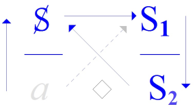
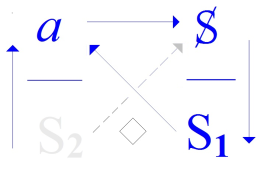
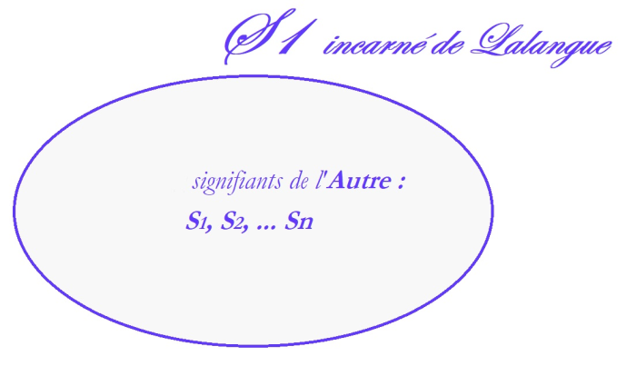

# Leçon 13 | 26 Juin 1973

<!-- source-url: http://staferla.free.fr/S20/S20 ENCORE.docx -->
<!-- seminar: s20 -->
<!-- lesson: 13 -->

<!-- id: s20-13-0001 -->

Grâce à quelqu’un qui veut bien se consacrer, comme ça, au *brossage* de ce que je vous raconte...

<!-- id: s20-13-0002 -->

> il est là au premier rang ...j’ai eu il y a quatre, cinq jours, la truffe brossée de mes élocutions ici, je parle de celles de cette année.

<!-- id: s20-13-0003 -->

Ça m’intéressait parce qu’après tout, sous ce titre d’*Encore*, je n’étais pas sûr d’être dans le champ que j’ai déblayé pendant vingt ans, puisque justement ce que ça disait c’était que ça pouvait durer *encore* longtemps.

<!-- id: s20-13-0004 -->

À le relire, j’ai trouvé que ça n’était pas si mal, et spécialement - mon Dieu - d’être parti de ceci, qui me paraissait un peu mince pour le premier de mes séminaires de cette année, c’est que : *« La jouissance de l’Autre n’était pas le signe de l’amour »*.

<!-- id: s20-13-0005 -->

C’était un départ. Un départ sur lequel peut-être je pourrai revenir aujourd’hui en fermant ce que j’ouvrais là.

<!-- id: s20-13-0006 -->

J’ai en effet quelque peu parlé de *l’amour*.

<!-- id: s20-13-0007 -->

Mais le point pivot de ce que j’ai avancé cette année concerne ce qu’il en est du *savoir,* dont j’ai accentué que l’exercice ne pouvait représenter qu’une *jouissance*.

<!-- id: s20-13-0008 -->

C’est là la clé, le point tournant, et c’est à quoi je voudrais aujourd’hui contribuer par une sorte de réflexion sur ce qui se fait de tâtonnant dans *le discours scientifique*, au regard de ce qui peut se produire de *savoir* \[S2\].

<!-- id: s20-13-0009 -->

 

<!-- id: s20-13-0010 -->

> *Discours scientifique* (**H**) *Discours anaalytique* (**A**)

<!-- id: s20-13-0011 -->

Je vais droit à ce dont il s’agit.

<!-- id: s20-13-0012 -->

*Le savoir c’est une énigme*, c’est une énigme qui nous est présentifiée par l’inconscient...

<!-- id: s20-13-0013 -->

> tel qu’il s’est révélé par le *discours analytique* \[S1◊ S2\] ...et qui s’énonce à peu près ainsi, c’est que pour l’être parlant *le savoir c’est ce qui s’articule*. \[*dans le langage (grammaire), dans la logique (mathème)*\]

<!-- id: s20-13-0014 -->

De ça on aurait pu s’en apercevoir depuis un bon bout de temps, puisqu’en somme, à tracer les chemins du savoir, on ne faisait rien qu’articuler toutes sortes de choses qui pendant longtemps se sont centrées sur *l’être,*

<!-- id: s20-13-0015 -->

> \[*en passant du discours du maître* (M : S1→ S2→ *a* ◊S) *pensée de l’être : Parménide, Platon, Aristote...*
>
> *au discours de la science* (H : S→ S1→S2 ◊*a* ) *: Descartes, Newton... où on articule un savoir sur les êtres » (de la cosmologie à l’astronomie*\] dont il est évident que *rien n’est* sinon dans la mesure où *ça se dit que ça est*.

<!-- id: s20-13-0016 -->

\[*Cf. Hegel : tout ce qui est rationnel est réel, tout ce qui est réel est rationnel*\]

<!-- id: s20-13-0017 -->

S2 j’appelle ça... Il faut savoir l’entendre : *est-ce* bien *d’eux* que ça parle ? \[S2 *parle-t-il de l’Un et de l’Autre (est-ce d’eux ?)* →*du rapport *\]

<!-- id: s20-13-0018 -->

Parce qu’après tout, si nous partons du langage, il est généralement énoncé que le langage ça sert à *la communication*. Communication « *à propos de quoi ?* » faut-il se demander, à propos de quels *« eux »* ?

<!-- id: s20-13-0019 -->

La communication implique la référence.

<!-- id: s20-13-0020 -->

Seulement il y a une chose qui est claire...

<!-- id: s20-13-0021 -->

> je prends là les choses par le tout petit bout de l’étude scientifique du langage ...le langage c’est l’effort fait pour « rendre compte » de quelque chose qui n’a rien à faire avec la *communication*, et qui est ce que j’appelle *lalangue*. \[*cf. le séminaire sur La lettre volée, l’« Introduction » : la combinatoire générée par les* α, β, γ, δ, *et le « caput mortum »*\]

<!-- id: s20-13-0022 -->

*Lalangue* sert à de toutes autres choses qu’à *la communication*.

<!-- id: s20-13-0023 -->

C’est ce que l’expérience de l’inconscient nous a montré en tant qu’il est fait de *lalangue*, cette *lalangue* dont vous savez que je l’écris en un seul mot pour désigner ce qui est notre affaire à chacun, à l’égard de ce qui pour nous est la langue, la langue dite *maternelle*, et pas pour rien, dite ainsi.

<!-- id: s20-13-0024 -->

La communication, elle, si on voulait un peu la rapprocher de ce qui s’exerce effectivement dans *la jouissance de lalangue*, ça serait qu’elle implique quelque chose, à savoir la réplique, autrement dit le dialogue.

<!-- id: s20-13-0025 -->

Mais comme je l’ai autrefois...

<!-- id: s20-13-0026 -->

> pas spécialement cette année ...comme je l’ai autrefois expressément articulé*, il n’y a rien de moins sûr que lalangue ça serve d’abord et avant tout au dialogue.*

<!-- id: s20-13-0027 -->

> \[*cf. « L’étourdit » *: *« Une langue entre autres n’est rien de plus que l’intégrale des équivoques que son histoire y a laissé persister.*
>
> *C’est la veine dont le réel* \[...\] *le réel qu’il n’y a pas de rapport sexuel, y a fait dépôt au cours des âges. *»\]

<!-- id: s20-13-0028 -->

J’ai pu, comme ça, recueillir au passage...

<!-- id: s20-13-0029 -->

> parce qu’il arrive que me viennent sous la main
>
> des choses dont j’ai entendu parler depuis bien longtemps ...j’ai donc eu sous la main le travail, un livre important d’un nommé Bateson [^95] dont on m’avait rebattu les oreilles, assez pour m’agacer un peu, parce qu’à vrai dire ça venait de quelqu’un qui avait été touché de la grâce d’un certain texte de moi, et qui l’avait traduit, traduit en ajoutant autour quelques commentaires, et qui avait cru, dans le Bateson en question, trouver quelque chose qui allait sensiblement plus loin que ce que j’avais... j’avais cru devoir énoncer concernant l’inconscient : *l’inconscient -* ai-je dit - *structuré comme un langage*.

<!-- id: s20-13-0030 -->

C’est pas si mal ce nommé Bateson. Ça va bientôt se traduire, Dieu merci, ça permettra comme ça de voir jusqu’à quel point il s’insère admirablement dans ce que je dis, dans ce que je dis concernant l’inconscient.

<!-- id: s20-13-0031 -->

L’inconscient dont l’auteur...

<!-- id: s20-13-0032 -->

> faute de savoir qu’il est *structuré comme un langage* ...dont l’auteur se démontre comme n’ayant qu’une assez médiocre idée.

<!-- id: s20-13-0033 -->

Mais il faut dire qu’il y a des choses qu’il a forgées dans de très jolis artifices, et qu’il appelle lui-même des « *métalogues* ». C’est pas mal... c’est pas mal pour autant que, comme il le dit lui-même, ces *métalogues* comporteraient, s’il faut l’en croire, quelque sorte de progrès, interne, dialectique, qui consisterait justement à ne se produire que d’interroger l’évolution du *sens* d’un terme.

<!-- id: s20-13-0034 -->

Il en réalise *l’artifice*, bien sûr...

<!-- id: s20-13-0035 -->

> comme il s’est toujours fait dans tout ce qui s’est intitulé *dialogue*, les « *dialogues* *platoniciens* » entre autres ...c’est-à-dire à faire dire par l’interlocuteur supposé, tout ce qui en somme motive la question même du locuteur, c’est à savoir à incarner dans l’autre, la réponse qui est déjà là.

<!-- id: s20-13-0036 -->

C’est bien en quoi le dialogue, le dialogue classique...

<!-- id: s20-13-0037 -->

> dont les plus beaux sont présentés par le legs platonicien ...c’est bien en quoi le dialogue classique se démontre n’être pas un dialogue.

<!-- id: s20-13-0038 -->

Si j’ai dit que *le langage* c’est *ce comme quoi l’inconscient est structuré,* c’est bien parce que *le langage,* d’abord ça n’existe pas*.*

<!-- id: s20-13-0039 -->

Le langage c’est ce qu’on essaie de savoir concernant la fonction de *lalangue*.

<!-- id: s20-13-0040 -->

C’est bien ainsi que le discours scientifique l’aborde, à ceci près que ce qui lui est difficile c’est de le réaliser pleinement, car l’inconscient c’est le témoignage d’un savoir*...*

<!-- id: s20-13-0041 -->

> en tant qu’il échappe pour une grande part à l’être ...qui donne l’occasion de s’apercevoir jusqu’où vont les effets de *lalangue.*

<!-- id: s20-13-0042 -->

C’est en *effets*...

<!-- id: s20-13-0043 -->

c’est vrai ...c’est en *effets* que *cet être rend compte, par toutes sortes d’affects qui restent énigmatiques, de ce qui résulte de cette présence de lalangue*, en tant que de savoir elle articule des choses qui vont beaucoup plus loin que tout ce que lui-même, à titre de savoir énoncé, il supporte. \[*« caput mortum » du « séminaire sur La lettre volée »*\]

<!-- id: s20-13-0044 -->

Le langage sans doute est fait de *lalangue*, c’est une élucubration de savoir sur *lalangue* elle-même, mais *l’inconscient est un savoir, un savoir-faire <u>avec</u> lalangue*.

<!-- id: s20-13-0045 -->

*Ce qu’on sait faire avec lalangue dépasse,* en d’autres termes, de beaucoup ce dont on peut rendre compte au titre du langage, mais il pose la même question qui est posée par le terme de « *langage* », il est sur la même voie, à ceci près qu’il va déjà beaucoup plus loin, qu’il anticipe sur la fonction du langage, que *lalangue* nous affecte d’abord par tout ce qu’elle comporte comme *« effets »* qui sont *« affects »*.

<!-- id: s20-13-0046 -->

Et si l’on peut dire que *l’inconscient est structuré* par... *comme un langage*, c’est très précisément en ceci, que ces *« effets » de lalangue*, déjà là comme *savoir*...

<!-- id: s20-13-0047 -->

> comme *savoir* qui n’a rien à faire, va bien au-delà
>
> de tout ce que *l’être* - *l’être* qui parle - est susceptible d’articuler comme tel, ...c’est bien en ça que l’inconscient...

<!-- id: s20-13-0048 -->

> en tant qu’ici je le supporte de son déchiffrage \[*i.e.* *l’inconscient-langage,* ≠ *de l’inconscient réel*\] ...que l’inconscient ne peut que se structurer *comme un langage,* comme un langage toujours hypothétique au regard de ce qui le soutient, à savoir *lalangue*, à savoir ceci même qui fait que tout à l’heure j’ai pu de mon S2 faire une question et demander : « *est-ce bien d’eux* *en effet qu’il s’agit dans le langage ?* », autrement dit le langage est-il seulement communication ?

<!-- id: s20-13-0049 -->

La méconnaissance de ce fait qui a surgi de par *le discours analytique,* a prêté...

<!-- id: s20-13-0050 -->

> a prêté à ce dont je vais faire aujourd’hui le pivot de ma question sur le savoir ...a prêté à ceci : que dans les bas-fonds de la science il ait surgi cette grimace qui consiste à interroger : *« comment l’être peut savoir quoi que ce soit ? »*.

<!-- id: s20-13-0051 -->

Il est comique de voir comment cette interrogation prétend à se satisfaire.

<!-- id: s20-13-0052 -->

J’en prendrai comme exemple ceci, que

<!-- id: s20-13-0053 -->

- puisque la limite - je l’ai posée d’abord - est faite de ceci qu’il y a des êtres qui parlent,

<!-- id: s20-13-0054 -->

- on se demande ce que peut bien être le savoir de ceux qui ne parlent pas*.*

<!-- id: s20-13-0055 -->

On se le demande, on ne sait pas pourquoi on se le demande, mais on se le demande quand même...

<!-- id: s20-13-0056 -->

Et on fait, pour des rats, un petit labyrinthe grâce à quoi on espère être sur le chemin de ce que c’est qu’un *savoir*.

<!-- id: s20-13-0057 -->

Qu’est-ce qui arrive alors ?

<!-- id: s20-13-0058 -->

On espère être sur ce chemin parce qu’on espère qu’il va montrer quelle capacité il a pour apprendre.

<!-- id: s20-13-0059 -->

Quelle capacité il a pour apprendre - apprendre à... quoi ? - à ce qui l’intéresse bien sûr, et l’on suppose que ce qui l’intéresse...

<!-- id: s20-13-0060 -->

> supposition qui n’est pas absolument infondée ...ce doit être, puisqu’on le prend, ce rat, non pas comme « *être »*, mais bel et bien comme corps, ce qui suppose qu’on le voit comme *unité*, comme *unité ratière*.

<!-- id: s20-13-0061 -->

On ne se demande absolument pas ce qui peut soutenir *l’être* du rat, encore que depuis toujours on avait bien eu l’idée que l’être ça devait contenir une sorte de plénitude qui lui soit propre, puisque c’est de là que dans le premier abord de ce qu’il en était de *l’être*, on était parti, à savoir que l’être c’est un corps.

<!-- id: s20-13-0062 -->

On avait élucubré toute une hiérarchie, toute une échelle des corps, et on était parti – mon Dieu – de cette notion que chacun devait bien savoir ce qui le maintenait à *l’être*. Autrement dit, on n’était pas allé plus loin que cette idée qu’il y était maintenu par quelque chose qui devait être « *son Bien »,* qui devait lui faire plaisir.

<!-- id: s20-13-0063 -->

Mais comment se fait-il, qu’est-ce qu’il y a eu comme changement dans le discours pour que tout d’un coup on interroge cet être sur le moyen qu’il aurait de se dépasser, à savoir d’en apprendre plus qu’il n’en a besoin dans son être pour survivre comme corps ?

<!-- id: s20-13-0064 -->

Grâce au montage du labyrinthe et à quelques accessoires : c’est à savoir que le labyrinthe n’aboutit pas seulement à la nourriture, mais à quelque chose comme un bouton, ou un clapet, dont il faut que le sujet supposé de cet être trouve le truc pour accéder à sa nourriture.

<!-- id: s20-13-0065 -->

Autrement dit, on transforme la question du *savoir* en la question d’un *« apprendre »*.

<!-- id: s20-13-0066 -->

Est-ce qu’un rat, non plus considéré dans son *être* mais dans son *unité*...

<!-- id: s20-13-0067 -->

> car tout va aboutir au pressage du bouton ...c’est la même chose *s’il s’agit de la reconnaissance de quelque trait* auquel on concevra qu’alors *l’être* est susceptible de réagir...

<!-- id: s20-13-0068 -->

> qu’il s’agisse d’un trait lumineux ou d’un trait de couleur ...et l’on constatera qu’après une série d’essais et erreurs...

<!-- id: s20-13-0069 -->

> *« trials and errors »,* comme vous savez, ça s’appelle : on a laissé la chose en anglais,
>
> vu ceux qui se sont trouvés frayer cette voie concernant le *savoir* *...*on va voir si le taux des « *trials and errors »*, combien de temps ce taux va se mettre à diminuer assez pour que s’enregistre que l’unité ratière est capable d’apprendre quelque chose.

<!-- id: s20-13-0070 -->

Ce qui n’est posé que secondairement comme question - c’est la question que je pose - c’est ceci : c’est si l’unité, l’unité ratière en question, va *apprendre à apprendre *?

<!-- id: s20-13-0071 -->

C’est là que gît le vrai ressort de l’expérience : est-ce qu’un rat...

<!-- id: s20-13-0072 -->

> une fois qu’il a subi, ou que cesse cette épreuve ...mis en présence d’une épreuve du même ordre - nous verrons tout à l’heure ce qu’est cet ordre – *est-ce qu’il va apprendre plus vite ?*

<!-- id: s20-13-0073 -->

Ce qui se matérialise aisément par une décroissance du nombre d’essais qui sont nécessaires pour que le rat sache comment il a à se comporter dans tel *montage*, appelons « *montage »* l’ensemble du labyrinthe et des clapets et des boutons qui dans cette occasion fonctionnent.

<!-- id: s20-13-0074 -->

Il est clair que la question a été si peu posée - quoi qu’elle l’ait été, bien sûr - qu’on n’a même pas songé à interroger la différence qu’il y a, selon que celui qui apprend à apprendre au rat en question, selon que celui-ci est ou non le même expérimentateur.

<!-- id: s20-13-0075 -->

En d’autres termes, ce qui est laissé de côté c’est ceci, c’est que ce qu’on propose au rat comme thème pour démontrer ses facultés d’apprendre, si ça surgit de la même source ou de deux sources différentes.

<!-- id: s20-13-0076 -->

Car si nous nous reportons à ceci, que l’expérimentateur il est bien évident que c’est lui qui là-dedans sait quelque chose, c’est même avec ce qu’il sait qu’il invente le montage du labyrinthe, des boutons et des clapets.

<!-- id: s20-13-0077 -->

S’il n’était pas quelqu’un pour qui le rapport au savoir est fondé sur un certain rapport qui est...

<!-- id: s20-13-0078 -->

> je l’ai dit, pourquoi ne pas le répéter ...d’habitation ou de cohabitation avec *lalangue*, il est clair qu’il n’y aurait pas ce montage, et que tout ce que *l’unité ratière* apprend en cette occasion c’est à donner *un signe*, *un signe* de sa présence d’unité.

<!-- id: s20-13-0079 -->

Que ce soit le bouton ou autre chose, l’appui de la patte sur ce *signe*, que ce soit bouton ou bien clapet...

<!-- id: s20-13-0080 -->

> que le clapet soit reconnu, reconnu il ne l’est que par un *signe*, ...c’est toujours en faisant *signe* que *l’unité* \[*ratière ici*\] accède à ce dont on conclut qu’il y a *apprentissage*.

<!-- id: s20-13-0081 -->

Mais ce rapport qui est en somme d’extériorité, d’extériorité telle que rien ne confirme qu’il puisse y avoir « *saisie* » du mécanisme à quoi aboutit la poussée sur le bouton, comment ne pas saisir que la question est d’importance, et de la plus haute importance, que c’est la seule qui compterait, c’est à savoir : s’il n’y a, dans ces successifs mécanismes à propos de quoi l’expérimentateur peut constater non seulement qu’il a trouvé le truc, mais qu’il a - seule chose qui compte - *appris* la façon dont ça se prend, qu’il a appris ce qui est *« à prendre »*, il est clair que, je dirai là, la cohérence, la symbiose que réalise une telle expérience, si nous tenons compte de ce qu’il en est du savoir inconscient, ne peut pas manquer d’être interrogée à partir de ceci, que ce qu’il faut savoir c’est comment *l’unité ratière répond* à ce qui n’a pas été cogité à partir de rien par l’expérimentateur.

<!-- id: s20-13-0082 -->

Qu’en d’autres termes, on n’invente pas n’importe quelle composition labyrinthique, que le fait que ça sorte du même expérimentateur ou de deux expérimentateurs différents ça mérite d’être interrogé, et rien dans ce que j’ai pu recueillir jusqu’à présent de cette littérature, n’implique que ce soit dans ce sens que la question ait été posée.

<!-- id: s20-13-0083 -->

Mais l’intérêt de cet exemple ne se limite pas à ce fait, à ce fait d’interrogation, qui laisse entièrement intacts et différents,

<!-- id: s20-13-0084 -->

- ce qu’il en est du *savoir,* \[*le savoir scientifique renvoie à lalangue : le rapport de* S1 *à* S2 *et l’éviction de a *(H : S→ S1→ ↓S2 **◊***a*) \]

<!-- id: s20-13-0085 -->

- et ce qu’il en est de *l’apprentissage*. \[*l’apprentissage renvoie à ce qui soutient l’être : a*\]

<!-- id: s20-13-0086 -->

Ce qu’il en est du *savoir* pose des questions, et nommément celle-ci  de « *comment ça s’enseigne ?* ».

<!-- id: s20-13-0087 -->

Il est bien clair que la question de « *comment ça s’enseigne ?* », à savoir la notion d’une science entièrement centrée sur ceci : du *savoir* qui se transmet intégralement \[*pas de reste→ mathème*\], c’est elle qui a produit, dans ce qu’il en est du savoir, ce tamisage grâce à quoi un discours qui s’appelle le « scientifique » s’est constitué.

<!-- id: s20-13-0088 -->

Il s’est constitué non pas du tout sans de nombreuses mésaventures.

<!-- id: s20-13-0089 -->

Si cette année j’ai rappelé où il a pu surgir \[*le discours scientifique*\], ça n’est certainement pas sans qu’ait été faite...

<!-- id: s20-13-0090 -->

> *fingere*, *fingo*, dit Newton... *non fingo*, croit-il pouvoir dire : *hypotheses non fingo* : « *je ne suppose rien* » ...et ce n’est pas par hasard que cette année j’ai spécifié que *c’est bien sur une hypothèse*, *au contraire*, *que tout tourne* : que la fameuse « *révolution* » - qui n’est point du tout copernicienne mais newtonienne *-* a joué.

<!-- id: s20-13-0091 -->

Elle a joué sur ceci qui est de substituer à un « *ça tourne* » un « *ça tombe* ».

<!-- id: s20-13-0092 -->

C’est l’hypothèse newtonienne comme telle, quand il a reconnu, dans *le « ça tourne »* astral, des cycles, quand il a bien marqué que c’est la même chose que de tomber. \[*i.e. la gravitation*\]

<!-- id: s20-13-0093 -->

Mais pour le constater...

<!-- id: s20-13-0094 -->

> ce qui une fois constaté permet d’éliminer *l’hypothèse* ...il a bien fallu qu’il la fasse cette *hypothèse*. \[*dans le rapport* S1 → S2 *toute production de savoir* (S2) *place* S1 *en hypothèse, en supposé :* S1 ← S2 *en sub-jectum, sujet sub-posé,* ὑποχείμενον \[upokeimenon\] → *toute « connaissance » produit un sujet supposé, d’où la question : dans l’inconscient pas de connaissance, mais un savoir sans sujet ?*\]

<!-- id: s20-13-0095 -->

La question d’introduire un discours scientifique concernant le savoir c’est de l’interroger « *là où il est* » ce savoir, et ce savoir « *là où il est* » : ceci veut dire *l’inconscient,* en tant que *c’est dans le gîte de lalangue que ce savoir repose*.

<!-- id: s20-13-0096 -->

Je fais remarquer que l’inconscient, je n’y entre - pas plus que Newton - sans hypothèse : l’hypothèse que l’individu qui en est affecté de l’inconscient, *c’est le même* qui fait ce que j’appelle *le sujet d’un signifiant*.

<!-- id: s20-13-0097 -->

Ce que j’énonce sous cette formule minimale : *qu’un signifiant* \[**S**1\] *représente un sujet* \[**S**\] *pour un autre signifiant* \[**S2**\]* *:

<!-- id: s20-13-0098 -->

<!-- id: s20-13-0099 -->

Je réduis, autrement dit, l’hypothèse*,* selon la formule même qui la substantifie, à ceci :

<!-- id: s20-13-0100 -->

- que l’hypothèse est nécessaire au fonctionnement de *lalangue*,

<!-- id: s20-13-0101 -->

- que dire qu’il y a un « *sujet »* ce n’est rien d’autre que dire qu’il y a « *hypothèse »* \[*Sujet supposé*\]. \[ὑπόθεσις, (*hypothèsis*) « *action de mettre dessous* ». *Les symptômes (hystériques, obsessionnels, etc.) désignent un savoir non su,* *→ l’hypothèse d’un sujet (sub-posé) de l’inconscient : ce savoir non su* (S2) *est articulé comme un langage→ « un signifiant représente un sujet pour un autre signifiant»*\]

<!-- id: s20-13-0102 -->

*La seule preuve que nous en ayons* est ceci : que le sujet se confonde avec cette hypothèse et que ce soit l’individu*,* l’individu parlant qui le supporte, *c’est que le signifiant devienne signe*.

<!-- id: s20-13-0103 -->

Le signifiant en lui-même n’est rien d’autre de définissable qu’une *différence*, une différence avec un autre signifiant.

<!-- id: s20-13-0104 -->

C’est l’introduction comme telle de *la différence* dans le champ qui permet d’extraire de *lalangue* ce qu’il en est du signifiant.

<!-- id: s20-13-0105 -->

Mais à partir de là, et parce qu’il y a l’*inconscient*, à savoir *lalangue* en tant que c’est de cohabitation avec elle que se définit un être appelé « *l’être parlant* », que le signifiant peut être appelé à « *faire signe »*, et entendez ce *signe* comme il vous plaira :

<!-- id: s20-13-0106 -->

- soit le mot « *signe* »,

<!-- id: s20-13-0107 -->

- soit le *t.h.i.n.g*  de l’anglais : « *thing »*, à savoir *la chose*.

<!-- id: s20-13-0108 -->

Le signifiant, si d’un sujet en tant que signifiant il fait le support formel, il atteint *quelque chose d’autre* en tant qu’il *l’affecte* :

<!-- id: s20-13-0109 -->

- un autre, un autre que ce qu’il est tout crûment lui comme signifiant,

<!-- id: s20-13-0110 -->

- un autre *fait sujet,* ou du moins qui passe pour l’être.

<!-- id: s20-13-0111 -->

C’est en cela qu’il « *est »* - et seulement pour l’être parlant - qu’il se trouve « *être »* comme *étant*, c’est à dire *quelque chose* dont « *l’être »* est toujours ailleurs, comme le montre le prédicat.

<!-- id: s20-13-0112 -->

\[*on n’est que « quelque chose » (signe ou thing, → prédicat) → ex-sistence de l’être de l’étant. Le discours du maître est discours du « m’être » par production du (a)*\].

<!-- id: s20-13-0113 -->

*Le sujet n’est jamais que ponctuel et évanouissant, il n’est sujet que par un signifiant et pour un autre signifiant.*

<!-- id: s20-13-0114 -->

C’est ici que nous devons revenir à ceci : qu’après tout, par un choix dont on ne sait pas ce qui l’a guidé, Aristote a pris le parti de ne donner pas d’autre définition de *l’individu* que *le corps*.

<!-- id: s20-13-0115 -->

Le corps en tant qu’organisme, en tant que ce qui se maintient comme *Un*, et non pas en tant que ce qui se reproduit.

<!-- id: s20-13-0116 -->

Il est frappant de voir qu’entre l’*Idée* platonicienne et la définition aristotélicienne de *l’individu* comme fondant l’être, la différence est proprement celle autour de quoi nous sommes encore, c’est à savoir la question qui se pose au biologiste, à savoir « *comment un corps se reproduit ?* ».

<!-- id: s20-13-0117 -->

Car c’est bien là ce dont il s’agit dans toute tentative de chimie dite moléculaire, c’est à savoir comment il se fait qu’en combinant un certain nombre de choses dans un bain unique, quelque chose va se précipiter qui fera qu’une bactérie par exemple se reproduira comme telle.

<!-- id: s20-13-0118 -->

Le corps, qu’est-ce donc ?

<!-- id: s20-13-0119 -->

Est-ce, ou n’est-ce pas, *le savoir de l’Un* ?

<!-- id: s20-13-0120 -->

*Le savoir de l’Un* se révèle ne pas venir du corps, *le savoir de l’Un*...

<!-- id: s20-13-0121 -->

> pour le peu que nous en puissions dire ...*le savoir de l’Un* vient du signifiant 1 \[**S**1\].

<!-- id: s20-13-0122 -->

Le signifiant 1 vient-il du fait que le signifiant comme tel ne soit jamais que *l’un entre autres*, référé comme tel à ces autres, comme en étant la différence d’avec les autres ?

<!-- id: s20-13-0123 -->

La question est si peu résolue jusqu’à présent, que j’ai fait tout mon séminaire de l’année dernière pour interroger, mettre l’accent sur ce « *y’a d’l’Un* ». Qu’est-ce que veut dire *y’a d’l’Un* ?

<!-- id: s20-13-0124 -->

Ce que veut dire *y’a d’l’Un*  est ceci, que permet de repérer l’articulation signifiante : *que d’* 1 *entre autres*...

<!-- id: s20-13-0125 -->

> et il s’agit de savoir si c’est « *quel qu’il soit* » ...*se lève un* S1*, un essaim* de signifiants, un essaim bourdonnant lié à ceci que ce 1 de chaque signifiant...

<!-- id: s20-13-0126 -->

> avec la question de « *est-ce d’eux que je parle ?* » \[S1→ S2 : *cet essaim est-ce d’eux ?*\] ...ce S1 que je peux écrire d’abord de sa relation avec S2, eh bien c’est ça qui est l’*essaim*.

<!-- id: s20-13-0127 -->

> (S1 (S1 (S1 (S1 → S2) ) ) )

<!-- id: s20-13-0128 -->

Vous pouvez en mettre ici autant que vous voudrez, c’est *l’essaim* dont je parle.

<!-- id: s20-13-0129 -->

*Le signifiant comme maître, à savoir en tant qu’il assure l’unité, l’unité de cette copulation du sujet avec le savoir,* c’est cela *le signifiant maître*, et c’est uniquement dans *lalangue*, en tant qu’elle est interrogée comme langage, que se dégage – et pas ailleurs – que se dégage *l’ex-sistence* de ce dont

<!-- id: s20-13-0130 -->

- ce n’est pas pour rien que le terme στοιχεῖον \[stékeïon\] : *élément* \[*élément premier→ élémentaire*\] soit surgi d’une linguistique primitive \[*cf.* RSI : 18-02-1975\],

<!-- id: s20-13-0131 -->

- ce n’est pas pour rien : *le signifiant Un* \[**S1**\] *n’est pas un signifiant quelconque*, *il est l’ordre signifiant en tant qu’il s’instaure de l’enveloppement* \[*ex-sistence*\] *par où toute la chaîne subsiste*.

<!-- id: s20-13-0132 -->

> 

<!-- id: s20-13-0133 -->

J’ai lu récemment un travail de quelqu’un qui s’interroge à propos de ce qu’elle prend pour une *relation* qui est celle du S1 avec le S2, à savoir *relation de représentation*, le S1 serait en relation avec le S2 pour autant qu’il représente un sujet.

<!-- id: s20-13-0134 -->

La question de savoir si cette relation est *asymétrique, antisymétrique, transitive ou autre*, à savoir si le sujet se transfère du S2 à un S3 et ainsi de suite, c’est une question qui est à reprendre, à reprendre à partir du schème que j’en donne ici.

<!-- id: s20-13-0135 -->

*Le Un incarné dans lalangue* est quelque chose qui justement *reste indécis entre le phonème, le mot, la phrase, voire toute la pensée*, c’est bien ce dont il s’agit dans *ce que j’appelle « signifiant maître », c’est le signifiant* **1** \[**S1**\], et ce n’est pas pour rien que l’avant-dernière de nos rencontres, j’ai amené ici pour l’illustrer le bout de ficelle, le bout de ficelle en tant qu’il fait ce rond, ce rond dont j’ai commencé d’interroger le nœud possible avec un autre.

<!-- id: s20-13-0136 -->

« Le symptôme alors, ce n’est plus de l’ICS langage, mais de l’ICSR, devenu réel, hors sens.

<!-- id: s20-13-0137 -->

Le *Un du symptôme* c’est dans tous les cas du *Un de jouissance*, le *vrai signifiant maître* dont parle Lacan à la fin de *Encore.*

<!-- id: s20-13-0138 -->

Je dis *dans tous les cas*, qu’il y a plusieurs cas, au moins 2. En effet, quand il dit que ce Un *va du phonème à toute la pensée*, ce qu’il faut saisir c’est que *toute la pensée*, *qui pourtant est une chaîne*, vaut pour du Un, aussi bien que l’élément phonème. Je pourrais dire du Un holophrasé.

<!-- id: s20-13-0139 -->

Dans les deux cas, que ce soit le *Un de l’élément* ou de *l’Une-pensée*, c’est lui, ce Un, qui pour chacun assoit son unité, son « unarité » de jouissance, et qui le condamne à l’*Un dire* qui se sait tout seul. » (C. Soler, 2013 Symptômes énigmatiques)

<!-- id: s20-13-0140 -->

Je n’irai pas plus loin aujourd’hui puisque nous avons...

<!-- id: s20-13-0141 -->

> grâce à une question en somme extérieure : question de notre abri ici ...puisque nous avons été privés d’un de ces séminaires c’est quelque chose que je reprendrai dans la suite, *éventuellement*.

<!-- id: s20-13-0142 -->

L’important, pour virer, faire tourner ici le volet, l’important de ce qu’a révélé le *discours psychanalytique* consiste en ceci, ceci dont on s’étonne qu’on ne voie pas la fibre partout, c’est que

<!-- id: s20-13-0143 -->

- ce *« savoir »,* qui structure d’une cohabitation spécifique, ce qu’il en est de l’être qui parle*,*

<!-- id: s20-13-0144 -->

- *ce « savoir » a le plus grand rapport avec l’amour*.

<!-- id: s20-13-0145 -->

Car ce dont se supporte tout amour est très précisément ceci, d’un certain rapport entre 2 *savoirs inconscients*.

<!-- id: s20-13-0146 -->

Si j’ai énoncé que le transfert c’est *le sujet supposé savoir* qui le motive \[*le* S1 *ex-sistant, supposé au savoir* S2\], ce n’est là que point d’application tout à fait particulier, spécifié, de ce qui est là d’expérience, et je vous prie de vous rapporter au texte de ce que j’ai énoncé ici sur *le choix de l’amour*.

<!-- id: s20-13-0147 -->

C’est au milieu de cette année que je l’ai fait \[[*cf. fin de sé**ance du* 16-01-1973](#reference_16_01)\].

<!-- id: s20-13-0148 -->

Si j’ai parlé de quelque chose à ce propos, c’est en somme de *la reconnaissance*, *la reconnaissance à des signes* qui sont *ponctués* toujours *énigmatiquement*, de la façon dont *l’être* est *affecté,* en tant que sujet, de ce *savoir inconscient*.

<!-- id: s20-13-0149 -->

S’il est vrai qu’*il n’y a pas de rapport sexuel* parce que simplement *la jouissance*, *la jouissance de l’Autre* prise comme corps, que cette *jouissance* est toujours *inadéquate *:

<!-- id: s20-13-0150 -->

> – « *perverse* » d’un côté, *en tant que l’Autre se réduit à l’objet(a)* \[*le fantasme* : S ◊ *a, dans les formules « ♂» de la sexuation* : : §\],
>
> – je dirai « *folle* » de l’autre \[*côté*\], pour autant que ce dont il s’agit
>
> c’est la façon *énigmatique* dont se pose cette *jouissance de l’Autre* comme telle.

<!-- id: s20-13-0151 -->

Est-ce que ce n’est pas de l’affrontement à cette *impasse*, à cette *impossibilité* définissant comme tel un *Réel*, qu’est mis à l’épreuve l’amour*,* en tant que du partenaire il ne peut réaliser que ce que j’ai appelé...

<!-- id: s20-13-0152 -->

> par une sorte de *poésie* pour me faire entendre ...ce que j’ai appelé « *le courage au regard de ce destin fatal »*.

<!-- id: s20-13-0153 -->

> \[*courage de soutenir la fonction phallique par l’exception* :§ *alors même qu’« il n’y a pas de rapport sexuel » et donc « ce qui ne cesse pas de ne pas s’écrire » → ce qui par l’amour*  *« cesse de ne pas de s’écrire »* *(contingence de* Φ*)*\]

<!-- id: s20-13-0154 -->

Est-ce bien de *courage* qu’il s’agit ou des chemins d’une reconnaissance, d’une reconnaissance dont la caractéristique ne peut être rien d’autre que ceci : que ce rapport dit sexuel devenu là rapport de sujet à sujet \[*l’amour*\]...

<!-- id: s20-13-0155 -->

> à savoir du sujet en tant qu’il n’est que l’effet du savoir inconscient ...que la façon dont ce rapport de sujet à sujet *<u>cesse de ne pas s’écrire</u>*.

<!-- id: s20-13-0156 -->

Ce « *cesser de ne pas s’écrire* », vous le voyez, c’est pas formule que j’ai avancée au hasard.

<!-- id: s20-13-0157 -->

Si je me suis complu au *nécessaire* comme à « *ce qui ne cesse pas de ne pas s’écrire »* \[[*lapsus*](#Lapsus)\]... *pardon*...

<!-- id: s20-13-0158 -->

*qui ne cesse pas, ne cesse pas de s’éc**rire*[^96] en l’occasion, « *le nécessaire »* n’est pas « *le réel »* \[*ce qui ne cesse pas de ne pas s’écrire*\], c’est « *ce qui ne cesse pas de s’écrire »*. \[*le <u>nécess</u>aire <u>ne cesse</u>*...\]

<!-- id: s20-13-0159 -->

Le déplacement de cette négation qui pose, qui nous pose au passage la question de ce qu’il en est de la négation*,* quand elle vient prendre la place d’une *inexistence*.

<!-- id: s20-13-0160 -->

Si le rapport sexuel répond à ceci dont je dis qu’il - non seulement - *il ne cesse pas de ne pas s’écrire...*

<!-- id: s20-13-0161 -->

> c’est bien de cela et de lui dans l’occasion qu’il s’agit *...qu’il ne cesse pas de ne pas s’écrire*, qu’il y a là *impossibilité*, c’est aussi bien que quelque chose ne peut non plus le *dire*, c’est à savoir qu’il n’y a pas d’existence dans le *dire,* de ce rapport.

<!-- id: s20-13-0162 -->

Mais que veut dire *de le nier* ? \[:§→ *maintenir le rapport fantasmé à une Altérité réduite alors à l’objet(a)* \]

<!-- id: s20-13-0163 -->

Y a-t-il d’aucune façon légitimité de substituer *une négation* à l’appréhension éprouvée de *l’inexistence* ?

<!-- id: s20-13-0164 -->

C’est là aussi une question qu’il s’agira pour nous d’amorcer.

<!-- id: s20-13-0165 -->

Le mot « *interdiction* » veut-il plus dire, est-il plus permis, c’est ce qui non plus ne saurait dans l’immédiat, être tranché.

<!-- id: s20-13-0166 -->

Mais l’appréhension de *la contingence,* telle que je l’ai déjà incarnée de *ce « cesse de ne pas s’écrire »*, à savoir de *ce quelque chose qui, par la rencontre*...

<!-- id: s20-13-0167 -->

> *la rencontre,* il faut bien le dire, *de symptômes, d’affects,* \[*rencontre heureuse* (εὐτυχία) *ou malheureuse*\] *...de ce qui, chez chaque individu, marque la trace de son exil*,

<!-- id: s20-13-0168 -->

> non comme sujet mais comme parlant, de *son exil de ce rapport*, est-ce que ce n’est pas dire que c’est seulement par l’affect qui résulte de cette béance, que *quelque chose...*

<!-- id: s20-13-0169 -->

> dans tout cas où se produit l’amour ...que *quelque chose*...

<!-- id: s20-13-0170 -->

> qui peut varier infiniment quant au niveau de ce savoir, ...que *quelque chose* se rencontre qui, pour un instant, peut donner l’illusion de « *cesser de ne pas s’écrire »*.

<!-- id: s20-13-0171 -->

À savoir que : *...quelque chose* non seulement *s’articule* mais *s’inscrive*, s’inscrive dans la destinée de chacun, par quoi pendant un temps...

<!-- id: s20-13-0172 -->

> un temps de suspension, ...ce *quelque chose...* qui serait le rapport, ...ce *quelque chose* *trouve...*

<!-- id: s20-13-0173 -->

> chez l’être qui parle ...ce *quelque chose trouve sa trace et sa voie de mirage*.

<!-- id: s20-13-0174 -->

Qu’est-ce qui nous permettrait - cette implication - de la conforter ?

<!-- id: s20-13-0175 -->

Assurément ceci : que le déplacement de cette négation, à savoir le passage...

<!-- id: s20-13-0176 -->

> à ce que tout à l’heure j’ai manqué si bien d’un [*lap**sus*](#Retour_Lapsus), lui-même bien significatif ...à savoir le passage de la négation*,* au « *ne cesse pas de s’écrire »*, à *la nécessité* substituée à cette *contingence* \[« *cesse de ne pas s’écrire* »\], c’est bien là le point de suspension à quoi s’attache tout *amour *: tout *amour* de ne subsister que de « *cesser de ne pas s’écrire* », tend à faire passer cette négation au « *ne cesse pas, ne cesse pas, ne cessera pas de s’écrire* » \[*nécessaire* \].

<!-- id: s20-13-0177 -->

> \[le *« ne cesse pas de ne pas s’écrire » (l’impossible du réel*)
>
> *→ « cesse de ne pas s’écrire » (le contingent de la rencontre)*
>
> → *« ne cesse pas de s’écrire* » *(le nécessaire de l’amour)*\]

<!-- id: s20-13-0178 -->

Tel est en effet le substitut qui, par la voie de l’existence, non pas du rapport sexuel mais de l’inconscient qui en diffère, qui par cette voie fait la destinée et aussi le drame de *l’amour*.

<!-- id: s20-13-0179 -->

Vu l’heure où nous sommes arrivés, qui est celle où normalement je désire prendre congé, je ne pousserai pas ici les choses plus loin.

<!-- id: s20-13-0180 -->

Je ne pousserai pas les choses plus loin sauf à indiquer que *ce que j’ai dit de la haine* est quelque chose qui *ne relève pas du même plan* dont s’articule la prise du savoir inconscient, mais qui, dans ce qu’il en est du sujet, du sujet dont, vous le remarquez, il ne se peut pas qu’il ne désire pas ne pas trop en savoir sur ce qu’il en est de cette rencontre éminemment *contingente*, qu’il en sache un peu plus, que de ce sujet il aille à l’être qui y est pris, le rapport de l’être, de l’être à l’être, bien loin qu’il soit ce rapport d’harmonie que depuis toujours...

<!-- id: s20-13-0181 -->

> on ne sait trop pourquoi ...nous ménage, nous arrange, une tradition dont il est très curieux de constater la *convergence *:

<!-- id: s20-13-0182 -->

- la convergence d’Aristote qui n’y voit que *la jouissance suprême*,

<!-- id: s20-13-0183 -->

- avec ce que la tradition chrétienne nous reflète de cette tradition même comme *béatitude*, montrant par là son empêtrement dans quelque chose qui n’est vraiment qu’une appréhension de mirage.

<!-- id: s20-13-0184 -->

La rencontre de *l’être* comme tel, c’est bien là que par la voie du *sujet*, *l’amour* vient à aborder, quand il aborde...

<!-- id: s20-13-0185 -->

J’ai posé expressément la question : est-ce que ce n’est pas là que surgit ce qui fait de l’être, précisément quelque chose qui ne se soutient que de se « *rater » ?*

<!-- id: s20-13-0186 -->

J’ai parlé de « *rat *» tout à l’heure, c’était de ça qu’il s’agissait \[*Rires*\] : ce n’est pas pour rien qu’on a choisi le rat \[*Rires*\], c’est parce que le rat*,* ça se *rature* \[*Rires*\], on en fait facilement une unité.

<!-- id: s20-13-0187 -->

Et puis que d’un certain côté j’ai déjà vu ça, dans un temps comme ça, j’avais un concierge quand j’habitais rue de la Pompe : le rat, il ne le ratait - lui - jamais, il avait pour le rat une haine égale à l’être du rat \[*Rires*\].

<!-- id: s20-13-0188 -->

L’abord de *l’être*, est-ce que ce n’est pas là que réside ce qui en somme s’avère être l’extrême, l’extrême de l’amour, *la vraie amour*, *la vraie amour* débouche sur la haine, assurément ce n’est pas *l’expérience analytique* qui en a fait la découverte : la modulation éternelle des thèmes sur l’amour en porte suffisamment le reflet.

<!-- id: s20-13-0189 -->

Voilà je vous quitte.

<!-- id: s20-13-0190 -->

Est-ce que je vous dis « *à l’année prochaine* » ?

<!-- id: s20-13-0191 -->

Vous remarquerez que je vous ai jamais, jamais, dit ça que je remarque aujourd’hui - car c’est de cela qu’il s’agit - je remarque aujourd’hui que je ne vous ai jamais dit ça...

<!-- id: s20-13-0192 -->

Plus exactement je porte à votre connaissance cette remarque, car moi je me suis toujours privé de la faire, pour une très simple raison : c’est que je n’ai jamais su, depuis 20 ans que j’articule pour vous des choses, je n’ai jamais su si je continuerai l’année prochaine \[*Rires*\].

<!-- id: s20-13-0193 -->

Ah, ça, ça fait partie de mon destin d’*objet(a) !*

<!-- id: s20-13-0194 -->

Alors, comme après tout ces 20 ans, enfin j’en ai bouclé le cycle :

<!-- id: s20-13-0195 -->

- après 10 ans, on m’avait en somme retiré la parole,

<!-- id: s20-13-0196 -->

- et il se trouve, comme ça, que pour des raisons pour lesquelles il y avait eu une part de destin et aussi de ma part, une part d’inclination à faire plaisir à quelqu’un, j’ai continué pendant 10 ans encore.

<!-- id: s20-13-0197 -->

Est-ce que je continuerai l’année prochaine ?

<!-- id: s20-13-0198 -->

Pourquoi pas arrêter là l’*encore* ?

<!-- id: s20-13-0199 -->

Ce qu’il y a d’admirable c’est que personne n’a jamais douté que je continuerai \[*Rires*\].

<!-- id: s20-13-0200 -->

Que je fasse cette remarque en pose pourtant la question.

<!-- id: s20-13-0201 -->

Il se pourrait après tout qu’à cet « *Encore* » j’adjoigne un « *c’est assez* ».

<!-- id: s20-13-0202 -->

Eh bien ma foi, je vous laisse la chose à votre pari, parce qu’après tout il y en a beaucoup qui croient me connaître et qui pensent que je trouve là-dedans une infinie satisfaction narcissique \[*Rires*\].

<!-- id: s20-13-0203 -->

À côté de la peine que ça me donne, je dois dire que ça me paraît peu de choses.

<!-- id: s20-13-0204 -->

Faites vos paris, et puis quel sera le résultat ?

<!-- id: s20-13-0205 -->

Est-ce que ça voudra dire que ceux qui auront deviné juste, ceux-là m’aiment ?

<!-- id: s20-13-0206 -->

Eh bien c’est justement ça le sens que je viens de vous énoncer aujourd’hui : c’est que de *savoir ce que le partenaire va faire*, ben *c’est pas une preuve de l’amour*.

<!-- id: s20-13-0207 -->

\[Applaudissements\]

<!-- id: s20-13-0208 -->

[Table des séances](#Table)

## Notes

[^95]: Gregory Bateson : *Perceval le fou*, Payot, 2002.

[^96]: Lapsus que Lacan relève et corrige peu après.
