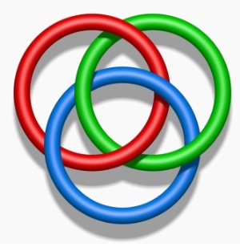

# Leçon 01 | 13 Novembre 1973

<!-- source-url: http://staferla.free.fr/S21/S21 NON-DUPES....docx -->
<!-- seminar: s21 -->
<!-- lesson: 01 -->

<!-- id: s21-01-0001 -->

Je recommence ! Je recommence, puisque j’avais cru pouvoir finir.

<!-- id: s21-01-0002 -->

Je recommence même, parce que j’avais cru pouvoir finir.

<!-- id: s21-01-0003 -->

C’est ce que j’appelle ailleurs « *la passe* » : je croyais que c’était passé.

<!-- id: s21-01-0004 -->

Seulement voilà, cette créance « *je croyais que c’était passé* », cette créance m’a donné l’occasion de m’apercevoir de quelque chose. C’est même comme ça que ce que j’appelle « *la passe* » ça donne l’occasion tout d’un coup de voir un certain relief, un relief de ce que j’ai fait jusqu’ici.

<!-- id: s21-01-0005 -->

Et c’est ce relief qu’exprime exactement mon titre de cette année, celui que vous avez pu lire, j’espère, sur l’affiche, et qui s’écrit

<!-- id: s21-01-0006 -->

*Les non-dupes errent.*

<!-- id: s21-01-0007 -->

Ça sonne drôlement, hein ? C’est un petit air de ma façon.

<!-- id: s21-01-0008 -->

Ou pour dire mieux les choses, une petite erre, *e, deux r, e.*

<!-- id: s21-01-0009 -->

Vous savez peut-être ce que ça veut dire, une erre ?

<!-- id: s21-01-0010 -->

C’est quelque chose comme la lancée, la lancée de quelque chose, quand s’arrête ce qui la propulse et continue de courir encore.

<!-- id: s21-01-0011 -->

Il n’en reste pas moins que ça sonne strictement de la même façon que *Les Noms du Père,* à savoir ce dont j’ai promis de ne par­ler plus jamais. Voilà !

<!-- id: s21-01-0012 -->

Ceci en fonction de certaines gens que j’ai pas plus à qualifier, qui au nom de Freud, m’ont justement fait suspendre ce que je projetais d’énoncer des *Noms du Père.* Ouais...

<!-- id: s21-01-0013 -->

Évidemment, c’est pour ne leur donner en aucun cas le réconfort de ce que j’aurais pu leur apporter certains de ces noms qu’ils ignorent parce qu’ils les refoulent. Ça aurait pu leur servir. Et c’est à quoi je ne tenais pas précisément.

<!-- id: s21-01-0014 -->

De toute façon, je sais qu’ils ne les trouveront pas tout seuls, qu’ils ne les trouveront pas, tels qu’ils sont partis sur l’erre - *e, deux r, e* - sur l’erre de Freud, c’est-à-dire sur la façon dont sont constituées les sociétés psychanaly­tiques. Voilà.

<!-- id: s21-01-0015 -->

Alors, « *Les non-dupes errent »* et « *Les Noms du Père »* qui consonent si bien, qui consonent d’autant mieux que contrairement, comme ça, à un penchant qu’ont les personnes qui se croient lettrées à faire des liaisons même quand il s’agit d’un « *s* », on ne dit pas « *les non-dupes z’errent* », on ne dit pas non plus « *les cerises z’ont bon goût* », on dit : « *les cerises ont bon goût* » et « *les non-dupes errent* ». Ça consonne. Ça, c’est les richesses de la langue.

<!-- id: s21-01-0016 -->

Et j’irai même plus loin : c’est une richesse que n’ont pas toutes les langues, mais c’est bien pour ça qu’elles sont variées.

<!-- id: s21-01-0017 -->

Mais ce que j’avance de ces rencontres qu’on qualifie du *mot d’esprit*, peut-être que j’arriverai avant la fin de cette année à vous faire sentir, à vous faire sentir un peu mieux ce que c’est que *le mot d’esprit*.

<!-- id: s21-01-0018 -->

Et je vais même tout de suite en avancer quelque chose.

<!-- id: s21-01-0019 -->

Dans ces deux termes mis en mots, des « *Noms du Père »* et des « *non-dupes qui errent »,* c’est le même savoir.

<!-- id: s21-01-0020 -->

Dans les deux, c’est le même savoir au sens où l’inconscient c’est un savoir dont le sujet peut se déchiffrer.

<!-- id: s21-01-0021 -->

C’est la définition du sujet, qu’ici je donne, du sujet tel que le constitue l’in­conscient.

<!-- id: s21-01-0022 -->

Il le déchiffre,

<!-- id: s21-01-0023 -->

- celui qui d’être *parlant* est en position de pro­céder à cette opération,

<!-- id: s21-01-0024 -->

- qui y est même jusqu’à un certain point forcé, jusqu’à ce qu’il atteigne un sens.

<!-- id: s21-01-0025 -->

Et c’est là qu’il s’arrête parce que... parce qu’il faut bien s’arrêter.

<!-- id: s21-01-0026 -->

On ne demande que ça, même ! On ne demande que ça parce qu’on n’a pas le temps.

<!-- id: s21-01-0027 -->

Alors il s’arrête à un sens, mais le sens auquel on doit s’arrêter, dans les deux cas...

<!-- id: s21-01-0028 -->

> quoique ça soit le même savoir ...ce n’est pas le même sens.

<!-- id: s21-01-0029 -->

Ce qui est curieux...

<!-- id: s21-01-0030 -->

Et qui nous fait toucher du doigt tout de suite que ce n’est pas le même sens, seulement pour des raisons d’orthographe.

<!-- id: s21-01-0031 -->

Ce qui nous lais­se soupçonner quelque chose, quelque chose dont vous pouvez voir, en fait, l’indication dans ce que j’ai, dans quelques-uns de mes séminaires précédents, marqué *des rapports de l’écrit au langage*.

<!-- id: s21-01-0032 -->

Ne vous étonnez pas trop, enfin, qu’ici je laisse la chose à l’état d’énig­me, puisque l’énig­me c’est le comble du sens.

<!-- id: s21-01-0033 -->

Et ne croyez pas même qu’à l’occasion, il ne reste pas là...

<!-- id: s21-01-0034 -->

> à propos de ce rapprochement, de cette identité phonématique, des *Noms du Père* et des *non-dupes errent* ... ne croyez pas qu’il n’y ait pas d’énigme pour moi-même, mais c’est bien de ça qu’il s’agit.

<!-- id: s21-01-0035 -->

C’est bien de ça qu’il s’agit, et de ceci : qu’il n’y a aucun inconvénient à ce que j’imagine comprendre.

<!-- id: s21-01-0036 -->

Ça éclaire le sujet au sens où je l’ai dit tout à l’heure, et ça vous donne du travail.

<!-- id: s21-01-0037 -->

Faut bien le dire, pour moi, il n’y a rien de tuant comme de vous donner du travail... mais enfin, c’est mon rôle !

<!-- id: s21-01-0038 -->

Le *travail*, tout le monde sait d’où ça vient, dans la langue, dans la langue où je vous jaspine.

<!-- id: s21-01-0039 -->

Vous avez peut-être entendu parler de ça : ça vient de *tripalium,* qui est un instrument de torture, et qui était fait de trois pieux. Au Concile d’Auxerre on a dit qu’il ne convenait pas aux prêtres ni aux diacres, d’être à côté de cet instrument au moyen de quoi « *torquentur rei »,* sont *tourmentés* les coupables.

<!-- id: s21-01-0040 -->

Ça ne convient pas que le prêtre ni que le diacre soient là, ça les ferait peut-être bander.

<!-- id: s21-01-0041 -->

Il est en effet bien clair que le travail, tel que nous le connaissons par l’inconscient, c’est ce qui fait des rapports...

<!-- id: s21-01-0042 -->

> des rapports à ce savoir dont nous sommes tourmentés ...c’est ce qui fait, de ces rapports, *la jouissan­ce*.

<!-- id: s21-01-0043 -->

Donc j’ai dit : pas d’objection à ce que j’imagine.

<!-- id: s21-01-0044 -->

Je n’ai pas dit « *je m’imagine »*. C’est vous qui vous imaginez comprendre. C’est-à-dire que dans ce « *vous* ... *vous* », vous imaginez que c’est vous qui comprenez, mais moi j’ai pas dit que c’était moi, j’ai dit *j’imagine*.

<!-- id: s21-01-0045 -->

Quant à ce que vous vous imaginiez, j’essaye de tempérer la chose.

<!-- id: s21-01-0046 -->

Je fais tout ce que je peux, en tout cas, pour vous en empêcher.

<!-- id: s21-01-0047 -->

Parce qu’il ne faut pas comprendre trop vite, comme je l’ai souvent souligné.

<!-- id: s21-01-0048 -->

Ce que j’ai avancé, pourtant, avec ce « *j’imagine* », à propos du sens, c’est une remarque qui sera celle que j’avance cette année : c’est que l’*imaginaire*...

<!-- id: s21-01-0049 -->

> quoi que vous en ayez entendu, parce que vous vous imaginez comprendre ...c’est que *l’imaginaire c’est une « dit-mension » -* comme vous savez que je l’écris - aussi importante que les autres.

<!-- id: s21-01-0050 -->

Ça se voit très bien dans la science mathématique.

<!-- id: s21-01-0051 -->

Je veux dire dans celle qui est enseignable parce qu’elle concerne *le réel* que véhicule *le symbolique*.

<!-- id: s21-01-0052 -->

Qui ne le véhicule d’ailleurs que de ce qui constitue *le symbolique* ce soit toujours chiffré.

<!-- id: s21-01-0053 -->

*L’imaginaire* c’est ce qui arrête le déchiffrage, c’est le sens.

<!-- id: s21-01-0054 -->

Comme je vous l’ai dit, il faut bien s’arrêter quelque part, et même le plus tôt qu’on peut.

<!-- id: s21-01-0055 -->

*L’imaginaire* c’est toujours une intuition de ce qui est à symboliser, comme je viens de le dire, quelque chose à mâcher, à *penser*, comme on dit. Et pour tout dire, une vague *jouissance*.

<!-- id: s21-01-0056 -->

Le branlage humain est plus varié qu’on ne croit, quoiqu’il soit limité par quelque chose qui tient au corps, au corps humain, à savoir ce qui, dans l’état actuel des choses...

<!-- id: s21-01-0057 -->

> mais justement c’est pas fini, il peut peut-être venir autre chose ... dans l’état actuel des choses, assure la dominance de l’οψις \[opsis\][^1] dans le peu que nous en savons de ce corps, c’est-à-dire l’anatomie.

<!-- id: s21-01-0058 -->

Cette dominance de l’οψις, c’est ce qui fait que quand même qu’il y a toujours de l’intuition dans ce dont part le mathé­maticien. Je vous ferai peut-être cette année sentir le nœud...

<!-- id: s21-01-0059 -->

> c’est bien le cas de le dire ... le nœud de l’affaire, à propos de ce qu’ils appellent...

<!-- id: s21-01-0060 -->

> je parle des mathématiciens, je n’en suis pas, je le regrette \[*sic*\] ... de ce qu’ils appellent « *l’espace vectoriel »*.

<!-- id: s21-01-0061 -->

C’est très joli de voir comment cette affaire, qui est peut-être, enfin...

<!-- id: s21-01-0062 -->

> certains d’entre vous doivent en avoir entendu vaguement parler ... je peux leur affirmer en tout cas que c’est vraiment le dernier grand pas de la mathématique.

<!-- id: s21-01-0063 -->

Ça part comme ça d’une intuition philosopharde l’*Ausdehnungslehre* : la math...

<!-- id: s21-01-0064 -->

*Lehre* c’est ce qui s’enseigne ... la math de l’extension, qu’il appelle ça, [Grassmann](http://fr.wikipedia.org/wiki/Hermann_G%C3%BCnther_Grassmann).

<!-- id: s21-01-0065 -->

Et puis il sort de là *l’espace vectoriel* et le calcul du même nom, c’est-à-dire quelque chose de tout à fait mathématiquement enseignable si je puis dire, de stricte­ment symbolisé, et qui à la limite peut fonctionner dans... par une machine. Elle, elle n’a rien à y comprendre.

<!-- id: s21-01-0066 -->

Pourquoi faut-il revenir à comprendre...

<!-- id: s21-01-0067 -->

> on reparlera de *l’espace vectoriel*, laissez-moi simplement me contenter aujourd’hui d’une annonce ...pourquoi faut-il revenir à comprendre, c’est-à-dire à imaginer, pour savoir où appliquer l’appareil ?

<!-- id: s21-01-0068 -->

*More geometrico*, la géométrie... enfin, la plus bête de la terre, celle qu’on vous a enseignée au lycée, celle qui procède du découpage à la scie de l’espace : vous sciez l’espace en deux, puis après ça l’ombre de sciage vous la coupez par une ligne, et après ça vous marquez un point... bon !

<!-- id: s21-01-0069 -->

C’est quand même amusant que « *More geometrico »* ait paru comme ça pendant des siècles être le modèle de la logique, je veux dire que c’est ce que Spinoza écrit en tête de *l’Éthique.* Ouais...

<!-- id: s21-01-0070 -->

Enfin, c’était comme ça avant que la logique en ait pris quand même certaines leçons, des leçons telles qu’on en est quand même arrivé à vider l’intuition et qu’actuellement, c’est quand même à l’extrême dans un livre de mathématiques...

<!-- id: s21-01-0071 -->

> de ces mathématiques modernes que l’on sait exécrables, aux dires de certains ... on peut se passer, pendant beaucoup de chapitres, de la moindre figure.

<!-- id: s21-01-0072 -->

Mais quand même, et c’est bien là l’étrange, on y vient, on finit toujours par y venir.

<!-- id: s21-01-0073 -->

Alors j’avance ceci pour vous cette année : on y vient tou­jours.

<!-- id: s21-01-0074 -->

Ce n’est pas parce que la géométrie se fait dans l’espace, l’intuitif...

<!-- id: s21-01-0075 -->

> la géométrie des Grecs, dont on peut dire que c’était pas mal, mais enfin que ça cassait pas les manivelles ...c’est pour une autre raison qu’on y vient.

<!-- id: s21-01-0076 -->

Singulièrement, je vous la dirai : c’est qu’il y a 3 dimensions de l’espace habité par le parlant, et que ces 3 *dit­-mensions* - telles que je les écris - s’appellent *le Symbolique, l’Imaginaire et le Réel*.

<!-- id: s21-01-0077 -->

C’est pas tout à fait comme les coordonnées cartésiennes !

<!-- id: s21-01-0078 -->

C’est pas parce qu’il y en a 3...

<!-- id: s21-01-0079 -->

> ne vous y trompez pas, les coordonnées car­tésiennes relèvent de la vieille géométrie ...c’est parce que c’est un espace...

<!-- id: s21-01-0080 -->

> le mien, tel que je le définis de ces trois *dit-mensions* ...c’est un espace dont les points se déterminent tout autrement.

<!-- id: s21-01-0081 -->

Et c’est ce que j’ai essayé...

<!-- id: s21-01-0082 -->

> comme ça dépassait peut-être mes moyens, c’est peut-être ça qui m’a donné l’idée de laisser tomber la chose ... c’est une géo­métrie où les points...

<!-- id: s21-01-0083 -->

> pour ceux qui étaient là - j’espère - l’année derniè­re ... dont les points se déterminent du coinçage de ce dont vous vous souvenez peut-être que j’ai appelé « *mes ronds de ficelle* ».

<!-- id: s21-01-0084 -->

Parce que il y a peut-être un autre moyen de faire un point

<!-- id: s21-01-0085 -->

- que de commencer par scier l’espace,

<!-- id: s21-01-0086 -->

- puis ensuite déchirer la page,

<!-- id: s21-01-0087 -->

- puis avec la ligne qui, on ne sait pas d’où, flotte entre les deux, casser cette ligne,

<!-- id: s21-01-0088 -->

- et dire : « *c’est ça le point* », c’est-à-dire nulle part, c’est-à-dire rien.

<!-- id: s21-01-0089 -->

C’est peut-être s’apercevoir que rien qu’à en prendre 3 de ces ronds de ficelle...

<!-- id: s21-01-0090 -->

> tel que je vous l’ai expliqué, quand ils sont 3, bien que si vous en cou­piez un, les deux autres ne sont pas liés ... ils peuvent, rien que d’être trois... avant ce trois les deux restant séparés ...rien que d’être trois, se coincer de façon à être inséparables.

<!-- id: s21-01-0091 -->

D’où le coinçage, le coinçage qui se définit... quelque chose comme ça :

<!-- id: s21-01-0092 -->

<!-- id: s21-01-0093 -->

À savoir, que si vous tirez quelque part sur un quelconque de ces ronds de ficelle, vous voyez qu’il y a un point, un point qui est quelque part par là, où les trois se coincent.

<!-- id: s21-01-0094 -->

C’est un petit peu différent de tout ce qu’on a élucubré jusqu’ici *more geometrico,* car ça exige qu’il y ait trois ronds, trois ronds de ficelle...

<!-- id: s21-01-0095 -->

> quelque chose d’autrement *consistant* que ce vide avec lequel on opère sur l’espace ...il en faut trois, toujours, en tout cas, pour déterminer un point.

<!-- id: s21-01-0096 -->

Je vous réexpliquerai ça mieux encore, c’est-à-dire en long et en large, mais je vous fais remarquer que ça part, ça part, cette notion, d’une autre façon d’en opérer avec l’espace...

<!-- id: s21-01-0097 -->

> avec l’espace que nous habitons réellement, si l’inconscient existe ...je pars d’une autre façon de consi­dérer l’espace, et qu’en qualifiant ces trois dimensions...

<!-- id: s21-01-0098 -->

> en les épinglant des termes mêmes que j’ai paru jusqu’ici fortement différencier ...des termes de *Symbolique*, d’*Imaginaire* et de *Réel*, ce que je suis en train d’avancer c’est qu’on peut les faire strictement *équivalents*.

<!-- id: s21-01-0099 -->

C’est une question que se pose Freud, à la fin de *La science des rêves,* à l’avant-dernière page, il se pose la question de ce en quoi, ce qu’il appel­le...

<!-- id: s21-01-0100 -->

> et on voit bien qu’il ne l’appelle plus avec tellement de certitude,
>
> qu’il ne l’épingle plus de quelque chose qui la séparerait ... ce qu’il appelle « *réalité »*, qu’il qualifie de « *psychique »* : qu’est-ce que ça peut avoir à faire avec le *réel* ?

<!-- id: s21-01-0101 -->

Alors là il vacille, il vacille encore un peu, et il s’accroche à la réalité matérielle, mais qu’est-ce que ça veut dire « *la réalité matérielle »* dans ses rapports avec la « *réalité psychique » ?*

<!-- id: s21-01-0102 -->

Nous allons donc essayer de les distinguer, de gar­der encore une ombre de distinction entre ces 3 catégories, tout en marquant ce que je mets à l’ordre du jour, à savoir de bien marquer que, comme dimensions de notre espace...

<!-- id: s21-01-0103 -->

> notre espace habité en tant qu’êtres parlants ...ces 3 catégories sont strictement équivalentes.

<!-- id: s21-01-0104 -->

On a déjà pour ça le truc : on les désigne par des *lettres*.

<!-- id: s21-01-0105 -->

C’est là le frayage tout à fait nouveau de l’algèbre, et vous voyez là l’impor­tance de l’*écrit*.

<!-- id: s21-01-0106 -->

Si j’écris R.I.S*., Réel, Imaginaire, Symbolique*, ou mieux : *Réel, Symbolique, Imaginaire*...

<!-- id: s21-01-0107 -->

> vous verrez tout à l’heure pour­quoi je corrige ... vous les écrivez en lettres majuscules, vous ne pouvez pas faire autrement, et ils restent pour vous comme ça, adhérant en quelque sorte à la chose...

<!-- id: s21-01-0108 -->

> simplement question d’écriture ... que c’est tout à fait hétérogène.

<!-- id: s21-01-0109 -->

Vous allez continuer comme ça parce que vous avez toujours compris...

<!-- id: s21-01-0110 -->

> vous avez toujours compris, mais à tort ! ... que le progrès, le pas en avant c’était d’avoir marqué l’importance écrasante du « *Symbolique* » au regard de ce malheureux « *Imaginaire »* par lequel j’ai com­mencé, j’ai commencé en tirant dessus à balles, sous le prétexte du narcissisme.

<!-- id: s21-01-0111 -->

Seulement figurez-vous que l’image du miroir, c’est *tout à fait réel qu’elle soit inversée*.

<!-- id: s21-01-0112 -->

Et que même avec un nœud, surtout avec un nœud, et malgré l’apparence, car vous vous imaginez peut-être qu’il y a des nœuds dont l’image dans le miroir peut être superposée au nœud lui-même, il n’en est rien !

<!-- id: s21-01-0113 -->

L’espace - j’entends l’espace intuitif, géométrique - est orientable, *il n’y a rien de plus spéculaire qu’un nœud*.

<!-- id: s21-01-0114 -->

Et c’est bien pour ça que c’est tout autre chose si ce même R.S.I. vous prenez le parti de les *écrire*...

<!-- id: s21-01-0115 -->

> vous voyez là où gît l’astuce ...de les écrire *a,b,c* : là tout le monde sent que tout au moins ça les rapproche, un *a* vaut un *b*, un *b* vaut un *c*, et ça tourne en rond comme ça. C’est même là-des­sus qu’est fondée la combinatoire.

<!-- id: s21-01-0116 -->

C’est là-dessus qu’est fondée la com­binatoire et c’est pour ça que quand vous mettez les 3 lettres à la suite, il n’y a pas plus de six façons de les ordonner. C’est-à-dire, selon la loi factorielle qui préside au truc, c’est 1 x 2 x 3 : ça fait 6.

<!-- id: s21-01-0117 -->

Dès que vous en avez quatre \[*lettres*\], il y a 24 façons de les ordonner. \[4 ! : 1 x 2 x 3 x 4 = 24\]

<!-- id: s21-01-0118 -->

Seulement, si pour vous soumettre à une conception de l’espace où le point se définit de la façon que je viens de montrer : par le coinçage...

<!-- id: s21-01-0119 -->

> pardonnez-moi aujourd’hui de ne pas écrire bien tout ça, en figures, au tableau, je le ferai dans la suite ...vous vous apercevez que c’est pas en raison d’une scansion qui va du meilleur au pire : du *Réel* à l’*Imaginaire*, en mettant au milieu le *Symbolique*, c’est pas en raison d’une préférence quelconque, que vous devez vous apercevoir qu’à prendre les choses par le coinçage, autrement dit par le nœud borro­méen :

<!-- id: s21-01-0120 -->

- un rond de ficelle est le *Réel*,

<!-- id: s21-01-0121 -->

- un rond de ficelle est le *Symbolique*,

<!-- id: s21-01-0122 -->

- un rond de ficelle est l’*Imaginaire*, ...eh ben ne croyez pas que toutes les façons de faire ce nœud soient les mêmes : il y a un nœud *lévogyre* et un nœud *dextrogyre*.

<!-- id: s21-01-0123 -->

Et ceci...

<!-- id: s21-01-0124 -->

- même si vous avez écrit les 3 dimensions de l’espa­ce, que je définis comme étant l’espace par l’être parlant habité,

<!-- id: s21-01-0125 -->

- même si vous n’avez défini ces dimensions par des petites lettres,

<!-- id: s21-01-0126 -->

- même si ces dimensions vous les définissez par petit *a,b,c,* que vous n’y mettiez aucun accent de contenu diversement préférentiel, ...vous vous apercevez que si vous écrivez *a, b, c,* il y a une 1ère série, et malgré vous, vous la qualifierez de « *la bonne* », la série que j’appelle *lévogyre*, qui sera : *a,b,c,* puis *b,c,a,* puis *c,a,b,* c’est-à-dire qu’il y a la série - la série *lévogyre* - qui laisse tou­jours un certain ordre, qui est justement l’ordre *a, b, c,* c’est le même qui est conservé dans *b, c, a*. Et que petit *c* vienne en tête n’a aucune impor­tance.

<!-- id: s21-01-0127 -->

Il vous est licite d’imaginer - puisque c’est le grand I que j’ai épin­glé du petit *c* - d’imaginer *la réalité du Symbolique*.

<!-- id: s21-01-0128 -->

Ce qu’il suffit, c’est que le *Réel*, lui, reste « *avant »*.

<!-- id: s21-01-0129 -->

Et ne croyez pas pour autant que cet « *avant »* du *Réel* par rapport au *Symbolique*, ça soit à soi tout seul une garantie quelconque de quoi que ce soit, parce que si vous retranscrivez le *a, b, c* de la première formule, vous aurez R.S.I, à savoir ce qui réalise le *Symbolique de l’Imaginaire*.

<!-- id: s21-01-0130 -->

Eh bien, ce qui réalise le *Symbolique de l’Imaginaire*, qu’est-ce que c’est d’autre que *la religion* ? *Rata* pour moi !

<!-- id: s21-01-0131 -->

Ce qui réalise, en termes propres, le *Symbolique de l’Imaginaire*, c’est bien ce qui fait que *la reli­gion* n’est pas près de finir.

<!-- id: s21-01-0132 -->

Et ça nous met - nous analystes - du même côté, du côté *lévogyre*, par quoi imaginant ce qu’il s’agit de faire, imaginant *le Réel du Symbolique*, notre premier pas, fait depuis longtemps, c’est la mathématique, et le dernier c’est ce à quoi nous conduit la considération de l’inconscient, pour autant que c’est de là que se fraye...

<!-- id: s21-01-0133 -->

> je le professe depuis toujours ...c’est de là que se fraye la linguistique. C’est-à-dire que c’est à étendre le procédé mathématique...

<!-- id: s21-01-0134 -->

> qui consiste à s’apercevoir de ce qu’il y a de *Réel* dans le *Symbolique*, ...que c’est par là qu’est pour nous dessiné un nouveau passage.

<!-- id: s21-01-0135 -->

*L’Imaginaire* n’a donc pas à être placé à un quelconque rang, c’est l’ordre qui importe, et dans l’*autre* ordre : *dextrogyre*, curieusement, vous avez la formule *a, c, b,* moyennant quoi c’est au 2nd temps que *c* vient en tête, mais *b* est avant *a*, et au troisième temps, c’est *b, a, c,* c’est-à-dire 3 termes dont nous verrons que, s’ils ne comptent pas pour peu dans le discours, ça n’en est pas moins là d’où sortent quelques structurations distinctes, qui sont justement toutes celles dont se supportent d’autres discours, ceux seulement que les discours *lévogyres* permettent, de par l’espace qu’ils déterminent, de démontrer, non pas certes comme n’ayant eu un temps leur *efficacité,* mais comme à propre­ment parler mis en cause par les autres discours.

<!-- id: s21-01-0136 -->

Et je ne fais preuve là d’aucune partialité, puisque je nous mets du même côté où la religion fonctionne.

<!-- id: s21-01-0137 -->

Je n’en dirai pas plus aujourd’hui.

<!-- id: s21-01-0138 -->

Mais ce que j’avance est ceci : si dans la langue, la structure il faut l’imaginer, est-ce que ce n’est pas là ce que j’avance par la formule « *les non-dupes errent »* ?

<!-- id: s21-01-0139 -->

Comme ça n’est pas immédiatement accessible, je vais essayer de vous le montrer.

<!-- id: s21-01-0140 -->

Il y a quelque chose dans l’idée de la duperie, c’est qu’elle a un sup­port : c’est la dupe.

<!-- id: s21-01-0141 -->

Il y a quelque chose d’absolument magnifique dans cette histoire de la dupe, c’est que la dupe...

<!-- id: s21-01-0142 -->

si je puis et si vous me le permettez ...la dupe est considérée comme stupide. On se demande vraiment pourquoi.

<!-- id: s21-01-0143 -->

Si la dupe est vraiment ce qu’on nous dit...

<!-- id: s21-01-0144 -->

> je parle étymologiquement, ça n’a aucune importance ...si la dupe c’est cet oiseau qu’on appelle la huppe...

<!-- id: s21-01-0145 -->

> la huppe parce qu’elle est huppée, naturellement rien ne justifie que huppée ça se dise la huppe,
>
> il n’en reste pas moins que c’est comme ça qu’elle est appréciée dans le dictionnaire ...la dupe, c’est l’oiseau, paraît-il, qu’on prend au piège, justement de ce qu’elle soit stupide.

<!-- id: s21-01-0146 -->

On ne voit absolument pas pourquoi une huppe serait plus stupide qu’un autre oiseau, mais la chose qui me paraît remarquable, c’est l’ac­cent que met le dictionnaire pour préciser qu’elle est du féminin : la dupe est « *la* ».

<!-- id: s21-01-0147 -->

Il y a quelque part un machin que j’ai relevé - que j’ai relevé dans le Littré - que ce soit une faute, que La Fontaine ait fait « *la dupe* » masculin. Il a osé écrire quelque part [^2] : « *Du fil et du soufflet pourtant embarrassé,* *Un des dupes un jour alla trouver un sage.* »

<!-- id: s21-01-0148 -->

« *Ceci est tout à fait fautif,* marque bien Littré*, on ne dit pas un dupe, pas plus qu’on ne peut dire un linotte pour qualifier un étourdi.* »

<!-- id: s21-01-0149 -->

Voilà une forte raison.

<!-- id: s21-01-0150 -->

L’intéressant, c’est de savoir de quel genre est *le non-dupe.*

<!-- id: s21-01-0151 -->

Vous voyez ? Je dis tout de suite : *le non-dupe.*

<!-- id: s21-01-0152 -->

Est-ce que c’est parce que ce qui est pointé du « *non...* », c’est neutre ? Je n’en trancherai pas.

<!-- id: s21-01-0153 -->

Mais il y a une chose en tout cas claire, c’est que le pluriel, d’être non marqué, fait vaciller complètement *cette référence féminine.*

<!-- id: s21-01-0154 -->

Et il y a quelque chose, enfin, qui est encore plus drôle, que j’ai...

<!-- id: s21-01-0155 -->

> je ne peux pas dire que je l’ai trouvé dans Chamfort ...je l’ai trouvé aussi dans le dictionnaire, dans un autre, cette citation de Chamfort...

<!-- id: s21-01-0156 -->

> parce que je passe pas mon temps à lire Chamfort, mais c’est quand même pas mal, ...enfin, que ce soit au mot « *dupe* » que j’ai relevé ceci :

<!-- id: s21-01-0157 -->

> « *Une des meilleures raison* *qu’on puisse avoir de ne se marier jamais,*
>
> *c’est qu’on n’est pas tout à fait la dupe d’une femme tant qu’elle n’est pas la vôtre* ».

<!-- id: s21-01-0158 -->

« *La vôtre* » : votre femme, ou votre dupe ? \[*Rires*\]

<!-- id: s21-01-0159 -->

Ça, c’est quelque chose tout de même, qui paraît, enfin, éclairant, hein ?

<!-- id: s21-01-0160 -->

Le mariage comme duperie réciproque.

<!-- id: s21-01-0161 -->

C’est bien en quoi je pense que le mariage c’est l’amour : les senti­ments sont toujours réciproques, ai-je dit.

<!-- id: s21-01-0162 -->

Alors, si le mariage l’est à ce point-là - c’est pas sûr, hein ! - enfin, si je me laissais un peu aller à la glissade, je dirais que...

<!-- id: s21-01-0163 -->

> c’est ce que veut dire Chamfort aussi, sans doute ...une femme ne se trompe jamais... dans le mariage, en tout cas.

<!-- id: s21-01-0164 -->

C’est en quoi la fonction de *l’épouse* n’a rien d’humain. \[Rires\]

<!-- id: s21-01-0165 -->

Nous approfondirons ça une autre fois. \[Rires\]

<!-- id: s21-01-0166 -->

J’ai parlé de *non-dupe,* et je semble l’avoir marqué d’une irré­médiable faiblesse, en disant que ça *erre...*

<!-- id: s21-01-0167 -->

Seulement, il faudrait bien savoir ce que ça veut dire « ça *erre ».*

<!-- id: s21-01-0168 -->

Je vous ai déjà tout à l’heure un petit peu indiqué qu’*errer*...

<!-- id: s21-01-0169 -->

> enfin, vous allez quand même vous reporter au dictionnaire Bloch et von Wartburg, parce que je ne vais pas passer mon temps à vous faire de l’étymologie, n’est-ce pas, sachez simplement qu’il y a quelque chose que l’étymologie...
>
> ce qui veut dire simplement pointer l’usage au cours des temps
>
> ...que l’étymologie rend parfaitement manifeste, c’est qu’exactement comme dans mon titre *les Non-dupes errent*
>
> et *les Noms du père*, c’est exactement la même chose pour le mot *erre*, ou plus exactement pour le mot *errer* ...*errer* résulte de la convergence

<!-- id: s21-01-0170 -->

- de « *error » *: *erreur*,

<!-- id: s21-01-0171 -->

- avec quelque chose qui n’a strictement rien à faire, et qui est apparenté à cette *erre* dont je vous parlais tout à l’heure, qui est strictement le rapport avec le verbe *iterare*.

<!-- id: s21-01-0172 -->

*Iterare*, en plus...

<!-- id: s21-01-0173 -->

car si c’était que ça, ce serait rien ...est là uniquement pour « *iter* » ce qui veut dire voyage.

<!-- id: s21-01-0174 -->

C’est bien pour ça que le *chevalier errant* est simplement un *chevalier itinérant*.

<!-- id: s21-01-0175 -->

Seulement, quand même, *errer* vient de *iterare*, qui n’a rien à faire avec un voyage, puisque ça veut dire répéter, de *iterum* \[*re-iterum*\]. Néanmoins, on ne se sert de cet *iterare* que pour ce qu’il ne veut pas dire, c’est-à-dire *itinerare*, comme le démontrent les développements qu’on a donnés à ce verbe *errer* au sens d’errance, c’est-à-dire en faisant du *chevalier errant* un *chevalier itinérant*.

<!-- id: s21-01-0176 -->

Eh bien c’est là la pointe de ce que j’ai à vous dire, considérant la dif­férence qui s’épingle de ce qu’il en est des *non-dupes*.

<!-- id: s21-01-0177 -->

Si les *non-dupes* sont ceux ou celles qui se refusent à la capture de l’es­pace de l’être parlant, si ce sont ceux qui en gardent, si je puis dire, leurs coudées franches, il y a quelque chose qu’il faut savoir imaginer, c’est l’absolue nécessité qui en résulte, d’une - non pas errance - mais erreur.

<!-- id: s21-01-0178 -->

C’est à savoir que pour tout ce qui est de la vie, et du même coup de la mort, il y a une imagination qui ne peut que supporter tous ceux qui de la structure se veulent *non-dupes*, c’est ceci : c’est que leur vie n’est qu’un voyage.

<!-- id: s21-01-0179 -->

La vie, c’est celle de *viator*, ceux qui dans ce bas monde - comme ils disent - sont comme à l’étranger.

<!-- id: s21-01-0180 -->

La seule chose dont ils ne s’aperçoivent pas, c’est que rien qu’à faire surgir cette fonction de l’étranger, ils font resurgir du même coup le tiers terme, la troisième dimension, celle grâce à quoi des rapports de cette vie, ils ne sortiront jamais, si ce n’est d’être alors plus dupes encore que les autres de ce lieu de l’Autre, pourtant, qu’avec leur *imaginaire* ils constituent comme tel.

<!-- id: s21-01-0181 -->

L’idée de γένησις \[génesis\], de « *développement* » comme on dit, de ce qui serait je ne sais quelle norme, grâce à quoi un être qui ne se spécifie que d’être parlant, dans tout ce qu’il en est de ses affects justement, qui serait com­mandé par je ne sais quoi que quiconque est bien incapable de définir, qui s’appelle « le développement ».

<!-- id: s21-01-0182 -->

Et c’est à quoi, en voulant réduire l’ana­lyse, on manque, on fait l’erreur complète, l’erreur radicale, quant à ce qu’il en est de ce que découvre l’inconscient.

<!-- id: s21-01-0183 -->

S’il y a quelque chose que nous dit Freud, et là c’est sans ambiguïté, c’est le dernier paragraphe de la *Traumdeutung *: « *Und* *der Wert des Traumes für die Kenntnis der Zukunft ?* ».

<!-- id: s21-01-0184 -->

Et c’est là que c’est bien joli.

<!-- id: s21-01-0185 -->

Parce qu’on croit qu’en écrivant ceci, Freud fait allusion à la fameuse « *valeur de divination des rêves »*.

<!-- id: s21-01-0186 -->

Mais ne pou­vons-nous pas le lire autrement ?

<!-- id: s21-01-0187 -->

C’est-à-dire, nous dire :

<!-- id: s21-01-0188 -->

> « *et la valeur du rêve pour la connaissance de ce qui va en résulter dans le monde, de la découverte de l’inconscient* »

<!-- id: s21-01-0189 -->

À savoir si, par hasard, un discours faisait que d’une façon de plus en plus répandue, on sache - on sache ce que dit la fin du paragraphe de Freud, c’est à savoir que cet avenir tenu par le rêveur pour présent, est *gestaltet, structuré* par l’indestructible demande en tant qu’elle est toujours la même : *« ...zum Ebenbild jener Vergangenheit gestaltet. »*

<!-- id: s21-01-0190 -->

C’est à savoir que, si vous voulez, je vais vous mettre quelque chose ici : « *Naissance* ---- *Mort »* qui serait ce voyage, à savoir ce développement, comme ça, ponctué, *de la naissance à la mort*.

<!-- id: s21-01-0191 -->

Qu’est-ce que Freud, de par le surgissement de *l’inconscient*, nous indique ?

<!-- id: s21-01-0192 -->

C’est que...

<!-- id: s21-01-0193 -->

en quelque point qu’on soit de ce prétendu « *voyage* », ...la structure...

<!-- id: s21-01-0194 -->

de quelque façon que je la crayonne ici, peu importe, ...la structure...

<!-- id: s21-01-0195 -->

c’est-à-dire le rapport à un certain savoir, ...la structure, elle, n’en démord pas.

<!-- id: s21-01-0196 -->

Et le *désir -* comme on traduit improprement - est strictement,­ durant toute la vie, toujours le même.

<!-- id: s21-01-0197 -->

Simplement des rapports d’un être particulier dans son surgissement, dans son surgissement dans un monde où déjà c’est ce discours qui règne, qu’il est parfaitement déter­miné, quant à son désir, du début jusqu’à la fin.

<!-- id: s21-01-0198 -->

C’est bien en quoi ce n’est qu’à ne plus se vouloir *dupe* de la structure, qu’on s’imagine, de la façon la plus folle, que la vie est tissée de je ne sais quels contraires de « *pulsions de vie* » et de « *pulsions de mort* », c’est déjà quand même un tout petit peu flotter plus haut que la notion - la notion de toujours - du « *voyage* ».

<!-- id: s21-01-0199 -->

Ceux qui ne sont pas dupes de l’inconscient, c’est-à-dire qui ne font pas tous leurs efforts pour y coller, ne voient la vie que du point de vue du *viator*. C’est bien comme ça d’ailleurs, que sont surgies...

<!-- id: s21-01-0200 -->

> dans toute une étape de la logique, celle dont après-coup, bien sûr, et avec je ne sais quelles conséquences, ...sont apparues ces choses, dont on ne voit même pas à quel point c’est un paradoxe : *tous les hommes sont mortels*.

<!-- id: s21-01-0201 -->

C’est-à-dire, que j’ai dit « *voya­geurs »*, hein...

<!-- id: s21-01-0202 -->

Socrate *est un homme*...

<!-- id: s21-01-0203 -->

Et il est un homme,

<!-- id: s21-01-0204 -->

- il est un homme s’il veut bien - hein ?

<!-- id: s21-01-0205 -->

- il est un homme s’il s’y précipite lui-même, n’est-ce pas...

<!-- id: s21-01-0206 -->

C’est bien d’ailleurs ce qu’il fait, et c’est bien en quoi d’ailleurs, le fait qu’il l’ait *demandée*, la mort, il y a quand même une toute petite diffé­rence, mais cette différence n’a pas empêché la suite d’être absolument fascinante.

<!-- id: s21-01-0207 -->

Ça n’a pas non plus été plus mauvais pour ça.

<!-- id: s21-01-0208 -->

Avec son *hys­térie*, il a permis *une certaine ombre de science* : celle qui justement se fonde sur cette logique catégorique.

<!-- id: s21-01-0209 -->

C’était un très mauvais exemple. Mais ça doit s’entendre, hein.

<!-- id: s21-01-0210 -->

En tout cas cette fonction *imaginaire* essentiellement du *viator*, doit nous mettre en garde contre toute méta­phore qui procède de « *la Voie* ».

<!-- id: s21-01-0211 -->

Je sais bien que « *la Voie* » ...

<!-- id: s21-01-0212 -->

> « *la Voie* » dont il s’agit : le *Taô* ...elle s’imagine être dans la structure.

<!-- id: s21-01-0213 -->

Mais est-ce bien sûr qu’il y ait qu’une *Voie* ?

<!-- id: s21-01-0214 -->

Ou même que la notion de « *la Voie* », de la méthode, vaille quoi que ce soit ?

<!-- id: s21-01-0215 -->

Est-ce que ça ne serait pas en nous forgeant une toute autre éthique, une éthique qui se fonderait sur le refus d’être *non-dupe*, sur la façon d’être toujours plus fortement *dupe* de ce savoir, de cet inconscient, qui en fin de compte est notre seul lot de savoir.

<!-- id: s21-01-0216 -->

Je sais bien qu’il y a cette sacrée question de *la vérité*...

<!-- id: s21-01-0217 -->

Mais nous n’al­lons pas, comme ça, après ce que je vous en ai dit...

<!-- id: s21-01-0218 -->

> et combien de fois, et y revenant et y retournant ...nous mettre à y coller, sans savoir que *c’est un choix*, puis­qu’elle ne peut que se *mi-dire*.

<!-- id: s21-01-0219 -->

Et qu’après tout, ce que nous choisissons d’en dire, il y a toujours derrière un désir, une intention, comme on dit.

<!-- id: s21-01-0220 -->

C’est là-dessus qu’est fondée toute la phénoménologie, je parle de celle de Husserl.

<!-- id: s21-01-0221 -->

Selon que vous variez comme ça les « *bouts à dire* » de *la vérité*, bien entendu, voir ce que ça donne comme trucs : il y a des choses bien drôles.

<!-- id: s21-01-0222 -->

Je voudrais pas compromettre Dieu, trop, dans cette affaire...

<!-- id: s21-01-0223 -->

> chacun sait que je considère que il est plutôt de l’ordre du super-chéri \[*Rires*\] ...alors pourquoi est-ce qu’il dirait toujours *la vérité*, alors que ça va aussi bien s’il est totalement trompeur, hein ?

<!-- id: s21-01-0224 -->

En admettant qu’il ait fait le *Réel*, il y est d’autant plus soumis que justement, si c’est lui qui l’a fait, alors, pourquoi pas ?

<!-- id: s21-01-0225 -->

Je crois que c’est en fin de compte comme ça qu’il faut interpréter la fameuse histoire de Descartes : *le malin génie*.

<!-- id: s21-01-0226 -->

Le malin génie c’est lui, et ça marche comme ça : plus il sera malin plus ça ira.

<!-- id: s21-01-0227 -->

C’est même pour ça qu’il faut être dupe.

<!-- id: s21-01-0228 -->

Il faut être dupe, c’est-à-dire coller, coller à la structure.

<!-- id: s21-01-0229 -->

Bien, ben écoutez, j’en ai ma claque. \[*Rires*\]

## Notes

[^1]: *Opsis* : ce qui est visible, livré au regard, le visage, l’apparence.

[^2]:
    #  La Fontaine (1621-1695), Fables, IX, 8 : [Le Fou qui vend la sagesse](http://www.etudes-litteraires.com/la-fontaine-fou-sagesse.php).
