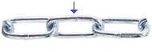
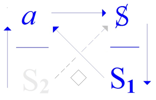
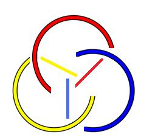
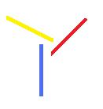
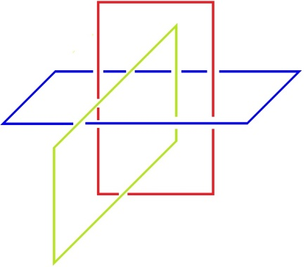

# Leçon 05 | 08 Janvier 1974

<!-- source-url: http://staferla.free.fr/S21/S21 NON-DUPES....docx -->
<!-- seminar: s21 -->
<!-- lesson: 05 -->

<!-- id: s21-05-0001 -->

Je vous souhaite la « *bonne année* », quoique naturellement plu­sieurs personnes, j’imagine, l’aient ici commencée mal.

<!-- id: s21-05-0002 -->

J’en suis, d’ailleurs, je suis de ceux-là.

<!-- id: s21-05-0003 -->

De sorte qu’après tout, mon envie était de m’excuser sur le fait que le mardi par lequel a commencé l’année n’était, de ce fait, *pas un vrai mardi* et de vous renvoyer au suivant.

<!-- id: s21-05-0004 -->

Ç’aurait été une bonne façon de me débarrasser de mon devoir d’au­jourd’hui.

<!-- id: s21-05-0005 -->

J’en reste encore, il faut le dire, très tenté.

<!-- id: s21-05-0006 -->

Il n’y a qu’une seule chose qui me retient - faut vous le dire - c’est qu’aujourd’hui, vous êtes moins nombreux.

<!-- id: s21-05-0007 -->

Je vous en suis si reconnaissant que c’est peut-être ce qui va me pousser, comme ça, *cahin-caha*, à énoncer quelques-unes des choses que forcément je continue à cogiter, comme ça, sur cette habi­tude.

<!-- id: s21-05-0008 -->

Le fait aussi que ce matin, on a beaucoup dérangé ma secrétaire, pour demander si je le faisais bien effectivement, et comme je ne lui ai fait aucune confidence, elle a répondu oui. Parmi ceux-là, mon Dieu, il y en avait quelques-uns qui étaient plutôt parmi les meilleurs, si j’en crois certains noms qu’on m’a rapportés.

<!-- id: s21-05-0009 -->

Alors comme ils se sont déran­gés aussi, ceux-là, *les meilleurs,* je vais essayer d’y aller.

<!-- id: s21-05-0010 -->

Alors partons de ceci, auquel je ne tiens pas particu­lièrement, à savoir que les mots aient un sens, et que ce soit un fait, quoique le problème soit, à partir de ce fait, de savoir où les loger.

<!-- id: s21-05-0011 -->

C’est bien ce que j’ai fait...

<!-- id: s21-05-0012 -->

> loger ces mots bien sûr, il faut quand même vous mâcher les choses ...c’est bien l’effort que j’ai fait, que j’ai fait la dernière fois, à partir de l’amour.

<!-- id: s21-05-0013 -->

C’est un fait que je partais de ça : que *le mot existe, et c’est en quoi la chose, la chose est à concevoir comme possible*.

<!-- id: s21-05-0014 -->

Ce qui se traduit dans mon *dire* de ce qu’elle se fonde...

<!-- id: s21-05-0015 -->

> *la chose, la chose amour* ...qu’elle ne se fonde...

<!-- id: s21-05-0016 -->

> puisqu’il s’agit seulement de sa possibilité ...*elle se fonde*, comme je dis, *de cesser de s’écrire*.

<!-- id: s21-05-0017 -->

C’est-à-dire *de ce qu’il en reste de ça : qu’elle cesse de s’écrire.*

<!-- id: s21-05-0018 -->

*Ce qu’il en reste*, je l’ai arti­culé depuis ce temps...

<!-- id: s21-05-0019 -->

> depuis ce temps, presque infini pour moi, que je me répète ...à savoir *la lettre d’(a)mur*.

<!-- id: s21-05-0020 -->

*La lettre d’(a)mur* en tant que *ça ne fait rien d’autre qu’un* tas, un *petit tas, un petit(a) d’habitudes*, pas beaucoup plus.

<!-- id: s21-05-0021 -->

C’est au moins comme ça que j’ai lu, traduit en italien, mon fameux « *objet »,* avec lequel, ce *petit(a)* des *lettres d’(a)mur* n’a bien entendu que le plus mince rapport.

<!-- id: s21-05-0022 -->

Tout ça n’empêche pas que je dis des choses qui prennent leur air de *sérieux* de ce que je traduis du *sériel*.

<!-- id: s21-05-0023 -->

C’est un fait, aussi, que je change l’ordre de la série qui se répète, soit ce qu’on appelle « l’ordinaire ».

<!-- id: s21-05-0024 -->

Tout est-il là, de mon *dire*, de changer l’ordre ordinaire ?

<!-- id: s21-05-0025 -->

C’est à quoi je vou­drais aujourd’hui apporter argument, argument propre à donner sens à des fonctions plus purement *cardinales*. \[*ordinal ↔ cardinal* \]

<!-- id: s21-05-0026 -->

C’est ce que j’essaie de faire avec mon nœud borroméen.

<!-- id: s21-05-0027 -->

Vous le savez, cette distinction du *cardinal* et de l’*ordinal*...

<!-- id: s21-05-0028 -->

> le pas a été franchi seulement grâce à la théorie des ensembles, c’est-à-dire grâce à Cantor \[1845-1918\] ...en quoi ça peut-il nous servir pour ce qu’il en est de l’exploration d’un *discours nouveau*...

<!-- id: s21-05-0029 -->

> vous le savez, c’est ainsi que je désigne *le discours analytique* ...lequel discours s’est annoncé d’un *décantage du sens* \[S1 ◊ S2\].

<!-- id: s21-05-0030 -->

<!-- id: s21-05-0031 -->

Qu’est-ce que ça veut dire « *décantage »,* dans l’occasion ?

<!-- id: s21-05-0032 -->

C’est propre­ment...

<!-- id: s21-05-0033 -->

> et c’est en cela que la métaphore du « *décantage* » ici se soutient ...c’est proprement de *la condensation* de ce qui, du sens, se concentre par ce discours de ceci : que *le sens, le sens des mots, ne fait qu’appareil pour* ce que nous appellerons si vous le voulez bien rien de plus : *le coït sexuel*.

<!-- id: s21-05-0034 -->

*C’est ça le nouveau du discours analytique*.

<!-- id: s21-05-0035 -->

Et c’est ce qu’il faut bien dire : si c’est bien ce qui de ce discours est nécessaire, il n’est néces­saire qu’en ceci...

<!-- id: s21-05-0036 -->

> et c’est bien pourquoi j’infléchis ainsi le sens du « *néces­saire »* ...c’est que sa caractéristique, dans ce discours, c’est que ce dis­cours *ne cesse pas de l’écrire*. \[*<u>nécess</u>aire* : *<u>ne cesse</u>*\]

<!-- id: s21-05-0037 -->

Est-ce que c’est vrai pour autant ?

<!-- id: s21-05-0038 -->

C’est vrai de *cette sorte de* *vérité* qu’instaure ce discours, à savoir d’*une vérité du* « *moyen »*, si tant est que certains se souviennent de la façon dont la dernière fois, et justement concernant l’amour, j’ai distingué, par ce qu’il en est du nœud borro­méen, la fonction du « *moyen »* comme tel.

<!-- id: s21-05-0039 -->

*Le moyen* justement, *c’est ce qui ne fait nœud qu’à ce qu’il y ait un ordre*. \[*→* *ordinal /cardinal* \]

<!-- id: s21-05-0040 -->

À savoir que, pour prendre ces « Uns » que constituent, disons sans plus, les ronds de ficelle : il n’y en a qu’un des trois\[*le « moyen »*\], qui tranché, libère les deux autres.

<!-- id: s21-05-0041 -->

C’est ce que vous voyez *dans une chaîne à 3 chaînons ordinaires* : il n’y en a qu’un des trois qui libère les deux autres :

<!-- id: s21-05-0042 -->

<!-- id: s21-05-0043 -->

La distinction qu’il y a entre cette chaîne, cette chaîne dont, semble-t-il, il est sensible que ce soit là l’ordre du *Symbolique *:

<!-- id: s21-05-0044 -->

- un sujet,

<!-- id: s21-05-0045 -->

- un verbe,

<!-- id: s21-05-0046 -->

- et ce que vous voudrez, un complément, « un, deux, trois » peut, ayant cet ordre, cet ordre qu’il y a quelque chose qui fait « *moyen* », et c’est cela même qu’on appelle, avec l’ambiguïté de ce mot « *le verbe »,* on peut commencer par le complé­ment et finir par le sujet, mais *c’est le verbe qui fait moyen*.

<!-- id: s21-05-0047 -->

En quoi il s’entrevoit à la limite que *le langage*, lui, n’est pas fait de mots, Car \[*le langage*\] *c’est le lien par quoi, du premier au dernier, le moyen établit cette unité qui seule est à rompre pour que le sens disparaisse*.

<!-- id: s21-05-0048 -->

*C’est bien ce qui montre que le langage n’est pas fait de mots*, et en quoi ce qu’on appelle...

<!-- id: s21-05-0049 -->

> car c’est cela, et rien de plus, qu’on appelle une proposition ...*une proposition* c’est l’effacement au moins relatif...

<!-- id: s21-05-0050 -->

> je dis ça : « *au moins relatif* », pour vous faciliter l’accès aux choses ...*c’est l’effacement du sens des mots*.

<!-- id: s21-05-0051 -->

*Ce qui n’est pas vrai de lalangue*, *lalangue* comme ritournelle...

<!-- id: s21-05-0052 -->

> vous savez que je l’écris en un mot ...*lalangue si, elle en est faite du sens*, à savoir comment *par l’ambiguïté de chaque mot* elle prête à cette fonction que *<u>le sens y ruisselle</u>*.

<!-- id: s21-05-0053 -->

Il ne ruisselle pas dans vos dires, certes pas, ni dans les miens non plus.

<!-- id: s21-05-0054 -->

C’est bien en quoi *le sens* ne s’atteint pas si facilement.

<!-- id: s21-05-0055 -->

Et ce « *ruis­sellement* » dont je parle, comment l’imaginer...

<!-- id: s21-05-0056 -->

> c’est le cas de le dire ...comment l’imaginer si c’est un ruissellement qu’arrêtent enfin des « *cou­pelles* » ?

<!-- id: s21-05-0057 -->

Car la langue c’est ça. \[*cf. « Lituraterre »* : *ruissellement-ravinement-écriture*\]

<!-- id: s21-05-0058 -->

Et c’est même là le sens à donner à *ce qui cesse de s’écrire *: ce serait *le sens même des mots*, qui dans ce cas *se sus­pend*.

<!-- id: s21-05-0059 -->

C’est en quoi

<!-- id: s21-05-0060 -->

- *le mode du « possible » en émerge*,

<!-- id: s21-05-0061 -->

- qu’en fin de comp­te, *quelque chose qui s’est dit* *<u>cesse de s’écrire</u>*, ...c’est bien ce qui montre qu’à la limite tout est possible par les mots, justement de cette condition : qu’ils n’aient plus de sens.

<!-- id: s21-05-0062 -->

Et c’est cela même que je vise cette année : c’est à ce que vous ne confondiez pas « *les mots »* avec « *les lettres »*, puisque ce n’est que des *lettres* que se fonde *le nécessaire*, comme *l’impossible*, dans une articulation qui est celle de la logique \[*logique <u>modale</u>*\].

<!-- id: s21-05-0063 -->

Si ma façon de situer les *modes* est correcte, à savoir que *ce qui ne cesse pas de s’écrire*, *le nécessaire*, c’est cela même qui *nécessite la rencontre de l’impossible*, à savoir *ce qui ne cesse pas de ne pas s’écrire, qui ne peut s’aborder que par <u>les lettres</u>*.

<!-- id: s21-05-0064 -->

C’est bien là *ce que ne permet d’aborder par quelque dire, <u>que</u> la structure* que j’ai désignée de celle *du nœud borroméen*.

<!-- id: s21-05-0065 -->

C’est en quoi, la dernière fois, *l’amour* était un bon test de la précarité de ces modes.

<!-- id: s21-05-0066 -->

<!-- id: s21-05-0067 -->

*Il est porté à l’ex-sistence cet amour*...

<!-- id: s21-05-0068 -->

\[*« ...ce « cesse de ne pas s’écrire »* \[...\] *de ce qui, chez chaque individu, marque la trace de son exil* \[...\]*de ce rapport... » Encore, Sta p.* 155, 26 *juin* 1973 \]

<!-- id: s21-05-0069 -->

> ce qui est bien le fait de son sens même \[*l’amour « supplée » à l’impossible du rapport dexuel* \] ...par l’*impossible* du lien sexuel avec l’objet...

<!-- id: s21-05-0070 -->

> l’objet quelle qu’en soit l’origine ...l’objet de cette impossibilité.

<!-- id: s21-05-0071 -->

Il y faut, si je puis dire, cette racine d’*impossible*.

<!-- id: s21-05-0072 -->

Et c’est là ce que j’ai dit en articulant ce principe : que *l’amour c’est l’amour courtois*. \[Disc. M *a*→ S *impossible* : *a* **◊ S**, *formule du fantasme*\]

<!-- id: s21-05-0073 -->

Il est évident que l’*(a)*musant, si je puis m’exprimer ainsi, c’est là­-dedans « *l’amour du prochain »* en tant qu’il se soutient de vider l’amour de son *sens sexuel*.

<!-- id: s21-05-0074 -->

*C’est en cessant d’écrire le sens sexuel de la chose, qu’on la rend -* comme c’est sensible - *qu’on la rend « possible »*, *c’est-à-dire* pour autant - il faut bien le dire *- qu’on cesse de l’écrire*.

<!-- id: s21-05-0075 -->

Une fois arrivée, *la chose, l’amour,* il est évident que c’est à partir de là qu’elle s’imagine *« nécessaire »*.

<!-- id: s21-05-0076 -->

*C’est bien le sens de la lettre d’amour, qui ne cesse pas de s’écrire,* mais seulement pour autant qu’elle garde *son sens,* c’est-à-dire pas longtemps.

<!-- id: s21-05-0077 -->

C’est bien en quoi intervient la fonction du *Réel*.

<!-- id: s21-05-0078 -->

Ainsi *l’amour s’avè­re* dans son origine *être «* *contingent* », et du même coup *s’y prouve la contingence de la vérité au regard du Réel*.

<!-- id: s21-05-0079 -->

*Car ces modes* \[*possible, impossible, nécessaire, contingent*\] sont *véri­tables*, et même définissables en fait *par notre* épinglage de l’*écriture*.

<!-- id: s21-05-0080 -->

Ils *écartèlent* si je puis dire, *la vérification de l’amour*, et *d’une façon* *qui* par une des ses faces - c’est certain - *fait* ce qu’on appelle *sagesse*. À ceci près que la sagesse ne peut être d’aucune façon ce qui résulte de ces considérations sur l’amour.

<!-- id: s21-05-0081 -->

La sagesse n’existe que d’*ailleurs*. Car dans l’amour, elle ne sert à rien.

<!-- id: s21-05-0082 -->

Pour mon nœud, dit borroméen, et le fait que je m’efforce *d’égaler mon dire à ce qu’il comporte*, si ce qu’il noue - comme je l’énonce - c’est proprement *l’Imaginaire, le Symbolique et le Réel*, ceci ne tient qu’à ce qu’il commande que j’énonce...

<!-- id: s21-05-0083 -->

de ce seul fait que je les noue du nœud borroméen ...que chacun des trois ne se produise que d’une consistance qui est la même pour les trois. \[*→ non ordinal*\]

<!-- id: s21-05-0084 -->

À savoir que sous l’angle où je les prends cette année dans mon *dire*, il n’y a que *l’écriture* qui les distingue.

<!-- id: s21-05-0085 -->

*Ce qui est ici tautologie s’ils ne sont pas écrits tous les trois* - je viens de dire qu’ils sont les mêmes - il n’y a que l’écriture qui les fait trois.

<!-- id: s21-05-0086 -->

Ce qu’il faut bien articuler, c’est que c’est dans l’*écriture* du nœud même...

<!-- id: s21-05-0087 -->

> car réfléchis­sez bien, ce nœud, ce ne sont que des traits écrits au tableau ...c’est dans cette *écriture* même que réside *l’événement de mon dire*.

<!-- id: s21-05-0088 -->

Mon *dire* pour autant que cette année je pourrais l’épingler de faire ce que nous appel­lerions votre « *édupation »,* si tant est que c’est à mettre l’accent sur le fait que *les non-dupes errent*.

<!-- id: s21-05-0089 -->

Ce qui n’empêche pas que ça ne veut pas dire que n’importe quelle duperie n’erre pas, mais que c’est à céder à cette duperie d’une écriture pour autant qu’elle est correcte, que peuvent se situer avec justesse les divers thèmes de ce qui surgit comme « *sens* » justement, du *discours analytique*.

<!-- id: s21-05-0090 -->

Il faudrait que là-dessus j’y aille tout de suite, si quelque chose ne me disait pas que vous êtes de ce *dire* si « *sonnés* » dirais-je, si sonnés déjà, qu’il faut bien que je fasse d’abord un filtre...

<!-- id: s21-05-0091 -->

> ce qui est un mode d’écri­ture précisé par la mathématique au principe même de la topologie ...un filtre dont ces mots retrouvent leur sens, je veux dire ce comme quoi ils fonctionnent dans *l’ordre sexuel*, lequel ordre, c’est patent, n’est que le principe d’un ordinaire.

<!-- id: s21-05-0092 -->

En d’autres termes justifier, non eux - les termes de cet ordre - mais cet ordre d’eux.

<!-- id: s21-05-0093 -->

À ceci près que, vous allez le voir...

<!-- id: s21-05-0094 -->

> car c’est là ce qu’aujourd’hui j’ai à dire ne sachant pas qui me suivra ...le nœud a une fonction tout autre, tout autre que de fonder cet ordre, l’ordre quelconque dans lequel vous pourriez enchaîner *le Symbolique, l’Imaginaire et le Réel*.

<!-- id: s21-05-0095 -->

Ce qu’il nous faut trouver, ce n’est pas la diversi­té de leur consistance, c’est *cette consistance même*...

<!-- id: s21-05-0096 -->

> à savoir ce qu’on ne peut pas dire ...*cette consistance même* en tant qu’elle ne les diversifie pas, mais seulement qu’elle les noue.

<!-- id: s21-05-0097 -->

Pour vous affranchir donc, puisque je présume non sans raison vous avoir *sonné,* il faut que je vous le *raie-* (*r, a, i, e, tiret*) *raie-sonne,* c’est-à-dire que j’en remette.

<!-- id: s21-05-0098 -->

L’*Imaginaire* se distingue en « *sens »* de ce qu’il s’imagine, comme qui dirait...

<!-- id: s21-05-0099 -->

> si tant est qu’ils *disent* peut-être parmi vous ...il faut quand même que vous y regardiez de plus près pour dire alors que cela ne va pas de soi, et *pour cette raison* - que peut-être vous manqueriez - *que ce n’est pas le privilège de l’Imaginaire*.

<!-- id: s21-05-0100 -->

Car le *Symbolique*, qu’est-ce que je fais d’autre que de tenter de *vous le faire imaginer* ? Laissez-moi croire que j’y parviens.

<!-- id: s21-05-0101 -->

*Quant au Réel*, ben, ça va, *c’est de ça qu’il s’agit cette année : il s’agit de voir ce qu’il y a de Réel, justement, dans le nœud bor­roméen*.

<!-- id: s21-05-0102 -->

Et c’est pourquoi j’ai commencé...

<!-- id: s21-05-0103 -->

> commencé dans ma 2ème articulation devant vous, dans mon 2ème « *séminaire »* qu’on appelle ça 2ème j’ai commencé par dire qu’il n’y a pas d’initiation.

<!-- id: s21-05-0104 -->

Il n’y a pas d’initiation, je veux dire :

<!-- id: s21-05-0105 -->

- qu’il n’y a que *le voile du sens*,

<!-- id: s21-05-0106 -->

- qu’il n’y a de « *sens* » que ce qui *s’opercule,* si je puis dire, d’un nuage : *nuptiae* ne s’articule en fin de compte que de *nubes.*

<!-- id: s21-05-0107 -->

C’est ce qui *voile* la lumière, qui est tout ce en quoi les *nuptiae,* les rites du mariage, soutiennent leur métaphore.

<!-- id: s21-05-0108 -->

Il n’y a rien d’autre derrière, que ce en quoi il faut s’en tenir au sup­port du *semblant*, certes, en tant que ce *semblant* est semblable à l’arti­culation de ce qui ne peut se dire *que* sous la forme d’une vérité énon­cée.

<!-- id: s21-05-0109 -->

C’est-à-dire *que* comme *dévoilement* *nécessaire*, c’est-à-dire *inces­sant*.

<!-- id: s21-05-0110 -->

L’articulation, c’est le nœud en tant que la lumière ne l’éclaire pas, qu’il n’y a nul éclaircissement, bien plus : qu’il rejette toute lumière dans l’*Imaginaire*.

<!-- id: s21-05-0111 -->

Et ce que j’énonce, ce qui est ma visée cette année, c’est jus­tement de vous dire que l’*Imaginaire*, parce qu’il est lui-même de l’ordre du *voile*, n’en noircit pas pour autant.

<!-- id: s21-05-0112 -->

*La consistance est d’un autre ordre que <u>l’évidence</u>*.

<!-- id: s21-05-0113 -->

Elle se construit de quelque chose dont je pense qu’à le supporter des ronds de ficelle, il passera quelque chose de ceci que je vous dis : *que c’est bien plutôt <u>l’évidement</u>*.

<!-- id: s21-05-0114 -->

Le cercle, lui, fait intuition, il rayonne : il ne s’agit pas de l’obscurcir, c’est lui qui fait l’*Un.*

<!-- id: s21-05-0115 -->

Il s’agit, du nœud, d’en recevoir l’effet, de rece­voir l’effet comme de son *Réel*, à savoir qu’il n’est pas *Un.*

<!-- id: s21-05-0116 -->

*Le nœud bor­roméen, son Réel*, c’est de ne tenir qu’à... je n’ose pas dire « être » : il n’est pas 3 : *il fait tresse*.

<!-- id: s21-05-0117 -->

Il fait tresse, *et c’est là qu’il faut voir* en quoi ce que j’ai avancé tout à l’heure, à savoir *que l’ordre n’est pas essentiel*, est là le point important.

<!-- id: s21-05-0118 -->

Il faut que vous sentiez bien ceci : c’est *que de les ranger à 3, en tant que nombre cardinal*...

<!-- id: s21-05-0119 -->

> je vous demande pardon de l’aridité de ce que j’ai à vous dire aujourd’hui ...ceci, qui est propre au 3, *ceci n’im­plique nulle ordination*, quoi qu’il vous en semble.

<!-- id: s21-05-0120 -->

À savoir qu’1,2,3 ça commence à 1 quoi qu’il vous en semble.

<!-- id: s21-05-0121 -->

Il n’est pas possible de bien ordonner 1,2,3 à cette seule condition que ça se répète.

<!-- id: s21-05-0122 -->

Et c’est ce qui se produit dans le nœud nœud borroméen, mais ça n’est pas seulement à cause du nœud borroméen, c’est à cause du *nombre cardinal* 1,2,3 qu’ils soient noués ou pas.

<!-- id: s21-05-0123 -->

Qu’est-ce que ça veut dire, ce que je viens de dire ? C’est que à trois - cardinal - on ne peut faire…

<!-- id: s21-05-0124 -->

> à cette seule condition qu’il n’y en ait pas deux mêmes à la suite …on ne peut faire - à les écrire - que de trouver tous les ordres tels qu’ils seraient cogitables par une *com­binatoire*.

<!-- id: s21-05-0125 -->

Écrivez au tableau 1,2,3 - 1,2,3. Rien ne vous empêche de les lire...

<!-- id: s21-05-0126 -->

> à cette seule condition de la prendre dans l’ordre *palindromique*,
>
> c’est-à­-dire à l’envers : de droite à gauche, au lieu de gauche à droite ...1,3,2. \[1, **2**, **3 - 1**, 2, 3\]

<!-- id: s21-05-0127 -->

Ceci veut dire, à partir du nœud bor­roméen, ceci que je vais tâcher de vous mettre au tableau - donnez-moi une craie - voilà comment je simplifie le nœud bor­roméen :

<!-- id: s21-05-0128 -->

 → 

<!-- id: s21-05-0129 -->

Il vous suffira, pour voir que c’est bien de ça qu’il s’agit, de le compléter ainsi, à savoir ce qui se résume à ces trois traits centraux pour autant que ce sont eux qui marquent comment le nœud se tient.

<!-- id: s21-05-0130 -->

Ce nœud, je le retourne. Qu’est-ce que ça va donner ?

<!-- id: s21-05-0131 -->

Le propre d’un nœud, quand il est mis à plat, dimension essentielle, car le nœud bor­roméen...

<!-- id: s21-05-0132 -->

> je pense vous l’avoir fait remarquer quand je vous ai montré une petite construction en cube
>
> que je vous avais apportée je ne sais plus quel­le fois, la fois dernière ou je crois plutôt l’avant-dernière ...c’est fait comme ça :

<!-- id: s21-05-0133 -->

<!-- id: s21-05-0134 -->

Et pour m’éviter le casse-tête de faire les petites interruptions qu’il convient, notez *qu’il se complète de ceci* - c’est ça qui *le constitue* - qu’il a dans, disons les 3 plans dans lesquels se situait ma petite construction, il a dans les 3 plans, la symétrie complète.

<!-- id: s21-05-0135 -->

Voyez bien qu’ici celui-là est à mettre, à bien faire sentir comme étant au-dessous de celui qui le coupe.

<!-- id: s21-05-0136 -->

C’est d’une mise à plat que procède l’autre écriture que j’ai donnée du nœud bor­roméen.

<!-- id: s21-05-0137 -->

Qu’en dire à partir du moment où, de l’avoir mis à plat, je le retourne ?

<!-- id: s21-05-0138 -->

Il faut au simple fait lié au fait que l’écriture implique que l’*over-crossing,* le *croisement supérieur* soit écrit ainsi, à savoir qu’il coupe ce qui est le *under-crossing* le croisement par en dessous, qu’est-ce que ça va donner si nous le retournons ?

<!-- id: s21-05-0139 -->

Ce qui était par en dessous vient en des­sus. Eh bien, je pense qu’il ne sera pas nécessaire que je complète ces 3 traits pour que vous voyiez bien qu’à retourner le nœud bor­roméen, ce que vous allez trouver au bout du compte, c’est quelque chose qui se distingue de ceci que ça n’est pas son image en miroir, que vous allez trouver, bien sûr.

<!-- id: s21-05-0140 -->

Comme ce serait, par exemple, pour l’orientation de chacun de ces cercles, si vous les orientez - je ne m’y avance pas encore – si vous orientiez un cercle quelconque, si vous le retournez, ce que vous avez, c’est *son image en miroir *: Bien loin de là, quand vous retournez le nœud bor­roméen, vous avez un tout autre aspect qui en aucun cas ne représente l’image en miroir du premier aspect.

<!-- id: s21-05-0141 -->

Loin que le sens, l’orientation telle qu’elle se définit, par exemple tout simplement, de la montre, c’est le cas de le dire, le sens des aiguilles d’une montre, si vous retournez la montre, devient le sens inverse, c’est-à-dire l’image en miroir.

<!-- id: s21-05-0142 -->

Au contraire, le nœud bor­roméen reste ce qu’il est, à l’avoir retourné, c’est à savoir que la seconde image, l’image retournée, est exactement dans le même sens que la première, c’est-à-dire *lévogyre*. \[→ *nœud borroméen : « non spéculaire »*\]

<!-- id: s21-05-0143 -->

Vous comptez bien qu’il peut y avoir un autre sens, à savoir celui-ci, qui serait *dextro,* c’est-à-dire *le sens des aiguilles d’une montre*.

<!-- id: s21-05-0144 -->

Étant donné ce que je vous ai fait remarquer tout à l’heure, à savoir que l’ordre dans le 3, et du fait que justement d’1,2,3, il suffit de renverser le sens, d’aller dans le sens *palindromique* pour y trouver n’importe quel ordre, nous trouvons là une distinction

<!-- id: s21-05-0145 -->

- de « *l’effet d’ordre »*

<!-- id: s21-05-0146 -->

- avec ce que vous me permettrez d’appeler « *l’effet du nœud »*, ou autrement « *l’effet de nodalité »*.

<!-- id: s21-05-0147 -->

C’est en ceci qu’il convient que vous vous souveniez de ce que j’ai énoncé d’abord, à savoir que du nœud c’est la ternarité pure et simple, à savoir que la portée de cette ternarité ne se soutient que de ceci : nous ne les avons faits d’abord, nous ne les avons pris que sous l’angle de ce qui ne les distingue entre eux par aucune qua­lité :

<!-- id: s21-05-0148 -->

- qu’il n’y a aucune diversification de l’*Imaginaire* par rapport au *Symbolique* et au *Réel*,

<!-- id: s21-05-0149 -->

- que leur substance n’est pas diverse,

<!-- id: s21-05-0150 -->

- que nous n’en faisons pas des qualités,

<!-- id: s21-05-0151 -->

- que simplement nous les considérons sous l’espèce de cette consistance qui les fait chacun « *Un »*.

<!-- id: s21-05-0152 -->

Puisque j’ai employé le mot de « *qualité »* qui est un nom féminin, est-ce que je dirai que leur qualité est *Une,* ça serait une bonne occasion d’em­mancher là autour de l’*Un* ce qu’il en est de « *Un »* si nous le prenons comme qualificatif :

<!-- id: s21-05-0153 -->

- est-ce que *lalangue*, *lalangue* en tant qu’elle a un sens, est-ce que *lalangue* permet d’égaler *Un* à *Une* ?

<!-- id: s21-05-0154 -->

- Est-ce que *Une* n’est pas un mode différent de *Un* ?

<!-- id: s21-05-0155 -->

Ce serait un biais - il faut le dire assez comique - de faire rentrer au niveau de l’*Un* la dualité.

<!-- id: s21-05-0156 -->

*« Yad’lun »* ai-je dit, mais aussi quand je l’ai dit, que c’est là ce dont se fonde - quoi ? - uniquement...

<!-- id: s21-05-0157 -->

> c’était le sens de ce que j’ai avancé à la fin de mon séminaire de l’année derniè­re ...uniquement l’énumérable, à savoir l’*aleph zéro* \[**א0**\][^11], et rien de plus, c’est-à-dire ce qui se dit être un *Un,* mais en tant qu’à dire « c’est un *Un* » c’est le couper de toute ordination, c’est ne le prendre - et c’est ce que seul per­met Cantor - que sous son aspect purement *cardinal*.

<!-- id: s21-05-0158 -->

Certes, me direz-vous, il ne peut le faire...

<!-- id: s21-05-0159 -->

> si tant est que vous me disiez quelque chose ...il ne peut le faire

<!-- id: s21-05-0160 -->

- qu’à aliéner son unité dans l’en­semble, moyennant quoi les éléments ne gardent plus rien de cette unité,

<!-- id: s21-05-0161 -->

- qu’à être *ouverts* à ce qu’on en fasse le compte, c’est-à-dire la computa­tion subjective.

<!-- id: s21-05-0162 -->

Ce qui n’empêche pas que *l’objectivité* de l’*Un* je dirai, ne fait question qu’à ceci : que c’est qu’elle n’est sûrement pas sans répon­se, et cette réponse c’est justement en quoi j’énonce qu’elle est dans le **3**.

<!-- id: s21-05-0163 -->

Qu’est-ce que le **3** fait d’*Un*, s’il n’y a pas le **2** ?

<!-- id: s21-05-0164 -->

Est-ce que sim­plement à ce qu’il y en ait **3**, l’*aleph zéro* \[**א0**\] est déjà là ?

<!-- id: s21-05-0165 -->

Il est certain que si j’énonce que de **2** « *il n’y a pas »*,

<!-- id: s21-05-0166 -->

> parce que ce serait inscrire du même coup *dans le Réel la possibilité du rapport* tel qu’il se fonde du *rapport sexuel*

<!-- id: s21-05-0167 -->

- est-ce que ce n’est que par le **3**, et comme je l’ai écrit l’autre fois au tableau, par la différence de **1** à **3** que procède ce **2**,

<!-- id: s21-05-0168 -->

- *est-ce que* - tout ceci nous porte à poser la question - *il a fallu, pour que nous fassions ce pas, qu’* **א0** *ait cessé de ne pas s’écrire* ?

<!-- id: s21-05-0169 -->

Autrement dit que c’est la *contingence*, *l’événement du* *dire* de Cantor qui nous permet seulement d’avoir un aperçu sur ce qu’il en est, non pas du nombre, mais de ce que constitue dans sa ternarité le rapport du *Symbolique*, de l’*Imaginaire* et du *Réel*.

<!-- id: s21-05-0170 -->

Faut-il que de sa *contingence* donc, à ce *dire* de Cantor, nous passions au « *nécessaire »* de ce *qu’il ne cesse plus, cet* **א0***, de s’écrire*, qu’il ne cesse plus de s’écrire désormais pour que subsiste - quoi ? - rien d’autre qu’une notion de *vérité*.

<!-- id: s21-05-0171 -->

*La vérité*, en effet, jusqu’à présent dans la logique, n’a pu consister jamais qu’à contredire.

<!-- id: s21-05-0172 -->

Elle est dans le dualisme du vrai et du faux.

<!-- id: s21-05-0173 -->

Le vrai n’étant que *supposé* au savoir, en tant que le savoir *s’imagine* - c’est là son sens - comme connexion de deux éléments.

<!-- id: s21-05-0174 -->

Et c’est justement en quoi il est *imaginaire* si l’*Un,* si un *Un,* un *Un* tiers, ne vient pas le connecter au prix d’y faire *rajout*.

<!-- id: s21-05-0175 -->

*Rajout* pas du même cercle catégo­rique, pas du même ordre, disais-je tout à l’heure, mais *provenant de la nodalité*.

<!-- id: s21-05-0176 -->

Eh bien, puisqu’aujourd’hui, il a fallu que je me force pour vous mener jusque-là, vous me permettrez de m’y tenir. Et après tout, s’il y en a que ça a découragé, je n’y vois pour moi aucun inconvénient, puisque la seule raison pour laquelle je vous ai parlé aujourd’hui, c’est que vous étiez moins nombreux.

## Notes

[^11]: Le cardinal de l’ensemble des entiers naturels, et donc par équipotence, le cardinal de n’importe quel ensemble dénombrable, est noté א0 et se lit *Aleph-zéro*.

    C’est le premier dans la suite indexée par les ordinaux des alephs, une suite d’ordinaux définie par Georg Cantor pour représenter tous les cardinaux infinis.
