# Leçon 09 | 12 Mars 1974

<!-- source-url: http://staferla.free.fr/S21/S21 NON-DUPES....docx -->
<!-- seminar: s21 -->
<!-- lesson: 09 -->

<!-- id: s21-09-0001 -->

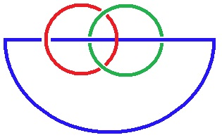 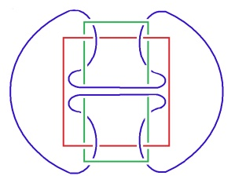 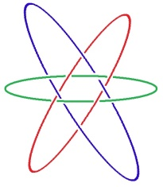 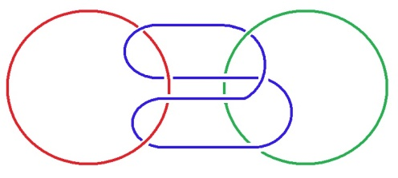

<!-- id: s21-09-0002 -->

Les deux premières figures, là, je me les suis tapées sans avoir besoin de plus de repères, vous allez voir que la troisième, tout à fait sur la droite, il a fallu que je me batte avec un petit papier à la main.

<!-- id: s21-09-0003 -->

Bon. Alors j’entre dans le vif du sujet, quoique j’aie bien sûr envie plutôt de parler d’autre chose. Dire par exemple que je n’ai pas à me plaindre, enfin que je donne...

<!-- id: s21-09-0004 -->

> du même coup que je vous donne, je m’en excuse ...je vous donne à manger du foin, c’est du foin tout ça. C’est des trucs qui s’entrecroisent et qui ne passent pas.

<!-- id: s21-09-0005 -->

De sorte que j’ai pas à me plaindre en ce sens que de deux choses l’une : \- ou on me rend mon foin tout de suite, c’est ce qui arrive...

<!-- id: s21-09-0006 -->

> mon foin tel quel, enfin c’est pas du tout quelque chose qu’on ne supporte pas,
>
> on me le ressert tel que je l’ai proposé ...c’est ce qui arrive à certains - et alors il y a des personnes, par exemple, que ce foin chatouille tellement à l’entrée de la gorge, qu’elles me vomissent du Claudel, par exemple. \[*Rires*\]

<!-- id: s21-09-0007 -->

C’est parce qu’elles l’avaient déjà là ! \[*Rires*\]

<!-- id: s21-09-0008 -->

Je suis embêté parce que la personne à qui j’ai fait vomir du Claudel a juste télépho­né, à Gloria naturellement, au moment, pour lui demander où se tenait mon séminaire. Je suis absolument désolé, j’espère qu’elle a fini par le savoir, elle est peut-être là ?

<!-- id: s21-09-0009 -->

En tout cas si elle n’est pas là, qu’on lui porte mes excuses, parce que Gloria l’a envoyée aux pelotes, et c’est pas du tout ce que j’aurais désiré : pourquoi est-ce qu’elle ne serait pas venue manger du foin avec tout le monde ? \[*Rires*\]

<!-- id: s21-09-0010 -->

Bon, eh ben mon foin en question, c’est ce que vous savez qui est à l’ordre du jour, par mon fait : c’est le nœud borroméen.

<!-- id: s21-09-0011 -->

Je peux dire que je suis gâté, parce qu’on vient de m’en apporter un, africain. C’est le nœud borroméen en personne.

<!-- id: s21-09-0012 -->

Il est... Je vous en certifie l’authenticité, parce que depuis le temps que je le manie, je commence à en connaître un bout.

<!-- id: s21-09-0013 -->

Et ça me plaît beaucoup, parce que s’il y a une chose autour de quoi je me casse la tête - j’ai même interrogé là-dessus - enfin c’est de savoir d’où ça vient. On l’appelle « *borroméen »*, c’est pas du tout qu’il y a un type qui un jour l’ait découvert, c’est bien entendu découvert depuis longtemps, et ce qui m’étonne c’est qu’on ne s’en soit pas plus servi, parce que c’était vraiment une façon de prendre ce que j’appelle *les* 3 *dimensions*.

<!-- id: s21-09-0014 -->

On les a prises autrement, il doit y avoir des raisons pour ça.

<!-- id: s21-09-0015 -->

Il doit y avoir des raisons pour ça, parce qu’on voit pas du tout pourquoi...

<!-- id: s21-09-0016 -->

> enfin, on voit pas au premier abord ...on voit pas pourquoi on n’aurait pas essayé de *serrer* le point...

<!-- id: s21-09-0017 -->

> de faire le *point*, si vous voulez ...avec ça plutôt qu’avec des choses qui se coupent. C’est un fait que ça ne s’est pas passé comme ça.

<!-- id: s21-09-0018 -->

Quel sort ça aurait eu si ça s’était passé comme ça, il est pro­bable que ça nous aurait dressés tout différemment.

<!-- id: s21-09-0019 -->

C’est pas du tout que ceux qu’on appelle « *les philosophes »*...

<!-- id: s21-09-0020 -->

> c’est-à-dire, mon Dieu, ceux qui essayent de dire quelque chose à nos États, enfin d’y répondre ...c’est pas du tout qu’on n’ait pas trace que ces his­toires de nœuds, justement, ça ne les ait pas intéressés.

<!-- id: s21-09-0021 -->

Parce qu’il y a vraiment très longtemps que des personnes qui se trouvent curieusement avoir, autant qu’on le sache, s’être classées depuis longtemps, autant qu’on le sache, parmi les femmes...

<!-- id: s21-09-0022 -->

enfin, ce que j’ap­pelle « les femmes », et c’est au pluriel comme vous le savez...

<!-- id: s21-09-0023 -->

enfin, il y en a quelques-uns qui sont là depuis longtemps ...que les femmes elles s’y entendent à ça, à faire des trames, des tissus.

<!-- id: s21-09-0024 -->

Et ça aurait pu mettre sur la voie.

<!-- id: s21-09-0025 -->

*C’est très curieux* que bien au contraire, ça ait inspiré plutôt intimidation.

<!-- id: s21-09-0026 -->

Aristote en parle, et *c’est très curieux* qu’il ne l’ait pas pris pour objet.

<!-- id: s21-09-0027 -->

Parce que ça aurait été un départ qui n’aurait pas été plus mauvais qu’un autre.

<!-- id: s21-09-0028 -->

Qu’est-ce qu’il y a, qu’est-ce qu’il y a qui fait que les nœuds, les nœuds, ça s’*imagine* mal ?

<!-- id: s21-09-0029 -->

Ça, comme ça \[*le nœud « africain »*\], parce que c’est fait d’une certaine façon, ça se soutient.

<!-- id: s21-09-0030 -->

Mais c’est une fois que c’est mis à plat que c’est pas commode à manier, et c’est probablement pas pour rien qu’avec ces nœuds c’est toujours des choses qui font tissu, c’est-à-dire qui font surface, qu’on a essayé de fabriquer.

<!-- id: s21-09-0031 -->

C’est probablement que la chose mise à plat - la surface c’est très lié, enfin, à toutes sortes d’utilisations. Oui...

<!-- id: s21-09-0032 -->

Que les nœuds s’imaginent mal, je vais tout de suite vous en donner une preuve. Bon !

<!-- id: s21-09-0033 -->

Vous faites une tresse, une tresse à deux.Vous n’avez pas besoin d’en faire beaucoup, il suffit que vous entrecroisiez une fois, puis une seconde : au bout de deux, vous retrouvez vos deux dans l’ordre.

<!-- id: s21-09-0034 -->

Nouez-les maintenant bout à bout, à savoir le même avec le même.

<!-- id: s21-09-0035 -->

Eh ben c’est noué, c’est même noué - on peut dire - deux fois : ça fait double boucle.

<!-- id: s21-09-0036 -->

Ça tient ensemble, les... ce que vous avez rejoint, c’est-à-dire, comme l’a un jour mis en titre de mon dernier *séminaire* de l’année dernière mon fidèle [Achate](http://fr.wikipedia.org/wiki/Achate) \[Ἀχάτης : *Akhátês*\], il a appelé ça « *les ronds de ficelle* ». Je ne sais pas si dans le texte j’avais appelé ça comme ça ou autrement, c’est probable que je l’avais appelé comme ça, mais il l’a mis en titre.

<!-- id: s21-09-0037 -->

Bien. Faites maintenant une tresse à 3. Avant que vous retrouviez, dans une tresse à 3, les 3 brins... appelons ça des brins, aujourd’hui, par exemple ...les trois brins dans l’ordre, il faut que vous fassiez 6 fois le geste d’entrecroiser ces brins, moyennant quoi, après que vous ayez fait 6 fois ce geste, vous retrouvez les 3 brins dans l’ordre.

<!-- id: s21-09-0038 -->

Et là, de nouveau, vous les joignez.

<!-- id: s21-09-0039 -->

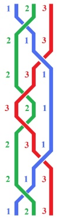

<!-- id: s21-09-0040 -->

Eh bien, c’est quand même quelque chose qui ne va pas de soi, qui ne s’imagine pas tout de suite : c’est que, si une fois ce nœud que je vous ai dit tout simplement être un nœud borroméen… à savoir tel qu’il est sous sa forme la plus simple, celui qui est là à gauche …ça ne va pas de soi qu’ayant tressé comme dans le premier cas, voyez à la fin du compte que ça tient d’un double nœud, ça ne va pas de soi qu’il suffise que vous rompiez un de ces brins pour que les deux autres soient libres.

<!-- id: s21-09-0041 -->

Parce que, au premier regard, ils ont l’air très bien tortillés l’un autour de l’autre, et on pourrait présumer qu’ils tiennent tout aussi bien que dans la tresse à 2. Eh bien pas du tout ! Voyez tout de suite qu’ils se séparent.

<!-- id: s21-09-0042 -->

Il suffit qu’on coupe un des 3 pour que les deux autres s’avèrent n’être pas noués.

<!-- id: s21-09-0043 -->

Et ceci reste vrai quel que soit le multiple de six dont vous poursuiviez la tresse.

<!-- id: s21-09-0044 -->

Il est bien certain en effet que, puisque vous avez retrouvé vos trois brins dans l’ordre au bout de six gestes de tressage, vous allez également les retrouver dans l’ordre quand vous en ferez six de plus.

<!-- id: s21-09-0045 -->

Ça vous donnera, si vous en faites six de plus ce nœud borroméen-là :

<!-- id: s21-09-0046 -->

<!-- id: s21-09-0047 -->

C’est-à-dire que ce que vous voyez ici passer une fois, à l’intérieur des deux autres nœuds, dont vous pouvez voir qu’ils sont...

<!-- id: s21-09-0048 -->

> c’est pour ça que je les ai présentés comme ça ...libres l’un de l’autre, vous faites ça, en réalité ici vous voyez, deux fois.

<!-- id: s21-09-0049 -->

Et c’est toujours un nœud dit *borroméen*, en ceci que quel que soit celui que vous rompiez, les 2 autres seront libres.

<!-- id: s21-09-0050 -->

Avec un tout petit peu d’imagina­tion, vous pouvez voir pourquoi, c’est parce que - prenons ces deux-ci par exemple, ils sont tels que - disons, pour dire des choses simples - qu’ils ne se coupent pas, qu’ils sont l’un au-dessus de l’autre.

<!-- id: s21-09-0051 -->

Vous pouvez vous apercevoir que c’est vrai pour chaque couple de deux. Bon.

<!-- id: s21-09-0052 -->

Voilà deux façons de faire le nœud borroméen, mais qui ne sont en réalité qu’une seule, c’est à savoir de les tresser un nombre indéfini de fois multiple de six, ça sera toujours un aussi authentique *nœud borroméen*.

<!-- id: s21-09-0053 -->

Je m’excuse pour ceux que ça peut fatiguer, ça a tout de même une fin, ce que je vous raconte là.

<!-- id: s21-09-0054 -->

Je voudrais seulement vous faire remarquer ceci : c’est que le compte n’est pas fait pour autant.

<!-- id: s21-09-0055 -->

Vous pouvez tresser aussi longtemps que vous voudrez...

<!-- id: s21-09-0056 -->

> pourvu que vous vous en teniez à un multiple de 6 ...aussi longtemps que vous voudrez, la tresse en question ce sera toujours un nœud borroméen.

<!-- id: s21-09-0057 -->

Déjà à soi tout seul, ça semble ouvrir la porte à une infinité de nœud borroméens. Eh ben, cette infinité...

<!-- id: s21-09-0058 -->

> déjà réalisée virtuellement puisque vous pouvez la concevoir ...cette infinité ne se limite pas là.

<!-- id: s21-09-0059 -->

Tel l’exemple que je vous en donne au tableau sous la forme de cette façon...

<!-- id: s21-09-0060 -->

> on ne peut pas dire que les instruments soient commodes ...sous la forme de cette façon de l’inscrire, c’est à savoir que vous voyez qu’ici la boucle, si je puis dire, est double, et que le nœud borroméen, s’il se réalise d’une façon que j’avais d’abord tracée d’une façon telle qu’on voie bien, *<u>en tirant d’ici</u>*, que ça fait nœud.

<!-- id: s21-09-0061 -->

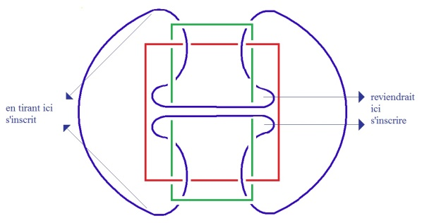

<!-- id: s21-09-0062 -->

Vous pourriez aussi bien le dessiner en faisant ici revenir la boucle dont vous voyez qu’elle passe sous un des niveaux de mes ronds de ficelle, et de revenir toutes les deux, elle ferait le tour, alors, d’un de ces ronds, et *<u>reviendrait ici s’inscrire</u>* en croisant par en dessous les deux boucles - qui se trouvent ici, à cause de l’arrangement, être parallèles – et donner une forme, en somme, en croix.

<!-- id: s21-09-0063 -->

Si vous arrangez le nœud borroméen de cette façon - j’espère que j’ai été...

<!-- id: s21-09-0064 -->

j’ai fait imaginer ce que pourrait être ce dessin, si vous voulez que je le trace, *je vous le trace­rai*.

<!-- id: s21-09-0065 -->

Il devient entièrement symétrique, et il a l’intérêt de nous représentifier sous une autre forme la matérialisation qu’il peut donner sous cette forme à *la symétrie*, précisément...

<!-- id: s21-09-0066 -->

> la symétrie, en deux mots, n’est-ce pas : *la*, *symétrie* ...d’un autre côté, c’est-à-dire de nous montrer qu’il y a une façon de présenter le nœud borroméen qui, dans son tracé même, nous impose le surgissement de la symétrie, à savoir du 2.

<!-- id: s21-09-0067 -->

Il n’y avait pas besoin d’aller si loin pour nous en apercevoir.

<!-- id: s21-09-0068 -->

C’est à savoir que, à simplement - je dirai - tirer sur cette partie du rond de ficelle, vous pouvez - ça, facilement - vous imaginer le résultat que ça va avoir, à savoir ce rond de droite \[*ici en vert*\] de le plier en deux.

<!-- id: s21-09-0069 -->

<!-- id: s21-09-0070 -->

À savoir, d’obtenir ce résultat qui se présente comme tel :

<!-- id: s21-09-0071 -->

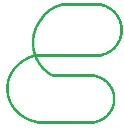

<!-- id: s21-09-0072 -->

Moyennant quoi, vous voyez que ce qui en résulte c’est ceci :

<!-- id: s21-09-0073 -->

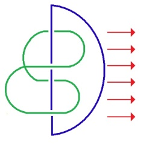

<!-- id: s21-09-0074 -->

À savoir :

<!-- id: s21-09-0075 -->

- qu’un des ronds tire le nœud plié en deux, la boucle pliée en deux, dans ce sens : → ,

<!-- id: s21-09-0076 -->

- tandis que l’autre se présente ainsi, que vous avez là, manifeste - peut-être d’ailleurs moins saillant à vos yeux - le quelque chose qui fait qu’à 3, ces nœuds vous ne pouvez pas les dénouer, mais qu’il suffit qu’un - un quelconque d’entre eux - manque pour que les 2 autres soient libres.

<!-- id: s21-09-0077 -->

C’est même une des façons les plus claires d’imager ceci que vous pouvez...

<!-- id: s21-09-0078 -->

> si vous faites passer à l’intérieur du nœud que j’appelle... de la boucle que j’appelle « *boucle pliée* »,
>
> si vous faites passer une autre boucle pliée de la même façon ...vous pourrez nouer un nombre indéfini de ces ronds de ficelle, et qu’il suffira qu’un *soit rompu*, qu’un *fasse défaut*, qu’un *manque*, pour que tous les autres se libèrent.

<!-- id: s21-09-0079 -->

Moyennant quoi, ce qui ne peut que vous venir à l’esprit, c’est que...

<!-- id: s21-09-0080 -->

> puisque ce que vous avez ajouté un nombre indéfini de fois,
>
> ce sont des nœuds pliés pris les uns dans les autres ...vous n’êtes pas forcés de terminer par ce que vous voyez ici fonc­tionner, à savoir un simple rond de ficelle.

<!-- id: s21-09-0081 -->

Vous pouvez boucler le cercle complet d’une façon qui fasse se fermer la chose, par un cercle plié.

<!-- id: s21-09-0082 -->

À savoir que, si vous en aviez plus de 3, il vous serait tout à fait facile d’imaginer que pour clore, c’est avec un de ces cercles pliés que vous feriez la clôture. Si vous faites la clôture avec trois, ce que vous obtenez, c’est justement très précisément ce résultat :

<!-- id: s21-09-0083 -->

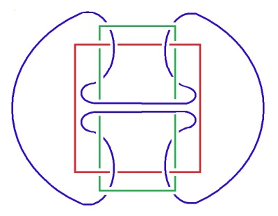

<!-- id: s21-09-0084 -->

À savoir qu’à partir de là vous pouvez réaliser cette boucle, c’est-à-dire que du maniement à 3 du nœud borroméen...

<!-- id: s21-09-0085 -->

> dont vous voyez qu’il peut fonctionner sur un beaucoup plus grand nombre ...du maniement à 3 vous faites surgir cette figure dont je vous ai dit qu’elle présentifiait *la symétrie dans le nœud borroméen* même, c’est-à-dire qu’elle y inscrit le 2.

<!-- id: s21-09-0086 -->

Ce qu’il faut souligner, avant de clore cette démonstration disons *figurée,* ce qu’il convient de souligner, c’est ceci : c’est que à chacun de ces 3 *ronds de ficelle*...

<!-- id: s21-09-0087 -->

> pour les appeler ainsi de la façon qui image le mieux ...à chacun de *ces ronds de ficelle* vous pouvez donner, par une manipulation suffisamment régulière...

<!-- id: s21-09-0088 -->

> vous ne pourriez pas vous étonner de la patience qu’il vous faudra ...à chacun des 3, à savoir *aussi bien à* *ce rond de ficelle là* \[*ici en rouge*\], *que ce rond de ficelle là* aussi \[*ici en vert*\], vous pouvez donner exactement la même place qui est celle que vous voyez ici figurée du 3ème.

<!-- id: s21-09-0089 -->

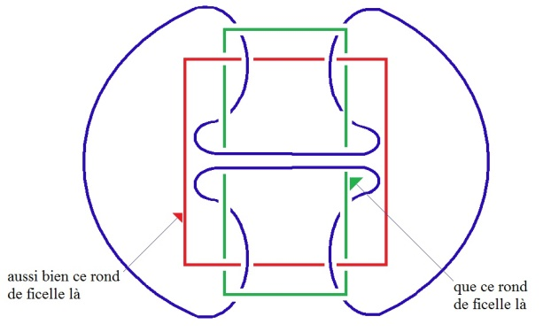

<!-- id: s21-09-0090 -->

À quoi donc me sert ce nœud, ce nœud borroméen à 3 ? Il me sert, si je puis dire à inventer la règle d’un jeu, de façon telle que puisse s’en figurer le rapport du *Réel* très proprement à ce qu’il en est de l’*Imaginaire* et du *Symbolique*.

<!-- id: s21-09-0091 -->

C’est à savoir que le *Réel*, au regard de ce que nous repérons dans une certaine expérience comme l’*Imaginaire* et le *Symbolique*, c’est ce qui en fait 3. Ça en fait 3 et rien de plus. Il est frappant que jusqu’ici il n’y ait pas d’exemple, qu’il y ait jamais eu un *dire* qui pose le *Réel*, non pas comme ce qui est 3ème car ça serait trop dire, mais ce qui - avec l’*Imaginaire* et le *Réel* - fait 3...

<!-- id: s21-09-0092 -->

avec l’*Imaginaire* et <u>le *Symbolique*</u>, fait 3 \[rectification du lapsus\].

<!-- id: s21-09-0093 -->

Ce n’est pas tout : par cette présentation ce que j’essaie d’accrocher, c’est une structure telle que le *Réel*, à se définir ainsi, soit le *Réel* « *d’avant l’ordre* », que *la nodalité* nous donne ce quelque chose qui, à le dire *d’avant l’ordre*  ne suppose nullement un 1er, un 2ème, un 3ème, et comme je viens de vous le souligner, même pas un « *moyen* » avec deux « *extrêmes »*.

<!-- id: s21-09-0094 -->

Car même dans la première forme du nœud borroméen, celle dont je vous ai montré qu’elle permet de figurer comme terme *moyen* \[en bleu\] nouant deux *extrêmes*, ce cercle plié, que je vous montre ici :

<!-- id: s21-09-0095 -->

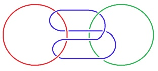

<!-- id: s21-09-0096 -->

Même dans ce cas, n’importe lequel des trois cercles peut jouer ce rôle.

<!-- id: s21-09-0097 -->

C’est-à-dire que ce n’est nullement lié, si ce n’est pour vous le faire imaginer.

<!-- id: s21-09-0098 -->

La figure de gauche n’était là que pour vous rendre accessible ceci, qu’il y a « *moyen* » dans le cercle plié, mais n’importe lequel des deux autres peut remplir la même fonction, les autres prenant dès lors la position d’extrêmes.

<!-- id: s21-09-0099 -->

À quoi ceci nous mène-t-il ?

<!-- id: s21-09-0100 -->

C’est à remarquer que si nous nous intéressons au 2, qui est bien le problème présentifié par quelque chose qui est vraiment, on peut le dire, *insistant* dans ce que nous livre l’expérience du discours analytique.

<!-- id: s21-09-0101 -->

Ce n’est pas pour rien qu’elle introduit ce 2 *par excellence* qu’est *l’amour de sa propre image*, c’est bien *l’essence de la symétrie* elle-même.

<!-- id: s21-09-0102 -->

Est-ce que *ceci* ne nous introduit pas...

<!-- id: s21-09-0103 -->

> « *ceci »* : ce nœud ! ...à cette considération que l’*Imaginaire* n’est pas ce qu’il y a de plus recommandé pour trouver la règle *du jeu de l’amour*.

<!-- id: s21-09-0104 -->

Ce qui s’en livre à l’expérience \[*analytique*\], si c’est marqué spécifiquement de la *représentation imaginaire*, comme nous sommes arrivés - de l’expérience elle-même - à nous le faire imposer : on s’*imagine* que l’amour c’est 2.

<!-- id: s21-09-0105 -->

Est-ce que c’est tellement prouvé, si ce n’est par l’expérience imaginaire ?

<!-- id: s21-09-0106 -->

Pourquoi est-ce que ça ne serait pas ce *moyen*...

<!-- id: s21-09-0107 -->

> comme d’ailleurs l’indique que c’est au niveau de ce *moyen* que se produit, cette fois, 2 fois 2 ...pourquoi est-ce que ce ne serait pas ce *moyen*...

<!-- id: s21-09-0108 -->

> dont je viens de vous souligner qu’il est d’ailleurs *gyrovague*, c’est-à-dire vagabond,
>
> qu’il peut aussi bien être rempli par un quelconque des trois ...pourquoi est-ce que ce ne serait pas ce *moyen* qui...

<!-- id: s21-09-0109 -->

> à se pourvoir d’une suspecte façon de cette forme, de cette forme d’image de lui-même ...ce *moyen* qui livrerait, correctement pensé - à savoir à travers le *Réel* de ces connections - le res­sort de ces nœuds ?

<!-- id: s21-09-0110 -->

En d’autres termes, est-ce que le nœud borroméen n’est pas le mode sous lequel se livre à nous

<!-- id: s21-09-0111 -->

- le Un du rond de ficelle comme tel,

<!-- id: s21-09-0112 -->

- le fait d’autre part qu’ils sont 3, ces 1, et que c’est à être noués - seulement à être noués - que nous est livré le 2.

<!-- id: s21-09-0113 -->

Il y a là beaucoup de considéra­tions où je pourrais m’égarer, si je puis dire, parce qu’elles ne serreraient pas encore de plus près ce caractère, si je puis dire *premier*, du trois. Il est *premier*, non pas au sens de ce qu’il serait le premier à être pre­mier...

<!-- id: s21-09-0114 -->

puisque comme chacun le sait *il y en a un autre* qui est dit tel ...mais s’il est dit tel le 2, c’est d’une façon qui est bien singulière, puisqu’il n’est pas dit, d’aucune façon, qu’on puisse y accéder à partir du *Un*.

<!-- id: s21-09-0115 -->

Ne serait-ce que de ceci que, comme on l’a remarqué depuis longtemps, dire « *qu’un et un ça fait deux »*, c’est du seul fait de la marque de l’addition - supposée réunion - c’est-à-dire déjà le 2. En ce sens, le 2 est quelque chose d’un ordre, si l’on peut dire, *vicieux*, puisqu’il ne repose que sur sa propre supposition : joindre - par 1 *+* 2 - 1, c’est déjà installer le 2.

<!-- id: s21-09-0116 -->

Mais tenons nous en simplement pour l’instant à ceci, c’est que ce que le nœud borroméen nous illustre, c’est que le 2 ne se produit que de la jonction de l’1 au 3. Ou plus exactement, disons que si l’on dit que - comme on l’a fait humoristiquement - que « *le numéro deux se réjouit d’être impair* » [^18]ce n’est certainement *pas sans raison*. S’il se réjouit, il aurait tort de se réjouir d’être impair, car s’il se réjouissait pour cela, ça serait dommage pour lui, il ne l’est sûrement pas.

<!-- id: s21-09-0117 -->

Mais qu’il soit engendré par les deux impairs 1 et 3, c’est en somme ce que le nœud borroméen nous fait *saillir*, si je puis dire.

<!-- id: s21-09-0118 -->

Vous devez tout de même bien sentir le rapport que cette élucubration a avec notre expérience analytique.

<!-- id: s21-09-0119 -->

Freud est assurément génial.

<!-- id: s21-09-0120 -->

Il est génial en ceci que ce que le discours analytique a fait saillir sous sa plume, c’est ce que j’appellerai « *des* *termes sauvages »*. Lisez *Psychologie des masses et Analyse du Moi* et très précisément au chapitre *L’identification,* pour saisir ce qu’il peut y avoir de génial dans la dis­tinction qu’il y formule de 3 sortes d’identifications, c’est à savoir :

<!-- id: s21-09-0121 -->

- celles que j’ai dénotées, que j’ai mises en valeur, du *trait unaire*, de l’*Einziger Zug,*

<!-- id: s21-09-0122 -->

- et la façon dont il les distingue de l’amour, en tant que porté à un terme, qui assurément, est bien celui qu’il s’agit pour nous d’atteindre, à savoir cette fonction de l’Autre en tant qu’elle est livrée par le père,

<!-- id: s21-09-0123 -->

- et d’un autre côté, l’autre forme, celle de l’identification dite *hystérique*, à savoir du désir au désir, en tant que toutes les trois, ces formes d’identification, il les distingue.

<!-- id: s21-09-0124 -->

Qu’ainsi présenté ça ne soit qu’un nœud d’énigmes, je dirai : raison de plus pour travailler, c’est-à-dire essayer de donner à cela une forme qui comporte un *algorithme* plus rigoureux. Cet *algorithme*, c’est précisément celui que je tente de livrer dans le 3 même, en tant que ce 3 comme tel, fait nœud.

<!-- id: s21-09-0125 -->

C’est évidemment la *raison*...

<!-- id: s21-09-0126 -->

> si je puis dire, *raison* pour travailler ...mais *raison* qui si je puis dire, n’est pas sans nous porter *tort*, non pas parce que les ronds de ficelle, c’est déjà une figure *torique*, sinon tordue, c’est bien plus loin encore : de ce fait très singulier que même la mathématique n’est pas arrivée à trouver encore l’algorithme, l’algorithme le plus simple, à savoir celui qui nous permettrait...

<!-- id: s21-09-0127 -->

> en présence, certes, d’autres formes de nœuds que celle du nœud borroméen ...de trouver ce quelque chose qui nous livrerait pour les nœuds, en tant qu’ils intéressent plus d’un rond de ficelle, car pour un seul rond de ficelle, se nouant à lui-même, elle l’a cet algorithme...

<!-- id: s21-09-0128 -->

> je pourrais facilement - je l’ai déjà fait - vous mettre au tableau la figure de quelque chose qui aurait à peu près
>
> le même aspect que la figure centrale, et qui ne serait néanmoins qu’un seul rond de ficelle.
>
> Je dis *à peu près* car évidemment elle ne serait pas pareille ...à *un seul* rond de ficelle, elle peut savoir ce qui est homéomorphique, à *plusieurs* ronds de ficelle l’algorithme n’est pas trouvé.

<!-- id: s21-09-0129 -->

Ce n’est pas pourtant une raison pour abandonner une tâche qui n’engage rien d’autre que ce 2 qui est ce qu’il y a de plus intéressé dans la figure de l’*amour* comme je viens de vous le rappeler.

<!-- id: s21-09-0130 -->

L’*amour* - j’espère que déjà vous vous sentez plus à l’aise - l’amour, c’est *passionnant*.

<!-- id: s21-09-0131 -->

Dire ça, c’est simplement dire une vérité d’expérience, *mais le dire comme ça*, ça n’a l’air de rien mais c’est quand même faire *un pas*. Parce que, pour qui a un petit peu ses esgourdes ouvertes, c’est pas du tout la même chose que de dire que c’est une passion.

<!-- id: s21-09-0132 -->

D’abord il y a des tas de cas où l’amour ce n’est pas une passion.

<!-- id: s21-09-0133 -->

Je dirai même plus : je mets en doute que ce soit jamais une passion.

<!-- id: s21-09-0134 -->

Je le mets en doute, mon Dieu, à cause de mon expérience.

<!-- id: s21-09-0135 -->

À cause de mon expérience, qui ne tient pas seulement à la mienne, je veux dire que mon expérience dans *le discours analytique* me donne assez de matériel \- pour quoi ? - pour qu’en somme je puisse me permettre de faire ce dont j’ai défini la dernière fois : *le savoir*, à savoir *l’inventer*.

<!-- id: s21-09-0136 -->

Ce qui ne vous met nullement à l’abri...

<!-- id: s21-09-0137 -->

> surtout si vous êtes en analyse avec moi ...de me le supposer, ce *savoir*, comme quelque chose que je n’inventerais pas.

<!-- id: s21-09-0138 -->

Mais si le *savoir*, même inconscient, est justement ce qui s’invente pour *suppléer* à quelque chose qui n’est peut-être que le mystère du 2, on peut voir qu’il y a quand même un pas de franchi à oser dire que *si l’amour est passionnant*, ce n’est pas qu’il soit *passif*.

<!-- id: s21-09-0139 -->

C’est un *dire* qui, comme tel, implique en lui-même une règle. Puisque dire que quelque chose est passionnant, eh bien, c’est en parler comme d’un *jeu*, où l’on n’est en somme « *actif* » qu’à partir des règles.

<!-- id: s21-09-0140 -->

Il y a quand même quelques personnes qui se sont aperçues de ça depuis longtemps.

<!-- id: s21-09-0141 -->

À propos de tout ce qui se dit, il y a un nommé Wittgenstein, particulièrement, qui s’est distingué là-dedans.

<!-- id: s21-09-0142 -->

Donc ce que j’avance c’est que ma formule là : *l’amour est passionnant*, si je l’avance c’est comme *strictement vrai*. Oui, *strictement vrai*. Il y a tout de même longtemps que j’ai marqué là-dessus quelques *réserves*, c’est-à-dire *que strictement vrai n’est jamais vrai qu’à moitié*, qu’on ne peut - le vrai - jamais que le *mi-dire*.

<!-- id: s21-09-0143 -->

Il faudra quand même qu’on arrive, qu’on arrive avant la fin de l’année - à formuler ce que ça comporte, et que je vous expliquerai plus tard.

<!-- id: s21-09-0144 -->

C’est que que tout mi-dire, mi-dire du vrai a la mort pour principe, car le vrai...

<!-- id: s21-09-0145 -->

> c’est quand même là quelque chose dont l’expérience analytique peut nous donner le contact ...*le vrai n’a aucune autre façon de pouvoir être défini que ce qui en somme fait que le corps va à la jouissance*, et qu’en ceci, ce par quoi il y est forcé, ce n’est pas autre chose que le principe, le principe par quoi le sexe est très spécifiquement lié à la mort du corps.

<!-- id: s21-09-0146 -->

Il n’y a que chez les êtres sexués que le corps meurt.

<!-- id: s21-09-0147 -->

Et ce forçage de la reproduction, c’est bien là à quoi sert le peu que nous pouvons énoncer de vrai.

<!-- id: s21-09-0148 -->

Je dirai même plus, comme il s’agit de la mort...

<!-- id: s21-09-0149 -->

> c’est même pour ça que nous n’avons jamais que la vrai-semblance, parce que cette mort, principe du vrai,
>
> cette mort chez l’être parlant en tant qu’il parle, c’est jamais que du chiqué ...la mort, vraiment, pour l’avoir devant soi, c’est pas à la portée du vrai.

<!-- id: s21-09-0150 -->

La mort le pousse. Pour l’avoir devant soi, pour avoir affaire à la mort, ça ne se passe qu’avec le *Beau* où là, ça fait touche.

<!-- id: s21-09-0151 -->

J’ai déjà démontré ça dans un temps, du temps où je faisais *L’éthique de la Psychanalyse,* et ça fait touche, pourquoi ?

<!-- id: s21-09-0152 -->

Parce que les choses étant dans un certain ordre rotatoire, ça fait touche en tant que ça glorifie le corps : là le principe est la jouissance.

<!-- id: s21-09-0153 -->

Ce qui est forcé, c’est le fait de la mort, et chacun sait... que ce soit au nom du corps que tout ça se produise, c’est bien ce que j’ai autrefois illustré de la tragédie d’*Antigone,* et ce qui curieusement est passé dans le mythe chrétien...

<!-- id: s21-09-0154 -->

> car je sais pas si vous vous êtes bien aperçus que ce pourquoi c’est fait, toute cette histoire, cette histoire du Christ qui ne parle que de la jouissance : ces « *lys des champs qui ne tissent ni ne filent* » - qui traverse, lui - le mythe l’affirme ! - la mort ...tout ça en fin de compte n’a de fin...

<!-- id: s21-09-0155 -->

> ce que nous voyons s’étaler sur des kilomètres de toile ...n’a de fin que de produire des *corps glorieux* dont on se demande ce qu’ils vont faire pendant l’éternité...

<!-- id: s21-09-0156 -->

> même mis en rond dans un cercle de théâtre ...ce qu’ils vont bien pouvoir faire à contempler on ne sait quoi.

<!-- id: s21-09-0157 -->

C’est tout de même curieux que ce soit par cette voie...

<!-- id: s21-09-0158 -->

> cette voie non pas du vrai, mais du *Beau* ...que ce soit par cette voie que se soit pour la 1ère fois manifesté le dogme de la *Trinité divine*, il faut dire que c’est un mystère ! C’est un mystère dont on s’est approché, mais pas sans un certain nombre de glissements.

<!-- id: s21-09-0159 -->

Si dans la logique d’Aristote, l’autre jour, je vous ai démontré l’irruption de je ne sais quelles théories de l’amour, de je ne sais quelles théories de l’amour où sont fort bien distingués l’amour et la jouissance, c’est déjà pas mal, hein ?

<!-- id: s21-09-0160 -->

C’est déjà pas mal, mais ça ne fait que *deux*, ça fait pas du tout une *trinité*.

<!-- id: s21-09-0161 -->

Mais c’est bien amusant de lire dans un traité de « *La Trinité »* d’un certain Richard de Saint Victor[^19], la même irruption incroyable du retour de l’amour : le Saint-Esprit considéré comme « *petit ami* », c’est quelque chose que je vous prie d’aller voir dans le texte, enfin, je vous le sortirai un jour, je ne vous ai pas traînés là ce matin parce que j’ai assez à dire aujourd’hui, mais ça vaut le coup de toucher ça.

<!-- id: s21-09-0162 -->

Comment est-ce que c’est par le *Beau*, que quelque chose qui est la vérité même, et qui plus est ce qu’il y a de vrai dans le *Réel*, à savoir ce que j’essaie d’articuler ce matin, comme ça, en boitant, c’est tout de même bien curieux. Oui...

<!-- id: s21-09-0163 -->

En quoi *le Symbolique, l’Imaginaire et le Réel*, est-ce quelque chose qui, au moins aurait la prétention d’aller un peu plus loin que ce tournage en rond de *la jouissance*, *du corps* et de *la mort *?

<!-- id: s21-09-0164 -->

Est-ce qu’il y a là quelque chose dont nous puissions atteindre mieux que ce que ce qu’il nous apparaît *comme signal, comme trace *?

<!-- id: s21-09-0165 -->

Je viens de parler du *Vrai*, du *Beau*, d’une façon qui pour tout dire nous les fait fonctionner comme *moyens* : il faudra que je traite ce qu’il en est du *Bien*.

<!-- id: s21-09-0166 -->

Est-ce que le *Bien*, dans cette histoire de nœud borroméen, ça peut se situer quelque part ?

<!-- id: s21-09-0167 -->

Je vous le dis tout de suite : il y a très peu de chances...

<!-- id: s21-09-0168 -->

Si le *Vrai* et le *Beau* n’ont pas tenu le coup, je vois pas pourquoi le *Bien* s’en tirerait mieux.

<!-- id: s21-09-0169 -->

La seule vertu que je vois sortir de cette interrogation...

<!-- id: s21-09-0170 -->

> et je vous l’indique là pendant qu’il en est temps, parce que, on ne la verra plus ...la seule vertu, si il n’y a pas de rapport sexuel, comme je l’énonce, c’est la *pudeur.*

<!-- id: s21-09-0171 -->

Voilà, c’est bien en quoi je trouve du génie à la personne qui a fait sortir une certaine *atterrita* sur la couverture de ma *Télévision* [^20], c’est que ça fait partie d’une scène où le personnage central, celui qui donne son sens à tout le tableau, c’est un démon, qui était parfaitement reconnu par les Anciens pour être le démon de la pudeur.

<!-- id: s21-09-0172 -->

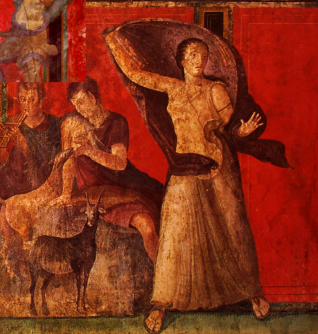

<!-- id: s21-09-0173 -->

Il est pas spécialement drôle, c’est même pour ça que la personne, l’*atterrita*, écarte les bras avec un peu d’affolement. Ouais… Alors, *les non-dupes errent*, c’est peut-être *les non-pudes errent*... \[*Rires*\] Moyennant quoi ça promet, hein.

<!-- id: s21-09-0174 -->

Ça promet parce que, comme d’autre part je pense que nous ne devons attendre de rien, absolument de rien, aucun progrès.

<!-- id: s21-09-0175 -->

J’ai dit ça comme ça, à une personne...

<!-- id: s21-09-0176 -->

> je vois pas du tout pourquoi je macherais mes mots ...j’ai dit ça à une personne qui a recraché *ce foin*, très gentiment, parce que c’est une personne qui n’a recraché, vraiment strictement *que le foin que je lui ai mis dans la bouche*. C’est pas plus mal qu’autre chose. C’est mon foin, quoi...

<!-- id: s21-09-0177 -->

Alors, ça ne veut quand même pas dire qu’il y ait pas des choses qui changent.

<!-- id: s21-09-0178 -->

Je suis en train d’interroger l’*amour*.

<!-- id: s21-09-0179 -->

Et je commence à lire des choses, comme ça, qui sont une petite approche, simplement je ne sais pas comment est-ce qu’il peut arriver... J’en dirai peut-être plus long.

<!-- id: s21-09-0180 -->

Si le résultat d’une extension du *discours psychanalytique*, puisque après tout je ne fais pas moins qu’à le considérer, mais *comme un chancre* !

<!-- id: s21-09-0181 -->

Je veux dire que ça peut foutre en l’air un tas de choses.

<!-- id: s21-09-0182 -->

Si le bien-dire n’est gouverné que par la pudeur, ben ça choque forcément.

<!-- id: s21-09-0183 -->

Ça choque mais ça ne viole pas la pudeur.

<!-- id: s21-09-0184 -->

Alors essayons de nous interroger sur ce qui pourrait arriver si on gagnait sérieusement de ce côté que « *l’amour c’est passionnant* », mais que ça implique qu’on y suive la règle du jeu. Bien sûr, pour ça, il faut la savoir. C’est peut-être ce qui manque : c’est qu’on en a toujours été là dans une profonde ignorance, à savoir qu’on joue un jeu dont on ne connaît pas les règles.

<!-- id: s21-09-0185 -->

Alors si ce *savoir* il faut l’inventer pour qu’il y ait *savoir*, c’est peut-être à ça que peut servir *le discours psychanaly­tique*.

<!-- id: s21-09-0186 -->

Seulement, si c’est *vrai* que « *ce qu’on gagne d’un côté on le perd de l’autre* », il y a sûrement un truc qui va écoper.

<!-- id: s21-09-0187 -->

C’est pas difficile à trou­ver : ce qui va écoper c’est *la jouissance*.

<!-- id: s21-09-0188 -->

Parce qu’à ce machin à l’aveugle qu’on poursuit sous le nom d’*amour*, la jouissance, ça, on n’en manque pas !

<!-- id: s21-09-0189 -->

On en a à la pelle ! Ce qu’il y a de merveilleux, c’est qu’on n’en sait rien, mais c’est peut-être le propre de la jouissance, justement, qu’on ne puisse jamais rien en savoir.

<!-- id: s21-09-0190 -->

Ce qui est tout de même surprenant c’est ça justement : qu’il n’y ait pas eu de discours sur la jouissance.

<!-- id: s21-09-0191 -->

On a parlé de tout ce qu’on veut, de « *substance étendue »*, de « *substance pensante »*, mais la première idée qui pourrait venir, à savoir que s’il y a quelque chose dont puisse se définir le corps, c’est pas la vie...

<!-- id: s21-09-0192 -->

> puisque la vie nous ne la voyons que dans des corps qui sont, après tout - quoi ? - des choses de *l’ordre des bactéries*,
>
> des choses qui foisonnent comme ça, enfin on en a rapidement trois kilos quand on a eu un milli­gramme…
>
> on ne voit pas bien quel rapport il y a entre ça et notre corps ...mais *que la définition même d’un corps, c’est que ce soit une substance jouissante*, comment est-ce que ça n’a été encore jamais énon­cé par personne ?

<!-- id: s21-09-0193 -->

C’est la seule chose, en dehors d’un mythe, qui soit vrai­ment accessible à l’expérience.

<!-- id: s21-09-0194 -->

Un corps jouit de lui-même, il en jouit bien ou mal, mais il est clair que cette jouissance l’introduit dans une dia­lectique où il faut incontestablement d’autres termes pour que ça tienne debout, à savoir rien de moins que ce nœud dont je vous... que je vous sers en tartine !

<!-- id: s21-09-0195 -->

Que la jouissance puisse écoper à partir du moment où l’*amour* sera quelque chose d’un peu civilisé, c’est-à-dire où on saura que ça se joue comme un jeu, enfin c’est pas sûr que ça arrive... c’est pas sûr que ça arrive, mais ça pourrait quand même venir à l’idée, si je puis dire. Ça pourrait d’autant plus venir à l’idée que il y en a des petites traces, comme ça.

<!-- id: s21-09-0196 -->

Il y a quand même une remarque que j’aimerais bien vous faire, concernant la pertinence de ce nœud  : c’est que dans l’amour, ce à quoi les corps tendent...

<!-- id: s21-09-0197 -->

> et il y a quelque chose de piquant que je vais vous dire après ...ce à quoi les corps tendent, c’est à se nouer.

<!-- id: s21-09-0198 -->

Ils n’y arrivent pas, naturellement, parce que - vous voyez bien - ce qu’il y a d’inouï, c’est qu’à un corps *ça arrive jamais à se nouer*.

<!-- id: s21-09-0199 -->

Il n’y a même pas trace de *nœud* dans le corps !

<!-- id: s21-09-0200 -->

S’il y a quelque chose qui m’a frappé au temps où je faisais de l’anatomie, c’était bien ça : je m’attendais tou­jours à voir au moins, comme ça, dans un coin, une artère, ou un nerf, quii - huipp ! – qui ferait ça...

<!-- id: s21-09-0201 -->

Rien! J’ai jamais rien vu de pareil !

<!-- id: s21-09-0202 -->

Et c’est même pour ça que l’anatomie, je dois vous le dire, m’a pendant deux ans passionné.

<!-- id: s21-09-0203 -->

Ça emmerde énormément les gens qui font leur médecine comme une corvée, moi pas !

<!-- id: s21-09-0204 -->

Naturellement, je ne m’en suis pas aperçu tout de suite que c’était pour ça que ça me pas­sionnait, je m’en suis aperçu après.

<!-- id: s21-09-0205 -->

On ne sait jamais qu’après.

<!-- id: s21-09-0206 -->

Et c’est absolument certain que ce que je cherchais dans la dissection, c’était de trouver un nœud. Ouais...

<!-- id: s21-09-0207 -->

En quoi ce nœud borroméen rejoint quand même le pourquoi du fait que l’amour c’est pas fait pour être abordé par l’*Imaginaire*.

<!-- id: s21-09-0208 -->

Parce que le seul fait que quand il bafouille...

<!-- id: s21-09-0209 -->

> faute de connaître la règle du jeu ...il articule les nœuds de l’amour.

<!-- id: s21-09-0210 -->

C’est quand même drôle que *ça en reste à la métaphore*, que ça n’éclaire pas, que ça ne donne pas l’idée que du côté de cette chose, dont je vous ai - j’espère, comme ça - un petit peu fait sentir le côté de consistance étran­ge, et le fait que ça surprend que le *Réel* - en fin de comp­te - ce n’est que ça : histoire de nœuds.

<!-- id: s21-09-0211 -->

Tout le reste ça peut se rêver, et Dieu sait si le rêve a de la place dans l’activité de l’être parlant.

<!-- id: s21-09-0212 -->

Je me laisse comme ça un tout petit peu aller, comme ça à faire des parenthèses...

<!-- id: s21-09-0213 -->

> vous me le pardonnerez, puisque vous me le pardonnez habituellement ...mais c’est quand même incroyable que la puissance du rêve ait été jusqu’à faire d’une fonction corporelle, le sommeil, un *désir*.

<!-- id: s21-09-0214 -->

Personne ne s’est encore... n’a jamais mis en relief que quelque chose qui est un rythme...

<!-- id: s21-09-0215 -->

enfin manifestement, puisque ça existe chez bien d’autres êtres que les êtres parlants... l’être parlant arrive à en faire un *désir*.

<!-- id: s21-09-0216 -->

Il lui arrive de poursuivre son rêve comme tel, et pour ça, de désirer ne pas se réveiller.

<!-- id: s21-09-0217 -->

Naturellement, il y a un moment où ça lâche.

<!-- id: s21-09-0218 -->

Mais que Freud ait pu aller jusque-là, c’est ce dont personne n’a vraiment relevé l’autonomie, l’originalité.

<!-- id: s21-09-0219 -->

Bon ! Ben revenons à nos nœuds métaphoriques.

<!-- id: s21-09-0220 -->

Est-ce que vous ne sentez pas que ce que j’essaye de faire - à y recourir – c’est à faire quelque chose qui ne comporterait *aucune supposition*.

<!-- id: s21-09-0221 -->

Parce que, on a passé son temps à poser, mais à ne jamais pouvoir poser, *qu’à supposer*.

<!-- id: s21-09-0222 -->

C’est-à-dire qu’on posait le corps - ça s’imposait - et on y supposait l’âme.

<!-- id: s21-09-0223 -->

Il fau­drait quand même...

<!-- id: s21-09-0224 -->

> ça c’est un machin, là comme ça, que j’ai brassé, parce qu’au niveau où j’étais dans cette *Télévision*,
>
> hein, de parler de l’âme et de l’inconscient ...l’inconscient, ça pourrait être tout à fait autre chose qu’un *supposé*, parce que *le savoir*...

<!-- id: s21-09-0225 -->

> si c’est vrai ce que j’en ai avancé la dernière fois ...c’est pas du tout forcé de le *supposer* : c’est un savoir en cours de construction.

<!-- id: s21-09-0226 -->

S’il arrivait, s’il arrivait que l’amour devienne un jeu dont on saurait les règles, ça aurait peut-être, au regard de la jouissance, beau­coup d’inconvénients. Mais ça la rejetterait - si je puis dire - vers son terme conjoint.

<!-- id: s21-09-0227 -->

Et si ce *terme conjoint* est bien ce que j’avance du *Réel* dont vous voyez, je me contente de ce mince petit support du *nombre* \- j’ai pas dit le chiffre - du *nombre* 3.

<!-- id: s21-09-0228 -->

Si l’amour - devenant un jeu dont on sait les règles - se trouvait un jour - puisque c’est sa fonction - au terme de ceci qu’il est un des *Uns* de ces trois, s’il fonctionnait à conjoindre *la jouissance du Réel* avec *le Réel de la jouissance,* est-ce que ce ne serait pas là quelque chose qui vaudrait le jeu ?

<!-- id: s21-09-0229 -->

*La jouissance du Réel*, ça a un sens, hein ?

<!-- id: s21-09-0230 -->

S’il y a quelque part *jouissance du Réel* comme tel, et si le *Réel* est ce que je dis, à savoir pour com­mencer le nombre 3.

<!-- id: s21-09-0231 -->

Et vous savez, c’est pas au 3 que je tiens : vous pourriez y ajouter 1416 que ce serait toujours le même nombre, pour ce qu’il me sert, et vous pourriez aussi l’écrire 2.718, c’est un certain logarithme népérien, ça joue le même rôle.

<!-- id: s21-09-0232 -->

Les seules gens qui *jouissent* de ce *Réel*, c’est les mathématiciens.

<!-- id: s21-09-0233 -->

Alors, il faudrait que les mathématiciens passent sous le joug du *jeu de l’amour*, qu’ils nous en énoncent un bout, qu’ils fassent un peu plus de travail sur le nœud borroméen...

<!-- id: s21-09-0234 -->

> car je dois vous l’avouer, j’en suis vraiment embarrassé, plus que vous ne pouvez croire ...je passe ma journée à en faire, des nœuds borroméens, pendant que c’est… là, comme ça, je tri­cote. \[*Rires*\]

<!-- id: s21-09-0235 -->

Seulement voilà, *la jouissance du Réel ne va pas sans le Réel de la jouissance*.

<!-- id: s21-09-0236 -->

Parce que pour que *Un* soit noué à l’autre, il faut que l’autre soit noué à *l’Un*.

<!-- id: s21-09-0237 -->

Et « *le Réel de la jouissance* » ça s’énonce comme ça, mais quel sens donner à ce terme *le Réel de la jouissance* ?

<!-- id: s21-09-0238 -->

C’est là que je vous laisse pour aujourd’hui, avec un point d’interro­gation.

## Notes

[^18]: Cf. « *Numero deus impare gaudet *»* : Le nombre impair plaît à la divinité. Virgile. Les bucoliques, VIII, 75.*

    Cf. André Gide : *Paludes* « *Tu me rappelles ceux qui traduisent : « N*umero deus *impare gaudet » par : Le numéro Deux se réjouit d'être impair, et qui trouvent qu'il a bien raison. Or s'il était vrai que l'imparité porte en elle quelque essence de bonheur, - je dis de liberté - on devrait dire au nombre Deux : mais, pauvre ami, vous ne l'êtes pas, impair ; pour vous satisfaire de l'être, tâchez au moins de le devenir.* » Cf. aussi l’analyse logique qu’en a fait André Gide dans *Traité de la contingence,* paru en 1895 (Paris, Librairie de l’Art indépendant, 11 rue de la Chaussée-d’Antin). Cf. Lacan Écrits p.459 (ou t.1 p.457), Situation de la psychanalyse et formation du psychanalyste en 1956.

[^19]: Richard de Saint-Victor : *La trinité*, Les éditions du cerf, 1999 ( éd. bilingue).

[^20]: Jacques Lacan : *Télévision*, Le Seuil, 1974. En couverture : « La femme terrifiée », Villa des mystères, Pompéi.
