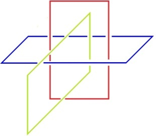

# Leçon 10 | 19 Mars 1974

<!-- source-url: http://staferla.free.fr/S21/S21 NON-DUPES....docx -->
<!-- seminar: s21 -->
<!-- lesson: 10 -->

<!-- id: s21-10-0001 -->

Quoi que je dise...

<!-- id: s21-10-0002 -->

> je dis « *je* » parce que je m’y suppose, à ce dire,
>
> dont pourtant il y a de fait qu’il soit de ma voix ...quoi que je dise, ça va faire surgir deux versants : un bien et un mal.

<!-- id: s21-10-0003 -->

C’est justement de ce qu’on m’a attribué de vouloir

<!-- id: s21-10-0004 -->

- que l’*Imaginaire* ce soit « *caca, bobo* » : un mal,

<!-- id: s21-10-0005 -->

- et que ce qui serait bien serait le *Symbolique*.

<!-- id: s21-10-0006 -->

Me revoilà donc à for­muler une éthique.

<!-- id: s21-10-0007 -->

C’est de ça que je veux dissiper le malentendu par ce que cette année je vous avance de cette structure de nœud, où je mets l’accent sur ceci : que c’est du **3** que s’y introduit le *Réel*.

<!-- id: s21-10-0008 -->

Tout ceci n’empêche pas que ce nœud lui-même, il est singulier.

<!-- id: s21-10-0009 -->

Si ce que j’ai la dernière fois avancé est vrai...

<!-- id: s21-10-0010 -->

> renseignez-vous auprès des mathématiciens ...c’est à savoir que ce nœud si simple, ce nœud à 3, l’*algorithme*...

<!-- id: s21-10-0011 -->

> à savoir ce qui permettrait d’y apporter ce à quoi le *Symbolique* aboutit,
>
> à savoir la démonstration, l’articulation en termes de vérité ...si cet *algorithme*, nous en sommes réduits à y constater notre échec, notre échec à l’établir, à le manier.

<!-- id: s21-10-0012 -->

D’où il résulte qu’au moins jus­qu’à nouvel ordre, ces nœuds...

<!-- id: s21-10-0013 -->

> ces nœuds dont je puis faire l’écriture, je vous l’ai fait la dernière fois, sous plus d’une forme ...vous en êtes réduits, sur la base de cette écriture, à l’imaginer dans l’espace.

<!-- id: s21-10-0014 -->

<!-- id: s21-10-0015 -->

C’en est même au point que si ce que je peux faire sous sa forme la plus simple : ces nœuds, projetés comme je vais vous montrer, ils tiennent de ce qu’ici ce que je vous dessine c’est quelque chose que vous pouvez imaginer, à savoir en quoi cette 3ème boucle, de s’instaurer d’un trajet de ces deux nœuds indépendants, vous y voyez, c’est-à-dire l’imagi­nez...

<!-- id: s21-10-0016 -->

> de ces deux nœuds indépendants, qui fait ce nœud triple, que j’ap­pelle le nœud borroméen ...ceci qui ainsi représenté vous est imaginable dans l’espace, vous pouvez le voir...

<!-- id: s21-10-0017 -->

> tout aussi bien que n’importe quelle autre façon que j’aurais eue d’écrire ce nœud ...vous pouvez constater que *c’est aussi une écriture*, à savoir :

<!-- id: s21-10-0018 -->

- qu’en en effaçant *un*, je pourrais cal­culer que les deux autres sont libres, je veux dire : *un* quelconque,

<!-- id: s21-10-0019 -->

- que ce qui fait *imaginaire*, dans la façon dont ici vous pouvez sentir que dans l’espace ils sont tenus, que ceci même est *écriture*, car il suffit que vous en effaciez un pour pouvoir repérer que les deux autres sont libres, à ce seul titre qu’ils se recoupent d’une certaine façon, qui elle est nommable de ceci : c’est à savoir que le dessus et le dessous forment deux couples appariés de ce que les 2 *dessus* se suivent, et que les 2 *dessous* ne sont pas sur la même ligne.

<!-- id: s21-10-0020 -->

Je veux dire qu’ils se succè­dent par rapport aux deux dessus, qu’il y a un tour qui veut que pour démontrer que deux de ces cercles sont libres, il suffit qu’il y ait 2 dessus qui se suivent, puis 2 dessous qui viennent après - j’ai dit *sur la même ligne* – j’ai probablement tout à l’heure fait une erreur en disant qu’elles ne sont pas sur la même ligne, c’est un *lapsus*.

<!-- id: s21-10-0021 -->

L’énigme de *l’écriture en tant que mise à plat*, est là : c’est qu’aussi bien, à tracer ce qui est essentiellement de l’ordre de l’imagi­nable, à savoir cette projection dans l’espace, c’est encore une *écriture* que je fais, à savoir ce qui est énonçable, énonçable de cet algorithme, ici le plus simple, à savoir une succession.

<!-- id: s21-10-0022 -->

Ce coinçage, à savoir qu’à l’imaginer vous retrouvez l’idée de la norme, que la norme est imaginable dès qu’il y a *support d’image*, et que là nous sommes toujours amenés à en privilégier une, une imagination de ce qui fait bonne forme.

<!-- id: s21-10-0023 -->

Curieuse rechute, pourquoi la « forme » est-elle dite « *bonne* » ?

<!-- id: s21-10-0024 -->

Car, après tout, pourquoi ne l’aurait-on pas appelée sim­plement pour ce qu’elle est, à savoir « *belle* » ?

<!-- id: s21-10-0025 -->

Nous reglissons, avec l’antique χαλός ἀγαθός \[calós ágathós\] dans cette ambiguïté...

<!-- id: s21-10-0026 -->

> qui elle, s’avoue à cette date, à la date où c’était ainsi que les Grecs s’exprimaient ...et qu’en fin de compte ce qu’on retrouve toujours, c’est le titre de noblesse, l’ancien­neté de la famille, ce qui, comme vous le savez, est pour le généalogiste toujours trouvable pour n’importe quel imbécile et donc aussi pour n’importe quelle imbécilité.

<!-- id: s21-10-0027 -->

Je ne vois pas pourquoi je m’empêcherais d’*imaginer* quoi que ce soit, si cette *imagination* est *la bonne*, et ce que j’avance c’est que la *bonne*, elle ne se certifie que de pouvoir se démontrer, se démontrer *au Symbolique*, ce qui veut dire *à l’intituler Symbolique, à une certaine démantibulation de lalangue*, en tant qu’elle fait accéder - à quoi ? - à *l’in­conscient*.

<!-- id: s21-10-0028 -->

L’*Imaginaire* n’en reste pas moins ce qu’il est, à savoir d’*or*, (*d apostrophe, o, r*), et ceci est à entendre qu’il dort (*d,o,r,t*), il dort, si je puis dire, au naturel.

<!-- id: s21-10-0029 -->

Ceci dans la mesure où je ne le réveille pas spécialement, sur le point des éthiques précédentes.

<!-- id: s21-10-0030 -->

Trop soucieux que je suis de celle...

<!-- id: s21-10-0031 -->

> de cette éthique nom­mément avec quoi je voudrais rompre ...celle du *Bien*, précisément.

<!-- id: s21-10-0032 -->

Mais comment faire

<!-- id: s21-10-0033 -->

- si *réveiller* c’est dans l’occasion *rendormir*,

<!-- id: s21-10-0034 -->

- si dans l’*Imaginaire*, il y a quelque chose qui nécessite le sujet à dormir ?

<!-- id: s21-10-0035 -->

Rêver n’a pas seulement dans *lalangue, lalangue* dont je me sers, cette étonnante propriété de structurer le réveil, il structure aussi la rêve-olution, et la révolution, si nous l’entendons bien, ça va plus fort que le rêve.

<!-- id: s21-10-0036 -->

Quelquefois c’est le rendormissement, mais cataleptique.

<!-- id: s21-10-0037 -->

Il fau­drait arriver à ce que je promeuve, que je fasse entrer pour vous dans vos cogitations ceci : *que l’Imaginaire est la prévalence donnée à un besoin du corps, qui est de dormir*.

<!-- id: s21-10-0038 -->

Ce n’est pas que le corps - le corps de l’être parlant - ait plus besoin du sommeil que les autres animaux...

<!-- id: s21-10-0039 -->

> sans que nous sachions d’ailleurs toujours en donner le signe ...que les autres animaux qui, eux, fonctionnent *avec* le sommeil.

<!-- id: s21-10-0040 -->

La fonction de som­meil, d’hypnose, chez l’être parlant, ne prend cette prévalence...

<!-- id: s21-10-0041 -->

dont j’ai parlé pour l’identifier à l’ *Imaginaire* même ...ne prend cette prévalence que de l’effet de cette *nodalité* qui ne noue le *Symbolique* à l’ *Imaginaire*...

<!-- id: s21-10-0042 -->

> mais aussi bien vous pourriez là mettre n’importe quel autre couple des trois ...ne les noue *<u>que</u> de l’instance du* **3** en tant que je la fais celle du *Réel*.

<!-- id: s21-10-0043 -->

Si donc je vous réveille, à l’endroit de ce dont tout de même notre antique χαλός ἀγαθός \[calós ágathós\] nous permet de dater la formule dans « *le Souverain Bien* » d’Aristote.

<!-- id: s21-10-0044 -->

Quand j’ai fait « *L’éthique de la psychanalyse »,* c’est à l’« *Éthique à Nicomaque »* que je me suis référé comme départ, mais je me suis gardé là-dessus de *réveiller*.

<!-- id: s21-10-0045 -->

Car si je réveille à l’*Imaginaire* manifeste de ce *Souverain Bien*, que ne vont-ils pas rêver ?

<!-- id: s21-10-0046 -->

Non pas qu’il n’y a pas de *Bien*, ce qui les entraînerait un tout petit peu trop loin pour leur bien-être, mais qu’il n’y a pas de *souverain*, moyen­nant quoi le *souverain* effectif, celui qui sait user du nœud, trouve son affaire parce que c’est par là que le sommeil se fait désirer assez, à ceux pour qui il rencontre chez eux la complicité du rêve, à savoir le désir que ça continue à bien dormir.

<!-- id: s21-10-0047 -->

Il convient donc que tout énoncé se garde...

<!-- id: s21-10-0048 -->

> justement en ce qu’il *rêve-olutionne...*de main­tenir le règne de ce à quoi il réveille.

<!-- id: s21-10-0049 -->

*Petite parenthèse*, puisque aussi bien cela n’est pas aisé à comprendre, comme motif de ce discours dans lequel je me trouve pris, du fait d’en être le sujet de par mon *expérience*, l’expérience dite *analytique*.

<!-- id: s21-10-0050 -->

Bien sûr y a-t-il ceux qui...

<!-- id: s21-10-0051 -->

> pour ce que cette expérience, ils ne la met­tent pas au pied du mur, ils ne s’y exposent pas comme telle ...ont tout de même soupçon de quelque chose qui les démange.

<!-- id: s21-10-0052 -->

Les simplement « *démangés* » n’ont pas beaucoup d’imagination.

<!-- id: s21-10-0053 -->

Quand ils flairent quelque chose des suites de mon discours, ils dégottent quelque trait biogra­phique, par exemple ceci : que j’ai fréquenté les surréalistes, et que mon discours en porte la trace.

<!-- id: s21-10-0054 -->

Il est tout de même curieux qu’avec lesdits *surréalistes*, je n’ai jamais collaboré.

<!-- id: s21-10-0055 -->

Si j’avais dit ce que je pensais, à savoir qu’avec le langage, je veux dire : en s’en servant, ce qu’ils démolis­saient c’était l’*Imaginaire*, qu’est-ce que je n’aurais pas produit !

<!-- id: s21-10-0056 -->

Je les aurais peut-être réveillés.

<!-- id: s21-10-0057 -->

Réveillés simplement en sursaut à ceci, que je me serais trouvé bel et bien dire, *c’est que de l’un à l’autre, de l’Imaginaire au Symbolique,* dont justement ils ne soupçonnaient pas l’existence, *ils rétablissaient l’ordre*.

<!-- id: s21-10-0058 -->

Est-ce que je peux vous faire entendre que le sort de l’être parlant, c’est qu’il ne peut même pas dire « *J’ai bien dormi* »...

<!-- id: s21-10-0059 -->

> c’est-à-dire du sommeil profond ... « *j’ai bien dormi de telle heure à telle heure* », pour la simple raison qu’il n’en sait rien, ses rêves encadrant ce sommeil profond ayant consisté dans le désir de dormir.

<!-- id: s21-10-0060 -->

C’est seulement à l’extérieur, à savoir : lui \[\[*l’être parlant*\], soumis à l’observation d’un électroencéphalo­gramme, par exemple, que peut se dire, qu’effectivement de telle heure à telle heure, le sommeil était profond, c’est-à-dire pas habité de rêves, ces rêves dont je dis qu’ils sont le tissu de l’*Imaginaire*, qu’ils sont le tissu de l’*Imaginaire* en tant que c’est d’être pris dans le nœud - ce *Réel* - que son besoin, son besoin principal devient cette fonction élue : la fonction de dormir.

<!-- id: s21-10-0061 -->

Ce passage de l’*Imaginaire* au crible du *Symbolique*, suffit-il à donner, à l’énoncer le premier, celui de *l’Imaginaire,* *le tampon « bon », « bon pour le service ». Le service de quoi ?*

<!-- id: s21-10-0062 -->

Je ne crois pas forcer la note en posant cette question, puisqu’il faut bien le dire : personne n’a jamais approché cette question sans soulever par quelque bout une idée de sou­veraineté, c’est-à-dire de subordination. C’est vrai que le *Bien* ne peut être dit que *souverain*.

<!-- id: s21-10-0063 -->

Est-ce que vous ne sentez pas que c’est là que se dénonce quelque chose comme une infirmité : je fais appel à ceux qui justement ont l’*Imaginaire* éveillé, à condition que ça ne supporte chez eux aucun espoir, car il est tout à fait entendu que je ne dis, moi, rien de tel, mais que je ne dis pas le contraire non plus : à savoir que le *Bien* est *souverain*.

<!-- id: s21-10-0064 -->

De sorte que ledit *Imaginaire*, mon *dire* de nos jours y opère certes, mais que ce n’est pas par là qu’il l’attaque, il dit seule­ment que l’*Imaginaire*, c’est ce par quoi le corps cesse de rien dire, qui vaille de s’écrire autrement que : « *J’ai dormi de telle heure à telle heure* ».

<!-- id: s21-10-0065 -->

Tout ça ne change rien au fait que ça démange.

<!-- id: s21-10-0066 -->

La vérité démange même ceux que, sans trop y croire, j’appelle « *les* *canailles »*, parce qu’en fin de compte il suffit que *la vérité* démange pour que ça touche au *vrai* par quelque biais.

<!-- id: s21-10-0067 -->

« *Dites n’importe quoi, ça touchera toujours au vrai. Si ça ne touche pas au vôtre, pourquoi ça ne toucherait-il pas au mien ?* »

<!-- id: s21-10-0068 -->

Voilà le principe du *discours analytique*, et c’est en cela que j’ai dit quelque part, et à quelqu’un qui a fait, ma foi, un fort joli petit bouquin sur le transfert, c’est le nommé Michel Neyraut.

<!-- id: s21-10-0069 -->

En quoi je lui ai dit que com­mencer comme il le fait par ce qu’il appelle le « *contre-transfert* », si par là il veut dire en quoi *la vérité* touche l’analyste lui-même, il est sûrement dans la bonne voie, puisque après tout c’est là que le *vrai* prend son importance primaire, et que...

<!-- id: s21-10-0070 -->

> comme je l’ai fait remarquer depuis long­temps ...il n’y a qu’un transfert, c’est celui de l’analyste, puisqu’après tout c’est lui qui est *le sujet supposé au savoir*.

<!-- id: s21-10-0071 -->

Il devrait bien savoir à quoi s’en tenir là-dessus, sur son rapport au savoir, jusqu’où il est régi par la struc­ture inconsciente qui l’en sépare de ce savoir, qui l’en sépare bien qu’en sachant un bout, et je le souligne :

<!-- id: s21-10-0072 -->

- autant par l’épreuve qu’il en a faite dans sa propre analyse,

<!-- id: s21-10-0073 -->

- que par ce que mon *dire* peut lui en porter.

<!-- id: s21-10-0074 -->

Est-ce à dire que le transfert ce soit l’entrée de *la vérité* ?

<!-- id: s21-10-0075 -->

C’est l’entrée de quelque chose qui est *la vérité*, mais *la vérité* dont jus­tement le transfert est la découverte : *la vérité de l’amour*.

<!-- id: s21-10-0076 -->

La chose est notable : le savoir de l’incons­cient s’est révélé, s’est construit...

<!-- id: s21-10-0077 -->

> c’est bien le prix de ce petit livre, c’est son seul prix d’ailleurs, mais ça vaut qu’on l’achète ...la vérité de l’incons­cient, c’est-à-dire la révélation de l’inconscient comme savoir, cette révé­lation de l’inconscient s’est faite de façon telle que *la vérité de l’amour*, à savoir le transfert, n’y a fait qu’irruption.

<!-- id: s21-10-0078 -->

Elle est venue en second, et on n’a jamais bien su l’y faire rentrer, si ce n’est sous la forme du malenten­du, de la chose imprévue, de la chose dont on ne sait que faire, si ce n’est de dire qu’il faille la réduire, voire même la liquider.

<!-- id: s21-10-0079 -->

Cette remarque à elle toute seule justifie qu’un petit livre sache le faire valoir, car aussi bien faut-il se pénétrer de ceci, que de l’expérience analy­tique, *le transfert*,

<!-- id: s21-10-0080 -->

- c’est ce qu’elle expulse,

<!-- id: s21-10-0081 -->

- c’est ce qu’elle ne peut sup­porter qu’à en avoir de forts maux d’estomac.

<!-- id: s21-10-0082 -->

*L’amour*, s’il passe ici par cet étroit défilé de ce qui le cause, et de ce fait révèle ce qu’il en est de sa véritable nature, voilà-t-il pas qui vaille qu’on en répète *la question* ?

<!-- id: s21-10-0083 -->

Car il est difficile de ne pas avouer que *l’amour* ça tient une place, même si jusqu’ici on en a été réduit à - comme on dit – « *lui rendre ses devoirs* ».

<!-- id: s21-10-0084 -->

Avec *l’amour *:

<!-- id: s21-10-0085 -->

- on s’acquitte,

<!-- id: s21-10-0086 -->

- on lui verse une obole,

<!-- id: s21-10-0087 -->

- on tente de tous les moyens de lui permettre de s’éloigner, de se tenir pour satisfait.

<!-- id: s21-10-0088 -->

Comment donc l’aborder ?

<!-- id: s21-10-0089 -->

J’ai promis, à Rome, pour je ne sais plus quel jour, de faire une conférence sur « *l’amour et la logique* ».

<!-- id: s21-10-0090 -->

C’est bien en la préparant que je me suis aperçu de l’énormité, en somme, de ce que supporte mon discours, car il n’y a à peu près rien qui m’ait paru dans le passé en rendre compte.

<!-- id: s21-10-0091 -->

C’est là que je m’aperçois qu’en fin de compte, ce n’est pas pour rien que Freud, dans ce que je citais la dernière fois, à savoir l’intitulé de la *Psychologie* dite justement *des masses et l’Analyse du Moi,* en signalant que l’*identification*, là il la confronte à l’*amour*, et sans le moindre succès, pour essayer de rendre passable que l’*amour* participe en quoi que ce soit de l’*identification*.

<!-- id: s21-10-0092 -->

Simplement, là s’indique que l’*amour* a affaire à ce que j’ai isolé du titre du « *Nom du père* ». C’est bien étrange.

<!-- id: s21-10-0093 -->

Le *Nom du père*...

<!-- id: s21-10-0094 -->

auquel j’ai fait tout à l’heure l’allusion ironique qu’on sait, à savoir qu’il aurait rapport à l’ancienneté de la famille ...qu’est-ce que ça peut être ? Qu’est-ce que là-dessus l’*Œdipe*, le dit « *Œdipe »* nous apprend ?

<!-- id: s21-10-0095 -->

Eh bien, je ne pense pas que ça puisse s’aborder de front.

<!-- id: s21-10-0096 -->

C’est pour­quoi, dans ce que j’ai projeté aujourd’hui de vous dire...

<!-- id: s21-10-0097 -->

> ceci sans doute au titre d’expérience qui m’avait moi-même fatigué ...je voudrais vous montrer comme se monnaye ce nom, ce nom qu’en peu de cas nous ne voyons pas au moins refoulé.

<!-- id: s21-10-0098 -->

Il ne suffit pas, pour porter ce nom, que *celle* de qui s’incarne l’Autre...

<!-- id: s21-10-0099 -->

> l’Autre comme tel, l’Autre avec un grand A ...*celle,* dis-je, *de qui l’Autre s’incarne*...

<!-- id: s21-10-0100 -->

> ne fait que s’incarner d’ailleurs, incarne la voix ...à savoir la mère,

<!-- id: s21-10-0101 -->

- la mère parle,

<!-- id: s21-10-0102 -->

- la mère par laquelle *la parole* se transmet,

<!-- id: s21-10-0103 -->

- la mère - il faut bien le dire - en est réduite, ce *nom,* à le traduire par un *non* (*n,o,n*) justement, le *non* que dit le père.

<!-- id: s21-10-0104 -->

Ce qui nous introduit au fondement de la négation : est-ce que c’est la même négation qui fait cercle dans un monde \[: §\], qui à définir quelque essence...

<!-- id: s21-10-0105 -->

> essence de nature universelle : soit ce qui se supporte du *tout* ...juste­ment rejette, rejette quoi hors du « *tout* », mené de ce fait à la fiction d’un complément au *tout*, et fait à « *tout homme »* \[; !\] répondre de ce fait ce qui est « *non-homme* » \[: §\] ?

<!-- id: s21-10-0106 -->

Est-ce qu’on ne sent pas qu’il y a une béance de ce « *non*  » logique au « *dire-non* » ?

<!-- id: s21-10-0107 -->

Au *« dire-non »* propositionnel, dirais-je, pour le supporter.

<!-- id: s21-10-0108 -->

À savoir ce que je fais fonctionner dans mes schèmes de l’identification sexuelle.

<!-- id: s21-10-0109 -->

C’est à savoir que *tout homme* ne peut s’avouer dans *sa jouissance*\[; !\]...

<!-- id: s21-10-0110 -->

> c’est-à-dire dans son essence phallique pour l’appe­ler par son nom ...que *tout homme* n’y parvient, qu’à se fonder sur cette exception de quelque chose, le père, \[: §\] en tant que propositionnellement, il *dit non* à cette essence.

<!-- id: s21-10-0111 -->

Le défilé du signifiant par quoi passe, à l’exercice, ce *quelque chose* qui est *l’amour*, c’est très précisément ce « *Nom du Père* ».

<!-- id: s21-10-0112 -->

Ce *Nom du Père* qui n’est *non* (*n.o.n.*) qu’au niveau du *dire*, et qui se monnaye par la voix de la mère dans le *dire-non* d’un certain nombre d’interdictions, ceci dans le cas heureux : celui où la mère veut bien, de sa petite tête, enfin proférer quelques [*nutations*](http://fr.wikipedia.org/wiki/Nutation).

<!-- id: s21-10-0113 -->

Il y a quelque chose dont je voudrais désigner l’incidence.

<!-- id: s21-10-0114 -->

Parce que c’est le biais d’un moment qui est celui que nous vivons dans l’histoire : il y a une histoire quoique ce ne soit pas forcément celle qu’on croit.

<!-- id: s21-10-0115 -->

Ce que nous vivons est très précisément ceci : que curieusement *la perte *, la perte de ce qui se supporterait de la dimension de l’amour...

<!-- id: s21-10-0116 -->

> si c’est bien celle non pas que je dis, je ne peux pas la dire ...à ce *Nom du Père* se substitue une fonction qui n’est autre que celle du « *nommer-à* ».

<!-- id: s21-10-0117 -->

Être « *nommé-à »* quelque chose, voilà ce qui point dans un *ordre* qui se trouve effectivement se substituer au *Nom du Père*.

<!-- id: s21-10-0118 -->

À ceci près qu’ici, la mère généralement suffit à elle toute seule

<!-- id: s21-10-0119 -->

- à en désigner le projet,

<!-- id: s21-10-0120 -->

- à en faire la trace,

<!-- id: s21-10-0121 -->

- à en indiquer le chemin.

<!-- id: s21-10-0122 -->

Si *le désir de l’homme* je l’ai défini pour être *le désir de l’Autre*, c’est bien *là* que ça se désigne dans l’expérience.

<!-- id: s21-10-0123 -->

Et même dans les cas où - comme ça, par hasard, enfin - il se trouve que par un accident elle n’est plus là, c’est quand même elle, son désir, qui désigne à son moutard ce projet qui s’exprime par le « *nommer-à »*.

<!-- id: s21-10-0124 -->

Être *nommé-à* quelque chose, voilà ce qui, pour nous, à ce point de l’histoire où nous sommes, se trou­ve préférer...

<!-- id: s21-10-0125 -->

> je veux dire effectivement préférer, passer avant ...ce qu’il en est du *Nom du Père*.

<!-- id: s21-10-0126 -->

Il est tout à fait étrange que là, le social prenne une prévalence de nœud, et qui littéralement fait la trame de tant d’existences, c’est qu’il détient ce pouvoir du *nommer-à*, au point qu’après tout, *s’en restitue un ordre, un ordre qui est de fer*.

<!-- id: s21-10-0127 -->

Qu’est-ce que cette *trace* désigne comme retour du *Nom du Père* dans le *Réel*, en tant précisément que le *Nom du Père* est *verworfen, forclos*, *rejeté*, et qu’à ce titre il désigne...

<!-- id: s21-10-0128 -->

> si cette *forclusion* dont j’ai dit qu’elle est le principe de la folie même ...est-ce que ce « *nommer-à »* n’est pas le signe d’une dégénérescence catastrophique ?

<!-- id: s21-10-0129 -->

Pour l’expliquer, il faut que je donne plein sens à ce que j’ai désigné du terme - tel que je l’écris - de *l’ex-sistence*.

<!-- id: s21-10-0130 -->

Si quelque chose *ex-siste* à quelque chose, c’est très précisément

<!-- id: s21-10-0131 -->

- de n’y être pas *couplé*, \[→ 2 : (**S-I**)\]

<!-- id: s21-10-0132 -->

- d’en être « *troisé* » \[→ 3 : **R** (**S-I**)\], si vous me permettez ce néologisme.

<!-- id: s21-10-0133 -->

La forme du nœud...

<!-- id: s21-10-0134 -->

> puisque aussi bien le nœud n’est rien de plus que cette *forme*, c’est-à-dire *imaginable* ...est-ce que ce n’est pas là que l’*imaginable* se désigne de ne pouvoir être *pensé* ?

<!-- id: s21-10-0135 -->

*« Pensé »*, c’est-à-dire mis en ordre, enraciné non pas seulement dans *l’impossible*, mais dans *l’impossible* en tant que démon­tré comme tel.

<!-- id: s21-10-0136 -->

Rien n’est démontré par ce nœud, mais seulement mon­tré : « montré » ce que veut dire *l’ex-sistence, d’un rond de ficelle* pour me faire comprendre, *un rond de ficelle* en tant que *ce n’est <u>que</u> sur lui que repose le nœud* de ce qui autrement reste *fou*. \[*cf. « cette forclusion* \[...\] *principe de la folie même. »*\]

<!-- id: s21-10-0137 -->

L’explication ne mordant pas sur l’inexplicable.

<!-- id: s21-10-0138 -->

Est-ce que ce n’est pas là que nous devons chercher dans ce qui nous possède comme *sujet*, qui n’est rien d’autre qu’un désir...

<!-- id: s21-10-0139 -->

> et qui plus est *désir de l’Autre*, désir par quoi nous sommes d’*origine* alié­nés ...est-ce que ce n’est pas là que doit porter...

<!-- id: s21-10-0140 -->

> à savoir dans ce phéno­mène, cette apparition à notre expérience ...que comme sujets, ce n’est pas seulement de n’avoir nulle essence...

<!-- id: s21-10-0141 -->

> sinon d’être *coincés*, *squeezés* dans un certain nœud,
>
> mais aussi bien comme sujet, sujet supposé de ce que *squeeze* ce nœud ...*comme sujet ce n’est pas seulement l’essence qui nous manque, à savoir l’être,* *c’est aussi bien que nous ex-siste tout ce qui fait nœud.* \[→ 3 : **R** (**S-I**)\]

<!-- id: s21-10-0142 -->

Mais dire que cela nous *ex-siste* ne veut pas dire que pour autant nous y existions d’aucune façon.

<!-- id: s21-10-0143 -->

C’est dans le nœud même que réside \[**(***a***)**\] tout ce qui pour nous n’est en fin de compte que pathétique, ce que Kant a repoussé - comme à l’avance - de notre éthique, à savoir de ce que rien dont nous pâtissions ne puisse d’aucune façon nous diriger vers notre bien.

<!-- id: s21-10-0144 -->

C’est là quelque chose qu’il faut entendre on ne sait comment, *comme un prodrome*...

<!-- id: s21-10-0145 -->

> *comme un prodrome*, j’ose le dire, et c’est en cela que j’ai écrit une fois « *Kant avec Sade »* ...*comme un prodrome* de ce qui fait effectivement notre passion, à savoir que nous n’avons plus aucune espè­ce d’idée de ce qui, pour nous, tracerait la voie du *Bien*.

<!-- id: s21-10-0146 -->

Au moment où cette voie expire, au moment où Kant fait le geste de ce mince recours, de cette liaison infime avec ce qu’Aristote a instauré comme l’ordre du monde, les arguments qu’il avance, quels sont-ils ?

<!-- id: s21-10-0147 -->

Pour faire sentir la dimension de ce qui est le devoir, qu’avance-t-il ?

<!-- id: s21-10-0148 -->

Ce qu’il avance, c’est prétendument qu’un amoureux près d’obtenir le suc­cès de sa jouissance y regardera à deux fois si devant la porte de sa maî­tresse, le gibet est déjà dressé auquel on l’attachera.

<!-- id: s21-10-0149 -->

Et d’opposer à cela que bien entendu personne ne se risquera jamais à pareil truc, alors qu’il est tout à fait au contraire évident que n’importe qui est capable de le faire, s’il en veut, simplement.

<!-- id: s21-10-0150 -->

Alors, qu’est-ce qu’il oppose à ça ?

<!-- id: s21-10-0151 -->

C’est que...

<!-- id: s21-10-0152 -->

> comme si c’était là le signe d’une supériorité ...c’est que sommé par le tyran de diffamer un autre sujet, quelqu’un y regardera à deux fois avant de porter *un faux témoignage*.

<!-- id: s21-10-0153 -->

À quoi dans mon texte « *Kant avec Sade »*...

<!-- id: s21-10-0154 -->

> car j’ai écrit des choses très bien, des choses auxquelles personne ne comprend rien, bien sûr,
>
> mais c’est simplement parce qu’ils sont sourds ...à quoi j’ai opposé : mais si, pour désigner à la main du tyran, celui que le tyran désire atteindre, il suf­fisait non pas d’un faux, mais d’*un vrai témoignage* !

<!-- id: s21-10-0155 -->

Ce qui suffit bien sûr à foutre tous les systèmes par terre pour la raison que la vérité, la vérité est toujours pour le tyran.

<!-- id: s21-10-0156 -->

C’est toujours vrai que le tyran, on ne peut pas le supporter, et par conséquent, celui que le tyran veut atteindre, il a déjà ses raisons pour ça, ce qu’il lui faut, c’est un semblant de vérité.

<!-- id: s21-10-0157 -->

Le biais, par où ici Kant fait la fente, ce biais n’est pas bon, d’où il résulte la formule qui se dégage simplement de ces deux termes entre quoi Kant fait la rentrée de *La raison pratique*, c’est-à-dire du devoir moral, c’est que l’essence...

<!-- id: s21-10-0158 -->

> l’essence de ce dont il s’agit dans le bien ...c’est que le corps force *sa jouissance*, à savoir la réprime, et sim­plement ceci, au nom de la mort, de la mort de soi ou de la mort de quel­qu’un d’autre, dans l’occasion : celui qu’il songera à épargner.

<!-- id: s21-10-0159 -->

Mais cette formule une fois serrée, est-ce que cela ne réduit pas le *Bien* à sa juste portée, est-ce que hors ces termes, ces termes dont se font les 3, les 3 du *Réel*, en tant que le *Réel* lui-même est 3, à savoir :

<!-- id: s21-10-0160 -->

- *la jouissan­ce,*

<!-- id: s21-10-0161 -->

- *le corps,*

<!-- id: s21-10-0162 -->

- *la mort,* en tant qu’ils sont noués, qu’ils sont noués seule­ment, bien entendu, *par cette impasse invérifiable du sexe*.

<!-- id: s21-10-0163 -->

C’est bien là que se véhicule la porte de *ce discours nouveau venu*...

<!-- id: s21-10-0164 -->

> dont ce n’est pas rien que quelque chose l’ait nécessité ...*le discours analytique* dont vous me permettrez de reprendre le relais le 9 Mai, le 9 Mai deuxième mardi, et non pas ensuite le troisième, mais le quatrième, le quatrième qui ne sera pas donc celui d’après Pâques, le 16 Avril, mais celui du 23…

<!-- id: s21-10-0165 -->

Le 9 Avril, pas Mai, Avril !
