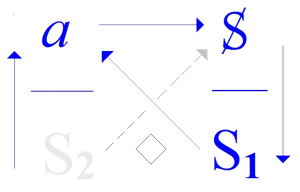

# Leçon 02 | 20 Novembre 1973

<!-- source-url: http://staferla.free.fr/S21/S21 NON-DUPES....docx -->
<!-- seminar: s21 -->
<!-- lesson: 02 -->

<!-- id: s21-02-0001 -->

Il y a un petit livre, là que... Je vais commencer comme ça sur le ton de la confidence, parce qu’évidemment je me demande en repartant : suis-je assez dupe pour ne pas errer ?

<!-- id: s21-02-0002 -->

Errer au sens où je vous l’ai précisé la dernière fois, ce qui veut dire : est-ce que je colle assez au *discours analytique*, qui n’est quand même pas sans comporter une certaine sorte d’horreur froide.

<!-- id: s21-02-0003 -->

Est-ce que je colle assez pour ne pas... pour m’en distraire, c’est-à-dire ne pas le suivre vraiment selon son fil, ou même, pour employer un terme dont je me servirai plus tard, là où on m’attend, sur *les espaces vectoriels*...

<!-- id: s21-02-0004 -->

> je vous le dis tout de suite : j’aborderai pas ça aujourd’hui ...mais *les espaces vectoriels* ça introduit une notion, comme ça, un autre espace dans l’espace : on appelle ça « *espace fibré ».*

<!-- id: s21-02-0005 -->

Bon, enfin, ce *discours analytique*, faut quand même pas oublier... pour m’excuser si je n’y colle pas tout à fait, c’est que je l’ai fondé, je l’ai fondé d’une élaboration écrite, celle qui s’écrit :

<!-- id: s21-02-0006 -->

- le *a* et le S2 superposés à gauche,

<!-- id: s21-02-0007 -->

- et puis le S barré : S, et le S1 à droite.

<!-- id: s21-02-0008 -->

<!-- id: s21-02-0009 -->

Quand il s’agit *d’être dupe*, il ne s’agit pas en l’occasion *d’être dupe de mes idées*, parce que ces 4 petites lettres, ça n’est pas des *idées*. Ce n’est pas même des idées du tout, la preuve : c’est que c’est très, très, très difficile d’y donner un sens.

<!-- id: s21-02-0010 -->

C’est même strictement fait pour que ce soit impossible d’y donner un sens.

<!-- id: s21-02-0011 -->

Ce qui ne veut pas dire qu’on ne puisse pas en faire quelque chose.

<!-- id: s21-02-0012 -->

C’est ce qui s’inscrit d’une certaine élaboration de ce que j’appellerai...

<!-- id: s21-02-0013 -->

> c’est la même chose de dire que « ça s’inscrit », que de dire ce que je vais dire maintenant, ... à savoir la mathématique de Freud, ce qui est repérable à la logique de son discours, à son errance à lui.

<!-- id: s21-02-0014 -->

C’est-à-dire à la façon dont il essayait de le rendre, ce *discours analytique*, adéquat au discours scientifique. C’était ça son *erre.*

<!-- id: s21-02-0015 -->

C’est ce qui l’a... je peux pas dire *empêché*, enfin, d’en faire la mathématique, puisque la mathématique il la faisait comme ça, il fallait un 2ème pas, pour ensuite pouvoir l’inscrire.

<!-- id: s21-02-0016 -->

Alors, pendant que je vous parlais la dernière fois, il m’est revenu, comme ça, des bouffées de souvenirs, de quelque chose qui bien sûr ne m’arrivait pas ici, mais qui m’avait tracassé le matin en préparant ce que j’avais à vous dire.

<!-- id: s21-02-0017 -->

Voilà, ça s’appelle - tout de suite, disons-le - ça s’appelle « *Die Grenzen der Deutbarkeit ».*

<!-- id: s21-02-0018 -->

C’est quelque chose qui a un rapport étroit avec *l’inscription* *du discours analytique* : c’est que si cette *inscription* est bien ce que j’en dis, *à savoir* le début, *le noyau-clé* \[*la lettre*\] *de sa mathématique*, il y a toutes les chances à ce *que ça serve à la même chose que la mathématique, c’est-à-dire que ça porte en soi sa propre limite.*

<!-- id: s21-02-0019 -->

Je savais que j’avais lu ça, parce que je l’avais dans un vieux machin que j’ai racheté comme ça, d’oc­casion, dans les débris de ce qui surnageait des choses de Freud, après l’histoire nazie, alors j’ai eu ce débris...

<!-- id: s21-02-0020 -->

Et je me disais que quand même ça avait dû être recueilli quelque part, vue la date.

<!-- id: s21-02-0021 -->

C’est vrai, ça a été recueilli dans le tome III des *Gesammelte Schriften.*

<!-- id: s21-02-0022 -->

> Mais pas ailleurs, à savoir là où ça aurait dû paraître : la 8ème *édition de la* *Traumdeutung* étant déjà éditée en 1925,
>
> en fait étant même déjà paru une première fois si mon souvenir est bon dans...
>
> Eh ben non... c’est pas paru du tout avant *ça*, que j’ai eu, donc ...alors c’était donc, *c’est sorti dans les* *Gesammelte Schriften* \[III\] mais ça n’a pas paru là où ça devait paraître au moment où ça sortait, c’est à savoir dans la 8ème *édition de la* *Traumdeutung*.

<!-- id: s21-02-0023 -->

Et c’est pas paru parce que, dans ces notes additionnelles en question, il y a un 3ème chapitre :

<!-- id: s21-02-0024 -->

- le 1er étant constitué par ces *Grenzen der Deutbarkeit,* \[[*Gesammelte Schriften* 1925](http://archive.org/details/GesammelteSchriftenIiiErgnzungenZurTraumlehre), III, p.172\]

<!-- id: s21-02-0025 -->

- le 2nd \[*Gesammelte Schriften* III, 1925, p.176 : *Die sittliche Verantwortung für den Inhalt der Traüme*\] je vous le passe, je vous en reparlerai,

<!-- id: s21-02-0026 -->

- le 3ème signifie *Die okkulte Bedeutung des Traumes* \[*Gesammelte Schriften* III, 1925, p.180\], c’est-à-dire *La signification occulte* \[*des rêves*\], ...c’est pour ça que ce n’est pas paru.

<!-- id: s21-02-0027 -->

Ce qui me restait dans l’esprit, ce qui me tracassait c’était *Die Grenzen...*

<!-- id: s21-02-0028 -->

Mais c’est à cause du fait que ces « *Grenzen... »* étaient associées à « *La signification occulte... »*, que ça n’est pas sorti.

<!-- id: s21-02-0029 -->

Jones raconte ça quelque part « *l’occulte* »... enfin, il y a une objection de la part du *dis­cours scientifique*.

<!-- id: s21-02-0030 -->

Et en effet, tel que ça se présente maintenant, l’occul­te ça se définit très précisément en ceci : ce que le *discours scien­tifique* ne peut pas encaisser. C’est même - on peut le dire - sa définition.

<!-- id: s21-02-0031 -->

Alors, c’est pas étonnant qu’il y fasse objection.

<!-- id: s21-02-0032 -->

Cette objection elle est venue comme ça, par le véhicule de Jones, et ça peut paraître une expli­cation toute simple du fait que ça ne soit pas paru là où ça devait paraître, à savoir dans la 8ème édition.

<!-- id: s21-02-0033 -->

Freud, vous le savez, c’était pas du tout neuf qu’il se tracassât sur l’occulte.

<!-- id: s21-02-0034 -->

Il le faisait, comme ça, par... par *erre.* Par *erre* concernant le discours scientifique.

<!-- id: s21-02-0035 -->

Oui, parce qu’il s’imaginait que le discours scientifique ça devait tenir compte de tous les faits.

<!-- id: s21-02-0036 -->

C’était une pure *erre.* Et *erre* plus grave encore : une *erre* poussée jusqu’à l’*erreur*.

<!-- id: s21-02-0037 -->

Ça ne tient compte, le *discours scientifique*, que des faits qui ne collent pas avec sa structure, à savoir là où il a commencé de s’avancer, son rapport avec sa propre mathématique.

<!-- id: s21-02-0038 -->

Mais pour que ça ne colle pas, encore faut-il que ça vienne à la portée de cette structure mathématique.

<!-- id: s21-02-0039 -->

De sorte qu’il tient compte de tous les faits qui font trou dans son...

<!-- id: s21-02-0040 -->

> disons, je vais vite là, parce que c’est pas un mot qui vaut,
>
> mais « qui font *trou »* parce que c’est plus sensible, tout de suite, de la dire comme ça ...qui font trou dans son système !

<!-- id: s21-02-0041 -->

Mais ce qui n’est pas de son système du tout, il ne veut rien en savoir.

<!-- id: s21-02-0042 -->

Alors, en se tracassant sur les phénomènes occultes, dits « *occultes »,* ça ne veut pas dire du tout qu’ils sont occultes, qu’ils sont cachés, parce que ce qui est caché c’est ce qui est caché par la forme du discours lui-même, mais ce qui n’a abso­lument rien à faire avec la forme du discours, c’est pas caché, c’est *ailleurs*.

<!-- id: s21-02-0043 -->

Vous là, tels que vous êtes comme ça - je fais appel à votre senti­ment - il y a rien de commun entre l’inconscient et l’occulte.

<!-- id: s21-02-0044 -->

En tout cas au niveau où vous êtes là pour m’entendre, je pense que quand même vous êtes déjà assez rompus à cette idée que l’inconscient c’est du langage, hein.

<!-- id: s21-02-0045 -->

Et si vous avez pu l’autre jour regarder ce que j’avais commencé de faire, vaguement au tableau, avec la ligne dite « *du voyage »*, et puis que vous avez pu simplement admettre ce que je vous serine depuis vingt ans, enfin même plus, à savoir ce qui clôt, ce qui termine la *Traumdeutung* : ce que j’ai rappelé l’autre jour, à savoir ce fameux « *désir indestructible* » qui se promène, qui...

<!-- id: s21-02-0046 -->

> sur la ligne du voyage, dès lors que l’entrée dans le champ du langage s’est produite ...accompagne d’un bout à l’autre...

<!-- id: s21-02-0047 -->

> et *Ebenbild*  : toujours le même, sans variation ...accompagne le sujet structurant son désir.

<!-- id: s21-02-0048 -->

Comme dit Freud : « *Ebenbild* » : *à l’image*...

<!-- id: s21-02-0049 -->

> on traduit « *à l’image »*, mais c’est pas « *à l’image* » : « *Ebenbild »* c’est *une image fixe*, toujours la même ...*à l’image der Vergangenheit*, c’est-à-dire ce qui, au regard de cet « *Ebenbild* » ne peut même pas s’appeler du passé : c’est toujours la même chose, il n’y a pas de passé à partir du moment où il s’agit de cette fonction spatiale, le croisement de la ligne avec ce réseau de la structure, qui se déplace, elle, selon la ligne, mais en même temps dont on peut dire qu’elle ne se déplace pas, puisque la ligne, elle, ne varie pas.    

<!-- id: s21-02-0050 -->

C’est par rapport à « *la vie en tant que voyage »* qu’on peut dire

<!-- id: s21-02-0051 -->

- qu’il y en a une partie qui est passée

<!-- id: s21-02-0052 -->

- et puis une autre qui reste à consommer, qu’on appelle l’avenir.

<!-- id: s21-02-0053 -->

Ces *inscriptions* du désir indestructible suivent *la glissade*.

<!-- id: s21-02-0054 -->

Mais en suivant *la glissade*, du même coup elle l’arrête, elle la fige, parce que tout mouvement est relatif, et si *la glissade* là dedans n’est que *glissade*, elle ne constitue pas un repère... Voilà.

<!-- id: s21-02-0055 -->

Alors la structure symbolique elle est, à la fin de cette *Traumdeutung,* peut-être encore à découvrir.

<!-- id: s21-02-0056 -->

Mais c’est là-dessus que Freud conclut sa *notion* : dans cette conclusion qui vient là comme la pointe même de tout ce que jamais, dans la *Traumdeutung,* il a énoncé du rêve, sa *notion* est là.

<!-- id: s21-02-0057 -->

C’est bien en ça que ce qui en rétroagit, c’est que...

<!-- id: s21-02-0058 -->

> c’est ce qu’il a expliqué à propos du rêve ...c’est que : il y a de l’inconscient, et que l’inconscient c’est ça !

<!-- id: s21-02-0059 -->

Qu’il a pu dire à l’occasion que l’inconscient est irrationnel, mais que ça veut simplement dire que sa rationalité est à construire, que même si *le principe de contradiction*, le oui et le non, n’y jouent pas le rôle qu’on croit dans la logique classique, comme la logique classique est dépassée depuis longtemps, à ce moment-là, ben, il faut en construire une autre. Ouais...

<!-- id: s21-02-0060 -->

Et moi, je soupçonne que si « *Die Grenzen der Deutbarkeit* »...

<!-- id: s21-02-0061 -->

> « *Les* *limites de l’interprétation »*, c’est ça que ça veut dire ...ne sont pas sorties dans l’édition suivante de *L’interprétation des rêves*, c’est pas simplement parce que c’était *à l’ombre de l’occulte*, c’est parce que, quand même, là,

<!-- id: s21-02-0062 -->

- ça en remettait,

<!-- id: s21-02-0063 -->

- ça dépassait un peu le truc de l’affirmation que *le désir est indestructible,*

<!-- id: s21-02-0064 -->

- ça montrait, dans cette structuration du désir lui-même, *quelque chose* qui justement aurait permis d’en *mathématiser* autrement la nature*.*

<!-- id: s21-02-0065 -->

C’est pour ça que ça vaut la peine, quand même, que je vous en donne comme ça...

<!-- id: s21-02-0066 -->

> il est évident que devant une pareille assistance il n’est pas possible
>
> que je commente 25 pages de Freud, il n’y en a pas plus, il y en a même moins ...mais je pourrai quand même aborder le premier paragraphe, ça vous incitera à aller le trouver.

<!-- id: s21-02-0067 -->

Parce que quand même, ça a fini par être publié.

<!-- id: s21-02-0068 -->

L’étrange est que ça n’ait été publié...

<!-- id: s21-02-0069 -->

> comme me le fait remar­quer ma chère amie Nicole Sels ...qu’à la suite de la séance dernière j’ai lancée sur ce truc.

<!-- id: s21-02-0070 -->

Je lui ai dit : « *Mais enfin où diable c’est, cette histoi­re* ? », cette histoire qui pourtant dans les *Gesammelte Schriften* est indi­quée tout de suite après cette pointe sur laquelle j’ai terminé du *désir indestructible* et invariant, car c’est de ça qu’il s’agit.

<!-- id: s21-02-0071 -->

Dans les *Gesammelte Schriften* il y a tout de suite après...

<!-- id: s21-02-0072 -->

> c’est même pas une note, après le point, le dernier point, la dernière ligne ...il y a écrit « *Zusatz Kapitel C* », ce qui veut dire « *Appendice* *C* » à peu près, comme on traduit ça.

<!-- id: s21-02-0073 -->

Et c’est pour le volume suivant, le volume III, auquel bien naturellement on se reporte, mais il était indiqué qu’il fallait, enfin que c’était normal de le coller là, ce qu’on n’a pas fait sous le prétexte que je vous ai dit tout à l’heure, dans la 8ème édition, précisément.

<!-- id: s21-02-0074 -->

Alors, comme me le commente...

<!-- id: s21-02-0075 -->

> ça vaut la peine, n’est-ce pas ...comme me le commente la chère Nicole, qui en connaît un bout pour ce qui est de chercher l’édition d’un texte...

<!-- id: s21-02-0076 -->

> qui en connaît un bout et qui en fout un coup, c’est inimaginable ce que je la fais cavaler,
>
> je veux dire qu’elle cavale, et qu’elle me rapporte le truc dans les deux heures,
>
> là elle a mis beaucoup plus de temps : elle a mis au moins trois jours ...oui, il ne figure ce chapitre supplémentaire, parce que je lui avais dit :

<!-- id: s21-02-0077 -->

« *Quand même, ce serait curieux que je le trouve pas dans les Gesammelte Werke. Et je le trouve pas* ! ».

<!-- id: s21-02-0078 -->

Elle me répond qu’il n’est dans cet ouvrage à aucune place logique, ni au tome qui correspond de la *Traumdeutung*...

<!-- id: s21-02-0079 -->

> ça bien sûr, je m’en étais aperçu, c’est même ce qui m’avait rendu enragé ...ni dans le tome XIV qui correspond à l’année 1925 :

<!-- id: s21-02-0080 -->

« *Il a paru in extremis et sournoisement dans le tome I, car ce tome a été le dernier à paraître* : *en* 1952 »

<!-- id: s21-02-0081 -->

Et là elle me rapporte bien sûr l’opinion de Strachey, qui lui-même l’a traduit dans la *Standard Edition,* mais au tome XIX, c’est-à-dire à son année nor­male, oui, c’est vrai...

<!-- id: s21-02-0082 -->

Bon, mais il pense que ce sort est dû aux mines que tout le monde a fait devant « l’*okkulte Bedeutung* des rêves ».

<!-- id: s21-02-0083 -->

C’est ce qu’en pense Strachey.

<!-- id: s21-02-0084 -->

Je ne sais pas ce qu’en pense Nicole Sels, mais c’est...

<!-- id: s21-02-0085 -->

> au regard, simplement des faits qu’elle m’apporte ...secondaire.

<!-- id: s21-02-0086 -->

Alors, je ne vous lis pas tout de suite la chose en allemand. Ça se dit comme ça : \[« *Die Frage, ob man von jedem Produkt des Traumlebens eine <u>vollständige und gesicherte Übersetzung</u> <u>in die Ausdrucksweise des Wachlebens</u> (<u>Deutung</u>)*

<!-- id: s21-02-0087 -->

> *geben kann, soll nicht abstrakt behandelt werden, sondern unter <u>Beziehung</u> auf die <u>Verhältnisse</u>, <u>unter denen</u> <u>man an der Traumdeutung arbeitet</u>.* » ([*Gesammelte Schriften* 1925](http://archive.org/details/GesammelteSchriftenIiiErgnzungenZurTraumlehre)*,* III, p*.*172*)*\]

<!-- id: s21-02-0088 -->

« *La question : si on peut donner de tout produit de la vie de rêve une complète et assurée traduction - <u>vollständige und gesicherte Übersetzung</u>* -...

<!-- id: s21-02-0089 -->

> déjà cet emploi de *Übersetzung,* c’est pas mal, c’est très lacanien, bon \[*Rires*\] ...*<u>in die Ausdrucksweise des Wachlebens</u> : « dans le mode de s’exprimer de la vie de veille »*...

<!-- id: s21-02-0090 -->

> et entre parenthèses : (*<u>Deutung</u>*), c’est-à-dire *sens* : « *Deutbarkeit »* ça veut dire *interpréta­tion*
>
> mais *« Deutung »* ça veut dire *sens*, *« Traumdeutung »* ça veut dire *sens des rêves* ...*ne peut pas être traitée abstraitement,mais sous <u>la Beziehung</u> (relation) avec : <u>Verhältnisse</u>* ...

<!-- id: s21-02-0091 -->

> c’est un autre terme pour exprimer *relations,* *...avec les relations*...

<!-- id: s21-02-0092 -->

> donc désignées par un autre mot, c’est-à-dire posées autrement : *Beziehung,* c’est quelque chose
>
> *comme ça d’approximatif*. *Verhältnisse,* ça peut être pris dans le sens des relations qui s’écrivent,
>
> je veux dire de ce qui est constitué à proprement parler dans une articulation propre au sens du terme,
>
> n’est­-ce pas, comme quelque chose qui peut arriver à se poser là ...*les rela­tions - <u>unter denen</u> - sous le coup desquelles on travaille à l’interprétation des rêves* : *<u>man an der Traumdeutung arbeitet</u>* ».

<!-- id: s21-02-0093 -->

Et c’est là qu’on entre un peu plus avant. 

<!-- id: s21-02-0094 -->

> \[« *<u>Unsere geistigen Tätigkeiten</u> <u>streben</u> entweder <u>ein nützliches Ziel</u> an <u>oder unmittelbaren Lustgewinn</u>.*  » (*Gesam. Schrif.* 1925*, p.*172*)*\]

<!-- id: s21-02-0095 -->

« *Nos activités - geistige - celles de l’esprit*...

<!-- id: s21-02-0096 -->

> c’est comme ça : *<u>Unsere geistigen Tätigkeiten</u>*. Pour Freud, ça veut dire « *ce qu’on pense* ».
>
> Les activités de l’esprit, c’est ce qui est généralement désigné comme les pen­sées

<!-- id: s21-02-0097 -->

...*<u>Streben</u>*...

<!-- id: s21-02-0098 -->

> *Streben,* c’est un mot qui a une toute autre résonance - n’est-ce pas ? - que ce par quoi on le traduit en anglais, à savoir dans cette occasion, n’est-ce pas - c’est la traduction de Strachey - justement : *pursue.*
>
> Ça *poursuit* rien du tout. Ça poursuit rien du tout : *Streben*, quand on regarde bien ce que c’est, quand on voit l’étoffe du mot - ce qui évidemment se fait avec ses usages précédents - c’est quelque chose qui est à inscrire, quelque chose comme ça : vous comprenez si vous avez une voûte, comme ça, quelque chose en bois :
>
> c’est les tirants. Ça a l’air de la sup­porter comme ça... si vous aviez la moindre notion d’architecture,
>
> vous sauriez que les tirants, dans une voûte, eh ben, ça tire. Je veux dire que ça tire vers l’extérieur.
>
> Les tirants, ça ne soutient pas. Enfin, qu’importe, sur le *Streben* ...*ce qu’ils tirent, ce qu’ils font tenir ensemble*, c’est, ou bien : *<u>ein nützliches Ziel</u>*...

<!-- id: s21-02-0099 -->

> et là vous retrouvez les fonctions essentielle­ment lacaniennes de l’*utile* et du *jouir*. Elles sont précisées comme telles, c’est là-dessus qu’au départ j’ai fait entièrement pivoter ce que j’ai dit de *L’éthique de la psychanalyse* ...*un but utile,* c’est 

<!-- id: s21-02-0100 -->

- ou ça qu’elles *anstre­ben,* qu’elles attirent

<!-- id: s21-02-0101 -->

- ou bien ...*<u>oder unmittelbaren Lustgewinn</u> *: à savoir, à savoir tout simplement mon « *plus-de-jouir* »*.*

<!-- id: s21-02-0102 -->

Car qu’est-ce que ça veut dire un *Lustgewinn *: *un gain de* *Lust*.

<!-- id: s21-02-0103 -->

Si là l’ambiguïté de ce terme *Lust* en allemand, ne permet pas d’intro­duire dans le *Lustprinzip -* traduit *principe du plaisir –* justement cette for­midable divergence qu’il y a entre la notion du plaisir telle qu’elle est commentée par Freud lui-même selon la traduction antique, seule issue de *la sagesse épicurienne*, ce qui voulait dire « *jouir le moins possible* ».

<!-- id: s21-02-0104 -->

Parce que : *qu’est-ce que ça nous emmerde,* *la jouissance* !

<!-- id: s21-02-0105 -->

C’est justement pour ça qu’ils se faisaient traiter de « *pourceaux »*...

<!-- id: s21-02-0106 -->

> parce qu’en effet, les *pourceaux*, mon Dieu, ça jouit pas tellement qu’on s’imagine, n’est-ce pas,
>
> ça reste dans sa petite porcherie, bien tranquilles, enfin, ça jouit au minimum ...c’est bien pour ça qu’on les a traités de « *pourceaux »*, parce que tous les autres, ils étaient vachement tracassés par *la jouissance*. Fallait qu’ils en mettent un coup : ils étaient esclaves de la jouis­sance.

<!-- id: s21-02-0107 -->

C’est même pour ça, tiens - là je me laisse emporter - c’est même pour ça qu’il y avait des esclaves.

<!-- id: s21-02-0108 -->

La seule civilisation qui était vraiment mordue par la jouissance, il fallait qu’elle ait des esclaves.

<!-- id: s21-02-0109 -->

Parce que ceux qui jouissaient, c’était eux ! Sans les esclaves, pas de jouis­sance...

<!-- id: s21-02-0110 -->

Vous, vous êtes tous des *employés*. Enfin, vous faites ce que vous pouvez pour être des *employés*.

<!-- id: s21-02-0111 -->

Vous n’êtes pas tout à fait arrivés, mais croyez-moi, vous y viendrez.

<!-- id: s21-02-0112 -->

Bon, je me suis un peu laissé emballer, là comme ça.

<!-- id: s21-02-0113 -->

Réfléchissez quand même un peu à ça, enfin, n’est-ce pas, qu’il y a que les esclaves qui jouissent : c’est leur fonction*.*

<!-- id: s21-02-0114 -->

Et c’est pour ça qu’on les isole, que même on n’a pas le moindre scrupule à transformer des hommes libres en esclaves, puisque, en les faisant esclaves, on leur permet de ne plus se consacrer qu’à jouir. Les hommes libres, ils n’aspirent qu’à ça.

<!-- id: s21-02-0115 -->

Et comme ils sont altruistes, ils font des esclaves. C’est arrivé comme ça dans *l’his­toire*, dans notre *his­toire* à nous.

<!-- id: s21-02-0116 -->

Évidemment, il y avait des endroits où on était beaucoup plus civilisés : il n’y avait pas d’esclavage en Chine.

<!-- id: s21-02-0117 -->

Mais le résultat c’est que, malgré tout ce qu’on dit, ils sont pas arrivés à faire la science...

<!-- id: s21-02-0118 -->

Maintenant, ils ont été touchés par un petit peu de Marx, alors ils se réveillent.

<!-- id: s21-02-0119 -->

Comme disait Napoléon : les réveillez pas, surtout !

<!-- id: s21-02-0120 -->

Maintenant, ils sont réveillés.

<!-- id: s21-02-0121 -->

Ils auront pas eu besoin de passer par *le truc des esclaves*.

<!-- id: s21-02-0122 -->

Ce qui prouve, quand même, qu’il y a des greffes, n’est-ce pas, que c’est pas le pire qu’on peut éviter : on peut évi­ter le meilleur, et arriver quand même...

<!-- id: s21-02-0123 -->

\[*Im ersteren Falle sind es intellektuelle Entscheidungen, Vorbereitungen zu <u>Handlungen</u> oder Mitteilungen <u>an andere</u> ; im anderen Falle <u>nennen wir sie Spielen und</u> <u>Phantasieren</u>. <u>Bekanntlich</u> ist auch das Nützliche nur <u>ein Umweg</u> zur lustvollen Befriedigung. Das Traumen ist nun eine Tätigkeit der zweiten Art, die ja entwicklungsgeschichtlich die ursprünglichere ist. Es ist <u>irreführend</u>, zu sagen, das Traumen bemühe sich um die bevorstehenden Aufgaben des Lebens oder suche Probleme der <u>Tagesarbeit</u> zu Ende zu führen. Darum kümmert sich <u>das vorbe wußte Denken</u>. Dem Träumen Liegt solche nützliche Absicht ebenso ferne wie die der Vorbereitung <u>einer Mitteilung an einen anderen</u>. Wenn sich der Traum mit einer Aufgabe des Lebens beschäftigt, löst er sie so, wie es einem irrationellen Wunsch, und nicht so, wie es einer verständigen Überlegung entspricht. Nur eine nützliche Absicht, eine Funktion, muß man dem Traum zusprechen, er soll die Störung <u>des Schlafes</u> verhüten. Der Traum kann beschrieben werden als ein Stück Phantasieren im Dienste der Erhaltung des Schlafes.  »* (*Gesammelte Schriften* 1925*, pp.*172-173*)* \]

<!-- id: s21-02-0124 -->

...*<u>Unmittelbaren Lustgewinn</u>*, ça veut dire « *un plus-de-jouir, là, immédiat* ». « *Dans le premier cas*, celui du but d’utilité - *ce sont*...

<!-- id: s21-02-0125 -->

> ces *geistigen Tätigkeiten*, ces opérations spirituelles ...*ce sont des déci­sions intellectuelles, des préparations à la manipulation *: *<u>Handlungen</u>, ou des communications, <u>an andere</u> *: *aux autres*. ».

<!-- id: s21-02-0126 -->

À savoir qu’on parle pour les - comme je viens de dire - pour les manipuler, comme vous dites.

<!-- id: s21-02-0127 -->

« *Dans l’autre cas, nous appelons ça - <u>nennen wir sie</u> - Sie*, c’est à savoir les *geistigen Tätigkeiten - <u>Spielen und Phantasieren </u>: nous appelons ça des jeux et le fait de fantasmer*. *Bien sûr* - qu’il dit - <u>*bekanntlich*</u> - *n’est-­ce pas* ? - *l’utile, c’est simplement aussi quand même un détour, <u>ein Umweg</u>, pour une satisfaction de jouissance* ». Mais... c’est pas en soi qu’elle est visée, n’est-ce pas ?

<!-- id: s21-02-0128 -->

« *Le rêver* - il n’a pas dit le rêve - *le fait de rêver est donc une acti­vité de la seconde espèce*...

<!-- id: s21-02-0129 -->

> à savoir ce qu’il a défini par le *unmittelbaren Lustgewinn*

<!-- id: s21-02-0130 -->

...*Il est une erreur, <u>irreführend</u>, de dire que le rêver s’effor­ce à ces devoirs pressants, toujours imminents de la vie commune,* *et cherche à mener à bonne fin le travail du jour, <u>Tagesarbeit</u>. De ça se sou­cie le penser préconscient : <u>das vorbewußte Denken</u>.*

<!-- id: s21-02-0131 -->

*Pour le rêve, cette utilisation, cette intention utile* - n’est-ce pas - *est tout à fait aussi étrangè­re que la mise en jeu*...

<!-- id: s21-02-0132 -->

> en œuvre, la préparation, le fignolage, n’est-ce pas ...*d’une communication, <u>einer Mitteilung</u>, à un autre, <u>an einen anderen</u>* ».

<!-- id: s21-02-0133 -->

En quoi il a ceci de lacanien, notre cher Freud, n’est-ce pas, que...

<!-- id: s21-02-0134 -->

> puisque tout ce qu’il vient de dire autour du *rêve*, c’est uniquement de la *construction*, du *chiffrage* ...ce *chiffrage* qui est la dimension du langage n’a rien à faire avec la communication.

<!-- id: s21-02-0135 -->

Le rapport de l’homme au langage, lequel ne peut simplement s’attaquer que sur la base de ceci :

<!-- id: s21-02-0136 -->

- que *le signifiant c’est un signe qui ne s’adresse qu’à un autre signe*,

<!-- id: s21-02-0137 -->

- que *le signifiant, c’est ce qui fait signe à un signe*, et que c’est pour ça que c’est le signifiant.

<!-- id: s21-02-0138 -->

Ça n’a rien à faire avec la communication à *quelqu’un* *d’autre*.

<!-- id: s21-02-0139 -->

Ça détermine un sujet, ça a pour effet un sujet.

<!-- id: s21-02-0140 -->

Et le sujet, c’est bien assez qu’il soit déterminé par ça, en tant que sujet, à savoir qu’il surgisse de quelque chose qui ne peut avoir sa justification qu’ailleurs.

<!-- id: s21-02-0141 -->

À ceci près que dans le rêve on la voit, à savoir que l’opération du *chiffrage *: *c’est fait pour la jouissance*.

<!-- id: s21-02-0142 -->

À savoir que les choses sont faites pour que *dans le chiffrage on y gagne ce quelque chose* qui est l’essentiel du processus primaire, à savoir *un « Lustgewinn ».* C’est ça qui est dit là.

<!-- id: s21-02-0143 -->

Et puis ça continue.

<!-- id: s21-02-0144 -->

Et non seulement ça continue, mais ça appuie.

<!-- id: s21-02-0145 -->

Et ça montre bien en quoi, pour quoi, le rêve fonctionne.

<!-- id: s21-02-0146 -->

C’est à savoir qu’il est fait, et n’est fait en rien...

<!-- id: s21-02-0147 -->

> et c’est pour ça qu’il fonctionne comme ça ...il n’est fait en rien *<u>que</u>* *pour, le sommeil, <u>des Schlafes verhüten,</u> proté­ger *: *il protège le sommeil*.

<!-- id: s21-02-0148 -->

Ce que Freud n’a dit comme ça, qu’inci­demment dans divers points, là il insiste.

<!-- id: s21-02-0149 -->

Je veux dire que la question qu’il introduit c’est : en quoi précisément ce qui du rêve dépend de l’in­conscient...

<!-- id: s21-02-0150 -->

> c’est-à-dire de la structure, de la structure du désir ...ce qui du rêve pourrait bien incommoder *le sommeil *?

<!-- id: s21-02-0151 -->

Sur le sommeil, il est clair que nous ne savons pas grand-chose. Nous savons pas grand-chose justement parce que, parce que ceux qui les étudient, comme ça, comme faits, avec deux petits encéphalographes...

<!-- id: s21-02-0152 -->

> encéphalopodes, encéphalo-tout-ce-que-vous-voudrez ...ben, ils lient des choses ensemble, enfin, mais c’est quand même curieux, n’est-ce pas, qu’une chose aussi répandue dans la vie, là, comme on dit, que le som­meil, enfin je n’avance rien, là je constate qu’on n’a jamais posé la question de ce que ça avait à faire avec *la jouissance*.

<!-- id: s21-02-0153 -->

Tout ça parce que *la jouissance*, enfin, c’est...

<!-- id: s21-02-0154 -->

faut bien dire qu’on n’en a pas fait un ressort tout à fait majeur de « la conception du monde », comme on s’exprime.

<!-- id: s21-02-0155 -->

Qu’est-ce que le sommeil ?

<!-- id: s21-02-0156 -->

C’est peut-être là que la formule de Freud pourrait évidemment prendre son sens et rejoindre l’idée du *plaisir* : si j’ai parlé des pourceaux tout à l’heure, c’est parce qu’ils roupillent sou­vent, oui.

<!-- id: s21-02-0157 -->

Ils ont le moins de jouissance possible dans la mesure où plus ça dort mieux ça vaut.

<!-- id: s21-02-0158 -->

En tout cas ça collerait avec, si mon hypothèse est bonne, à savoir que *c’est dans le chiffrage qu’est la jouissance*.

<!-- id: s21-02-0159 -->

On peut voir aussi par là, enfin, quelque chose, c’est que en effet le chiffrage du rêve, après tout, il est pas poussé si loin que ça, si loin qu’on le dit.

<!-- id: s21-02-0160 -->

Enfin, c’est...

<!-- id: s21-02-0161 -->

j’ai déjà expliqué *la condensation*, *le déplacement* ...enfin, c’est *la métaphore*, c’est *la métonymie*, et puis c’est toutes sortes de petites manipulations, comme ça, qui étendent la chose dans *l’Imaginaire*.

<!-- id: s21-02-0162 -->

C’est dans cette direction-là, hein, qu’il faut voir *la jouissance*.

<!-- id: s21-02-0163 -->

On pourrait peut-être s’élever, n’est-ce pas, à une structure, comme ça conforme, conforme à l’histoire du *chiffrage*, c’est que si c’est dans le sens de ce quelque chose qui arrive - à quoi ? - *die Grenzen *: les limites \[*Die Grenzen der Deutbarkeit*\].

<!-- id: s21-02-0164 -->

Là est l’erreur.

<!-- id: s21-02-0165 -->

*Les limites der Deutbarkeit,* si vous lisez bien ces quatre pages, car il y en a pas plus, vous vous apercevrez que ce qui la signa­le cette *limite*, c’est exactement le même moment quand ça arrive au *sens*.

<!-- id: s21-02-0166 -->

À savoir que *le sens* il est en somme assez court.

<!-- id: s21-02-0167 -->

C’est pas trente-six sens qu’on découvre au bi-du-bout de l’inconscient : c’est le sens sexuel.

<!-- id: s21-02-0168 -->

C’est-à-dire très précisément le « *sens non-sens* »*.* Le sens où ça foire la *Verhältnis.*

<!-- id: s21-02-0169 -->

La *Beziehung,* elle, a lieu avec ceci : qu’il n’y a pas de sexuelles *Verhältnisse,* que ça...

<!-- id: s21-02-0170 -->

> la *Verhältnis* en tant qu’écrite, en tant que ça peut s’inscrire et que c’est mathème ...ça, ça foire toujours.

<!-- id: s21-02-0171 -->

Et c’est bien pour ça qu’il y a un moment où le rêve, ça se dégonfle, c’est-à-dire qu’on cesse de rêver et que le sommeil, il reste à l’abri de la jouissance.

<!-- id: s21-02-0172 -->

C’est parce qu’en fin de compte on en voit le bout.

<!-- id: s21-02-0173 -->

Mais l’important, l’important pour nous, s’il est vrai que ce sens sexuel il ne se définit que de *ne pas pouvoir s’écrire*, c’est de voir juste­ment ce qui dans le *chiffrage*...

<!-- id: s21-02-0174 -->

> non pas dans le déchiffrage ...ce qui dans le *chiffrage* nécessite *die Grenzen* \[*la limite*\]*,* le même mot...

<!-- id: s21-02-0175 -->

> ici employé dans le titre ...le même mot sert à ce qui dans la mathématique se désigne comme *limite...*

<!-- id: s21-02-0176 -->

> comme *limite d’une fonction*, comme *limite d’un nombre réel* ...ça peut augmenter tant que ça veut, la variable, la fonc­tion ne dépassera pas une certaine limite.

<!-- id: s21-02-0177 -->

Et le langage, c’est fait comme ça, c’est quelque chose qui, aussi loin que vous en poussiez *le chiffrage,* n’arrivera jamais à lâcher ce qu’il en est du sens,

<!-- id: s21-02-0178 -->

- parce qu’il est là *à la place du sens*,

<!-- id: s21-02-0179 -->

- parce qu’il est là à cette place où *ce qui fait que le rapport sexuel ne peut pas s’écrire*, c’est justement ce trou-là, que bouche tout le langage en tant que tel, l’accès, l’accès de l’être parlant à quelque chose qui se présente bien comme, en certain point, *touchant au Réel*, là, dans ce point-là.

<!-- id: s21-02-0180 -->

Dans ce point-là se justifie que le *Réel* je le définisse de *l’im­possible*, parce que là, justement, il n’arrive pas, jamais...

<!-- id: s21-02-0181 -->

> c’est la nature du langage ...il n’arrive pas, jamais à ce que le rapport sexuel puisse s’inscrire. Ouais...

<!-- id: s21-02-0182 -->

Alors il reste nos histoires de Freud avec son *occulte.*

<!-- id: s21-02-0183 -->

L’histoire d’« *occulte* », c’est très curieux, n’est-ce pas ?

<!-- id: s21-02-0184 -->

Je vous ai parlé de la 8ème *édition*, mais pas de la 7ème.

<!-- id: s21-02-0185 -->

La 7ème, c’est impossible de mettre la main dessus, non pas à cause des nazis cette fois, mais parce qu’elle est parue probablement en très peu d’exem­plaires, enfin, c’est sorti en 1919, vous vous rendez compte !

<!-- id: s21-02-0186 -->

La chose fabuleuse, c’est que quand même, grâce à une autre amie...

<!-- id: s21-02-0187 -->

> vous voyez, je n’ai que des amies

<!-- id: s21-02-0188 -->

...Nanie Bridgeman,

<!-- id: s21-02-0189 -->

> Nanie Bridgeman qui est à la B.N. ...a mis la main sur *la 7ème*.

<!-- id: s21-02-0190 -->

Eh bien, ça m’a soulagé...

<!-- id: s21-02-0191 -->

Parce que la façon dont Freud est traduit !

<!-- id: s21-02-0192 -->

Il est vrai que ça a surtout com­mencé avec Marie Bonaparte, bon...

<!-- id: s21-02-0193 -->

Mais avant il y avait eu Isaac Meyerson, j’avais été...

<!-- id: s21-02-0194 -->

> je lui en demande pardon ...jusqu’à penser que pour lui, c’était le même truc, à savoir qu’il écrivait n’importe quoi.

<!-- id: s21-02-0195 -->

J’avais été jusque-là, et pourquoi ?

<!-- id: s21-02-0196 -->

Parce que...

<!-- id: s21-02-0197 -->

je l’ai pas apporté là, c’est malheureux mais je l’ai oublié, voilà la vérité ...il y a une peti­te phrase, il y a une petite phrase au moment où Freud pose la question...

<!-- id: s21-02-0198 -->

c’est ça qui culmine dans ce dernier paragraphe dont je vous ai parlé ...au moment où Freud pose la question de ce qu’il en est, quel est l’ordre de réalité de ce rêve, il est forcé d’appeler ça *psychique,* mais en même temps ça le tracasse de l’appeler *psychique*, parce qu’il sent bien que l’âme, enfin... ça colle pas cette histoire, enfin que l’âme c’est quand même pas différent du corps.

<!-- id: s21-02-0199 -->

Alors là, il évoque la réalité matérielle, il a pas vu très bien à ce moment-là que le matériel, il l’avait là : c’était tout son bouquin, tout simplement à savoir la façon dont il avait traité le rêve, en le traitant par la manipulation du déchiffrage, c’est-à-dire après tout avec simplement ce que le langage comporte dimension de *chiffré*.

<!-- id: s21-02-0200 -->

Alors là, il s’engage dans ce qu’il en est, en fin de compte, de cette réa­lité, et il est saisi...

<!-- id: s21-02-0201 -->

il est saisi uniquement là, c’est la seule édition où il y a une phrase comme ça, une phrase où tout d’un coup il répudie ce fait : un savant...

<!-- id: s21-02-0202 -->

> un savant certes modeste, il le qualifie comme ça ...il y a quand même deux trucs que de toute façon...

<!-- id: s21-02-0203 -->

> enfin, il met là une bar­rière …il ne peut pas encaisser :

<!-- id: s21-02-0204 -->

- c’est la subsistance de ce qui est mort : ça, ça vise l’immortalité de l’âme.

<!-- id: s21-02-0205 -->

- Et deuxièmement, le fait que tous les éléments de l’avenir soient cal­culables.

<!-- id: s21-02-0206 -->

Ce qui, évidemment là, rejoint le sol soli­de d’Aristote...

<!-- id: s21-02-0207 -->

- l’âme dans Aristote est définie de telle sorte qu’el­le n’implique nullement son immortalité, et c’est d’ailleurs grâce à ça qu’il peut y avoir un progrès de la science, c’est à partir du moment où, en effet, on s’intéresse au corps,

<!-- id: s21-02-0208 -->

- et puis deuxièmement ceci : c’est le maintien du contingent comme essentiel.

<!-- id: s21-02-0209 -->

Et après tout, pourquoi le contingent, à savoir ce qui va se passer demain, nous ne pouvons pas le prédire ?

<!-- id: s21-02-0210 -->

En beaucoup de choses nous pouvons le pré­dire.

<!-- id: s21-02-0211 -->

De quoi se sert Aristote dans sa définition du contingent ?

<!-- id: s21-02-0212 -->

De savoir qui est-ce qui va demain avoir la victoire, de savoir si dès aujour­d’hui, au nom de ceci, que demain une chose s’appellera « *Victoire de Mantinée* », est-ce que nous pouvons écrire dès aujourd’hui : « *Victoire de Mantinée* »  ?

<!-- id: s21-02-0213 -->

C’est uniquement de ça qu’il s’agit dans l’argumen­tation d’Aristote à propos du contingent.

<!-- id: s21-02-0214 -->

C’est tout de même une belle occasion de nous interroger sur ce pour quoi des événements...

<!-- id: s21-02-0215 -->

> qui ne sont pas d’ailleurs n’importe lesquels, qui sont des événements, disons « *humains »*,
>
> je ne vois pas pourquoi je répugnerais là à l’énoncer ainsi ...pourquoi est-ce que c’est ça le contingent ?

<!-- id: s21-02-0216 -->

Parce qu’après tout, il y a quand même des *événements humains* qui sont d’autant plus prévisibles qu’ils sont constants.

<!-- id: s21-02-0217 -->

Par exemple : j’étais sûr que vous seriez aussi nombreux aujourd’hui que la dernière fois, pour des raisons d’ailleurs aussi obscures, mais enfin, c’était calculable.

<!-- id: s21-02-0218 -->

Pourquoi est­-ce qu’une victoire n’est pas calculable ?

<!-- id: s21-02-0219 -->

Qui est-ce qui me répond ?

<!-- id: s21-02-0220 -->

Écoutez : une victoire n’est pas calculable...

<!-- id: s21-02-0221 -->

*X dans la salle : Parce qu’il faut être deux, ou trois !*

<!-- id: s21-02-0222 -->

Il y a de l’idée... Il y a de l’idée, c’est évident, enfin, c’est vrai, comme vous dites, il faut être 2, et même parfois un peu plus… Mais en allant dans ce sens-là, vous voyez bien que, malgré tout, vous glissez tout douce­ment du côté où ce 2 foire : à savoir du côté du rapport sexuel. C’est tout un truc d’être deux. Oui.

<!-- id: s21-02-0223 -->

Quand je pense que je n’aurai pas le temps aujourd’hui de vous raconter toutes les belles choses que j’avais préparées pour vous sur l’amour, eh ben, ça me déçoit un peu, mais c’est parce que j’ai traîné, et puis j’ai traîné comme ça parce que j’ai voulu faire quand même un *chiffrage* soigné, c’est-à-dire ne pas trop errer, alors pour le reste vous pour­rez peut-être un peu attendre.

<!-- id: s21-02-0224 -->

Mais pour me référer à quelque chose que j’ai déjà avancé : je l’ai dit de mille façons, bien souvent, mais un jour je l’ai dit tout à fait cru, comme ça, en clair.

<!-- id: s21-02-0225 -->

J’ai dit que *l’effet de l’interprétation*...

<!-- id: s21-02-0226 -->

> pour me limiter à ce à quoi je dois rester collé : je dois rester dupe.
>
> Et plus encore : dupe sans me forcer, parce que si je suis dupe en me forçant,
>
> eh ben j’écrirai le *Dis**cours sur les passions de l’amour* justement, c’est-à-dire ce qu’a écrit Pascal,
>
> et qu’est-ce qu’on voit qu’il se force... Après ça, naturellement ça a lâché, ça a claqué, il n’a jamais pu
>
> y revenir, mais il est assez probable - j’en suis pas sûr - qu’il s’est forcé, quand il a écrit ça, quand même.
>
> Ça donne des résultats absolument stupéfiants... C’est absolument magnifique, en se forçant, on arri­ve à dire...
>
> on arrive, on arrive vraiment à ne pas errer. Lisez ça, enfin, ça colle, l’amour ça se passe comme ça.
>
> Absolument déconcertant, mais ça se passe comme ça. Bon... ...qu’est-ce que ça veut dire que *l’interprétation est incalculable dans ses effets ?*

<!-- id: s21-02-0227 -->

*Ça veut dire que son seul sens, c’est la jouissance*.

<!-- id: s21-02-0228 -->

*C’est la jouissance d’ailleurs, qui fait tout à fait obstacle à ce que le rapport sexuel ne puisse d’aucune façon s’inscrire*, et qu’en somme, ça permet d’étendre à *la jouissance* cette formule : que *l’effet de l’interprétation est incalculable*.

<!-- id: s21-02-0229 -->

Si vous réfléchissez bien, en effet, à ce qui se passe à la ren­contre de ces deux troupeaux qui s’appellent « *armées* », et qui d’ailleurs sont des *discours* ambulants, je veux dire que chacun ne tient que parce qu’on croit que le capitaine, c’est **S1**.

<!-- id: s21-02-0230 -->

Bon... Il est tout de même tout à fait clair que si la victoire d’une armée sur une autre est strictement imprévisible, c’est que du combattant on ne peut pas calculer la jouissance.

<!-- id: s21-02-0231 -->

Que tout est là : si il y en a qui jouissent de se faire tuer, ils ont l’avantage. Voilà !

<!-- id: s21-02-0232 -->

C’est un petit aperçu concernant ce qui peut en être du *contingent*, c’est-à-dire de ce qui ne se définit que de l’incalculable...

<!-- id: s21-02-0233 -->

Alors maintenant quand même, je ne vais tout de même pas vous quitter sans vous dire quelques petits mots de ce qu’il en est tout à l’opposé de la ligne où nous nous sommes exercés...

<!-- id: s21-02-0234 -->

> ou bien je me suis exercé devant vous, ...mais où vous m’avez quand même...

<!-- id: s21-02-0235 -->

> enfin il y a des chances, comme ça ...un peu suivi, au moins suivi par votre silence...

<!-- id: s21-02-0236 -->

L’occulte, ça ne peut quand même pas seulement se définir par le fait que c’est rejeté par la science.

<!-- id: s21-02-0237 -->

Parce que, comme je viens de vous dire, c’est fou tout ce que ça rejette, la science : en principe tout ce que nous venons de dire, et qui existe pourtant quand même, à savoir la guerre.

<!-- id: s21-02-0238 -->

Ils sont là, tous, les savants, à se creuser la tête : *Warum Krieg* ? Oh ! oh ! *Pourquoi la guerre* [^3] *?*

<!-- id: s21-02-0239 -->

Ils arrivent pas à comprendre ça, les pauvres. Ouais...

<!-- id: s21-02-0240 -->

Ils se mettent à deux pour ça : Freud et Einstein. C’est pas en leur faveur ! \[*Rires*\]

<!-- id: s21-02-0241 -->

Mais enfin l’occulte, c’est bel et bien sûrement ça : cette absence du rapport. Et je vous en dirais bien même un petit peu plus, s’il fallait pas tout de même que je précise bien comment ça se pré­sentait du temps de Freud.

<!-- id: s21-02-0242 -->

Parce que là c’est tout à fait clair. Tout ce qu’il a écrit : « *Psychoanalyse und Telepathie », « Traum und Telepathie »,* dont ont fait Dieu sait quel mauvais usage les gens qui ont isolé ça sous le nom de « *phénomène psy* », c’est des escrocs...

<!-- id: s21-02-0243 -->

Il faut quand même bien voir que Freud, alors...

<!-- id: s21-02-0244 -->

> lisez ses textes, n’est-ce pas, ceux dont je viens de donner le titre,
>
> parce que quand même, ceux-là on les trouve, contrairement aux *Grenzen der Deutbarkeit* ...c’est tout à fait clair : il dit que *le rêve* et *la télépathie*, par exemple, ça n’a strictement rien à faire.

<!-- id: s21-02-0245 -->

C’est même au point qu’il va jusqu’à dire : mais *la télépathie*, c’est quelque chose du même ordre...

<!-- id: s21-02-0246 -->

> je l’admets, pourquoi pas ? ...c’est de l’ordre de la *communication*.

<!-- id: s21-02-0247 -->

Et dans le rêve, c’est traité comme n’importe quelle autre...

<!-- id: s21-02-0248 -->

> à savoir la première partie de ce que je vous avais énoncé tout à l’heure,
>
> à savoir *etwas nützliches,* quelque chose qui sert aux manigances de la journée ...et c’est repris de la même façon dans le rêve.

<!-- id: s21-02-0249 -->

Non seulement il préfère admettre, mais très précisé­ment il démontre que *dans tous les cas où il y a eu* *la télépathie* soi-disant rêvée, ce sont des cas où on peut admettre le fait direct qu’il y a eu mes­sage, à savoir annonce par *fil spécial,* si je puis m’exprimer ainsi, car c’est ça *la télépathie*, n’est-ce pas, c’est le fil spécial.

<!-- id: s21-02-0250 -->

On peut... il y a qu’à trai­ter le cas, il y a qu’à l’envisager, il y a qu’à opérer avec lui, en pensant que, comme n’importe quel autre résidu du jour, il y a eu avertissement télé­pathique.

<!-- id: s21-02-0251 -->

Que ce soit télépathique ou pas...

<!-- id: s21-02-0252 -->

> autrement dit il s’en fout ...la seule chose qui l’intéresse c’est que c’est repris dans le rêve, ceci...

<!-- id: s21-02-0253 -->

> je ne peux pas vous faire la lecture parce qu’il est trop tard ...ceci est énoncé dans Freud : il faut considérer, pour concevoir quelque chose aux rapports de la télépathie et du rêve, que la télépathie s’est produite comme un reste, résidu, de la journée précédente.

<!-- id: s21-02-0254 -->

Il préfère admettre ça...

<!-- id: s21-02-0255 -->

> quoique bien sûr, naturellement ...il préfère admettre le phénomène télépathique

<!-- id: s21-02-0256 -->

> c’est ça l’essence de sa position ...que de le faire rentrer dans le rêve.

<!-- id: s21-02-0257 -->

Et il souligne, il souligne, à savoir il dit pourquoi : parce que le rêve c’est fait...

<!-- id: s21-02-0258 -->

> et il fait toute la liste ... de toute une série de chif­frages, et que ces chif­frage*s* ne peuvent porter que sur un matériel qui est constitué par les restes diurnes.

<!-- id: s21-02-0259 -->

Il préfère mettre la télépathie, la ranger dans les événements courants, à ceci : de la rattacher en rien aux méca­nismes eux-mêmes de l’inconscient.

<!-- id: s21-02-0260 -->

C’est si facile à confirmer, il suffit que vous vous reportiez...

<!-- id: s21-02-0261 -->

> bien sûr naturellement en français ça n’a jamais été traduit mais quand même, il y en a certains d’entre vous
>
> qui lisent l’anglais, même - j’espère - beaucoup, et d’autre part un certain nombre qui lisent l’allemand ...reportez-vous aux textes de Freud sur l’inconscient et la télépathie : il n’y a jamais d’ambiguïté, il préfère tout...

<!-- id: s21-02-0262 -->

> à savoir, en somme, non seulement ce qu’il met en doute, mais ce sur quoi... ce dont il se lave les mains,
>
> ce dont il dit : je n’ai là-dessus aucu­ne compétence ...mais il préfère admettre que la télépathie existe, à sim­plement la rapprocher de ce qu’il en est de l’*inconscient*.

<!-- id: s21-02-0263 -->

Autrement dit, tout ce qu’il émet, tout ce qu’il avance comme remarquable...

<!-- id: s21-02-0264 -->

> considérant certains rêves ...tout ce qu’il avance comme remarquable consiste tou­jours à dire :

<!-- id: s21-02-0265 -->

- il n’y a rien eu d’autre que de rapport au rêve en tant que chiffrage,

<!-- id: s21-02-0266 -->

- ou encore que de rapport de *l’inconscient de l’occultiste* ou du diseur de bonne fortune, avec *l’inconscient du sujet*.

<!-- id: s21-02-0267 -->

En d’autres termes il dénie tout phénomène télépathique auprès de ceci, il dénie au regard de ceci : qu’il n’y a eu que repérage du désir. Ce repérage du désir, il le considère comme toujours possible, ce qui veut dire...

<!-- id: s21-02-0268 -->

> ce qui veut dire par rapport à mon inscription de l’autre jour de la vie comme voya­ge et de la structure qui se déplace en même temps que le voyage dessi­né ...dessiné linéairement.

<!-- id: s21-02-0269 -->

La question peut se poser - et comment ne se poserait-elle pas ? –

<!-- id: s21-02-0270 -->

- si vrai­ment *la structure* est ponctuée par le désir de l’Autre, en tant que tel,

<!-- id: s21-02-0271 -->

- si déjà le sujet naît inclus dans le langage, inclus dans le langage et *déjà déterminé dans son inconscient par le désir de l’Autre*, ...pourquoi n’y aurait-il pas entre tout ça une certaine solidarité ?

<!-- id: s21-02-0272 -->

L’inconscient n’exclut pas...

<!-- id: s21-02-0273 -->

> si l’inconscient est cette structure de langage ...l’inconscient n’exclut pas...

<!-- id: s21-02-0274 -->

> et ce n’est que trop évident ...l’inconscient n’exclut pas la reconnaissance du désir de l’Autre comme tel.

<!-- id: s21-02-0275 -->

En d’autres termes le réseau, le réseau de structure dont le sujet est un *déterminé* particulier, il est concevable qu’il communique avec les autres struc­tures :

<!-- id: s21-02-0276 -->

- les structures des parents certainement,

<!-- id: s21-02-0277 -->

- et pourquoi pas à l’occa­sion avec ces structures qui sont celles d’un inconnu, pour peu - souligne Freud - que son attention soit un peu ailleurs.

<!-- id: s21-02-0278 -->

Et le plus fort...

<!-- id: s21-02-0279 -->

ce qu’il souligne, n’est-ce pas ...c’est que ce détourne­ment de l’attention, il est justement obtenu par la façon dont le diseur de bonne fortune se tracasse lui-même avec toutes sortes d’objets mythiques. Ça détourne assez son attention pour qu’il puisse appréhen­der quelque chose qui lui permette de faire la prédiction suivante : à une certaine jeune femme qui a enlevé sa bague de mariage pour lui faire croire que… enfin, pour rester anonyme, il lui dit qu’elle va se marier et qu’elle aura deux enfants à trente-deux ans.

<!-- id: s21-02-0280 -->

Il n’y a d’explication à cette prédiction, qui d’ailleurs *ne se réalise absolument pas*, mais qui - mal­gré qu’elle ne se soit pas réalisée - laisse le sujet qui en a été le destinatai­re, absolument dans l’enchantement.

<!-- id: s21-02-0281 -->

Chaque fois que Freud souligne un fait de télépathie, c’est toujours un fait de cet ordre, à savoir où la pré­diction ne s’est nullement réalisée, mais qui par contre laisse le sujet dans un état de satisfaction absolument épa­nouie.

<!-- id: s21-02-0282 -->

On ne pouvait rien lui dire de mieux.

<!-- id: s21-02-0283 -->

Et en effet, ce chiffre de 32 ans en l’occasion, était inscrit dans son désir.

<!-- id: s21-02-0284 -->

Si l’inconscient est ce que Freud nous dit, si des chiffres choisis au hasard, ne sont en réalité jamais choisis au hasard, c’est précisément par le cer­tain rapport avec le désir du sujet : c’est ce qu’étale tout au long, la *Psychopathologie de la vie quotidienne.*

<!-- id: s21-02-0285 -->

L’intérêt est ceci que Freud sait très bien souligner éventuel­lement, c’est que le seul point remarquable de ces faits dits « *d’occultisme* », c’est qu’ils concernent toujours une personne à qui on tient, pour qui on a de l’intérêt, que l’on aime.

<!-- id: s21-02-0286 -->

Mais il est tout ce qu’il y a de plus concevable que d’une personne que l’on aime, on ait avec elle quelques rapports inconscients.

<!-- id: s21-02-0287 -->

Mais ça n’est pas en tant qu’on l’aime, parce qu’en tant qu’on l’aime, c’est bien connu : on la rate, on n’y arrive pas.

<!-- id: s21-02-0288 -->

Alors il s’agit tout de même de deux choses, dans ces prétendues informations télépathiques* *: il y a le conte­nu de l’information, et puis il y a le fait de l’information.

<!-- id: s21-02-0289 -->

- Le fait de l’in­formation, c’est à très proprement parler ce que Freud repousse. Il veut bien l’admettre comme possible, mais dans un monde avec quoi il n’a strictement rien à faire.

<!-- id: s21-02-0290 -->

- Pour le contenu de l’information, il n’a rien à faire avec la personne dont il s’agirait d’avoir une information. Il a affai­re uniquement avec le désir du sujet, en tant que l’amour, ça ne compor­te que trop cette part de désir. Ça désirerait être possible.

<!-- id: s21-02-0291 -->

Alors ce que je veux simplement, en vous quittant, accentuer, c’est qu’il y a quand même quelque chose qui se véhicule depuis le fin fond des temps, et qui s’appelle l’initiation.

<!-- id: s21-02-0292 -->

L’ initiation c’est ce dont nous avons des débris au titre de l’occultisme.

<!-- id: s21-02-0293 -->

Ça prouve simplement que c’est la seule chose qui, en fin de compte, nous intéresse encore dans l’initiation.

<!-- id: s21-02-0294 -->

Je ne vois pas pourquoi je ne donnerais pas à l’initiation - que l’Antiquité connaissait - un certain statut.

<!-- id: s21-02-0295 -->

Tout ce que nous pou­vons entrevoir des fameux « *Mystères* », et tout ce qui peut nous en res­ter encore...

<!-- id: s21-02-0296 -->

> dans des pays ethnologiquement situables ...de *quelque chose* de l’ordre de l’initiation, c’est lié à ce que quelque part, quel­qu’un comme Mauss avait appelé *Technique du corps* [^4]*,* je veux dire que ce que nous avons et qui nous concerne dans ce discours...

<!-- id: s21-02-0297 -->

> autant « *analytique »* que « *scientifique »*, voire « *universitaire »*, voire celui « *du Maître »* et tout ce que vous voudrez ...c’est qu’elle se présente elle-même - *l’initiation* - quand on regarde la chose de près, toujours comme ceci :

<!-- id: s21-02-0298 -->

- une approche qui ne se fait pas sans toutes sortes de détours, de lenteurs,

<!-- id: s21-02-0299 -->

- une approche de quelque chose où ce qui est ouvert, révélé, c’est quelque chose qui, strictement, concerne *la jouis­sance.*

<!-- id: s21-02-0300 -->

Je veux dire qu’*il n’est pas impensable que le corps*, le corps en tant que nous le croyons vivant, *soit quelque chose de beaucoup plus calé* que ce que connaissent les anatomo-physiologistes.

<!-- id: s21-02-0301 -->

*Il y a peut-être une science de la jouissance*, si on peut s’exprimer ainsi.

<!-- id: s21-02-0302 -->

L’initiation en aucun cas ne peut se définir autrement.

<!-- id: s21-02-0303 -->

Il n’y a qu’un malheur, c’est que de nos jours, il n’y a plus trace, absolument nulle part, d’initiation. Voilà !

## Notes

[^3]: Sigmund Freud et Albert Einstein : *[Pourquoi la guerre](http://classiques.uqac.ca/classiques/freud_sigmund/pourquoi_la_guerre/pourquoi_la_guerre.pdf) ?*

[^4]: Marcel Mauss : [*Les techniques du corps*](http://classiques.uqac.ca/classiques/mauss_marcel/socio_et_anthropo/6_Techniques_corps/techniques_corps.pdf), in *Sociologie et anthropologie*, PUF Coll. Quadrige, 2004.
