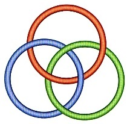
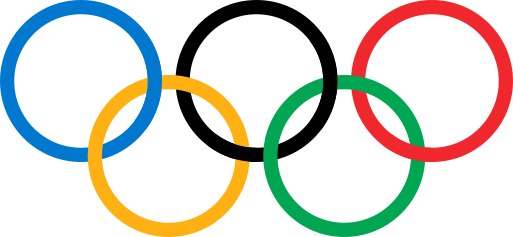
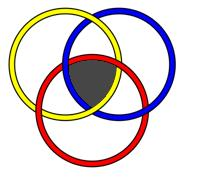
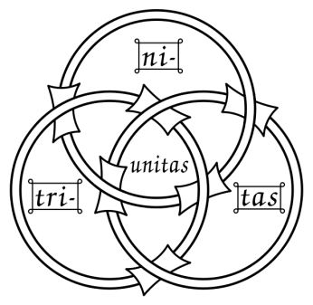
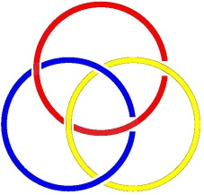
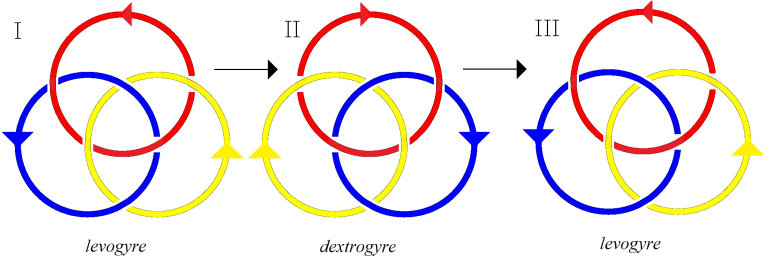
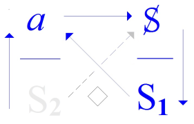
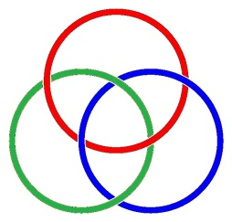
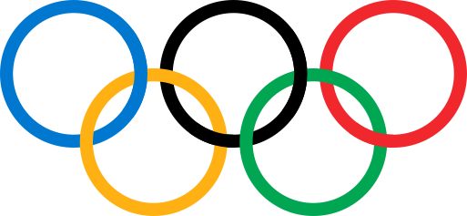

# Leçon 03 | 11 Décembre 1973

<!-- source-url: http://staferla.free.fr/S21/S21 NON-DUPES....docx -->
<!-- seminar: s21 -->
<!-- lesson: 03 -->

<!-- id: s21-03-0001 -->

Vous pouvez dire que c’est bien parce que vous êtes là que je parle...

<!-- id: s21-03-0002 -->

Ne me fatiguez pas, hein, parce que sans ça je m’en vais.

<!-- id: s21-03-0003 -->

Voilà un petit machin que j’ai pris la peine de construire, pour vous le montrer.

<!-- id: s21-03-0004 -->

C’est un nœud borroméen...

<!-- id: s21-03-0005 -->

> je vous avertis que, aujourd’hui, je ne parlerai que de ça.
>
> Alors s’il y en a que ça emmerde, qu’ils sortent, ça me soulagera ...c’est un nœud borroméen.

<!-- id: s21-03-0006 -->

C’est-à-dire...

<!-- id: s21-03-0007 -->

alors enlevez-moi plutôt celui-là, le bleu \[*adressé à Gloria*\] ...vous voyez là, le bleu on l’enlève, le résultat, c’est que les deux autres sont libres.

<!-- id: s21-03-0008 -->

Vous avez vu que je n’ai pas été forcé de les démonter pour qu’ils se libèrent. Voilà !

<!-- id: s21-03-0009 -->

<!-- id: s21-03-0010 -->

Là-dessus Gloria peut vous le remettre, le truc, mais enfin, je pense que c’est déjà suffisamment démonstratif.

<!-- id: s21-03-0011 -->

Ça se fait avec des cubes à l’occasion, ça se fait avec des cubes et on s’aperçoit que... faut qu’il y en ait trois en largeur, cinq en longueur pour le nœud borroméen minimal. Bon.

<!-- id: s21-03-0012 -->

L’idée, c’est évidemment de faire quelque chose qui réponde à 3 plans.

<!-- id: s21-03-0013 -->

C’est-à-dire qui soit fabriqué comme les coordonnées cartésiennes.

<!-- id: s21-03-0014 -->

Quand vous voulez fabriquer ça, vous vous apercevez, eh bien, que vous avez quand même des difficultés.

<!-- id: s21-03-0015 -->

Vous avez des difficultés...

<!-- id: s21-03-0016 -->

> non pas du tout réelles ...vous avez des difficultés à vous bien rendre compte tout de suite à quoi ça va aboutir, combien il va falloir que vous en mettiez dans un sens, et puis dans l’autre. Essayez vous-mêmes...

<!-- id: s21-03-0017 -->

Essayez surtout... il y avait un autre truc que je ne vous ai pas apporté, il y avait un autre truc qui, lui, répondait non pas au nœud borroméen, qui a pour caractéristique que chacun des deux ronds que ça constitue...

<!-- id: s21-03-0018 -->

> c’est pas rond, c’est tout comme ...des deux ronds que ça constitue se libère si vous voulez, si vous en tranchez un.

<!-- id: s21-03-0019 -->

<!-- id: s21-03-0020 -->

Vous avez aussi le système bien connu que je ne vous reproduis pas au tableau parce que, enfin je l’ai là mais je suis fatigué, vous n’avez qu’à repenser aux trois cercles qui servent d’emblème aux Olympiques.

<!-- id: s21-03-0021 -->

Là vous pouvez constater que c’est fait différemment, à savoir que non seulement deux de ces ronds sont noués, mais que le troisième se boucle, non pas avec un seul des deux - ça ne fait pas trois qui fassent chaîne - mais avec les deux.

<!-- id: s21-03-0022 -->

Eh bien, essayez - essayez de faire un montage, un montage de cubes tel que ce soit ainsi, à savoir que la continuité du montage que vous aurez fait, comme ça, vous le ferez, le jaune, le rouge et le bleu, que ça se fasse, que ça soit possible que vous montiez dans trois plans : l’assurance qu’il s’agit bien de plans est faite par la forme cubique, justement, vous êtes forcés de les faire en trois plans - essayez ça.  

<!-- id: s21-03-0023 -->

Vous ne verrez sûrement pas tout de suite que dans ce cas-là, il faut que le côté, si je puis dire, le côté de ce qui va se monter, soit de quatre cubes au minimum. Mais que ces quatre cubes se retrouvent aussi dans l’autre dimension.

<!-- id: s21-03-0024 -->

C’est-à-dire au lieu d’avoir deux fois cinq plus deux, comme dans ce cas-là, ce qui fait douze, vous avez deux fois quatre, plus deux fois deux, ce qui fait également douze, ce qui est curieux.

<!-- id: s21-03-0025 -->

Mais la difficulté que vous aurez même à faire cette petite construction vous sera une bonne expérience de ceci, par quoi je commence, c’est que vous vous apercevrez là à quel point nous ne sentons pas le volume.

<!-- id: s21-03-0026 -->

Parce que vous vasouillerez, vous vasouillerez comme j’ai fait moi-même !

<!-- id: s21-03-0027 -->

Parce que, à partir par exemple, de 3 séries simples de 4, quand vous les avez agencés d’une façon telle que ça puisse faire ces fameux 3 axes qui servent à la construction cartésienne, quand vous n’en voyez que quatre, vous avez aussi bien, pendant un instant, le sentiment que ça pourrait se boucler, que ça pourrait se boucler par exemple comme ici, comme s’il y en avait seulement 4, et puis 3 seulement de largeur. Vous aurez ce sentiment.

<!-- id: s21-03-0028 -->

C’est une façon de vous faire expérimenter ceci : que nous n’avons pas le sens du volume, quel que soit ce que nous avons réussi à imaginer comme 3 dimensions de l’espace.

<!-- id: s21-03-0029 -->

Le sens de la profondeur, de l’épaisseur, est quelque chose qui nous manque, beaucoup plus loin que nous ne le croyons.

<!-- id: s21-03-0030 -->

Ceci pour avancer ce que je veux vous dire au départ : c’est que nous sommes des êtres - vous comme moi - à deux dimensions, malgré l’apparence.

<!-- id: s21-03-0031 -->

Nous habitons le *Flatland* comme s’expriment des auteurs qui ont fait un petit volume sur ce sujet, qui semblent avoir beaucoup de mal, enfin, à s’imaginer des êtres à deux dimensions.

<!-- id: s21-03-0032 -->

Il n’y a pas besoin de les chercher loin. C’est nous tous.

<!-- id: s21-03-0033 -->

C’est tout au moins comme ça, vraiment, que ça se présente.

<!-- id: s21-03-0034 -->

Le mieux que nous puissions arriver à faire, c’est en fait à quoi nous nous limitons, ce serait tout de même étonnant que dans une assemblée, là qui est en train de *scribouiller*, je ne puisse pas le faire sentir : *scribouiller*, c’est ça, c’est le mieux que nous puissions faire.

<!-- id: s21-03-0035 -->

Et c’est ce qui a été fort bien articulé en ceci que, il s’est trouvé, enfin, des gens pour proclamer, dans une autre aire, *a.i.r.e* que la nôtre, que « *l’encre des savants est très supérieure au sang des martyrs* »[^5].

<!-- id: s21-03-0036 -->

Il y a des gens qui ont osé dire ça ! Ils ont osé dire cette évidence.

<!-- id: s21-03-0037 -->

Il faut bien le dire, ce dernier : le sang des martyrs, qu’est-ce que nous en avons ? Des sujets de tableaux...

<!-- id: s21-03-0038 -->

Ceci avec la structure obsessionnelle que Freud a su reconnaître dans ce qui ne fait qu’un : *la religion* et *l’art*.  
Je m’excuse auprès des artistes...

<!-- id: s21-03-0039 -->

> il y en a peut-être quelques-uns, là, égarés dans l’assistance, quoique je n’y croie guère ...je m’excuse auprès des artistes, si la chose leur parvient : ils ne valent pas mieux que la religion. C’est pas beaucoup dire.

<!-- id: s21-03-0040 -->

La *connerie*...

<!-- id: s21-03-0041 -->

dont ce n’est pas la première fois qu’ici je l’évoque, de sorte que, je l’espère, vous n’allez pas vous sentir visés ...la *connerie* est notre essence, dont fait partie ceci que votre demande…

<!-- id: s21-03-0042 -->

> je me suis longtemps cassé la tête pour savoir pourquoi vous étiez si démesurément nombreux. Enfin à force de me la casser, un éclair en est sorti ...justement votre demande, celle qui vous attroupe là, c’est : comment - de la *connerie* - avoir une chance d’en sortir.

<!-- id: s21-03-0043 -->

C’est même pour ça que vous comptez sur moi.

<!-- id: s21-03-0044 -->

À ceci près que cette demande, de la *connerie* en fait partie.

<!-- id: s21-03-0045 -->

Donc cette demande à quoi je cède, un jour de plus...

<!-- id: s21-03-0046 -->

Sachez que ce n’est pas parce que votre nombre est grand que justement je vais essayer de faire semblant. C’est parce que : non pas il est grand, mais il est nombre ...en quoi je me voue à l’abjection, je dois dire, avec quoi dans cette place je me confonds.

<!-- id: s21-03-0047 -->

Il y a une chose que j’ai appelée « *la passe »*, qui se pratique dans mon École, uniquement parce que j’ai voulu tenter d’en avoir le témoignage.

<!-- id: s21-03-0048 -->

Il faut que j’en sois où j’en suis, à savoir aujourd’hui, pour que je voie bien moi-même ce que c’est : se vouer à répondre à n’importe qui, à n’importe quoi, mais à répondre quoi ?

<!-- id: s21-03-0049 -->

Ce que répond *le discours analytique*, c’est ça : ce que vous faites, tout ce que vous faites est sa nature, si l’on peut dire, de sa structure, plus exactement...

<!-- id: s21-03-0050 -->

> contrairement à tout ce qui s’est pensé jusqu’à présent, parmi les spécialistes - « *philosophes »* qu’ils s’appellent ! ...non pas ignorance, l’*ignorance naturelle* comme s’exprime Pascal. 

<!-- id: s21-03-0051 -->

Je remercie quelqu’un qui, pendant que je travaillais dimanche dernier, enfin, a pris soin de m’appeler...

<!-- id: s21-03-0052 -->

> d’ailleurs parce que je l’en avais expressément chargé ...c’était comme ça...

<!-- id: s21-03-0053 -->

> je vous le redirai tout à l’heure ...sous la forme d’une petite suggestion qui m’était venue de lui concernant Pascal.

<!-- id: s21-03-0054 -->

Eh bien, je l’avais chargé de regarder dans Pascal tout cet échelonnement qui va de « *l’ignorance naturelle »* à la *« vraie science »*, avec entre eux ce qu’il désigne comme ça, dans son scribouillage, « *des semi-habiles »*.

<!-- id: s21-03-0055 -->

C’est la personne qui m’a rendu ce service...

<!-- id: s21-03-0056 -->

> enfin, qui a un peu torchonné Pascal, comme ça, pour m’éviter d’avoir à le faire, parce que j’étais claqué ...les *semi-habiles* il a cru pouvoir les identifier aux *non-dupes.*

<!-- id: s21-03-0057 -->

J’espère que j’arriverai, enfin dans cet effort, à vous faire sentir que c’est pas du tout, du tout, du tout, ce que je veux dire.

<!-- id: s21-03-0058 -->

Non pas que les *semi-habiles* ne soient peut-être pas, en effet, des *non-dupes*, moi je crois qu’ils sont aussi *dupes* que les autres, mais contrairement à ce que vous pouvez imaginer, il ne suffit pas d’être *dupes* pour ne pas errer !

<!-- id: s21-03-0059 -->

J’ai dit « *les non-dupes errent »*, encore faut-il n’être pas dupes de n’importe quoi.

<!-- id: s21-03-0060 -->

Et même faut-il être *dupes* spécialement de quelque chose que je vais essayer - essayer ! - que je veux essayer aujourd’hui de vous faire parvenir.

<!-- id: s21-03-0061 -->

Donc, ce que répond le *discours analytique*, c’est ceci, ce que vous faites...

<!-- id: s21-03-0062 -->

> bien loin d’être le fait de *l’ignorance*, ...c’est toujours déterminé, déterminé déjà par *quelque chose qui est* « *<u>savoir</u>* » et que nous appelons *l’inconscient*.

<!-- id: s21-03-0063 -->

*Ce que vous faites sait*...

<!-- id: s21-03-0064 -->

> *sait : s.a.i.t.* ...*sait ce que vous êtes, sait « vous »*.

<!-- id: s21-03-0065 -->

Ce que vous ne sentez pas assez...

<!-- id: s21-03-0066 -->

> enfin je peux pas le croire d’une assemblée aussi nombreuse ...c’est à quel point cet énoncé, c’est du nouveau.

<!-- id: s21-03-0067 -->

Jamais personne des *grands guignols* qui se sont occupés de la question du *savoir*…

<!-- id: s21-03-0068 -->

> et Dieu sait que ce n’est pas sans malaise que j’y range Pascal aussi,
>
> qui est le plus grand de tous les *grands guignols* ! ...jamais personne n’avait osé ce verdict, dont je vous fais remarquer ceci : la réponse de l’inconscient, c’est qu’elle implique le « *sans pardon »*, et même « *sans circonstances atténuantes »*.

<!-- id: s21-03-0069 -->

*Ce que vous faites est savoir, parfaitement déterminé*.

<!-- id: s21-03-0070 -->

En quoi le fait que ce soit déterminé d’une articulation supportée par la génération d’avant, ne vous excuse en rien, puisque ce n’est - *le dire, le dire de ce savoir* - que le faire « *savoir plus endurci* », si je puis dire, « *savoir de toujours* » à la limite.

<!-- id: s21-03-0071 -->

J’ai dégagé de Freud ce sens, parce qu’il le dit, il le dit de toute son œuvre.

<!-- id: s21-03-0072 -->

Quand je vous prie de ne pas me comprendre, vous voyez qu’il y a de quoi !

<!-- id: s21-03-0073 -->

Mais moi je ne puis faire que de l’entendre dans *le dire* de Freud, parce qu’il n’y a rien à faire qu’à en laisser aller les suites.

<!-- id: s21-03-0074 -->

Une fois que c’est énoncé, ça fonde *un nouveau discours*, c’est-à-dire une articulation de structure qui se confirme être tout ce qui existe de lien entre les êtres parlants : pas d’autres liens entre eux que le lien de discours.

<!-- id: s21-03-0075 -->

Ça veut pas dire, naturellement, qu’on n’imagine pas autre chose.

<!-- id: s21-03-0076 -->

Je vous ai dit tout à l’heure que si nous n’avons pas le volume, nous sommes quand même à 2 dimensions.

<!-- id: s21-03-0077 -->

Alors il y a le profil, la projection, la silhouette, enfin tout ce qu’on adore dans un être aimé. On n’adore jamais rien de plus.

<!-- id: s21-03-0078 -->

Et comme je suis parti de là, à propos de cette fameuse histoire du miroir, on s’imagine que j’ai déprécié ça.

<!-- id: s21-03-0079 -->

Je ne l’ai pas du tout déprécié, parce que, comme tout le monde, je m’en contente !

<!-- id: s21-03-0080 -->

Du volume, de l’épaisseur, le seul maniement de ce que je vous ai conseillé tout à l’heure, vous informera à quel point nous sommes absents.

<!-- id: s21-03-0081 -->

Mais il y a tout de même quelque chose d’autre que nous prenons pour le volume, et justement, *c’est le nœud*.

<!-- id: s21-03-0082 -->

On en fait des métaphores, non infondées : les nœuds de l’amitié, les nœuds de l’amour...

<!-- id: s21-03-0083 -->

Eh ben, ça tient à ceci, enfin, c’est notre seule façon d’aborder le volume, quand nous serrons quelqu’un contre nous. Ça m’arrive à moi aussi.

<!-- id: s21-03-0084 -->

Mais est-ce que ces nœuds, nous en sommes si assurés ? Nous en restons pour l’adoration, n’est-ce pas !

<!-- id: s21-03-0085 -->

Et ce que j’ai appelé tout à l’heure les 2 dimensions, les 2 dimensions jolies, jolies...

<!-- id: s21-03-0086 -->

Il y a un auteur récent...

<!-- id: s21-03-0087 -->

> je m’excuse auprès de lui s’il est là : je n’ai pas encore eu le temps de le lire ...il appelle ça *Le Singe d’or* [^6].

<!-- id: s21-03-0088 -->

Comme il m’a fait l’hommage de son livre, je pense que c’est peut-être quand même parce qu’il a quelques échos de ce que je raconte, et peut-être même - qui sait ? - qu’il m’a lu, et que pour en parler ainsi, enfin du *singe d’or*, il faut bien qu’il ait quelque écho de ce que je viens de pousser en avant, de ce qui nous attache à l’image, à l’image à 2 dimensions.

<!-- id: s21-03-0089 -->

Je suis loin de l’avoir déprécié.

<!-- id: s21-03-0090 -->

Non seulement je suis loin de l’avoir déprécié, mais ce serait tout à fait absurde de le dire, parce que les signifiants eux-mêmes, nous sommes forcés d’en passer par la même image, l’image du *flatland*, l’image à deux dimensions, pour démontrer qu’ils s’articulent.

<!-- id: s21-03-0091 -->

 Le nœud borroméen, je vous l’ai d’abord montré mis à plat.

<!-- id: s21-03-0092 -->

Naturellement grâce à des artifices, il y a des endroits où vous voyez apparaître la cassure, ce qui ne peut se représenter que comme cassure, quoique ce soit un nœud.

<!-- id: s21-03-0093 -->

Un nœud justement que j’ai essayé de mettre pour vous en volume, de façon à ce que vous voyiez bien que c’est pas seulement à plat qu’on peut l’aborder, outre que quand vous aurez vous-mêmes manié ce volume, vous vous apercevrez que le volume, là, réalisé en volume, ça permet pas du tout de le distinguer, si je puis dire, ce nœud, de son image spéculaire :

<!-- id: s21-03-0094 -->

- il n’est pas plus *lévogyre* que *dextrogyre*,

<!-- id: s21-03-0095 -->

- il est non seulement parfaitement symétrique,

<!-- id: s21-03-0096 -->

- mais il est sur trois axes, ce qui rend strictement impossible que son image spéculaire en diffère.

<!-- id: s21-03-0097 -->

L’écriture, elle, ne se fait pas dans un espace moins spéculaire que les autres.

<!-- id: s21-03-0098 -->

C’est même le principe de ce très joli exercice qui s’appelle *le palindrome*.

<!-- id: s21-03-0099 -->

Il n’en reste pas moins que ce méli-mélo là, que je viens de faire entre l’*Imaginaire* et le *Symbolique*, ne noie rien, et ne noie pas notamment la différence qu’il y a entre l’*Imaginaire* et le *Symbolique *: c’est bel et bien *la même chose*, une fois imaginé, c’est notre notion commune de l’espace dont nous imaginons qu’il n’a pas de fin.

<!-- id: s21-03-0100 -->

Il faut lire là-dessus les jus de Leibnitz discutant avec Newton : la prétendue supposition d’une limite de l’espace, qu’elle deviendrait impensable - qu’il dit le Leibnitz - parce que s’il avait une limite, alors en dehors de cette limite, alors on pourrait avec un clou faire un petit trou dans sa limite...

<!-- id: s21-03-0101 -->

C’est absolument énorme ce qu’on peut lire, ce qu’on peut lire de l’imagination !

<!-- id: s21-03-0102 -->

Et notamment de ce fait que pour imaginer l’espace...

<!-- id: s21-03-0103 -->

car ce n’aurait pas été moins une imagination, mais peut-être une imagination qui aurait ouvert tout autre chose ...on n’est pas parti de ceci : que dans l’espace il y a des nœuds.

<!-- id: s21-03-0104 -->

Il y aurait sûrement avantage à ce qu’on voie, si je puis dire, qu’*Imaginaire* et *Symbolique* ne sont que des modes d’abord.  
Je les prends sous l’angle de l’espace.

<!-- id: s21-03-0105 -->

Pourquoi ces deux modes ne suffisent pas encore ?

<!-- id: s21-03-0106 -->

Mais enfin, je souligne au passage que le mot « *mode »* est à prendre au sens que ce terme a dans le couple de mots *logique modale*, c’est-à-dire qu’*il n’a de sens que dans le Symbolique*, autrement dit dans son articulation grammaticale.

<!-- id: s21-03-0107 -->

Quand vous approchez certaines langues...

<!-- id: s21-03-0108 -->

> j’ai le sentiment que ce n’est pas faux de le dire de la langue chinoise ...vous vous apercevez que, moins imaginaires que les nôtres - les langues *indo-européennes* - c’est sur le nœud qu’elles jouent.

<!-- id: s21-03-0109 -->

C’est pas un terrain où je vais m’aventurer aujourd’hui parce que j’en ai assez à dire comme ça, mais peut-être que je demanderai, je suggérerai à un Chinois de prendre les choses sous cet angle, et de venir vous dire ce qu’il en pense, si par hasard ce que je lui dis lui ouvre là-dessus la comprenoire, parce qu’il ne suffit pas d’être même habitant d’une langue pour avoir une idée de sa structure, surtout si, comme c’est le cas forcément, puisque le Chinois supposé en question, je ne pourrai m’adresser à lui que si je lui parle dans ma langue, c’est-à-dire que s’il me comprend c’est que déjà, au regard de la sienne, il est foutu.

<!-- id: s21-03-0110 -->

Ce qu’il y a de terrible, c’est que quand nous distinguons un ordre, nous en faisons un *être*.

<!-- id: s21-03-0111 -->

Le mot « *mode* » dans l’occasion. Ça devrait s’éclairer si l’on donnait sa véritable portée à l’expression « *mode d’être »*.

<!-- id: s21-03-0112 -->

Or, il n’y a d’autre *être* que de *mode*, justement.

<!-- id: s21-03-0113 -->

Et le *mode imaginaire* a fait ses preuves, pour ce qui est de *l’être du Symbolique*.

<!-- id: s21-03-0114 -->

Il a fait *si bien ses preuves* qu’on pourrait bien se risquer à tenter de voir si le *mode symbolique* n’éclairerait pas de *l’être de l’Imaginaire*. C’est bien ce que j’ai essayé de faire, que vous le sentiez ou pas.

<!-- id: s21-03-0115 -->

Je voudrais dire en cette 3ème session de l’année de ce séminaire, en quoi consiste sa place, à ce séminaire, et son programme.

<!-- id: s21-03-0116 -->

Et c’est pourquoi je l’ai énoncé en vous parlant, tout de suite, d’abord, du nœud borroméen.

<!-- id: s21-03-0117 -->

Le nœud borroméen...

<!-- id: s21-03-0118 -->

> que comme ça j’ai vu surgir, je veux dire qu’il m’a en quelque sorte envahi ...le nœud borroméen n’a aucune espèce d’*être*.

<!-- id: s21-03-0119 -->

Il n’a pas du tout la consistance de l’espace géométrique dont on sait qu’il n’y a pas de limite

<!-- id: s21-03-0120 -->

- à son coupage en tranches,

<!-- id: s21-03-0121 -->

- à sa projection,

<!-- id: s21-03-0122 -->

- à tout ce que vous voulez...

<!-- id: s21-03-0123 -->

Et même que ça va plus loin, que ça envahit...

<!-- id: s21-03-0124 -->

> et c’est bien en ça que c’est instructif ...ça envahit l’autre ordre.

<!-- id: s21-03-0125 -->

Nous sommes tellement capturés par ce *mode imaginaire*, que quand nous essayons de manipuler l’*ordre symbolique*, nous en arrivons enfin à... souvenez-vous de la façon dont s’abordent les ensembles : on nous parle de *bijection*, de *surjection*, *d’injection*... Tout ça ne va pas sans images, en tout cas c’est avec des images que vous les supportez, ces modes pourtant faits pour vous libérer de l’*imaginaire*.

<!-- id: s21-03-0126 -->

C’est avec des petits points que vous vous apercevrez qu’entre *un domaine et un co-domaine il y a injection, ou bijection ou surjection*.

<!-- id: s21-03-0127 -->

Mais en le supportant de points, vous ne faites rien d’autre qu’une élucubration *imaginaire*.

<!-- id: s21-03-0128 -->

Pourquoi la mise à plat du nœud borroméen n’a-t-elle pas réussi, n’est-elle pas venue d’abord pour nous évoquer un autre départ concernant le point, concernant ce point, ici « *incarné »* si je puis dire, du fait qu’au cœur de cette petite construction vous avez, quoi que vous fassiez, une cellule vide.

<!-- id: s21-03-0129 -->

> 

<!-- id: s21-03-0130 -->

Ce qui n’est pas moins vrai que l’autre nœud, pas *borroméen*, le nœud que j’ai appelé tout à l’heure *olympique*.

<!-- id: s21-03-0131 -->

À ceci près qu’il a des conséquences plus compliquées. Mais laissons.

<!-- id: s21-03-0132 -->

Pourquoi ce *nœud borroméen* n’a-t-il pas évoqué un autre départ concernant « *le point* » ?

<!-- id: s21-03-0133 -->

Le point... le point que nous sommes, parce que même dans le meilleur cas, c’est ce que nous sommes.

<!-- id: s21-03-0134 -->

Jusqu’à présent je ne vous parle que de *l’Imaginaire* et du *Symbolique*, mais justement mon discours tend à vous montrer qu’il faut que ces deux dimensions se complètent de celle du *Réel*.

<!-- id: s21-03-0135 -->

En d’autres termes il faut qu’il y en ait 3 pour qu’il y ait ce point, qui aurait tout de même pu, peut-être, si l’on n’était pas ce qu’on appelle absurdement *géomètre*...

<!-- id: s21-03-0136 -->

parce que, réfléchissez, qu’est-ce que ça a bien à faire, notre géométrie, avec la terre ?

<!-- id: s21-03-0137 -->

Est-ce que la terre c’est pas quelque chose qui n’est pas du tout plat ?

<!-- id: s21-03-0138 -->

Si nous n’avions pas une vocation pour le *mapping*, pour le cadastre, en quoi est-ce que la terre nous suggérerait du plat ?

<!-- id: s21-03-0139 -->

Pourquoi est-ce que ce point, nous ne serions pas partis...

<!-- id: s21-03-0140 -->

> à condition de partir du nœud ...de l’idée qu’un point ça part...

<!-- id: s21-03-0141 -->

> ça part au départ, dans sa définition ...du point de tiraillement, par exemple. Ça vous dit rien, ça ?

<!-- id: s21-03-0142 -->

Entre votre *Symbolique*, votre *Imaginaire* et votre *Réel*...

<!-- id: s21-03-0143 -->

> depuis le temps que je vous les ressasse ...vous sentez pas que votre temps, votre temps se passe à être tiraillé ?

<!-- id: s21-03-0144 -->

En plus ça a un avantage, ça suggère que l’espace implique le temps, et que le temps c’est peut-être rien d’autre justement, qu’une succession des instants de tiraillement.

<!-- id: s21-03-0145 -->

Ça exprimerait en tout cas assez bien le rapport du temps avec cette escroquerie qui se désigne du nom d’« éternité ».

<!-- id: s21-03-0146 -->

Le temps ce n’est peut-être que ça : l’« *étrinité* » de l’espace, ce qui sort là d’un coincement sans remède.

<!-- id: s21-03-0147 -->

\[*l’étreinte de l’éternité* (*anagrammes*) → *l’« étrinité » du point coincé par l’étreinte de la trinité *: *Symbolique, Imaginaire, Réel* \]

<!-- id: s21-03-0148 -->

> 

<!-- id: s21-03-0149 -->

Le nœud borroméen, décidément, n’est pas du tout un truc négligeable.

<!-- id: s21-03-0150 -->

Si vous le mettez à plat, là vous vous apercevrez de tout ce qu’on peut en tirer.

<!-- id: s21-03-0151 -->

Par exemple, là je m’en vais vous en donner un comme ça, comme ça histoire de vous le manipuler.

<!-- id: s21-03-0152 -->

Il est comme ça :

<!-- id: s21-03-0153 -->

<!-- id: s21-03-0154 -->

Voyez un peu ce qu’on peut cogiter, à ceci qu’en somme pour le transformer, quand c’est à plat, d’un *dextrogyre* en *lévogyre*, il suffit dans la première position que vous avez vue là, de faire faire ça à un quelconque d’entre eux.

<!-- id: s21-03-0155 -->

##  

<!-- id: s21-03-0156 -->

Si vous faites ça ensuite à l’autre...

<!-- id: s21-03-0157 -->

> c’est comme ça qu’il faut faire ...et si vous faites ensuite ça au 3ème...

<!-- id: s21-03-0158 -->

> c’est comme ça qu’il faut faire ...à chaque fois vous renversez, c’est-à-dire que de *lévogyre* \[*sens anti-horaire*\] d’abord vous le faites *dextrogyre* \[*sens horaire*\], et que quand vous avez basculé le 3ème, il est de nouveau *lévogyre*.

<!-- id: s21-03-0159 -->

C’est pas dépourvu d’intérêt.

<!-- id: s21-03-0160 -->

Ça éclaire la question de cette fameuse histoire que *l’univers serait ambidextre*, ça permet en tout cas d’en avoir une petite lumière. Ça vaut la peine qu’on s’y arrête. Ça donne une autre idée de la spatialisation.

<!-- id: s21-03-0161 -->

C’est en tout cas une structure *qui change tout à fait la portée du mot* *« espace »* au sens où il est *employé dans l’Esthétique transcendantale*.

<!-- id: s21-03-0162 -->

C’est à savoir que nous ne pouvons percevoir les choses que sous l’angle d’un espace, qui dans Kant est simplement *imaginaire*. S’il y a 3 dimensions de l’espace et si ces 3 dimensions, nous commençons par les énumérer du *Symbolique* et de l’ *Imaginaire,* l’épreuve est à faire de ce que ça donne pour la 3ème, à savoir pour *le Réel*.

<!-- id: s21-03-0163 -->

Il n’y a qu’une chose à en dire pour l’instant.

<!-- id: s21-03-0164 -->

Là, je ne peux pas dire que c’est la date de son baptême à ce ***Réel*** : « *Je te baptise **Réel**, toi, en tant que* 3ème *dimension* » j’ai fait ça, il y a très longtemps. C’est même par là que j’ai commencé mon enseignement.

<!-- id: s21-03-0165 -->

À ceci près que j’ai ajouté dans mon for intérieur : « *Je te baptise **Réel** parce que si tu n’existais pas, il faudrait t’inventer !* ».

<!-- id: s21-03-0166 -->

C’est bien pourquoi je l’ai inventé.

<!-- id: s21-03-0167 -->

Non pas bien sûr qu’il n’ait pas été, depuis bien longtemps, dénommé, car c’est ce qu’il y a de remarquable dans la langue, c’est que le « *naming* »...

<!-- id: s21-03-0168 -->

> heureusement qu’on a l’anglais, hein, pour distinguer *naming* de *nomination*,
>
> *naming*  ça veut dire *to name*, ça veut dire donner le nom propre ...oui, c’est pas pour rien, naturellement, que j’ai dit « *Je te baptise* ». Je n’ai pas peur des mots qui sentent le fagot de la religion, je ne sens pas de tabou à aucune odeur de ratichon, ni même à tout ce qu’elle propage.

<!-- id: s21-03-0169 -->

Le *naming* en tant que nom propre, précède - c’est un fait - la nécessité par quoi il ne va plus *cesser de s’écrire*.

<!-- id: s21-03-0170 -->

Tant que vous ne prendrez pas...

<!-- id: s21-03-0171 -->

> c’est ça le sens de ce que j’ai avancé sous un mode apparemment de sous-estime pour l’*Imaginaire* ...tant que vous ne prendrez pas le *Symbolique* au corps à corps, vous n’en viendrez pas à bout.

<!-- id: s21-03-0172 -->

Ni du même coup de ce que - mon Dieu - j’appelle sur mon papier « l’Église », mais qui est le christianisme.

<!-- id: s21-03-0173 -->

Parce que c’est là que le christianisme il vous baise : il *est* la vraie religion.

<!-- id: s21-03-0174 -->

C’est ce qui devrait vous y faire regarder à deux fois.

<!-- id: s21-03-0175 -->

Il *est* le vrai dans la religion.

<!-- id: s21-03-0176 -->

Ça vaut quand même la peine de s’y intéresser, rien que pour voir ce que ça donne.

<!-- id: s21-03-0177 -->

Mais rien de ce que je dis n’y fera.

<!-- id: s21-03-0178 -->

Je dis, je vous en rebats les oreilles : « *la vérité ne peut que se mi-dire »*.

<!-- id: s21-03-0179 -->

Ça veut dire, confirmer qu’*il n’y a de vérité que mathématisée* :

<!-- id: s21-03-0180 -->

- c’est-à-dire *écrite*,

<!-- id: s21-03-0181 -->

- c’est-à-dire *qu’elle n’est « suspensible », comme vérité, qu’à des axiomes*,

<!-- id: s21-03-0182 -->

- c’est-à-dire *qu’il n’y a de vérité que de ce qui n’a aucun sens*,

<!-- id: s21-03-0183 -->

- c’est-à-dire de ce dont *il n’y a à tirer d’autres conséquences que dans son registre*, le registre de la déduction mathématique dans ce cas,

<!-- id: s21-03-0184 -->

> et comment après cela la psychanalyse peut-elle s’imaginer qu’elle procède de *la vérité* ?

<!-- id: s21-03-0185 -->

Ce n’est là qu’un effet, *effet nécessaire* sans doute, quoique bien sûr *cette nécessité* ne se manifeste nulle part en dehors de mon office, l’office que je suis en train de servir, n’est-ce pas, ce n’est là qu’un effet...

<!-- id: s21-03-0186 -->

cette espèce d’odeur de vérité dans l’analyse ...qu’un effet de ceci qu’elle n’emploie pas d’autre moyen que la parole, strictement pas.

<!-- id: s21-03-0187 -->

Qu’on ne vienne pas me raconter qu’elle emploie *le transfert*.

<!-- id: s21-03-0188 -->

Parce que *le transfert*, lui, n’est pas un moyen, c’est un résultat, qui tient à ce que *la parole*...

<!-- id: s21-03-0189 -->

> par son moyen, moyen de parole ...*révèle quelque chose* qui n’a rien à faire avec elle, et très précisément *le savoir qui existe dans le langage*.

<!-- id: s21-03-0190 -->

Là encore, je n’ai jamais dit que c’est le langage qui est savoir.

<!-- id: s21-03-0191 -->

Le langage...

<!-- id: s21-03-0192 -->

si vous voulez bien vous souvenir de quelques-uns des trucs que j’ai crayonnés au tableau dans le temps où j’en avais la force ...le langage est un effet de ceci *qu’il y a du signifiant* **1** \[**S1**\].

<!-- id: s21-03-0193 -->

Mais le *« savoir »* c’est pas la même chose. Le savoir est la conséquence de ce *qu’il y en a un autre* \[**S2**\].

<!-- id: s21-03-0194 -->

Avec quoi ça fait 2, *en apparence* ! Car ce 2ème tient son statut justement de ceci :

<!-- id: s21-03-0195 -->

- qu’il n’a nul rapport avec le premier,

<!-- id: s21-03-0196 -->

- qu’ils ne font pas chaîne.

<!-- id: s21-03-0197 -->

Même si j’ai dit quelque part, dans mes *scribouillages*...

<!-- id: s21-03-0198 -->

> les tout premiers, hein, *Fonction et champ* c’était pas tellement con ...dans *Fonction et champ*, j’ai peut-être lâché que ça faisait chaîne : c’est une erreur, car pour déchiffrer, il a bien fallu que je fasse quelques tentatives, d’où cette *connerie*.

<!-- id: s21-03-0199 -->

C’est le propre même du déchiffrage : quand on déchiffre, on embrouille.

<!-- id: s21-03-0200 -->

Et c’est même comme ça que je suis bien arrivé à - tout de même au bout du compte - à savoir ce que je faisais.

<!-- id: s21-03-0201 -->

C’est-à-dire ce que c’était que de *déchiffrer*.

<!-- id: s21-03-0202 -->

*C’est* de *substituer* *le signifiant* **1** \[**S1**\] *à l’autre signifiant* \[**S2**\], celui qui ne fait 2 que parce que vous y ajoutez le *déchiffrage*.

<!-- id: s21-03-0203 -->

Ce qui permet tout de suite de compter **3**. Ça n’empêche pas d’écrire - ce que j’ai fait - S *indice* 2, car c’est comme ça qu’il faut que ça se lise la formule du lien de **S1** à **S2** \[**S1→ S2**\].

<!-- id: s21-03-0204 -->

C’est pur forçage, mais ce n’est pas forçage d’une notion.

<!-- id: s21-03-0205 -->

C’est ce qui nous met sous *le joug du* *savoir*.  
Puisque je suis en train de vous parler de la psychanalyse, j’ajoute *le joug du savoir à la place même de la vérité*.

<!-- id: s21-03-0206 -->

À la place aussi bien de la religion dont je viens de vous dire qu’elle est *vraie*, elle.

<!-- id: s21-03-0207 -->

<!-- id: s21-03-0208 -->

Voilà un des piliers du *discours psychanalytique*.

<!-- id: s21-03-0209 -->

Même ce discours, comme tous les autres, je l’ai qualifié de « quadripode ».

<!-- id: s21-03-0210 -->

Peut-être que je l’ai qualifié comme je viens de vous dire...

<!-- id: s21-03-0211 -->

> je l’ai « *qualifié* », justement je considère que c’est une qualification : « *quadripode* », et *pas une quantification* ...parce que plus je vais, plus je suis convaincu que nous ne comptons que jusqu’à **3**.  
Et même si ce n’est que parce que nous comptons **3** que nous pouvons arriver à compter **2***.*

<!-- id: s21-03-0212 -->

Encore « *la vraie religion* »...

<!-- id: s21-03-0213 -->

> puisque c’est bien le christianisme dont je parle ...y a-t-elle regardé à deux fois.

<!-- id: s21-03-0214 -->

L’orthodoxe, notamment, qui ne veut pas du « *filioque »*.

<!-- id: s21-03-0215 -->

C’est pas par hasard : ils ne veulent pas qu’il soit *deux* à ce qu’en procède le *troisième*.

<!-- id: s21-03-0216 -->

Parce que c’est au contraire du *troisième* que le *deux* surgit.

<!-- id: s21-03-0217 -->

De sorte que c’est pas pour rien qu’elle s’appelle elle-même l’*orthodoxe,* elle a raison.

<!-- id: s21-03-0218 -->

Ça ne veut pas dire du tout que ça lui réussisse...

<!-- id: s21-03-0219 -->

> réussir, comme je vous le signale à perte de vue : c’est le signe de rien ...mais que justement ça rate !

<!-- id: s21-03-0220 -->

Je peux bien dire que pour nous analystes c’est plutôt en sa faveur.

<!-- id: s21-03-0221 -->

Ce qui ne l’empêche pas de devoir s’éliminer...

<!-- id: s21-03-0222 -->

L’œucuménisme n’est pas là pour des prunes.

<!-- id: s21-03-0223 -->

Bon ! Enfin je m’étends, et je bavarde, j’en ai assez de mes bateaux, parce qu’ils ne font que vous amuser, mais encore, c’est des bateaux quand même qui flottent...

<!-- id: s21-03-0224 -->

Tout ça vise ceci : qu’on me fait un peu suer à ne me répondre toujours que d’un 2 « *éternel* », Alors que je ne l’ai jamais produit que comme *indice*, c’est-à-dire comme *symptôme*.

<!-- id: s21-03-0225 -->

Le mot d’ailleurs même l’avoue : « *ce* qui *choit ensemble »* \[*étymologie de « symptôme »*\], c’est ce que ça dit.

<!-- id: s21-03-0226 -->

Ça ne veut pas le dire expressément, mais ça le dit quand même : le **2** ne peut être rien d’autre que *ce qui choit ensemble du* **3**.

<!-- id: s21-03-0227 -->

Et c’est pour ça que cette année, je prends comme sujet...

<!-- id: s21-03-0228 -->

> c’est ce que ça veut dire, ça veut le dire en tout cas aujourd’hui où j’y insiste ...*le nœud borroméen* : il est évident que c’est un effort pédagogique.

<!-- id: s21-03-0229 -->

C’est en raison quand même de quelque chose de l’ordre de cette débilité qui s’appelle « *l’amour* »...

<!-- id: s21-03-0230 -->

> où l’on ne peut guère faire mieux que de se débrouiller ...c’est en raison de ceci que - mon Dieu - que le texte de Kant sur la pédagogie... que j’ai rouvert pour l’avoir acquis en édition originale, faut bien que j’aie mes petits plaisirs...

<!-- id: s21-03-0231 -->

Mais vous pouvez le trouver, il a été réédité par, je crois, les Presses Universitaires, enfin quelqu’un d’ici m’en a fait cadeau.

<!-- id: s21-03-0232 -->

C’est passionnant sur le sujet de ce qu’il en est des débiles, on n’a rien écrit de mieux, même pas ce qu’a écrit Maud Mannoni.

<!-- id: s21-03-0233 -->

L’enfant « *est fait »* pour apprendre quelque chose.

<!-- id: s21-03-0234 -->

Voilà ce que nous énonce Freud... \[*lapsus*\] ce que nous énonce Kant ! \[Rires\].

<!-- id: s21-03-0235 -->

C’est quand même, tout de même, quelque chose, enfin, quelque chose d’extraordinaire ! C’est quelque chose d’extraordinaire qu’il en ait eu en somme le pressentiment. Car comment pouvait-il le justifier ?

<!-- id: s21-03-0236 -->

Il « *est fait »* pour apprendre quelque chose, c’est-à-dire pour que le nœud se fasse bien.

<!-- id: s21-03-0237 -->

Car il n’y a rien de plus facile que ça rate, surtout si vous le mettez sous cette forme, à savoir la même que celle-là.

<!-- id: s21-03-0238 -->

Regardez voilà le cercle vert et voilà le cercle rouge, enfin, le rond.

<!-- id: s21-03-0239 -->

> 

<!-- id: s21-03-0240 -->

Supposez que pour le 3ème, pour le construire, je parte de l’intérieur de celui-là, le rouge, qui est à l’extérieur.

<!-- id: s21-03-0241 -->

Pour le construire, il faut que je le tresse, et qu’il passe quelque part, soit en dessous soit au dessus du vert.

<!-- id: s21-03-0242 -->

Mais si je suis parti d’en dessous du rouge, voyez le rouge est là, plus grand que le vert, si je suis parti d’en dessous du rouge, que je le fasse passer sur ou sous le vert, le résultat sera le même, à savoir qu’il n’y aura pas de nœud.

<!-- id: s21-03-0243 -->

En d’autres termes, si je ne pars pas du dessus du rouge, avec devoir de passer sous le vert, il y aura pas de nœud borroméen.

<!-- id: s21-03-0244 -->

Kant ne peut pas savoir, parce que ce n’est pas de ça qu’il part, en somme pourquoi l’enfant doit apprendre quelque chose.

<!-- id: s21-03-0245 -->

Il doit apprendre quelque chose pour que le nœud se fasse bien.

<!-- id: s21-03-0246 -->

Pour qu’il ne soit pas, si je puis dire, non-dupe, c’est-à-dire dupe du possible.

<!-- id: s21-03-0247 -->

Dupe-dupe, c’est un peu trop : les non-dupes sont les deux fois dupes. Ils sont justement dupes d’être deux. Et c’est en somme la seule objection dont j’ai cru partir...

<!-- id: s21-03-0248 -->

> parce que j’avais affaire à des oreilles qui n’étaient pas précisément, enfin « éveillées » ...c’est l’objection, la seule, la seule *objection* que j’ai à faire à la « *moi-ïté* ».

<!-- id: s21-03-0249 -->

C’est une expression que m’a attribuée...

<!-- id: s21-03-0250 -->

> à tort ou à raison, car je l’ai peut-être dit en l’occasion ...un de mes analysants, récemment, et qui est depuis longtemps de mon assistance séminariste.

<!-- id: s21-03-0251 -->

La *moi-ïté*  comme il s’exprime, c’est évidemment tout de suite *choir* dans le **2**, puisque *la moi-ïté * est forcément faite de **2** *moitiés*.

<!-- id: s21-03-0252 -->

Et si j’ai dit que la religion c’est ce qu’on peut faire de plus vrai, dans la religion je vous ferai remarquer ceci...

<!-- id: s21-03-0253 -->

> sur lequel j’ai jaspiné un bon bout de temps ...que « *tu aimeras ton prochain comme toi-même* », est-ce que ça veut dire que vous serez **3**, oui ou non ?

<!-- id: s21-03-0254 -->

Le nœud borroméen ne peut être fait que de 3.

<!-- id: s21-03-0255 -->

L’*Imaginaire*, le *Symbolique*, ça ne suffit pas, il y faut l’élément tiers, et je le désigne du ***Réel***.

<!-- id: s21-03-0256 -->

Il faut qu’il y ait cette solidarité déterminante dont il y a sujet, sujet parlé, en tout cas.

<!-- id: s21-03-0257 -->

La perte d’une quelconque de ces 3 *dimensions*...

<!-- id: s21-03-0258 -->

La condition pour que le nœud tienne, c’est que la perte d’une quelconque de ces 3 *dimensions* doit rendre folles, c’est-à-dire libres l’une de l’autre, les deux autres.  

<!-- id: s21-03-0259 -->

Ces trois dimensions, je vous les représente de quoi ?

<!-- id: s21-03-0260 -->

De *ronds de ficelle*, comme on a bien voulu...

<!-- id: s21-03-0261 -->

> et à très juste titre, de façon pertinente ...intituler mon avant-dernier séminaire de l’année dernière.

<!-- id: s21-03-0262 -->

Qu’est-ce que c’est, comme dimension, qu’un *rond de ficelle *?

<!-- id: s21-03-0263 -->

Je vous fais remarquer que ce n’est même pas un nœud, un *rond de ficelle*, parce qu’un nœud, ça se voit, ça se fait, ça peut s’écrire au tableau, à condition de faire les petites interruptions nécessaires, et Dieu sait ce qu’il en faut mettre, tellement on a peu d’imagination. Voilà !

<!-- id: s21-03-0264 -->

Voyez, il faut encore que je corrige, un nœud c’est ça.

<!-- id: s21-03-0265 -->

En d’autres termes, un nœud ça se dénoue.

<!-- id: s21-03-0266 -->

Si vous le dénouez, vous êtes foutu, parce que vous ne pouvez plus qu’en faire un autre, et que vous n’arriverez jamais à distinguer un nœud d’un autre nœud.

<!-- id: s21-03-0267 -->

Parce qu’ils ne sont pas tous pareils, ces nœuds.

<!-- id: s21-03-0268 -->

C’est bien pourquoi le rond de ficelle est nécessaire...

<!-- id: s21-03-0269 -->

Non pas que ça soit un nœud, mais il est nécessaire pour la théorie des nœuds.

<!-- id: s21-03-0270 -->

Car en effet, pour que un nœud, on puisse le distinguer d’un autre, il ne faut en aucun cas le dénouer, ou alors quand vous ferez un autre nœud vous aurez le sentiment que c’est le même.

<!-- id: s21-03-0271 -->

C’est pour ça qu’il n’y a que deux trucs :

<!-- id: s21-03-0272 -->

- ou bien la corde qui fait nœud, l’étendre à l’infini, et alors là vous ne pouvez pas le dénouer,

<!-- id: s21-03-0273 -->

- ou bien joindre ses deux bouts, ce qui est exactement la même chose.

<!-- id: s21-03-0274 -->

Et c’est ce que justifie le rond de ficelle.

<!-- id: s21-03-0275 -->

Le rond de ficelle, c’est quelque chose qui vous permet la théorie d’un nœud.

<!-- id: s21-03-0276 -->

C’est ce qui exige pour se rompre de devoir être coupé, la « *coupabilité* »...

<!-- id: s21-03-0277 -->

C’est que, ce qui se distingue...

<!-- id: s21-03-0278 -->

> mais totalement, ça ne vous est peut-être pas encore venu à l’esprit, mais j’espère tout de même à certains ...c’est que c’est une topologie.

<!-- id: s21-03-0279 -->

Un rond de ficelle, c’est un *tore*.

<!-- id: s21-03-0280 -->

Et c’est seulement ce qui permet d’élaborer le nœud : on ne noue pas ensemble deux sphères.  
Mais l’intéressant, c’est qu’on ne noue pas **2** ronds de ficelle, dans cette affaire, on en noue **3**, mais de telle sorte que le 3**ème** seul noue les deux autres.

<!-- id: s21-03-0281 -->

Il y a quelque part, dans un article dit *de La Causalité psychique* [^7], un endroit...

<!-- id: s21-03-0282 -->

un endroit autour de quoi quelques personnes se sont escrimées ...où je noue...

<!-- id: s21-03-0283 -->

puisque c’est de cela qu’il s’agit ...la liberté et la folie, où je dis que l’une ne se conçoit pas sans l’autre.

<!-- id: s21-03-0284 -->

Ce qui, bien entendu trouble, parce que tout de même, tout de suite ils pensent que je dis que la liberté c’est la folie.

<!-- id: s21-03-0285 -->

Puisque pour ne pas me faire comprendre - pourquoi pas ? - je m’y entends...

<!-- id: s21-03-0286 -->

Seulement, ce que je veux vous faire remarquer à cette occasion, c’est que l’intérêt de joindre ainsi dans le nœud borroméen *le Symbolique* et *l’Imaginaire* et *le Réel*, c’est qu’il en résulte...

<!-- id: s21-03-0287 -->

non seulement il en résulte, mais il doit en résulter, c’est-à-dire que si le cas est bon, vous me permettre cette abréviation vu l’heure où nous arrivons ...si le cas est bon, il suffit de trancher un quelconque des ronds de ficelle pour que les deux autres soient libres l’un et l’autre.  

<!-- id: s21-03-0288 -->

En d’autres termes, si le cas est bon...

<!-- id: s21-03-0289 -->

laissez-moi impliquer que c’est le résultat de la bonne pédagogie, à savoir qu’on n’a pas raté son nouement primitif ...si le cas est bon, quand il y a un de ces ronds de ficelle qui vous manque, vous devez devenir fou.

<!-- id: s21-03-0290 -->

Et c’est en ça que dans le bon cas, le cas que j’ai appelé liberté, c’est en ça que le bon cas consiste.

<!-- id: s21-03-0291 -->

À savoir que s’il y a quelque chose de normal, c’est que quand une des dimensions vous claque pour une raison quelconque, vous devez devenir vraiment fou.

<!-- id: s21-03-0292 -->

Et c’est là-dessus que je voudrais finir pour vous en montrer l’intérêt.

<!-- id: s21-03-0293 -->

<!-- id: s21-03-0294 -->

Supposez le cas de l’autre nœud, du nœud que j’ai appelé tout à l’heure *olympique* : si l’un de vos ronds de ficelle vous claque, si je puis dire, du fait de quelque chose qui ne vous concerne pas, vous n’en devenez pas fou pour autant.

<!-- id: s21-03-0295 -->

Ceci parce que, que vous le sachiez ou pas, les 2 autres nœuds tiennent ensemble, et c’est ça qui veut dire que vous êtes névrosé.  

<!-- id: s21-03-0296 -->

C’est bien en quoi, toujours, j’ai affirmé ceci : qu’on ne sait pas assez que les névrosés sont increvables ! \[*Rires*\].  
Les seuls gens que j’ai vus se comporter d’une façon admirable pendant la dernière guerre...

<!-- id: s21-03-0297 -->

> pour l’évoquer, Dieu sait que ça ne me fait pas spécialement plaisir ...ce sont mes névrosés, ceux que je n’avais pas encore guéris. Ceux-là étaient absolument sublimes.

<!-- id: s21-03-0298 -->

Rien ne leur fait : que ce soit *le Réel, l’Imaginaire* ou *le Symbolique* qui leur manque, ils tiennent le coup.

<!-- id: s21-03-0299 -->

Et je ne sais pas si certains de vous s’en souviennent, j’ai fait quelque chose un temps, sur la phobie du petit Hans.

<!-- id: s21-03-0300 -->

C’est très curieux, je n’ai jamais vu personne mettre en valeur ceci, ceci que j’ai non seulement écrit, mais répété, mais ressassé, j’ai rien vu d’autre, non mais en cherchant : enfin qu’est-ce que c’était que cette sacrée histoire de cheval, parce que bien entendu je me posais la question comme tout le monde : pourquoi le cheval, pourquoi est-ce que c’est ça qui lui fait si peur ?  

<!-- id: s21-03-0301 -->

L’explication que j’ai trouvée, parce que je l’ai donnée, je l’ai travaillée, je l’ai insisté, c’est que le cheval n’était que le *représentant*, je peux même le dire, de trois circuits. J’ai pas souligné, à la vérité qu’ils étaient trois, ces circuits.  
Mais le cheval représentait un certain nombre de circuits, j’ai même été chercher une carte de Vienne pour bien les marquer, parce que c’est dans le texte de Freud, comment les aurais-je trouvés sans ça ?

<!-- id: s21-03-0302 -->

C’est dans la mesure où la phobie du petit Hans, c’est très précisément en ce nœud triple dont les 3 ronds tiennent ensemble : c’est en ceci qu’il est névrosé : c’est que, coupez-en un, les deux autres tiennent toujours.

<!-- id: s21-03-0303 -->

Ce n’est pas, certes, que nous nous penchions sur ceci en quoi justement il y a d’autres couples dans la névrose qui sont plus simples que celui de la phobie, nous y viendrons.

<!-- id: s21-03-0304 -->

L’important n’est même pas en ça, qui fait si joliment image, vous avez pu dire en somme que j’ai défini la normale, en ce sens que c’est fait de telle façon que ça ne peut que rendre fou, quand il y en a un des trois ronds qui claque.

<!-- id: s21-03-0305 -->

Mais l’important, c’est pas ça du tout.

<!-- id: s21-03-0306 -->

L’important c’est que, bien qu’ils soient colorés de couleurs diverses l’un par rapport à l’autre ces trois ronds, ces ronds de ficelle ils sont strictement équivalents.

<!-- id: s21-03-0307 -->

Je veux dire que l’important, c’est qu’aussi bien *le Réel*, que *l’ Imaginaire* ou que *le Symbolique* peuvent jouer exactement la même fonction par rapport aux deux autres.

<!-- id: s21-03-0308 -->

Ça ne va pas de soi...

<!-- id: s21-03-0309 -->

> si je vous présente le nœud comme ça, à savoir le rouge au-dessus du vert et le coinçant,
>
> et le noir, j’appelle celui-là le noir provisoirement puisqu’il a des points noirs, et le noir en bonne position ...ça ne va pas de soi que je peux très facilement mettre les deux autres dans une position différente, c’est-à-dire faire que le vert soit au-dessus du rouge, le nœud borroméen étant tout aussi correct, à savoir n’ayant à aucun moment été tranché.

<!-- id: s21-03-0310 -->

On peut croire qu’il y a un obstacle à ce que je mette le vert à la place du rouge à partir d’une position fixe du noir, c’est pourtant le cas. C’est pourtant le cas et c’est aussi ce qu’il faut dire concernant les trois dimensions de notre *Réel*.

<!-- id: s21-03-0311 -->

Ce *Réel* sur lequel on s’interroge à la fin de *La Science des Rêves*, et ce qu’il faut dire c’est ceci, c’est que si je vous ai barbés la dernière fois avec cette histoire de l’occulte, c’est justement en ceci, qui pour Freud est en quelque sorte l’aveu patent, c’est que sur les 3 de ces dimensions dont il nous dénonce si bien deux, qu’est-ce que c’est pour Freud que *le Réel ?*  
Eh bien je vais vous le dire aujourd’hui : c’est justement l’occulte.

<!-- id: s21-03-0312 -->

Et ça l’est précisément en ceci qu’il le considère comme *l’impossible*.

<!-- id: s21-03-0313 -->

Car cette histoire d’occultisme et de télépathie, il nous prévient, il y insiste, qu’il n’y croit en rien.

<!-- id: s21-03-0314 -->

Comment est-ce que quelqu’un comme Freud a pu poursuivre enfin, avec cette obstination, cette ombre de cet occulte qu’il considérait comme à proprement parler d’une cogitation d’imbéciles ?

<!-- id: s21-03-0315 -->

Lisez-le bien et vous le verrez.

<!-- id: s21-03-0316 -->

Eh bien ! l’intérêt de ce que j’ai voulu vous avancer la dernière fois, et que je ne vous ai pas dit, sinon par la phrase de la fin : « *qu’il n’y a pas d’initiation* », dont ceux qui ont des oreilles ont très bien su repérer que c’était la seule phrase intéressante, mais bon, c’est justement que, pour Freud...

<!-- id: s21-03-0317 -->

> et c’est bien là quelque chose qui mérite que nous y regardions à deux fois, ...il était dupe du *Réel*.

<!-- id: s21-03-0318 -->

Il était dupe du *Réel* même s’il n’y croyait pas.

<!-- id: s21-03-0319 -->

Et c’est bien de ça qu’il s’agit.

<!-- id: s21-03-0320 -->

La bonne dupe, celle qui n’erre pas, il faut qu’il y ait quelque part un *Réel* dont elle soit dupe.

## Notes

[^5]: Un [*Hadith*](http://fr.wikipedia.org/wiki/Had%C3%AEth) du Prophète Mohamed annonce que « *L’encre des savants est plus sacrée que le sang des martyrs.* »

[^6]:
    ###  Guy Lardreau : *Le Singe d’or*, Mercure De France, 1973. 

    Bas du formulaire

[^7]: Cf. *Propos sur la causalité psychique*, in *Écrits*, Seuil, 1966, p. 151, ou Points Seuil, 1999, T. 1, p. 150.
