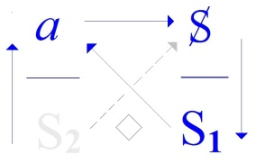
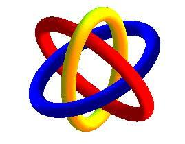
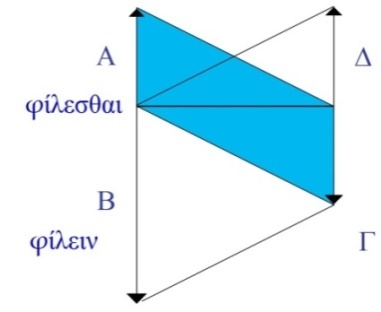

# Leçon 07 | 12 Février 1974

<!-- source-url: http://staferla.free.fr/S21/S21 NON-DUPES....docx -->
<!-- seminar: s21 -->
<!-- lesson: 07 -->

<!-- id: s21-07-0001 -->

Bon, eh bien j’espérais...

<!-- id: s21-07-0002 -->

J’ai appris sur le tard qu’il y avait les vacances dites « *de Mardi gras* », justement parce que c’est pas le « *Mardi gras* », alors j’ai maintenu ma... ma *je ne sais pas quoi* - mon séminaire...

<!-- id: s21-07-0003 -->

Je l’ai maintenu aujourd’hui parce que j’espérais que grâce à ça je pourrais peut-être me promener au milieu de vous, parce que vous seriez moins nombreux, et en somme parler un peu avec les gens qui sont censés m’écouter.

<!-- id: s21-07-0004 -->

Vous êtes un peu moins nombreux, c’est vrai...

<!-- id: s21-07-0005 -->

> ce qui d’ailleurs me permet de le faire ...mais enfin, je regrette de ne pas avoir eu cette occasion de m’exprimer d’une façon un peu plus fami­lière et directe. Voilà !

<!-- id: s21-07-0006 -->

Là-dessus je vous annonce qu’il vient de sortir une espè­ce de plaquette, que je vous envoie \[*Lacan lance la plaquette dans la salle*\], il y a un *encart* dedans, *l’encart* est aussi inté­ressant que la plaquette, de sorte que ça va aussi bien si c’est pas les mêmes qui l’ont reçu. Voilà !

<!-- id: s21-07-0007 -->

En principe - *en principe* ! - ça doit passer à la télévision. Donnez l’encart à quelqu’un d’autre, voilà.

<!-- id: s21-07-0008 -->

C’est des questions que Jacques-Alain Miller a eu la bonté de me poser, dans l’es­poir de faire « *Télévision* ».

<!-- id: s21-07-0009 -->

Naturellement, c’est un espoir tout à fait abusif : il m’a posé les questions qu’il est capable de me poser à partir de l’idée qu’il se fait de la télévision.

<!-- id: s21-07-0010 -->

Il m’a posé des questions kantiennes en particulier, comme si tout le monde était kantien...

<!-- id: s21-07-0011 -->

> mais jus­qu’à un certain point c’est vrai, tout le monde est kantien ...de sorte que les questions qu’il m’a posées m’ont donné simplement occasion de répondre au niveau présumé « *Télévision* » par Jacques-Alain Miller.

<!-- id: s21-07-0012 -->

Le résultat m’a paru quand même digne d’être retenu puisque je l’ai fait publier. Voilà !

<!-- id: s21-07-0013 -->

Alors maintenant, je vais vous parler un peu, aujourd’hui, en essayant de rester dans la note de ce que j’espérais.

<!-- id: s21-07-0014 -->

*Ce que j’espérais vous dire*, c’était en somme, *c’était quelque chose* - disons, en gros, comme ça - dont la visée...

<!-- id: s21-07-0015 -->

> enfin, vous en ferez le titre que vous voudrez ...*dont la visée était* de vous dire la différence...

<!-- id: s21-07-0016 -->

> c’est ça qui me paraît important dans ce que j’essaie de vous apporter cette année ...*de vous dire la différence qu’il y a entre le « vrai » et le « Réel ».*

<!-- id: s21-07-0017 -->

Comme vous vous en êtes peut-être aperçus, n’est-ce pas, je me suis avancé cette année avec vous, je me suis avancé cette année avec - comme dans *La paix chez soi* [^14] de Courteline, n’est-ce pas - « *le truc d’un côté et le machin de l’autre* », c’est tout ce qu’elle a réussi à obtenir, la petite bonne femme, en achetant je ne sais quel lustre, qui justement se met en deux morceaux.

<!-- id: s21-07-0018 -->

Enfin, contrairement à elle, mes trois morceaux, à savoir les trois ronds consistants dont s’ajuste *le nœud borro­méen*, c’est ce que je tiens dans la main pour vous parler de ce que *les non-dupes errent*.

<!-- id: s21-07-0019 -->

Ça n’a pas l’air d’avoir *un rapport direct, immédiat* tout au moins, *ça ne saute pas aux yeux*.

<!-- id: s21-07-0020 -->

Mais vous savez peut-être qu’un de ces trois ronds, je le dénomme du *Réel*, les deux autres étant l’*Imaginaire* et le *Symbolique*, et que c’est autour de ça que j’essaie de vous faire sentir *quelque chose*.

<!-- id: s21-07-0021 -->

Vous faire sentir ceci, d’abord...

<!-- id: s21-07-0022 -->

> que j’ai déjà proféré, mais qui ne vous a pas forcément sauté aux yeux n’est-ce pas ...c’est que juste­ment je les prends sous seulement cet angle *qu’ils sont trois*, qu’ils sont trois et *également consistants*.

<!-- id: s21-07-0023 -->

C’est une première façon d’aborder ce qu’il en est du *Réel*.

<!-- id: s21-07-0024 -->

Il est certain que le *Réel*, c’est ce qui les fait trois, sans que pour autant, ce qui les *fait trois* soit le troisiè­me.

<!-- id: s21-07-0025 -->

S’il se rajoute, ce n’est que pour faire trois. Et justement il ne se rajoute pas.

<!-- id: s21-07-0026 -->

Parce que chacun des trois se rajoute tout autant, sans pour autant, sans pour autant être le troisième.

<!-- id: s21-07-0027 -->

*Il n’est là que parce que les deux autres ne font pas nœud sans trois*, si je puis m’exprimer ainsi.

<!-- id: s21-07-0028 -->

Et c’est ce que je voudrais vous dire : c’est que *la logique* ne peut se définir que d’être *la science du Réel*.

<!-- id: s21-07-0029 -->

L’embêtant, c’est *qu’elle ne parle et qu’elle ne part, que du vrai*.

<!-- id: s21-07-0030 -->

Elle a pas tout de suite commencé comme ça. Il y avait peut-être \- comme tout de même dans l’ensemble vous le savez - il y avait un nommé Aristote qui a frayé la question.

<!-- id: s21-07-0031 -->

Évidemment le mot de *vrai*, ἀλήθής traîne pas mal dans son machin qu’il a appelé l’*Organon* et dont on a fait depuis *La logique*.

<!-- id: s21-07-0032 -->

Lui, frayait, il se débrouillait comme il pouvait, et l’ennui actuellement, dans notre affaire avec l’*Organon,* c’est que ça ne peut pas paraître sans que la moitié de la page soit tenue par des, disons « *commentaires* » de l’*Organon,* qui ne sont pas du tout à proprement parler ce qu’on peut appeler commentaires, mais une certaine façon d’organifier sur l’*Organon,* c’est-à-dire de le rendre comestible.

<!-- id: s21-07-0033 -->

Ça commence

<!-- id: s21-07-0034 -->

- à un certain Alexandre,

<!-- id: s21-07-0035 -->

- à un autre qui s’appelle Simplicius,

<!-- id: s21-07-0036 -->

- et puis plus tard un nommé Pacius,

<!-- id: s21-07-0037 -->

- et puis après, tout ce qu’on veut : un Pierre d’Espagne,

<!-- id: s21-07-0038 -->

- un saint Thomas d’Aquin, enfin grâce à ça, la chose a été complètement déviée, ...c’est au point que ce n’est pas du tout facile, parce que malgré tout on a un espèce de *frottis*, *on s’est frottés* à ces divers auteurs, et on les entend, on entend Aristote malgré tout, *à travers eux*.

<!-- id: s21-07-0039 -->

Ce serait bien si quelqu’un arrivait à faire l’effort en somme de lire...

<!-- id: s21-07-0040 -->

> par exemple rien que ceci qui est le 2nd volume de cet *Organon* ...à lire ce qu’on appelle...

<!-- id: s21-07-0041 -->

> qu’on appelle, c’est parce qu’on l’a *intitulé* comme ça, c’est aussi un titre qui est venu après coup ...on appelle ça *Les Premiers Analytiques -* arriver à le lire...

<!-- id: s21-07-0042 -->

> non pas bien sûr de première impression, parce que quelqu’un qui le lirait de pre­mière impression,
>
> simplement, n’y comprendrait pas plus que ce que dans l’ensemble vous comprenez à ce que je raconte,
>
> c’est-à-dire pas lourd ...la chose absolument qu’il faudrait qu’un jour quelqu’un arrive à faire, c’est justement à connaître assez bien la différence de ce que dit Aristote avec ce que nous ont transmis ceux qui ont ressassé le truc, à en voir assez bien la différence pour voir combien Aristote frayait et comment il frayait, et - pourquoi pas ? - même les endroits où il glissait, où il s’est tordu le pied, où... c’est un monde ! Ouais...

<!-- id: s21-07-0043 -->

Il est tout à fait clair que je n’en rajoute pas, là.

<!-- id: s21-07-0044 -->

Ou plutôt que ce que je rajoute, ce serait destiné à proposer tout au moins une tâche, à savoir jusqu’à quel point...

<!-- id: s21-07-0045 -->

> et dans Aristote, me semble-t-il, on peut le saisir ...à quel point c’est un frayage, et un frayage qui ne s’éclaire qu’à partir de ceci que j’ai énoncé juste à l’instant : que *la logique, c’est* proprement *la science du Réel.*

<!-- id: s21-07-0046 -->

Dans Aristote, on n’est pas tellement encombré par *le vrai*. Il ne parle pas de vrai à propos du prédicat.

<!-- id: s21-07-0047 -->

Il ânonne, bien sûr, et à cause de ça on s’est cru tout à fait obligé de faire pareil, on parle de *l’homme*, de *l’animal*, *du vivant* à l’occasion, et encore je dis là des choses qui ont tout de suite un vague sens, ça s’emboîte, *l’homme, l’animal,* *le vivant* : tout animal est vivant, tout homme est animal, moyennant quoi tout homme sera vivant. Ouais...

<!-- id: s21-07-0048 -->

Il est tout à fait clair dès ce départ, comme la suite d’ailleurs l’a bien montré, que tout ça ne veut rien dire.

<!-- id: s21-07-0049 -->

En d’autres termes que *le vrai*, dans l’affaire, est tout à fait hors de saison, déplacé.

<!-- id: s21-07-0050 -->

Et ce qui le rend tangible c’est que ces cases qu’il remplit comme il peut avec, par exemple, ces trois mots que je viens de dire : *homme*, *animal*, et *vivant*, il peut aussi bien mettre n’importe quoi, *le cygne*, *le noir*... enfin n’importe quoi d’autre, *le blanc*, le blanc traîne partout, on ne sait pas qu’en faire

<!-- id: s21-07-0051 -->

Il est rendu manifeste, dans ce que j’ai appelé son *frayage,* que ces termes, tout son effort est justement de pouvoir s’en passer, c’est-à-dire qu’il les vide de sens. Et il les vide de sens par ce moyen qu’il les remplace par des lettres, à savoir α, β, γ, par exemple, au lieu de mes trois premiers termes, là, que je vous ai extraits, qui sont dans Aristote.

<!-- id: s21-07-0052 -->

Il dit... ça ne commence à prendre forme qu’à partir du moment où il énoncera que

<!-- id: s21-07-0053 -->

- *tout* α *est* β,

<!-- id: s21-07-0054 -->

- *tout* β *est* γ,

<!-- id: s21-07-0055 -->

- moyennant quoi *tout* α *sera* γ.

<!-- id: s21-07-0056 -->

En d’autres termes, il procédera de façon à pouvoir qualifier deux de ces termes - ceux qui font le joint - de *moyens*, moyennant quoi il pourra établir une relation entre les deux extrêmes.

<!-- id: s21-07-0057 -->

C’est en cela qu’au départ - dès le départ - se touche qu’il ne s’agit pas du *vrai*.

<!-- id: s21-07-0058 -->

Car peu importe que tel animal soit blanc ou pas, chacun sait qu’il y a des cygnes noirs - des cygnes : *c, y, g, n, e, s -* l’important est que quelque chose soit articulé grâce à quoi s’introduit comme tel *le Réel*.

<!-- id: s21-07-0059 -->

Ce n’est pas pour rien que dans le syllogisme il y a trois termes : les deux extrêmes, et le moyen.

<!-- id: s21-07-0060 -->

C’est qu’en fin de compte...

<!-- id: s21-07-0061 -->

> je dis « *en fin de compte* » parce que ce n’est qu’un premier essai ...tout se passe comme s’il avait quelque chose comme un pressentiment du *nœud borroméen*.

<!-- id: s21-07-0062 -->

C’est à savoir que tout de suite il touche du doigt, à partir du moment où il aborde *le Réel*, qu’il faut qu’il y en ait **3**.

<!-- id: s21-07-0063 -->

Évidemment, ces **3** il les manie tout de travers, c’est à savoir qu’il s’imagine qu’ils tiennent ensemble **2** par **2**.

<!-- id: s21-07-0064 -->

C’est une erreur.

<!-- id: s21-07-0065 -->

Il s’imagine qu’ils tiennent ensemble **2** par **2**, et même jusqu’à un certain point, on peut traduire la chose en disant qu’il les fait concentriques.

<!-- id: s21-07-0066 -->

À savoir qu’il y a :

<!-- id: s21-07-0067 -->

- la sphère des vivants, par exemple,

<!-- id: s21-07-0068 -->

- puis à l’intérieur, la sphère des animaux, la sphère ou le rond

<!-- id: s21-07-0069 -->

- et puis à l’intérieur encore la sphère des hommes.

<!-- id: s21-07-0070 -->

C’est ce qu’on appelle le « *traduire en extension* ».

<!-- id: s21-07-0071 -->

Naturellement, on s’y est employé, parce qu’on en est aussi embarrassé que d’un terme dont je me sers beaucoup...

<!-- id: s21-07-0072 -->

> mais ce n’est pas sans raison d’être ...on en est embarrassé « *comme le poisson d’une pomme* ».

<!-- id: s21-07-0073 -->

Pour vous délasser, je fais ici une franche parenthèse : ça a rien à faire avec Aristote, parce qu’Aristote, de ça, n’a pas la moindre espèce d’idée.

<!-- id: s21-07-0074 -->

Moi je suis embarrassé, par exemple, de votre nombre, tout à fait « *comme un poisson d’une pomme* ».

<!-- id: s21-07-0075 -->

Et pourtant il y a d’autres moments où je vous dis que les rapports de mon dire, avec cette assistance justement, dont je ne sais que faire, sont de l’ordre des rapports de l’homme avec une femme.

<!-- id: s21-07-0076 -->

Je vous ferai remarquer ceci que j’ai trouvé ce matin, ça m’a sauté au yeux, eh ben que c’est déjà dans *La Genèse*.

<!-- id: s21-07-0077 -->

Ce que nous indique *La Genèse* par l’offre d’Ève, ce n’est rien d’autre que ceci : que l’homme...

<!-- id: s21-07-0078 -->

> il y a un flottement à ce moment-là : c’est la femme, mais comme je vous l’ai dit, la femme n’existe pas,
>
> mais de même qu’Aristote vasouille un peu, on ne voit pas pourquoi la Genèse, quoique inspirée, en aurait fait moins ...et que *cette offre de la pomme* soit très exactement ce que je dis, à savoir qu’il n’y a pas de rapport entre l’homme et la femme, ceci qui s’incarne très manifestement du fait que - comme je l’ai souligné - « *La femme* » n’existe pas, la femme n’est *pas-toute*.

<!-- id: s21-07-0079 -->

C’est de ça qu’il résulte que l’homme avec une femme en est aussi *embarrassé qu’un poisson d’une pomme*, ce qui normalise nos rapports, et ce qui me permet de les assimiler à quelque chose dont *ça serait beaucoup dire que de dire que c’est l’amour*, parce qu’à la vérité je n’éprouve pas pour vous le moindre sentiment *d’amour*.

<!-- id: s21-07-0080 -->

Et sans doute est-ce réciproque, comme je l’ai énoncé dans ce qu’il en est de l’amour : les sentiments sont tou­jours réciproques.

<!-- id: s21-07-0081 -->

Ceci est une parenthèse, revenons à Aristote.

<!-- id: s21-07-0082 -->

Aristote montre bien que *le vrai*, c’est pas du tout ça qui est en jeu.

<!-- id: s21-07-0083 -->

Grâce au fait qu’il se fraye, qu’il fraye l’affaire de cette science que j’appelle du *Réel*...

<!-- id: s21-07-0084 -->

> du *Réel*, c’est-à-dire du **3** ...du même coup il démontre qu’il n’arrive au **3** qu’en frayant les choses au moyen de *l’écrit*, à savoir que dès les premiers pas dans *le syllogisme*, c’est parce qu’il vide ces termes de tout sens en les transformant en *lettres*...

<!-- id: s21-07-0085 -->

> c’est-à-dire en des choses qui par elles-mêmes ne veulent rien dire, ...c’est comme ça qu’il fait les premiers pas dans ce que j’ai appelé « *la science du Réel »*.

<!-- id: s21-07-0086 -->

Qu’est-ce que *la logique* ainsi conçue, attrapée par ce bout-là, qu’est ce que la logique a à faire dans *le discours analytique* ?

<!-- id: s21-07-0087 -->

Ce par quoi vous êtes en somme, pour ma plainte, si nombreux à m’entendre, c’est dans la mesure où ce que je véhicule, *c’est ce qui se dégage du discours analytique*.

<!-- id: s21-07-0088 -->

*Dans le discours analytique les choses procèdent d’une façon différente* et c’est pourquoi vous êtes là : pour autant qu’ici je le prolonge.

<!-- id: s21-07-0089 -->

Ce qui fait *le corps* de ce que je dis, c’est tout à fait autre chose que ce sur quoi jusqu’à présent on a fondé une logique, c’est-à-dire des « dits », des « dits » qu’on manipule.

<!-- id: s21-07-0090 -->

Aristote le fait, mais comme je viens de vous le dire, la caractéristique de son pas, *c’est de vider ces dits de leur sens*.

<!-- id: s21-07-0091 -->

Et c’est par là qu’il nous donne idée de la dimension du *Réel*.

<!-- id: s21-07-0092 -->

*Il n’y a pas de voie pour tracer les voies de la logique, sinon de passer par l’écrit.*

<!-- id: s21-07-0093 -->

C’est ce qu’Aristote démontre dès ses premiers pas, et c’est en quoi *l’écrit se montre d’une autre dimension que le dire*.

<!-- id: s21-07-0094 -->

Par contre ce qui vous retient, ce qui vous agite...

<!-- id: s21-07-0095 -->

> et ce qui agitera sans doute de plus en plus ...c’est que *le dire vrai,* c’est tout autre chose.

<!-- id: s21-07-0096 -->

*Le dire vrai c’est*, si je puis dire : *la rainure*, c’est ce qui la définit, *la rainure par où passe* \[(*a*)\] *ce qu’il faut bien qu’il supplée à l’absence, à l’impossibilité d’écrire* - d’écrire comme tel - *le rapport sexuel*.

<!-- id: s21-07-0097 -->

*Si le Réel est bien* ce que je dis - à savoir *ce qui ne se fraye que par l’écrire -* c’est bien ce qui justifie que j’avance que *le trou*...

<!-- id: s21-07-0098 -->

> *le trou que fera, que fait à jamais l’impossibilité d’<u>écrire</u> le rapport sexuel comme tel* ...*c’est là à quoi nous sommes réduits*, quant à ce qu’il est, ce rapport sexuel, de le réaliser quand même.

<!-- id: s21-07-0099 -->

- Il y a des canalicules,

<!-- id: s21-07-0100 -->

- il y a des choses qui font chicane,

<!-- id: s21-07-0101 -->

- il y a des trucs où on se perd, mais où on se perd de façon telle que c’est là proprement ce qui constitue la métaphore dite du labyrinthe, on n’en arrive jamais au bout.

<!-- id: s21-07-0102 -->

Mais l’important n’est pas là : c’est de démontrer pourquoi *on n’en arrive jamais au bout *:

<!-- id: s21-07-0103 -->

- c’est-à-dire de serrer de près ce qui se passe quand il s’agit de tout ce par quoi nous touchons au *Réel,*

<!-- id: s21-07-0104 -->

- de ce qui sans doute fait que du *Réel*, nous avons - comme tel - une idée propre et dis­tincte : *le Réel* c’est ce qui se détermine de ce que ne puisse pas - d’aucune façon - s’y écrire le rapport sexuel.

<!-- id: s21-07-0105 -->

Et c’est de là que résulte ce qu’il en est du « *dire vrai* », c’est tout au moins ce que nous démontre la pratique du *discours analytique*, *c’est que c’est à dire vrai...*

<!-- id: s21-07-0106 -->

*c’est-à-dire des conneries*, celles qui nous viennent, celles qui nous jutent, comme ça ...*qu’on arrive à frayer la voie vers quelque chose,* *dont* ce n’est que tout à fait contingent que quelquefois et par erreur, *ça cesse de ne pas s’écrire*, comme je définis *le contingent*, à savoir *que ça mène, entre deux sujets*, *à établir quelque chose qui a l’air de s’écrire* comme ça, d’où l’importance que je donne à ce que j’ai dit de *la lettre d’(a)mur*.

<!-- id: s21-07-0107 -->

Cette distinction qui spécifie le *discours analytique*, qui m’a permis de le discerner parmi 4 autres qui étaient là.

<!-- id: s21-07-0108 -->

   

<!-- id: s21-07-0109 -->

*Discours du Maître Discours de l’Hystérique Discours Universitaire Discours analytique*

<!-- id: s21-07-0110 -->

Parce qu’ils ont bien l’air, comme ça, de vivre, et non seulement ils ont l’air, mais ils sont infi­niment plus robustes que *le discours analytique* qui a encore tout à faire quant à son frayage.

<!-- id: s21-07-0111 -->

*Le discours analytique*, non seulement réserve la place de *la vérité*, mais il est à proprement parler ce qui *permet de dire ce qui* - pour ce qui est du rapport sexuel - *y coule, remplit la rainure*.

<!-- id: s21-07-0112 -->

C’est tout à fait important parce que ça chan­ge complètement le sens de ce « *dire vrai »...*

<!-- id: s21-07-0113 -->

> que je viens d’abord de poser comme distinct de toute *science du Réel* ...ça en change complètement le sens *parce que*, comme je viens de le dire, *pour une fois cette rainure n’est pas vide : il y passe quelque chose*.

<!-- id: s21-07-0114 -->

Si certains d’entre vous se souviennent de ce que j’ai avancé, structu­ré, comme *le discours du Maître*, ils peuvent y lire...

<!-- id: s21-07-0115 -->

> s’ils sont capables de lire quelque chose ...ils peuvent y lire que *la vérité* du maître, ça n’est rien d’autre que *le sujet*.

<!-- id: s21-07-0116 -->

Pour les sourds, je rappelle que *Le discours du Maître* c’est ça :

<!-- id: s21-07-0117 -->

- avec ici deux flèches,

<!-- id: s21-07-0118 -->

- et ici deux flèches comme ça,

<!-- id: s21-07-0119 -->

- et ici rien du tout \[**◊**\].

<!-- id: s21-07-0120 -->

<!-- id: s21-07-0121 -->

Ce sur quoi repose *Le discours du Maître*, c’est ce que j’ai appelé **S1**, S *indice* 1*,* autrement dit, le commandement, l’impératif.

<!-- id: s21-07-0122 -->

*Le discours du Maître* est là, et pour un bout de temps, simplement parce que le signifiant existe.

<!-- id: s21-07-0123 -->

Parce que **S1** c’est-à-dire *le signifiant* **1**, ça n’est rien d’autre que le fait que le signifiant il y en a des tas, mais qu’ils sont tous **1** *quelconque*.

<!-- id: s21-07-0124 -->

Et c’est tout ce sur quoi repose l’existence du *Un,* c’est qu’il y a du signifiant, et que chacun n’est pas unique mais tout seul, ce qui n’est pas tout à fait la même chose.

<!-- id: s21-07-0125 -->

C’est justement parce qu’il n’y a pas deux - deux quoi ? - deux êtres parlants qui puissent se conjoindre, faire deux, c’est justement pour ça qu’il y a des signifiants, c’est-à-dire qu’ils parlent.

<!-- id: s21-07-0126 -->

Et ce que démontre *le discours analytique*, c’est que ce qui se passe quand à la place de ceux qui pourraient être sujets...

<!-- id: s21-07-0127 -->

> sujets de quelque chose, du rapport sexuel ...quand à leur place il y a deux signifiants, eh bien *c’est ça* et c’est rien d’autre, *qui coule dans ce que j’ai appelé* *la rainure du dire vrai*.

<!-- id: s21-07-0128 -->

Pour ça il faut que le **S2** \[*du discours analytique* \] n’ait rien à faire avec le *dire vrai*, autrement dit : que le **S2** soit *Réel*.

<!-- id: s21-07-0129 -->

Et si vous me suivez dans ce que j’ai tenté de frayer, dans mes premiers vagissements dans ce séminaire, vous concevrez que le **S2**...

<!-- id: s21-07-0130 -->

c’est ça que j’ai écrit dans mon schème du *dis­cours analytique*

<!-- id: s21-07-0131 -->

<!-- id: s21-07-0132 -->

...*que le* **S2** - c’est à savoir : *le savoir en tant qu’inconscient - c’est ça qui coule dans la rainure du dire vrai.*

<!-- id: s21-07-0133 -->

Ça ne dit pas rien, ce que je suis en train de vous raconter !

<!-- id: s21-07-0134 -->

*Ça veut dire que c’est un Réel : il y a du savoir qu’il y a beau n’y avoir aucun sujet qui le sache, il reste être du Réel.*

<!-- id: s21-07-0135 -->

C’est *un dépôt*, c’est *un sédiment* qui se produit chez chacun quand il commence à aborder ce rapport sexuel auquel, bien sûr, il n’ar­rivera jamais, quelque éducation qu’on lui donne, parce que s’il y a bien quelque chose qui n’améliorera en rien la situation, la situation du *rap­port*, c’est bien tout ce qu’on peut leur déconner sur le sujet de *ce que ce* *rap­port* *serait*, soi-disant.

<!-- id: s21-07-0136 -->

Il n’en restera pas moins que c’est par des biais tout à fait incidents, qu’entrera pour lui ce qui fait le **3**, à savoir le *Réel*.

<!-- id: s21-07-0137 -->

Parce que, bien sûr - Dieu merci - quand il commence l’être parlant, il n’a pas la moindre idée qu’il est un *sujet*.

<!-- id: s21-07-0138 -->

Il compte **1** et **2**, ce que vous voudrez... mais pas lui.

<!-- id: s21-07-0139 -->

Et comme **3**, il y mettra tout ce qu’on voudra, voire ce qu’y mettent les deux autres, à savoir *lui-même*, *l’enfant*, comme qui dirait.

<!-- id: s21-07-0140 -->

C’est un bon prétexte, à faire entrer le *Réel* tout en le voilant complètement : ce n’est qu’un enfant le *Réel*.

<!-- id: s21-07-0141 -->

Si ce n’est pas l’enfant lui-même, ce sera n’importe quel tiers, ce sera « *la tante Yvonne* » ou n’importe quoi d’autre : « *le grand-père Machin* », du moment que ça fait 3, tout est bon pour ne pas s’apercevoir qu’il ne s’agit que de **3** *comme Réel*.

<!-- id: s21-07-0142 -->

Moyennant quoi, il y a des choses qui, par « *la tante Yvonne* », par « *le grand-père Machin* » ou par l’enfant lui-même, à savoir son pathé­tique, à savoir qu’il est relégué, personne n’y comprend rien, et pour cause : il y a rien à comprendre.

<!-- id: s21-07-0143 -->

Il y aura tout de même quelque chose qui s’imprimera, c’est-à-dire non pas **3**...

<!-- id: s21-07-0144 -->

> parce que le **3** est toujours voilé par quelque côté, le **3** se dérobe, le **3** c’est le support ...il y aura **S2**, S *indice* 2*,* deux S, deux signifiants grand S qui s’imprimeront et qui donneront, selon la voie du pur hasard...

<!-- id: s21-07-0145 -->

> à savoir de ce qui, avant tout, clochait dans ces rap­ports
>
> avec ceux qui étaient là pour présider à ce qu’on appelle son édu­cation, sa formation ...il se formera ce *savoir*...

<!-- id: s21-07-0146 -->

> ce *savoir indélébile* et en même temps absolument pas *subjectivé* ...*il se formera ce savoir réel, là imprimé quelque part*, imprimé tout comme dans Aristote l’**α**, le **β** et le **γ**, *et c’est ça qui sera l’inconscient*, et *il n’aura rien d’autre*, comme disait le personnage qui passait à la douane, disant

<!-- id: s21-07-0147 -->

> « *Ça c’est la nourri­ture pour ma chèvre* »

<!-- id: s21-07-0148 -->

- à la suite de quoi le douanier lui disait :

<!-- id: s21-07-0149 -->

> « *Écou­tez, c’est étonnant, parce que c’est des bretelles, enfin... !* »

<!-- id: s21-07-0150 -->

- l’autre lui répondait :

<!-- id: s21-07-0151 -->

> « *Enfin, c’est comme ça, et si elle n’a pas ça, elle n’aura rien d’autre*... »,

<!-- id: s21-07-0152 -->

Mais c’est pareil pour le savoir inconscient : comme vérité, il n’aura rien d’autre que ces bretelles.

<!-- id: s21-07-0153 -->

Le savoir inconscient, c’est de ça qu’il s’agit de faire le joint pour que le *dire vrai* réussisse à quelque chose, c’est-à-dire réussisse à se faire entendre quelque part pour suppléer à l’absence de tout rapport entre l’homme et une femme (*des* \[*femmes* \], *pas toutes...* ).

<!-- id: s21-07-0154 -->

Voilà la distance, la dif­férence qu’il y a entre le *dire vrai* et *la science du Réel*.

<!-- id: s21-07-0155 -->

C’est pour ça que pour ce qui est de traiter l’inconscient, nous en sommes beaucoup plus près à manipuler la logique que toute autre chose, parce que c’est du même ordre.

<!-- id: s21-07-0156 -->

C’est de l’ordre de l’*écrit*, comme je vous le fais remarquer.

<!-- id: s21-07-0157 -->

D’ailleurs le grand frayeur du discours analytique, Freud lui-même, n’a pas pu l’éliminer, car quand il donne ses petits schémas, dans ses *esquisses*, celles par lesquelles il a essayé de com­prendre ce que ça pouvait bien être que *le savoir de l’hystérique*, eh ben qu’est-ce qu’il fait ?

<!-- id: s21-07-0158 -->

Il ne fait exactement rien d’autre que ça, à savoir ces petits points et ces petites flèches, ces modes d’écrit grâce à quoi il rend compte - il croit rendre compte - de quelque chose qui était vieux comme le monde, à savoir l’*anamnèse*.

<!-- id: s21-07-0159 -->

Il est évident que *l’anamnèse comme une marque, comme une impression*, il faut aussi bien dire que c’est tout à fait flot­tant, insuffisant.

<!-- id: s21-07-0160 -->

Là, le cher Freud confirme en quelque sorte que c’est bien de ça qu’il s’agit quand il s’agit du *Réel*, qu’il s’agit de quelque chose qui s’écrit, quelque chose qui s’écrit et qu’il s’agit de lire, de lire en le déchiffrant.

<!-- id: s21-07-0161 -->

Et qu’est-ce que ça veut *dire* ?

<!-- id: s21-07-0162 -->

Ça ne veut rien dire que ce quelque chose qui, si je puis dire, en le réani­mant dans le sens de ce quelque chose...

<!-- id: s21-07-0163 -->

> de ce quelque chose qui fait barrage à tout essai de déboucher sur le *rapport* proprement dit ...en le réanimant grâce à ce quelque chose qui est cette espèce de parasite, de meuble du corps, que le discours analytique désigne par *le phallus*, fait que ce qui faisait bouchon...

<!-- id: s21-07-0164 -->

> qui est à proprement parler la jouissance, et la jouissance phallique comme telle ...ce qui faisait bouchon grâce à quelque chose que le discours arrive à obtenir, n’est-ce pas...

<!-- id: s21-07-0165 -->

> à savoir à le séparer dans l’*Imaginaire*, à faire cette castration symbolique ...per­met que quelque chose réussisse ou rate - rate le plus souvent - qui éta­blit au moins entre deux sujets *quelque chose qui ressemble au rap­port*, *quelque chose qui cesse de ne pas s’écrire* pour quelques cas rares et privilégiés.

<!-- id: s21-07-0166 -->

Je parle bien sûr là de ce qui s’obtient par la bonne voie, par le *dis­cours analytique*, parce qu’il faut bien dire que ce souci de *la vérité* n’est nécessité que dans des cas tout à fait rares : ceux pour lesquels l’ai­de du *discours analytique* que j’ai dit, s’impose.

<!-- id: s21-07-0167 -->

Dans les autres discours, c’est beaucoup plus aisé à obtenir : dans *le discours du maître*, voire - pourquoi pas ? - dans *le discours universitaire*. 

<!-- id: s21-07-0168 -->

Dans *le discours de l’hystérique*, hein, ça fait rêver, mais dans les deux autres bon vieux discours, *le roi et la reine*, mais *ça va tout seul* !

<!-- id: s21-07-0169 -->

Il suffit d’être *roi* et d’être *reine* pour s’entendre. C’est même impensable qu’ils ne s’entendent pas.

<!-- id: s21-07-0170 -->

Bien sûr, ça n’a rien à faire avec *la vérité du rapport sexuel*, mais l’important c’est pas ça, hein, c’est que ça y supplée.

<!-- id: s21-07-0171 -->

Alors, parce que dans des cas le savoir inconscient est boiteux...

<!-- id: s21-07-0172 -->

> non seulement il est boiteux, mais il fait nettement obstacle à ce que le rapport sexuel s’établisse ...alors dans ces cas-là on a affaire à la nécessité de passer par *le discours analytique*, à savoir on a besoin du *dire vrai*, et sur­tout un peu de soupçonner quelles mauvaises fréquentations a *le dire vrai*.

<!-- id: s21-07-0173 -->

À savoir que tout ce qui vient troubler, perturber le discours...

<!-- id: s21-07-0174 -->

> mon Dieu calme et tranquille, auquel normalement nous avons affaire, qui fonde la normale ...à savoir que ce qui vient troubler ces discours parfai­tement bien établis, ça ne sort jamais que des cas où on a besoin en somme d’*une psychanalyse*, c’est-à-dire *des cas de vérité*.

<!-- id: s21-07-0175 -->

Ça ne les réduit pas à l’indignité ce que je dis - qu’ils ne soient pas normaux - c’est *qu’ils ont avec la vérité une espèce de parenté*, qui tient au fait qu’ils sont dans le joint où ça ne marche pas pour un seul *Réel*, à savoir ce qu’il en est du *rapport* dit *sexuel.*

<!-- id: s21-07-0176 -->

Il est donc bien entendu...

<!-- id: s21-07-0177 -->

> je me livre là, comme ça à des remarques qui me semblent utiles à vous faire, pour que vous ne fassiez pas d’erreurs ...il est donc bien entendu que *le discours analytique* ne consiste pas du tout à faire rentrer ce qui ne va pas dans *le discours nor­mal*, dont je viens d’en désigner deux.

<!-- id: s21-07-0178 -->

C’est pas du tout de ça qu’il s’agit : il ne s’agit pas du tout de les y faire rentrer, c’est simplement de noter que le discours qui ne procède que par le *dire vrai*, c’est justement ce qui ne va pas, comme ça s’est toujours démontré : il suffit que quel­qu’un fasse un effort pour *dire vrai*, pour que ça dérange tout le monde.

<!-- id: s21-07-0179 -->

Je restitue là simplement les choses à leur contexte.

<!-- id: s21-07-0180 -->

Ce que je veux simplement vous faire remarquer, c’est

<!-- id: s21-07-0181 -->

- en constituant cette faille, cette faille du *dire vrai* avec *la science du Réel*,

<!-- id: s21-07-0182 -->

- en la recons­tituant pour ce qu’elle vaut,

<!-- id: s21-07-0183 -->

- en la reconstituant à la place même où elle se situe*,* je ne ferme là, bien loin de là, aucun « *système du monde »*, bien au contraire.

<!-- id: s21-07-0184 -->

Pour qu’un *« système du monde* » existe* *il n’y a qu’un seul moyen, c’est d’y faire des « *suppositions* ».

<!-- id: s21-07-0185 -->

Ce qu’il y a de plein d’arêtes, je veux dire de stimulant, dans un discours comme celui d’Aristote...

<!-- id: s21-07-0186 -->

> qui n’était sûrement pas un idiot, ni même un con ...ce qu’il y a de stupéfiant, c’est qu’il n’y a pas de texte où ce soit plus clair ce qu’on appelle « *suppositions »*.

<!-- id: s21-07-0187 -->

Cette distinction que je viens de vous *articuler* aujourd’hui, entre le *dire vrai* et *la science du Réel*...

<!-- id: s21-07-0188 -->

> j’ai appelé ça comme ça, j’ai appelé ça comme j’ai pu ...le *dire vrai* il est là, c’est ce que j’essaye de faire : *la science du Réel*, c’est ce quelque chose qui est la logique, et qui aussi tient debout, qui tient debout pour ceux qui savent, bien sûr, s’y retrouver.

<!-- id: s21-07-0189 -->

La distinction est quelque part - je peux vous montrer où - quelque part dans les *Premiers Analytiques* [^15] : 1-37*, là, ouais *1-37*.*

<!-- id: s21-07-0190 -->

> *Non*, c’est au - si vous prenez le repérage sur les manuscrits - c’est vers la 7ème ligne de la page des manuscrits,
>
> de ce qui est numé­roté par le 49a. Bon, le 37 c’est la division de la traduction.
>
> Il s’agit des différentes espèces d’attribution, des expressions...

<!-- id: s21-07-0191 -->

*Non* ce n’est pas ça, c’est plus loin : « *Il faut aussi opérer l’échange des*... » c’est plus loin, c’est au 49b :

<!-- id: s21-07-0192 -->

> « *il faut aussi opérer l’échange des termes de valeur identique, mots pour mots, locutions pour locutions, mot et locution l’un pour l’autre,*
>
> *et toujours préférer un mot à une locution pour faciliter ainsi l’exposition des termes*. » \[*Aristote, Organon* III, *Trad. Tricot, Vrin,* 2001*,* p*.* 181\]

<!-- id: s21-07-0193 -->

Il n’a l’air de parler que de sa petite affaire. Mais c’est quand il donne un exemple : « *Par exemple, il n’y a aucune différence entre dire*... »

<!-- id: s21-07-0194 -->

Et alors à ce propos-là il dit quelque chose de vrai, mais, si je puis dire c’est bien un hasard, vous allez voir ce qu’il dit de vrai,

<!-- id: s21-07-0195 -->

> « ...*l’objet de la supposition n’est pas le genre de l’objet de l’opinion,*
>
> *et dire : l’objet de l’opinion n’est pas identique avec un certain objet de supposition (car le sens est le même dans les deux jugements),*
>
> *au lieu de la locution énoncée, il vaut mieux poser comme termes*... »

<!-- id: s21-07-0196 -->

En les bloquant... et ça c’est ce qu’il appelle ὑπολεπθον \[upolepton\] « ...*l’objet de la supposition et l’objet de l’opinion.* » δοξαστὸν \[doxaston\]

<!-- id: s21-07-0197 -->

Je vous demande pardon, je suis fatigué.

<!-- id: s21-07-0198 -->

Qu’est-ce que c’est que « *l’objet de l’opinion »* ? Ben, « *l’objet de l’opinion »*, c’est ce qui marche.

<!-- id: s21-07-0199 -->

L’opinion, elle est aussi vraie que quelque chose d’autre.

<!-- id: s21-07-0200 -->

L’opinion vraie, c’est justement là-des­sus que se casse la tête Platon dans le *Ménon.*

<!-- id: s21-07-0201 -->

- *L’objet de l’opinion*, c’est ce qui fait qu’on ne s’aperçoit pas que...

<!-- id: s21-07-0202 -->

> jusqu’à ce que ça *vous tombe sur la tête*, naturellement ...qu’il n’y a pas de rapport sexuel.

<!-- id: s21-07-0203 -->

- *L’objet de la supposition* *n’est pas identique*, dit-il à cette occasion.

<!-- id: s21-07-0204 -->

C’est-à-dire que tout ce dont il nous parle pendant tout les *Premiers Analytiques,* c’est quelque chose qui nous fait comprendre combien, quand on est dans *l’ordre du* *Réel*, il faut faire de *<u>suppositions</u>*.

<!-- id: s21-07-0205 -->

Dans l’ordre du *Réel*, nous sommes tout le temps forcés de *supposer*.

<!-- id: s21-07-0206 -->

Nous sommes forcés de *supposer*, enfin, les choses les plus folles : l’*es­prit*, la *matière* aussi quelquefois, et même quelques autres histoires du même genre, qui sont heureusement un tout petit peu plus rapprochées de nous, mais qui n’en sont pas moins suppositionnelles. J’essaye ici de procéder par une voie où je ne fasse pas de *<u>suppositions</u>*, où je ne soupçonne rien d’être *suspect*, puisque *la supposition*, ça a ce versant-là. Oui...

<!-- id: s21-07-0207 -->

Dans Aristote, il appelle ça l’ὑποχείμενον \[upokeimenon\] quelque­fois, mais là, dans ce cas-là c’est quelque chose qu’on ne peut traduire en latin que par « *suspicabile* »*,* c’est τό ὑποληπτόν \[to upolepton\] : *le soupçon­nable*.

<!-- id: s21-07-0208 -->

Bien sûr, *le soupçon­nable* c’est très respectable, comme le reste n’est­-ce pas, c’est ce qu’il nous faut soupçonner comme étant *Réel*, et ça mène très loin, ça mène à toutes sortes de constructions.

<!-- id: s21-07-0209 -->

L’important serait peut-être d’en rester à ce que seule permet d’affirmer *la science du Réel*, à savoir que le noyau de tout ça c’est avant tout *la logique*, c’est-à-dire ce qui n’a jamais réussi à avancer d’un pas...

<!-- id: s21-07-0210 -->

> d’un quart de pas, d’un bout de nez de pas, hein ...que *par l’écrit*. Ce qui est quand même quelque chose.

<!-- id: s21-07-0211 -->

Bon, je vous ai raconté ça et puis je vous ai fait là mon nœud borro­méen, il faut bien que vous vous imaginiez que *ce nœud borro­méen là*, c’est si je puis dire le seul qui se présente *décemment*, si je puis dire.

<!-- id: s21-07-0212 -->

Il se présente décemment parce qu’il a la place pour se déployer, mais ça ne l’empêche pas d’être facilement l’objet de toutes sortes de dérou­tements.

<!-- id: s21-07-0213 -->

<!-- id: s21-07-0214 -->

Vous y remarquerez qu’il est très facile d’y retrouver, par exemple les 3 plans de référence *des coordonnées cartésiennes.*

<!-- id: s21-07-0215 -->

Et c’est bien ce qu’il a de fallacieux. Parce que *les coordonnées cartésiennes* c’est quand même tout autre chose, c’est quelque chose qui du seul fait que ça implique *la surface comme existante*, est à la source de toutes sortes d’images fallacieuses : le « *more geometrico »* qui a suffi pendant des siècles à assurer beaucoup de choses d’un caractère prétendument *démonstratif*, sort tout entier de là.

<!-- id: s21-07-0216 -->

Le fait que le caractère fallacieux de la surface est démontré par ceci : que quand vous essayez de la rejoindre avec cet appareil qui est là \[**1**\], vous obtenez, ce qui constitue pour vous *le sigle* \[**2**\]...

<!-- id: s21-07-0217 -->

> depuis quelque temps, enfin je pense... ...*le sigle* de ce qu’il en est du nœud borroméen, à savoir *le joint où les trois ronds, ça se noue ensemble*.

<!-- id: s21-07-0218 -->

 

<!-- id: s21-07-0219 -->

\[**1**\] \[**2**\]

<!-- id: s21-07-0220 -->

Et où ça se noue de façon qui est à proprement parler concise, c’est-à-dire celle - la façon - qui permet par exemple de voir que c’est comme ça que ça se coince.

<!-- id: s21-07-0221 -->

Et voilà, c’est comme ça qu’il faut que vous conceviez que les nœuds se rejoignent pour définir ce quelque chose qui est une tout autre définition du point : à savoir le point où les 3 ronds se coincent.

<!-- id: s21-07-0222 -->

Oui... c’est pas tout à fait ce que j’avais prévu de vous raconter aujourd’hui, mais parce qu’après tout j’avais envie d’improviser, je me suis laissé entraîner, comme ça, à vous dire d’autres choses, ça a une suite bien sûr, ça aura une suite la prochaine fois.

<!-- id: s21-07-0223 -->

Je voudrais tout de même vous faire remarquer qu’il y a des points dans les « *Premiers Analytiques »* par exemple, entre autres...

<!-- id: s21-07-0224 -->

> il y en a d’autres, il y a des points de « *La logique »*, il y a des points de l’« *Organon »* ...où nous voyons tout d’un coup qu’Aristote lui-même - qui savait rudement bien ce qu’il faisait - n’est pas sans achopper.

<!-- id: s21-07-0225 -->

Je veux dire sans laisser sortir ce qui, en fin de compte, le tracasse comme tout le monde.

<!-- id: s21-07-0226 -->

Il y a une histoire par là...

<!-- id: s21-07-0227 -->

> il faudra que je vous retrouve ça, je vais vous le retrouver tout de suite au 68a*,* page des manuscrits toujours ...il y a quelque chose d’*inouï*. \[Aristote : Organon III : Les premiers analytiques. Trad. Tricot, Vrin 2001, 68a, pp. 310-311.\]

<!-- id: s21-07-0228 -->

Je remarque, je vous ai parlé tout à l’heure du : « *tout* Α *est* Β  » « *tout* Β *est* Γ » *et de ce qu’il s’en déduit que* « *tout* Α *est* Γ ».

<!-- id: s21-07-0229 -->

Il interroge, en apparence, ce qu’il résulte de ceci : d’inverser la conclusion, à savoir par exemple dire « *tout* Γ*est* Α ».

<!-- id: s21-07-0230 -->

Il en montre les conséquences bouleversantes, à savoir que la conclusion, il va falloir la mettre à une autre place, à savoir à la place d’une *majeure* ou d’une *mineure* ...pour que ça aboutisse à proprement parler à une conclusion qui est celle qui inverse une des prémisses.

<!-- id: s21-07-0231 -->

Bon. Tout ça n’a l’air de rien et ça n’est certainement pourtant pas rien, parce que c’est à cette occasion que commence à sortir quelque chose d’autre, à savoir les *qualifications* qui s’appliquent à toute espèce d’être.

<!-- id: s21-07-0232 -->

Il faut vous dire que je vous ai épargné ceci : c’est à quel point l’usage du terme ὑπάρχειν \[uparkein\] - « *appartenir à* » - fait problème.

<!-- id: s21-07-0233 -->

Parce que dans sa définition de *l’Universelle*, il est tout à fait hors de question de donner un sens univoque à cet « *appartenir à* » : il est impossible de savoir d’une façon univoque si le sujet appartient au prédicat ou si le prédicat appartient au sujet.

<!-- id: s21-07-0234 -->

C’est selon les passages. Il ne se peut pas, bien sûr, que quelqu’un d’aussi vigilant que devait être Aristote ne s’en soit pas aperçu.

<!-- id: s21-07-0235 -->

Quoi qu’il en soit dans ce chapitre, ce tout petit chapitre qui est bien instructif, on voit par progression...

<!-- id: s21-07-0236 -->

> et par cette progression qui consiste à ce que d*’« êtres universels »* bien définis, il passe à « *tous les êtres »* ...il est très singulier que ce soit à propos de ça, que sorte, que sorte mais comme une irruption, le passage suivant \[*mp3* : 1h34’18’’\] :

<!-- id: s21-07-0237 -->

- « *Si donc* - textuel ! - *tout amant, en vertu de son amour, préfère « *A »... \[*i. e.* A* : l’aimé disposé à accorder ses faveurs*\]

<!-- id: s21-07-0238 -->

C’est pas « *préférer à »* - hein ! - c’est A*,* le A écrit ...*savoir que l’aimé soit disposé à lui accorder ses faveurs*... - ça se dit συν εἶναι \[sun einai\] : « *aller ensemble* »,

<!-- id: s21-07-0239 -->

- *...sans toutefois les lui accorder (ce que nous figurons par « * Γ *»),* ... \[*i. e.* Γ*: l’aimé <u>n’accorde pas</u> ses faveurs*\]

<!-- id: s21-07-0240 -->

> C’est donc : *non « sun einai »*. Pour appeler ça par leur nom : « *il ne couche pas avec lui* »

<!-- id: s21-07-0241 -->

- *...plutôt que de voir l’aimé lui accorder ses faveurs (ce qui est figuré par « *Δ »*)*... \[*i. e.* Δ *: l’aimé accorde ses faveurs*\]

<!-- id: s21-07-0242 -->

*C’est merveilleux !* *Donc,* Δ *qu’est-ce que nous avions dit ? comment ? ah oui !*

<!-- id: s21-07-0243 -->

- *C’est donc* B *« ne pas les lui accorder, plutôt que de voir*... » \[*...sans être disposé à les lui accorder* (B). » *i. e.* B *: l’aimé <u>non disposé</u> à accorder ses faveurs*\]\]

<!-- id: s21-07-0244 -->

\[*Exposé très confus de Lacan. La Traduction Tricot* (Vrin 2001, 68a, pp. 310-311) *disait :* « *Si donc tout amant, en vertu de son amour, préfère* A, *savoir que l’aimé soit dis­posé à lui accorder ses faveurs sans toutefois les lui accorder* (*ce que nous figurons par* Γ) \[→ (A, Γ)\], *plutôt que de voir l’aimé lui accorder ses faveurs (ce qui est figuré par* Δ*) sans être disposé à les lui accorder* (B). \[→ (Δ, B)\] ».  Les couples de contraires sont donc : **A - B : A**(*l’aimé disposé à accorder ses faveurs*) - **B**(*l’aimé <u>non disposé</u> à accorder ses faveurs*), et **Δ - Γ : Δ**(*l’aimé accorde ses faveurs)* - **Γ**(*l’aimé <u>n’accorde pas</u> ses faveurs),* *ce qui donne la conjonctions* **A – Γ** (χαρίζεσθαι \[karisesthai \]) préférable à la conjonction **Δ – B** (συν εἶναι \[sun einai\])\]

<!-- id: s21-07-0245 -->

Bon, alors il est évident que A...

<!-- id: s21-07-0246 -->

c’est-à-dire y être « *disposé* », ce qui passe pour Aristote pour « *l’aimer* » - n’est-ce pas ?

<!-- id: s21-07-0247 -->

...il est évident que *l’objet de l’amour* A, c’est *être aimé, être « disposé à lui accorder ses faveurs »,* c’est ce qui dans Aristote...

<!-- id: s21-07-0248 -->

et parfaitement désigné dans ce texte, je vous prie de vous y reporter ...se dit φίλεσθαι \[phileistai\]. Bon, *aimer* c’est donc φίλειν \[philein\].

<!-- id: s21-07-0249 -->

Il s’agit pour lui de démontrer ceci...

<!-- id: s21-07-0250 -->

> après ce passage concernant toute *la conversion*, et tout à fait spécialement *la conversion des prédicats qui concernent tout être* ...il s’agit que si on part de ceci - n’est-ce pas ? - que la conjonction de cet A avec ce Γ \[A- Γ \]... c’est-à-dire être aimé par le partenaire \[A\], partenaire qui ne vous accorde pas ses faveurs \[Γ\] ...si on pose que ceci est préférable à la combinaison contraire \[Δ- B\], n’est-ce pas, à savoir : qu’il vous accorde ses faveurs \[Δ\] sans vous aimer pour autant \[B\], ...il démontre que si on pose ceci - c’est l’objet de sa démonstration - il en résulte que la fin de l’amour : A, c’est quelque chose, si on la pose ici, n’est-ce pas, il en résulte - ce qui semble en effet, inévitable à admettre - *que le* συν εἶναι \[sun einai\] *vaut moins que le* χαρίζεσθαι \[karisesthai \]*,* à savoir *cette bonne disposition* qui témoigne *d’être aimé.*

<!-- id: s21-07-0251 -->

<!-- id: s21-07-0252 -->

Le surgissement, à cet endroit...

<!-- id: s21-07-0253 -->

> et d’une façon qui est d’autant plus problématique qu’elle est absolument caractéristique de *l’amour en tant qu’homosexuel* ...est une chose tout à fait frappante, concernant si je puis dire *l’irruption*...

<!-- id: s21-07-0254 -->

> au milieu de ce que j’ai défini comme étant ici articulé comme *la science du Réel* ...comme *l’irruption* en un certain point...

<!-- id: s21-07-0255 -->

> un point qui, je vous le répète, est au 68b auquel je vous prie de vous reporter dans les *Premiers Analytiques* ...*une chose qui est vraiment l’irruption du vrai*, et d’un *vrai* qui est justement un *vrai* dont il n’y a, en fin de compte, que l’approche.

<!-- id: s21-07-0256 -->

Puisque le problème dont il s’agit est justement celui d’un amour qui, en fin de comte, ne concerne que par l’*intermédiaire* de *la jouissance*, du συν εἶναι \[sun einai\] dont il s’agit, à savoir d’une *jouissance parfaitement localisée* et homologue, homogène, enfin celle qui fait qu’en fin de comte, s’il y a en effet quelque chose que permet *la non-existence du rapport sexuel* comme tel, c’est très précisément que l’ὅμοιός \[omoïos\] en est assurément quelque chose comme un pas, sans doute, mais un pas en quelque sorte, qui confirme, qui appuie la non-existence du rapport.

<!-- id: s21-07-0257 -->

Et ce sur quoi je voudrais conclure est ceci, n’est-ce pas, que pour autant que c’est autour de cet *x* qui s’appelle *le phallus* , que continue à tourner - à tourner que parce que c’en est à la fois la cause et le masque - la non-existence du rapport sexuel.

<!-- id: s21-07-0258 -->

J’annonce, si je puis dire le thème de mon *prochain séminaire  *: pour ce qui en est de L’homme...

<!-- id: s21-07-0259 -->

> et d’abord quand je dis L’homme, je l’écris avec un grand L, à savoir qu’il y a un « *tout-homme »* ...pour L’homme, l’amour...

<!-- id: s21-07-0260 -->

> j’entends, ce qui s’accroche, ce qui se situe dans la catégorie de l’*Imaginaire* *...pour L’homme, l’amour ça va sans dire. L’amour ça va sans dire parce qu’il lui suffit de sa jouissan­ce*, \[*cf. début de « Encore »* \] et c’est d’ailleurs très exactement pour ça qu’il n’y comprend *rien*.

<!-- id: s21-07-0261 -->

Mais pour *<u>une</u>* femme, il faut prendre les choses par un autre biais, n’est-ce pas.

<!-- id: s21-07-0262 -->

Si pour L’homme *ça va sans dire,* parce que *la jouissance* couvre tout, y compris que justement il y a pas de problème concer­nant ce qu’il en est de l’amour.

<!-- id: s21-07-0263 -->

*La jouissance de la femme*...

<!-- id: s21-07-0264 -->

> c’est là-dessus que je terminerai aujourd’hui ...*la jouissance de la femme*, elle, *ne va pas sans dire*, c’est-à-dire sans le *dire* de la vérité.

## Notes

[^14]: Georges Courteline : *La paix chez soi*, in *Théâtre, contes...*, éd. Robert Laffont, coll. Bouquins, 1990, pp. 199-213.

[^15]:
