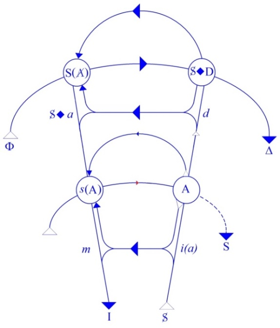
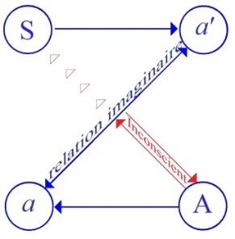
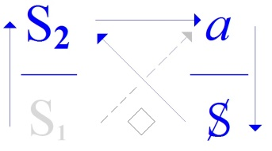
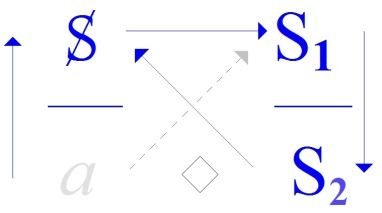

# Leçon 11 | 09 Avril 1974

<!-- source-url: http://staferla.free.fr/S21/S21 NON-DUPES....docx -->
<!-- seminar: s21 -->
<!-- lesson: 11 -->

<!-- id: s21-11-0001 -->

Aujourd’hui, pour des raisons, comme ça, de choix personnel, je vais partir d’une question, question bien sûr que je ne me pose que de croire au moins que la réponse est là...

<!-- id: s21-11-0002 -->

> c’est un « bateau », vous le savez... ...et cette question c’est : qu’est-ce que Lacan, ici présent, a inventé ?

<!-- id: s21-11-0003 -->

Vous savez que ce mot « *inventé* », je l’ai mis en avant, je l’ai fait reconnaître si je puis dire, par vous, apparemment tout au moins, de le lier à ce qui le nécessite, c’est-­à-dire le savoir.

<!-- id: s21-11-0004 -->

Le savoir s’invente, ai-je dit, ce dont me semble assez bien témoigner l’histoire de la science.

<!-- id: s21-11-0005 -->

Alors, qu’est-ce que j’ai inventé, moi ?

<!-- id: s21-11-0006 -->

Ça veut pas dire du tout que je fasse partie de l’histoire de la science, parce que mon départ est autre, qu’il est celui de l’expérience analytique.

<!-- id: s21-11-0007 -->

Quoi ? Je répondrai...

<!-- id: s21-11-0008 -->

> puisqu’il est entendu que j’ai déjà la réponse ...je répondrai, comme ça, pour mettre les choses en train : l’*objet(a)*.

<!-- id: s21-11-0009 -->

C’est évident que je ne peux pas ajouter l’*objet(a)* par exemple. Ça, ça se touche tout de suite.

<!-- id: s21-11-0010 -->

C’est pas entre autres que j’ai inventé l’*objet(a)*, entre autres machins, comme certains s’imagi­nent.

<!-- id: s21-11-0011 -->

Parce que l’*objet(a)* est solidaire - tout au moins au départ - du *graphe*.

<!-- id: s21-11-0012 -->

Vous savez peut-être ce que c’est ? J’en suis même pas sûr...

<!-- id: s21-11-0013 -->

Mais enfin c’est un truc qui a une forme comme ça, avec deux machins qui traversent là, et puis en plus : *ça* .

<!-- id: s21-11-0014 -->

Je dis « *ça »*, parce que au point où nous en sommes c’est nécessai­re.

<!-- id: s21-11-0015 -->

<!-- id: s21-11-0016 -->

Du *graphe* donc, dont il est une détermination et nommément au point où la question se pose : *qu’est-ce que c’est que le désir, si le désir est le désir de l’Autre* ?

<!-- id: s21-11-0017 -->

Enfin, c’est là que c’est sorti. Ça veut pas dire bien sûr, qu’il ne soit pas ailleurs.

<!-- id: s21-11-0018 -->

Il est ailleurs aussi, il est aussi dans le schéma, dit « *schéma L* » :

<!-- id: s21-11-0019 -->

<!-- id: s21-11-0020 -->

Et puis il est aussi dans les quadripode des discours à quoi j’ai cru devoir faire place, enfin, il y a quelques années :

<!-- id: s21-11-0021 -->

   

<!-- id: s21-11-0022 -->

*Discours du Maître Discours de l’Hystérique Discours Universitaire Discours analytique*

<!-- id: s21-11-0023 -->

Et puis - qui sait ? - peut-être est-il question qu’il vienne se mettre à la place du x dans les déjà célèbres *formules quantiques*...

<!-- id: s21-11-0024 -->

> que j’appellerai aujourd’hui comme ça parce qu’en me réveillant ce matin j’ai écrit quelques notes ...que j’appellerai *de la sexuation*. : § / § ; ! . !

<!-- id: s21-11-0025 -->

Et puisque j’y étais, en prenant ces notes il est surgi ceci, ceci dont c’est curieux que je n’en­tende jamais les échos...

<!-- id: s21-11-0026 -->

Même à Rome où j’ai été faire un petit tour, on a entendu parler de ces *formules quantiques*, ce qui prouve déjà une assez bonne diffusion.

<!-- id: s21-11-0027 -->

Et on m’a posé des questions, à savoir si *les formules quantiques*, parce qu’elles sont quatre, pourraient bien se situer quelque part d’une façon qui aurait des correspondances avec *les formules des quatre discours*.

<!-- id: s21-11-0028 -->

C’est pas forcément infécond, puisque ce que j’évoque, enfin, c’est que le (*a*) vienne à la place des x des formules que j’appelle « *for­mules quantiques de la sexuation »*.

<!-- id: s21-11-0029 -->

Est-ce que j’ai besoin de les réécrire ? Ce n’est sûrement pas inutile...

<!-- id: s21-11-0030 -->

J’évoque ceci, c’est que c’est celles qui se marquent de : § à gauche...

<!-- id: s21-11-0031 -->

> et qui se continuent par quatre autres for­mules qui sont comme ça en carré, bon. ...il aurait pu m’en revenir quelque chose...

<!-- id: s21-11-0032 -->

> si bien sûr ça ne demandait pas un peu de peine ...mais s’il est quelque chose que je voudrais vous faire remarquer, c’est que ces *formules* dites « *quantiques de la sexuation »* pourraient s’exprimer autrement, et ça permettrait peut-être d’avancer.

<!-- id: s21-11-0033 -->

Je vais vous en donner ce qui s’en implique. Ça pourrait se dire comme ça : « *l’être sexué ne s’autorise que de lui-même* ».

<!-- id: s21-11-0034 -->

C’est en ce sens qu’*il a le choix*, je veux dire que ce à quoi on se limite pour les classer mâle ou féminin, dans l’état civil, ça n’empêche pas *qu’il a le choix*.

<!-- id: s21-11-0035 -->

Ça bien sûr, tout le monde le sait.

<!-- id: s21-11-0036 -->

*Il ne s’autorise que de lui-même*, j’ajouterai : « *et de quelques autres* ».

<!-- id: s21-11-0037 -->

Quel est le statut de ces « *autres* » dans l’occasion, si ce n’est que c’est *quelque part*...

<!-- id: s21-11-0038 -->

> je ne dis pas au *lieu de l’Autre* *...*c’est «<u> *quelque part*</u>* »* qu’il s’agit de bien situer, savoir *<u>où</u>* ça s’écrit mes *formules quantiques de la sexuation*.

<!-- id: s21-11-0039 -->

Parce que je dirai même ceci, je vais assez loin : si je ne les avais pas écrites, est-ce que ça serait aussi vrai que l’être sexué ne s’autorise que de lui-même ?

<!-- id: s21-11-0040 -->

Ça paraît difficile de le contester, étant donné qu’on n’a pas attendu que j’écrive *les formules quantiques de la sexuation* pour qu’il y ait une sérieuse lampée de gens qu’on épingle comme on peut... enfin, qu’on épingle de l’homosexualité.

<!-- id: s21-11-0041 -->

Ni d’un côté ni de l’autre.

<!-- id: s21-11-0042 -->

Ce serait donc incontestablement vrai si ce n’est que...

<!-- id: s21-11-0043 -->

> chose curieuse, enfin il semble ...qu’encore que ça se soit étalé depuis le com­mencement des siècles, qu’on ait mis un bout de temps justement à l’épingler de ces termes...

<!-- id: s21-11-0044 -->

> comme par hasard impropres ...de ces termes d’« *homosexuel* » par exemple.

<!-- id: s21-11-0045 -->

C’est curieux que je puisse les dire « *impropres »*, enfin c’est impropre tout à fait, *comme nomination*.

<!-- id: s21-11-0046 -->

Bien avant, on n’avait pas ces termes-là, enfin, on appelait ça, par exemple...

<!-- id: s21-11-0047 -->

> enfin, pour un côté, et le fait qu’on les distinguât d’une façon sérieuse
>
> jusqu’à leur donner une place différente sur la carte géographique, est déjà suffisamment indicatif ...on appelait ça, pour un côté, « *des sodomites ».*

<!-- id: s21-11-0048 -->

« *Sumus enim sodomitae* », écrivait un prince qui, je crois, était lui-même de la famille des Condé : « *Sumus enim sodomitae igne tantum perituri* »[^21].

<!-- id: s21-11-0049 -->

Il disait ça pour rassurer ses compagnons au moment où ils traversaient une rivière : « *Il ne peut rien nous arriver, on ne va pas se noyer* *puisque nous sommes <u>igne tantum perituri</u>,* *on ne doit périr que par le feu, donc on est à l’abri* ».

<!-- id: s21-11-0050 -->

Bon. En attendant est-ce qu’il n’aurait pas pu venir à l’idée dans mon École que c’est ça qui équilibre *mon dire* :

<!-- id: s21-11-0051 -->

> « *que l’analyste ne s’autorise que de lui-même* » ?

<!-- id: s21-11-0052 -->

*Ça ne veut pas dire* pour autant *qu’il soit* *tout seul à le décider*, comme je viens de vous le faire remarquer, pour ce qui est de *l’être sexué*. Je dirai même plus, enfin ce que j’ai écrit dans les formules implique au moins que *pour faire l’homme*, il faut qu’au moins quelque part soit écrite *la formule quantique* que je viens là d’écrire, et qu’il existe...

<!-- id: s21-11-0053 -->

> c’est une écriture \[:\] ...qu’il existe cet X qui dit que n’est pas vrai...

<!-- id: s21-11-0054 -->

> que n’est pas vrai comme *fondement d’exception* \[§\] ...que n’est pas vrai que !...

<!-- id: s21-11-0055 -->

> à savoir que ce qui supporte dans l’écriture *la fonction*, la fonction propositionnelle
>
> où nous pouvons écrire ce qu’il en est de ce choix de l’être sexué ...qu’il n’est pas vrai qu’elle tienne toujours, que même la condition pour que le choix puisse en être fait au positif, c’est-à-dire qu’il y ait de l’homme, c’est qu’il y ait quelque part de la castration.

<!-- id: s21-11-0056 -->

Si je dis donc « *que l’analyste ne s’autorise que de lui-même* »...

<!-- id: s21-11-0057 -->

> ce qui est quelque chose de tellement accablant, enfin à y penser : que si l’analyste est quelque chose
>
> qui est sur le mode d’être « *nommé-à* », à l’analyse si je puis dire, à l’analyse sous cette forme qui veut dire :
>
> *« membre associé »*, « *membre titulaire »*, « *membre*... » je ne sais pas quoi ...tout ce dont j’ai essayé de faire rire dans un petit article [^22]...

<!-- id: s21-11-0058 -->

> *en y marquant l’échelon de ce que j’ai appelé*

<!-- id: s21-11-0059 -->

- *« les Suffisances »,*

<!-- id: s21-11-0060 -->

- *« les Petits Souliers »,*

<!-- id: s21-11-0061 -->

- *voire « les Béatitudes »,*

<!-- id: s21-11-0062 -->

- *être « nommé à » la Béatitude* ...est-ce que ce n’est pas quelque chose en soi qui peut un peu faire rire ?

<!-- id: s21-11-0063 -->

Ça a fait rire mais pas très, parce que dans ce temps, quand j’ai écrit ça, ça n’in­téressait que les spécialistes, qui eux ne riaient guère, bien sûr, parce qu’ils étaient dans le système.

<!-- id: s21-11-0064 -->

Mais ça impliquerait quand même que cette formule...

<!-- id: s21-11-0065 -->

> que j’ai faite dans une certaine « *Proposition*... » [^23] tout à fait axiale ...que cette formule reçoive les quelques *compléments* qu’implique que si assurément on ne peut pas être *nommé à* la psychanalyse, ça ne veut pas dire que n’importe qui puisse rentrer là-dedans comme un rhinocéros dans la porcelaine.

<!-- id: s21-11-0066 -->

C’est-à-dire sans tenir compte de ceci : c’est qu’il fau­drait bien que s’inscrive ce dont moi j’attends que ça vien­ne à s’inscrire, parce que c’est pas comme quand *j’invente* ce qui préside au choix de l’être sexué, là je ne peux pas *inventer* pour une raison : qu’un groupe c’est *réel*.

<!-- id: s21-11-0067 -->

Et même c’est un *Réel* que je ne peux pas inventer, de ce fait que c’est un *Réel* nouvellement émergé, puisque tant qu’il n’y avait pas de discours analytique, il n’y avait pas « *du psychanalyste »*.

<!-- id: s21-11-0068 -->

C’est pour ça que j’ai énoncé qu’il y a « *du psychanalyste »*, dont par exemple, moi, j’étais le témoignage, mais ça ne peut pas vouloir dire pour autant qu’il y a *un psychanalyste*.

<!-- id: s21-11-0069 -->

C’est une visée proprement hystérique que de dire qu’*il y en a au moins un*, par exemple.

<!-- id: s21-11-0070 -->

Je ne suis pas du tout sur cette pente, n’étant pas de nature dans la position de l’hystérique : je ne suis pas Socrate, par exemple. Où je me situe, nous verrons ça éventuelle­ment, pourquoi pas, mais pour aujourd’hui je n’ai pas besoin d’en dire plus long.

<!-- id: s21-11-0071 -->

Donc il y a des choses au niveau de ce qui émerge de *réel*, sous la forme d’un fonctionnement différent - de quoi ? - de ce qu’il en est en fin de compte des « *lettres »*, parce que « *les lettres » c’est de ça qu’il s’agit*.

<!-- id: s21-11-0072 -->

C’est ça que j’ai voulu produire dans mes quadri­podes :

<!-- id: s21-11-0073 -->

- il peut y avoir une façon dont un certain lien s’établit dans un groupe,

<!-- id: s21-11-0074 -->

- il peut y avoir quelque chose de nouveau et qui ne consiste qu’en une certaine redistribution des *lettres*.

<!-- id: s21-11-0075 -->

Ça je peux l’inventer.

<!-- id: s21-11-0076 -->

Mais la façon de donner suite à ce nouvel arrangement de *lettres* pour en épingler *un discours*, ça suppose une suite justement.

<!-- id: s21-11-0077 -->

Et pourquoi pas, comme on me l’a demandé à Rome, quand on m’a posé la question de savoir quelle était la liaison des 4 *formules quantiques* dites *de la sexuation*, quelle était leur liaison avec la formule - c’est de celle-là qu’il s’agit - la formule du *discours analytique*, telle que j’ai cru devoir d’abord l’avancer :

<!-- id: s21-11-0078 -->

<!-- id: s21-11-0079 -->

Les brancher, ça serait en donner ce développement qui ferait que dans une École...

<!-- id: s21-11-0080 -->

> la mienne, pourquoi pas, avec un peu de chance ...que dans une École s’articulerait cette fonction, dont le choix de l’analyste, le choix de l’être, ne peut que dépendre.

<!-- id: s21-11-0081 -->

Car tout *en ne s’autorisant que de lui-même*, il ne peut par là que s’autoriser d’autres aussi.

<!-- id: s21-11-0082 -->

Je m’en réduis à ce minimum parce que précisément j’at­tends que quelque chose s’invente, s’invente du groupe, sans reglisser dans la vieille ornière, celle dont il résulte qu’en raison de vieilles habi­tudes contre lesquelles, après tout, on est si peu prémuni, que ce sont elles *qui font la base du discours dit Universitaire *: *qu’on est « nommé-à », à un titre.* \[*cf. séance précédente*\]

<!-- id: s21-11-0083 -->

Ceci nous pousse...

<!-- id: s21-11-0084 -->

> nous pousse parce que je choisis d’y être poussé, mais vous pousse en même temps puisque vous m’écoutez ...à tenter de préciser la liaison qu’il y a entre

<!-- id: s21-11-0085 -->

- ce que j’appelle l’« *inventer du savoir »*,

<!-- id: s21-11-0086 -->

- et « *ce qui s’écrit »*.

<!-- id: s21-11-0087 -->

Il est tout à fait clair qu’il y a un lien, il s’agirait, ce lien, de le préciser, autrement dit - ce qui se touche du doigt - s’apercevoir, se poser la question : « *où se situe l’écriture* *?* ».

<!-- id: s21-11-0088 -->

C’est bien ce dont j’essaie de vous donner depuis longtemps l’indication, *en substituant*...

<!-- id: s21-11-0089 -->

> ce que j’ai fait très tôt ...*en glissant*, si je puis dire, dans l’énoncé que j’ai tenté de donner de *Fonction et Champ de la parole et du langage,* je n’ai quand même pas intitulé un certain article comme ça - un écrit pivot - je ne l’ai pas intitulé « L’instance du signifiant dans l’inconscient », je l’ai intitulé « *L’instance de la lettre*... ».

<!-- id: s21-11-0090 -->

Et c’est autour de *lettres*...

<!-- id: s21-11-0091 -->

> comme vous vous souvenez peut-être un peu, enfin, comme ça dans la brume,
>
> que S, S1, S2, etc., sur s, sur petit s*,* ...c’est tout ce que...

<!-- id: s21-11-0092 -->

> tout ceci impliquant une certaine relation que j’ai épinglée de la *métaphore*, une autre de la *méto­nymie* ...c’est autour de ça que j’ai fait tourner un certain nombre de *pro­positions* qui peuvent être considérées comme un forçage, je veux dire de donner une certaine instance - non pas de la lettre - mais de la linguis­tique.

<!-- id: s21-11-0093 -->

Mais je vous fais remarquer que la linguistique ne procède pas autrement que les autres sciences, c’est-à-dire qu’elle ne procède que de *l’instance de la lettre*, d’où l’instance de la linguistique passant par la lettre, pour proposer quelques remarques à ceux qui pratiquent l’analyse.

<!-- id: s21-11-0094 -->

Ça n’empêche pas que, bien sûr...

<!-- id: s21-11-0095 -->

> parce que je croyais *qu’avec le temps*, enfin n’est-ce pas ...il y a ces « surréalistes » dont on me tanne quand on veut écrire sur moi des articles.

<!-- id: s21-11-0096 -->

Ces surréalistes, j’en connaissais un qui survivait alors, c’était Tristan Tzara, je lui ai refilé « *L’Instance de la lettre... »,* bien sûr, ça ne lui a fait ni chaud ni froid.

<!-- id: s21-11-0097 -->

Pourquoi ? Parce que c’est bien là ce qui démontre ce que je vous faisais remarquer...

<!-- id: s21-11-0098 -->

> vous l’avez peut-être entendu à mon dernier séminaire ...ce que je vous ai fait remarquer, c’est à savoir qu’en fin de compte, *avec tout ce chambard, ils savaient pas très bien ce qu’ils faisaient*.

<!-- id: s21-11-0099 -->

Mais ça, ça tient du fait qu’en somme ils étaient poètes, et comme l’a fait remarquer depuis longtemps Platon : il n’est pas du tout forcé, il est même préférable, que le poète ne sache pas ce qu’il fait.

<!-- id: s21-11-0100 -->

C’est ce qui donne à ce qu’il fait, sa valeur pri­mordiale, et devant quoi il n’y a vraiment qu’à cour­ber la tête.

<!-- id: s21-11-0101 -->

Je veux dire que si on peut faire une certaine analogie, enfin une certaine homologie, disons...

<!-- id: s21-11-0102 -->

> mais avec pour le mot « *homo »* ce sens approximatif qui est celui que je vous ai déjà souligné tout à l’heu­re ...une certaine homologie entre

<!-- id: s21-11-0103 -->

- ce qu’on a comme œuvres, œuvres de l’art,

<!-- id: s21-11-0104 -->

- et ce que nous recueillons dans l’expérience analytique, ...interpréter l’art, c’est ce que Freud a toujours écarté, toujours répudié, ce qu’on appelle « *psychanalyse de l’art* », c’est encore plus à écarter que la fameuse « *psychologie de l’art* » qui est une notion délirante.

<!-- id: s21-11-0105 -->

De l’art, nous avons à prendre de la graine.

<!-- id: s21-11-0106 -->

À prendre de la graine pour autre chose, c’est-à-dire pour nous en faire ce tiers \[*Réel* : **3**\] qui n’est pas encore classé :

<!-- id: s21-11-0107 -->

- en faire ce quelque chose qui est accoté à la science, d’une part,

<!-- id: s21-11-0108 -->

- qui prend de la grai­ne de l’art de l’autre,

<!-- id: s21-11-0109 -->

- et j’irai même plus loin : qui ne peut le faire que dans l’attente de devoir à la fin « *donner sa langue au chat* » \[*analytique*\].

<!-- id: s21-11-0110 -->

Ce dont témoigne pour nous l’expérience analytique : c’est que nous avons affaire, je dirais, à des *vérités indomptables*, dont nous avons à témoigner pourtant, comme telles.

<!-- id: s21-11-0111 -->

Est-ce que ce sont les seules qui peuvent nous permettre de définir com­ment, dans la science, ce qu’il en est du savoir...

<!-- id: s21-11-0112 -->

> du savoir inconscient, ...com­ment dans la science ceci peut constituer ce que j’appellerai « *un* *bord »*, c’est-à-dire ce dont la science même, comme telle, est - faute d’un meilleur mot je dirai - *structurée*.

<!-- id: s21-11-0113 -->

Si ce que j’avance pour vous, répond à quelque chose, on peut dire que vous m’ayez assez attendu, avant de ce que j’énon­ce de ce *qu’il n’y a pas de rapport sexuel*, *c’est ça que ça veut dire*.

<!-- id: s21-11-0114 -->

Là encore je souligne que ça ne va pas jusqu’à dire que le peu de *Réel* que nous savons...

<!-- id: s21-11-0115 -->

> qui se réduit au *nombre* ...que le peu de *Réel* que nous savons, s’il est si peu, ça tient au fameux *trou* : au fait qu’au centre il y a ce τόπος \[topos\], qu’on ne peut que boucher.

<!-- id: s21-11-0116 -->

Qu’on ne peut que boucher - avec quoi ? - avec l’*Imaginaire*...

<!-- id: s21-11-0117 -->

Mais ça ne veut pas dire pour autant que l’*objet(a)* ça soit de l’*Imaginaire*.

<!-- id: s21-11-0118 -->

Il est un fait que ça s’imagine, ça s’imagi­ne avec ce qu’on peut, à savoir avec :

<!-- id: s21-11-0119 -->

- ce qui *se suce*,

<!-- id: s21-11-0120 -->

- ce qui *se chie*,

<!-- id: s21-11-0121 -->

- ce qui *fait le regard*, ce qui *dompte le regard* en réalité,

<!-- id: s21-11-0122 -->

- et puis *la voix*.

<!-- id: s21-11-0123 -->

Les deux derniers dans le nombre, en tout cas sûrement le dernier, c’est moi qui l’ai ajouté à la liste, en tant que ça s’imagine.

<!-- id: s21-11-0124 -->

Mais le fait que ça s’imagine, n’ôte rien de la portée de l’*objet(a)* en tant que τόπος \[topos\], je veux dire, en tant que ce qui se *squeeze* pour en donner l’image...

<!-- id: s21-11-0125 -->

> rien de plus ai-je fait ...pour en donner l’image qui n’a qu’un avantage, c’est que *c’est une image écrite*, celle que j’ai donnée *dans le nœud borroméen *: l’*objet(a) c’est là que ça se noue*.

<!-- id: s21-11-0126 -->

Il y a donc 2 faces ici à l’*objet(a)*, une face qui est *aussi réelle que possible, seulement de ce fait que ça s’écrit*.

<!-- id: s21-11-0127 -->

Vous voyez ce que j’essaye de faire là : j’essaie de vous situer *l’écrit*...

<!-- id: s21-11-0128 -->

> et ça va loin d’avancer çà ...*comme ce bord du Réel, situé sur ce bord.*

<!-- id: s21-11-0129 -->

Parce qu’il faut bien vous donner d’autre pâture que cette abstraction comme vous diriez...

<!-- id: s21-11-0130 -->

> car justement ce qui est là sensible, c’est que *ça n’est pas de l’abstraction*.
>
> *C’est dur comme fer* \[*cf. séance précédente*\]. C’est pas parce qu’une chose n’est pas succulente qu’elle est abstraite ...il est évidemment amusant que j’éprouve là le besoin, pour vous...

<!-- id: s21-11-0131 -->

> *le désir de l’homme étant le désir de l’Autre* ...que j’éprouve là le besoin pour vous d’avoir une peti­te scansion rigolade, pour vous faire remarquer que c’est amusant, enfin... une chose, un petit échantillon anecdotique que je vais vous donner, n’est-ce pas.

<!-- id: s21-11-0132 -->

C’est assez curieux, par exemple que *le savoir* en tant qu’il s’invente, ça se passe comme ça, comme je vais vous dire.

<!-- id: s21-11-0133 -->

Quand Galilée a aperçu certaines de ses inventions, qui bouleversaient tout à fait le savoir concernant le *Réel céleste*, il a pris soin de le noter, sous la forme suivante : il a envoyé à quelques personnes un certain nombre de *distiques* latins...

<!-- id: s21-11-0134 -->

> pas plus : 2 vers ...dans lesquels, par lesquels il pouvait en quelque sorte prendre date, et en prenant un certain nombre de lettres de trois en trois, par exemple, démontrer qu’il avait inventé la chose impossible à faire avaler à son époque, *qu’il l’avait inventée déjà à telle date*.

<!-- id: s21-11-0135 -->

Je veux dire que c’était inscrit indiscutablement par la façon même dont il avait fait ces distiques, dont peu importe par ailleurs le contenu, étant donné bien sûr qu’on peut, dans ce genre, écrire n’importe quoi, ça ne fait rien à personne, tout ce qui intéresse quelqu’un, quand on reçoit une lettre d’un personnage comme Galilée, c’est pas ce qu’il a voulu dire, c’est qu’on a un autographe.

<!-- id: s21-11-0136 -->

Et la façon dont...

<!-- id: s21-11-0137 -->

> Sous, en quelque sorte, ce que nous appellerons l’apparente connerie des deux vers ...était inscrite la date...

<!-- id: s21-11-0138 -->

> la date de telle chose, la chose dont il s’agissait, à savoir sur le ciel et le principe des trajets qu’il offre à voir ...est-ce que là ne s’illustre pas...

<!-- id: s21-11-0139 -->

> d’une façon certes seulement amusante, mais vous en avez bien d’autres illustrations,
>
> puisque comme je l’ai fait, j’y ai insisté avec des pieds de plomb ...il est bien évident que si *la logique* est ce que je dis : *la science du Réel* et pas autre chose, si justement le propre de la logique en tant que *science du Réel*

<!-- id: s21-11-0140 -->

- c’est justement de ne faire de *la vérité* qu’une valeur vide,

<!-- id: s21-11-0141 -->

- c’est-à-dire exactement rien du tout, quelque chose dont vous pouvez simplement inscrire que *non-V c’est F*,

<!-- id: s21-11-0142 -->

- c’est-à-dire que c’est faux, c’est-à-dire que c’est une façon de traiter *la vérité* qui n’a aucu­ne espèce de rapport avec ce que nous appelons communément *vérité*.

<!-- id: s21-11-0143 -->

*Cette science du Réel*, *la logique*, s’est frayée, *n’a pu se frayer qu’à partir du moment où on a pu assez vider des mots de leur sens pour leur sub­stituer des lettres* purement et simplement. *La lettre est* en quelque sorte *inhérente à ce passage au Réel*.

<!-- id: s21-11-0144 -->

Là c’est amusant de pouvoir dire que *l’écrit* était là pour faire preuve - faire preuve de quoi ? - faire preuve de la date de *l’invention*.

<!-- id: s21-11-0145 -->

Mais en faisant preuve de la date de l’invention, il fait preuve aussi de l’invention elle-même, l’invention c’est l’écrit, et ce que nous exigeons dans une logique mathématique, c’est très précisément ceci : que rien ne repose de la démonstration que sur une certaine façon de s’imposer à soi-même une combinatoire parfaitement déterminée d’un jeu de *lettres*.

<!-- id: s21-11-0146 -->

Je pose là la question : *est-ce que l’anagramme*...

<!-- id: s21-11-0147 -->

> puisque c’est de ça qu’il s’agissait dans les vers de Galilée ...*que l’anagramme*...

<!-- id: s21-11-0148 -->

> au niveau où le cher Saussure s’en cassait la tête en privé ...*est-ce que l’anagramme* n’est pas là simplement pour faire preuve que c’est là la nature de *l’écrit*, même quand on n’a pas encore l’idée de rien à prouver ?

<!-- id: s21-11-0149 -->

*Est-ce que l’anagramme* au niveau où Saussure s’en interrogeait...

<!-- id: s21-11-0150 -->

> à savoir au niveau où dans les vers dits « s*aturniens* », on peut retrouver justement le nombre de lettres
>
> qu’il faut pour désigner un dieu, sans que rien du ciel ne puisse nous secourir pour savoir si c’était l’intention, là, du poète, d’avoir truf­fé ce qu’il avait à écrire - puisque l’écrit déjà fonctionnait -
>
> de l’avoir truf­fé d’un certain nombre de lettres qui fondent le nom d’un dieu ...est-ce que là on ne sent pas que même quand il n’est supporté par rien, par rien dont nous puissions témoigner, il nous faut bien admettre que *c’est l’écrit qui supporte*, qu’il y a là une sorte d’*entité* *de l’écrit *?

<!-- id: s21-11-0151 -->

Comment traduirons-nous « *entité » ?*

<!-- id: s21-11-0152 -->

- Est-ce que nous la pousse­rons du côté de *l’être,* ou du côté de *l’étant *?

<!-- id: s21-11-0153 -->

- Est-ce que c’est οὐσἰα \[oussia\], ou est­-ce que c’est ον \[on\] ?

<!-- id: s21-11-0154 -->

Je crois qu’il vaut mieux abandonner cette direction.

<!-- id: s21-11-0155 -->

Et je vous propose quelque chose, qui a son intérêt d’aller dans le même sens que ce que j’avais déjà tracé.

<!-- id: s21-11-0156 -->

Comme l’a fait remarquer un vieux sage, du temps où on savait quand même déjà écri­re ce qui s’imposait du langage : « *une route qui monte, c’est la même que celle qui descend* »

<!-- id: s21-11-0157 -->

Alors je pourrais vous proposer comme formule de *l’écrit* : le « *savoir supposé sujet »*.

<!-- id: s21-11-0158 -->

Qu’il y ait quelque chose qui atteste qu’une formule pareille puisse avoir sa fonction, c’est en tout cas aujourd’hui ce que je trouve de mieux

<!-- id: s21-11-0159 -->

- pour vous situer *la fonction de l’écrit*, pour ceci à quoi nous a introduit notre question sur l’en­tité de l’écrit, οὐσἰα \[ousia\] ou ον \[on\],

<!-- id: s21-11-0160 -->

- pour situer ceci qu’il se définit avant tout d’une certaine fonction, *d’une place de bord*.

<!-- id: s21-11-0161 -->

Voilà ! Il est bien évident que comme je l’ai souligné...

<!-- id: s21-11-0162 -->

> comme ça, incidemment, parce que je passe pas mon temps à m’expliquer avec les philosophes ...il est bien évident que c’est mon matérialisme à moi. *Ouais*...

<!-- id: s21-11-0163 -->

Je le dis à peine parce que je m’en fous du « *matérialisme »*.

<!-- id: s21-11-0164 -->

Ce certain *matérialisme*, comme ça, qui est là de toujours, qui consiste à baiser le cul de *la matière* au nom de ceci que ce serait quelque chose de plus réel que *la forme*, enfin ça, bien sûr on l’a déjà maudit.

<!-- id: s21-11-0165 -->

On l’a maudit à partir du matérialisme historique qui n’est stric­tement rien d’autre qu’une résurgence de la Providence de Bossuet. \[*Rires*\] *Ouais*...

<!-- id: s21-11-0166 -->

En tous les cas, *cette matière de l’écrit*, enfin de l’écrit *supposé*, comme c’est un peu nouveau, ça mériterait qu’on lui tire un peu sur les tétines, pour en revenir à notre *objet(a)* fonda­mental.

<!-- id: s21-11-0167 -->

Qu’on l’exploite un peu, tout au moins un temps.

<!-- id: s21-11-0168 -->

*Qu’elle devienne « possible »*, cette *exploitation*, ça veut dire justement...

<!-- id: s21-11-0169 -->

> si vous traduisez *la modalité* comme je vous ai appris à le faire ...*ça veut dire que « ça cesse de s’écrire »*, et pas du tout le contraire.

<!-- id: s21-11-0170 -->

Il faut que *ça cesse de s’écrire* pour que ça prouve quelque chose, c’est-à-dire *que ça ne cesse pas de repartir*.

<!-- id: s21-11-0171 -->

Mais justement c’est là cette scansion dont j’essaie de vous donner l’idée, c’est une scansion qui est curieuse.

<!-- id: s21-11-0172 -->

Parce que la pulsation que ça implique...

<!-- id: s21-11-0173 -->

> à savoir - ce que chacun sait - que ne peut être *nécessaire* que *le possible*,
>
> à savoir *ce que je situe du <u>cesser de s’écrire</u>* *est justement <u>ceci qui ne cesse pas de se répéter</u>*, ...ce qui est là quelque chose que nous avons bien su toucher, dans cette fonction produite génialement par Freud de la *répétition*.

<!-- id: s21-11-0174 -->

Ça c’est une chose fondamentale et dont j’essaie ici pour vous l’ap­proche, l’approche en ce sens que ça institue un temps *deux*. Loin de faire le temps linéaire, ça institue un temps *deux* comme tout à fait fon­damental.

<!-- id: s21-11-0175 -->

Et j’irai même jusqu’à poser la question à ceux qui pourraient m’en dire un petit bout...

<!-- id: s21-11-0176 -->

> et ça m’amuserait bien qu’on m’y réponde là-dessus ...c’est qu’à prendre un ensemble de dimensions...

<!-- id: s21-11-0177 -->

> ensemble ne supposant rien de cardinal, mais disons *un ensemble fini* ...comment déterminer sur cet ensemble de dimensions...

<!-- id: s21-11-0178 -->

> pourquoi ne pas imaginer la dimension telle que je la définis \[*dit-mansion*\], c’est-à-dire là où se situe *le dire* ...com­ment arriver à formuler ceci :

<!-- id: s21-11-0179 -->

- que si nous partons de l’idée que la fonc­tion du 2, deux dimensions s’y situent d’un côté de *la surface*,

<!-- id: s21-11-0180 -->

- mais du « *cesser* » et « *non-cesser* » comme je viens de vous le dire, est-ce que ce n’est pas là ce qui fait très exactement la portée de *l’écrit* ?

<!-- id: s21-11-0181 -->

Autrement dit, sur un ensemble de dimensions que nous ne déterminons pas d’avance, comment trouver

<!-- id: s21-11-0182 -->

- ce qui fait *fonction-surface,* \[*l’écrit comme réel* **R***, se fait comme lettre* **S** *hors sens, sur la surface du corps imaginaire* **I** : **RSI**\]

<!-- id: s21-11-0183 -->

- et ce qui à mon dire ferait *fonction-temps* du même coup ? \[*par la fonction de répétition*\]

<!-- id: s21-11-0184 -->

Ce qui de toute façon est très proche, très proche du nœud que je vous suggère.

<!-- id: s21-11-0185 -->

J’avais autrefois commis un truc qui s’appelait « *Le temps logique ».*

<!-- id: s21-11-0186 -->

Et c’est curieux que j’y aie mis au 2nd temps « *le temps pour comprendre »*, le temps pour comprendre ce qu’il y a à comprendre.

<!-- id: s21-11-0187 -->

C’est la seule chose...

<!-- id: s21-11-0188 -->

> dans cette forme que j’ai faite aussi épurée que possible ...c’est la seule chose qu’il y avait à comprendre : c’est que « *le temps pour comprendre »* ne va pas, s’il n’y a pas **3**, à savoir ce que j’ai appelé :

<!-- id: s21-11-0189 -->

- *l’instant de voir*,

<!-- id: s21-11-0190 -->

- puis *la chose à comprendre*,

<!-- id: s21-11-0191 -->

- et puis *le moment de conclure*.

<!-- id: s21-11-0192 -->

De conclu­re - comme je crois l’avoir assez suggéré dans cet article - de conclure de travers.

<!-- id: s21-11-0193 -->

Sans quoi - s’il n’y a pas ces 3 - il n’y a rien qui motive ce qui manifeste avec clarté le 2, à savoir cette *scansion* que j’ai décrite, qui est celle *d’un arrêt*, *d’un cesser et d’un re-départ*.

<!-- id: s21-11-0194 -->

Grâce à quoi il est évi­dent que ce sont les seuls mouvements convaincants, qui ne valent comme *preuve*, que quand les trois personnages...

<!-- id: s21-11-0195 -->

dont vous savez qu’il s’agit qu’ils sortent de prison comme par hasard ...que ce n’est que dans l’après-coup de ces scansions qu’ils peuvent les faire fonction­ner comme *preuve*.

<!-- id: s21-11-0196 -->

C’est-à-dire faire ce qui leur est demandé, non pas seulement qu’ils soient sortis, ce qui est d’un mouvement bien naturel, mais à quoi ils sont identiques, à savoir chacun strictement aux deux autres.

<!-- id: s21-11-0197 -->

Ils ont la même rondelle noire ou blanche, dans le dos.

<!-- id: s21-11-0198 -->

Ils ne peuvent - ce qui leur est demandé ! - en donner l’explication que de ceci qu’ils ont fait tous le même ballet pour sortir. C’est là la seule expli­cation.

<!-- id: s21-11-0199 -->

C’est une voie qui est tout à fait charmante, à expliquer ceci, ceci qui est en plus bien évident, c’est que ça ne comporte entre eux aucune espèce d’identité de nature, que l’illus­tration, le commentaire en marge que j’en donne.

<!-- id: s21-11-0200 -->

C’est à savoir que c’est comme ça que les êtres s’imaginent une universalité quelconque, il n’y a pas trace dans cet apologue...

<!-- id: s21-11-0201 -->

> puisque d’un apologue il s’agit ...il n’y a pas trace dans cet apologue du moindre rapport entre les prisonniers, puisque c’est justement ce qui leur est interdit : c’est de communiquer entre eux. Ils sont simplement - s’identifient ou se distinguent - d’avoir ou de n’avoir pas, un disque blanc ou un disque noir dans le dos.

<!-- id: s21-11-0202 -->

Je m’excu­se d’avoir été si long pour les personnes qui n’ont jamais ouvert les *Écrits,* il doit y en avoir pas mal ici dans ce cas. Définir donc ce qui, dans un ensemble de dimensions, fait du même coup *surface* et *temps*, voilà ce que je vous propose comme suite à ce que je vous ai proposé de « *temps logique »* de mes *Écrits.*

<!-- id: s21-11-0203 -->

Est-ce que je suis, est-ce que je suis mauvais juge, quand j’ai répondu que l’*objet(a)* c’était *peut-être* ce que j’avais *inventé *?

<!-- id: s21-11-0204 -->

*Peut-être*, c’est sûrement... en tout cas personne ne l’a inventé à part moi. Bon. Mais je peux être quand même mauvais juge.

<!-- id: s21-11-0205 -->

Et c’est en ça qu’il n’est pas sans rapport avec l’οὐσἰα \[oussia\] dont je faisais tout à l’heure usage de chiffon, c’est que si mon schéma du discours analytique est vrai, cet *objet(a)*, je dois le devenir, c’est ce que j’ai à faire *advenir*.

<!-- id: s21-11-0206 -->

<!-- id: s21-11-0207 -->

C’est pas le « *je* », dans mon cas - c’est-à-dire là, au moment où je suis devant vous - c’est le *(a)*. Oui...

<!-- id: s21-11-0208 -->

Cette place de « *personne »* est bien entendu...

<!-- id: s21-11-0209 -->

> comme le nom de *personne* l’indique ...une place de « *rang à tenir »*, de « *semblant » *: il s’agit de tenir le rôle de l’analyste.

<!-- id: s21-11-0210 -->

Et c’est bien en cela que j’ai avancé un certain *quelque chose*, c’est que c’est celle qui se pose de la question toujours la même : « *Puis-je l’être* ? ». M’autoriser, ça peut encore aller, mais l’être c’est une autre affaire.

<!-- id: s21-11-0211 -->

*C’est là* qu’évidem­ment se forge ce que j’ai énoncé du verbe *« désêtre »*.

<!-- id: s21-11-0212 -->

*L’analyste, je le « dé-suis », l’ objet(a) n’a pas d’être.*

<!-- id: s21-11-0213 -->

J’ai suffisamment insisté en son temps sur ce dont les psychanalystes jubilent, à savoir cette face, ce support*, ce pathétisme* de l’ *objet(a)* quand il prend la forme du *déchet*. J’y ai insisté beaucoup.

<!-- id: s21-11-0214 -->

Un jour je me suis comme ça pointé à Bordeaux, et je leur ai expliqué

<!-- id: s21-11-0215 -->

- que *la civilisation c’était l’égout*,

<!-- id: s21-11-0216 -->

- qu’il n’y en a strictement aucune espèce d’autre trace,

<!-- id: s21-11-0217 -->

- et que c’est tout de même quelque chose de bien étrange, qu’il faut s’y appliquer.

<!-- id: s21-11-0218 -->

Parce qu’on ne sache pas que tous les autres animaux qui existent encombrent la terre de leurs déchets, alors qu’il est tout à fait singulier que tout ce que fait l’homme, finit toujours dans le déchet, n’est-ce pas ?

<!-- id: s21-11-0219 -->

Une seule chose qui garde une petite dignité c’est les ruines, mais sortez quand même un tout petit peu de vos coquilles pour vous apercevoir du nombre d’autos à la casse qui s’empilent dans des endroits, et de vous apercevoir que par­tout où vous mettez le pied, vous mettez le pied sur quelque chose où on a essayé de toutes façons de recomprimer d’anciens déchets pour ne pas en être submergé, littéralement. Bon. *Ouais*...

<!-- id: s21-11-0220 -->

C’est une affaire, ça !

<!-- id: s21-11-0221 -->

C’est toute l’affaire de l’organisation, n’est-­ce pas ?

<!-- id: s21-11-0222 -->

De l’organisation *imaginaire* \[*de la société*\], si on peut dire.

<!-- id: s21-11-0223 -->

*Simuler, simuler avec la foule*…

<!-- id: s21-11-0224 -->

> parce que c’est l’autre face de ce que j’ai appelé tout à l’heure le choix, « le groupe » …*simuler avec la foule*…

<!-- id: s21-11-0225 -->

> et on a toujours affaire à ça pour y recueillir un groupe …*simuler avec la foule* quelque chose qui fonc­tionne *comme un corps*. *Ouais*... Bon !

<!-- id: s21-11-0226 -->

Mais enfin, cet *objet(a)* quand même, quelle est la face de ce qui vous intéresse, non pas quand je l’écris...

<!-- id: s21-11-0227 -->

> parce que je l’écris le moins que je peux, j’ai trop le sens de mes *responsabilités* pour que cet écrit,
>
> je lui laisse pas sa chan­ce, sa chance que *ça cesse*, pour que, si *ça ne cesse pas*, ça fasse sa preu­ve ...mais là, là quand je jaspine, qu’est-ce qui vous intéresse de ce *(a)* dont je parle ?

<!-- id: s21-11-0228 -->

Il y a quelque chose qui peut bien me venir à la tête, parce que c’est comme tout le reste, j’invente pour ce qui est du savoir, mais pour ce qui est de la vérité, j’invente pas : la vérité on me l’appor­te, j’en ai des seaux entiers.

<!-- id: s21-11-0229 -->

Et là, il y a un type qui est venu me voir, je pourrais pas dire il y a combien de temps, puis je voudrais pas qu’il se reconnaisse, il est venu me dire que ce qu’il lui fallait, c’était *ma voix* ! \[*Rires*\]

<!-- id: s21-11-0230 -->

C’était pas une voix pour un vote *-* hein ?- c’était la voix.

<!-- id: s21-11-0231 -->

Non mais c’est une question très sérieuse pour moi : qu’est-ce que c’est la voix ?

<!-- id: s21-11-0232 -->

Parce qu’il est bien évident qu’il y a là quelque chose, c’est pas une question de timbre, si l’ *objet(a)* est ce que je dis, faut pas confondre la phonétique et le phonème.

<!-- id: s21-11-0233 -->

La voix se définit d’autre chose que de ce qui s’inscrit sur un disque...

<!-- id: s21-11-0234 -->

> et sur une bande magnétique comme il y en a tant qui s’en régalent \[*sic*\] ...ça n’a rien à faire avec ça. La voix peut être strictement *la scansion* avec laquelle tout ça je vous le raconte.

<!-- id: s21-11-0235 -->

Je suis persuadé qu’il y a là une source de votre accumulation dans cette enceinte, accumulation aujourd’hui décente.

<!-- id: s21-11-0236 -->

Il y a quelque chose comme ça, qui est lié au temps que je mets à dire les choses, puisque l’*objet(a)* est lié à cette dimension du temps.

<!-- id: s21-11-0237 -->

C’est complètement distinct de ce qu’il en est du *dire*. Le *dire* c’est pas la voix.

<!-- id: s21-11-0238 -->

Et être aimé...

<!-- id: s21-11-0239 -->

puisque vous m’aimez, bien entendu...

<!-- id: s21-11-0240 -->

...être aimé, pour l’un ou pour l’autre, c’est pas du tout pareil*.*

<!-- id: s21-11-0241 -->

*Le dire que l’objet(a) comporte*, c’est toutes sortes de choses que j’ai même couchées par écrit : *Subversion du sujet et dia­lectique du désir, et patati et patata*, ça c’est sur un tout autre chemin que l’exhibition de la voix, c’est-à-dire *d’un témoignage* - c’est le cas de le dire - *pathétique*, de son coin­çage dans toute l’affaire.

<!-- id: s21-11-0242 -->

Par contre *le dire c’est pas l’écrit non plus*. *Ouais*...

<!-- id: s21-11-0243 -->

*Le dire c’est pas l’écrit non plus*, il ne suffit pas d’avoir quelque chose à dire pour être foutu d’en savoir long.

<!-- id: s21-11-0244 -->

C’est une distinction que j’aimerais beaucoup que vous vous mettiez dans vos petites têtes. *Oui*...

<!-- id: s21-11-0245 -->

Mais sur ce qu’il en est de *la vérité*, il y a lieu de savoir.

<!-- id: s21-11-0246 -->

Il y a lieu de savoir en tant qu’il s’agit à tout instant d’inven­ter, pour répondre à *son tissu de contradictions*, à *la vérité*, et c’est bien pour ça que le premier pas à faire, c’est de la suivre dans toutes ses simagrées.

<!-- id: s21-11-0247 -->

Il ne s’agit pas seulement de ceci que le mensonge en fait partie, j’y ai assez insisté, n’est-ce pas.

<!-- id: s21-11-0248 -->

Et il faut voir ce qu’elle est capable de vous faire faire : *La vérité*, mes bons amis, mène à la religion...

<!-- id: s21-11-0249 -->

> vous entendez jamais rien de ce que je vous dis de ce truc-là
>
> parce que j’ai l’air de ricaner quand j’en parle de la religion, mais je ricane pas, je grince ...elle mène à la religion, et *à la vraie*, comme je l’ai dit déjà.

<!-- id: s21-11-0250 -->

Et comme c’est *la vraie*, c’est justement pour ça qu’il y aurait quelque chose à en tirer pour le savoir, c’est-à-dire à *inventer*.

<!-- id: s21-11-0251 -->

Ben vous êtes pas foutus de le faire, hein ! Et c’est pas demain que vous en viendrez à bout.

<!-- id: s21-11-0252 -->

Parce que dans tout ça vous ne mettez absolument aucun *sérieux*.

<!-- id: s21-11-0253 -->

Il est évident que ceux qui ont inventé les plus beaux trucs du savoir...

<!-- id: s21-11-0254 -->

> je les nomme, hein, c’est un palmarès

<!-- id: s21-11-0255 -->

...Pascal, Leibniz, et Newton !

<!-- id: s21-11-0256 -->

Newton, enfin est-ce que vous vous rendez compte de ce que Newton a écrit

<!-- id: s21-11-0257 -->

- sur *Le livre de Daniel,*

<!-- id: s21-11-0258 -->

- et sur *l’Apocalypse* [^24] de Saint Jean...

<!-- id: s21-11-0259 -->

> vous n’avez jamais regardé ça bien sûr, parce qu’on ne vous le donne pas en livre de poche...
>
> mais je le regrette. Je ne vous reproche pas non plus de ne pas être allé le chercher.
>
> Il faudrait faire un livre de poche avec ça, et bien traduit. ...il y croyait dur comme fer à la religion.

<!-- id: s21-11-0260 -->

Et les deux autres...

<!-- id: s21-11-0261 -->

> il me semble que c’est difficile de renoncer à l’évidence ...ils par­lent que de ça, il y a même que ça qui les intéresse.

<!-- id: s21-11-0262 -->

Quant je pense qu’il faut que j’aille chercher au milieu d’une montagne d’*« Adresses au curé de Paris »*, ce que Pascal a écrit sur la cycloïde par exemple, enfin le type même de ces pas qui ont fait qu’on a inventé rien d’autre que le cal­cul intégral.

<!-- id: s21-11-0263 -->

Est-ce que vous vous imaginez que le calcul intégral c’est autre chose que de l’écriture ?

<!-- id: s21-11-0264 -->

La parabole d’où c’est parti...

<!-- id: s21-11-0265 -->

> « *la parabo­le* » : je parle de la parabole tracée... ...la parabole et puis n’importe quelle autre lunule ou trucmuche ou machin, enfin c’est des choses écrites, il n’y a que là que nous touchons ce qu’il en est du Réel.

<!-- id: s21-11-0266 -->

Ben, ils étaient passionnés, ces trois-là, pour le *vrai*. Le *vrai* de *la vraie*.

<!-- id: s21-11-0267 -->

La voie à suivre, c’est d’en remettre.

<!-- id: s21-11-0268 -->

Si vous n’interrogez pas comme il convient *le vrai de la Trinité*, ben vous êtes faits comme des rats, *comme L’homme aux Rats*.

<!-- id: s21-11-0269 -->

Il est évident quand même que la religion a ses limites, quand même !

<!-- id: s21-11-0270 -->

Enfin, moi je reviens d’Italie, vous comprenez, là je suis dans un bain de corps qui ruissellent sur tous les murs, enfin il y a que ça, il y a des tableaux à s’en étouffer, c’est d’ailleurs tout à fait magnifique, moi je ne vois pas pourquoi je ferais « *proh pudor !* » \[*Oh honte !*\] devant ce ruissellement des corps*,* mais enfin ça donne quand même sa limite au machin, ça montre quand même qu’on est dans *la vérité*, et qu’on y reste, qu’on n’en sort pas.

<!-- id: s21-11-0271 -->

Ce qu’il faut, ce qu’il s’agirait, c’est d’en sortir de la vérité, alors là, je vois pas d’autre moyen que d’inventer, et pour inventer de la bonne façon, de la façon analytique, n’est-ce pas, c’est d’en remettre, d’abonder dans ce sens. *Oui*...

<!-- id: s21-11-0272 -->

Il n’y a qu’une seule chose qui est tout de même bien embêtante, et sur laquelle je voudrais terminer si vous le voulez bien.

<!-- id: s21-11-0273 -->

C’est pas un hasard que ce soit, dans mes élèves, une femme...

<!-- id: s21-11-0274 -->

> elle est faite comme ça, celle-là, bon, enfin... ...qui a fait comme ça tout un jaspinage sur le *désir de savoir*. C’est certainement pas chez moi qu’elle l’avait pris !

<!-- id: s21-11-0275 -->

J’ai jamais même suggéré un machin pareil, hein.

<!-- id: s21-11-0276 -->

*Il y a pas l’ombre de désir de savoir*, *mis à part ceci*, sur quoi je m’interroge...

<!-- id: s21-11-0277 -->

> et sur quoi je n’ai rien à vous dire, parce que je n’en sais rien ...*c’est qu’il y a les mathéma­tiques*...

<!-- id: s21-11-0278 -->

> qui ne peuvent procéder, me semble-t-il, à moins que ce soit un effet de l’inconscient ...*qui ne produisent pas le moindre désir*, mais c’est quand même curieux de voir que la mathématique ça se continue.

<!-- id: s21-11-0279 -->

On s’imagine qu’il y a chez les gens de votre espèce, enfin c’est-à-dire que les mathématiciens, ils sont...

<!-- id: s21-11-0280 -->

je pense qu’il n’y en a peut-être pas deux dans cette salle, je parle de vrais, de mordus.

<!-- id: s21-11-0281 -->

*Il n’y a pas le moindre désir de savoir. Il n’y a pas le moindre désir d’inventer le savoir.*

<!-- id: s21-11-0282 -->

Enfin il y a un désir de savoir attribué à l’Autre. Ça, ça se voit.

<!-- id: s21-11-0283 -->

C’est comme ça que surgissent les manifestations de complaisance que donne l’enfant dans ses « *pourquoi *? ».

<!-- id: s21-11-0284 -->

Tout ce qu’il pose comme ques­tion, c’est fait pour satisfaire à ce qu’il suppose que l’Autre vou­drait qu’il demande.

<!-- id: s21-11-0285 -->

C’est pas tous les enfants, hein !

<!-- id: s21-11-0286 -->

C’est pas tous les enfants, parce que je vais vous faire une petite chose, il faut bien que de temps en temps je vous donne une petite chose à vous mettre sous la dent, cette chose, attribuée à l’Autre, ça s’accompagne très souvent d’un « *très peu pour moi* ».

<!-- id: s21-11-0287 -->

Et un « *très peu pour moi* » dont l’enfant donne la preuve sous cette forme à laquelle je suis sûr que vous n’avez pas songé...

<!-- id: s21-11-0288 -->

> mais comme vous savez, moi aussi j’en apprends tous les jours, je m’éduque, je m’éduque bien sûr dans
>
> la ligne de ce qui me plaît, dans la ligne de ce que j’invente, forcément, mais enfin *la nourriture ne me manque pas* ...et si vous saviez comme je le sais, à quel point ce que j’ai déjà illustré de l’anorexie mentale en faisant énoncer par cette *action*...

<!-- id: s21-11-0289 -->

> car une action énonce

<!-- id: s21-11-0290 -->

...« *Je mange rien* ».

<!-- id: s21-11-0291 -->

Mais pourquoi est-ce que « *Je mange rien »* ?

<!-- id: s21-11-0292 -->

Ça vous vous l’êtes pas demandé, hein ?

<!-- id: s21-11-0293 -->

Mais si vous le demandez aux anorexiques, ou plutôt si vous les laissez venir, moi je l’ai demandé...

<!-- id: s21-11-0294 -->

> je l’ai demandé parce que j’étais déjà dans ma petite veine d’invention sur ce sujet ...je l’ai demandé alors, qu’est-ce qu’ils m’ont répondu ?

<!-- id: s21-11-0295 -->

Mais c’est très clair : elle était tel­lement préoccupée de savoir si elle mange, que pour décourager ce savoir...

<!-- id: s21-11-0296 -->

> ce savoir comme ça, désir de savoir, n’est-ce pas ...rien que pour ça elle se serait laissée crever de faim, la gosse !

<!-- id: s21-11-0297 -->

C’est très important.

<!-- id: s21-11-0298 -->

C’est très important cette dimension du savoir, et aussi de s’apercevoir que *c’est pas le désir qui préside au savoir, c’est l’horreur*.

<!-- id: s21-11-0299 -->

Vous me direz qu’il y a des gens qui tra­vaillent, et qui travaillent comme ça à obtenir l’agrégation.

<!-- id: s21-11-0300 -->

Mais ça, vous comprenez, ça n’a rien à faire avec le désir de savoir, ça c’est un désir qui est, si je puis dire, comme toujours, est le désir de l’Autre, et j’ai déjà expliqué qu’il suffit que l’Autre désire pour que, bien sûr, on tombe sous le coup, *le désir de l’homme est le désir de l’Autre*, mais c’est plus ou moins compliqué le circuit, il y a le désir de l’Autre qui se communique de plain-pied parce qu’il nage déjà dans l’Autre, le sujet.

<!-- id: s21-11-0301 -->

Il y a l’*hystérique*.

<!-- id: s21-11-0302 -->

Ça l’*hystérique*, c’est une autre affaire, hein ?

<!-- id: s21-11-0303 -->

Il fau­dra que je reprenne mon schéma, pour vous montrer la place exacte que tient le savoir \[**S2**\], pour l’hystérique :

<!-- id: s21-11-0304 -->

<!-- id: s21-11-0305 -->

- c’est un savoir, particulièrement spécifié, n’est-ce pas,

<!-- id: s21-11-0306 -->

- c’est un savoir dont elle ramasse le machin. Oui.

<!-- id: s21-11-0307 -->

- C’est un savoir qui ne mène pas loin.

<!-- id: s21-11-0308 -->

- C’est un savoir qui - pour nous en tenir à l’origine - c’est un savoir qui est très souvent, non pas produit par le discours, le désir de l’Autre, mais *refilé*, si on peut dire.

<!-- id: s21-11-0309 -->

Je veux dire qu’il se peut très bien qu’une personne qui n’avait pas le moindre désir de rien savoir de quoi que ce soit, tout de même se soit aperçue que dans la société, le *discours uni­versitaire* assure à ceux qui savent, une bonne place, et qu’elle refile à la gosse là...

<!-- id: s21-11-0310 -->

> à la moutarde qui devient *hystérique*, et justement pour ça ...qui lui refile que c’est un moyen de la puissance.

<!-- id: s21-11-0311 -->

Naturellement, elle reçoit le truc, elle, sans savoir que c’est pour ça, elle le reçoit dans sa toute peti­te enfance, et là, c’est un cas de transmission assez fréquent du désir de savoir, mais c’est quelque chose de tout à fait *secondairement acquis*.

<!-- id: s21-11-0312 -->

En d’autres termes, ce que j’essaie de vous mettre dans la tête et à propos de cette expérience de l’enfant, qui naturellement vous parle de ces « *pourquoi ?* » qui concernent :

<!-- id: s21-11-0313 -->

- *pourquoi quoi, pourquoi est-ce qu’il y a des enfants qui naissent ? Comment ça se fait ? etc.*

<!-- id: s21-11-0314 -->

Et tout ce qu’ils veulent, c’est entendre quelque chose qui fait plaisir, montrer qu’ils font tout comme si ils s’y intéressaient, mais déjà qu’ils le savent, ils le refoulent - vous le savez bien - et ils le refoulent immédiate­ment, enfin ils y pensent plus, il faut tout de même avoir une idée un peu plus claire de ce qui se passe réellement. Ce désir de savoir, pour autant qu’il prend substance, il prend substance du groupe social.

<!-- id: s21-11-0315 -->

À la vérité, je n’irai pas à me contenter de cette réponse pour ce qui est de *l’invention mathématique*, il est tout à fait clair qu’il y a des mordus, je veux dire que c’était pas une façon de se faire valoir à la Sorbonne que de résoudre les problèmes de la cycloïde, qu’il y avait...

<!-- id: s21-11-0316 -->

> temps miraculeux, temps que je voudrais voir se reproduire sous la forme des psychanalystes,
>
> je voudrais voir s’y reproduire cette espèce de République, ...cette espèce de République qui faisait que Pascal correspondait avec Fermat, avec Roberval, avec Carcavi, avec des tas de gens*,* qui étaient tous entre eux pour ceci, qu’on ne sait pas quoi s’était produit...

<!-- id: s21-11-0317 -->

> c’est bien ce que je voudrais un jour tirer de l’histoire ...on ne sait pas quoi s’était produit qui faisait qu’il y avait des gens qui désiraient plus en savoir, à propos de ces choses invraisemblables, qui se dessinent comme ça : [*la cycloïde*](http://www.mathcurve.com/courbes2d/cycloid/cycloid.shtml).

<!-- id: s21-11-0318 -->

Vous savez ce que c’est : c’est un cercle, une roulette qui tourne autour d’une autre, vous voyez ce que ça peut donner, ça donne, une chose comme ça, mais rien que le fait qu’ils aient étés mordus par ça, qui croyez-le, à ce moment-là, ne rapportait rien, auprès d’aucun seigneur, qui leur faisait leur réputation, leur truc, strictement entre eux, ils ne sortaient pas de là.

<!-- id: s21-11-0319 -->

Bien sûr de là est sortie votre télévision...

<!-- id: s21-11-0320 -->

> cette télévision grâce à quoi vous êtes définitivement abrutis ...bon, mais enfin ils ne le faisaient pas pour ça.

<!-- id: s21-11-0321 -->

Ils ont fourni à *l’objet(a)*  bien sûr, mais justement c’était sans le savoir, mais ils ont quand même d’autant mieux réalisé que l’objet était *l’objet(a)*, c’est-à-dire ce dont vous êtes étouffés, ils l’ont d’autant mieux réalisé que, sans savoir où ils allaient, ils sont passés par la structure, par la structure que je vous ai dite, à savoir *ce bord du Réel*.

## Notes

[^21]: Un jour qu’il descendait le Rhône, en 1642, avec La Moussaye (son jeune aide de camp), un violent orage survint. Condé improvisa, en latin macaronique :

    « *Carus amicus Mussoeus, Ah, Deus bone, quod tempus ! Imbre sumus perituri, Landerirette*... »

    « *Cher La Moussaye, Quel temps, bon Dieu ! Cette pluie nous fera périr.* »

    L’autre répliqua :

    « *Securae sunt nostrae vitae, Sumus enim Sodomitae. Igne tantum perituri, Landeriri*... »

    « *Nous ne courons aucun risque, Car nous sommes Sodomites. Seul le feu nous fera périr, Landeriri*... »

    Cité dans : André Ducasse, « *La grande demoiselle. La plus riche héritière d’Europe, 1627-1693 »,* Hachette 1942 p. 60*.* ».

    Cf. la même citation in M. Proust : *La prisonnière,* in *La recherche du temps perdu*, T.3, Gallimard, coll. La Pléiade, 1954, p. 303.

[^22]: Cf. *Écrits* p. 459, *Situation de la psychanalyse*… en 1956.

[^23]: « [*Proposition du 9 octobre 1967 sur le psychanalyste de l’école* ](http://ecole-lacanienne.net/wp-content/uploads/2016/04/1967-10-09b.pdf)», *Scilicet* n° 1, Seuil, 1968, Paris, pp. 14-30

[^24]: Cf. Isaac Newton : *Écrits sur la religion*, Gallimard, Coll. Tel, 1996.
