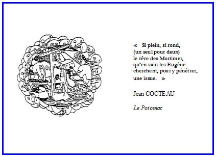

# Leçon 15 | 11 Juin 1974

<!-- source-url: http://staferla.free.fr/S21/S21 NON-DUPES....docx -->
<!-- seminar: s21 -->
<!-- lesson: 15 -->

<!-- id: s21-15-0001 -->

Voilà. J’ai dû faire quelques efforts pour que cette salle n’ait pas été aujourd’hui occupée par des gens en train de passer des examens et je dois dire qu’on a eu la bonté de me la laisser.

<!-- id: s21-15-0002 -->

Il est évident que c’est plus qu’aimable de la part de l’Université de Paris I d’avoir fait cet effort, puisque, les cours étant finis cette année...

<!-- id: s21-15-0003 -->

> ce que, bien sûr, moi j’ignore ...cette salle aurait dût être à la disposition d’une autre partie de l’ad­ministration qui, elle, s’occupe de vous canaliser.

<!-- id: s21-15-0004 -->

Alors, tout de même, comme ça ne peut pas se renouveler, passé une certaine limite, ça sera aujourd’hui la dernière fois de cette année que je vous parle.

<!-- id: s21-15-0005 -->

Ça me force naturellement un peu à tourner court, mais ce n’est pas pour me retenir, puisqu’en somme il faut bien toujours finir par tourner court.

<!-- id: s21-15-0006 -->

Moi je ne sais pas d’ailleurs très bien comment je suis niché là-dedans, parce qu’enfin l’Université, si c’est ce que je vous explique, c’est peut-être elle « *La femme ».*

<!-- id: s21-15-0007 -->

Mais c’est *La femme* préhistorique, c’est celle dont vous voyez qu’elle est faite de *replis*.

<!-- id: s21-15-0008 -->

Évidemment, moi c’est dans un de ces plis qu’elle m’héberge.

<!-- id: s21-15-0009 -->

Elle ne se rend pas compte, quand on a beaucoup de plis, on ne sent pas grand-chose*,* sans ça - qui sait ? - elle me trouverait peut-être encombrant.

<!-- id: s21-15-0010 -->

Alors, d’autre part, je vous le donne en mille...

<!-- id: s21-15-0011 -->

> vous n’imaginerez jamais à quoi j’ai perdu mon temps - perdu, enfin oui, perdu -
>
> à quoi j’ai perdu mon temps en partie depuis que je vous ai vus réunis là ...je vous le donne en mille : j’ai été à Milan à un congrès de sémiotique.

<!-- id: s21-15-0012 -->

Ça, c’est extraordinaire. C’est extraordinaire et bien sûr ça m’a laissé un peu *pantois*.

<!-- id: s21-15-0013 -->

Ça m’a laissé un peu *pantois* en ce sens que c’est très difficile...

<!-- id: s21-15-0014 -->

> dans une perspective justement universitaire ...d’aborder la sémiotique.

<!-- id: s21-15-0015 -->

Mais enfin, ce manque même, que j’y ai, si je puis dire, réalisé, m’a rejeté, si je puis dire, sur moi-même, je veux dire, m’a fait m’apercevoir que c’est très difficile d’aborder la sémiotique.

<!-- id: s21-15-0016 -->

Moi bien sûr, je n’ai pas moufeté parce que j’étais invité, comme ici, très très gentiment, et je ne vois pas pourquoi j’aurais dérangé ce Congrès en disant que le « *sème* » ça ne peut pas s’aborder comme ça tout cru à partir d’une certaine idée du savoir, une certaine idée du savoir qui n’est pas très bien située, en somme, dans l’université.

<!-- id: s21-15-0017 -->

Mais j’y ai réfléchi, et il y a à ça des raisons qui sont peut-être dues justement au fait que le savoir de *La femme*...

<!-- id: s21-15-0018 -->

> puisque c’est comme ça que j’ai situé l’Université \[discours « *uni vers Cythère* »\] ...le savoir de *La femme,* c’est peut-être pas tout à fait la même chose que le savoir dont nous nous occupons ici.

<!-- id: s21-15-0019 -->

Le savoir dont nous nous occupons ici *-* je pense vous l’avoir fait sentir *-* c’est *le savoir en quoi consiste l’inconscient*, et c’est en somme là-dessus que je voudrais clore cette année.

<!-- id: s21-15-0020 -->

Je n’ai jamais, en somme, je ne me suis jamais attaché à autre chose qu’à ce qu’il en est de ce savoir dit *inconscient*.

<!-- id: s21-15-0021 -->

Si j’ai par exemple marqué l’accent, sur le savoir en tant que le discours de la science peut le situer dans *le Réel*, ce qui est singulier et ce dont je crois avoir ici articulé en quelque sorte *l’impasse*, qui est celle dont on a assailli Newton pour autant que, ne faisant nulle hypothèse...

<!-- id: s21-15-0022 -->

> nulle hypothèse en tant qu’il articulait la chose scientifiquement ...eh bien, il était bien incapable... sauf bien sûr à ce qu’on le lui reproche ...il était bien incapable de dire où se situait ce savoir grâce à quoi le ciel se meut dans l’ordre qu’on sait, c’est-à-dire sur le fondement de la gravitation.

<!-- id: s21-15-0023 -->

Si j’ai accentué ce caractère « *dans le Réel* » d’un certain *savoir*, ça peut sembler être à côté de la question en ce sens que *le savoir inconscient*, lui, c’est un *savoir* à qui nous avons affaire, et c’est en ce sens qu’on peut le dire « *dans le Réel »*, c’est ce que j’essaie de vous supporter cette année de ce support d’une *écriture*...

<!-- id: s21-15-0024 -->

> d’une *écriture* qui n’est pas aisée, puisque c’est celle que vous m’avez vu manier
>
> plus ou moins adroitement au tableau sous la forme du nœud borroméen ...et c’est en quoi je voudrais conclure cette année.

<!-- id: s21-15-0025 -->

C’est à revenir sur ce *savoir,* et à dire comment il se présente, je ne dirais pas tout à fait « *dans le Réel »*, mais sur le chemin qui nous mène au *Réel*.

<!-- id: s21-15-0026 -->

De ça, il faut tout de même que je reparte, de ce qui m’a été également présentifié dans cet intervalle, c’est à savoir qu’il y a de drôles de gens, des gens qui continuent...

<!-- id: s21-15-0027 -->

> dans une certaine *Société* dite *Internationale* ...qui continuent à opérer comme si tout ça allait de soi.

<!-- id: s21-15-0028 -->

C’est à savoir que ça pouvait se situer dans un monde, comme ça, qui serait fait de corps...

<!-- id: s21-15-0029 -->

> de corps qu’on appelle *vivants,* et bien sûr y a pas de raison qu’on les appelle pas comme ça ...qui sont plongés dans un milieu qu’on appelle *«* *monde* » et tout ça, en effet, pourquoi le rejeter d’un coup ?

<!-- id: s21-15-0030 -->

Néanmoins, ce qui ressort d’une pratique...

<!-- id: s21-15-0031 -->

> d’une pratique qui se fonde sur l’*ex-sistence de l’inconscient* ...doit tout de même nous permettre de décoller de cette vision élémentaire qui est celle... je ne dirais pas du *moi*, encore qu’il s’en encombre et que j’aie lu des choses directement extraites *d’un certain congrès* qui s’est tenu à Madrid où par exemple, on s’aperçoit que Freud lui-même, je dois dire, a dit des choses aussi énormes que ça que je vais vous avancer, que c’est du *moi*...

<!-- id: s21-15-0032 -->

> le *moi* c’est autre chose que l’inconscient, évidemment ce n’est pas souligné que c’est autre chose... ...il y a un moment où Freud a refait toute sa « *Topique* », n’est-ce pas, comme on dit :

<!-- id: s21-15-0033 -->

Il y a la fameuse « *seconde Topique »* qui est une écriture simplement, qui n’est pas autre chose que quelque chose *en forme d’œuf*, qui est tout à fait d’autant plus frappante à voir, cette *forme d’œuf*, que ce qu’on y situe comme le « *moi* » vient à la place où sur un œuf, ou plus exactement *sur son jaune*, sur ce qu’on appelle le vitellus, est la place du point embryonnaire.

<!-- id: s21-15-0034 -->

C’est évidemment curieux, c’est évidemment très curieux et ça rapproche la fonction du *moi,* de celle où en somme, va se développer un corps, un corps dont c’est seulement le développement de la biologie qui nous permet de situer dans les premières morulations, gastrulations, etc., la façon dont il se forme.

<!-- id: s21-15-0035 -->

Mais comme ce corps...

<!-- id: s21-15-0036 -->

> et c’est en ça que ça consiste, cette « *seconde Topique »* de Freud ...comme ce corps est situé d’une relation au « *Ça* », au « *Ça* » qui est une idée extraordinairement *confuse* : comme Freud l’articule c’est un lieu, un lieu de silence, c’est ce qu’il en dit de principal.

<!-- id: s21-15-0037 -->

Mais à l’articuler ainsi, il ne fait que signifier que ce qui est supposé être « *Ça* » : c’est *l’inconscient* quand il se tait.

<!-- id: s21-15-0038 -->

Ce silence, c’est un *taire*.

<!-- id: s21-15-0039 -->

Et ce n’est pas là rien, c’est certainement un effort *dans un sens peut-être* *un peu régressif* par rapport à sa 1ère découverte, dans le sens disons de marquer *la place de l’Inconscient*.

<!-- id: s21-15-0040 -->

Ça ne dit pas pour autant ce qu’il est, cet *Inconscient*, en d’autres termes : à quoi il sert.

<!-- id: s21-15-0041 -->

Là il se tait, il est la place du silence.

<!-- id: s21-15-0042 -->

Il reste hors de doute que c’est compliquer le corps, le corps en tant que dans ce schème, c’est le *moi*, le *moi* qui se trouve, dans cette *écriture en forme d’œuf*, le « *moi* » qui se trouve le représenter.

<!-- id: s21-15-0043 -->

Le *moi* est-il le corps ?

<!-- id: s21-15-0044 -->

Ce qui rend difficile de le réduire au fonctionnement du corps, c’est justement ceci : que dans ce *schème,* il \[*le moi* \] est censé ne se développer que sur le fondement de ce *savoir*, de ce *savoir en tant qu’il se tait*, et d’y prendre ce qu’il faut bien appeler sa nourriture.

<!-- id: s21-15-0045 -->

Je vous le répète : c’est difficile d’être entièrement satisfait de cette « *seconde Topique* » parce que ce qui se passe...

<!-- id: s21-15-0046 -->

> à quoi nous avons affaire dans la pratique analytique ...c’est quelque chose qui semble bien se pré­senter d’une façon toute différente.

<!-- id: s21-15-0047 -->

C’est à savoir que cet inconscient, par rapport à ce qui couplerait si bien le *moi* au *monde*...

<!-- id: s21-15-0048 -->

> le corps à ce qui l’entoure, ce qui l’ordonnerait sous cette sorte de rapport
>
> qu’on s’obstine à vouloir considérer comme naturel ...c’est que par rapport à lui, cet inconscient se présente comme essentiellement *différent* de cette harmonie, \- disons le mot - *dysharmonique*. Je le lâche tout de suite, et pourquoi pas ? Il faut y mettre l’accent.

<!-- id: s21-15-0049 -->

Le rapport au *monde* est certainement...

<!-- id: s21-15-0050 -->

> si nous donnons son sens, ce sens effectif qu’il a dans la pratique ...est quelque chose dont on ne peut pas ne pas tout de suite ressentir que, par rapport à cette vision toute simple en quelque sorte de l’échange avec l’environnement, cet inconscient est parasitaire.

<!-- id: s21-15-0051 -->

C’est un parasite dont il semble qu’une certaine espèce, entre autres, s’accommode fort bien, mais ce n’est que dans la mesure où elle n’en res­sent pas les effets qu’il faut bien dire, énoncer pour ce qu’ils sont, c’est-à-dire pathogènes.

<!-- id: s21-15-0052 -->

Je veux dire que cet « *heureux* rapport », ce rapport prétendu « *harmonique »* entre ce qui vit et ce qui l’entoure, est per­turbé par *l’insistance de ce savoir* sans doute hérité : ce n’est pas un hasard qu’il soit là, et cet *être parlant*...

<!-- id: s21-15-0053 -->

pour l’appeler comme ça, comme je l’appelle ...cet *être parlant* l’habite, mais il ne l’habite pas sans toutes sortes d’inconvénients.

<!-- id: s21-15-0054 -->

Alors s’il est difficile de ne pas faire de *la vie* la caractéristique du *corps*.

<!-- id: s21-15-0055 -->

parce que c’est à peu près tout ce que nous pouvons en dire, en tant que corps il est là et il a bien l’air de se défendre.

<!-- id: s21-15-0056 -->

De se défendre contre quoi ?

<!-- id: s21-15-0057 -->

Contre ce quelque chose auquel il est difficile de ne pas l’identifier, c’est-à-dire ce qu’il en reste de ce corps quand il n’a plus la vie.

<!-- id: s21-15-0058 -->

C’est à cause de ça qu’en anglais on appelle le cadavre *corpse*, autrement, *quand il vit*, on l’appelle *body.*

<!-- id: s21-15-0059 -->

Mais que ce soit le même, ça a l’air satisfaisant comme ça, matériellement.

<!-- id: s21-15-0060 -->

Enfin, on voit bien que ce qu’il en reste, c’est le déchet, et s’il faut en conclure que la vie, comme disait Bichat : « *c’est l’ensemble des forces qui résistent à la mort* ».

<!-- id: s21-15-0061 -->

C’est un schéma malgré tout un peu grossier.

<!-- id: s21-15-0062 -->

Ça ne dit pas du tout comment ça se soutient, la vie.

<!-- id: s21-15-0063 -->

Et à la vérité, il a fallu en arriver fort tard dans la biologie pour qu’on ait l’idée que la vie c’est « *autre chose »*...

<!-- id: s21-15-0064 -->

> c’est tout ce que nous pouvons en dire ...c’est « *autre chose »* que l’ensemble des forces qui s’opposent à la résolution du corps en cadavre.

<!-- id: s21-15-0065 -->

Je dirais même plus : tout ce qu’il peut y avoir qui nous laisse espérer un peu « *autre chose »*...

<!-- id: s21-15-0066 -->

> à savoir de ce que c’est que la vie ...nous porte tout de même vers une toute autre *conception.*

<!-- id: s21-15-0067 -->

Celle dont j’ai cette année essayé de placer quelque chose en vous parlant d’un biologiste éminent : de Jacob dans sa collaboration avec Wollman, et de ce qui, d’ailleurs bien au-delà...

<!-- id: s21-15-0068 -->

> c’est par là que j’ai essayé de vous en donner une idée ...ce qui bien au-delà se trouve être ce que nous pouvons articuler du développement de la vie, et nommément ceci auquel les biologistes arrivent : que grâce au fait qu’ils peuvent y regarder d’un peu plus près qu’on ne l’a fait depuis toujours, que la vie se supporte de *quelque chose* dont je ne vais pas quant à moi franchir le pas,

<!-- id: s21-15-0069 -->

- et dire que ça ressemble à *un langage*,

<!-- id: s21-15-0070 -->

- et parler des *messages* qui seraient inscrits dans les premières molécules et qui pourraient faire des effets évidemment singuliers, des effets qui se manifestent dans la façon dont s’organisent toutes sortes

<!-- id: s21-15-0071 -->

> de choses qui vont aux purines, ou à toutes sortes de constructions chimiquement repérées et repérables.

<!-- id: s21-15-0072 -->

Mais enfin, il y a certainement un désaxement profond qui se produit et qui se produit d’une façon dont il est pour le moins curieux que ça vienne à remarquer que tout part de quelque chose d’articulé, jusques et y compris une ponctuation. Je ne veux pas m’étendre là-dessus.

<!-- id: s21-15-0073 -->

Je ne veux pas m’étendre là-dessus, mais après tout c’est bien parce que je n’assimile nullement cette sorte de signalétique dont se sert la biologie, je ne l’assimile nullement à ce qu’il en est du *langage*, contrairement à la sorte de jubilation qui semble avoir saisi, à ce propos, le linguiste qui se rencontre avec le biologiste, lui serre la main et lui dit : nous sommes dans le même bain.

<!-- id: s21-15-0074 -->

Je crois que des concepts, par exemple comme celui de « *stabilité structurelle* », peuvent - si je puis dire - donner une autre forme de présence au corps.

<!-- id: s21-15-0075 -->

Car enfin ce qui est essentiel ce n’est pas seulement comment la vie s’arrange avec soi-même pour qu’il se produise des choses qui sont capables d’être *vivantes*, c’est que tout de même le corps a une forme, une organisation, une morphogenèse, et que c’est une autre façon aussi de voir les choses, à savoir : qu’un corps ça se reproduit.

<!-- id: s21-15-0076 -->

Alors c’est pas pareil, quand même, que la façon dont à l’intérieur ça communique, si on peut dire.

<!-- id: s21-15-0077 -->

Cette notion de *communication* qui est tout ce dont il s’agit dans cette idée des premiers *messages* grâce à quoi s’organiserait la substance chimique, c’est autre chose.

<!-- id: s21-15-0078 -->

C’est autre chose, et alors c’est là qu’il faut faire le saut et nous apercevoir

<!-- id: s21-15-0079 -->

- que *des signes* sont donnés dans une expérience privilégiée,

<!-- id: s21-15-0080 -->

- qu’il y a un ordre à distinguer, non pas *du Réel*, mais *dans le Réel*,

<!-- id: s21-15-0081 -->

- et qu’il s’origine, s’originalise d’être solidaire de quelque chose qui, malgré nous, si je puis dire, est exclu de cet abord de la vie, mais dont nous ne nous rendons pas compte.

<!-- id: s21-15-0082 -->

C’est ça sur quoi cette année j’ai voulu insister : que la vie l’implique, l’implique *imaginairement* si on peut dire.

<!-- id: s21-15-0083 -->

Ce qui nous frappe dans ce fait auquel a adhéré vraiment Aristote : qu’il n’y a que l’individu qui compte vraiment, c’est que, sans le savoir, il y suppose la *jouissance*.

<!-- id: s21-15-0084 -->

Et ce qui constitue l’*Un* de cet individu, c’est qu’à toutes sortes de signes...

<!-- id: s21-15-0085 -->

> mais pas de signes dans le sens où je l’entendais tout à l’heure,
>
> de signes que donne cette expérience privilégiée que je situais dans l’analyse, ne l’oublions pas ...il y a des signes dans son déplacement, dans sa motion, qu’il *jouit*.

<!-- id: s21-15-0086 -->

Et c’est bien en ça qu’Aristote n’a aucune peine à faire une éthique, c’est qu’il suppose ἡδονή \[èdoné\] :

<!-- id: s21-15-0087 -->

- ἡδονή \[èdoné\] n’avait pas reçu ce sens que plus tard il a reçu des épicuriens,

<!-- id: s21-15-0088 -->

- ἡδονή \[èdoné\] dont il s’agit, c’est ce qui met le corps dans un courant qui est de *jouissance*.

<!-- id: s21-15-0089 -->

Il ne peut le faire que parce qu’il est lui-même dans une position privilégiée, mais comme il ne sait pas laquelle, comme il ne sait pas *qu’il pense ainsi* *la jouissance* parce qu’il est *de la classe des maîtres*, il se trouve qu’il y va tout de même, à savoir que seul celui qui peut faire ce qu’il veut, que seul celui-là a une *éthique*.

<!-- id: s21-15-0090 -->

Cette *jouissance* est évidemment liée bien plus qu’on ne le croit à la logique de la vie.

<!-- id: s21-15-0091 -->

Mais ce que nous découvrons, c’est que chez un être privilégié...

<!-- id: s21-15-0092 -->

> aussi privilégié qu’Aristote l’était par rapport à l’ensemble de l’humain ...chez un être privilégié, cette vie - si je puis dire - *se varie,* ou même *s’avarie, s’avarie au point de se diversifier*... dans quoi ?

<!-- id: s21-15-0093 -->

Eh bien, c’est de ça qu’il s’agit justement, il s’agit des « *sèmes* », à savoir de ce quelque chose qui s’incarne dans *lalangue.*

<!-- id: s21-15-0094 -->

Car il faut bien se résoudre à penser que *lalangue* est solidaire de la réalité des sentiments qu’elle signifie.

<!-- id: s21-15-0095 -->

S’il y a quelque chose qui nous le fait vraiment toucher, c’est justement la psychanalyse.

<!-- id: s21-15-0096 -->

Qu’« *empêchement* »...

<!-- id: s21-15-0097 -->

> comme je l’ai dit dans un temps dans mon séminaire sur *L’Angoisse*
>
> dont je peux regretter qu’après tout il ne soit pas déjà là à votre disposition ...qu’« *empêchement* », « *émoi* »...

<!-- id: s21-15-0098 -->

> « *émoi* » tel que je l’ai bien précisé : « *émoi* » c’est retrait d’une puissance ...qu’« *embarras* », soient des mots qui ont *du sens*, eh bien ils n’ont de *sens* que véhiculés sur les traces que fraye *lalangue.*

<!-- id: s21-15-0099 -->

Bien sûr, nous pouvons projeter comme ça sur des animaux ces sentiments. Je vous ferai remarquer seulement

<!-- id: s21-15-0100 -->

- que si nous pouvons - *empêchement*, *émoi*, *embarras* - les projeter sur des animaux, c’est uniquement sur des animaux domestiques,

<!-- id: s21-15-0101 -->

- que nous puissions dire qu’un chien ait été *ému*, *embarrassé* ou *empêché* dans quelque chose, c’est dans la mesure où il est dans le champ de ces « *sèmes* », et ceci par notre intermédiaire.

<!-- id: s21-15-0102 -->

Alors je voudrais quand même vous faire sentir ce qu’implique l’expérience analytique : c’est que quand il s’agit de cette sémiotique, de ce qui fait *sens* et de ce qui comporte *sentiment*, eh bien ce que démontre cette expérience c’est que *c’est de lalangue,* telle que je l’écris, que procède ce que je ne vais pas hésiter à appeler « *l’animation »*...

<!-- id: s21-15-0103 -->

> et pourquoi pas ? Vous savez bien que je ne vous barbe pas avec l’*âme* \[*anima*\] :
>
> l’*animation*, c’est dans le sens d’un sérieux *trifouillement*, d’un *chatouillis*, d’un *grat­tage*, d’une *fureur* pour tout dire ...*l’animation de la jouissance du corps*.

<!-- id: s21-15-0104 -->

Et *cette « animation »* n’est pas notre expérience, ne provient pas de n’importe où : si le corps dans sa motricité est *animé*, au sens où je viens de vous le dire...

<!-- id: s21-15-0105 -->

> à savoir que c’est *l’animation* que donne un parasite*...*
>
> *l’animation* que, peut-être, moi je donne à l’Université par exemple ...eh bien *ça provient d’une jouissance privilégiée, distincte de celle du corps*.

<!-- id: s21-15-0106 -->

Il est bien certain que pour en parler, on est plutôt dans l’embarras parce que l’avancer comme ça, c’est risible, et c’est pas pour rien que ce soit risible : c’est risible parce que ça fait rire.

<!-- id: s21-15-0107 -->

Mais *c’est très précisément ça que nous situons dans la jouissance phallique*.

<!-- id: s21-15-0108 -->

*La jouissance phallique, c’est celle qui est en somme apportée par les « sèmes »*, puisqu’aujourd’hui

<!-- id: s21-15-0109 -->

> *tracassé* comme je l’ai été par ce Congrès de sémiotique *...*je me permets d’avancer le mot « *sème* ».

<!-- id: s21-15-0110 -->

C’est pas que j’y tienne, vous comprenez, parce que je ne cherche pas à vous compliquer la vie.

<!-- id: s21-15-0111 -->

Je ne cherche pas à vous compliquer la vie, ni surtout à vous faire sémioticiens, Dieu sait où ça pourrait vous mener !

<!-- id: s21-15-0112 -->

Ça vous mènera d’ailleurs dans l’endroit où vous êtes, c’est-à-dire que ça ne vous sortira pas de l’Université.

<!-- id: s21-15-0113 -->

Seulement, c’est quand même là ce dont il s’agit : le « *sème* », c’est pas compliqué : *c’est ce qui fait sens*.

<!-- id: s21-15-0114 -->

Tout ce qui fait sens dans *lalangue* s’avère lié à *l’ex-sistence* de cette langue, à savoir que c’est *en dehors de l’affaire de la vie*, du corps, et que s’il y a quelque chose que j’ai essayé de développer cette année devant vous...

<!-- id: s21-15-0115 -->

> que j’espère avoir rendu présent - mais qui sait ? ...c’est que c’est pour autant *que cette jouissance phallique, que cette jouissance sémiotique* se surajoute au corps, qu’il y a un problème.

<!-- id: s21-15-0116 -->

Ce problème, je vous ai proposé de le résoudre, si tant est que ce soit une complète solution, mais de le résoudre simplement du constat que cette *sémiosis* patinante chatouille le corps dans la mesure*...*

<!-- id: s21-15-0117 -->

> et cette mesure, je vous la propose comme absolue *...*dans la mesure où *il n’y a pas de rapport sexuel*.

<!-- id: s21-15-0118 -->

En d’autres termes, dans cet ensemble confus que *seul le sème*...

<!-- id: s21-15-0119 -->

> *le sème une fois qu’on l’a lui-même un peu éveillé à l’ex-sistence, c’est-à-dire qu’on l’a <u>dit</u>* comme tel, ...c’est par là, *c’est dans la mesure où le corps parlant habite ces sèmes qu’il trouve le moyen de suppléer au fait* *que rien, rien à part ça, ne le conduirait vers* ce qu’on a bien été forcé de faire surgir dans le terme « *autre* », dans le terme *autre* qui habite *lalangue* et qui est fait pour représenter ceci justement : *qu’il n’y a avec le partenaire sexuel aucun rapport autre que par l’intermédiaire de ce qui fait sens dans lalangue.*

<!-- id: s21-15-0120 -->

Il n’y a pas de rapport naturel, non pas que s’il était naturel, on pourrait *l’écrire*, mais que justement *on ne peut pas l’écrire* *parce qu’il n’y a rien de natu­rel dans le rapport sexuel de cet être qui se trouve moins être parlant, qu’être parlé.*

<!-- id: s21-15-0121 -->

Qu’*imaginairement* - à cause de ça - *cette jouissance* dont vous voyez qu’en vous la présentant *comme phallique*, je l’aie qualifiée de façon équivalente *comme sémiotique*, bien sûr, c’est évidemment parce qu’*il me paraît tout à fait grotesque de l’imaginer ce phallus, dans l’organe mâle*.

<!-- id: s21-15-0122 -->

C’est quand même bien ainsi que dans le fait que révèle l’expé­rience analytique, il est *imaginé*.

<!-- id: s21-15-0123 -->

Et c’est certainement aussi *le signe* qu’il y a, dans cet organe mâle, quelque chose qui constitue une expérience de jouissance qui est *à part* des autres.

<!-- id: s21-15-0124 -->

Non seulement qui est à part des autres mais qui, les autres jouissances...

<!-- id: s21-15-0125 -->

> la jouissance qu’il est ma foi tout à fait facile d’imaginer, à savoir qu’un corps, mon Dieu,
>
> c’est fait pour qu’on ait le plaisir de lever un bras et puis l’autre, et puis de faire de la gymnastique,
>
> et de sauter, et de courir, et de tirer, et de faire tout ce qu’on veut ...il est quand même curieux que ce soit autour de cet organe que naisse une jouissance privilégiée.

<!-- id: s21-15-0126 -->

Car c’est ce que nous montre l’expérience analytique, c’est à savoir que *c’est autour de cette forme grotesque* *que se met à pivoter cette sorte de suppléance* que j’ai qualifiée de ce qui, dans l’énoncé de Freud, est marqué du privilège, si on peut dire, du *sens sexuel*, sans qu’il n’ait vraiment réalisé*...*

<!-- id: s21-15-0127 -->

> quoique tout de même ça le chatouillait lui aussi
>
> et il l’a entrevu, il l’a presque dit dans *« Malaise dans la Civilisation »* *...*c’est à savoir que *le sens n’est sexuel que parce que le sens se substitue justement au sexuel qui manque*.

<!-- id: s21-15-0128 -->

Tout ce qu’implique son usage, son usage analytique du comportement humain, c’est ça que ça suppose : non pas que le sens reflète *le sexuel,* mais qu’il y supplée.

<!-- id: s21-15-0129 -->

Le sens - il faut le dire - le sens quand on ne le travaille pas, eh bien, il est opaque.

<!-- id: s21-15-0130 -->

La confusion des sentiments, c’est tout ce que *lalangue* est faite pour sémiotiser.

<!-- id: s21-15-0131 -->

Et c’est bien pour ça que tous les mots sont faits pour être ployables à tous les sens.

<!-- id: s21-15-0132 -->

Alors ce que j’ai proposé, ce que j’ai proposé dès le départ de cet enseignement, dès *Le discours de Rome*, c’est d’accorder l’importance qu’elle a dans la pratique, dans la pratique analytique, au « *matériel* » de *lalangue.*

<!-- id: s21-15-0133 -->

*Un linguiste,* bien sûr est tout à fait introduit d’emblée à cette considération de la langue comme ayant « *un* *matériel* ».

<!-- id: s21-15-0134 -->

Il le connaît bien, ce matériel :

<!-- id: s21-15-0135 -->

- c’est celui qui est dans les dictionnaires,

<!-- id: s21-15-0136 -->

- c’est le lexique,

<!-- id: s21-15-0137 -->

- c’est la morphologie aussi,

<!-- id: s21-15-0138 -->

- c’est l’objet de sa linguistique.

<!-- id: s21-15-0139 -->

Il y a quelqu’un qui, naturellement est à *cent coudées au-dessus* *d’un tel congrès* que celui que je vous ai dit, c’est Jakobson. Il a un petit peu parlé de moi, comme ça en marge, pas dans son discours d’entrée, mais tout de suite après, il a tenu à bien préciser que l’usage que j’avais fait de Saussure, et derrière Saussure...

<!-- id: s21-15-0140 -->

> j’en savais assez pour le savoir quand même ...des stoïciens et de saint Augustin.

<!-- id: s21-15-0141 -->

Pourquoi pas ? Je ne recule devant rien.

<!-- id: s21-15-0142 -->

C’est bien sûr que ce que j’ai emprunté à Saussure simplement, et aux Stoïciens sous le terme de *signatum,* *ce signatum c’est le sens*, et qu’il est tout aussi important que cet accent que j’ai mis sur le *signans*...

<!-- id: s21-15-0143 -->

Le *signans* a l’intérêt qu’il nous permet dans l’analyse d’opérer, de résoudre*...*

<!-- id: s21-15-0144 -->

> encore que, comme tout le monde, nous ne soyons capables que d’avoir une pensée à la fois *...*mais de nous mettre dans cet état dit pudiquement *« d’attention flottante »*, qui fait que justement quand le partenaire là, l’*analysant*, lui en émet une, une pensée, nous pouvons en avoir une tout autre, c’est un heureux hasard d’où jaillit un éclair.

<!-- id: s21-15-0145 -->

Et c’est justement de là que peut se produire l’*interprétation*, c’est-à-dire qu’à cause du fait que nous avons une « *attention flottante »*, nous entendons ce qu’il a dit...

<!-- id: s21-15-0146 -->

> quelquefois simplement du fait d’une espèce d’*équivoque*, c’est-à-dire d’une équivalence matérielle ...nous nous apercevons que ce qu’il a dit...

<!-- id: s21-15-0147 -->

> nous nous apercevons parce que nous le subissons ...que ce qu’il a dit pouvait être entendu *tout de travers*.

<!-- id: s21-15-0148 -->

Et c’est justement en l’entendant *tout de travers* que nous lui permettons de s’apercevoir d’où ses pensées, sa sémiotique à lui, d’où elle émerge : elle n’émerge de rien d’autre que de *l’ex-sistence de lalangue.*

<!-- id: s21-15-0149 -->

*Lalangue ex-siste ailleurs que dans ce qu’il croit être « son monde »*.

<!-- id: s21-15-0150 -->

*Lalangue a le même parasitisme que la jouissance phallique* par rapport à toutes les autres jouissances.

<!-- id: s21-15-0151 -->

*Et c’est elle qui détermine comme parasitaire dans le Réel ce qu’il en est du savoir inconscient*.

<!-- id: s21-15-0152 -->

*Il faut concevoir* *lalangue...*

<!-- id: s21-15-0153 -->

et pourquoi pas parler de ce *que lalangue serait en rapport avec la jouissance phallique comme les branches à l’arbre*.

<!-- id: s21-15-0154 -->

C’est pas pour rien...

<!-- id: s21-15-0155 -->

> parce que quand même j’ai ma petite idée ...c’est pas pour rien que je vous ai fait remarquer que ce fameux arbre de départ là*,* celui où on a cueilli la pomme*,* on pouvait se poser la question *s’il jouit* lui-même tout comme un autre être vivant.

<!-- id: s21-15-0156 -->

Si je vous ai avancé ça, c’est pas tout à fait sans raisons, bien sûr.

<!-- id: s21-15-0157 -->

Et alors disons que *lalangue, <u>n’importe quel élément de lalangue</u> <u>c’est</u>...*

<!-- id: s21-15-0158 -->

> *au regard de la jouissance phallique* *...<u>un brin de jouissance</u>, et c’est en ça que ça étend ses racines <u>si loin dans le corps</u>.*

<!-- id: s21-15-0159 -->

Bon, alors *ce dont il faut partir*...

<!-- id: s21-15-0160 -->

> vous voyez, ça traîne, il est tard, bon... ...*c’est de cette forte affirmation que l’inconscient n’est pas une connaissance : c’est un savoir,* *et un savoir en tant que je le définis de la connexion de signifiants*, 1er point. 2ème point : *c’est un savoir dysharmonique,* qui ne prête d’aucune façon à un mariage qui serait heureux*.*

<!-- id: s21-15-0161 -->

C’est impliqué dans la notion de « *mariage »*, c’est ça qui est énorme, qui est fabuleux : qui est-ce qui connaît *un mariage heureux* ? Non ? ...Mais enfin passons.

<!-- id: s21-15-0162 -->

Néanmoins le nom est fait pour exprimer le bonheur.

<!-- id: s21-15-0163 -->

Oui, le nom est fait pour exprimer *le bonheur* et c’est celui qui m’est venu pour vous dire ce qu’on pourrait imaginer *d’une bonne adaptation*, comme on dit, *d’un emboîtement*, de quelque chose qui ferait que ce que je vous ai dit de la vie...

<!-- id: s21-15-0164 -->

de la vie du corps chez celui qui parle ...ça pourrait se juger d’un juste, *d’un noble échange entre ce corps et son « milieu »* comme on dit : son « *Welt »* à la noix.

<!-- id: s21-15-0165 -->

Quand même, ces remarques ont leur importance historique, parce que vous verrez, *vous qui me survivrez vous le verrez* : tout ce qui a commencé de se balbutier en biologie donne bien l’impression que la vie n’a rien de naturel.

<!-- id: s21-15-0166 -->

C’est une chose folle. La preuve, c’est qu’on y a foutu la linguistique ! C’est énorme, enfin.

<!-- id: s21-15-0167 -->

Elle réservera des surprises cette vie, quand on aura cessé de parler comme des sansonnets, à savoir de s’imaginer que « *la vie ça s’oppose à la mort »*. C’est absolument dingue, cette histoire !

<!-- id: s21-15-0168 -->

D’abord, qu’est-ce que nous en savons ?

<!-- id: s21-15-0169 -->

Qu’est-ce qui est mort ?

<!-- id: s21-15-0170 -->

Le monde inanimé, que nous disons.

<!-- id: s21-15-0171 -->

Mais c’est parce qu’il y en a une autre conception de l’âme que celle que je vous représentais maintenant, à savoir que l’âme c’est un crabe.

<!-- id: s21-15-0172 -->

Alors je vais vous dire : au point où nous en sommes c’est paradoxal.

<!-- id: s21-15-0173 -->

C’est paradoxal, je dis ça parce que j’ai lu un petit papier tor­chon qui s’est émis là dans le dernier congrès de la *Société de Psychanalyse* et qui témoignait de ceci qui est pour le moins paradoxal : c’est que pour ce que je suis en train de rejeter, à savoir

<!-- id: s21-15-0174 -->

- qu’il y ait *connaissance* \[*co-naissance*\],

<!-- id: s21-15-0175 -->

- qu’il y ait la moindre *harmonie* de ce qu’on situe de *la jouissance,* de *la jouissance corporelle,* avec ce qui entoure*.*

<!-- id: s21-15-0176 -->

Mais il n’y a qu’un endroit où ça puisse se produire, cette fameuse « *connaissance »*, enfin un endroit à mon sens, et vous le devinerez jamais : c’est dans l’analyse elle-même.

<!-- id: s21-15-0177 -->

Dans l’analyse on peut dire qu’il peut y avoir quelque chose qui ressemble à *la connaissance*.

<!-- id: s21-15-0178 -->

Et j’en trouve le témoignage dans ceci : qu’à propos du papier torchon dont je vous parle, où il s’agit du rêve, c’est absolument merveilleux l’innocence avec laquelle ça s’avoue.

<!-- id: s21-15-0179 -->

Il y a une personne*...*

<!-- id: s21-15-0180 -->

> et une personne dont je m’étonne pas du tout que ce soit *cette personne-là*, parce que quand même
>
> il a reçu une touche d’un petit coup de fion que je lui ai donné dans le temps \[*Rires*\] *...*c’est que tout est centré autour de ceci qu’il voit se reproduire dans un de ses rêves une note, une note à proprement parler sémantique*...*

<!-- id: s21-15-0181 -->

> à savoir que ça n’est que vraiment là comme noté, articulé, écrit *...*il voit se reproduire dans un de ses rêves une note sémantique du rêve d’un de ses patients.

<!-- id: s21-15-0182 -->

Il a bien raison de foutre *co-nnaissance* dans son titre.

<!-- id: s21-15-0183 -->

Cette espèce de mise en co-vibration, en co-vibration sémiotique, en fin de compte c’est pas étonnant qu’on appelle ça comme ça pudiquement : *le transfert*.

<!-- id: s21-15-0184 -->

Et on a bien raison aussi de ne l’appeler que comme ça. Ça, je suis pour.

<!-- id: s21-15-0185 -->

C’est pas l’*amour*, mais c’est l’amour au sens ordinaire, c’est l’amour tel qu’on se l’imagine.

<!-- id: s21-15-0186 -->

L’*amour*, c’est évidemment autre chose.

<!-- id: s21-15-0187 -->

Mais pour ce qui est de l’idée, si je puis dire, qu’on se fait de l’amour, on fait pas mieux que dans cette sorte de *connaissance analytique*.

<!-- id: s21-15-0188 -->

Je ne suis pas sûr que *ça mène loin*, c’est bien aussi d’ailleurs pourquoi *ça reste dans le marais, toute* *l’expérience analytique*.

<!-- id: s21-15-0189 -->

C’est pas de cela qu’il devrait s’agir.

<!-- id: s21-15-0190 -->

Il doit s’agit d’élaborer, de permettre à celui que j’appelle *l’analysant*, d’élaborer *ce savoir inconscient* qui est en lui comme un chancre, pas comme une profondeur, comme un chancre !

<!-- id: s21-15-0191 -->

Ça, c’est autre chose, bien sûr, c’est autre chose que la *connaissance*.

<!-- id: s21-15-0192 -->

Et il y faut une discipline évidemment un peu autre qu’une discipline philosophique, n’est-ce pas ?

<!-- id: s21-15-0193 -->

Il y a un machin de Cocteau*...*

<!-- id: s21-15-0194 -->

> parce que de temps en temps je ne vois pas pourquoi je cracherais sur les écrivains,
>
> ils sont plutôt moins cons que les autres *...*il y a un machin de Cocteau qui s’appelle « *Le Potomak »* où il a créé quelque chose, dont je ne vais pas me mettre à vous dire ce que c’est : *les Eugène*. Mais il y a aussi là-dedans *les Mortimer*.

<!-- id: s21-15-0195 -->

*Les Mortimer* n’ont qu’un seul cœur, et c’est représenté dans un petit dessin où ils ont un rêve en commun.

<!-- id: s21-15-0196 -->

<!-- id: s21-15-0197 -->

C’est quelqu’un dans le genre de mon psychanalyste de tout à l’heure, celui que je n’ai pas nommé : entre l’analysant et l’analyste c’est comme chez les *Mortimer*.

<!-- id: s21-15-0198 -->

C’est pas fréquent, c’est pas fréquent même chez les gens qui s’aiment, qu’ils fassent le même rêve.

<!-- id: s21-15-0199 -->

Ça c’est même *très remarquable*.

<!-- id: s21-15-0200 -->

C’est bien ce qui prouve la solitude de chacun avec ce qui sort de *la jouissance phallique*.

<!-- id: s21-15-0201 -->

Alors quand même...

<!-- id: s21-15-0202 -->

> il ne me reste plus qu’un petit quart d’heure ...je voudrais quand même faire quelques remarques sur la portée... parce que ça a semblé frapper comme ça un copain qui est là au premier rang, je lui ai lâché ça comme ça au cours d’un dîner, et j’ai eu la surprise de voir que ça le comblait de plaisir.

<!-- id: s21-15-0203 -->

Alors je me suis rendu compte à quel point je m’explique mal. \[*Rires*\]

<!-- id: s21-15-0204 -->

Parce que moi je vous avais écrit au tableau* *: : §.

<!-- id: s21-15-0205 -->

Ce qui veut dire : faut qu’il y en ait un qui dise *non* à la jouissance phallique.

<!-- id: s21-15-0206 -->

Grâce à quoi, et seulement grâce à quoi,* *; !, il y en a des *« tous »* qui disent *oui*.

<!-- id: s21-15-0207 -->

Et je vous ai mis en face qu’il y a - j’ai dû prêter à confusion - / § qu’il y en a d’autres *chez qui* il n’y en a pas qui disent *non*.

<!-- id: s21-15-0208 -->

Seulement ça a pour curieuse conséquence que chez ces autres, y a *« pas de tout »* qui dise *oui* : . !.

<!-- id: s21-15-0209 -->

Ça, c’est la tentative d’inscription dans une fonction mathématique de quelque chose qui use des *quanteurs*.

<!-- id: s21-15-0210 -->

Et il y a rien d’illégitime...

<!-- id: s21-15-0211 -->

> je ne vais pas plaider ça aujourd’hui parce que nous n’avons plus le temps ...il y a rien d’illégitime à cette quantification du sens.

<!-- id: s21-15-0212 -->

Cette quantification relève d’une identification. L’ identification relève d’une unification.

<!-- id: s21-15-0213 -->

Qu’est ce que je vous ai écrit autrefois dans les formules des 4 discours ?

<!-- id: s21-15-0214 -->

Un S1 qui vient *se ficher*, qui vient *pointer* dans un S2 \[S1→ S2\].

<!-- id: s21-15-0215 -->

Qu’est-ce que c’est qu’un S1 ? C’est un signifiant, comme la lettre l’indique.

<!-- id: s21-15-0216 -->

Le propre d’un signifiant...

<!-- id: s21-15-0217 -->

> c’est un fait de langue auquel on ne peut rien ...c’est que tout signifiant peut se réduire à la portée du signifiant **1***.*

<!-- id: s21-15-0218 -->

Et c’est en tant que signifiant **1***...*

<!-- id: s21-15-0219 -->

> je pense que vous vous souvenez autrefois de mes petites parenthèses :
>
> S1, S2 entre parenthèses, et il y avait des S1 qui se refoutaient devant, *etc.*
>
> \[(S1 (S1 (S1 (S1 → S2) ) ) )\] *...*pour exprimer l’affaire que je définis pour faire que le signifiant ça soit ce qui domine dans la constitution du sujet : *« un signifiant est ce qui représente un sujet pour un autre signifiant »*.

<!-- id: s21-15-0220 -->

Bon alors, toute lettre x, et quelle qu’elle soit, ça veut dire cet **1** comme indéterminé.

<!-- id: s21-15-0221 -->

C’est ce qu’on appelle dans la fonction - dans la fonction au sens mathématique - *l’argument*.

<!-- id: s21-15-0222 -->

C’est de là que je suis parti pour vous parler de l’*identification*.

<!-- id: s21-15-0223 -->

Mais,

<!-- id: s21-15-0224 -->

- s’il y a une *identification*, une *identification sexuée*,

<!-- id: s21-15-0225 -->

- et si d’autre part je vous dis qu’il n’y a pas de rapport sexuel, qu’est-ce que ça veut dire ?

<!-- id: s21-15-0226 -->

Ça veut dire qu’il n’y a d’*identification sexuée* que d’un côté.

<!-- id: s21-15-0227 -->

C’est-à-dire que tous ces épinglages dits *fonctionnels* de *l’identification*, ils sont à mettre*...*

<!-- id: s21-15-0228 -->

> et c’est en ça que le copain en question manifestait sa vive satisfaction,
>
> c’est parce que je le lui ai dit comme ça appuyé, au lieu qu’à vous, je vous ai laissés dans la mélasse *...*c’est que *toutes ces identifications sont du même côté*.

<!-- id: s21-15-0229 -->

Ça veut dire qu’il y a qu’une *femme* qui est capable de les faire.

<!-- id: s21-15-0230 -->

Pourquoi pas l’homme ? ...

<!-- id: s21-15-0231 -->

parce que vous remarquez que je dis bien sûr *<u>une</u> femme,* et puis je dis « *<u>l</u>’homme* ».

<!-- id: s21-15-0232 -->

...parce que l’homme*...*

<!-- id: s21-15-0233 -->

> l’homme tel que l’imagine *La femme,* c’est-à-dire celle qui n’existe pas, c’est-à-dire une imagination de vide *...*l’homme lui, il est tordu par son sexe.

<!-- id: s21-15-0234 -->

Au lieu qu’une femme peut faire une *identification sexuée*.

<!-- id: s21-15-0235 -->

Elle a même que ça à faire, puisqu’il faut qu’elle en passe par *la jouissance phallique* qui est justement *ce qui lui manque*.

<!-- id: s21-15-0236 -->

Je vous dis ça parce que je pourrais le moucheter d’un repérage de mes quatre petits épinglages, là :  ;...

<!-- id: s21-15-0237 -->

je ne vais pas au tableau parce que vous allez plus entendre si j’écris au tableau

<!-- id: s21-15-0238 -->

...; !.

<!-- id: s21-15-0239 -->

Qu’est-ce que ça veut dire pour *la femme,* puisque vous avez pu croire qu’avec ça \[; !\], ce que je désignais c’étaient *tous les hommes* ?

<!-- id: s21-15-0240 -->

Ça veut dire l’exigence que *la* *femme* montre - c’est patent - que l’homme soit *tout à elle*...

<!-- id: s21-15-0241 -->

> je commence par là, parce que c’est le plus marrant

<!-- id: s21-15-0242 -->

...Il est dans la nature d’une femme d’être jalouse, dans la nature de son amour.

<!-- id: s21-15-0243 -->

Quand je pense qu’il va falloir que d’ici dix minutes, je vous explique aussi ce qu’est que l’amour !

<!-- id: s21-15-0244 -->

C’est ennuyeux d’être bousculé à ce point-là. Bon.

<!-- id: s21-15-0245 -->

Le « *pas toutes* » dont j’ai inscrit l’autre rapport au ! \[. !\], c’est par quoi ce même amour...

<!-- id: s21-15-0246 -->

> l’amour dont il s’agit et que je mets là comme ça, *généreusement* tout entier du côté des femmes, ...il faut quand même y mettre, si je puis dire, une pédale \[*Rires*\].

<!-- id: s21-15-0247 -->

Je veux dire par là, que *c’est « pas toute » qu’elle aime* : *il lui en reste un bout pour elle, de sa jouissance corporelle*.

<!-- id: s21-15-0248 -->

*C’est ça que ça veut dire, le* . le *pas-toutisme*. Bon.

<!-- id: s21-15-0249 -->

Et puis après le :, *l’ex-sistence* du *x* - lui que pour un rien...

<!-- id: s21-15-0250 -->

> enfin, « *pour un rien* » et puis parce que je l’ai dit ici en clair ...qui est celui où se situe Dieu.

<!-- id: s21-15-0251 -->

Il faut être plus tempéré...

<!-- id: s21-15-0252 -->

je veux dire par là qu’il faut pas se monter le bourrichon avec ces histoires de Dieu, depuis le temps ça s’use ...c’est tout de même pas parce *qu’il y a du savoir dans le Réel* que nous sommes forcés de l’identifier à Dieu.

<!-- id: s21-15-0253 -->

Je m’en vais vous en proposer, moi, une autre interprétation : : § : *c’est le lieu de la jouissance de la femme, qui est beaucoup plus lié au <u>dire</u> qu’on ne l’imagine*.

<!-- id: s21-15-0254 -->

Il faut bien dire que *sans la psychanalyse*, il est bien évident que *je serais là-dedans* *comme un béjaune* [^30]*, comme tout le monde*.

<!-- id: s21-15-0255 -->

*Le lien de la jouissance de la femme à l’impudence du dire*, c’est ce qui me parait important à souligner.

<!-- id: s21-15-0256 -->

Je n’ai pas dit l’impudeur : *l’impudence*, c’est pas pareil, c’est pas pareil du tout.

<!-- id: s21-15-0257 -->

Et le / §, barrés tous les deux, c’est en quoi « *La* *femme »* n’existe pas, c’est-à-dire, ce en quoi *sa jouissance* ne saurait être fondée de sa propre *impudence*.

<!-- id: s21-15-0258 -->

Je vous livre ça comme ça.

<!-- id: s21-15-0259 -->

Je dois convenir que c’est - je vous trouve patients - c’est des coups de massue que je vous colle sur le *zinzin*.

<!-- id: s21-15-0260 -->

Mais enfin, comme je suis un tout petit peu bousculé, je voudrais quand même conclure sur ce fait : que *l’inconscient* comme *savoir dysharmonique* est plus étranger à une femme qu’à l’homme.

<!-- id: s21-15-0261 -->

C’est marrant que je vous dise un truc pareil ! \[*Rires*\]

<!-- id: s21-15-0262 -->

Et alors, et alors, qu’est-ce qui va en résulter ?

<!-- id: s21-15-0263 -->

Qu’est-ce qui va en résulter : *c’est qu’il y a quand même le côté femme.*

<!-- id: s21-15-0264 -->

C’est pas parce qu’il est plus étranger qu’il est pas étranger à l’homme aussi.

<!-- id: s21-15-0265 -->

Il lui est plus étranger à elle parce que ça lui vient de l’homme :

<!-- id: s21-15-0266 -->

- de l’homme dont j’ai parlé tout à l’heure,

<!-- id: s21-15-0267 -->

- de l’homme dont elle rêve.

<!-- id: s21-15-0268 -->

Parce que si j’ai dit que l’homme existe, j’ai bien précisé que c’est dans la mesure où c’est lui qui, par l’inconscient, est le plus *chancré*, *échancré* même.

<!-- id: s21-15-0269 -->

Mais une femme conserve, si je puis dire, un petit peu plus d’aération dans *ses jouissances*.

<!-- id: s21-15-0270 -->

Elle est moins *échancrée* contrairement à l’apparence.

<!-- id: s21-15-0271 -->

Et c’est là-dessus que je voudrais terminer.

<!-- id: s21-15-0272 -->

Je voudrais terminer sur ceci qui est extrait de Peirce : c’est qu’il s’est aperçu quand même que la logique, la logique aristotélicienne, c’est une logique purement prédicative et classificatoire, alors il s’est mis à cogiter autour de l’idée de la relation, à savoir ce qui *est parfaitement*, ce qui *va de soi*, ce qui est « *du billard* », concernant*...*

<!-- id: s21-15-0273 -->

> non pas l’épinglage fonctionnel à un seul argument que je viens de vous donner pour être celui de *l’identification* en en remettant la chose dans la poche de la femme *...*il s’est mis à cogiter autour de *x* R...

<!-- id: s21-15-0274 -->

> R, signe d’une relation idéale, vidée, il ne dit pas laquelle

<!-- id: s21-15-0275 -->

...R et *y* : *x* R *y*, une fonction à deux arguments.

<!-- id: s21-15-0276 -->

Qu’est-ce que c’est...

<!-- id: s21-15-0277 -->

> à partir de ce que je viens de vous avancer aujourd’hui ...qu’est-ce que c’est que la relation « *savoir »* ?

<!-- id: s21-15-0278 -->

Il y a une chose très très astucieuse qui est notée dans Peirce...

<!-- id: s21-15-0279 -->

Vous voyez, je rends hommage à mes auteurs : quand j’y fais une trouvaille, je la lui rends.

<!-- id: s21-15-0280 -->

Je la lui rends *comme ça*, je pourrais aussi bien ne pas la lui rendre.

<!-- id: s21-15-0281 -->

Autrefois, j’ai parlé de *métaphore* et de *métonymie*, et tous les gens se sont mis à pousser les hauts cris, sous prétexte que je n’avais pas dit tout de suite que je devais ça à Jakobson.

<!-- id: s21-15-0282 -->

Comme si tout le monde ne devait pas le savoir !

<!-- id: s21-15-0283 -->

Enfin, c’était Laplanche et Lefebvre-Pontalis qui ont poussé les hauts cris autour de ça...

<!-- id: s21-15-0284 -->

Enfin, quel souvenir ! C’est le cas de le dire !

<!-- id: s21-15-0285 -->

Si ce que je vous dis aujourd’hui, ce que je vous avance, est fondé : *le savoir ça n’a pas de sujet*.

<!-- id: s21-15-0286 -->

Si le savoir c’est foutu dans la connexion de 2 signifiants et que ce n’est que ça, *ça n’a de sujet qu’à supposer qu’un ne sert que de représentant du sujet auprès de l’autre*.

<!-- id: s21-15-0287 -->

Il y a quand même quelque chose d’assez curieux là : c’est que la relation, si vous écrivez « *x* R *y* » dans cet ordre,

<!-- id: s21-15-0288 -->

- en résulte-t-il que *x* est relaté à *y* ?

<!-- id: s21-15-0289 -->

- Pouvons-nous de *la relation* supporter ce qui s’exprime dans *la voie active ou passive* du verbe ?

<!-- id: s21-15-0290 -->

Mais ça va pas de soi.

<!-- id: s21-15-0291 -->

C’est pas parce que j’ai dit que les sentiments sont toujours réciproques*...*

<!-- id: s21-15-0292 -->

> car c’est ainsi que je me suis exprimé dans le temps,
>
> devant des gens qui comme d’habitude n’entendent rien à ce que je dis *...*c’est pas parce qu’on aime qu’on est aimé. Je n’ai jamais osé dire une chose pareille !

<!-- id: s21-15-0293 -->

L’essence de la relation, si quelque effet en revient au point de départ, ça veut simplement dire que quand on aime, on est fait *énamoré*.

<!-- id: s21-15-0294 -->

Et quand le premier terme, c’est *le savoir* ?

<!-- id: s21-15-0295 -->

Là nous avons une surprise, c’est que « *le savoir »* c’est parfaitement identique...

<!-- id: s21-15-0296 -->

> au niveau du *savoir inconscient* ...au fait que « *le sujet est su »*. Au niveau *du sens* en tout cas, c’est absolument clair : le savoir c’est ce qui est su.

<!-- id: s21-15-0297 -->

Alors essayons quand même de tirer quelques conséquences de ceci que ce que l’analyse nous montre, c’est que ce qu’on appelle « *le transfert* », c’est-à-dire ce que j’ai appelé tout à l’heure *l’amour...*

<!-- id: s21-15-0298 -->

> l’amour courant, l’amour sur lequel on s’assoit tranquillement, et puis pas d’histoires *...*c’est pas tout à fait pareil que ce qui se produit quand *émerge la jouissance* *de* *la* *femme.*

<!-- id: s21-15-0299 -->

Mais que voulez-vous, ça, ça sera... je vous réserverai ça pour l’année prochaine.

<!-- id: s21-15-0300 -->

Pour l’instant, essayons bien de saisir que ce que l’analyse a révélé comme vérité : c’est que *l’amour*...

<!-- id: s21-15-0301 -->

> l’amour dont j’ai parlé tout à l’heure ...*l’amour se porte vers le sujet supposé savoir*.

<!-- id: s21-15-0302 -->

Et alors qu’est ce qui serait l’envers de ce sur quoi j’ai interrogé *la relation de savoir* \[*x* R *y* \] ?

<!-- id: s21-15-0303 -->

Eh bien, ça serait que le partenaire, dans l’occasion, est porté par cette sorte de *motion* qu’on qualifie de *l’amour*.

<!-- id: s21-15-0304 -->

Mais si le *x* de la relation qui pourrait s’écrire comme sexuelle, c’est le signifiant, en tant qu’il est branché sur *la jouissance phallique*, nous avons tout de même à en tirer la conséquence.

<!-- id: s21-15-0305 -->

La conséquence c’est ça : si l’inconscient est bien ce dont je vous ai dit aujourd’hui le support, à savoir : *un savoir*, c’est que tout ce que j’ai voulu vous dire cette année à propos *des non-dupes qui errent*, ça veut dire que \[*les non-dupes errent*\] « *qui <u>n’est pas</u> amoureux de son inconscient erre* ».

<!-- id: s21-15-0306 -->

Ça dit rien du tout contre les siècles passés.

<!-- id: s21-15-0307 -->

Ils étaient tout autant que les autres, amoureux de leur inconscient, et donc ils n’ont pas erré.

<!-- id: s21-15-0308 -->

Simplement, ils ne savaient pas où ils allaient, mais pour être amoureux de leur inconscient, ils l’étaient !

<!-- id: s21-15-0309 -->

Ils s’imaginaient que c’était *la connaissance*.

<!-- id: s21-15-0310 -->

Car il y a pas besoin de *se savoir amoureux de son inconscient* pour ne pas errer, il n’y a qu’à se laisser faire, en être la dupe.

<!-- id: s21-15-0311 -->

Pour la première fois dans l’histoire, il vous est possible à vous d’*errer*, *c’est*-à-dire de *refuser d’aimer votre inconscient,* puisque enfin vous savez ce que c’est : un savoir, un savoir emmerdant.

<!-- id: s21-15-0312 -->

Mais c’est peut-être dans cette *erre* (*e,deux r,e)...*

<!-- id: s21-15-0313 -->

> vous savez, ce truc qui tire, là, quand le navire se laisse balancer *...*c’est peut-être là

<!-- id: s21-15-0314 -->

- que nous pouvons parier *de retrouver le Réel un peu plus* dans la suite,

<!-- id: s21-15-0315 -->

- nous apercevoir que *l’inconscient* est peut-être, sans doute, dysharmonique, mais que peut-être *il nous mène à un peu plus de ce Réel qu’à ce très peu de réalité qui est* la nôtre, *celle du fantasme*,

<!-- id: s21-15-0316 -->

- *qu’il nous mène au-delà : au pur Réel*.

<!-- id: s21-15-0317 -->

\[*Applaudissements*\]

<!-- id: s21-15-0318 -->

[Table des matières](#table-des-matières)

## Notes

[^30]: Béjaune : oiseau jeune qui a encore le bec jaune → jeune homme sot et sans expérience.
