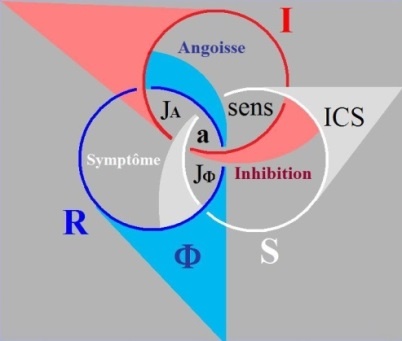
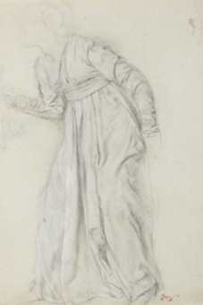
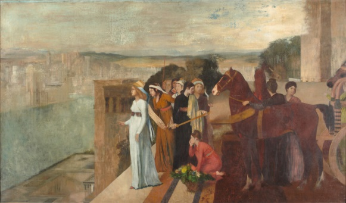
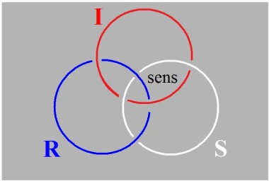
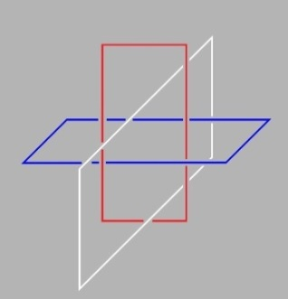
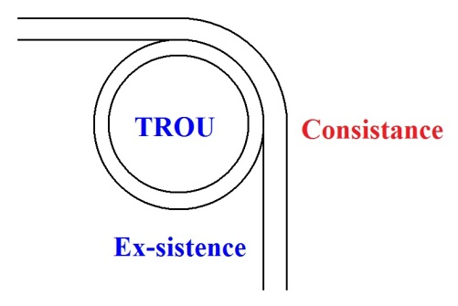
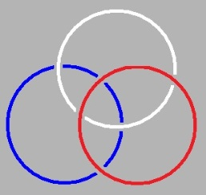
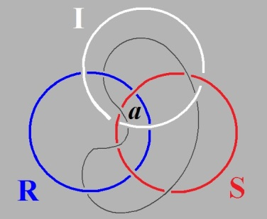
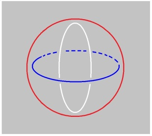
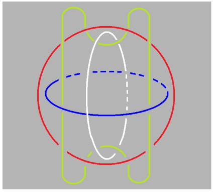

# Leçon 06 | 11 Février 1975

<!-- source-url: http://staferla.free.fr/S22/S22 R.S.I..docx -->
<!-- seminar: s22 -->
<!-- lesson: 06 -->

<!-- id: s22-06-0001 -->

On m’a dit la dernière fois qu’on n’avait rien entendu.

<!-- id: s22-06-0002 -->

On m’a expli­qué depuis que c’est parce qu’on accroche des magnétophones aux haut-parleurs.

<!-- id: s22-06-0003 -->

Alors je serais reconnaissant aux personnes qui sont en train d’en accrocher précisément de les retirer, de façon à ce que quand même les haut-parleurs servent à quelque chose.

<!-- id: s22-06-0004 -->

Du même coup, je prierai les personnes qui se trouveraient dans la position de ne rien entendre, de m’en donner un signe, de façon à ce que je ne me fie pas aux haut-par­leurs et que j’essaie d’élever la voix.

<!-- id: s22-06-0005 -->

Car il m’est évidemment pénible d’entendre la remarque...

<!-- id: s22-06-0006 -->

> puisqu’il y a quelques personnes qui viennent me voir ...d’entendre la remarque que j’ai peut-être bien raconté des choses intéressantes, la veille ou l’avant-veille, qu’on y était, mais qu’on n’a pas entendu.

<!-- id: s22-06-0007 -->

Je me réjouis qu’aujourd’hui tout de même...

<!-- id: s22-06-0008 -->

> parce que j’ai choisi le *Mardi-gras* pour venir ...qu’aujourd’hui tout de même les portes ne soient pas trop encombrées.

<!-- id: s22-06-0009 -->

Ça pourrait m’être une occasion puisque, pour entrer dans les confidences, je vous avais fait le rapport...

<!-- id: s22-06-0010 -->

> le rapport parce que ça m’avait instruit ...je vous avais fait le rapport du fait que j’avais été à Nice, que j’avais accep­té *n’importe quel titre*...

<!-- id: s22-06-0011 -->

> enfin, je dirais que c’est au titre de *n’importe lequel* que je l’avais accepté ...à *ce titre*, évidemment pour moi un peu cho­quant, du « *Phénomène Lacanien* ».

<!-- id: s22-06-0012 -->

Et puis je vous avais fait remarquer qu’en somme je l’avais provoqué, mais que ça m’avait instruit en ceci, qui est peut-être présomption, que ce que je dis a des effets de sens.

<!-- id: s22-06-0013 -->

Il semble, à mesurer les choses, que ces effets ne sont pas immédiats, mais qu’avec le temps que j’y ai mis...

<!-- id: s22-06-0014 -->

> et aussi, il faut bien le dire, la persévé­rance, puisque somme toute,
>
> pour moi au moins il a fallu 20 ans* *pour que je les constate, je veux dire que je les enregistre, ...qu’il m’apparaisse que ça a eu des effets.

<!-- id: s22-06-0015 -->

Et je vous ai dit ma surprise...

<!-- id: s22-06-0016 -->

> on ne sait jamais si une surprise est bonne ou mauvaise, une surprise est une surprise,
>
> elle est hors du champ de l’agréable ou du désagréable, puisque après tout ce qu’on appelle *bon ou mauvais*, c’est *agréable ou désagréable*, alors une surprise est heureuse disons, ça signifie ce qu’on appelle *une rencontre*, c’est-à-dire en fin de compte quelque chose qui vous vient de vous.
>
> J’espère qu’il vous en arrive de temps en temps ...alors j’ai pu renouveler cette *surprise* que j’appelle *heureuse* plutôt que bonne ou mauvaise, en allant depuis...

<!-- id: s22-06-0017 -->

> depuis que je vous ai donné congé jusqu’au 1er mardi de février... 1er, enfin 2ème, celui où je parle ...j’ai fait un petit tour à Strasbourg où j’ai pu constater..

<!-- id: s22-06-0018 -->

> sans même en être trop sur­pris puisque c’est le groupe de Strasbourg qui s’en charge ...que j’avais des effets, des effets de sens en Allemagne.

<!-- id: s22-06-0019 -->

Je veux dire que des Allemands que j’ai rencontrés au groupe de Strasbourg, j’ai obtenu en fin de comp­te des questions qui m’ont donné cette « *heureuse surprise* » dont je parlais tout à l’heure.

<!-- id: s22-06-0020 -->

J’en ai été moins surpris qu’à Nice, étant donné que c’est le groupe de Strasbourg qui en prend soin...

<!-- id: s22-06-0021 -->

> non pas que personne ne prenne soin de ce que je dis à Nice ...mais enfin il s’est trouvé, comme ça, que je m’at­tendais à moins.

<!-- id: s22-06-0022 -->

Faut dire que, dans l’intervalle, je m’étais un peu remonté le moral, c’est peut-être pour ça que – toute heureuse qu’elle fût – la surprise était moindre à Strasbourg.

<!-- id: s22-06-0023 -->

J’en ai eu une plus grande, parce que, je viens de passer huit jours...

<!-- id: s22-06-0024 -->

> je vous donne en mille : où ? ...je viens de passer huit jours à Londres.

<!-- id: s22-06-0025 -->

Il est tout à fait certain que ni les Anglais, ni...

<!-- id: s22-06-0026 -->

> je ne dirai pas les psychanalystes anglais, je n’en connais qu’un qui soit anglais,
>
> et encore : il doit être écossais probablement ...la langue, je crois que c’est la langue anglaise qui fait obstacle.

<!-- id: s22-06-0027 -->

Ce n’est pas très prometteur parce que la langue anglaise est en train de devenir universelle, je veux dire qu’elle se fraie sa voie.

<!-- id: s22-06-0028 -->

Enfin, je ne peux pas dire qu’il n’y ait pas de gens qui ne s’efforcent de m’y traduire.

<!-- id: s22-06-0029 -->

Ceux qui me lisent, comme ça, de temps en temps, peuvent avoir une idée de ce que ça comporte comme difficulté de me traduire dans *la langue* *anglaise*.

<!-- id: s22-06-0030 -->

Il faut tout de même reconnaître les choses comme elles sont.

<!-- id: s22-06-0031 -->

Je ne suis pas le premier à avoir constaté cette résistance de la langue anglaise à *l’inconscient*.

<!-- id: s22-06-0032 -->

J’ai fait des remarques, enfin je me suis permis *d’écri­re quelque chose*...

<!-- id: s22-06-0033 -->

> qui a été plus ou moins bien accueilli, comme j’y suis habitué ...*quelque chose* au retour d’un voyage au Japon où je crois que j’ai dit - pour le japonais - quelque chose qui s’oppose au jeu, et même au maniement de l’inconscient comme tel, dans ce que j’ai appelé à l’époque...

<!-- id: s22-06-0034 -->

> dans un petit article que j’ai fait, que j’ai sorti je ne sais plus où, j’ai com­plètement oublié ...que j’ai appelé *Lituraterre* [^13].

<!-- id: s22-06-0035 -->

J’ai cru voir dans une cer­taine, disons duplicité...

<!-- id: s22-06-0036 -->

> duplicité de - dans le cas de la langue Japonaise - de la prononciation ...j’ai cru voir là quelque chose...

<!-- id: s22-06-0037 -->

> qui redoublé par le système de l’écriture qui est aussi double ...j’ai cru voir là une certaine spéciale dif­ficulté à jouer sur le plan de l’inconscient.

<!-- id: s22-06-0038 -->

Et justement en ceci qui devrait y paraître une aide : si ce qu’il en est de l’inconscient se localise au lieu de l’Autre, et si j’y fais la remarque *qu’il n’y a pas d’Autre de l’Autre*, c’est à savoir que ce qui dans mon petit schème figu­ré du nœud borroméen :

<!-- id: s22-06-0039 -->

<!-- id: s22-06-0040 -->

se caractérise par une spéciale accentuation du trou dans ce qui fait face - si je puis dire - dans ce qui fait face au *Symbolique*, et que j’ai pointé, je pense, la dernière fois, en y mettant un J suivi d’un grand A \[ **JA** \], que j’ai traduit, enfin que j’ai essayé d’énoncer comme désignant *la jouissance de l’Autre*...

<!-- id: s22-06-0041 -->

> *génitif* non pas subjectif mais *objectif* ...et j’ai souligné que c’est là que se situe tout spécialement ceci qui, je crois, légitimement, sainement, corrige la notion que Freud a de l’Éros comme d’une fusion, comme d’une union.

<!-- id: s22-06-0042 -->

J’ai mis l’accent, à ce propos...

<!-- id: s22-06-0043 -->

> comme ça, incidemment, plus ou moins avant d’avoir sorti ce nœud borroméen ...j’ai mis l’accent sur ceci : c’est que c’est très difficile que deux corps se fondent.

<!-- id: s22-06-0044 -->

Non seulement, c’est très difficile mais c’est un *obstacle* d’expérience courante.

<!-- id: s22-06-0045 -->

Et que si on en trouve la place bien indiquée dans un schéma, c’est quand même de nature à nous encourager concernant la valeur de ce que j’appelle là « *schème »*.

<!-- id: s22-06-0046 -->

Il faut qu’aujourd’hui je fraie la voie *à un certain nombre*, je ne dirai pas d’équivalences, mais *de correspondances*.

<!-- id: s22-06-0047 -->

Il est bien évident que je les ai maintes fois dans mon travail de griffonnage...

<!-- id: s22-06-0048 -->

> puisque c’est avec des griffonnages que je prépare ce que j’ai ici à vous dire ...que ces équivalences je les ai maintes fois rencontrées, et que j’y regarde à deux fois avant de vous en faire part.

<!-- id: s22-06-0049 -->

Je suis plutôt prudent, je ne cherche pas à parler à tort et à travers.

<!-- id: s22-06-0050 -->

Bon !

<!-- id: s22-06-0051 -->

Est-ce qu’ici par exemple, il y a quelqu’un qui sache - parce que je ne sais pas si François Wahl est là – est-ce qu’il y a quelqu’un qui sache que « *La Reine Victoria* » par Lytton Strachey [^14]...

<!-- id: s22-06-0052 -->

> qui est un auteur bien connu, célèbre. Enfin... J’avais lu dans son temps un petit bouquin tra­duit,
>
> si mon souvenir est bon, chez Stock, concernant Elisabeth et le Comte d’Essex ...est-ce que quelqu’un ici est en état de me le dire... comme il y a des personnes qui sont au Seuil, est-ce qu’il y en a ?

<!-- id: s22-06-0053 -->

Je pense qu’elles pourront peut-être me dire si le Lytton Strachey sur *La Reine Victoria* est sorti au Seuil, traduit ?

<!-- id: s22-06-0054 -->

*X dans la salle – Au Seuil, non.*

<!-- id: s22-06-0055 -->

Comment ? J’entends mal... Non ? C’est pas sorti ? C’est bien emmerdant !

<!-- id: s22-06-0056 -->

C’est bien emmerdant, parce que je vous aurais recommandé de le lire. Oui, ça c’est vraiment emmerdant !

<!-- id: s22-06-0057 -->

Qui est-ce qui a bien pu me dire*...* Bon, je suis très embêté, parce que ça courait les rues sous la forme d’un *Penguin Book*, mais c’est «*out of print »* alors je peux pas vous en recommander la lecture, mais enfin tous ceux qui pourront mettre la main...

<!-- id: s22-06-0058 -->

> parce qu’il y a quand même des bibliothèques et il y a aussi des livres d’occasion ...tous ceux qui pourront mettre la main sur ce « *Queen Victoria »* de Lytton Strachey, je les invite vivement à le lire, parce que, à mon retour d’Angleterre, c’est-à-dire samedi dernier et dimanche, je n’ai pas pu quitter ce bouquin.

<!-- id: s22-06-0059 -->

Je n’ai pas pu quitter ce bouquin et ça ne veut pas dire que je vais vous en parler aujourd’hui, parce qu’il faut que pour en faire quelque chose qui entre dans mon discours,

<!-- id: s22-06-0060 -->

- il faudrait que je le triture,

<!-- id: s22-06-0061 -->

- il faudrait que je le fonde,

<!-- id: s22-06-0062 -->

- il faudrait que je l’essore,

<!-- id: s22-06-0063 -->

- il faudrait que j’en sorte un jus, c’est - j’ai beau y avoir pris plaisir - c’est trop fatigant, et puis je n’ai pas le temps.

<!-- id: s22-06-0064 -->

Néanmoins ça pourrait, me semble-t-il, montrer qu’il y a peut-être plus d’une origine à ce phénomène stupéfiant de *la découverte de l’in­conscient*.

<!-- id: s22-06-0065 -->

Si le XIXème siècle, me semble-t-il, *n’avait pas été si étonnam­ment dominé par* ce qu’il faut bien que j’appelle *l’action d’une femme*, à savoir de la Reine Victoria, ben, on ne se serait pas peut-être rendu compte à quel point il fallait cette espèce de ravage, pour qu’il y ait là­-dessus ce que j’appelle un *réveil*.

<!-- id: s22-06-0066 -->

C’est un de mes bateaux que « *le réveil, c’est un éclair* ».

<!-- id: s22-06-0067 -->

Il se situe pour moi...

<!-- id: s22-06-0068 -->

> enfin quand ça m’arrive, pas souvent ...il se situe pour moi...

<!-- id: s22-06-0069 -->

> « pour moi », ça veut pas dire que ce soit comme ça pour tout le monde ...il se situe pour moi au moment où effectivement je sors du sommeil, j’ai à ce moment-là un bref *éclair* de lucidité, ça ne dure pas, bien sûr, je rentre comme tout le monde dans ce rêve qu’on appelle la réalité, à savoir dans les discours dont je fais partie, et parmi lesquels j’essaie de frayer la voie au discours analytique.

<!-- id: s22-06-0070 -->

Et c’est un effort très pénible.

<!-- id: s22-06-0071 -->

Je crois que ce livre me semble devoir vous rendre sensible ceci...

<!-- id: s22-06-0072 -->

> enfin sensible avec un particulier relief ...ceci que l’*amour* n’a rien à faire avec le *rapport sexuel*, et confirmer que ça part, non pas - je vais dire - de *la femme*, puisque justement ce à propos de quoi j’ai vu, j’ai vu qu’une fois de plus...

<!-- id: s22-06-0073 -->

> enfin c’est un point sur lequel même les gens qui me sont le plus sympathiques,
>
> je veux dire qui croient devoir me rendre hommage, là, flottent et même déraillent, il faut bien le dire ...si je dis que « *La* *femme* » n’existe pas, c’est évidemment *sans retour*, si je puis dire.

<!-- id: s22-06-0074 -->

Mais, *une* femme, *une* femme entre autres, *une* femme bien isolée dans le contexte anglais par cette espèce de *prodigieuse sélection* *qui n’a rien à faire avec* *le discours du maître*...

<!-- id: s22-06-0075 -->

> c’est pas parce qu’il y a une aristocratie qu’il y a un *discours du maître*. Cette aristocratie d’ailleurs n’a pas grand-chose à faire avec une sélection *locale*, si je puis dire. Les vrais maîtres, c’est pas ceux qui sont les
>
> \- ceux qu’on pourrait appeler - les mondains, les gens biens, les gens de bonne compagnie,
>
> les gens qui se connaissent entre eux, enfin, ou qui croient se connaître ...la fatalité qui a fait qu’un certain Albert de Saxe-Cobourg est tombé dans les pattes... il n’y avait aucun penchant...

<!-- id: s22-06-0076 -->

> c’est ce qu’il y a de merveilleux, enfin c’est ce que Lytton Strachey souligne ...pas le moindre penchant vers les femmes.

<!-- id: s22-06-0077 -->

Mais quand on rencontre un « *vagin denté* », si je puis m’exprimer ainsi, de la taille exceptionnelle de la Reine Victoria...

<!-- id: s22-06-0078 -->

Enfin : une femme qui est Reine, c’est-à-dire vraiment ce qu’on fait de mieux comme « *vagin denté »* !

<!-- id: s22-06-0079 -->

C’est même une condition essentiel­le : enfin, Sémiramis devait avoir un « *vagin denté »*, c’est forcé, ça se voit d’ailleurs quand Degas en a fait un dessin.

<!-- id: s22-06-0080 -->

 

<!-- id: s22-06-0081 -->

Elisabeth d’Angleterre devait aussi... enfin ça se voit !

<!-- id: s22-06-0082 -->

Pour Essex ça a eu des conséquences.

<!-- id: s22-06-0083 -->

Pourquoi est-ce que ça n’a pas eu les mêmes pour celui qu’on appelle...

<!-- id: s22-06-0084 -->

> quand on désigne le *musée* qui subsiste à leur mémoire le « *Victoria and Albert* »,
>
> parce qu’on ne dit pas « *Victoria and...* », on dit « *Victor and Albert* » ...pourquoi est-ce que le Albert en question n’a pas subi le sort d’Essex ?

<!-- id: s22-06-0085 -->

C’est parce qu’il ne se... c’est même pas sûr qu’il ne l’ait pas subi, parce qu’il a défunté très tôt.

<!-- id: s22-06-0086 -->

Il a défunté très tôt d’une mort qu’on appelle naturelle, mais vous regarderez ça de très près, j’espère...

<!-- id: s22-06-0087 -->

Ça me semble la plus merveilleuse chose qu’on puis­se avoir comme annonce de cette vérité que j’avais trouvée sans ça : cette vérité du *non-rapport sexuel*.

<!-- id: s22-06-0088 -->

Ça me semble une illustration tout à fait sensationnelle, et comme tout de même tout ça s’est passé très vite, et en somme ça avait déjà franchi ses principaux épisodes avant la naissance de Freud, ça n’est, il me semble, quand même pas une raison pour dire que si Freud n’était pas surgi là, par quelque mystérieuse rencontre de l’Histoire, tout de suite après cette mise en exercice de ce que les femmes ont...

<!-- id: s22-06-0089 -->

je ne sais pas si c’est un pouvoir - on est très très fasciné par des notions, des catégo­ries comme celles-là : *le pouvoir*, *le savoir*... tout ça ce sont des fadaises, enfin des fadaises qui laissent toute la place aux femmes - je n’ai pas dit à « *La* *femme* » - aux femmes qui ne s’en soucient pas, mais dont le pouvoir dépasse sans mesure toutes les catégories.

<!-- id: s22-06-0090 -->

Bon, enfin paix à l’âme du « ...*and Albert* ».

<!-- id: s22-06-0091 -->

Il est certain que ce que je dis ne va pas tout à fait dans le sens, malgré tout, de ce que les femmes puissent, ni doivent courir leur chance...

<!-- id: s22-06-0092 -->

> si on peut appeler ça *une chance* ...dans une espèce d’intégra­tion aux catégories de l’homme.

<!-- id: s22-06-0093 -->

Je veux dire, ni « *le pouvoir* », ni « *le savoir* », enfin elles en savent tellement plus - enfin ! n’est-ce pas ? – du seul fait d’être une femme, que c’est bien devant quoi je tire mon cha­peau.

<!-- id: s22-06-0094 -->

Et la seule chose qui m’étonne c’est pas tellement...

<!-- id: s22-06-0095 -->

> comme je l’ai dit, comme ça, à l’occasion ...qu’elles sachent mieux traiter l’inconscient : je suis pas très sûr.

<!-- id: s22-06-0096 -->

Leur *catégorie* à l’endroit *de l’inconscient* est très évi­demment d’une plus grande force, elles en sont moins empêtrées.

<!-- id: s22-06-0097 -->

Elles traitent ça avec une sauvagerie, enfin une liberté d’allure, qui est tout à fait saisissante par exemple dans le cas d’une Mélanie Klein.

<!-- id: s22-06-0098 -->

C’est quelque chose que je laisse à la méditation de chacun : les analystes femmes sont certainement plus à l’aise à l’endroit de l’incons­cient.

<!-- id: s22-06-0099 -->

Elles s’en occupent, il faut bien le dire, sans que ce soit, sans que ce soit aux dépens...

<!-- id: s22-06-0100 -->

> c’est bien peut-être là que se trouve renversée l’idée du mérite ...elles y perdent quelque chose de leur chance qui, rien que d’être une entre les femmes, est en quelque sorte sans mesure.

<!-- id: s22-06-0101 -->

Si j’avais - ce qui évidemment ne peut pas me venir à l’idée - si je devais localiser quelque part l’idée de *« liberté »*, ça serait évidemment dans *une femme* que je l’incarnerais.

<!-- id: s22-06-0102 -->

Une femme, *pas* *forcément n’im­porte laquelle*, puisqu’elles ne sont *pas-toutes* et que le « *n’im­porte laquelle »* glisse vers le « *toutes »*.

<!-- id: s22-06-0103 -->

Bon, laissons ça de côté.

<!-- id: s22-06-0104 -->

Laissons ça de côté parce que c’est un sujet où...

<!-- id: s22-06-0105 -->

comme, dans le fond, Freud lui-même ...je pourrais dire que j’y perds mon latin... Ce qui n’est pas une mauvaise façon de dire les choses.

<!-- id: s22-06-0106 -->

Mais enfin, si ça vous tombe sous la main...

<!-- id: s22-06-0107 -->

J’ai eu le bonheur qu’une personne...

<!-- id: s22-06-0108 -->

> qui était une de celles qui m’avaient invité là-bas, je veux dire à Londres ...qu’une personne me passe ce truc *out of print*, enfin, son exemplaire pour tout dire, et je pense que c’est une lecture que personne ici ne doit manquer s’il a - je sais pas quoi – un peu de touche, un peu de vibration à l’endroit de ce que je dis.

<!-- id: s22-06-0109 -->

Il est évidemment tout à fait extraordinaire...

<!-- id: s22-06-0110 -->

> je passe à un autre sujet ...tout à fait extraordinaire de voir que l’art...

<!-- id: s22-06-0111 -->

> l’art même qui a traité les sujets qu’on appelle géométriques au nom de ceci :
>
> qu’un interdit est porté par certaines religions sur la représentation humaine ...que même l’art arabe donc, pour l’appeler par son nom, fait des frises, mais que parmi ces frises et ces tresses que ça comporte, il n’y ait pas de nœud borro­méen.

<!-- id: s22-06-0112 -->

Alors que le nœud borro­méen prête, prête à une richesse de figures tout à fait foisonnantes, dont il n’y a justement dans aucun art, trace.

<!-- id: s22-06-0113 -->

C’est une chose en soi-même très surprenante.

<!-- id: s22-06-0114 -->

Ça n’est pas facile de donner de ça une explication, si ce n’est peut-être que si person­ne n’en a senti l’importance, c’est tout de même fait pour nous donner cette dimension qu’il y fallait quelque chose, qui ne va pas du tout sans l’exigence de l’émergence de ce que j’appellerai certaines *consistances*.

<!-- id: s22-06-0115 -->

Ce sont précisément celles que je donne au *Symbolique*, à l’*Imaginaire* et au *Réel*.

<!-- id: s22-06-0116 -->

Mais c’est de les homogénéiser que je leur donne cette *consistance*, et les homogénéiser c’est les ramener à la valeur de ce qui communément est considéré comme le plus bas...

<!-- id: s22-06-0117 -->

> on se demande au nom de quoi ? ...c’est leur donner *une consistance* pour tout dire de l’*Imaginaire*.

<!-- id: s22-06-0118 -->

C’est bien en ça qu’il y a quelque chose à redresser : la consistance de *l’Imaginaire* est strictement équivalente à celle du *Symbolique*, comme à celle du *Réel*.

<!-- id: s22-06-0119 -->

C’est même en raison du fait qu’ils sont noués de cette façon...

<!-- id: s22-06-0120 -->

> c’est-à-dire d’une façon qui les met strictement l’un par rapport à l’autre, l’un par rapport aux deux autres ...dans le même rapport, c’est même là qu’il s’agit de faire un effort qui soit de l’ordre de *l’effet de sens*.

<!-- id: s22-06-0121 -->

« *Qui soit de l’ordre de l’effet de sens* » : je veux dire que l’interprétation ana­lytique implique tout à fait une bascule dans la portée de cet *effet de sens*.

<!-- id: s22-06-0122 -->

Il est certain qu’elle porte, l’interprétation analytique, qu’elle porte d’une façon qui va beaucoup plus loin que *la parole*.

<!-- id: s22-06-0123 -->

La *parole* est un objet d’élaboration pour l’analysant, mais ce que dit l’analyste...

<!-- id: s22-06-0124 -->

> car il dit ! ...ce que dit l’analyste a des effets dont ça n’est pas rien de dire que le transfert y joue un rôle, ça n’est pas rien... mais ça n’éclaire rien.

<!-- id: s22-06-0125 -->

Il s’agirait de dire comment l’interprétation porte, et qu’elle n’implique pas forcément une énonciation.

<!-- id: s22-06-0126 -->

Il est bien évident que trop d’analystes ont l’habitude de la fermer, j’ose croire...

<!-- id: s22-06-0127 -->

> je veux dire « *la boucler* », « *ne pas l’ouvrir* » comme on dit, je parle de la bouche ...j’ose croire que leur silence n’est pas seulement fait d’une mauvaise habitude, mais d’une suffisante appréhension de la portée *<u>d’un dire silencieux</u>*.

<!-- id: s22-06-0128 -->

J’ose le croire... mais j’en suis pas sûr.

<!-- id: s22-06-0129 -->

À partir du moment où nous entrons dans ce champ, il n’y a pas de preuve.

<!-- id: s22-06-0130 -->

Il n’y a pas de preuve, si ce n’est dans ceci : c’est que ça ne réussit pas toujours, un silence opportun.

<!-- id: s22-06-0131 -->

Ce que j’essaie de faire ici...

<!-- id: s22-06-0132 -->

> où hélas je bavarde, je bavarde beaucoup ...est tout de même destiné à changer la perspective sur ce qu’il en est de l’*effet de sens*.

<!-- id: s22-06-0133 -->

Je dirais que ça consiste, cet *effet de sens*, à le serrer, mais bien sûr à condition que ce soit de la bonne façon, à savoir à le serrer d’un nœud, et pas n’importe lequel.

<!-- id: s22-06-0134 -->

Je suis très étonné de réussir à substituer - je le crois - cet *effet de sens* tel qu’il fasse nœud - et nœud de la bonne façon – à ce que j’appellerai ce qui se produit en un point parfaitement désignable...

<!-- id: s22-06-0135 -->

> désignable sur ce nœud même, ceci dont je ne crois pas du tout participer, si ce n’est en ce point précis ...et qui s’appelle *l’effet de fascination*.

<!-- id: s22-06-0136 -->

Car à vrai dire c’est sur cette corde que glissent, que portent la plupart des effets de l’art, et c’est le seul critère qu’on puisse trouver qui le sépare de ce que la science, elle, arrive à coordonner.

<!-- id: s22-06-0137 -->

C’est bien en cela qu’un homme de lettres, comme... je sais pas, un Valéry par exemple, se contente de rester sur ceci qu’il s’agit d’expliquer, sur des effets de fascination dont quand même l’analyse est exigible : *<u>l’effet de sens</u> exigible du discours analytique*

<!-- id: s22-06-0138 -->

- *n’est pas Imaginaire,*

<!-- id: s22-06-0139 -->

- *il n’est pas non plus Symbolique,*

<!-- id: s22-06-0140 -->

- *<u>il faut qu’il soit Réel</u>.*

<!-- id: s22-06-0141 -->

Et ce dont je m’occupe cette année, c’est d’essayer de serrer de près *quel peut être le Réel d’un effet de sens*.

<!-- id: s22-06-0142 -->

Parce que d’un autre côté, il est bien clair qu’on est habitué à ce que *l’effet de sens* se véhicule par des mots, et ne soit pas sans réflexion, sans ondulation *Imaginaire*. On peut même dire que même sur mon petit schème tel que je vous l’ai reproduit la dernière fois, tel que je vais le refaire maintenant :

<!-- id: s22-06-0143 -->

<!-- id: s22-06-0144 -->

*Prenez vraiment l’habitude de dessiner ça comme ça, c’est-à-dire de ne pas faire ce qu’on fait régulièrement,* *enfin la jonction une fois qu’on est parti avec cet élan.*

<!-- id: s22-06-0145 -->

*L’effet de sens* c’est là, c’est au joint du *Symbolique* et de l’*Imaginaire* que je l’ai situé.

<!-- id: s22-06-0146 -->

Il n’a en apparence de rapport avec ceci...

<!-- id: s22-06-0147 -->

> à savoir le cercle consistant du *Réel* ...il n’a qu’un rapport, en principe, d’extériorité.

<!-- id: s22-06-0148 -->

Je dis « *en principe* », parce que c’est en ceci qu’il est là mis à plat.

<!-- id: s22-06-0149 -->

Il est mis à plat de ce fait que nous ne pouvons pas penser autrement : nous ne pensons qu’à plat.

<!-- id: s22-06-0150 -->

Il suffit de figurer autrement ce *nœud borroméen* :

<!-- id: s22-06-0151 -->

<!-- id: s22-06-0152 -->

Vous allez voir le tintouin bien sûr que ça va donner, n’est-ce pas, vous voyez déjà ! Ah !

<!-- id: s22-06-0153 -->

C’est ça qu’il y a de merveilleux... Prenons ça comme ça... J’aurais pu, bien sûr, le prendre de n’importe quelle autre façon.

<!-- id: s22-06-0154 -->

Vous voyez bien que ce dont il s’agit, c’est de faire que ce nœud soit borroméen.

<!-- id: s22-06-0155 -->

C’est-à-dire que, vous voyez bien les deux qui sont là figurés se séparent aisément l’un de l’autre.

<!-- id: s22-06-0156 -->

Il n’y a qu’une façon et une seule, une seule simple, car il y en a plus d’une de faire qu’il soit borroméen ce nœud, c’est ceci...

<!-- id: s22-06-0157 -->

que je vous figure avec toute la maladresse qui j’espère, sera dans l’occasion également la vôtre, parce que je veux vous en montrer la difficulté ...c’est ceci, vous voyez que du fait que la 3ème boucle que j’ai ajoutée passe, si je puis dire, à travers les deux oreilles que permet de distinguer le passage de cet élément du nœud à l’intérieur de ce que j’appellerai « *le trou »* de la 3ème boucle, c’est dans cette mesure que le nœud tient.

<!-- id: s22-06-0158 -->

Est-ce que il faut nous en tenir là ?

<!-- id: s22-06-0159 -->

C’est-à-dire penser qu’il suffise de 3 éléments *consistants* dont l’un fait nœud des 2 autres.

<!-- id: s22-06-0160 -->

Il y a déjà ceci, que nous posons avec ce nœud, ceci qui va contre l’image dite de « la concaténation » : c’est en tant que le discours dont il s’agit ne fait pas « chaîne »...

<!-- id: s22-06-0161 -->

> c’est-à-dire qu’il n’y a pas réciprocité du passage d’*une* des *consistances* dans le trou que lui offre l’autre,
>
> c’est-à-dire qu’*une des consistances*, au sens commun du terme, ne se noue pas à l’autre, je veux dire, ne fait pas chaîne ...c’est en ceci que se spécifie le rapport du *Symbolique,* de *l’Imaginaire* et du *Réel*.

<!-- id: s22-06-0162 -->

C’est en cela que la question d’abord se pose de savoir *si l’effet de sens dans son Réel tient bien à l’emploi des mots*...

<!-- id: s22-06-0163 -->

> je dis l’*emploi* au sens usuel du terme ...ou seulement à leur « *jaculation *», si je puis dire, c’est un terme en usage pour ce qu’il en est des mots.

<!-- id: s22-06-0164 -->

Beaucoup de choses depuis toujours l’ont donné à penser, mais de cet *emploi* à cette *« jaculation* » on ne faisait pas *la distinction*. On croyait que c’était les mots qui portent.

<!-- id: s22-06-0165 -->

Alors que si nous nous donnons la peine d’isoler la catégorie du signifiant, nous voyons bien que *la jaculation garde un sens, un sens isolable*.

<!-- id: s22-06-0166 -->

Est-ce à dire que c’est là, à cela que nous devions nous fier pour que se passe ceci : *que le dire fasse nœud* ?

<!-- id: s22-06-0167 -->

À la distinction de la parole qui très souvent glisse, laisse glisser, et que notre intervention au regard de ce qu’il est demandé à l’analysant de fournir, à savoir comme on dit, tout ce qui lui passe par la tête, ce qui n’implique pour autant nullement que ce ne soit là que du bla-bla-bla, car justement derrière il y a l’inconscient. Et c’est de ce fait qu’il y ait l’inconscient, que déjà dans ce qu’il dit il y a des choses qui *font nœud*, qu’il y a déjà du *dire*, si nous spécifions le *dire* d’être ce qui fait nœud.

<!-- id: s22-06-0168 -->

Il ne suffit pas, ce nœud, de l’appeler du *Réel*.

<!-- id: s22-06-0169 -->

L’*Imaginaire* dans ce schéma n’est pas un rond imaginaire : si le nœud tient c’est justement que l’*Imaginaire* doit être pris dans sa *consistance propre*, et que sans doute, puisque ce schéma est ce qui nous presse, au moins par mon intermédiaire, c’est que l’usage du *Symbolique* n’y est évidemment pas à prendre - comme tout l’indique dans la technique de l’analyse - au sens courant du mot.

<!-- id: s22-06-0170 -->

Le *Symbolique* n’est pas seulement du *bla-bla-bla*.

<!-- id: s22-06-0171 -->

Ce qu’ils ont de commun, c’est ça. C’est pas le *Réel*... c’est ça le *Réel* !

<!-- id: s22-06-0172 -->

*Le Réel, c’est qu’il y ait quelque chose qui leur soit commun dans la consistance.*

<!-- id: s22-06-0173 -->

Or, cette consistance réside seulement dans le fait de pouvoir faire nœud.

<!-- id: s22-06-0174 -->

Un nœud mental est-il *Réel* ? Là est la question.

<!-- id: s22-06-0175 -->

Je conviens que je ne vous ménage pas aujourd’hui, mais c’est tout de même pour vous donner tout de suite la réponse : il a le *Réel*, *le nœud mental, il a le Réel de l’ex-sistence.*

<!-- id: s22-06-0176 -->

Il a le *Réel* de l’*ex-sistence*, tel que je l’écris de ces équi­valences, dont je vous disais tout à l’heure que c’était mon but de les introduire aujourd’hui.

<!-- id: s22-06-0177 -->

Je parle - *j’ai parlé prudemment* - de *correspon­dance,* je parle maintenant *de fonctions*.

<!-- id: s22-06-0178 -->

Et c’est en ça que j’avance le mot *équivalence*.

<!-- id: s22-06-0179 -->

Il est assez curieux, si nous voulons donner quelque support à ce que nous avançons, que ceci précisément nous force à ne pas mettre le *Réel* dans la *consistance*.

<!-- id: s22-06-0180 -->

Et *la consistance*...

<!-- id: s22-06-0181 -->

> pour la désigner par son nom, je veux dire par sa *correspon­dance -* ...*la consistance*, je dirais, *est de l’ordre Imaginaire*.

<!-- id: s22-06-0182 -->

Ce qui se démontre...

<!-- id: s22-06-0183 -->

> ce qui se démontre longuement dans toute l’histoire humaine,
>
> et qui doit nous inspirer une singulière pruden­ce ...est que beaucoup de la *consistance,* *toute la consistance* qui a déjà fait ses preuves, *est pure imagination*.

<!-- id: s22-06-0184 -->

Je fais retourner ici l’*Imaginaire* à son accent de « *sens »*.

<!-- id: s22-06-0185 -->

La *consistance* pour le *parlêtre*, pour l’être-parlant, c’est ce qui se fabrique et qui s’invente.

<!-- id: s22-06-0186 -->

Dans l’occasion, c’est le nœud en tant qu’on l’a tressé.

<!-- id: s22-06-0187 -->

Mais justement, c’est là qu’est le fin mot de l’affaire, c’est que ça n’est pas en tant qu’on l’a tressé qu’il *ex-siste*, même si je ne fais pas de figure de mon nœud borroméen sur le tableau, il *ex-siste*.

<!-- id: s22-06-0188 -->

Car *dès qu’il est tracé*, n’importe qui voit bien que c’est impossible qu’il ne reste pas ce qu’il est dans le *Réel*, à savoir un nœud.

<!-- id: s22-06-0189 -->

Et c’est bien en quoi je crois que j’avance quelque chose qui, aux analystes qui m’écoutent, peut être utile dans leur pratique.

<!-- id: s22-06-0190 -->

C’est qu’ils sachent que ce qu’ils tressent, que *ce qu’ils tressent d’Imaginaire, n’en ex-siste pas moins*.

<!-- id: s22-06-0191 -->

*Que cette ex-sistence c’est ce qui répond au Réel*. \[*le réel de l’imaginaire*, *l’image réelle*/*l’image spéculaire,* *dans le dispositif du* « *stade du miroir* »\]

<!-- id: s22-06-0192 -->

Il y a quelque chose - Dieu merci - qui nous a introduit à cette notion de l’*ex-sistence*, c’est l’emploi de l’*écrit* : : *f(x)* à propos de ce quelque chose, qui dans l’occasion s’appelle une variable liée, désignée par la lettre *x*.

<!-- id: s22-06-0193 -->

II existe un *x* qui peut être porté dans *f(x)*, c’est-à-dire dans *une fonction de* *x*, que cette fonction soit *une fonction* au sens général du terme ou sim­plement *une équation*.

<!-- id: s22-06-0194 -->

Dans le cas d’une équation, il arrive qu’il n’existe pas de *racine*, comme on s’exprime.

<!-- id: s22-06-0195 -->

*Si une équation* c’est toujours quelque chose qui s’égale à zéro, *il arrive qu’il n’existe pas de racine*, et *quand elle n’existe pas*, ça ne nous fait ni chaud ni froid, *nous la faisons ex-sister*, *c’est-à-dire que nous inventons la catégorie de la racine imaginaire* et qu’en plus, ça donne des résultats !

<!-- id: s22-06-0196 -->

Ici gît le point de flottement par où on voit que le terme d’*imaginaire* ne veut pas dire pure imagination, puisqu’aussi bien, *si nous pouvons faire que l’Imaginaire ex-siste, c’est qu’il s’agit d’un autre Réel.*

<!-- id: s22-06-0197 -->

Je dis que *l’effet de sens ex-siste, et qu’en ceci il est Réel*.

<!-- id: s22-06-0198 -->

Ce n’est pas de l’apolo­gétique, c’est de la consistance, de la consistance *Imaginaire* sans doute, mais il semble qu’il y ait tout un domaine usuel de *la fonction Imaginaire* qui - elle - dure, et qui se tienne.

<!-- id: s22-06-0199 -->

Je ne peux dialoguer qu’avec quelqu’un que j’ai fabriqué à me comprendre au niveau où je parle, et c’est bien en cela que non seulement je m’étonne que vous soyez si nombreux, mais je ne peux même pas croire que j’ai fabriqué chacun de vous à me com­prendre.

<!-- id: s22-06-0200 -->

Sachez seulement qu’il ne s’agit pas de ça *dans l’analyse*.

<!-- id: s22-06-0201 -->

*Il s’agit seulement de rendre compte de ce qui ex-siste, comme interpréta­tion*.

<!-- id: s22-06-0202 -->

L’étonnant est qu’à travailler, si je puis dire, sur ces trois fonctions, du *Symbolique*, de l’*Imaginaire* et du *Réel*, j’ai, à distance, fabriqué assez de gens qui n’ont eu qu’à ouvrir...

<!-- id: s22-06-0203 -->

> en fin de compte je ne peux même pas croire qu’il y ait jamais un Anglais qui ait fait plus que ça ...de regar­der un petit peu, ou d’ouvrir mes livres...

<!-- id: s22-06-0204 -->

> quand ils savent le français, puisque c’est pas encore traduit ...et que quand même il y ait quelque chose qui leur ait permis d’y répondre.

<!-- id: s22-06-0205 -->

Qu’est-ce que veut dire qu’*il ex-siste une construction dont* il faut bien que *la consistance ne soit pas imaginaire* ?

<!-- id: s22-06-0206 -->

*Il n’y a qu’une seule condition* qui est tout à fait lisible, lisible ici au tableau noir, *il faut pour ça qu’elle ait un trou*.

<!-- id: s22-06-0207 -->

Et c’est ceci qui nous amène à *la topologie dite du tore* qui est celle par laquelle depuis longtemps j’ai été...

<!-- id: s22-06-0208 -->

> je peux pas dire de mon plein gré, c’est pas de ces choses qui me soient tellement familières,
>
> quoique tout le monde sache bien ce que c’est qu’un bracelet ...simplement ce que je constate, c’est que la topologie mathématique, celle qui, s’intitulant comme telle, et constituant l’introduction de ces rapports au *mou*, au *flou*...

<!-- id: s22-06-0209 -->

> comme s’ex­prime mon cher ami Guilbaud ...au *nœud* du même coup, soit quelque chose qui, dans la théorie mathématique me donne tellement de mal, et vous en donnerait tout autant, je dois dire.

<!-- id: s22-06-0210 -->

Car je ne vois pas qu’une théorie des nœuds ait besoin d’en passer par la fonction dite *des filtres*, par exemple, ou d’exiger la considération des *ensembles*, les uns *ouverts*, les autres *fermés*, quand ces termes d’ouvert et de fermé prennent une consistance *imaginaire* sans doute, mais une consistance toute différente de la pratique des nœuds.

<!-- id: s22-06-0211 -->

Le trou dont je parle, qui me paraît devoir être mis au centre de ceci, qui me paraît être le point par où nous pouvons décoller de cette pensée qui fait cercle, de cette pensée qui met à plat obligatoirement, et qui de ce fait - *de ce fait seulement* - dit que ce qu’il y a là-dedans c’est autre chose que ce qu’il y a dehors !

<!-- id: s22-06-0212 -->

<!-- id: s22-06-0213 -->

Alors qu’il suffit de l’imaginer, de l’imaginer comme *corde consistante,* pour bien voir que *le dedans* dont il s’agit là \[*le « trou » du tore*\] et *le dehors*, c’est exactement la même chose.

<!-- id: s22-06-0214 -->

Qu’il n’y a qu’un *dedans*, c’est celui que nous imaginons comme étant l’intérieur du tore.

<!-- id: s22-06-0215 -->

<!-- id: s22-06-0216 -->

Mais justement, l’introduction de la figure du tore consiste, ce dedans du tore, à ne pas en tenir compte.

<!-- id: s22-06-0217 -->

C’est bien là qu’est le relief, qu’est l’importance de ce qui nous est fourni.

<!-- id: s22-06-0218 -->

La dernière fois, à propos de mon nœud, j’ai fait la remarque et j’ai même dessiné la figure de ceci : que si nous partons de l’exigence de faire un nœud borroméen non pas à 3, mais bien à 4, il nous faut sup­poser ces trois tores indépendants, c’est-à-dire les dessiner comme ceci :

<!-- id: s22-06-0219 -->

<!-- id: s22-06-0220 -->

- Voilà celui qui est au-dessus \[rouge\],

<!-- id: s22-06-0221 -->

- celui qui est intermédiaire \[blanc\],

<!-- id: s22-06-0222 -->

- et celui qui est au-dessous \[bleu\].

<!-- id: s22-06-0223 -->

Je vous ai figuré la dernière fois comment...

<!-- id: s22-06-0224 -->

> par une figure qui est celle d’un 4ème tore, ...ces trois, ici figurés indépendants, peuvent être noués - peuvent et doivent être noués.

<!-- id: s22-06-0225 -->

Et j’ai même fait allusion à ceci : c’est que dans Freud, il y a élision de ma réduction à l’*Imaginaire*, au *Symbolique*, et au *Réel*, comme noués tous les 3 entre eux, et *que ce que Freud instaure avec son Nom-du-Père, identique à « la réalité psy­chique »...*

<!-- id: s22-06-0226 -->

> *à ce qu’il appelle « la réalité psy­chique », nommément à la réalité religieuse, car c’est exactement la même chose* *...que c’est ainsi par cette fonction, par cette fonction de rêve, que Freud instaure le lien du Symbolique, de l’Imaginaire et du Réel.*

<!-- id: s22-06-0227 -->

Ceux qui, je l’espère, étaient ici la dernière fois, ont conservé, je pense, la note, la trace, de la façon simple dont ici peut se tracer ce tore comme bien sûr, ici.

<!-- id: s22-06-0228 -->

Je crois, si mon souvenir est bon je pourrais le dessiner, il est très possible que je me trompe parce que ce n’est pas du tout si aisé.

<!-- id: s22-06-0229 -->

Essayons comme ça, tout de même ça m’amuse, ça m’amuse parce qu’à chaque fois, on s’y perd.

<!-- id: s22-06-0230 -->

Voyons, partant de ceci... Ah ! qu’est-ce que ça donne ?

<!-- id: s22-06-0231 -->

 

<!-- id: s22-06-0232 -->

Ça a l’air par bonne chance d’être réussi, à savoir de tenir, à savoir de reproduire ce que je vous ai donné la der­nière fois.

<!-- id: s22-06-0233 -->

Mais c’est pas ça qui m’importe.

<!-- id: s22-06-0234 -->

Ce qui m’importe c’est ceci, cette figu­re, cette figure qui est ici, supposons-la « *non nœud* », à savoir, comme vous le voyez ici, ce que j’ai tracé la dernière fois comme 3ème cercle, comme 3ème corde, ne noue rien.

<!-- id: s22-06-0235 -->

Comment pouvons-nous là-dessus faire le dessin de ce qui nouerait ces trois ?

<!-- id: s22-06-0236 -->

Je vais vous le présenter d’une autre façon qui est celle-ci : il est très facile de concevoir...

<!-- id: s22-06-0237 -->

> sous la forme qui a été matérialisée de tren­te six façons au cours des âges, à savoir d’*astrolabes* ...il est très facile de concevoir trois cercles sphériques métalliques là où nous nous retrouvons bien plus aisément, bien sûr, puisque nous ne sommes capables de faire de géomé­trie, que des solides.

<!-- id: s22-06-0238 -->

Voici comment je vais les représenter : sup­posez ceci qui a été fréquemment réalisé au cours des âges, dans les instruments de marine je vais vous le dessiner simplement :

<!-- id: s22-06-0239 -->

<!-- id: s22-06-0240 -->

- Voilà un cercle vu de face.

<!-- id: s22-06-0241 -->

- Le *cercle équatorial* que je vous dessine maintenant est vu à plat, et c’est pour ça que j’ai feint de vous le dessiner *en perspecti­ve*.

<!-- id: s22-06-0242 -->

- Faisons maintenant un troisième *cercle sagittal* et traçons ce petit pointillé pour vous donner la notion de la façon dont vous devez le voir en perspective. C’est une façon distincte parce que elle invoque, elle fait invocation \- sans aucun espoir d’ailleurs - à votre sens de l’espace. Vous n’en n’avez pas plus que quiconque !

<!-- id: s22-06-0243 -->

Vous croyez voir en relief, mais vous n’imaginez même pas en relief.

<!-- id: s22-06-0244 -->

Je veux ici figurer comment dans l’espace se conçoit la trace de ce que je vous ai donné tout à l’heure, ce que je vous ai posé comme problème concernant ce qui peut unir ces trois : *Imaginaire, Symbolique et Réel* désunis.

<!-- id: s22-06-0245 -->

<!-- id: s22-06-0246 -->

Si vous procédez ainsi, vous ver­rez que vous avez à tracer cette ligne, cette *consistance*, qu’il faut et qu’il suffit que ceci soit, disons figuré, pour qu’il y ait là nœud à 4, nœud partant d’une disjonction conçue comme originaire du *Symbolique,* de l’*Imaginaire* et du *Réel*.

<!-- id: s22-06-0247 -->

Je vous conseille d’en garder note parce que c’est d’une nature assez féconde à faire réfléchir sur ce qu’il en est de la fonction nœud.

<!-- id: s22-06-0248 -->

À savoir pourquoi, par exemple cette ligne que j’ai isolée comme rose \[*verte ici*\] doit passer les deux fois - pour nous – en avant et au-dessus de ce cercle, le seul à plat, et se contenter de passer en somme à l’intérieur de celui qui ici occupe le rang deux au regard d’une idée que nous pourrions nous faire de l’extérieur, du moyen et de l’intérieur, du profond.

<!-- id: s22-06-0249 -->

Ceci suffit en effet amplement et est illustratif de la fonction du nœud.

<!-- id: s22-06-0250 -->

Je poserai, si je puis dire, cette année la question de savoir si, quant à ce dont il s’agit, à savoir le nouement de *l’Imaginaire,* du *Symbolique,* et du *Réel*, il faille cette fonction supplémentaire : en somme d’un tore de plus, celui dont la consistance serait à référer à *la fonction* dite *du Père*.

<!-- id: s22-06-0251 -->

C’est bien parce que ces choses m’intéressaient depuis longtemps...

<!-- id: s22-06-0252 -->

> quoique je n’avais pas encore à cette époque trouvé cette façon de les figurer ...que j’ai commencé *Les Noms-du-Père.*

<!-- id: s22-06-0253 -->

Il y a en effet plusieurs façons d’illustrer la manière dont Freud...

<!-- id: s22-06-0254 -->

> comme c’est patent dans son texte ...ne fait tenir la conjonction du *Symbolique,* de *l’Imaginaire* et du *Réel* que par les *Noms-du-Père.*

<!-- id: s22-06-0255 -->

Est-ce *indispensable* ?

<!-- id: s22-06-0256 -->

Ce n’est pas parce que ça serait *indispensable,* et que je dis là, contre, que ça pourrait être *controuvé*, que ça l’est en fait toujours !

<!-- id: s22-06-0257 -->

Il est certain que quand j’ai commencé à faire le *séminaire* *des Noms-du-Père,* et que j’ai...

<!-- id: s22-06-0258 -->

> comme certains le savent, au moins ceux qui étaient là que j’y ai mis un terme, j’avais sûrement...

<!-- id: s22-06-0259 -->

> c’est pas pour rien que j’avais appelé ça « *Les Noms-du-Père »* et pas « *Le Nom-du-Père »* ...j’avais un certain nombre d’idées de la suppléance que prend le domaine, le *dis­cours analytique*, du fait de cette avancée par Freud *des Noms-du-Père*.

<!-- id: s22-06-0260 -->

Ce n’est pas parce que cette suppléance n’est pas indispensable qu’elle n’a pas lieu.

<!-- id: s22-06-0261 -->

Notre *Imaginaire*, notre *Symbolique* et notre *Réel* sont peut-être pour chacun de nous, encore dans un état de suffisante dissociation pour que seul *le Nom-du-Père* fasse nœud borroméen et tenir tout ça ensemble, fasse nœud du *Symbolique,* de l’*Imaginaire* et du *Réel*.

<!-- id: s22-06-0262 -->

Mais ne vous imaginez pas que...

<!-- id: s22-06-0263 -->

> ce serait *bien pas* dans mon ton habituel ...je sois en train de prophétiser que du *Nom-du-Père* dans l’analyse, et aussi bien du *Nom-du-Père* ailleurs, nous puissions d’aucune façon nous passer pour que notre *Symbolique*, notre *Imaginaire* et notre *Réel,* comme c’est votre sort à tous, ne s’en aillent très bien chacun de son côté.

<!-- id: s22-06-0264 -->

Il est certain que...

<!-- id: s22-06-0265 -->

> sans qu’on puisse dire que ceci constitue un progrès, car on ne voit pas en quoi un nœud de plus...
>
> sur le dos, sur le col et ailleurs
>
> ...on ne voit pas en quoi un nœud, un nœud réduit à son plus strict, constituerait un progrès
>
> de ce seul fait que ce soit un minimum, ça constitue sûrement un progrès dans l’*Imaginaire*,
>
> c’est-à-dire un progrès dans *la consistance,* ...il est bien certain que dans l’état actuel des choses, vous êtes tous et tout un chacun, aussi inconsistants que vos pères, mais c’est justement du fait d’en être entièrement suspendus à eux, que vous êtes dans l’état présent.

## Notes

[^13]: *[Lituraterre](http://www.ecole-lacanienne.net/pastoutlacan70.php) *: paru dans *Littérature*, éd. Larousse, revue trimestrielle, n° 3, 1971, pp. 3-10.

[^14]: Lytton Strachey : *La Reine Victoria*, éd. Payot, 1993, Coll. Petite bibliothèque Payot.
