# Leçon 10 | 08 Avril 1975

<!-- source-url: http://staferla.free.fr/S22/S22 R.S.I..docx -->
<!-- seminar: s22 -->
<!-- lesson: 10 -->

<!-- id: s22-10-0001 -->

Je suis frappé d’une chose, c’est que j’ai cherché pourtant, j’ai cherché des traces quelque part dans ce que j’appelle *cogita­tion*.

<!-- id: s22-10-0002 -->

La cogitation...

<!-- id: s22-10-0003 -->

de qui ? Je le dirai tout à l’heure ...la cogitation reste engluée d’un *Imaginaire* qui est, comme je l’ai - disons « *suggéré* » depuis longtemps, *Imaginaire* du corps.

<!-- id: s22-10-0004 -->

Ce qui se cogite...

<!-- id: s22-10-0005 -->

faut pas croi­re que je mette l’accent sur le *Symbolique* ...ce qui se cogite est en quelque sorte retenu par l’*Imaginaire* comme enraciné dans le corps.

<!-- id: s22-10-0006 -->

Eh bien, il me frappe de n’avoir, de ne pouvoir, dans la littérature qui n’est pas seulement philosophique : la philosophique ne se distingue d’ailleurs en rien de l’artistique, de la littéraire...

<!-- id: s22-10-0007 -->

Je vais mettre l’accent là-dessus, progressivement.

<!-- id: s22-10-0008 -->

Et pour abattre mes cartes tout de suite, je vais annoncer quelque chose que je reprendrai tout à l’heure.

<!-- id: s22-10-0009 -->

On n’imagine pas...

<!-- id: s22-10-0010 -->

> c’est le cas de le dire, parce qu’il faut un petit recul ...*on n’imagine pas à quel point l’Imaginaire est engluant*, et d’un englue­ment que je vais tout de suite désigner : celui de « *la sphère et de la croix* ».

<!-- id: s22-10-0011 -->

C’est formidable ! Je me suis...

<!-- id: s22-10-0012 -->

> pourquoi ne pas le dire ...je me suis *baladé* dans Joyce parce qu’on m’a sollicité de prendre la parole pour un congrès Joyce qui doit avoir lieu en juin. Je peux pas dire « c’est pas imaginable » : ce n’est que trop imaginable !

<!-- id: s22-10-0013 -->

C’est pas Joyce qui est le responsable d’être englué comme ça dans « *la sphère et la croix* », on peut dire que c’est parce qu’il a lu beaucoup Saint Thomas, parce que c’était ça l’enseignement chez les Jésuites où il a fait sa forma­tion.

<!-- id: s22-10-0014 -->

Mais c’est pas dû seulement à ça, vous êtes tout aussi englués dans « *la sphère et dans la croix* ». Elle est là sur la petite page : 

<!-- id: s22-10-0015 -->

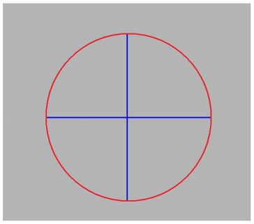

<!-- id: s22-10-0016 -->

Un cercle - section de sphère - et puis à l’intérieur : la croix, en plus ça fait le signe +.

<!-- id: s22-10-0017 -->

Vous pouvez pas savoir jusqu’où vous êtes retenus dans ce cercle et dans ce signe +.

<!-- id: s22-10-0018 -->

Il peut arriver que par hasard un artiste qui plaque quelque chose en plâtre sur un mur, fasse quelque chose qui par hasard ressemble à ça :

<!-- id: s22-10-0019 -->

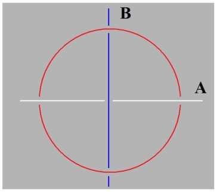

<!-- id: s22-10-0020 -->

Mais personne ne s’aperçoit que ça, c’est déjà le nœud borroméen.

<!-- id: s22-10-0021 -->

Essayez de vous y mettre : quand vous voyez ça qu’est-ce que vous en faites *imaginairement* ?

<!-- id: s22-10-0022 -->

Vous en faites deux choses qui se crochent, ce qui revient à les replier ce A et ce B, à les plier de cette façon-là :

<!-- id: s22-10-0023 -->

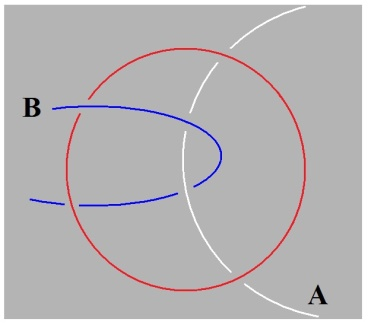

<!-- id: s22-10-0024 -->

Moyennant quoi, le cercle, le rond, le cycle...

<!-- id: s22-10-0025 -->

> je reviendrai tout à l’heure sur ce que ça veut dire ...n’a plus qu’à glisser sur ce qui est ainsi noué.

<!-- id: s22-10-0026 -->

Il n’est pas, si je puis dire, natu­rel...

<!-- id: s22-10-0027 -->

> qu’est-ce que ça veut dire *natu­rel*, dès qu’on s’approche ça disparaît, mais enfin : *naturel à votre imagination* ...il n’est pas natu­rel de faire exactement le contraire, c’est-à-dire - le cercle, le cycle - de le distordre ainsi :

<!-- id: s22-10-0028 -->

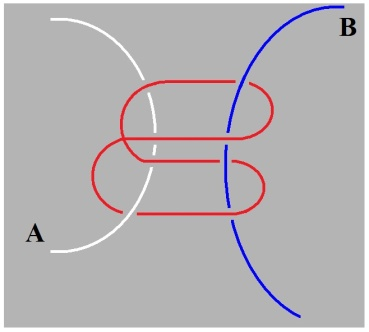

<!-- id: s22-10-0029 -->

Ce qui semblerait s’imposer tout autant, enfin si de A et de B on fait un usage simplement différent.

<!-- id: s22-10-0030 -->

C’est un fait dont le moins qu’on puisse dire est qu’il est curieux que je m’intéresse au nœud bor­roméen*,* parce que dites-vous bien que le nœud borroméen, c’est pas for­cément ce que je vous ai dessiné cent fois.

<!-- id: s22-10-0031 -->

Ça, c’est un nœud borroméen aussi : tout aussi valable que celui sous la forme sous laquelle je le mets à plat d’habitude, c’est un vrai nœud borroméen - je veux dire – *ça *:

<!-- id: s22-10-0032 -->

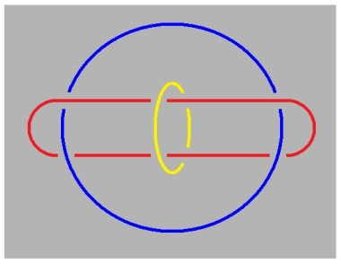

<!-- id: s22-10-0033 -->

Regardez-y de près. J’ai déjà dit que si j’ai été un jour *saisi* par le nœud borroméen, c’est tout à fait lié à cet ordre d’événements, ou d’avènements, comme vous voudrez, qui s’appelle « *le discours analytique »*, et en tant que je l’ai défini comme *lien social*, de nos jours émergeant.

<!-- id: s22-10-0034 -->

Ce discours a une valeur historique à repérer.

<!-- id: s22-10-0035 -->

C’est vrai que ma voix est faible pour le soutenir, mais c’est peut-être tant mieux parce que si elle était plus forte, ben j’aurais peut-être en somme moins de chance de subsister.

<!-- id: s22-10-0036 -->

Je veux dire que il me paraît difficile, par toute l’histoire que les liens sociaux jusqu’ici prévalents ne fassent pas taire toute voix faite pour soutenir un autre discours émergeant.

<!-- id: s22-10-0037 -->

C’est ce qu’on a toujours vu jusqu’ici et ça n’est pas parce qu’il n’y a plus d’Inquisition qu’il faut croire que les liens sociaux que j’ai définis : *le discours du maître*, *le discours universitaire*, voire *le discours hystérico-diabolique*, n’étouffe­raient pas, si je puis dire, ce que je pourrais avoir de voix.

<!-- id: s22-10-0038 -->

Ceci dit, moi là-dedans je suis *sujet*.

<!-- id: s22-10-0039 -->

Je suis pris dans cette affaire, comme ça, parce que je me suis mis à *ex-sister comme analyste*.

<!-- id: s22-10-0040 -->

Ça veut pas dire du tout que je me crois une mission de vérité.

<!-- id: s22-10-0041 -->

Il y a eu des gens comme ça - *dans le passé* - un peu tombés sur la tête.

<!-- id: s22-10-0042 -->

Pas de mission de vérité, *parce que la vérité* - j’y insiste - ça ne peut pas se *dire*, *ça ne peut que se mi-dire*.

<!-- id: s22-10-0043 -->

Alors, réjouissons-nous que ma voix soit basse...

<!-- id: s22-10-0044 -->

Dans toute philosophie jusqu’à présent, il y a la philo­sophie, la *bonne* - hein ! - la courante, et puis de temps en temps, il y a des dingues justement, qui se croient une mission de vérité : l’ensemble est simplement bouffonnerie !

<!-- id: s22-10-0045 -->

Mais que je le dise n’a aucune importance : heureusement pour moi, on ne me croit pas !

<!-- id: s22-10-0046 -->

Parce qu’en fin de compte - croyez-le ! - pour l’instant la bonne domine, la bonne philosophie elle est bien toujours là.

<!-- id: s22-10-0047 -->

J’ai été faire une petite visite pendant ces vacances...

<!-- id: s22-10-0048 -->

> histoi­re de lui faire un petit signe avant que nous nous dissolvions tous deux ...au nommé Heidegger. Je l’aime beaucoup, il est encore très vaillant \[*86 ans*\].

<!-- id: s22-10-0049 -->

Il a quand même ceci : qu’il essaye d’en sortir.

<!-- id: s22-10-0050 -->

Il y a quelque chose en lui comme un pressentiment de la « *psichanalisse* », comme disait Aragon [^25], mais ce n’est qu’un pressentiment parce que Freud...

<!-- id: s22-10-0051 -->

enfin il ne sait pas où donner de la tête quand il...

<!-- id: s22-10-0052 -->

...ça l’intéresse pas.

<!-- id: s22-10-0053 -->

Pourtant quelque chose par Freud, a émergé, dont je tire les conséquences, à peser ça dans ses effets qui ne sont pas rien. Mais ça suppose, ça supposerait que le psychanalyste *ex-siste*, *ex-siste* un tout petit peu plus.

<!-- id: s22-10-0054 -->

Enfin ! Il a quand même commencé - c’est déjà ça - commencé d’*ex-sister*, là, tel que je l’écris.

<!-- id: s22-10-0055 -->

Comment faire pour que ce nœud auquel je suis arrivé...

<!-- id: s22-10-0056 -->

> bien sûr, sans me prendre les pattes tout autant que vous ...comment faire pour qu’il le serre ce nœud, au point que le *parlêtre*, comme je l’appelle, ne croit plus – ne croit plus quoi ? – qu’hors *l’être de parler,* il croit à *l’être* !

<!-- id: s22-10-0057 -->

C’est grossier de dire que c’est uniquement parce qu’il y a le verbe *être*.

<!-- id: s22-10-0058 -->

Non, c’est pour ça que j’ai dit «*l’être de parler* ».

<!-- id: s22-10-0059 -->

Il croit que, parce qu’il parle, ben c’est là qu’est le salut.

<!-- id: s22-10-0060 -->

C’est *une erre* et même je dirais *un trait* *une-erre*.

<!-- id: s22-10-0061 -->

C’est grâce à ça, que ce que j’ap­pellerai *un déconage orienté* a prévalu dans ce qu’on appelle *la pensée*, *pensée* qu’on dit « *humaine* ».

<!-- id: s22-10-0062 -->

Je me laisse aller comme ça, la mouche me pique de temps en temps, et cette *erre* je dirai qu’elle mériterait plutôt d’être épinglée du mot « *trans<u>humant</u> »,* sa prétendue *humanité* ne tenant qu’à une naturalité de *transit*, et en plus qui pos­tule la *trans*cendance ! \[*Cf. le parcours » (trans) des discours* H,U,M,A,\]

<!-- id: s22-10-0063 -->

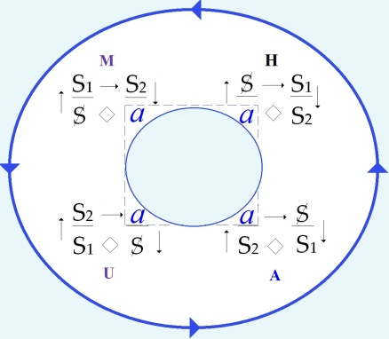

<!-- id: s22-10-0064 -->

Mon « *succès* » si je puis dire...

<!-- id: s22-10-0065 -->

> qui n’a bien sûr aucune connotation de réussite à mes yeux et pour cause : je ne crois, comme Freud,
>
> qu’à l’ac­te manqué, mais à l’acte manqué en tant qu’il est révélateur du site, de la situation du « *transi* » en question[^26], avec *trans*fert à la clé bien sûr, tout ça, ça fait du « *trans* », il faut simplement ce « *trans* » le ramener à sa juste mesure ...mon succès donc - ma succession, c’est ça que ça veut dire - restera-t-il dans ce *trans*itoire ?

<!-- id: s22-10-0066 -->

Eh ben, c’est ce qui peut lui arriver de mieux, parce que de toute façon il n’y a aucune chance que l’*humant-trans* aborde jamais à quoi que ce soit. Donc, autant vaut la pérégrination sans fin !

<!-- id: s22-10-0067 -->

Simplement Freud a fait la remarque qu’il y a peut-être *un dire* qui vaille, de ça que je vais dire : de n’être jusqu’ici qu’*inter-dit*...

<!-- id: s22-10-0068 -->

> ça veut dire : « *dit entre* », rien de plus, *entre les lignes,* ...c’est ce qu’il a appelé, comme ça, le « *refoulé* ».

<!-- id: s22-10-0069 -->

Bien sûr, je me monte pas le bourrichon.

<!-- id: s22-10-0070 -->

Mais pour­quoi, si vraiment comme je viens de le dire, *il n’y a* *pas de trace*...

<!-- id: s22-10-0071 -->

> même dans les gens qui seraient *faits* en quelque sorte pour le rencontrer ...*pas de trace* de ce nœud borroméen, malgré ce que je vous dis : depuis que « *la sphère et la croix* » ça traîne partout, on aurait dû s’apercevoir que ça pouvait faire nœud borroméen, comme je viens de vous l’expliquer.

<!-- id: s22-10-0072 -->

Bon ! Il se trouve que j’ai fait cette trouvaille du nœud borroméen - sans la chercher, bien sûr ! - ça me paraît...

<!-- id: s22-10-0073 -->

> faut aussi que ça vous paraisse, bien sûr, ...ça me paraît trouvaille notable de récupérer, non pas l’air de Freud : *a.i.r.*, mais justement son *erre*, ce qui en *ex-siste*, rigoureusement affaire de nœud.

<!-- id: s22-10-0074 -->

Bon ! Maintenant passons à quelque chose à se mettre sous la dent, et c’est ça qui est l’important :

<!-- id: s22-10-0075 -->

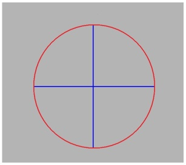

<!-- id: s22-10-0076 -->

Pourquoi diable personne n’en a-t-il tiré, ce plus \[+\] qui consiste à écrire ce signe comme ça, de la bonne façon ?

<!-- id: s22-10-0077 -->

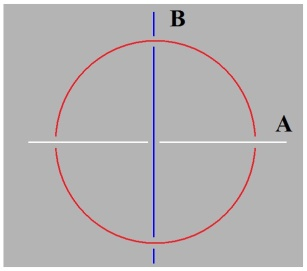

<!-- id: s22-10-0078 -->

Il y a quand même quelqu’un, qui un jour...

<!-- id: s22-10-0079 -->

> vous vous en souvenez pas, bien sûr, parce que vous avez pas lu tout Aragon...
>
> Qui est-ce qui lit tout Aragon ? ...il y a un passage d’Aragon jeune, qui s’est mis à « *fumer »*, je veux dire à s’échauffer, à prétendre qu’un temps qui a été jusqu’à supprimer les carrefours, *quadri vii*...

<!-- id: s22-10-0080 -->

> il pensait aux autoroutes, parce que c’est un mot assez marrant « *autoroute* ».
>
> Qu’est-ce que ça veut dire une *autoroute* : une route *en soi,* ou une route *pour soi* ? ...qui trouvait que ce temps...

<!-- id: s22-10-0081 -->

> il y a encore beaucoup de carrefours, beau­coup de coins de rues, bien sûr,
>
> je sais pas ce qui lui a pris de penser qu’il y aurait plus de carrefours, qu’il y aurait toujours des passages souterrains ...que ce temps mériterait un meilleur sort que de rester dans la théologie générale*.*

<!-- id: s22-10-0082 -->

Ce qu’il y a de curieux c’est qu’il n’en a pas du tout tiré de conclusion.

<!-- id: s22-10-0083 -->

C’est le mode surréaliste : ça n’a jamais abouti à rien.

<!-- id: s22-10-0084 -->

Il n’a pas spatialisé le nœud borroméen de la bonne façon. Grâce à quoi nous en sommes toujours à être...

<!-- id: s22-10-0085 -->

> comme me le disait Heidegger, là que j’ai extrait tout à l’heure de sa boîte ...à être *In-der-Welt,* à l’*In-der-Welt sein.*

<!-- id: s22-10-0086 -->

C’est *une cosméticologie, cosméticuleuse* en plus. C’est une tradition, grâce à quoi ?

<!-- id: s22-10-0087 -->

Grâce à ce *Welt* \[*monde*\], il y a l’*Umwelt* \[*environnement*\] et puis il y a l’*Innenwelt* \[*monde intérieur*\]*.*

<!-- id: s22-10-0088 -->

Ça devrait faire suspect, cette répétition de la bulle.

<!-- id: s22-10-0089 -->

Oui, j’ai appris que dans les bandes dessinées c’est par des bulles...

<!-- id: s22-10-0090 -->

> je m’en étais jamais aperçu, parce que, je dois dire la vérité, je regarde jamais les bandes dessinées.
>
> J’ai honte ! J’ai honte parce que c’est merveilleux, n’est-ce pas ? ...c’est même pas des bandes dessinées, c’est des photo­montages, enfin c’est sublime, c’est des photo­montages \- j’ai lu ça dans « *Nous deux » -* des photo­montages avec paroles, et alors les pensées c’est quand il y a des *bulles* !

<!-- id: s22-10-0091 -->

Je ne sais pas pourquoi vous riez, parce que, vous, ça vous est familier, du moins je le suppose...

<!-- id: s22-10-0092 -->

Parce que la question que je pose là sous cette forme de « *bulle* », c’est : « *qu’est-ce qui prouve que le Réel fait uni­vers ? »*

<!-- id: s22-10-0093 -->

C’est là, la question que je pose, c’est celle qui est posée à partir de Freud, en ceci qui n’est qu’un commencement, c’est que Freud suggère que cet univers a un *trou*. Par-dessus le marché, un *trou* qu’il n’y a pas moyen de savoir.

<!-- id: s22-10-0094 -->

Alors je suis ce *trou à la trace*, si je puis dire, et je ren­contre...

<!-- id: s22-10-0095 -->

> c’est pas moi qui l’ai inventé ...je rencontre le nœud borroméen qui, comme on dit toujours, me vient là comme bague au doigt...

<!-- id: s22-10-0096 -->

Nous voilà encore dans le *trou* !

<!-- id: s22-10-0097 -->

Seulement il y a quand même quelque chose...

<!-- id: s22-10-0098 -->

> quand on y va, comme ça, à suivre les choses à la trace, ...c’est qu’on s’aperçoit qu’il n’y a pas qu’un truc pour faire un *cycle *: c’est pas forcément et seulement le *trou.*

<!-- id: s22-10-0099 -->

Si vous en prenez deux de ces cycles, de ces choses qui tournent, de ce cercle en question, et si vous les nouez tous les deux, de la bonne façon - *faut pas se tromper* bien sûr - et je dois vous dire que je me trompe tout le temps, il n’y a pas que Jacques-Alain Miller !

<!-- id: s22-10-0100 -->

La preuve, regardez ça : quand j’ai voulu tout à l’heure vous faire le nœud borroméen, celui-ci, là, à la noix, je me suis foutu le doigt dans l’œil, car fait comme ça, c’est pas un nœud borro­méen, à savoir que vous pouvez toujours en couper un, les deux autres resteront noués : c’est pas le bon truc.

<!-- id: s22-10-0101 -->

Mais enfin à condition de les plier de la bonne façon, vous vous apercevez que si vous y ajoutez cette droite, rien d’autre que cette droite, eh ben c’est un nœud borroméen.

<!-- id: s22-10-0102 -->

La droite, bien sûr, *infinie*, comme je l’ai dit, énoncé, au début de ce séminaire.

<!-- id: s22-10-0103 -->

Ça fait un nœud borroméen tout aussi valable que celui que je dessine d’habitude et que je vais pas recommencer.

<!-- id: s22-10-0104 -->

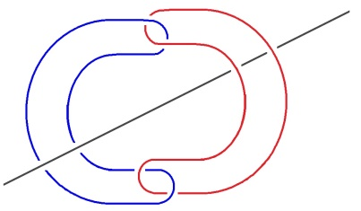

<!-- id: s22-10-0105 -->

Si la droite est une droite infinie...

<!-- id: s22-10-0106 -->

> et comment ne pas s’y référer comme *la ficelle* en elle–même, la *consistance,* réduite à ce qu’elle a de dernier ...eh ben ça fait un nœud !

<!-- id: s22-10-0107 -->

Naturellement, il nous est beaucoup plus commode – cette *consistance* – de la fermer, je veux dire de nous aperce­voir qu’il suffit ici de faire boucle pour retrouver le nœud familier, le nœud de la façon dont je le *dessine* d’habitude.

<!-- id: s22-10-0108 -->

L’intérêt, n’est-ce pas, de le représenter ainsi, c’est de s’aperce­voir qu’à partir de là :

<!-- id: s22-10-0109 -->

<!-- id: s22-10-0110 -->

la façon - la première - d’écrire le nœud borroméen se répercute sur ce *cycle* et que c’est une des façons de montrer com­ment le nœud peut être si je puis dire, *doublement borroméen*, c’est­-à-dire que nous passons *au nœud bobo à* 4.

<!-- id: s22-10-0111 -->

Voilà, je vous ai montré là une autre illustration de ce nœud à quatre :

<!-- id: s22-10-0112 -->

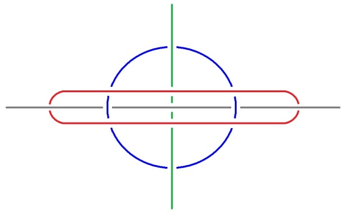

<!-- id: s22-10-0113 -->

*Mais la question que ça pose, c’est quel est l’ordre d’équivalence de la droite* - de la droite infinie telle qu’elle est là - *de la droite au cycle* :

<!-- id: s22-10-0114 -->

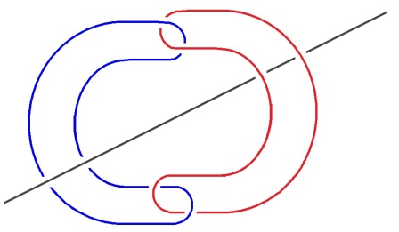

<!-- id: s22-10-0115 -->

Il y a quelqu’un, un homme de génie qui s’appelait Desargues, auquel j’ai déjà fait allusion[^27] dans son temps...

<!-- id: s22-10-0116 -->

> enfin « *dans son temps* » : dans le temps où j’y ai fait allusion \[Girard Desargues : 1591-1661\] ...à qui il était venu l’idée que toute droite infinie faisait clôture, faisait boucle, en un point à l’infini.

<!-- id: s22-10-0117 -->

Comment est-ce que cette idée a pu lui venir ?

<!-- id: s22-10-0118 -->

C’est une idée absolument sublime, autour de laquelle j’ai construit tout mon commentaire des *Ménines,* celui dont on dit - enfin, à en croire les gratte-papier - que c’était tout à fait incompréhensible.

<!-- id: s22-10-0119 -->

Je sais pas, à moi il m’a pas semblé tout au moins...

<!-- id: s22-10-0120 -->

Quelle équi­valence *de la droite au cercle* ? *C’est évidemment de faire nœud*.

<!-- id: s22-10-0121 -->

C’est une conséquence du nœud borroméen.

<!-- id: s22-10-0122 -->

C’est un recours à l’ef­ficience, à l’effectivité, à la *Wirklichkeit.*

<!-- id: s22-10-0123 -->

C’est pas ça l’important !

<!-- id: s22-10-0124 -->

Car si nous les trouvons équi­valents dans l’efficience, dans l’efficience du nœud, quelle est la diffé­rence ?

<!-- id: s22-10-0125 -->

Je vous dis pas du tout que je sois satisfait...

<!-- id: s22-10-0126 -->

J’approche, aussi péniblement que ça vous donnera de peine, tout ce qui concerne le « *penser-le-nœud-borroméen* ».

<!-- id: s22-10-0127 -->

Parce que je vous l’ai dit, c’est pas facile de l’*imaginer*, ce qui donne une juste mesu­re de ce qu’est *toute pensation*, si je puis dire.

<!-- id: s22-10-0128 -->

Il est quand même curieux que même Descartes...

<!-- id: s22-10-0129 -->

> sa *Regula decima* \[« *Règle 10* », *cf. supra*\]*,* à savoir celle que je vous ai pointée ...même lui, concernant...

<!-- id: s22-10-0130 -->

> ce qui n’est pas dit en toutes lettres ...concernant *l’usage du fil*, *l’usage du* *tissage* [^28], l’usage de ce qui aurait pu le conduire au *nœud*, et au *nœud borroméen* en particulier, il n’en ait jamais rien fait, et c’est un signe.

<!-- id: s22-10-0131 -->

Bon alors, la différence...

<!-- id: s22-10-0132 -->

> je vous dis pas que c’est mon dernier mot ...la différence c’est dans le passage de l’un à l’autre \[« *de la droite au cercle* », *du* « *tissage* » (Descartes) au « *nœud* *du plan projectif* » (Desargues)\], et dans ceci que pour l’instant je me contente d’illustrer, sans le faire d’une façon définitive, c’est qu’entre les deux, il y a un *jeu*, et puisque tout ce *jeu* n’aboutit qu’à leur équivalence, c’est peut-être *dans ce* *parcours* \[*le « chemin » du « mur de l’impossible », dans « la ronde des discours »*\] *que quelque chose qui de faire cycle, boucle un trou*, c’est peut-être dans le jeu de l’*ex-sistence*, de l’*erre* en somme, du fait *qu’il y a un jeu*, *que ça se promène*, *que ça s’ouvre* comme on dit, que la différence consiste.

<!-- id: s22-10-0133 -->

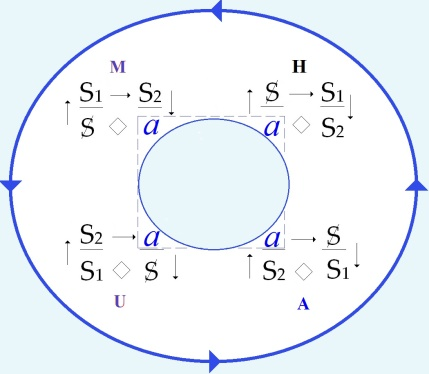

<!-- id: s22-10-0134 -->

Une différence d’*ex-sistence* :

<!-- id: s22-10-0135 -->

- l’une \[*la droite infinie*\] *ex-siste*, s’en va dans l’*erre* jusqu’à ne rencontrer que la simple consistance,

<!-- id: s22-10-0136 -->

- et l’autre, *le cycle,* est centré sur *le trou*.

<!-- id: s22-10-0137 -->

Bien sûr, personne ne sait ce que c’est *ce trou*.

<!-- id: s22-10-0138 -->

Que *le trou* ça soit ce sur quoi l’accent soit mis dans *le corporel* par toute la pensée analytique, ça le bouche plutôt *ce trou* , c’est pas clair.

<!-- id: s22-10-0139 -->

Du fait que ce soit « *l’orifice* » auquel soit suspendu tout ce qu’il y a de pré-œdipien comme on dit, que toute la perversité s’oriente, qui est celle de toute notre conduite, intégralement, c’est bien étrange !

<!-- id: s22-10-0140 -->

C’est pas ça qui va nous éclairer de la nature du trou.

<!-- id: s22-10-0141 -->

Il y a autre chose comme ça qui pourrait venir à l’idée, de tout à fait non représentable, c’est ce qu’on appelle comme ça d’un nom qui ne *papillote* qu’à cause du langage, c’est ce qu’on appelle « la mort ».

<!-- id: s22-10-0142 -->

Ben, ça le bouche pas moins, parce que « la mort » on sait pas ce que c’est.

<!-- id: s22-10-0143 -->

Il y a quand même *un abord* qui s’exprime *dans ce que la mathématique a qualifié de topologie,* qui envisage l’espace autrement...

<!-- id: s22-10-0144 -->

> notez cet *autrement*, ça vaut bien la peine qu’on le retienne, ...eh ben on ne peut pas dire que ça nous mène à des notions si aisées.

<!-- id: s22-10-0145 -->

On voit bien là le poids de l’inertie *Imaginaire*.

<!-- id: s22-10-0146 -->

Pourquoi est-ce que la géométrie s’est trouvée si à l’aise dans ce qu’elle combine ?

<!-- id: s22-10-0147 -->

Est-ce que c’est par adhérence à l’*Imaginaire*, ou est-ce que c’est par une sorte d’injection de *Symbolique* ?

<!-- id: s22-10-0148 -->

C’est ce qui mériterait d’être posé comme question à un mathématicien.

<!-- id: s22-10-0149 -->

Quoi qu’il en soit, le caractère tordu de cette *topologie*, l’instauration de notions comme celle de « *voisinage* », voire de « *point d’ac­cumulation* », cet accent mis sur quelque chose...

<!-- id: s22-10-0150 -->

> on voit très bien quel est le versant ...sur *la discontinuité* comme telle, alors que manifestement il y a là une résistance : que *la continuité* c’est bien le versant naturelde l’*imagi­nation*.

<!-- id: s22-10-0151 -->

Bon, je ne vais pas m’étendre plus.

<!-- id: s22-10-0152 -->

Ce que je remarque, c’est que la difficulté de l’introduction du mental à *la topologie*, le fait que ça ne soit pas plus aisément pensable, donne bien l’idée qu’il y a à apprendre de cette *topologie* pour ce qu’il en est de notre refoulé.

<!-- id: s22-10-0153 -->

La difficulté effective de cogiter sur le nœud bo, là redoublée du fait que l’accessibilité constituée par « *la sphère et la croix* » le rendent comme un exemple d’une μάθησις \[mathésis\] manquée...

<!-- id: s22-10-0154 -->

> manquée d’un poil, inexplicablement, jamais familière en tout cas ...pourquoi ne pas voir dans l’aversion que ceci entraîne - manifeste - la trace de ce refoule­ment premier lui-même ?

<!-- id: s22-10-0155 -->

Et pourquoi ne pas s’engager dans ce sillage, tout comme le chien qui flaire une trace ?

<!-- id: s22-10-0156 -->

À ceci près bien sûr, que c’est pas le flair qui nous caractérise, et que cet effet de flair qu’il y a chez le chien, il faudrait rendre compte comment ça peut imiter un effet de perception qui serait là le supplément à un *manque* qu’il faut bien que nous admettions si nous sommes - c’est là la question - dessillés.

<!-- id: s22-10-0157 -->

Si nous ouvrons les yeux à l’*ex-sistence* de l’*Urverdrängt,* de quelque chose d’affirmé par l’*analyse,* qui est qu’il y a un *refoulement* non seu­lement premier mais irréductible, c’est ça qu’il s’agirait de suivre à la trace, et c’est en somme ce que je fais devant vous à la mesure de mes moyens.

<!-- id: s22-10-0158 -->

Naturellement, tout de même, je prends soin de vous dire que je me monte pas le bourrichon, je veux dire que je ne crois pas que j’ai trouvé là le dernier mot.

<!-- id: s22-10-0159 -->

Non pas que penser qu’on a trouvé le der­nier mot, ce serait à proprement parler de *la paranoïa*.

<!-- id: s22-10-0160 -->

*La paranoïa* c’est pas ça, *la paranoïa* *c’est* *un engluement* *Imaginaire *:

<!-- id: s22-10-0161 -->

- c’est la voix qui sonorise,

<!-- id: s22-10-0162 -->

- le regard qui devient prévalent, ...c’est une affaire de congéla­tion d’un désir.

<!-- id: s22-10-0163 -->

Mais enfin, quand bien même ça serait de *la paranoïa*, Freud nous a dit de ne pas nous inquiéter.

<!-- id: s22-10-0164 -->

Je veux dire que – pourquoi pas ? – ça peut être une veine à suivre ?

<!-- id: s22-10-0165 -->

Il y a pas lieu d’en avoir tel­lement de crainte, si ça nous conduit quelque part !

<!-- id: s22-10-0166 -->

Il est tout à fait net que ça n’a jamais conduit qu’à *la vérité* !

<!-- id: s22-10-0167 -->

Ce qui en fait bien la mesure de *la vérité* elle-même, à savoir ce que démontre la paranoïa du Président Schreber, c’est à savoir *qu’il n’y a de* *rapport sexuel* qu’avec Dieu. C’est *la vérité* !

<!-- id: s22-10-0168 -->

Et c’est bien ce qui met en question *l’ex-sistence* de Dieu, nous sommes là dans un *raté de la création*, si je puis m’exprimer ainsi.

<!-- id: s22-10-0169 -->

Le dire, c’est se fier à quelque chose qui probablement nous dupe, mais n’en *être pas dupe*, ça n’est rien qu’essuyer les plâtres du *non-dupe*, soit ce que j’ai appelé l’*erre*.

<!-- id: s22-10-0170 -->

Mais cette *erre*, c’est notre seule chance *de fixer le nœud*, vraiment *dans son* *ex-sistence*, *puisqu’il n’est qu’ex-sistence en tant que nœud*.

<!-- id: s22-10-0171 -->

Il est ce qui n’*ex-siste* qu’à être noué de telle sorte que ça ne puisse que se resserrer.

<!-- id: s22-10-0172 -->

Même dans l’embrouille !

<!-- id: s22-10-0173 -->

Parce que ce que je n’ai pas pu vous dessiner là, c’est que *le nœud borro­méen* - il suffit d’en avoir un à trois – vous savez, vous pouvez très bien le dessiner d’une façon totalement embrouillée, à laquelle vous n’entra­verez que pouic !

<!-- id: s22-10-0174 -->

Dire : « *il n’y a pas de rapport sexuel »,* part de l’idée d’une φύσις \[phusis\], à savoir de quelque chose qui ferait du sexe un principe d’harmonie.

<!-- id: s22-10-0175 -->

*Rapport*, ça veut dire jusqu’à ce jour pour nous : *proportion*.

<!-- id: s22-10-0176 -->

L’idée :

<!-- id: s22-10-0177 -->

- qu’avec *des mots* on pouvait reproduire ça,

<!-- id: s22-10-0178 -->

- que *les mots* étaient destinés à faire sens,

<!-- id: s22-10-0179 -->

- que « *l’être étant* », il en résulte par exemple que « *le non-être n’est pas* ».

<!-- id: s22-10-0180 -->

Oui ! Il y a encore des gens pour qui ça fait sens.

<!-- id: s22-10-0181 -->

Le sens parménidien là, comme ça à l’origine, est devenu un bavardage, et il ne vient à l’idée de personne que ce n’est pas là proprement le signe que c’est du vent : *Flatus vocis* !

<!-- id: s22-10-0182 -->

Je ne dis pas du tout qu’ils ont tort !

<!-- id: s22-10-0183 -->

C’est bien le contraire : ils me sont précieux.

<!-- id: s22-10-0184 -->

Ils prouvent que le sens va aussi loin dans *l’équivoque* qu’on peut le désirer pour *le discours analytique*.

<!-- id: s22-10-0185 -->

À savoir qu’à partir du sens :

<!-- id: s22-10-0186 -->

- se jouit, s’ouï-je(*s, apostrophe, oui, je*),

<!-- id: s22-10-0187 -->

- j’ouisse moi-même, s’ouis-je à m’« *assauter* » de mots.

<!-- id: s22-10-0188 -->

Naturellement il y a mieux. Il y a mieux, à ceci près que « *le mieux*... comme dit la sagesse populaire ...*est l’ennemi du bien »*.

<!-- id: s22-10-0189 -->

De même que le *plus-de-jouir* provient de la *père-version*, de la version « *a-père-itive* » du *jouir*. On n’y peut rien.

<!-- id: s22-10-0190 -->

Le parlêtre n’aspire qu’au *bien*, d’où il s’enfonce toujours dans *le pire*.

<!-- id: s22-10-0191 -->

Ça n’empêche qu’il ne peut pas s’y refuser. Même pas moi...

<!-- id: s22-10-0192 -->

Là, je suis *un grain* comme vous tous, broyé dans cette *salade*.

<!-- id: s22-10-0193 -->

L’ennui, c’est que chacun sait que ça a de bons effets, je parle de l’analyse.

<!-- id: s22-10-0194 -->

Que ces bons effets ne durent qu’un temps, n’empêche pas que c’est un répit, et que c’est mieux que de ne rien faire.

<!-- id: s22-10-0195 -->

C’est un peu embêtant quand même !

<!-- id: s22-10-0196 -->

C’est un « *embêtant »* contre quoi on pourrait essayer d’aller, malgré le courant ?

<!-- id: s22-10-0197 -->

Parce que c’est malgré tout de nature à prouver l’*ex-sistence* de Dieu lui-même.

<!-- id: s22-10-0198 -->

Tout le monde y croit ! Je mets au défi chacun d’entre vous que je ne lui prouve pas qu’il croit à l’*ex-sistence* de Dieu !

<!-- id: s22-10-0199 -->

C’est même ça le scandale, le scandale que la psychanalyse seule fait valoir.

<!-- id: s22-10-0200 -->

Elle le fait valoir parce qu’actuellement il n’y a plus que la psychanalyse qui le prouve.

<!-- id: s22-10-0201 -->

Je parle de le prouver : c’est pas du tout pareil que de vous prouver que vous y croyez.

<!-- id: s22-10-0202 -->

Formellement, ceci n’est dû qu’à la tradition juive de Freud, laquelle est une tradition *littérale* qui le lie à *la science*, et du même coup *au Réel*. C’est ça le cap qu’il y a à doubler.

<!-- id: s22-10-0203 -->

Dieu est *père* - tiret - *vers* (*v.e.r.s*), c’est un fait rendu patent par le juif lui-même.

<!-- id: s22-10-0204 -->

Mais on finira bien par...

<!-- id: s22-10-0205 -->

> enfin je peux pas dire que je l’espère ...je dis : à remonter ce courant, on finira bien par inventer quelque chose de moins stéréotypé que la *perversion*.

<!-- id: s22-10-0206 -->

C’est même la seule raison pourquoi je m’intéresse à la psychanalyse...

<!-- id: s22-10-0207 -->

je dis : « *je m’intéresse »* ...et pourquoi je m’essaie à ce qu’on appelle couramment « *la galvaniser »*.

<!-- id: s22-10-0208 -->

Mais je ne suis pas assez bête pour avoir le moindre espoir d’un résultat que rien n’annonce, et qui sans doute est pris par le mauvais bout, ceci grâce à cette histoire à dormir debout de « *Sodome et de Gomorrhe* ».

<!-- id: s22-10-0209 -->

Il y a des jours même, où il me viendrait que *la charité chrétienne* *serait sur la voie d*’*une perversion* un peu éclairante du *non-rapport*.

<!-- id: s22-10-0210 -->

Vous voyez jusqu’où je vais, hein !

<!-- id: s22-10-0211 -->

C’est pourtant pas dans ma pente, mais enfin - c’est le cas de le dire - *il faut pas charrier*... *ni « cha­riter » !*

<!-- id: s22-10-0212 -->

Il n’y a aucune chance qu’on ait la clé de l’accident de parcours qui fait que le sexe a abouti à faire maladie chez le *parlêtre*, et la pire maladie - hein - celle dont il se reproduit.

<!-- id: s22-10-0213 -->

Il est évident que la biologie a avantage à se forcer...

<!-- id: s22-10-0214 -->

> à devenir - avec un accent un petit peu différent – « *la viologie* » : la logie de la violence ...à se forcer du côté de la moisissure, avec lequel ledit *parlêtre* a beaucoup d’analogies.

<!-- id: s22-10-0215 -->

On ne sait jamais, *une bonne rencontre*...

<!-- id: s22-10-0216 -->

Un François Jacob est assez juif pour permettre de rectifier le *non-rapport*.

<!-- id: s22-10-0217 -->

Ce qui ne peut vouloir dire...

<!-- id: s22-10-0218 -->

> dans l’état actuel de la connaissance ...vouloir dire que remplacer cette disproportion fondamentale dudit *rapport,* par une autre formule, par quelque chose qui ne peut se concevoir que comme un détour voué à l’*erre*, mais à une *erre* limitée par un nœud. *Ouais*...

<!-- id: s22-10-0219 -->

Je ne voudrais quand même pas vous quitter sans vous faire remarquer quelque chose qui je pense est opportun à cause de... Je pense que vous avez eu des tas de petits papiers distribués par Michel Thomé et Pierre Soury ? Oui !

<!-- id: s22-10-0220 -->

Ce sont des petits papiers qui sont très importants parce qu’ils démontrent quelque chose : qu’il n’y a qu’un seul nœud borro­méen orienté. Voilà !

<!-- id: s22-10-0221 -->

Alors, je voudrais pour eux...

<!-- id: s22-10-0222 -->

> parce que probablement ils seront les seuls à apprécier ...pour eux, faire remarquer ceci : c’est que ce que j’ai apporté aujourd’hui...

<!-- id: s22-10-0223 -->

> je ne sais pas ce que j’ai apporté aujourd’hui d’ailleurs, ...ce que j’ai apporté aujourd’hui, *à savoir la remarque qu’il y a moyen de faire cycle avec deux cercles.*

<!-- id: s22-10-0224 -->

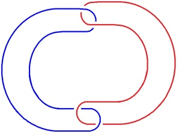

<!-- id: s22-10-0225 -->

Cette remarque a des conséquences concernant leur proposition, qu’il n’y a qu’un nœud orienté.

<!-- id: s22-10-0226 -->

Sur le fait qu’il n’y ait qu’un nœud orienté quand il y a trois ronds de ficelle, mais pas quand il y en a plus, je suis d’accord.

<!-- id: s22-10-0227 -->

Néanmoins, il y a quelque chose d’amusant, c’est que si vous transformez un de ces ronds en *une droite infinie*...

<!-- id: s22-10-0228 -->

> c’était là la portée de la remarque que je leur avais faite, mais contre quoi ils ont eu raison de tenir, ...je leur avais fait la remarque que c’était du côté de ce 3ème qu’il y avait quelque chose qui me semblait imposer l’*ex-sistence*, non pas d’1 nœud, mais de 2 nœuds orientés.

<!-- id: s22-10-0229 -->

C’est à eux que je m’adresse pour l’instant, et c’est eux de ce fait que je charge de me répondre.

<!-- id: s22-10-0230 -->

C’est à eux que je m’adresse : je ne pose pas de question, je ne dis pas « *est-ce qu’il ne leur semble pas* ? » : j’affirme.

<!-- id: s22-10-0231 -->

J’affirme que s’il y en a un qu’on transforme en une *droite infinie*, là il n’y a plus 1 seul nœud comme orien­té, mais 2 nœuds.

<!-- id: s22-10-0232 -->

J’en ai pas fait le petit dessin, mais je vais le faire sur ce dernier bout de papier que j’ai fait exprès mettre en blanc.

<!-- id: s22-10-0233 -->

Et je leur marque ceci : c’est que *la droite infinie n’est pas* *orientable* ! À partir de quoi l’orienterait-on ?

<!-- id: s22-10-0234 -->

Elle n’est orientable - c’est patent, c’est courant - qu’à partir d’un point choisi quelconque sur cette droite, et d’où les orientations divergent. Mais de diverger, ça ne lui en donne pas une. Alors, par rapport...

<!-- id: s22-10-0235 -->

vous allez voir que je m’en vais faire exactement ce qu’il ne faut pas faire, à savoir...

<!-- id: s22-10-0236 -->

Ah, quand même ! J’y arrive. Bon. À savoir ceci :

<!-- id: s22-10-0237 -->

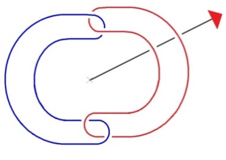

<!-- id: s22-10-0238 -->

C’est que pour nous en tenir à une formulation simple, faisons remarquer que dans le double cercle il y a une *orientation*, à savoir ce que nous désignerons du mot « *gyrie* ».

<!-- id: s22-10-0239 -->

Non pas, bien sûr, que nous puissions dire que c’est une *dextrogyrie* ou une *lévogyrie*, chacun le sait maintenant.

<!-- id: s22-10-0240 -->

Car depuis le temps qu’on se casse la tête à le faire, il semble quand même, non pas que ce soit démontré, mais qu’on puisse considérer qu’il y a eu assez de gens assez astucieux pour se casser la tête à faire quelque chose dont il serait concevable que nous l’envoyions comme message à quelqu’un qui serait d’une autre planète et qui serait la distinction de la droite et de la gauche.

<!-- id: s22-10-0241 -->

Il n’y a pour ça, nous pouvons l’admettre...

<!-- id: s22-10-0242 -->

> comme nous avons fini par l’admettre pour la quadrature du cercle, encore que là ce soit démontré, ...nous pouvons admettre qu’il n’y a rien à faire.

<!-- id: s22-10-0243 -->

Mais de distinguer les *gyries* comme étant deux, ça nous pourrions le faire.

<!-- id: s22-10-0244 -->

Nous pourrions le faire avec des mots dans un message, pour les habitants d’une autre planète.

<!-- id: s22-10-0245 -->

Il suffit qu’ils aient la notion d’horizon, qui donne du même coup, celle de plan.

<!-- id: s22-10-0246 -->

Si ces deux cercles, nous les mettons eux seuls à plat, c’est ce qui est supposé par la notion d’horizon :

<!-- id: s22-10-0247 -->

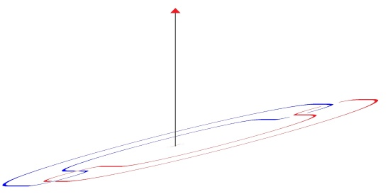

<!-- id: s22-10-0248 -->

Nous pouvons dire par exemple que nous définissons l’un d’entre eux comme étant plus éloigné du point sur la droite dont nous partirions comme point de vue, et qu’il y a quelque chose d’externe qui...

<!-- id: s22-10-0249 -->

> comme vous le voyez, du fait de la loi qu’ont mis en valeur Soury et Thomé,
>
> concernant le nœud de ces deux cercles ...est d’un côté *dextro­gyre*, si nous définissons la *dextro­gyrie* par le fait que le plus externe passe au-dessus de la bande du cercle, du rond de ficelle, et qu’il y en a un autre qui de ce fait, passe au-dessus également, puisque c’est ainsi que nous définirions la gyrie, mais il se trouve être dans un sens différent au regard du cercle.

<!-- id: s22-10-0250 -->

Il y a donc à ce cercle deux orientations, celle-ci et celle-là, celle-ci *dextrogyre*, celle-ci *lévogyre*.

<!-- id: s22-10-0251 -->

Nous sommes incapables de dire laquelle est *dextro*, laquel­le est *lévo*, nous sommes incapables de *la transmettre dans un message* : aucune manipulation du nœud à 3...

<!-- id: s22-10-0252 -->

> je l’ai essayée pour avoir eu l’espoir que le nœud borroméen nous donnerait peut-être ça, ...aucune manipulation du nœud à 3, ne donne sans ambiguïté la définition de *lévo*, ou du *dextro*.

<!-- id: s22-10-0253 -->

Nous nous trouverons toujours devant cette situation d’avoir deux *gyries*, mais que de les définir par le fait que *la bande la plus externe passe sur l’autre bande*, et que c’est ça qui devrait donner l’orientation, échoue toujours.

<!-- id: s22-10-0254 -->

Puisque, vous le voyez là, si nous définissons le fait que la bande la plus externe passe sur l’autre, nous nous trouvons devant une *ambiguïté* :

<!-- id: s22-10-0255 -->

- est-­ce *celle-ci*,

<!-- id: s22-10-0256 -->

- est-ce *celle-là* ?

<!-- id: s22-10-0257 -->

Par contre, l’existence des 2 *gyries* est par là manifestée.

<!-- id: s22-10-0258 -->

Il y a 2 *gyries*, 2 nœuds borroméens orientés, non pas seulement 1, à partir du moment où de l’un des 3, nous fai­sons une droite infinie, en tant que la droite infinie est définie comme non orientable, c’est-à-dire que nous avons la différence avec ce sur quoi ont raisonné à juste titre Soury et Thomé.

<!-- id: s22-10-0259 -->

C’est à savoir : il y a 3 *centrifuges* : nous allons mettre un petit *e* pour dire centrifuge, allant vers l’*e*xtérieur : 3*e*...

<!-- id: s22-10-0260 -->

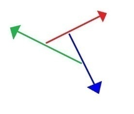

<!-- id: s22-10-0261 -->

...il y a 3 *centripètes* : 3*i*...

<!-- id: s22-10-0262 -->

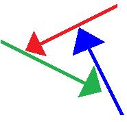

<!-- id: s22-10-0263 -->

...il peut y avoir 1*i* et 2*e*, 1*e* et 2*i*.

<!-- id: s22-10-0264 -->

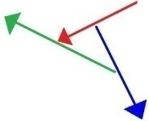 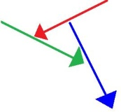

<!-- id: s22-10-0265 -->

Ces diverses spécifications sur lesquelles s’appuient Soury et Thomé, pour démontrer qu’il n’y a qu’un seul nœud orienté.

<!-- id: s22-10-0266 -->

Si nous avons une droite, une barre sans orientation, nous avons alors : 1 *0*, 1 *i*, 1 *e*.

<!-- id: s22-10-0267 -->

Et c’est à partir de là que ne devient pas semblable l’ordre, à savoir qu’il y ait :

<!-- id: s22-10-0268 -->

- un sans orientation,

<!-- id: s22-10-0269 -->

- un à direction centri­fuge vers l’extérieur,

<!-- id: s22-10-0270 -->

- un à direction centripète vers l’intérieur. 1*0*, 1*i*, 1*e* 1*0*, 1*e,* 1*i*

<!-- id: s22-10-0271 -->

Ceci a de l’intérêt, puisque pour leur démonstration, ils sont partis de la notion du « *même* », à savoir que réduisant *toutes les pro­jections*, *toutes les mises à plat* qu’ils ont faites, ils ont démontré que de ces diverses *mises à plat* résultait le fait que c’était *le même*, si je puis dire, de tous les points de vue de *mises à plat*.

<!-- id: s22-10-0272 -->

Mais il suffit qu’un...

<!-- id: s22-10-0273 -->

> pris d’ailleurs : du « non point de vue » ...ex-siste, pour qu’il démontre les orientations, à savoir le nœud borroméen en tant qu’orien­té comme étant 2.

<!-- id: s22-10-0274 -->

Il n’est certes pas orienté, le nœud, ceci du fait que les trois le sont.

<!-- id: s22-10-0275 -->

Si un des trois ne l’est pas, et il suffit pour cela qu’il soit *colorié*, ce qui veut dire *identique à lui-même,* ceci rend compré­hensible qu’il y en ait 2 dès qu’il est, soit colorié, soit désorienté, ce qui le distingue.

<!-- id: s22-10-0276 -->

Il y en avait déjà 2 pour peu qu’1 seul se spécifie.

<!-- id: s22-10-0277 -->

Cette remarque consiste à dire qu’1 seul nœud colorié suffit à être l’équivalent du fait qu’1 des nœuds n’est pas orienté.

<!-- id: s22-10-0278 -->

Le mot « *orientable* »...

<!-- id: s22-10-0279 -->

> qui est dans le vocabulaire de ce qui vous a été distribué

<!-- id: s22-10-0280 -->

...Le mot «*orientable* » veut déjà dire qu’il y a 2 *orientations*.

<!-- id: s22-10-0281 -->

Le nœud certes, pourrait les résorber ces orientations entre elles, mais il ne les résorbe pas dès lors que sur l’un des éléments du nœud on fait cette chose de le distinguer par le fait qu’il n’est pas orientable, c’est-à­-dire qu’on le transforme en *une droite*.

<!-- id: s22-10-0282 -->

Je - non pas *propose* - mais je crois avoir suffisamment indiqué ce qu’il en est du nœud comme doublement orienté, et que c’est cela seul qui explique, par le rapprochement que j’ai fait avec le *colorié*, qu’un de ces nœuds soit, du fait de ne pas être orientable, de ce fait-même colorié, impose qu’il y a 2 nœuds, et c’est bien pour cela que le « *colorié et orienté* » à la fois, cela fait 2.

<!-- id: s22-10-0283 -->

Sans doute viendra-t-il à la pensée de Thomé et de Soury, que *la mise à plat* - ici - introduit un élément sus­pect.

<!-- id: s22-10-0284 -->

Néanmoins je leur indique ceci, ceci qui est que les mêmes articulations concernant *l’orientation* valent, si ces deux nœuds, si ces deux cercles, nous les dessinons de la façon suivante, que je crois que la perspective indique assez , et qui ne fait aucune référence à l’extériorité d’une des courbes de l’un, par rapport à la courbe de l’autre.

<!-- id: s22-10-0285 -->

Il y en a ni d’externe, ni d’interne avec la seule référence à ces façons spatialisées de dire, mises dans les trois dimensions, de représen­ter les 2 cercles, les cercles qui font cycles, déjà avec cette façon il y a moyen de démontrer qu’il y a 2 nœuds, et non pas un seul orienté, 2 nœuds borroméens à 3 orientés.

<!-- id: s22-10-0286 -->

Voilà, je m’en tiendrai là pour aujourd’hui.

## Notes

[^25]: Cf. Louis Aragon : *Le paysan de Paris*, Gallimard, 1926, Collection Blanche.

[^26]: Cf. séminaire 1960-61 : « *Le transfert dans sa disparité subjective, sa prétendue situation, ses excursions techniques* ». Le Seuil, 2001.

[^27]: Cf. séminaire 1965-66 : « *L’objet de la psychanalyse* », les séances consacrées à l’analyse du tableau de Velasquez : Les Ménines.

[^28]: René Descartes : Œuvres et lettres, Paris, 1953, Gallimard La Pléiade, Règles pour la direction de l'esprit, Règle X, p.70. :

    «...*qu'il faut approfondir tout d'abord les arts les moins importants et les plus simples, ceux surtout où l'ordre règne davantage, comme sont ceux des artisans qui font de la toile*

    *et des tapis, ou ceux des femmes qui brodent ou font de la dentelle...* » Cf supra. note 6.
