# Leçon 11 | 15 Avril 1975

<!-- source-url: http://staferla.free.fr/S22/S22 R.S.I..docx -->
<!-- seminar: s22 -->
<!-- lesson: 11 -->

<!-- id: s22-11-0001 -->

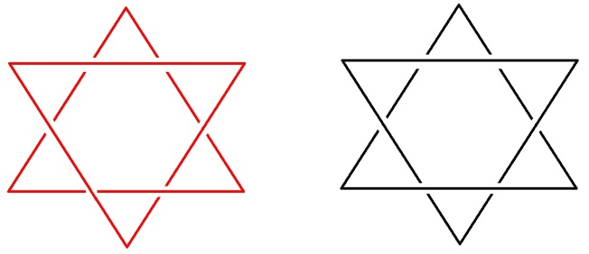

<!-- id: s22-11-0002 -->

J’ai imaginé comme ça ce matin à mon réveil, deux petits dessins dont chacun… les deux qui sont dans le haut tout à droite. J’ai donc imaginé deux petits dessins de rien du tout, vous avez pu voir le mal que j’ai eu simplement à les reproduire.

<!-- id: s22-11-0003 -->

Il s’agit dans ces deux dessins de deux triangles du type le plus ordinaire, enfin ils n’ont même pas des côtés courbes, deux tri­angles qui s’entrecroisent.

<!-- id: s22-11-0004 -->

Il y a quand même...

<!-- id: s22-11-0005 -->

> je pense que ça vous sera sensible pour vous qui regardez ça tel que je l’ai fabriqué ...qu’il y en a deux, ceux de gauche : *les rouges*

<!-- id: s22-11-0006 -->

> c’est pour ça que j’ai mis les autres en noir ...*qui sont noués en chaîne*, qui font à eux deux tous seuls une chaîne, qui sont de ce fait en tout comparables à ce dont je parlerai tout à l’heure : deux tores, dont l’un passerait par le trou de l’autre.

<!-- id: s22-11-0007 -->

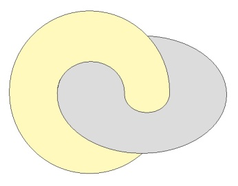

<!-- id: s22-11-0008 -->

Les deux autres ne sont pas noués. Ils peuvent se retirer l’un de l’autre.

<!-- id: s22-11-0009 -->

C’est comme un tore qui serait apla­ti pour jouer, non plus du tout *se nouer,* mais jouer dans le trou de l’autre.

<!-- id: s22-11-0010 -->

Le cas est le même - c’est pour ça que je l’ai mis aussi en noir - pour ces deux triangles qui sont dessinés dessous :

<!-- id: s22-11-0011 -->

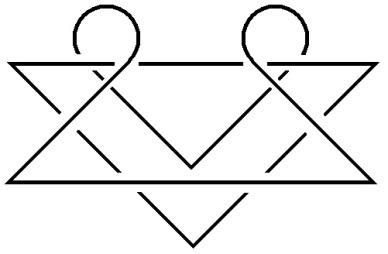 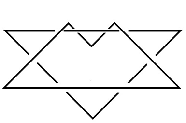

<!-- id: s22-11-0012 -->

à ceci près qu’un de ces tri­angles est en somme plié autour de ce qui se présente comme...

<!-- id: s22-11-0013 -->

> mais bien sûr ça ne veut plus rien dire à ce niveau-là ...un des côtés de l’autre.

<!-- id: s22-11-0014 -->

Je dis « *côtés* » parce qu’on s’imagine qu’un triangle a trois côtés.

<!-- id: s22-11-0015 -->

C’est simplement pour vous mettre dans le bain d’une géométrie, pour vous mettre dans la « *dit-mension* » d’une géométrie qui répugne au mot « *géométrie* ».

<!-- id: s22-11-0016 -->

Et ceci, non pas sans raison, puisque ce n’est pas une géo­métrie, c’en est radicalement distinct.

<!-- id: s22-11-0017 -->

Une *topologie* est ce qui, de départ*,* indique comment ce qui n’est pas noué deux par deux peut néanmoins faire nœud.

<!-- id: s22-11-0018 -->

Nous appelons nœud borroméen ce qui se constitue de façon telle qu’à soustraire un de ces éléments que j’ai là figurés...

<!-- id: s22-11-0019 -->

> je dis « *figurés* » parce que ce n’en est qu’une figure, ce n’en est pas la consistance ...un des éléments que j’ai là figurés, chacun dans les couples de deux que j’ai faits, il suffise de rompre...

<!-- id: s22-11-0020 -->

> qu’est-ce que veut dire « *rompre* » : nous essaierons de le dire tout à l’heure ...qu’il suf­fise de rompre un de ces éléments pour que tous les autres soient égale­ment dénoués de chacun.

<!-- id: s22-11-0021 -->

Et ceci peut se faire pour un nombre aussi grand qu’on peut en *énoncer*.

<!-- id: s22-11-0022 -->

Vous savez qu’il n’y a pas de limite à cette énonciation.

<!-- id: s22-11-0023 -->

C’est en cela qu’il me semble que peut se supporter d’une façon dicible...

<!-- id: s22-11-0024 -->

> terme que je commenterai tout à l’heure ...c’est en cela que peut se supporter le terme de *non-rapport sexuel* : *sexuel* en tant je ne peux que répéter qu’il se supporte essentiellement d’un non-rapport de couple.

<!-- id: s22-11-0025 -->

Est-ce que le nœud en chaîne suffit à représenter le rapport de couple ?

<!-- id: s22-11-0026 -->

Dans un temps où la plupart d’entre vous n’étaient pas à mon séminai­re...

<!-- id: s22-11-0027 -->

> puisque c’était le temps où je faisais surgir ce qu’il en est de la *deman­de* et du *désir* ...j’ai illustré de *deux tores* le lien à faire entre la *deman­de* et le *désir*, *deux tores* c’est-à-dire deux *cycles* orientables.

<!-- id: s22-11-0028 -->

Je vais quand même vous les faire ces deux tores, ou tout au moins vous les indiquer.

<!-- id: s22-11-0029 -->

C’est quelque chose qui commence à se dessiner comme ça...

<!-- id: s22-11-0030 -->

> Vous voyez, en plus on s’embrouille !
>
> Évidemment, je ne suis pas très doué, mais vous l’êtes pas plus que moi, ...voilà comment ça se dessine, si on veut faire quelque chose de complet :

<!-- id: s22-11-0031 -->

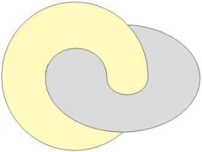

<!-- id: s22-11-0032 -->

Comme j’ai fait là un trait qui est faux, je vais en indiquer qu’il y a sur ce tore, ce tore parti­culier, quelque chose qui, de son tour, vient entrer dans le trou de l’autre tore.

<!-- id: s22-11-0033 -->

C’est en figurant sur chacun de ces tores *quelque chose qui tourne en rond* que j’ai montré ce qui fait enroulement sur celui-ci, se décalque sur l’autre par une série d’enroulements autour du trou central du tore.

<!-- id: s22-11-0034 -->

Qu’est-ce que ça veut dire sinon que la *deman­de* et le *désir* - eux - sont noués ?

<!-- id: s22-11-0035 -->

Ils sont noués dans la mesure où un tore, ça représente un cycle, donc orientable.

<!-- id: s22-11-0036 -->

Vous le savez, parce que quand même vous en avez entendu parler de ça, de ce qui fait la différence des sexes, que ça se situe au niveau de la cellule, et spécialement au niveau du noyau cellulaire ou dans les chro­mosomes qui pour être microscopiques, nous paraissent assurer un niveau défini de *Réel.*

<!-- id: s22-11-0037 -->

Mais pourquoi diable vouloir que ce qui est microscopique soit plus réel que ce qui est macroscopique !

<!-- id: s22-11-0038 -->

Quelque chose d’habitude, différen­cie le sexe qui de chaque espèce, se situe comme mâle de celui qui est le femelle.

<!-- id: s22-11-0039 -->

C’est que dans un cas, il y a un *homozygotisme*, c’est-à-dire un certain gène qui fait la paire avec un autre gène, sans qu’on sache jamais à l’avance comment dans chaque espèce ça se répartit, je veux dire, si c’est le mâle ou la femelle qui est *homozygote*.

<!-- id: s22-11-0040 -->

La différence avec l’autre sexe, c’est que dans l’autre sexe, il y a *hétérozygotisme* quelque part, c’est-à-dire qu’il y a deux gènes qui ne font pas la paire, la paire voulant dire qu’ils sont (*h.o.m.o*) - *homozygotes*, qu’ils sont *semblables*.

<!-- id: s22-11-0041 -->

C’est le cas de donner *tout son poids* à ce dont André Gide dans *Paludes* fait grand état, à savoir du fameux proverbe : « *Numero deus impare gaudet* » [^29], qu’il traduit : « *le numéro deux se réjouit d’être impair* ».

<!-- id: s22-11-0042 -->

Comme je l’ai dit depuis longtemps : il a bien raison !

<!-- id: s22-11-0043 -->

Car rien ne le réali­serait ce 2, s’il n’y avait pas l’impair.

<!-- id: s22-11-0044 -->

Cet impair en tant qu’il com­mence au nombre 3, ce qui, bien entendu, ne se voit pas tout de suite, et ce qui rend nécessaire pour l’étaler au jour des nœuds plus dévelop­pés, nommément ce que j’appelle *le nœud borroméen*.

<!-- id: s22-11-0045 -->

Avec le le nœud borroméen, ce que nous avons à notre portée, c’est ceci pour nous essentiel, crucial pour notre pratique : que nous n’avons aucun besoin du microscope pour qu’apparaisse la raison de ce que j’ai énoncé comme vérité première, à savoir que l’amour est « *hainamo­ration* ». Pourquoi l’amour n’est pas « *velle bonum alicui »,* comme l’énonce Saint Augustin [^30], si le mot *bonum* a le moindre support, c’est-à-dire s’il veut dire *le* *bien-être* ?

<!-- id: s22-11-0046 -->

Non pas certes qu’à l’occasion l’amour ne se préoccupe pas un petit peu - le minimum - du *bien-être* de l’autre, mais il est clair qu’il ne le fait que jusqu’à une certaine limite, dont je n’ai rien trouvé de mieux jusqu’à ce jour que *le nœud borroméen* pour, cette limite, la représenter.

<!-- id: s22-11-0047 -->

« La représenter » : entendez bien qu’il ne s’agit pas d’une figure, d’une représentation, il s’agit de poser que c’est le *Réel* dont il s’agit, que cette limite n’est conce­vable que dans les termes d’*ex-sistence* qui...

<!-- id: s22-11-0048 -->

> pour moi, dans mon voca­bulaire, ma nomination à moi ...veut dire le jeu, le jeu permis à l’un des *cycles*, à l’une des consistances, permis par le nœud borroméen.

<!-- id: s22-11-0049 -->

À par­tir de cette limite, l’amour s’obstine...

<!-- id: s22-11-0050 -->

> parce qu’il y a du *Réel* dans l’affai­re ...l’amour s’obstine à tout le contraire du bien-être de l’autre.

<!-- id: s22-11-0051 -->

C’est bien pourquoi j’ai appelé ça l’« *hainamoration »*, avec le vocabulaire substantifié de l’*écriture* dont je le supporte.

<!-- id: s22-11-0052 -->

Cette notion de limite implique donc une oscillation, un *oui* ou *non,* c’est

<!-- id: s22-11-0053 -->

- « *vouloir le bien de quelqu’un* »,

<!-- id: s22-11-0054 -->

- ou vouloir strictement le contraire.

<!-- id: s22-11-0055 -->

C’est tout de même quelque chose qui nous suggère l’idée d’une sinusoï­de.

<!-- id: s22-11-0056 -->

Alors, comment est-elle cette sinusoïde ?

<!-- id: s22-11-0057 -->

S’il y a une limite, c’est un cercle et la sinusoïde, c’est comme ça :

<!-- id: s22-11-0058 -->

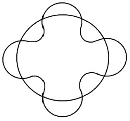

<!-- id: s22-11-0059 -->

Est-ce que cette sinusoïde s’enroule, est-ce qu’elle fait nœud ou non, à être enroulée ou pas ?

<!-- id: s22-11-0060 -->

C’est la question que pose la notion de « *consis­tance »*, plus *nodale* si je puis dire, que celle de « ligne », puisque *le nœud y est sous-jacent*.

<!-- id: s22-11-0061 -->

Il y a pas de consistance qui ne se supporte du nœud.

<!-- id: s22-11-0062 -->

C’est en cela que - du *nœud* - l’idée même de *Réel* s’impose.

<!-- id: s22-11-0063 -->

Le *Réel* est caractérisé de se nouer.

<!-- id: s22-11-0064 -->

Encore, ce nœud, faut-il le faire.

<!-- id: s22-11-0065 -->

La notion de l’inconscient se supporte de ceci :

<!-- id: s22-11-0066 -->

- que ce nœud, non seu­lement on le trouve déjà fait,

<!-- id: s22-11-0067 -->

- mais on se trouve *fait* en un autre accent du terme : « *On est fait* ! ».

<!-- id: s22-11-0068 -->

*On est fait* de cet acte x par quoi le nœud est déjà fait.

<!-- id: s22-11-0069 -->

Il n’y a pas d’autre définition à mon sens, possible de l’inconscient : *l’inconscient, c’est le Réel*... je mesure mes termes, si je dis *c’est le Réel en tant qu’il est troué*, je m’avance.

<!-- id: s22-11-0070 -->

Je m’avance un petit peu plus que j’en ai le droit, puisqu’il n’y a que moi encore qui le dis, bien­tôt tout le monde le répétera, et à force qu’il pleuve dessus, ça finira par faire un très joli fossile. Mais en attendant, c’est du neuf !

<!-- id: s22-11-0071 -->

Mais jusqu’à présent, il n’y a que moi qui ai dit « *qu’il n’y avait pas de rapport sexuel* », et que ça faisait *trou* en un point de l’être, du *parlêtre*. Le *parlêtre*, c’est pas répandu hein !

<!-- id: s22-11-0072 -->

Mais quand même, c’est comme la moisissure, ça a tendance à l’expansion.

<!-- id: s22-11-0073 -->

Alors, contentons de dire que *l’inconscient c’est le Réel en tant qu’il est affligé*...

<!-- id: s22-11-0074 -->

> *Vous vous en allez ? Vous avez bien raison ! Comment est-ce qu’on peut supporter ce que je raconte*... ...*que l’inconscient, c’est le Réel en tant que chez le parlêtre, il est affligé de la seule chose - chose j’ai dit - qui fasse trou*, qui du *trou* nous assure, c’est ce que j’appelle le *Symbolique*, en l’incarnant dans le *signifiant* [^31], dont en fin de compte il n’y a pas d’autre définition : que c’est ça le *trou*, le signifiant fait *trou*.

<!-- id: s22-11-0075 -->

C’est en ça, je l’avance, je l’ai déjà dit : le nœud n’est pas un « modèle ».

<!-- id: s22-11-0076 -->

Non seulement ce qui fait nœud n’est pas *Imaginaire*, n’est pas une *représentation*, mais sa caractéristique est justement ceci...

<!-- id: s22-11-0077 -->

> c’est en ça que ça échappe à une *représentation*, et que je vous assure que c’est pas de faire des grimaces, qu’à chaque fois que j’en représente un, je fais un trait de travers. Je pense que, comme je me crois pas moins imaginatif qu’un autre, ça démontre déjà à quel point le nœud, ça nous répugne comme modèle …il n’y a pas d’affinité du *corps* avec le *nœud*, même si dans le corps, les trous ça joue, *pour les analystes*, une *sacrée fonction*.

<!-- id: s22-11-0078 -->

Le nœud n’est pas le modèle, il est le support.

<!-- id: s22-11-0079 -->

Il n’est pas *la réalité*, il est *le Réel*.

<!-- id: s22-11-0080 -->

Ce qui veut dire que s’il y a une distinction entre *le Réel* et *la réalité*, c’est le nœud, non pas qui en donne le modèle...

<!-- id: s22-11-0081 -->

jusqu’à ce que bien entendu - *la fossilisation* arrivant - vous passiez votre temps à faire des nœuds entre vos doigts, *c’est souhaitable* : ça vous suggérerait un peu plus d’ingéniosité.

<!-- id: s22-11-0082 -->

En rabattant l’inconscient sur le *Symbolique* - c’est-à-dire sur *ce qui du signifiant fait trou -* je fais quelque chose, mon Dieu, qui se jugera à son effet, à sa fécondité. Ça me paraît s’imposer de notre pratique même, qui est loin de pouvoir se contenter d’une référence obscure à *l’instinct*, comme on s’obstine à traduire en anglais le mot *Trieb.*

<!-- id: s22-11-0083 -->

*L’instinct* a son émergence, et qui bien entendu, est *immémoriale*.

<!-- id: s22-11-0084 -->

Mais comment même savoir ce que ça pouvait vouloir dire avant Fabre, qui ne le supporte que d’une chose : comment diable un petit insecte peut-il savoir...

<!-- id: s22-11-0085 -->

> car, ce savoir on le constate à la précision de ses gestes ...comment il faut, en tel point du corps de tel autre insecte, en telle jointure, en plus puisqu’il s’agit d’insecte en se filant en-dessous de ce qu’on appelle carapace, et qui bien sûr, n’est que mythologie figurative parce qu’il faut bien que quelque part il y ait quelque chose à percer*,* pour atteindre tel point précis de ce que nous savons maintenant qui vient de l’*ectoderme*, à savoir la partie invaginée qu’on appelle système nerveux, et là rompre quelque chose qui fait que l’autre insecte sera bon à être mis en conserve.

<!-- id: s22-11-0086 -->

Qu’est-ce que c’est que ce *savoir* ?

<!-- id: s22-11-0087 -->

Quel intérêt y a-t-il, en quoi c’est-il explicatif, de le transporter dans un comportement qui est celui que nous voyons de l’être humain, tous les jours, et qui manifestement n’a aucun savoir instinctuel, qui voit pas plus loin que le bout de son nez, mais qui lui aussi, d’une autre source, se trouve savoir faire des tas de machins, et nommément, enfin « *sait faire* », c’est une façon de parler, dire « *qu’il sait faire l’amour »*, c’est probablement très exagéré.

<!-- id: s22-11-0088 -->

Ça pousse quand même à cette idée...

<!-- id: s22-11-0089 -->

> je l’ai énoncée, bien sûr parce que moi je m’aventure comme ça ...ça pousse à cette idée que...

<!-- id: s22-11-0090 -->

> celle à laquelle j’en suis venu comme ça, par petits pas ...que *le Réel* c’est pas tout, et quand je dis que c’est pas tout, ça met beaucoup de choses en cause.

<!-- id: s22-11-0091 -->

Étant donné que du même coup ça implique que la science, ben c’est peut-être que *des petits bouts de ce Réel* qu’elle arrache, qu’elle arrache manifestement jusqu’à présent avec l’idée d’*univers*, qui lui est, il semble bien, indispensable - mais pour ­quoi ? - pour ce qu’elle arrive à *assurer*, à rendre sûr.

<!-- id: s22-11-0092 -->

Manifestement elle arrive à rendre *sûres* certaines choses quand il y a « *nombre* ».

<!-- id: s22-11-0093 -->

Et ça, c’est vraiment toute l’affaire : comment se fait-il que le langage véhicule un certain nombre de *nombres* ?

<!-- id: s22-11-0094 -->

Pour qu’on en soit arrivé à qualifier de *nombres réels* des nombres proprement insaisissables et qui ne se définis­sent pas autrement, à savoir :

<!-- id: s22-11-0095 -->

- qu’ils ne sont pas dans la série,

<!-- id: s22-11-0096 -->

- qu’ils ne peuvent même pas y être,

<!-- id: s22-11-0097 -->

- qu’ils en sont fondamentalement exclus, ...ça en dit long sur le sujet de savoir comment ces nombres 1, 2, 3, 4... ont bien pu venir à l’idée.

<!-- id: s22-11-0098 -->

Moi, j’ai pris un certain parti, poussé par - par quoi ? - je ne dirai pas par « *mon expérience »* parce qu’une expé­rience ça ne veut rien dire qu’une chose, c’est à savoir qu’on s’y engage, et je vois pas pourquoi mon engagement serait préférable.

<!-- id: s22-11-0099 -->

Si j’étais le seul par exemple, tout ce que je dirais n’aurait aucune portée, c’est bien parce qu’il y a quelque chose que j’essaie de situer sous la forme, sous les espèces du *discours analytique*, à savoir :

<!-- id: s22-11-0100 -->

- que je suis pas seul à faire cette expérience,

<!-- id: s22-11-0101 -->

- que grâce au fait que je suis comme tout le monde, je suis parlêtre,

<!-- id: s22-11-0102 -->

- que grâce à ce fait je suis amené à formuler ce qui peut rendre compte de ce *discours analytique*, d’une certaine façon.

<!-- id: s22-11-0103 -->

Il y a quelqu’un qui...

<!-- id: s22-11-0104 -->

> on m’a rapporté ça comme ça, c’est un connard de la plus belle eau ...il a dit que ma théorie, elle était morte.

<!-- id: s22-11-0105 -->

Elle est pas encore si morte que ça, elle finira bien par le devenir, avec l’encroûtement dont je parlais tout à l’heure.

<!-- id: s22-11-0106 -->

En atten­dant, le type qui évidemment n’est pas de mon bord, ça fait partie des types qui parlent...

<!-- id: s22-11-0107 -->

> ils parlent... ils parlent... ils savent pas ce qu’ils disent ...qui parlent de « *réalité psychique* ». Oui !

<!-- id: s22-11-0108 -->

Moi j’appellerai pas quoique ce soit d’un terme pareil, parce que la *psyché*, juste­ment c’est ce que tout le monde essaie d’éviter. Ça fait des difficultés incroyables, *ça entraîne un monde de* *suppositions, ça suppose tout, ça suppose Dieu en tout cas* : où est-ce qu’il y aurait de l’âme s’il n’y avait pas de Dieu ?

<!-- id: s22-11-0109 -->

Et si Dieu en plus ne nous avait pas expressément créés pour en avoir une ?

<!-- id: s22-11-0110 -->

C’est inéliminable de toute psychologie.

<!-- id: s22-11-0111 -->

Ce que je fais, ce que j’essaie tout au moins de faire, c’est de parler d’une réalité opératoire.

<!-- id: s22-11-0112 -->

Naturellement c’est beaucoup plus court, mais ça s’impose me semble-t-il, du fait que la simple parole, le *bla*-*bla*, le *bla*-*bla* de mon connard de tout à l’heure, qui dit que ma théorie est morte, enfin il ne sait littéralement pas ce qu’il dit, ça veut dire qu’il ne fait que parler, il *bla*-*blate*, et je suis sûr que dans ses analyses, ça opère.

<!-- id: s22-11-0113 -->

Ça opère avec une certaine limitation, bien sûr, mais je suis sûr que ça fonctionne, sans ça il continuerait pas à être analyste, même la paro­le de ceux qui croient à « *la réalité psychique* » opère. *Ouais*...

<!-- id: s22-11-0114 -->

Malgré vous, pour vous, et c’est ça que j’aimerais un petit peu vous faire saisir, c’est que pour vous...

<!-- id: s22-11-0115 -->

> pour vous, si simplement vous éprouvez un peu les choses ...*la structure du monde*...

<!-- id: s22-11-0116 -->

> si je puis m’exprimer ainsi pour parler de ce qui est *immonde* ...*la structure du monde*...

<!-- id: s22-11-0117 -->

> je vous prie de tâcher de saisir les points, les points où vous pouvez saisir ...que pour vous, *la structure du monde* *consiste à vous* *payer de mots*.

<!-- id: s22-11-0118 -->

Et que c’est même en quoi le monde est plus futile...

<!-- id: s22-11-0119 -->

> je veux dire qu’il *fuit* ...est plus futile que le *Réel*, ce *Réel* que j’essaie de vous suggérer, dans sa *dit-mansion*...

<!-- id: s22-11-0120 -->

> *dit* (*d.i.t*), *mansion* : demeure du *dit* ...que j’essaie de vous faire saisir par ce *dit* qui est le mien, à savoir par mon *dire*.

<!-- id: s22-11-0121 -->

C’est fou ce qu’on fait de bruit autour de cette histoire psychanalytique, et ce qu’on lit mal.

<!-- id: s22-11-0122 -->

Il y a des gens très sérieux qui s’occupent du rêve chez l’animal.

<!-- id: s22-11-0123 -->

Ils peuvent pas bien sûr, il n’y a aucun moyen de savoir si l’animal rêve, mais ils savent qu’il en a toutes les apparences.

<!-- id: s22-11-0124 -->

L’animal dort, et puis il est manifeste que s’il se remue c’est parce qu’il y a quelque chose qui le traverse, et comme bien sûr, naturellement personne ne doute que les idées ce soient des images, rien de plus, ça veut même dire ça.

<!-- id: s22-11-0125 -->

Enfin, ce qu’il y a de merveilleux c’est que le langage est toujours là comme un témoin.

<!-- id: s22-11-0126 -->

Alors, il y a des images donc il a des idées, ce qui ne veut pas dire qu’il les *nomme*.

<!-- id: s22-11-0127 -->

Alors, il y a des types comme ça qui s’excitent autour de l’idée que le rêve c’est pas là, comme le dit Freud, pour protéger le sommeil. L’ennui, c’est que Freud dit pas ça.

<!-- id: s22-11-0128 -->

Le sommeil ça ne peut avoir - en soi, en tant que som­meil - désigné que ce qu’on appelle un *besoin*, le *besoin de dormir*.

<!-- id: s22-11-0129 -->

Ce que Freud dit, c’est que le rêve chez le parlêtre...

<!-- id: s22-11-0130 -->

> parce que lui il n’a pas expérimenté sur les rats, ni sur quoi que ce soit dont nous ayons des preuves qu’il rêve. Personne ne sait si une mouche rêve, ni un rat, on peut se l’imaginer parce que on est tous un petit peu *rat*
>
> par quelque côté, on est surtout *raté* \[*Rires*\] ! Et les expérimentations en question le sont plus que les autres,
>
> ils sont *ratifiés*, ce sont des « *hommes-aux-rats* » \[*Rires*\]. Enfin, on est habité par des tas d’*hommes-aux-rats*,
>
> quand on est homme. En tout cas on a les *hommes-aux-rats*  de la science

<!-- id: s22-11-0131 -->

...Freud dit que le rêve protège *-* pas le besoin *-* *le désir de dormir*.

<!-- id: s22-11-0132 -->

Il est bien certain que cette seule *dit-mansion* ajoute à ce *Réel* falot, supposé scientifique, on imagine des besoins.

<!-- id: s22-11-0133 -->

Mais par contre, s’il y a une chose que Freud fait bien sentir...

<!-- id: s22-11-0134 -->

> et ça il faudrait suivre le texte, et s’apercevoir que lui, il sait ce qu’il dit ...c’est que le rêve protè­ge quelque chose qui s’appelle *un désir*.

<!-- id: s22-11-0135 -->

Or un désir n’est pas concevable sans mon nœud borroméen.

<!-- id: s22-11-0136 -->

Ça c’est simplement une remarque, par quoi j’essaie de montrer que mon dire est quand même - lui - orienté.

<!-- id: s22-11-0137 -->

Et qu’à dire que ce que je dis n’est que conditionné que par le fait que...

<!-- id: s22-11-0138 -->

> *je ne dirai pas que la parole agit dans le discours analytique* ...que la parole seule agit.

<!-- id: s22-11-0139 -->

*« Im Anfang war die Tat »* qu’il dit l’autre \[Goethe : *Faust*, I,3\], et il croit qu’il a fait là une invention...

<!-- id: s22-11-0140 -->

> oui enfin... c’est pas si mal ...il croit que c’est contradictoire avec *das Wort,* mais s’il y a pas de *das Wort* avant la *die Tat,* il y a pas de *« Tat »* du tout.

<!-- id: s22-11-0141 -->

Alors que l’analyse saisisse un point, bien sûr très limité, un point très limité où la parole a une *Wirklichkeit.*

<!-- id: s22-11-0142 -->

Bien sûr, elle fait ce qu’elle peut - elle en peut peut-être pas des tas - mais enfin c’est quand même un fait, un fait d’autant plus exemplaire que ça nous donne l’espoir d’avoir une petite lumière sur ceci qui est manifeste, qu’il n’y a pas d’action qui ne s’enra­cine - je ne dirai même pas dans la parole - dans le « *ouah-ouah* », dans *das Wort.*

<!-- id: s22-11-0143 -->

*Das Wort* c’est ça, c’est de faire « *ouah-ouah* ».

<!-- id: s22-11-0144 -->

Seul l’inconscient permet de voir comment il y a un savoir, non dans le *Réel*, c’est déjà beaucoup qu’il \[le savoir\] soit supporté de ce *Symbolique* que j’ai essayé de vous faire sentir comme concevable...

<!-- id: s22-11-0145 -->

> non pas à la limite, mais *par* la limite ...comme étant fait d’une *consistance* exigible pour le trou, et l’imposant de ce fait.

<!-- id: s22-11-0146 -->

Le *Symbolique*, c’est certain, tourne en rond, et il ne consiste que dans le trou qu’il fait.

<!-- id: s22-11-0147 -->

Alors tout ce qu’on a dit de l’instinct, ça ne veut dire que ceci : c’est qu’il a fallu qu’on aille à du *Réel*...

<!-- id: s22-11-0148 -->

> à du *Réel supposé* ...qu’on aille à du *Réel* pour avoir un pressentiment de l’inconscient.

<!-- id: s22-11-0149 -->

Et, au sens où *corps* veut dire *consistance,* l’inconscient dans une pratique *donne corps* à cet instinct.

<!-- id: s22-11-0150 -->

Si nous voulons que *corps* veuille dire *consistance,* il n’y a que l’inconscient à *donner corps* à l’instinct.

<!-- id: s22-11-0151 -->

Bien sûr pourquoi tout ça ne serait-il pas un débat vain entre spécialistes ?

<!-- id: s22-11-0152 -->

Mais enfin, ça supporte un dire, un dire qui pourrait avoir des conséquences si les analystes disaient quelque chose.

<!-- id: s22-11-0153 -->

Mais en dehors des ragots c’est un fait qu’ils disent rien.

<!-- id: s22-11-0154 -->

Vous avez déjà vu quelque chose sortir de l’Institut Psychanalytique de Paris, par exemple ?

<!-- id: s22-11-0155 -->

Quelque chose de lisible, c’est quand même drôle.

<!-- id: s22-11-0156 -->

Vous me direz qu’il y a mon École. Bien sûr que mon École, je viens d’en avoir une expérience dans les « Journées » qui m’ont même... c’est ça qu’il y a de merveilleux : qu’est-ce que c’est que la fatigue !

<!-- id: s22-11-0157 -->

Pourtant j’étais tout heureux, j’étais là comme un poisson dans l’eau.

<!-- id: s22-11-0158 -->

Tout le monde disait des choses qui prouvaient qu’on m’avait lu, et je n’en revenais pas.

<!-- id: s22-11-0159 -->

Non seulement qui prouvaient qu’on m’avait lu, mais même ma foi qu’on était capable d’en sortir des pseu­dopodes qui prouvaient que mon dire se prolongeait même !

<!-- id: s22-11-0160 -->

Je veux dire d’en tirer un certain nombre de conséquences et qui n’étaient pas rien du tout.

<!-- id: s22-11-0161 -->

Parce qu’il ne faut pas vous figurer que parce que quand ici je les interroge, ils ne mouftent pas...

<!-- id: s22-11-0162 -->

> ils ne mouftent pas pour des raisons qui tiennent à la fonction du *dire*,
>
> qui tiennent à l’*ex-sistence*, c’est-à-dire au nœud, en fin de compte ...mais ça *ex-sistait* rudement bien dans ces *journées*.

<!-- id: s22-11-0163 -->

Moi j’ai naturellement tendance à penser que ce que je dis, à savoir ce discours fondé sur un trou, seul trou qui soit sûr, trou constitué par le *Symbolique*. Car il y a une chose dont la démonstration...

<!-- id: s22-11-0164 -->

> tout ce qui est là au tableau est fait pour en faire la démonstration ...un trou, pour peu qu’il soit consistant c’est-à-dire cerné \[*ici en rouge*\]*,* un trou suffit pour nouer un nombre strictement indéfini de consistances, et que ça commence à 2 \[*ici les 2 droites infinies* A *et* B\] ...

<!-- id: s22-11-0165 -->

> comme le manifeste ce nœud borroméen qui est ici :

<!-- id: s22-11-0166 -->

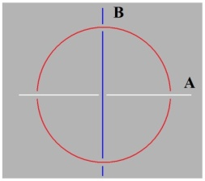

<!-- id: s22-11-0167 -->

...que ça commence à 2 en donne l’assurance. C’est en quoi le 2 ne se supporte que du trou fondamental du nœud.

<!-- id: s22-11-0168 -->

Chose frappante : le 4, à savoir comment il se fait qu’un trou, celui-ci par exemple :

<!-- id: s22-11-0169 -->

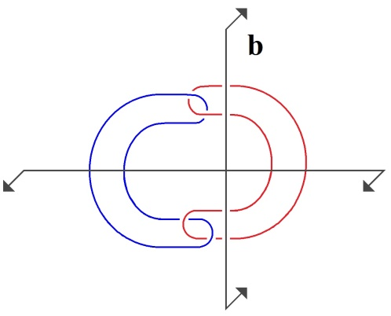 → 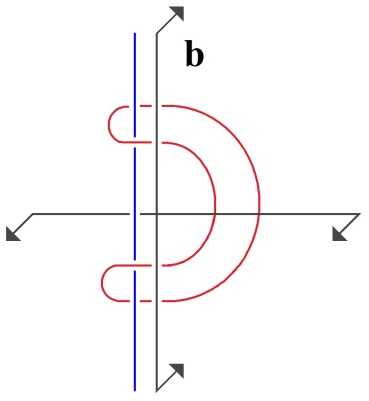

<!-- id: s22-11-0170 -->

suffise à nouer 3 consistances que vous pouvez faire rectilignes, car il est clair qu’ici je puis réduire cette boucle \[*en bleu*\] à être parallèle à celle qui est ici et que dans l’occasion j’ai désignée de petit b.

<!-- id: s22-11-0171 -->

Un trou cerné d’une consistance, pourquoi lui donnai-je ce privilège de mettre en valeur la 1ère fois que ce n’est pas au 2 que ça se limite que le trou en fasse nœud. C’est que le couple est toujours dénouable à lui tout seul, à moins qu’il ne  soit noué par le *Symbolique*. \[*S-R*, *S-I* \]

<!-- id: s22-11-0172 -->

J’avais avancé ça comme je pouvais, dans un temps, enfin – on me l’a rappelé récemment – dans mon *discours* dit *de Rome*, celui auquel finalement je traîne un peu pour donner une répétition \[*i.e.* « La 3ème », 1-11- 1974\], j’ai parlé de « *la parole pleine »*. Évidemment c’était pas mal, quoique ce fût ce que valent les paroles, à savoir un air de sansonnet.

<!-- id: s22-11-0173 -->

*La parole pleine*, si tant est qu’elle supporte ce qui fait nœud dans le « *tu es ma femme* », j’ai tout de même un petit peu montré, parce que je l’ai dit depuis, bien sûr, je l’ai pas mis tout de suite comme ça parce que j’avais sur le râble Lagache et Favez-Boutonnier, enfin vous vous rendez-compte si j’avais dit « *tuer ma femme* » ?

<!-- id: s22-11-0174 -->

Ça aurait fait mauvais effet et j’y regarde à deux fois...

<!-- id: s22-11-0175 -->

> je ne manque pas de tout bon sens ...j’y regarde à deux fois avant de faire mauvais effet.

<!-- id: s22-11-0176 -->

Quelqu’un m’a demandé récemment au nom de quoi le *« Jury d’Accueil »* procédait, pour allonger sa main bénéfique sur un certain nombre de gens dans l’École.

<!-- id: s22-11-0177 -->

C’est simplement ça :

<!-- id: s22-11-0178 -->

- ils ne feront pas mauvais effet,

<!-- id: s22-11-0179 -->

- ils ne feront pas mauvais effet tout de suite,

<!-- id: s22-11-0180 -->

- ils le feront plus tard quand ils auront pris de la bouteille, conquis un peu d’autorité.

<!-- id: s22-11-0181 -->

Bon, ben le couple, bien sûr qu’il est dénouable quelles que soient les paroles pleines qui l’ont fondé.

<!-- id: s22-11-0182 -->

Ce que l’analyse démontre d’une façon tout à fait sensible, c’est qu’il est *malgré ça* noué.

<!-- id: s22-11-0183 -->

Il est noué par quoi, hein ? Par le *trou*. Par *l’interdit de l’inceste*.

<!-- id: s22-11-0184 -->

Oui, il y a pas tellement de gens qui ont mis ça en valeur.

<!-- id: s22-11-0185 -->

Il faut tout de même le dire, dans la religion juive, il y avait un truc quand même que je voulais vous dire là au passage : pourquoi est ce qu’ils n’ont pas bonne presse ces juifs ?

<!-- id: s22-11-0186 -->

Ben, je vous mets ça dans votre poche, parce que ça remet les choses au point.

<!-- id: s22-11-0187 -->

C’est parce qu’ils sont pas *gentils*. \[*Rires*\]

<!-- id: s22-11-0188 -->

S’ils étaient *gentils*, ben ils seraient pas juifs quoi. Ça arrangerait tout !

<!-- id: s22-11-0189 -->

L*’interdit de l’inceste*, il y a quand même des gens qui sont parvenus à faire émerger ça dans des mythes, et même les Hindous, eux sont après tout vraiment les seuls qui ont dit qu’il fallait...

<!-- id: s22-11-0190 -->

quand on avait couché avec sa mère - qu’on s’en aille...

<!-- id: s22-11-0191 -->

> je ne sais plus... vers l’Orient ou vers le Couchant... je crois que c’est vers le Couchant \[*Rires*\] ...vers le Couchant avec sa propre queue dans ses dents, après l’avoir tranchée bien entendu !

<!-- id: s22-11-0192 -->

Nous ne considérons pas le fait de *l’interdit de l’inceste* comme historique.

<!-- id: s22-11-0193 -->

Il est bien entendu historique, mais il faut tellement le chercher dans l’histoire que, comme vous voyez, j’ai fini par trouver ça que chez les Hindous, et on peut dire que là on en tient un bout...

<!-- id: s22-11-0194 -->

C’est pas historique, c’est structural.

<!-- id: s22-11-0195 -->

C’est structural, pourquoi ?

<!-- id: s22-11-0196 -->

Parce qu’il y a le *Symbolique*.

<!-- id: s22-11-0197 -->

Ce qu’il faut arriver à bien concevoir c’est que *c’est le trou du Symbolique en quoi consiste cet interdit*.

<!-- id: s22-11-0198 -->

Il faut du *Symbolique* pour qu’apparaisse, individualisé dans le nœud, ce *quelque chose*...

<!-- id: s22-11-0199 -->

> que moi je n’appelle pas tellement le complexe d’Œdipe, c’est pas si complexe que ça ...j’appelle ça le *Nom-du-Père*, ce qui ne veut rien dire que *le Père comme Nom*...

<!-- id: s22-11-0200 -->

> ce qui veut rien dire au départ ...non seulement *le Père comme Nom*, mais *le Père comme Nommant*.

<!-- id: s22-11-0201 -->

Ça, on ne peut pas dire que là-dessus les juifs soient pas gentils.

<!-- id: s22-11-0202 -->

Ils nous ont bien expliqué que c’était le Père, le Père qu’ils appellent, un Père qu’ils foutent en un point de *trou* qu’on ne peut même pas imaginer :

<!-- id: s22-11-0203 -->

> « *je suis ce que je suis* »

<!-- id: s22-11-0204 -->

Ça c’est *un trou*, non ?

<!-- id: s22-11-0205 -->

Ben c’est de là que par un mouve­ment inverse, car un trou ça - si vous en croyez mes petits schèmes -

<!-- id: s22-11-0206 -->

- *un trou ça tourbillonne,*

<!-- id: s22-11-0207 -->

- *ça engloutit plutôt,*

<!-- id: s22-11-0208 -->

- *puis il y a des moments où ça recrache.*

<!-- id: s22-11-0209 -->

*Ça recrache quoi ?*

<!-- id: s22-11-0210 -->

- *le Nom,*

<!-- id: s22-11-0211 -->

- *c’est le Père comme Nom.*

<!-- id: s22-11-0212 -->

Évidemment, il faut quand même avoir une petite idée de ce que ça comporte, à savoir que *l’interdit de l’inceste* ça se propage.

<!-- id: s22-11-0213 -->

Ça se pro­page du côté de la castration, comme les autres gentils - enfin là, les Grecs - nous l’ont tout de même bien montré dans un certain nombre de mythes, à savoir que là où ils ont fait une généalogie uniquement fondée sur le Père : Ouranos, Chronos, *et patati et patata*... jusqu’au moment où Zeus, après avoir beaucoup fait l’amour, s’évanouit - s’évanouit devant quoi ? - devant un souffle...

<!-- id: s22-11-0214 -->

Il y a quand même un pas de plus à faire, sans quoi on ne comprend rien au lien de cette castration avec *l’interdit de l’inceste,* c’est de voir que *le lien* c’est ce que j’appelle « *le non-rapport sexuel »*.

<!-- id: s22-11-0215 -->

Quand je dis *le Nom-du-Père*, ça veut dire qu’*il peut y en avoir* - comme dans le nœud borroméen *- un nombre indéfini*.

<!-- id: s22-11-0216 -->

C’est ça le point vif.

<!-- id: s22-11-0217 -->

C’est que ce nombre indéfini *en tant qu’ils sont noués tout repose sur Un.*

<!-- id: s22-11-0218 -->

*Sur Un : <u>en tant que trou, il communique sa consistance à tous les autres</u>*.

<!-- id: s22-11-0219 -->

D’où le fait que vous comprenez, l’année où je voulais parler des *Noms-du-père*, j’en aurais quand même parlé d’un peu plus de 2 ou 3 et qu’est-ce que ça aurait fait comme remue-ménage chez les analystes, s’ils avaient eu enfin, toute une série de *Noms-du-père *!

<!-- id: s22-11-0220 -->

Vous pensez bien que j’aurais pas pu en énoncer un nombre indéfini, un petit peu plus de 2 ou 3 que j’avais préparés.

<!-- id: s22-11-0221 -->

Je suis bien content quand même de les laisser secs, à savoir de n’avoir jamais repris ces *Noms-du-père* que comme l’année dernière sous la forme des *Non-dupes*, *des Nons-dupes-qui-z’errent*.

<!-- id: s22-11-0222 -->

Évidemment ils ne peuvent qu’errer, parce que plus il y en aura, plus ils s’embrouilleront, et je me félicite certaine­ment de n’en avoir pas sorti un seul.

<!-- id: s22-11-0223 -->

Mais c’est bien pourquoi je me suis trouvé en fin de ces « *Journées... »* avoir à répondre de quelque chose à laquelle personne, bien sûr, n’avait fait attention dans l’École, à savoir de ce qui constituait ce qu’on appelle « ­*un* *cartel »*.

<!-- id: s22-11-0224 -->

Un *cartel*, pourquoi ? C’est la question que j’ai posée, et - miracle ! - à quoi j’ai obtenu

<!-- id: s22-11-0225 -->

- des réponses indicatives,

<!-- id: s22-11-0226 -->

- des *pseudo­podes* comme je disais tout à l’heure,

<!-- id: s22-11-0227 -->

- des choses qui faisaient un tout petit peu nœud !

<!-- id: s22-11-0228 -->

Pourquoi est-ce que j’ai posé très précisé­ment qu’un *cartel *:

<!-- id: s22-11-0229 -->

- ça part de « *trois plus-une* » personnes, ce qui en principe fait 4,

<!-- id: s22-11-0230 -->

- et que j’ai donné comme maximum ce 5, grâce à quoi ça fait 6 ?

<!-- id: s22-11-0231 -->

Est-ce que ça veut dire que je pense que...

<!-- id: s22-11-0232 -->

> comme le nœud borroméen ...il y en a 3 qui doivent incarner *le Symbolique, l’Imaginaire et le Réel *?

<!-- id: s22-11-0233 -->

La question pourrait se poser, après tout je pourrais être dingue !

<!-- id: s22-11-0234 -->

Est-ce que vous avez entendu parler...

<!-- id: s22-11-0235 -->

> j’ai pas posé la question hier, aux « *journées* », parce que je voulais surtout recevoir, m’instruire ...est-ce que vous avez entendu parler de « *l’identification »* ?

<!-- id: s22-11-0236 -->

L’*identification* dans Freud, c’est tout simplement génial.

<!-- id: s22-11-0237 -->

Ce que je souhaite c’est - quoi ? -  l’*identification* au groupe, parce que c’est sûr que les êtres humains s’identifient à un groupe. Quand ils ne s’identifient pas à un groupe, ben ils sont foutus, ils sont à enfermer.

<!-- id: s22-11-0238 -->

Mais je ne dis pas par là, à quel point du groupe ils ont à s’identifier.

<!-- id: s22-11-0239 -->

Le départ de tout nœud social se constitue, dis-je, du *non-rapport sexuel comme trou*.

<!-- id: s22-11-0240 -->

Pas de 2 : au moins 3, et ce que je veux dire c’est que même si vous n’êtes que 3, ça fera 4 : la « *plus-une* » sera là, même si vous n’êtes que 3, comme le montre très précisément ce schéma-là :

<!-- id: s22-11-0241 -->

<!-- id: s22-11-0242 -->

ceci donnant l’exemple de ce que ça ferait un nœud borroméen, si on partait de l’idée du cycle, tel qu’il se fait à 2, noués.

<!-- id: s22-11-0243 -->

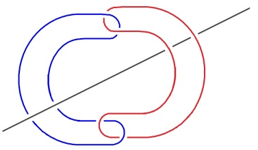

<!-- id: s22-11-0244 -->

Même si vous n’êtes que 3, ça fera 4, d’où mon expression « *plus-une* ».

<!-- id: s22-11-0245 -->

Et c’est en en retirant *Une* - *Réelle* - que le groupe sera dénoué.

<!-- id: s22-11-0246 -->

Il faut pour ça qu’on puisse en retirer *Une Réelle* pour faire la preuve que le nœud est borroméen et que c’est bien *les* 3 *consistances minimales* qui le constituent.

<!-- id: s22-11-0247 -->

De 3, on ne sait jamais laquelle des 3 est réelle, c’est bien pour ça qu’il faut qu’ils soient 4 parce que le 4, c’est ce qui dans cette double boucle supporte *le Symbolique* *de ce* pourquoi en effet *il est fait*, à savoir : le *Nom-du-Père*.

<!-- id: s22-11-0248 -->

<!-- id: s22-11-0249 -->

*La nomination* c’est la seule chose dont nous soyons sûrs *que ça fasse trou*, et c’est pourquoi j’ai, dans le *cartel*, donné ce chiffre 4 comme donnant le minimum, non sans considérer qu’on peut quand même avoir un petit peu de jeu sur ce qui *ex-siste,* et que peut-être un jour...

<!-- id: s22-11-0250 -->

> pourquoi pas l’an­née prochaine, du train dont je persiste ...j’essaierai de vous montrer que tout de même des *Noms-du-père*, si je l’accouple ce *Nom-du-Père* au *Symbolique*, pour en faire le « *plus un* », dont s’assure manifestement...

<!-- id: s22-11-0251 -->

Alors qu’ici : au 3 il y a quelque chose qui ne se voit pas tout de suite dans le fait que ni A ni B ne franchissent le trou \[*en rouge ici*\] et ne font chaîne \[*la droite* A *passe tout au dessus*, *la droite* B *tout au dessous*\]*.*

<!-- id: s22-11-0252 -->

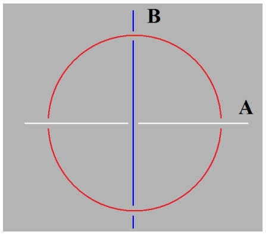

<!-- id: s22-11-0253 -->

Quand il y en a 2, on voit que même à un, ce n’est aucun des deux trous qu’il franchit, que le trou est entre les deux.

<!-- id: s22-11-0254 -->

C’est bien en ça que le couple *n’ex-siste pas*.

<!-- id: s22-11-0255 -->

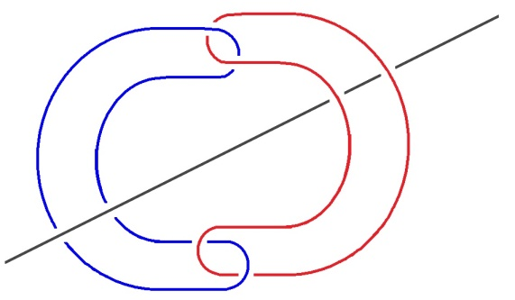

<!-- id: s22-11-0256 -->

Mais peut-être, ces *Noms-du-Père*, pouvons-nous spécifier qu’il n’y a pas après tout que le *Symbolique* qui en ait le privilège, qu’il n’est pas obligé que ce soit au *trou* *du* *Symbolique* que soit conjointe *la nomination*. Je l’indiquerai l’année prochaine.

<!-- id: s22-11-0257 -->

Mais pour en revenir...

<!-- id: s22-11-0258 -->

> car je veux terminer sur quelque chose qui ait substance ...est-ce que Freud n’a pas proprement énoncé que dans l’*identification*...

<!-- id: s22-11-0259 -->

> il l’a dit ! Personne n’en voit le support, c’est-à-dire la portée ...il n’y a *d’amour* que de l’identification portant sur ce 4ème terme, à savoir *le Nom-du-Père*.

<!-- id: s22-11-0260 -->

Est-ce qu’il n’est pas étrange que d’*iden­tification*, il ne nous en énonce que 3, et que dans ces 3 il y a tout ce qu’il faut pour lire mon *nœud borroméen*.

<!-- id: s22-11-0261 -->

C’est à savoir qu’il va jusqu’à désigner proprement *la consistance* comme telle, en tant que dans ce nœud elle est partout.

<!-- id: s22-11-0262 -->

Que ça fasse trou ou pas, la consistance est la base, à savoir : vous voyez le *triskel* [^32], à savoir ceci par exemple, puisque je n’en ai que là l’exemple, le *triskel* qui n’est pas un nœud.

<!-- id: s22-11-0263 -->

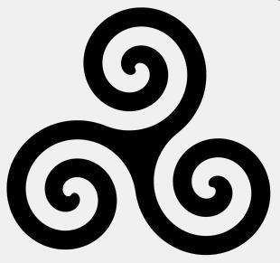

<!-- id: s22-11-0264 -->

Triskèle lévogyre en spirale

<!-- id: s22-11-0265 -->

Il ne s’inscrit que de *la consistance*, il a appelé ça « *le trait unaire »*, on ne pouvait pas mieux dire !

<!-- id: s22-11-0266 -->

Ce qui fait composante du nœud, non sans avoir mis en tête qu’il n’y a d’amour - je dirai - que de ce qui du *Nom-du-Père* fait boucle entre les 3, fait boucle des 3 du *triskel*.

<!-- id: s22-11-0267 -->

Ce terme *triskel*, je pense que ça dit peut-être quelque chose à un certain nombre d’entre vous.

<!-- id: s22-11-0268 -->

C’est strictement ça :

<!-- id: s22-11-0269 -->

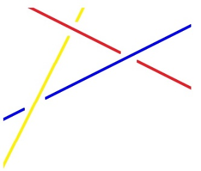

<!-- id: s22-11-0270 -->

En tant que prolongés, vous y voyez quoi ?

<!-- id: s22-11-0271 -->

Trois fusils qui font faisceaux, qui se supportent à *trois* les uns les autres, c’est ce que...

<!-- id: s22-11-0272 -->

> vous le savez peut-être, et c’est de ça que le nom est tiré ...les Bretons ont pris pour faire leurs armes, les armes de la Bretagne moderne.

<!-- id: s22-11-0273 -->

Ça nous sort de la croix, c’est déjà ça...

<!-- id: s22-11-0274 -->

À part qu’on peut dire que la croix de Lorraine, à sa façon, si on la dessine de la bonne façon, ça fait triskel aussi.

<!-- id: s22-11-0275 -->

Et qu’est-ce que Freud y a ajouté ?

<!-- id: s22-11-0276 -->

Il y a ajouté l’*identification* *minimale* pour que ce terme d’*identification* se supporte au regard du *nœud borroméen*.

<!-- id: s22-11-0277 -->

Je vous le répète, précise, c’est en tant que *le Nom-du-Père* est ce qui fait nœud ici...

<!-- id: s22-11-0278 -->

> et s’il s’agit du *triskel*, *le Nom-du-Père*, ici, du *triskel* fait nœud ...c’est en tant donc que le *triskel ex-siste* qu’il peut y avoir *identification*. *Identification* à quoi ?

<!-- id: s22-11-0279 -->

À *ce qui* dans tout nœud borroméen je vous le rappelle...

<!-- id: s22-11-0280 -->

> dans tout nœud borroméen, je vous le rappelle - allez ! Vous voyez, voilà mon *triskel* ici ...dans tout nœud borroméen *fait le cœur*, le centre du nœud.

<!-- id: s22-11-0281 -->

Et où est-ce que je vous ai marqué que déjà se situe *le désir*, *le désir* qui est aussi une possibilité d’*identification* ? C’est ici :

<!-- id: s22-11-0282 -->

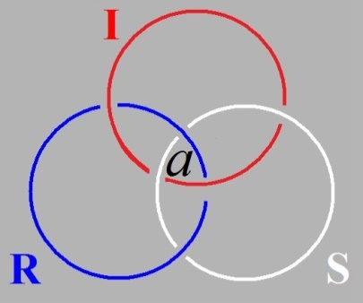

<!-- id: s22-11-0283 -->

À savoir là où je vous ai situé la place de l’*objet(a)* comme étant celui qui domine ce dont Freud fait la 3ème possibilité d’identification : *le désir de l’hystérique*.

## Notes

[^29]: « N*umero deus* impare gaudet » : « Le nombre *impair* plaît à la divinité. » Virgile. Les bucoliques, VIII, 75.

[^30]: Lapsus de Lacan, il s’agit en fait de Thomas d’Aquin : « *Amare est* *velle bonum alicui* », « *aimer c’est vouloir le bien de quelqu’un* »,

    (Summa Theologica, Prima Pars, Quaestio XX).

[^31]: Cf. « *le Réel c’est ce qui pâtit du signifiant*. »

[^32]: Le triskèle, (du grec τρισκελης \[triskélès\] : « à trois jambes ») est un symbole représentant trois jambes humaines (triskèle du 1er type),

    ou trois spirales entrecroisées (triskèle du 2nd type) ou tout autre symbole avec trois protubérances évoquant une symétrie de groupe cyclique.
