# Leçon 12 | 13 Mai 1975

<!-- source-url: http://staferla.free.fr/S22/S22 R.S.I..docx -->
<!-- seminar: s22 -->
<!-- lesson: 12 -->

<!-- id: s22-12-0001 -->

Il n’y a pas d’états d’âme. Il y a à *dire* à démontrer.

<!-- id: s22-12-0002 -->

Et pour promouvoir le titre sous lequel ce *dire* se poursuivra l’année pro­chaine - si je survis - je l’annoncerai « 4,5,6 ».

<!-- id: s22-12-0003 -->

Cette année, j’ai dit « R S I », pourquoi pas « 1, 2, 3 » ?

<!-- id: s22-12-0004 -->

- « *Un, deux, trois, nous irons aux bois* »

<!-- id: s22-12-0005 -->

- Vous savez la suite peut-être ? :

<!-- id: s22-12-0006 -->

« *Quatre, cinq, six, cueillir des cerises.* »

<!-- id: s22-12-0007 -->

- « *Sept, huit, neuf, dans mon panier neuf.* »

<!-- id: s22-12-0008 -->

Eh bien, je m’arrêterai à « 4, 5, 6 ». Pourquoi ?

<!-- id: s22-12-0009 -->

Pourquoi R S I se sont-ils donnés comme *lettres* ?

<!-- id: s22-12-0010 -->

C’est que, qu’elles soient 3 peut être dit second : ce n’est que parce qu’elles sont 3 qu’il y en a un qui est le *Réel*.

<!-- id: s22-12-0011 -->

Laquelle de ces trois lettres méri­te-t-elle ce titre de *Réel* ?

<!-- id: s22-12-0012 -->

Je dis qu’à ce niveau de logique, peu importe !

<!-- id: s22-12-0013 -->

Et que *le sens* le cède au *nombre*, au point que c’est *le nombre* qui, *ce sens* - vais-je dire : *le domine* ? Non pas ! - *le détermine*.

<!-- id: s22-12-0014 -->

Le nombre 3 est à démontrer comme ce qu’il est, s’il est le *Réel* à savoir *l’Impossible*.

<!-- id: s22-12-0015 -->

C’est la plus difficile sorte de démonstration.

<!-- id: s22-12-0016 -->

Ce qu’on veut démontrer en passe du *dire*, il faut que ce soit *impossible*, condition exigible pour le *Réel*.

<!-- id: s22-12-0017 -->

Il *ex-siste* comme *impossible*.

<!-- id: s22-12-0018 -->

Encore faut-il le démontrer \[**S**\], pas seulement le montrer \[**I**\] !

<!-- id: s22-12-0019 -->

Le démontrer relève du *Symbolique*.

<!-- id: s22-12-0020 -->

Si le *Symbolique* prend le pas ainsi sur l’*Imaginaire*, ça ne suffit pas, ça ne donne que le ton.

<!-- id: s22-12-0021 -->

Et en fin de comp­te ce n’est pas au ton qu’il faut se fier puisque c’est au *nombre*.

<!-- id: s22-12-0022 -->

C’est ce que j’essaie de mettre à l’épreuve.

<!-- id: s22-12-0023 -->

Mais un *nombre* *noué*, est-ce encore un *nombre* ?

<!-- id: s22-12-0024 -->

Ou bien est-ce autre chose ?

<!-- id: s22-12-0025 -->

Voilà où nous en sommes.

<!-- id: s22-12-0026 -->

Je vous ai retenus tout le long de l’année autour d’un certain nombre de *flashs*.

<!-- id: s22-12-0027 -->

Je n’y suis, moi, que pour peu de choses, étant déterminé comme sujet par l’inconscient, ou bien par la pratique, une pratique qui implique l’inconscient comme *supposé*.

<!-- id: s22-12-0028 -->

Est-ce à dire, que comme tout « *supposé* », il soit *Imaginaire* ?

<!-- id: s22-12-0029 -->

*C’est le sens même du mot « sujet » : supposé comme Imaginaire*.

<!-- id: s22-12-0030 -->

*Qu’y a-t-il dans le Symbolique qui ne s’imagine pas ?*

<!-- id: s22-12-0031 -->

Ce que je veux vous dire c’est qu’*il y a le trou.*

<!-- id: s22-12-0032 -->

Quelqu’un qui me voyait *en proie* *-* c’est le cas de le dire *-* *à ce nœud*, que là je vous dessine sous sa forme la plus simple :

<!-- id: s22-12-0033 -->

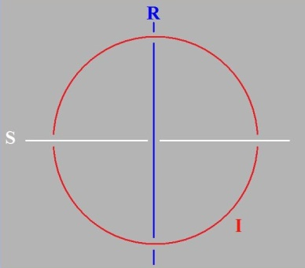

<!-- id: s22-12-0034 -->

...quelqu’un qui m’y voyait en proie, sous des formes plus compliquées, m’a dit que je me démentais en quelque sorte, d’avoir avancé dans un temps...

<!-- id: s22-12-0035 -->

> selon une forme qui n’est même pas mienne, qui est picassienne comme chacun sait

<!-- id: s22-12-0036 -->

...« *Je ne cherche pas, je trouve* », quel­qu’un m’a dit : « *Eh ben là, je vous vois vachement chercher !* ».

<!-- id: s22-12-0037 -->

*Chercher*, c’est un terme qui provient de *circare*, comme vous pouvez le trouver dans n’importe quel dictionnaire étymologique.

<!-- id: s22-12-0038 -->

*Je trouve quand même puisque*...

<!-- id: s22-12-0039 -->

> ça, ça n’est pas dans le *dictionnaire étymologique* ...*j’ai trouvé le trou*, le trou de Soury, si j’ose m’exprimer ainsi, par où j’en suis réduit à passer.

<!-- id: s22-12-0040 -->

A-t-il affaire avec ce qu’on imagine le déterminer, à savoir *le cercle* ?

<!-- id: s22-12-0041 -->

Un cercle peut être un trou, mais il ne l’est pas tou­jours.

<!-- id: s22-12-0042 -->

Pendant que j’y suis, à ce sujet je dirai, je rappellerai...

<!-- id: s22-12-0043 -->

> ce qui se trouve déjà dans les dernières lignes de mes *Propos sur la causalité psy­chique* [^33] ...un proverbe arabe qui énonce qu’il y a un certain nombre de choses - il en nomme 3 lui aussi - sur quoi rien ne laisse de trace :

<!-- id: s22-12-0044 -->

- « *l’homme dans la femme* » dit-il d’abord,

<!-- id: s22-12-0045 -->

- voire « *le pas de la gazelle sur le rocher* »,

<!-- id: s22-12-0046 -->

Je le précède, évoquant ce 3ème terme, de ceci terminé par une virgule :

<!-- id: s22-12-0047 -->

- « *plus inaccessible à nos yeux, cette trace, faits pour les signes du changeur,* »

<!-- id: s22-12-0048 -->

C’est le 3ème terme : il n’y a pas de *trace* sur la pièce de monnaie touchée, seulement d’usure.

<!-- id: s22-12-0049 -->

Oui, c’est bien là où vient se solder - c’est le cas de le dire - ce quelque chose de noué dont il s’agit.

<!-- id: s22-12-0050 -->

Je « *trouve* » assez pour avoir à fomenter le cercle, qui n’est du trou que la conséquence.

<!-- id: s22-12-0051 -->

Je « *trouve* » assez pour avoir à « *circuler* ». Je ne sais pas si vous remarquez que la police...

<!-- id: s22-12-0052 -->

> dont Hegel pose fort bien que tout ce qui est de la politique s’y enracine,
>
> et *qu’il n’y a rien de la politique qui ne soit en fin, au dernier terme de réduction*, *police pure et simple* ...que la police n’a que ce mot à la bouche : « *Circulez* ».

<!-- id: s22-12-0053 -->

Peu lui importe *la gyrie* dont je vous ai parlé la dernière fois...

<!-- id: s22-12-0054 -->

> que ce soit de gyrer à droite ou à gauche : elle s’en fout, c’est le cas de le dire ...ce dont il s’agit c’est de *circuler !*

<!-- id: s22-12-0055 -->

Ça ne devient *sérieux* que si l’on part du trou par où il faut en passer.

<!-- id: s22-12-0056 -->

Ce qu’il y a de remarquable dans le nœud dit *« bo »* ...

<!-- id: s22-12-0057 -->

je ne dis pas beau ...dans le nœud *bo,* comme je l’appellerai à l’oc­casion, c’est exactement ceci, qu’il fasse nœud, tout en ne « *circulant »* pas d’une façon qui utilise ce trou comme tel.

<!-- id: s22-12-0058 -->

Il y a une différence entre ce nœud et ceci qui - le trou - utilise : c’est ce qui fait *chaîne*.

<!-- id: s22-12-0059 -->

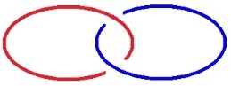

<!-- id: s22-12-0060 -->

Il est frappant depuis le temps qu’on fait des chaînes que la chose qu’on n’ait pas remarquée, c’est que dans le nœud bo, pas besoin d’user du *trou,* puisque ça fait nœud sans faire chaîne*.*

<!-- id: s22-12-0061 -->

Ça fait nœud de quelle façon ?

<!-- id: s22-12-0062 -->

D’une façon telle que, pour le refaire de la façon qui fait des ronds :

<!-- id: s22-12-0063 -->

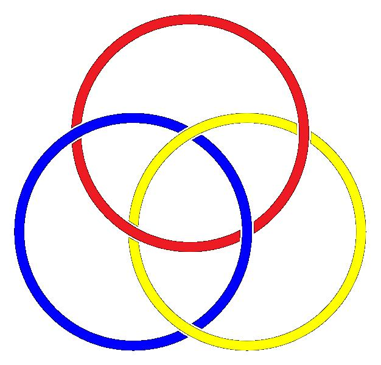

<!-- id: s22-12-0064 -->

ce qui est exactement la même chose que ça malgré l’apparence :

<!-- id: s22-12-0065 -->

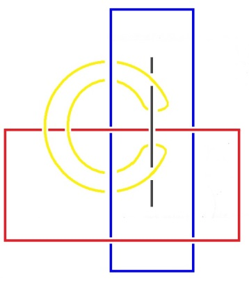

<!-- id: s22-12-0066 -->

Comme vous le voyez sous cette forme, cette forme de pure apparence, c’est dans la mesure où ces deux ronds ne sont pas noués, que le 3ème...

<!-- id: s22-12-0067 -->

> dans cette mesure même ...que le 3ème inflé­chit l’un des deux, qui entre eux sont libres, l’infléchit de telle façon que nécessairement arrivé à l’autre bout d’un de ces cercles, il infléchira l’autre à son tour, et qu’il ainsi tournera en rond.

<!-- id: s22-12-0068 -->

Si ce rond, le petit là \[*en jaune*\], nous le supposons du *Symbolique*, il fera indéfiniment le tour de la...

<!-- id: s22-12-0069 -->

> entre guillemets puisque ce n’est pas une vraie chaîne ...de la « fausse chaîne » de l’*Imaginaire* et du *Symbolique*. C’est bien en effet de cela qu’il s’agit.

<!-- id: s22-12-0070 -->

Comment se reconnaître dans ce double cercle couplé, et justement de n’être pas noué ?

<!-- id: s22-12-0071 -->

Pour qu’un nœud soit borroméen, qu’un nœud soit *bo*, *il ne suffit pas* qu’il soit nœud, *il faut que* chacun des éléments...

<!-- id: s22-12-0072 -->

Ce terme « *il faut et il suffit* », on ne lui donne pas - sauf à se référer au nœud - son plein sens.

<!-- id: s22-12-0073 -->

*Dire* « *il faut* » c’est quelque chose, mais *dire* « *il suffit* » implique *ce qu’on oublie toujours* parce qu’on ne fait pas *le trou*...

<!-- id: s22-12-0074 -->

> le seul *trou* qui vaille* *: la trouvaille ...parce qu’on ne fait pas *le trou*, on ne voit pas que si la condition manque, rien ne va plus !

<!-- id: s22-12-0075 -->

Ce qui est l’envers du « *il faut »* - envers toujours éludé - je vais vous le démontrer tout de suite.

<!-- id: s22-12-0076 -->

Vous nouez deux cercles, vous les nouez d’une façon qui implique...

<!-- id: s22-12-0077 -->

> comme c’est là non démontré, mais bien seulement montré

<!-- id: s22-12-0078 -->

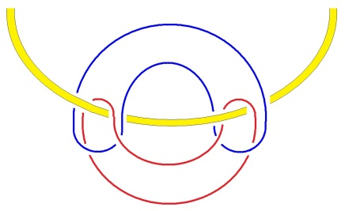

<!-- id: s22-12-0079 -->

...vous les nouez d’une façon telle qu’ils ne soient pas noués, qu’il passe ici quelque chose qui ait aussi bien la consistance d’un cercle que d’une droite infinie, cela suffit - car c’est identifiable à cette figure du nœud *bo -* cela suffit à faire un nœud borroméen.

<!-- id: s22-12-0080 -->

Rien ne va vous être plus facile à imaginer que ceci : c’est que si vous en faites passer ici, comme ça, une autre :

<!-- id: s22-12-0081 -->

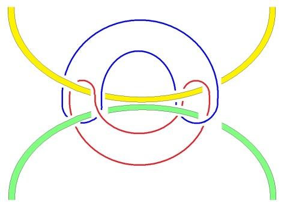

<!-- id: s22-12-0082 -->

vous avez une figure *qui aura l’air* - comment ne pas le croire ? - d’être un nœud borroméen.

<!-- id: s22-12-0083 -->

Néanmoins *il ne suffit pas de* *couper cette consistance* pour que chacun des trois autres éléments soient libres des 2 autres.

<!-- id: s22-12-0084 -->

Pour qu’il en soit ainsi, il faudrait que les choses se disposent autrement, qui pourtant a bien l’air d’être *la même chose*, à savoir que la disposition à 4 élé­ments soit de cette forme, en tant que montrable :

<!-- id: s22-12-0085 -->

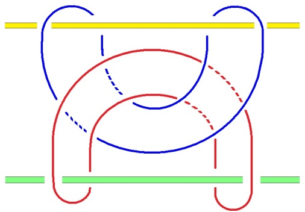

<!-- id: s22-12-0086 -->

Qu’est-ce qui le démontre ?

<!-- id: s22-12-0087 -->

Car dans cette forme, il est clair que l’un quelconque des élé­ments étant rompu, les 3 autres sont libres, ce qui n’était pas le cas dans la première figure que je vous ai livrée.

<!-- id: s22-12-0088 -->

Et d’abord qu’est-ce qu’il y a de commun...

<!-- id: s22-12-0089 -->

> dans la façon dont je vous figure ces 4 éléments ...qu’est-ce qu’il y a de commun entre *la droi­te* *infinie*, et *le cercle* ?

<!-- id: s22-12-0090 -->

Ce qu’il y a de commun, c’est que leur rupture libère les autres éléments du nœud.

<!-- id: s22-12-0091 -->

La rupture du cercle équi­vaut à la rupture de la droite infinie, en quoi ?

<!-- id: s22-12-0092 -->

Au point de vue du nœud !

<!-- id: s22-12-0093 -->

- Non pas en tant que *rupture*, dans ses effets sur le nœud,

<!-- id: s22-12-0094 -->

- non pas dans ses effets de reste sur l’élément.

<!-- id: s22-12-0095 -->

Que reste-t-il du cercle après sa ruptu­re ?

<!-- id: s22-12-0096 -->

- une *droite finie* comme telle, autant dire bonne à jeter,

<!-- id: s22-12-0097 -->

- un petit chif­fon, un bout de corde de rien du tout,

<!-- id: s22-12-0098 -->

- le *zéro* du cercle coupé !

<!-- id: s22-12-0099 -->

Laissez-­moi figurer :

<!-- id: s22-12-0100 -->

- le cercle par ce *zéro,*

<!-- id: s22-12-0101 -->

- *coupé* \[divisé\] par ce qui sépare, c’est-à-dire le 2, 0 / 2 = 1 : zéro sur 2 égale tout au plus *ce petit* 1 de rien du tout.

<!-- id: s22-12-0102 -->

La droite infinie, *le grand* I, une fois sectionnée, ça fait quand même 2 *demi-droites* qui par­tent, comme on dit : d’un point - d’un point *zéro* - pour s’en aller *à l’infini* : 1 / 2 = 2, un sur deux égale deux.

<!-- id: s22-12-0103 -->

Ceci pour vous faire sentir que quand j’énonce : « *qu’il n’y a pas de rapport sexuel »*, je donne au sens du mot « *rapport* » l’idée de *proportion*.

<!-- id: s22-12-0104 -->

Mais chacun sait que le *mos geometricum* d’Euclide...

<!-- id: s22-12-0105 -->

> qui a suffi pendant tant de temps[^34] à paraître le parangon de la logique ...est tout à fait insuffisant, et qu’à entrer dans la figure du nœud, il y a une tout autre façon de supporter *la figure du non-rapport des sexes, c’est de les supporter de deux cercles en tant que non noués.*

<!-- id: s22-12-0106 -->

C’est de cela qu’il s’agit dans ce que j’énonce *du non-rapport *:

<!-- id: s22-12-0107 -->

- chacun des cercles qui se constitue - nous ne savons pas encore de quoi - dans *le rapport des sexes*,

<!-- id: s22-12-0108 -->

- chacun dans sa façon *de tourner en rond* comme sexe, n’est pas - à l’autre - *noué*. C’est cela que ça veut dire mon *non-rapport*.

<!-- id: s22-12-0109 -->

Il est tout à fait frappant que le langage ait depuis longtemps devancé la figure du *nœud*...

<!-- id: s22-12-0110 -->

> sur laquelle s’escriment, seulement de nos jours, les mathématiciens ...pour appeler « *nœud* » ce qui unit l’homme et *une* femme, en parlant...

<!-- id: s22-12-0111 -->

> sans bien naturellement savoir ce dont il s’agit ...en parlant méta­phoriquement des nœuds qui les unissent.

<!-- id: s22-12-0112 -->

Ce sont *ces nœuds* qu’il vaut sans doute de rapporter, en montrant qu’ils impliquent comme nécessai­re ce 3 élémentaire dont il se trouve que je les supporte, de ces trois indi­cations de sens, de *sens matérialisé*, qui se figurent dans les nominations du *Symbolique*, de l’*Imaginaire* et du *Réel*.

<!-- id: s22-12-0113 -->

Je viens d’introduire le terme de « *nomination* ».

<!-- id: s22-12-0114 -->

J’ai eu à y répondre récemment à propos de ce qui était rassemblé dans un petit ouvrage de logiciens, sur le sujet de ce que les logiciens étaient parvenus à énoncer jusqu’à ce jour, concernant ce qu’on appelle le *référent*.

<!-- id: s22-12-0115 -->

Je tombais là du haut de mon nœud, et ça ne m’a pas du tout facilité les choses parce que c’est là toute la question : la nomination relève-t-elle - comme il semble apparemment - du *Symbolique* ?

<!-- id: s22-12-0116 -->

Vous le savez - enfin peut-être vous en souvenez-vous - je vous ai fait un jour la figure qui s’impose quand on veut fomenter *un nœud à* 4.

<!-- id: s22-12-0117 -->

Le moins qu’on puisse dire c’est que si nous introduisons à ce niveau *la nomination*, c’est un *quart élément*.

<!-- id: s22-12-0118 -->

Cette figure je vous l’ai faite de cette façon-ci : il faut partir de cercles non noués, et même je n’ai pas de répugnance à évoquer le cas où j’ai fait défaut à cette figure.

<!-- id: s22-12-0119 -->

Voilà ce qui convient pour qu’un quart cercle noue les trois qui d’abord étaient posés, comme dénoués :

<!-- id: s22-12-0120 -->

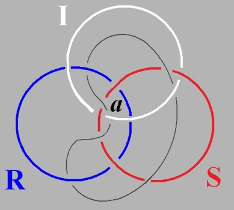

<!-- id: s22-12-0121 -->

Cette figure, contrairement à celle d’un jour où j’étais aussi bien embrouillé que vous pouvez l’être à l’occasion, faute de vous être rompus à cet *exercice*, l’un des cercles restait hors du jeu.

<!-- id: s22-12-0122 -->

C’est en ceci, que si plein dans sa simplicité que soit le nœud borro­méen à 3, c’est à partir de 4, et je souligne : *à s’engager dans ce 4, qu’on trouve une voie particulière qui ne va que jusqu’à 6.*

<!-- id: s22-12-0123 -->

En d’autres termes, qui fait du cercle couplé, pris pour chacun des éléments qualifiables de ce que le 3 impose, non pas de distinction, mais bien au contraire d’identité entre les trois termes du *Symbolique, de l’Imaginaire et du Réel,* au point qu’il nous *semble* exigible de retrou­ver dans chacun, cette triplice, cette trinité *du Symbolique, de l’Imaginaire et du Réel*.

<!-- id: s22-12-0124 -->

À savoir d’évoquer que le *Réel* tient dans ces termes que j’ai déjà fomentés du nom :

<!-- id: s22-12-0125 -->

- *d’ex-sistence*,

<!-- id: s22-12-0126 -->

- *de consistance,*

<!-- id: s22-12-0127 -->

- *et de trou*.

<!-- id: s22-12-0128 -->

De faire de *l’ex-sistence,* écrite comme je l’écris, à savoir ce qui joue jusqu’à une certaine limite dans le nœud*,* *cela supporte le Réel.*

<!-- id: s22-12-0129 -->

Ce qui fait *consistance* est de l’ordre *Imaginaire* comme le suppose ceci qui nous est vraiment tangible : que s’il y a quelque chose de quoi relève *la rupture*, c’est bien *la consistance*, à lui donner le sens le plus réduit.

<!-- id: s22-12-0130 -->

Il reste alors - mais reste-t-il ? *-* pour *le Symbolique* l’affectation du terme « *trou* ».

<!-- id: s22-12-0131 -->

Ceci en tant que la mathématique, celle qui se qua­lifie de *la topologie,* nous donne une figure sous la forme du *tore* de quelque chose qui pourrait figurer le trou.

<!-- id: s22-12-0132 -->

Or la topologie ne fait rien de tel, ne serait-ce que parce que le tore en a deux, trous :

<!-- id: s22-12-0133 -->

- le trou interne avec sa *gyrie*

<!-- id: s22-12-0134 -->

- et le trou qu’on peut dire être externe, et grâce à quoi le tore se démontre participer de la figure du cylindre qui est une des façons qui pour nous matérialise le mieux la figure de *la droite à l’infini*.

<!-- id: s22-12-0135 -->

*Cette droite à l’infini,* chacun sait son rapport à ce que j’appelle simplement *le rond de la consistance*.

<!-- id: s22-12-0136 -->

Chacun sait ce rapport, et pas seulement de m’avoir vu le figurer dans le nœud borroméen.

<!-- id: s22-12-0137 -->

Desargues *- « l’Arguésien »* comme on dit *-* s’est avisé depuis longtemps *que la droite infinie est en tout homologue au cercle*.

<!-- id: s22-12-0138 -->

En quoi il a devancé le nommé Riemann. Il l’a devancé, néanmoins une question reste ouverte à quoi je donne, par l’attention que j’apporte au *nœud bor­roméen*, déjà réponse.

<!-- id: s22-12-0139 -->

Ce qui ne vous empêchera pas - du moins je l’es­père - d’en maintenir présente pour votre esprit la forme question.

<!-- id: s22-12-0140 -->

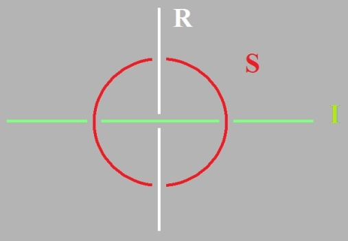œ

<!-- id: s22-12-0141 -->

Comme vous le voyez dans cette figure à gauche, du nœud borroméen constitué :

<!-- id: s22-12-0142 -->

- par l’équivalent de ce cercle sous la forme d’une droite nouée à un cercle : du couple supposé de ce qui là, pour le supporter pour votre esprit, pourrait être du *Symbolique*.

<!-- id: s22-12-0143 -->

- Les deux autres, sans qu’on sache de quelle droite figurer spécialement le *Réel*, par exemple celle-ci, ou l’*Imaginaire* pour celle-ci.

<!-- id: s22-12-0144 -->

Que faut-il pour que cela fasse nœud ?

<!-- id: s22-12-0145 -->

Il faut que le point à l’infini soit tel que les deux droites ne fassent pas chaîne.

<!-- id: s22-12-0146 -->

C’est là la condition : que les deux droites quelles qu’elles soient, d’où qu’on les voit...

<!-- id: s22-12-0147 -->

> je vous fais remarquer en passant que ce « *d’où qu’on les voit* »
>
> supporte cette réa­lité que j’énonce *du regard*,
>
> le regard n’est définissable que d’un « *d’où qu’on les voit ».* ...et à vrai dire, si nous pen­sons une droite comme faisant rond d’un point, d’un point unique à l’in­fini, comment ne pas voir que ceci a un sens *à ce qu’elles ne se nouent pas*.

<!-- id: s22-12-0148 -->

Non seulement que ceci a un sens à ce qu’elles ne se nouent pas, mais que c’est de ne pas se nouer qu’elles se noueront effectivement à l’infini, point qu’à ma connaissance Desargues, Desargues dont j’ai usé au temps où ailleurs qu’ici...

<!-- id: s22-12-0149 -->

> à *Normale Supérieure* pour l’évoquer par son nom ...je fai­sais mon séminaire sur *Les Ménines – Les Ménines* de Velasquez – où j’en profitais pour me targuer de situer où il était ce fameux regard, dont bien évidemment c’est le sujet du tableau.

<!-- id: s22-12-0150 -->

Je le situais quelque part, dans le même intervalle - peut-être qu’un jour vous verrez paraître ce séminai­re - dans le même intervalle que j’établis ici au tableau, sous une autre forme, à savoir dans celui que je définis de ce que *les droites infinies*, en leur point supposé d’infini, *ne se nouent pas en chaîne*.

<!-- id: s22-12-0151 -->

C’est bien là que commence pour nous la question. Il ne semble pas que Desargues se soit jamais posé la question de la *forme* sous laquelle il supposait ces droites infinies, en posant la question de savoir *si elles se nouaient ou pas*.

<!-- id: s22-12-0152 -->

Il est tout à fait frappant que Riemann, lui, ait tranché la ques­tion d’une façon peu satisfaisante, en faisant de tous les points à l’infini - à quelque droite qu’ils appartiennent - un seul et unique point, qui est au principe de la géométrie de Riemann.

<!-- id: s22-12-0153 -->

À soulever la question du nœud, nous allons voir, je vais ici vous figu­rer quelque chose, dont j’espère venir à bout, sous la forme d’un nœud, d’un vrai, qui, chose curieuse, présente une sorte d’ana­logie avec cette forme :

<!-- id: s22-12-0154 -->

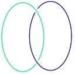

<!-- id: s22-12-0155 -->

Si nous étudions ce nœud comme le font les mathématiciens, tout ce que nous pouvons faire c’est d’amorcer la notion dite du « *groupe fondamental »*, c’est-à-dire de définir la structure de ce nœud par une série *de trajets* qui se feront d’un point quelconque, celui-ci, par exemple.

<!-- id: s22-12-0156 -->

Nous définissons le nœud par quelque chose qui s’appelle le *groupe fondamental*, et qui comporte un nombre...

<!-- id: s22-12-0157 -->

> un nombre qui diffère selon les nœuds ...*un nombre de trajets qui seront nécessaires pour indiquer sa structure*.

<!-- id: s22-12-0158 -->

*Ces trajets*, *même s’ils font plusieurs boucles* dans chacun...

<!-- id: s22-12-0159 -->

> mais là je pose la question : je mets le *« trou »* entre guillemets ...dans chacun des « *trous* » qui apparemment font ce nœud.

<!-- id: s22-12-0160 -->

Il y en aura un certain nombre, et contrairement à ce que vous pouvez imaginer, ce nombre dans ce cas...

<!-- id: s22-12-0161 -->

> dans ce cas où la figure mise à plat à l’air de com­porter 4 champs distincts ...ça ne fera pas pour autant 4 cercles individualisables de trajet.

<!-- id: s22-12-0162 -->

Mais contrairement à ce qu’on peut ima­giner, ça n’est pas le nombre qui sera caractéristique de ce *groupe fonda­mental*, ça sera la relation entre un certain nombre de trajets.

<!-- id: s22-12-0163 -->

Nous supportons là, à l’état pur, la notion de *rapport*, en tant que jus­tement, elle nous ramène au nœud borroméen puisque ce rap­port même, fait nœud, à ceci près que ce nœud manque de nombres.

<!-- id: s22-12-0164 -->

En prenant cette étape du nœud borroméen, nous supportons du nombre même, *les cercles* ou les trajets dont il s’agit pour n’importe quel nœud, même si ce nœud que je viens de dessiner, vous le voyez, n’a de *consistance* qu’unique. Nous prenons le nombre comme truchement, comme intermédiaire, comme élément lui-même pour nous introduire dans la dialectique du nœud.

<!-- id: s22-12-0165 -->

Ce où cette fois-ci j’en viendrai est ceci, c’est à savoir que rien n’est moins *naturel* si je puis dire que de penser *ce nœud.*

<!-- id: s22-12-0166 -->

Qu’il y ait de l’*Un*, ce que j’ai avancé en son temps pour le sup­porter du cercle est quelque chose à quoi, justement, se limite le mouve­ment de la pensée : à faire cercle, et c’est en quoi il n’y a rien de plus natu­rel, c’est le cas de le dire, que de lui reprocher son *cercle comme vicieux*.

<!-- id: s22-12-0167 -->

Que si, pour figurer le rapport des sexes - sans autrement, ni plus, préciser - je trouve la figure de deux « *Un* », sous la forme de deux cercles, qu’un 3ème noue, précisément de ce qu’ils ne soient entre eux pas noués, car ce n’est pas seulement de ce qu’ils soient libres quand ce 3ème est rompu, qu’il s’agit, c’est de ce que ce 3ème, comme je vous l’ai montré dans la figure, celle-ci :

<!-- id: s22-12-0168 -->

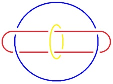

<!-- id: s22-12-0169 -->

c’est de ce que ce 3ème les noue expressément de ce qu’ils ne soient pas noués qu’il s’agit.

<!-- id: s22-12-0170 -->

Et n’aurai-je fait que de faire passer cette fonction dans votre esprit, que je considérerai qu’aujourd’hui je n’ai pas parlé en vain : c’est de cela même qu’il s’agit : c’est de ce qu’ils ne soient pas noués qu’ils se nouent.

<!-- id: s22-12-0171 -->

Et la nécessité qu’un 4ème terme vienne ici imposer ses vérités premières est justement ce sur quoi je veux terminer. C’est à savoir que sans le 4ème, rien n’est à proprement parler mis en évi­dence...

<!-- id: s22-12-0172 -->

> je n’ai pu aujourd’hui le faire ...mis en évidence de ce qu’est vrai­ment le nœud borroméen*.*

<!-- id: s22-12-0173 -->

Dans toute chaîne borroméenne...

<!-- id: s22-12-0174 -->

> pour vous imaginer la plus simple :

<!-- id: s22-12-0175 -->

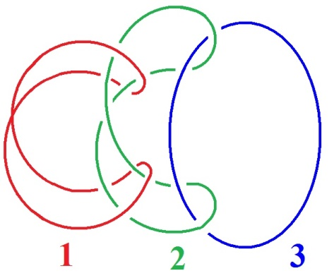

<!-- id: s22-12-0176 -->

...dans toute chaîne *borroméenne*, il y a un 1 puis un 2*.*

<!-- id: s22-12-0177 -->

Selon *la forme* que je vous ai dessinée tout à l’heure, vous trouverez là le 1 et le 2 qui est le commencement de *la chaîne* après quoi, ici, il y aura un 3ème cercle qui fera boucle.

<!-- id: s22-12-0178 -->

Qu’est-ce qu’implique que dans une chaîne quelconque...

<!-- id: s22-12-0179 -->

> comme elle fait chaîne, *elle fait toujours chaîne* ...nous placions un quelconque des 2 premiers au rang troisième ?

<!-- id: s22-12-0180 -->

Quelle que soit la chaîne, l’opération dont il s’agit impliquera...

<!-- id: s22-12-0181 -->

> pour nous limiter à la chaîne 1-2-3-4 ...impliquera que si nous voulons mettre un quelconque de ces 2 au rang troisième, le 1 sera dès lors noué au 2, et par le 3 et par le 4.

<!-- id: s22-12-0182 -->

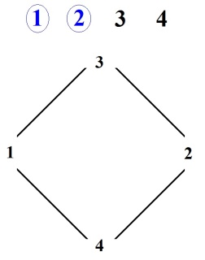

<!-- id: s22-12-0183 -->

Faites-en l’expérience, car il n’y a rien de tel pour essayer de penser ce nœud que de manipuler des ronds de ficelles.

<!-- id: s22-12-0184 -->

Je le répète, quoique n’ayant déjà plus de place au tableau : 1-2-3-4, à nous limiter à ceci, dans une chaîne quelconque, par quelque bout que nous la prenions, impliquera qu’à mettre soit le 1, soit le 2, à la place dite 3ème, à en faire l’effort nous obtiendrons ceci : c’est que pour choisir l’un des deux, puisque ici c’est le 2 que nous choi­sissons, pour mettre le 2 là en rang 3ème, le 3 et le 4 nécessairement noueront ce 1 au 2 ainsi déplacé.

<!-- id: s22-12-0185 -->

Il est tout à fait clair que le 1 et le 2 sont interchangeables, c’est à savoir qu’au début d’une chaîne, le 1er et le 2nd sont indéfiniment interchangeables. C’est à placer l’un de ces 2 là au rang 3, à nous efforcer à viser à le placer au rang 3 que nous verrons, non pas seulement le 3 intéressé passer à la place du 2, mais avec le 3, le 4ème.

<!-- id: s22-12-0186 -->

Et c’est en cela que se justifie l’intérêt que je porte au nœud à 4, et que je développerai l’année prochaine.

<!-- id: s22-12-0187 -->

<!-- id: s22-12-0188 -->

Dès lors, nous ne savons pas à quoi coupler *la nomination*.

<!-- id: s22-12-0189 -->

*La nomination* qui ici \[*en noir*\] fait 4ème terme, est-ce que nous allons le coupler à l’*Imaginaire* : à savoir que venant du *Symbolique, la nomination* est là pour faire dans *l’Imaginaire* un certain effet ?

<!-- id: s22-12-0190 -->

C’est bien en effet ce dont il semble s’agir chez les logiciens quand ils parlent du référent.

<!-- id: s22-12-0191 -->

Les descriptions russelliennes, celles qui se demandent en quoi il est légitime et fragile logiquement d’interroger sur le fait que : « *Walter Scott est-il ou non l’auteur de Waverley *? ».

<!-- id: s22-12-0192 -->

Il semble que cette référence concerne expressément ce qui s’individualise du support pensé des corps.

<!-- id: s22-12-0193 -->

Il n’est en fait certainement rien de semblable : la notion de *référent* vise le *Réel.*

<!-- id: s22-12-0194 -->

C’est en tant que *Réel* que ce que les *logiciens* imaginent comme *Réel,* donne son support au référent.

<!-- id: s22-12-0195 -->

À cette *nomination* *Imaginaire*, celle qui s’écrit de ceci par exemple, que de la relation entre R et S, nous avons une *nomination indice i* \[**Ni**\], et puis le I *pour nous en tenir au nœud à quatre*, comme constituant *le lien entre le Réel et le Symbolique.*

<!-- id: s22-12-0196 -->

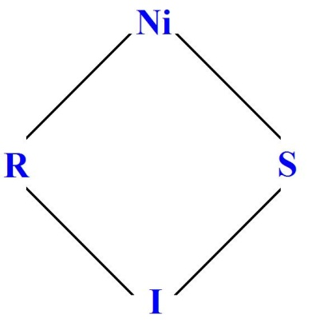

<!-- id: s22-12-0197 -->

Je proposerai ceci, c’est que la *nomination Imaginaire*, c’est très précisément ce que je viens de supporter aujourd’hui par *la droite infinie*.

<!-- id: s22-12-0198 -->

Et que cette droite...

<!-- id: s22-12-0199 -->

> dans ce cercle que nous composons d’un cercle et d’une droite ...que cette droite est très précisément, non pas ce qui *nomme* quoique ce soit de l’*Imaginaire* mais ce qui justement *fait barre*, *inhibe* le maniement

<!-- id: s22-12-0200 -->

- de tout ce qui est *démonstratif*,

<!-- id: s22-12-0201 -->

- de tout ce qui *articulé comme* *Symbolique*, fait barre au niveau de l’imagination même, et rend ce dont il s’agit dans le corps, dont chacun sait que ce qui intéresse le corps, au moins dans la perspective analytique, c’est le corps en tant qu’il fait *orifice*, que ce par quoi il se noue à quelque *Symbolique ou Réel* dont il s’agisse, c’est justement de ce *nœud*, de la mise en évidence d’un *cercle*, d’un *orifice* que l’*Imaginaire* est constitué.

<!-- id: s22-12-0202 -->

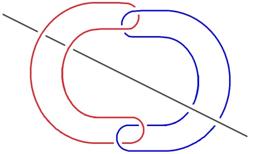

<!-- id: s22-12-0203 -->

Cette *droite infinie* qui ici complète le *faux trou* dont il s’agit, puisqu’il ne suffit pas d’un orifice pour faire un trou, chacun d’entre eux, étant indépendant des autres, c’est très précisément *l’inhibition* que la pensée a à l’endroit du *nœud*.

<!-- id: s22-12-0204 -->

Nous pouvons interroger de la même façon, si entre *Réel* et *Imaginaire*, c’est *la nomination indice du Symbolique* \[**NS**\], c’est-à-dire en tant que dans *le Symbolique* surgit quelque chose qui *nomme* : nous voyons ça dans les débuts de *La Bible*, à ceci près qu’on ne remarque pas ceci, c’est que l’idée créationniste, le *Fiat lux* inaugural, n’est pas une nomination.

<!-- id: s22-12-0205 -->

Que ce soit du *Symbolique* que surgisse *le Réel...*

<!-- id: s22-12-0206 -->

> c’est ça l’idée de *création* ...n’a rien à faire avec le fait que dans *un second temps*, le même Dieu donne leur nom à chacun des ani­maux qui habitent le paradis.

<!-- id: s22-12-0207 -->

De quelle nomination s’agit-il dans...

<!-- id: s22-12-0208 -->

ce que j’appelle ici, pour l’indi­quer d’un NS :

<!-- id: s22-12-0209 -->

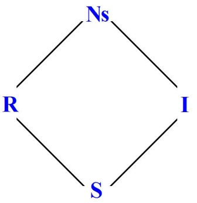

<!-- id: s22-12-0210 -->

...de quelle nomination s’agit-il dans une des deux de ce qui nous est mythiquement raconté ?

<!-- id: s22-12-0211 -->

C’est bien en effet une question à quoi il vaut qu’on s’arrête un peu, parce que cela relève de « *sens* » qui dans chaque cas est un *sens* différent.

<!-- id: s22-12-0212 -->

La *nomination* de chacune...

<!-- id: s22-12-0213 -->

> qui d’ailleurs est un nom commun, non pas - au sens de Russell - un *nom propre* ...la *nomination* de chacune des espèces que représente-t-elle ?

<!-- id: s22-12-0214 -->

Une *nomination*, assurément étroitement symbo­lique, une *nomination* limitée au *Symbolique*.

<!-- id: s22-12-0215 -->

Est-ce que c’est cela qui nous suffit pour supporter ce qui vient...

<!-- id: s22-12-0216 -->

> en un point certes pas indifférent dans cette élémentation à 4 du nœud ...qui se supporte du *Nom-du­-Père*.

<!-- id: s22-12-0217 -->

Est-ce que *le Père* c’est celui qui à donné leur nom aux choses ?

<!-- id: s22-12-0218 -->

Ou bien ce *Père* doit-il être interrogé en tant que *Père*, au niveau du *Réel* ?

<!-- id: s22-12-0219 -->

Est-ce que pour tout dire, le *Père éternel*...

<!-- id: s22-12-0220 -->

> à quoi bien sûr, rien ne nous empêcherait de croire
>
> s’il était même pensable que lui–même croit en lui,
>
> alors que c’est tout à fait clairement impensable ...est-ce que nous devons mettre le terme « *nomination »* comme noué au niveau de ce cercle dont nous supportons la fonction du *Réel* ?

<!-- id: s22-12-0221 -->

C’est entre ces 3 termes...

<!-- id: s22-12-0222 -->

- *nomi­nation de l’Imaginaire* comme *« inhibition »*,

<!-- id: s22-12-0223 -->

- *nomination du Réel* comme ce qu’il se trouve qu’elle se passe en fait, c’est-à-dire « *angoisse »*,

<!-- id: s22-12-0224 -->

- ou *nomina­tion du Symbolique*, je veux dire impliquée, fleur du *Symbolique* lui-même, à savoir comme il se passe en fait sous la forme du *« Symptôme »,* ...c’est entre ces 3 termes que j’essaierai l’année prochaine...

<!-- id: s22-12-0225 -->

> ce n’est pas une raison parce que j’ai *la réponse* pour que je ne vous la laisse pas *en tant que question* ...que je m’interrogerai l’année prochaine sur ce qu’il convient de donner comme substance au « *Nom du Père* ».

<!-- id: s22-12-0226 -->

*Fin du séminaire* RSI

<!-- id: s22-12-0227 -->

[Table des séances](#Table)

## Notes

[^33]: Écrits, Seuil 1966, p.193 (ou Points Seuil t.1 p.192) : « *Plus inaccessible à nos yeux faits pour les signes du changeur que ce dont le chasseur du désert sait voir*

    *la trace imperceptible *: *le pas de la gazelle sur le rocher, un jour se révéleront les aspects de l'imago.* ». Cf. « *Bible* », *Proverbes*, 30-19.

[^34]: La rationalité, jusqu’aux néo-scolastiques était en fait *mos geometricum* : elle partait, d’une manière déductiviste, de principes évidents

    en eux-mêmes et invariables, vers les situations particulières et contingentes. Avec cette conception de la rationalité, les solutions avaient

    la prétention d’être certaines et universellement applicables.
