# Leçon 03 | 16 Décembre 1975

<!-- source-url: http://staferla.free.fr/S23/S23 LE SINTHOME.docx -->
<!-- seminar: s23 -->
<!-- lesson: 03 -->

<!-- id: s23-03-0001 -->

Si on mettait autant de sérieux dans les analyses que j’en mets à préparer mon séminaire, eh bien, ça serait tant mieux.

<!-- id: s23-03-0002 -->

Ça serait tant mieux, et ça aurait sûrement de meilleurs résultats. Il faudrait pour ça que dans l’analyse on ait, comme je l’ai - comme je l’ai, mais c’est du *senti-mental* dont je parlais l’autre jour - le sentiment d’un risque absolu.

<!-- id: s23-03-0003 -->

Voilà, l’autre jour je vous ai dit que le *nœud à trois*… le nœud à trois que je dessine comme ça :

<!-- id: s23-03-0004 -->

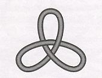

<!-- id: s23-03-0005 -->

et dont vous voyez qu’il s’ob­tient du *nœud borroméen* en rejoignant les cordes en ces trois points que je viens de marquer :

<!-- id: s23-03-0006 -->

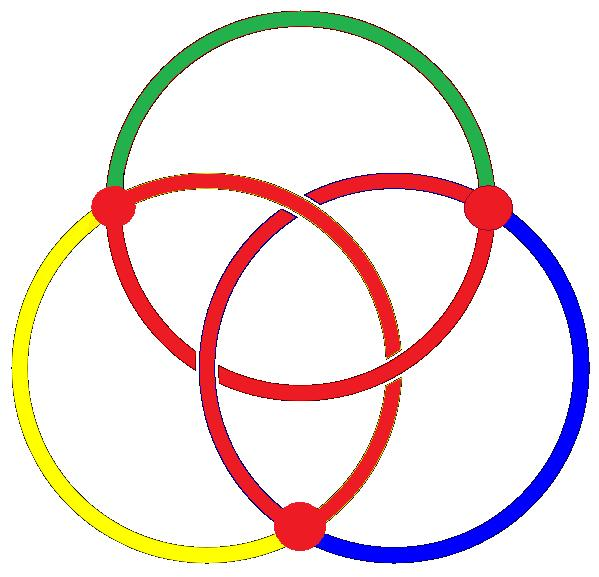→ 

<!-- id: s23-03-0007 -->

…je vous ai dit que le nœud à trois, j’avais fait la trouvaille qu’ils se nouaient entre eux, à trois, borroméen­nement.

<!-- id: s23-03-0008 -->

Je vous ai dit aussi en quoi - si l’on peut dire - c’était tout à fait justifiable par une explication.

<!-- id: s23-03-0009 -->

Je vous ai dit que je m’étais efforcé pendant deux mois de faire *ex-sister* pour ce *nœud* le plus simple, un *nœud borroméen à 4.* Je vous ai dit également que le fait que je n’y étais pas arrivé à le faire *ex-sister*, ne prouvait rien sinon ma maladresse.

<!-- id: s23-03-0010 -->

Je crois - je suis même sûr, je m’en souviens - je crois vous avoir dit que je croyais qu’il devait exister.

<!-- id: s23-03-0011 -->

J’ai eu le soir même la bonne surprise de voir surgir...

<!-- id: s23-03-0012 -->

> il était tard, je dirai même que j’étais sorti avec un peu de retard, vu mes devoirs ...j’ai donc vu surgir sur le pas de ma porte le nommé Thomé - pour le nommer - et qui venait m’apporter... et je l’en ai grandement remercié ...qui venait m’apporter...

<!-- id: s23-03-0013 -->

> fruit de sa collaboration avec Soury, Soury et Thomé : souvenez-vous de ces noms ...qui venait m’apporter la preuve que *le nœud borroméen à* 4, de 4 *nœuds à* 3, *existe* bien.

<!-- id: s23-03-0014 -->

Ce qui justifie assurément mon obstination, mais ce qui n’en rend pas moins déplorable mon incapacité.

<!-- id: s23-03-0015 -->

Je n’ai néanmoins pas accueilli la nouvelle, que ce problème était résolu, avec des sentiments mélangés...

<!-- id: s23-03-0016 -->

> mélangés de mon regret de mon impuissance avec celui du succès obtenu ...mes sentiments ne l’étaient pas, ils étaient purement et simple­ment d’enthousiasme.

<!-- id: s23-03-0017 -->

Et je crois leur en avoir montré quelque chose, quand je les ai vus quelques soirs après, soir où d’ailleurs ils n’ont pas pu me rendre compte de comment ils l’avaient trouvé. Ils l’avaient trouvé de fait, et j’espère n’avoir pas fait d’erreur en transcrivant, car ce n’est qu’une transcription, en transcrivant comme je l’ai fait sur ce papier central le fruit de leur trouvaille.

<!-- id: s23-03-0018 -->

Je l’ai reproduit, à peu de chose près. Je veux dire que c’est - c’est le cas de le dire - textuellement ce qu’ils ont élaboré, à part le fait que le trajet mis à plat, est à peine différent.

<!-- id: s23-03-0019 -->

Si ce trajet mis à plat est tel que je vous le présente, c’est pour que vous sentiez...

<!-- id: s23-03-0020 -->

> sentiez peut-être un peu mieux que dans la figure qu’ils m’ont faite ...que vous sentiez peut-être un peu mieux comment c’est fait :

<!-- id: s23-03-0021 -->

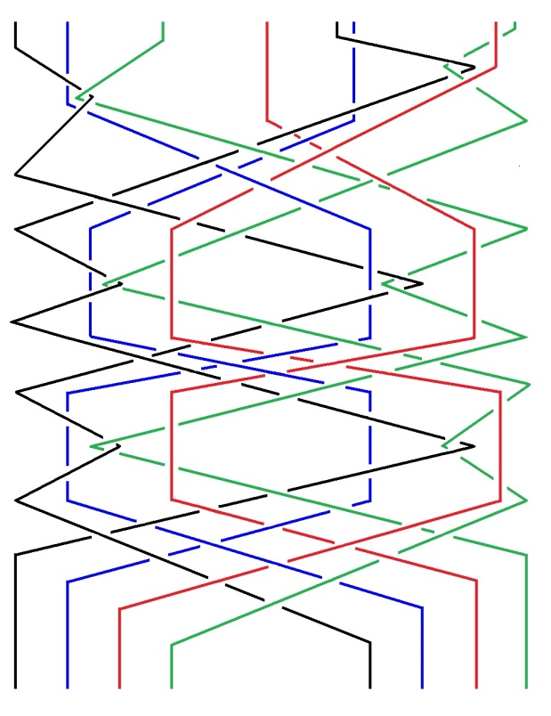

<!-- id: s23-03-0022 -->

Je pense que à l’aspect de cette figure - j’espère ! - chacun peut voir que, à supposer par exemple que le *nœud à trois* \- ici noir - le *nœud à trois* noir étant élidé, il paraît bien clair que les trois autres *nœud à trois* sont libres.

<!-- id: s23-03-0023 -->

Il est bien clair en effet que le *nœud à trois* vert est *<u>sous</u>* le *nœud à trois* rouge, qu’il suffit, ce *nœud à trois* vert, de le sortir du rouge, pour que le *nœud à trois* brun ici \[bleu\], se montre également libre.

<!-- id: s23-03-0024 -->

J’ai vu longuement Soury et Thomé.

<!-- id: s23-03-0025 -->

Je vous l’ai dit, ils ne m’ont pas fait de confidences sur la façon dont ils l’ont obtenu.

<!-- id: s23-03-0026 -->

Je pense d’ailleurs qu’il n’y en a pas qu’une, qu’il n’y a pas que celle-là.

<!-- id: s23-03-0027 -->

Et peut-être vous montrerai-je la prochaine fois, comment encore on peut l’obtenir.

<!-- id: s23-03-0028 -->

Je voudrais quand même commémorer ce menu événement...

<!-- id: s23-03-0029 -->

événement d’ailleurs que je considère comme pas menu, et je vais vous dire pourquoi ensuite, autrement dit pourquoi je cherchais ...je veux un peu plus commémorer notre rencontre.

<!-- id: s23-03-0030 -->

Je crois que le support de cette recherche est non pas ce que Sarah Kofman[^5] dans un livre, dans un article remarquable où elle a contribué, un article remarquable qu’elle appelle *Vautour Rouge* et qui n’est autre qu’une référence aux « *Élixirs du Diable »* célébrés par Freud, référence qu’elle reprend après l’avoir déjà une fois mentionnée dans son *Quatre romans analytiques*, livre entier d’elle, ceci n’empêchant pas que je vous recommande la lecture de cette *Mimesis* qui me paraît, avec ses cinq autres collaborateurs, réaliser quelque chose de remarquable.

<!-- id: s23-03-0031 -->

Je dois vous dire la vérité, je n’ai lu que l’article du premier, du troisième et du cinquième, parce que j’avais, en raison de la préparation de ce séminaire, d’autres chats à fouetter. Je crois néanmoins que *Mimesis* vaut tout à fait la peine d’être lu.

<!-- id: s23-03-0032 -->

Le premier article qui concerne Wittgenstein et disons le bruit qu’a fait son enseignement, est tout à fait remarquable. Celui-là, je l’ai lu de bout en bout. Néanmoins, je dois dire que cette géométrie qui est celle des nœuds, dont je vous ai dit qu’ils manifestent une géo­métrie tout à fait spécifique, originale, est quelque chose qui « *exorcise* » cette *inquiétante étrangeté*.

<!-- id: s23-03-0033 -->

Il y a là quelque chose de spécifique.

<!-- id: s23-03-0034 -->

L’*inquiétante étrangeté* relève de l’*imaginaire*, incon­testablement.

<!-- id: s23-03-0035 -->

Mais qu’il y ait quelque chose qui permette de l’*exorciser* est assurément de soi-même étrange.

<!-- id: s23-03-0036 -->

Pour spécifier où je mettrais ce dont il s’agit, c’est quelque part par là :

<!-- id: s23-03-0037 -->

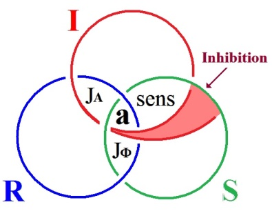

<!-- id: s23-03-0038 -->

Je veux dire que c’est pour autant que l’*imaginaire* se déploie selon le mode de deux cercles...

<!-- id: s23-03-0039 -->

> ce qui peut également se noter d’un dessin,
>
> et je dirai qu’un dessin ne note rien, pour autant que la mise à plat en reste énigmatique ...c’est pour autant qu’ici, joint à l’*imaginaire* du corps, quelque chose comme une *inhibition* spécifique, qui se caractériserait spécialement de l’*inquiétante étrangeté* que, provisoirement tout au moins, je me permettrais de noter ce qu’il en est, quant à sa place, de ladite *étrangeté*.

<!-- id: s23-03-0040 -->

La résistance que l’imagination éprouve à la cogitation de ce qu’il en est de cette nouvelle géométrie, est quelque chose qui me frappe, pour l’avoir éprouvé.

<!-- id: s23-03-0041 -->

Que Soury et Thomé aient été...

<!-- id: s23-03-0042 -->

> j’ose le dire, quoiqu’après tout, je n’en ai pas d’eux le témoignage ...aient été spécialement captivés, me semble-t-il, par ce qui, dans mon enseignement, a été conduit à explorer, sous le coup, sous le fait de ce que m’imposait la conjonction de *l’imaginaire, du symbolique et du réel*, qu’ils aient été attrapés tout spécialement par ce qu’il faut bien appeler *cette élucubration* qui est mienne, c’est quelque chose qui n’est certainement pas de pur hasard, disons que pour ça ils sont doués.

<!-- id: s23-03-0043 -->

L’étrange...

<!-- id: s23-03-0044 -->

> l’étrange, et c’est là-dessus que je me permets de trahir ce qu’ils ont pu me faire de confidence ...l’étrange, me semble-t-il, est ceci que...

<!-- id: s23-03-0045 -->

> et cela m’a saisi, étant donné ce que vous savez que je profère ...c’est qu’ils m’ont dit qu’ils s’y avançaient en parlant entre eux.

<!-- id: s23-03-0046 -->

Je ne leur en ai pas fait tout de suite la remarque, parce qu’à la vérité, cette confidence me semblait très précieuse, mais il est certain qu’on n’a pas l’habitude de penser à deux.

<!-- id: s23-03-0047 -->

*Le fait que ce soit en en parlant entre eux qu’ils arrivent à des résultats* qui ne sont pas remarquables seulement par cette réussite, il y a longtemps que ce qu’ils composent sur le nœud borroméen, me paraît plus qu’intéres­sant, me paraît un travail.

<!-- id: s23-03-0048 -->

Mais cette trouvaille n’en est certainement pas le couronnement. Ils en feront d’autres.

<!-- id: s23-03-0049 -->

Je n’ajouterai pas ce qu’a pu me dire nommément Soury sur le mode dont il pense l’enseignement.

<!-- id: s23-03-0050 -->

C’est une affaire où je pense qu’à suivre mon exemple, celui que j’ai qualifié tout à l’heure, il s’en acquittera certainement aussi bien que je puis le faire, c’est-à-dire de la même façon scabreuse.

<!-- id: s23-03-0051 -->

Mais que ceci puisse être conquis d’une telle trouvaille...

<!-- id: s23-03-0052 -->

> je ne sais pas d’ailleurs si spécialement cette trouvaille a été conquise dans le dialogue ...que le dialogue s’avère fécond spécialement dans ce domaine, c’est tout à fait, je puis dire, ce que confirme qu’il m’a manqué à moi.

<!-- id: s23-03-0053 -->

Je veux dire que pendant ces deux mois où je me suis acharné à trouver ce quatrième nœud à trois, et la façon dont aux deux autres... aux trois autres, il pouvait se nouer borroméennement, je le répète, c’est assurément que je l’ai cherché *seul*. Je veux dire en espérant dans ma cogitation.

<!-- id: s23-03-0054 -->

Qu’importe, je n’insiste pas.

<!-- id: s23-03-0055 -->

Il est temps de dire en quoi cette recherche m’importait.

<!-- id: s23-03-0056 -->

Cette recherche m’importait extrêmement pour la raison sui­vante : les trois cercles du nœud borroméen ont ceci qui ne peut man­quer d’être retenu, c’est qu’ils sont - à titre de cercles - tous trois équivalents.

<!-- id: s23-03-0057 -->

Je veux dire qu’ils sont constitués de quelque chose qui se reproduit dans les trois.

<!-- id: s23-03-0058 -->

Ce n’est pas par hasard que je supporte de *l’imaginaire*, spéciale­ment...

<!-- id: s23-03-0059 -->

c’est le résultat d’une certaine, disons *concentration* ...que ce soit dans *l’imaginaire* que je mette le support de ce qui est la *consistance*.

<!-- id: s23-03-0060 -->

De même, que ce soit *le trou* que je fasse l’essentiel de ce qu’il en est du *symbolique,* et que, en raison du fait que le *réel*, justement de la liberté de ces deux, de ce que *l’imaginaire* et le *symbolique*...

<!-- id: s23-03-0061 -->

c’est la définition même du nœud borroméen ...soient libres l’un de l’autre, que je supporte ce que j’appelle *l’ex-sistence*, spécialement du *réel*, en ce sens qu’à « *sister »* hors de *l’imaginaire* et du *symbolique*, il cogne, il joue tout spécialement dans quelque chose qui est de l’ordre de la limitation.

<!-- id: s23-03-0062 -->

Les deux autres - à partir du moment où il est *borroméennement* noué - les deux autres lui résistent.

<!-- id: s23-03-0063 -->

C’est dire *que le réel n’a d’ex-sistence*...

<!-- id: s23-03-0064 -->

et c’est bien étonnant que je le formule ainsi ...n’a d’*ex-sistence* *qu’à rencontrer, du symbolique et de l’imaginaire, l’arrêt*

<!-- id: s23-03-0065 -->

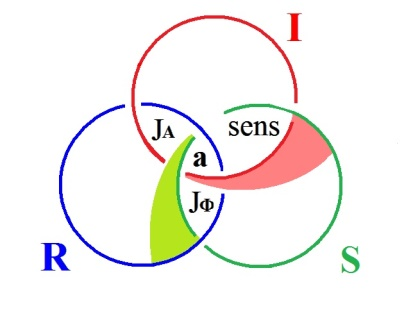

<!-- id: s23-03-0066 -->

Bien sûr, n’est-ce pas là un fait de simple hasard.

<!-- id: s23-03-0067 -->

Il faut en dire autant des deux autres.

<!-- id: s23-03-0068 -->

C’est en tant qu’il *ex-siste* au *réel* que *l’imaginaire* rencontre aussi le heurt qui ici se sent mieux.

<!-- id: s23-03-0069 -->

Pourquoi dès lors, mets-je cette *ex-sistence*, précisément là où elle peut sembler la plus paradoxale ?

<!-- id: s23-03-0070 -->

C’est qu’il me faut bien répartir ces trois modes, et que c’est justement d’*ex-sister* que se supporte la pensée du *réel*.

<!-- id: s23-03-0071 -->

Mais qu’en résulte-t-il, si ce n’est qu’il nous faut, ces trois termes, les concevoir comme se rejoignant l’un à l’autre ?

<!-- id: s23-03-0072 -->

*S’ils sont si analogues*, c’est exactement que, pour employer ce terme, *est-ce qu’on ne peut pas supposer que ce soit d’une continuité ?*

<!-- id: s23-03-0073 -->

→ 

<!-- id: s23-03-0074 -->

Et c’est là ce qui nous mène tout droit à faire *le nœud à trois*.

<!-- id: s23-03-0075 -->

Car il n’y a pas beaucoup d’effort à commettre pour...

<!-- id: s23-03-0076 -->

de la façon dont ils s’équilibrent, se superposent ...joindre les points de la mise à plat qui d’eux feront continuité.

<!-- id: s23-03-0077 -->

Mais alors, qu’en résulte-t-il ?

<!-- id: s23-03-0078 -->

Qu’en résulte-t-il pour que de ce nœud, quelque chose qu’il faut bien appeler de l’ordre du *sujet*...

<!-- id: s23-03-0079 -->

*pour autant que <u>le sujet n’est jamais que supposé</u>* ...ce qui de l’ordre du *sujet* dans ce *nœud à trois*, se trouve en somme supporté ?

<!-- id: s23-03-0080 -->

Est-ce à dire que si le nœud à trois se noue lui-même *borroméennement* - au moins à trois - cela nous suffise ?

<!-- id: s23-03-0081 -->

C’est justement sur ce point que ma question portait.

<!-- id: s23-03-0082 -->

Dans une figure, une chaîne borroméenne, est-ce qu’il ne nous apparaît pas que le minimum est toujours constitué par *un nœud à quatre* ?

<!-- id: s23-03-0083 -->

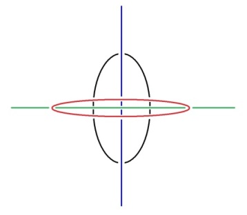

<!-- id: s23-03-0084 -->

Je veux dire que c’est à tirer cette corde verte pour que vous vous aperceviez que le cercle noir, ici noué avec la corde rouge, sera - en étant tiré par cette corde bleue - sera, manifestera, la forme sensible d’une *chaîne borroméenne.*

<!-- id: s23-03-0085 -->

Il semble que le moins qu’on puisse attendre de cette *chaîne borroméenne*, c’est ce rapport de *un* à *trois autres*.

<!-- id: s23-03-0086 -->

Et si nous supposons...

<!-- id: s23-03-0087 -->

comme nous en avons là la preuve ...si nous pensons effectivement qu’un *nœud à trois*...

<!-- id: s23-03-0088 -->

car celui-là n’est pas moins un nœud à trois :

<!-- id: s23-03-0089 -->

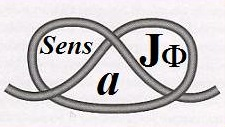

<!-- id: s23-03-0090 -->

...que ces nœuds se composeront borroméennement l’un avec l’autre, nous aurons, nous toucherons ceci : que c’est toujours de 3 supports...

<!-- id: s23-03-0091 -->

que nous appellerons en l’occasion subjectifs, c’est-à-dire personnels ...qu’un 4ème prendra appui.

<!-- id: s23-03-0092 -->

Et si vous vous souvenez du mode sous lequel j’ai introduit ce quart élément...

<!-- id: s23-03-0093 -->

> chacun des autres est supposé constituer quelque chose de personnel au regard de ces trois éléments ...le *quart* sera ce que j’énonce cette année comme *le sinthome*.

<!-- id: s23-03-0094 -->

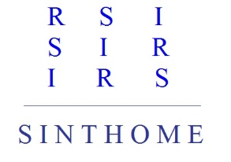

<!-- id: s23-03-0095 -->

Ce n’est pas pour rien que j’ai écrit ces choses dans un certain ordre : R.S.I, S.I.R, I.R.S, c’est bien à quoi répondait mon titre de l’année dernière.

<!-- id: s23-03-0096 -->

C’est qu’aussi bien, les mêmes...

<!-- id: s23-03-0097 -->

> les mêmes Soury et Thomé, j’y ai déjà fait allusion expressément dans ce séminaire, ...ont mis en valeur que pour ce qui en est des nœuds borroméens en question, à partir du moment où ils sont *orientés et coloriés*, il y en a deux de nature différente.

<!-- id: s23-03-0098 -->

Qu’est-ce à dire ?

<!-- id: s23-03-0099 -->

Dans la mise à plat, déjà on peut le mettre en valeur.

<!-- id: s23-03-0100 -->

Ici, j’abrège. Je vous indique seulement dans quel sens en faire l’épreuve.

<!-- id: s23-03-0101 -->

Je vous ai dit l’équivalence de ces trois cercles, de ces trois ronds de ficelle.

<!-- id: s23-03-0102 -->

Il est remarquable que ce soit seulement à ce que, non pas *entre eux* que soit marquée l’identité d’aucun...

<!-- id: s23-03-0103 -->

> car l’identité, ça serait les marquer par la lettre initiale, dire R, I et S,
>
> c’est déjà les intituler chacun, chacun comme tel, du *réel*, du *symbolique* et de *l’imaginaire* ...mais il est notable qu’il apparaisse que ce qui se distingue entre eux d’efficace dans l’orientation, ne soit repérable que de ce que soit par la couleur marquée leur différence, non pas de l’un à l’autre, mais leur différence, si je puis dire « *absolue »*, en ce qu’elle est la différence commune aux trois.

<!-- id: s23-03-0104 -->

C’est pour qu’il y ait quelque chose qui est *Un*...

<!-- id: s23-03-0105 -->

> mais qui, comme tel, marque la différence *entre les trois*, et non pas la différence à deux ...qu’il apparaît en conséquence la distinction de *deux structures de nœuds borroméens*.

<!-- id: s23-03-0106 -->

Lequel est *le vrai* ?

<!-- id: s23-03-0107 -->

Est *le vrai* au regard de ce qu’il en est de *la façon dont* *se nouent* *l’imaginaire, le symbolique et le réel* dans ce qui supporte le *sujet* ? Voilà la question qui mérite d’être interrogée.

<!-- id: s23-03-0108 -->

Qu’on se reporte à mes précédentes allusions à cette dualité du *nœud borroméen* pour l’apprécier, car je n’ai pu aujourd’hui que l’évoquer un instant.

<!-- id: s23-03-0109 -->

Il y a quelque chose de remarquable, c’est que *le nœud à trois* par contre, ne porte pas trace de cette différence.

<!-- id: s23-03-0110 -->

Dans *le nœud à trois*, c’est-à-dire dans le fait que nous mettons *l’imaginaire, le symbolique et le réel* en continuité, on ne s’étonnera pas que nous y voyions qu’il n’y a qu’un seul *nœud à trois*.

<!-- id: s23-03-0111 -->

→ 

<!-- id: s23-03-0112 -->

J’espère que il y en a ici suffisamment qui prennent des notes. Car ceci est important.

<!-- id: s23-03-0113 -->

Important pour vous suggé­rer d’aller vérifier ce dont il s’agit, à savoir nommément que du *nœud à trois*, qui homogénéise le nœud borroméen, il y en a par contre qu’une espèce.

<!-- id: s23-03-0114 -->

Est-ce à dire que ce soit vrai ?

<!-- id: s23-03-0115 -->

Chacun sait que de *nœud à trois*, il y en a deux.

<!-- id: s23-03-0116 -->

Il y en a deux selon qu’il est *dextrogyre* ou *lévogyre*.

<!-- id: s23-03-0117 -->

C’est donc là un problème que je vous pose : quel est le lien entre

<!-- id: s23-03-0118 -->

- ces deux espèces de *nœuds borroméens,*

<!-- id: s23-03-0119 -->

- et les deux espèces de *nœuds à trois* ?

<!-- id: s23-03-0120 -->

Quoiqu’il en soit, si le *nœud à trois* est bien le support de toute espèce de *sujet*, comment l’interroger ?

<!-- id: s23-03-0121 -->

Comment l’interroger de telle sorte que ce soit bien d’un *sujet* qu’il s’agisse ?

<!-- id: s23-03-0122 -->

Il fut un temps ou j’avançais dans une certaine voie, avant que je ne sois sur la voie de l’analyse, c’est celui de ma thèse : *De la psychose paranoïaque dans ses rapports -* disais-je - *avec la personnalité.*

<!-- id: s23-03-0123 -->

Si j’ai si long­temps résisté à la republication de ma thèse, c’est simplement pour ceci, c’est que *la psychose paranoïaque et la personnalité -* comme telles - n’ont pas de rapport, simplement pour ceci : *c’est parce que c’est la même chose.*

<!-- id: s23-03-0124 -->

En tant qu’un *sujet* noue *à trois* *l’imaginaire, le symbolique et le réel*, il n’est supporté que de leur *continuité.*

<!-- id: s23-03-0125 -->

*L’imaginaire, le symbolique et le réel* sont une seule et même consistance.

<!-- id: s23-03-0126 -->

Et c’est en cela que consiste *la psychose paranoïaque*.

<!-- id: s23-03-0127 -->

À bien entendre ce que j’énonce aujourd’hui, on pourrait en déduire qu’à trois paranoïaques pourrait être noué, au titre de *symp­tôme,* un 4ème terme qui se situerait comme tel comme personnalité, en tant qu’elle-même elle serait...

<!-- id: s23-03-0128 -->

au regard des trois personnalités précé­dentes ...distincte, et leur *symp­tôme*.

<!-- id: s23-03-0129 -->

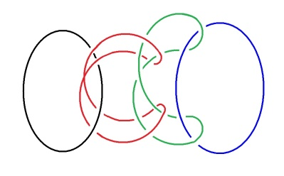

<!-- id: s23-03-0130 -->

Est-ce à dire qu’elle serait *paranoïaque* elle aussi ?

<!-- id: s23-03-0131 -->

Rien ne l’indique dans le cas...

<!-- id: s23-03-0132 -->

le cas qui est plus que probable, qui est certain ...où c’est d’un nombre indéfini de *nœuds à trois* qu’une chaîne borroméenne peut être constituée.

<!-- id: s23-03-0133 -->

Ce qui n’empêche pas que, au regard de cette chaîne...

<!-- id: s23-03-0134 -->

> qui dès lors ne constitue plus une paranoïa, si ce n’est qu’elle est commune ...au regard de cette chaîne, la floculation possible de quarts termes... dans cette tresse qui est la tresse subjective ...la floculation possible, terminale, de *quarts termes* nous laisse la possibilité de supposer que sur la totalité de la texture, il y a certains points élus qui - de ce nœud à quatre - se trouvent le terme.

<!-- id: s23-03-0135 -->

Et c’est bien en cela que consiste, à proprement parler *le sinthome*, et *le sinthome* non pas en tant qu’il est personnalité, mais qu’au regard de trois autres, il se spécifie d’être *sinthome* <u>et</u> névrotique.

<!-- id: s23-03-0136 -->

Et c’est en cela qu’un aperçu nous est donné sur ce qu’il en est de l’inconscient : c’est en tant que *le sinthome* le spécifie, qu’il y a un terme qui s’y rattache plus spécialement, qui au regard de ce qu’il en est du *sinthome*, a un rapport privilégié.

<!-- id: s23-03-0137 -->

De même qu’ici dans *le nœud à* 3 noué *borroméennement à* 4: vous voyez qu’il y a une réponse particulière du rouge au brun \[bleu\], de même qu’il y a une réponse particulière du vert au noir.

<!-- id: s23-03-0138 -->

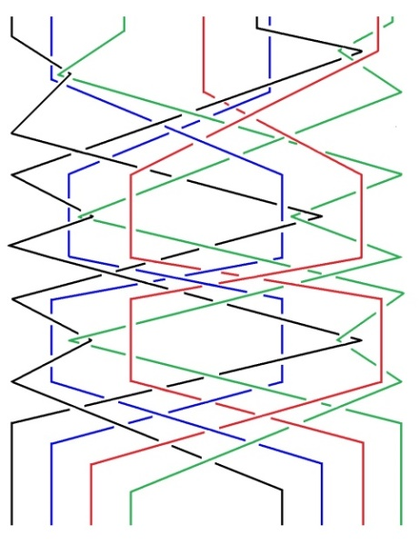

<!-- id: s23-03-0139 -->

C’est en tant que l’un des deux couples se distingue de ce nœud spécifique avec une autre couleur...

<!-- id: s23-03-0140 -->

pour reprendre le terme dont je me servais tout à l’heure ...c’est en tant qu’il y un lien du *sinthome* à quelque chose de particulier dans cet ensemble à quatre : c’est, pour tout dire, pour autant qu’il y a ce lien...

<!-- id: s23-03-0141 -->

on ne sait pas si c’est celui-ci ou celui-là ...c’est pour autant que nous avons un couple rouge-vert ici à gauche, bleu-rouge ici à droite, que nous avons un couple.

<!-- id: s23-03-0142 -->

Et c’est en tant que le *sinthome* se relie à l’inconscient, et que *l’imaginaire* se lie au *réel*, que nous avons affaire à quelque chose dont surgit le *sinthome*.

<!-- id: s23-03-0143 -->

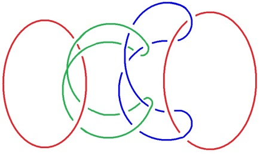

<!-- id: s23-03-0144 -->

Voilà les choses difficiles que je voulais, pour vous, énoncer aujour­d’hui.

<!-- id: s23-03-0145 -->

Assurément, ceci mérite *le complément*, *le complément* de la raison pourquoi ici j’ai en quelque sorte ouvert le *nœud à trois*, pour­quoi j’en ai donné la forme que vous voyez ici :

<!-- id: s23-03-0146 -->

<!-- id: s23-03-0147 -->

qui n’est pas celle qui se trouve dessinée de la façon que vous voyez en bas, circulaire :

<!-- id: s23-03-0148 -->

<!-- id: s23-03-0149 -->

Elle résulte de ceci : c’est qu’au regard de ce champ, que j’ai déjà ici noté de **JA**, il s’agit de la jouissance, de la jouissance, non pas de l’Autre, au titre de ceci que j’ai énoncé :

<!-- id: s23-03-0150 -->

- *qu’il n’y a pas d’Autre de l’Autre*,

<!-- id: s23-03-0151 -->

- qu’au *symbolique* - *lieu de l’Autre* comme tel - rien n’est opposé,

<!-- id: s23-03-0152 -->

- *qu’il n’y a pas de jouissance de l’Autre en ceci qu’il n’y a pas d’Autre de l’Autre, et que c’est ce que veut dire cet A barré* \[**A**\].

<!-- id: s23-03-0153 -->

Il en résulte qu’ici **JA** : cette jouissance de l’Autre de l’Autre qui n’est pas possible pour la simple raison qu’il n’y en a pas ...dès lors ce qui en résulte est ceci : que seul reste ce qui se produit dans le champ de mise à plat du *cercle du symbolique* avec *le cercle de l’imaginaire* qui est le *sens,* et que d’autre part, ce qui est ici indiqué, figuré, c’est le rapport rapport du *symbolique* avec le *réel,* en tant que de lui sort *la jouissance* dite *« du phallus »*, qui n’est certes pas en elle-même la jouis­sance comme telle pénienne, mais qui...

<!-- id: s23-03-0154 -->

> si nous considérons ce qu’il advient au regard de l*’imaginaire*, c’est-à-dire de la jouissance du dou­ble, de l’image spéculaire, de la jouissance du corps en tant qu’imagi­naire ...il est le support d’un certain nombre de béances, lesquelles constituent proprement les différents *objets* qui l’occupent.

<!-- id: s23-03-0155 -->

Par contre, la jouissance dite *phallique* se situe là \[**JΦ**\], à la conjonction du *Symbolique* avec le *Réel.*

<!-- id: s23-03-0156 -->

C’est pour autant que chez le sujet qui se supporte du *parlêtre*...

<!-- id: s23-03-0157 -->

au sens que c’est là ce que je désigne comme étant l’*inconscient* ...il y a...

<!-- id: s23-03-0158 -->

et c’est dans ce champ que *la jouissance phallique* s’inscrit ...il y a le pouvoir...

<!-- id: s23-03-0159 -->

le pouvoir en somme appelé, supporté ...le pouvoir de conjoindre ce qu’il en est *d’une certaine jouissance* qui, du fait de cette parole elle-même, conjoint une jouissance éprouvée - éprouvée du fait du parlêtre - comme une jouissance parasitaire et qui est celle dite du *phallus*.

<!-- id: s23-03-0160 -->

C’est bien celle que j’inscris ici \[**JΦ**\] comme balance à ce qu’il en est du « *sens »*.

<!-- id: s23-03-0161 -->

C’est le lieu de ce qui - par le parlêtre - est désigné en conscience, comme *pouvoir*.

<!-- id: s23-03-0162 -->

Ce qui *mime*...

<!-- id: s23-03-0163 -->

pour conclure sur quelque chose dont je vous ai proposé la lecture \[*cf. supra* « *Mimesis des articulations *»\] ...c’est le fait que les trois ronds participent :

<!-- id: s23-03-0164 -->

- de *l’imaginaire* en tant que *consistance*,

<!-- id: s23-03-0165 -->

- du *symbolique* en tant que *trou*,

<!-- id: s23-03-0166 -->

- et du *réel* en tant qu’à eux *ex-sistant*.

<!-- id: s23-03-0167 -->

Les trois ronds donc s’imitent.

<!-- id: s23-03-0168 -->

Il est d’autant plus difficile de ce faire, qu’ils ne s’imitent pas simplement.

<!-- id: s23-03-0169 -->

Que du fait du *dit*, ils se composent dans un *nœud triple*.

<!-- id: s23-03-0170 -->

D’où mon souci, après avoir fait la trouvaille que ce nœud triple se nouait à 3 borroméen­nement, j’ai constaté que s’ils se sont conservés libres entre eux, un nœud triple...

<!-- id: s23-03-0171 -->

jouant dans une pleine application de sa texture ...*ex-siste*, qui est bel et bien 4ème, et qui s’appelle *le sinthome*.

<!-- id: s23-03-0172 -->

Voilà !

## Notes

[^5]: 5 Sarah Kofman : - *Vautour Rouge* (Le double dans les élixirs du diable d’Hoffmann) in *Mimesis des articulations*, Aubier-Flammarion, 1975,

    .- *Quatre romans analytiques*, éd. Galilée, 1974.

    #
