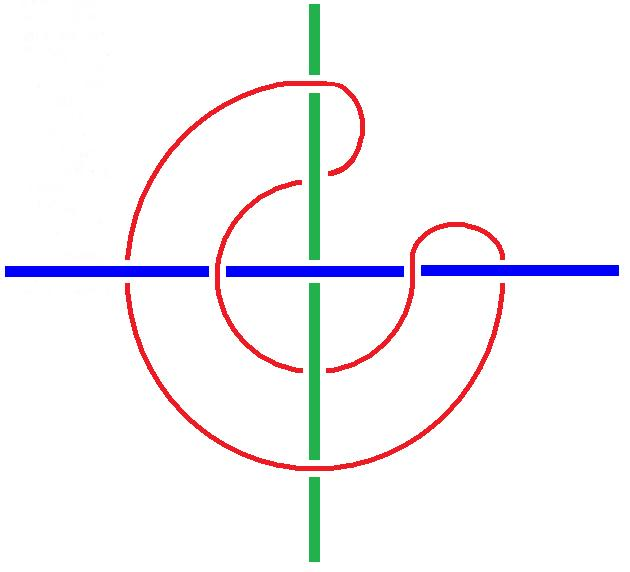
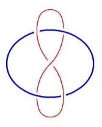
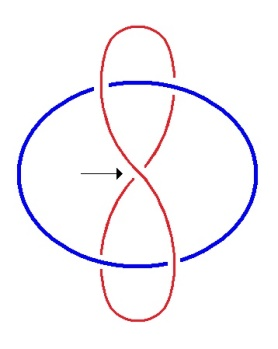
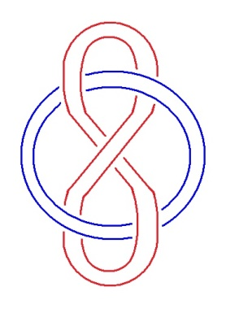

# Leçon 09 | 16 Mars 1976

<!-- source-url: http://staferla.free.fr/S23/S23 LE SINTHOME.docx -->
<!-- seminar: s23 -->
<!-- lesson: 09 -->

<!-- id: s23-09-0001 -->

Ça, c’est le dernier truc que m’ont donné Soury et Thomé :

<!-- id: s23-09-0002 -->

<!-- id: s23-09-0003 -->

C’est un nœud borroméen de mon espèce, fait de deux droites infinies et de quelque chose de circulaire.

<!-- id: s23-09-0004 -->

Vous pouvez constater avec un peu d’efforts sans doute, que c’est borroméen. Voilà !

<!-- id: s23-09-0005 -->

Alors, la seule excuse...

<!-- id: s23-09-0006 -->

> parce qu’à la vérité, j’ai besoin d’excuses. J’ai besoin d’excuses au moins à mes yeux ...la seule excuse que j’ai, de vous dire quelque chose aujourd’hui, c’est que ça va être *sensé*.

<!-- id: s23-09-0007 -->

Moyen­nant quoi je ne réaliserai pas ce que je voudrais - et vous allez voir que j’éclairerai ça – ce que je voudrais c’est vous donner un *bout* - ça peut pas s’appeler autrement - *un bout de Réel*.

<!-- id: s23-09-0008 -->

J’en suis réduit à me dire qu’il y a du *sensé* qui peut servir provisoirement, mais ce provisoire est fragile.

<!-- id: s23-09-0009 -->

Je veux dire que je suis pas sûr de combien de temps ça pourra servir. Voilà.

<!-- id: s23-09-0010 -->

Je me suis beaucoup préoccupé de Joyce tous ces temps-ci, je vais vous dire en quoi Joyce, si on peut dire, est stimulant. C’est qu’il suggère - il suggère mais ce n’est qu’une suggestion - il suggère une façon aisée de le présenter.

<!-- id: s23-09-0011 -->

Moyennant quoi - et c’est bien là sa valeur, son poids - moyennant quoi tout le monde s’y casse les dents.

<!-- id: s23-09-0012 -->

Même mon ami Jacques Aubert qui est là au premier rang et devant qui je me sens indigne.

<!-- id: s23-09-0013 -->

J’ai dit que s’il s’y cassait les dents lui-même, parce que Jacques Aubert n’arrive pas...

<!-- id: s23-09-0014 -->

> pas plus que n’importe qui d’ailleurs, pas plus qu’un nommé Adams
>
> qui a fait des tours de force dans ce genre ...n’arrive pas à cette façon aisée de le présenter.

<!-- id: s23-09-0015 -->

Je vais peut-être tout à l’heure, vous indiquer moi-même - non pas vous suggérer - vous indiquer à quoi ça tient.

<!-- id: s23-09-0016 -->

Bien sûr moi aussi j’ai rêvé - et c’est à prendre au sens littéral - de cette façon aisée de le présenter. J’en ai rêvé cette nuit. Vous, évidem­ment – « *évidement* » comme on dit - vous, évidemment, étiez mon public mais j’étais pas acteur.

<!-- id: s23-09-0017 -->

J’étais même pas acteur du tout.

<!-- id: s23-09-0018 -->

Ce dont je vous faisais part était la façon dont je...

<!-- id: s23-09-0019 -->

pas acteur du tout : scribouilleur, j’appellerais plutôt ça ...dont je jugeais les personnages autres que le mien.

<!-- id: s23-09-0020 -->

En quoi, évidemment, je sortais du mien, ou plutôt je n’avais pas de rôle.

<!-- id: s23-09-0021 -->

C’était quelque chose dans le genre d’un psychodrame, ce qui est une interprétation.

<!-- id: s23-09-0022 -->

Que Joyce m’ai fait rêver, de fonctionner comme ça, doit avoir une valeur, une valeur pas facile à extraire d’ailleurs. Puisque, comme je l’ai dit, il suggère ça à n’importe qui, qu’il doit y avoir un Joyce maniable.

<!-- id: s23-09-0023 -->

Il suggère ça du fait qu’il y a la psychanalyse.

<!-- id: s23-09-0024 -->

Et c’est bien sur cette piste qu’un tas de gens se précipitent, mais ce n’est pas parce que je suis *psychanalyste*, et du même coup trop intéressé, qu’il faut que je me refuse à l’envisager sous ce jour.

<!-- id: s23-09-0025 -->

Il y a là, quand même, quelque chose d’objectif.

<!-- id: s23-09-0026 -->

Joyce est un « *a-Freud* », je dirai, avec le jeu de mot sur affreux. Il est un « *a-Joyce* ».

<!-- id: s23-09-0027 -->

Tout objet - tout objet sauf *l’objet* dit par moi *petit a*, qui est un absolu - tout objet tient à une relation.

<!-- id: s23-09-0028 -->

L’ennuyeux est qu’il y ait le langage, et que les relations s’y expriment - dans le langage - avec des épithètes.

<!-- id: s23-09-0029 -->

Les épithètes, cela pousse au « *oui ou non* ».

<!-- id: s23-09-0030 -->

Un nommé Charles Sanders Peirce a construit là-dessus sa logique à lui, qui du fait de l’accent qu’il met sur la relation, l’amène à faire une logique trinitaire. C’est tout à fait la même voie que je suis.

<!-- id: s23-09-0031 -->

À ceci près que j’appelle les choses dont il s’agit par leur nom : *Symbolique, Imaginaire et Réel*, dans le bon ordre.

<!-- id: s23-09-0032 -->

Car, pousser au « *oui ou non* », c’est pousser au *couple*.

<!-- id: s23-09-0033 -->

Parce qu’il y a un rapport entre langage et sexe.

<!-- id: s23-09-0034 -->

Un rapport certes pas encore tout à fait précisé, mais que j’ai, si l’on peut dire, entamé.

<!-- id: s23-09-0035 -->

Vous voyez ça - hein ! - en employant le mot « *entamé* », je me rends compte que je fais une métaphore.

<!-- id: s23-09-0036 -->

Et qu’est-ce qu’elle veut dire, cette métaphore ?

<!-- id: s23-09-0037 -->

La métaphore, je peux en parler au sens général.

<!-- id: s23-09-0038 -->

Mais ce qu’elle veut dire, celle-là, ben, je vous laisse le soin de le découvrir.

<!-- id: s23-09-0039 -->

La métaphore n’indique que ça : le rapport sexuel.

<!-- id: s23-09-0040 -->

À ceci près qu’elle prouve de fait - du fait qu’elle existe - que le rapport sexuel c’est « *prendre une vessie pour une lanterne* ». C’est-à-dire ce qu’on peut dire de mieux pour exprimer une confusion : une vessie peut faire une lanterne, à condition de mettre du feu à l’intérieur, mais tant qu’il n’y a pas de feu, ce n’est pas une lanterne.

<!-- id: s23-09-0041 -->

D’où vient le feu ?

<!-- id: s23-09-0042 -->

Le feu, c’est le *Réel*.

<!-- id: s23-09-0043 -->

Ça met le feu à tout, le *Réel* je dis... Mais c’est un feu froid.

<!-- id: s23-09-0044 -->

Le feu qui brûle est un masque, si je puis dire, du *Réel*.

<!-- id: s23-09-0045 -->

Le *Réel* en est à chercher de l’autre côté, du côté du zéro absolu.

<!-- id: s23-09-0046 -->

On y est arrivé, quand même à ça.

<!-- id: s23-09-0047 -->

Pas de limite à ce qu’on peut imaginer comme haute température... pas de limite imaginable pour l’instant.

<!-- id: s23-09-0048 -->

La seule chose qu’il y ait de *Réel*, c’est la limite du bas.

<!-- id: s23-09-0049 -->

C’est ça que j’appelle quelque chose d’orientable.

<!-- id: s23-09-0050 -->

C’est pourquoi le *Réel* l’est.

<!-- id: s23-09-0051 -->

Il y a une orientation, mais cette orientation n’est pas un sens.

<!-- id: s23-09-0052 -->

Qu’est-ce que ça veut dire ?

<!-- id: s23-09-0053 -->

Ça veut dire que je reprends ce que j’ai dit la dernière fois, en suggérant que le *sens*, c’est peut-être l’orientation, mais l’orientation n’est pas un *sens,* puisqu’elle exclut le seul fait de la copulation du *Symbolique* et de l’*Imaginaire* en quoi consiste le *sens*. *L’orientation du Réel, dans mon ternaire à moi, forclôt le sens.*

<!-- id: s23-09-0054 -->

Je dis ça parce qu’on m’a posé la question hier soir : de savoir s’il y avait d’autres forclusions que celle qui résulte de la forclusion du *Nom-du-Père*.

<!-- id: s23-09-0055 -->

Il est bien certain que la forclusion, ça a quelque chose de plus radical, puisque le *Nom-du-Père* c’est quelque chose, en fin de compte, de léger.

<!-- id: s23-09-0056 -->

Mais il est certain que c’est là que ça peut servir, au lieu de la forclusion du sens par l’orientation du *Réel*, ben nous n’en sommes pas encore là.

<!-- id: s23-09-0057 -->

Il faut se *briser*, si je puis dire, à un nouvel *Imaginaire* concernant le *sens*. C’est ce que j’essaie d’instaurer avec mon langage. Ce langage a l’avantage de parier sur la psychanalyse en tant que j’essaie de l’instituer comme discours, c’est-à-dire comme le semblant le plus vraisemblable.

<!-- id: s23-09-0058 -->

*<u>C’est un exemple</u>* en somme, *<u>la psychanalyse</u>*, rien de plus, *<u>de court-circuit passant par le sens</u>*, *<u>le sens comme</u>* tel que j’ai *<u>défini</u>* tout à l’heure de la copulation, en somme, du langage...

<!-- id: s23-09-0059 -->

puisque c’est de ça que je supporte l’Inconscient ...*<u>de la copulation du langage avec notre propre corps</u>*.

<!-- id: s23-09-0060 -->

Il faut vous dire que dans l’intervalle j’ai été entendre Jacques Aubert...

<!-- id: s23-09-0061 -->

quelque part où vous n’étiez pas conviés ...et que là j’ai fait quelques réflexions sur l’*ego,* ce que les Anglais appellent l’*ego*, et les Allemands l’*Ich*.

<!-- id: s23-09-0062 -->

L’*ego* c’est un truc, c’est un truc à propos de quoi j’ai *cogité* \[Sic\].

<!-- id: s23-09-0063 -->

J’ai cogité autour d’un nœud, un nœud qu’a cogité lui-même un mathématicien qui n’a d’autre nom que Milnor.

<!-- id: s23-09-0064 -->

Il a inventé quelque chose, à savoir une idée de *chaîne*, il appelle ça, en anglais *link*.

<!-- id: s23-09-0065 -->

Il faut que je dessine ça autrement parce que c’est de ça qu’il s’agit. Ça c’est *un nœud*. Je le refais, parce que, bien entendu, comme chaque fois que je dessine un nœud, j’ai cafouillé, c’est pas la première fois que ça m’arrive devant vous.

<!-- id: s23-09-0066 -->

Voilà, c’est correct dans le bas.

<!-- id: s23-09-0067 -->

<!-- id: s23-09-0068 -->

Mais supposez, dit Milnor, que vous vous donniez cette permission que dans une chaîne quelconque...

<!-- id: s23-09-0069 -->

celle-là : chaîne à deux élé­ments ...que dans une chaîne quelconque un même élément puisse se traverser lui-même.

<!-- id: s23-09-0070 -->

Alors, vous obtenez ceci :

<!-- id: s23-09-0071 -->

<!-- id: s23-09-0072 -->

qui vous montre tout de suite, que du fait qu’un élément puisse se traverser lui-même, il en résulte que ce qui était au-dessus ici est là en-dessous : il n’y a plus de nœud...

<!-- id: s23-09-0073 -->

il y en a, bien sûr, une quantité d’autres exemples ...il n’y a plus de *link*.

<!-- id: s23-09-0074 -->

Ce que je propose à votre astuce, c’est ceci : de remarquer que si - dans le premier nœud - vous doublez chacun des éléments de ladite chaîne, c’est-à-dire qu’au lieu d’en avoir un ici, vous en ayez deux ayant la même circulation et que vous en fassiez de même pour ici :

<!-- id: s23-09-0075 -->

<!-- id: s23-09-0076 -->

il ne sera plus vrai, aussi invraisemblable que cela puisse vous paraître...

<!-- id: s23-09-0077 -->

et vous le contrôlerez j’espère, je n’ai pas apporté mes dessins de sorte que, comme d’autre part je n’ai fait mettre ici qu’un papier blanc, je ne me risquerai pas à vous montrer comment ceci se tortille ...il suffit qu’il y en ait deux...

<!-- id: s23-09-0078 -->

ce qui pourtant semble ne pas faire objection, puisque un - une boucle en huit - si elle se traverse elle-même, se libère aisément - *du circu­laire ou de l’ovale* tel que je l’ai dessiné - se libère aisé­ment quand ce huit en ques­tion se traverse lui-même ...pourquoi ça ne serait-il pas aussi vrai quand il y en a deux ? Je dis deux huit et deux ovales.

<!-- id: s23-09-0079 -->

Il n’en reste pas moins que...

<!-- id: s23-09-0080 -->

> vous le contrôlerez j’es­père, j’y reviendrai la pro­chaine fois ...non seulement il y a un obstacle, mais il est *radi­calement impossible* de sépa­rer les quatre éléments.

<!-- id: s23-09-0081 -->

Là-dessus, il faut que je dise que je ne peux pas tracer tous les algorithmes que j’ai énoncés du type : S de A barré \[**S(A)**\].

<!-- id: s23-09-0082 -->

Que veut dire que je proteste, dans mon séminaire *Encore,* paraît-il...

<!-- id: s23-09-0083 -->

> parce que bien sûr je le lis jamais, c’est les autres qui le lisent ...contre l’équivalence donnée, paraît-il par certains - je l’avais totalement oublié - du S(**A**) avec la fonction Φ... je dis, non pas le petit φ mais le grand Φ ...qui est *une fonction*, comme l’implique ce que j’ai indiqué, à savoir qu’*il existe un x pour qui cette fonction est négative* : : §.

<!-- id: s23-09-0084 -->

Bien sûr, l’idéal du mathème est que tout se corresponde.

<!-- id: s23-09-0085 -->

C’est bien en quoi le mathème - au *Réel* - en rajoute.

<!-- id: s23-09-0086 -->

Car contrairement à ce qu’on s’imagine - on ne sait pourquoi - ce n’est pas la fin du *Réel*.

<!-- id: s23-09-0087 -->

Comme je l’ai dit tout à l’heure, nous ne pouvons atteindre que « *des bouts de* *Réel »*.

<!-- id: s23-09-0088 -->

Le *Réel,* celui dont il s’agit dans ce qu’on appelle ma «* pensée* », le *Réel* est toujours *un bout, un trognon*.

<!-- id: s23-09-0089 -->

Un *trognon* certes autour duquel la pensée brode, mais son stigmate, à ce *Réel* comme tel, c’est de ne se relier à rien.

<!-- id: s23-09-0090 -->

C’est tout du moins comme ça que je le conçois le *Réel*.

<!-- id: s23-09-0091 -->

Et ses petites émergences historiques... il y a un jour, un nommé Newton qui a trouvé un bout de *Réel*, ça a foutu salement les foies à tous ceux qui *pensaient*, nommément à un certain Kant, et dont on peut dire que de Newton il a fait une maladie.

<!-- id: s23-09-0092 -->

Et d’ailleurs tout le monde, tous les êtres pensants de l’époque en ont fait une, chacun à leur façon.

<!-- id: s23-09-0093 -->

Ça a plu, non seulement sur les hommes, mais sur les femmes.

<!-- id: s23-09-0094 -->

Madame du Chatelet[^13] a écrit tout un bouquin sur le *Newtonian System,* où ça déconne à plein tuyaux.

<!-- id: s23-09-0095 -->

C’est tout de même extraordinaire que quand on atteint un bout de *Réel*, ça fasse cet effet.

<!-- id: s23-09-0096 -->

Mais c’est de là qu’il faut partir. C’est le signe même de ce qu’on a atteint le *trognon*.

<!-- id: s23-09-0097 -->

J’essaie de vous donner un bout de *Réel*, à propos de ce dans quoi, dans la peau de quoi nous sommes, à savoir la peau de cette histoire incroyable, enfin, qu’est l’espèce hu­maine, et je vous dis qu’il n’y a pas de rapport sexuel, mais c’est de la broderie.

<!-- id: s23-09-0098 -->

C’est de la broderie parce que ça participe du *oui ou non*.

<!-- id: s23-09-0099 -->

Du moment que je dis « *il n’y a pas* » c’est déjà très suspect.

<!-- id: s23-09-0100 -->

C’est suspect de n’être pas vraiment *un bout de Réel*.

<!-- id: s23-09-0101 -->

Le stigmate du *Réel* c’est de se relier à rien. J’ai déjà dit ça tout à l’heure.

<!-- id: s23-09-0102 -->

Là où on se reconnaît, c’est seulement dans ce qu’on a.

<!-- id: s23-09-0103 -->

On ne se reconnaît jamais...

<!-- id: s23-09-0104 -->

> c’est impliqué par ce que j’avance, c’est impliqué par le fait reconnu par Freud qu’il y a de l’inconscient ...on ne se reconnaît jamais dans ce qu’on est. C’est le premier pas de la psychanalyse.

<!-- id: s23-09-0105 -->

Parce que ce qu’on est, est de l’ordre - quand on est homme - est de l’ordre de la copulation, c’est-à-dire de ce qui détourne ladite *copulation* dans la non moins dite - et significativement - dans la non moins dite *copule* constituée par le verbe *être*.

<!-- id: s23-09-0106 -->

Le langage trouve, dans son infléchissement vers la *copule*, la preuve qu’il est une voie de détour, tout à fait « *vessie* », c’est-à-dire obscur. Et obscur n’est là qu’une métaphore, parce que si nous avions un bout de *Réel*, nous saurions que la lumière n’est pas plus obscure que les ténèbres, et inversement.

<!-- id: s23-09-0107 -->

La métaphore « *copule* » n’est pas une preuve en soi.

<!-- id: s23-09-0108 -->

C’est la façon qu’a l’*inconscient* de procéder. Il ne donne que des *traces*.

<!-- id: s23-09-0109 -->

Et des traces, non seulement qui s’effacent toutes seules, mais que tout usage de discours tend à effacer, le discours analytique comme les autres.

<!-- id: s23-09-0110 -->

Vous-même ne songerez qu’à gommer les traces du mien de discours, puis­que c’est moi qui, ce discours, ai commencé par lui donner son statut, son statut à partir du *faire semblant* *de l’objet(a),* soit, en fin de compte de ce que je nomme, de ce que l’homme se mette en place de l’ordure qu’il est.

<!-- id: s23-09-0111 -->

<!-- id: s23-09-0112 -->

Du moins aux yeux d’un psychanalyste qui a une bonne raison de le savoir, c’est que lui-même se met à cette place.

<!-- id: s23-09-0113 -->

Il faut en passer par cette ordure décidée pour, peut-être, retrouver quelque chose qui soit de l’ordre du *Réel*.

<!-- id: s23-09-0114 -->

Mais vous voyez, j’emploie le mot « *retrouver »*.

<!-- id: s23-09-0115 -->

Retrouver est un glissement déjà, comme si tout de cet ordre avait déjà été trouvé.

<!-- id: s23-09-0116 -->

C’est là le piège de l’Histoire.

<!-- id: s23-09-0117 -->

L’Histoire est le plus grand des fantasmes, si on peut s’exprimer ainsi : derrière l’Histoire...

<!-- id: s23-09-0118 -->

l’Histoire des faits auxquels s’intéressent les historiens ...il y a le mythe. Et le mythe est toujours captivant.

<!-- id: s23-09-0119 -->

À preuve, que Joyce après avoir soigneusement témoigné du *sinthome*...

<!-- id: s23-09-0120 -->

> du *sinthome* de Dublin, qui ne prend âme que du sien à lui ...ne manque pas - chose fabuleuse - de tomber dans le mythe [Vico](https://fr.wikipedia.org/wiki/Giambattista_Vico) qui soutient le *Finnegan’s Wake.*

<!-- id: s23-09-0121 -->

La seule chose qui l’en préserve, c’est que quand même *Finnegan’s Wake* se présente comme un rêve.

<!-- id: s23-09-0122 -->

Non seulement un rêve mais il désigne que [Vico](https://fr.wikipedia.org/wiki/Giambattista_Vico) est un rêve, tout autant en fin de compte que les babochages de Madame Blavatsky, le [Manvantara](https://fr.wikipedia.org/wiki/Manvantara) et tout ce qui s’ensuit, l’idée d’un rythme où j’ai moi-même *rechu*, si je puis dire, dans mon « *retrouver* » de plus haut.

<!-- id: s23-09-0123 -->

On ne retrouve pas...

<!-- id: s23-09-0124 -->

> ou bien c’est désigner qu’on ne fait jamais que tourner en rond ...on trouve !

<!-- id: s23-09-0125 -->

Le seul avantage de ce « *retrouver »,* c’est de mettre en valeur ce que j’indique : qu’il ne saurait y avoir progrès, qu’on tourne en rond.

<!-- id: s23-09-0126 -->

Mais il y a peut-être quand même une autre façon de l’expliquer qu’il n’y ait pas de progrès.

<!-- id: s23-09-0127 -->

C’est qu’il n’y a pas de progrès que marqué de la mort.

<!-- id: s23-09-0128 -->

Ce que Freud souligne de cette mort - si je puis m’exprimer ainsi - de la « *trieber* », d’en faire un *Trieb.*

<!-- id: s23-09-0129 -->

Ce qu’on a traduit en français par - je sais pas pourquoi - la pulsion*, la pulsion de mort*, on n’a pas trouvé une meilleure traduction alors qu’il y avait le mot « *dérive* ».

<!-- id: s23-09-0130 -->

La pulsion de mort c’est le *Réel* en tant qu’il ne peut être pensé que comme *impossible*, c’est-à-dire que chaque fois qu’il montre le bout de son nez, il est *impensable*.

<!-- id: s23-09-0131 -->

Aborder à cet *impossible* ne saurait constituer un espoir.

<!-- id: s23-09-0132 -->

Puisque cet *impensable* c’est la mort, dont c’est le fondement de *Réel* qu’elle ne puisse être pensée.

<!-- id: s23-09-0133 -->

L’incroyable c’est que Joyce, qui avait le plus grand mépris de l’Histoire...

<!-- id: s23-09-0134 -->

> en effet futile, qu’il qualifie de cauchemar, de cauchemar dont le caractère
>
> est de lâcher sur nous les grands mots dont il souligne qu’ils nous font tant de mal ...n’ait pu trouver, enfin, que cette solution : écrire *Finnegan’s Wake.*

<!-- id: s23-09-0135 -->

Soit un rêve qui, comme tout rêve, est un cauchemar, même s’il est un cauchemar tempéré.

<!-- id: s23-09-0136 -->

À ceci près, dit-il...

<!-- id: s23-09-0137 -->

et c’est comme ça qu’est fait ce *Finnegan’s Wake* ...c’est que le rêveur n’y est aucun personnage particulier, il est le rêve même.

<!-- id: s23-09-0138 -->

C’est en ça, c’est en ça que Joyce glisse au Jung, glisse à l’inconscient collectif, dont il y a pas meilleure preuve que Joyce, que l’inconscient collectif c’est un *sinthome*.

<!-- id: s23-09-0139 -->

Car on ne peut dire que *Finnegan’s Wake,* dans son imagination, ne participe pas à ce *sinthome*.

<!-- id: s23-09-0140 -->

Alors, ce qui est le signe de mon empêtrement, c’est bien Joyce, c’est bien Joyce justement en tant que ce qu’il avance...

<!-- id: s23-09-0141 -->

> et avance d’une façon tout à fait spécialement artiste : il sait y faire ...c’est le *sinthome*. Et *sinthome* tel qu’il y ait rien à faire pour l’*analyser*.

<!-- id: s23-09-0142 -->

J’ai dit ça récemment : un catholique...

<!-- id: s23-09-0143 -->

> un catholique de bonne roche, comme était Joyce, qui n’a jamais pu faire qu’il ait pas été sainement élevé par les jésuites... un catholique, un vrai de vrai... mais bien sûr, il y en a pas un de vrai ici, bien sûr,
>
> vous n’avez pas été élevés chez les Jésuites, n’importe qui d’entre vous ! ...ben, un catholique est inanalysable. \[*Rires*\]

<!-- id: s23-09-0144 -->

Là-dessus, il y a quelqu’un qui m’avait fait remarquer que j’avais dit la même chose des Japonais \[*Rires*\].

<!-- id: s23-09-0145 -->

C’est Jacques-Alain Miller, bien sûr, qui n’a pas perdu cette occasion.

<!-- id: s23-09-0146 -->

Ben, je le maintiens. Je le maintiens, c’est pas pour la même raison.

<!-- id: s23-09-0147 -->

Mais depuis, depuis cette « soirée Jacques Aubert » ...

<!-- id: s23-09-0148 -->

à laquelle vous n’étiez pas conviés \[*Rires*\] ...depuis cette soirée Jacques Aubert, j’ai vu un film, un film japonais lui aussi...

<!-- id: s23-09-0149 -->

c’était dans une petite salle où vous pouviez pas y être conviés ...un film...

<!-- id: s23-09-0150 -->

pas plus que chez Jacques Aubert ...et puis, je n’aurais pas voulu donner de mauvaises idées.

<!-- id: s23-09-0151 -->

J’ai quand même extrait quelques personnes de mon École, qui assistaient à ce film et qui en ont été, comme moi...

<!-- id: s23-09-0152 -->

> je suppose, enfin, c’est ce dont je me suis servi comme terme pour dire l’effet que ça m’avait fait ...j’ai été, à proprement parler *soufflé*.

<!-- id: s23-09-0153 -->

J’ai été *soufflé* parce que c’est de l’érotisme...

<!-- id: s23-09-0154 -->

> je m’attendais pas à ça \[*Rires*\] en allant voir un film japonais ...c’est de l’érotisme féminin. Là, j’ai commencé à comprendre le pouvoir des japonaises \[*Rires*\].

<!-- id: s23-09-0155 -->

Il semble, à voir ce film[^14]... un jour ou l’autre vous allez le voir, c’était une représentation privée, mais j’espère quand même qu’on va donner le permis.

<!-- id: s23-09-0156 -->

Et en faisant quelques mouvements de reptation, vous arriverez à le voir dans des salles limitées.

<!-- id: s23-09-0157 -->

Enfin, on vous demandera de montrer *patte blanche*, mais vous direz que vous venez à mon séminaire par exemple. Oui !

<!-- id: s23-09-0158 -->

L’érotisme féminin semble y être porté...

<!-- id: s23-09-0159 -->

> je m’en vais pas - simple­ment sur un film - faire une ligne de partage ...semble porté à son extrême. Et cet extrême est le fantasme - ni plus ni moins - de tuer l’homme.

<!-- id: s23-09-0160 -->

Mais même ça ne suffit pas. Il faut qu’après l’avoir tué... On va plus loin.

<!-- id: s23-09-0161 -->

Après - pourquoi après ?

<!-- id: s23-09-0162 -->

Là est le doute - après ce fantasme, la japonaise en question, qui est une maîtresse femme, c’est le cas de le dire - à son partenaire, lui coupe la queue. C’est comme ça que ça s’appelle.

<!-- id: s23-09-0163 -->

On se demande pourquoi elle ne la lui coupe pas avant.

<!-- id: s23-09-0164 -->

On sait bien que c’est un fantasme, d’autant plus que je sais pas comment ça se passe après la mort, mais il y a beaucoup de sang dans le film. Je veux bien *que les corps caverneux* soient bloqués mais... après tout j’en sais rien. Il y a là un point que j’ai appelé tout à l’heure « *de doute »*.

<!-- id: s23-09-0165 -->

Et c’est là qu’on voit bien que la castration, ce n’est pas le fantasme. Elle n’est pas si facile à situer...

<!-- id: s23-09-0166 -->

je parle : dans la fonction qui est la sienne dans l’analyse ...elle n’est pas facile à situer, puisqu’elle peut être fantasmatisée.

<!-- id: s23-09-0167 -->

C’est bien en quoi je reviens à mon Φ, mon grand Φ là, qui peut aussi bien être la première lettre du mot fantasme.

<!-- id: s23-09-0168 -->

Cette lettre situe les rapports de ce que j’appellerai une *fonction de phonation*...

<!-- id: s23-09-0169 -->

> c’est là l’essence du Φ, contrairement à ce qu’on croit ...une *fonction de phonation* qui se trouve être substitutive du mâle - dit « *homme* », comme tel – avec...

<!-- id: s23-09-0170 -->

> c’est là ce contre quoi je m’élevais c’est que la substitution de ce Φ au signifiant, que je n’ai pu supporter que d’une lettre compliquée de notation mathématique, à savoir ce que j’ai écrit en dessous, là : S(**A**)

<!-- id: s23-09-0171 -->

...S de A barré, S(**A**) c’est tout autre chose.

<!-- id: s23-09-0172 -->

Ça n’est pas ce avec quoi l’homme fait l’amour, c’est-à-dire en fin de compte avec son inconscient, et rien de plus.

<!-- id: s23-09-0173 -->

Pour ce que fantasme la femme, si c’est bien là ce que nous a présenté le film, c’est bien quelque chose qui de toute façon empêche la rencontre. Mais S(**A**) qu’est-ce que ça veut dire ?

<!-- id: s23-09-0174 -->

Ça veut dire que si le truchement, autrement dit l’instrument dont on opère*...*

<!-- id: s23-09-0175 -->

> on opère *avec* cet instrument pour la copulation *...si cet instrument est bien, comme c’est patent, à mettre au rancard*, c’est pas du même ordre que ce dont il s’agit dans mon S(**A**).

<!-- id: s23-09-0176 -->

C’est parce qu’il n’y a pas d’Autre, non pas là où il y a suppléance...

<!-- id: s23-09-0177 -->

> à savoir l’Autre comme lieu de l’inconscient,
>
> ce dont j’ai dit que c’est avec ça que l’homme fait l’amour, en un autre sens du mot *avec,* c’est ça *le partenaire* ...mais ce que veut dire ce grand S de grand A comme barré \[S(**A**)\]...

<!-- id: s23-09-0178 -->

> et je m’excuse de n’avoir pas eu autre chose que la barre dont me servir ...il y a une barre que n’importe quelle femme sait sauter, c’est la barre entre le signifiant et le signifié...

<!-- id: s23-09-0179 -->

> comme - je l’espère - vous l’a prouvé le film à quoi j’ai fait allusion tout à l’heure ...mais il y a une autre barre qui consiste à barrer...

<!-- id: s23-09-0180 -->

> à savoir, elle est comme cette barre-ci : . !.
>
> Je regrette de ne l’avoir pas fait de la même façon, d’ailleurs,
>
> c’est comme ça que ça aurait été le plus exemplaire ...elle dit que : il n’y a pas d’Autre, d’Autre qui répondrait comme <u>partenaire</u>.

<!-- id: s23-09-0181 -->

La toute nécessité de l’espèce humaine étant qu’il y ait un Autre de l’Autre*...*

<!-- id: s23-09-0182 -->

> c’est celui-là qu’on appelle généralement Dieu *...*mais dont l’analyse dévoile que c’est tout simplement « *La femme* ».

<!-- id: s23-09-0183 -->

La seule chose qui permette de la désigner comme *La*...

<!-- id: s23-09-0184 -->

> puisque je vous ai dit que « *La* femme » n’ex-sistait pas,
>
> et j’ai de plus en plus de raisons de le croire, surtout après avoir vu ce film ...la seule chose qui permette de supposer *La* femme, c’est que - comme Dieu - elle soit pondeuse.

<!-- id: s23-09-0185 -->

Seulement c’est là le progrès que l’analyse nous fait aire, c’est de nous apercevoir...

<!-- id: s23-09-0186 -->

> qu’encore que le mythe la fasse toute sortir d’une seule mère - à savoir d’Ève ...ben, il n’y a que des pondeuses particulières.

<!-- id: s23-09-0187 -->

Et c’est en quoi j’ai rappelé dans le séminaire *Encore,* paraît-il, ce que voulait dire cette lettre compliquée, à savoir le signifiant de ceci : « qu’il n’y a pas d’Autre de l’Autre ». Voilà, tout ce que je vous raconte là n’est que *sensé*.

<!-- id: s23-09-0188 -->

Et à ce titre plein de risques de se tromper, comme toute l’Histoire le prouve : on n’a jamais fait que ça.

<!-- id: s23-09-0189 -->

Si je prends les mêmes *risques*, c’est bien plutôt pour vous préparer à ce que je pourrais vous dire d’autre.

<!-- id: s23-09-0190 -->

En essayant de faire une « *foliesophie* », si je puis dire, moins sinistre que ce qu’est le *Livre* dit *de la Sagesse,* dans la *Bible*.

<!-- id: s23-09-0191 -->

Quoiqu’après tout, c’est ce qu’on peut faire de mieux, pour fonder*...*

<!-- id: s23-09-0192 -->

> je vous en reconseille la lecture, elle est sobre et du meilleur ton.
>
> Les catholiques la font pas souvent cette lecture, il faut dire.
>
> On peut même dire que le catholicisme a consisté pendant des siècles
>
> à ce que on empêche les tenants de lire la *Bible...*mais pour fonder la « Sagesse » sur *le manque*, qui est la seule fondation qu’elle puisse avoir, c’est vraiment pas mal du tout, c’est gratiné.

<!-- id: s23-09-0193 -->

Arriverai-je à vous dire - il faudrait pas que ce soit seulement un rêve - arriverai-je à vous dire ce qui s’appellerait « *un bout de Réel »*, au sens propre du mot « *bout* », que j’ai précisé tout à l’heure.

<!-- id: s23-09-0194 -->

Pour l’instant, on peut dire que Freud lui-même n’a fait que du sensé, et que ça m’ôte tout espoir.

<!-- id: s23-09-0195 -->

C’est pas pour autant une raison, non pas pour que je l’espère, mais pour que je le fasse réellement un jour.

<!-- id: s23-09-0196 -->

Voilà. En voilà assez pour aujourd’hui !

## Notes

[^13]: Madame Du Châtelet (1706-1749) : *Discours sur le bonheur*.

[^14]: « *L’empire des sens* » (1976), film de Nagisa Ōshima, titre japonais : 愛のコリーダ(*Ai no corrida*) *: La Corrida de l’amour*.
