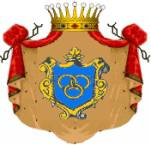
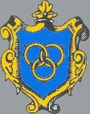
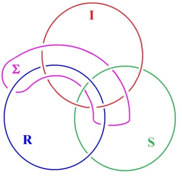
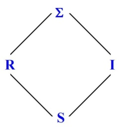
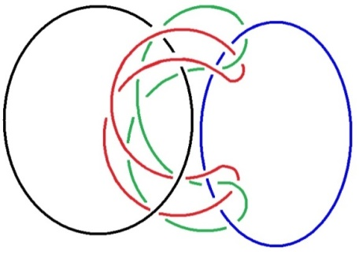
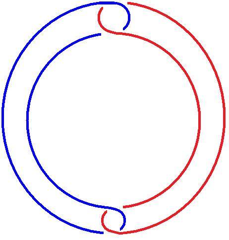
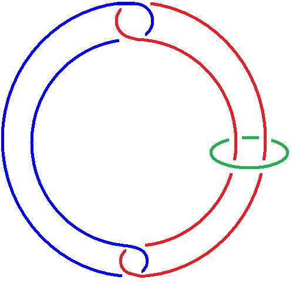
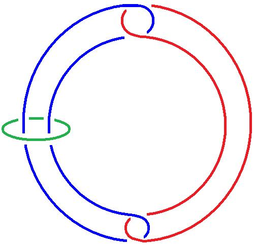
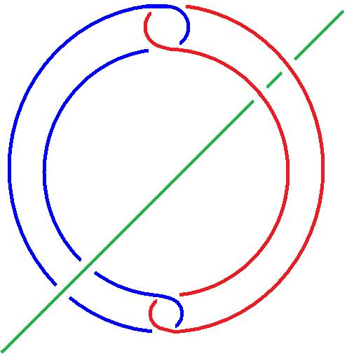

# Leçon 01 | 18 Novembre 1975

<!-- source-url: http://staferla.free.fr/S23/S23 LE SINTHOME.docx -->
<!-- seminar: s23 -->
<!-- lesson: 01 -->

<!-- id: s23-01-0001 -->

J’ai annoncé sur l’affiche : LE SINTHOME.

<!-- id: s23-01-0002 -->

C’est une façon ancienne d’écrire ce qui a été ultérieurement écrit SYMPTÔME.

<!-- id: s23-01-0003 -->

Si je me suis permis cette modification d’orthographe qui marque évidemment une date, une date qui se trouve être l’injection dans le français...

<!-- id: s23-01-0004 -->

> ce que j’appelle *lalangue*, *lalangue* mienne ...l’injection de grec, de cette langue dont Joyce, dans le *Portrait de l’Artiste,* émettait le vœu tout à fait... non, c’est pas dans le *Portrait de l’Artiste,* c’est dans le *Ulysses,* dans le *Ulysses,* au premier chapitre : il s’agit de *hellenise* ...d’injecter de même *lalangue* *hellène*, on ne sait pas à quoi, puisque il ne s’agissait pas du gaélique, encore qu’il s’agit de l’Irlande, mais que Joyce devait écrire en *anglais*.

<!-- id: s23-01-0005 -->

Qu’il a écrit en anglais d’une façon telle que...

<!-- id: s23-01-0006 -->

> comme l’a dit quelqu’un dont j’espère qu’il est dans cette assemblée, Philippe Sollers, dans *Tel Quel* [^1] ...il l’a écrit d’une façon telle que la langue anglaise n’existe plus.

<!-- id: s23-01-0007 -->

Elle avait déjà, je dirai peu de consi­stance, ce qui ne veut pas dire qu’il soit facile d’écrire en anglais.

<!-- id: s23-01-0008 -->

Mais Joyce, par la succession d’œuvres qu’il a écrites en anglais, y a ajouté ce quelque chose qui fait dire au même auteur qu’il faudrait écrire *l*’*é.l.a.­n.g.u.e.s*, *l’élangues*.

<!-- id: s23-01-0009 -->

L’*élangues* par où je suppose qu’il entend désigner quelque chose comme *l’élation*.

<!-- id: s23-01-0010 -->

Cette *élation* dont on nous dit que c’est au principe de je ne sais quel *sinthome* que nous appelons en psychiatrie *la manie*. C’est bien en effet ce à quoi ressemble sa dernière œuvre, à savoir *Finnegans Wake,* celle qu’il a si longtemps soutenue pour y attirer l’attention générale.

<!-- id: s23-01-0011 -->

Celle aussi à propos de quoi j’ai posé dans un temps, au temps où je me suis laissé entraîner à...

<!-- id: s23-01-0012 -->

> par une sollicitation pressante, pressante je dois dire de la part de Jacques Aubert
>
> ici présent et tout aussi pressant ...où je me suis laissé entraîner à inaugurer, à inaugurer au titre d’un symposium Joyce.

<!-- id: s23-01-0013 -->

C’est par là qu’en somme je me suis laissé détourner de mon projet qui était, cette année...

<!-- id: s23-01-0014 -->

> je vous l’ai annoncé l’année dernière ...d’inti­tuler ce séminaire du « *quatre, cinq et six* ».

<!-- id: s23-01-0015 -->

Je me suis contenté du 4 et je m’en réjouis, car le « 4, 5, 6 », j’y aurais sûrement succombé.

<!-- id: s23-01-0016 -->

Ça ne veut pas dire que le 4 dont il s’agit me soit pour autant moins lourd.

<!-- id: s23-01-0017 -->

J’hérite de Freud, bien malgré moi, parce que j’ai énoncé - de mon temps - ce qui pouvait être tiré, en bonne logique, des bafouillages de ceux qu’il appelait « *sa bande* »*.* Je n’ai pas besoin de les nommer, c’est cette clique qui suivait les réunions de Vienne et dont on ne peut pas dire qu’aucun ait suivi la voie que j’appelle de bonne logique*.*

<!-- id: s23-01-0018 -->

La nature, dirai-je pour couper court, se spécifie de n’être « *pas-une* »*,* d’où le procédé logique pour l’aborder.

<!-- id: s23-01-0019 -->

Appeler « *nature* » ce que vous excluez du fait même de porter intérêt à *quelque chose*...

<!-- id: s23-01-0020 -->

> ce quelque chose se distinguant d’être nommé ...la nature par ce procédé ne se risque à rien qu’à s’affirmer d’être un pot-pourri de hors-nature.

<!-- id: s23-01-0021 -->

L’avantage de cet énoncé est que si vous trouvez - à bien le compter - que le « *nommer* » tranche sur ce qui paraît être la loi de la nature, qu’il n’y ait pas chez lui, je veux dire chez l’homme, de rapport *naturel­lement*...

<!-- id: s23-01-0022 -->

> sous toute réserve donc, ce « *naturel­lement »* *...naturellement sexuel*, vous posez logiquement...

<!-- id: s23-01-0023 -->

> ce qui se trouve être le cas ...que ce n’est pas là un privilège, un privilège de l’homme.

<!-- id: s23-01-0024 -->

Veillez pourtant à n’aller pas à dire que le sexe n’est rien de naturel.

<!-- id: s23-01-0025 -->

Tâchez plutôt de savoir ce qu’il en est dans chaque cas : de la bactérie à l’oiseau...

<!-- id: s23-01-0026 -->

> j’ai déjà fait allusion à l’un et à l’autre ...de la bactérie à l’oiseau, puisque ceux-là ont des noms.

<!-- id: s23-01-0027 -->

Remarquons au passage que dans la création dite « divine »...

<!-- id: s23-01-0028 -->

> « divine » seulement en ceci qu’elle se réfère à la nomination ...la bactérie n’est pas nommée.

<!-- id: s23-01-0029 -->

Et qu’elle n’est pas plus nommée quand Dieu, bouffonnant l’homme...

<!-- id: s23-01-0030 -->

> l’homme supposé originel ...lui propose de commencer par *dire* le nom de chaque bestiole.

<!-- id: s23-01-0031 -->

De ce premier - faut bien le dire - *déconnage*, nous n’avons de trace qu’à en conclure qu’Adam...

<!-- id: s23-01-0032 -->

> comme son nom l’indique assez, c’est une allu­sion, ça, à « *la fonction de l’index* » de Peirce ...qu’Adam était... selon le *joke* qu’en fait Joyce justement ...qu’*Adam* était bien entendu une *Madame,* et qu’il n’a nommé les bestiaux que dans la langue de celle-ci.

<!-- id: s23-01-0033 -->

Il faut bien le supposer, puisque celle que j’appellerai l’Èvie (*e.v.i.e*)...

<!-- id: s23-01-0034 -->

> l’ Èvie que j’ai bien le droit d’appeler ainsi puisque c’est ce que ça veut dire en hébreu,
>
> si tant est que l’hébreu soit une langue, *la mère des vivants* ...eh bien l’Èvie l’avait tout de suite, et bien pendue cette langue, puisque après le supposé du « *nommer* » par Adam, la première personne qui s’en sert c’est bien elle, pour parler au serpent.

<!-- id: s23-01-0035 -->

La création dite « divine » se redouble donc de la *parlote* du *parlêtre* comme je l’ai appelé, par quoi l’Èvie fait du serpent ce que vous me permettrez d’appeler le « *serre-fesses* »*,* ultérieurement désigné comme faille, ou mieux *phallus*, puisqu’il en faut bien un pour faire le « *faut-pas* »*,* la « *faute* », dont c’est l’avantage de mon *sinthome* de commencer par là : « *sin »* en anglais veut dire ça : le péché, la première faute.

<!-- id: s23-01-0036 -->

D’où la nécessité...

<!-- id: s23-01-0037 -->

*je pense tout de même, à vous voir en aussi grand nombre, qu’il y en a bien quelques-uns qui ont déjà entendu mes « bateaux »* ...d’où *la nécessité* du fait *que ne cesse pas la faille* qui s’agrandit toujours, sauf à subir le *cesse* de la castration comme *possible*.

<!-- id: s23-01-0038 -->

Ce *possible*, comme je l’ai dit...

<!-- id: s23-01-0039 -->

> sans que vous le notiez, pour ce que moi-même point je ne l’ai noté de n’y pas mettre la virgule ...*ce possible*, j’ai dit autrefois c’est que c’est *ce qui cesse de s’écrire,* mais il y faut mettre la virgule : *c’est « ce qui cesse, virgule, de s’écrire »*.

<!-- id: s23-01-0040 -->

Ou plutôt cesserait d’en prendre le chemin dans le cas où adviendrait enfin ce discours que j’ai évoqué, tel qu’il ne serait pas de semblant.

<!-- id: s23-01-0041 -->

Y-a-t-il impossibilité que *la vérité* devienne un produit du savoir-faire ? *Non* *!*

<!-- id: s23-01-0042 -->

Mais *elle ne sera alors que mi-dite, s’incarnant d’un* **S** *indice* **1** \[**S1**\] *de signifiant*, là où il en faut au moins deux pour que l’*unique* - *La* femme - à avoir jamais été...

<!-- id: s23-01-0043 -->

> mythique, en ce sens que le mythe la fait singulière : il s’agit d’Ève dont j’ai parlé tout à l’heure ...que l’*unique* - *La* femme - à avoir jamais été incontestablement possédée, pour avoir goûté du fruit de l’arbre défendu, celui de la science.

<!-- id: s23-01-0044 -->

L’Èvie donc, n’est pas mortelle plus que Socrate.

<!-- id: s23-01-0045 -->

*La* femme dont il s’agit est un autre nom de Dieu, et c’est en quoi elle n’existe pas, comme je l’ai dit maintes fois.

<!-- id: s23-01-0046 -->

Ici on remarque le côté futé d’Aristote, qui ne veut pas que le singulier joue dans sa logique.

<!-- id: s23-01-0047 -->

Contrairement à ce qu’il admettait, à ce qu’il admettait dans ladite logique, il faut dire que « *Socrate n’est pas homme »*, puisqu’il accepte de mourir pour que la cité vive.

<!-- id: s23-01-0048 -->

Car il l’accepte c’est un fait.

<!-- id: s23-01-0049 -->

En plus, ce qu’il faut bien dire, c’est qu’à cette occasion, il ne veut pas entendre parler sa femme.

<!-- id: s23-01-0050 -->

D’où ma formule, que je relave si je puis dire, à votre usage, en me servant du με παντες \[mè pantes\] que j’ai relevé dans l’*Organon*...

<!-- id: s23-01-0051 -->

où d’ailleurs je n’ai pas réussi à le retrouver, mais où quand même je l’ai bien lu, et même au point que *ma fille*, ici présente, l’a pointé et qu’elle me jurait qu’elle me retrouverait à quelle place c’était με παντες \[mè pantes\] ...comme l’opposition écartée - écartée par Aristote - à l’Universel du παν \[pan\] : *La femme* n’est *toute* que sous la forme dont l’équi­voque prend de *lalangue* nôtre son piquant, sous la forme du « *mais pas ça* »*,* comme on dit « *tout, mais pas ça !* ».

<!-- id: s23-01-0052 -->

C’était bien la position de Socrate. \[*Lacan s’amuse*\]

<!-- id: s23-01-0053 -->

Le *« mais pas ça »* c’est ce que j’introduis sous mon titre de cette année comme *le sinthome.*

<!-- id: s23-01-0054 -->

Il y a pour l’instant, pour *L’instance de la lettre* telle qu’elle s’est ébauchée à présent...

<!-- id: s23-01-0055 -->

et n’espérez pas mieux, comme je l’ai dit, ce qui en sera plus efficace ne fera pas mieux que de déplacer *le sinthome*, voire de le multiplier ...*pour L’instance donc présente*, il y a *le sinthome madaquin* [^2] \[*Rires*\] que j’écris comme vous voudrez : *m.a.d.a.q.u.i.n,* après *sinthome*.

<!-- id: s23-01-0056 -->

Vous savez que Joyce en bavait assez sur ce *sinthome*.

<!-- id: s23-01-0057 -->

Faut bien dire les choses : pour ce qui est de la philosophie on n’a jamais rien fait de mieux, il y a que ça de vrai.

<!-- id: s23-01-0058 -->

Ça n’empêche pas que Joyce...

<!-- id: s23-01-0059 -->

consultez là-dessus l’ouvrage de Jacques Aubert [^3] ...ne s’y retrouve pas très bien, concernant le *quelque chose* à laquelle il attache un grand prix, à savoir ce qu’il appelle « *le Beau* », il y a dans *le sinthome madaquin* je ne sais quoi qu’il appelle *claritas*, auquel Joyce substitue quelque chose comme « *La splendeur de l’Être »,* qui est bien le point faible dont il s’agit.

<!-- id: s23-01-0060 -->

Est-ce une faiblesse personnelle ? « *La splendeur de l’Être »* ne me frappe pas.

<!-- id: s23-01-0061 -->

Et c’est bien en quoi Joyce fait déchoir le *sinthome* de son *mada­quinisme* et...

<!-- id: s23-01-0062 -->

contrairement à ce qu’il pourrait en apparaître, à première vue, à savoir son détachement de la politique ...produit à proprement parler ce que j’appellerai le « *sint-home Rule* ».

<!-- id: s23-01-0063 -->

Ce « *home-rule* » que le *Freeman’s Journal* représentait se levant derrière la Banque d’Irlande, ce qui le fait, comme par hasard, se lever au Nord-Ouest, ce qui n’est pas d’usage pour un lever de soleil c’est quand même...

<!-- id: s23-01-0064 -->

malgré le grincement que nous voyons à ce sujet dans Joyce ...c’est quand même bien le « *sinthome-roule* », le *sinthome à roulettes,* que Joyce conjoint.

<!-- id: s23-01-0065 -->

Il est certain que ces deux termes, on peut les nommer autrement, je les nomme ainsi en fonction des deux versants qui s’offraient à l’art de Joyce, lequel nous occupera cette année, en raison de ce que j’ai dit tout à l’heure : que je l’ai introduit et que je n’ai pu faire mieux que de le nommer ce *sinthome* - car il le mérite - du nom qui lui convient en en déplaçant, comme je l’ai dit, l’orthographe. Les deux, les deux ortho­graphes le concernent.

<!-- id: s23-01-0066 -->

Mais il est un fait *qu’il choisit*.

<!-- id: s23-01-0067 -->

En quoi, il est comme moi un hérétique, car « hæresis* »* c’est bien là ce qui spécifie l’*hérétique*.

<!-- id: s23-01-0068 -->

Il faut choisir la voie par où prendre *la vérité*.

<!-- id: s23-01-0069 -->

Ce d’autant plus, que le choix une fois fait, ça n’empêche personne de le soumettre à confirmation, *c’est-à-dire* *d’être hérétique de la bonne façon, celle qui d’avoir bien reconnu la nature du sinthome, ne se prive pas d’en user logiquement,* *c’est-à-dire jusqu’à atteindre son Réel, au bout de quoi il n’a plus soif.*

<!-- id: s23-01-0070 -->

Bien entendu il a fait ça, lui, à vue de nez. Car on ne pouvait plus mal partir que lui.

<!-- id: s23-01-0071 -->

Être né à Dublin, avec un père soûlographe et plus ou moins *Fénian,* c’est-à-dire fanatique, de deux familles, car c’est ainsi que ça se présente pour tous quand on est fils de deux familles, quand il se trouve qu’on se croit mâle parce que on a un petit bout de queue.

<!-- id: s23-01-0072 -->

Naturelle­ment - pardonnez-moi ce mot - *il en faut plus*.

<!-- id: s23-01-0073 -->

Mais comme il avait la queue un peu lâche, si je puis dire, c’est son art qui a suppléé à sa tenue phallique.

<!-- id: s23-01-0074 -->

Et c’est toujours ainsi : le *phallus* c’est la conjonction de ce que j’ai appelé ce *parasite*...

<!-- id: s23-01-0075 -->

> qui est ce petit bout de queue en question ...c’est la conjonction de ceci avec *la fonction de la parole*. C’est en quoi son art est le vrai répondant de son *phallus*.

<!-- id: s23-01-0076 -->

À part ça, disons que c’était un pauvre hère, et même un pauvre hérétique \[hère étique...\].

<!-- id: s23-01-0077 -->

Il n’y a de joyciens à jouir de son hérésie que dans l’Université.

<!-- id: s23-01-0078 -->

Mais c’est lui qui l’a délibérément voulu, que s’occupât de lui cette engeance.

<!-- id: s23-01-0079 -->

Le plus fort est qu’il y a réussi, et au-delà de toute mesure : ça dure et ça durera encore.

<!-- id: s23-01-0080 -->

Il en voulait pour 300 ans, nommément, il l’a dit : « *Je veux que les universitaires s’occupent de moi pendant trois cents ans ».*

<!-- id: s23-01-0081 -->

Et il les aura, pour peu que Dieu ne nous atomise pas.

<!-- id: s23-01-0082 -->

Ce hère...

<!-- id: s23-01-0083 -->

car on ne peut pas dire « cet hère », c’est interdit par l’aspiration, ça embête même tellement tout le monde que c’est pour ça qu’on dit « *le pauvre hère* » ...ce hère s’est conçu comme un héros : *Stephen Hero.*

<!-- id: s23-01-0084 -->

C’est le titre expressément donné pour celui de là où il prépare le « *A Portrait of the Artist as a Young Man* »*.*

<!-- id: s23-01-0085 -->

Ah ! c’était ce que j’aurais bien souhaité que - je l’ai pas emporté, c’est trop bête - ce que j’aurais souhaité que vous...

<!-- id: s23-01-0086 -->

j’aurais pu au moins vous le montrer ...que vous le trouviez et dont, mal averti, je savais que c’était difficile, et c’est pour ça que je vous précise la façon dont vous devez insister. Mais Nicole Sels, ici présente, m’a envoyé une bafouille - une lettre, on appelle ça - extrêmement précise, où pendant deux pages, elle m’explique qu’il est impossible de se le procurer.

<!-- id: s23-01-0087 -->

Il est impossible à l’heure actuelle d’avoir ce texte et ce que j’ai appelé ce « *criticisme »*, c’est-à-dire ce qu’un certain nombre de personnes, toutes universitaires...

<!-- id: s23-01-0088 -->

c’est d’ailleurs une façon d’entrer à l’université, l’université aspire les joyciens, mais enfin, ils sont déjà en bonne place, elle leur donne des grades ...bref, vous ne trouverez pas le... je ne sais pas comment ça se prononce, c’est Jacques Aubert qui va me le dire : est-ce le *Bibe* ou *Bibi* ?

<!-- id: s23-01-0089 -->

Jacques Aubert - *D’ordinaire, on dit Bibi.*

<!-- id: s23-01-0090 -->

On dit *Bibi* ? Bon...

<!-- id: s23-01-0091 -->

Vous ne trouverez pas le *Beebe* qui ouvre la liste par un article sur Joyce, je dois dire particulièrement gratiné.

<!-- id: s23-01-0092 -->

À la suite de quoi vous avez Hugh Kenner qui à mon avis...

<!-- id: s23-01-0093 -->

> peut-être à cause du sinthome madaquin en question ...à mon avis, parle assez bien de Joyce. Et *il y en a d’autres jusqu’à la fin*, dont je regrette que vous ne puissiez pas disposer.

<!-- id: s23-01-0094 -->

À la vérité c’est un pas de clerc, que j’aie - c’est le cas de le dire - que j’aie mis cette petite note en petits caractères...

<!-- id: s23-01-0095 -->

> je les ai fait rapetisser, Dieu merci ...que j’aie fait cette note en petits caractères...

<!-- id: s23-01-0096 -->

Il faudrait que vous vous arrangiez avec Nicole Sels pour vous en faire faire une série de photocopies.

<!-- id: s23-01-0097 -->

Comme... comme je pense que dans le fond il y en a pas tellement qui, l’anglais - surtout l’anglais de Joyce - soient prêts, je veux dire parés pour le parler, ça ne fera quand même qu’un petit nombre.

<!-- id: s23-01-0098 -->

Mais enfin il y aura évidemment de l’émulation.

<!-- id: s23-01-0099 -->

Et une émulation - mon Dieu - légitime, parce que *Le Portrait de l’Artiste* ou plus exactement *Un Portrait de l’Artiste.*

<!-- id: s23-01-0100 -->

De « *l’Artiste* » qu’il faut écrire en y mettant tout l’accent sur le « *Le* », qui bien sûr en anglais n’est pas tout à fait notre article défini à nous.

<!-- id: s23-01-0101 -->

Mais on peut faire confiance à Joyce, s’il a dit « *le* », c’est bien qu’il pense que d’*artiste* c’est *lui le seul*, que là il est singulier.

<!-- id: s23-01-0102 -->

« *As* » *a Young Man,* c’est très suspect, car en français ça se traduirait par « *comme *»*.*

<!-- id: s23-01-0103 -->

Autrement dit, ce dont il s’agit c’est du *comme-ment.* Le français là-dessus est indicatif. Est indicatif de ceci : c’est que quand on parle « *comme* » en se servant d’un adverbe, quand on dit : réellement, mentalement, héroïquement*,* l’adjonction de ce « *ment »* est déjà en soi suffi­samment *indicative*. Indicative de ceci : c’est qu’on ment.

<!-- id: s23-01-0104 -->

Il y a du mensonge *indiqué* dans tout adverbe. Et ce n’est pas là accident.

<!-- id: s23-01-0105 -->

Quand nous interprétons, nous devons y faire attention.

<!-- id: s23-01-0106 -->

Quelqu’un, qui n’est pas très loin de moi, faisait la remarque à propos de la langue en tant qu’elle désigne l’instrument de la parole, que c’était aussi la langue qui portait les papilles dites du goût.

<!-- id: s23-01-0107 -->

Eh bien, je lui rétorquerai que c’est pas pour rien que « *ce qu’on dit ment* » \[Rires\].

<!-- id: s23-01-0108 -->

Vous avez la bonté de rigoler \[Rires\], mais c’est pas drôle.

<!-- id: s23-01-0109 -->

Car en fin de compte... nous n’avons que ça comme arme contre *le symptôme* : *l’équivoque*.

<!-- id: s23-01-0110 -->

Il arrive que je me paie le luxe de... de « *contrôler* » on appelle ça, un certain nombre de gens qui se sont autorisés eux-mêmes - selon ma formule - à être analystes. Il y a deux étapes :

<!-- id: s23-01-0111 -->

- Il y a une étape où ils sont comme le rhinocéros : ils font à peu près n’importe quoi, et je les approuve toujours. Ils ont en effet toujours raison.

<!-- id: s23-01-0112 -->

- La deuxième étape consiste à jouer de cette équivoque qui pourrait libérer du *sinthome*.

<!-- id: s23-01-0113 -->

Car c’est uniquement par *l’équivoque* que *l’interprétation* opère.

<!-- id: s23-01-0114 -->

Il faut qu’il y ait quelque chose dans le signifiant qui *résonne*.

<!-- id: s23-01-0115 -->

Il faut dire qu’on est surpris que les philosophes anglais, ça ne leur soit nullement apparu.

<!-- id: s23-01-0116 -->

Je les appelle *philosophes* parce que ce ne sont pas des psychanalystes :

<!-- id: s23-01-0117 -->

- ils croient dur comme fer à ce que *la parole* ça n’a pas d’effet. Ils ont tort.

<!-- id: s23-01-0118 -->

- ils s’imaginent qu’il y a des *pulsions*, et encore quand ils veulent bien ne pas traduire *pulsion* par *instinct*.

<!-- id: s23-01-0119 -->

Ils ne s’imaginent pas que *les pulsions c’est l’écho dans le corps du fait qu’il y a un dire*.

<!-- id: s23-01-0120 -->

Mais que ce *dire*, pour qu’il *résonne*, pour qu’il *consonne*...

<!-- id: s23-01-0121 -->

> pour employer un autre mot du *sinthome madaquin* ...pour qu’il *consonne*, il faut que le corps y soit sensible. Et qu’il l’est, c’est un fait.

<!-- id: s23-01-0122 -->

C’est parce que le corps a quelques orifices dont le plus important...

<!-- id: s23-01-0123 -->

> dont le plus important parce qu’il peut pas se boucher, se clore ...dont le plus important est l’*oreille*, parce qu’il peut pas se fermer, que c’est à cause de ça que répond dans le corps ce que j’ai appelé *la voix*.

<!-- id: s23-01-0124 -->

L’embarrassant est assurément qu’il n’y a pas que l’*oreille*, et que lui fait une concurrence éminente *le regard*.

<!-- id: s23-01-0125 -->

*More geometrico,* à cause de *la forme* chère à Platon, l’individu se présente comme il est foutu : comme un corps.

<!-- id: s23-01-0126 -->

Ce corps a une puissance de captivation qui est telle que, jusqu’à un certain point, c’est les aveugles qu’il faudrait envier. Comment est-ce qu’un aveugle - si tant est qu’il se serve du Braille *-* peut lire Euclide ?

<!-- id: s23-01-0127 -->

L’étonnant est ceci que je vais énoncer, c’est que *la forme* ne livre que *le sac*, ou si vous voulez *la bulle*.

<!-- id: s23-01-0128 -->

Elle est *quelque chose qui se gonfle*, et dont j’ai déjà dit les effets à propos de l’obsessionnel, qui en est féru plus qu’un autre.

<!-- id: s23-01-0129 -->

L’obsessionnel...

<!-- id: s23-01-0130 -->

ai-je dit, quelque part, on me l’a rappelé récemment ...c’est quelque chose de l’ordre de « *la grenouille qui veut se faire aussi grosse que le bœuf* ». On en sait les effets, par une fable.

<!-- id: s23-01-0131 -->

Il est particulièrement difficile, on le sait, d’arracher l’obsessionnel à cette emprise du *regard*.

<!-- id: s23-01-0132 -->

Le *sac*, en tant qu’il s’imagine dans la théorie de l’*ensemble*, telle que l’a fondée Cantor, se manifeste, voire se démontre...

<!-- id: s23-01-0133 -->

> si toute démonstration est tenue pour démontrer l’imaginaire qu’elle implique ...*ce sac*, dis-je, *mérite d’être connoté d’un ambigu de* **1** *et de* **0**, seul support adéquat de ce à quoi confine l’*ensemble vide* qui s’impose dans cette théorie.

<!-- id: s23-01-0134 -->

D’où notre scription : **S** *indice* **1** \[**S1**\]. Je précise qu’elle se lit comme ça.

<!-- id: s23-01-0135 -->

Elle fait pas l’*Un*, mais elle l’indique comme pouvant ne rien contenir, être un sac vide.

<!-- id: s23-01-0136 -->

Il n’en reste pas moins qu’un sac vide reste un sac, soit l’*Un* qui n’est imaginable que de l’*ex-sistence,* et de *la consistance,* qu’a le corps d’être *pot*.

<!-- id: s23-01-0137 -->

Il faut les tenir, cette *ex-sistence* et cette *consistance,* pour réelles, puisque le *Réel* c’est de les tenir.

<!-- id: s23-01-0138 -->

D’où le mot *Begriff* qui veut dire ça.

<!-- id: s23-01-0139 -->

L’*Imaginaire* montre ici son homogénéité au *Réel*, et qu’elle ne tient, cette homogénéité, qu’au fait du nombre, en tant qu’il est binaire, **1** ou **0**.

<!-- id: s23-01-0140 -->

C’est-à-dire qu’il ne supporte le **2** que de ce qu’**1** ne soit pas **0**, qu’il *ex-siste* au **0**, mais n’y *consiste* en rien.

<!-- id: s23-01-0141 -->

C’est ainsi que la théorie de Cantor doit repartir du couple, mais qu’alors l’*ensemble* y est tiers.

<!-- id: s23-01-0142 -->

De l’ensemble premier à ce qui est l’Autre, la jonction ne se fait pas.

<!-- id: s23-01-0143 -->

C’est bien en quoi le *symbole* en remet sur l’*Imaginaire*, lui a *l’indice* **2** \[**S2**\].

<!-- id: s23-01-0144 -->

C’est-à-dire qu’indiquant qu’il est *couple*, il introduit la division dans le sujet, quel qu’il soit, de ce qui s’y énonce « *de fait* ».

<!-- id: s23-01-0145 -->

Le « *fait* » restant suspendu à l’énigme de l’*énonciation* qui n’est que « *fait* » fermé sur lui :

<!-- id: s23-01-0146 -->

- le *fait* du *fait,* comme on l’*écrit,*

<!-- id: s23-01-0147 -->

- le faîte du *fait* ou le *fait* du faîte, comme ça se *dit* ...égaux en fait, équivoques et équivalents, et par là limite du *dit*.

<!-- id: s23-01-0148 -->

L’inouï est que les hommes aient très bien vu que le symbole ne pouvait être qu’*une pièce cassée*, et ce, si je puis dire, de *tous temps*.

<!-- id: s23-01-0149 -->

Mais qu’ils n’aient pas vu à l’époque, à l’époque de ce tous temps, que cela comportait *l’unité et la réciprocité du signifiant et du signifié*, conséquemment que *le signifié d’origine* ne veut rien dire, qu’il n’est qu’un signe d’arbitrage entre deux signifiants, mais de ce fait pas d’arbitraire pour le choix de ceux-ci.

<!-- id: s23-01-0150 -->

Il n’y a d’*umpire*...

<!-- id: s23-01-0151 -->

> *umpire* \[*arbitre*\] pour le dire en anglais, c’est comme ça que Joyce l’écrit ...qu’à partir de l’empire, de l’*imperium* sur le corps, comme tout en porte la marque dès l’*ordalie* \[« *jugement de Dieu* »\].

<!-- id: s23-01-0152 -->

Ici, le **1** confirme son détachement d’avec le **2**. Il ne fait **3** que par forçage *imaginaire*, celui qui impose qu’une volonté sug­gère à l’un de molester l’autre, sans être lié à aucun. Ouais...

<!-- id: s23-01-0153 -->

Pour que la condition fût expressément posée de ce qu’à partir de trois anneaux, on fît une chaîne telle que la rupture d’un seul rendît, l’un de l’autre, les deux autres libres, quels qu’ils fussent...

<!-- id: s23-01-0154 -->

car dans une chaîne l’anneau du milieu, si je puis dire de cette façon abrégée, réalise ça : les deux autres libres, quels qu’ils fussent ...il a fallu qu’on s’aperçût que c’était inscrit aux armoiries des Borromée, que le nœud, de ce fait, dit « *borroméen »* était déjà là sans que personne se fût avisé d’en tirer conséquence.

<!-- id: s23-01-0155 -->

 

<!-- id: s23-01-0156 -->

C’est bien là, c’est bien là que gît ceci : que c’est une erreur de penser que ce soit une norme pour le rapport de trois fonctions qui n’existent - l’une à l’autre dans leur exer­cice - que chez l’être qui de ce fait se croit être homme.

<!-- id: s23-01-0157 -->

Ce n’est pas que soient rompus *le Symbolique, l’Imaginaire et le Réel* qui définit la perversion, c’est que : ils sont déjà *distincts*, et qu’il en faut *supposer* un 4ème, qui est *le sinthome* en l’occa­sion, qu’il faut *supposer tétradique* ce qui fait *le lien borroméen*, que « *perversion* » ne veut dire que « *version vers le père* », et qu’en somme *le père* est un *symptôme* ou un *sinthome*, comme vous le voudrez.

<!-- id: s23-01-0158 -->

L’*ex-sistence* du *symptôme* c’est ce qui est impliqué par la position même, celle qui *suppose* ce lien - *de l’Imaginaire,* *du Symbolique et du Réel* - énigmatique. Si vous trouvez quelque part - je l’ai déjà dessiné - ceci qui schéma­tise le rapport de *l’Imaginaire, du Symbolique et du Réel* en tant que séparés l’un de l’autre, vous avez déjà, dans mes précédentes figura­tions, mis à plat leur rapport, la possibilité de *les lier* - par quoi ? - Par *le sinthome*. Si j’avais ici un craie de couleur...

<!-- id: s23-01-0159 -->

- *Gloria - De quelle couleur vous la voulez ?*

<!-- id: s23-01-0160 -->

- *Comment ?*

<!-- id: s23-01-0161 -->

- *Gloria - De quelle couleur ?*

<!-- id: s23-01-0162 -->

- *Rouge, si vous le voulez bien. Vous êtes vrai­ment trop gentille.*

<!-- id: s23-01-0163 -->

Tout dépend de ceci :

<!-- id: s23-01-0164 -->

<!-- id: s23-01-0165 -->

C’est que, à rabattre ce grand S...

<!-- id: s23-01-0166 -->

> c’est-à-dire ce qui s’affirme de la consistance du *Symbolique* ...à le rabattre, comme il est plausible, je veux dire offert, à le rabattre d’une façon qui se trace ainsi, vous avez...

<!-- id: s23-01-0167 -->

> si cette figure est correcte, je veux dire que glissant *sous* le *Réel*, c’est évidemment aussi *sous* l’*Imaginaire*
>
> qu’il doit se trouver, à ceci près qu’ici, c’est *sur* le *Symptômatique* qu’il doit passer ...vous vous trouvez dans la position suivante, c’est qu’à partir de quatre, ce qui se figure est ceci :

<!-- id: s23-01-0168 -->

<!-- id: s23-01-0169 -->

C’est à savoir que vous aurez le rapport suivant, ici par exemple, l’*Imaginaire*, le *Réel,* et *le symptôme* que je vais figurer d’un *sigma* \[**Σ**\], et le *Symbolique*, mais que chacun d’entre eux est échangeable.

<!-- id: s23-01-0170 -->

Expressément, de 1 à 2 peut s’invertir en 2 à 1, de 3 à 4 peut s’invertir de 4 à 3.

<!-- id: s23-01-0171 -->

D’une façon qui, j’espère, vous paraît simple :

<!-- id: s23-01-0172 -->

> I R Σ S
>
> 1 2 3 4
>
> 2 1 4 3

<!-- id: s23-01-0173 -->

Mais nous nous trouvons de ce fait dans la situation suivante, c’est que ce qui est 1 à 2 voire 2 à 1, pour avoir dans son milieu, si l’on peut dire, le Σ et le S, doit faire...

<!-- id: s23-01-0174 -->

c’est précisément ici que c’est figuré ...doit faire que le *symp­tôme* et le *symbole* se trouvent pris d’une façon telle...

<!-- id: s23-01-0175 -->

> il faudrait que je vous montre par quelque figuration simple ...d’une façon telle que il y en a - comme vous le voyez là-bas - qu’il y en a quatre qui sont - vous le voyez là – il y en a quatre qui sont tirés par le grand R, et ici c’est d’une certaine façon que le I se combine en passant au-dessus du *symbole* ici figuré, et au-dessous du *symptôme*. C’est toujours sous cette forme que se présente le lien*,* le lien que j’ai exprimé ici par l’opposition du R au I.

<!-- id: s23-01-0176 -->

Autrement dit, les deux - *symptôme* et *symbole* - se présentent de façon telle que ici :

<!-- id: s23-01-0177 -->

- un des deux termes les prend dans leur ensemble,

<!-- id: s23-01-0178 -->

- alors que l’autre passe, disons *<u>sur</u> celui qui est <u>au-dessus</u>* et *<u>sous</u> celui qui est <u>au-dessous</u>*.

<!-- id: s23-01-0179 -->

C’est la figure que vous obtenez régulièrement dans une tentative de faire *le nœud borroméen à quatre,* c’est celle que j’ai mis ici, sur l’extrême droite :

<!-- id: s23-01-0180 -->

<!-- id: s23-01-0181 -->

Le *complexe d’Œdipe*, comme tel, est un *symptôme*.

<!-- id: s23-01-0182 -->

C’est en tant que le *Nom du Père* est aussi le *père du nom* que tout *se soutient*, ce qui ne rend pas moins nécessaire le *symptôme*.

<!-- id: s23-01-0183 -->

Cet Autre dont il s’agit, c’est ce *quelque chose* qui dans Joyce se manifeste par ceci : qu’il est en somme *chargé de père*.

<!-- id: s23-01-0184 -->

C’est dans la mesure où *ce père* - comme il s’avère dans l’*Ulysses - il doit le soutenir pour qu’il subsiste*, que Joyce par son art...

<!-- id: s23-01-0185 -->

> son art qui est toujours le *quelque chose* qui, du fond des âges, nous vient comme issu de l’*artisan* ...c’est par son art que Joyce fait subsister non seulement sa famille, mais l’*illustre* si l’on peut dire, et du même coup illustre ce qu’il appelle quelque part « *my country ».* L’esprit incréé - dit-il - de sa race... c’est ce par quoi finit *Le Portrait de l’Artiste* ...c’est là ce dont il se donne la mission.

<!-- id: s23-01-0186 -->

En ce sens, j’annonce ce que va être cette année mon interrogation sur *l’art* :

<!-- id: s23-01-0187 -->

- en quoi l’*artifice* peut-il viser expressément ce qui se présente d’abord comme *symptôme* ?

<!-- id: s23-01-0188 -->

- En quoi *l’art*, l’artisanat peut-il déjouer, si l’on peut dire, ce qui s’impose du *symptôme* - à savoir quoi ? - mais ce que j’ai figuré dans mes deux tétraèdres : *la vérité *?

<!-- id: s23-01-0189 -->

- 

<!-- id: s23-01-0190 -->

<!-- id: s23-01-0191 -->

*La vérité*, où est-elle dans cette occasion ? J’ai dit qu’elle était quelque part dans *le discours du maître*, comme supposée dans le sujet, en tant que divisé il est encore sujet au fantasme. C’est, contrairement à ce que j’avais figuré d’abord, c’est ici, au niveau de *la vérité* que nous devons considérer le *mi-dire*.

<!-- id: s23-01-0192 -->

C’est-à-dire que le sujet, à cette étape, ne peut se représenter que du signifiant indice **1** \[**S1**\].

<!-- id: s23-01-0193 -->

Que le signifiant indice **2** \[**S2**\], c’est très précisément ce qui se représente de la...

<!-- id: s23-01-0194 -->

pour le figurer comme je l’ai fait tout à l’heure ...de la duplicité du *symbole* et du *symptôme*, là \[S2\] est l’artisan, l’artisan en tant que par la conjonction de deux signifiants, il est capable de produire ce que tout à l’heure j’ai appelé *l’objet (a).*

<!-- id: s23-01-0195 -->

Ou plus exactement je l’ai illustré du rapport à l’*o­reille* et à l’*œil*, voire évo­quant la *bouche close*.

<!-- id: s23-01-0196 -->

C’est bien en tant que *le discours du maître* règne, que **S2** se *divise*.

<!-- id: s23-01-0197 -->

Et cette division, *c’est la division du symbole et du symptôme*.

<!-- id: s23-01-0198 -->

Mais cette division du *symbole* et du *symptôme*, elle est si l’on peut dire, *reflétée* dans la division du sujet.

<!-- id: s23-01-0199 -->

C’est *parce que le sujet c’est ce qu’un signifiant représente auprès d’un autre signifiant* que nous sommes nécessités par son *insistance*, à montrer que c’est dans le *symptôme* que un de ces deux signifiants du *Symbolique,* prend son support.

<!-- id: s23-01-0200 -->

En ce sens, on peut dire que dans l’articulation du *symptôme au symbole*, il n’y a, je dirai qu’un *faux trou*.

<!-- id: s23-01-0201 -->

Si nous supposons la consistance...

<!-- id: s23-01-0202 -->

> consistance d’une quelconque de ces fonctions, *Symbolique, Ima­ginaire et Réel* ...si nous suppo­sons cette *consistance* comme faisant *cercle*, ceci suppose un *trou*. Mais dans le cas du *symbole* et du *symptôme*, c’est autre chose dont il s’agit : ce qui fait trou c’est l’ensemble - c’est l’ensemble pliés l’un sur l’autre - de ces 2 cercles :

<!-- id: s23-01-0203 -->

<!-- id: s23-01-0204 -->

Ici, comme l’a assez bien figuré Soury - pour l’appeler par son nom, je sais pas s’il est ici – il faut encadrer par quelque chose qui ressemble à *une soufflure*, à ce que nous appelons dans la topologie, *un tore*.

<!-- id: s23-01-0205 -->

Il faut cerner chacun de ces trous dans quelque chose qui les fait tenir ensemble, pour que nous ayons ici quelque chose qui puisse être qualifié du *vrai trou*.

<!-- id: s23-01-0206 -->

 

<!-- id: s23-01-0207 -->

C’est dire que : il faut *imaginer* pour que ces trous subsistent, se maintiennent, supposer simplement ici une droite...

<!-- id: s23-01-0208 -->

> ça remplira le même rôle ...une droite pour peu qu’elle soit infinie.

<!-- id: s23-01-0209 -->

<!-- id: s23-01-0210 -->

Nous aurons à revenir dans le cours de l’année sur ce que c’est que cet *infini*, nous aurons à reparler de ce qu’une droite :

<!-- id: s23-01-0211 -->

- en quoi elle subsiste,

<!-- id: s23-01-0212 -->

- en quoi - si on peut dire - elle est parente d’un cercle.

<!-- id: s23-01-0213 -->

Ce cercle...

<!-- id: s23-01-0214 -->

il faudra assurément que j’y revienne ...le cercle a une fonction qui est bien connue de la police : le cercle ça sert à circuler.

<!-- id: s23-01-0215 -->

Et c’est bien en ça que la police a un soutien qui ne date pas d’hier.

<!-- id: s23-01-0216 -->

Hegel avait très bien vu quelle en était la fonction, et il l’avait vu sous une forme qui n’est assurément pas celle dont il s’agit, ce qui est en question. Il s’agit pour la police, simplement que le tournage en rond se perpétue.

<!-- id: s23-01-0217 -->

Le fait que nous puissions, dans ce faux trou, faire l’adjonction d’une droite infinie, et qu’à soi seul ceci fasse, de ce faux trou, un trou qui *borroméennement* subsiste, c’est là le point sur lequel je m’arrête aujourd’hui.

## Notes

[^1]: Philippe Sollers : « *Joyce et Cie* », *Tel Quel* n° 64, 1975*,* pp. 15-24.

[^2]: Cf. Thomas d’Aquin, référence majeure du jeune James Joyce. Sur tout ceci cf. Jacques Aubert : *Notes de lecture* (p. 189),

    et Jacques-Alain Miller : *Notice de fil en aiguille* (p. 199), dans Jacques Lacan : *Le Sinthome*, Seuil, 2005.

[^3]: Jacques Aubert : *Introduction à l’esthétique de James Joyce*, éd. Didier, 1973.
