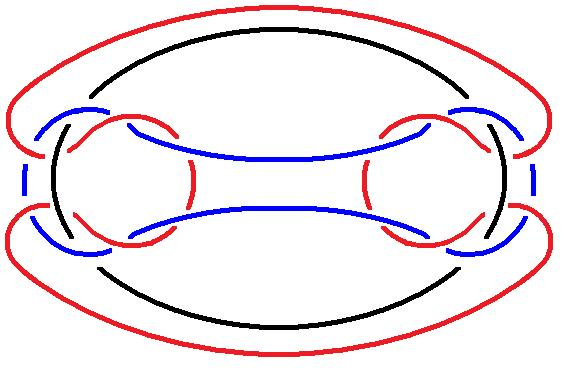
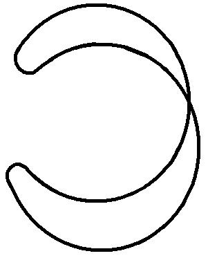
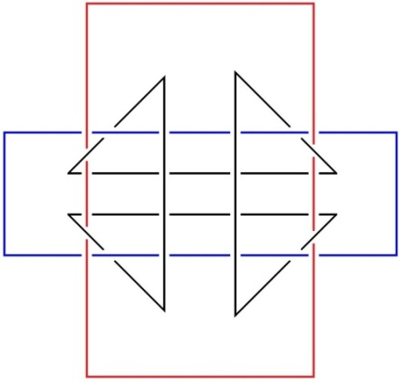
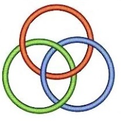
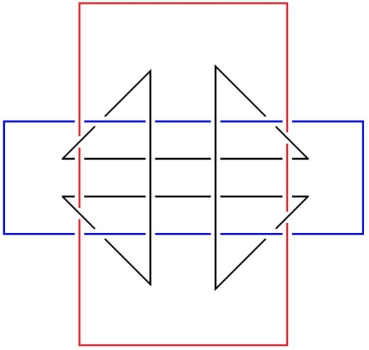
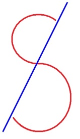
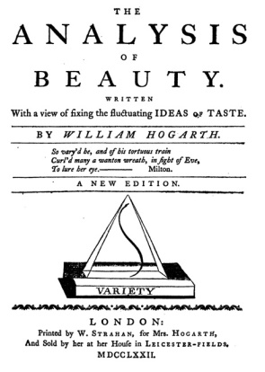
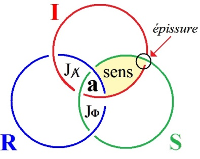
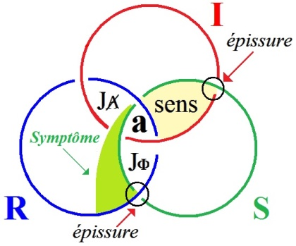

# Leçon 04 | 13 Janvier 1976

<!-- source-url: http://staferla.free.fr/S23/S23 LE SINTHOME.docx -->
<!-- seminar: s23 -->
<!-- lesson: 04 -->

<!-- id: s23-04-0001 -->

On n’est responsable que dans la mesure de son savoir-faire.

<!-- id: s23-04-0002 -->

Qu’est-ce que c’est que le savoir-faire ?

<!-- id: s23-04-0003 -->

Disons que c’est l’art, l’artifice, ce qui donne à l’art...

<!-- id: s23-04-0004 -->

> à l’art dont on est capable ...une valeur remarquable.

<!-- id: s23-04-0005 -->

Remarquable en quoi ?

<!-- id: s23-04-0006 -->

Puisqu’*il n’y a pas d’Autre de l’Autre* pour opérer le Jugement Dernier*...*

<!-- id: s23-04-0007 -->

> du moins est-ce moi qui l’énonce ainsi ...ceci veut dire qu’il y a quelque chose dont nous ne pouvons jouir, appelons ça *la jouissance de Dieu*, avec le sens inclus là-dedans de jouissance sexuelle.

<!-- id: s23-04-0008 -->

L’image qu’on se fait de Dieu impli­que-t-elle ou non qu’il jouisse de ce qu’il a commis ?

<!-- id: s23-04-0009 -->

En admettant qu’il *ex-siste*...

<!-- id: s23-04-0010 -->

Y répondre qu’il n’*ex-siste* pas tranche la question, en nous rendant la charge d’une pensée dont l’essence est de s’insérer dans cette réalité...

<!-- id: s23-04-0011 -->

> première approximation du mot *réel,* qui a un autre sens dans mon vocabulaire ...dans cette réalité limitée qui s’atteste de l’*ex-sistence...*

<!-- id: s23-04-0012 -->

> écrite de la même façon : *e*, *x, trait d’union, s* *...*de l’*ex-sistence* du *sexe*.

<!-- id: s23-04-0013 -->

Voilà ! C’est le type de chose qu’en fin de compte je vous apporte en ce début d’année, à savoir ce que j’appellerai...

<!-- id: s23-04-0014 -->

> c’est pas plus mal, comme ça, pour un début d’année ...ce que j’appellerai des vérités pre­mières.

<!-- id: s23-04-0015 -->

Non pas bien sûr que dans l’intervalle qui nous a séparés...

<!-- id: s23-04-0016 -->

> depuis quelque chose comme maintenant plus de 3 semaines ...non pas que je n’aie pas travaillé.

<!-- id: s23-04-0017 -->

J’ai travaillé à des trucs dont vous voyez là, sur le tableau, un échantillon :

<!-- id: s23-04-0018 -->

  

<!-- id: s23-04-0019 -->

Ceci, comme vous pouvez le voir, est un nœud borroméen :

<!-- id: s23-04-0020 -->

<!-- id: s23-04-0021 -->

Il ne diffère de celui que - je vous le rappelle - je dessine d’habitude, qui est foutu comme ça :

<!-- id: s23-04-0022 -->

<!-- id: s23-04-0023 -->

...il n’en diffère que de quelque chose qui n’est pas négligeable, c’est que celui-ci peut se distendre de façon telle qu’il y ait deux extrêmes comme rond, et que ce soit celui qui est dans le milieu qui fasse le joint :

<!-- id: s23-04-0024 -->

<!-- id: s23-04-0025 -->

La différence est celle-ci : supposez que ce soit 3 éléments comme celui-là - le médian - qui s’unissent de façon circulaire.

<!-- id: s23-04-0026 -->

Vous voyez bien, j’espère, comment ça peut se faire. Il n’y a pas besoin que je vous trace le truc au tableau.

<!-- id: s23-04-0027 -->

Eh bien ça se simplifie comme ça :

<!-- id: s23-04-0028 -->

<!-- id: s23-04-0029 -->

...comme ça, ou comme ça parce que c’est le même :

<!-- id: s23-04-0030 -->

<!-- id: s23-04-0031 -->

Naturellement, c’est pas de ça seulement que je me contente : j’ai passé mes vacances à en élucubrer bien d’autres, dans l’espoir d’en trouver un bon qui servirait de support - de support, j’entends : aisé – à ce que j’ai commencé aujourd’hui de vous raconter comme vérité pre­mière.

<!-- id: s23-04-0032 -->

Eh ben, chose surprenante, ça ne va pas tout seul.

<!-- id: s23-04-0033 -->

Non pas que je croie que j’ai tort de trouver dans le nœud ce qui supporte notre *consistance*, seulement c’est déjà un signe que ce nœud je ne puisse le déduire que d’une chaîne, à savoir de quelque chose qui n’est pas du tout de la même nature : *chaîne*, ou *link* en anglais, c’est pas la même chose qu’un nœud.

<!-- id: s23-04-0034 -->

Mais reprenons le *ron-ron* des vérités dites premières... dites par moi comme telles.

<!-- id: s23-04-0035 -->

Il est clair que l’ébauche même de ce qu’on appelle *la pensée*...

<!-- id: s23-04-0036 -->

tout ce qui fait *sens* \[*la glue imaginaire*\] dès que ça montre le bout de son nez ...comporte une référence, une gravitation à l’acte sexuel, si peu évident que soit cet *acte*.

<!-- id: s23-04-0037 -->

Le mot même d’« *acte* » implique la polarité : *active-passive*. Ce qui déjà est s’engager dans un faux-sens.

<!-- id: s23-04-0038 -->

C’est ce qu’on appelle « *la connaissance* », avec cette ambiguïté que l’*actif* c’est ce que nous connais­sons, mais que nous nous imaginons que - faisant effort pour connaître – nous sommes actifs.

<!-- id: s23-04-0039 -->

*La connaissance*  donc, dès le départ se montre ce qu’elle est : trompeuse.

<!-- id: s23-04-0040 -->

C’est bien en quoi tout doit être repris au départ, à partir de l’opacité sexuelle.

<!-- id: s23-04-0041 -->

Je dis « *opacité* » en ceci :

<!-- id: s23-04-0042 -->

- c’est que  *premièrement* nous ne nous apercevons pas que du sexuel ne fonde en rien quelque *rapport* que ce soit. Ceci implique, au gré de la pensée, qu’il n’y a de responsa­bilité... en ce sens où « responsa­bilité » ça veut dire non réponse, ou réponse à côté ...il n’y a de responsa­bilité que sexuelle. Ce dont tout le monde en fin de compte a le sentiment*.*

<!-- id: s23-04-0043 -->

- Mais par contre, que ce que j’ai appelé le *« savoir-faire »* va bien au-delà et y ajoute l’artifice que nous imputons à Dieu tout à fait gratuitement, comme Joyce... comme Joyce y insiste, parce que c’est un truc qui lui a chatouillé quelque part ce qu’on appelle *la pensée*.

<!-- id: s23-04-0044 -->

C’est pas Dieu qui a commis ce truc qu’on appelle l’*Univers*.

<!-- id: s23-04-0045 -->

On impute à Dieu ce qui est l’affaire de l’artiste dont le premier modèle est, comme chacun sait, le potier, et qu’on dit que - avec quoi d’ailleurs ? - il a moulé, comme ça, ce truc qu’on appelle, pas par hasard, l’*Univers*, ce qui ne veut dire qu’une seule chose, c’est qu’*y a d’l’Un*. *Yad’l’Un*, mais on ne sait pas où.

<!-- id: s23-04-0046 -->

Il est plus qu’improbable que cet *Un* constitue *l’Univers*.

<!-- id: s23-04-0047 -->

L’Autre de l’Autre Réel, c’est-à-dire impossible, c’est l’idée que nous avons de l’artifice, en tant qu’il est un *faire*

<!-- id: s23-04-0048 -->

> *f.a.i.r.e *: n’écrivez pas ça *f.e.r* *...*un *faire* qui nous échappe, c’est-à-dire qui déborde de beaucoup *la jouissance* que nous en pouvons avoir.

<!-- id: s23-04-0049 -->

*Cette jouissance tout à fait mince, c’est ce que nous appelons « l’Esprit ».*

<!-- id: s23-04-0050 -->

Tout ceci implique une notion du *réel*, bien sûr.

<!-- id: s23-04-0051 -->

Bien sûr qu’il faut que nous la fassions distincte du *symbolique* et de *l’imaginaire*.

<!-- id: s23-04-0052 -->

Le seul ennui, c’est bien le cas de le dire, vous verrez tout à l’heure pourquoi, c’est que le *réel* fasse *sens* dans cette affaire.

<!-- id: s23-04-0053 -->

Alors que si vous creusez ce que je veux dire par *cette notion du réel,* il apparaît que c’est pour autant que *il n’a pas de sens...*

<!-- id: s23-04-0054 -->

> qu’*il exclut le sens*, ou plus exactement qu’*il se dépose d’en être exclu* ...que le *réel* se fonde.

<!-- id: s23-04-0055 -->

Voilà... Je vous raconte ça comme je le pense. C’est pour que vous le sachiez, que je vous le dis.

<!-- id: s23-04-0056 -->

*La forme la plus dépourvue de sens* de ce qui pourtant s’imagine, *c’est la consistance*.

<!-- id: s23-04-0057 -->

Rien ne nous force, hein, à imaginer la *consistance*, figurez-vous.

<!-- id: s23-04-0058 -->

J’ai là un bouquin qui s’appelle *Surface and Symbol* [^6] qui ajoute que c’est une étude...

<!-- id: s23-04-0059 -->

> faut bien le savoir, car sans ce sous-titre comment le saurait-on ? ...qui ajoute *The Consistency of James Joyce’s Ulysses,* par R - Robert - M. Adams.

<!-- id: s23-04-0060 -->

Il y a là comme quelque chose comme un pressentiment de la distinction de l’imaginaire et du symbolique.

<!-- id: s23-04-0061 -->

À preuve : un chapitre où après avoir intitulé le livre *Surface and Symbol,* un chapitre tout entier qui s’interroge, je veux dire qui met un point d’interrogation sur *Surface or Symbol, Surface ou Symbole*.

<!-- id: s23-04-0062 -->

*La consistance là, qu’est-ce que ça veut dire ?*

<!-- id: s23-04-0063 -->

*Ça veut dire ce qui tient ensemble*. Et c’est bien pour ça que *c’est symbolisé*, dans l’occasion, *par la surface*.

<!-- id: s23-04-0064 -->

Parce que, pauvres de nous, nous n’avons idée de *consistance* que de ce qui fait sac ou torchon.

<!-- id: s23-04-0065 -->

C’est la première idée que nous en avons.

<!-- id: s23-04-0066 -->

Même le corps, c’est comme peau retenant dans son sac un tas d’organes, que nous le sentons.

<!-- id: s23-04-0067 -->

En d’autres termes, *cette consistance montre la corde*.

<!-- id: s23-04-0068 -->

Mais la capacité d’abstraction imaginative est si faible que de cette corde...

<!-- id: s23-04-0069 -->

> cette corde montrée comme *résidu de la consistance* ...que *de cette corde, elle exclut le nœud*.

<!-- id: s23-04-0070 -->

Or, c’est là-dessus - peut-être - que je peux apporter le seul grain de sel dont en fin de compte je me reconnaisse responsable : dans une corde*, le nœud est tout ce qui ex-siste*...

<!-- id: s23-04-0071 -->

au sens propre du terme, tel que je l’écris ...est tout ce qui *ex-siste* à proprement parler.

<!-- id: s23-04-0072 -->

Ce n’est pas pour rien. Je veux dire ce n’est pas sans cause cachée que j’ai dû, pour ce nœud y ménager un accès, commencer par la chaîne où il y a des éléments qui sont distincts, éléments qui consistent alors en quelque forme de la corde, c’est-à-dire :

<!-- id: s23-04-0073 -->

- ou bien en tant que c’est une droite que nous devons supposer infinie pour que le nœud ne se dénoue pas,

<!-- id: s23-04-0074 -->

- ou bien en tant que ce que j’ai appelé rond de ficelle.

<!-- id: s23-04-0075 -->

Autrement dit, corde qui se noue à elle-même, ou plus exactement qui se joint d’une épissure de façon à ce que le nœud à proprement parler, n’en constitue pas la *consistance*. Parce qu’il faut tout de même distinguer *consistance* et *nœud*.

<!-- id: s23-04-0076 -->

Le *nœud ex-siste*, *ex-siste* à l’élément corde, corde *consistante*.

<!-- id: s23-04-0077 -->

Un nœud donc, ça peut se faire. C’est bien pour ça que j’en ai pris le cheminement, de raboutages élémentaires.

<!-- id: s23-04-0078 -->

J’ai procédé comme ça parce que il m’a semblé que c’était le plus didactique.

<!-- id: s23-04-0079 -->

Vu la mentalité, y a pas besoin de dire plus, la senti-mentalité propre au parlêtre, la *mentalité* en tant que, puisqu’il la sent, il en sent le fardeau. La *mentalité* en tant qu’il *ment*. C’est un fait !

<!-- id: s23-04-0080 -->

Qu’est-ce qu’un *fait* ?

<!-- id: s23-04-0081 -->

C’est justement lui qui le fait : il n’y a de *fait* que du fait que le *parlêtre* le *dise*.

<!-- id: s23-04-0082 -->

Il n’y a pas d’autres *faits* que ceux que le *parlêtre* reconnaît comme tels en les *disant*.

<!-- id: s23-04-0083 -->

Il n’y a de *fait* que *d’artifice*. Et c’est un *fait* qu’il *ment !*

<!-- id: s23-04-0084 -->

C’est-à-dire qu’il instaure dans la reconnaissance de *faux faits*.

<!-- id: s23-04-0085 -->

Ceci parce qu’il a de *la mentalité*, c’est-à-dire de *l’amour propre*.

<!-- id: s23-04-0086 -->

C’est le principe de l’imagination : il *adore* son corps. Il l’*adore* parce qu’il croit qu’il l’a !

<!-- id: s23-04-0087 -->

En réalité il l’a pas, mais son corps est sa seule *consistance* : *mentale* bien entendu, son corps fout le camp à tout instant.

<!-- id: s23-04-0088 -->

C’est déjà assez miraculeux qu’il subsiste durant un temps.

<!-- id: s23-04-0089 -->

Le temps de cette consommation qui est de fait - du fait de le dire - inexora­ble.

<!-- id: s23-04-0090 -->

Inexorable en ceci que rien n’y fait, parce qu’elle n’est pas résorptive.

<!-- id: s23-04-0091 -->

C’est un fait constaté même chez les animaux : le corps ne s’éva­pore pas, il est consistant.

<!-- id: s23-04-0092 -->

Et c’est ce qui lui est, à la mentalité, antipathi­que.

<!-- id: s23-04-0093 -->

Uniquement parce que, elle, elle y croit d’avoir un corps à adorer, c’est la racine de l’*imaginaire*.

<!-- id: s23-04-0094 -->

*Je le panse* - *p.a.n.s.e*, c’est-à-dire je le fais panse, *donc je l’essuie*. \[*Rires*\]

<!-- id: s23-04-0095 -->

C’est à ça que ça se résume.

<!-- id: s23-04-0096 -->

C’est le sexuel qui *ment* là-dedans, de trop s’en raconter.

<!-- id: s23-04-0097 -->

Faute de l’abstraction imaginaire dite plus haut, celle qui se réduit à la *consistance*, car le concret, le seul que nous connaissions, c’est toujours l’adoration sexuelle.

<!-- id: s23-04-0098 -->

C’est-à-dire la méprise. Autrement dit le mépris.

<!-- id: s23-04-0099 -->

Ce qu’on adore est supposé - *confer* le cas de Dieu - n’avoir aucune *mentalité*.

<!-- id: s23-04-0100 -->

Ce qui n’est vrai que pour le corps considéré comme tel, je veux dire adoré, puisque c’est le seul rapport que le *parlêtre* a à son corps.

<!-- id: s23-04-0101 -->

Au point, que quand il en adore un autre - un autre corps - c’est toujours suspect, car cela comporte le même mépris véritable, puisqu’il s’agit de vérité.

<!-- id: s23-04-0102 -->

« *Qu’est-ce que la vérité* » comme disait l’autre ? Qu’est-ce que « *dire*...

<!-- id: s23-04-0103 -->

> comme pendant le début du temps que je déconnais, on me reprochait de ne pas le dire ...qu’est-ce que « *dire le vrai sur le vrai* » ? C’est faire rien de plus que ce que j’ai fait effectivement : suivre à la trace le *réel*.

<!-- id: s23-04-0104 -->

Le *réel* qui ne *consiste* et qui n’*ex-siste* que dans *le nœud*.

<!-- id: s23-04-0105 -->

*Fonction de la hâte*, hein ! Il faut que je me hâte, hein !

<!-- id: s23-04-0106 -->

Naturelle­ment j’arriverai pas au bout. Quoique je n’ai pas musardé !

<!-- id: s23-04-0107 -->

Mais boucler le nœud imprudemment, ça veut simplement dire aller un peu vite.

<!-- id: s23-04-0108 -->

Le nœud peut-être que je fais là, celui de droite ou celui de gauche, est peut-être un peu insuffisant.

<!-- id: s23-04-0109 -->

 

<!-- id: s23-04-0110 -->

C’est même pour ça que j’en ai cherché où il y ait plus de croisements que ça.

<!-- id: s23-04-0111 -->

Mais tenons-nous en au principe.

<!-- id: s23-04-0112 -->

Au principe qu’il faut en somme avoir trouvé.

<!-- id: s23-04-0113 -->

J’y ai été conduit par le *rapport sexuel*, c’est-à-dire par l’*hystérie*, en tant qu’elle est la dernière réalité perceptible...

<!-- id: s23-04-0114 -->

comme Freud l’a aperçu fort bien ...la dernière ὕστερον \[usteron\]* *: réalité, sur ce qu’il en est du rapport sexuel, précisément.

<!-- id: s23-04-0115 -->

C’est là que Freud en a appris le *b.a.ba.*

<!-- id: s23-04-0116 -->

Ce qui l’a pas empêché de poser la question WwdW : « *Was will das Weib* ? »

<!-- id: s23-04-0117 -->

Il ne faisait qu’une erreur : il pensait qu’il y avait *<u>das</u> Weib*.

<!-- id: s23-04-0118 -->

Il n’y a que *<u>ein</u> Weib* : WweW.

<!-- id: s23-04-0119 -->

Alors maintenant quand même, je vais vous donner - comme ça - un petit bout à manger. Voilà...

<!-- id: s23-04-0120 -->

Je voudrais illustrer ça.

<!-- id: s23-04-0121 -->

Illustrer ça de quelque chose qui fasse support, et qui est bien ce dont il s’agit dans la question.

<!-- id: s23-04-0122 -->

J’ai déjà parlé, dans un temps, de *l’énigme*.

<!-- id: s23-04-0123 -->

J’ai écrit ça grand E indice petit e : Ee.

<!-- id: s23-04-0124 -->

Il s’agit de l’*énonciation* et de l’*énoncé*.

<!-- id: s23-04-0125 -->

Une *énigme*, comme le nom l’indique, est une *énonciation* telle qu’on n’en trouve pas l’*énoncé*.

<!-- id: s23-04-0126 -->

Dans le bouquin dont je vous parlais tout à l’heure, celui d’R.M. Adams...

<!-- id: s23-04-0127 -->

> plus facile, je l’espère, à trouver que ce fameux *Portrait of the Artist as a Young Man,*
>
> que vous pouvez trouver quand même, à cette seule condition de ne pas exiger
>
> d’avoir au bout tout le criticisme que Chester Anderson a pris soin d’y rajouter

<!-- id: s23-04-0128 -->

...*Surface and Symbol* est édité à *Oxford University Press*, c’est facile à avoir, *Oxford University Press* a aussi un bureau à New York. Bon...

<!-- id: s23-04-0129 -->

Alors là, dans ce R.M. Adams, vous y trouverez quelque chose qui a son prix.

<!-- id: s23-04-0130 -->

C’est à savoir que dans les premiers chapitres de *Ulysses,* quand il va professer auprès de ce menu peuple qui constitue une classe, si mon souvenir est bon, à *Trinity Collège,* Joyce...

<!-- id: s23-04-0131 -->

c’est-à-dire, non pas Joyce, mais Stephen

<!-- id: s23-04-0132 -->

...Stephen c’est-à-dire le Joyce *qu’il imagine et,* comme Joyce n’est pas un sot, *qu’il n’adore pas*, bien loin de là, il suffit qu’il parle de Stephen pour ricaner.

<!-- id: s23-04-0133 -->

C’est pas très loin de ma position quand même, quand je parle de moi.

<!-- id: s23-04-0134 -->

Quand je parle en tout cas de ce que je vous jaspine.

<!-- id: s23-04-0135 -->

Alors, en quoi consiste l’énigme ?

<!-- id: s23-04-0136 -->

C’est un art que j’appellerai d’*entre-les-lignes* pour faire allusion à la corde.

<!-- id: s23-04-0137 -->

On voit pas pourquoi les lignes de ce qui est écrit, ça ne serait pas noué par *une seconde corde*.

<!-- id: s23-04-0138 -->

Je me suis mis comme ça à rêver, et je dois dire que tout ce que j’ai pu consommer d’histoire de l’écriture, voire de théorie de l’écriture...

<!-- id: s23-04-0139 -->

- il y a un nommé Février qui a fait l’*Histoire de l’écriture* [^7],

<!-- id: s23-04-0140 -->

- il y en a un autre qui s’appelle Gelb qui a fait une *théorie de l’écriture* [^8] ...l’écriture ça m’intéresse puisque je pense, comme ça...

<!-- id: s23-04-0141 -->

- qu’historiquement, historiquement c’est par des petits bouts d’écriture qu’on est rentré dans le *réel,* à savoir qu’on a cessé d’imaginer,

<!-- id: s23-04-0142 -->

- que l’écriture des petites lettres, des petites lettres mathématiques, c’est ça qui supporte le *réel*.

<!-- id: s23-04-0143 -->

Mais - bon Dieu ! - comment ça se fait ?

<!-- id: s23-04-0144 -->

J’ai franchi, comme ça, quelque chose qui me semble, disons vraisembla­ble : je me suis dit que l’écri­ture ça devait toujours avoir quelque chose à faire avec la façon dont nous *écri­vons* le nœud.

<!-- id: s23-04-0145 -->

Il est évident qu’un nœud *ça s’écrit comme ça* couramment :

<!-- id: s23-04-0146 -->

<!-- id: s23-04-0147 -->

Ça donne déjà un S, c’est-­à-dire quelque chose qui a tout de même beaucoup de rapport avec *L’instance de la Lettre,* telle que je la supporte. Et puis ça donne un corps, un *corps vraisemblable* à la beauté.

<!-- id: s23-04-0148 -->

Parce qu’il faut dire que il y avait un nommé Hogarth qui s’était beaucoup interrogé sur la beauté, et qui pensait que la beauté, ça avait toujours quelque chose à faire avec cette double inflexion :

<!-- id: s23-04-0149 -->

<!-- id: s23-04-0150 -->

C’est une connerie, bien entendu.

<!-- id: s23-04-0151 -->

Mais enfin ça tendrait à rattacher la beauté à quelque chose d’autre qu’à l’*obscène*, c’est-à-dire au *réel*.

<!-- id: s23-04-0152 -->

Il n’y aurait en somme que l’écriture de belle. Ce qui... pourquoi pas ? Bon !

<!-- id: s23-04-0153 -->

Mais revenons à Stephen, qui commence aussi par un S. Stephen c’est Joyce en tant qu’il déchiffre sa propre énigme.

<!-- id: s23-04-0154 -->

Il ne va pas loin.

<!-- id: s23-04-0155 -->

Il ne va pas loin parce qu’il croit à tous ses symptômes.

<!-- id: s23-04-0156 -->

C’est très frappant.

<!-- id: s23-04-0157 -->

Il commence par... Il commence ! Il a commencé bien avant, il a crachoté quelques petits morceaux, *des poèmes* même... Ses poèmes, c’est pas ce qu’il a fait de mieux. 

<!-- id: s23-04-0158 -->

Ma foi, il croit à des choses. Il croit à la *« conscience incréée de sa race* »*.*

<!-- id: s23-04-0159 -->

C’est comme ça que ça se termine *Le Portrait de l’Artiste comme -* considéré comme *- un jeune homme.*

<!-- id: s23-04-0160 -->

Il est évident que ça va pas loin. Mais enfin, il termine bien. Ouais !

<!-- id: s23-04-0161 -->

Il y a *Old Father, 27 Avril*, c’est la dernière phrase du *Portrait of an Artist* - *of the Artist ! -* vous voyez, j’ai fait le lapsus, hein !

<!-- id: s23-04-0162 -->

> Portrait d’un Artiste, *as a Young Man*, alors qu’il se croyait *<u>The</u> Artist*

<!-- id: s23-04-0163 -->

*...*« *Old father, old artificer, stand me now and ever in good stead* » [^9]: « *Tenez-moi au chaud d’alors et de maintenant* ».

<!-- id: s23-04-0164 -->

C’est à son père qu’il adresse cette prière.

<!-- id: s23-04-0165 -->

Son père qui justement se distingue d’être - bof - ce que nous pouvons appeler un père indigne, un père carent, celui que dans tout *Ulysses* il se mettra à chercher sous des espèces où il le trouve à aucun degré.

<!-- id: s23-04-0166 -->

Parce que il y a évidemment un père quelque part qui est Bloom, un père qui se cherche un fils, mais Stephen lui oppose un « *très peu pour moi* »*,* après le père que j’ai eu, j’en ai soupé : plus de père !

<!-- id: s23-04-0167 -->

Et surtout que ce Bloom, ce Bloom en question n’est pas tentant.

<!-- id: s23-04-0168 -->

Mais enfin, il est singulier qu’il y ait cette gravitation entre les pensées de Bloom et de Stephen qui se poursuivent pendant tout le roman, et même au point que le Adams*...*

<!-- id: s23-04-0169 -->

dont le nom respire plus de juiverie que Broom \[*lapsus*\]... que Bloom \[*rires*\] *...*que le Adams... que le Adams soit très frappé... soit très frappé de certains petits indices qu’il découvre, qu’il découvre singulièrement comme étant par trop invraisemblable d’attribuer à Bloom une connaissance de Shakespeare que manifeste­ment il n’a pas.

<!-- id: s23-04-0170 -->

Une connaissance de Shakespeare qui d’ailleurs n’est pas, n’est pas du tout forcément la bonne.

<!-- id: s23-04-0171 -->

Quoique ce soit celle que Stephen ait.

<!-- id: s23-04-0172 -->

Parce que c’est supposer à Shakespeare des relations avec un certain herboriste qui habitait dans le même coin que Shakespeare à Londres.

<!-- id: s23-04-0173 -->

Et que malgré tout, ça c’est vraiment pure supposition.

<!-- id: s23-04-0174 -->

Que la chose vienne à l’esprit de Bloom est quelque chose que... qu’Adams souligne, souligne comme dépassant les limites de ce qui peut être justement imputé à Bloom.

<!-- id: s23-04-0175 -->

À la vérité il y a tout un chapitre...

<!-- id: s23-04-0176 -->

qui est celui dont je vous ai parlé : *Surface or Symbol* ...il y a tout un chapitre où il ne s’agit strictement que de ça.

<!-- id: s23-04-0177 -->

C’est au point qu’il culmine dans un Blephen...

<!-- id: s23-04-0178 -->

> puisque tout à l’heure j’ai fait un lapsus : Blephen et Stoom

<!-- id: s23-04-0179 -->

...Blephen et Stoom qui se rencontrent dans le texte du *Ulysses,* et qui montrent manifestement que c’est pas seulement du même signifiant qu’ils sont faits, c’est vraiment de la même matière.

<!-- id: s23-04-0180 -->

*Ulysses,* c’est le témoignage de ce par quoi Joyce reste enraciné dans son père, tout en le reniant, et c’est bien ça qui est son *symptôme*.

<!-- id: s23-04-0181 -->

J’ai dit qu’il était *le symptôme*.

<!-- id: s23-04-0182 -->

Toute son œuvre en est un long témoignage.

<!-- id: s23-04-0183 -->

*« Exiles »* c’est vraiment l’approche de quelque chose qui est pour lui, enfin, le *symptôme*, le *symptôme* central, dont bien entendu ce dont il s’agit c’est du *symptôme* fait de la carence propre au *rapport sexuel*.

<!-- id: s23-04-0184 -->

Mais cette carence ne prend pas n’importe quelle forme.

<!-- id: s23-04-0185 -->

Il faut bien que cette carence prenne une forme.

<!-- id: s23-04-0186 -->

Et cette forme c’est celle de ce qui le noue à sa femme, à ladite Nora pendant le règne de laquelle il élucubre les *Exiles,* les *Exilés* comme on l’a traduit, alors que ça veut aussi bien dire les exils*.*

<!-- id: s23-04-0187 -->

*Exil*, il ne peut pas y avoir de meilleur terme pour exprimer le *non-rapport*.

<!-- id: s23-04-0188 -->

Et c’est bien autour de ce *non-rapport* que tourne tout ce qu’il y a dans *Exiles.*

<!-- id: s23-04-0189 -->

Le *non-rapport* c’est bien ceci : c’est que, il y a vraiment aucune raison pour que « *Une femme entre autres* » il la tienne pour *sa femme,* que « *Une femme entre autres* » c’est aussi bien celle qui a rapport à « *n’importe quel autre homme* ».

<!-- id: s23-04-0190 -->

Et c’est bien de ce *n’importe quel autre homme* qu’il s’agit dans le personnage qu’il imagine et pour lequel, à cette date de sa vie, il sait ouvrir le choix de l’*Une femme* en question, qui n’est autre dans l’occasion que Nora.

<!-- id: s23-04-0191 -->

Le portrait qu’il a fini à l’époque, celle que j’évoquais à propos de « *la conscience incréée de sa race* », à propos de laquelle il invoque l’*artificer* par excellence que serait son père.

<!-- id: s23-04-0192 -->

Alors que c’est lui l’*artificer,* que c’est lui qui sait ce qu’il a à faire, mais qui croit qu’il y a une conscience incréée d’une race quelconque.

<!-- id: s23-04-0193 -->

En quoi c’est une grande illusion.

<!-- id: s23-04-0194 -->

Qui croit aussi qu’il y a un *book of himself.*

<!-- id: s23-04-0195 -->

Quelle idée de se faire être un livre !

<!-- id: s23-04-0196 -->

Ça ne peut venir vraiment qu’à un poète rabougri, à un bougre de poète.

<!-- id: s23-04-0197 -->

Pourquoi ne dit-il pas plutôt qu’il est *un nœud ?*

<!-- id: s23-04-0198 -->

*Ulysses,* venons-en là : qu’on puisse l’analyser, car c’est sans aucun doute ce que réalise un certain Chechner...

<!-- id: s23-04-0199 -->

> comme ça, pendant que je rêvais, j’ai cru qu’il s’appelait Checher, c’était plus facile à écrire.
>
> Non, il s’appelle Chechner, c’est regrettable. Il n’est pas « *Checher* » du tout... ...il s’imagine qu’il est analyste, il s’imagine qu’il est analyste parce qu’il a lu beaucoup de livres analytiques...

<!-- id: s23-04-0200 -->

> c’est une illusion assez répandue, parmi les analystes justement ...et alors, il analyse *Ulysses*.

<!-- id: s23-04-0201 -->

Ça donne... ça fait une impression absolument terrifiante, contrairement à *Surface and Symbol,* cette analyse d’*Ulysses.* Exhaustive naturellement !

<!-- id: s23-04-0202 -->

Parce que... on peut... on peut pas s’arrêter quand on analyse un bouquin, n’est-ce-pas ?

<!-- id: s23-04-0203 -->

> Freud quand même n’a fait là-dessus que des articles, et des articles limités, n’est-ce pas...
>
> D’ailleurs, mis à part Dostoïevski, il n’a pas, à proprement parler, analysé de roman.
>
> Il a fait une petite allusion à *Rosmersholm* d’Ibsen, mais enfin il s’est contenu.

<!-- id: s23-04-0204 -->

Ça donne vraiment l’idée que l’imagination du romancier, je veux dire celle qui règne dans *Ulysses* est à jeter au panier.

<!-- id: s23-04-0205 -->

C’est pas du tout - d’ailleurs - quelque chose que... qui soit mon sentiment.

<!-- id: s23-04-0206 -->

Mais il faut tout de même s’obliger à y ramasser dans cet *Ulysses* quelques vérités premières.

<!-- id: s23-04-0207 -->

Et c’est ce que j’abordais à propos de l’énigme.

<!-- id: s23-04-0208 -->

Voilà ce qu’à ses élèves propose le cher Joyce, Joyce sous les espèces de Stephen, comme énigme.

<!-- id: s23-04-0209 -->

C’est une énonciation :

<!-- id: s23-04-0210 -->

> *The cok crew*
>
> Le coq cria
>
> *The sky was blue*
>
> Le ciel était bleu
>
> *The bells in heaven*
>
> Les cloches dans le ciel
>
> *Were striking eleven*
>
> Étaient sonnante onze heures
>
> *T’is time for this poor soul*
>
> Il est temps pour cette pauvre âme
>
> *To go to heaven*
>
> D’aller au paradis

<!-- id: s23-04-0211 -->

Je vous donne en mille quelle est la clé, quelle est la réponse.

<!-- id: s23-04-0212 -->

C’est celle qu’après - bien sûr - que toute la classe ait donné sa langue au chat, Joyce fournit : *The fox burrying His grand’mother Under the bush,* c’est : « *le renard enterrant sa grand-mère sous un buisson* ».

<!-- id: s23-04-0213 -->

Ça n’a l’air de rien \[*rires*\], mais il est incontestable que, à côté de l’inco­hérence de l’énonciation...

<!-- id: s23-04-0214 -->

dont je vous fais remarquer qu’elle est en vers, c’est-à-dire que *c’est un poème*, que c’est suivi, que c’est une création ...qu’à côté de ça, ce *fox*, ce petit renard qui enterre sa grand-mère sous un buisson, est vraiment une misérable chose, hein ! Ouais...

<!-- id: s23-04-0215 -->

Qu’est-ce que ça peut avoir comme écho pour, je ne dirai pas bien sûr pour les gens qui sont dans cette enceinte, mais pour ceux qui sont analystes ?

<!-- id: s23-04-0216 -->

C’est que l’analyse, c’est ça ! C’est la réponse à une énigme.

<!-- id: s23-04-0217 -->

Et une réponse *-* il faut bien le dire, par cet exemple *-* tout à fait spécialement conne.

<!-- id: s23-04-0218 -->

C’est bien pour ça que... il faut garder la corde.

<!-- id: s23-04-0219 -->

Je veux dire que si on n’a pas l’idée de où ça aboutit, la corde, au nœud du *non-rapport sexuel*, on risque de... on risque de bafouiller.

<!-- id: s23-04-0220 -->

Le *sens*...

<!-- id: s23-04-0221 -->

Ah ! Il faudrait que je vous montre ça ...le *sens* résulte d’un champ entre l’*imaginaire* et le *sym­bolique,* cela va de soi, bien sûr.

<!-- id: s23-04-0222 -->

Parce que si nous pen­sons qu’*il n’y a pas d’Autre de l’Autre*, tout au moins *pas de jouissance de cet Autre de l’Autre*, il faut bien que nous fassions la suture quelque part.

<!-- id: s23-04-0223 -->

Ici nommément, entre

<!-- id: s23-04-0224 -->

- ce *symbolique* qui seul s’étend là,

<!-- id: s23-04-0225 -->

- et cet *imaginaire* qui est ici.

<!-- id: s23-04-0226 -->

Bien sûr, ici, le *(a)*, la cause du désir. Ouais...

<!-- id: s23-04-0227 -->

Il faut bien que nous fassions quelque part le nœud.

<!-- id: s23-04-0228 -->

Le nœud de l’*imaginaire* et du *savoir inconscient*, que nous fassions ici, quelque part, une épissure :

<!-- id: s23-04-0229 -->

<!-- id: s23-04-0230 -->

Tout ça pour obtenir un sens.

<!-- id: s23-04-0231 -->

Ce qui est l’objet de la réponse de l’analyste, à l’exposé par l’analysant tout au long de son *symptôme*.

<!-- id: s23-04-0232 -->

Quand nous faisons cette *épissure*, nous en faisons du même coup une autre, celle ici : entre précisément ce qui est *symptôme* et le *réel*.

<!-- id: s23-04-0233 -->

<!-- id: s23-04-0234 -->

C’est-à-dire que, par quelque côté, nous lui apprenons à *épisser* - avec deux s - à faire *épissure* entre

<!-- id: s23-04-0235 -->

- son *sinthome*

<!-- id: s23-04-0236 -->

- et le *réel* parasite de la jouissance, ce qui est caractéristique de notre opération.

<!-- id: s23-04-0237 -->

Rendre cette jouissance possible, c’est la même chose que ce que j’écrirai « *j’ouis-­sens* ».

<!-- id: s23-04-0238 -->

C’est la même chose que d’*ouïr un* *sens*.

<!-- id: s23-04-0239 -->

C’est de *suture* et d’*épissure* qu’il s’agit dans l’analyse.

<!-- id: s23-04-0240 -->

Mais il faut dire que les instances, nous devons les considérer comme séparées réellement : *imaginaire*, *symbolique* et *réel* ne se confondent pas.

<!-- id: s23-04-0241 -->

Trouver un sens implique de savoir quel est le nœud, et de le bien rabouter grâce à un artifice.

<!-- id: s23-04-0242 -->

Faire un nœud avec ce que j’appellerai *une « chaî-nœud » borroméenne*, est-ce qu’il n’y a pas là abus ?

<!-- id: s23-04-0243 -->

C’est sur cette question - que je laisserai pendante - que je vous quitte.

<!-- id: s23-04-0244 -->

J’ai pas laissé le temps à ce cher Jacques Aubert...

<!-- id: s23-04-0245 -->

> à qui je comptais confier le crachoir pendant le reste de la séance ...de vous parler mainte­nant.

<!-- id: s23-04-0246 -->

Il est temps que nous nous séparions, mais la prochaine fois, étant donné ce que j’ai entendu de lui...

<!-- id: s23-04-0247 -->

> puisqu’il a eu la bonté de m’appeler vendredi par téléphone ...étant donné ce que j’ai entendu de lui, je crois qu’il pourra, sur ce qu’il en est du Bloom en question...

<!-- id: s23-04-0248 -->

> à savoir - mon Dieu - de quelqu’un qui n’est pas plus mal placé qu’un autre
>
> pour piger quelque chose à l’analyse, puisque c’est un juif ...que sur ce Bloom, et sur la façon dont est ressentie la suspension, entre les sexes, celle qui fait que le nommé Bloom ne peut que s’interroger s’il est un père ou une mère, c’est quelque chose qui fait le texte de Joyce.

<!-- id: s23-04-0249 -->

Ce qui assurément a mille irradiations dans ce texte de Joyce, c’est à savoir qu’au regard de sa femme, il a les sentiments d’une mère, il croit la porter dans son ventre et que c’est bien là, somme toute, le pire égarement de ce qu’on peut éprouver vis-à-vis de quelqu’un qu’on aime.

<!-- id: s23-04-0250 -->

Et pourquoi pas ! Il faut bien expliquer l’amour, et l’expliquer par une sorte de folie, c’est bien la première chose qui soit à la portée de la main.

<!-- id: s23-04-0251 -->

C’est là-dessus que je vous quitte, et que j’espère que pour cette séance d’entrée, vous n’avez pas été trop déçus.

## Notes

[^6]:
    #  Robert Martin Adams : *Surface and Symbol, The Consistency of James Joyce’s Ulysses*, Oxford University Press, 1967.

[^7]: James G. Février** :** *Histoire de l'écriture*, Payot, 1948.

[^8]: Ignace Jay Gelb** :** *Pour une théorie de l'écriture*, Flammarion, 1973.

[^9]: April 27 : « *Old father, old artificer, stand me now and ever in good stead* ». Dublin 1904, Trieste 1914
