# Leçon 06 | 10 Février 1976

<!-- source-url: http://staferla.free.fr/S23/S23 LE SINTHOME.docx -->
<!-- seminar: s23 -->
<!-- lesson: 06 -->

<!-- id: s23-06-0001 -->

Ça ne va pas fort !

<!-- id: s23-06-0002 -->

Je vais vous dire pourquoi : je m’occupe à éponger l’énorme « littérature », car...

<!-- id: s23-06-0003 -->

> encore que Joyce à ce terme répugnait ...c’est tout de même bien ce qu’il a provoqué.

<!-- id: s23-06-0004 -->

Et ce qu’il a provoqué, le voulant.

<!-- id: s23-06-0005 -->

Il a provoqué un énorme bla-bla autour de son oeuvre.

<!-- id: s23-06-0006 -->

Comment ça se fait ?

<!-- id: s23-06-0007 -->

Jacques Aubert, qui est là au premier rang, m’envoie de temps en temps, de Lyon...

<!-- id: s23-06-0008 -->

> il a du mérite à le faire ...l’indication de quelques auteurs supplémentaires.

<!-- id: s23-06-0009 -->

Il n’est pas là-dedans innocent...

<!-- id: s23-06-0010 -->

> mais qui est-ce qui est innocent ? ...il n’est pas innocent parce qu’il a commis aussi des trucs sur Joyce.

<!-- id: s23-06-0011 -->

À la pointe, comme ça, de ce qui est dans l’occasion mon travail, je dois me demander pourquoi je fais ce travail d’épongeage en question.

<!-- id: s23-06-0012 -->

C’est certain que c’est parce que j’ai commencé.

<!-- id: s23-06-0013 -->

Mais j’essaie...

<!-- id: s23-06-0014 -->

comme on essaie pour toute réflexion ...j’essaie de me demander pour­quoi j’ai commencé.

<!-- id: s23-06-0015 -->

La question qui vaut la peine d’être posée est celle-ci : *à partir*...

<!-- id: s23-06-0016 -->

> c’est comme ça que je m’exprime ...*à partir de quand est-on fou* *?*

<!-- id: s23-06-0017 -->

Et la question que je me pose, et que je pose à Jacques Aubert, c’est celle-ci, que je ne résoudrai pas aujourd’hui : *Joyce était-il fou* *?*

<!-- id: s23-06-0018 -->

Ne pas la résoudre aujourd’hui, ne m’empêche pas de commencer à essayer de me repérer, selon la formule qui est celle que je vous ai proposée : la distinction du *vrai* et du *réel*.

<!-- id: s23-06-0019 -->

Chez Freud, c’est patent.

<!-- id: s23-06-0020 -->

C’est même comme ça qu’il s’est orienté : *le vrai* ça fait plaisir et c’est bien ça qui le distingue du *réel*, chez Freud tout au moins.

<!-- id: s23-06-0021 -->

C’est que *le réel,* ça ne fait pas plaisir forcément...

<!-- id: s23-06-0022 -->

Il est clair que c’est là que je distords ce qu’est *la Chose* de Freud : je tente de remarquer, de faire remarquer que *la jouissance* c’est du *Réel*.

<!-- id: s23-06-0023 -->

Ça m’entraîne à énormément de difficultés.

<!-- id: s23-06-0024 -->

D’abord parce qu’il est clair que *la Jouissance du réel* comporte...

<!-- id: s23-06-0025 -->

> ce dont Freud s’est aperçu ...comporte le masochisme, et c’est évidemment pas de ce pas-là qu’il était parti.

<!-- id: s23-06-0026 -->

Le masochisme qui est le majeur de *la Jouissance* que donne le *Réel*, il l’a *découvert*, il l’avait pas tout de suite prévu.

<!-- id: s23-06-0027 -->

Il est certain qu’entrer dans cette voie « *entraîne »*...

<!-- id: s23-06-0028 -->

Comme en té­moigne ceci : c’est que j’ai commencé par écrire *« Écrits Inspirés ».*

<!-- id: s23-06-0029 -->

C’est un fait que c’est comme ça que j’ai commencé.

<!-- id: s23-06-0030 -->

Et c’est en ça que je n’ai pas à être trop étonné de me retrouver confronté à Joyce.

<!-- id: s23-06-0031 -->

C’est bien pour ça que j’ai osé poser cette question, question que j’ai posée tout à l’heure : Joyce était-il fou ?

<!-- id: s23-06-0032 -->

Par quoi ses écrits lui ont-ils été inspirés ?

<!-- id: s23-06-0033 -->

Joyce a laissé énormément de notes, de gribouillages, *scribblede­hobble*, c’est comme ça qu’un nommé Connolly...

<!-- id: s23-06-0034 -->

> que j’ai connu dans son temps, je ne sais pas s’il vit encore ...a intitulé un manuscrit qu’il a sorti de Joyce.

<!-- id: s23-06-0035 -->

La question est en somme la suivante : comment savoir d’après ses notes, dont ce n’est pas un hasard qu’il en ait laissées tellement...

<!-- id: s23-06-0036 -->

> parce qu’enfin ses notes, c’étaient des brouillons : *scribblede­hobble* ...c’est pas un hasard, et il a bien fallu qu’il le veuille, et même qu’il encourage ceux qu’on appelle les chercheurs*,* à les chercher. Il écrivait énormément de lettres. Il y en a trois volumes gros comme ça qui sont sortis.

<!-- id: s23-06-0037 -->

Parmi ces lettres, il y en a de quasi impubliables !

<!-- id: s23-06-0038 -->

Je dis « quasi », parce que vous pensez bien que finalement c’est pas ça qui arrête qui que ce soit de les publier.

<!-- id: s23-06-0039 -->

Il y a un dernier volume, *Selected Letters*, sorti par l’impayable Richard Elmann, où il en publie un certain nombre qui avaient été considérées dans le 1er tome, comme *impubliables*. L’ensemble de ce fatras est tel qu’on ne s’y retrouve pas.

<!-- id: s23-06-0040 -->

En tout cas moi, j’avoue que je m’y retrouve pas.

<!-- id: s23-06-0041 -->

Je m’y retrouve pour un certain nombre de petits fils, bien sûr : ses histoires avec Nora, je m’en fais une certaine idée d’après ma pratique, je veux dire d’après les confidences que je reçois, puisque j’ai affaire aux gens que je dresse à ce que ça leur fasse plaisir de dire *le vrai*.

<!-- id: s23-06-0042 -->

Tout le monde dit que si j’y arrive...

<!-- id: s23-06-0043 -->

enfin, je dis « *tout le monde* »* *: Freud dit...

<!-- id: s23-06-0044 -->

...que si j’y arrive, c’est parce qu’ils m’aiment !

<!-- id: s23-06-0045 -->

Ils m’aiment grâce à ce que j’ai essayé d’épingler du transfert, c’est-à-dire qu’ils me supposent savoir.

<!-- id: s23-06-0046 -->

Ben, il est évident que je ne sais pas tout.

<!-- id: s23-06-0047 -->

Et en particulier qu’à lire Joyce...

<!-- id: s23-06-0048 -->

> car c’est ça qu’il y a d’affreux : c’est que j’en suis réduit à le lire ...comment savoir, à la *lecture* de Joyce ce qu’il se croyait ?

<!-- id: s23-06-0049 -->

Puisque il est tout à fait certain que je ne l’ai pas analysé.

<!-- id: s23-06-0050 -->

Je le regrette. Enfin, il est clair qu’il y était peu disposé.

<!-- id: s23-06-0051 -->

La qualification de *Tweedledum* et *Tweedledee,* pour désigner respectivement Freud et Jung, était ce qui lui venait naturellement sous la plume.

<!-- id: s23-06-0052 -->

Ça ne montre pas qu’il y était porté.

<!-- id: s23-06-0053 -->

Il y a quelque chose qu’il faut que vous lisiez...

<!-- id: s23-06-0054 -->

si vous arrivez à trouver ce machin ...qui est la traduction française du « *Portrait de l’Artiste en tant que Jeune homme », « *...*en tant qu’un Jeune Homme »,* qui est paru autrefois à *La Sirène*.

<!-- id: s23-06-0055 -->

Mais enfin, je vous ai dit que vous pouvez avoir le texte anglais.

<!-- id: s23-06-0056 -->

Même si vous ne l’avez pas avec ce que je croyais que vous obtiendriez, à savoir avec toute la critique et même les notes qui y sont adjointes.

<!-- id: s23-06-0057 -->

Si vous lisez donc, plus aisément dans cette traduction fran­çaise, ce qu’il jaspine, ce qu’il rapporte de son jaspinement avec un nommé Cranly, qui est son copain, vous y trouverez beaucoup de choses.

<!-- id: s23-06-0058 -->

C’est très frappant qu’il s’arrête, qu’il n’ose pas dire dans quoi il s’engage. Cranly le pousse, le harcèle, le tanne même, pour lui demander s’il va donner quelque conséquence au fait qu’il dit avoir perdu la foi.

<!-- id: s23-06-0059 -->

Il s’agit de la foi dans les enseignements de l’Église auxquels - je dis les enseignements *-* auxquels il a été formé.

<!-- id: s23-06-0060 -->

De ces enseignements, il est clair qu’il n’ose pas se dépétrer parce que c’est tout simple­ment l’armature de ses pensées. Manifestement, il ne franchit pas le pas d’affirmer qu’il n’y croit plus. Devant quoi recule-t-il ?

<!-- id: s23-06-0061 -->

Devant la cas­cade de conséquences que comporterait le fait de rejeter tout cet énorme appareil qui reste quand même son support. Lisez ça, ça vaut le coup ! Parce que Cranly l’interpelle, l’adjure de franchir ce pas, et que Joyce ne le franchit pas.

<!-- id: s23-06-0062 -->

La question est la suivante.

<!-- id: s23-06-0063 -->

Il écrit ça : ce qu’il écrit c’est la conséquence de ce qu’il est.

<!-- id: s23-06-0064 -->

Mais jusqu’où ça va-t-il ?

<!-- id: s23-06-0065 -->

Jusqu’où allait ce dont il donne en somme des trucs, une moyenne où naviguer : l’exil, le silence, la ruse ?

<!-- id: s23-06-0066 -->

Je pose la question à Jacques Aubert.

<!-- id: s23-06-0067 -->

Dans ses écrits, n’y a-t-il pas quelque chose que j’appellerai le soupçon d’être, ou de se faire lui-même, ce qu’il appelle dans sa langue un *redeemer,* un *rédempteur* ?

<!-- id: s23-06-0068 -->

Est-ce qu’il va jusqu’à se substituer à ce dans quoi manifestement il a foi : dans les bourdes...

<!-- id: s23-06-0069 -->

> pour dire les choses comme je les entends ...dans les bourdes que lui racontent les curés concernant le fait que de rédempteur, il y en a eu un, un vrai ?

<!-- id: s23-06-0070 -->

Est-ce que, oui ou non, et ça je vois pas pourquoi je demanderais pas à Jacques Aubert, son sentiment de la chose vaut bien le mien, puisque nous en sommes là, réduits au sentiment.

<!-- id: s23-06-0071 -->

Nous en sommes réduits au sentiment parce qu’il nous l’a pas dit : il l’a écrit.

<!-- id: s23-06-0072 -->

Et c’est bien là qu’est toute la différence. C’est que *quand on écrit, on peut bien toucher au Réel, mais pas au vrai*.

<!-- id: s23-06-0073 -->

Alors, Jacques Aubert, qu’est-ce que vous pensez ?

<!-- id: s23-06-0074 -->

Est-ce qu’il s’est cru oui ou non ?

<!-- id: s23-06-0075 -->

Jacques Aubert - Il y a des traces, oui...

<!-- id: s23-06-0076 -->

Lacan - C’est bien pour ça que je vous pose la question. C’est parce que il y a des traces.

<!-- id: s23-06-0077 -->

Jacques Aubert - Dans *Stephen Hero* par exemple, il y a des traces.

<!-- id: s23-06-0078 -->

Lacan – Dans...?

<!-- id: s23-06-0079 -->

Jacques Aubert - Dans *Stephen le Héros*...

<!-- id: s23-06-0080 -->

Lacan - Mais oui !

<!-- id: s23-06-0081 -->

Jacques Aubert - ...La première version, il y a des traces très nettes...

<!-- id: s23-06-0082 -->

Lacan - De ceci, c’est qu’il écrit, mais comme...

<!-- id: s23-06-0083 -->

*Écoutez ! Si vous n’entendez rien, foutez le camp ! Foutez le camp !*

<!-- id: s23-06-0084 -->

*Je ne demande qu’une chose, c’est que cette salle se vide. Ça me donnera moins de mal !*

<!-- id: s23-06-0085 -->

Dans *Stephen le Héros,* enfin je l’ai quand même un peu lu... Et puis alors dans le *Portrait de l’Artiste* !

<!-- id: s23-06-0086 -->

L’embêtant c’est que c’est jamais clair. C’est jamais clair parce que le *Portrait de l’Artiste,* c’est pas le rédempteur, c’est Dieu lui-même. C’est Dieu comme façonneur, comme artiste. Oui, allez-y...

<!-- id: s23-06-0087 -->

Jacques Aubert

<!-- id: s23-06-0088 -->

Oui, si je me souviens bien, les passages où il évoque les allures de faux Christ, il y a également des passages où il parle de manière énigmatique, *enigma of manner,* le maniérisme et l’énigme.

<!-- id: s23-06-0089 -->

Et puis, d’autre part, ça semble correspondre également à la fameuse période où il a été fasciné par le Franciscanisme, avec enfin deux aspects du Franciscanisme qui sont quand même peut-être intéressants :

<!-- id: s23-06-0090 -->

- l’un touchant l’imitation du Christ, qui fait partie de l’idéologie franciscaine* *: on est tous du côté du Fils, on imite le Fils,

<!-- id: s23-06-0091 -->

- et également la poésie, les Petites Fleurs.

<!-- id: s23-06-0092 -->

Et, un des textes qu’il cherche, dans *Stephen Le Héros,* c’est justement non pas un texte de théologie franciscaine mais un texte de poétique, de poésie, de *Jacopone da Todi.*

<!-- id: s23-06-0093 -->

Lacan

<!-- id: s23-06-0094 -->

Exactement, Oui. Si je pose la question, c’est qu’il m’a semblé valoir la peine de la poser.

<!-- id: s23-06-0095 -->

Comment mesurer jusqu’où il y croyait ? Avec quelle physique opérer ?

<!-- id: s23-06-0096 -->

C’est quand même là que j’es­père que mes nœuds, soit ce avec quoi j’opère, j’opère comme ça faute d’avoir d’autres recours, j’y suis pas venu tout de suite, mais ils me donnent des choses, et des choses qui me ficèlent, c’est bien le cas de le dire.

<!-- id: s23-06-0097 -->

Comment appeler ça ?

<!-- id: s23-06-0098 -->

Il y a une dynamique des *nœuds*.

<!-- id: s23-06-0099 -->

Ça sert à rien, mais ça serre : s,e, 2 r,e.

<!-- id: s23-06-0100 -->

Enfin ça peut *serrer,* sinon *servir*.

<!-- id: s23-06-0101 -->

Qu’est-ce que ça peut bien serrer ?

<!-- id: s23-06-0102 -->

Quelque chose qu’on suppose être coincé par ces nœuds.

<!-- id: s23-06-0103 -->

Comment peut-on même...

<!-- id: s23-06-0104 -->

> si on pense que ces nœuds c’est tout ce qu’il y a de plus réel ...comment reste-t-il place pour quelque chose à serrer ?

<!-- id: s23-06-0105 -->

C’est bien ce que suppose le fait que je place là un point, un point dont après tout il n’est pas impensable d’y voir la notation réduite d’une corde qui passerait là, et sortirait de l’autre côté.

<!-- id: s23-06-0106 -->

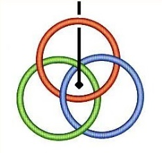

<!-- id: s23-06-0107 -->

Cette histoire de corde, elle a l’avantage d’être aussi bête, que toute la représentation qui a pourtant derrière elle rien de moins que la topologie.

<!-- id: s23-06-0108 -->

En d’autres termes, la topologie repose sur ceci qu’il y a au moins...

<!-- id: s23-06-0109 -->

> sans compter ce qu’il y a de plus ...qu’il y a au moins ceci qui s’appelle *le tore*.

<!-- id: s23-06-0110 -->

Mes bons amis, Soury et Thomé, se sont aperçus que...

<!-- id: s23-06-0111 -->

> ils sont arrivés à décomposer les rapports du nœud borroméen avec le tore ...ils se sont aperçus de ceci : c’est que le couple de deux cercles pliés l’un sur l’autre...

<!-- id: s23-06-0112 -->

> car c’est de ça dont il s’agit, vous voyez bien que celui-ci, en se rabattant, se li­bère,
>
> c’est même tout le prin­cipe du *nœud borroméen* ...ils se sont aperçus que ceci pou­vait s’inscrire dans un tore fait comme ça :

<!-- id: s23-06-0113 -->

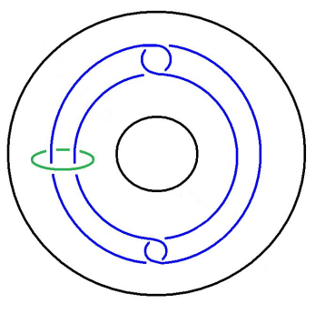

<!-- id: s23-06-0114 -->

Que c’est même pour ça que si on fait passer ici la droite infinie...

<!-- id: s23-06-0115 -->

> qui n’est pas exclue du problème des nœuds, bien loin de là,
>
> cette droite infinie qui est faite autrement que ce que nous pouvons appeler *le faux trou* ...cette droite infinie fait de ce trou un *vrai trou*.

<!-- id: s23-06-0116 -->

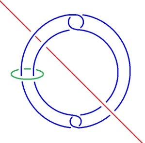

<!-- id: s23-06-0117 -->

C’est-à-dire quelque chose qui se représente mis à plat.

<!-- id: s23-06-0118 -->

Car il reste toujours cette question de la mise à plat.

<!-- id: s23-06-0119 -->

En quoi est-elle convenable ?

<!-- id: s23-06-0120 -->

Tout ce que nous pouvons dire, c’est que les nœuds nous la commandent, nous la commandent comme un artifice, un artifice de représentation, qui n’est en fait que perspective, puisqu’il faut bien que nous suppléions à cette continuité supposée que nous voyons au niveau du moment où la droite infinie est censée sortir *-* sortir de quoi ? - sortir du *trou*.

<!-- id: s23-06-0121 -->

Quelle est la fonction de ce *trou* ?

<!-- id: s23-06-0122 -->

C’est bien ce que nous impose l’expérience la plus simple, celle d’un anneau.

<!-- id: s23-06-0123 -->

*Mais un anneau n’est pas cette chose purement abstraite qu’est la ligne d’un cercle.*

<!-- id: s23-06-0124 -->

*Et il faut qu’à ce cercle, nous donnions corps c’est-à-dire consi­stance, que nous l’imaginions supporté par quelque chose de physique* pour que tout ceci soit pensable.

<!-- id: s23-06-0125 -->

Et c’est là que nous retrouvons ceci : c’est que *ne se pense* *que le corps*.

<!-- id: s23-06-0126 -->

Bon. Reprenons quand même ce à quoi aujourd’hui nous sommes attachés : la piste Joyce.

<!-- id: s23-06-0127 -->

Je poserai la question, celle que j’ai posée tout à l’heure : les lettres d’amour à Nora, qu’est-ce qu’elles indiquent ?

<!-- id: s23-06-0128 -->

Il y a là un certain nombre de coordonnées qu’il faut mar­quer.

<!-- id: s23-06-0129 -->

Qu’est-ce que c’est que ce *rapport* à Nora ?

<!-- id: s23-06-0130 -->

Chose singulière, je dirai que c’est *un rapport sexuel...*

<!-- id: s23-06-0131 -->

> encore que je dise qu’il y en ait pas ...mais c’est un drôle de *rapport sexuel*.

<!-- id: s23-06-0132 -->

Il y a une chose à quoi, enfin on y pense, c’est entendu, mais on y pense rarement.

<!-- id: s23-06-0133 -->

On y pense rarement parce que c’est... c’est pas notre coutume de vêtir notre main droite avec le gant qui va à notre main gauche en le retournant.

<!-- id: s23-06-0134 -->

La chose traîne dans Kant, Mais enfin, qui est-ce qui lit Kant ?

<!-- id: s23-06-0135 -->

C’est fort pertinent dans Kant, c’est fort pertinent...

<!-- id: s23-06-0136 -->

Il y a qu’une seule chose à laquelle...

<!-- id: s23-06-0137 -->

> puisqu’il a pris cette comparaison du gant, je vois pas pourquoi je ne la prendrais pas aussi ...qu’une seule chose à laquelle il a pas songé...

<!-- id: s23-06-0138 -->

> peut-être parce que de son temps les gants n’avaient pas de boutons ...c’est que dans le gant retourné, le bouton est à l’intérieur.

<!-- id: s23-06-0139 -->

C’est un obstacle, quand même, à ce que la comparaison soit complètement satisfaisante !

<!-- id: s23-06-0140 -->

Mais si vous avez quand même bien suivi ce que je viens de dire, c’est que les gants dont il s’agit ne sont pas complètement innocents : le gant retourné, c’est Nora.

<!-- id: s23-06-0141 -->

C’est sa façon à lui de considérer qu’elle lui va comme un gant.

<!-- id: s23-06-0142 -->

Ça n’est pas au hasard que je procède par ce cheminement.

<!-- id: s23-06-0143 -->

C’est parce que depuis toujours avec *une femme*, puisque c’est bien là le cas de le dire : pour Joyce, il n’y a qu’*une femme*.

<!-- id: s23-06-0144 -->

Elle est toujours sur le même modèle, et il ne s’en gante qu’avec la plus vive des répugnances.

<!-- id: s23-06-0145 -->

Ce n’est que - c’est sensible - que par la plus grande des dépréciations qu’il fait Nora, une femme élue.

<!-- id: s23-06-0146 -->

Non seulement il faut qu’elle lui aille comme un gant, mais il faut qu’elle le serre comme un gant.

<!-- id: s23-06-0147 -->

Elle ne sert absolument à rien. Et c’est même au point que...

<!-- id: s23-06-0148 -->

> c’est tout à fait net dans leurs relations quand ils sont à Trieste ...chaque fois que se raboule un gosse - je suis bien forcé de parler comme ça - ça fait un drame.

<!-- id: s23-06-0149 -->

Ça fait un drame : c’était pas prévu dans le programme.

<!-- id: s23-06-0150 -->

Et il y a vraiment un malaise qui s’établit entre celui qu’on appelle comme ça - copains comme cochon - qu’on appelle Jim et...

<!-- id: s23-06-0151 -->

> parce que c’est comme ça qu’on écrit de lui, enfin,
>
> on écrit de lui comme ça parce que sa femme lui écrivait sous ce terme

<!-- id: s23-06-0152 -->

...Jim et Nora, ça va plus entre eux quand il y a un rejeton.

<!-- id: s23-06-0153 -->

Ça fait toujours - toujours et dans chaque cas - un drame.

<!-- id: s23-06-0154 -->

J’ai parlé tout à l’heure du bouton.

<!-- id: s23-06-0155 -->

Ça doit bien avoir comme ça une petite affaire, une petite chose à faire avec la façon dont on appelle quelque chose, enfin un organe. Ouais... Le clitoris, pour l’appeler par son nom, est quelque chose comme un point noir, dans cette affaire. Je dis *point noir* : métaphorique ou pas.

<!-- id: s23-06-0156 -->

Ça a d’ailleurs quelques échos dans le comportement, qu’on ne note pas assez, de ce qu’on appelle *une femme.* 

<!-- id: s23-06-0157 -->

C’est très curieux que *une femme* s’intéresse tant aux « *points noirs* » justement.

<!-- id: s23-06-0158 -->

C’est la première chose qu’elle fait à son garçon, c’est de lui sortir les *points noirs*.

<!-- id: s23-06-0159 -->

Puisque c’est une métaphore de ce que son point noir à elle, elle voudrait pas que ça tienne tant de place.

<!-- id: s23-06-0160 -->

C’est toujours le bouton de tout à l’heure, du gant retourné.

<!-- id: s23-06-0161 -->

Parce qu’il faut tout de même pas confondre : c’est évident que de temps en temps il y a des femmes qui doivent procéder à l’épouillage, comme les singesses, mais c’est quand même pas du tout la même chose d’écraser une vermine ou d’extraire un *point noir* ! Ouais...

<!-- id: s23-06-0162 -->

Il faut que nous continuions à faire le tour.

<!-- id: s23-06-0163 -->

L’imagination d’être le rédempteur...

<!-- id: s23-06-0164 -->

> dans notre tradition au moins ...est le prototype de ce que ce n’est pas pour rien que je l’écrive la « *père-version* »*.*

<!-- id: s23-06-0165 -->

C’est dans la mesure où il y a rapport de « *fils à père* »...

<!-- id: s23-06-0166 -->

> et ceci depuis très longtemps ...qu’a surgi cette idée loufoque du rédempteur.

<!-- id: s23-06-0167 -->

Freud a quand même essayé de se dépétrer de ça, de ce sadomaso­chisme, seul point dans lequel il y a un rapport supposé entre le sadisme et le masochisme :

<!-- id: s23-06-0168 -->

- le sadisme est pour le père,

<!-- id: s23-06-0169 -->

- le masochisme est pour le fils.

<!-- id: s23-06-0170 -->

Ça n’a entre eux aucun, strictement aucun rapport.

<!-- id: s23-06-0171 -->

Faut vraiment croire que ça se passe comme ici :

<!-- id: s23-06-0172 -->

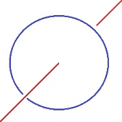

<!-- id: s23-06-0173 -->

À savoir qu’il y a une droite infinie qui pénètre dans un tore...

<!-- id: s23-06-0174 -->

> je pense que je fais assez image comme ça ...faut vraiment croire à *l’actif* et au *passif* pour imaginer que *le sadomasochisme* est quelque chose d’expliqué par une polarité.

<!-- id: s23-06-0175 -->

Freud a très bien vu quelque chose qui est beaucoup plus ancien que cette mythologie chrétienne : c’est *la castration*.

<!-- id: s23-06-0176 -->

C’est que le *phallus* ça se transmet de père en fils, et que même ça comporte quelque chose qui annule *le phallus du père* avant que le fils ait le droit de le porter. C’est essentiellement de cette façon, qui est une transmis­sion manifestement symbolique*,* que Freud se réfère dans cette idée de la *castration*.

<!-- id: s23-06-0177 -->

C’est bien ce qui m’amène à poser la question des rapports du *Symbolique* et du *Réel*.

<!-- id: s23-06-0178 -->

Ils sont fort ambigus, au moins dans Freud.

<!-- id: s23-06-0179 -->

C’est bien là que se soulève la question de la critique du *vrai* : qu’est-ce que c’est que le *vrai*, sinon le *vrai Réel* ?

<!-- id: s23-06-0180 -->

Et comment distin­guer...

<!-- id: s23-06-0181 -->

> sinon à employer quelque terme métaphysique : le « *Echt »* de Heidegger ...comment distinguer le *vrai Réel*, du faux ?

<!-- id: s23-06-0182 -->

Car *Echt* est quand même du côté du *Réel*.

<!-- id: s23-06-0183 -->

C’est bien là que bute toute la métaphysique de Heidegger.

<!-- id: s23-06-0184 -->

Dans ce petit morceau sur *Echt,* il avoue - si je puis dire - son échec.

<!-- id: s23-06-0185 -->

Le *Réel* se trouve dans les embrouilles du *vrai*.

<!-- id: s23-06-0186 -->

Et c’est bien ça qui m’a amené à l’idée de nœud qui procède de ceci, que le *vrai* s’autoperfore du fait que son usage crée de toute pièce *le sens*.

<!-- id: s23-06-0187 -->

Ceci de ce qu’il glisse, de ce qu’il est aspiré par l’image du trou corporel dont il est émis, à savoir la bouche en tant qu’elle suce.

<!-- id: s23-06-0188 -->

Il y a une dynamique du regard, centrifuge, c’est-à-dire qui part de l’œil, de l’œil voyant, mais aussi bien du point aveugle elle part de *l’instant de voir,* et l’a pour point d’appui. L’œil voit instantanément en effet, c’est ce qu’on appelle « l’*intuition* », par quoi il redouble ce qu’on appelle « l’*espace* » dans l’image.

<!-- id: s23-06-0189 -->

*Il n’y a aucun espace réel*.

<!-- id: s23-06-0190 -->

C’est une construction purement verbale, qu’on a épelée en trois dimensions, selon *les lois* - qu’on appelle ça - *de la géométrie*, lesquelles sont celles du ballon ou de la boule, imaginée kinesthétiquement, c’est-à-dire oral-analement.

<!-- id: s23-06-0191 -->

L’*objet* que j’ai appelé « *petit a *» en effet, n’est qu’un seul et même *objet*.

<!-- id: s23-06-0192 -->

Je lui ai reversé le nom d’*objet* en raison de ceci : que l’*objet* est *ob,* *obstaculant* à l’expansion de l’*Imaginaire* concentrique, c’est-à-dire en­globant.

<!-- id: s23-06-0193 -->

Concevable, c’est-à-dire saisissable avec la main - c’est la notion de *Begriff -* saisissable à la manière d’une arme.

<!-- id: s23-06-0194 -->

Et pour évoquer comme ça, quelques allemands qui n’étaient pas du tout idiots, cette arme, loin d’être un prolongement du bras, est dès l’abord une arme de jet, une arme de jet dès l’origine.

<!-- id: s23-06-0195 -->

On n’a pas attendu les boulets pour lancer un boomerang.

<!-- id: s23-06-0196 -->

Ce qui de tout ce tour apparaît, c’est qu’en somme tout ce qui subsiste du *rapport sexuel* c’est cette géométrie à laquelle nous avons fait allusion à propos du gant. C’est tout ce qui reste à l’espèce humaine de support pour le *rapport*.

<!-- id: s23-06-0197 -->

Et c’est bien en quoi d’ailleurs, elle s’est dès l’abord engagée dans des affaires de soufflure, elle y a fait plus ou moins rentrer le solide.

<!-- id: s23-06-0198 -->

Il n’en reste pas moins que nous devons faire là la différence entre la coupe de ce solide et ce solide lui-même, et nous apercevoir que ce qu’il y a de plus consistant dans la soufflure, c’est-à-dire dans la sphère, dans le concentrique, c’est la corde. C’est la corde en tant qu’elle fait cercle, qu’elle tourne en rond, qu’elle est boucle, boucle unique d’abord d’être mise à plat.

<!-- id: s23-06-0199 -->

Qu’est-ce qui prouve après tout que la spirale n’est pas plus réelle que le rond...

<!-- id: s23-06-0200 -->

> auquel cas rien n’indique que pour se rejoindre elle doive faire nœud ...si ce n’est le faussement dit *nœud borroméen*, à savoir une *chaî-nœud* qui engendre naturellement le nœud de trèfle, qui provient de ce que ça se joint ici et là, et là :

<!-- id: s23-06-0201 -->

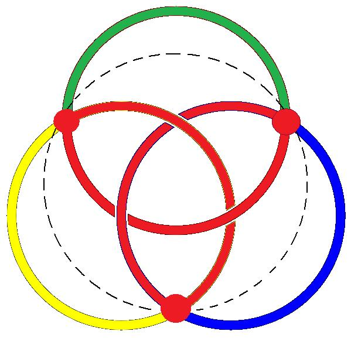→ 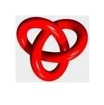

<!-- id: s23-06-0202 -->

Il y a tout de même quelque chose qui n’est pas moins frappant, c’est que renversé comme ça :

<!-- id: s23-06-0203 -->

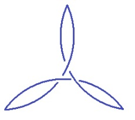

<!-- id: s23-06-0204 -->

ça ne fait pas nœud de trèfle, pour l’appeler par son nom.

<!-- id: s23-06-0205 -->

Et que la question que je poserai à la fin de ce jaspinage est celle-ci : on a tout de suite...

<!-- id: s23-06-0206 -->

pour vous ce n’est peut-être pas évident ...on a tout de suite très bien remarqué...

<!-- id: s23-06-0207 -->

ça ne va pas de soi !

<!-- id: s23-06-0208 -->

...on a tout de suite très bien remarqué que si ***ici*** vous changez quelque chose au passage *en-dessous*, dans ce nœud, de cette disons « aile du nœud », vous avez tout de suite pour résultat que le nœud est aboli.

<!-- id: s23-06-0209 -->

Il est aboli tout entier :

<!-- id: s23-06-0210 -->

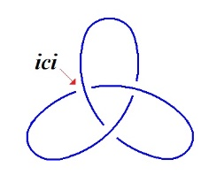→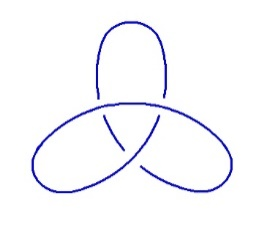→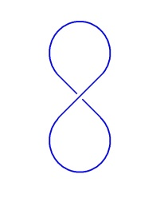→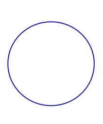

<!-- id: s23-06-0211 -->

Et ce que je soulève comme question, puisque ce dont il s’agit c’est de sa­voir si oui ou non Joyce était fou*,* pourquoi après tout, ne l’aurait-il pas été ? Ceci d’autant plus, que ça n’est pas un privilège,

<!-- id: s23-06-0212 -->

> \- s’il est vrai que chez la plupart *le Symbolique, l’Imagi­naire et le Réel* sont em­brouillés au point de se continuer l’un dans l’autre,
>
> \- s’il n’y a pas d’o­pération qui les distin­gue dans une chaîne, à proprement parler la chaîne du *nœud borro­méen,*
>
> du prétendu *nœud* borro­méen*,* car le *nœud* borroméen n’est pas un nœud, c’est *une chaîne,* ...pourquoi ne pas saisir que chacune de ces boucles se continue pour chacun dans l’autre, d’une façon strictement non distinguée, et que du même coup c’est pas un privilège que d’être fou.

<!-- id: s23-06-0213 -->

Ce que je propose ici, c’est de considérer le cas de Joyce comme répondant à quelque chose qui serait *une façon de suppléer*, de suppléer à ce *dénouement*, à ce dénouement tel que :

<!-- id: s23-06-0214 -->

→ → → 

<!-- id: s23-06-0215 -->

comme vous le voyez je suppose quand même, ceci fait purement et simplement un rond, ceci se déploie… il suffit de *rabattre*... C’est du *rabattement* de ceci que résulte ce *huit*.

<!-- id: s23-06-0216 -->

Ce dont il s’agit de s’apercevoir, c’est qu’à ceci on peut remédier - à faire quoi ? - à y mettre une boucle, à y mettre une boucle grâce à quoi le nœud de trèfle - le *cloverleaf -* ne s’en ira pas en floche*.*

<!-- id: s23-06-0217 -->

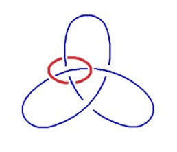

<!-- id: s23-06-0218 -->

Est-ce que nous ne pouvons pas concevoir le cas de Joyce comme ceci : c’est à savoir que son désir d’être « *un artiste qui occuperait tout le monde* »...

<!-- id: s23-06-0219 -->

> le plus de monde possible en tout cas ...est-ce que ce n’est pas exactement *le compensatoire* de ce fait que, disons que son père n’a jamais été pour lui un père*.*

<!-- id: s23-06-0220 -->

Que non seulement il ne lui a rien appris, mais qu’il a négligé à peu près toute chose, sauf à s’en reposer sur les « *bons pères Jésuites* », l’Église diplomatique, je veux dire la trame dans laquelle se développait ceci qui n’a plus rien à faire avec la « rédemption », qui n’est plus qu’ici que bafouillage.

<!-- id: s23-06-0221 -->

Le terme « *diplomatique* » est emprunté au texte même de Joyce, spécialement de *Stephen Hero* où « *Church Diplomatic* » est nommément employé. Mais il est aussi certain que dans le *Portrait de l’Artiste,* le père parle de l’Église comme d’une très bonne institution.

<!-- id: s23-06-0222 -->

Et même que le mot « *diplomatic* » y est également présenté, poussé en avant.

<!-- id: s23-06-0223 -->

Est-ce qu’il n’y a pas quelque chose comme une - je dirais - compensation de cette démission paternelle, de cette « *Verwerfung de fait* », dans le fait que Joyce se soit senti impérieusement « *appelé »*, c’est le mot...

<!-- id: s23-06-0224 -->

> c’est le mot qui résulte d’un tas de choses dans son propre texte, dans ce qu’il a écrit ...et que ce soit là le ressort propre par quoi chez lui *le nom propre* c’est quelque chose qui est étrange.

<!-- id: s23-06-0225 -->

J’avais dit que je parlerais du *nom propre* aujourd’hui, je remplis sur le tard, ma promesse.

<!-- id: s23-06-0226 -->

Le nom qui lui est propre, c’est cela qu’il valorise au dépens du père.

<!-- id: s23-06-0227 -->

C’est à ce nom qu’il a voulu que soit rendu l’hommage ­que lui-même a refusé à quiconque.

<!-- id: s23-06-0228 -->

C’est en cela qu’on peut dire que le *nom propre*

<!-- id: s23-06-0229 -->

- qui fait bien tout ce qu’il peut pour se faire *plus* que le **S1**, le **S1** du maître,

<!-- id: s23-06-0230 -->

- qui se dirige vers le **S2** qui est ce autour de quoi se cumule ce qu’il en est du savoir \[**S1** → **S2**\].

<!-- id: s23-06-0231 -->

Il est très clair que depuis toujours ça a été une invention, une invention qui s’est diffusée à mesure de l’histoire, qu’il y ait deux noms qui lui soient propres, à ce sujet.

<!-- id: s23-06-0232 -->

Que Joyce s’appelait également *James*, c’est quelque chose qui ne prend sa suite que dans l’usage du surnom : James Joyce surnommé « Dedalus ».

<!-- id: s23-06-0233 -->

Le fait que nous puissions en mettre comme ça des tas, n’aboutit qu’à une chose, c’est à faire rentrer le *nom propre* dans ce qu’il en est du nom commun*.*

<!-- id: s23-06-0234 -->

Oui. Eh ben, écoutez, puisque j’en suis arrivé là à cette heure, vous devez en avoir votre claque, et même votre « *Jacq’Lac* », puisque aussi bien j’y ajouterai le « *han !* » qui sera l’expression du soulagement que j’éprouve à avoir parcouru aujourd’hui \[*ce chemin ?* \] : je réduis mon *nom propre* au nom le plus commun.
