# Leçon 08 | 09 Mars 1976

<!-- source-url: http://staferla.free.fr/S23/S23 LE SINTHOME.docx -->
<!-- seminar: s23 -->
<!-- lesson: 08 -->

<!-- id: s23-08-0001 -->

Bon, ben me v’là réduit à improviser.

<!-- id: s23-08-0002 -->

Non pas bien sûr que je n’aie pas travaillé depuis la dernière fois – abondamment ! – mais comme je m’attendais pas forcément à parler, puisque, en principe c’est la grève, me v’là donc réduit à faire ce que - quand même - j’ai un peu préparé, même beaucoup...

<!-- id: s23-08-0003 -->

Je vais aujourd’hui...

<!-- id: s23-08-0004 -->

> j’espérais que vous seriez moins nombreux. Comme d’habitude ! ...je vais aujourd’hui vous montrer quelque chose. C’est pas forcément ce que, ce que vous attendez \[*Rires*\].

<!-- id: s23-08-0005 -->

Ça n’est pas sans rapport, mais j’ai emporté avant de partir une chose à laquelle je désirais beaucoup penser, parce que je l’avais promis à la personne qui n’est pas sans y être un peu intéressée, c’est ceci que je voudrais vous faire connaître, vous rappeler pour ceux qui le savent déjà : qu’il y a quelqu’un que j’aime beaucoup, qui s’appelle Hélène Cixous...

<!-- id: s23-08-0006 -->

> ça s’écrit avec un C au début, ça se termine par un S, ça se prononce Cixous à l’occasion, ...alors, ladite Hélène Cixous avait fait déjà, paraît-il...

<!-- id: s23-08-0007 -->

> je l’avais, quant à moi, laissé un peu vague dans mon souvenir ...a fait déjà, paraît-il*,* dans le numéro épuisé de *Littérature* \[*Littérature N°*3*, Octobre* 1971\] où...

<!-- id: s23-08-0008 -->

> on me l’a rappelé, je l’ignorais totalement ...j’avais fait *Litturaterre* \[« *Litturaterre » : pp.* 3-10\]*,* dans ce numéro épuisé...

<!-- id: s23-08-0009 -->

> ce qui ne vous rendra pas facile de le retrouver, sauf pour ceux qui l’ont déjà, ...elle avait fait une petite note sur Dora \[*pp.* 79-85 : « *La déroute du sujet, ou le voyage imaginaire de Dora* »\].

<!-- id: s23-08-0010 -->

Alors, depuis elle en fait une pièce : *Le Portrait de Dora.* C’est le titre.

<!-- id: s23-08-0011 -->

Une pièce qui se joue au Petit Orsay, c’est-à-dire à une annexe du Grand Orsay, chacun peut l’imaginer facilement, le Grand Orsay étant occupé par Jean-Louis Barrault et Madeleine Renaud.

<!-- id: s23-08-0012 -->

Alors, ce *Portrait de Dora,* moi j’ai trouvé ça pas mal.

<!-- id: s23-08-0013 -->

J’ai dit ce que j’en pensais à celle que j’appelle Hélène, depuis le temps que je la connais, et je lui ai dit que j’en parlerai.

<!-- id: s23-08-0014 -->

*Le Portrait de Dora,* il s’agit de la Dora de Freud.

<!-- id: s23-08-0015 -->

Et c’est bien en quoi je soupçonne que ça peut intéresser quelques personnes d’aller voir comment c’est réalisé.

<!-- id: s23-08-0016 -->

C’est réalisé d’une façon réelle.

<!-- id: s23-08-0017 -->

Je veux dire que la réalité c’est ce qui...

<!-- id: s23-08-0018 -->

> la réalité des répétitions par exemple ...c’est ce qui, au bout du compte, a dominé les acteurs.

<!-- id: s23-08-0019 -->

Je ne sais pas comment vous apprécierez.

<!-- id: s23-08-0020 -->

Mais ce qu’il y a de certain, c’est qu’il y a là quelque chose de tout à fait frappant.

<!-- id: s23-08-0021 -->

Il s’agit de *l’hystérie*, de *l’hystérie* de Dora précisément, et il se trouve que c’est pas la meilleure hystérique de la distribution. Celle qui est la meilleure hystérique joue un autre rôle, mais elle ne montre pas du tout ses vertus d’hystérique.

<!-- id: s23-08-0022 -->

Dora elle-même, enfin, celle qui joue son rôle, ne le montre pas mal, tout au moins c’est mon sentiment.

<!-- id: s23-08-0023 -->

Il y a aussi quelqu’un là-dedans qui fait, qui joue le rôle de Freud.

<!-- id: s23-08-0024 -->

Il est, bien entendu, *très embêté*. \[*Rires*\]

<!-- id: s23-08-0025 -->

Et il est *très embêté* et ça se voit, enfin, il y va précautionneusement.

<!-- id: s23-08-0026 -->

Et c’est d’autant moins heureux, du moins pour lui, qu’il n’est pas un acteur : il s’est dévoué pour ça.

<!-- id: s23-08-0027 -->

Alors, il a tout le temps peur de charger Freud. Enfin, ça se voit dans son débit.

<!-- id: s23-08-0028 -->

Enfin, le mieux que j’ai à vous dire, c’est d’aller le voir.

<!-- id: s23-08-0029 -->

Ce que vous verrez est quelque chose qui, quand même, est marqué de cette précaution du Freud, du Freud acteur.

<!-- id: s23-08-0030 -->

Alors, il en résulte dans l’ensemble quelque chose qui est tout à fait curieux en fin de compte.

<!-- id: s23-08-0031 -->

On a là l’hystérie...

<!-- id: s23-08-0032 -->

je pense que ça vous frappera, mais après tout, peut-être apprécierez-vous autrement ...on a là l’hystérie que je pourrais dire *incomplète.*

<!-- id: s23-08-0033 -->

Je veux dire que l’hystérie c’est toujours - enfin depuis Freud - c’est toujours deux.

<!-- id: s23-08-0034 -->

Et là, on la voit en quelque sorte réduite, cette hystérie, à un état que je pourrais appeler...

<!-- id: s23-08-0035 -->

> et c’est pour ça d’ailleurs que ça ne va pas aller mal avec ce que je vais vous expliquer ...à l’état en quelque sorte *matériel*.

<!-- id: s23-08-0036 -->

Il y manque cet élément qui s’est rajouté depuis quelque temps, et depuis avant Freud en fin de compte, à savoir comment elle doit être comprise*.*

<!-- id: s23-08-0037 -->

Ça fait quelque chose de très frappant et de très instructif.

<!-- id: s23-08-0038 -->

C’est une sorte d’hystérie rigide.

<!-- id: s23-08-0039 -->

Vous allez voir, parce que je vais vous le montrer, ce que veut dire en l’occasion le mot *rigidité.*

<!-- id: s23-08-0040 -->

Parce que je m’en vais vous parler d’une *chaîne* qui est ce que je me trouve avoir avancé devant votre attention, *la chaîne* - pour l’appeler comme ça - *la chaîne borroméenne*.

<!-- id: s23-08-0041 -->

Dont ce n’est pas pour rien qu’on l’appelle *nœud*, parce que ça glisse vers le *nœud*.

<!-- id: s23-08-0042 -->

Je vais vous montrer ça tout de suite.

<!-- id: s23-08-0043 -->

Mais là ce que vous verrez, c’est une sorte d’implantation de la rigidité devant ce quelque chose dont il n’est pas exclu que le mot *chaîne* vous le représentifie si on peut dire.

<!-- id: s23-08-0044 -->

Parce qu’une chaîne c’est rigide quand même.

<!-- id: s23-08-0045 -->

L’ennui, c’est que la chaîne dont il s’agit, ça ne peut se concevoir que très souple.

<!-- id: s23-08-0046 -->

Il est même important de la considérer comme tout à fait souple.

<!-- id: s23-08-0047 -->

Ça aussi, je vais vous le montrer.

<!-- id: s23-08-0048 -->

Enfin, je ne vous en dirai pas plus long, donc, sur le *Portrait de Dora.*

<!-- id: s23-08-0049 -->

J’espère - j’espère quoi ? - en avoir quelque écho des personnes qui, par exemple, viennent me voir. Ça arrive...

<!-- id: s23-08-0050 -->

Bon, alors là-dessus, parlons de ce dont il s’agit : de la chaîne, de la chaîne que j’ai été amené à articuler, voire à décrire, en y conjoignant, comme j’y ai été amené, *le Symbolique, l’Imaginaire et le Réel*.

<!-- id: s23-08-0051 -->

Ce qui est important, c’est *le Réel*.

<!-- id: s23-08-0052 -->

Après avoir longuement parlé du *Symbolique* et de *l’Imaginaire,* j’ai été amené à me demander ce que pouvait être, dans cette conjonc­tion, *le Réel*.

<!-- id: s23-08-0053 -->

Et le *Réel*, il est bien entendu que ça ne peut pas être un seul de ces ronds de ficelle.

<!-- id: s23-08-0054 -->

C’est la façon de les présenter dans leur nœud de chaîne qui à elle tout entière fait *le Réel* du nœud.

<!-- id: s23-08-0055 -->

Alors, je vous demande pardon de m’écarter du micro.

<!-- id: s23-08-0056 -->

Vous devez quand même déjà avoir un peu pigé ce dont j’ai essayé de supporter la chaîne borroméenne.

<!-- id: s23-08-0057 -->

Voilà en somme ce que ça donne, quelque chose qui serait à peu près comme ça :

<!-- id: s23-08-0058 -->

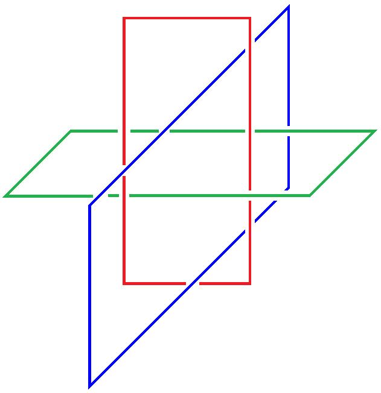

<!-- id: s23-08-0059 -->

J’étais pas porté à le compléter.

<!-- id: s23-08-0060 -->

Mais il est évident qu’il faut le compléter pour faire sentir ce dont il s’agit.

<!-- id: s23-08-0061 -->

Voilà la chaîne typique :

<!-- id: s23-08-0062 -->

<!-- id: s23-08-0063 -->

Il est certain que le fait que je le dessine ainsi, vous avez vu déjà comment ceci peut se transformer, pour un rien, en quelque chose qui a l’air de bien mieux mériter le nom de chaîne, c’est-à-dire de faire entre le bleu et le rouge quelque chose...

<!-- id: s23-08-0064 -->

> là on ne sait plus comment dire ...qui fait *chaîne* ou qui fait *nœud *:

<!-- id: s23-08-0065 -->

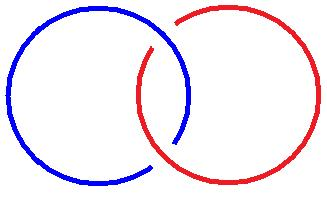

<!-- id: s23-08-0066 -->

Vraie chaîne à 2

<!-- id: s23-08-0067 -->

Parce que c’est quand même ça qui ressemble le plus - j’ai inversé peu importe - qui ressemble le plus à ce qu’on met d’habitude, *ce qu’on considère d’habitude comme une chaîne*. Ce qu’il y a avantage, finalement, à le représenter comme ça :

<!-- id: s23-08-0068 -->

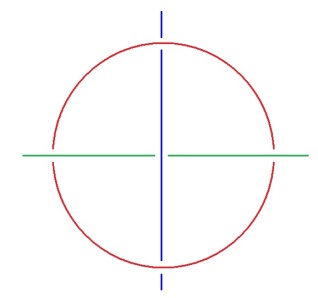

<!-- id: s23-08-0069 -->

À savoir à représenter les trois ronds d’une façon, en somme, qu’il faut appeler « *projective ».* C’est aussi bien ce qui vaut.

<!-- id: s23-08-0070 -->

Il n’en restera pas moins que ce qui sera ainsi présenté :

<!-- id: s23-08-0071 -->

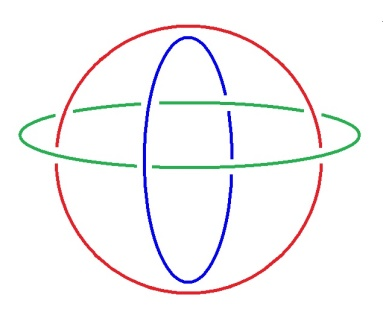

<!-- id: s23-08-0072 -->

ça sera… attention, ici vous voyez bien que nous sommes forcés de mettre *les trois ronds* d’une façon qui respecte la disposition de ce que j’ai dessiné d’abord.

<!-- id: s23-08-0073 -->

Comme on le voit, l’avantage qui résulte de la façon dont je l’ai présenté ainsi, c’est que ça *simule la sphère*, comme je l’ai fait remarquer à Dali avec qui je me suis entretenu de ça je ne sais plus quand.

<!-- id: s23-08-0074 -->

La différence qu’il y a entre cette *chaîne borroméenne* et ce qu’on dessine toujours dans *une sphère armillaire,* quand on essaie de la circulariser à trois niveaux, respectivement qu’on peut appeler : *transversal, sagittal, horizontal*, on n’a jamais vu représenter une sphère armillaire de la façon dont se présente ce *nœud borroméen*.

<!-- id: s23-08-0075 -->

Alors cette fausse sphère que j’ai dessinée là tout à fait sur la droite, il y a une façon de la manipuler.

<!-- id: s23-08-0076 -->

De la manipuler en tant que prise au niveau de ce qui en constitue un huitième : Ça consiste là... ceci parce que cette sphère est supportée de cercles, il y a une façon de la retourner sur elle-même.

<!-- id: s23-08-0077 -->

Une sphère comme telle, c’est difficile de ne pas concevoir que c’est lié à l’idée de « *Tout* ».

<!-- id: s23-08-0078 -->

Il est un fait, c’est que le fait qu’on représente une *sphère* très volontiers par un cercle, lie l’idée de « *Tout* »...

<!-- id: s23-08-0079 -->

> qui ne se supporte que de la sphère *...*lie l’idée de « *Tout* » au cercle. Mais c’est une erreur. C’est une erreur parce que l’idée de « *Tout* » implique la fermeture.

<!-- id: s23-08-0080 -->

Si on peut retourner ce « *Tout* », l’intérieur devient l’extérieur, et c’est ce qui se produit à partir du moment où nous avons supporté de *cercles* *la chaîne borroméenne*, c’est que *la chaîne borroméenne* peut se retourner.

<!-- id: s23-08-0081 -->

Elle peut se retourner du fait que le cercle, c’est pas du tout ce qu’on croit - ce qui symbolise l’idée de « *Tout* » - mais que dans un cercle il y a un trou. C’est dans la mesure où les êtres sont inertes, c’est-à-dire supportés par un corps, qu’on peut - comme on l’a fait, à l’initiative de Popilius - dire à quelqu’un :

<!-- id: s23-08-0082 -->

> « *tu ne sortiras pas de là, parce que j’ai fait un rond autour de toi,*
>
> *tu ne sortiras pas de là avant de m’avoir promis telle chose.* »

<!-- id: s23-08-0083 -->

Nous retrouvons là, en somme, ceci pour quoi j’ai avancé que concernant ce que j’ai appelé du nom de « *La* femme » : elle n’est « *pas-toute* ». Elle n’est *pas-toute*, ceci veut dire que « *les femmes* » ne constituent qu’un ensemble.

<!-- id: s23-08-0084 -->

En effet, avec le temps on est arrivé à dissocier l’idée de « *Tout* », de l’idée d’*ensemble*.

<!-- id: s23-08-0085 -->

Je veux dire que... on est arrivé à la pensée de ceci qu’un certain nombre d’objets peuvent être supportés de *petites lettres*.

<!-- id: s23-08-0086 -->

Et alors l’idée de « *Tout* » se dissocie, à savoir que le cercle censé...

<!-- id: s23-08-0087 -->

> dans une représentation tout à fait fragile ...les rassembler, le cercle est extérieur aux objets *petit a, petit b, petit c, etc.*

<!-- id: s23-08-0088 -->

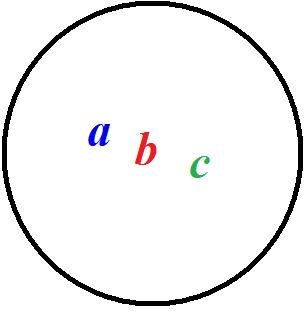

<!-- id: s23-08-0089 -->

Spécifier que la femme n’est *pas-toute* implique une dissymétrie entre un objet qu’on pourra appeler grand A \- et il s’agit de savoir ce que c’est - et un ensemble à un élément.

<!-- id: s23-08-0090 -->

Les deux - s’il y a couple - étant réunis d’être contenus dans un cercle, qui de ce fait se trouve distinct

<!-- id: s23-08-0091 -->

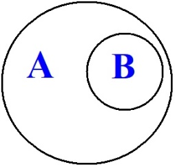

<!-- id: s23-08-0092 -->

Ce qu’on exprime d’habitude selon la forme sui­vante, ce sont des paren­thèses dont on use et qu’on *écrit* ainsi : {A {B}}*,* il y a un élément d’une part, et d’autre part un ensemble à un seul élément. Comme vous le voyez, j’ai fait un bafouillage.

<!-- id: s23-08-0093 -->

Alors, il faut que je vous avoue ceci : c’est que après avoir assenti à ce que Soury et Thomé m’avaient articulé, c’est à savoir qu’une chaîne borroméenne à 3 se montre supporter deux objets différents, à condition que les 3 ronds qui constituent ladite chaîne soient coloriés <u>et</u> orientés : les deux étant exigibles.

<!-- id: s23-08-0094 -->

Ce qui distingue les deux objets en question.

<!-- id: s23-08-0095 -->

Dans un second temps, c’est-à-dire après avoir *assenti* à ce qu’ils disaient, mais en quelque sorte superfi­ciellement, je me suis trouvé dans la position désagréable de m’être imaginé que de seulement *les colorier suffisait à distinguer* 2 objets.

<!-- id: s23-08-0096 -->

Ceci parce que je n’avais pas... j’avais consenti tout à fait superfi­ciellement à ce dont ils m’avaient apporté l’affirmation.

<!-- id: s23-08-0097 -->

En effet, ça a l’air de se sentir que si nous colo­rons en rouge un de ces trois ronds, ça n’est quand même pas le même objet si nous colorons celui-ci en vert et celui-ci en bleu, ou si nous faisons l’in­verse.

<!-- id: s23-08-0098 -->

C’est pourtant le même objet si nous re­tournons la sphère. Nous obtiendrons très aisément...

<!-- id: s23-08-0099 -->

> je vais - mon Dieu - vous le dessiner ra­pidement ...nous obtien­drons très aisément une disposition contraire.

<!-- id: s23-08-0100 -->

C’est à savoir que pour partir de ce qui est là, de ce qui est là pour le représenter ainsi :

<!-- id: s23-08-0101 -->

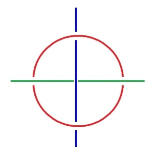

<!-- id: s23-08-0102 -->

où, une fois de plus, il se retourne de la façon suivante : il est en effet...

<!-- id: s23-08-0103 -->

> si nous ne considérons pas ceci comme rigide ...tout à fait plausible de faire du rond rouge la présentation suivante :

<!-- id: s23-08-0104 -->

 → 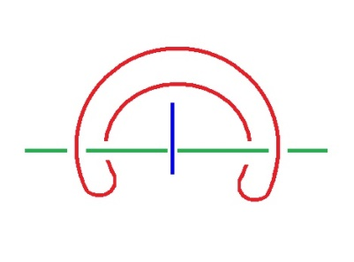

<!-- id: s23-08-0105 -->

Si ici, comme il est également plus que plausible, nous faisons glisser l’anneau de façon à l’amener là où il est tout à fait évident qu’il peut être, vous obtenez la transformation suivante :

<!-- id: s23-08-0106 -->

→ 

<!-- id: s23-08-0107 -->

Et à partir de la transformation suivante, il est tout ce qu’il y a de plausible de faire glisser ce rond d’une façon telle que ce qu’il s’agissait d’obtenir, à savoir que le rond vert soit interne...

<!-- id: s23-08-0108 -->

> au lieu que ce soit le rond bleu ...soit interne au rond rouge, et qu’au contraire le rond bleu soit externe, ceci peut être obtenu :

<!-- id: s23-08-0109 -->

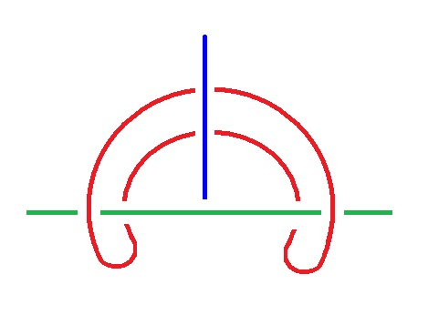→ 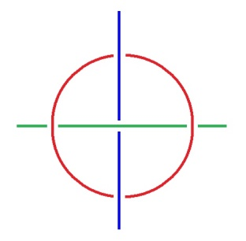

<!-- id: s23-08-0110 -->

Les choses - je peux après tout le dire - ne sont pas si aisées à démontrer. La preuve c’est que ce qui est immédiat...

<!-- id: s23-08-0111 -->

> à simplement penser que les trois ronds peuvent être retournés les uns par rapport aux autres ...ce qui est immédiat et est obtenu par la manipulation, ne l’est pas - obtenu - si aisément que ça.

<!-- id: s23-08-0112 -->

La preuve c’est que lesdits Soury et Thomé qui me représentaient à très juste titre cette manipulation, ne l’ont faite, qu’en s’embrouillant un peu.

<!-- id: s23-08-0113 -->

J’ai essayé de vous représenter là, comment cette transformation effectivement peut être dite s’opérer. Bon !

<!-- id: s23-08-0114 -->

Qu’est-ce qui en somme nous arrête dans l’immédiateté qui est une autre sorte d’*évidence* si je puis dire, cette *évidence* que...

<!-- id: s23-08-0115 -->

concernant le *Réel,* je fais avec un *joke* : ...que je supporte de l’*évidement*.

<!-- id: s23-08-0116 -->

Ce qui résiste à cette *évidence*-*évidement*, c’est l’apparence nodale que produit ce que j’appellerai le « *chaî-nœud* »*,* en équivoquant sur *chaîne* et sur *nœud*. Cette apparence nodale, cette forme de nœud si je puis dire, est ce qui fait du *Réel* l’assurance.

<!-- id: s23-08-0117 -->

Et je dirai à cette occasion que c’est donc une fallace...

<!-- id: s23-08-0118 -->

> puisque j’ai parlé d’apparence *...*c’est une fallace qui témoigne de ce qui est *le Réel*.

<!-- id: s23-08-0119 -->

Il y a différence de la *pseudo-évidence*...

<!-- id: s23-08-0120 -->

puisque dans ma connerie j’ai tenu d’abord pour évidence qu’il pouvait y avoir deux objets, à seulement colorier les cercles ...qu’est-ce que veut dire ce qu’en somme cette série d’artifices je vous l’ai démontrée ?

<!-- id: s23-08-0121 -->

C’est là que se montre la différence entre le *montrer* et le *démontrer*.

<!-- id: s23-08-0122 -->

Il y a, en quelque sorte, une idée de déchéance dans le *démontrer* par rapport au *montrer*.

<!-- id: s23-08-0123 -->

Il y a un « *choir* » du *montrer*.

<!-- id: s23-08-0124 -->

Tout le bla-bla à partir de l’*évidence* ne fait que réaliser l’*évidement* à condition de le faire significativement.

<!-- id: s23-08-0125 -->

Le *more géometrico* qui a été pendant longtemps le support idéal de la démonstration, *repose sur la fallace d’une* *évidence formelle*.

<!-- id: s23-08-0126 -->

Et ceci est tout à fait de nature à nous rappeler que géométriquement une ligne n’est que le recoupement de 2 surfaces, deux surfaces qui sont elles-mêmes taillées dans un solide.

<!-- id: s23-08-0127 -->

Mais c’est un autre support que nous fournit l’anneau, le cercle...

<!-- id: s23-08-0128 -->

> quel qu’il soit, à condition qu’il soit souple ...c’est une autre géométrie qui est à fonder sur la chaîne.

<!-- id: s23-08-0129 -->

Il est certain que je reste excessivement frappé de mon erreur, que j’ai à juste titre appelée « *connerie »*, que j’en ai été affecté à un point qu’on peut difficilement imaginer.

<!-- id: s23-08-0130 -->

C’est bien parce que je veux m’en requin­quer, que je vais maintenant opposer à ce que je crois être - telle qu’ils me l’ont exprimée - l’opinion de Soury et Thomé, qui m’ont fait la remarque qu’il ne s’agit pas seulement que les 3 cercles soient

<!-- id: s23-08-0131 -->

- *les uns colorés*,

<!-- id: s23-08-0132 -->

- *les autres orientés*... *un autre orienté*.

<!-- id: s23-08-0133 -->

Ici je formule, et je crois pouvoir le démontrer, au sens ou dé­montrer est encore proche du montrer, ce dont il s’agit.

<!-- id: s23-08-0134 -->

Soury et Thomé ont procédé par une exhaustion combinatoire de 3 colo­riages et de 3 orientations colloquées sur chacun des cer­cles. Ils ont cru devoir procé­der à cette exhaustion pour démontrer qu’il y a 2 chaînes borroméennes diffé­rentes.

<!-- id: s23-08-0135 -->

Je crois pouvoir ici m’opposer.

<!-- id: s23-08-0136 -->

M’opposer en ceci en ceci qui ressort de la façon dont je représente cette chaîne borroméenne.

<!-- id: s23-08-0137 -->

Pour maintenir les mêmes couleurs qui sont celles dont je me suis servi, voici comment je représente habituellement ce que vous aviez vu là :

<!-- id: s23-08-0138 -->

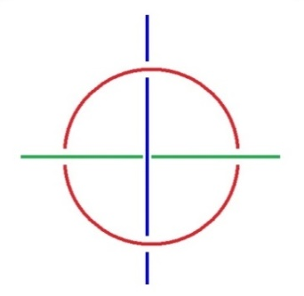

<!-- id: s23-08-0139 -->

Je le représente en ceci différemment de ce que j’y fais jouer deux droites infinies.

<!-- id: s23-08-0140 -->

Là, l’usage de ces deux droites infinies comme opposées au cercle qui les conjoint, suffit à nous permettre de démontrer qu’il y a 2 objets différents dans la chaîne*,* à cette condition

<!-- id: s23-08-0141 -->

- qu’un couple soit colorié,

<!-- id: s23-08-0142 -->

- et le 3ème orienté.

<!-- id: s23-08-0143 -->

Si j’ai parlé de droites infinies, c’est que la droite infinie*,* dont avec prudence Soury et Thomé ne font pas usage, la droite infinie est un équivalent du cercle, au moins pour ce qui est de la chaîne.

<!-- id: s23-08-0144 -->

C’est un équivalent dont *un* point est à l’infini.

<!-- id: s23-08-0145 -->

Ce qui est exigible de deux droites infinies, c’est qu’elles soient concentriques*.*

<!-- id: s23-08-0146 -->

Je veux dire qu’entre elles, elles ne fassent pas chaîne.

<!-- id: s23-08-0147 -->

Ce qui est le point que depuis longtemps avait mis en valeur Desargues, mais sans préciser ce dernier point : c’est à savoir que les droites dont il s’agit - droites dites infinies - doivent ne pas s’enchaîner, puisque rien n’est précisé...

<!-- id: s23-08-0148 -->

> dans ce qu’a formulé Desargues, et que j’ai évoqué en son temps à mon séminaire ...rien n’est précisé sur ce qu’il en est de ce point dit *à l’infini*.

<!-- id: s23-08-0149 -->

Nous voyons alors le fait suivant : orientons le rond dont nous disons qu’il n’a pas besoin d’être dit d’une couleur, c’est évidemment déjà l’isoler, et à titre de ceci qu’il n’est pas dit d’être d’une couleur, c’est faire déjà quelque chose de différent. Néanmoins, il n’est pas indifférent de dire que les 3 doivent être orientés.

<!-- id: s23-08-0150 -->

Si vous procédez à partir de cette orientation, cette orientation qui, de là où nous la voyons, est *dextrogyre :*

<!-- id: s23-08-0151 -->

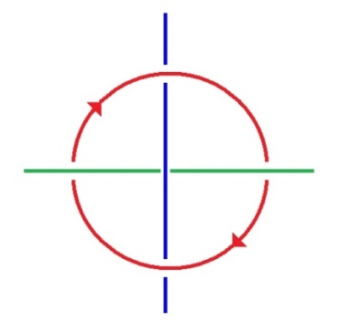

<!-- id: s23-08-0152 -->

Il ne faut pas croire qu’une orientation, ce soit quelque chose qui se maintienne en tous cas.

<!-- id: s23-08-0153 -->

La preuve est facile à donner, c’est à savoir qu’à retourner...

<!-- id: s23-08-0154 -->

> et retourner impliquera l’inversion des droites infinies ...à retourner le rond, le rond rouge aura, vu à partir du retourne­ment, une orientation exactement inverse :

<!-- id: s23-08-0155 -->

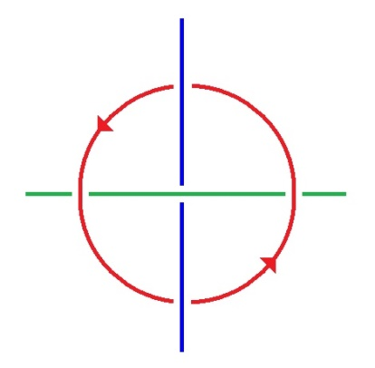

<!-- id: s23-08-0156 -->

J’ai dit que *un seul* suffit à être orienté. Ceci est d’autant plus concevable qu’à faire les droites *infinies,* à partir de quoi donnerions-nous orientation aux dites droites ?

<!-- id: s23-08-0157 -->

Le second objet est tout à fait possible à mettre en évidence à partir de ceci...

<!-- id: s23-08-0158 -->

> qui était au principe de mon illusion sur le coloriage ...à partir de ceci : qu’à prendre le premier - en inversant les couleurs - à prendre le premier de ce que j’ai dessiné là :

<!-- id: s23-08-0159 -->

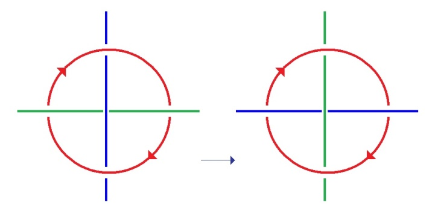

<!-- id: s23-08-0160 -->

À savoir en mettant *ici* la couleur verte, et *ici* la couleur bleue, on obtient un objet incon­testablement différent.

<!-- id: s23-08-0161 -->

À condition de laisser l’orientation de celui qui est orienté, de la laisser la même.

<!-- id: s23-08-0162 -->

Pourquoi en effet changerais-je l’orien­tation ?

<!-- id: s23-08-0163 -->

L’orientation n’a pas de raison d’être changée si j’ai changé le couple des couleurs.

<!-- id: s23-08-0164 -->

Comment reconnaîtrais-je la non-identité de l’objet total, si je change l’orientation ?

<!-- id: s23-08-0165 -->

Et même si vous le retournez :

<!-- id: s23-08-0166 -->

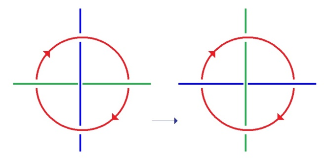

<!-- id: s23-08-0167 -->

vous vous apercevrez que cet objet est bel et bien différent :

<!-- id: s23-08-0168 -->

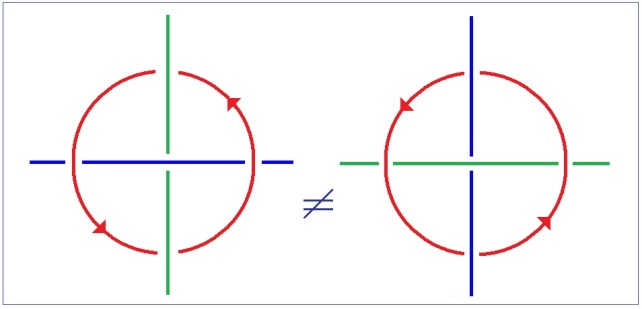

<!-- id: s23-08-0169 -->

Car ce qu’il s’agit de comparer, c’est l’objet constitué par ceci \[**2**\], à savoir en le faisant tourner par ici \[**1**\], le comparer avec cet objet qui est là \[**3**\] 

<!-- id: s23-08-0170 -->

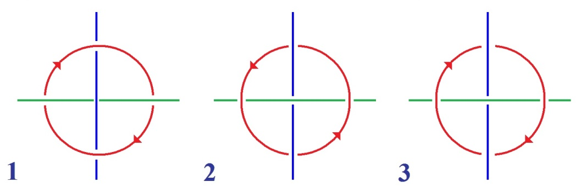

<!-- id: s23-08-0171 -->

Et en somme, nous apercevoir qu’ici c’est l’orientation - l’orientation maintenue de cet objet - l’orientation maintenue qui s’op­pose, qui différencie ce triple, de ce en quoi il peut être dit avoir « *la même présentation* ».

<!-- id: s23-08-0172 -->

Ceci nous permet de distinguer la différence de ce que j’ai appelé tout à l’heure le *Réel* comme marqué de fallace, de ce qu’il en est du *vrai*. N’est *vrai* que ce qui a un *sens*.

<!-- id: s23-08-0173 -->

Quelle est la relation du *Réel* au *vrai* ?

<!-- id: s23-08-0174 -->

Le *vrai* sur le *Réel*, si je puis m’exprimer ainsi, c’est que le *Réel*, le *Réel* du couple ici, n’a *aucun sens*.

<!-- id: s23-08-0175 -->

Ceci joue sur l’équivoque du mot *sens*.

<!-- id: s23-08-0176 -->

Quel est le rapport du *sens* à ce qui ici s’écrit comme *orientation* ?

<!-- id: s23-08-0177 -->

On peut poser la question, et on peut suggérer une réponse, c’est à savoir que c’est le temps.

<!-- id: s23-08-0178 -->

L’important est ceci : c’est que nous faisons jouer dans l’occasion un couple dit colorié, et que ceci n’a *aucun sens*. L’apparence de la couleur est-elle

<!-- id: s23-08-0179 -->

- de la *vision,* au sens où je l’ai distinguée,

<!-- id: s23-08-0180 -->

- ou du *regard* ?

<!-- id: s23-08-0181 -->

Est-ce le *regard* ou la *vision* qui distingue *la couleur* ?

<!-- id: s23-08-0182 -->

C’est une question que pour aujourd’hui je laisserai *en suspens*.

<!-- id: s23-08-0183 -->

La notion de couple, de couple colorié, est là pour suggérer que dans le sexe, il n’y a rien de plus que, je dirais, « *l’être de la couleur* ». Ce qui suggère en soi qu’il peut y avoir

<!-- id: s23-08-0184 -->

- homme *couleur* de femme*,* dirais-je,

<!-- id: s23-08-0185 -->

- ou femme *couleur* d’homme*.*

<!-- id: s23-08-0186 -->

Les sexes en l’occasion...

<!-- id: s23-08-0187 -->

> si nous supportons du rond rouge ce qu’il en est du *Symbolique* *...*les sexes en l’occasion sont opposés

<!-- id: s23-08-0188 -->

- comme l’*Imaginaire* et le *Réel*,

<!-- id: s23-08-0189 -->

- comme l’*Idée* et l’*impossible,* pour reprendre mes termes.

<!-- id: s23-08-0190 -->

Mais est-il bien sûr que toujours ce soit le *Réel* qui soit en cause ?

<!-- id: s23-08-0191 -->

J’ai avancé que dans le cas de Joyce, c’est l’*Idée* et le *Sinthome* plutôt, comme je l’appelle.

<!-- id: s23-08-0192 -->

D’où l’éclairage qui en résulte de ce qu’est *<u>une</u>* femme : *pas-toute* ici, de n’être pas saisie, de rester - à Joyce nommément - étrangère, de n’avoir pas de *sens* pour lui.

<!-- id: s23-08-0193 -->

Une femme, au reste, a-t-elle jamais un sens pour l’homme ?

<!-- id: s23-08-0194 -->

L’homme est porteur de l’idée de signifiant.

<!-- id: s23-08-0195 -->

Et l’idée de signifiant se supporte, dans *lalangue*, de la syntaxe, essentiellement.

<!-- id: s23-08-0196 -->

Il n’en reste pas moins que si quelque chose dans l’Histoire peut être supposé, *c’est que c’est « l’ensemble des femmes » qui*...

<!-- id: s23-08-0197 -->

devant une langue qui se dé­compose : le latin dans l’occasion, puisque c’est de cela qu’il s’agissait à l’origine de nos langues ...*que c’est « l’ensemble des femmes » qui engen­dre ce que j’ai appelé « lalangue »*.

<!-- id: s23-08-0198 -->

C’est ce *dire* interrogé sur ce qu’il en est de *lalangue*, sur ce qui a pu guider un sexe sur les deux, vers ce que j’appellerai cette *prothèse de l’équivoque*.

<!-- id: s23-08-0199 -->

Car ce qui caractérise *lalangue* parmi toutes, ce sont les équivoques qui y sont possibles.

<!-- id: s23-08-0200 -->

C’est ce que j’ai illustré de l’équivoque de « *deux* » (*d,e,u,x*) avec « *d’eux* » (*d,apostrophe,e,u,x*).

<!-- id: s23-08-0201 -->

*Un « ensemble des femmes » a engendré dans chaque cas lalangue.*

<!-- id: s23-08-0202 -->

Là-dessus, je veux quand même vous indiquer quelque chose.

<!-- id: s23-08-0203 -->

C’est que nous avons parlé de bien des choses aujourd’hui, sauf de ce qui fait le propre de la chaîne borroméenne.

<!-- id: s23-08-0204 -->

La chaîne borroméenne n’aurait pas lieu s’il n’y avait pas ceci...

<!-- id: s23-08-0205 -->

> que je dessine, et que, comme d’habitude, je dessine mal
>
> parce que c’est comme ça que ça doit être dessiné ...qui en est le propre et qui est ce que j’appellerai « *le faux-trou ».*

<!-- id: s23-08-0206 -->

<!-- id: s23-08-0207 -->

Dans un cercle - ai-je souligné tout à l’heure - il y a un trou.

<!-- id: s23-08-0208 -->

Qu’on puisse avec un cercle, en y adjoignant un autre, faire ce trou qui consiste dans ce qui passe là au milieu, et qui n’est

<!-- id: s23-08-0209 -->

- ni le trou de l’un,

<!-- id: s23-08-0210 -->

- ni le trou de l’autre, c’est ça que j’appelle « *le* *faux-trou* »*.*

<!-- id: s23-08-0211 -->

Mais il y a ceci sur quoi repose toute l’essence de la chaîne borroméenne : c’est que « droite infinie » ou « cercle », s’il y a quelque chose qui tra­verse ce que j’ai appelé à l’in­stant le faux-trou, s’il y a quelque chose - je le répète, droite ou cercle - ce faux-trou est, si l’on peut dire, vérifié.

<!-- id: s23-08-0212 -->

<!-- id: s23-08-0213 -->

La fonction de ceci : la vérification du *faux-trou*, le fait que cette vérification le transforme en *Réel*, c’est là...

<!-- id: s23-08-0214 -->

et je me permets à cette occasion de rappeler que j’ai eu l’occasion de relire ma « *Signification du Phallus ».*

<!-- id: s23-08-0215 -->

J’y ai eu la bonne surprise de trouver dès les premières lignes l’évocation du *nœud*, ceci à une date où j’étais bien loin de m’être intéressé à ce qu’on appelle *le nœud borroméen*.

<!-- id: s23-08-0216 -->

Les premières lignes de la « *Signi­fication du Phallus »* indiquent *le nœud* comme étant ce qui est du *ressort* en l’occasion ...c’est ce *phallus* qui a ce rôle de vérifier, du *faux-trou*, qu’il est *Réel*.

<!-- id: s23-08-0217 -->

C’est en tant que le *sinthome* fait un *faux-trou* avec le *Symbolique*, qu’il y a une praxis quelconque, c’est-à-dire quelque chose qui relève du *dire*, de ce que j’appellerai aussi bien à l’occasion *l’art-dire*, voire pour glisser vers *l’ardeur*.

<!-- id: s23-08-0218 -->

Joyce - pour terminer - ne savait pas qu’il faisait le *sinthome*. Je veux dire qu’il le simulait.

<!-- id: s23-08-0219 -->

Il en était in­conscient, et c’est de ce fait qu’il est un pur artificier, qu’il est un homme de savoir-faire, c’est-à-dire ce qu’on appelle aussi bien un artiste.

<!-- id: s23-08-0220 -->

Le seul *réel* qui vérifie quoi que ce soit, c’est *le phallus* en tant que j’ai dit tout à l’heure de quoi *le phallus* est le support, à savoir - de ce que je souligne dans cet article - à savoir de la fonction du signifiant en tant qu’elle crée tout signifié.

<!-- id: s23-08-0221 -->

Encore faut-il...

<!-- id: s23-08-0222 -->

> ajouterai-je, pour le reprendre la prochaine fois ...encore faut-il qu’il n’y ait que lui pour le vérifier, ce *réel*.
