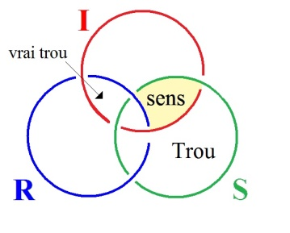
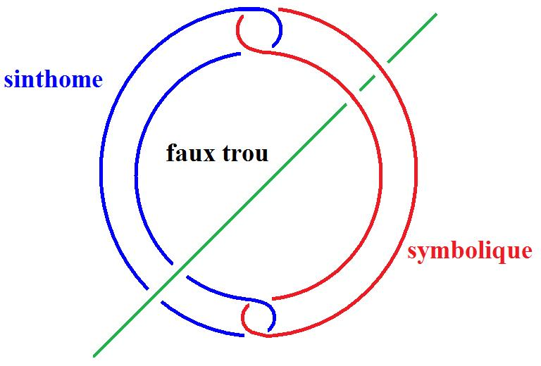

# Leçon 10 | 13 Avril 1976

<!-- source-url: http://staferla.free.fr/S23/S23 LE SINTHOME.docx -->
<!-- seminar: s23 -->
<!-- lesson: 10 -->

<!-- id: s23-10-0001 -->

D’habitude, j’ai quelque chose à vous dire. Mais je souhaiterais comme ça, aujourd’hui...

<!-- id: s23-10-0002 -->

> je souhaiterais parce que j’ai une occasion : c’est le jour de mon anniversaire \[*applaudissements*\] ...je souhaiterais que je puisse vérifier si je sais ce que je dis.

<!-- id: s23-10-0003 -->

Malgré tout, dire, ça vise à être entendu.

<!-- id: s23-10-0004 -->

Je voudrais vérifier, en somme, si je ne me contente pas de parler pour moi.

<!-- id: s23-10-0005 -->

Comme tout le monde le fait, bien sûr.

<!-- id: s23-10-0006 -->

Si l’inconscient a un sens, c’est bien ça.

<!-- id: s23-10-0007 -->

Je dis : « *si l’inconscient a un sens*... »

<!-- id: s23-10-0008 -->

Je préférerais donc qu’aujourd’hui, quelqu’un...

<!-- id: s23-10-0009 -->

> je ne demande pas des merveilles, je ne demande pas du tout que l’étincelle jaillisse ...j’aurais aimé sans doute que quelqu’un écrive quelque chose qui en somme justifierait cette peine que je me donne depuis environ vingt-deux ans, un peu plus.

<!-- id: s23-10-0010 -->

La seule façon de le justifier ça serait que quelqu’un invente quelque chose qui puisse, à moi, me servir.

<!-- id: s23-10-0011 -->

Je suis persuadé que c’est possible.

<!-- id: s23-10-0012 -->

J’ai inventé ce qui s’écrit comme : « *le Réel* ».

<!-- id: s23-10-0013 -->

Naturellement, il ne suffit pas de l’écrire *Réel*, parce que pas mal de gens l’on fait avant moi.

<!-- id: s23-10-0014 -->

Mais ce *Réel*, je l’ai écrit sous la forme de ce que on appelle le nœud borroméen, qui n’est pas un nœud, qui est une chaîne, une chaîne ayant certaines propriétés.

<!-- id: s23-10-0015 -->

Et sous la forme minimale sous laquelle j’ai tracé cette chaîne, il en faut au moins trois* *: le *Réel* c’est ça.

<!-- id: s23-10-0016 -->

C’est ça qui consiste à appeler un de ces trois : *Réel*. Ça veut dire là qu’il y a trois éléments.

<!-- id: s23-10-0017 -->

Et que ces trois éléments, en somme, tels qu’ils sont dits noués - en réalité enchaînés - font métaphore.

<!-- id: s23-10-0018 -->

Ça n’est rien de plus, bien sûr, que métaphore de la chaîne.

<!-- id: s23-10-0019 -->

Comment se peut-il qu’il y ait une métaphore de quelque chose qui, qui n’est que *nombre* ?

<!-- id: s23-10-0020 -->

Cette métaphore on l’appelle, à cause de ça, « *le chiffre »*.

<!-- id: s23-10-0021 -->

Il y a un certain nombre de façons de tracer ces chiffres, enfin, la façon la plus simple c’est celle que j’ai appelée du *trait unaire,  *: de faire un certain nombre de traits, ou de points d’ailleurs, et ça suffit à indiquer un nombre.

<!-- id: s23-10-0022 -->

Il y a quelque chose d’important, c’est que ce qu’on appelle « *l’énergétique* », ça n’est rien d’autre que la manipulation d’un certain nombre de nombres, un certain nombre de nombres d’où on extrait un nombre constant.

<!-- id: s23-10-0023 -->

C’était ça à quoi Freud...

<!-- id: s23-10-0024 -->

se référant à la science, à la science telle qu’on la concevait de son temps ...à quoi Freud se référait, c’est-à-dire qu’il n’en faisait qu’une métaphore.

<!-- id: s23-10-0025 -->

L’idée d’une *énergéti­que psychique*, il ne l’a jamais vraiment, vraiment fondée.

<!-- id: s23-10-0026 -->

Il n’aurait même pas pu en tenir la métaphore avec quelque vraisemblance.

<!-- id: s23-10-0027 -->

L’idée d’une constante, par exemple, liant le *stimulus* à ce qu’il appelle « *la réponse* », est quelque chose de tout à fait insoutenable.

<!-- id: s23-10-0028 -->

Dans la métaphore de la chaîne, de la chaîne borroméenne, je dis que j’ai *inventé* quelque chose.

<!-- id: s23-10-0029 -->

Qu’est-ce que c’est qu’inventer ?

<!-- id: s23-10-0030 -->

Est-ce que c’est une idée ?

<!-- id: s23-10-0031 -->

Que ceci ne vous empêche pas quand même, d’essayer dans un instant de me poser une question qui me ré­compense.

<!-- id: s23-10-0032 -->

Qui me récompense non pas de l’effort que je fais pour l’instant parce que, justement ce que je pense pour l’instant, c’est que ce que je vous dis, pour l’instant, n’a pas beaucoup de chance d’obtenir une réponse.

<!-- id: s23-10-0033 -->

Est-ce que c’est une idée, cette idée du *Réel* ?

<!-- id: s23-10-0034 -->

J’entends : telle qu’elle s’*écrit* dans ce qu’on appelle le nœud borroméen, qui - je le souligne - est une chaîne.

<!-- id: s23-10-0035 -->

C’est pas une idée !

<!-- id: s23-10-0036 -->

C’est pas une idée qui se soutienne parce que c’est en somme *là* qu’on touche que l’idée, l’idée qui vient comme ça, l’idée qui vient quand on est couché, parce qu’en fin de compte c’est ça l’idée, au moins réduite à sa valeur analy­tique, c’est une idée qui vous vient quand on est couché.

<!-- id: s23-10-0037 -->

Qu’on soit couché ou debout, l’effet de chaîne qu’on obtient par l’*écriture* ne se pense pas aisément.

<!-- id: s23-10-0038 -->

Je veux dire que, à mon expérience tout au moins, il n’est pas du tout aisé de dire comment une chaîne, une chaîne composée d’un certain nombre d’éléments...

<!-- id: s23-10-0039 -->

> même à les réduire à trois ...ça ne *s’imagine* pas facilement, ça ne *s’écrit* pas facilement.

<!-- id: s23-10-0040 -->

Et il vaut mieux y être rompu d’avance pour être sûr de réussir à en donner l’*écriture*.

<!-- id: s23-10-0041 -->

C’est très exactement ce dont vous avez eu mille fois le témoignage par moi-­même, dans des erreurs, les *lapsus* de plume, que j’ai faites cent fois devant vous en essayant de faire - quoi ? - de faire une *écriture* qui symbolise cette chaîne.

<!-- id: s23-10-0042 -->

Je considère que d’avoir énoncé, sous la forme d’une écriture le *Réel* en question, a la valeur de ce qu’on appelle généralement *« un traumatisme »*.

<!-- id: s23-10-0043 -->

Non pas que ç’ait été ma visée de traumatiser *quiconque*, surtout de mes auditeurs, auxquels je n’ai aucune raison d’en vouloir au point de leur causer ce qu’on appelle généralement *un traumatisme*.

<!-- id: s23-10-0044 -->

Disons que c’est un forçage.

<!-- id: s23-10-0045 -->

Un forçage d’une nouvelle écriture.

<!-- id: s23-10-0046 -->

Une écriture qui, par métaphore, a une portée qu’il faut bien appeler *symbolique*.

<!-- id: s23-10-0047 -->

C’est un forçage d’un nouveau type, si je puis dire, d’idée qui n’est pas une idée qui fleurit, en quelque sorte spontanément, du seul fait de ce qui fait *sens* en somme, c’est-à-dire de l’*Imaginaire*.

<!-- id: s23-10-0048 -->

Ce n’est pas non plus que ce soit quelque chose de tout à fait étranger.

<!-- id: s23-10-0049 -->

Je dirai même plus, c’est ça qui rend sensible, qui fait toucher du doigt...

<!-- id: s23-10-0050 -->

> mais de façon tout à fait illusoire ...ce que peut être ce qu’on appelle « *la réminiscence »*.

<!-- id: s23-10-0051 -->

La réminiscence consiste à imaginer à propos de quelque chose qui fait fonction d’idée, mais qui n’en est pas une, on s’imagine qu’on se la « *réminisce* », si je puis m’exprimer ainsi.

<!-- id: s23-10-0052 -->

C’est en ça que les deux fonctions sont distin­guées dans Freud...

<!-- id: s23-10-0053 -->

parce qu’il avait le sens des distinctions ...c’est en ça que la réminiscence est distincte de la remémoration.

<!-- id: s23-10-0054 -->

La remémoration, c’est évidemment quelque chose que Freud à tout à fait forcé.

<!-- id: s23-10-0055 -->

Qu’il a forcé grâce au terme « *impression ».*

<!-- id: s23-10-0056 -->

Il supposait que dans le système nerveux, il y avait des choses qui s’imprimaient.

<!-- id: s23-10-0057 -->

Et ces choses qui s’imprimaient dans le système nerveux, il les pourvoit de lettres, ce qui est déjà trop dire, parce que il n’y a aucune raison *qu’une* *impression* se figure comme ce quelque chose de si déjà éloigné de *l’impression* qu’est *une lettre.*

<!-- id: s23-10-0058 -->

Parce qu’une lettre, il y a déjà un monde entre *une lettre* et *un symbole* phonologique.

<!-- id: s23-10-0059 -->

L’idée dont Freud porte le témoignage dans l’*Esquisse,* en figurant par des réseaux, des réseaux, bien sûr que ces réseaux, c’est peut-être ce qui m’a incité à leur donner une nouvelle forme plus rigoureuse, c’est-à-dire à faire de ces réseaux quelque chose qui s’en­chaîne, au lieu de simplement se tresser.

<!-- id: s23-10-0060 -->

La remémoration à proprement parler, c’est faire entrer...

<!-- id: s23-10-0061 -->

et c’est certain que ce n’est pas facile - je pense que je vous en ai donné le témoignage – ce n’est pas facile de faire entrer la chaîne ou le nœud mis sous le patronage des Borromée ...c’est pas facile de le faire entrer dans ce qui est déjà là...

<!-- id: s23-10-0062 -->

les lapsus que j’ai faits, fréquents, en essayant de les tracer sur quelque chose comme ce bout de papier, en sont la preuve ...quelque chose qui est déjà là et qui se nomme *le savoir*.

<!-- id: s23-10-0063 -->

J’ai essayé d’être rigoureux en faisant remarquer que ce que Freud supporte comme l’inconscient suppose toujours un savoir, et un savoir parlé, comme tel. Que c’est le minimum que suppose le fait que l’in­conscient puisse être interprété.

<!-- id: s23-10-0064 -->

Il est entièrement réductible à un savoir. Après quoi, il est clair que ce savoir exige au minimum deux supports, n’est-ce pas, qu’on appelle termes, en les symbolisant de lettres.

<!-- id: s23-10-0065 -->

D’où mon écriture du savoir comme se supportant de S...

<!-- id: s23-10-0066 -->

> non pas à la deuxième puissance \[**S2**\] *...*de S avec cet *indice* qui le supporte, cet *indice* d’un petit 2 dans le bas - ça n’est pas le S au carré - c’est le S « *supposé être* 2 » : **S2**.

<!-- id: s23-10-0067 -->

La définition que je donne de ce signifiant, comme tel...

<!-- id: s23-10-0068 -->

> et que je supporte du S *indice* 1 : **S1** ...c’est de représenter un sujet, comme tel, et de le représenter vraiment*.*

<!-- id: s23-10-0069 -->

Vraiment veut dire dans l’occasion : conformément à la réalité*.*

<!-- id: s23-10-0070 -->

Le *Vrai* est *dire* conforme à la réalité. La réalité qui est dans l’occasion ce qui fonctionne, ce qui fonctionne vraiment.

<!-- id: s23-10-0071 -->

Mais ce qui fonctionne vraiment n’a rien à faire avec ce que je désigne du *Réel*.

<!-- id: s23-10-0072 -->

C’est une supposition tout à fait précaire que mon *Réel*...

<!-- id: s23-10-0073 -->

> faut bien que je me le mette à mon actif ...que mon *Réel* conditionne la réalité, la réalité de votre audition par exemple.

<!-- id: s23-10-0074 -->

Il y a là un abîme dont on est loin de pouvoir assurer qu’il se franchit.

<!-- id: s23-10-0075 -->

En d’autres termes, l’instance du savoir...

<!-- id: s23-10-0076 -->

> que Freud renouvelle, je veux dire rénove sous la forme de l’inconscient ...est une chose qui ne suppose pas du tout obligatoirement le *Réel* dont je me sers.

<!-- id: s23-10-0077 -->

J’ai véhiculé beaucoup de ce qu’on appelle « *Chose freudienne »*.

<!-- id: s23-10-0078 -->

J’ai même intitulé une chose que j’ai écrite, « *La Chose freudienne ».*

<!-- id: s23-10-0079 -->

Mais dans ce que j’appelle le *Réel*, j’ai inventé.

<!-- id: s23-10-0080 -->

J’ai inventé quelque chose, non pas parce que... ça s’est imposé à moi, peut-être qu’il y en a qui se souviennent *comment*, et à quel moment a surgi ce fameux *nœud* qui est tout ce qu’il y a de plus *figuratif*.

<!-- id: s23-10-0081 -->

C’est le maximum qu’on puisse en figurer, de dire qu’à l’*Imaginaire* et au *Symbolique*, c’est-à-dire à des choses qui sont très étrangères, le *Réel* - lui - apporte l’élément qui peut les faire tenir ensemble, c’est quelque chose dont je peux dire que je le considère comme n’étant rien de plus que mon *symptôme*.

<!-- id: s23-10-0082 -->

Je veux dire que...

<!-- id: s23-10-0083 -->

> si tant est que il y ait ce qu’on puisse appeler une élucubration freudienne ...que c’est ma façon à moi de porter à son degré de symbolisme, au second degré, c’est dans la mesure où Freud a articulé l’inconscient que j’y réagis, mais déjà nous voyons là que c’est une façon de porter *le sinthome* lui-même au second degré.

<!-- id: s23-10-0084 -->

C’est dans la mesure où Freud a vraiment fait une découverte...

<!-- id: s23-10-0085 -->

> et à supposer que cette découverte soit vraie ...qu’on peut dire que le *Réel* est ma *réponse symptomatique*.

<!-- id: s23-10-0086 -->

Mais la réduire à être *symptomatique* n’est évidem­ment pas rien.

<!-- id: s23-10-0087 -->

La réduire à être *symptomatique*, c’est aussi réduire toute « *invention* » au *sinthome.*

<!-- id: s23-10-0088 -->

Changeons de place : à partir du moment où on a une mémoire* *:

<!-- id: s23-10-0089 -->

- a-t-on une mémoire ?

<!-- id: s23-10-0090 -->

- Peut-on dire qu’on fasse plus à *dire qu’on l’a*, que *d’imaginer qu’on l’a*, d’imaginer qu’on en dispose ?

<!-- id: s23-10-0091 -->

Je devrais dire qu’on en « *dire-s-pose* » *:* on *a à dire*.

<!-- id: s23-10-0092 -->

Et c’est en quoi la langue - la langue que j’ai appelée *lalanglaise -* a toutes sortes de ressources : « *I have to tell* »*.*

<!-- id: s23-10-0093 -->

*J’ai à dire *: c’est comme ça que on traduit.

<!-- id: s23-10-0094 -->

C’est d’ailleurs un anglicisme.

<!-- id: s23-10-0095 -->

Mais qu’on puisse dire non seulement « *have* » mais « *awe *» (*a,w,e*)* *: « *I awe to tell* » donne le glissement : « *j’ai à dire* » devient « *je dois dire* »*.*

<!-- id: s23-10-0096 -->

Et qu’on puisse, dans cette langue, mettre l’accent sur le verbe d’une façon telle qu’on puisse dire : « *I do make* », j’insiste en somme sur le fait que par ce « *making* »*,* il n’y a que fabrication.

<!-- id: s23-10-0097 -->

Qu’on puisse également séparer la négation sous cette forme qu’on dise : 

<!-- id: s23-10-0098 -->

- « *I don’t* », ce qui veut dire *je m’abstiens* de faire quelque chose,

<!-- id: s23-10-0099 -->

- « *I don’t talk* »*,* « *Je ne choisis pas de parler* »*,* de parler quoi ? Dans le cas de Joyce, c’est *le gaëlique *!

<!-- id: s23-10-0100 -->

Ceci suppose, implique qu’on choisit de parler la langue qu’on parle effectivement.

<!-- id: s23-10-0101 -->

En fait, on ne fait que s’*imaginer* la choisir.

<!-- id: s23-10-0102 -->

Et ce qui résout la chose, c’est que cette langue, en fin de compte on la crée.

<!-- id: s23-10-0103 -->

On crée une langue pour autant qu’à tout instant on lui donne sens.

<!-- id: s23-10-0104 -->

Il n’est pas réservé aux phases où la langue se crée : à tout instant on donne un petit coup de pouce, sans quoi la langue serait pas vivante, elle est vivante pour autant qu’à chaque instant on la crée.

<!-- id: s23-10-0105 -->

C’est en cela qu’il n’y a pas d’inconscient collectif, qu’il n’y a que des inconscients particuliers, pour autant que chacun, à chaque instant, donne un petit coup de pouce à la langue qu’il parle.

<!-- id: s23-10-0106 -->

Donc, il s’agit pour moi de savoir si je ne sais pas ce que je dis comme vrai.

<!-- id: s23-10-0107 -->

C’est à chacun de ceux qui sont ici de me dire comment vous l’entendez.

<!-- id: s23-10-0108 -->

Et spécialement sur ceci : que quand je parle... parce qu’après tout ce n’est pas sûr que ce que je dise du *Réel* soit plus que de parler à tort et à travers.

<!-- id: s23-10-0109 -->

*Dire que le Réel est un sinthome* - le mien - n’empêche pas que l’énergétique, dont j’ai parlé tout à l’heure, le soit moins.

<!-- id: s23-10-0110 -->

Quel serait le privilège de l’énergétique, si ce n’est que, on l’a...

<!-- id: s23-10-0111 -->

> à condition de faire les bonnes manipulations, *les mani­pulations* *conformes* à un certain enseignement mathématique ...on trouve toujours un *nombre constant*.

<!-- id: s23-10-0112 -->

Mais on sent bien à tout instant que c’est une exigence, si on peut dire, préétablie.

<!-- id: s23-10-0113 -->

C’est-à-dire qu’*<u>il faut</u>* qu’on obtienne la constante. Et que c’est ça qui constitue en soi l’énergétique.

<!-- id: s23-10-0114 -->

C’est qu’*<u>il faut</u>* trouver un truc pour trouver la constante.

<!-- id: s23-10-0115 -->

Le truc convenable, celui qui réussit, est supposé conforme à ce qu’on appelle *la réalité*.

<!-- id: s23-10-0116 -->

Mais je fais distinction de *cet organe*, si je puis dire...

<!-- id: s23-10-0117 -->

> de cet organe qui n’a absolument rien à faire avec un organe charnel ... je fais tout à fait distinction de *cet organe*... par quoi *Imaginaire* et *Symbolique* sont, comme on dit, noués, ... je fais tout à fait distinction

<!-- id: s23-10-0118 -->

- de ce supposé *Réel*,

<!-- id: s23-10-0119 -->

- par rapport à ce qui sert à fonder la science de la réalité.

<!-- id: s23-10-0120 -->

Le *Réel* dont il s’agit est illustré par ce nœud mis à plat, est illustré du fait que dans ce nœud mis à plat, j’y montre un champ comme essentiellement distinct du *Réel,* qui est *le champ du sens*.

<!-- id: s23-10-0121 -->

À cet égard, on peut dire que le *Réel* *a* et *n’a pas* un *sens* au regard de ceci : c’est que le champ en est distinct.

<!-- id: s23-10-0122 -->

Que le *Réel* n’ait pas de sens, c’est ce qui est figuré par ceci :

<!-- id: s23-10-0123 -->

<!-- id: s23-10-0124 -->

c’est que le *sens* est là, et que le *Réel* est là, et qu’ils ne sont pas... qu’ils sont distincts comme champs notamment.

<!-- id: s23-10-0125 -->

Le frappant est ceci : c’est que le *Symbolique* se distingue d’être spécialisé, si l’on peut dire, comme *trou*.

<!-- id: s23-10-0126 -->

Mais que *le vrai trou* est ici. Il est ici où se révèle que : *il n’y a pas d’Autre de l’Autre*.

<!-- id: s23-10-0127 -->

Que ça serait là la place...

<!-- id: s23-10-0128 -->

de même que le *sens* c’est *l’Autre* *du Réel* ... que ce serait là sa place, mais qu’il n’y a rien de tel.

<!-- id: s23-10-0129 -->

À la place de *l’Autre de l’Autre*, il n’y a aucun ordre d’existence.

<!-- id: s23-10-0130 -->

C’est bien en quoi je peux penser

<!-- id: s23-10-0131 -->

- que le *Réel*, lui non plus, est *en suspens* si l’on peut dire,

<!-- id: s23-10-0132 -->

- que le *Réel* peut être ce à quoi je l’ai réduit, sous forme de question, à savoir à n’être *qu’une réponse à l’élucubration de Freud*, dont on peut dire que tout de même elle répugne à *l’énergétique*, qu’elle est tout à fait *en l’air* au regard de cette *énergétique,* et que la seule conception qui puisse y suppléer, à ladite énergétique, c’est celle que j’ai énoncé sous le terme de *Réel*.

<!-- id: s23-10-0133 -->

Voilà !

<!-- id: s23-10-0134 -->

QUESTIONS

<!-- id: s23-10-0135 -->

*Question I*

<!-- id: s23-10-0136 -->

- «  *Si la psychanalyse* *est un symptôme, qu’est-ce vous faites*... *est-ce que ce que vous faites avec votre nœud et vos mathomes*... \[lapsus de Lacan\] ...*et vos mathèmes* \[*Rires*\] ...*Si la psychanalyse -* me pose-t-on comme question - *est un sinthome…*

<!-- id: s23-10-0137 -->

> je n’ai pas dit que la psychanalyse était un sinthome ...*est-ce que ce que vous faites avec votre nœud et vos mathèmes, ce n’est pas déchiffrer, avec la conséquence d’en dissiper la signification* ? »

<!-- id: s23-10-0138 -->

Je ne pense pas que la psychanalyse soit un sinthome.

<!-- id: s23-10-0139 -->

Je pense que *la psychanalyse* est une pratique dont l’efficacité, malgré tout tangible, implique que je fasse ce qu’on appelle *mon nœud*...

<!-- id: s23-10-0140 -->

à savoir ce nœud triple ... implique ceci pour moi.

<!-- id: s23-10-0141 -->

Et c’est en ça que je *suspends* cet abord de ce tiers qui se distingue de la réalité et que j’appelle le *Réel*, c’est en ça que je peux pas dire « *je pense* », puisque c’est une pensée encore tout à fait fermée, c’est-à-dire au dernier terme *énigmatique*.

<!-- id: s23-10-0142 -->

La distinction du *Réel* par rapport à la réalité est quelque chose dont je suis pas sûr que ça se confonde avec, je dirai la propre valeur que je donne au terme *Réel*.

<!-- id: s23-10-0143 -->

Le *Réel* étant dépourvu de *sens*, je ne suis pas sûr que le *sens* de ce *Réel* ne pourrait pas s’éclairer d’être tenu pour rien moins que *sinthome*.

<!-- id: s23-10-0144 -->

C’est là ce que, à la question qui m’est posée, je réponds.

<!-- id: s23-10-0145 -->

C’est dans la mesure où je crois pouvoir, de quelque chose qui est une topologie grossière, supporter ce qui est en cause, à savoir la fonction même du *Réel* comme distingué - distingué par moi – de ce que je crois pouvoir tenir avec certitude...

<!-- id: s23-10-0146 -->

> avec certitude parce que j’en ai la pratique ... du terme d’« *inconscient* ».

<!-- id: s23-10-0147 -->

C’est dans cette mesure...

<!-- id: s23-10-0148 -->

> et dans la mesure où l’*inconscient* ne va pas sans référence au corps ... que je pense que la fonction du *Réel* peut en être distinguée.

<!-- id: s23-10-0149 -->

*Question* II

<!-- id: s23-10-0150 -->

- « *Si selon la Genèse*... je vous lis les choses qu’on a eu la bonté de m’écrire, ce qui n’est pas plus mal qu’autre chose, étant donné ce que j’ai dit : que *le Réel tient à l’écriture*

<!-- id: s23-10-0151 -->

*Si selon la Genèse, traduite par André Chouraqui, Dieu créa - à l’homme - une aide, une aide contre lui,* *qu’en est-il du psychanalyste comme* « *aide contre  *» ?

<!-- id: s23-10-0152 -->

Je pense qu’effectivement le psychanalyste ne peut pas se concevoir autrement que comme un sinthome.

<!-- id: s23-10-0153 -->

C’est pas la psycha­nalyse qui est un sinthome, c’est le psychanalyste.

<!-- id: s23-10-0154 -->

C’est en ça que je répondrai à ce qui m’avait été posé comme question tout à l’heure : c’est que c’est le psychanalyste qui est en fin de compte une aide, dont aux termes de la *Genèse*, on peut dire que c’est en somme un retourne­ment, puisqu’aussi bien *l’Autre de l’Autre*, c’est ce que je viens de définir à l’instant comme là, le petit *trou*.

<!-- id: s23-10-0155 -->

Que ce petit *trou* à lui tout seul puisse fournir une aide, c’est justement en ça que l’hypothèse de l’*In­conscient* a son support.

<!-- id: s23-10-0156 -->

L’hypothèse de l’*In­conscient,* Freud le souligne, c’est quelque chose qui ne peut tenir qu’à supposer *le Nom-du-Père*.

<!-- id: s23-10-0157 -->

Supposer le *Nom-du-Père*, certes, c’est Dieu. C’est en ça que la psychanalyse, de réussir,  prouve que *le Nom-du-Père* on peut aussi bien s’en passer : on peut aussi bien s’en passer à condition de s’en servir.

<!-- id: s23-10-0158 -->

*Question III*

<!-- id: s23-10-0159 -->

«  *Chaque acte de parole, coup de force d’un inconscient particulier, n’est-il pas -* me pose-t-on la question - *n’est-il pas collectivisation de l’inconscient *? »

<!-- id: s23-10-0160 -->

Mais c’est que si chaque acte de parole est un coup de force d’un inconscient particulier, il est tout à fait clair que, comme nous en avons la théorie, chaque acte de parole peut espérer être *un dire*.

<!-- id: s23-10-0161 -->

Et *le dire* aboutit à ce dont il y a la théorie, la théorie qui est le support de toute espèce de révolution, enfin, c’est une théorie de la contradiction. On peut *dire* des choses très diverses, chacune étant à l’occasion contradictoire, et que de là il sorte une réalité qu’on présume être révolutionnaire.

<!-- id: s23-10-0162 -->

Mais c’est très précisément ce qui n’a jamais été prouvé.

<!-- id: s23-10-0163 -->

Je veux dire que ce n’est pas parce qu’il y a du *remue-ménage contradictoire* que rien en soit jamais sorti comme constituant une réalité. On espère qu’une réalité en sortira, mais c’est bien ce qui ne s’est jamais avéré comme tel.

<!-- id: s23-10-0164 -->

*Question* IV

<!-- id: s23-10-0165 -->

- « *Quelle limite assignez-vous au champ de la métaphore* ? »

<!-- id: s23-10-0166 -->

Ça, c’est une très bonne question.

<!-- id: s23-10-0167 -->

Ça n’est pas parce que la droite est in­finie qu’elle n’a pas de limite, car la question conti­nue par : « *Sont-ils infinis* - les champs de la métaphore - *sont-ils infinis comme la droite, par exem­ple* ? »

<!-- id: s23-10-0168 -->

Il est certain que le statut de la droite mérite réflexion.

<!-- id: s23-10-0169 -->

Qu’une droite coupée soit as­surément finie, comme ayant des limites, ne dit pas pour au­tant qu’une droite infinie soit sans limite. C’est pas parce que le fini a des limites qu’une droite infinie...

<!-- id: s23-10-0170 -->

> puisqu’elle peut être supposée comme ayant ce qu’on appelle *un point à l’infini*, c’est-à-dire en somme faisant cercle ...ça n’est pas pour autant que la droite suffise à métaphoriser l’infini.

<!-- id: s23-10-0171 -->

Ce que pose comme question cette question de la droite, c’est justement ceci : c’est que la droite n’est pas droite.

<!-- id: s23-10-0172 -->

Mis à part le rayon lumineux qui semble nous donner - et chacun sait qu’il ne nous donne pas *-* une image.

<!-- id: s23-10-0173 -->

Il ne nous donne pas, à condition de le supposer...

<!-- id: s23-10-0174 -->

> comme il semble bien, aux dernières nouvelles d’Einstein ...de le supposer flexible : il s’infléchit ce rayon lumineux, lui-même. Il s’infléchit quoi­qu’il donne à la courte portée, à la nôtre de courte portée, quoiqu’il donne toute apparence de ne pas l’être, à savoir de réaliser la droite.

<!-- id: s23-10-0175 -->

Comment concevoir une droite qui, à l’occasion, se tord ?

<!-- id: s23-10-0176 -->

C’est évidemment un problème que soulève ma question du *Réel* : elle impli­que, en quelque sorte, qu’on puisse poser des questions comme - mon Dieu - celle que Lénine posait.

<!-- id: s23-10-0177 -->

À savoir que... il est dit, expressément formulé, qu’une droite pouvait être tordue.

<!-- id: s23-10-0178 -->

II l’a impliqué dans une métaphore qui était la sienne et qui se supportait de ceci : que même un bâton peut l’être, et qu’un bâton étant ce qu’on appelle grossièrement l’image d’une droite, un bâton peut être - du seul fait d’être bâton - tordu, et du même coup en position de pouvoir être redressé.

<!-- id: s23-10-0179 -->

Quel est le sens de ce « *redressé  *» par rapport à l’usage que nous pouvons faire dans le nœud borroméen que j’ai déjà ici représenté comme deux droites y intervenant expressément : C’est en effet la question : quelle peut être la définition de la droite en dehors du support de ce qu’on appelle - à courte portée – le rayon lumi­neux ?

<!-- id: s23-10-0180 -->

II n’y en a aucun autre que ce qu’on appelle le plus court chemin d’un point à un autre.

<!-- id: s23-10-0181 -->

Mais comment savoir quel est le plus court chemin d’un point à un autre ?

<!-- id: s23-10-0182 -->

*Question* V

<!-- id: s23-10-0183 -->

- « *Je m’attends toujours à ce que vous jouiez sur les équivo­ques.*

<!-- id: s23-10-0184 -->

*Vous avez dit : « Y a d’l’Un », vous nous parlez du Réel comme impossible.*

<!-- id: s23-10-0185 -->

*Vous n’appuyez pas sur Un-possible. À propos de* Joyce *vous parlez de paroles imposées*...

<!-- id: s23-10-0186 -->

*Vous n’appuyez pas sur le Nom-du Père, comme Un-posé.* »

<!-- id: s23-10-0187 -->

Lacan

<!-- id: s23-10-0188 -->

Ça, c’est une chose qui est signée.

<!-- id: s23-10-0189 -->

Qui est-ce qui s’attend toujours à ce que je joue sur les équivoques saintes ?

<!-- id: s23-10-0190 -->

Je ne tiens pas spécialement aux équivoques saintes. Je crois que... il me semble que je les démystifie.

<!-- id: s23-10-0191 -->

*Yad’lun*. Il est certain que cet *Un* m’embarrasse fort.

<!-- id: s23-10-0192 -->

Je ne sais qu’en faire, puisque, comme chacun sait, l’*Un* n’est pas un nombre.

<!-- id: s23-10-0193 -->

Et même qu’à l’occasion, je le souligne.

<!-- id: s23-10-0194 -->

Je parle du *Réel* comme *impossible* dans la mesure où je crois justement que le *Réel...*

<!-- id: s23-10-0195 -->

> enfin... « *je crois* » : si c’est mon symptôme, dites-le moi ...où je crois que le *Réel* est, il faut bien le dire, sans loi.

<!-- id: s23-10-0196 -->

Le vrai *Réel* implique l’absence de loi. Le *Réel* n’a pas d’ordre.

<!-- id: s23-10-0197 -->

Et c’est ce que je veux dire, en disant que la seule chose que, peut-être, j’arriverai un jour à articuler devant vous, c’est quelque chose qui concerne ce que j’ai appelé « *un bout de Réel ».*

<!-- id: s23-10-0198 -->

*Question* VI

<!-- id: s23-10-0199 -->

- « *Que pensez-vous du remue-ménage contradictoire qui s’ef­fectue depuis quelques années en Chine ?* »

<!-- id: s23-10-0200 -->

Lacan - J’attends. Mais je n’espère rien. \[*Rires*\]

<!-- id: s23-10-0201 -->

*Question* VII

<!-- id: s23-10-0202 -->

- « *Le point se définit de l’intersection de trois plans. Peut-on dire qu’il est réel ? L’écriture de traits, en tant qu’alignement de points*... *l’écriture, le trait en tant qu’alignement de points sont-ils réels, au sens -* je suppose que ça doit être écrit « *au sens où vous l’entendez ?* »

<!-- id: s23-10-0203 -->

C’est écrit : « *au sens <u>que</u> vous l’entendez *». \[*Rires*\] Non, y a pas de quoi rire.

<!-- id: s23-10-0204 -->

Il est certain que c’est une question qui vaut tout à fait la peine d’être posée : que le point se définit de l’intersection de trois plans, et avec la question qui est posée à son terme : « *peut-on dire qu’il est réel* ? ».

<!-- id: s23-10-0205 -->

Comme certainement l’implication de ce que j’appelle la chaîne borroméenne est qu’il n’y ait entre tout ce qui est consistant dans cette chaîne, qu’il n’y ait à proprement parler aucun point commun, exclut certainement le point comme tel, du *Réel*.

<!-- id: s23-10-0206 -->

Parce que, qu’une figuration du *Réel* ne puisse se supporter que de cette hypothèse qu’il n’y ait aucun point commun, qu’il n’y ait aucun branchement, aucun « Y » dans l’écriture, implique certes que le *Réel* ne comporte pas le point comme tel.

<!-- id: s23-10-0207 -->

Je suis tout à fait reconnaissant.

<!-- id: s23-10-0208 -->

*Question* VIII

<!-- id: s23-10-0209 -->

- « *Est-ce que le membre*...

<!-- id: s23-10-0210 -->

*« Est-ce que le nombre -* si j’ai bien compris \[*Rires*\] - *le nombre constant dont vous parlez a un rapport avec le phallus ou avec la fonction pallique* ? »

<!-- id: s23-10-0211 -->

Je ne pense, justement, absolument pas...

<!-- id: s23-10-0212 -->

enfin « je pense » : pour autant que ma pensée est plus qu’un symptôme ...je ne pense absolument pas en effet que *le phallus* puisse être un support suffisant à ce que Freud concevait comme énergétique.

<!-- id: s23-10-0213 -->

Et même, ce qui est tout à fait frappant, c’est qu’il ne l’ait jamais lui-même identifié.

<!-- id: s23-10-0214 -->

Quelqu’un m’écrit en chinois, ce qui est très très gentil. Quelqu’un m’écrit en chinois... Non : en japonais !

<!-- id: s23-10-0215 -->

Je veux dire que je reconnais des petits caractères. J’aimerais bien que la personne qui m’a envoyé ce texte me le traduise.

<!-- id: s23-10-0216 -->

*Question* IX

<!-- id: s23-10-0217 -->

- « *Est-ce que vous êtes anarchiste* ? »

<!-- id: s23-10-0218 -->

Lacan - Sûrement pas !

<!-- id: s23-10-0219 -->

*Question* X

<!-- id: s23-10-0220 -->

- « *Quel peut être le statut d’une réponse faite à une élucubra­tion à partir de laquelle elle se définirait comme sinthome ?* »

<!-- id: s23-10-0221 -->

Il s’agit, dans ce que j’ai remarqué tout à l’heure, d’une élucubration qui est celle de l’Inconscient.

<!-- id: s23-10-0222 -->

Et vous vous êtes certainement aperçu qu’il fallait que je baisse le *sinthome* d’un cran, pour considérer qu’il était homo­gène à l’élucubration de l’In­conscient.

<!-- id: s23-10-0223 -->

Je veux dire qu’il se figurait comme noué avec lui. Ce que j’ai supposé tout à l’heure, c’est ceci :

<!-- id: s23-10-0224 -->

<!-- id: s23-10-0225 -->

C’est que je réduisais le *sinthome* qui est ici à quelque chose qui réponde, non pas à l’élucubration de l’In­conscient, mais à la réalité de l’Inconscient. Il est certain que même sous cette forme, ceci implique un 3ème terme.

<!-- id: s23-10-0226 -->

Un 3ème terme qui - ces 2 ronds - pour les appeler de leur nom : les ronds de ficelle *-* les maintiennent séparés.

<!-- id: s23-10-0227 -->

Alors, ce 3ème terme peut être ce qu’on veut.

<!-- id: s23-10-0228 -->

Mais si le *sinthome* est considéré comme étant l’équivalent du *Réel*, ce 3ème terme ne peut être dans l’occasion que l’*Imaginaire*.

<!-- id: s23-10-0229 -->

Et après tout, on peut faire la théorie de Freud en faisant de cet *Imaginaire*, à savoir du corps, tout ce qui tient séparés les deux, l’ensemble que j’ai constitué ici par le nœud du *symptôme* et du *Symbolique*.

<!-- id: s23-10-0230 -->

Je vous remercie d’avoir envoyé... mis à part ceci : *Question* XI

<!-- id: s23-10-0231 -->

- « *Votre cigare tordu est-il un symptôme de votre Réel ?* » \[*Rires*\]

<!-- id: s23-10-0232 -->

Lacan

<!-- id: s23-10-0233 -->

Certainement ! Certainement !

<!-- id: s23-10-0234 -->

Mon cigare tordu a le plus étroit rapport avec la question que j’ai posée sur la droite, également tordue, du même nom.
