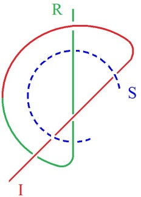
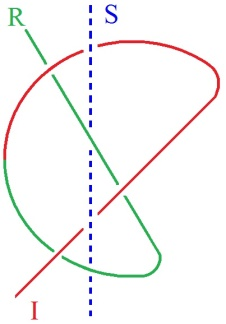
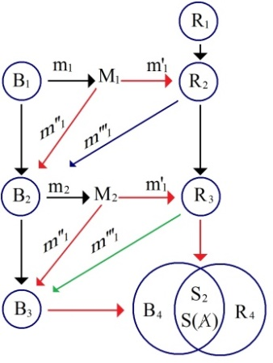
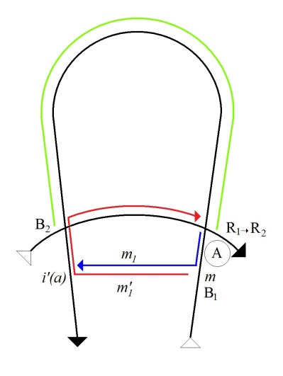
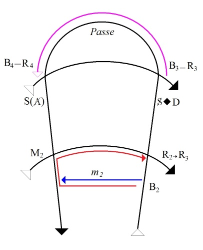
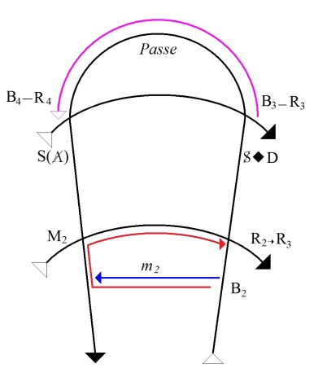
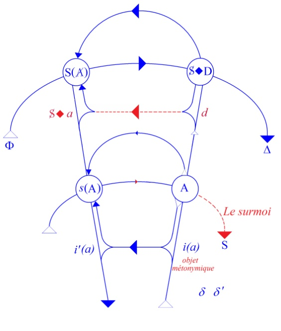
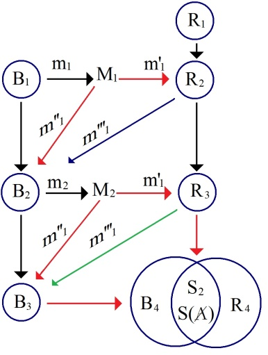
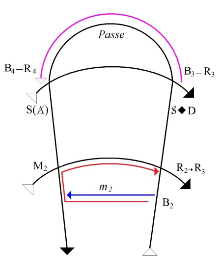

# Leçon 06 | 08 Février 1977

<!-- source-url: http://staferla.free.fr/S24/S24 L'INSU....docx -->
<!-- seminar: s24 -->
<!-- lesson: 06 -->

<!-- id: s24-06-0001 -->

[Didier-Weill](#A_Didier_Weill_08_02)

<!-- id: s24-06-0002 -->

Lacan

<!-- id: s24-06-0003 -->

Ah ! Je me casse la tête contre ce que j’appellerais, à l’occasion, un mur.

<!-- id: s24-06-0004 -->

Un mur, bien sûr de mon invention, c’est bien ce qui m’ennuie.

<!-- id: s24-06-0005 -->

On n’in­vente pas n’importe quoi.

<!-- id: s24-06-0006 -->

Et ce que j’ai inventé est fait en somme pour expliquer...

<!-- id: s24-06-0007 -->

> je dis « expliquer », je ne sais pas très bien ce que ça veut dire ...expliquer Freud.

<!-- id: s24-06-0008 -->

Ce qu’il y a de frappant, c’est que dans Freud, il n’y a pas trace de cet ennui ou plus exactement de ces ennuis, de ces ennuis que j’ai et que je vous communique sous cette forme : « je me casse la tête contre les murs. »

<!-- id: s24-06-0009 -->

Ça ne veut pas dire que Freud ne se tra­cassait pas beaucoup, mais ce qu’il en donnait au public c’était apparem­ment de l’ordre - j’ai dit « *de l’ordre* » - d’une *philosophie,* c’est-à-dire qu’il n’y avait pas... j’allais dire qu’il n’y avait pas d’os, mais justement il y avait des os, et ce qui est nécessaire pour marcher tout seul, c’est-à-dire un squelette, voilà.

<!-- id: s24-06-0010 -->

Je pense que là vous reconnaissez la figure...

<!-- id: s24-06-0011 -->

> si toutefois je l’ai bien dessinée ...la figure où j’ai, d’un seul trait, figuré l’engen­drement du *Réel*, et que ce *Réel* se prolonge en somme par l’*Imaginaire* puisque c’est bien de ça qu’il s’agit, sans qu’on sache très bien où s’arrê­tent le *Réel* et l’*Imaginaire*.

<!-- id: s24-06-0012 -->

Voilà, c’est cette figure-là, qui se transforme en cette figure-là :

<!-- id: s24-06-0013 -->

 → 

<!-- id: s24-06-0014 -->

Je ne vous le donne que parce qu’en somme c’est le premier dessin où je ne m’embrouille pas, ce qui est remarquable, parce que je m’embrouille toujours, bien sûr.

<!-- id: s24-06-0015 -->

Bon, je voudrais quand même passer la parole à quelqu’un à qui j’ai demandé de bien vouloir ici venir émettre un certain nombre de choses qui m’ont paru dignes - tout à fait dignes - d’être énoncées.

<!-- id: s24-06-0016 -->

En d’autres termes, je ne trouve pas le nommé Alain Didier-Weil mal engagé dans son affaire.

<!-- id: s24-06-0017 -->

Ce que je peux vous dire, c’est que pour moi je me suis beaucoup attaché à mettre à plat quelque chose.

<!-- id: s24-06-0018 -->

La mise à plat participe toujours du système, elle en *participe* seulement, ce qui n’est pas beau­coup dire.

<!-- id: s24-06-0019 -->

Une mise à plat, par exemple celle que je vous ai faite avec le nœud borroméen, c’est un système.

<!-- id: s24-06-0020 -->

J’essaye, bien sûr de le concasser, ce nœud borroméen, et c’est bien ce que vous voyez dans ces deux images.

<!-- id: s24-06-0021 -->

L’idéal, l’*Idéal du Moi*, en somme, ça serait d’en finir avec le *Symbolique*, autrement dit de ne rien dire.

<!-- id: s24-06-0022 -->

Quelle est cette force démo­niaque qui pousse à dire quelque chose, autrement dit à enseigner, c’est ce sur quoi j’en arrive à me dire que c’est ça, le *Surmoi*.

<!-- id: s24-06-0023 -->

C’est ce que Freud a désigné par le *Surmoi* qui, bien sûr, n’a rien à faire avec aucune condition qu’on puisse désigner du naturel.

<!-- id: s24-06-0024 -->

Sur le sujet de ce naturel, je dois quand même vous signaler quelque chose, c’est que je me suis atta­ché à lire quelque chose qui est paru à la *Société Royale de Londres* et qui est un « *Essai sur la rosée* ».

<!-- id: s24-06-0025 -->

Ça avait la grande estime d’un nommé Herschel, qui a fait quelque chose qui s’intitule *Discours préliminaire sur l’étude de la philosophie naturelle.*

<!-- id: s24-06-0026 -->

Ce qui me frappe le plus dans cet *Essai sur la rosée,* c’est que ça n’a aucun intérêt...

<!-- id: s24-06-0027 -->

> Je me le suis procuré, bien entendu, à la *Bibliothèque Nationale* où j’ai comme ça de temps en temps quelque personne qui fait un effort pour moi, une personne qui est là-bas musicologue et qui est
>
> en somme pas trop mal placée pour me procurer. Dans l’occasion, comme je n’avais aucun moyen d’avoir le texte original qu’à la rigueur j’aurais pu arriver à lire, c’est une traduc­tion que je lui ai réclamé ...il a été traduit en effet, cet *Essai sur la rosée* a été traduit...

<!-- id: s24-06-0028 -->

> de son auteur William Charles Wells ...il a été traduit par le nommé Tordeux, maître en pharmacie et il faut vraiment énormément se forcer pour y trouver le moindre intérêt.

<!-- id: s24-06-0029 -->

Ça prou­ve que *tous les phénomènes naturels ne nous intéressent pas autant*, et *la rosée* tout spécialement, ça nous glisse à la surface. C’est tout de même assez curieux que la rosée, par exemple, n’a pas l’intérêt que Descartes a réussi à donner à *l’arc-en-ciel*.

<!-- id: s24-06-0030 -->

La rosée est un phénomène aussi naturel que *l’arc-en-ciel*.

<!-- id: s24-06-0031 -->

Pourquoi est-ce que ça ne nous fait ni chaud ni froid ?

<!-- id: s24-06-0032 -->

C’est très étrange, et c’est bien certain que c’est en raison de son rapport avec le corps, que nous ne nous intéressons pas aussi vivement à *la rosée* qu’à *l’arc-en-ciel*, parce que *l’arc-en-ciel* nous avons le sentiment que *ça débouche sur* *la théorie de la lumière*, tout au moins nous avons ce sentiment depuis que Descartes l’a démontré.

<!-- id: s24-06-0033 -->

Enfin, je suis per­plexe sur ce peu d’intérêt que nous avons pour la rosée.

<!-- id: s24-06-0034 -->

Il est certain qu’il y a quelque chose de centré sur les fonctions du corps, qui est ce qui fait que nous donnons à certaines choses un sens.

<!-- id: s24-06-0035 -->

La rosée manque un peu de sens.

<!-- id: s24-06-0036 -->

Voilà tout au moins ce dont je témoigne, après une lec­ture que j’ai faite aussi attentive que je pouvais de cet *Essai sur la rosée.*

<!-- id: s24-06-0037 -->

Et maintenant je vais donner la parole à Alain Didier-Weill, en m’excu­sant de l’avoir un petit peu retardé.

<!-- id: s24-06-0038 -->

Il n’aura plus qu’une heure un quart pour vous parler, au lieu de ce que je croyais avoir pu lui garantir, c’est-­à-dire une heure et demie.

<!-- id: s24-06-0039 -->

Alain Didier-Weill va vous parler de quelque chose qui a un rapport avec le Savoir, à savoir le « *je sais* » ou le « *il sait* ». C’est ce rapport entre le « *je sais* » et le « *il sait* » sur lequel il va jouer.

<!-- id: s24-06-0040 -->

Alain Didier-Weill

<!-- id: s24-06-0041 -->

On peut dire que je vais parler de « *la Passe »* ?

<!-- id: s24-06-0042 -->

Lacan

<!-- id: s24-06-0043 -->

Vous pouvez parler de « *la Passe »* également.

<!-- id: s24-06-0044 -->

[Alain Didier-Weill](#Fev08)

<!-- id: s24-06-0045 -->

Le point d’où j’étais arrivé à proposer au Dr Lacan les élucubrations que je vais vous soumettre, me vient de ce que représente pour moi ce qu’on nomme, dans l’*École freudienne*, « *la Passe »*.

<!-- id: s24-06-0046 -->

Effectivement une rumeur circule depuis quelque temps dans l’*École*, c’est que les résultats de *la Passe* qui fonctionnerait depuis un certain nombre d’années, ne répondraient pas aux espoirs qui y avaient été mis.

<!-- id: s24-06-0047 -->

Étant donné que cette idée, comme ça, qu’il y aurait l’idée d’un échec de *la Passe*, c’est quelque chose que personnellement je supporte mal dans *la Passe,* où pour moi elle semble garantir ce qui peut préserver d’essen­tiel et de vivant pour l’avenir de la psychanalyse.

<!-- id: s24-06-0048 -->

J’ai cogité un petit peu la question, et il me semble avoir trouvé éventuellement ce qui pourrait rendre compte d’un montage topologique qui n’existe pas, et qui rendrait compte du fait que le jury d’agrément n’arrive peut-être pas à utiliser, et à utiliser ce qui lui est transmis pour faire avancer les problèmes cruciaux de la psychanalyse.

<!-- id: s24-06-0049 -->

Le circuit que je vais mettre en place devant vous, prétend métaphoriser par un long circuit, dans lequel seraient représen­tables les mouvements fondamentaux...

<!-- id: s24-06-0050 -->

> vous verrez que j’en désigne 3 très précisément ...à l’issue desquels un sujet et son Autre peuvent arriver à un point précis, très repérable...

<!-- id: s24-06-0051 -->

> que j’appellerai B4-R4 - vous verrez pourquoi ...et à partir duquel j’articulerai ce qui me semble pou­voir être,

<!-- id: s24-06-0052 -->

- et le problème de *la Passe*,

<!-- id: s24-06-0053 -->

- et celui de, peut-être, la nature du court-circuit, *de ce qui pourrait court-circuiter topologiquement ce qui se passerait au niveau du jury d’agrément.*

<!-- id: s24-06-0054 -->

Bon, je commence donc.

<!-- id: s24-06-0055 -->

<!-- id: s24-06-0056 -->

Les sujets que j’ai choisis pour vous présentifier nos deux partenaires analytiques, peuvent vous être rendus familiers en ce qu’ils correspon­draient d’une certaine façon aux 2 protagonistes les plus absentifiés de l’histoire de *« La lettre volée »* que vous connaissez, ceux-là même dont du début à la fin il n’est pas question :

<!-- id: s24-06-0057 -->

- à savoir l’émissaire, celui qui serait l’émissaire de la lettre qui est tellement exclu que Poe même, je crois, ne le nomme même pas

<!-- id: s24-06-0058 -->

- et à savoir le récepteur de la lettre qui, nous le savons : Lacan nous l’a montré, est le roi.

<!-- id: s24-06-0059 -->

Si vous le permettez, je bap­tiserai pour la commodité de mon exposé :

<!-- id: s24-06-0060 -->

- le sujet du nom de Bozef,

<!-- id: s24-06-0061 -->

- et je garderai au destinataire son nom, celui du roi.

<!-- id: s24-06-0062 -->

Tout mon montage va consister à substituer au *court-circuit*...

<!-- id: s24-06-0063 -->

> par lequel le conte de Poe tient ses deux sujets *hors du cheminement de la lettre* ...à un *long circuit* en chicane par lequel la lettre partant de la position B1 finira par aboutir à la posi­tion B4.

<!-- id: s24-06-0064 -->

Les numérotations 1 et 4 que je vous indique, vous indiquent déjà que je serai amené à distinguer 4 places qui différencieront 4 posi­tions successives du sujet et de l’Autre. Je commence donc par B1.

<!-- id: s24-06-0065 -->

<!-- id: s24-06-0066 -->

Vous voyez que

<!-- id: s24-06-0067 -->

- B, la série des B, correspond au sujet Bozef,

<!-- id: s24-06-0068 -->

- la série des R1, R2, R3 correspond à la progression des savoirs du Roi : R1, R2, R3.

<!-- id: s24-06-0069 -->

Par B1, si vous voulez, je qualifie l’état, je dirais d’*innocence* du sujet, voire de *niaiserie* du sujet, quand il se soutient uniquement de cette position subjective qui est celle : « *l’Autre ne sait pas, le roi ne sait pas*  ».

<!-- id: s24-06-0070 -->

*Ne sait pas* quoi ? Eh bien tout simplement...

<!-- id: s24-06-0071 -->

> peu importe le contenu de la lettre ...tout simplement *ne sait pas* que le sujet sait quelque chose à son endroit.

<!-- id: s24-06-0072 -->

R1 représente donc l’ignorance radicale du Roi.

<!-- id: s24-06-0073 -->

Donc on pour­rait dire que dans la position B1, ce serait *la position niaise du cogito* qui pourrait s’écrire : « *Il ne sait pas, donc je suis* ».

<!-- id: s24-06-0074 -->

L’histoire, si vous voulez, cette position vous est familière dans la mesure où nous savons que c’est une position que nous connaissons par l’analyse : l’analysant bien souvent - nous le savons - choisit son analyste en se disant inconsciemment, en se disant : « *Je le choisis celui-là, parce que lui je vais le rou­ler* » et nous savons que ce qu’il craint le plus en même temps, c’est d’y arriver.

<!-- id: s24-06-0075 -->

Alors à partir de ce montage élémentaire, je continue.

<!-- id: s24-06-0076 -->

Avant de mettre en place le graphe de Lacan, voilà comment les choses se passent.

<!-- id: s24-06-0077 -->

Je fais maintenant...

<!-- id: s24-06-0078 -->

> l’histoire commence ...je fais maintenant intervenir quelqu’un que j’appelle - vous voyez ce que j’ai nommé M - M, j’appellerai ça « *le messager* ».

<!-- id: s24-06-0079 -->

C’est-à-dire qu’en B1, un jour Bozef qui est en B1, va confier au messager dans la position de M1, le message que j’ai appelé m1, et en m1 il lui dit : « *l’Autre ne sait pas, le roi ne sait pas* ».

<!-- id: s24-06-0080 -->

Le messager est fait pour ça, c’est bien sur un traître, il transmet au roi le message ml qui se transforme en m’1, c’est-à-dire que le roi passe de la position de l’ignorance du R1, à la position R2 d’un savoir élémentai­re qui est : « *l’autre sait* - c’est-à-dire *le sujet* sait - *quelque chose à mon endroit* ».

<!-- id: s24-06-0081 -->

À partir de là, le message va revenir à Bozef, notre sujet, sous forme inversée.

<!-- id: s24-06-0082 -->

Il va revenir de deux façons disons, il va revenir parce qu’il y aura un mouvement d’aller et retour, le messager va lui dire, va venir le retrouver, si on veut, et va lui dire : « *J’ai dit au roi ce que tu m’avais dit* ».

<!-- id: s24-06-0083 -->

J’ai appelé ce message m’’1, c’est un retour sur le plan de l’axe - sur le graphe - sur l’axe *i(a)* : si vous voulez, c’est la *relation spéculaire*.

<!-- id: s24-06-0084 -->

Un autre message arrive à Bozef qui se placera, lui, sur la trajectoire de la subjectivation - que j’ai dessiné en vert - qui arriverait directement donc sur le plan, par le plan *symbolique*.

<!-- id: s24-06-0085 -->

Vous voyez donc que le point impor­tant là, est le fait que Bozef…

<!-- id: s24-06-0086 -->

> qui était dans la position d’une niaiserie, de la niaiserie en B1,
>
> du fait de l’inversion du message qui lui revient, c’est-­à-dire cette fois : *l’Autre sait* …est déplacé. Il ne peut plus rester en B1, il se retrouve en B2. Et en B2, je dirai qu’il est là dans la position du *sem­blant*, il peut encore se soutenir de la position que je dirai être celle de la duplicité puisqu’en B2 il peut encore se dire :

<!-- id: s24-06-0087 -->

> « *Oui, il sait, mais il ne sait pas que je sais qu’il sait* ».

<!-- id: s24-06-0088 -->

Alors je vais maintenant écrire, avant d’aller plus loin, le premier épisode sur le graphe de Lacan :

<!-- id: s24-06-0089 -->

 

<!-- id: s24-06-0090 -->

Là, la position de l’Autre, le message part de l’Autre.

<!-- id: s24-06-0091 -->

Là, c’est la posi­tion « *moïque* » de Bozef que j’écris B1.

<!-- id: s24-06-0092 -->

Le message part de Bozef qui confie au messager - qui serait le petit ***i’(a)** - le message* que j’ai appelé m1, c’est­-à-dire que ce circuit dit : « *il ne sait pas* ».

<!-- id: s24-06-0093 -->

Le messager fait son office, trans­met ce message par cette voie qui fait passer le roi de R1 en R2.

<!-- id: s24-06-0094 -->

L’effet à partir de là, à partir de la nouvelle position de l’Autre va porter Bozef qui était là B1...

<!-- id: s24-06-0095 -->

> ici un effet sujet élémentaire où il se produira, ce que Lacan appellerait le signifié de l’Autre ...au niveau B2, c’est-à-dire qu’on peut aussi dessiner cette flèche.

<!-- id: s24-06-0096 -->

Bozef reçoit également un message, on pourrait dire, au niveau, dans l’axe *a* → *a’* du messager.

<!-- id: s24-06-0097 -->

Vous voyez donc que notre sujet Bozef est en B2.

<!-- id: s24-06-0098 -->

Je vais maintenant introduire un autre graphe de Lacan. Je continue donc.

<!-- id: s24-06-0099 -->

J’ai laissé - vous le voyez - Bozef en B2, se soutenant de la position de duplicité que je vous ai décrite, puisqu’il est en position de maintenir l’idée de l’ignorance de l’Autre.

<!-- id: s24-06-0100 -->

Maintenant c’est là que les choses commencent à devenir vraiment intéressantes pour nous, et nettement plus compliquées.

<!-- id: s24-06-0101 -->

 

<!-- id: s24-06-0102 -->

À partir de cette position B2 de Bozef, voilà ce qui va se passer : Bozef continue le jeu de la transmission de son savoir, c’est-à-dire qu’au *messager* que je dessine en position M2, il va trans­mettre un 2ème message que j’appelle m2 et dans ce message il lui dit : « *Oui, il sait, mais il ne sait pas que je sais.* »

<!-- id: s24-06-0103 -->

Le messager en M2 fait le même travail, retransmet ce message au roi, le roi passe donc à un nou­veau savoir, passe de R2 en R3, le savoir du roi à ce point-là est : « *Il sait que je sais qu’il sait que je sais* ».

<!-- id: s24-06-0104 -->

Mais ça, Bozef ne le sait pas encore, il ne le saura que quand le messager fait une dernière navette, revient vers Bozef et lui confie : « *J’ai dit au roi que tu sais qu’il sait que tu sais qu’il sait* », c’est-à-dire qu’en ce point Bozef que nous avions laissé en B2 est propulsé à une nouvelle position que j’appelle B3, à partir de laquelle nous allons interroger le graphe de Lacan - le deuxième - d’une façon toute particulière et à partir de laquelle nous allons commencer à pou­voir introduire ce qu’il en est de *la Passe*.

<!-- id: s24-06-0105 -->

Je vais donc terminer le schéma avant de continuer.

<!-- id: s24-06-0106 -->

Voici M2, m’1, m"1. Bozef que j’avais laissé en B2 ici, je le remets ici en B2 c’est-à­-dire qu’ici il transmet à M2, il lui transmet m2, il lui dit : « *Il sait, mais il ne sait pas que je sais qu’il sait* ».

<!-- id: s24-06-0107 -->

Comme tout à l’heure ce message par­vient à l’Autre également comme ceci :

<!-- id: s24-06-0108 -->

→ 

<!-- id: s24-06-0109 -->

et le retour de ce message à Bozef le met dans cette position très particulière d’être confronté à un Autre auquel il ne peut plus rien cacher : Le Roi.

<!-- id: s24-06-0110 -->

Bon, j’espère que vous me suivez, quoi que ce soit un peu en chicane.

<!-- id: s24-06-0111 -->

Qu’est-ce qui se passe donc quand le roi est en R3, quand il est dans la position du savoir que je vous ai indiqué, et que ce savoir est connu par le retour du messager à Bozef, c’est-à-dire que Bozef peut penser :

<!-- id: s24-06-0112 -->

> « *Le roi sait que je sais qu’il sait que je sais* ».

<!-- id: s24-06-0113 -->

Ce qui va se produire à ce moment-là, et ce qui va nous introduire à la suite, c’est que :

<!-- id: s24-06-0114 -->

- alors qu’en B2 Bozef, dans le semblant, pouvait encore prétendre à un petit peu d’être en se disant :

<!-- id: s24-06-0115 -->

« *Il sait, mais il ne sait pas et je peux quand même en être encore* »,

<!-- id: s24-06-0116 -->

- en B3, du fait du savoir, qu’on pourrait dire entre guillemets « *absolu* » de l’Autre, la position du *cogito* de Bozef serait d’être complètement *dépossédé* de sa pensée.

<!-- id: s24-06-0117 -->

À ce niveau-là, si l’Autre sait tout, c’est pas que l’Autre sait tout, c’est qu’il ne pourrait plus rien cacher à l’Autre, mais le problème c’est cacher quoi ? Parce que, ce qui se révèle à l’Autre à ce moment-là, c’est pas tellement le mensonge dans lequel le tenait Bozef, c’est qu’émerge pour Bozef à ce moment-­là le fait que son mensonge lui révèle qu’en fait, derrière ce mensonge, était caché un mensonge d’une tout autre nature et d’une toute autre dimension.

<!-- id: s24-06-0118 -->

Si le roi est dans une position - dans cette position R3 - où il saurait tout, dans ce tout c’est l’incognito le plus radical de Bozef qui disparaît, la position dans laquelle il se trouve et ce que je vais vous démontrer, correspond à ce que Lacan nomme la position d’*éclipse du sujet*, de *fading* devant le signifiant de la demande, ce qui s’écrit sur le graphe...

<!-- id: s24-06-0119 -->

> cela désigne aussi *la pulsion*, mais je ne vais pas parler de ça maintenant

<!-- id: s24-06-0120 -->

...S barré poinçon de la demande : **S ◊ D**.

<!-- id: s24-06-0121 -->

Il faut avant que je continue, je voudrais que vous sentiez bien que, puisqu’en R3 plus rien ne peut être caché, alors s’ouvre pour le sujet B3 la dernière cachette, c’est-à-dire celle qu’il ne savait pas cachée.

<!-- id: s24-06-0122 -->

Et ce qu’il découvre, c’est qu’en cachant volontairement, en ayant un men­songe qu’il pouvait désigner, *il éludait en fait un mensonge dont il ne savait rien, qui l’habitait et qui le constituait comme sujet*.

<!-- id: s24-06-0123 -->

Donc, ce savoir dont il ne savait rien va surgir en R3 au regard de l’Autre qui désormais sait tout.

<!-- id: s24-06-0124 -->

Quand je dis « surgir au regard de l’Autre », c’est véritablement au sens propre qu’il faut entendre cette expression, car ce qui surgit par le regard de cet Autre, c’est précisément ce qui avait été soustrait *lors de la création originaire du sujet*, ce qui avait été soustrait du sujet, le signifiant **S2**, et qui l’avait constitué comme tel, comme sujet supportant la parole, comme sujet accédant à la parole dans la demande, du fait de la soustraction de ce signifiant **S2**.

<!-- id: s24-06-0125 -->

Or, que se passe-t-il ?

<!-- id: s24-06-0126 -->

Voici que ce signifiant **S2** réapparaît dans le *Réel*, car c’est ça qu’il faut dire.

<!-- id: s24-06-0127 -->

Effectivement le problème du *refoulement originaire*, on ne peut pas dire que le retour du *refoulé originaire* se produit au sein du *Symbolique* comme le ferait le *refoulement secondaire*, puisqu’il en est lui-même l’auteur.

<!-- id: s24-06-0128 -->

S’il revient, ça ne saurait être que dans le *Réel* et c’est en tant que tel qu’il se manifeste, je dirais par un regard, un regard du *Réel*, devant lequel le sujet est absolument sans recours.

<!-- id: s24-06-0129 -->

Je ne vais pas épiloguer là-dessus, mais si vous y réfléchissez, vous ver­rez que la position de savoir impliquée par R3, par l’Autre en R3, pour­rait correspondre à ce qui se passe, si vous voulez, dans ce que serait le *Jugement Dernier*, dans ce point où le sujet ne serait pas tant accusé fina­lement de mentir dans le présent,

<!-- id: s24-06-0130 -->

- puisque justement au point B3-R3 il ne ment plus,

<!-- id: s24-06-0131 -->

- puisqu’il est révélé dans son *non-être*, mais par l’après-coup ce qui lui est révélé, c’est qu’à l’imparfait il ne cessait de mentir, alors même qu’il disait un mot.

<!-- id: s24-06-0132 -->

Cette position pourrait aussi vous indiquer, le Savoir en R3 peut aussi ouvrir des perspectives, si vous voulez réfléchir, sur ce que serait le savoir raciste ou ségrégationniste, mais ça serait une position de savoir dont jouirait le sujet, d’*être*, d’*incarner* ce **S2** dans le *Réel*.

<!-- id: s24-06-0133 -->

Vous voyez, c’est des pistes que je lance là, puisque c’est pas notre sujet et j’y reviens pas.

<!-- id: s24-06-0134 -->

Il faudrait également articuler le retour de ce **S2** dans le *Réel* avec ce qu’il en est du délire, *articuler sérieusement* *l’apha­nisis avec la position délirante* dans la mesure où dans les deux cas le signifiant revient dans le *Réel*, mais cependant on pourrait dire que dans le cas du *non-psychotique* qui perd la parole comme le *psychotique*, néanmoins on pourrait comparer sa position à celle de *ces peuples enva­his* par l’étranger *qui font la politique de la terre brûlée*, qui brûlent tout, pour maintenir quelque chose, c’est-à-dire que pour que l’envahissement ne soit pas total.

<!-- id: s24-06-0135 -->

Et ce qui est maintenu effective­ment, c’est ce qui reste une fois que le sujet disparaît.

<!-- id: s24-06-0136 -->

Parce que, si vous y réfléchissez, ce qui se passe en R3, c’est que le signifiant de l’*Urverdrängung* revenant dans le *Réel*, ce n’est rien de moins que le *refoulement* *originaire,* le sujet de l’inconscient, qui disparaît : si vous voulez, la barre de l’inconscient, cette barre qui sépare *(a)* et **S2**, se barrant fait apparaître le **S2** *dans le Réel* et le *(a) dans le Réel*, et c’est ça qui reste, et que ça, c’est une position de désubjectivation totale.

<!-- id: s24-06-0137 -->

J’en arrive maintenant au point le plus énigmatique de l’affaire, c’est que de cette position où *le sujet se trouve sidéré sous le regard du* **S2** *dans le Réel*, position sidérée, sans parole devant ce regard monstrueux.

<!-- id: s24-06-0138 -->

Le mot « *monstrueux* » ne vient pas là par hasard, puisqu’il s’agit du fait que se montre - que se « monstre » - ce qui précisément est l’incognito le plus radical, et que si ce **S2** se montre, ce qui soutient la parole elle-même, c’est-à-dire son effacement, ne peut plus advenir, et si un monstre est monstrueux, ça n’est pas d’autre chose que de couper la parole.

<!-- id: s24-06-0139 -->

Le point d’énigme où nous arrivons, c’est d’essayer d’interpréter en quoi Bozef étant en B3, si nous posons qu’il ne va pas y rester toute sa vie, dans l’éternité comme le sujet médusé, figé en pierre sous le regard de la Méduse, qu’est-ce qui va faire que le sujet en B3 va pouvoir en sor­tir, et comment va-t-il en sortir ?

<!-- id: s24-06-0140 -->

Alors le premier pas que je pose, c’est que vous voyez qu’à ce moment-là, il n’a plus le support du messager.

<!-- id: s24-06-0141 -->

Le messager a été au bout de sa course, et au bout du recours de Bozef, et pour la première fois Bozef est confronté directement à l’Autre, et il ne peut pas faire, cet Autre...

<!-- id: s24-06-0142 -->

> c’est-à-dire celui à qui la lettre était véritablement destinée
>
> et dont il éludait la rencontre le plus possible, à ce moment-là il est face à cet Autre ...et il ne peut pas faire autre chose que de *dire une parole* en reconnaissant cet Autre, *une parole et une seule*.

<!-- id: s24-06-0143 -->

L’important, c’est de voir le lien qu’il y a entre

<!-- id: s24-06-0144 -->

- le fait qu’il ne peut dire qu’une parole,

<!-- id: s24-06-0145 -->

- avec le fait qu’au moment où il renonce au messager, c’est-à-dire le moment où ils ne se mettent pas à deux pour transmettre à l’Autre le message, c’est également donc le moment où l’Autre va recevoir un message qui ne viendra pas de deux, ce ne sera plus la duplicité, on pourra dire que la position de la duplicité à ce moment-là, intériorisée par Bozef, le méta­morphose en le divisant, c’est ça la division et le prix de « *une parole* ».

<!-- id: s24-06-0146 -->

Vous voyez là d’ailleurs en ceci que la duplicité est sans doute la meilleure défense contre la division.

<!-- id: s24-06-0147 -->

Le fait qu’il y ait un lien entre *une seule parole* possible, Bozef va être confronté au Roi en R3, il a *une seule parole* possible sur laquelle je reviendrai tout à l’heure, quelle est la seule chose qu’il peut lui dire ?

<!-- id: s24-06-0148 -->

Il lui dira : « *C’est toi*. »

<!-- id: s24-06-0149 -->

Un « *c’est toi* » qui se prolonge d’ailleurs, j’y reviendrai tout à l’heure - en un « c’est nous ».

<!-- id: s24-06-0150 -->

Et cette seule parole qu’il peut lui dire, il lui dit en même temps : « *Il n’y en a qu’un à qui je peux la dire* », et c’est déjà de la topologie de voir que « *une parole* » ne peut se rendre qu’à un lieu, et la langue elle-même vous démontre qu’elle connaît cette topologie, puisqu’elle vous dit que quelqu’un qui « *est de parole* » n’en a qu’une et ne peut en avoir qu’une.

<!-- id: s24-06-0151 -->

Quelqu’un qui *n’est pas de parole*, qui *n’a pas de parole*, justement il en a plus d’une ou il n’en a pas qu’une, et en même temps il y a la notion dans la langue de la destina­tion, puisque pour donner sa paro­le, ça n’est concevable que si on peut la tenir, c’est-à-dire en fait : en être tenu.

<!-- id: s24-06-0152 -->

Le point donc auquel j’arrive, c’est que le message délivré c’est le « *c’est toi* », et je vais vous l’écrire d’une façon, je vais écrire une lettre qui va aller de B3 à R3, B3 et R3 vont se rencontrer au niveau de ce message que j’expliciterai maintenant plus avant, comme étant cet énigmatique S de A barré : **S(A)**.

<!-- id: s24-06-0153 -->

Je vais vous en donner une première écriture.

<!-- id: s24-06-0154 -->

 

<!-- id: s24-06-0155 -->

Ce que j’ai dessiné sur le schéma de gauche, c’est que, quand Bozef mis au pied du mur cette fois, ne peut dire qu’une parole au roi, du fait même qu’il adresse cette parole au roi, le roi une dernière fois est dépla­cé, émigre du lieu où il était, c’est-à-dire du *Réel*, émigre de nou­veau dans le lieu *symbolique* et se trouve en position R4.

<!-- id: s24-06-0156 -->

Bozef disant « *C’est toi* » est en position B4, le **S(A)** je l’écris de la ren­contre, de la communion entre B4 et R4, tous deux mettant à ce moment-là en commun leur barre et c’est pour ça que j’ai écrit dans la lunule **S2** et **S(A)**, j’espère pouvoir expliciter ça plus rigoureusement dans ce qui va suivre.

<!-- id: s24-06-0157 -->

Le point d’énigme sur lequel je voudrais vous retenir, c’est que, dans le message délivré en **S(A)**, dans le « *C’est toi* », c’est que le sujet qui tient sa parole - on l’a vu - est là en position beaucoup plus que de la tenir, mais de la soutenir, ce qui est tout à fait autre chose.

<!-- id: s24-06-0158 -->

Qu’est-ce que ça veut dire que de soutenir une parole ?

<!-- id: s24-06-0159 -->

C’est beaucoup plus facile d’abord de dire ce que ça n’est pas, par exemple quelqu’un qui vous dit : « *je pense que, quand Lacan dit que l’inconscient est structuré comme un langage, je pense qu’il a raison, je suis d’accord avec lui* », même si le sujet peut s’assurer de sa pensée de *toute bonne foi* en pensant penser que *l’inconscient est structuré comme un langage*, je vous demande : qu’est-ce que ça prouve ? Rien du tout !

<!-- id: s24-06-0160 -->

Autrement dit : est-ce que c’est parce qu’un sujet pense penser quelque chose qu’il le pense réellement, c’est-à-dire est-ce que parce qu’il pense le penser, que *l’énonciation...*

<!-- id: s24-06-0161 -->

> *le sujet de l’inconscient* qui est en lui ...répond de ce qu’il dit.

<!-- id: s24-06-0162 -->

Autrement dit : est-il responsable de ce qu’il dit ?

<!-- id: s24-06-0163 -->

C’est ça « *soutenir sa parole* », entre autres. C’est un premier abord.

<!-- id: s24-06-0164 -->

Ceci dit, que notre énonciation réponde, soutienne notre énoncé, j’allais dire « *Dieu soit loué* » il n’y en a pas de preuves.

<!-- id: s24-06-0165 -->

Il n’y a pas de preuves mais ce qu’il y a *éventuellement* c’est une épreuve et c’est comme ça qu’on peut comprendre *la Passe* : *la Passe* comme un montage topologique qui permettrait de rendre compte si effectivement quand un sujet énonce quelque chose, il est capable de témoigner, c’est-à-dire de transmettre l’articulation de son énonciation à son énoncé. Autrement dit, il ne s’agit pas de *dire*, mais de montrer en quoi il est possible de ne pas se dédire.

<!-- id: s24-06-0166 -->

La question donc où je vais aller plus avant, c’est que si ce **S(A)** à laquelle accède Bozef en R4, s’il y accède selon ce que je montre, c’est que c’est d’un certain lieu...

<!-- id: s24-06-0167 -->

> peu importe le mot qu’il emploie, il est banal : « *c’est toi* », c’est du baratin, c’est rien du tout ...*le poids de vérité de ce message, c’est que c’est un lieu*.

<!-- id: s24-06-0168 -->

La question que je vais poser maintenant et développer, c’est : « est-ce que ce *lieu* d’où parle le sujet est transmissible ? »

<!-- id: s24-06-0169 -->

Peut-il arriver - par exemple dans le cas de « *la Passe » -* peut-il arriver au jury d’agrément ? Bon.

<!-- id: s24-06-0170 -->

L’énigme du moment où un sujet est capable, plus que de tenir sa parole, de la soutenir, c’est-à-dire d’être dans un point où il accède à quelque chose qu’il faut bien reconnaître de l’ordre d’une certitude, et d’un certain désir, essayons d’en rendre compte, c’est pas facile.

<!-- id: s24-06-0171 -->

C’est pas facile parce qu’en **S(A)** *l’objet du désir* ou *l’objet de la certitude*, c’est quelque chose dont on ne peut rien dire.

<!-- id: s24-06-0172 -->

Mais, remarquez déjà...

<!-- id: s24-06-0173 -->

> enfin pour mieux cerner ce que je veux dire ...c’est que d’une façon générale les gens qui dans la vie vous inspi­rent confiance, comme on dit, c’est des gens que précisément vous sen­tez désirants, mais d’un désir qui à eux-mêmes reste, je dirais, *énigmatique*, *voilé*, et vous sentez que l’objet de leur désir leur est à eux-mêmes énigmatique.

<!-- id: s24-06-0174 -->

Et tout au contraire, ceux qui vous inspireront je dirais un juge­ment éthique éventuellement de méfiance, qui vous feront dire : « *c’est un hypocrite* », « *c’est un faux-jeton* » ou « *c’est un ambitieux* », enfin des termes de ce genre, c’est précisément des gens dont vous sentez que l’objet du désir ne leur est pas à eux-mêmes inconnu, qu’ils peuvent le désigner très précisément, je dirais même *que ce qui vous inquiète peut-être en eux,* *c’est que la voix du fantasme est chez eux si forte qu’il n’y aurait comme pas d’espoir pour la voix du* **S(A)**.

<!-- id: s24-06-0175 -->

Puisque je parle de confiance, vous voyez bien que ça pose le problème des conditions par lesquelles un analyste a à être digne de confiance. En quoi l’est-il ?

<!-- id: s24-06-0176 -->

Sommairement, je dirais précisément que son *désir* ne doit pas être placé comme celui que je viens de décrire, mais que son *désir* ne doit pas avoir pour voix de colmater la barre en faisant émerger l’objet, mais que son *désir* est de la maintenir cette barre, et de la porter à incandescence comme ce qui se passe au point B4-R4 où la barre est portée à ce point d’extrême incandescence, je dirais sommaire­ment.

<!-- id: s24-06-0177 -->

Tout ceci ne nous rend pas compte encore pourquoi en **S(A)**, alors que le sujet n’a pas de garanties, qu’est-ce qui fait qu’il accède au fait de pouvoir soutenir ce qu’il dit ?

<!-- id: s24-06-0178 -->

Et comment il faut rendre compte du fait que s’il y arrive, c’est par le chemin en B3-R3, - vous vous rap­pelez – quand l’Autre est en position de *Savoir absolu*, le sujet peut arriver en **S(A)** après avoir fait l’*expérience* de la dépossession de sa pensée, *dépossession totale de sa pensée*.

<!-- id: s24-06-0179 -->

Supposons, pour aller un peu plus loin, un analyste qui ne soit pas passé par cette *dépossession de la pensée* et qui entretiendrait avec la *théorie psychanalytique* des rapports de possédant, des rapports de possédant comparables à ceux de l’Avare et de sa cassette.

<!-- id: s24-06-0180 -->

Un tel analyste, dans son rapport à la théorie, naturellement ne peut voir que le gain de l’opération.

<!-- id: s24-06-0181 -->

Le gain de l’opération est évident, la chose est à portée de la main et par définition ce qu’il ne voit pas, c’est *ce qu’il perd* dans l’opération.

<!-- id: s24-06-0182 -->

Qu’est-ce qu’il perd ?

<!-- id: s24-06-0183 -->

Précisément ce qu’il perd, c’est la dimension de la topologie qu’il y a en lui, c’est-à-dire *la dimension du lieu de l’énonciation*, c’est-à-dire *la dimension de la pré­sence* qui en lui peut répondre « *présente* ! », répondre de ce qu’il énonce.

<!-- id: s24-06-0184 -->

Ce que je dirais alors c’est que dans cette position, est-ce que le sujet, l’ana­lyste en question, n’est pas en position qui correspond psychanalytique­ment au démenti, c’est-à-dire est-ce qu’il est possible

<!-- id: s24-06-0185 -->

- d’un côté de dire oui au savoir,

<!-- id: s24-06-0186 -->

- et de l’autre de dire non au lieu d’où ce savoir est émis.

<!-- id: s24-06-0187 -->

Si ce clivage a été opéré, on peut penser que la vérité qui est dans le sujet ayant opéré ce clivage, d’être restée en dehors du circuit de la parole, court-circuité du circuit de la parole, va comme lui rappeler une nostalgie absolument douloureuse qu’il ne faudra jamais réveiller.

<!-- id: s24-06-0188 -->

Et c’est pourquoi je dirais, si un « *parl’être* » se met à la ramener à ce moment-là et à faire entendre un autre son de cloche - Lacan par exemple - comme aux temps héroïques, l’analyste en question...

<!-- id: s24-06-0189 -->

> pensons à l’I.P.A. ou même - sans aller si loin - à ce qui se passait chez nous ...ne peut litté­ralement pas supporter, pour l’écho que cela renvoie en lui.

<!-- id: s24-06-0190 -->

Ce clivage dont je vous parle, qu’il est tentant d’opérer, puisqu’il évite la division, il implique en effet pour l’analyste, si lui est clivé, ça implique que son Autre aussi est clivé, et son Autre est clivé entre

<!-- id: s24-06-0191 -->

- un Autre qui ne mentirait jamais,

<!-- id: s24-06-0192 -->

- et un Autre qui mentirait toujours : *le Malin*, celui qui trompe, et dont pour se défier il suffit, *pour ne pas errer*, il suffit *de n’être pas dupe*.

<!-- id: s24-06-0193 -->

Vous savez bien que *Les non-dupes errent*, et vous voyez que c’est de la renonciation à cette duplicité de l’Autre que le sujet est nécessairement en position de passant, c’est-à-dire d’hérétique. Et je vous ferai remarquer que Lacan, plus d’une fois, s’est dési­gné nommément comme *hérétique*, et nommément comme *passant*.

<!-- id: s24-06-0194 -->

Mon hypothèse transitoire, c’est de dire que dans la flèche rouge qui amène à B4-R4, qui font communier S2 et S(A), flèche que j’ai écrite en haut en violet, qui fait passer du *fading* S ◊ D, à S(A) c’est là, *la Passe*, le mouvement par lequel quelque chose de *la Passe* peut être dit.

<!-- id: s24-06-0195 -->

 

<!-- id: s24-06-0196 -->

Maintenant approfondissons encore, si vous voulez, le caractère « *scan­daleux »* - c’est le mot – du message transmis en S(A), message de l’hérétique. Je vous l’ai dit d’abord :

<!-- id: s24-06-0197 -->

- *il n’y a plus ces deux divinités*,

<!-- id: s24-06-0198 -->

- il n’y a donc plus la garantie de la cassette,

<!-- id: s24-06-0199 -->

- le sujet parle avec *en lui* un répon­dant de ce qu’il dit.

<!-- id: s24-06-0200 -->

C’est très intéressant, quand nous lisons - je fais une parenthèse rapide – « *Le manuel des Inquisiteurs »*...

<!-- id: s24-06-0201 -->

> et ils sont intéressants parce qu’ils correspondent à la lettre
>
> à ce qui s’est passé dans un passé récent *pour nous* ...c’est que l’Inquisiteur repère parfaitement bien de quoi il est question dans ce S(A), il le repère dans sa façon de définir *l’hérétique* : *l’hérétique* n’est pas celui qui erre, qui est dans l’er­reur, « *errare humanum est »,* c’est celui qui persévère :

<!-- id: s24-06-0202 -->

- c’est-à-dire celui qui est relaps,

<!-- id: s24-06-0203 -->

- c’est-à-dire celui qui répète,

<!-- id: s24-06-0204 -->

- c’est-à-dire celui qui dit  « je dis et je répète »,

<!-- id: s24-06-0205 -->

- c’est-à-dire celui qui pose un « je » dont un autre « je » diabolique - « *errare diabolicum » -* répond, et effectivement ce « je » de l’énonciation, il est diabolique parce que comme le diable, il est diaboliquement insaisissable : le diable ne ment pas toujours : s’il mentait toujours ça reviendrait au fait de dire la vérité.

<!-- id: s24-06-0206 -->

L’Inquisiteur repère bien de quoi il s’agit, c’est-à-dire d’une articulation entre les deux « je », au niveau de ce S(A).

<!-- id: s24-06-0207 -->

Et c’est pourquoi, quoi qu’il dise, il ne demande pas à l’hérétique son aveu, mais son désaveu.

<!-- id: s24-06-0208 -->

Vous sentez la nuance qu’il y a entre les deux, puisque je vous ai parlé tout à l’heure de désaveu au sein même de l’Inquisiteur dans ce clivage des deux Autres.

<!-- id: s24-06-0209 -->

Ce désaveu d’ailleurs...

<!-- id: s24-06-0210 -->

> remarquez que je ne jette la pierre à personne ...ce désaveu nous guette à tous les instants.

<!-- id: s24-06-0211 -->

Il est pas tellement rare de voir par exemple un analyste en contrôle qui, à un moment donné de son parcours, préfère s’allonger sur le divan plu­tôt que de continuer le contrôle, et ce que l’on voit souvent c’est que, s’il préfère s’allonger, c’est comme si allongé...

<!-- id: s24-06-0212 -->

> la règle étant de pouvoir dire n’importe quoi ...comme si à ce moment-là, il était dégagé du fait qu’il avait à répondre de ce qu’il dit, qu’il pouvait parler sans responsabilité.

<!-- id: s24-06-0213 -->

Cet analysant peut croire ça un certain temps jusqu’au jour où il découvre - allongé - que de ces signifiants dont il pensait ne pas avoir à répondre - au sens de la responsabilité - il a à en répondre, et ce jour là peut-être, l’analysant, pour lui se profile la passe parce que à ce moment là, on pourrait dire qu’il n’est plus le *disciple* seulement de Lacan ou de Freud, mais qu’il devient le *disciple de son symptôme*, c’est-à-dire qu’il s’en laisse enseigner, et que si par exemple l’analysant en question était Bozef, si compliqué que soit le trajet de Bozef, il ne pour­rait que découvrir qu’en écrivant ce tracé, que ce tracé d’une certaine façon avait été dessiné déjà, avant même peut-être qu’il ne sache lire, sur les graphes d’un certain Dr Lacan.

<!-- id: s24-06-0214 -->

On peut dire à ce moment-là que l’analysant n’a plus à se faire le porte-parole du maître, car il n’a plus à en être, il n’a plus à être, je dirais porté par le savoir du maître, puisqu’il s’en fait le portant, et c’est ce qu’il délivre en **S(A)**.

<!-- id: s24-06-0215 -->

Je tourne en ronds pour me rapprocher petit à petit, de plus en plus près, du vif de ce **S(A)**.

<!-- id: s24-06-0216 -->

C’est-à-dire, au point où nous en sommes, je pourrais dire que Bozef, ça serait à l’issue de ce parcours qu’il serait responsable des graphes qu’il écrit, et seulement à ce moment-là.

<!-- id: s24-06-0217 -->

Maintenant le problème est de rendre compte effectivement de la nature de cette certitude et de cette *jouissance de l’Autre* dont nous parle Lacan. Je suis obligé d’aller vite parce que le temps passe effectivement.

<!-- id: s24-06-0218 -->

En **S(A)**, il se passe un phénomène contradictoire, qui est celui d’une « *communion* »...

<!-- id: s24-06-0219 -->

> le mot est de Lacan dans « *Les Formations de l’inconscient »* [^6], vous le trouverez ...qui est celui d’une « *communion* » coïncidant avec une séparation entre le sujet et l’Autre.

<!-- id: s24-06-0220 -->

Le paradoxe c’est de com­prendre pourquoi c’est au moment de la dissolution du transfert, qu’une certitude puisse naître pour le sujet, et peut-être uniquement à ce moment-là.

<!-- id: s24-06-0221 -->

Pour ça, je suis obligé de faire un rapide retour en arrière, qui est celui du point où nous étions en B3-R3 : point de désêtre.

<!-- id: s24-06-0222 -->

En ce point là, je dirais...

<!-- id: s24-06-0223 -->

> je suis obligé parce que pour comprendre ce que c’est que la nature de l’émergence du sujet à l’état pur ...en B3-R3, rapidement, le sujet était dans une position où *le refoulement origi­naire* aurait disparu, fixé par le regard du *Réel*.

<!-- id: s24-06-0224 -->

Qu’est-ce qui va per­mettre au sujet de se défixer...

<!-- id: s24-06-0225 -->

> rappelez-vous d’ailleurs, qu’au sujet de la fixation Freud l’articule au refoulement originaire ...qu’est-ce qui va permettre au sujet de se défixer, qu’est-ce qui va permettre à l’Autre qui est dans le *Réel* de réintégrer son *site symbolique* ? C’est là d’ailleurs que l’art de l’analyste devra savoir se faire entendre.

<!-- id: s24-06-0226 -->

Un exemple : un analysant dans cette position, où pour lui le savoir de l’Autre se balade comme ça dans le *Réel*, presse son analyste...

<!-- id: s24-06-0227 -->

> pour voir de quelle façon l’analyste va se manifester, d’où il parle ...lui téléphone un jour pour presser un ren­dez-vous pour voir la réaction.

<!-- id: s24-06-0228 -->

L’analyste répond : « *S’il le fallait, nous nous verrions* ». Le message - le signifié - n’a rien de très original, pourtant ce message fait effet d’interprétation radicale pour l’analysant, l’effet étant d’arriver à revéhiculer l’Autre dans son *lieu symbolique*, tout sim­plement à cause de l’articulation syntaxique, qui a fait que l’analyste en trouvant la formule

<!-- id: s24-06-0229 -->

« *S’il le fallait* », par l’introduction du « *il* », s’assujet­tissant comme l’analysant à la *dominance*, à la prédominance du *signi­fiant*.

<!-- id: s24-06-0230 -->

Dans le point B3-R3 où le sujet est sans recours...

<!-- id: s24-06-0231 -->

il est « *sans recours* » : pour comprendre la notion de « *sans recours* », évoquez ce que sont les terreurs nocturnes de l’enfant. Pourquoi effectivement dans le noir l’enfant est-il dans cette position ?

<!-- id: s24-06-0232 -->

Je dirais que *dans le noir*, ce qui se passe pour l’enfant, c’est qu’il n’a *pas un coin où aller* d’où il ne soit *sous le regard de l’Autre*, car dans le noir il n’y a pas de recoin.

<!-- id: s24-06-0233 -->

Et c’est en réponse au fait que sous le regard du *Réel*, il n’y a pas, pour le sujet, en B3-R3, de recours au moindre coin, que le secours appelé par le signifiant du *Nom du Père* va être de créer un recoin, c’est-à-dire un recoin qui va le soustraire à l’Autre, mais qui va le soustraire également à lui-même en le constituant comme *ne sachant pas*, puisque c’est justement ce coin de lui-même, le coin dans ce qu’il a de plus *lui-même*, de plus *symbolique de lui-même,* qui va être évaporé.

<!-- id: s24-06-0234 -->

Je dirais qu’à ce moment-là...

<!-- id: s24-06-0235 -->

> les Écritures nous disent : « *Que la lumière soit* », « *Fiat lux* » ...ce dont il s’agit à ce moment-là c’est « *Fiat trou* », c’est une expression de Lacan.

<!-- id: s24-06-0236 -->

Et c’est peut-être ce qui s’est passé dans la formule syntaxique que j’évoquais tout à l’heure.

<!-- id: s24-06-0237 -->

Ceci dit, qu’est-ce qui fait que le sujet...

<!-- id: s24-06-0238 -->

> je tourne tout le temps autour de ça, vous voyez  
> ...qui a perdu la parole, va la retrouver et va pouvoir dire ce « *c’est toi* » ?

<!-- id: s24-06-0239 -->

Eh bien, je dirais que *du fait de l’opération de l’intervention du signifiant du Nom du Père*...

<!-- id: s24-06-0240 -->

> qui a recréé le *refoulement originaire*,
>
> qui a fait disparaître le **S2**,
>
> et remis l’*objet(a)* à sa place ...*du fait de l’opération de ce signifiant du Nom du Père*, le Sujet accède à un autre point de vue, à un point de vue où il ne fait pas l’équivalence entre le savoir de l’Autre et la clé qui - en lui - manque.

<!-- id: s24-06-0241 -->

Il découvre que ce n’est pas parce que l’Autre reconnaît qu’il manque, qu’il n’y a pas en lui la clé, qu’il manque de la clé essentielle de son être, ce n’est pas parce que l’Autre la reconnaît, qu’il la connaît.

<!-- id: s24-06-0242 -->

Je dirais même que quand il découvre que l’Autre peut *reconnaître l’exis­tence de cette clé, tout en ne la connaissant pas*, c’est-à-dire en ne pou­vant pas la lui restituer, si dans un premier temps il peut tomber dans la désespérance, en vérité c’est à *l’espoir* que ça peut l’introduire, parce que si l’Autre est en position de reconnaître ce qu’il ne connaît pas, ça introduit la dimension du fait que l’Autre lui-même a perdu cette même clé, qu’il sait bien de quel manque il s’agit, et *l’espoir qui s’ouvre alors c’est de présentifier l’absence de cette chose perdue*, l’ininscriptible, et *l’es­poir c’est précisément que l’ininscriptible puisse cesser de ne pas s’écri­re*.

<!-- id: s24-06-0243 -->

*Et c’est ce qui se délivre en* **S(A)**.

<!-- id: s24-06-0244 -->

Le paradoxe invraisemblable sur lequel on débouche, c’est comment un signifiant - ce signifiant du **S(A)** – peut-il assumer *cette impensable contradiction, d’être à la fois ce qui maintient ouverte la béance du « ce qui ne cesse pas de s’écrire* »...

<!-- id: s24-06-0245 -->

> quand vous lisez, quand vous entendez une musique qui *vous bouleverse* ou un poème qui *vous bouleverse*, le mot qui fait mouche en vous, on peut dire que c’est qu’il rouvre au maximum cette dimension
>
> du *refoulement originaire* ...com­ment donc ce signifiant peut-il assumer cette contradiction de maintenir cette *béance* et en même temps d’être « *ce qui cesse de ne pas s’écrire* », par exemple une note très banale de la gamme diachronique, un « *la* » tout bête ?

<!-- id: s24-06-0246 -->

Vous voyez que cette gageure pourtant, c’est ce qui est réalisé dans notre 3ème temps du **S(A)**, dont on pourrait dire que la produc­tion de ce **S(A)**, est le résultat d’une ultime dialectique entre le sujet et l’Autre, par laquelle l’un et l’autre, en s’y mettant à deux, si j’ose dire, *ressuscitent littéralement en un mouvement de rencontre*...

<!-- id: s24-06-0247 -->

> par lequel Lacan n’a pas hésité à employer *le mot de « communion » dans la production du mot d’esprit* ...cette barre même, cette barre même dont le paradoxe est d’associer et de dissocier dans le même temps.

<!-- id: s24-06-0248 -->

De cette *rencontre* du sujet et de l’Autre, quelques précisions, trois précisions :

<!-- id: s24-06-0249 -->

- d’abord il s’agit d’une communion, il ne s’agit pas d’une collaboration. Nous savons ce dont le sujet est capable quand il se fait collaborateur.

<!-- id: s24-06-0250 -->

- Autre point : ce mode de communion qui se produit en S(A) est un mode dans lequel, à ce moment-là, le sujet ne reçoit pas *son message sous forme inversée*, puisqu’il serait le seul temps invraisemblable, *hors du temps*, véritablement *hors du temps*, où le sujet et l’Autre communieraient dans *le même savoir au même temps*.

<!-- id: s24-06-0251 -->

- Quand j’entends « *savoir* », c’est précisément le savoir de cette barre, de ce non-être.

<!-- id: s24-06-0252 -->

Vous voyez que l’expérience de *ce manque à être* en **S(A)**...

<!-- id: s24-06-0253 -->

> justement il faut savoir la distinguer de l’*aphanisis* qui - lui - est, on pourrait dire une excommunication du sujet - là il ne s’agit pas de l’être, là on pourrait dire qu’il s’agit effectivement d’une communion dans le non-être ...que c’est dans cette *mise en commun* du signifiant **S2** et du signifiant qui manque à l’Autre qu’est délivré ce signifiant que j’articule, que je vais maintenant articuler de plus près à *la Passe*.

<!-- id: s24-06-0254 -->

On pourrait dire, si vous voulez, que la barre du sujet et de l’Autre, à communier ensemble, porte le sujet...

<!-- id: s24-06-0255 -->

> dans l’incandescence de ce manque partagé ...aux sources même de l’existence, bien au-delà de l’objet, bien au-delà du fantasme.

<!-- id: s24-06-0256 -->

Le fait même que dans cette voie le sujet renonce au fantasme, le court-circuite, démontre à ce moment-là que ce qui est accentué par lui est la recherche de cette expérience du manque à l’état pur.

<!-- id: s24-06-0257 -->

Enfin vous voyez que le propre de cette réponse...

<!-- id: s24-06-0258 -->

> le « *c’est toi* », tel que je le définis en ce moment ...que le propre de cette réponse est qu’elle est une métaphore à l’état pur.

<!-- id: s24-06-0259 -->

Si vous voulez, si le sujet avait répon­du : « *c’est toi* » à l’Autre qui lui aurait demandé : « *Alors, oui on non, c’est moi ?* » et qu’alors il lui aurait répondu, sa parole, *son énoncé* aurait été le même, mais n’aurait pas eu cet effet de *message* de **S(A)** de se situer dans un contexte, je dirais, purement *métonymique*, comme cet aphasique décrit par Jakobson qui, par aphasie métaphorique, ne pouvait pas énoncer l’adverbe « *non* » (*n,o,n*) sauf si on lui disait : « *Dites non* », *à ce moment-là il pouvait répondre* : « *Non, puisque je vous dis que je ne peux pas dire*... » démontrant par là que le mot lui-même, s’il est déchu de son lieu d’énonciation, chute lui-même comme un simple reste métonymique et perd sa valeur de messa­ge métaphorique tant - vous voyez que j’y reviens - *ce* **S(A)** *n’a de sens qu’articulé à son lieu d’émission*.

<!-- id: s24-06-0260 -->

Bon ! Comme il est tard, je vais donc terminer par le problème de *la Passe* en sautant un certain nombre de choses.

<!-- id: s24-06-0261 -->

Reprenons notre histoire de Bozef.

<!-- id: s24-06-0262 -->

Pouvons-nous dire que Bozef, telles que les choses se sont passées là, a passé *la Passe * ?

<!-- id: s24-06-0263 -->

C’est-à-dire, nous voyons que Bozef...

<!-- id: s24-06-0264 -->

> qui est arrivé en délivrant son message « *C’est toi* » ...cor­respond à ce que j’ai repéré, c’est-à-dire être arrivé à se passer d’un inter­médiaire, on n’est plus *deux*, on est qu’*un -*pour s’adresser à un lieu.

<!-- id: s24-06-0265 -->

Bozef, donc est arrivé au point topologique d’énonciation articulé à son message énoncé.

<!-- id: s24-06-0266 -->

Mais Bozef étant en ce point, est-ce que pour autant...

<!-- id: s24-06-0267 -->

> s’il est, comme on dirait, « *passant* » ...est-ce que pour autant il est capable de témoigner, de rendre compte qu’il est dans *la Passe* d’où il parle ?

<!-- id: s24-06-0268 -->

Est­-ce qu’il en est capable ?

<!-- id: s24-06-0269 -->

Le roi lui-même - qui serait, en R4, dans la posi­tion de l’analyste - lui, est capable de *reconnaître le lieu* d’où parle Bozef.

<!-- id: s24-06-0270 -->

Il l’entend. Mais le roi...

<!-- id: s24-06-0271 -->

> ce n’est pas par hasard que le roi qui est l’analyste ...le roi n’est pas le jury d’agrément.

<!-- id: s24-06-0272 -->

J’en reviens à ma question : si toute la valeur du message **S(A)** est qu’il soit émis d’un certain lieu, comment ce lieu peut être transmis, arriver jusqu’au jury ?

<!-- id: s24-06-0273 -->

Parce que, en **S(A)** Bozef peut soutenir ce qu’il dit, mais au nom d’une vérité qu’il se trouve éprouver, mais dont il ne sait rien : il ne sait rien de ce lieu.

<!-- id: s24-06-0274 -->

Autrement dit, si Bozef est d’une certaine façon dans *la Passe*, je ne dirais pas pour autant qu’il occupe la position *de passant*, pour autant qu’étant placé au *lieu de vérité* à ce moment-là, il n’est pas placé pour en dire quelque chose. Peut-on en même temps *parler de* ce lieu : B4-R4, et *dire* ce lieu ?

<!-- id: s24-06-0275 -->

Nous l’avons déjà dit : si le propre de ce **S(A)** est de ne pouvoir être recelable dans aucune cassette...

<!-- id: s24-06-0276 -->

> pour revenir à notre métaphore de l’analyste possédant ...nous faisons un pas de plus et nous disons maintenant qu’en tant que lieu ne se dit pas tel quel, il ne peut pas arriver tel quel au jury.

<!-- id: s24-06-0277 -->

Bon, je vais illustrer ça de la façon suivante : quand vous entendez un analyste lacanien, un disciple lacanien, parler du *passant* Lacan...

<!-- id: s24-06-0278 -->

> puisque Lacan s’est défini comme ne cessant pas de passer *la Passe* ...quand vous l’entendez ce passeur, est-ce que vous pouvez dire que vous entendez d’où parle Lacan ?

<!-- id: s24-06-0279 -->

Vous ne pouvez pas le dire !

<!-- id: s24-06-0280 -->

D’où parle Lacan, le **S(A)** de Lacan, vous pouvez *le repérer* éventuel­lement quand vous *l’entendez* ou quand vous *le lisez*. Mais quand vous l’entendez, je vous ferai remarquer - et je fais un pas de plus là - qu’il se supporte toujours d’un *écrit*.

<!-- id: s24-06-0281 -->

Autre exemple : pensez-vous que ce qui était advenu de la psychanalyse, avant que Lacan n’y mette la main, soit imputable uniquement au fait que les analystes d’alors étaient de mauvais *passeurs,* ou bien que le *jury d’agrément* qu’ils représentaient, l’*agréait* d’un façon qui n’était pas ça.

<!-- id: s24-06-0282 -->

Les deux hypothèses sont peut-être *vraies*, mais pas suffisantes.

<!-- id: s24-06-0283 -->

Si Lacan, à un temps donné, rappelait aux analystes qu’ils feraient mieux de *lire* Freud que de lire Fenichel, qu’est-ce qu’il leur a dit en leur rappelant ça, sinon que s’ils voulaient réellement agréer Freud, il leur fallait un passeur, j’allais dire digne de cette définition, c’est-à-dire le dispositif topologique, l’écrit de Freud qui témoigne que Freud ne disjoint pas ce qu’il dit du lieu d’où il le dit, et que si on veut opérer...

<!-- id: s24-06-0284 -->

> comme dans certaines sociétés de psy­chanalyse ...un nivellement dans l’œuvre de Freud...

<!-- id: s24-06-0285 -->

> vous entendez que dans *« nivellement »* le mot *« vel »* est barré,
>
> c’est-à-dire qu’on entend plus *la dimension du parl’être* Freud ...ce à quoi l’on aboutit, c’est effectivement à une prise de possession de la théorie que l’on peut mettre en cassette.

<!-- id: s24-06-0286 -->

Qu’est-ce qui se passe : n’est-ce pas le danger si l’analyste donc ne se fait pas *passant* ?

<!-- id: s24-06-0287 -->

C’est-à-dire si la lecture même de Freud, du *passeur* Freud, en tant que manifestant sa décision, n’opère pas sur eux-mêmes un effet de division, c’est-à-dire cette exigence du **S(A)** qui fait sentir que Freud, en lui \[*en ce* **S(A)**\], témoigne de ce lieu indivisible de ce qu’il dit et qui en fait *le répondant hérétique de sa parole*.

<!-- id: s24-06-0288 -->

Parce que le propre d’un *écrit*...

<!-- id: s24-06-0289 -->

> je vous donne ce dernier exemple avant de conclure ...le propre d’un *écrit* quel qu’il soit, c’est que *dans un écrit* *le sujet de l’énoncé* et *le sujet de l’énonciation* *peuvent bien être présents*, mais ce n’est pas pour autant que l’écrit sera *passeur*, *l’écrit ne sera* *passeur* *que si les deux « je » sont, de façon transmissible, articulés.*

<!-- id: s24-06-0290 -->

Prenez l’exemple un peu caractéristique de l’interprète, du comédien : un interprète déchiré, quand il interprète un texte, un écrit, il sera déchirant pour ce jury qu’est le spectateur, ses pleurs vous arracheront des pleurs, et quoi qu’il dise qu’il joue la comédie, on peut dire que s’il pleure, s’il est bouleversé, quelque part c’est son énonciation qui est mise en branle par les signifiants de l’auteur.

<!-- id: s24-06-0291 -->

En sorte que ce que je vous dis c’est que :

<!-- id: s24-06-0292 -->

- *ce n’est pas l’interprète qui est le passeur du texte,*

<!-- id: s24-06-0293 -->

- *c’est le texte qui est le passeur de l’énonciation du comédien.*

<!-- id: s24-06-0294 -->

J’ai même entendu dire à l’*École freudienne* - ce sont des choses qui se disent - que certains des *passants* qui auraient été agréés par le jury, si le *passant* est agréé, c’est qu’*il aurait su susciter chez son passeur* une énonciation du *passeur,* qui, elle, passe auprès du jury et qui, passant, fait passer le reste, c’est-à-dire *le passant*.

<!-- id: s24-06-0295 -->

J’en reviens à mon point de départ pour vous montrer que c’est enco­re plus compliqué que ça.

<!-- id: s24-06-0296 -->

Si l’auteur lui-même - dont je parle - jouait son propre rôle dans la fiction que je vous disais, ça ne prouve pas...

<!-- id: s24-06-0297 -->

> s’il jouait son propre personnage, qu’il le jouait à la perfection,
>
> criant de vérité comme on dit, - c’est arrivé à de grands auteurs comme Molière ...ça ne prouve pas que...

<!-- id: s24-06-0298 -->

> si le hasard acceptait cette fiction, si le hasard de la vie le faisait rencontrer
>
> la même situation que celle qu’il avait décrite à son personnage ...ça ne prouve pas qu’à ce moment-là il ne serait pas gauche, emprunté.

<!-- id: s24-06-0299 -->

Et pourtant les signifiants en question, il ne s’agit pas, comme pour le comédien, de signifiants empruntés, ça serait en principe les siens.

<!-- id: s24-06-0300 -->

J’en arrive donc à l’idée que l’auteur n’est pas du tout superposable à celui qu’il met en scène et j’en reviens à Bozef.

<!-- id: s24-06-0301 -->

Et je ter­mine là-dessus.

<!-- id: s24-06-0302 -->

Bozef donc, en **S(A)** est dans la position d’être *passant*, mais il n’est pas dans la position de témoigner d’où il est passant.

<!-- id: s24-06-0303 -->

Qu’est-ce qui peut rendre compte de la position d’où il parle, sinon cet enchaînement de *graphes* que je vous ai dessinés...

<!-- id: s24-06-0304 -->

> je ne les ai pas ter­minés malheureusement ...que je vous ai dessinés au tableau.

<!-- id: s24-06-0305 -->

Si cette hypothèse est vraie...

<!-- id: s24-06-0306 -->

> c’est-à-dire si le passeur, cet écrit, ces graphes ont fonctionné comme passeurs
>
> en ceci qu’ils témoignent du lieu de l’énon­ciation strictement articulé à l’énoncé ...qui est *le passant*, puisque ce n’est pas Bozef ?

<!-- id: s24-06-0307 -->

Je répondrai assez simplement :

<!-- id: s24-06-0308 -->

- je dirai que dans le fond, le passant c’est « *l’écrivant* » de celui qui a mis en place, qui a écrit cet écrit, ces graphes,

<!-- id: s24-06-0309 -->

- je dirai même que si Lacan dit qu’il ne cesse pas de passer *la Passe*, c’est peut-être pour cette raison.

<!-- id: s24-06-0310 -->

Il ne cesse pas...

<!-- id: s24-06-0311 -->

> et nous pouvons penser qu’il ne cessera jamais ...il ne cesse pas parce que, séminaire après séminaire, il crée, il ressuscite *le passeur* qu’est son écrit, c’est-à-dire qu’il crée les conditions de sa division. Il crée...

<!-- id: s24-06-0312 -->

> comme Bozef à un moment donné dans son parcours, mis au pied du mur,
>
> se met à la place du transmetteur pour se faire en même temps émetteur et transmetteur,
>
> dans la flèche violette, quand il renonce à l’in­termédiaire

<!-- id: s24-06-0313 -->

...Lacan, séminaire après séminaire, créant et recréant son pas­seur, ne peut effectivement pas cesser de passer *la Passe*, d’autant que l’Autre auquel il s’adresse n’est certainement pas un jury dont il attend un *Amen* quelconque.

<!-- id: s24-06-0314 -->

J’imagine les réactions néga­tives qu’on me rétorquera, de dire *qu’un écrit pourrait faire fonction de passeur* auprès d’un jury.

<!-- id: s24-06-0315 -->

J’ai d’ailleurs incidemment appris par Jean Clavreul, que c’est une proposition qu’il avait faite il y a quelques années, de penser à cette notion d’un écrit comme passeur.

<!-- id: s24-06-0316 -->

L’*objection* qu’on me fera immédiatement, c’est de dire : faire d’un écrit un passeur, effectivement alors il s’agit de faire un rapport, pourquoi pas une maîtrise universitaire ?

<!-- id: s24-06-0317 -->

Naturellement, la réponse que je donnerai tout de suite à ce contradicteur, sera de dire :

<!-- id: s24-06-0318 -->

- si celui qui écrit, si l’Autre auquel il s’adresse est identifiable à un jury, effectivement ce qu’il produira sera éventuellement effectivement un rapport peut-être excellent, mais effectivement universitaire.

<!-- id: s24-06-0319 -->

- Mais si dans cet écrit il témoigne, comme je pense avoir essayé de le faire, du lieu, de la façon dont un *énon­cé* et une *énonciation* s’articulent *topologiquement* de façon fondée et articulable, et que - outre ce qui est articulé entre les lignes - passe la pré­sence qui répond de l’écrit, la présence *répondante, hérétique*, qui – elle - est le garant qu’il ne s’agit pas d’un *écrit universitaire*, mais effectivement d’un écrit qui crée les dispositions topologiques où en même temps un « *parl’être* » assume, enfin… vit en même temps sa division passeur-passant.

<!-- id: s24-06-0320 -->

En conclusion ce que je vous dirai, c’est que ce n’est pas pour autre chose que *les conséquences* mêmes de cette hypothèse de travail qui ne m’autorisait pas à faire *la Passe* telle que topologiquement elle fonctionne en ce moment dans l’*École freudienne*, qui m’ont fait pro­duire ce qui m’apparaît pour moi être comme ce passeur qu’est cet *écrit*, qui par son dispositif topologique mis en place, m’a permis de rendre compte *d’une articulation transmissible possible* *entre les deux « je »*.

<!-- id: s24-06-0321 -->

À qui cet écrit était-il destiné quand je l’ai fait, je n’en savais strictement rien avant que le Dr Lacan m’ait demandé de vous en parler.

## Notes

[^6]: Jacques Lacan, Séminaire 1957-58 : « *Les formations de l’inconscient* » , Seuil 1998.
